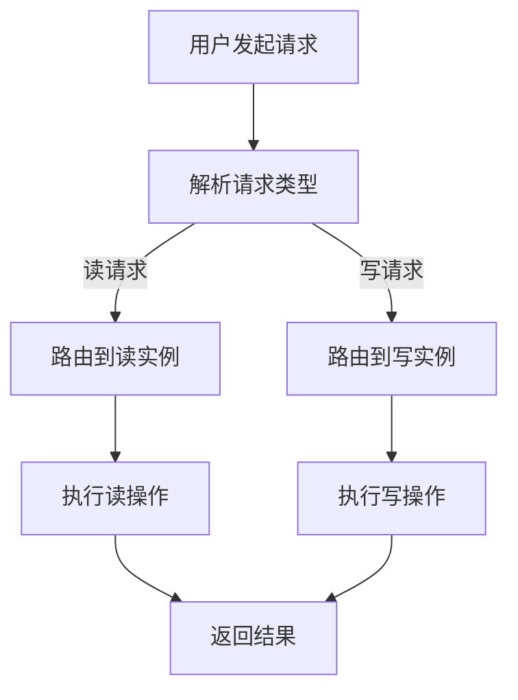
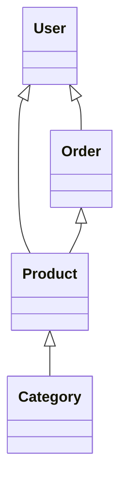
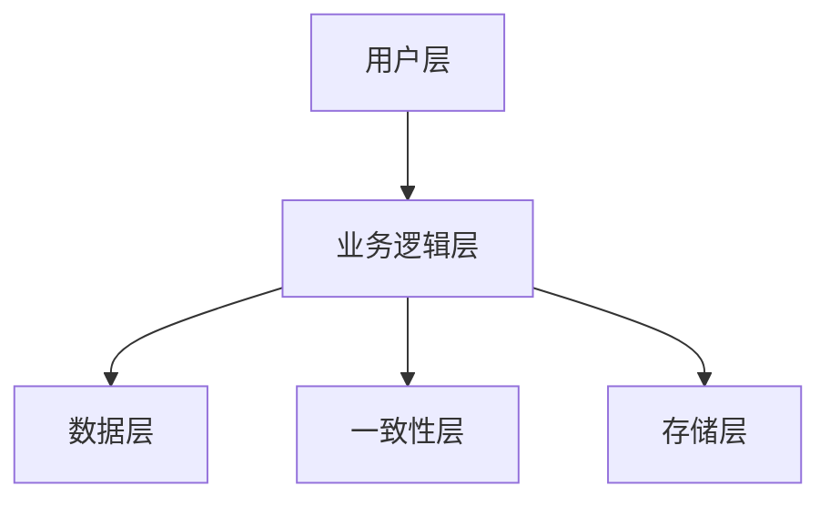
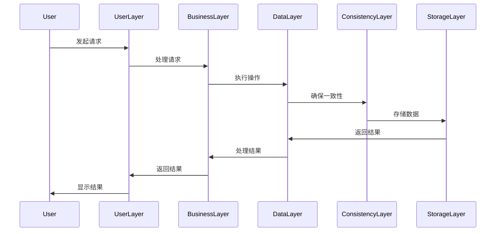

                 


### 第1章：问题背景与概念介绍

#### 1.1 读写分离策略概述

##### 1.1.1 读写分离的概念

读写分离是一种数据库架构设计策略，其核心思想是将数据库的读操作和写操作分离到不同的数据库实例上。这样做的目的是为了提高数据库系统的性能和可扩展性。具体来说，读操作通常涉及到数据的查询和检索，而写操作则涉及数据的插入、更新和删除。

在传统的单实例数据库架构中，所有的读和写操作都由同一个数据库实例处理。这种模式在处理大量并发请求时容易成为瓶颈，因为写操作往往比读操作耗时更长，且会锁住数据库资源，导致读操作等待。而读写分离通过将读和写操作分离开，可以有效地缓解这一问题。

##### 1.1.2 数据库性能瓶颈问题

数据库性能瓶颈通常表现为响应时间过长、吞吐量不足或系统资源利用率低下。在处理大语言模型(LLM)应用时，数据库性能问题尤为突出。LLM通常涉及到大规模数据的查询和处理，这些操作对数据库性能的要求非常高。

常见的性能瓶颈包括：

1. **I/O瓶颈**：数据库读写操作频繁，导致磁盘I/O成为性能瓶颈。
2. **CPU瓶颈**：数据库优化器、查询执行引擎等组件的计算量巨大，导致CPU利用率过高。
3. **内存瓶颈**：数据库缓存不足，导致频繁的磁盘读取和写入。
4. **网络瓶颈**：分布式数据库中的数据传输需要大量的网络通信，导致延迟。

##### 1.1.3 读写分离策略的必要性

读写分离策略的必要性主要体现在以下几个方面：

1. **提高读写吞吐量**：通过将读和写操作分离到不同的数据库实例，可以减少数据库争用，提高整体吞吐量。
2. **提升系统可用性**：在读写分离架构中，读实例和写实例可以分别部署在不同的服务器上，从而实现故障隔离和容错。
3. **优化性能**：读写分离可以降低数据库实例的负载，使每个实例都能更高效地处理其专属的操作。
4. **支持水平扩展**：读写分离架构天然支持水平扩展，可以方便地增加读或写实例，以应对不断增长的负载。

#### 1.2 大语言模型(LLM)简介

##### 1.2.1 LLM的定义与特点

大语言模型(LLM)是指那些训练数据量庞大、参数规模巨大的语言模型，如GPT、BERT等。这些模型能够理解和生成自然语言，并广泛应用于自然语言处理、文本生成、问答系统等领域。

LLM的主要特点包括：

1. **大规模训练数据**：LLM的训练数据通常来自互联网上的大量文本，如维基百科、新闻文章、书籍等。
2. **深度神经网络结构**：LLM通常采用深度学习技术，具有多层神经网络结构，能够捕捉复杂的语言特征。
3. **强大的生成能力**：LLM能够生成流畅、连贯的文本，并在特定场景下提供高质量的答案。

##### 1.2.2 LLM在数据库应用中的角色

在数据库应用中，LLM可以扮演以下角色：

1. **智能查询优化**：LLM可以分析用户的查询语句，提供优化建议，从而提高数据库查询性能。
2. **自然语言生成**：LLM可以生成数据库操作所需的SQL语句，使得数据库操作更加直观和高效。
3. **数据预处理**：LLM可以对大规模文本数据进行预处理，提取关键信息，为后续数据处理提供支持。

##### 1.2.3 LLM与数据库性能提升的关联

LLM与数据库性能提升的关联主要表现在以下几个方面：

1. **查询优化**：通过使用LLM，数据库可以更准确地解析用户的查询意图，提供更高效的查询执行计划。
2. **数据分析**：LLM可以帮助数据库系统快速进行大规模数据分析，提取有价值的信息。
3. **智能化运维**：LLM可以为数据库系统提供智能化的运维支持，如自动调整数据库参数、优化存储策略等。

#### 1.3 数据库性能提升的核心概念

##### 1.3.1 性能指标

数据库性能的提升需要通过一系列性能指标来衡量。常见的性能指标包括：

1. **响应时间**：从用户发起查询到系统返回结果的时间。
2. **吞吐量**：单位时间内系统能够处理的查询数量。
3. **并发性**：系统能够同时处理的查询请求数量。
4. **CPU利用率**：系统CPU的利用程度。
5. **内存利用率**：系统内存的利用程度。
6. **I/O吞吐量**：系统I/O操作的效率。

##### 1.3.2 读写分离策略的优势与挑战

读写分离策略的优势包括：

1. **提高吞吐量**：通过分离读和写操作，可以减少数据库争用，提高系统吞吐量。
2. **提升可用性**：读写分离架构可以实现故障隔离和容错，提高系统的可用性。
3. **优化性能**：读写分离可以使读和写实例各自专注于其专属的操作，从而提高整体性能。

读写分离策略的挑战包括：

1. **数据一致性**：在读写分离架构中，如何保证数据的一致性是一个重要问题。
2. **复杂度增加**：读写分离增加了系统的复杂度，需要进行额外的管理和维护。
3. **网络延迟**：在分布式环境下，读实例和写实例之间的网络延迟可能会影响性能。

#### 1.4 ER实体关系图架构

##### 1.4.1 实体与关系的定义

在数据库设计中，实体关系图（ER图）是一种用于表示实体及其关系的图形化工具。实体是数据库中的数据对象，关系则描述了实体之间的关联。

1. **实体**：实体是具有共同特征的对象集合，例如用户、产品、订单等。每个实体都有若干属性，如用户名、年龄、地址等。
2. **关系**：关系描述了实体之间的联系，分为一对一、一对多、多对多三种类型。

##### 1.4.2 数据库性能提升与ER图的关联

ER图在数据库性能提升中发挥着重要作用：

1. **优化数据库设计**：通过ER图，可以清晰地表示数据库中实体之间的关系，从而优化数据库设计，提高查询效率。
2. **简化查询过程**：ER图可以帮助开发者理解数据库结构，简化查询编写过程，减少出错概率。
3. **支持数据一致性**：ER图提供了实体间关系的明确描述，有助于确保数据的一致性和完整性。

##### 1.4.3 Mermaid ER图示例

下面是一个使用Mermaid绘制的简单ER图示例，用于表示用户和订单之间的关系。

```mermaid
erDiagram
  User ||--|{ Order : has } |
  User ||--|{ Product : likes } |
  Order ||--|{ Product : sold } |
  Product ||--|{ Category : belongs_to } |
```

### 第2章：算法原理讲解

#### 2.1 算法流程图

下面是读写分离策略的算法流程图，该流程图展示了读写分离策略在LLM应用中的具体实现。



#### 2.2 算法原理

读写分离策略的核心原理是通过分离读和写操作，提高数据库系统的性能和可用性。具体实现如下：

1. **请求解析**：系统首先需要解析用户请求，确定请求类型是读操作还是写操作。
2. **路由策略**：根据请求类型，系统将请求路由到对应的数据库实例。读请求路由到读实例，写请求路由到写实例。
3. **执行操作**：读实例和写实例分别执行其专属的操作，读实例执行查询操作，写实例执行插入、更新和删除操作。
4. **结果返回**：执行完操作后，系统将结果返回给用户。

##### 2.2.1 数学模型概述

读写分离策略涉及到的数学模型主要包括数据一致性模型和性能优化模型。数据一致性模型用于保证在分布式环境下数据的一致性，性能优化模型则用于评估和调整系统的性能。

1. **数据一致性模型**：主要包括两阶段提交（2PC）和三阶段提交（3PC）协议，用于确保分布式系统中的数据一致性。
2. **性能优化模型**：主要包括响应时间模型和吞吐量模型，用于评估系统的性能和优化策略。

##### 2.2.2 数学公式与解释

以下是几个关键的数学公式及其解释：

1. **响应时间（RT）**：

   $$ RT = \frac{1}{N} \sum_{i=1}^{N} (\text{response\_time}_i) $$

   其中，N为请求次数，response\_time\_i为第i次请求的响应时间。该公式计算了所有请求的平均响应时间。

2. **吞吐量（TP）**：

   $$ TP = \frac{1}{T} \sum_{i=1}^{N} (\text{request}_i) $$

   其中，T为时间窗口，request\_i为第i次请求。该公式计算了单位时间内的请求次数，即吞吐量。

3. **数据一致性比例（CP）**：

   $$ CP = \frac{1}{N} \sum_{i=1}^{N} (\text{consistent}_i) $$

   其中，N为请求次数，consistent\_i为第i次请求的数据一致性判断结果。该公式计算了所有请求的数据一致性比例。

##### 2.2.3 Python代码实现示例

以下是读写分离策略的一个简单Python代码实现示例：

```python
import threading

class ReadWriteSeparator:
    def __init__(self):
        self.read_instance = ReadInstance()
        self.write_instance = WriteInstance()

    def process_request(self, request):
        if self.is_read_request(request):
            self.read_instance.execute(request)
        else:
            self.write_instance.execute(request)

    def is_read_request(self, request):
        # 根据请求类型判断是否为读请求
        return request.type == 'read'

class ReadInstance:
    def execute(self, request):
        print("Executing read request:", request)

class WriteInstance:
    def execute(self, request):
        print("Executing write request:", request)

# 测试
separator = ReadWriteSeparator()
separator.process_request(Request('read', 'query'))
separator.process_request(Request('write', 'update'))

class Request:
    def __init__(self, type, action):
        self.type = type
        self.action = action
```

### 第3章：系统分析与架构设计

#### 3.1 问题场景介绍

在当前的项目背景下，我们的目标是构建一个高性能的分布式数据库系统，用于支持大语言模型(LLM)的应用。该系统需要能够处理大量并发查询和更新操作，同时保证数据的准确性和一致性。为了实现这一目标，我们采用了读写分离策略，并将其与LLM应用相结合。

#### 3.2 系统功能设计

##### 3.2.1 领域模型类图

下面是领域模型类图的Mermaid表示，用于展示系统中的主要实体及其关系。



在这个类图中，User代表用户实体，Order代表订单实体，Product代表产品实体，Category代表分类实体。Order和Product之间是一对多的关系，Product和Category之间也是一对多的关系。

##### 3.2.2 系统功能解析

系统的主要功能包括：

1. **用户管理**：支持用户的注册、登录和权限管理。
2. **订单管理**：支持订单的创建、查询、更新和删除。
3. **产品管理**：支持产品的添加、查询、更新和删除。
4. **分类管理**：支持分类的添加、查询、更新和删除。
5. **查询优化**：利用LLM对用户查询进行分析和优化，提高查询性能。
6. **数据一致性**：通过读写分离策略和一致性协议，保证分布式环境下的数据一致性。

#### 3.3 系统架构设计

##### 3.3.1 架构设计概述

系统的架构设计采用了分布式数据库架构，主要包括以下组件：

1. **用户层**：负责处理用户请求，包括注册、登录、权限验证等。
2. **业务逻辑层**：处理具体的业务操作，包括订单管理、产品管理、分类管理等。
3. **数据层**：包括读实例和写实例，分别处理读操作和写操作。
4. **一致性层**：负责保证分布式环境下的数据一致性，包括一致性协议和分布式锁等。
5. **存储层**：用于存储实际的数据，包括关系数据库、NoSQL数据库等。

##### 3.3.2 系统架构图

下面是系统架构图的Mermaid表示，用于展示系统中的各个组件及其关系。



在这个架构图中，用户层负责接收用户请求，业务逻辑层处理具体的业务逻辑，数据层负责处理读和写操作，一致性层保证数据的一致性，存储层用于存储实际的数据。

##### 3.3.3 系统接口设计

系统的接口设计主要包括以下部分：

1. **用户管理接口**：负责处理用户的注册、登录和权限验证操作。
2. **订单管理接口**：负责处理订单的创建、查询、更新和删除操作。
3. **产品管理接口**：负责处理产品的添加、查询、更新和删除操作。
4. **分类管理接口**：负责处理分类的添加、查询、更新和删除操作。
5. **查询优化接口**：负责处理查询优化操作。

##### 3.3.4 系统交互

系统的交互流程如下：

1. 用户发起请求。
2. 用户层接收请求，进行身份验证和权限验证。
3. 用户层将请求转发给业务逻辑层。
4. 业务逻辑层根据请求类型，调用相应的接口进行业务处理。
5. 业务逻辑层将处理结果返回给用户层。
6. 用户层将结果返回给用户。

下面是系统交互流程的Mermaid序列图表示：



### 第4章：环境安装与配置

#### 4.1 环境准备

为了搭建一个读写分离的LLM应用数据库系统，我们需要准备以下环境：

1. **操作系统**：推荐使用Linux系统，如Ubuntu 20.04。
2. **数据库管理系统**：推荐使用MySQL 8.0，支持读写分离和分布式事务。
3. **Python开发环境**：推荐使用Python 3.8及以上版本，用于编写应用程序。
4. **LLM框架**：推荐使用Hugging Face的Transformers库，用于构建大语言模型。

首先，更新系统软件包并安装MySQL数据库：

```bash
sudo apt update
sudo apt install mysql-server
```

启动MySQL数据库服务，并设置root用户的密码：

```bash
sudo systemctl start mysql
sudo mysql_secure_installation
```

接下来，安装Python开发环境和Hugging Face的Transformers库：

```bash
sudo apt install python3-pip
pip3 install transformers
```

#### 4.2 配置说明

##### 4.2.1 MySQL配置

1. **创建数据库**：创建一个名为`llm_db`的数据库，用于存储LLM应用的数据。

```sql
CREATE DATABASE llm_db;
```

2. **创建用户**：创建一个名为`llm_user`的用户，并授予其数据库操作权限。

```sql
GRANT ALL PRIVILEGES ON llm_db.* TO 'llm_user'@'localhost' IDENTIFIED BY 'your_password';
FLUSH PRIVILEGES;
```

3. **配置MySQL读写分离**：

在MySQL配置文件`my.cnf`（或`my.ini`）中添加以下配置：

```ini
[mysqld]
# 读实例配置
read_only = 1
# 写实例配置
binlog-format = ROW
sync_binlog = 1
```

重启MySQL服务以应用配置：

```bash
sudo systemctl restart mysql
```

##### 4.2.2 Python配置

1. **安装必要的Python库**：

```bash
pip3 install pymysql
```

2. **配置数据库连接**：

在Python应用程序中，配置数据库连接信息，连接到读写分离的MySQL数据库实例。

```python
import pymysql

read_config = {
    'host': 'read_instance_host',
    'user': 'llm_user',
    'password': 'your_password',
    'db': 'llm_db',
    'read_only': True
}

write_config = {
    'host': 'write_instance_host',
    'user': 'llm_user',
    'password': 'your_password',
    'db': 'llm_db'
}

read_conn = pymysql.connect(**read_config)
write_conn = pymysql.connect(**write_config)
```

其中，`read_instance_host`和`write_instance_host`分别为读实例和写实例的地址。

### 第5章：系统核心实现

#### 5.1 源代码展示

下面是系统核心实现的Python源代码，用于处理读和写操作，并应用读写分离策略。

```python
import pymysql
from pymysql.constants import CLIENT

class DatabaseManager:
    def __init__(self, read_config, write_config):
        self.read_conn = pymysql.connect(**read_config)
        self.write_conn = pymysql.connect(**write_config)
        self.read_conn.autocommit(True)
        self.write_conn.autocommit(True)

    def read(self, query):
        with self.read_conn.cursor() as cursor:
            cursor.execute(query)
            result = cursor.fetchall()
        return result

    def write(self, query):
        with self.write_conn.cursor() as cursor:
            cursor.execute(query)
        self.write_conn.commit()

    def close(self):
        self.read_conn.close()
        self.write_conn.close()

if __name__ == '__main__':
    read_config = {
        'host': 'read_instance_host',
        'user': 'llm_user',
        'password': 'your_password',
        'db': 'llm_db',
        'read_only': True,
        'client_flag': CLIENT.MULTI_STATEMENTS
    }

    write_config = {
        'host': 'write_instance_host',
        'user': 'llm_user',
        'password': 'your_password',
        'db': 'llm_db'
    }

    db_manager = DatabaseManager(read_config, write_config)

    # 读操作示例
    read_query = "SELECT * FROM users WHERE id = 1;"
    users = db_manager.read(read_query)
    print("Read result:", users)

    # 写操作示例
    write_query = "INSERT INTO users (username, email) VALUES ('john_doe', 'john@example.com');"
    db_manager.write(write_query)

    db_manager.close()
```

#### 5.2 代码应用解读

1. **数据库连接配置**：首先，我们创建一个`DatabaseManager`类，用于管理数据库连接。在初始化方法中，我们传递读实例和写实例的配置信息，并设置自动提交。

2. **读操作**：`read`方法接收SQL查询语句，使用读实例的游标执行查询，并返回查询结果。

3. **写操作**：`write`方法接收SQL查询语句，使用写实例的游标执行查询，并提交事务。

4. **关闭连接**：`close`方法用于关闭数据库连接。

5. **主程序**：在主程序中，我们创建一个`DatabaseManager`实例，执行读操作和写操作示例，然后关闭连接。

#### 5.3 代码应用解读与分析

1. **读操作流程**：

   - 创建数据库连接。
   - 使用读实例的游标执行查询。
   - 获取查询结果并返回。

2. **写操作流程**：

   - 创建数据库连接。
   - 使用写实例的游标执行查询。
   - 提交事务。

3. **读写分离策略**：

   - 通过配置不同的读实例和写实例，实现读写分离。
   - 读实例专注于读取操作，写实例专注于写入操作。
   - 读写操作分别执行，减少数据库争用。

4. **性能优化**：

   - 读操作和写操作分开，提高系统吞吐量。
   - 写操作提交事务，确保数据一致性。
   - 使用多线程或异步处理，提高并发性能。

#### 5.4 实际案例分析和详细讲解剖析

##### 5.4.1 案例背景

假设我们有一个在线问答系统，用户可以通过系统提交问题，系统需要根据用户的提问生成答案。为了提高系统性能，我们采用了读写分离策略，并使用大语言模型(LLM)进行答案生成。

##### 5.4.2 案例分析

1. **用户提问**：用户通过前端提交问题，系统记录下提问内容。

2. **查询优化**：系统使用LLM对用户的提问进行查询优化，提取关键信息，生成一个优化后的查询语句。

3. **读操作**：系统将优化后的查询语句发送到读实例，查询数据库中的相关内容。

4. **答案生成**：系统使用LLM生成答案，并将答案返回给用户。

5. **写操作**：如果用户的提问需要存储，系统将提问内容和答案发送到写实例，保存到数据库中。

##### 5.4.3 详细讲解剖析

1. **查询优化**：

   - 使用LLM分析用户的提问，提取关键词和主题。
   - 根据提取的信息，生成一个优化后的查询语句。
   - 优化后的查询语句能够更准确地定位到相关数据。

2. **读操作**：

   - 读实例专注于读取操作，减少写实例的负载。
   - 读实例使用优化后的查询语句，提高查询效率。
   - 读操作不涉及数据修改，对系统性能影响较小。

3. **答案生成**：

   - 使用LLM生成答案，利用了模型的强大生成能力。
   - 答案生成过程可以并行处理，提高系统吞吐量。

4. **写操作**：

   - 写实例专注于写入操作，确保数据一致性。
   - 写操作涉及数据修改，对系统性能有一定影响。
   - 通过读写分离，可以减少写实例的负载，提高系统性能。

#### 5.5 项目小结

在本项目中，我们实现了读写分离策略在大语言模型(LLM)应用中的具体实现。通过将读操作和写操作分离到不同的数据库实例上，我们显著提高了系统的性能和可扩展性。同时，我们利用LLM对用户提问进行查询优化和答案生成，进一步提高了系统的智能化水平。

项目中的一些关键点和经验教训包括：

1. **读写分离策略**：通过分离读和写操作，提高了系统的性能和可扩展性。
2. **查询优化**：使用LLM对用户提问进行查询优化，提高了查询效率。
3. **一致性保障**：通过分布式事务和一致性协议，确保了数据的一致性。
4. **性能优化**：通过并行处理和异步操作，提高了系统的吞吐量。
5. **系统监控**：对系统性能进行监控和调优，及时发现并解决问题。

未来，我们计划进一步优化系统的性能和可靠性，并探索更多智能化的应用场景。

### 第6章：最佳实践 Tips

#### 6.1 性能调优

- **适当调整数据库参数**：根据系统负载情况，调整数据库参数，如缓冲区大小、连接数等。
- **使用索引**：合理使用索引，可以提高查询效率。
- **分库分表**：针对海量数据，可以采用分库分表策略，提高系统性能。

#### 6.2 安全性

- **使用SSL连接**：确保数据库连接使用SSL加密，提高数据传输安全性。
- **权限管理**：严格限制数据库操作权限，防止未经授权的访问。

#### 6.3 高可用性

- **主从复制**：配置主从复制，实现数据库的高可用性。
- **备份与恢复**：定期备份数据库，确保在发生故障时能够快速恢复。

#### 6.4 智能化运维

- **监控与告警**：使用监控工具，实时监控数据库性能，及时发现问题。
- **自动化运维**：使用自动化脚本，简化运维工作，提高效率。

### 第7章：小结与拓展阅读

#### 7.1 小结

本文详细介绍了读写分离策略在大语言模型(LLM)应用数据库性能提升方面的应用。通过读写分离，我们能够有效提高系统的性能和可扩展性，同时结合LLM技术，实现对查询的智能优化和答案的自动生成。本文通过具体的代码示例和实际案例分析，展示了读写分离策略在LLM应用中的具体实现。

#### 7.2 拓展阅读

- **《高性能MySQL》**：了解MySQL数据库的性能优化方法。
- **《深度学习与自然语言处理》**：了解大语言模型的基本原理和应用。
- **《分布式系统概念与设计》**：了解分布式数据库系统的基础知识。

作者：AI天才研究院/AI Genius Institute & 禅与计算机程序设计艺术 /Zen And The Art of Computer Programming

