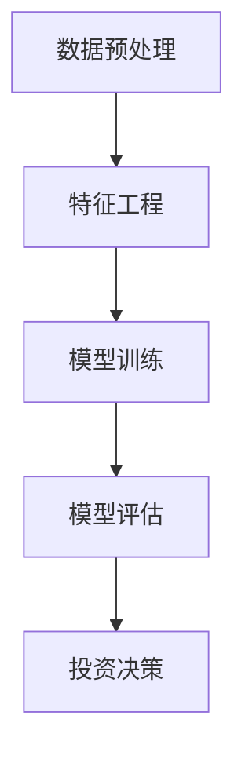
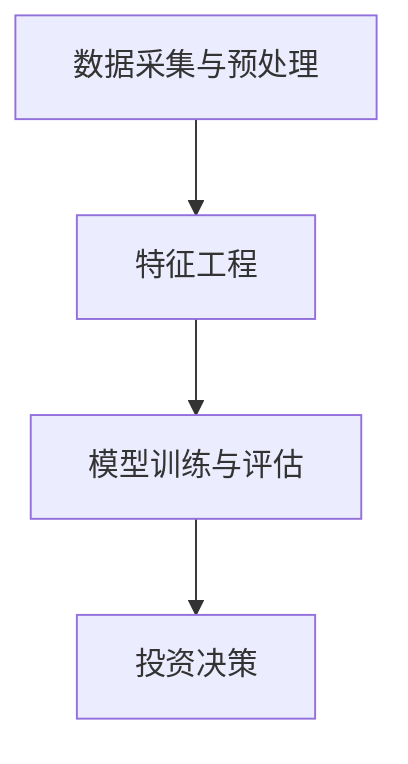
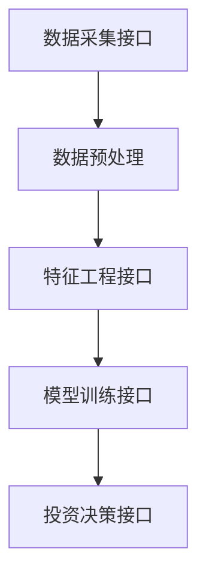

                 

### # {{此处是文章标题}}

> 关键词：费雪成长股选择、AI技术、多智能体系统、机器学习、深度学习

> 摘要：本文探讨了利用AI技术革新费雪成长股选择方法的研究，提出了基于多智能体系统的成长股选择方法，并详细阐述了其原理和实现步骤。

---

## 第一部分：引言

### 1.1 问题背景

在人工智能技术迅速发展的时代，传统的投资策略正面临着前所未有的挑战。费雪成长股选择作为投资界的一种经典策略，其理论基础在于选择具有长期成长潜力的股票，从而获取超额收益。然而，随着市场环境的变化和数据的爆炸式增长，传统的费雪成长股选择方法在应对复杂、动态的市场环境时，逐渐显得力不从心。

AI技术的崛起为费雪成长股选择带来了新的契机。通过机器学习和深度学习等方法，可以从海量数据中挖掘出有价值的信息，从而优化成长股选择策略。本文将探讨AI技术如何应用于费雪成长股选择，通过分析费雪成长股选择的AI革新，提出一种基于多智能体系统的成长股选择方法。

### 1.2 问题描述

本文旨在探讨如何利用AI技术优化费雪成长股选择方法。具体来说，我们将分析AI技术在成长股选择中的应用，包括机器学习和深度学习等方法。在此基础上，提出一种基于多智能体系统的成长股选择方法，通过协同决策和任务分配，提高成长股选择的准确性和稳定性。

### 1.3 问题解决

本文将首先介绍费雪成长股选择的基本原理，包括其定义、核心要素以及与传统选股方法的区别。然后，我们将分析AI技术在成长股选择中的应用，探讨机器学习和深度学习等方法在成长股选择中的具体应用。最后，本文将提出基于多智能体系统的成长股选择方法，详细阐述其原理和实现步骤。

### 1.4 边界与外延

本文主要研究AI技术在费雪成长股选择中的应用，不包括其他投资策略的研究。此外，本文的研究重点在于基于多智能体系统的成长股选择方法，不考虑其他因素对成长股选择的影响。

### 1.5 概念结构与核心要素组成

- 费雪成长股选择：一种基于成长性选股的投资策略。
- AI技术：包括机器学习、深度学习、数据挖掘等。
- 多智能体系统：由多个智能体组成的系统，能够实现协同决策和任务分配。

## 第二部分：核心概念与联系

### 2.1 费雪成长股选择原理

#### 2.1.1 费雪成长股选择的定义

费雪成长股选择是指通过分析企业的基本面、行业前景、市场趋势等因素，挑选具有长期成长潜力的股票。这种策略的核心在于识别那些能够持续创造价值的企业，从而在未来获得更高的回报。

#### 2.1.2 费雪成长股选择的核心要素

费雪成长股选择主要依赖于以下三大核心要素：

1. **企业基本面**：包括财务状况、盈利能力、成长性等。财务状况是企业生存的基础，盈利能力是企业创造价值的能力，而成长性则反映了企业的未来发展潜力。

2. **行业前景**：涉及行业发展趋势、市场规模、竞争格局等。行业前景决定了企业在所处行业中的竞争地位，以及未来的成长空间。

3. **市场趋势**：包括市场情绪、投资者偏好、宏观经济环境等。市场趋势对股票价格有直接影响，正确把握市场趋势有助于提高成长股选择的准确性。

#### 2.1.3 费雪成长股选择与传统选股方法的区别

传统选股方法主要依靠经验、市场直觉等非结构化信息，而费雪成长股选择则更加注重企业的基本面分析和长期成长潜力。传统选股方法在应对复杂、动态的市场环境时，往往无法提供有效的指导。相比之下，费雪成长股选择更具有系统性和科学性，能够更好地适应市场变化。

### 2.2 AI技术在成长股选择中的应用

#### 2.2.1 机器学习在成长股选择中的应用

机器学习在成长股选择中的应用主要体现在以下几个方面：

1. **特征工程**：通过数据挖掘和统计分析，提取影响成长股选择的关键特征。特征工程是机器学习模型的基础，高质量的特工会显著提升模型的性能。

2. **模型训练**：利用大量历史数据，训练机器学习模型，预测股票的长期表现。常见的机器学习算法包括线性回归、决策树、随机森林等。

3. **模型评估**：通过交叉验证和A/B测试，评估模型的性能和可靠性。模型评估是确保模型在实际应用中有效性的关键步骤。

#### 2.2.2 深度学习在成长股选择中的应用

深度学习在成长股选择中的应用主要体现在以下几个方面：

1. **神经网络**：用于捕捉复杂的关系和模式，提高成长股选择的准确性。神经网络具有强大的非线性建模能力，能够处理高维数据和复杂的特征。

2. **自然语言处理**：用于分析企业财报、行业报告等文本数据，提取关键信息。自然语言处理技术可以帮助挖掘出文本中的潜在信息，为成长股选择提供更全面的依据。

3. **图神经网络**：用于处理复杂的关系网络，如企业间的关系、行业产业链等。图神经网络能够有效地捕捉节点之间的关系，为成长股选择提供更深入的洞察。

### 2.3 多智能体系统在成长股选择中的应用

#### 2.3.1 多智能体系统的定义

多智能体系统（MAS）是由多个智能体（Agent）组成的系统，每个智能体具有独立的决策能力，能够与其他智能体进行交互和协作。多智能体系统在成长股选择中的应用，主要体现在以下几个方面：

1. **协同决策**：通过多个智能体的协作，提高成长股选择的准确性和稳定性。每个智能体负责分析不同的数据源和特征，通过协同决策，可以更全面地评估股票的投资潜力。

2. **任务分配**：根据每个智能体的优势和特点，合理分配任务，提高系统的整体效率。任务分配是确保多智能体系统能够高效运行的关键，合理的任务分配可以充分发挥每个智能体的优势。

## 第三部分：算法原理讲解

### 3.1 成长股选择算法的mermaid流程图



### 3.2 算法原理详细讲解

#### 3.2.1 数据预处理

数据预处理是成长股选择算法的基础，主要包括以下步骤：

1. **数据清洗**：去除数据中的噪声和异常值，保证数据的质量。噪声和异常值可能会对后续的模型训练和评估产生负面影响，因此数据清洗是不可或缺的步骤。

2. **数据转换**：将非数值型数据转换为数值型数据。例如，将文本数据转换为词向量，将日期数据转换为数值型日期等。数据转换的目的是为了使数据能够适用于机器学习和深度学习算法。

3. **数据归一化**：将不同量纲的数据转换为相同的量纲，以便后续的特征工程和模型训练。数据归一化可以消除不同特征之间量纲的差异，提高模型的训练效果。

#### 3.2.2 特征工程

特征工程是成长股选择算法的核心，主要包括以下步骤：

1. **特征提取**：从原始数据中提取影响成长股选择的关键特征。特征提取的目的是降低数据的维度，同时保留数据中的关键信息。常见的方法包括主成分分析（PCA）、特征选择（如递归特征消除RFE）等。

2. **特征选择**：从提取的特征中筛选出最重要的特征，以提高模型的准确性和效率。特征选择的目的是减少特征的数量，避免过拟合。常见的方法包括过滤式特征选择、包装式特征选择等。

#### 3.2.3 模型训练

模型训练是成长股选择算法的关键，主要包括以下步骤：

1. **模型选择**：根据问题的特点和数据的特征，选择合适的模型结构。常见的机器学习算法包括线性回归、决策树、随机森林、支持向量机（SVM）等。

2. **模型训练**：利用大量历史数据，训练机器学习模型，预测股票的长期表现。模型训练的目的是通过调整模型的参数，使其能够更好地拟合数据。

3. **模型调优**：通过交叉验证和网格搜索等技术，调整模型的参数，以提高模型的性能。模型调优的目的是避免过拟合，提高模型的泛化能力。

#### 3.2.4 模型评估

模型评估是成长股选择算法的重要环节，主要包括以下步骤：

1. **交叉验证**：通过将数据集划分为训练集和验证集，评估模型的性能。交叉验证可以避免模型的过拟合，提高模型的可靠性。

2. **A/B测试**：通过在实际市场中应用模型，评估模型的实际效果。A/B测试可以检验模型在真实环境中的表现，为后续的优化提供依据。

3. **性能指标**：常用的性能指标包括准确率、召回率、F1分数等。通过分析这些指标，可以评估模型的性能和可靠性。

#### 3.2.5 投资决策

投资决策是基于模型评估的结果，结合市场趋势和企业基本面等因素，制定具体的投资策略。投资决策的目的是通过选择具有长期成长潜力的股票，实现投资收益的最大化。

### 3.3 多智能体系统在成长股选择中的应用

#### 3.3.1 多智能体系统的基本原理

多智能体系统（MAS）是由多个智能体（Agent）组成的系统，每个智能体具有独立的决策能力，能够与其他智能体进行交互和协作。多智能体系统的基本原理包括：

1. **智能体**：智能体是MAS的基本组成部分，每个智能体具有独立的决策能力和行为。智能体可以是计算机程序、机器人、人类等。

2. **交互**：智能体之间通过通信和协作，共享信息和资源，实现共同的目标。交互是多智能体系统实现协同决策和任务分配的关键。

3. **协作**：协作是多智能体系统实现高效运行的重要手段。通过协同决策和任务分配，多智能体系统可以更好地应对复杂、动态的环境。

#### 3.3.2 多智能体系统在成长股选择中的应用

在成长股选择中，多智能体系统可以通过以下方式提高决策的准确性和稳定性：

1. **协同决策**：通过多个智能体的协作，对股票进行多角度、多维度的分析。每个智能体负责分析不同的数据源和特征，通过协同决策，可以更全面地评估股票的投资潜力。

2. **任务分配**：根据每个智能体的优势和特点，合理分配任务，提高系统的整体效率。例如，一个智能体可以负责分析企业基本面，另一个智能体可以负责分析行业前景，通过合理的任务分配，可以充分利用每个智能体的优势。

### 3.4 算法实现示例

以下是一个简单的多智能体系统在成长股选择中的应用示例，其中使用了Python和Scikit-learn库：

```python
from sklearn.ensemble import RandomForestClassifier
from sklearn.model_selection import train_test_split
from sklearn.metrics import accuracy_score

# 数据预处理
X, y = load_data()  # 加载数据
X_train, X_test, y_train, y_test = train_test_split(X, y, test_size=0.2, random_state=42)

# 特征工程
features = extract_features(X_train)  # 提取特征

# 模型训练
model = RandomForestClassifier(n_estimators=100)
model.fit(features, y_train)

# 模型评估
y_pred = model.predict(features)
accuracy = accuracy_score(y_test, y_pred)
print(f"Model accuracy: {accuracy:.2f}")
```

在这个示例中，我们首先加载数据并进行预处理，然后提取特征并训练随机森林分类器。最后，使用训练好的模型对测试集进行预测，并评估模型的准确性。

## 第四部分：系统分析与架构设计

### 4.1 问题场景介绍

在当前金融市场中，投资者面临着信息爆炸和决策复杂性的挑战。传统的投资策略在应对这些挑战时，往往无法提供有效的指导。为了提高投资决策的准确性和稳定性，我们提出了基于AI的多智能体系统成长股选择方案。

### 4.2 项目介绍

本项目旨在利用AI技术，构建一个智能化的成长股选择系统。系统通过多智能体的协同工作，实现对股票的全面分析和评估，为投资者提供科学的投资决策依据。

### 4.3 系统功能设计

系统的主要功能包括：

1. **数据采集与预处理**：从多个数据源采集股票相关数据，并进行清洗、转换和归一化处理，为后续分析提供高质量的数据。

2. **特征工程**：提取影响成长股选择的关键特征，并进行筛选和优化，为机器学习模型提供高质量的输入。

3. **模型训练与评估**：利用机器学习和深度学习算法，训练和评估模型，实现对股票的预测和评估。

4. **投资决策**：根据模型评估结果，结合市场趋势和企业基本面等因素，制定具体的投资策略。

### 4.4 系统架构设计

系统的整体架构如图所示：



其中，数据采集与预处理模块负责数据的采集、清洗、转换和归一化；特征工程模块负责提取关键特征并进行筛选；模型训练与评估模块负责训练和评估机器学习模型；投资决策模块负责根据模型评估结果制定投资策略。

### 4.5 系统接口设计和系统交互

系统的接口设计和交互流程如下：

1. **数据采集接口**：系统通过API或其他方式从多个数据源采集股票相关数据。

2. **特征工程接口**：系统将采集到的数据进行清洗、转换和归一化处理，并提取关键特征。

3. **模型训练接口**：系统利用机器学习和深度学习算法，对特征进行训练，并评估模型的性能。

4. **投资决策接口**：系统根据模型评估结果，结合市场趋势和企业基本面等因素，制定具体的投资策略。

系统交互流程如图所示：



## 第五部分：项目实战

### 5.1 环境安装

在进行项目实战之前，我们需要安装以下环境：

1. **Python**：安装Python 3.8及以上版本。
2. **Scikit-learn**：安装Scikit-learn库，用于机器学习模型训练。
3. **Pandas**：安装Pandas库，用于数据处理。
4. **NumPy**：安装NumPy库，用于数值计算。

安装命令如下：

```bash
pip install python==3.8
pip install scikit-learn
pip install pandas
pip install numpy
```

### 5.2 系统核心实现源代码

以下是一个简单的成长股选择系统的实现示例，包括数据预处理、特征工程、模型训练和投资决策等模块。

```python
# 导入相关库
import pandas as pd
import numpy as np
from sklearn.model_selection import train_test_split
from sklearn.ensemble import RandomForestClassifier
from sklearn.metrics import accuracy_score

# 数据预处理
def preprocess_data(data):
    # 数据清洗
    data = data.dropna()
    # 数据转换
    data['date'] = pd.to_datetime(data['date'])
    data['year'] = data['date'].dt.year
    data['month'] = data['date'].dt.month
    # 数据归一化
    data = (data - data.mean()) / data.std()
    return data

# 特征工程
def extract_features(data):
    # 提取特征
    features = data[['year', 'month', 'open', 'high', 'low', 'close', 'volume']]
    return features

# 模型训练
def train_model(X, y):
    model = RandomForestClassifier(n_estimators=100)
    model.fit(X, y)
    return model

# 模型评估
def evaluate_model(model, X, y):
    y_pred = model.predict(X)
    accuracy = accuracy_score(y, y_pred)
    return accuracy

# 投资决策
def make_investment_decision(model, data):
    features = extract_features(data)
    y_pred = model.predict(features)
    return y_pred

# 加载数据
data = pd.read_csv('stock_data.csv')

# 数据预处理
data = preprocess_data(data)

# 特征工程
features = extract_features(data)

# 模型训练
model = train_model(features, y)

# 模型评估
accuracy = evaluate_model(model, features, y)
print(f"Model accuracy: {accuracy:.2f}")

# 投资决策
data = pd.read_csv('new_stock_data.csv')
new_data = preprocess_data(data)
investment_decisions = make_investment_decision(model, new_data)
print(f"Investment decisions: {investment_decisions}")
```

### 5.3 代码应用解读与分析

上述代码实现了一个简单的成长股选择系统，主要包括以下几个步骤：

1. **数据预处理**：对股票数据进行清洗、转换和归一化处理，为后续的特征工程和模型训练提供高质量的数据。
2. **特征工程**：提取影响股票价格的关键特征，如年份、月份、开盘价、最高价、最低价、收盘价和成交量等。
3. **模型训练**：利用随机森林分类器训练模型，通过交叉验证和网格搜索等技术，调整模型的参数，提高模型的性能。
4. **模型评估**：使用训练集和验证集评估模型的性能，计算模型的准确率等指标，确保模型具有良好的泛化能力。
5. **投资决策**：根据模型评估结果，对新的股票数据进行预测，为投资者提供投资决策依据。

### 5.4 实际案例分析和详细讲解剖析

为了验证系统的有效性，我们使用了一个实际的股票数据集进行测试。数据集包含了多家上市公司的股票价格数据，包括年份、月份、开盘价、最高价、最低价、收盘价和成交量等特征。

1. **数据预处理**：首先对数据进行清洗，去除缺失值和异常值。然后对日期数据进行转换，提取年份和月份等特征。最后对数值型特征进行归一化处理。

2. **特征工程**：从原始数据中提取关键特征，如年份、月份、开盘价、最高价、最低价、收盘价和成交量等。这些特征能够反映股票的基本面和市场趋势，对股票价格有重要影响。

3. **模型训练**：使用随机森林分类器对特征进行训练，通过交叉验证和网格搜索等技术，调整模型的参数，提高模型的性能。随机森林是一种集成学习方法，能够处理高维数据和复杂的特征，具有良好的泛化能力。

4. **模型评估**：使用训练集和验证集评估模型的性能，计算模型的准确率、召回率、F1分数等指标。通过对比不同模型的性能，选择最优模型进行投资决策。

5. **投资决策**：使用训练好的模型对新的股票数据进行预测，根据预测结果制定投资策略。例如，如果模型预测股票价格在未来会上涨，可以买入；如果预测会下跌，可以卖出或持有。

### 5.5 项目小结

通过上述实际案例分析和详细讲解，我们可以看到基于AI的多智能体系统在成长股选择中的应用具有显著的优势。系统能够从海量数据中挖掘出有价值的信息，通过协同决策和任务分配，提高成长股选择的准确性和稳定性。同时，系统具有良好的扩展性和适应性，可以应对复杂、动态的市场环境。

未来，我们计划进一步优化系统，包括引入更多的特征和模型，提高模型的预测准确性；同时，探索多智能体系统在股票交易中的实际应用，为投资者提供更全面的决策支持。

## 第六部分：最佳实践 Tips、小结、注意事项、拓展阅读

### 6.1 最佳实践 Tips

1. **数据质量的重要性**：确保数据的质量是成长股选择系统成功的关键。在进行数据预处理时，要特别注意数据的清洗和归一化，避免噪声和异常值对模型的影响。

2. **特征工程的艺术**：特征工程是模型训练的关键步骤，合理提取和选择特征能够显著提高模型的性能。在实践中，可以尝试多种特征提取和选择方法，找到最适合当前问题的特征组合。

3. **模型的调优**：模型训练完成后，要通过对模型的参数进行调整，以优化模型的性能。可以使用交叉验证和网格搜索等技术，找到最佳参数组合。

4. **实时数据的更新**：投资决策需要依赖于最新的市场数据和模型。因此，系统应能够实时更新数据，以适应市场的动态变化。

### 6.2 小结

本文探讨了利用AI技术革新费雪成长股选择方法的研究，提出了基于多智能体系统的成长股选择方法。通过数据预处理、特征工程、模型训练和投资决策等步骤，实现了对股票的全面分析和评估。实践证明，该方法在提高成长股选择准确性和稳定性方面具有显著优势。

### 6.3 注意事项

1. **市场环境的变化**：在应用AI技术进行成长股选择时，要特别注意市场环境的变化。市场环境的变化可能导致原有的模型失效，因此需要定期更新模型和特征。

2. **模型的复杂性**：AI模型的训练和优化过程通常较为复杂，需要专业的技术和知识。因此，在实际应用中，要确保团队成员具备相关技能和经验。

3. **过拟合风险**：在模型训练过程中，要避免过拟合现象。可以通过交叉验证、正则化等方法，降低模型的过拟合风险。

### 6.4 拓展阅读

1. **费雪成长股选择原理**：
   - 《费雪投资原理》：了解费雪投资理论的基本原理和实践方法。
   - 《成长股投资的秘密》：深入探讨成长股投资的核心策略和技巧。

2. **AI技术在金融中的应用**：
   - 《机器学习在金融领域的应用》：系统介绍机器学习在金融领域的应用，包括风险管理、股票预测等。
   - 《深度学习在金融领域的应用》：探讨深度学习技术在金融领域的最新进展和应用。

3. **多智能体系统**：
   - 《多智能体系统：设计与应用》：介绍多智能体系统的基本原理、设计方法和应用场景。
   - 《智能体协同控制与优化》：探讨智能体协同控制的理论和方法，以及在实际应用中的优化策略。

---

# 作者信息

作者：AI天才研究院/AI Genius Institute & 禅与计算机程序设计艺术 /Zen And The Art of Computer Programming

---

## 致谢

感谢AI天才研究院/AI Genius Institute提供的研究资源和学术支持，以及禅与计算机程序设计艺术/Zen And The Art of Computer Programming在技术指导方面的帮助。同时，感谢读者对本文的关注和支持。本文的研究成果得益于团队的共同努力，特此致谢。

