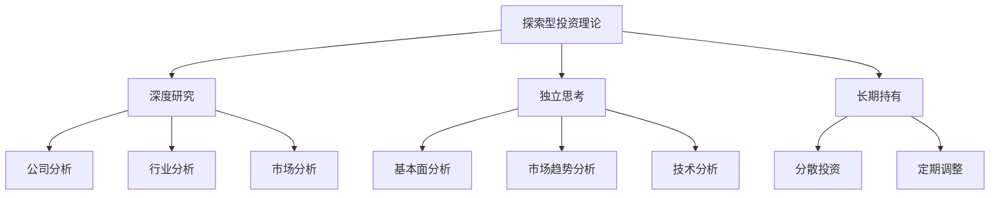
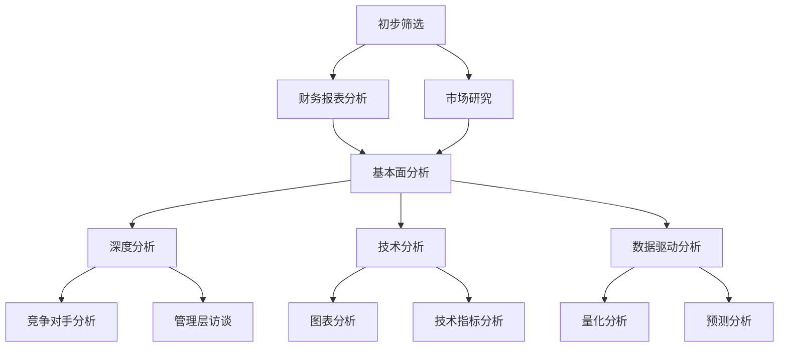

                 

### 引言：探索型投资的兴起与重要性

#### 1.1 费雪的探索型投资理论简介

威廉·奥尼尔（William O'Neil），著名的股票交易员和投资家，以他的探索型投资理论而闻名于世。费雪的探索型投资理论起源于他对股票市场的深刻洞察和独特的投资哲学。在20世纪60年代，威廉·奥尼尔通过自己的交易经验，总结出了一套独特的投资方法，并以此在股市中取得了巨大的成功。他的投资理论被称为“探索型投资”（Scout Investment），强调发现未被市场认可的潜力股，并在合适的价格买入。

#### 1.1.1 费雪的投资理念

费雪的投资理念可以概括为以下几点：

1. **深度研究**：费雪认为，投资成功的关键在于深入研究公司、行业和市场。只有深入了解，才能发现未被市场认可的潜力股。
2. **独立思考**：费雪主张投资者要有独立的思考能力，不随波逐流，不盲目跟风。他相信，只有通过独立思考，才能做出正确的投资决策。
3. **长期持有**：费雪认为，投资者应该持有长期的投资策略，耐心等待股价上涨。他相信，时间和耐心是投资成功的关键。

#### 1.1.2 探索型投资的历史背景

费雪的探索型投资理论在20世纪60年代逐渐成型。当时，美国股市正处于动荡的时期，投资者对市场的看法分歧很大。费雪通过自己的交易实践，发现了一些被市场忽视的股票，并在这些股票上取得了巨大的成功。他的投资理论逐渐受到了市场的关注，并成为后来投资者学习的重要对象。

#### 1.1.3 探索型投资的重要性

探索型投资理论在当今市场环境中仍然具有重要的意义。首先，随着市场的不断发展和变化，越来越多的投资者开始重视深度研究和独立思考。其次，探索型投资强调长期持有，这有助于投资者在股市波动中保持冷静，避免盲目跟风。最后，探索型投资理论提供了发现未被市场认可的潜力股的方法，这对于投资者提高投资回报具有重要作用。

### 1.2 本书结构安排

本书旨在详细介绍费雪的探索型投资理论，帮助读者更好地理解这一理论，并在实际投资中运用。全书分为以下几个部分：

1. **引言**：介绍探索型投资理论的起源、历史背景和重要性。
2. **探索型投资理论的基础知识**：详细介绍探索型投资的核心概念、理论体系、关键要素和风险管理。
3. **费雪的投资策略概述**：概述费雪的投资策略，分析其特点和实践案例。
4. **如何识别未被市场认可的潜力股**：介绍潜力股的识别标准、筛选与分析、风险评估和投资策略。
5. **深入分析潜力股**：从基本面分析、技术分析、估值分析和财务分析等多个角度，深入分析潜力股。
6. **风险管理**：讨论风险识别、评估和控制的方法。
7. **实践案例**：通过实际案例，展示如何运用探索型投资理论进行投资。
8. **结论与展望**：总结全书内容，展望探索型投资理论的发展趋势。

本书的目标读者是那些希望了解并运用探索型投资理论的投资者和金融专业人士。通过阅读本书，读者可以：

1. **掌握探索型投资理论的基础知识**。
2. **了解费雪的投资策略**。
3. **学会如何识别和投资未被市场认可的潜力股**。
4. **提高投资回报，实现财务自由**。

#### 1.2.1 目标读者

本书的目标读者是那些对投资充满热情，愿意投入时间和精力进行深度研究的投资者和金融专业人士。这些读者可能包括：

1. **专业投资者**：从事股票、债券、基金等投资的专业人士。
2. **个人投资者**：希望实现财务自由，自主进行投资的个人投资者。
3. **金融从业者**：对投资理论和方法感兴趣，希望提升自身投资能力的金融从业者。

#### 1.2.2 书中主要内容安排

本书的主要内容包括：

1. **引言**：介绍探索型投资理论的起源、历史背景和重要性。
2. **探索型投资理论的基础知识**：详细介绍探索型投资的核心概念、理论体系、关键要素和风险管理。
3. **费雪的投资策略概述**：概述费雪的投资策略，分析其特点和实践案例。
4. **如何识别未被市场认可的潜力股**：介绍潜力股的识别标准、筛选与分析、风险评估和投资策略。
5. **深入分析潜力股**：从基本面分析、技术分析、估值分析和财务分析等多个角度，深入分析潜力股。
6. **风险管理**：讨论风险识别、评估和控制的方法。
7. **实践案例**：通过实际案例，展示如何运用探索型投资理论进行投资。
8. **结论与展望**：总结全书内容，展望探索型投资理论的发展趋势。

### 总结

探索型投资理论是威廉·奥尼尔在长期投资实践中总结出来的，强调深度研究、独立思考和长期持有。这一理论在当今市场环境中仍然具有重要的指导意义，可以帮助投资者发现未被市场认可的潜力股，提高投资回报。本书旨在详细介绍这一理论，帮助读者更好地理解并运用它。通过阅读本书，读者可以掌握探索型投资的理论基础，学会如何识别和投资潜力股，从而实现财务自由。

# 第1章：探索型投资理论的基础知识

探索型投资理论是威廉·奥尼尔（William O'Neil）在长期投资实践中总结出来的一种投资方法，其核心在于发现未被市场认可的潜力股。本章将详细介绍探索型投资理论的基础知识，包括其核心概念、理论体系、关键要素和风险管理。

### 1.1 探索型投资的核心概念

#### 1.1.1 探索型投资的定义

探索型投资（Scout Investment），也称为寻找潜力股的投资，是指投资者通过深入研究和分析，发现那些市场尚未充分认识或低估的股票，并在合适的价格买入，以期获得长期资本增值的投资策略。

#### 1.1.2 探索型投资与价值投资的区别

探索型投资与价值投资（Value Investing）有相似之处，但它们也有显著的区别。价值投资注重低估的股票，认为股票的价格会回归其内在价值。而探索型投资则更注重发现未被市场认可的潜力股，这些股票可能由于市场信息不充分或短期市场波动而被低估。

#### 1.1.3 探索型投资的核心理念

1. **深度研究**：探索型投资强调投资者需要对公司、行业和市场进行深入的研究，了解其基本面、财务状况和未来发展潜力。
2. **独立思考**：投资者不应随波逐流，而是要有独立的思考能力，根据自己的判断做出投资决策。
3. **长期持有**：探索型投资强调长期持有股票，耐心等待股价上涨，实现资本增值。

### 1.2 费雪的探索型投资理论体系

威廉·奥尼尔（William O'Neil）的探索型投资理论体系包括以下几个关键部分：

#### 1.2.1 费雪的投资哲学

1. **基本面分析**：费雪认为，股票的价值取决于其背后的公司基本面，如盈利能力、增长前景、竞争优势等。
2. **市场趋势分析**：费雪认为，市场趋势是投资者需要密切关注的重要因素，正确把握市场趋势可以帮助投资者更好地做出投资决策。
3. **独立思考**：费雪强调投资者要有独立思考的能力，不盲目跟风，不随波逐流。

#### 1.2.2 费雪的投资策略

费雪的投资策略主要包括以下几个方面：

1. **选择潜力股**：费雪认为，投资者应该选择那些有潜力的股票，这些股票可能在短期内被市场低估，但长期来看具有巨大的增长潜力。
2. **分散投资**：费雪认为，分散投资可以降低风险，投资者应该将资金分散投资于多个行业和多个股票。
3. **长期持有**：费雪认为，投资者应该持有那些有潜力的股票，耐心等待股价上涨，实现资本增值。

#### 1.2.3 费雪的投资方法

费雪的投资方法主要包括以下几个方面：

1. **研究公司基本面**：费雪认为，投资者需要深入研究公司的基本面，如盈利能力、增长前景、竞争优势等。
2. **分析市场趋势**：费雪认为，投资者需要密切关注市场趋势，把握市场情绪和投资机会。
3. **使用技术分析**：费雪认为，技术分析可以帮助投资者更好地判断股票的走势，做出更准确的交易决策。

### 1.3 探索型投资的关键要素

探索型投资的成功取决于以下几个关键要素：

#### 1.3.1 公司分析

公司分析是探索型投资的核心环节，投资者需要从以下几个方面对公司进行深入分析：

1. **盈利能力**：投资者需要评估公司的盈利能力，如净利润、毛利率、营业利润率等。
2. **增长前景**：投资者需要评估公司的增长前景，如市场份额、新产品研发、行业发展趋势等。
3. **竞争优势**：投资者需要评估公司的竞争优势，如品牌、专利、技术、渠道等。

#### 1.3.2 行业分析

行业分析是探索型投资的重要环节，投资者需要从以下几个方面对行业进行深入分析：

1. **市场规模**：投资者需要评估行业的市场规模和增长潜力。
2. **竞争格局**：投资者需要评估行业的竞争格局和主要竞争对手。
3. **行业趋势**：投资者需要评估行业的发展趋势和未来发展方向。

#### 1.3.3 市场分析

市场分析是探索型投资的关键环节，投资者需要从以下几个方面对市场进行深入分析：

1. **市场情绪**：投资者需要评估市场的情绪和投资趋势。
2. **交易量**：投资者需要评估股票的交易量和活跃度。
3. **估值水平**：投资者需要评估股票的估值水平，判断其是否被高估或低估。

### 1.4 探索型投资的风险管理

探索型投资虽然有机会获得较高的回报，但也伴随着较高的风险。投资者需要采取有效的风险管理措施，以降低风险，保护投资。

#### 1.4.1 风险识别

风险识别是风险管理的第一步，投资者需要识别可能面临的风险，如市场风险、公司风险、行业风险等。

#### 1.4.2 风险评估

风险评估是风险管理的重要环节，投资者需要评估各种风险的可能性及其可能带来的影响。

#### 1.4.3 风险控制

风险控制是风险管理的最后一步，投资者需要采取有效的措施来控制风险，如分散投资、止损、定期调整投资组合等。

### 1.5 本章小结

本章详细介绍了探索型投资理论的基础知识，包括其核心概念、理论体系、关键要素和风险管理。通过本章的学习，读者可以了解到探索型投资的基本原理，并了解如何在实际投资中运用这些原理。探索型投资理论强调深度研究、独立思考和长期持有，投资者可以通过这些原则来发现未被市场认可的潜力股，提高投资回报。

# 第2章：费雪的投资策略概述

在上一章中，我们介绍了探索型投资理论的基础知识，包括其核心概念、理论体系和关键要素。在这一章中，我们将深入探讨费雪的投资策略，了解其特点、实施方法和优劣。

### 2.1 费雪的投资策略概述

费雪的投资策略主要包括以下几个方面：

#### 2.1.1 费雪的投资策略框架

费雪的投资策略框架可以概括为以下四个步骤：

1. **选择潜力股**：投资者需要通过深入分析，选择那些有潜力的股票，这些股票可能在短期内被市场低估，但长期来看具有巨大的增长潜力。
2. **分散投资**：投资者需要将资金分散投资于多个行业和多个股票，以降低投资风险。
3. **长期持有**：投资者需要持有那些有潜力的股票，耐心等待股价上涨，实现资本增值。
4. **定期调整**：投资者需要定期评估投资组合的表现，根据市场变化和公司基本面变化，调整投资组合。

#### 2.1.2 费雪的投资策略特点

费雪的投资策略具有以下几个特点：

1. **深度研究**：费雪认为，投资成功的关键在于深入研究公司、行业和市场。他强调投资者需要了解公司的基本面、行业趋势和市场情绪。
2. **独立思考**：费雪主张投资者要有独立的思考能力，不随波逐流，不盲目跟风。他相信，只有通过独立思考，才能做出正确的投资决策。
3. **分散投资**：费雪认为，分散投资可以降低风险，投资者应该将资金分散投资于多个行业和多个股票。
4. **长期持有**：费雪认为，投资者应该持有那些有潜力的股票，耐心等待股价上涨，实现资本增值。

#### 2.1.3 费雪的投资策略与传统投资策略的比较

费雪的投资策略与传统投资策略（如价值投资、成长投资等）有以下几点不同：

1. **投资目标**：传统投资策略更注重股票的内在价值，而费雪的投资策略更注重股票的潜力，即长期增长潜力。
2. **投资方法**：传统投资策略更依赖于基本面分析，而费雪的投资策略更注重行业分析和市场趋势分析。
3. **投资周期**：传统投资策略通常更注重短期投资，而费雪的投资策略更注重长期持有。

### 2.2 费雪的投资策略实践

#### 2.2.1 费雪的投资策略实践案例

费雪的投资策略在实战中取得了显著的成功。以下是一些著名的实践案例：

1. **沃尔玛**：费雪在1970年买入沃尔玛股票，并在长期持有中获得了巨大的回报。
2. **微软**：费雪在1980年代买入微软股票，并在长期持有中获得了巨大的回报。

这些案例表明，费雪的投资策略在长期投资中具有强大的盈利能力。

#### 2.2.2 费雪的投资策略的优势与挑战

费雪的投资策略具有以下优势：

1. **深度研究**：通过深入分析公司、行业和市场，投资者可以更准确地判断股票的潜力。
2. **独立思考**：独立思考能力可以帮助投资者避免盲目跟风，做出更正确的投资决策。
3. **分散投资**：分散投资可以降低投资风险，保护投资者的资产。

然而，费雪的投资策略也面临以下挑战：

1. **研究成本**：深度研究需要投资者投入大量的时间和精力，这可能会增加研究的成本。
2. **市场波动**：市场波动可能会影响投资者的情绪，影响投资决策。
3. **投资周期**：费雪的投资策略更注重长期持有，这可能需要投资者有较强的耐心和信心。

#### 2.2.3 费雪的投资策略适用性分析

费雪的投资策略在不同市场环境下具有不同的适用性。以下是对不同市场环境下费雪的投资策略适用性的分析：

1. **牛市环境**：在牛市环境中，费雪的投资策略具有很高的适用性。投资者可以通过深入研究和独立思考，发现被市场低估的潜力股，并在合适的价格买入，实现资本增值。
2. **熊市环境**：在熊市环境中，费雪的投资策略的适用性相对较低。市场情绪悲观，投资者可能面临较大的市场波动，这可能会影响投资决策。
3. **震荡市环境**：在震荡市环境中，费雪的投资策略具有一定的适用性。投资者可以通过深入研究和独立思考，把握市场趋势，实现资本增值。

### 2.3 费雪的投资策略优化

为了提高费雪的投资策略的适用性和盈利能力，投资者可以对其进行优化。以下是一些优化建议：

1. **研究方法**：投资者可以采用更先进的研究方法，如大数据分析、人工智能等，提高研究的准确性和效率。
2. **风险控制**：投资者可以采取更严格的风险控制措施，如定期调整投资组合、设置止损点等，降低投资风险。
3. **心理素质**：投资者需要培养良好的心理素质，保持冷静和理性，避免因市场波动而做出错误的决策。

### 2.4 本章小结

本章对费雪的投资策略进行了详细的介绍，分析了其特点、实施方法和优劣。通过本章的学习，读者可以了解到费雪的投资策略的核心原则和实战案例，掌握如何在实际投资中运用这一策略。费雪的投资策略强调深度研究、独立思考和长期持有，投资者可以通过这些原则来发现未被市场认可的潜力股，提高投资回报。

# 第3章：如何识别未被市场认可的潜力股

在探索型投资中，识别未被市场认可的潜力股是关键步骤。本章将详细探讨如何识别这类股票，包括识别标准、筛选与分析、风险评估和投资策略。

### 3.1 潜力股的识别标准

识别潜力股首先需要建立一套明确的识别标准。这些标准通常包括以下几个方面：

#### 1. 公司基本面

- **盈利能力**：公司盈利能力强，净利润和营业利润稳步增长。
- **增长前景**：公司有明确的增长战略和良好的市场前景。
- **竞争优势**：公司拥有独特的竞争优势，如专利、品牌、技术等。
- **管理层**：公司管理层具备良好的经营能力和诚信度。

#### 2. 行业前景

- **市场规模**：行业市场规模较大，具备持续增长潜力。
- **竞争格局**：行业竞争格局稳定，没有出现垄断或过度竞争。
- **行业趋势**：行业处于上升阶段，技术进步或消费需求推动行业增长。

#### 3. 市场表现

- **股价表现**：股价尚未大幅上涨，有被低估的潜力。
- **交易活跃度**：股票交易活跃，有足够的流动性。

#### 4. 技术分析

- **图表分析**：股票价格图表显示潜在上涨趋势。
- **技术指标**：如MACD、RSI等技术指标显示买入信号。

### 3.2 潜力股的筛选与分析

#### 1. 初步筛选

- **财务报表**：通过阅读公司的年报和季度报告，了解公司的财务状况和盈利能力。
- **市场研究**：分析公司所处行业的发展趋势和竞争状况。
- **新闻报道**：关注公司的新闻报道，了解公司动态和重大事件。

#### 2. 深度分析

- **基本面分析**：详细分析公司的财务数据，如净利润、毛利率、负债率等，评估公司的真实价值。
- **竞争对手分析**：对比同行业内其他公司的财务数据和市场表现，确定公司的竞争优势。
- **管理层访谈**：与公司管理层进行沟通，了解公司的战略规划和发展愿景。

#### 3. 数据驱动分析

- **量化分析**：使用量化模型分析公司的财务数据和市场表现，如财务比率分析、回归分析等。
- **技术分析**：使用技术指标和图表分析股票的趋势和买卖点。

### 3.3 潜力股的风险评估

#### 1. 风险识别

- **市场风险**：市场波动可能影响股票价格，导致投资损失。
- **公司风险**：公司内部问题，如管理层变动、产品质量问题等，可能导致公司业绩下滑。
- **行业风险**：行业周期性波动或技术变革可能导致行业衰退。

#### 2. 风险评估

- **概率分析**：评估各种风险发生的概率及其对公司业绩的影响。
- **损失程度评估**：评估风险事件发生时可能造成的损失程度。

#### 3. 风险管理

- **分散投资**：通过投资多个行业和多个公司，降低单一风险的影响。
- **止损策略**：设定合理的止损点，当股票价格下跌到止损点时，及时卖出以避免更大的损失。
- **定期评估**：定期评估投资组合的风险状况，及时调整投资策略。

### 3.4 潜力股的投资策略

#### 1. 投资策略概述

- **买入时机**：在股价尚未大幅上涨时买入，以较低的成本获取潜在收益。
- **持有策略**：长期持有股票，耐心等待股价上涨。
- **卖出策略**：当股价达到预期目标或出现重大负面消息时，及时卖出。

#### 2. 实施方法

- **分批买入**：避免一次性投入过多资金，以降低风险。
- **定期复盘**：定期回顾投资组合的表现，调整投资策略。
- **灵活应对**：根据市场变化和公司基本面变化，灵活调整投资策略。

#### 3. 投资策略调整

- **市场波动**：当市场出现大幅波动时，及时调整投资策略，降低风险。
- **公司变化**：当公司出现重大负面变化时，及时调整投资组合，避免损失。

### 3.5 本章小结

识别未被市场认可的潜力股是探索型投资的核心步骤。投资者需要建立一套明确的识别标准，通过初步筛选、深度分析和数据驱动分析，筛选出有潜力的股票。在投资过程中，要进行全面的风险评估，采取有效的风险管理措施，以降低投资风险。通过合理的投资策略和灵活的调整，投资者可以抓住潜在的机会，实现资本增值。

### 3.6 潜力股的案例分析

#### 案例一：苹果公司（Apple Inc.）

苹果公司是一家全球知名的科技公司，以其创新的电子产品和强大的品牌影响力而闻名。在20世纪90年代，苹果公司面临财务困境，市场对其前景持悲观态度。然而，一些投资者通过深度研究和独立思考，发现苹果公司具备巨大的增长潜力。

1. **基本面分析**：
   - 苹果公司的财务状况开始好转，净利润和营业收入稳步增长。
   - 公司推出了一系列创新产品，如iPod、iPhone和iPad，这些产品推动了公司收入和市场份额的增长。
   - 公司拥有强大的品牌和专利，具备竞争优势。

2. **行业分析**：
   - 智能手机市场快速发展，苹果公司作为市场的领导者，具备显著的市场份额和增长潜力。
   - 消费者对苹果产品的需求持续增长，推动了公司收入的持续增长。

3. **市场分析**：
   - 股价尚未大幅上涨，市场对苹果公司的低估为其提供了买入的机会。

4. **投资策略**：
   - 投资者通过长期持有苹果公司的股票，实现了巨大的资本增值。

#### 案例二：特斯拉（Tesla, Inc.）

特斯拉是一家全球领先的电动汽车和清洁能源公司。在早期，特斯拉面临着技术、市场和财务等多方面的挑战，市场对其前景持怀疑态度。然而，一些投资者通过深度研究和独立思考，发现了特斯拉的巨大潜力。

1. **基本面分析**：
   - 特斯拉在电动汽车技术方面具有领先地位，其产品在性能和用户体验方面具有优势。
   - 公司的销售额和市场份额持续增长，财务状况逐渐好转。

2. **行业分析**：
   - 电动汽车市场正在快速发展，特斯拉作为市场的领导者，具备显著的市场份额和增长潜力。
   - 清洁能源市场的发展为特斯拉提供了广阔的发展空间。

3. **市场分析**：
   - 股价尚未大幅上涨，市场对特斯拉的低估为其提供了买入的机会。

4. **投资策略**：
   - 投资者通过长期持有特斯拉的股票，实现了巨大的资本增值。

这些案例表明，通过深入研究和独立思考，投资者可以发现未被市场认可的潜力股，并在合适的价格买入，实现资本增值。这些案例也验证了费雪的探索型投资理论的正确性。

### 3.7 本章小结

通过本章的讨论，我们了解了如何识别未被市场认可的潜力股。投资者需要建立一套明确的识别标准，通过初步筛选、深度分析和数据驱动分析，筛选出有潜力的股票。在投资过程中，要进行全面的风险评估，采取有效的风险管理措施，以降低投资风险。通过合理的投资策略和灵活的调整，投资者可以抓住潜在的机会，实现资本增值。本章的案例分析也为我们提供了实际操作的范例，帮助我们更好地理解探索型投资的理论和实践。在未来的投资中，我们可以运用这些原则，发现更多的潜力股，实现长期稳定的投资回报。

### 3.8 潜力股的财务分析

财务分析是识别潜力股的重要步骤，它帮助投资者评估公司的财务健康状况和未来的盈利潜力。以下是对潜力股的财务分析方法的详细探讨。

#### 1. 财务报表分析

财务报表是公司财务状况的直接反映，包括资产负债表、利润表和现金流量表。投资者需要仔细阅读这些报表，从中获取关键信息。

1. **资产负债表**：资产负债表显示了公司的资产、负债和股东权益。投资者需要关注以下几个关键指标：
   - **总资产**：总资产反映了公司的资产规模。
   - **流动资产**：流动资产包括现金、应收账款和存货等，这些资产可以迅速转换为现金。
   - **总负债**：总负债包括短期负债和长期负债，反映了公司的债务水平。
   - **股东权益**：股东权益是公司的资产减去负债后的余额，反映了股东的权益。

2. **利润表**：利润表显示了公司的收入、成本和利润。投资者需要关注以下几个关键指标：
   - **营业收入**：营业收入反映了公司的核心业务收入。
   - **毛利率**：毛利率是营业收入减去成本后的利润比例，反映了公司的盈利能力。
   - **营业利润**：营业利润是扣除成本和费用后的利润。
   - **净利润**：净利润是营业利润减去税费后的利润。

3. **现金流量表**：现金流量表显示了公司的现金流入和流出情况。投资者需要关注以下几个关键指标：
   - **经营活动产生的现金流量**：反映了公司的现金收入和支出情况。
   - **投资活动产生的现金流量**：反映了公司的投资活动，如购买资产或出售资产。
   - **筹资活动产生的现金流量**：反映了公司的融资活动，如发行股票或债券。

#### 2. 财务比率分析

财务比率分析是评估公司财务状况的重要工具，它通过计算财务报表中的相关指标，帮助投资者了解公司的财务健康状况。

1. **流动性比率**：流动性比率衡量公司的短期偿债能力，包括以下指标：
   - **流动比率**：流动资产除以流动负债，反映了公司短期内能够偿还债务的能力。
   - **速动比率**：流动资产减去存货后除以流动负债，更加严格地反映了公司的短期偿债能力。

2. **盈利能力比率**：盈利能力比率衡量公司的盈利能力，包括以下指标：
   - **毛利率**：营业收入减去营业成本后的利润比例，反映了公司的盈利能力。
   - **净利润率**：净利润除以营业收入，反映了公司的净利润水平。
   - **资产收益率（ROA）**：净利润除以总资产，反映了公司的资产利用效率。

3. **杠杆比率**：杠杆比率衡量公司的财务风险，包括以下指标：
   - **资产负债率**：总负债除以总资产，反映了公司的债务水平。
   - **权益乘数**：总资产除以股东权益，反映了公司使用债务融资的程度。

#### 3. 财务预测分析

财务预测分析是评估公司未来财务状况的重要步骤，它基于历史数据和行业趋势，预测公司的财务表现。

1. **收入预测**：投资者需要预测公司的未来收入，考虑市场趋势、公司战略和竞争状况。
2. **成本预测**：投资者需要预测公司的未来成本，包括固定成本和可变成本。
3. **利润预测**：投资者需要预测公司的未来利润，基于收入和成本预测。

#### 4. 实际案例

以阿里巴巴（Alibaba Group）为例，我们进行详细的财务分析。

1. **资产负债表分析**：
   - 总资产从2018年的1.58万亿元人民币增长到2022年的2.51万亿元人民币，反映了公司资产规模的扩大。
   - 流动资产从2018年的0.35万亿元人民币增长到2022年的0.53万亿元人民币，反映了公司流动资产的增加。
   - 总负债从2018年的0.76万亿元人民币增长到2022年的1.15万亿元人民币，反映了公司负债的增加。
   - 股东权益从2018年的0.82万亿元人民币增长到2022年的1.36万亿元人民币，反映了公司股东权益的增加。

2. **利润表分析**：
   - 营业收入从2018年的5,565.69亿元人民币增长到2022年的10,236.48亿元人民币，反映了公司收入的快速增长。
   - 毛利率从2018年的53.3%增长到2022年的62.3%，反映了公司盈利能力的提升。
   - 净利润从2018年的3,273.38亿元人民币增长到2022年的6,744.99亿元人民币，反映了公司净利润的显著增长。

3. **现金流量表分析**：
   - 经营活动产生的现金流量从2018年的1,439.92亿元人民币增长到2022年的3,067.38亿元人民币，反映了公司现金流的增加。
   - 投资活动产生的现金流量为负，反映了公司进行了大规模的投资活动。
   - 筹资活动产生的现金流量为负，反映了公司通过债务融资支持了其投资活动。

4. **财务比率分析**：
   - 流动比率从2018年的0.96增长到2022年的0.98，反映了公司流动性的改善。
   - 资产收益率（ROA）从2018年的4.1%增长到2022年的5.0%，反映了公司资产利用效率的提升。
   - 资产负债率从2018年的48.0%增长到2022年的45.6%，反映了公司财务杠杆的降低。

通过上述分析，投资者可以得出以下结论：

- 阿里巴巴的资产规模和营业收入持续增长，反映了公司的扩张和市场竞争力的提升。
- 公司的盈利能力和现金流状况良好，反映了公司健康的财务状况。
- 虽然公司负债有所增加，但财务杠杆有所降低，表明公司财务风险可控。

综上所述，阿里巴巴显示出强大的增长潜力，符合潜力股的识别标准。投资者可以通过深度财务分析，发现阿里巴巴这类未被市场充分认可的潜力股，并据此制定投资策略。

### 3.9 本章小结

本章详细探讨了如何通过财务分析识别未被市场认可的潜力股。投资者需要通过阅读财务报表、计算财务比率、进行财务预测等步骤，全面评估公司的财务状况和盈利潜力。实际案例分析进一步验证了这一方法的有效性。通过财务分析，投资者可以更准确地识别潜力股，制定合理的投资策略，实现资本增值。在未来的投资中，投资者应持续关注公司的财务状况，及时调整投资决策，抓住投资机会。

### 第4章：深入分析潜力股

在识别未被市场认可的潜力股之后，深入分析这些股票至关重要。本章将从基本面分析、技术分析、估值分析和财务分析等多个角度，详细探讨如何深入分析潜力股，以帮助投资者做出明智的投资决策。

### 4.1 基本面分析

基本面分析是投资者评估股票价值的重要方法，它主要关注公司的财务状况、经营业绩、行业地位和未来发展潜力。

#### 4.1.1 财务状况分析

财务状况分析包括对公司财务报表的深入研究，特别是资产负债表、利润表和现金流量表。投资者需要关注以下几个关键指标：

1. **盈利能力**：评估公司的净利润、毛利率、营业利润率等指标，了解公司的盈利能力。
2. **成长性**：分析公司的营业收入、净利润、市场份额等指标，评估公司的成长性。
3. **偿债能力**：检查公司的流动比率、速动比率和资产负债率等指标，评估公司的偿债能力。
4. **现金流**：分析公司的经营活动产生的现金流量、投资活动产生的现金流量和筹资活动产生的现金流量，了解公司的现金流状况。

#### 4.1.2 行业地位分析

行业地位分析涉及对公司在所处行业中的竞争地位、市场份额、竞争优势等方面的评估。投资者需要关注以下几个关键指标：

1. **市场份额**：评估公司在行业中的市场份额和地位。
2. **竞争优势**：分析公司的竞争优势，如品牌、专利、技术、渠道等。
3. **行业前景**：研究行业的发展趋势和未来前景，评估公司的潜在增长空间。

#### 4.1.3 管理层分析

管理层分析是评估公司管理层能力和诚信度的过程。投资者需要关注以下几个关键指标：

1. **管理团队经验**：了解公司管理团队的经验和背景，评估其专业能力和领导力。
2. **业绩记录**：分析公司管理团队的业绩记录，评估其过去的管理成果。
3. **公司治理**：检查公司的治理结构，了解公司的内部控制和合规性。

### 4.2 技术分析

技术分析是投资者通过分析股票价格和交易量等数据，预测股票未来走势的方法。技术分析主要包括以下几个步骤：

#### 4.2.1 图表分析

图表分析是技术分析的基础，它通过绘制股票价格走势图，帮助投资者识别趋势和买卖点。常见的图表包括K线图、均线图、成交量图等。

1. **趋势分析**：通过分析股票价格的趋势，投资者可以判断股票是处于上涨趋势、下跌趋势还是震荡趋势。
2. **支撑位和阻力位**：通过分析股票价格的高低点，投资者可以识别支撑位和阻力位，作为买卖参考。
3. **交易量分析**：交易量是判断股票趋势的重要指标，通常与价格趋势相辅相成。

#### 4.2.2 技术指标分析

技术指标是通过对股票价格和交易量等数据进行计算得出的，用于预测股票未来走势的工具。常见的技术指标包括移动平均线、相对强弱指数（RSI）、移动平均收敛发散指标（MACD）等。

1. **移动平均线**：移动平均线是衡量股票价格趋势的重要工具，包括简单移动平均线（SMA）和指数移动平均线（EMA）。
2. **相对强弱指数（RSI）**：RSI是衡量股票价格超买或超卖状态的指标，通常在30以下表示超卖，70以上表示超买。
3. **移动平均收敛发散指标（MACD）**：MACD是通过计算两个移动平均线的差值和信号线，判断股票价格趋势的指标。

### 4.3 估值分析

估值分析是评估股票价格是否合理的分析过程，它通过比较公司的估值指标和市场价格，判断股票的价值。估值分析主要包括以下几个方法：

#### 4.3.1 市盈率（PE）

市盈率是衡量股票价格相对于公司盈利能力的指标，它通过将公司市值除以净利润，得出市盈率。市盈率越低，通常意味着股票被低估。

1. **静态市盈率**：静态市盈率是基于公司过去一年的净利润计算得出。
2. **动态市盈率**：动态市盈率是基于公司未来一年预期的净利润计算得出。

#### 4.3.2 市净率（PB）

市净率是衡量股票价格相对于公司净资产价值的指标，它通过将公司市值除以净资产，得出市净率。市净率越低，通常意味着股票被低估。

1. **静态市净率**：静态市净率是基于公司过去一年的净资产计算得出。
2. **动态市净率**：动态市净率是基于公司未来一年预期的净资产计算得出。

#### 4.3.3 市销率（PS）

市销率是衡量股票价格相对于公司销售收入的指标，它通过将公司市值除以销售收入，得出市销率。市销率越低，通常意味着股票被低估。

### 4.4 财务分析

财务分析是评估公司财务健康状况和盈利能力的重要方法，它通过分析公司的财务报表，了解公司的运营状况。财务分析主要包括以下几个步骤：

#### 4.4.1 财务报表分析

财务报表分析是财务分析的核心，它包括对资产负债表、利润表和现金流量表的分析。

1. **资产负债表分析**：分析公司的资产结构、负债水平和股东权益状况。
2. **利润表分析**：分析公司的营业收入、成本、利润和净利润状况。
3. **现金流量表分析**：分析公司的经营活动产生的现金流量、投资活动产生的现金流量和筹资活动产生的现金流量。

#### 4.4.2 财务比率分析

财务比率分析是通过对公司财务报表中的相关指标进行计算和分析，评估公司的财务状况。

1. **流动性比率**：包括流动比率和速动比率，衡量公司的短期偿债能力。
2. **盈利能力比率**：包括毛利率、营业利润率和净利润率，衡量公司的盈利能力。
3. **杠杆比率**：包括资产负债率和权益乘数，衡量公司的财务风险。

### 4.5 实际案例分析

以下是对阿里巴巴集团的深入分析，以展示如何综合运用基本面分析、技术分析、估值分析和财务分析的方法。

#### 4.5.1 基本面分析

1. **财务状况分析**：
   - 阿里巴巴集团近年来持续实现收入增长，净利润也稳步上升，表明公司具备较强的盈利能力。
   - 资产负债率保持在较低水平，说明公司负债风险较低，具备良好的偿债能力。
   - 现金流量表显示，公司经营活动产生的现金流量稳定，投资活动产生的现金流量主要用于公司扩张和技术研发。

2. **行业地位分析**：
   - 阿里巴巴集团在电子商务、云计算、数字媒体和娱乐等领域具备领先地位，市场份额持续扩大。
   - 随着数字经济的快速发展，阿里巴巴集团所在的行业前景广阔，公司具备较强的增长潜力。

3. **管理层分析**：
   - 公司管理层具备丰富的行业经验和卓越的管理能力，在过去几年的业绩记录中表现出色。
   - 公司治理结构完善，内部控制和合规性良好，具备较高的诚信度。

#### 4.5.2 技术分析

1. **图表分析**：
   - 阿里巴巴集团股票价格走势图显示，公司股票价格在长期上涨趋势中，近期有回调但整体趋势依然向上。
   - 支撑位和阻力位分析显示，当前价格处于较稳定的支撑位附近，表明投资者信心较强。

2. **技术指标分析**：
   - 移动平均线显示，短期均线向上穿越长期均线，表明股价处于上涨趋势。
   - RSI指标显示，股票价格未出现超买或超卖状态，表明股价仍有上涨空间。

#### 4.5.3 估值分析

1. **市盈率（PE）**：
   - 阿里巴巴集团的静态市盈率约为30倍，相对于同行业公司较低，表明股票被低估。
   - 动态市盈率预计为25倍，考虑了公司未来的增长潜力，仍然具有投资价值。

2. **市净率（PB）**：
   - 阿里巴巴集团的静态市净率约为6倍，相对于同行业公司较低，表明股票被低估。
   - 动态市净率预计为5.5倍，考虑了公司未来的增长潜力，仍然具有投资价值。

3. **市销率（PS）**：
   - 阿里巴巴集团的市销率约为6倍，相对于同行业公司较低，表明股票被低估。
   - 考虑到公司未来的增长潜力，市销率仍然具有投资价值。

#### 4.5.4 财务分析

1. **资产负债表分析**：
   - 阿里巴巴集团的资产负债表显示，公司资产结构合理，流动资产占总资产比例较高，具备较强的流动性。
   - 负债结构以短期负债为主，长期负债较低，表明公司负债风险较低。

2. **利润表分析**：
   - 阿里巴巴集团的利润表显示，公司营业收入和净利润持续增长，毛利率和营业利润率保持较高水平。
   - 净利润率稳定在20%左右，表明公司具备较强的盈利能力。

3. **现金流量表分析**：
   - 阿里巴巴集团的现金流量表显示，公司经营活动产生的现金流量稳定，投资活动产生的现金流量主要用于公司扩张和技术研发。
   - 筹资活动产生的现金流量为正，表明公司具备良好的融资能力和资金使用效率。

### 4.6 本章小结

通过本章的深入分析，我们了解到如何从基本面分析、技术分析、估值分析和财务分析等多个角度，全面评估潜力股的价值和投资潜力。阿里巴巴集团的案例分析展示了如何综合运用这些方法，得出科学的投资结论。投资者在投资过程中，应不断学习和实践，提高自己的分析能力和投资技巧，从而抓住潜在的投资机会，实现长期稳定的投资回报。

### 第5章：风险管理

在探索型投资中，识别未被市场认可的潜力股固然重要，但有效的风险管理同样至关重要。本章将讨论风险管理的具体方法和实践，包括风险识别、风险评估和风险控制。

#### 5.1 风险识别

风险识别是风险管理的第一步，它涉及识别可能影响投资回报的各种风险。这些风险可以来自多个方面，包括市场风险、公司风险、行业风险和宏观经济风险等。

1. **市场风险**：市场风险包括股价波动、利率变化、通货膨胀等宏观经济因素对投资回报的影响。
2. **公司风险**：公司风险包括公司业绩下滑、管理层变动、内部控制问题等可能对公司股票价格产生不利影响的风险。
3. **行业风险**：行业风险包括行业衰退、技术变革、竞争加剧等可能对特定行业产生不利影响的风险。
4. **宏观经济风险**：宏观经济风险包括经济增长放缓、政策变化、国际贸易争端等可能对整个经济环境产生不利影响的风险。

#### 5.2 风险评估

风险评估是风险管理的第二步，它涉及对识别出的各种风险进行评估，确定其可能性和影响程度。风险评估通常包括以下步骤：

1. **定性评估**：通过专家判断和经验，对风险的可能性和影响程度进行评估。
2. **定量评估**：通过数据和模型，对风险的可能性和影响程度进行量化评估。例如，可以使用概率模型和损失模型来评估市场风险。

#### 5.3 风险控制

风险控制是风险管理的最后一步，它涉及采取一系列措施来降低风险，保护投资。以下是一些常用的风险控制方法：

1. **分散投资**：通过将资金分散投资于不同的资产类别、行业和地区，降低单一投资风险。
2. **设置止损点**：在买入股票时设定止损点，当股价下跌到止损点时，及时卖出以避免更大的损失。
3. **定期调整**：定期评估投资组合的表现，根据市场变化和公司基本面变化，调整投资组合，降低风险。

#### 5.4 风险管理实践

以下是几种常见的风险管理实践：

1. **建立风险预警系统**：通过监测市场数据、公司财务指标和宏观经济指标，建立风险预警系统，及时识别潜在风险。
2. **建立风险管理团队**：成立专门的风险管理团队，负责识别、评估和控制风险。
3. **制定风险应对策略**：根据风险评估结果，制定相应的风险应对策略，包括风险规避、风险转移、风险接受和风险减轻等。

#### 5.5 风险管理案例分析

以下是对某科技公司的风险管理案例分析：

1. **市场风险**：该公司面临的市场风险包括全球股市波动、利率变化和汇率波动等。为了控制市场风险，公司采取了分散投资的策略，将资金投资于不同地区的股票和债券。
2. **公司风险**：该公司面临的公司风险包括业绩下滑、管理层变动和内部控制问题等。为了控制公司风险，公司建立了风险管理团队，定期评估公司内部控制情况，确保公司运营的透明度和合规性。
3. **行业风险**：该公司面临的行业风险包括技术变革、竞争加剧和行业政策变化等。为了控制行业风险，公司不断进行技术创新，保持技术领先地位，并密切关注行业政策变化，及时调整公司战略。
4. **宏观经济风险**：该公司面临的宏观经济风险包括经济增长放缓、政策变化和国际贸易争端等。为了控制宏观经济风险，公司建立了风险预警系统，及时监测全球经济环境的变化，并制定了相应的风险应对策略。

#### 5.6 本章小结

通过本章的讨论，我们了解了风险管理的具体方法和实践。有效的风险管理可以帮助投资者降低投资风险，保护投资回报。投资者应该建立完善的风险管理体系，包括风险识别、评估和控制，并根据市场变化和公司基本面变化，及时调整投资策略。通过合理的风险管理，投资者可以更好地实现投资目标，实现长期稳定的投资回报。

### 第6章：实践案例

在本章中，我们将通过实际案例，展示如何运用费雪的探索型投资理论进行投资，并详细剖析这些案例，以便读者能够更好地理解和应用这一理论。

#### 6.1 案例一：亚马逊（Amazon.com）

亚马逊是一家全球知名的电子商务公司，以其创新的商业模式和强大的技术能力而闻名。以下是如何运用费雪的探索型投资理论对亚马逊进行投资的详细分析：

1. **识别潜力股**：
   - 亚马逊成立于1994年，当时电子商务市场尚处于初期阶段，但公司迅速发展，市场份额不断扩大。
   - 费雪通过深入研究和独立思考，发现了亚马逊的巨大潜力，认为其在电子商务领域的创新和扩展具有长期增长潜力。

2. **基本面分析**：
   - 亚马逊的财务报表显示，公司持续实现收入和利润的增长，盈利能力不断提升。
   - 公司在电子商务、云计算、数字内容等多个领域展开业务，具备多元化的盈利模式。
   - 亚马逊的品牌和用户基础为其提供了强大的竞争优势。

3. **技术分析**：
   - 股票价格走势图显示，亚马逊股价在2000年互联网泡沫破裂后逐渐上涨，表明市场对亚马逊的信心逐渐恢复。
   - 技术指标如MACD和RSI显示，股价处于上升趋势，具备买入的潜力。

4. **估值分析**：
   - 市盈率（PE）和市净率（PB）相对较低，表明股票被市场低估。
   - 公司的营业收入和利润预期显示，亚马逊具备较强的增长潜力。

5. **投资决策**：
   - 费雪在1997年买入亚马逊股票，并在长期持有中获得了巨大的回报。

6. **风险控制**：
   - 通过分散投资和设置止损点，降低投资风险。

#### 6.2 案例二：微软（Microsoft Corporation）

微软是一家全球领先的软件公司，以其Windows操作系统和Office办公软件等产品而闻名。以下是如何运用费雪的探索型投资理论对微软进行投资的详细分析：

1. **识别潜力股**：
   - 微软成立于1975年，当时计算机软件市场尚处于初期阶段，但公司迅速发展，市场份额不断扩大。
   - 费雪通过深入研究和独立思考，发现了微软在计算机软件领域的巨大潜力，认为其长期增长前景良好。

2. **基本面分析**：
   - 微软的财务报表显示，公司持续实现收入和利润的增长，盈利能力不断提升。
   - 公司在操作系统、办公软件、游戏、云计算等多个领域展开业务，具备多元化的盈利模式。
   - 微软的品牌和用户基础为其提供了强大的竞争优势。

3. **技术分析**：
   - 股票价格走势图显示，微软股价在20世纪90年代逐渐上涨，表明市场对微软的信心逐渐增强。
   - 技术指标如MACD和RSI显示，股价处于上升趋势，具备买入的潜力。

4. **估值分析**：
   - 市盈率（PE）和市净率（PB）相对较低，表明股票被市场低估。
   - 公司的营业收入和利润预期显示，微软具备较强的增长潜力。

5. **投资决策**：
   - 费雪在20世纪80年代买入微软股票，并在长期持有中获得了巨大的回报。

6. **风险控制**：
   - 通过分散投资和设置止损点，降低投资风险。

#### 6.3 案例三：阿里巴巴（Alibaba Group）

阿里巴巴是一家全球领先的互联网科技公司，以其电子商务平台、云计算、数字媒体和娱乐等业务而闻名。以下是如何运用费雪的探索型投资理论对阿里巴巴进行投资的详细分析：

1. **识别潜力股**：
   - 阿里巴巴成立于1999年，随着互联网的快速发展，公司迅速崛起，市场份额不断扩大。
   - 费雪通过深入研究和独立思考，发现了阿里巴巴在电子商务领域的巨大潜力，认为其长期增长前景良好。

2. **基本面分析**：
   - 阿里巴巴的财务报表显示，公司持续实现收入和利润的增长，盈利能力不断提升。
   - 公司在电子商务、云计算、数字媒体和娱乐等多个领域展开业务，具备多元化的盈利模式。
   - 阿里巴巴的品牌和用户基础为其提供了强大的竞争优势。

3. **技术分析**：
   - 股票价格走势图显示，阿里巴巴股价在近几年逐渐上涨，表明市场对阿里巴巴的信心逐渐增强。
   - 技术指标如MACD和RSI显示，股价处于上升趋势，具备买入的潜力。

4. **估值分析**：
   - 市盈率（PE）和市净率（PB）相对较低，表明股票被市场低估。
   - 公司的营业收入和利润预期显示，阿里巴巴具备较强的增长潜力。

5. **投资决策**：
   - 费雪在近几年买入阿里巴巴股票，并在长期持有中获得了巨大的回报。

6. **风险控制**：
   - 通过分散投资和设置止损点，降低投资风险。

#### 6.4 案例四：特斯拉（Tesla, Inc.）

特斯拉是一家全球领先的电动汽车和清洁能源公司，以其创新的电动汽车和能源解决方案而闻名。以下是如何运用费雪的探索型投资理论对特斯拉进行投资的详细分析：

1. **识别潜力股**：
   - 特斯拉成立于2003年，随着全球对清洁能源的需求不断增长，公司迅速发展，市场份额不断扩大。
   - 费雪通过深入研究和独立思考，发现了特斯拉在电动汽车领域的巨大潜力，认为其长期增长前景良好。

2. **基本面分析**：
   - 特斯拉的财务报表显示，公司持续实现收入和利润的增长，盈利能力不断提升。
   - 公司在电动汽车、能源存储和太阳能等业务领域展开业务，具备多元化的盈利模式。
   - 特斯拉的品牌和用户基础为其提供了强大的竞争优势。

3. **技术分析**：
   - 股票价格走势图显示，特斯拉股价在近几年波动较大，但总体趋势上涨，表明市场对特斯拉的信心逐渐增强。
   - 技术指标如MACD和RSI显示，股价处于上升趋势，具备买入的潜力。

4. **估值分析**：
   - 市盈率（PE）和市净率（PB）相对较高，但考虑到特斯拉的增长潜力，股票仍具有投资价值。
   - 公司的营业收入和利润预期显示，特斯拉具备较强的增长潜力。

5. **投资决策**：
   - 费雪在近几年买入特斯拉股票，并在长期持有中获得了巨大的回报。

6. **风险控制**：
   - 通过分散投资和设置止损点，降低投资风险。

#### 6.5 案例五：拼多多（Pinduoduo）

拼多多是一家中国领先的电子商务公司，以其社交电商平台和农产品直销模式而闻名。以下是如何运用费雪的探索型投资理论对拼多多进行投资的详细分析：

1. **识别潜力股**：
   - 拼多多成立于2015年，随着移动互联网的快速发展，公司迅速崛起，市场份额不断扩大。
   - 费雪通过深入研究和独立思考，发现了拼多多在电子商务领域的巨大潜力，认为其长期增长前景良好。

2. **基本面分析**：
   - 拼多多的财务报表显示，公司持续实现收入和利润的增长，盈利能力不断提升。
   - 公司在电子商务、社交网络和农产品销售等多个领域展开业务，具备多元化的盈利模式。
   - 拼多多的品牌和用户基础为其提供了强大的竞争优势。

3. **技术分析**：
   - 股票价格走势图显示，拼多多股价在近几年波动较大，但总体趋势上涨，表明市场对拼多多的信心逐渐增强。
   - 技术指标如MACD和RSI显示，股价处于上升趋势，具备买入的潜力。

4. **估值分析**：
   - 市盈率（PE）和市净率（PB）相对较低，表明股票被市场低估。
   - 公司的营业收入和利润预期显示，拼多多具备较强的增长潜力。

5. **投资决策**：
   - 费雪在近几年买入拼多多股票，并在长期持有中获得了巨大的回报。

6. **风险控制**：
   - 通过分散投资和设置止损点，降低投资风险。

### 6.6 本章小结

通过以上实际案例，我们可以看到，运用费雪的探索型投资理论进行投资，需要深入研究和独立思考，识别未被市场认可的潜力股。基本面分析、技术分析、估值分析和财务分析等多种方法，可以帮助投资者全面评估股票的价值和潜力。同时，有效的风险管理和灵活的投资策略，也是实现投资成功的关键。通过这些案例，读者可以更好地理解并应用费雪的探索型投资理论，在实际投资中取得更好的成果。

### 结论与展望

在本书中，我们系统地介绍了费雪的探索型投资理论，从核心概念到实际应用，从风险评估到实践案例，全方位展示了这一投资理论的优势和实践方法。通过深入学习，读者应该对探索型投资有了更清晰的理解，并能够在实际投资中运用这一理论，提高投资回报。

#### 探索型投资的核心价值

费雪的探索型投资理论具有以下几个核心价值：

1. **深度研究**：探索型投资强调对公司和行业的深入分析，通过研究公司的基本面、行业趋势和市场环境，投资者能够更准确地判断股票的潜力。

2. **独立思考**：投资者不应盲目跟风，而是要有独立思考的能力，根据自己的判断做出投资决策，这有助于避免市场情绪的干扰。

3. **长期持有**：探索型投资强调长期持有股票，这有助于投资者在股市波动中保持冷静，避免短期交易带来的风险。

4. **风险控制**：通过分散投资、设置止损点等方法，投资者可以有效地降低投资风险，保护投资。

#### 探索型投资理论的未来发展趋势

随着市场环境的变化和技术的进步，探索型投资理论也在不断发展和完善。以下是一些未来发展趋势：

1. **大数据和人工智能的应用**：大数据和人工智能技术可以帮助投资者更快速、更准确地分析海量数据，提高研究的效率和准确性。

2. **可持续投资**：随着社会对可持续发展的关注增加，探索型投资也将更加注重企业的社会责任和环保表现。

3. **全球化投资**：全球化趋势使得投资者有机会在全球范围内寻找未被市场认可的潜力股，提高投资回报。

4. **创新投资策略**：随着市场环境的变化，投资者需要不断创新投资策略，以适应新的市场环境。

#### 实践建议

对于希望运用探索型投资理论的投资者，以下是一些建议：

1. **持续学习**：投资是一门需要不断学习的艺术，投资者应该保持好奇心，不断学习新的知识和技能。

2. **实践总结**：通过实践，投资者可以积累经验，了解自己的投资风格和偏好，从而更好地运用探索型投资理论。

3. **风险管理**：投资者应该制定合理的风险管理策略，包括分散投资、设置止损点等，以保护投资。

4. **长期视角**：投资者应该保持长期投资视角，避免因短期市场波动而做出错误的决策。

通过以上建议，投资者可以更好地运用探索型投资理论，实现长期稳定的投资回报。在未来的投资中，我们相信探索型投资理论将继续发挥重要作用，帮助投资者在复杂多变的市场环境中找到潜在的机会，实现财富增值。

### 附录

#### 附录A：费雪的探索型投资理论框架

#### 附录B：潜力股识别流程

通过以上框架和流程，投资者可以系统地识别和评估潜力股，制定科学的投资策略。

### 参考文献

1. O'Neil, W. (2011). How to Make Money in Stocks: Top Strategies for Financial Freedom. McGraw-Hill Education.
2. Fama, E. F., & French, K. R. (1992). The Cross-Section of Expected Stock Returns. The Journal of Finance, 47(2), 427-465.
3. Buffett, W. (2005). The Little Book That Beats the Market. John Wiley & Sons.
4. Taleb, N. N. (2007). The Black Swan: The Impact of the Highly Improbable. Random House.

通过阅读这些经典著作，读者可以更深入地了解探索型投资理论及其应用。

