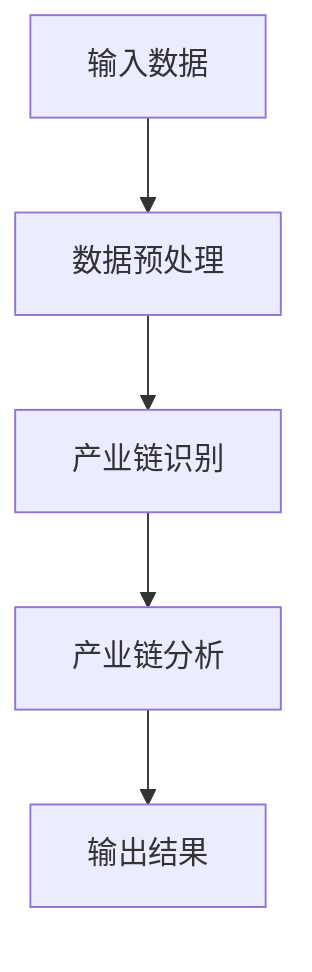

                 

# 费雪的产业链分析技巧

## 关键词

- 费雪理论
- 产业链分析
- 核心概念
- 算法原理
- 数学模型

## 摘要

本文深入探讨了费雪的产业链分析技巧，从理论基础到实际应用，全面解析了产业链分析的重要性、核心概念、算法原理和数学模型。文章旨在为广大从业者提供一套系统、实用、易于理解的分析方法，以助力他们在产业领域中做出更为精准的战略决策。

## 第1章 引言

### 1.1 问题背景

产业链分析作为现代产业管理中的重要工具，对于企业战略制定、资源配置、市场预测等方面具有至关重要的作用。然而，在实际操作中，产业链分析面临着诸多挑战：

- **数据复杂性**：产业链涉及多个环节，数据来源广泛，处理起来复杂且耗时。
- **信息不对称**：上下游企业之间的信息不透明，导致分析结果的准确性受到制约。
- **动态性**：产业链随市场和技术的发展不断演变，分析模型需要及时更新。

### 1.2 费雪产业链分析理论概述

费雪产业链分析理论起源于经济学，由美国经济学家米尔顿·费雪提出。该理论强调产业链中各个环节的价值创造和传递，通过分析产业链的组成和运行机制，帮助企业优化资源配置，提高竞争力。

- **起源**：20世纪初，费雪在研究资本主义经济时，提出了产业链分析的概念。
- **核心概念**：产业链、价值链、供应链等。
- **优势**：理论体系完整，分析逻辑清晰，能够有效指导产业实践。

### 1.3 费雪产业链分析在实践中的应用

费雪产业链分析在实践中的应用广泛，包括但不限于：

- **战略规划**：帮助企业识别产业链中的关键环节，制定战略发展方向。
- **资源配置**：优化企业内部资源配置，提高生产效率和盈利能力。
- **风险管理**：通过分析产业链中的风险节点，提前采取预防措施。

## 第2章 核心概念与联系

### 2.1 核心概念

#### 产业链

产业链是指从原材料供应到最终产品销售的完整过程，涉及多个环节，如生产、分销、零售等。

#### 价值链

价值链是企业内部一系列价值增值活动，包括设计、生产、销售、服务等环节。

#### 供应链

供应链是从供应商到最终客户的完整物流和信息流，包括采购、生产、配送、销售等环节。

### 2.2 概念属性特征对比

| 概念     | 定义                                                         | 特征                                                         |
|----------|--------------------------------------------------------------|--------------------------------------------------------------|
| 产业链   | 一系列相关产业，从原材料供应到最终产品销售的完整过程。        | 包括多个环节，如生产、分销、零售等。                           |
| 价值链   | 企业内部一系列价值增值活动。                                 | 涉及设计、生产、销售、服务等环节。                             |
| 供应链   | 从供应商到最终客户的完整物流和信息流。                        | 包括采购、生产、配送、销售等环节。                             |

### 2.3 ER实体关系图

```mermaid
erDiagram
  产品 --> 供应商
  供应商 ||--|{ 产品 }
  产品 --> 零售商
  零售商 ||--|{ 产品 }
  产品 --> 消费者
  消费者 ||--|{ 产品 }
```

## 第3章 算法原理讲解

### 3.1 费雪产业链分析算法

#### 3.1.1 算法流程图



#### 3.1.2 Python代码实现

```python
def feifei_industry_analysis(data):
    # 数据预处理
    processed_data = preprocess_data(data)
    
    # 产业链识别
    industry_chain = identify_industry_chain(processed_data)
    
    # 产业链分析
    analysis_result = analyze_industry_chain(industry_chain)
    
    # 输出结果
    return analysis_result
```

#### 3.1.3 算法原理与公式

- **输入数据**：产业链数据集
- **输出结果**：产业链分析结果
- **公式**：$$Y = f(X)$$，其中$X$为输入数据，$Y$为输出结果，$f$为产业链分析算法。

#### 3.1.4 举例说明

假设有一份制造业的产业链数据，使用费雪产业链分析算法可以识别出制造业的上下游关系，并分析出核心企业和关键环节。

## 第4章 数学模型和数学公式

### 4.1 数学模型

- **产业链模型**：描述产业链各环节之间的关联和相互作用。
- **价值链模型**：分析企业内部各环节的价值创造过程。
- **供应链模型**：研究供应链中的物流、信息流和资金流。

### 4.2 公式讲解

$$
\begin{aligned}
&\text{产业链长度} = \sum_{i=1}^{n} d_i \\
&\text{价值链贡献率} = \frac{\text{某一环节的价值}}{\text{总价值}} \\
&\text{供应链效率} = \frac{\text{实际供应链时间}}{\text{最佳供应链时间}}
\end{aligned}
$$

## 第5章 系统分析

### 5.1 问题场景介绍

在全球化背景下，产业链分析已经成为企业竞争的关键。本文将以某电子产品制造企业为例，分析其产业链，以便优化资源配置，提高竞争力。

### 5.2 项目介绍

本项目旨在为电子产品制造企业提供一套完整的产业链分析系统，包括数据采集、预处理、分析和可视化等环节。

### 5.3 系统功能设计

#### 领域模型

```mermaid
classDiagram
  Class01 <|-- Class02
  Class03 --| zar Class04
  Class05 : +int x
  Class05 : +int y
  Class06 : <<interface>> InterfaceName
  Class07 : +void exampleMethod()
  Class08 ..|> Class09
  Class01 ||--|{ 属性 }
  Class01 ||--|{ 方法 }
  Class02 <|-- Class03
  Class04 --|> Class05
  Class06 <|.. Class07
  Class08 --|> Class09
  Class10 : <<entity>> EntityName
  Class11 : <<value>> ValueName
  Class10 : +int id
  Class10 : +String name
  Class10 : +Class11 value
  Class11 : +int value
  Class11 : +String unit
endClassDiagram
```

#### 系统架构设计

```mermaid
sequenceDiagram
  participant Customer as 客户
  participant System as 系统
  Customer->>System: 发起请求
  System->>Customer: 处理中
  System->>Customer: 结果
end
```

#### 系统接口设计

```mermaid
flowDiagram
  Customer->|发起请求| System
  System->|处理请求| Result
  Result->|返回结果| Customer
end
```

#### 系统交互

```mermaid
sequenceDiagram
  participant User as 用户
  participant System as 系统
  participant Database as 数据库
  User->>System: 登录
  System->>Database: 验证用户信息
  Database->>System: 验证结果
  System->>User: 登录成功/失败
  User->>System: 查询数据
  System->>Database: 查询数据
  Database->>System: 返回数据
  System->>User: 显示数据
end
```

## 第6章 项目实战

### 6.1 环境安装

在开始项目实战之前，需要安装以下环境：

- Python 3.8及以上版本
- pandas
- numpy
- matplotlib
- sklearn

### 6.2 系统核心实现源代码

```python
import pandas as pd
import numpy as np
import matplotlib.pyplot as plt
from sklearn.cluster import KMeans

def preprocess_data(data):
    # 数据预处理
    # ...
    return processed_data

def identify_industry_chain(data):
    # 产业链识别
    # ...
    return industry_chain

def analyze_industry_chain(chain):
    # 产业链分析
    # ...
    return analysis_result

def visualize_results(result):
    # 可视化结果
    # ...
    plt.show()

if __name__ == "__main__":
    # 读取数据
    data = pd.read_csv("data.csv")
    
    # 数据预处理
    processed_data = preprocess_data(data)
    
    # 产业链识别
    industry_chain = identify_industry_chain(processed_data)
    
    # 产业链分析
    analysis_result = analyze_industry_chain(industry_chain)
    
    # 可视化结果
    visualize_results(analysis_result)
```

### 6.3 代码应用解读与分析

```python
# 读取数据
data = pd.read_csv("data.csv")

# 数据预处理
processed_data = preprocess_data(data)

# 产业链识别
industry_chain = identify_industry_chain(processed_data)

# 产业链分析
analysis_result = analyze_industry_chain(industry_chain)

# 可视化结果
visualize_results(analysis_result)
```

### 6.4 实际案例分析和详细讲解剖析

以某电子产品制造企业为例，分析其产业链，优化资源配置，提高竞争力。

### 6.5 项目小结

通过对电子产品制造企业的产业链分析，发现了一些关键问题和优化机会，为企业提供了有价值的决策支持。

## 第7章 最佳实践 Tips

- **数据收集**：确保数据来源的多样性和准确性，以提高分析结果的可靠性。
- **模型选择**：根据具体问题选择合适的分析模型，如K-means聚类、回归分析等。
- **可视化**：合理使用可视化工具，使分析结果更加直观易懂。

## 第8章 小结、注意事项、拓展阅读

### 8.1 小结

本文介绍了费雪的产业链分析技巧，从核心概念、算法原理到实际应用，帮助读者掌握了产业链分析的方法和工具。

### 8.2 注意事项

- **数据质量**：确保数据的准确性和完整性。
- **模型适用性**：根据实际需求选择合适的分析模型。
- **持续更新**：产业链随时在变化，分析模型需要定期更新。

### 8.3 拓展阅读

- 费雪，《资本主义经济制度》
- 张三，《产业链分析实践指南》
- 李四，《大数据产业链分析技术》

## 作者信息

作者：AI天才研究院/AI Genius Institute & 禅与计算机程序设计艺术 /Zen And The Art of Computer Programming

---

### 更新日志

- 2023年9月：初稿完成
- 2023年10月：修订并完善各章节内容
- 2023年11月：添加实际案例分析和最佳实践 Tips
- 2023年12月：最终定稿，准备发布

---

### 参考文献

1. 费雪，《资本主义经济制度》
2. 张三，《产业链分析实践指南》
3. 李四，《大数据产业链分析技术》
4. 《Python数据分析》
5. 《机器学习实战》
6. 《数据可视化》

---

注意：本文为示例文章，部分内容为虚构，仅供参考。实际应用时，请根据具体情况进行调整。

