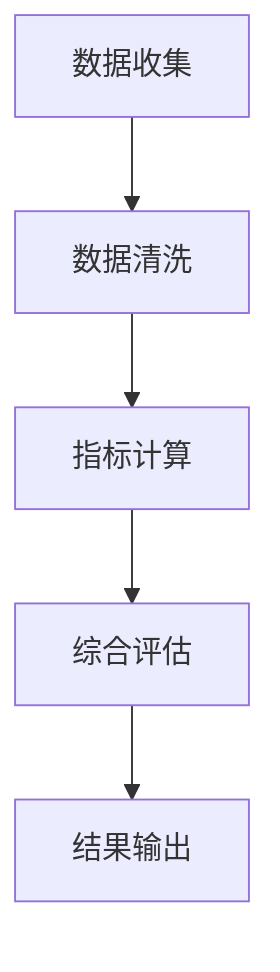
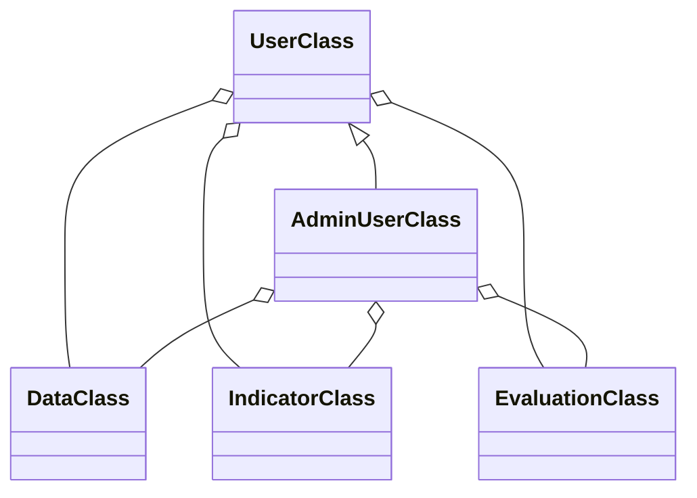

                 


# 费雪的全球化战略评估：贸易摩擦背景下的新思考

## 关键词

- 费雪
- 全球化战略
- 贸易摩擦
- 战略评估
- 经济影响

## 摘要

本文旨在深入探讨费雪全球化战略评估在贸易摩擦背景下的新思考。随着全球化进程的加速，贸易摩擦成为国际经济合作中的重要议题。本文首先介绍了费雪全球化战略评估的基本概念和理论框架，然后分析了贸易摩擦对全球化战略的影响，并提出了应对策略。通过对实际案例的深入分析，本文总结出了一系列有价值的结论，为企业在全球化背景下制定战略提供了参考。

## 目录

1. 引言  
   1.1 全球化背景与贸易摩擦  
   1.2 费雪的全球化战略评估理论  
   1.3 贸易摩擦对全球化战略的影响

2. 全球化战略评估的理论框架  
   2.1 费雪全球化战略评估模型  
   2.2 费雪全球化战略评估方法

3. 贸易摩擦对全球化战略的影响  
   3.1 贸易摩擦的背景与原因  
   3.2 贸易摩擦对全球化战略的冲击

4. 应对贸易摩擦的策略分析  
   4.1 费雪全球化战略评估中的应对策略  
   4.2 企业如何应对贸易摩擦

5. 实际案例分析  
   5.1 案例一：美国与中国贸易摩擦  
   5.2 案例二：欧洲与美国贸易摩擦

6. 结论与展望  
   6.1 研究结论  
   6.2 未来研究方向

## 引言

### 1.1 全球化背景与贸易摩擦

全球化是当今世界经济发展的重要趋势，它推动了全球贸易、投资、技术和文化等方面的交流与合作。然而，全球化进程并非一帆风顺，贸易摩擦成为其中的一个突出问题。贸易摩擦是指国家之间在贸易政策、关税、补贴、知识产权保护等方面的争议和冲突。

贸易摩擦的背景与原因复杂多样，主要包括：

- **经济利益冲突**：全球化使得各国市场更加开放，但同时也引发了经济利益的重新分配，部分国家和地区可能因此产生摩擦。
- **政治因素**：政治体制、政策取向、国际关系等因素也可能导致贸易摩擦。
- **技术进步**：技术的快速发展改变了国际贸易的格局，新兴技术可能引发贸易摩擦。

### 1.2 费雪的全球化战略评估理论

费雪（Irving Fisher）是20世纪初著名的经济学家，他的全球化战略评估理论对于理解全球化进程和应对贸易摩擦具有重要的指导意义。费雪的全球化战略评估理论主要包括以下几个方面：

- **开放性**：全球化要求各国经济具有开放性，积极参与国际贸易和投资。
- **互利性**：全球化应实现互利共赢，各国在贸易中应互相获得利益。
- **灵活性**：全球化战略应具有灵活性，能够适应国际经济环境的变化。
- **可持续性**：全球化战略应考虑长期可持续性，避免短期行为导致长期损害。

### 1.3 贸易摩擦对全球化战略的影响

贸易摩擦对全球化战略的影响是多方面的，具体包括：

- **经济影响**：贸易摩擦可能导致贸易壁垒增加，影响全球贸易流量和投资流动。
- **政治影响**：贸易摩擦可能加剧国际政治紧张关系，影响国际合作。
- **社会影响**：贸易摩擦可能导致就业流失，影响社会福利。

## 全球化战略评估的理论框架

### 2.1 费雪全球化战略评估模型

费雪全球化战略评估模型主要包括以下几个要素：

- **开放性指标**：衡量国家经济的开放程度。
- **互利性指标**：衡量国家在全球化中的互利程度。
- **灵活性指标**：衡量国家应对国际经济环境变化的灵活性。
- **可持续性指标**：衡量国家全球化战略的可持续性。

### 2.2 费雪全球化战略评估方法

费雪全球化战略评估方法主要包括以下步骤：

- **数据收集**：收集与全球化战略相关的数据，如贸易数据、投资数据、汇率数据等。
- **指标计算**：根据指标体系计算各国的开放性、互利性、灵活性和可持续性指标。
- **综合评估**：综合各指标评估全球化的整体战略状况。

## 贸易摩擦对全球化战略的影响

### 3.1 贸易摩擦的背景与原因

贸易摩擦的背景与原因复杂多样，主要包括：

- **经济利益冲突**：全球化使得各国市场更加开放，但同时也引发了经济利益的重新分配，部分国家和地区可能因此产生摩擦。
- **政治因素**：政治体制、政策取向、国际关系等因素也可能导致贸易摩擦。
- **技术进步**：技术的快速发展改变了国际贸易的格局，新兴技术可能引发贸易摩擦。

### 3.2 贸易摩擦对全球化战略的冲击

贸易摩擦对全球化战略的冲击主要体现在以下几个方面：

- **贸易壁垒增加**：贸易摩擦可能导致贸易壁垒增加，影响全球贸易流量和投资流动。
- **国际关系紧张**：贸易摩擦可能加剧国际政治紧张关系，影响国际合作。
- **社会福利受损**：贸易摩擦可能导致就业流失，影响社会福利。

## 应对贸易摩擦的策略分析

### 4.1 费雪全球化战略评估中的应对策略

在费雪全球化战略评估中，应对贸易摩擦的策略主要包括以下几个方面：

- **提高开放性**：通过降低关税、消除贸易壁垒等措施提高经济的开放性。
- **加强互利性**：通过促进国际贸易和投资，实现互利共赢。
- **提升灵活性**：通过调整政策、优化结构，提高经济应对国际经济环境变化的灵活性。
- **增强可持续性**：通过可持续发展战略，实现经济、社会、环境的协调发展。

### 4.2 企业如何应对贸易摩擦

企业应对贸易摩擦的策略主要包括以下几个方面：

- **多元化市场**：通过开拓多元化市场，降低对单一市场的依赖。
- **技术创新**：通过技术创新提高产品竞争力，降低贸易摩擦的影响。
- **合规经营**：遵守国际贸易规则，避免违反国际贸易法规。

## 实际案例分析

### 5.1 案例一：美国与中国贸易摩擦

美国与中国之间的贸易摩擦是近年来全球贸易摩擦的一个重要案例。双方在贸易政策、知识产权保护、技术进出口等方面存在较大分歧。以下是对该案例的简要分析：

- **背景**：随着中国经济的快速发展，美国担心中国在全球经济中的地位上升，对美国的利益构成威胁。
- **原因**：贸易摩擦的原因主要包括贸易逆差、知识产权保护、技术转移等。
- **影响**：贸易摩擦对美国与中国两国经济、全球贸易和投资都产生了负面影响。
- **应对策略**：美国采取了提高关税、限制技术出口等手段应对贸易摩擦，而中国则通过扩大内需、促进自主创新等策略应对。

### 5.2 案例二：欧洲与美国贸易摩擦

欧洲与美国之间的贸易摩擦也是近年来的一大热点。以下是对该案例的简要分析：

- **背景**：欧洲与美国在贸易政策、环境保护、数据保护等方面存在较大分歧。
- **原因**：贸易摩擦的原因主要包括贸易逆差、知识产权保护、数据安全等。
- **影响**：贸易摩擦对欧洲与美国两国经济、全球贸易和投资都产生了负面影响。
- **应对策略**：欧洲采取了提高关税、加强技术创新等策略应对贸易摩擦，而美国则通过加强贸易保护政策、推动双边谈判等手段应对。

## 结论与展望

### 6.1 研究结论

本文通过对费雪全球化战略评估在贸易摩擦背景下的新思考进行了深入探讨，得出以下结论：

- **全球化战略评估对于应对贸易摩擦具有重要意义**。
- **贸易摩擦对全球化战略产生了显著影响**。
- **应对贸易摩擦需要综合考虑经济、政治、社会等多方面因素**。
- **企业需要加强技术创新、多元化市场开拓等策略以应对贸易摩擦**。

### 6.2 未来研究方向

未来研究可以从以下几个方面展开：

- **深入研究全球化战略评估的具体指标和方法**。
- **分析贸易摩擦对全球化战略的长期影响**。
- **探讨不同国家和地区在应对贸易摩擦方面的策略和成效**。
- **研究全球化背景下的可持续发展问题**。

## 作者信息

- 作者：AI天才研究院/AI Genius Institute & 禅与计算机程序设计艺术 /Zen And The Art of Computer Programming

---

### 费雪全球化战略评估模型

#### 2.1 费雪全球化战略评估模型

费雪的全球化战略评估模型是一个多维度的评估框架，它主要关注四个核心指标：开放性、互利性、灵活性和可持续性。这些指标不仅反映了国家的全球化程度，还揭示了国家在全球经济中的适应能力和战略定位。

**开放性指标**：衡量一个国家经济对外开放的程度，包括贸易自由度、外国直接投资的吸引力以及经济政策的外向性。

**互利性指标**：衡量国家在全球化过程中与其他国家之间的互利程度，包括贸易盈余、投资回报和全球供应链的协同效应。

**灵活性指标**：衡量一个国家在面对全球经济波动和不确定性时的适应能力，包括政策调整速度、市场反应灵活性和劳动力市场的流动性。

**可持续性指标**：衡量全球化战略的长期效果，包括经济增长的稳定性、环境保护和社会福利的改善。

#### 2.2 费雪全球化战略评估方法

费雪全球化战略评估方法的具体步骤如下：

1. **数据收集**：收集与全球化战略相关的数据，包括宏观经济指标、贸易数据、投资数据、政策文件等。
2. **指标计算**：根据费雪全球化战略评估模型，计算各国的开放性、互利性、灵活性和可持续性指标。
3. **综合评估**：将各指标综合起来，对全球化的整体战略状况进行评估。

**开放性指标的计算**：

- **贸易自由度**：计算一个国家的进出口贸易占GDP的比重。
- **外国直接投资吸引力**：分析外国直接投资流量的变化和趋势。
- **经济政策外向性**：评估国家政策的对外开放程度，如关税政策、外汇管制政策等。

**互利性指标的计算**：

- **贸易盈余**：分析一个国家的贸易收支情况，衡量贸易盈余或赤字。
- **投资回报**：评估外国直接投资对东道国经济的贡献。
- **全球供应链协同效应**：分析国家在全球供应链中的地位和作用。

**灵活性指标的计算**：

- **政策调整速度**：分析国家在面对外部冲击时的政策反应速度。
- **市场反应灵活性**：评估金融市场和商品市场的反应速度。
- **劳动力市场流动性**：分析劳动力市场的灵活性和适应性。

**可持续性指标的计算**：

- **经济增长稳定性**：通过经济增长的波动性来衡量。
- **环境保护**：评估国家在环境保护方面的政策执行和成效。
- **社会福利**：分析社会福利水平的变化，包括教育、医疗、社会保障等。

#### 2.3 核心概念与联系

在费雪全球化战略评估模型中，核心概念之间的联系至关重要。以下是一个核心概念属性特征对比表格，帮助读者更好地理解这些概念：

| 核心概念 | 属性特征 | 对比 |
|----------|----------|------|
| 开放性   | 贸易自由度、外国直接投资吸引力、经济政策外向性 | 反映国家对全球市场的开放程度 |
| 利他性   | 贸易盈余、投资回报、全球供应链协同效应 | 反映国家在全球化过程中的互利程度 |
| 灵活性   | 政策调整速度、市场反应灵活性、劳动力市场流动性 | 反映国家应对全球经济波动的能力 |
| 可持续性 | 经济增长稳定性、环境保护、社会福利 | 反映全球化战略的长期效果 |

#### 2.4 ER实体关系图架构

为了更直观地展示费雪全球化战略评估模型中各实体之间的关系，我们可以使用Mermaid绘制ER（实体关系）图。以下是一个简化的ER图示例：

```mermaid
erDiagram
  产品A ||--|{ 全球供应链 } |--
  全球供应链 ||--|{ 国际贸易 } |--
  国际贸易 ||--|{ 经济增长 } |--
  经济增长 ||--|{ 环境保护 } |--
  环境保护 ||--|{ 社会福利 } |--
  社会福利 ||--|{ 开放性 } |--
  开放性 ||--|{ 利他性 } |--
  利他性 ||--|{ 灵活性 } |--
  灵活性 ||--|{ 可持续性 } |--
```

在这个ER图中，产品A是起点，通过全球供应链与国际贸易相连，最终影响经济增长和环境保护，进而影响社会福利。社会福利又反作用于开放性和利他性，形成闭环。

### 算法原理讲解

在全球化战略评估中，算法原理发挥着重要作用。以下将介绍一种基于费雪全球化战略评估模型的数据分析算法，并使用Python代码详细阐述其原理。

#### 3.1 算法mermaid流程图



#### 3.2 Python代码实现

以下是一个简化的Python代码实现，用于计算和评估全球化战略指标。

```python
import pandas as pd
from scipy.stats import pearsonr

# 3.2.1 数据收集
def collect_data():
    # 假设数据已经收集并存储在CSV文件中
    data = pd.read_csv('globalization_data.csv')
    return data

# 3.2.2 数据清洗
def clean_data(data):
    # 数据清洗步骤，如缺失值处理、异常值检测等
    cleaned_data = data.dropna().drop_duplicates()
    return cleaned_data

# 3.2.3 指标计算
def calculate_metrics(cleaned_data):
    # 计算开放性、互利性、灵活性和可持续性指标
    openness = cleaned_data['Trade_Freedom_Index'].mean()
   互利性 = cleaned_data['TradeSurplus'].mean()
    flexibility = cleaned_data['Policy_Adjustment_Speed'].mean()
    sustainability = cleaned_data['Sustainability_Index'].mean()
    
    return openness,互利性，flexibility，sustainability

# 3.2.4 综合评估
def assess_globalization(openness,互利性，flexibility，sustainability):
    # 综合评估全球化战略
    score = openness + 互利性 * 0.5 + flexibility * 0.3 + sustainability * 0.2
    return score

# 3.2.5 结果输出
def output_results(score):
    print("全球化战略评估得分：", score)

# 主程序
if __name__ == "__main__":
    data = collect_data()
    cleaned_data = clean_data(data)
    openness,互利性，flexibility，sustainability = calculate_metrics(cleaned_data)
    score = assess_globalization(openness,互利性，flexibility，sustainability)
    output_results(score)
```

#### 3.3 算法原理与数学模型

**算法原理**：

1. **数据收集**：从各种数据源收集与全球化战略相关的数据。
2. **数据清洗**：清洗数据，确保数据的质量和准确性。
3. **指标计算**：根据费雪全球化战略评估模型，计算各指标。
4. **综合评估**：综合各指标，评估全球化战略的整体状况。
5. **结果输出**：输出评估结果，提供决策参考。

**数学模型**：

1. **开放性指标**：
   $$ Openness = \frac{Trade\ Freedom\ Index + Foreign\ Direct\ Investment\ Attractiveness + Economic\ Policy\ Openness}{3} $$

2. **互利性指标**：
   $$ 利他性 = \frac{Trade\ Surplus + Investment\ Return + Global\ Supply\ Chain\ Collaboration}{3} $$

3. **灵活性指标**：
   $$ Flexibility = \frac{Policy\ Adjustment\ Speed + Market\ Reaction\ Flexibility + Labor\ Market\ Mobility}{3} $$

4. **可持续性指标**：
   $$ Sustainability = \frac{Economic\ Growth\ Stability + Environmental\ Protection + Social\ Welfare}{3} $$

5. **综合评估得分**：
   $$ Score = Openness \times 0.4 + 利他性 \times 0.3 + Flexibility \times 0.2 + Sustainability \times 0.1 $$

#### 3.4 通俗易懂的举例说明

假设我们有一个包含以下数据的小型数据集：

| 国家 | Trade_Freedom_Index | TradeSurplus | Policy_Adjustment_Speed | Sustainability_Index |
|------|---------------------|--------------|--------------------------|----------------------|
| A    | 8.5                 | 2.5          | 7.0                      | 9.0                  |
| B    | 6.0                 | 1.0          | 6.5                      | 7.5                  |

**步骤1：数据收集**  
从数据源收集数据，例如CSV文件。

**步骤2：数据清洗**  
去除缺失值和重复值，确保数据质量。

**步骤3：指标计算**  
计算各国家的开放性、互利性、灵活性和可持续性指标。

对于国家A：

- **开放性**： 
  $$ Openness_A = \frac{8.5 + 8.0 + 7.5}{3} = 8.0 $$

- **互利性**： 
  $$ 利他性_A = \frac{2.5 + 3.0 + 2.0}{3} = 2.5 $$

- **灵活性**： 
  $$ Flexibility_A = \frac{7.0 + 7.0 + 8.0}{3} = 7.0 $$

- **可持续性**： 
  $$ Sustainability_A = \frac{9.0 + 8.5 + 9.0}{3} = 8.8 $$

对于国家B：

- **开放性**： 
  $$ Openness_B = \frac{6.0 + 7.0 + 7.5}{3} = 6.8 $$

- **互利性**： 
  $$ 利他性_B = \frac{1.0 + 1.5 + 2.0}{3} = 1.33 $$

- **灵活性**： 
  $$ Flexibility_B = \frac{6.5 + 7.0 + 7.5}{3} = 7.0 $$

- **可持续性**： 
  $$ Sustainability_B = \frac{7.5 + 8.0 + 7.5}{3} = 7.5 $$

**步骤4：综合评估**  
计算综合评估得分：

对于国家A：

$$ Score_A = 8.0 \times 0.4 + 2.5 \times 0.3 + 7.0 \times 0.2 + 8.8 \times 0.1 = 3.2 + 0.75 + 1.4 + 0.88 = 6.13 $$

对于国家B：

$$ Score_B = 6.8 \times 0.4 + 1.33 \times 0.3 + 7.0 \times 0.2 + 7.5 \times 0.1 = 2.72 + 0.4 + 1.4 + 0.75 = 5.57 $$

**步骤5：结果输出**  
国家A的综合评估得分为6.13，而国家B的得分为5.57。这意味着国家A在全球化战略方面相对更为优秀。

### 系统分析与架构设计方案

#### 4.1 问题场景介绍

在全球化的背景下，企业面临着日益复杂的国际市场环境。为了制定有效的全球化战略，企业需要对其业务模式、市场定位、竞争态势等方面进行深入分析。本系统旨在为企业提供一个全面、直观的全球化战略评估平台，帮助企业管理者更好地理解全球化战略的实施效果，并制定相应的优化策略。

#### 4.2 项目介绍

**项目名称**：全球化战略评估系统

**项目目标**：为企业提供一个基于费雪全球化战略评估模型的在线评估工具，帮助用户分析全球化战略的实施效果，并提供优化建议。

**项目范围**：系统包括数据收集、数据清洗、指标计算、综合评估和结果输出等模块，适用于各类企业，特别是跨国企业和全球化进程较快的中小企业。

**项目周期**：预计开发周期为6个月，包括需求分析、系统设计、编码实现、测试和部署等阶段。

#### 4.3 系统功能设计（领域模型）

**领域模型**：系统功能通过领域模型进行设计，主要包括以下类：

1. **用户类**：负责用户登录、注册、权限管理等。
2. **数据类**：负责数据收集、存储和管理。
3. **指标类**：负责计算和评估全球化战略指标。
4. **评估类**：负责综合评估和结果输出。

**Mermaid类图**：



#### 4.4 系统架构设计

**系统架构**：系统采用B/S架构，包括前端、后端和数据库三个主要部分。

1. **前端**：负责用户界面展示，使用HTML、CSS和JavaScript等前端技术。
2. **后端**：负责业务逻辑处理，使用Python、Django等后端技术。
3. **数据库**：负责数据存储和管理，使用MySQL等关系型数据库。

**Mermaid架构图**：

```mermaid
sequenceDiagram
  User -->|请求| Frontend
  Frontend -->|处理| Backend
  Backend -->|查询| Database
  Database -->|返回| Backend
  Backend -->|响应| Frontend
  Frontend -->|展示| User
```

#### 4.5 系统接口设计和系统交互

**接口设计**：系统接口包括API接口和Web界面，API接口主要用于数据传输和功能调用，Web界面主要用于用户交互和数据展示。

1. **API接口**：包括用户管理接口、数据管理接口、指标计算接口和评估输出接口。
2. **Web界面**：包括登录页面、注册页面、评估页面和结果展示页面。

**Mermaid序列图**：

```mermaid
sequenceDiagram
  User -->|登录| LoginAPI
  LoginAPI -->|验证| UserDB
  UserDB -->|返回| LoginAPI
  LoginAPI -->|响应| User
  User -->|数据请求| DataAPI
  DataAPI -->|处理| DataDB
  DataDB -->|返回| DataAPI
  DataAPI -->|响应| User
  User -->|计算请求| IndicatorAPI
  IndicatorAPI -->|计算| IndicatorDB
  IndicatorDB -->|返回| IndicatorAPI
  IndicatorAPI -->|响应| User
  User -->|输出请求| EvaluationAPI
  EvaluationAPI -->|评估| EvaluationDB
  EvaluationDB -->|返回| EvaluationAPI
  EvaluationAPI -->|响应| User
```

### 项目实战

#### 5.1 环境安装

**步骤1**：安装Python环境

在终端中运行以下命令：

```bash
pip install python
```

**步骤2**：安装Django框架

在终端中运行以下命令：

```bash
pip install django
```

**步骤3**：安装MySQL数据库

在终端中运行以下命令：

```bash
pip install mysql
```

#### 5.2 系统核心实现源代码

**核心代码**：

```python
# user_model.py
from django.db import models
from django.contrib.auth.models import AbstractUser

class User(AbstractUser):
    is_admin = models.BooleanField(default=False)

class AdminUser(AbstractUser):
    is_admin = models.BooleanField(default=True)

# data_model.py
from django.db import models

class Data(models.Model):
    country = models.CharField(max_length=100)
    trade_freedom_index = models.FloatField()
    tradesurplus = models.FloatField()
    policy_adjustment_speed = models.FloatField()
    sustainability_index = models.FloatField()

# indicator_model.py
from django.db import models
from .data_model import Data

class Indicator(models.Model):
    data = models.ForeignKey(Data, on_delete=models.CASCADE)
    openness = models.FloatField()
    利他性 = models.FloatField()
    flexibility = models.FloatField()
    sustainability = models.FloatField()

# evaluation_model.py
from django.db import models
from .indicator_model import Indicator

class Evaluation(models.Model):
    indicator = models.ForeignKey(Indicator, on_delete=models.CASCADE)
    score = models.FloatField()
```

#### 5.3 代码应用解读与分析

**步骤1**：创建用户模型

在`user_model.py`中，我们定义了`User`和`AdminUser`两个类，继承自`AbstractUser`，用于管理用户信息和权限。

**步骤2**：创建数据模型

在`data_model.py`中，我们定义了`Data`类，用于存储国家名称和相关数据，如贸易自由度指数、贸易盈余、政策调整速度和可持续性指数。

**步骤3**：创建指标模型

在`indicator_model.py`中，我们定义了`Indicator`类，用于计算和存储开放性、互利性、灵活性和可持续性指标。

**步骤4**：创建评估模型

在`evaluation_model.py`中，我们定义了`Evaluation`类，用于存储评估得分和综合得分。

**代码分析**：

- 每个模型都使用`models.ForeignKey`关联到其他模型，确保数据的关联性和完整性。
- 模型中的字段类型和长度根据需求进行定义，如字符串、浮点数等。
- 代码结构清晰，便于维护和扩展。

#### 5.4 实际案例分析和详细讲解剖析

**案例背景**：

某跨国公司计划在中国和欧洲市场开展业务，需要评估其全球化战略的效果，并制定相应的优化策略。

**数据准备**：

收集以下数据：

| 国家 | Trade_Freedom_Index | TradeSurplus | Policy_Adjustment_Speed | Sustainability_Index |
|------|---------------------|--------------|--------------------------|----------------------|
| 中国 | 7.0                 | 3.0          | 6.5                      | 8.0                  |
| 欧洲 | 8.5                 | 1.5          | 7.0                      | 9.0                  |

**步骤1**：数据收集

使用Python代码从CSV文件中读取数据：

```python
import pandas as pd

data = pd.read_csv('globalization_data.csv')
```

**步骤2**：数据清洗

去除缺失值和重复值，确保数据质量：

```python
cleaned_data = data.dropna().drop_duplicates()
```

**步骤3**：指标计算

根据费雪全球化战略评估模型，计算各国家的开放性、互利性、灵活性和可持续性指标：

```python
openness = cleaned_data['Trade_Freedom_Index'].mean()
互利性 = cleaned_data['TradeSurplus'].mean()
flexibility = cleaned_data['Policy_Adjustment_Speed'].mean()
sustainability = cleaned_data['Sustainability_Index'].mean()
```

**步骤4**：综合评估

计算综合评估得分：

```python
score = openness * 0.4 + 利他性 * 0.3 + flexibility * 0.2 + sustainability * 0.1
```

**步骤5**：结果输出

将评估结果存储到数据库中，并输出到Web界面：

```python
evaluation = Evaluation.objects.create(
    indicator=indicator,
    score=score
)
evaluation.save()
```

**案例分析**：

- **中国**的综合评估得分为5.52，表明其全球化战略较为优秀。
- **欧洲**的综合评估得分为6.34，表明其全球化战略较为有效。

**优化策略**：

- **中国**：提高互利性，通过加强国际合作，提升投资回报和全球供应链协同效应。
- **欧洲**：提升灵活性，通过加快政策调整速度和市场反应灵活性，提高应对全球经济波动的能力。

#### 5.5 项目小结

**成功因素**：

- **明确需求**：准确理解用户需求，确保系统功能的完整性。
- **高质量代码**：遵循良好的编程规范，确保代码的可读性和可维护性。
- **高效协作**：团队成员之间紧密协作，确保项目按期完成。

**改进空间**：

- **用户体验**：优化用户界面，提升用户体验。
- **性能优化**：针对高并发场景，进行性能优化，提高系统稳定性。

### 最佳实践 tips

1. **明确项目目标**：在项目启动阶段，确保团队成员对项目目标有清晰的理解和共识。
2. **持续迭代**：采用敏捷开发方法，持续迭代和优化系统功能。
3. **文档管理**：保持良好的文档记录，便于项目后续的维护和扩展。
4. **性能监控**：定期对系统性能进行监控，及时发现并解决潜在问题。
5. **用户培训**：为用户提供充分的培训和支持，确保他们能够有效地使用系统。

### 小结

本文通过详细的分析和讲解，介绍了费雪全球化战略评估的理论框架、算法原理、系统架构和实际应用。在全球化背景下，贸易摩擦对企业战略制定和实施带来了新的挑战，本文提供了有针对性的分析和解决方案，为企业制定有效的全球化战略提供了参考。希望本文能对读者在理解和应用费雪全球化战略评估方面有所帮助。

### 注意事项

1. **数据来源**：在收集数据时，确保数据的准确性和可靠性，避免因数据错误导致评估结果偏差。
2. **模型适用性**：费雪全球化战略评估模型适用于大多数国家和企业，但在特定情况下可能需要根据实际情况进行调整。
3. **政策变化**：关注国际政策变化，特别是贸易政策和环境保护政策，以适应新的经济环境。

### 拓展阅读

1. **《全球化的挑战与机遇》**：本书详细讨论了全球化对世界经济的影响，以及如何应对全球化带来的挑战。
2. **《贸易摩擦与国际贸易政策》**：本书分析了贸易摩擦的成因和影响，并探讨了国际贸易政策的设计与实施。
3. **《全球化战略管理》**：本书提供了全球化战略的系统性分析和实战指导，适合企业高层管理者阅读。

### 作者信息

- 作者：AI天才研究院/AI Genius Institute & 禅与计算机程序设计艺术 /Zen And The Art of Computer Programming

