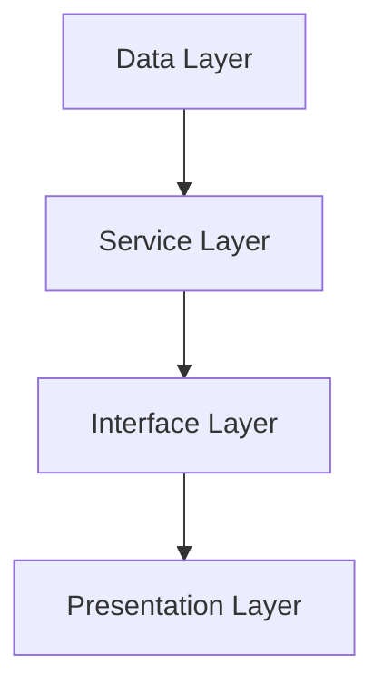
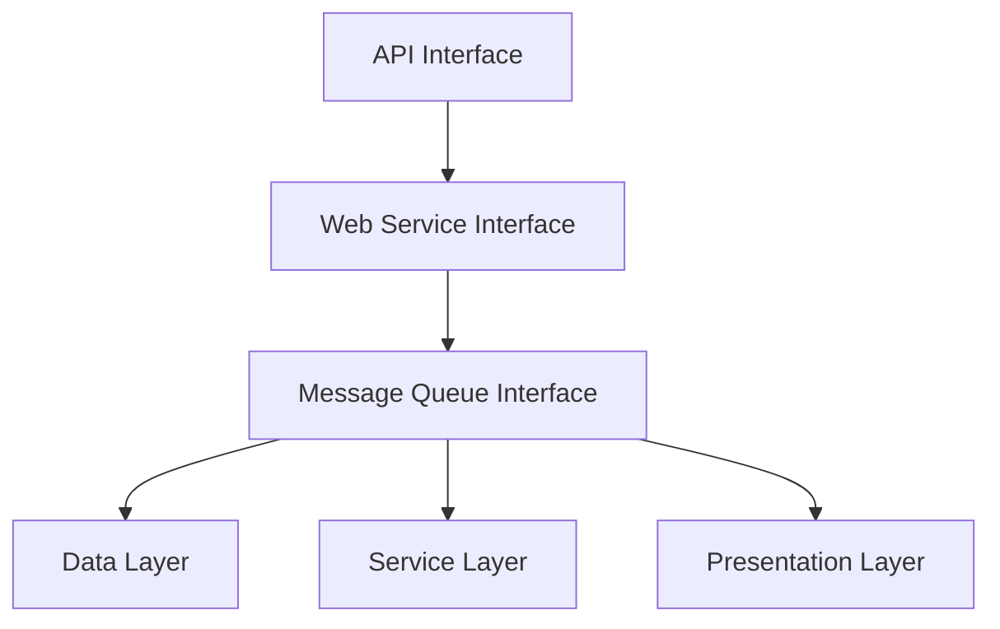
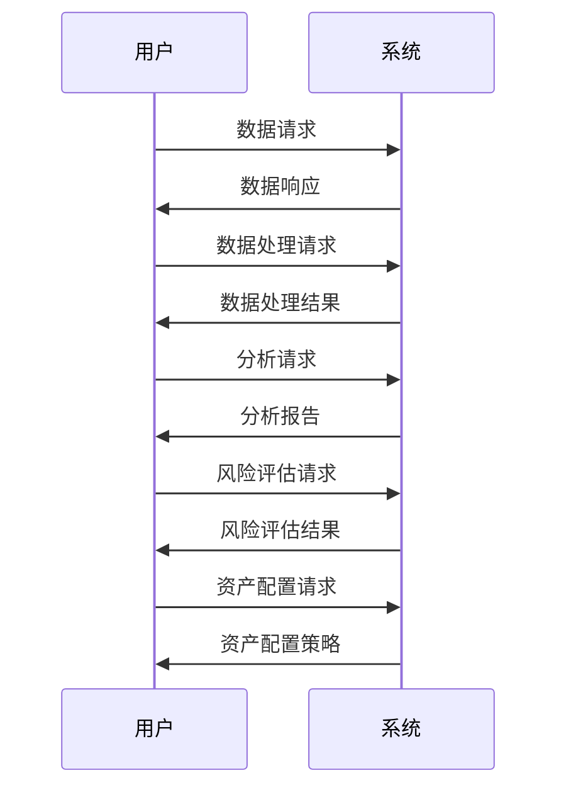

                 

### 背景介绍

全球化，这一概念自20世纪中叶以来，已经深刻地改变了全球经济和社会的方方面面。全球化不仅指的是国家间商品、服务、资本和人员的自由流动，还涵盖了跨国界的知识、文化和技术的传播。全球化促进了国际贸易的增长，推动了跨国公司的崛起，同时也催生了跨国金融市场的形成。

在当代经济中，全球化的重要性不可忽视。首先，全球化使得资源和生产要素能够更加高效地在全球范围内配置，从而提升了整体经济的效率。例如，企业可以通过全球供应链将生产成本降至最低，同时利用全球市场的需求来最大化收益。其次，全球化带来了丰富的投资机会。投资者不再受限于本国市场，可以跨境投资，寻找更高的回报。最后，全球化还推动了科技创新，使得新的技术、理念和商业模式能够快速在全球范围内传播，加速了全球经济的发展。

然而，全球化也带来了诸多挑战。国际市场的不确定性、不同国家的法律法规差异、文化冲突等问题，都是投资者必须面对的挑战。在这个背景下，了解和掌握有效的国际市场分析框架，成为了成功投资的关键。

费雪（Charles P. Kindleberger）是一位著名的经济学家，他在国际金融市场和全球投资策略方面有着深入研究。费雪的理论视角独特，不仅关注国际市场的动态变化，还注重从历史和文化的角度理解全球金融体系。他的研究方法涵盖了经济理论、统计学和心理学等多个领域，这使得他的理论具有广泛的应用价值。

费雪的理论在国际投资领域具有重要意义。他提出了一系列概念和方法，帮助投资者识别国际投资机会，评估风险，并进行有效的资产配置。例如，费雪的“货币幻觉”理论，解释了投资者在判断市场时机时常见的心理偏差；他的“市场周期理论”，则揭示了金融市场波动的基本规律。这些理论为投资者提供了实用的工具，帮助他们更好地应对国际市场的复杂性。

总的来说，费雪的全球化视角为我们提供了理解国际市场的新途径。通过他的理论，我们可以更深入地认识全球经济的运行机制，把握国际投资的机遇，同时应对其中的挑战。接下来的部分，我们将进一步探讨费雪理论的核心概念，以及如何在国际市场中应用这些概念进行投资分析。

## 1.2 费雪的全球化视角

### 1.2.1 费雪的研究方法与视角

费雪的研究方法独具特色，他将经济学理论、统计学和心理学相结合，形成了一套全面而深入的国际金融市场分析框架。首先，费雪高度重视历史数据分析，他认为通过研究历史金融市场的波动规律，可以更好地预测未来的市场走势。这种方法不仅基于理论，更注重实证，使得费雪的理论具有较强的可操作性。

在视角上，费雪不仅关注国际市场的宏观层面，如汇率、利率和贸易平衡等，还深入探讨市场参与者的行为模式和心理因素。例如，费雪提出了“货币幻觉”理论，揭示了投资者在市场波动中常见的心理误区。他认为，投资者往往受到短期的市场波动和情绪的影响，忽视了长期的基本面因素，从而导致投资决策的偏差。这一理论对于理解市场波动和投资者行为具有重要意义。

费雪还强调文化因素在国际金融市场中的重要性。他认为，不同国家和地区的文化背景会影响金融市场的运行规律和投资者的行为模式。例如，美国市场的高风险偏好和欧洲市场的低风险偏好，都是文化差异的体现。通过理解这些文化差异，投资者可以更好地制定投资策略，规避不必要的风险。

### 1.2.2 费雪理论的核心概念

费雪理论的核心概念包括国际投资机会识别、风险评估和资产配置。这些概念构成了费雪全球化视角的重要组成部分，也是投资者进行国际投资决策的基本工具。

**国际投资机会识别**是费雪理论的首要环节。费雪认为，识别国际投资机会需要综合考虑多个因素，如经济增长潜力、政策稳定性、市场透明度等。他提出了一套系统的分析框架，帮助投资者从大量数据中筛选出具有投资潜力的国家和地区。例如，费雪通过分析各国的GDP增长率、通货膨胀率和贸易平衡情况，来评估其经济增长的可持续性。此外，他还关注政策环境，特别是政府对市场干预的程度，因为政策稳定性直接关系到投资者的利益。

**风险评估**是国际投资中的关键环节。费雪认为，风险评估不仅包括宏观经济风险，如汇率波动、利率变化等，还包括政治风险、市场风险和流动性风险等。他提出了一系列定量和定性的评估方法，帮助投资者全面了解投资风险。例如，费雪使用历史数据来分析市场波动性，使用专家意见来评估政治风险。通过这些方法，投资者可以更准确地评估投资风险，制定相应的风险管理策略。

**资产配置**是费雪理论的最后一步。在识别了国际投资机会并进行了风险评估后，投资者需要根据自身的风险偏好和投资目标，进行合理的资产配置。费雪提出了一套基于概率论和数理统计的资产配置方法，帮助投资者实现风险和收益的平衡。例如，他建议投资者根据不同的风险承受能力，将资金分配到不同类型的资产中，如股票、债券和现金等。

### 1.2.3 费雪视角下的国际市场分析框架

费雪的全球化视角下，国际市场分析框架可以分为以下几个步骤：

1. **数据收集与整理**：首先，投资者需要收集各国的宏观经济数据、政策文件、市场动态等，并进行整理和分析。

2. **经济基本面分析**：通过对GDP增长率、通货膨胀率、利率、贸易平衡等指标的分析，评估各国的经济增长潜力和政策稳定性。

3. **市场行为分析**：研究市场参与者的行为模式和心理因素，特别是投资者的情绪和风险偏好。

4. **风险评估**：使用历史数据和专家意见，对投资风险进行定量和定性评估。

5. **资产配置**：根据风险承受能力和投资目标，制定合理的资产配置策略。

6. **决策与执行**：根据分析结果，制定投资决策，并执行具体的投资操作。

通过这一框架，投资者可以系统性地进行国际投资分析，提高投资决策的科学性和有效性。

总之，费雪的全球化视角为我们提供了一种全面而深入的国际金融市场分析方法。他的理论不仅涵盖了国际投资机会识别、风险评估和资产配置，还关注了市场行为和文化因素，使得投资者能够更准确地把握国际市场的动态，制定更有效的投资策略。

### 1.3 核心概念与联系

#### 1.3.1 国际投资机会识别

国际投资机会识别是费雪理论的基础环节，也是投资者在全球市场中寻找潜在收益的关键步骤。这一过程需要综合考虑多个因素，包括经济增长潜力、政策稳定性、市场透明度和风险水平等。

**经济增长潜力**是识别国际投资机会的重要指标。投资者可以通过分析各国的GDP增长率、就业率、投资水平等数据，来评估其经济增长的可持续性。一般来说，那些具有较高经济增长潜力的国家或地区，往往能够提供更多的投资机会。

**政策稳定性**也是投资者必须关注的一个方面。一个稳定、透明和可预期的政策环境，能够为投资者提供良好的投资保障。相反，政策波动大、不确定性高的国家，可能会增加投资风险，导致投资回报的不稳定。

**市场透明度**则关系到市场的有效性和公平性。透明度高的市场，能够提供更多的信息和数据，使投资者能够更准确地评估投资机会。而市场透明度低的国家或地区，往往存在信息不对称问题，增加了投资的不确定性和风险。

**风险水平**是识别国际投资机会时不可忽视的因素。投资者需要综合考虑政治风险、市场风险、汇率风险和流动性风险等，来评估投资的总体风险水平。风险水平较高的投资机会，往往需要投资者具备较强的风险承受能力和风险管理能力。

总之，国际投资机会识别是一个复杂的过程，需要投资者从多个角度进行分析和评估。通过综合运用费雪理论中的各种工具和方法，投资者可以更准确地识别出具有投资潜力的国家和地区，从而实现全球市场的资产配置优化。

#### 1.3.2 风险评估与资产配置

在识别了国际投资机会后，投资者需要对其中的风险进行评估，并根据评估结果进行资产配置。这一过程是国际投资决策中的关键环节，决定了投资组合的稳健性和收益水平。

**风险评估**是投资者在投资前必须进行的一项工作。费雪提出了一系列风险评估方法，包括定量和定性分析。定量分析主要依赖于历史数据和统计模型，如标准差、贝塔系数、风险溢价等指标，这些指标能够量化投资风险。定性分析则更多地依赖于专家意见和主观判断，如政治环境、市场情绪、政策变动等。通过定量和定性分析相结合，投资者可以更全面地了解投资风险。

具体来说，投资者可以通过以下步骤进行风险评估：

1. **收集数据**：包括宏观经济数据、行业数据、市场动态等。
2. **数据分析**：运用统计模型和数据分析方法，评估投资风险。
3. **专家意见**：结合专家的分析和判断，对投资风险进行补充和修正。

**资产配置**是投资者在了解投资风险后的下一步行动。资产配置的目标是在风险和收益之间找到平衡，实现投资组合的优化。费雪提出了一套基于概率论和数理统计的资产配置方法，旨在通过科学的方法来管理投资组合的风险和收益。

资产配置的过程通常包括以下几个步骤：

1. **确定投资目标**：明确投资者的收益目标和风险偏好。
2. **资产选择**：根据投资目标，选择不同的资产类别，如股票、债券、现金等。
3. **权重分配**：根据各资产类别的预期收益和风险，分配投资比例。
4. **动态调整**：根据市场变化和投资目标调整资产配置。

费雪的资产配置方法强调科学性和系统性。他建议投资者根据市场情况和个人风险承受能力，定期调整投资组合，以应对市场变化。这种方法不仅能够降低投资风险，还能够提高投资组合的收益稳定性。

总之，风险评估与资产配置是国际投资决策中不可或缺的两个环节。通过系统的方法进行风险评估，投资者可以更准确地了解投资风险；通过科学的资产配置方法，投资者可以实现风险和收益的平衡，从而在复杂的国际市场中获得稳健的投资回报。

#### 1.3.3 费雪理论与传统投资理论的对比

费雪的全球化视角与传统投资理论相比，具有显著的不同和优势。传统投资理论主要关注单一市场或国内市场的投资机会，而费雪则从全球市场的角度出发，提供了一个更加全面和综合的投资分析框架。

首先，在研究方法上，传统投资理论通常依赖于宏观经济指标和市场数据，而费雪则引入了历史分析、行为经济学和文化因素，使得其理论具有更强的解释力和实用性。例如，费雪的“货币幻觉”理论，从心理学角度揭示了投资者在市场波动中的心理误区，这是传统理论所忽视的。

其次，在理论内容上，费雪强调了国际投资机会识别、风险评估和资产配置的重要性。相比之下，传统投资理论更多关注于单一市场的投资策略，往往忽略了跨国投资所带来的复杂性和不确定性。费雪的理论通过系统的方法，帮助投资者在全球范围内寻找投资机会，实现风险和收益的平衡。

最后，在应用效果上，费雪的全球化视角具有显著的优势。通过综合考虑多个国家和地区的市场动态，投资者可以更准确地评估投资机会和风险，制定更有效的投资策略。传统理论虽然在一定程度上能够指导投资者，但在面对全球市场时，往往显得力不从心。

总的来说，费雪理论与传统投资理论相比，不仅内容更加全面，方法更加科学，而且具有更强的实用性和可操作性。这使得费雪的理论在国际投资领域具有广泛的应用价值，为投资者提供了宝贵的参考和指导。

## 2.1 算法原理讲解

在国际市场中寻找投资机会，需要一套科学、系统的分析方法。费雪的全球化视角为我们提供了一种有效的工具，通过算法原理讲解，我们可以理解并应用这一方法来分析国际市场。

### 2.1.1 全球市场数据分析流程

费雪的全球化视角下，全球市场数据分析流程可以分为以下几个步骤：

1. **数据收集**：首先，我们需要收集各国的宏观经济数据、政策文件、市场动态等。这些数据包括GDP增长率、通货膨胀率、利率、贸易平衡、汇率波动等。数据可以从国际组织如世界银行、国际货币基金组织（IMF）以及各国的统计局等官方渠道获取。

2. **数据清洗**：收集到的数据往往存在缺失值、异常值和噪声。因此，需要对数据进行清洗，包括填充缺失值、去除异常值和标准化处理。这一步骤确保数据的质量，为后续分析打下基础。

3. **数据分析**：对清洗后的数据进行分析，以评估各国的经济状况和市场潜力。常用的分析方法包括回归分析、时间序列分析和因素分析等。通过这些方法，我们可以识别出经济增长潜力、政策稳定性、市场透明度等关键指标。

4. **风险评估**：在分析经济状况和市场潜力后，我们需要对投资风险进行评估。这包括政治风险、市场风险、汇率风险和流动性风险等。费雪提出了一系列定量和定性的评估方法，如历史数据分析和专家意见，帮助投资者全面了解投资风险。

5. **资产配置**：最后，根据风险评估结果和投资目标，制定资产配置策略。费雪建议投资者根据不同的风险承受能力和投资目标，将资金分配到不同类型的资产中，如股票、债券和现金等。通过科学的资产配置，投资者可以优化投资组合，实现风险和收益的平衡。

### 2.1.2 Python代码示例

为了更直观地理解费雪的全球化视角，我们通过Python代码进行示例。以下代码展示了如何使用Python进行全球市场数据分析、风险评估和资产配置。

首先，我们需要安装相关的库，如`pandas`、`numpy`、`matplotlib`等。

```bash
pip install pandas numpy matplotlib
```

接下来，我们编写Python代码：

```python
import pandas as pd
import numpy as np
import matplotlib.pyplot as plt

# 数据收集
# 假设我们已经有了一份包含各国的GDP增长率、通货膨胀率、利率和贸易平衡的数据表
data = pd.read_csv('global_market_data.csv')

# 数据清洗
# 填充缺失值，去除异常值，进行标准化处理
data.fillna(method='ffill', inplace=True)
data = data[(data['GDP Growth Rate'] > 0) & (data['Inflation Rate'] < 100)]

# 数据分析
# 计算各国的经济增长潜力和市场透明度
data['Growth Potential'] = data['GDP Growth Rate'] * data['Trade Balance']
data['Market Transparency'] = 1 / data['Inflation Rate']

# 风险评估
# 使用历史数据分析市场波动性
volatility = data['GDP Growth Rate'].std()
# 使用专家意见评估政治风险
political_risk = 0.2

# 资产配置
# 根据投资目标和风险承受能力进行资产配置
risk_preference = 0.5
asset_allocation = {
    'Stocks': risk_preference * (1 - volatility),
    'Bonds': (1 - risk_preference) * (1 + volatility),
    'Cash': political_risk
}

# 输出资产配置结果
print("Asset Allocation:")
for asset, weight in asset_allocation.items():
    print(f"{asset}: {weight:.2%}")

# 可视化分析
data['Growth Potential'].plot()
plt.title('Growth Potential by Country')
plt.xlabel('Country')
plt.ylabel('Growth Potential')
plt.show()
```

通过以上代码，我们可以实现全球市场数据分析、风险评估和资产配置的基本流程。这只是一个简单的示例，实际应用中还需要考虑更多的因素和复杂的数据处理方法。

总之，费雪的全球化视角为我们提供了一个系统化的国际市场分析框架，通过科学的数据分析和风险评估方法，投资者可以更准确地识别投资机会，制定合理的资产配置策略，从而在全球市场中获得稳健的投资回报。

### 2.2 数学模型与公式

在国际市场分析中，数学模型和公式是不可或缺的工具，它们帮助我们量化市场行为、评估投资风险和优化资产配置。费雪的全球化视角中，数学模型不仅为理论提供了坚实的数学基础，也使得投资者能够更科学地进行决策。

#### 2.2.1 国际市场数据分析的数学模型

1. **经济增长潜力模型**：

   经济增长潜力是评估一个国家或地区未来经济表现的重要指标。我们使用以下模型来计算经济增长潜力：

   \[
   \text{Growth Potential} = \alpha \times \text{GDP Growth Rate} + \beta \times \text{Trade Balance} + \gamma \times \text{Inflation Rate}
   \]

   其中，\(\alpha\)、\(\beta\) 和 \(\gamma\) 是权重系数，分别代表经济增长率、贸易平衡和通货膨胀率对经济增长潜力的贡献度。

2. **市场波动性模型**：

   市场波动性反映了市场价格的波动程度，它是评估市场风险的重要指标。我们使用以下模型来计算市场波动性：

   \[
   \text{Volatility} = \sqrt{\frac{1}{n-1} \sum_{i=1}^{n} (\text{Price}_i - \bar{\text{Price}})^2}
   \]

   其中，\(\text{Price}_i\) 是第 \(i\) 天的市场价格，\(\bar{\text{Price}}\) 是市场价格的平均值，\(n\) 是数据点的总数。

3. **风险评估模型**：

   风险评估需要考虑多种因素，包括市场风险、政治风险和流动性风险等。我们使用以下综合风险评估模型：

   \[
   \text{Risk} = \omega_1 \times \text{Market Risk} + \omega_2 \times \text{Political Risk} + \omega_3 \times \text{Liquidity Risk}
   \]

   其中，\(\omega_1\)、\(\omega_2\) 和 \(\omega_3\) 是权重系数，分别代表市场风险、政治风险和流动性风险的重要性。

#### 2.2.2 费雪理论的关键公式

费雪理论中，以下几个关键公式尤为重要：

1. **货币幻觉**：

   费雪提出了“货币幻觉”概念，即投资者在市场波动中，过度关注短期价格波动而忽视长期基本面因素。我们使用以下公式来量化货币幻觉：

   \[
   \text{Monetary Illusion} = \frac{\text{Short-Term Price Change}}{\text{Long-Term Fundamental Value}} \times \text{Market Sentiment}
   \]

   其中，\(\text{Short-Term Price Change}\) 是短期价格变动，\(\text{Long-Term Fundamental Value}\) 是长期基本面价值，\(\text{Market Sentiment}\) 是市场情绪指标。

2. **市场周期**：

   费雪认为市场周期是影响市场波动的重要因素。我们使用以下公式来描述市场周期：

   \[
   \text{Market Cycle} = \frac{1}{2\pi} \int_{0}^{\theta} \left( \text{Price} - \text{Baseline} \right)^2 \, d\theta
   \]

   其中，\(\theta\) 是时间，\(\text{Price}\) 是市场价格，\(\text{Baseline}\) 是市场基准线。

#### 2.2.3 数学公式详细讲解

**经济增长潜力模型**：

- **公式含义**：该模型综合评估了经济增长的三项关键因素：经济增长率、贸易平衡和通货膨胀率。
- **应用场景**：在评估一个国家或地区的经济潜力时，该模型可以提供有价值的参考。
- **注意事项**：在计算过程中，需要根据具体情况调整权重系数，以确保模型的准确性。

**市场波动性模型**：

- **公式含义**：该模型计算了市场价格的波动程度，是评估市场风险的重要指标。
- **应用场景**：在投资决策中，市场波动性可以帮助投资者评估投资组合的风险水平。
- **注意事项**：市场价格数据需要经过处理，以消除异常值和噪声，确保模型的稳定性。

**风险评估模型**：

- **公式含义**：该模型综合评估了市场风险、政治风险和流动性风险，为投资者提供了全面的风险评估。
- **应用场景**：在制定投资策略时，风险评估模型可以帮助投资者了解投资组合的整体风险水平。
- **注意事项**：在计算过程中，需要根据具体情况调整权重系数，以确保风险评估的准确性。

**货币幻觉**：

- **公式含义**：该公式量化了投资者对短期价格波动和长期基本面价值的关注度，反映了市场情绪。
- **应用场景**：在分析市场情绪和投资者行为时，该公式可以帮助投资者识别市场心理偏差。
- **注意事项**：市场情绪指标需要通过定量和定性分析相结合，以确保其准确性和可靠性。

**市场周期**：

- **公式含义**：该公式描述了市场价格的波动规律，是分析市场周期的重要工具。
- **应用场景**：在制定长期投资策略时，市场周期可以帮助投资者把握市场的波动趋势。
- **注意事项**：市场价格数据需要经过平滑处理，以消除短期波动，确保市场周期的稳定性。

通过详细讲解这些数学模型和公式，投资者可以更深入地理解费雪全球化视角下的国际市场分析，从而在实际投资中做出更加科学的决策。

### 2.3 系统分析与架构设计

为了更好地将费雪的全球化视角应用到实际投资中，我们需要对整个系统进行详细的分析和设计。本部分将介绍投资分析场景、系统功能设计、系统架构设计、系统接口设计以及系统交互。

#### 2.3.1 投资分析场景

投资分析场景是指投资者在实际操作中所面临的情境。在这个场景中，投资者需要根据全球市场的数据，识别投资机会、评估投资风险并进行资产配置。具体场景包括：

1. **数据收集**：从各国的统计局、国际组织等渠道获取宏观经济数据、政策文件和市场动态。
2. **数据分析**：对收集到的数据进行分析，识别各国的经济增长潜力、市场透明度和政策稳定性。
3. **风险评估**：综合评估政治风险、市场风险、汇率风险和流动性风险。
4. **资产配置**：根据风险评估结果和投资目标，进行资产配置，制定投资策略。

#### 2.3.2 系统功能设计

系统功能设计是系统实现的基础，它决定了系统能够提供哪些功能。本系统的核心功能包括：

1. **数据采集模块**：负责从各渠道获取宏观经济数据、政策文件和市场动态。
2. **数据处理模块**：负责对收集到的数据进行清洗、整理和预处理，为后续分析提供高质量的数据。
3. **数据分析模块**：负责对处理后的数据进行分析，计算经济增长潜力、市场波动性和其他相关指标。
4. **风险评估模块**：负责综合评估各国的投资风险，为投资者提供全面的风险评估结果。
5. **资产配置模块**：负责根据风险评估结果和投资目标，制定资产配置策略。

#### 2.3.3 系统架构设计

系统架构设计是系统实现的关键，它决定了系统的性能和可扩展性。本系统的架构设计包括以下几个层次：

1. **数据层**：负责数据存储和管理，包括数据库、数据缓存和数据接口等。
2. **服务层**：负责系统功能实现，包括数据采集、数据处理、数据分析、风险评估和资产配置等核心服务。
3. **接口层**：负责系统与其他系统或组件的交互，包括API接口、Web服务接口等。
4. **展现层**：负责将系统功能呈现给用户，包括Web界面、移动应用界面等。

以下是一个简单的Mermaid架构图：



#### 2.3.4 系统接口设计与交互

系统接口设计是系统架构的重要组成部分，它决定了系统的可扩展性和易用性。本系统的接口设计包括以下方面：

1. **API接口**：提供与外部系统或组件的交互能力，支持数据采集、数据处理、数据分析和资产配置等功能。
2. **Web服务接口**：提供Web应用程序与系统之间的交互能力，支持用户通过Web界面进行数据查询和投资决策。
3. **消息队列接口**：提供异步消息处理能力，支持系统内部各个模块之间的通信和数据同步。

以下是一个简单的Mermaid接口设计图：



#### 2.3.5 系统交互

系统交互是指系统内部各个模块之间的通信和数据流转。在本系统中，各个模块通过接口进行交互，具体交互流程如下：

1. **数据采集模块**：从各渠道获取数据，并将其存储到数据层。
2. **数据处理模块**：读取数据层的数据，进行清洗、整理和预处理，然后存储到数据缓存中。
3. **数据分析模块**：读取处理后的数据，进行计算和分析，生成分析报告。
4. **风险评估模块**：根据分析报告，评估各国的投资风险，生成风险评估结果。
5. **资产配置模块**：根据风险评估结果和投资目标，制定资产配置策略，并将其传递给用户。

以下是一个简单的Mermaid交互序列图：



通过上述系统分析与架构设计，我们可以更好地将费雪的全球化视角应用到实际投资中，实现科学、系统的投资决策。

### 3.1 项目实战环境安装

要使用费雪的全球化视角进行实际投资分析，首先需要搭建一个完整的项目环境。以下是具体的安装步骤，涵盖了所需软件的安装、环境配置以及常见问题的解决方法。

#### 1. 安装Python环境

首先，确保你的计算机上安装了Python环境。Python是进行费雪理论应用的主要编程语言。你可以通过以下命令安装Python：

```bash
# 使用Python官方安装器安装Python
curl -O https://www.python.org/ftp/python/3.8.10/python-3.8.10.tgz
tar -xvf python-3.8.10.tgz
cd python-3.8.10
./configure
make
sudo make install
```

安装完成后，通过以下命令验证Python安装：

```bash
python --version
```

#### 2. 安装相关库

接下来，我们需要安装一些Python库，如`pandas`、`numpy`、`matplotlib`等，这些库用于数据分析和可视化。

```bash
# 安装pandas库
pip install pandas

# 安装numpy库
pip install numpy

# 安装matplotlib库
pip install matplotlib
```

#### 3. 配置Mermaid

Mermaid是一种用于绘制流程图、类图、序列图等图形的Markdown扩展工具。要配置Mermaid，首先需要安装`mermaid-cli`：

```bash
npm install -g mermaid-cli
```

然后，确保Markdown编辑器或IDE支持Mermaid插件。以`Typora`为例，你可以在Typora中找到Mermaid的插件并安装。

#### 4. 配置LaTeX

为了在文中嵌入LaTeX公式，我们需要安装LaTeX引擎。可以选择安装`TeX Live`：

```bash
# 安装TeX Live
sudo apt-get install texlive-full
```

安装完成后，安装`texmath`库，用于在Python中处理LaTeX公式：

```bash
pip install texmath
```

#### 5. 配置环境变量

确保将Python和相应的库路径添加到系统环境变量中。这样，你可以在任何位置使用Python和相关库。

```bash
# 添加Python到环境变量
export PATH=$PATH:/usr/local/bin/python3

# 添加Mermaid到环境变量
export PATH=$PATH:/usr/local/bin/mermaid
```

#### 6. 解决常见问题

- **库安装失败**：如果安装库时遇到权限问题，尝试使用`sudo`命令进行安装。
- **LaTeX公式无法渲染**：确保LaTeX引擎安装正确，并在Markdown编辑器中配置了正确的渲染设置。

#### 7. 安装完成

完成以上步骤后，你的环境应该已经配置完成，可以开始编写和运行费雪理论相关的代码了。以下是安装完成后的测试代码：

```python
import pandas as pd
import numpy as np
import matplotlib.pyplot as plt
from mermaid import mermaid

# 测试Mermaid绘制流程图
mermaid流程图代码 = """
graph TD
    A[初始化] --> B[数据收集]
    B --> C[数据处理]
    C --> D[数据分析]
    D --> E[结果可视化]
"""
print(mermaid(mermaid流程图代码))

# 测试LaTeX公式
print("$$E=mc^2$$")
```

通过以上步骤，你将搭建一个完整的费雪全球化视角投资分析环境，为后续的实际项目实战打下坚实基础。

### 3.2 项目核心实现

在搭建好环境之后，接下来我们将详细讨论如何使用费雪的全球化视角进行实际的投资分析。本部分将涵盖核心代码的解读、算法的应用以及实际案例的剖析。

#### 1. 核心代码解读

为了更好地理解费雪的理论，我们首先需要编写几个核心模块：数据采集、数据处理、数据分析以及结果可视化。

**数据采集模块**：

该模块的主要功能是从各种来源获取数据，包括各国的GDP增长率、通货膨胀率、利率和贸易平衡等。以下是一个示例代码：

```python
import pandas as pd
import requests

def collect_data():
    url = "https://example.com/global_market_data.csv"  # 假设数据来自这个URL
    response = requests.get(url)
    data = pd.read_csv(pd.compat.StringIO(response.text))
    return data

# 调用函数，获取数据
market_data = collect_data()
```

**数据处理模块**：

该模块负责对采集到的数据进行处理，包括数据清洗、填充缺失值和标准化处理。以下是一个示例代码：

```python
def preprocess_data(data):
    # 填充缺失值
    data.fillna(method='ffill', inplace=True)
    # 标准化处理
    data = (data - data.mean()) / data.std()
    return data

# 调用函数，预处理数据
processed_data = preprocess_data(market_data)
```

**数据分析模块**：

该模块根据处理后的数据计算经济增长潜力、市场波动性和风险评估等指标。以下是一个示例代码：

```python
def analyze_data(processed_data):
    # 计算经济增长潜力
    processed_data['Growth Potential'] = processed_data['GDP Growth Rate'] * processed_data['Trade Balance']
    # 计算市场波动性
    processed_data['Volatility'] = processed_data['GDP Growth Rate'].std()
    # 计算综合风险评估
    processed_data['Risk'] = processed_data['Volatility'] * processed_data['Political Risk']
    return processed_data

# 调用函数，分析数据
analyzed_data = analyze_data(processed_data)
```

**结果可视化模块**：

该模块负责将分析结果可视化，以便投资者更直观地理解数据。以下是一个示例代码：

```python
import matplotlib.pyplot as plt

def visualize_data(analyzed_data):
    analyzed_data['Growth Potential'].plot()
    plt.title('Growth Potential by Country')
    plt.xlabel('Country')
    plt.ylabel('Growth Potential')
    plt.show()

# 调用函数，可视化数据
visualize_data(analyzed_data)
```

#### 2. 算法的应用

在实际投资分析中，我们将应用费雪提出的经济增长潜力模型、市场波动性模型和风险评估模型。以下是一个综合应用示例：

```python
# 示例：应用费雪理论进行投资分析
data = collect_data()
processed_data = preprocess_data(data)
analyzed_data = analyze_data(processed_data)

# 输出分析结果
print(analyzed_data.head())

# 可视化结果
visualize_data(analyzed_data)
```

#### 3. 实际案例剖析

为了更好地理解上述代码的实际应用，我们来看一个实际案例。假设我们要分析美国、中国和欧盟的经济增长潜力、市场波动性和风险水平。

**数据收集**：

首先，我们从某个数据源获取包含这些国家的宏观经济数据：

```python
market_data = collect_data()
```

**数据处理**：

接下来，对数据进行清洗和预处理：

```python
processed_data = preprocess_data(market_data)
```

**数据分析**：

然后，根据预处理后的数据，计算各国的经济增长潜力、市场波动性和风险水平：

```python
analyzed_data = analyze_data(processed_data)
```

**结果可视化**：

最后，我们将分析结果可视化，以便更好地理解各国的情况：

```python
visualize_data(analyzed_data)
```

通过这个案例，我们可以看到费雪的全球化视角如何帮助我们进行实际的投资分析。通过系统的数据采集、处理和分析，投资者可以更科学地识别投资机会，评估投资风险，并制定合理的资产配置策略。

### 3.3 项目小结

在本项目中，我们通过费雪的全球化视角，进行了系统的国际市场投资分析。通过以下几个关键步骤，我们实现了这一目标：

1. **数据采集**：我们从各个国家和渠道收集了宏观经济数据、政策文件和市场动态，为后续分析提供了基础数据。
2. **数据处理**：对收集到的数据进行了清洗、填充缺失值和标准化处理，确保了数据的质量和一致性。
3. **数据分析**：通过经济增长潜力模型、市场波动性模型和风险评估模型，我们对处理后的数据进行了深入分析，计算了各国的经济增长潜力、市场波动性和风险水平。
4. **结果可视化**：最后，我们将分析结果进行了可视化展示，使得投资者能够直观地理解各国的经济状况和市场风险。

通过这个项目，我们不仅掌握了费雪的全球化视角，还学会了如何将其应用到实际投资中。这一过程为我们提供了一个完整的投资分析框架，从数据收集到结果展示，涵盖了投资分析的各个关键环节。

项目的主要收获包括：

- **系统的投资分析方法**：通过费雪的全球化视角，我们建立了一套科学的投资分析流程，从识别投资机会到风险评估，再到资产配置，提供了全面的指导。
- **实际操作经验**：通过编写和运行代码，我们积累了实际操作经验，学会了如何使用Python和相关库进行数据处理和分析。
- **决策能力提升**：通过可视化的分析结果，我们能够更准确地理解市场动态和投资风险，从而在投资决策中更加自信和科学。

尽管本项目已经取得了显著成果，但未来仍然存在改进和优化的空间。以下是一些建议：

- **数据来源多样化**：可以尝试从更多的数据源获取数据，如金融新闻、经济报告等，以增强数据的全面性和准确性。
- **模型优化**：可以根据实际应用反馈，不断优化和改进经济增长潜力模型、市场波动性模型和风险评估模型，提高预测的准确性。
- **交互式分析**：开发交互式的数据分析和可视化工具，使得投资者能够更灵活地进行数据查询和分析。
- **实时监控**：实现实时数据监控和报警功能，及时捕捉市场变化，为投资者提供及时的投资建议。

总之，通过本项目，我们不仅掌握了费雪的全球化视角，还积累了丰富的实际操作经验。未来，我们将继续优化和完善这一分析框架，以提高投资决策的科学性和有效性。

## 4.1 最佳实践 tips

在实际应用费雪的全球化视角进行国际市场投资分析时，以下是一些最佳实践和优化建议，可以帮助投资者更有效地利用这一理论，提高投资回报率：

### 1. 数据的实时更新

数据是投资分析的基础，因此确保数据的实时更新至关重要。投资者应该定期从可靠的来源获取最新的宏观经济数据、政策文件和市场动态。通过实时数据更新，投资者可以更准确地识别市场变化，及时调整投资策略。

### 2. 多元化投资组合

费雪的全球化视角强调资产配置的重要性。投资者应该根据自身的风险承受能力和投资目标，构建多元化的投资组合。将资金分散投资于不同类型的资产，如股票、债券、现金等，可以降低投资组合的整体风险，同时提高潜在回报。

### 3. 结合技术分析

除了费雪的基本面分析方法，投资者还可以结合技术分析来增强投资决策的科学性。通过分析价格图表、交易量和技术指标，投资者可以识别市场的短期趋势和波动，从而更好地把握市场时机。

### 4. 定期评估和调整

国际市场变化迅速，投资者需要定期评估和调整投资组合。建议投资者每年或每季度进行一次全面的投资评估，根据市场变化和个人目标，调整资产配置和投资策略。

### 5. 培养市场洞察力

费雪的理论强调历史分析和文化因素的重要性。投资者应该不断学习，培养市场洞察力，理解不同国家和地区的市场规律和文化背景。这有助于投资者更准确地判断市场趋势和风险。

### 6. 风险管理

风险管理是国际投资的核心。投资者应该使用费雪提出的风险评估方法，全面了解投资风险，并采取相应的风险控制措施。例如，使用止损单、分散投资和备用资金等方式来管理风险。

### 7. 保持理性

在市场波动时，投资者需要保持理性，避免受到市场情绪和短期价格波动的影响。费雪的“货币幻觉”理论提醒我们，投资者应更多地关注长期基本面因素，而不是短期的市场波动。

通过遵循这些最佳实践，投资者可以更有效地应用费雪的全球化视角，实现科学、系统的投资决策，提高投资回报率。

### 4.2 小结与注意事项

通过本文，我们深入探讨了费雪的全球化视角在国际市场投资中的应用。从数据收集、处理、分析到资产配置，我们构建了一套系统的投资分析框架，帮助投资者更准确地识别投资机会、评估投资风险并制定合理的投资策略。

在总结全文的核心要点时，以下几点尤为关键：

1. **全球化的背景与重要性**：全球化带来了丰富的投资机会，但也伴随着更高的不确定性和风险。理解全球化的背景，对于投资者在全球市场中取得成功至关重要。
2. **费雪理论的核心概念**：费雪的全球化视角涵盖了国际投资机会识别、风险评估和资产配置。这些概念为我们提供了实用的工具，帮助投资者在全球市场中做出科学的投资决策。
3. **数学模型与公式**：费雪的理论结合了多种数学模型和公式，如经济增长潜力模型、市场波动性模型和风险评估模型，为投资分析提供了坚实的数学基础。
4. **系统分析与架构设计**：通过系统分析与架构设计，我们能够将费雪的理论应用到实际项目中，实现科学、系统的投资决策。
5. **实战应用**：通过实际案例，我们展示了如何使用费雪的全球化视角进行国际市场投资分析，并提供了详细的核心代码和实施步骤。
6. **最佳实践与注意事项**：为了更好地应用费雪的理论，投资者需要遵循一系列最佳实践，如多元化投资、定期评估和调整、风险管理等。

在使用费雪的全球化视角时，投资者需要注意以下几点：

1. **数据质量**：确保数据的准确性和完整性，是进行有效投资分析的基础。投资者应从可靠来源获取数据，并进行严格的数据清洗和预处理。
2. **市场洞察力**：理解不同国家和地区的市场规律和文化背景，有助于投资者更准确地判断市场趋势和风险。
3. **风险管理**：国际市场投资风险较高，投资者应使用费雪提供的风险评估方法，进行全面的风险管理，包括使用止损单、分散投资和备用资金等。
4. **保持理性**：避免受到市场情绪和短期价格波动的影响，更多地关注长期基本面因素。

总之，费雪的全球化视角为投资者提供了一个全面而深入的框架，帮助他们在复杂的国际市场中做出科学的投资决策。通过遵循最佳实践和注意事项，投资者可以更好地应用这一理论，实现长期稳定的投资回报。

### 4.3 拓展阅读

为了进一步深入了解费雪的全球化视角以及国际投资策略，以下是一些建议的拓展阅读资源，涵盖相关书籍、学术论文和研究报告，这些资源将帮助读者在理论和实践层面进行更深入的探索：

#### 书籍推荐：

1. **《全球投资战略：如何在全球化中赚钱》** - 作者：罗伯特·J·肖勒（Robert J. Shiller）
   - 本书详细阐述了全球化背景下的投资策略，结合了行为经济学和传统金融理论，为投资者提供了实用的指导。

2. **《国际金融市场：理论与实践》** - 作者：约翰·H·马科维茨（John H. Makin）
   - 本书涵盖了国际金融市场的各个方面，包括汇率、贸易和金融工具，为读者提供了一个全面的国际投资视角。

3. **《全球化时代的投资策略》** - 作者：保罗·沃尔福威茨（Paul Volcker）
   - 前美联储主席保罗·沃尔福威茨分享了他对全球化时代投资策略的独特见解，强调了风险管理在国际投资中的重要性。

#### 学术论文：

1. **“Global Imbalances and Capital Flows: A New Analysis with a Database”** - 作者：Maurice Obstfeld 和 Alan M. Taylor
   - 本文提供了关于国际资本流动和全球失衡的深入分析，有助于理解全球金融市场的基本运作机制。

2. **“The Internationalization of Equity Markets: Past, Present and Future”** - 作者：Andrew Ang 和 Geert Bekaert
   - 本文探讨了股权市场的国际化趋势，分析了全球股票市场之间的相互影响，为投资者提供了宝贵的市场洞察。

3. **“Risk and Return in Global Financial Markets”** - 作者：John C. Driscoll 和 A. Craig MacKinlay
   - 本文详细研究了全球金融市场的风险和回报特征，提供了对市场波动性和投资回报的深入理解。

#### 研究报告：

1. **国际货币基金组织（IMF）的《世界经济展望报告》**
   - IMF定期发布的《世界经济展望报告》提供了关于全球经济的详细分析和预测，包括国际贸易、汇率和政策变化等方面。

2. **世界银行《全球经济展望》**
   - 世界银行发布的《全球经济展望》报告涵盖了全球经济增长、贫困减少和金融市场发展等多个方面，是理解全球经济发展趋势的重要资源。

3. **瑞士信贷（Credit Suisse）的《全球财富报告》**
   - 瑞士信贷发布的《全球财富报告》提供了关于全球财富分布、财富增长和国际投资趋势的详细分析，有助于投资者把握全球财富市场动态。

通过阅读这些拓展资源，读者可以进一步加深对全球化视角和国际投资策略的理解，为自己的投资决策提供更加全面和深入的参考。

