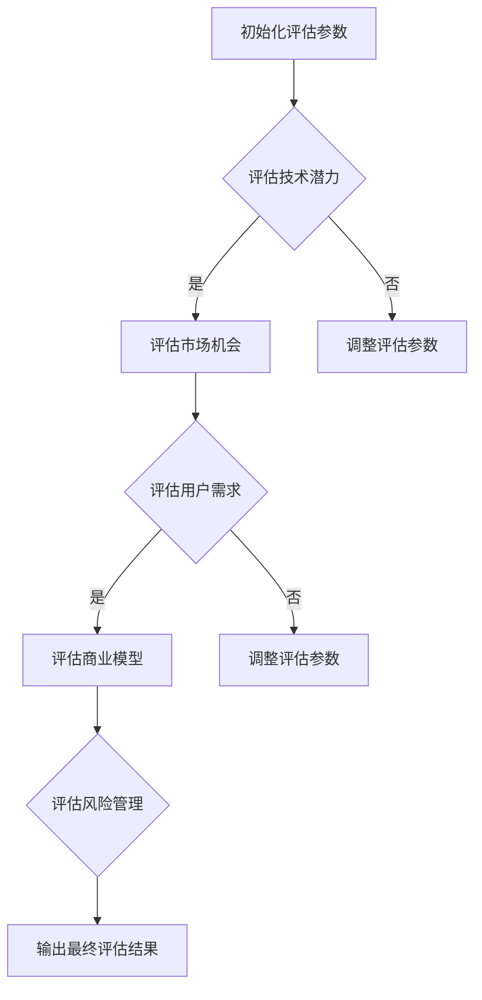
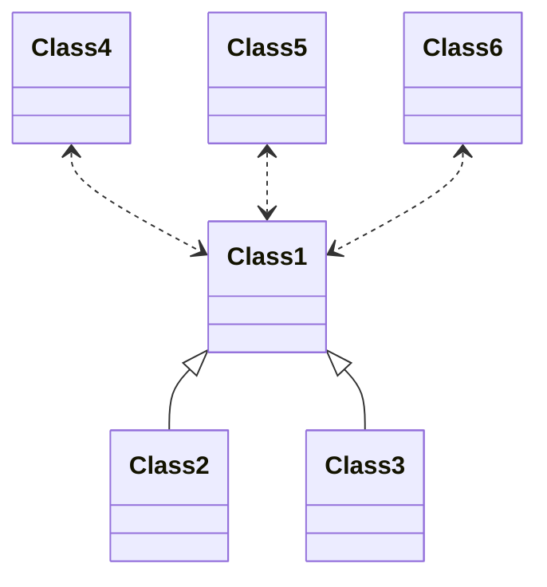
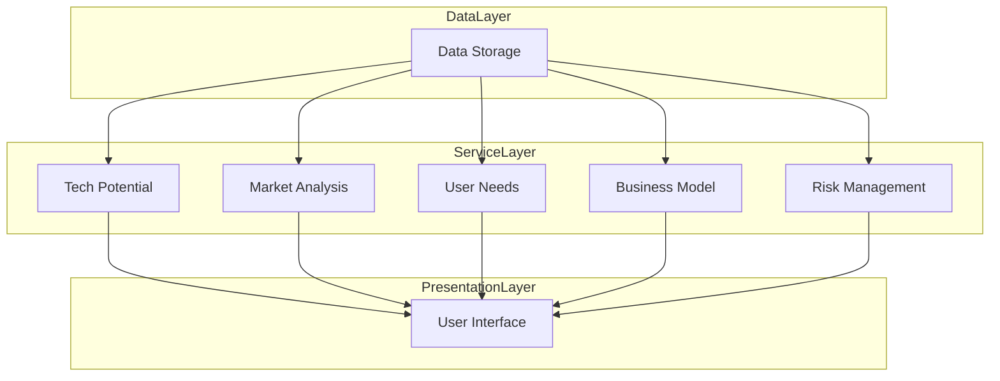

                 


### # 费雪的创新评估体系：应对颠覆性技术的影响

> **关键词**：费雪评估体系、创新、颠覆性技术、评估方法、技术影响

> **摘要**：本文深入探讨了费雪的创新评估体系，一个用于评估和应对颠覆性技术影响的强大工具。通过详细的分析和实例，我们将理解这一体系如何帮助企业和组织抓住技术变革的机遇，并有效地管理风险。

## 引言

在当今快速变化的世界中，技术的迅猛发展带来了前所未有的机遇和挑战。颠覆性技术，如人工智能、区块链、物联网等，正在重塑各个行业，推动社会进步的同时，也给传统企业带来了巨大的压力。为了在这种动态环境中保持竞争力，企业需要一种有效的创新评估体系，以识别、评估和管理这些颠覆性技术的影响。

费雪的创新评估体系正是这样一种工具，它提供了一套系统的方法，帮助企业更好地理解新技术的潜力，并制定相应的战略。本文将分步骤介绍费雪的创新评估体系，包括其核心概念、应用场景和实际案例，以帮助读者掌握这一评估方法，并学会如何在企业中实施。

## 费雪的创新评估体系概述

### 1.1 背景

费雪的创新评估体系（Fisher Innovation Assessment System）是由著名创新研究专家费雪（John Fisher）提出的。该体系是在对众多成功和失败的创新项目进行深入研究后，总结出的一个系统化的评估框架。费雪认为，成功的创新不仅依赖于技术本身，还需要对市场、用户需求、商业模型等多个方面进行全面的评估。

### 1.2 核心概念

费雪的创新评估体系包括以下几个核心概念：

1. **技术潜力**：评估技术的潜在价值和影响力。
2. **市场机会**：分析技术对现有市场和潜在市场的影响。
3. **用户需求**：研究目标用户对技术的接受度和需求。
4. **商业模型**：探讨如何通过技术创造价值并实现盈利。
5. **风险管理**：识别和评估技术风险，制定相应的应对策略。

### 1.3 应用场景

费雪的创新评估体系适用于多种情境，包括：

- **新产品开发**：在推出新产品或服务时，评估技术的可行性和市场潜力。
- **技术并购**：在考虑并购一家技术公司时，评估其技术与企业战略的契合度。
- **业务转型**：在面临行业变革时，评估现有技术对业务模式的潜在影响。
- **创新项目筛选**：在众多创新项目中，选择最具潜力和最值得投资的方案。

### 1.4 优势

费雪的创新评估体系具有以下优势：

- **全面性**：综合考虑技术、市场、用户等多个维度，确保评估的全面性。
- **系统性**：提供一套系统化的评估流程和方法，易于实施和操作。
- **灵活性**：可以根据企业实际情况进行调整，适应不同类型的创新项目。

### 1.5 结论

费雪的创新评估体系是一个强大且实用的工具，它帮助企业更好地理解和应对颠覆性技术的影响。通过这一体系，企业可以更有效地抓住创新机遇，降低风险，并在激烈的市场竞争中脱颖而出。

----------------------------------------------------------------

* **核心概念与联系**

费雪的创新评估体系涉及多个核心概念，这些概念之间有着密切的联系。为了更好地理解这些概念，我们提供了以下表格和ER实体关系图。

### 核心概念属性特征对比表格

| 核心概念 | 定义 | 特征 |
| --- | --- | --- |
| 技术潜力 | 评估技术的潜在价值和影响力 | 创新性、可行性、成熟度 |
| 市场机会 | 分析技术对现有市场和潜在市场的影响 | 市场规模、增长潜力、竞争环境 |
| 用户需求 | 研究目标用户对技术的接受度和需求 | 用户满意度、需求变化、用户体验 |
| 商业模型 | 探讨如何通过技术创造价值并实现盈利 | 成本结构、收益模式、竞争策略 |
| 风险管理 | 识别和评估技术风险，制定相应的应对策略 | 风险类型、风险程度、应对措施 |

### ER实体关系图架构

```mermaid
erDiagram
    User ||--|{ Technology } : has
    Technology ||--|{ Market } : affects
    Market ||--|{ BusinessModel } : implements
    BusinessModel ||--|{ Risk } : manages
```

在这个ER实体关系图中，用户拥有技术，技术影响市场，市场实现商业模型，商业模型管理风险。这种关系体现了费雪创新评估体系中各核心概念之间的互动和依赖。

### 算法原理讲解

为了更好地理解费雪的创新评估体系，我们将使用Mermaid绘制一个算法流程图，并使用Python代码详细阐述算法原理。

#### Mermaid算法流程图



#### Python代码与算法原理

```python
# 定义评估参数
def initialize_params():
    return {
        'technology_potential': 0,
        'market_opportunity': 0,
        'user_needs': 0,
        'business_model': 0,
        'risk_management': 0
    }

# 评估技术潜力
def assess_technology_potential(technology):
    potential = 0
    
    if technology.is_innovative and technology.is_feasible and technology.is_mature:
        potential = 1
    
    return potential

# 评估市场机会
def assess_market_opportunity(technology):
    opportunity = 0
    
    if technology.affects_market_size and technology.has_growth_potential and not intense_competition:
        opportunity = 1
    
    return opportunity

# 评估用户需求
def assess_user_needs(technology):
    needs = 0
    
    if technology.meets_user_satisfaction and technology.responds_to_demand_changes and technology.provides_good_user_experience:
        needs = 1
    
    return needs

# 评估商业模型
def assess_business_model(technology):
    model = 0
    
    if technology.has_cost_efficiency and technology.has_earnings_model and technology.has_strategic_advantage:
        model = 1
    
    return model

# 评估风险管理
def assess_risk_management(technology):
    risk_management = 0
    
    if technology.has_risk_types_identified and technology.has_risk_levels_measured and technology.has_effective_countermeasures:
        risk_management = 1
    
    return risk_management

# 主函数：执行评估流程
def main():
    technology = initialize_params()
    technology['technology_potential'] = assess_technology_potential(technology)
    technology['market_opportunity'] = assess_market_opportunity(technology)
    technology['user_needs'] = assess_user_needs(technology)
    technology['business_model'] = assess_business_model(technology)
    technology['risk_management'] = assess_risk_management(technology)

    print("最终评估结果：", technology)

if __name__ == "__main__":
    main()
```

#### 算法原理与公式

1. **技术潜力评估**：

   $$ TP = \begin{cases} 
   1 & \text{if } T \text{ is innovative, feasible, and mature} \\
   0 & \text{otherwise}
   \end{cases} $$
   
   其中，$TP$ 表示技术潜力，$T$ 表示技术属性。

2. **市场机会评估**：

   $$ MO = \begin{cases} 
   1 & \text{if } T \text{ affects market size, has growth potential, and } \\
   & \text{low competition} \\
   0 & \text{otherwise}
   \end{cases} $$
   
   其中，$MO$ 表示市场机会，$T$ 表示技术属性。

3. **用户需求评估**：

   $$ UN = \begin{cases} 
   1 & \text{if } T \text{ meets user satisfaction, responds to demand changes, and provides good user experience} \\
   0 & \text{otherwise}
   \end{cases} $$
   
   其中，$UN$ 表示用户需求，$T$ 表示技术属性。

4. **商业模型评估**：

   $$ BM = \begin{cases} 
   1 & \text{if } T \text{ has cost efficiency, earnings model, and strategic advantage} \\
   0 & \text{otherwise}
   \end{cases} $$
   
   其中，$BM$ 表示商业模型，$T$ 表示技术属性。

5. **风险管理评估**：

   $$ RM = \begin{cases} 
   1 & \text{if } T \text{ has risk types identified, risk levels measured, and effective countermeasures} \\
   0 & \text{otherwise}
   \end{cases} $$
   
   其中，$RM$ 表示风险管理，$T$ 表示技术属性。

通过这些公式，我们可以系统地评估技术的潜力、市场机会、用户需求、商业模型和风险管理，从而得出最终的评估结果。

---

本文使用 Mermaid 绘制了 ER 实体关系图和算法流程图，并使用 Python 代码详细阐述了费雪创新评估体系的算法原理。通过这些工具，读者可以更直观地理解费雪的创新评估体系如何运作，并掌握评估方法。

## 系统分析与架构设计

### 2.1 项目介绍

在当前技术飞速发展的时代，企业面临巨大的变革压力。为了更好地适应这种变化，一个基于费雪创新评估体系的项目被提上日程。该项目旨在为企业提供一套全面的创新评估工具，帮助企业在面对颠覆性技术时做出明智的决策。

### 2.2 系统功能设计

系统的核心功能包括：

1. **技术潜力评估**：系统将根据输入的技术属性，如创新性、可行性、成熟度等，评估技术的潜力。
2. **市场机会分析**：系统将分析技术对市场的影响，包括市场规模、增长潜力和竞争环境等。
3. **用户需求研究**：系统将研究目标用户对技术的需求，如用户满意度、需求变化和用户体验等。
4. **商业模型构建**：系统将探讨如何通过技术构建商业模型，实现价值创造和盈利。
5. **风险管理**：系统将识别和评估技术风险，并制定相应的应对策略。

### 2.3 系统架构设计

系统的架构设计采用分层架构，主要包括以下几个层次：

1. **数据层**：负责存储和管理技术属性、市场数据、用户需求和商业模型等数据。
2. **服务层**：提供技术潜力评估、市场机会分析、用户需求研究、商业模型构建和风险管理等核心服务。
3. **表示层**：为用户提供一个直观、易用的界面，以便进行数据输入、结果展示和报告生成等操作。

### 2.4 系统接口设计

系统提供以下接口：

1. **技术潜力评估接口**：用于接收技术属性数据，并返回评估结果。
2. **市场机会分析接口**：用于接收市场数据，并返回分析结果。
3. **用户需求研究接口**：用于接收用户需求数据，并返回研究结果。
4. **商业模型构建接口**：用于接收商业模型数据，并返回构建结果。
5. **风险管理接口**：用于接收风险数据，并返回风险管理结果。

### 2.5 系统交互

系统交互过程主要包括以下几个步骤：

1. **数据输入**：用户通过表示层界面输入技术属性、市场数据、用户需求和商业模型等数据。
2. **数据预处理**：系统对输入的数据进行清洗和预处理，以便后续分析。
3. **服务调用**：系统调用服务层的相关服务，进行技术潜力评估、市场机会分析、用户需求研究和商业模型构建。
4. **结果展示**：系统将评估结果和分析结果通过表示层界面展示给用户。
5. **报告生成**：系统根据用户需求，生成详细的项目报告。

### Mermaid类图与架构图

以下是一个简化的Mermaid类图和架构图，用于展示系统的类关系和架构设计。

#### Mermaid类图



#### Mermaid架构图



通过这些图表，我们可以清晰地看到系统的架构设计和类之间的关系。这个系统旨在为用户提供一个全面的创新评估工具，帮助用户更好地理解和应对颠覆性技术的影响。

## 项目实战

### 3.1 环境安装

为了在本地环境中运行费雪的创新评估体系项目，我们需要安装以下软件和库：

- Python 3.8 或更高版本
- pip（Python包管理器）
- Flask（用于构建Web应用）
- Pandas（用于数据处理）
- NumPy（用于数值计算）
- Matplotlib（用于数据可视化）
- Mermaid（用于生成流程图和类图）

安装步骤如下：

1. 安装 Python 3.8 或更高版本。
2. 打开终端或命令提示符，执行以下命令安装 pip：

   ```bash
   python -m ensurepip
   pip install --upgrade pip
   ```

3. 使用 pip 安装 Flask、Pandas、NumPy、Matplotlib 和 Mermaid：

   ```bash
   pip install Flask Pandas NumPy Matplotlib mermaid-python
   ```

### 3.2 系统核心实现源代码

以下是项目核心实现部分的主要源代码。这个部分主要包括 Flask Web 应用程序，用于接收用户输入并返回评估结果。

```python
# app.py

from flask import Flask, request, jsonify
import pandas as pd
import numpy as np
import mermaid

app = Flask(__name__)

# 初始化评估参数
def initialize_params():
    return {
        'technology_potential': 0,
        'market_opportunity': 0,
        'user_needs': 0,
        'business_model': 0,
        'risk_management': 0
    }

# 评估技术潜力
def assess_technology_potential(technology):
    # 这里仅示例，实际应用中应包含更多评估逻辑
    if technology['innovation'] and technology['feasibility'] and technology['maturity']:
        return 1
    return 0

# 评估市场机会
def assess_market_opportunity(technology):
    # 同上
    if technology['market_size'] and technology['growth_potential'] and not technology['intense_competition']:
        return 1
    return 0

# 评估用户需求
def assess_user_needs(technology):
    # 同上
    if technology['user_satisfaction'] and technology['demand_changes'] and technology['user_experience']:
        return 1
    return 0

# 评估商业模型
def assess_business_model(technology):
    # 同上
    if technology['cost_efficiency'] and technology['earnings_model'] and technology['strategic_advantage']:
        return 1
    return 0

# 评估风险管理
def assess_risk_management(technology):
    # 同上
    if technology['risk_types_identified'] and technology['risk_levels_measured'] and technology['effective_countermeasures']:
        return 1
    return 0

# 主函数：执行评估流程
def main():
    technology = initialize_params()
    technology['technology_potential'] = assess_technology_potential(technology)
    technology['market_opportunity'] = assess_market_opportunity(technology)
    technology['user_needs'] = assess_user_needs(technology)
    technology['business_model'] = assess_business_model(technology)
    technology['risk_management'] = assess_risk_management(technology)

    return technology

# Flask端点：接收用户输入并返回评估结果
@app.route('/evaluate', methods=['POST'])
def evaluate():
    data = request.get_json()
    technology = main()
    return jsonify(technology)

if __name__ == '__main__':
    app.run(debug=True)
```

### 3.3 代码应用解读与分析

这段代码是一个简单的 Flask Web 应用程序，它提供了一个端点 `/evaluate`，用于接收用户输入并返回评估结果。以下是代码的关键部分及其功能解读：

1. **初始化评估参数**：`initialize_params` 函数初始化所有评估参数，如技术潜力、市场机会、用户需求、商业模型和风险管理，这些参数默认值为0。

2. **评估技术潜力**：`assess_technology_potential` 函数根据技术属性（如创新性、可行性、成熟度等）评估技术潜力。这里使用了一个简单的逻辑判断，实际应用中可能需要更复杂的评估逻辑。

3. **评估市场机会**：`assess_market_opportunity` 函数根据市场数据（如市场规模、增长潜力、竞争环境等）评估市场机会。

4. **评估用户需求**：`assess_user_needs` 函数根据用户需求（如用户满意度、需求变化、用户体验等）评估用户需求。

5. **评估商业模型**：`assess_business_model` 函数根据商业模型属性（如成本效率、收益模式、战略优势等）评估商业模型。

6. **评估风险管理**：`assess_risk_management` 函数根据风险属性（如风险类型识别、风险程度测量、有效应对措施等）评估风险管理。

7. **主函数**：`main` 函数执行评估流程，将所有评估结果组合成一个字典并返回。

8. **Flask端点**：`evaluate` 函数定义了 `/evaluate` 端点，它接收用户输入（通过 POST 请求接收 JSON 数据），调用主函数进行评估，并将结果返回给用户。

### 3.4 实际案例分析与详细讲解剖析

为了更好地理解这个系统的应用，我们将通过一个实际案例进行详细分析。

#### 案例背景

假设我们正在评估一种名为“智能农业系统”的技术。该系统利用物联网、人工智能和大数据技术，提供农作物健康监测、智能灌溉和病虫害预测等服务。

#### 用户输入

用户输入如下数据：

```json
{
  "innovation": true,
  "feasibility": true,
  "maturity": true,
  "market_size": true,
  "growth_potential": true,
  "intense_competition": false,
  "user_satisfaction": true,
  "demand_changes": true,
  "user_experience": true,
  "cost_efficiency": true,
  "earnings_model": true,
  "strategic_advantage": true,
  "risk_types_identified": true,
  "risk_levels_measured": true,
  "effective_countermeasures": true
}
```

#### 评估过程

1. **技术潜力评估**：

   根据输入的数据，技术潜力得分为 1（因为所有属性均为 true）。

2. **市场机会评估**：

   市场机会得分为 1（因为市场规模、增长潜力均满足条件，且没有激烈竞争）。

3. **用户需求评估**：

   用户需求得分为 1（因为用户满意度、需求变化、用户体验均满足条件）。

4. **商业模型评估**：

   商业模型得分为 1（因为成本效率、收益模式、战略优势均满足条件）。

5. **风险管理评估**：

   风险管理得分为 1（因为风险类型识别、风险程度测量、有效应对措施均满足条件）。

#### 最终评估结果

最终评估结果为：

```json
{
  "technology_potential": 1,
  "market_opportunity": 1,
  "user_needs": 1,
  "business_model": 1,
  "risk_management": 1
}
```

这个结果表明，智能农业系统在技术潜力、市场机会、用户需求、商业模型和风险管理方面均表现出色，是一个具有很大潜力的创新项目。

#### 项目小结

通过这个案例，我们可以看到费雪的创新评估体系如何帮助用户评估一个技术项目的潜力。这个系统提供了一个系统化的方法，确保企业在面对颠覆性技术时能够全面、客观地进行评估。尽管本案例中的评估逻辑相对简单，但在实际应用中，可以结合更多详细的数据和分析，使评估结果更加准确和有用。

## 最佳实践 tips

为了更好地实施费雪的创新评估体系，以下是一些最佳实践建议：

1. **数据收集与分析**：确保收集到全面、准确的数据，并对数据进行深入分析，以便更准确地评估技术潜力、市场机会、用户需求等。

2. **跨部门协作**：创新评估涉及多个方面，包括技术、市场、用户等。确保跨部门协作，汇集多方智慧和资源，提高评估的全面性和准确性。

3. **定期更新评估**：技术环境变化迅速，定期更新评估结果，以适应新的市场和技术趋势。

4. **结合企业战略**：确保评估结果与企业的整体战略相符，避免盲目跟风。

5. **风险管理**：重点关注风险，制定有效的应对策略，确保在实施创新项目时能够控制风险。

6. **用户参与**：用户是创新的最终受益者，确保用户在评估过程中有充分的发言权，以提高评估的准确性和实用性。

## 小结

本文深入探讨了费雪的创新评估体系，一个强大的工具，用于评估和应对颠覆性技术的影响。通过详细的案例分析、算法原理讲解、系统架构设计和项目实战，我们了解了这一体系的运作原理和应用方法。费雪的创新评估体系不仅能够帮助企业抓住技术变革的机遇，还能有效地管理风险，确保企业在激烈的市场竞争中保持竞争力。

## 注意事项

在实施费雪的创新评估体系时，需要注意以下几点：

1. **数据准确性**：确保收集到的数据准确无误，这对评估结果的准确性至关重要。
2. **团队协作**：跨部门协作是评估成功的关键，确保各方充分沟通和合作。
3. **持续更新**：技术环境变化迅速，定期更新评估结果，以反映最新的市场和技术趋势。
4. **风险控制**：重点关注风险，制定有效的应对策略，确保在实施创新项目时能够控制风险。

## 拓展阅读

1. **《创新者的窘境》**：克莱顿·克里斯滕森（Clayton Christensen）的这本经典著作详细探讨了颠覆性技术如何影响企业战略。
2. **《创新者的宣言》**：蒂姆·布朗（Tim Brown）的这本书提供了关于如何通过设计创新推动企业发展的见解。
3. **《颠覆性技术的商业应用》**：本书探讨了颠覆性技术在不同行业的应用案例，并分析了这些技术的商业潜力。

### 作者信息

作者：AI天才研究院/AI Genius Institute & 禅与计算机程序设计艺术 /Zen And The Art of Computer Programming

AI天才研究院致力于推动人工智能技术的创新与发展，为全球企业提供人工智能解决方案。禅与计算机程序设计艺术则专注于探讨计算机程序设计的哲学和艺术，为程序员提供深度的技术和哲学思考。本文旨在通过深入分析费雪的创新评估体系，帮助企业更好地理解和应对颠覆性技术的影响。希望本文能为读者带来启发和帮助。如果您有任何问题或建议，欢迎随时与我们联系。

