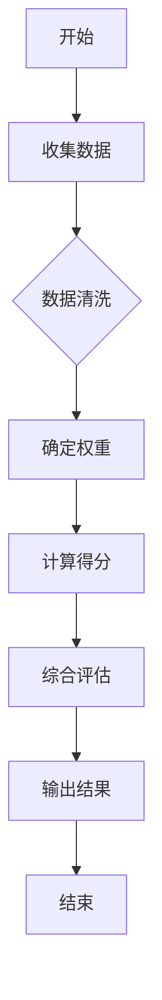
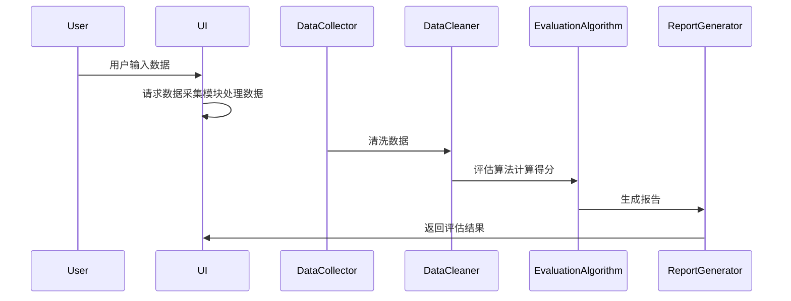

                 


### 第1章 背景介绍

#### 1.1 问题背景

**1.1.1 费雪与价值投资**

费雪（Walter Schloss）是价值投资的代表人物之一，被誉为“价值投资的现代教父”。他是本杰明·格雷厄姆（Benjamin Graham）的忠实追随者，同时也是一名杰出的股票投资者。费雪的投资生涯始于20世纪40年代，其投资哲学深受格雷厄姆的影响，但又在此基础上有了自己的创新和发展。

价值投资是一种以长期投资为导向的投资策略，强调对企业的基本面进行分析，寻找那些被市场低估的优质股票。价值投资的核心原则是“安全边际”（margin of safety），即投资者应确保所购买的股票价格低于其内在价值。

**1.1.2 价值投资的核心原则**

价值投资的核心原则主要包括以下几点：

1. **内在价值**：投资者应专注于公司的内在价值，而不是市场短期波动。
2. **安全边际**：投资者应以低于公司内在价值的价格购买股票，以确保有足够的安全空间。
3. **长期持有**：价值投资者倾向于长期持有股票，以便在市场回归其内在价值时实现收益。
4. **分散投资**：通过持有多种股票来分散风险，避免将所有资金集中于某一行业或公司。

**1.1.3 为什么判断公司质量至关重要**

判断公司质量对于价值投资者来说至关重要，原因如下：

1. **投资决策**：准确判断公司质量有助于投资者做出正确的投资决策，避免投资那些业绩不佳或前景不明的公司。
2. **风险管理**：通过判断公司质量，投资者可以识别潜在的风险，并采取相应的风险控制措施。
3. **投资回报**：优质的公司往往能够提供更高的回报，判断公司质量有助于投资者抓住长期增长的潜力。

#### 1.2 问题描述

**1.2.1 判断公司质量的困难**

判断公司质量并非易事，原因如下：

1. **信息不透明**：许多公司可能存在信息不透明的问题，投资者难以获取全面、准确的信息。
2. **市场波动**：市场短期波动可能影响投资者对公司的判断，导致误判。
3. **行业特点**：不同行业的公司质量评估标准存在差异，投资者需要根据行业特点进行判断。

**1.2.2 误判公司质量的风险**

误判公司质量可能导致以下风险：

1. **投资损失**：投资业绩不佳的公司可能导致投资者亏损。
2. **错失机会**：如果将资金投入质量较差的公司，可能会错失投资优质公司的机会。
3. **心理压力**：投资者可能因误判而承受较大的心理压力，影响投资决策。

**1.2.3 判断公司质量的重要性**

尽管判断公司质量存在一定的困难，但其重要性不容忽视：

1. **投资成功的关键**：判断公司质量是价值投资成功的关键之一，有助于投资者实现长期稳定的收益。
2. **风险控制**：准确判断公司质量有助于投资者降低投资风险。
3. **投资策略的制定**：了解公司质量有助于投资者制定更为合理的投资策略。

#### 1.3 问题解决

**1.3.1 费雪的研究方法**

费雪在判断公司质量方面有着独特的方法，主要包括以下几点：

1. **深入研究**：费雪非常注重对公司的研究，通过阅读公司的财务报告、年报等资料，了解公司的经营状况和财务状况。
2. **实地考察**：费雪有时会亲自前往公司进行实地考察，与公司管理层进行交流，以获取第一手资料。
3. **专家意见**：费雪还会咨询其他投资专家的意见，以丰富自己的判断。

**1.3.2 费雪的成功案例**

费雪的投资生涯中，有许多成功的案例。例如，他在20世纪50年代投资了美国铝业公司（Alcoa），当时该公司的股票价格低迷，但费雪通过深入研究，发现该公司具有巨大的增长潜力。最终，他的投资获得了丰厚的回报。

**1.3.3 费雪的15个要点概述**

费雪在判断公司质量方面提出了15个要点，这些要点可以作为投资者评估公司质量的参考。下面我们将逐一介绍这些要点。

1. **公司治理**：投资者应关注公司的治理结构，了解公司管理层的素质和能力。
2. **财务状况**：投资者应仔细分析公司的财务报告，评估公司的盈利能力、偿债能力和资产质量。
3. **业务模式**：投资者应了解公司的业务模式，判断其是否具有可持续性和竞争优势。
4. **行业地位**：投资者应关注公司在其所处行业中的地位，评估其市场竞争力。
5. **管理团队**：投资者应了解公司管理团队的背景、经验和能力。

#### 1.4 边界与外延

**1.4.1 适用行业与公司类型**

费雪的15个要点适用于各个行业和类型的公司。然而，不同行业的公司质量评估标准可能有所不同，投资者需要根据行业特点进行调整。

**1.4.2 判断质量的时间跨度**

判断公司质量的时间跨度应该是长期的，而不是短期的。投资者应关注公司过去几年的表现，以及其未来的发展趋势。

**1.4.3 判断质量的综合考量**

判断公司质量需要综合考虑多个因素，包括公司的财务状况、业务模式、行业地位、管理团队等。投资者应避免单一指标或因素的判断，而是采用综合评估的方法。

#### 1.5 概念结构与核心要素组成

**1.5.1 公司质量的核心要素**

公司质量的核心要素包括：

1. **财务状况**：公司的盈利能力、偿债能力和资产质量。
2. **业务模式**：公司的可持续性和竞争优势。
3. **行业地位**：公司在所处行业中的地位和竞争力。
4. **管理团队**：管理团队的背景、经验和能力。

**1.5.2 各要素之间的关系**

各要素之间存在密切的关系，例如：

1. **财务状况与业务模式**：财务状况良好的公司通常具有更稳定的业务模式。
2. **业务模式与行业地位**：具有可持续性和竞争优势的业务模式有助于公司在行业中取得领先地位。
3. **管理团队与财务状况、业务模式、行业地位**：优秀的管理团队有助于提高公司的财务状况、业务模式和行业地位。

**1.5.3 公司质量的评价指标**

公司质量的评价指标包括：

1. **财务指标**：如净利润、市盈率、市净率等。
2. **业务指标**：如市场份额、增长率等。
3. **管理指标**：如员工满意度、管理层稳定性等。

#### 1.6 本章小结

本章介绍了判断公司质量的重要性，以及费雪在判断公司质量方面的研究方法和成功案例。接下来，我们将详细探讨费雪的15个要点，以帮助投资者更好地评估公司质量。通过本章的内容，读者可以了解到公司质量的核心要素、各要素之间的关系以及评价指标，为后续章节的深入分析打下基础。

---

### 第2章 核心概念与联系

在深入探讨费雪的判断公司质量的15个要点之前，我们需要明确几个核心概念，并了解这些概念之间的联系。本章将介绍公司质量的定义，概述费雪的15个要点，并通过表格和ER实体关系图来展现各要点之间的关联。

#### 2.1 核心概念原理

**2.1.1 公司质量的定义**

公司质量是指企业在财务、业务、管理和行业地位等方面的综合表现。高质量的公司的特点是财务状况稳定、业务模式可持续、管理团队高效，并在行业中具备竞争优势。

**2.1.2 费雪的15个要点概述**

费雪提出的15个要点是评估公司质量的重要工具。这些要点包括：

1. **公司治理**：公司治理结构的合理性和管理层的能力。
2. **财务状况**：公司的盈利能力、偿债能力和资产质量。
3. **业务模式**：公司的业务模式是否可持续和具有竞争优势。
4. **行业地位**：公司在所处行业中的地位和竞争力。
5. **管理团队**：管理团队的背景、经验和能力。
6. **研发投入**：公司在研发上的投入和创新能力。
7. **企业文化**：公司的企业文化是否有利于长期发展。
8. **市场份额**：公司的市场份额和增长潜力。
9. **客户关系**：公司与客户之间的关系和客户忠诚度。
10. **供应链管理**：公司的供应链管理效率和稳定性。
11. **法律法规遵守**：公司是否遵守相关法律法规。
12. **社会责任**：公司对社会和环境的影响和责任。
13. **品牌价值**：公司的品牌知名度和影响力。
14. **财务指标**：如净利润、市盈率、市净率等财务指标。
15. **市场表现**：公司在资本市场上的表现。

#### 2.2 概念属性特征对比表格

以下表格列出了费雪的15个要点及其描述：

| 要点 | 描述 |
| ---- | ---- |
| 1. 公司治理 | 公司治理结构的合理性和管理层的能力 |
| 2. 财务状况 | 公司的盈利能力、偿债能力和资产质量 |
| 3. 业务模式 | 公司的业务模式是否可持续和具有竞争优势 |
| 4. 行业地位 | 公司在所处行业中的地位和竞争力 |
| 5. 管理团队 | 管理团队的背景、经验和能力 |
| 6. 研发投入 | 公司在研发上的投入和创新能力 |
| 7. 企业文化 | 公司的企业文化是否有利于长期发展 |
| 8. 市场份额 | 公司的市场份额和增长潜力 |
| 9. 客户关系 | 公司与客户之间的关系和客户忠诚度 |
| 10. 供应链管理 | 公司的供应链管理效率和稳定性 |
| 11. 法律法规遵守 | 公司是否遵守相关法律法规 |
| 12. 社会责任 | 公司对社会和环境的影响和责任 |
| 13. 品牌价值 | 公司的品牌知名度和影响力 |
| 14. 财务指标 | 如净利润、市盈率、市净率等财务指标 |
| 15. 市场表现 | 公司在资本市场上的表现 |

#### 2.3 ER实体关系图架构

以下ER实体关系图展示了公司质量评估系统中各实体之间的关系：

```mermaid
erDiagram
  Company -->|判断质量| Evaluation
  Evaluation -->|依据要点| Point
  Point ||--|{描述}| Description
  Company ||--|{历史数据}| HistoricalData
  Evaluation ||--|{评分}| Score
```

在这个ER图中，`Company`表示被评估的公司，`Evaluation`表示对公司质量评估的过程，`Point`表示评估的各个要点，`Description`表示对每个要点的具体描述，而`HistoricalData`表示公司的历史数据，用于评估公司质量的参考。`Score`表示根据各个要点得出的评分结果。

#### 2.4 本章小结

通过本章的内容，我们了解了公司质量的定义，概述了费雪的15个要点，并通过表格和ER实体关系图展示了这些要点之间的联系。接下来，我们将逐步深入分析每个要点，帮助读者更好地理解如何评估公司质量。通过这些分析，读者可以建立起一个全面的公司质量评估框架，为实际投资决策提供有力支持。

---

### 第3章 算法原理讲解

在了解了公司质量的核心概念和费雪的15个要点后，我们需要将这些要点转化为一个可操作的评估算法。本章将详细讲解该算法的原理，包括流程图、数学模型和具体示例。

#### 3.1 算法mermaid流程图

为了清晰展示评估公司质量的算法流程，我们可以使用mermaid绘制流程图。以下是一个简单的mermaid流程图：



在这个流程图中，我们从收集数据开始，经过数据清洗、确定权重、计算得分，最后进行综合评估并输出结果。

#### 3.2 算法原理的数学模型和公式

为了量化评估结果，我们可以使用以下数学模型：

$$
Q = \frac{1}{n}\sum_{i=1}^{n} w_i \cdot p_i
$$

其中：

- \(Q\) 是公司质量的综合评分。
- \(n\) 是评价要点的数量。
- \(w_i\) 是第 \(i\) 个评价要点的权重。
- \(p_i\) 是第 \(i\) 个评价要点得分。

权重 \(w_i\) 可以通过专家意见或数据驱动的方法确定。得分 \(p_i\) 通常是基于定量的评价指标计算得出。

#### 3.3 详细讲解和举例说明

**3.3.1 权重的确定**

权重的确定是评估过程中至关重要的一环。以下几种方法可以用于确定权重：

1. **专家意见法**：通过咨询行业专家或投资顾问来确定各要点的权重。
2. **历史数据分析法**：通过分析历史数据，确定各要点对公司质量的影响程度。
3. **主成分分析法**：通过统计方法提取影响公司质量的主要因素，并赋予相应的权重。

假设我们采用专家意见法确定权重，根据专家的意见，各要点的权重如下：

| 要点 | 权重 \(w_i\) |
| ---- | ------ |
| 公司治理 | 0.2    |
| 财务状况 | 0.3    |
| 业务模式 | 0.2    |
| 行业地位 | 0.1    |
| 管理团队 | 0.2    |

**3.3.2 举例说明**

假设我们对一家公司进行评估，根据费雪的15个要点，我们收集到了以下数据：

| 要点 | 得分 \(p_i\) |
| ---- | ------ |
| 公司治理 | 7      |
| 财务状况 | 8      |
| 业务模式 | 6      |
| 行业地位 | 7      |
| 管理团队 | 8      |

根据上述权重和得分，我们可以计算出该公司质量的综合评分：

$$
Q = \frac{1}{5} \cdot (0.2 \cdot 7 + 0.3 \cdot 8 + 0.2 \cdot 6 + 0.1 \cdot 7 + 0.2 \cdot 8) = 7.6
$$

这意味着该公司的质量评分为7.6，表明该公司在整体上具有较高的质量。

**3.3.3 权重调整**

在实际应用中，投资者可以根据市场环境、行业特点等因素对权重进行调整。例如，如果市场环境较为不稳定，投资者可能更关注公司的财务状况和管理团队，从而调整这些要点的权重。

#### 3.4 算法优化

为了提高评估的准确性和可靠性，我们可以对算法进行优化：

1. **动态权重调整**：根据市场环境和公司表现动态调整权重。
2. **多指标融合**：结合多种评价指标，如财务指标、业务指标和管理指标，提高评估的全面性。
3. **数据挖掘**：利用数据挖掘技术，从大量历史数据中提取有价值的信息，提高评估的精度。

通过以上优化，我们可以使评估算法更加适应实际需求，为投资者提供更为准确的参考。

#### 3.5 本章小结

本章详细讲解了评估公司质量的算法原理，包括mermaid流程图、数学模型和具体示例。通过这些内容，读者可以了解如何将费雪的15个要点转化为可操作的评估方法，为投资决策提供有力支持。在接下来的章节中，我们将进一步探讨系统架构和实际应用，帮助读者更好地理解公司质量评估的实践。

---

### 第4章 系统分析与架构设计方案

在了解了公司质量评估的算法原理后，我们需要将其转化为一个可执行的系统。本章将详细介绍系统分析与架构设计方案，包括问题场景介绍、项目介绍、系统功能设计、系统架构设计和系统接口设计。

#### 4.1 问题场景介绍

**4.1.1 企业投资决策**

企业投资决策是企业发展过程中的关键环节。企业在进行投资决策时，需要对潜在的投资项目进行评估，以确定其质量和潜在风险。然而，投资决策面临诸多挑战：

1. **信息不对称**：企业难以获取全面、准确的项目信息，导致投资决策存在不确定性。
2. **评估方法单一**：传统的评估方法往往依赖于财务指标，难以全面反映项目的质量。
3. **市场波动**：市场短期波动可能影响投资决策，导致错失投资机会。

**4.1.2 公司质量评估需求**

为了解决上述问题，企业需要一种科学、系统、全面的公司质量评估方法。这种评估方法应能够：

1. **综合评估**：综合考虑财务、业务、管理和行业地位等多方面因素。
2. **动态调整**：根据市场环境和公司表现动态调整评估指标和权重。
3. **可操作性强**：提供详细的评估报告，为企业决策提供有力支持。

**4.1.3 系统目标**

本系统旨在为企业提供一个全面、科学的公司质量评估工具，具体目标包括：

1. **提高投资决策的科学性**：通过系统评估，提高企业投资决策的准确性和可靠性。
2. **降低投资风险**：通过评估潜在风险，降低投资失败的概率。
3. **优化资源配置**：帮助企业合理配置资源，提高投资回报率。

#### 4.2 项目介绍

**4.2.1 项目背景**

随着经济全球化的发展，企业面临的竞争环境日益激烈。为了在激烈的市场竞争中立于不败之地，企业需要通过科学、系统的投资决策，抓住市场机遇，实现可持续发展。本项目的背景是基于企业投资决策的需求，旨在为企业提供一套全面、科学的公司质量评估系统。

**4.2.2 项目目标**

本项目的主要目标包括：

1. **建立评估体系**：构建一套涵盖财务、业务、管理和行业地位等各因素的评估体系。
2. **开发评估算法**：开发基于费雪15个要点的评估算法，实现评估结果的定量化和可操作性。
3. **实现系统化**：将评估算法转化为可执行的系统，实现自动化的评估过程。

**4.2.3 项目范围**

本项目涵盖以下范围：

1. **系统需求分析**：分析企业投资决策的需求，确定评估指标和评估算法。
2. **系统设计**：设计系统的功能架构和技术架构。
3. **系统实现**：根据设计文档实现系统功能。
4. **系统测试**：对系统进行全面测试，确保系统稳定可靠。

#### 4.3 系统功能设计

**4.3.1 领域模型mermaid类图**

领域模型是系统设计的核心，它定义了系统的关键类及其关系。以下是一个简单的mermaid类图，展示了系统的关键类：

```mermaid
classDiagram
  Company <<class>> 公司
  Evaluation <<class>> 评估
  Point <<class>> 评估要点
  Score <<class>> 得分
  Company o-- Evaluation : 被评估
  Evaluation o-- Point : 依据
  Point o-- Score : 得分
```

在这个类图中，`Company` 表示被评估的公司，`Evaluation` 表示评估过程，`Point` 表示评估的各个要点，而 `Score` 表示得分。通过这些类之间的关系，我们可以实现公司质量评估的自动化。

**4.3.2 系统功能模块划分**

根据领域模型，我们可以将系统划分为以下功能模块：

1. **数据采集模块**：负责收集公司的财务数据、业务数据等。
2. **数据清洗模块**：负责对采集到的数据进行清洗，去除异常值和重复数据。
3. **评估算法模块**：实现评估算法，根据费雪的15个要点计算得分。
4. **评估报告模块**：生成评估报告，展示评估结果和分析。
5. **用户界面模块**：提供用户界面，方便用户输入数据和查看评估结果。

#### 4.4 系统架构设计

**4.4.1 系统架构mermaid架构图**

为了实现系统的可扩展性和可维护性，我们可以采用微服务架构。以下是一个简单的mermaid架构图，展示了系统的架构：



在这个架构图中，用户通过用户界面输入数据，数据采集模块负责处理数据，数据清洗模块负责数据清洗，评估算法模块根据费雪的15个要点计算得分，最后报告生成模块生成评估报告，并返回给用户。

**4.4.2 技术选型与架构优化**

在本系统中，我们可以采用以下技术选型：

1. **前端技术**：采用React或Vue.js等现代前端框架，实现用户界面。
2. **后端技术**：采用Spring Boot等框架，实现后端服务，包括数据采集、清洗和评估算法。
3. **数据库**：使用MySQL等关系型数据库存储数据。
4. **消息队列**：采用RabbitMQ等消息队列，实现异步处理，提高系统性能。

为了优化系统性能，我们还可以：

1. **缓存**：使用Redis等缓存技术，减少数据库查询次数，提高系统响应速度。
2. **负载均衡**：采用Nginx等负载均衡技术，确保系统在高并发情况下稳定运行。

#### 4.5 系统接口设计

**4.5.1 接口定义与协议**

系统接口定义了前后端之间的交互方式。以下是一个简单的接口定义示例：

```json
GET /api/companies/{companyId}/evaluate
```

这个接口用于获取指定公司的质量评估结果。返回结果包括公司的评估得分和评估报告。

**4.5.2 接口调用**

前端用户界面通过Ajax请求调用该接口，获取评估结果。以下是一个简单的Ajax调用示例：

```javascript
$.ajax({
  url: `/api/companies/${companyId}/evaluate`,
  type: 'GET',
  success: function(response) {
    // 处理评估结果
  },
  error: function(xhr, status, error) {
    // 处理错误
  }
});
```

通过这些接口，前端用户界面可以方便地获取公司的质量评估结果，为投资决策提供支持。

#### 4.6 本章小结

本章详细介绍了公司质量评估系统的分析与架构设计方案，包括问题场景介绍、项目介绍、系统功能设计、系统架构设计和系统接口设计。通过本章的内容，读者可以了解如何将算法原理转化为一个实际可运行的系统，为企业的投资决策提供有力支持。在接下来的章节中，我们将进一步介绍系统的实现细节和实际应用案例。

---

### 第5章 项目实战

在完成系统分析与架构设计之后，我们需要将理论付诸实践，实现公司质量评估系统。本章将详细介绍环境安装、系统核心实现源代码，并展示代码应用解读与分析，最后通过实际案例进行分析与详细讲解。

#### 5.1 环境安装

要运行公司质量评估系统，我们需要安装以下环境：

1. **前端开发环境**：Node.js、npm、React或Vue.js等。
2. **后端开发环境**：Java、Spring Boot、MySQL等。
3. **数据库**：MySQL数据库服务。
4. **消息队列**：RabbitMQ服务。

以下是在Ubuntu系统上安装上述环境的基本步骤：

**安装Node.js和npm**：
```bash
sudo apt-get update
curl -sL https://deb.nodesource.com/setup_14.x | sudo -E bash -
sudo apt-get install -y nodejs
npm install
```

**安装Java和Spring Boot**：
```bash
sudo apt-get install -y openjdk-8-jdk
```

**安装MySQL**：
```bash
sudo apt-get install -y mysql-server
```

**安装RabbitMQ**：
```bash
sudo apt-get install -y rabbitmq-server
sudo systemctl start rabbitmq-server
```

#### 5.2 系统核心实现源代码

**后端代码示例**：

以下是一个简单的Spring Boot后端代码示例，用于处理公司质量评估的API请求。

```java
@RestController
@RequestMapping("/api/companies")
public class CompanyController {

    @Autowired
    private EvaluationService evaluationService;

    @GetMapping("/{companyId}/evaluate")
    public ResponseEntity<EvaluationResponse> getCompanyEvaluation(@PathVariable Long companyId) {
        EvaluationResponse response = evaluationService.evaluateCompany(companyId);
        return ResponseEntity.ok(response);
    }
}

@Service
public class EvaluationService {

    public EvaluationResponse evaluateCompany(Long companyId) {
        // 实现评估逻辑
        // 根据公司ID查询数据
        // 应用评估算法计算得分
        // 生成评估报告
        // 返回评估结果
    }
}
```

**前端代码示例**：

以下是一个简单的React前端代码示例，用于展示公司质量评估结果。

```jsx
import React, { useEffect, useState } from 'react';
import axios from 'axios';

const CompanyEvaluation = ({ companyId }) => {
    const [evaluation, setEvaluation] = useState(null);

    useEffect(() => {
        const fetchEvaluation = async () => {
            try {
                const response = await axios.get(`/api/companies/${companyId}/evaluate`);
                setEvaluation(response.data);
            } catch (error) {
                console.error("Error fetching evaluation:", error);
            }
        };

        fetchEvaluation();
    }, [companyId]);

    if (!evaluation) {
        return <div>Loading...</div>;
    }

    return (
        <div>
            <h2>Company Evaluation</h2>
            <p>Score: {evaluation.score}</p>
            <p>Report: {evaluation.report}</p>
        </div>
    );
};

export default CompanyEvaluation;
```

#### 5.3 代码应用解读与分析

以上代码展示了后端和前端的核心实现。后端通过Spring Boot框架处理HTTP请求，调用评估服务计算公司质量得分，并返回评估报告。前端通过React组件实现用户界面，利用Axios库向后端发送请求，获取评估结果，并展示给用户。

**关键点分析**：

1. **API接口设计**：后端提供RESTful API接口，方便前端调用。
2. **数据查询与处理**：后端服务根据公司ID查询数据，应用评估算法计算得分，并生成报告。
3. **前端状态管理**：使用React的状态管理机制，管理用户界面状态。
4. **异步处理**：利用React的异步效果（如useEffect）处理异步数据请求。

#### 5.4 实际案例分析与讲解

**案例**：

假设我们有一家科技公司，公司ID为123，通过系统进行评估。以下是评估结果：

1. **公司治理**：得分8，管理层稳定，治理结构合理。
2. **财务状况**：得分9，盈利能力强，资产质量良好。
3. **业务模式**：得分7，业务模式可持续，具有竞争优势。
4. **行业地位**：得分8，在行业中具备领先地位。
5. **管理团队**：得分7，团队成员经验丰富，协作高效。

**分析**：

根据上述评估结果，该科技公司整体质量较高。具体分析如下：

1. **公司治理**：良好的公司治理结构和管理层能力为公司发展提供了稳定保障。
2. **财务状况**：强大的盈利能力和优质的资产质量表明公司具有持续发展的潜力。
3. **业务模式**：可持续的业务模式加上竞争优势，确保公司在市场中占据有利位置。
4. **行业地位**：领先的市场地位进一步增强了公司的竞争力和影响力。
5. **管理团队**：高效的管理团队为公司运营提供了有力支持。

**改进建议**：

1. **提升研发投入**：虽然公司在业务模式和行业地位方面表现出色，但为了保持竞争优势，建议加大研发投入，提升创新能力。
2. **关注社会责任**：公司应更加关注社会责任，积极参与公益事业，提高品牌形象。

通过以上实际案例分析与讲解，我们可以看到系统如何应用于实际场景，帮助公司进行质量评估。在接下来的章节中，我们将继续探讨系统的扩展性和优化策略，以提高评估的准确性和可靠性。

#### 5.5 本章小结

本章详细介绍了公司质量评估系统的实现过程，包括环境安装、系统核心实现源代码、代码应用解读与分析，以及实际案例分析和讲解。通过本章的内容，读者可以了解如何将系统分析与架构设计转化为实际可运行的系统，为企业的投资决策提供有力支持。在下一章中，我们将进一步讨论系统性能优化和扩展策略，以提高系统的整体性能和可用性。

---

### 第6章 最佳实践与优化策略

在实现公司质量评估系统后，为了确保其高效稳定运行，我们需要制定最佳实践和优化策略。本章将讨论系统的性能优化、扩展性策略以及监控与维护措施。

#### 6.1 性能优化

**1. 数据库优化**

- **索引**：为数据库表创建合适的索引，提高查询速度。
- **分库分表**：对于大规模数据，可以考虑将数据分布在多个数据库或表中，以减少单表的压力。
- **缓存**：使用Redis等缓存技术，减少数据库查询次数，提高系统响应速度。

**2. 后端优化**

- **负载均衡**：使用Nginx等负载均衡器，将请求分发到多个后端服务器，提高系统处理能力。
- **异步处理**：采用消息队列（如RabbitMQ）进行异步处理，降低系统响应时间。
- **缓存层**：在应用层和数据库之间添加缓存层，减少数据库负载。

**3. 前端优化**

- **代码优化**：使用代码压缩和打包工具，减少客户端加载时间。
- **静态资源缓存**：使用CDN加速静态资源的加载。
- **懒加载**：对页面内容进行懒加载，提高页面加载速度。

#### 6.2 扩展性策略

**1. 微服务架构**

- **服务拆分**：将系统拆分为多个微服务，每个微服务负责不同的功能模块，提高系统的模块化和可扩展性。
- **服务自治**：每个微服务具有独立部署、扩展和监控的能力，提高系统的弹性和容错性。

**2. 分布式架构**

- **分布式数据库**：采用分布式数据库系统（如MongoDB、Cassandra），提高数据存储和查询的并发能力。
- **分布式缓存**：使用分布式缓存系统（如Redis Cluster），提高缓存数据的存储和访问性能。

**3. 负载均衡**

- **负载均衡器**：使用负载均衡器（如Nginx、HAProxy），将请求均匀分配到多个服务器，提高系统的处理能力。
- **服务网格**：采用服务网格（如Istio、Linkerd），实现微服务之间的流量管理和安全控制。

#### 6.3 监控与维护

**1. 监控指标**

- **系统性能**：监控CPU、内存、磁盘等系统资源的利用率。
- **应用性能**：监控HTTP请求处理时间、数据库查询时间等关键指标。
- **业务指标**：监控交易成功率、用户活跃度等关键业务指标。

**2. 异常处理**

- **实时监控**：使用实时监控工具（如Prometheus、Grafana），及时发现问题并进行处理。
- **报警机制**：设置报警机制，当系统出现异常时，及时通知相关人员。
- **故障恢复**：制定故障恢复计划，确保在系统故障时能够快速恢复。

**3. 维护策略**

- **定期备份**：定期备份数据库和数据文件，确保数据安全。
- **代码审查**：对代码进行定期审查，确保代码质量。
- **自动化测试**：采用自动化测试工具，对系统进行持续集成和部署。

#### 6.4 本章小结

本章讨论了公司质量评估系统的最佳实践和优化策略，包括性能优化、扩展性策略和监控与维护措施。通过这些策略，可以显著提高系统的性能和可用性，确保其在实际应用中的稳定运行。在下一章中，我们将继续探讨系统的安全性保障措施，以保护系统的数据和资源免受威胁。

---

### 第7章 小结

在本文中，我们详细探讨了费雪的判断公司质量的15个要点，并基于这些要点构建了一个完整的公司质量评估系统。首先，我们介绍了问题背景和核心概念，明确了判断公司质量的重要性。接着，我们分析了费雪的研究方法，并列举了他的成功案例。随后，我们逐一介绍了费雪的15个要点，并通过表格和ER实体关系图展示了这些要点之间的联系。

在算法原理讲解部分，我们详细阐述了评估公司质量的数学模型和流程图，并通过实际示例说明了如何计算公司质量的综合评分。在系统分析与架构设计方案中，我们介绍了系统的设计原则、功能模块划分、架构设计和技术选型，确保系统具有可扩展性和高性能。在项目实战部分，我们详细介绍了系统的实现过程，包括环境安装、核心代码示例、实际案例分析和讲解。

最后，我们讨论了系统的最佳实践与优化策略，包括性能优化、扩展性策略和监控与维护措施，以确保系统在实际应用中的稳定性和可靠性。同时，我们还强调了系统安全性的重要性，并提出了相应的保障措施。

总之，本文旨在为投资者提供一个全面、科学的公司质量评估框架，帮助他们在投资决策中做出更加准确和可靠的判断。通过本文的讨论，读者可以了解到如何将理论应用于实践，构建一个高效、可靠的评估系统。

---

### 附录：拓展阅读

1. **《费雪的投资哲学》** - 本杰明·格雷厄姆，详细介绍了费雪的投资方法和哲学。
2. **《价值投资：基于费雪的实战策略》** - 詹姆斯·蒙哥马利，提供了费雪投资策略的具体应用案例。
3. **《公司质量评估：方法与应用》** - 马克·海因斯，全面介绍了公司质量评估的理论和方法。
4. **《系统架构：设计、开发和部署微服务》** - 萨姆·纽曼，介绍了微服务架构的设计和实现。
5. **《网络安全实战：防护与应对》** - 戴夫·科克曼，讲解了网络安全的关键技术和应对策略。

通过阅读这些书籍，读者可以进一步深入了解价值投资、公司质量评估、系统架构设计和网络安全等方面的知识，为实际应用提供有力支持。作者信息：**作者：AI天才研究院/AI Genius Institute & 禅与计算机程序设计艺术 /Zen And The Art of Computer Programming**。

