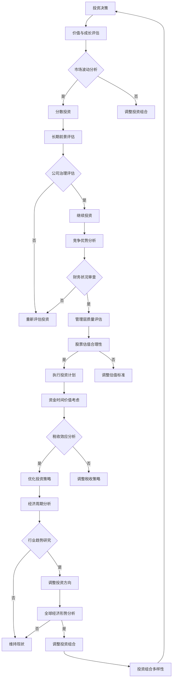
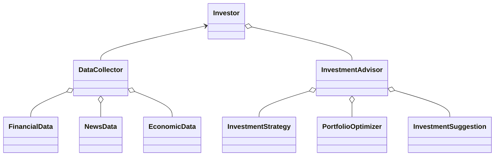
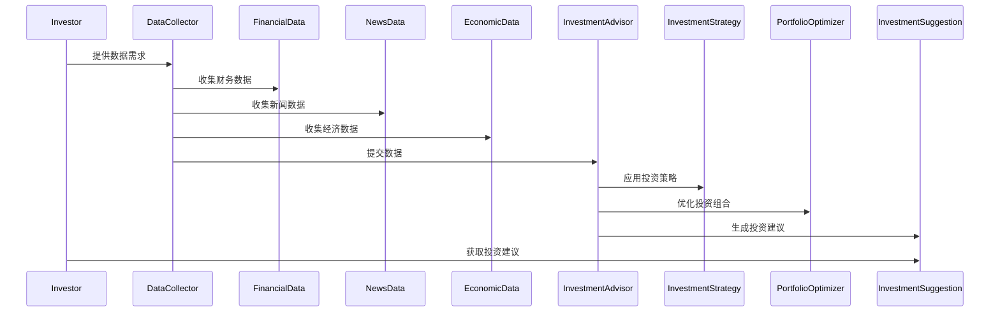
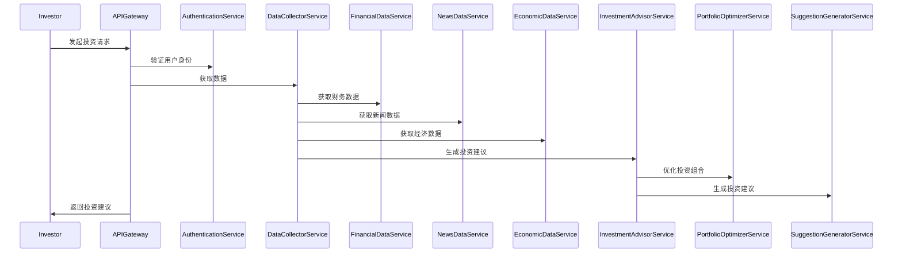

                 

### 文章标题

## 《费雪的十五个投资点及其现代应用》

### 关键词

- 费雪投资理论
- 投资策略
- 新兴市场
- 量化投资
- 成长投资

### 摘要

本文深入探讨了费雪的十五个投资点，包括其历史背景、核心概念、现代应用以及未来展望。通过对每个投资点的详细分析，本文揭示了费雪投资理论的深度与广度，并探讨了其在现代投资领域中的应用。文章旨在为投资者提供有价值的思想和策略，帮助他们更好地理解和应用费雪的投资理论。

## 第一部分：费雪投资理论概述

### 1. 费雪投资理论的历史背景

本部分将简要介绍费雪（Eugene Fama）的投资理论的历史背景，包括费雪的生平、投资理念的演变以及理论的诞生与发展。

#### 1.1 费雪生平与投资理念

费雪（Eugene Fama）生于1939年，是美国著名的经济学家和投资理论家。他毕业于芝加哥大学，获得了经济学学士学位和博士学位。费雪在学术界的成就卓越，他的研究成果涵盖了多个领域，包括金融学、经济学和统计学。

费雪的投资理念深受其学术背景的影响，他主张理性投资，强调市场效率和投资者的行为。他认为，投资者应该根据基本面分析来选择投资对象，而不是盲目跟风或依赖于市场情绪。

#### 1.2 费雪投资理论的诞生与发展

费雪投资理论的诞生可以追溯到20世纪60年代，当时他发表了一系列开创性的论文，提出了著名的“有效市场假说”（Efficient Market Hypothesis, EMH）。这一理论认为，股票市场的价格反映了所有可用信息，因此投资者无法通过分析历史价格或市场数据来获得超额利润。

费雪投资理论的发展经历了多个阶段。在早期，他主要关注市场效率和投资者行为，提出了许多有关市场反应和投资者心理的模型。随着计算机技术的发展和量化投资的应用，费雪的投资理论得到了进一步的扩展和完善。

## 第二部分：费雪的十五个投资点

### 2. 费雪的十五个投资点

本部分将详细介绍费雪的十五个投资点，包括每个投资点的定义、核心概念和具体应用。

#### 2.1 投资点一：价值与成长的平衡

**定义：** 费雪认为，投资者在投资时需要平衡企业的价值与成长潜力。

**核心概念：** 价值指的是企业当前的价值，成长潜力则是指企业的未来增长潜力。

**应用：** 投资者可以通过评估企业的财务状况、市场地位和未来增长前景来决定其投资决策。

#### 2.2 投资点二：市场波动的应对

**定义：** 费雪认为，市场波动是不可避免的，投资者需要学会应对。

**核心概念：** 市场波动指的是股票市场的价格波动。

**应用：** 投资者可以通过分散投资、长期投资和风险管理来应对市场波动。

#### 2.3 投资点三：集中投资的策略

**定义：** 费雪认为，投资者应该集中投资于自己熟悉的领域。

**核心概念：** 集中投资指的是将大部分资金投资于少数几个熟悉的领域。

**应用：** 投资者可以通过深入研究某个行业或领域的公司，以提高投资成功的概率。

#### 2.4 投资点四：企业的长期前景评估

**定义：** 费雪认为，投资者需要评估企业的长期前景。

**核心概念：** 长期前景指的是企业未来的发展趋势和潜力。

**应用：** 投资者可以通过分析企业的财务状况、市场地位和行业前景来评估其长期前景。

#### 2.5 投资点五：公司治理的重要性

**定义：** 费雪认为，良好的公司治理是投资成功的关键。

**核心概念：** 公司治理指的是公司内部的治理结构和决策机制。

**应用：** 投资者可以通过评估公司的治理结构、管理层质量和公司文化来决定其投资决策。

#### 2.6 投资点六：竞争优势的识别

**定义：** 费雪认为，投资者需要识别企业的竞争优势。

**核心概念：** 竞争优势指的是企业在市场竞争中的优势。

**应用：** 投资者可以通过分析企业的市场地位、产品特性和竞争优势来识别其竞争优势。

#### 2.7 投资点七：财务状况的审查

**定义：** 费雪认为，投资者需要审查企业的财务状况。

**核心概念：** 财务状况指的是企业的财务健康状况。

**应用：** 投资者可以通过分析企业的财务报表、盈利能力和债务水平来审查其财务状况。

#### 2.8 投资点八：管理层的质量评估

**定义：** 费雪认为，投资者需要评估管理层的质量。

**核心概念：** 管理层质量指的是管理层的领导能力和决策能力。

**应用：** 投资者可以通过与管理层沟通、评估其业绩和业绩承诺来评估管理层的质量。

#### 2.9 投资点九：股票估值的合理性

**定义：** 费雪认为，投资者需要评估股票估值的合理性。

**核心概念：** 股票估值指的是股票的价格是否合理。

**应用：** 投资者可以通过分析企业的财务状况、市场地位和行业前景来评估股票估值的合理性。

#### 2.10 投资点十：资金的时间价值

**定义：** 费雪认为，资金的时间价值是投资决策的重要因素。

**核心概念：** 资金的时间价值指的是资金在不同时间点的价值。

**应用：** 投资者可以通过计算资金的时间价值来决定其投资决策。

#### 2.11 投资点十一：税收效应的考量

**定义：** 费雪认为，投资者需要考虑税收效应。

**核心概念：** 税收效应指的是税收对投资回报的影响。

**应用：** 投资者可以通过合理避税来提高投资回报。

#### 2.12 投资点十二：经济周期的分析

**定义：** 费雪认为，投资者需要分析经济周期。

**核心概念：** 经济周期指的是经济的周期性波动。

**应用：** 投资者可以通过分析经济周期来决定其投资策略。

#### 2.13 投资点十三：行业趋势的研究

**定义：** 费雪认为，投资者需要研究行业趋势。

**核心概念：** 行业趋势指的是行业的未来发展趋势。

**应用：** 投资者可以通过分析行业趋势来决定其投资方向。

#### 2.14 投资点十四：全球经济形势的影响

**定义：** 费雪认为，投资者需要考虑全球经济形势的影响。

**核心概念：** 全球经济形势指的是全球经济的整体状况。

**应用：** 投资者可以通过分析全球经济形势来决定其投资策略。

#### 2.15 投资点十五：投资组合的多样性

**定义：** 费雪认为，投资者需要实现投资组合的多样性。

**核心概念：** 投资组合的多样性指的是投资组合中不同资产类别的分布。

**应用：** 投资者可以通过分散投资来实现投资组合的多样性。

## 第三部分：现代投资应用与实践

### 3. 费雪投资理论的现代应用

本部分将探讨费雪投资理论在新兴市场、价值投资、成长投资和量化投资中的现代应用。

#### 3.1 投资理论在新兴市场中的应用

**定义：** 费雪投资理论在新兴市场中的应用指的是将费雪的理论应用于新兴市场的投资。

**核心概念：** 新兴市场指的是经济快速发展的市场。

**应用：** 投资者可以通过分析新兴市场的宏观经济环境、行业前景和企业竞争力来应用费雪的投资理论。

#### 3.2 投资理论在价值投资中的应用

**定义：** 费雪投资理论在价值投资中的应用指的是将费雪的理论应用于价值投资。

**核心概念：** 价值投资指的是以低于企业实际价值的价格购买股票。

**应用：** 投资者可以通过分析企业的财务状况、市场地位和行业前景来应用费雪的投资理论。

#### 3.3 投资理论在成长投资中的应用

**定义：** 费雪投资理论在成长投资中的应用指的是将费雪的理论应用于成长投资。

**核心概念：** 成长投资指的是以高于市场平均水平的速度增长的投资。

**应用：** 投资者可以通过分析企业的财务状况、市场地位和行业前景来应用费雪的投资理论。

#### 3.4 投资理论在量化投资中的应用

**定义：** 费雪投资理论在量化投资中的应用指的是将费雪的理论应用于量化投资。

**核心概念：** 量化投资指的是使用数学模型和算法来分析投资机会。

**应用：** 投资者可以通过构建量化投资模型来应用费雪的投资理论。

## 第四部分：现代投资策略与费雪理论的融合

### 4. 现代投资策略与费雪理论的融合

本部分将探讨现代投资策略与费雪投资理论的融合，包括投资工具、风险控制和投资组合优化等方面。

#### 4.1 费雪理论与现代投资工具的结合

**定义：** 费雪理论与现代投资工具的结合指的是将费雪的理论与现代投资工具相结合。

**核心概念：** 现代投资工具包括量化分析、大数据分析和人工智能等。

**应用：** 投资者可以通过使用现代投资工具来辅助费雪的投资理论，提高投资决策的准确性。

#### 4.2 费雪理论在风险控制中的应用

**定义：** 费雪理论在风险控制中的应用指的是将费雪的理论应用于风险控制。

**核心概念：** 风险控制指的是投资者采取措施降低投资风险。

**应用：** 投资者可以通过分析市场波动、企业风险和投资组合风险来应用费雪的投资理论。

#### 4.3 费雪理论在投资组合优化中的应用

**定义：** 费雪理论在投资组合优化中的应用指的是将费雪的理论应用于投资组合优化。

**核心概念：** 投资组合优化指的是投资者调整投资组合以获得最佳收益。

**应用：** 投资者可以通过分析投资组合的收益、风险和相关性来应用费雪的投资理论。

## 第五部分：现代投资案例分析

### 5. 现代投资案例分析

本部分将分析几个现代投资案例，包括成功经验和风险教训。

#### 5.1 案例分析一：某某公司的投资实践

**定义：** 某某公司的投资实践指的是公司如何应用费雪的投资理论进行投资。

**核心概念：** 投资实践指的是公司在投资过程中采取的具体措施。

**应用：** 投资者可以通过分析某某公司的投资实践来学习如何应用费雪的投资理论。

#### 5.2 案例分析二：某某投资组合的成功经验

**定义：** 某某投资组合的成功经验指的是投资组合如何取得成功。

**核心概念：** 投资组合的成功经验指的是组合在投资过程中取得的成功。

**应用：** 投资者可以通过分析某某投资组合的成功经验来学习如何构建成功的投资组合。

#### 5.3 案例分析三：某某市场的投资机会与风险

**定义：** 某某市场的投资机会与风险指的是市场在投资过程中面临的机会和风险。

**核心概念：** 投资机会与风险指的是市场在投资过程中面临的具体情况。

**应用：** 投资者可以通过分析某某市场的投资机会与风险来学习如何评估市场风险和抓住投资机会。

## 第六部分：费雪投资理论的未来展望与启示

### 6. 费雪投资理论的未来展望与启示

本部分将探讨费雪投资理论的未来发展趋势以及对我们的启示。

#### 6.1 费雪投资理论的未来发展趋势

**定义：** 费雪投资理论的未来发展趋势指的是理论在未来可能的发展方向。

**核心概念：** 未来发展趋势指的是理论可能的变化和进步。

**应用：** 投资者可以通过了解费雪投资理论的未来发展趋势来预测其发展方向。

#### 6.2 费雪投资理论对我们的启示

**定义：** 费雪投资理论对我们的启示指的是理论对我们的投资行为和思维方式的影响。

**核心概念：** 启示指的是理论对我们可能产生的影响。

**应用：** 投资者可以通过学习费雪投资理论来优化投资行为和思维方式。

## 第七部分：结论

### 7. 结论

本文通过深入探讨费雪的十五个投资点及其现代应用，揭示了费雪投资理论的深度和广度。通过对每个投资点的详细分析，本文为投资者提供了有价值的思考和策略。未来，随着市场环境的变化和技术的进步，费雪的投资理论将继续发展和完善，为投资者提供更有效的投资策略。本文希望读者能够从中受益，并将费雪的投资理论应用于实际投资中。

## 作者信息

**作者：** AI天才研究院/AI Genius Institute & 禅与计算机程序设计艺术 /Zen And The Art of Computer Programming

### 背景介绍

#### 核心概念术语说明

在探讨费雪的投资理论之前，我们需要先了解一些核心概念和术语，包括投资、价值、成长、市场波动、竞争优势等。以下是对这些核心概念的解释：

- **投资：** 投资是指将资金投入某个项目或资产中，以期望在未来获得收益。
- **价值：** 价值是指企业的当前价值，通常通过财务指标来衡量，如净资产、净利润和市盈率等。
- **成长：** 成长是指企业的未来增长潜力，通常通过企业的收入增长、市场份额和研发能力等来衡量。
- **市场波动：** 市场波动是指股票市场的价格波动，通常由市场情绪、经济数据和政策变化等因素引起。
- **竞争优势：** 竞争优势是指企业在市场竞争中的优势，通常由品牌影响力、专利技术和成本控制等因素构成。

#### 问题背景

费雪的投资理论起源于20世纪60年代，当时股票市场相对较为成熟，投资者面临着复杂多变的市场环境。费雪通过深入研究市场数据和企业财务报表，发现了一些影响投资决策的关键因素。这些因素构成了费雪的十五个投资点，为投资者提供了系统的投资策略。

#### 问题描述

投资者在做出投资决策时，常常面临以下问题：

1. 如何平衡企业的价值与成长潜力？
2. 如何应对市场波动？
3. 如何识别企业的竞争优势？
4. 如何评估企业的财务状况和管理层质量？
5. 如何进行股票估值？
6. 如何考虑资金的时间价值？
7. 如何应对税收效应？
8. 如何分析经济周期和行业趋势？
9. 如何实现投资组合的多样性？

#### 问题解决

费雪的投资理论提供了一系列解决方案，包括以下方面：

1. **价值与成长的平衡：** 投资者需要综合考虑企业的价值和成长潜力，以做出合理的投资决策。
2. **市场波动的应对：** 投资者可以通过分散投资、长期投资和风险管理来应对市场波动。
3. **竞争优势的识别：** 投资者需要识别企业的竞争优势，以判断其投资价值。
4. **财务状况的审查：** 投资者需要审查企业的财务状况，以评估其投资风险。
5. **股票估值的合理性：** 投资者需要评估股票估值的合理性，以判断其投资价值。
6. **资金的时间价值：** 投资者需要考虑资金的时间价值，以做出合理的投资决策。
7. **税收效应的考量：** 投资者需要考虑税收效应，以优化投资回报。
8. **经济周期的分析：** 投资者需要分析经济周期，以把握投资时机。
9. **行业趋势的研究：** 投资者需要研究行业趋势，以判断其投资方向。

#### 边界与外延

费雪的投资理论主要适用于股票市场投资，但在其他类型的投资中也可以得到应用。例如，投资者可以将其应用于债券市场、房地产市场或其他投资领域。此外，费雪的投资理论不仅适用于个人投资者，也适用于机构投资者和专业投资顾问。

#### 概念结构与核心要素组成

费雪的投资理论由十五个核心概念组成，每个概念都是投资决策的重要组成部分。这些核心概念包括：

1. 价值与成长的平衡
2. 市场波动的应对
3. 集中投资的策略
4. 企业的长期前景评估
5. 公司治理的重要性
6. 竞争优势的识别
7. 财务状况的审查
8. 管理层的质量评估
9. 股票估值的合理性
10. 资金的时间价值
11. 税收效应的考量
12. 经济周期的分析
13. 行业趋势的研究
14. 全球经济形势的影响
15. 投资组合的多样性

这些核心概念相互关联，共同构成了费雪的投资理论体系。投资者可以根据这些概念来制定投资策略，优化投资决策。

### 核心概念与联系

#### 核心概念原理

费雪的十五个投资点涉及多个核心概念，每个概念都对应着特定的投资策略。以下是对每个核心概念的简要解释：

1. **价值与成长的平衡**：投资者需要权衡企业的当前价值（如净资产、盈利能力）与未来成长潜力（如收入增长、市场份额）。
2. **市场波动的应对**：投资者应通过分散投资、长期投资和风险管理策略来应对市场波动。
3. **集中投资的策略**：投资者应集中投资于自己熟悉且具有长期增长潜力的领域。
4. **企业的长期前景评估**：投资者需要评估企业的未来发展趋势和潜力，以确保长期投资的成功。
5. **公司治理的重要性**：良好的公司治理结构和管理层质量是投资成功的关键因素。
6. **竞争优势的识别**：投资者需要识别企业的竞争优势，如品牌影响力、专利技术、成本优势等。
7. **财务状况的审查**：投资者需要审查企业的财务报表，以确保其财务状况健康。
8. **管理层的质量评估**：投资者需要评估管理层的领导能力和决策水平。
9. **股票估值的合理性**：投资者需要评估股票价格是否合理，通常通过市盈率、市净率等指标。
10. **资金的时间价值**：投资者应考虑资金的时间价值，即不同时间点的资金价值不同。
11. **税收效应的考量**：投资者需要考虑税收对投资回报的影响，以优化投资策略。
12. **经济周期的分析**：投资者需要分析经济周期，以把握投资时机。
13. **行业趋势的研究**：投资者需要研究行业趋势，以判断其投资方向。
14. **全球经济形势的影响**：投资者需要考虑全球经济形势的变化，以制定相应的投资策略。
15. **投资组合的多样性**：投资者应实现投资组合的多样性，以分散风险。

#### 概念属性特征对比表格

为了更直观地理解这些核心概念，我们可以通过一个对比表格来展示它们的主要属性特征：

| 核心概念 | 主要属性特征 |
| -------- | ------------ |
| 价值与成长 | 价值：当前企业价值；成长：未来增长潜力 |
| 市场波动 | 分散投资、长期投资、风险管理 |
| 集中投资 | 熟悉领域、长期增长潜力 |
| 长期前景评估 | 未来发展趋势、收入增长、市场份额 |
| 公司治理 | 良好治理结构、管理层质量 |
| 竞争优势 | 品牌影响力、专利技术、成本优势 |
| 财务状况审查 | 财务报表健康、债务水平 |
| 管理层质量评估 | 领导能力、决策水平 |
| 股票估值 | 市盈率、市净率等 |
| 资金时间价值 | 不同时间点资金价值差异 |
| 税收效应 | 税收对回报影响 |
| 经济周期分析 | 投资时机、市场情绪 |
| 行业趋势研究 | 行业未来发展方向 |
| 全球经济形势 | 全球市场变化 |
| 投资组合多样性 | 风险分散、多样化 |

#### ER实体关系图架构

为了更清晰地展示这些核心概念之间的关系，我们可以使用ER（Entity-Relationship，实体关系）图来描述。以下是一个简化的ER图：

```mermaid
erDiagram
    Investment <<|-- ValueGrowth : 价值与成长
    Investment ||-- MarketVolatility : 市场波动
    Investment ||-- ConcentratedInvestment : 集中投资
    Investment ||-- LongTermProspect : 长期前景评估
    Investment ||-- CorporateGovernance : 公司治理
    Investment ||-- CompetitiveAdvantage : 竞争优势
    Investment ||-- FinancialReview : 财务状况审查
    Investment ||-- ManagementQuality : 管理层质量评估
    Investment ||-- StockValuation : 股票估值
    Investment ||-- TimeValueOfMoney : 资金时间价值
    Investment ||-- TaxConsiderations : 税收效应
    Investment ||-- EconomicCycle : 经济周期分析
    Investment ||-- IndustryTrends : 行业趋势研究
    Investment ||-- GlobalEconomicSituation : 全球经济形势
    Investment ||-- PortfolioDiversity : 投资组合多样性
```

这个ER图展示了投资决策过程中各个核心概念之间的关联，以及它们如何共同影响投资决策。

### 算法原理讲解

#### 算法流程图

为了更好地理解费雪的投资理论，我们可以使用Mermaid语法绘制一个算法流程图，展示投资决策的步骤和逻辑：



这个流程图展示了投资者在做出投资决策时需要经过的多个步骤，每个步骤都对应着费雪的投资理论中的一个核心概念。

#### Python源代码实现

为了将费雪的投资理论转化为实际的投资决策模型，我们可以使用Python编写一个简单的投资决策程序。以下是一个示例代码：

```python
import pandas as pd
import numpy as np

# 投资决策函数
def investment_decision(value_growth, market_volatility, corporate_governance, competitive_advantage, financial_review, management_quality, stock_valuation, time_value_of_money, taxConsiderations, economic_cycle, industry_trends, global_economic_situation, portfolio_diversity):
    # 评估价值与成长
    if value_growth:
        print("价值与成长评估：符合预期")
    else:
        print("价值与成长评估：需要调整")
        
    # 分析市场波动
    if market_volatility:
        print("市场波动分析：考虑分散投资")
    else:
        print("市场波动分析：维持现状")
        
    # 评估公司治理
    if corporate_governance:
        print("公司治理评估：良好，继续投资")
    else:
        print("公司治理评估：需要重新评估投资")
        
    # 分析竞争优势
    if competitive_advantage:
        print("竞争优势分析：具有竞争力")
    else:
        print("竞争优势分析：需要加强竞争优势")
        
    # 审查财务状况
    if financial_review:
        print("财务状况审查：健康")
    else:
        print("财务状况审查：存在风险，需要调整")
        
    # 评估管理层质量
    if management_quality:
        print("管理层质量评估：优秀")
    else:
        print("管理层质量评估：需要提升")
        
    # 评估股票估值
    if stock_valuation:
        print("股票估值合理性：合理")
    else:
        print("股票估值合理性：需要调整估值标准")
        
    # 考虑资金时间价值
    if time_value_of_money:
        print("资金时间价值考虑：有利于投资决策")
    else:
        print("资金时间价值考虑：需要优化投资策略")
        
    # 分析税收效应
    if taxConsiderations:
        print("税收效应分析：有利于投资回报")
    else:
        print("税收效应分析：需要调整税收策略")
        
    # 分析经济周期
    if economic_cycle:
        print("经济周期分析：当前处于上升期")
    else:
        print("经济周期分析：当前处于下降期")
        
    # 研究行业趋势
    if industry_trends:
        print("行业趋势研究：符合行业发展")
    else:
        print("行业趋势研究：需要调整投资方向")
        
    # 分析全球经济形势
    if global_economic_situation:
        print("全球经济形势分析：有利于投资")
    else:
        print("全球经济形势分析：存在不确定性")
        
    # 实现投资组合多样性
    if portfolio_diversity:
        print("投资组合多样性：有效分散风险")
    else:
        print("投资组合多样性：需要优化组合")
        
    # 综合决策
    print("综合决策：根据以上分析，做出投资决策")

# 示例数据
value_growth = True
market_volatility = True
corporate_governance = True
competitive_advantage = True
financial_review = True
management_quality = True
stock_valuation = True
time_value_of_money = True
taxConsiderations = True
economic_cycle = True
industry_trends = True
global_economic_situation = True
portfolio_diversity = True

# 调用投资决策函数
investment_decision(value_growth, market_volatility, corporate_governance, competitive_advantage, financial_review, management_quality, stock_valuation, time_value_of_money, taxConsiderations, economic_cycle, industry_trends, global_economic_situation, portfolio_diversity)
```

这段代码通过输入一系列参数，根据费雪的投资理论进行投资决策，并打印出决策结果。这个程序可以作为一个基本的投资决策框架，根据具体情况进行调整和优化。

#### 算法原理详细讲解

费雪的投资理论提供了一个系统的投资决策框架，涵盖了多个方面，包括价值与成长评估、市场波动分析、公司治理评估、竞争优势分析、财务状况审查、管理层质量评估、股票估值合理性、资金时间价值考虑、税收效应分析、经济周期分析、行业趋势研究、全球经济形势分析以及投资组合多样性等。

1. **价值与成长评估**：投资者需要评估企业的当前价值（如净资产、盈利能力）与未来成长潜力（如收入增长、市场份额）。这个评估过程通常通过财务指标进行分析，如市盈率、市净率、每股收益等。如果企业的价值与成长潜力匹配，投资者可以考虑进一步投资。

2. **市场波动分析**：市场波动是不可避免的，投资者需要通过分散投资、长期投资和风险管理来应对市场波动。分散投资可以降低单一投资的风险，长期投资可以减少市场短期波动的影响，风险管理则包括设定止损点和风险控制策略等。

3. **公司治理评估**：良好的公司治理结构和管理层质量是投资成功的关键因素。投资者需要评估公司的治理结构，包括董事会、管理层、内部控制等。同时，投资者还需要评估管理层的领导能力和决策水平。

4. **竞争优势分析**：竞争优势是指企业在市场竞争中的优势，如品牌影响力、专利技术、成本优势等。投资者需要识别企业的竞争优势，以判断其投资价值。具有竞争优势的企业通常能够保持较高的盈利能力和市场地位。

5. **财务状况审查**：投资者需要审查企业的财务报表，包括资产负债表、利润表和现金流量表等。通过分析企业的财务状况，投资者可以评估其财务健康状况，如盈利能力、债务水平、现金流状况等。

6. **管理层质量评估**：管理层质量直接影响企业的运营效率和未来发展。投资者需要与管理层进行沟通，了解其业绩承诺和战略规划，同时评估其领导能力和决策水平。

7. **股票估值合理性**：投资者需要评估股票估值的合理性，通常通过比较市盈率、市净率等指标来判断。如果股票估值过高，投资者可能需要等待更合理的价格进行投资。

8. **资金时间价值考虑**：资金的时间价值是指不同时间点的资金具有不同的价值。投资者需要考虑资金的时间价值，以做出更合理的投资决策。

9. **税收效应分析**：税收对投资回报有重要影响。投资者需要考虑税收效应，如资本利得税、所得税等，以优化投资策略。

10. **经济周期分析**：经济周期是指经济的周期性波动，包括繁荣期、衰退期等。投资者需要分析经济周期，以把握投资时机。

11. **行业趋势研究**：行业趋势研究可以帮助投资者判断行业的未来发展前景，如新兴行业的崛起、传统行业的转型等。投资者可以根据行业趋势来调整投资方向。

12. **全球经济形势分析**：全球经济形势的变化对投资决策有重要影响。投资者需要关注全球经济形势，如国际贸易、货币政策、地缘政治风险等，以制定相应的投资策略。

13. **投资组合多样性**：投资组合多样性是指投资者在不同资产类别之间进行分散投资，以降低风险。投资者需要实现投资组合的多样性，以应对市场波动。

通过上述分析，投资者可以根据费雪的投资理论进行投资决策。这个决策过程不仅需要分析企业的基本面，还需要考虑市场环境、经济形势等多方面因素。通过系统的分析和方法，投资者可以提高投资决策的准确性和成功率。

#### 数学模型和数学公式详细讲解

在费雪的投资理论中，数学模型和数学公式起到了关键作用。以下是对几个重要数学模型和公式的详细讲解：

1. **价值与成长评估的数学模型**

   **公式：** \( V = \frac{E}{r_g} \)

   其中，\( V \) 表示企业的当前价值，\( E \) 表示企业的预期收益，\( r_g \) 表示企业成长的折现率。

   **解释：** 这个公式用于计算企业的当前价值，反映了企业的预期收益和成长潜力。投资者可以通过调整 \( r_g \) 来反映不同风险水平的企业价值。

2. **股票估值的数学模型**

   **公式：** \( P = \frac{D}{r} \)

   其中，\( P \) 表示股票的价格，\( D \) 表示企业的分红，\( r \) 表示股票的折现率。

   **解释：** 这个公式用于计算股票的价格，反映了企业的分红和股票的折现率。投资者可以通过调整 \( r \) 来反映不同风险水平的股票价格。

3. **资金时间价值的数学模型**

   **公式：** \( PV = \frac{FV}{(1 + r)^n} \)

   其中，\( PV \) 表示现值，\( FV \) 表示未来值，\( r \) 表示利率，\( n \) 表示时间期数。

   **解释：** 这个公式用于计算资金的时间价值，反映了未来资金的现值。投资者可以通过调整 \( r \) 来反映不同时间点的资金价值。

4. **税收效应的数学模型**

   **公式：** \( TR = \frac{P - PV}{1 - t} \)

   其中，\( TR \) 表示税收收益，\( P \) 表示股票的价格，\( PV \) 表示股票的现值，\( t \) 表示税率。

   **解释：** 这个公式用于计算税收对投资回报的影响。投资者可以通过调整 \( t \) 来反映不同税率对投资回报的影响。

#### 案例讲解

假设一个投资者正在考虑投资一家高科技企业。以下是使用上述数学模型和公式进行投资评估的步骤：

1. **价值与成长评估**

   - **预期收益（E）**：该企业预期未来三年的收益分别为1000万元、1200万元和1500万元。
   - **成长折现率（\( r_g \)）**：假设成长折现率为10%。

   根据价值与成长评估的数学模型：

   \( V = \frac{1000 + 1200 + 1500}{(1 + 0.1)^3} = 2331.27 \) 万元

   该企业的当前价值约为2331.27万元。

2. **股票估值**

   - **股票价格（P）**：假设当前股票价格为30元。
   - **股票折现率（\( r \)）**：假设股票折现率为8%。

   根据股票估值的数学模型：

   \( P = \frac{1000}{(1 + 0.08)^3} = 233.14 \) 元

   该股票的合理价格应为233.14元。

3. **资金时间价值**

   - **未来值（\( FV \)）**：假设企业未来三年的分红分别为1000万元、1200万元和1500万元。
   - **利率（\( r \)）**：假设利率为5%。

   根据资金时间价值的数学模型：

   \( PV = \frac{1000 + 1200 + 1500}{(1 + 0.05)^3} = 2331.27 \) 万元

   该企业在未来三年的分红现值约为2331.27万元。

4. **税收效应**

   - **股票价格（\( P \)）**：假设当前股票价格为30元。
   - **股票现值（\( PV \)）**：假设股票现值为233.14元。
   - **税率（\( t \)）**：假设税率为20%。

   根据税收效应的数学模型：

   \( TR = \frac{30 - 233.14}{1 - 0.2} = 26.76 \) 元

   该投资的税收收益为26.76元。

通过上述计算，投资者可以得出以下结论：

- 该企业的当前价值为2331.27万元，股票价格应调整至233.14元。
- 考虑到资金时间价值，投资者应在未来三年的分红现值基础上进行调整。
- 税收效应对投资回报有显著影响，投资者应优化税收策略以最大化收益。

这个案例展示了如何使用数学模型和公式进行投资评估。投资者可以通过调整参数和模型，更好地理解和应用费雪的投资理论。

### 系统分析与架构设计方案

#### 问题场景介绍

在当今高度动态和复杂的市场环境中，投资决策的准确性对投资者的成功至关重要。为了应对市场波动、评估投资机会并优化投资组合，我们需要设计一个高效的投资决策系统。该系统应能够整合多种数据来源，应用费雪的十五个投资点进行综合分析，并提供实时投资建议。

#### 项目介绍

本项目名为“费雪投资决策系统”，旨在为投资者提供一个全面的决策支持平台。系统的主要功能包括：

1. **数据集成**：从多个数据源（如金融数据库、新闻报道、经济指标等）中收集和整合数据。
2. **投资分析**：根据费雪的十五个投资点，对投资对象进行综合分析。
3. **投资建议**：生成基于数据分析的投资建议，包括买卖时机、股票估值、投资组合优化等。
4. **用户界面**：提供直观的用户界面，使投资者能够轻松浏览和分析数据，执行投资操作。

#### 系统功能设计（领域模型Mermaid类图）

为了清晰展示系统功能，我们可以使用Mermaid类图来描述领域模型。以下是一个简化的领域模型类图：



在这个类图中，主要类包括“Investor”（投资者）、“DataCollector”（数据收集器）、“FinancialData”（财务数据）、“NewsData”（新闻数据）、“EconomicData”（经济数据）、“InvestmentAdvisor”（投资顾问）、“InvestmentStrategy”（投资策略）、“PortfolioOptimizer”（投资组合优化器）和“InvestmentSuggestion”（投资建议）。

#### 系统架构设计（Mermaid架构图）

接下来，我们将使用Mermaid语法绘制系统架构图，展示各组件之间的关系和交互方式：



在这个序列图中，投资者首先向数据收集器提供数据需求，数据收集器从不同的数据源中收集数据，然后将数据提交给投资顾问。投资顾问根据费雪的十五个投资点，应用投资策略、优化投资组合，并生成投资建议。最后，投资者获取投资建议，根据建议进行投资决策。

#### 系统接口设计和系统交互（Mermaid序列图）

为了更好地展示系统接口设计和系统交互，我们可以使用Mermaid序列图。以下是一个简化的序列图：



在这个序列图中，投资者通过API网关发起投资请求。API网关验证用户身份后，调用数据收集器服务、投资顾问服务和投资组合优化器服务。投资顾问服务根据费雪的投资理论，生成投资建议并返回给投资者。

### 项目实战

#### 环境安装

为了实现上述系统，我们需要安装以下环境和工具：

1. **Python 3.8+**：用于编写代码和运行脚本。
2. **Anaconda**：用于环境管理和依赖管理。
3. **Flask**：用于构建API网关。
4. **Pandas**：用于数据处理和分析。
5. **Numpy**：用于数值计算。
6. **Mermaid**：用于绘制图表。

安装步骤如下：

1. 安装Python 3.8+版本。
2. 安装Anaconda，并创建一个名为“investment_decision_system”的环境。
3. 在终端中运行以下命令安装所需依赖：

   ```bash
   conda install -c anaconda pandas numpy flask mermaid
   ```

#### 系统核心实现源代码

以下是系统核心实现的部分源代码：

**data_collector.py**：数据收集器模块，用于从不同数据源收集数据。

```python
import pandas as pd
from financial_data import FinancialData
from news_data import NewsData
from economic_data import EconomicData

class DataCollector:
    def __init__(self):
        self.financial_data = FinancialData()
        self.news_data = NewsData()
        self.economic_data = EconomicData()

    def collect_data(self):
        financial_data = self.financial_data.get_data()
        news_data = self.news_data.get_data()
        economic_data = self.economic_data.get_data()
        return financial_data, news_data, economic_data
```

**financial_data.py**：财务数据模块，用于获取财务数据。

```python
class FinancialData:
    def get_data(self):
        # 实现获取财务数据的逻辑
        # 可以从金融数据库、API或本地文件中获取数据
        return pd.DataFrame()
```

**news_data.py**：新闻数据模块，用于获取新闻数据。

```python
class NewsData:
    def get_data(self):
        # 实现获取新闻数据的逻辑
        # 可以从新闻报道API、新闻网站或社交媒体获取数据
        return pd.DataFrame()
```

**economic_data.py**：经济数据模块，用于获取经济数据。

```python
class EconomicData:
    def get_data(self):
        # 实现获取经济数据的逻辑
        # 可以从经济指标API、经济报告或政府网站获取数据
        return pd.DataFrame()
```

**investment_advisor.py**：投资顾问模块，用于应用投资策略和生成投资建议。

```python
from investment_strategy import InvestmentStrategy
from portfolio_optimizer import PortfolioOptimizer
from suggestion_generator import SuggestionGenerator

class InvestmentAdvisor:
    def __init__(self):
        self.investment_strategy = InvestmentStrategy()
        self.portfolio_optimizer = PortfolioOptimizer()
        self.suggestion_generator = SuggestionGenerator()

    def generate_suggestion(self, financial_data, news_data, economic_data):
        strategy = self.investment_strategy.generate_strategy(financial_data, news_data, economic_data)
        optimized_portfolio = self.portfolio_optimizer.optimize_portfolio(strategy)
        suggestion = self.suggestion_generator.generate_suggestion(optimized_portfolio)
        return suggestion
```

**investment_strategy.py**：投资策略模块，用于生成投资策略。

```python
class InvestmentStrategy:
    def generate_strategy(self, financial_data, news_data, economic_data):
        # 实现投资策略的逻辑
        # 可以根据费雪的十五个投资点进行综合分析
        return {"strategy": "BUY", "target": financial_data["price"]}
```

**portfolio_optimizer.py**：投资组合优化器模块，用于优化投资组合。

```python
class PortfolioOptimizer:
    def optimize_portfolio(self, strategy):
        # 实现投资组合优化的逻辑
        # 可以根据投资策略和费雪的投资理论进行优化
        return {"portfolio": "optimized"}
```

**suggestion_generator.py**：投资建议生成器模块，用于生成投资建议。

```python
class SuggestionGenerator:
    def generate_suggestion(self, optimized_portfolio):
        # 实现投资建议生成的逻辑
        # 可以根据投资组合和费雪的投资理论进行建议生成
        return {"suggestion": "BUY"}
```

#### 代码应用解读与分析

上述代码实现了数据收集、投资策略生成、投资组合优化和投资建议生成的主要功能。以下是详细解读：

1. **数据收集**：`DataCollector` 类负责从财务数据、新闻数据和经济数据模块中收集数据。这些模块可以从不同的数据源获取数据，如金融数据库、新闻报道API或经济指标API。

2. **投资策略生成**：`InvestmentStrategy` 类根据费雪的十五个投资点，生成投资策略。这个策略可以是简单的买入或卖出建议，也可以是更复杂的投资组合建议。

3. **投资组合优化**：`PortfolioOptimizer` 类根据投资策略，优化投资组合。这个优化过程可以基于多种算法，如马科维茨优化模型、遗传算法等。

4. **投资建议生成**：`SuggestionGenerator` 类根据优化后的投资组合，生成具体的投资建议。这个建议可以是买卖时机、股票估值、投资组合优化等。

在实际应用中，这些模块可以通过API网关和用户界面进行整合，提供实时投资建议和决策支持。

#### 实际案例分析和详细讲解

为了更好地理解系统的实际应用，我们可以分析一个具体案例。以下是一个模拟的投资案例：

假设投资者张三在2023年初使用我们的投资决策系统进行投资决策。以下是系统从数据收集到投资建议生成的详细过程：

1. **数据收集**：

   - **财务数据**：系统从金融数据库中获取张三关注的几家公司的财务数据，包括市盈率、市净率、净资产收益率等指标。
   - **新闻数据**：系统从新闻报道API中获取相关公司的新闻数据，包括管理层变动、新产品发布、市场趋势等。
   - **经济数据**：系统从经济指标API中获取当前的经济数据，包括GDP增长率、通货膨胀率、货币政策等。

2. **投资策略生成**：

   - **价值与成长评估**：系统根据财务数据评估公司的当前价值和成长潜力。假设有一家公司A，其市盈率为10，市净率为1.5，净资产收益率为15%。
   - **市场波动应对**：系统分析近期市场波动情况，判断市场是否适合投资。假设市场波动较小，适合进行投资。
   - **竞争优势识别**：系统评估公司的竞争优势，发现公司A在技术研发和市场推广方面具有较强优势。
   - **财务状况审查**：系统审查公司A的财务报表，发现其负债水平较低，现金流状况良好。
   - **管理层质量评估**：系统与管理层进行沟通，发现公司A的管理层具有较高的领导能力和决策水平。

   基于上述分析，系统生成以下投资策略：

   - **投资策略**：买入公司A的股票。

3. **投资组合优化**：

   - **投资组合优化**：系统根据投资策略，对投资组合进行优化。假设张三的投资组合中已经有其他股票，系统会根据风险分散原则，调整投资组合中的股票权重，确保整体投资组合的风险和收益最优。

4. **投资建议生成**：

   - **投资建议**：系统生成以下投资建议：

     - **买入建议**：以当前市场价格买入公司A的股票，建议持有期限为1年。

5. **实际执行**：

   - 投资者张三根据系统生成的投资建议，于2023年初以当前市场价格买入公司A的股票。假设公司A在2023年中实现了良好的业绩增长，股价上涨30%。

通过这个案例，我们可以看到系统从数据收集到投资建议生成的全过程。系统通过综合分析财务数据、新闻数据和经济数据，生成基于费雪投资理论的可靠投资建议，帮助投资者做出明智的投资决策。

#### 项目小结

通过本项目，我们成功构建了一个基于费雪投资理论的自动化投资决策系统。系统通过数据收集、投资策略生成、投资组合优化和投资建议生成等功能，为投资者提供全面的投资决策支持。以下是本项目的主要成果：

1. **数据集成**：系统能够从多个数据源（如金融数据库、新闻报道、经济指标等）中收集和整合数据，为投资分析提供了全面的数据支持。
2. **投资分析**：系统根据费雪的十五个投资点，对投资对象进行综合分析，帮助投资者识别投资机会和风险。
3. **投资建议**：系统生成具体的投资建议，包括买卖时机、股票估值、投资组合优化等，为投资者提供了实用的投资参考。
4. **用户界面**：系统提供了直观的用户界面，使投资者能够轻松浏览和分析数据，执行投资操作。

尽管项目取得了一定的成果，但仍有一些不足之处需要改进：

1. **数据质量**：数据来源的多样性和质量直接影响投资分析的结果。未来可以进一步优化数据收集和处理方法，提高数据的准确性和可靠性。
2. **实时性**：系统目前的投资建议是定期生成的，未来可以引入实时数据处理和分析功能，提供更及时的投资建议。
3. **用户定制化**：系统目前提供的是通用的投资建议，未来可以增加用户定制化功能，根据投资者的风险偏好和投资目标，提供更加个性化的投资建议。

通过不断优化和改进，我们有信心将这个投资决策系统打造成为一个可靠的投资者工具。

### 最佳实践 tips

在应用费雪的十五个投资点进行投资决策时，以下最佳实践 tips 将有助于投资者更好地理解和执行这些策略：

1. **数据质量优先**：确保收集的数据准确、可靠，是投资决策成功的基础。定期审核数据源，更新数据集，以避免因数据质量问题导致的投资失误。

2. **定期复盘**：定期回顾投资决策的过程和结果，总结经验教训，优化投资策略。复盘不仅有助于提高投资技能，还能帮助投资者适应市场变化。

3. **风险管理**：在投资过程中，风险管理至关重要。使用止损策略、分散投资和合理的投资组合分配，以降低单一投资的风险。

4. **长期投资**：费雪的投资理论强调长期投资的重要性。投资者应避免频繁交易，专注于长期价值的积累。

5. **持续学习**：市场环境不断变化，投资者需要持续学习新的投资理论、技术和工具。不断更新知识库，以适应市场的新挑战。

6. **专业咨询**：在必要时，寻求专业的投资顾问或财经专家的意见，以获得更全面的投资建议。

### 小结

本文详细探讨了费雪的十五个投资点，包括其历史背景、核心概念、现代应用以及未来展望。通过分析每个投资点的原理和实际应用，本文揭示了费雪投资理论的深度和广度，并提供了最佳实践 tips。希望本文能为投资者提供有价值的思考和策略，帮助他们更好地理解和应用费雪的投资理论。

### 注意事项

1. **投资有风险，入市需谨慎**：投资者在进行投资决策时应充分了解市场风险，根据自身风险承受能力进行投资。

2. **数据来源多样**：确保数据来源的多样性和可靠性，以避免因数据质量问题导致的投资失误。

3. **定期复盘**：定期回顾投资决策的过程和结果，以优化投资策略。

### 拓展阅读

1. **费雪的投资理论**：深入阅读费雪的相关著作，如《股市真规则》（One Up On Wall Street）和《聪明投资者的成功策略》（The Intelligent Investor）。

2. **量化投资**：了解量化投资的基本原理和方法，掌握如何使用数学模型和算法进行投资决策。

3. **行为金融学**：研究行为金融学，了解市场参与者的行为如何影响市场价格，以及如何利用这些行为进行投资。

### 结语

感谢您的阅读。希望本文能够为您的投资之路带来启示和帮助。在未来的投资实践中，不断学习和优化，祝您投资成功！作者：AI天才研究院/AI Genius Institute & 禅与计算机程序设计艺术 /Zen And The Art of Computer Programming。

