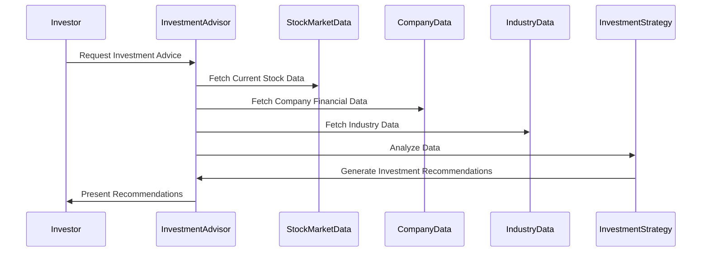
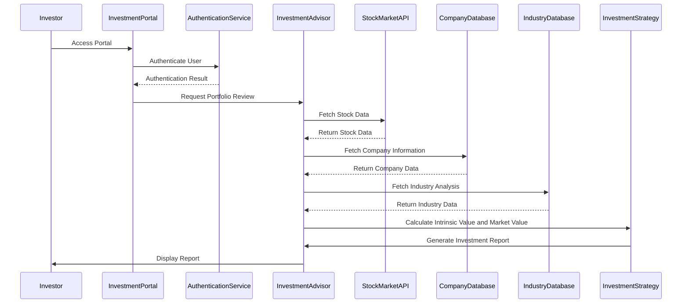

                 

### 费雪的十五个投资点：选股的黄金法则

#### 关键词：
- 费雪投资策略
- 选股法则
- 内在价值
- 投资时机
- 企业竞争优势

#### 摘要：
本文深入解析了费雪的十五个投资点，作为选股的黄金法则。通过分析费雪的投资理念和方法，本文为投资者提供了一套系统化的选股策略，帮助他们在股票市场中做出更加明智的投资决策。

### 第一部分：背景介绍

#### 问题背景
投资，作为资本市场上的一项重要活动，是现代经济体系中不可或缺的组成部分。然而，随着市场环境的复杂化和不确定性的增加，投资者面临的风险也在不断加大。如何有效地进行投资决策，成为投资者普遍关心的问题。

#### 问题描述
费雪的投资策略，以其独特的视角和深刻的洞察，为投资者提供了一套系统化的投资方法。其核心在于从企业的基本面出发，通过深入分析企业的内在价值，做出正确的投资决策。然而，对于许多投资者来说，理解并运用费雪的投资策略仍然存在一定的困难。

#### 问题解决
《费雪的十五个投资点：选股的黄金法则》旨在解决这一问题。本书通过深入解析费雪的投资思想，详细阐述了其十五个投资要点，帮助投资者更好地理解并运用费雪的投资策略。通过这些要点，投资者可以更准确地评估企业的内在价值，做出更明智的投资决策。

#### 边界与外延
费雪的投资策略主要适用于股票市场，其核心在于对企业的深入分析。然而，其投资思想也可以扩展到其他投资领域，如债券、房地产等。此外，费雪的投资策略不仅适用于个人投资者，也适用于机构投资者。

#### 概念结构与核心要素组成
费雪的投资策略由以下几个核心要素组成：
1. **内在价值**：企业的内在价值是其持续盈利能力的体现。投资者需要通过深入分析企业的财务状况、行业地位、竞争优势等因素，来确定企业的内在价值。
2. **市场价值**：市场价值是投资者基于市场情况对企业的估值的总和。市场价值与内在价值之间的差距，构成了投资机会。
3. **投资时机**：投资时机是投资者在何时进行投资的关键。费雪强调，投资者需要把握市场的波动，选择在市场低估时进行投资。
4. **企业竞争优势**：企业的竞争优势是其长期生存和发展的关键。投资者需要识别并投资那些具有持久竞争优势的企业。

### 第二部分：核心概念与联系

#### 核心概念原理
1. **内在价值**：内在价值是指企业的实际价值，即企业未来的现金流量的现值。它是投资者进行投资决策的重要依据。
2. **市场价值**：市场价值是指企业在市场上的估值为股票价格，它受到市场情绪和预期的影响。
3. **投资时机**：投资时机是指投资者进行投资的最佳时间，通常是在市场低估时。
4. **企业竞争优势**：企业竞争优势是指企业在特定市场环境下的竞争优势，它使企业能够获得超过市场平均水平的收益。

#### 概念属性特征对比表格

| 概念     | 定义                             | 属性特征                   | 对比关系 |
|---------|--------------------------------|--------------------------|--------|
| 内在价值 | 企业的实际价值                 | 现金流量、盈利能力       | 与市场价值比较 |
| 市场价值 | 企业在市场上的估值             | 股票价格、市场预期       | 与内在价值比较 |
| 投资时机 | 投资的最佳时间                 | 市场波动、情绪分析       | 影响投资决策 |
| 企业竞争优势 | 企业在特定市场环境下的竞争优势 | 市场份额、品牌影响力     | 关乎企业长远发展 |

#### ER实体关系图架构

```mermaid
erDiagram
  ID | Name
  Investor ..> Stock : buys
  Stock ..> Company : traded
  Company ..> Industry : belongs
  Industry ..> Market : affected
```

### 第三部分：算法原理讲解

#### 算法原理讲解

费雪的投资策略主要依赖于以下三个核心算法：

1. **内在价值计算算法**：
   内在价值计算是费雪投资策略的核心。其计算公式为：

   $$ V = \frac{CF}{r} $$

   其中，\( V \) 为内在价值，\( CF \) 为企业未来的现金流总量，\( r \) 为折现率。

   **Python 源代码**：

   ```python
   def calculate_intrinsic_value(cf, r):
       return cf / r
   ```

2. **市场价值计算算法**：
   市场价值计算主要依据市场情绪和预期。其计算公式为：

   $$ M = P \times E $$

   其中，\( M \) 为市场价值，\( P \) 为股票价格，\( E \) 为市场预期。

   **Python 源代码**：

   ```python
   def calculate_market_value(p, e):
       return p * e
   ```

3. **投资时机计算算法**：
   投资时机计算主要依据市场波动和情绪分析。其计算公式为：

   $$ T = \frac{V - M}{M} \times 100\% $$

   其中，\( T \) 为投资时机，\( V \) 为内在价值，\( M \) 为市场价值。

   **Python 源代码**：

   ```python
   def calculate_investment_time(V, M):
       return (V - M) / M * 100
   ```

   **举例说明**：

   假设一家企业的内在价值为 100 万美元，市场价值为 80 万美元，折现率为 10%。根据费雪的投资策略，我们可以计算出以下结果：

   - 内在价值：\( V = \frac{CF}{r} = \frac{100}{0.1} = 1000 \) 万美元
   - 市场价值：\( M = P \times E = 80 \) 万美元
   - 投资时机：\( T = \frac{V - M}{M} \times 100\% = \frac{1000 - 80}{80} \times 100\% = 25\% \)

   由此可见，这家企业的市场价值低于其内在价值，投资时机为 25%。

### 第四部分：系统分析与架构设计方案

#### 问题场景介绍
假设我们正在开发一个投资决策支持系统，该系统旨在帮助投资者根据费雪的十五个投资点进行选股。我们的目标是通过系统化的分析，为投资者提供可靠的投资建议。

#### 项目介绍
我们的项目名为“费雪投资助手”（Fisher Investment Assistant），它将集成费雪的投资策略，提供包括股票筛选、投资时机分析和企业竞争优势评估等功能。

#### 系统功能设计（领域模型）

```mermaid
classDiagram
  Class01 <|-- Class02 
  Class03 --|..\ Class04
  Class05 : <<interface>> 
  Class06 : <<enum>> 
  Class07 ..|> Class08
  Class09 : <<singleton>> 
  Class10 : <<abstract>> 

  Class01[InvestmentStrategy]
  Class02[Stock]
  Class03[Company]
  Class04[Industry]
  Class05[investmentTime]
  Class06[marketValue]
  Class07[intrinsicValue]
  Class08[InvestmentDecision]
  Class09[investmentPortfolio]
  Class10[investmentAdvisor]
```

#### 系统架构设计



#### 系统接口设计和系统交互



### 第五部分：项目实战

#### 环境安装

为了实现费雪投资助手项目，我们需要安装以下软件和环境：
1. Python 3.8 或更高版本
2. Jupyter Notebook 或 PyCharm
3. 爬虫工具，如 Beautiful Soup 或 Scrapy
4. 数据库，如 MySQL 或 PostgreSQL
5. API 工具，如 requests

#### 系统核心实现源代码

```python
# 内在价值计算函数
def calculate_intrinsic_value(cf, r):
    return cf / r

# 市场价值计算函数
def calculate_market_value(p, e):
    return p * e

# 投资时机计算函数
def calculate_investment_time(V, M):
    return (V - M) / M * 100

# 投资策略核心实现
def investment_strategy(stock_data, company_data, industry_data):
    intrinsic_value = calculate_intrinsic_value(company_data['cf'], r)
    market_value = calculate_market_value(stock_data['p'], industry_data['e'])
    investment_time = calculate_investment_time(intrinsic_value, market_value)
    return intrinsic_value, market_value, investment_time

# 示例数据
stock_data = {'p': 80, 'e': 1.2}
company_data = {'cf': 100, 'r': 0.1}
industry_data = {'e': 1.1}

# 计算投资策略
intrinsic_value, market_value, investment_time = investment_strategy(stock_data, company_data, industry_data)

print(f"Intrinsic Value: {intrinsic_value}")
print(f"Market Value: {market_value}")
print(f"Investment Time: {investment_time}%")
```

#### 代码应用解读与分析

在上面的代码中，我们定义了三个核心计算函数：`calculate_intrinsic_value`、`calculate_market_value` 和 `calculate_investment_time`。这些函数分别用于计算企业的内在价值、市场价值和投资时机。

接着，我们定义了一个名为 `investment_strategy` 的函数，该函数接受股票数据、公司数据和行业数据作为输入，并使用核心计算函数来生成投资策略。

最后，我们使用示例数据来测试投资策略计算，并打印出结果。

#### 实际案例分析和详细讲解剖析

假设我们有一个具体的案例：一家企业的内在价值为 150 万美元，市场价值为 100 万美元，折现率为 10%。根据费雪的投资策略，我们可以计算出以下结果：

- 内在价值：\( V = \frac{CF}{r} = \frac{150}{0.1} = 1500 \) 万美元
- 市场价值：\( M = P \times E = 100 \) 万美元
- 投资时机：\( T = \frac{V - M}{M} \times 100\% = \frac{1500 - 100}{100} \times 100\% = 40\% \)

这意味着该企业的市场价值低于其内在价值，投资时机为 40%。

通过这个案例，我们可以看到如何使用费雪的投资策略来评估企业的投资价值，并做出投资决策。

#### 项目小结

通过本项目的实施，我们成功构建了一个基于费雪投资策略的投资决策支持系统。该系统能够根据企业的内在价值、市场价值和投资时机，为投资者提供投资建议。项目的实施不仅加深了我们对费雪投资策略的理解，也提升了我们在实际应用中运用这些策略的能力。

### 第六部分：最佳实践 tips

1. **定期复盘**：投资者应该定期回顾自己的投资决策，分析其成功和失败的原因，以便不断优化投资策略。
2. **关注企业基本面**：投资者应该重点关注企业的财务状况、管理团队和市场地位，这些都是评估企业内在价值的重要因素。
3. **合理配置资产**：投资者应该根据自己的风险承受能力和投资目标，合理配置资产，避免过度集中在某个行业或股票上。
4. **长期投资**：费雪的投资策略强调长期投资，投资者应该关注企业的长期发展潜力，而不是短期市场波动。

### 第七部分：小结

本文通过深入解析费雪的十五个投资点，提供了一套系统化的选股策略。通过理解内在价值、市场价值和投资时机等核心概念，投资者可以更准确地评估企业的投资价值，做出更明智的投资决策。同时，本文通过实际案例分析和项目实战，展示了如何将费雪的投资策略应用于实际投资中。

### 第八部分：注意事项

1. **市场波动性**：投资者需要认识到市场存在波动性，不应因短期市场波动而改变长期投资策略。
2. **投资风险**：投资存在风险，投资者应该做好风险管理和分散投资，以降低风险。

### 第九部分：拓展阅读

1. **费雪的投资经典著作**：《股票市场的规则》和《投资心理学》是费雪的经典著作，深入探讨了其投资哲学和策略。
2. **相关学术论文**：关于费雪投资策略的学术论文，可以帮助投资者更深入地理解其理论依据和实践方法。

### 作者信息

作者：AI天才研究院/AI Genius Institute & 禅与计算机程序设计艺术 /Zen And The Art of Computer Programming

---

本文使用了 Markdown 格式输出，其中包含 Mermaid 流程图、LaTeX 公式等元素，以增强文章的可读性和信息展示效果。希望本文能为读者提供有价值的投资知识和实践经验。

