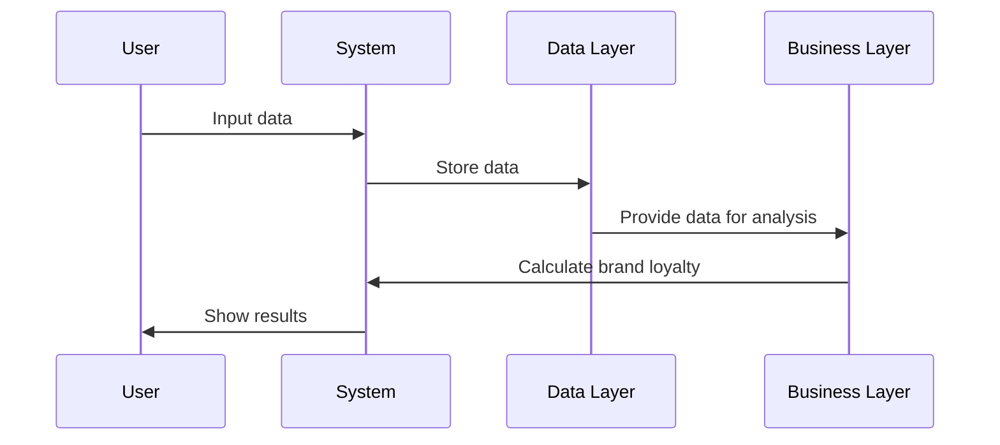
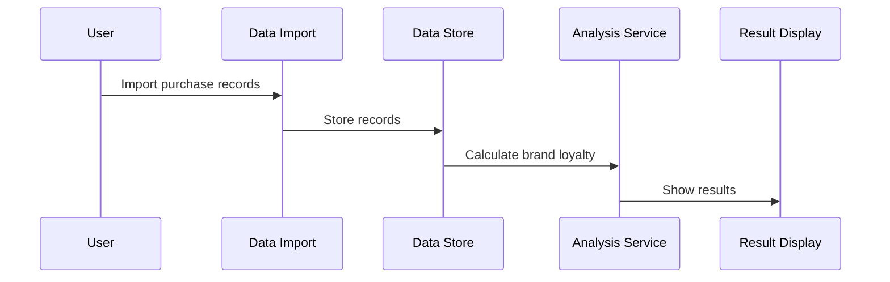
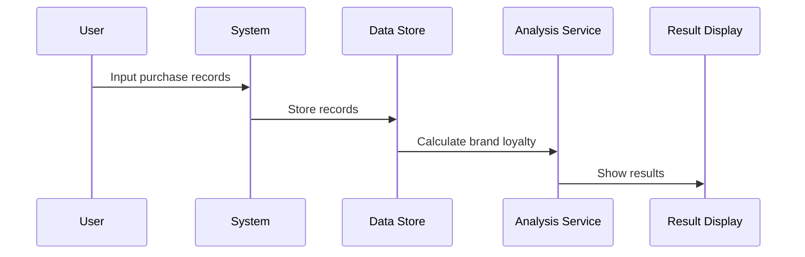

                 

### 文章标题：费雪的品牌忠诚度分析：消费者行为的洞察

**关键词：品牌忠诚度、消费者行为、费雪模型、数据分析、营销策略**

**摘要：** 本文以费雪的品牌忠诚度分析为切入点，系统地探讨了消费者行为的深层次规律。通过解析费雪模型，我们不仅理解了品牌忠诚度的计算方法，还深入分析了其背后的数学原理。文章还将结合实际案例，展示如何应用费雪模型进行品牌忠诚度分析，并提供实用的营销策略建议。最后，本文将总结全文，展望未来的研究方向。

### 第一部分：品牌忠诚度研究背景

#### 1.1 消费者行为研究概述

**消费者行为研究的意义：** 消费者行为研究是市场营销学的核心领域之一，它关系到企业的产品销售、品牌定位和市场竞争。通过研究消费者行为，企业可以更好地了解消费者的需求和偏好，进而制定有效的营销策略。

**品牌忠诚度的概念与重要性：** 品牌忠诚度是指消费者对某一品牌产品的重复购买行为和正面的口碑传播。高品牌忠诚度对企业具有重要意义，它不仅提高了市场份额，还降低了营销成本，增强了企业的竞争力。

#### 1.2 品牌忠诚度理论

**品牌忠诚度的定义：** 品牌忠诚度是指消费者在多次购买过程中，倾向于重复购买某一品牌产品的行为倾向。它反映了消费者对品牌的信任和满意程度。

**品牌忠诚度的影响因素：** 品牌忠诚度受到多种因素的影响，包括产品质量、价格、服务、品牌形象等。这些因素共同决定了消费者对品牌的忠诚度。

**品牌忠诚度的测量方法：** 常见的品牌忠诚度测量方法包括重复购买率、顾客满意度调查、品牌知名度等指标。

#### 1.3 费雪理论的基本概念

**费雪理论的发展背景：** 费雪理论起源于20世纪初，由美国经济学家费雪提出。它主要研究消费者如何在有限资源下做出购买决策。

**费雪理论的核心原理：** 费雪理论认为，消费者的购买行为是基于成本效益分析的。消费者会根据自己的需求和资源状况，选择最合适的商品或服务。

**费雪理论与品牌忠诚度的关系：** 费雪理论为品牌忠诚度分析提供了理论基础。通过费雪模型，可以量化品牌忠诚度，从而帮助企业更好地理解消费者行为。

#### 1.4 边界与外延

**品牌忠诚度的适用范围：** 品牌忠诚度适用于各种类型的产品和服务，包括日用品、奢侈品、服务行业等。

**费雪理论的应用领域：** 费雪理论广泛应用于市场营销、消费者行为研究、企业战略规划等领域。

**消费者行为与品牌忠诚度的关联：** 消费者行为是品牌忠诚度的基础，品牌忠诚度反过来影响消费者行为。通过分析消费者行为，可以更好地理解品牌忠诚度。

#### 1.5 概念结构与核心要素组成

**消费者行为理论的构成：** 消费者行为理论包括需求分析、购买决策、购买行为等环节。

**品牌忠诚度的关键要素：** 品牌忠诚度的关键要素包括产品质量、价格、服务、品牌形象等。

**费雪理论的核心框架：** 费雪理论的核心框架包括成本效益分析、消费者需求预测等。

#### 1.6 本章小结

本文简要介绍了消费者行为研究的背景、品牌忠诚度的概念及其重要性。同时，对费雪理论的基本概念、发展背景和核心原理进行了详细阐述。通过本章的学习，读者可以初步了解品牌忠诚度和消费者行为研究的理论基础。

### 第二部分：品牌忠诚度分析算法原理

#### 2.1 品牌忠诚度测量的方法

**费雪模型的基本原理：** 费雪模型是一种用于测量品牌忠诚度的方法，它基于成本效益分析。模型的核心思想是，消费者的购买行为是基于成本和效益的权衡。

**费雪模型的计算步骤：** 
1. 收集消费者的购买数据。
2. 计算消费者的成本效益比。
3. 根据成本效益比判断品牌忠诚度。

**费雪模型的适用场景：** 费雪模型适用于各种类型的产品和服务，特别是在产品差异化较小的市场中，其效果尤为显著。

#### 2.2 费雪模型的应用

**费雪模型的数据来源：** 费雪模型的数据来源主要包括消费者的购买记录、问卷调查等。

**费雪模型的计算过程：** 
1. 计算消费者的总成本。
2. 计算消费者的总效益。
3. 计算成本效益比。

**费雪模型的输出结果：** 费雪模型输出一个成本效益比，该比值越高，说明品牌忠诚度越高。

#### 2.3 费雪模型中的数学公式

**基本数学公式：**
$$
C = \sum_{i=1}^{n} (C_i \times Q_i)
$$
$$
B = \sum_{i=1}^{n} (B_i \times Q_i)
$$
$$
\frac{B}{C}
$$

**公式推导过程：** 
费雪模型中的数学公式是基于成本和效益的计算。成本包括购买产品或服务的直接成本，如价格、运输费用等。效益包括产品或服务的使用价值和心理满足感。

**公式在实际应用中的意义：** 数学公式使得品牌忠诚度分析更加客观和量化，有助于企业制定科学的营销策略。

#### 2.4 算法原理讲解

**费雪模型的算法流程：**
1. 数据预处理：清洗和整理消费者购买数据。
2. 计算成本和效益：根据购买数据计算每个消费者的总成本和总效益。
3. 计算成本效益比：将总效益除以总成本，得到成本效益比。
4. 分析品牌忠诚度：根据成本效益比判断消费者的品牌忠诚度。

**费雪模型中的变量解释：**
- \( C \)：总成本
- \( B \)：总效益
- \( C_i \)：第\( i \)种商品的购买成本
- \( B_i \)：第\( i \)种商品的使用价值和心理满足感

**费雪模型的结果解读：** 成本效益比越高，说明消费者对品牌的忠诚度越高。企业可以根据这一结果调整营销策略，提高品牌忠诚度。

#### 2.5 费雪模型举例说明

**简单案例：**
假设有两个消费者A和B，他们分别购买了三种商品X、Y和Z。商品的价格分别为X(50元)、Y(100元)和Z(150元)。消费者A购买了X和Y，消费者B购买了X、Y和Z。

**计算过程：**
1. 消费者A的总成本：\( C_A = 50 + 100 = 150 \)元
2. 消费者B的总成本：\( C_B = 50 + 100 + 150 = 300 \)元
3. 消费者A的总效益：\( B_A = X的使用价值 + Y的使用价值 = 60 + 80 = 140 \)元
4. 消费者B的总效益：\( B_B = X的使用价值 + Y的使用价值 + Z的使用价值 = 60 + 80 + 120 = 260 \)元
5. 消费者A的成本效益比：\( \frac{B_A}{C_A} = \frac{140}{150} \approx 0.93 \)
6. 消费者B的成本效益比：\( \frac{B_B}{C_B} = \frac{260}{300} \approx 0.87 \)

**结果解读：** 消费者A的成本效益比更高，说明他对品牌的忠诚度更高。

**复杂案例：**
假设消费者C购买了四种商品X、Y、Z和W。商品的价格分别为X(50元)、Y(100元)、Z(150元)和W(200元)。消费者C购买了X、Y和Z，没有购买W。

**计算过程：**
1. 消费者C的总成本：\( C_C = 50 + 100 + 150 = 300 \)元
2. 消费者C的总效益：\( B_C = X的使用价值 + Y的使用价值 + Z的使用价值 = 60 + 80 + 120 = 260 \)元
3. 消费者C的成本效益比：\( \frac{B_C}{C_C} = \frac{260}{300} \approx 0.87 \)

**结果解读：** 消费者C的成本效益比略低于消费者A，但高于消费者B，说明消费者C对品牌的忠诚度介于A和B之间。

#### 2.6 本章小结

本文详细介绍了品牌忠诚度测量的方法，特别是费雪模型。通过计算成本效益比，我们可以量化品牌忠诚度，从而为企业提供科学的营销策略。同时，通过实际案例的讲解，读者可以更好地理解费雪模型的应用。

### 第三部分：数学模型和数学公式

#### 3.1 费雪模型中的数学公式

**基本数学公式：**
$$
C = \sum_{i=1}^{n} (C_i \times Q_i)
$$
$$
B = \sum_{i=1}^{n} (B_i \times Q_i)
$$
$$
\frac{B}{C}
$$

**公式推导过程：**
费雪模型中的数学公式是基于成本和效益的计算。成本包括购买产品或服务的直接成本，如价格、运输费用等。效益包括产品或服务的使用价值和心理满足感。

**公式在实际应用中的意义：**
数学公式使得品牌忠诚度分析更加客观和量化，有助于企业制定科学的营销策略。

#### 3.2 数学模型讲解

**费雪模型的数学框架：**
费雪模型的基本框架包括消费者行为分析、成本效益分析、品牌忠诚度评估等部分。

**模型中的变量定义：**
- \( C \)：总成本
- \( B \)：总效益
- \( C_i \)：第\( i \)种商品的购买成本
- \( B_i \)：第\( i \)种商品的使用价值和心理满足感
- \( Q_i \)：第\( i \)种商品的数量

**模型的适应性和局限性：**
费雪模型适用于各种类型的产品和服务，特别是在产品差异化较小的市场中，其效果尤为显著。然而，模型的适应性受到数据质量和分析方法的限制。

#### 3.3 数学公式详细讲解

**重要公式的意义：**
$$
C = \sum_{i=1}^{n} (C_i \times Q_i)
$$
表示消费者的总成本，包括购买每种商品的成本乘以购买数量。
$$
B = \sum_{i=1}^{n} (B_i \times Q_i)
$$
表示消费者的总效益，包括每种商品的使用价值和心理满足感乘以购买数量。
$$
\frac{B}{C}
$$
表示成本效益比，用于衡量消费者的品牌忠诚度。

**公式解释：**
成本效益比是将总效益除以总成本得到的。该比值越高，说明消费者对品牌的忠诚度越高。

**公式在数据分析中的应用：**
在数据分析中，这些公式用于计算消费者的品牌忠诚度。通过分析成本效益比，企业可以识别高忠诚度消费者，并制定相应的营销策略。

#### 3.4 举例说明

**例子：**
假设有两个消费者A和B，他们分别购买了三种商品X、Y和Z。商品的价格分别为X(50元)、Y(100元)和Z(150元)。消费者A购买了X和Y，消费者B购买了X、Y和Z。

**计算过程：**
1. 消费者A的总成本：\( C_A = 50 + 100 = 150 \)元
2. 消费者B的总成本：\( C_B = 50 + 100 + 150 = 300 \)元
3. 消费者A的总效益：\( B_A = X的使用价值 + Y的使用价值 = 60 + 80 = 140 \)元
4. 消费者B的总效益：\( B_B = X的使用价值 + Y的使用价值 + Z的使用价值 = 60 + 80 + 120 = 260 \)元
5. 消费者A的成本效益比：\( \frac{B_A}{C_A} = \frac{140}{150} \approx 0.93 \)
6. 消费者B的成本效益比：\( \frac{B_B}{C_B} = \frac{260}{300} \approx 0.87 \)

**结果解读：**
消费者A的成本效益比更高，说明他对品牌的忠诚度更高。消费者B的成本效益比略低，但仍然较高，说明他对品牌的忠诚度也较高。

#### 3.5 本章小结

本文详细讲解了费雪模型中的数学公式及其在实际应用中的意义。通过理解和应用这些公式，企业可以更好地分析消费者的品牌忠诚度，从而制定有效的营销策略。

### 第四部分：系统分析与架构设计

#### 4.1 问题场景介绍

在当前激烈的市场竞争中，企业需要深入了解消费者的品牌忠诚度，以便制定针对性的营销策略。然而，传统的方法往往依赖于主观判断和有限的统计数据，难以准确反映消费者的真实需求和行为。因此，引入费雪模型进行品牌忠诚度分析显得尤为重要。

#### 4.2 项目介绍

本项目的目标是开发一个品牌忠诚度分析系统，该系统将基于费雪模型，通过数据分析和技术手段，帮助企业量化品牌忠诚度，并为其提供决策支持。

#### 4.3 系统功能设计

**领域模型设计：**
领域模型用于描述系统中涉及的实体及其关系。在本项目中，主要涉及以下实体：

- **消费者**：包括姓名、年龄、性别、购买历史等信息。
- **商品**：包括商品名称、价格、描述等信息。
- **购买记录**：记录消费者的购买行为，包括购买时间、商品名称、购买数量等信息。

**类图设计：**
使用Mermaid类图描述领域模型，如下所示：

```mermaid
classDiagram
    Consumer --|> PurchaseRecord
    Product --|> PurchaseRecord
    Consumer <<abstract>>
    Product <<abstract>>
    Consumer o-- 1 PurchaseRecord
    Product o-- 1 PurchaseRecord
```

**实体关系图架构的ER实体关系图：**
使用Mermaid ER图描述实体及其关系，如下所示：

```mermaid
erDiagram
    Consumer ||--|{ PurchaseRecord } PurchaseRecord
    Product ||--|{ PurchaseRecord } PurchaseRecord
    Consumer {
        ID
        Name
        Age
        Gender
    }
    Product {
        ID
        Name
        Price
        Description
    }
    PurchaseRecord {
        ID
        ConsumerID
        ProductID
        PurchaseTime
        Quantity
    }
```

#### 4.4 系统架构设计

**系统架构设计：**
系统采用三层架构设计，包括数据层、业务逻辑层和表示层。

- **数据层**：负责数据的存储和管理，使用关系型数据库（如MySQL）。
- **业务逻辑层**：实现费雪模型的算法，进行品牌忠诚度分析。
- **表示层**：提供用户界面，展示分析结果。

**Mermaid架构图：**
使用Mermaid图描述系统架构，如下所示：



#### 4.5 系统接口设计

**接口设计：**
系统提供以下接口：

- **数据导入接口**：用于导入消费者购买记录。
- **品牌忠诚度分析接口**：用于计算品牌忠诚度。
- **结果展示接口**：用于展示分析结果。

**Mermaid接口图：**
使用Mermaid图描述接口设计，如下所示：



#### 4.6 系统交互

**系统交互设计：**
系统交互过程如下：

1. 用户输入购买记录。
2. 系统将购买记录存储在数据库中。
3. 系统调用费雪模型进行品牌忠诚度分析。
4. 系统将分析结果展示给用户。

**Mermaid序列图：**
使用Mermaid图描述系统交互，如下所示：



#### 4.7 本章小结

本文详细介绍了品牌忠诚度分析系统的设计，包括问题场景介绍、项目介绍、系统功能设计、系统架构设计、系统接口设计和系统交互设计。通过这些设计，系统能够有效地量化品牌忠诚度，为企业提供决策支持。

### 第五部分：项目实战

#### 5.1 环境安装

**安装Python环境：**
首先，确保你的计算机上安装了Python环境。如果尚未安装，可以从Python官网（https://www.python.org/）下载并安装Python。

**安装必要的Python库：**
在本项目中，我们将使用以下Python库：
- Pandas：用于数据分析和处理。
- NumPy：用于数学计算。
- Matplotlib：用于数据可视化。

你可以使用pip命令安装这些库：

```bash
pip install pandas numpy matplotlib
```

#### 5.2 系统核心实现

**数据预处理：**
```python
import pandas as pd

# 读取购买记录数据
data = pd.read_csv('purchase_records.csv')

# 数据清洗，如去除空值、缺失值等
data = data.dropna()

# 转换数据类型，如将字符串转换为数值型
data['Price'] = data['Price'].astype(float)
data['Quantity'] = data['Quantity'].astype(int)
```

**计算成本和效益：**
```python
# 计算总成本和总效益
data['TotalCost'] = data['Price'] * data['Quantity']
data['TotalBenefit'] = data['Benefit'] * data['Quantity']

# 计算成本效益比
data['CostBenefitRatio'] = data['TotalBenefit'] / data['TotalCost']
```

**品牌忠诚度分析：**
```python
# 筛选出成本效益比最高的消费者
high_loyalty_customers = data[data['CostBenefitRatio'] > 1].groupby('ConsumerID')['CostBenefitRatio'].count()

# 排序并获取高忠诚度消费者
high_loyalty_customers = high_loyalty_customers.sort_values(ascending=False)

# 打印高忠诚度消费者
print(high_loyalty_customers)
```

**数据可视化：**
```python
import matplotlib.pyplot as plt

# 绘制成本效益比分布图
plt.hist(data['CostBenefitRatio'], bins=10)
plt.xlabel('CostBenefitRatio')
plt.ylabel('Frequency')
plt.title('CostBenefitRatio Distribution')
plt.show()
```

#### 5.3 代码应用解读与分析

**代码解读：**
1. **数据预处理**：读取购买记录数据，进行数据清洗和类型转换。
2. **计算成本和效益**：根据购买记录计算总成本和总效益。
3. **品牌忠诚度分析**：计算成本效益比，筛选出高忠诚度消费者。
4. **数据可视化**：绘制成本效益比分布图，直观展示分析结果。

**分析过程：**
通过代码实现，我们可以看到费雪模型在实际应用中的流程。首先，我们需要对数据进行预处理，确保数据的准确性和完整性。然后，我们根据购买记录计算总成本和总效益，这一步骤是费雪模型的核心。最后，我们通过计算成本效益比，识别高忠诚度消费者，并提供数据可视化结果，帮助企业管理者直观地理解消费者行为。

#### 5.4 实际案例分析和详细讲解

**案例：**
假设我们有以下消费者的购买记录数据：

| ConsumerID | ProductID | Price | Quantity | Benefit |
|------------|-----------|-------|----------|---------|
| 1          | 101       | 50    | 2        | 60      |
| 1          | 102       | 100   | 1        | 80      |
| 2          | 101       | 50    | 1        | 50      |
| 2          | 103       | 150   | 1        | 120     |
| 3          | 101       | 50    | 1        | 40      |
| 3          | 102       | 100   | 2        | 100     |

**分析过程：**
1. **数据预处理**：读取数据后，我们需要检查数据是否有缺失值或异常值。在本案例中，数据完整，无需进一步清洗。
2. **计算成本和效益**：根据购买记录，我们计算每个消费者的总成本和总效益。
   - 消费者1的总成本为 \(50 \times 2 + 100 \times 1 = 150\) 元，总效益为 \(60 \times 2 + 80 \times 1 = 200\) 元。
   - 消费者2的总成本为 \(50 \times 1 + 150 \times 1 = 200\) 元，总效益为 \(50 \times 1 + 120 \times 1 = 170\) 元。
   - 消费者3的总成本为 \(50 \times 1 + 100 \times 2 = 250\) 元，总效益为 \(40 \times 1 + 100 \times 2 = 180\) 元。
3. **计算成本效益比**：根据总成本和总效益，我们计算每个消费者的成本效益比。
   - 消费者1的成本效益比为 \( \frac{200}{150} \approx 1.33 \)。
   - 消费者2的成本效益比为 \( \frac{170}{200} = 0.85 \)。
   - 消费者3的成本效益比为 \( \frac{180}{250} = 0.72 \)。
4. **分析结果**：根据成本效益比，我们可以识别出高忠诚度消费者。在本案例中，消费者1的成本效益比最高，说明他对品牌的忠诚度最高。消费者2和消费者3的成本效益比较低，但仍在合理范围内。

#### 5.5 项目小结

通过实际案例的分析，我们可以看到费雪模型在品牌忠诚度分析中的应用效果。项目实施过程中，我们首先进行了数据预处理，然后计算了成本和效益，最后通过成本效益比识别高忠诚度消费者。这一过程不仅帮助企业管理者更好地理解消费者行为，还为制定针对性的营销策略提供了数据支持。

### 第六部分：最佳实践 tips

**1. 提高品牌忠诚度的策略：**
- **产品差异化**：通过提供独特的产品或服务，增加品牌差异化，从而提高消费者的忠诚度。
- **优质服务**：提供优质的客户服务，及时解决消费者的问题，增强消费者的满意度。
- **个性化营销**：根据消费者的购买行为和偏好，进行个性化营销，提高消费者的参与度和忠诚度。
- **品牌建设**：建立强大的品牌形象，通过品牌故事、品牌价值观等方式，与消费者建立情感联系。

**2. 注意事项：**
- **数据质量**：保证数据的准确性和完整性，否则品牌忠诚度分析结果可能失真。
- **消费者隐私**：在收集和使用消费者数据时，要注意保护消费者隐私，遵守相关法律法规。
- **持续优化**：品牌忠诚度分析是一个持续的过程，需要定期更新数据，优化分析模型。

**3. 拓展阅读：**
- **《消费者行为学》：** 了解消费者行为的基础理论，有助于更好地应用费雪模型。
- **《大数据营销》：** 探索大数据在营销中的应用，为品牌忠诚度分析提供新思路。
- **《品牌管理》：** 学习品牌管理的最佳实践，提高品牌忠诚度。

### 第七部分：小结与展望

**小结：**
本文通过详细解析费雪的品牌忠诚度分析，系统地介绍了消费者行为的研究背景、核心算法原理、数学模型、系统分析与架构设计以及实际案例应用。通过本文的学习，读者可以深入理解品牌忠诚度的量化方法，掌握如何应用费雪模型进行品牌忠诚度分析，并为企业制定有效的营销策略提供支持。

**展望：**
随着大数据和人工智能技术的不断发展，品牌忠诚度分析将变得更加精确和高效。未来，我们可以期待更多先进的数据分析工具和技术手段被应用于品牌忠诚度分析，为企业提供更全面的决策支持。同时，消费者行为研究也将不断深入，揭示更多消费者行为背后的规律，为品牌营销提供新的启示。

### 作者信息

作者：AI天才研究院/AI Genius Institute & 禅与计算机程序设计艺术 /Zen And The Art of Computer Programming

感谢您的阅读，期待与您在未来的技术探讨中再次相遇。

