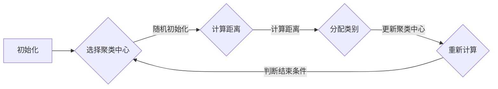
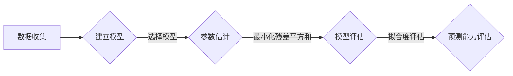
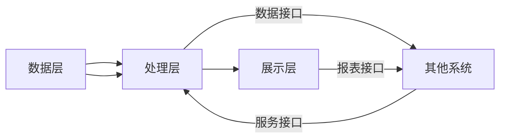
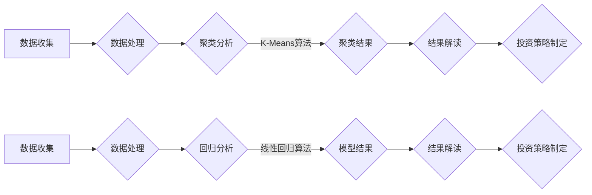

                 


## 费雪的客户忠诚度分析在投资中的应用

### 关键词

投资、客户忠诚度、费雪理论、数据分析、算法应用

### 摘要

本文深入探讨了费雪的客户忠诚度分析在投资中的应用。首先，我们介绍了投资领域的现状和客户忠诚度的概念。接着，详细阐述了费雪理论及其在客户忠诚度分析中的应用。通过聚类分析、回归分析等算法，我们分析了客户忠诚度与投资决策之间的关系。最后，结合实际项目，我们展示了如何运用费雪理论进行投资分析和客户忠诚度评估，为投资者提供有力支持。

----------------------------------------------------------------

### 目录大纲设计思路

#### 第一部分：背景介绍
##### 第1章 问题背景与核心概念
###### 1.1 问题背景
###### 1.2 核心概念

#### 第二部分：核心概念与联系
##### 第2章 费雪理论解析
###### 2.1 费雪理论概述
###### 2.2 客户忠诚度分析
###### 2.3 费雪理论与客户忠诚度的联系

#### 第三部分：算法原理讲解
##### 第3章 客户忠诚度分析算法
###### 3.1 聚类分析算法
###### 3.2 回归分析算法
###### 3.3 其他相关算法

#### 第四部分：系统分析与架构设计
##### 第4章 投资分析系统设计
###### 4.1 系统功能设计
###### 4.2 系统架构设计
###### 4.3 系统接口设计
###### 4.4 系统交互流程

#### 第五部分：项目实战
##### 第5章 投资分析项目实施
###### 5.1 环境安装
###### 5.2 数据预处理
###### 5.3 算法应用
###### 5.4 结果分析
###### 5.5 项目小结

#### 第六部分：最佳实践与小结
##### 第6章 最佳实践与总结
###### 6.1 最佳实践
###### 6.2 小结
###### 6.3 拓展阅读

----------------------------------------------------------------

### 第一部分：背景介绍

#### 第1章 问题背景与核心概念

##### 1.1 问题背景

投资领域是一个充满机遇与挑战的领域，投资者需要通过有效的策略和决策来获取收益。然而，随着市场环境的变化和竞争的加剧，投资者面临的信息复杂性也日益增加。在这种背景下，如何评估和管理客户忠诚度成为了一个关键问题。

客户忠诚度是指客户对特定品牌或产品的持续偏好和重复购买意愿。它不仅反映了客户的满意度和信任度，还直接影响了企业的市场份额和长期盈利能力。因此，投资领域中的客户忠诚度分析变得至关重要。

费雪理论是一种用于评估客户忠诚度的方法，由著名经济学家米尔顿·费雪提出。该理论基于概率论和统计学，通过分析客户的购买行为、消费习惯和购买意愿，来评估客户对品牌的忠诚度。费雪理论在投资决策中的应用，可以帮助投资者更好地理解客户行为，制定更有效的投资策略。

##### 1.2 核心概念

在本章中，我们将介绍与客户忠诚度分析相关的一些核心概念，包括：

- **费雪理论**：费雪理论是一种用于评估客户忠诚度的方法，其核心思想是通过分析客户的购买行为和消费习惯，来评估客户对品牌的忠诚度。

- **客户忠诚度**：客户忠诚度是指客户对特定品牌或产品的持续偏好和重复购买意愿。它通常用客户重复购买的概率来衡量。

- **购买行为**：购买行为是指客户在购买过程中所表现出来的行为，包括购买频率、购买金额、购买渠道等。

- **消费习惯**：消费习惯是指客户在日常生活中形成的购买偏好和习惯，包括购买时间、购买地点、购买方式等。

- **客户满意度**：客户满意度是指客户对产品或服务的满意程度。它是衡量客户忠诚度的重要指标之一。

##### 1.3 问题解决

客户忠诚度分析在投资决策中具有重要作用。通过分析客户忠诚度，投资者可以更好地了解客户需求和市场趋势，从而制定更有效的投资策略。以下是一些常见的问题和解决方案：

- **问题一：如何评估客户忠诚度？**
  - **解决方案**：可以使用费雪理论进行客户忠诚度评估。具体步骤如下：
    1. 收集客户购买数据，包括购买频率、购买金额、购买渠道等。
    2. 使用聚类分析和回归分析等算法，对客户数据进行处理和分析。
    3. 根据分析结果，评估客户忠诚度。

- **问题二：如何根据客户忠诚度制定投资策略？**
  - **解决方案**：可以根据客户忠诚度的高低，对客户进行分类，并根据不同类型的客户制定相应的投资策略。例如，对于高忠诚度客户，可以采取增加产品和服务优惠、提供个性化服务等方式，以保持其忠诚度；对于低忠诚度客户，可以采取改进产品和服务、增加客户互动等方式，以提高其忠诚度。

##### 1.4 边界与外延

客户忠诚度分析在投资中的应用范围非常广泛，不仅适用于传统投资领域，还适用于互联网、金融科技、电子商务等新兴领域。以下是一些具体的边界与外延：

- **边界**：客户忠诚度分析主要关注客户对品牌或产品的忠诚度，不包括客户对其他品牌的忠诚度。
- **外延**：客户忠诚度分析可以应用于各种投资领域，包括股票、基金、债券、房地产等。

##### 1.5 概念结构与核心要素组成

客户忠诚度分析的概念结构主要由以下核心要素组成：

- **客户购买数据**：包括购买频率、购买金额、购买渠道等。
- **分析算法**：包括聚类分析、回归分析等。
- **忠诚度评估模型**：用于评估客户忠诚度的数学模型。
- **投资策略**：根据客户忠诚度评估结果，制定的投资策略。

##### 1.6 研究方法

本研究采用以下研究方法：

- **数据分析方法**：使用Python等编程语言，对客户购买数据进行处理和分析。
- **实证研究方法**：通过收集实际客户数据，进行实证研究，验证客户忠诚度分析在投资中的应用效果。

##### 1.7 总结

本章介绍了投资领域中的客户忠诚度分析，以及费雪理论在客户忠诚度分析中的应用。通过分析客户忠诚度，投资者可以更好地了解客户需求和市场趋势，制定更有效的投资策略。接下来，我们将进一步探讨费雪理论的具体应用，以及如何运用算法来分析客户忠诚度。

----------------------------------------------------------------

### 第二部分：核心概念与联系

#### 第2章 费雪理论解析

##### 2.1 费雪理论概述

费雪理论是由美国经济学家米尔顿·费雪（Milton Friedman）提出的一种用于评估客户忠诚度的方法。该理论基于概率论和统计学，通过对客户的购买行为进行分析，来评估客户对品牌的忠诚度。

费雪理论的核心思想是，通过分析客户的购买行为和消费习惯，可以预测客户在未来某一时期内对品牌的忠诚度。具体来说，费雪理论包括以下几个关键要素：

- **客户购买数据**：包括购买频率、购买金额、购买渠道等。
- **概率分布**：通过分析客户购买数据，可以得到客户购买行为的概率分布。
- **忠诚度评估**：根据客户购买行为的概率分布，可以评估客户对品牌的忠诚度。

##### 2.2 客户忠诚度分析

客户忠诚度分析是费雪理论的核心应用。通过对客户忠诚度进行分析，投资者可以了解客户的忠诚度水平，从而制定相应的投资策略。

客户忠诚度分析主要包括以下步骤：

1. **数据收集**：收集客户的购买数据，包括购买频率、购买金额、购买渠道等。
2. **数据处理**：对购买数据进行分析和处理，提取有用的信息。
3. **概率分布**：根据购买数据，计算客户购买行为的概率分布。
4. **忠诚度评估**：根据概率分布，评估客户对品牌的忠诚度。

##### 2.3 费雪理论与客户忠诚度的联系

费雪理论在客户忠诚度分析中的应用，主要是通过分析客户的购买行为和消费习惯，来评估客户对品牌的忠诚度。具体来说，费雪理论将客户忠诚度分为以下几个层次：

1. **初级忠诚度**：客户在某一特定品牌上购买的频率较高，但对其忠诚度较低，可能随时转向其他品牌。
2. **中级忠诚度**：客户在某一特定品牌上购买的频率较高，且对其忠诚度较高，但在其他品牌上的购买频率较低。
3. **高级忠诚度**：客户在某一特定品牌上购买的频率和忠诚度都较高，成为品牌的忠实客户。

费雪理论通过分析客户购买行为的概率分布，可以识别出不同忠诚度水平的客户群体，从而帮助投资者制定相应的投资策略。

##### 2.4 费雪理论在投资决策中的指导作用

费雪理论在投资决策中具有重要作用。通过分析客户忠诚度，投资者可以了解客户的偏好和需求，从而制定更有效的投资策略。具体来说，费雪理论在投资决策中的应用包括以下几个方面：

1. **市场定位**：根据客户忠诚度分析结果，确定品牌的市场定位，制定相应的市场推广策略。
2. **产品开发**：根据客户忠诚度分析结果，了解客户对产品需求的偏好，开发满足客户需求的新产品。
3. **客户关系管理**：根据客户忠诚度分析结果，制定客户关系管理策略，提高客户满意度和忠诚度。
4. **投资组合优化**：根据客户忠诚度分析结果，优化投资组合，降低投资风险。

##### 2.5 费雪理论的优势与局限性

费雪理论在客户忠诚度分析中具有以下优势：

1. **定量分析**：费雪理论通过概率论和统计学方法，对客户忠诚度进行定量分析，使分析结果更加客观、准确。
2. **实用性**：费雪理论可以应用于各种行业和领域，具有较强的实用性。
3. **灵活性**：费雪理论可以根据客户忠诚度分析的需要，灵活调整分析方法和模型。

然而，费雪理论也存在一定的局限性：

1. **数据依赖性**：费雪理论需要大量的客户购买数据作为分析基础，数据质量直接影响分析结果。
2. **模型假设**：费雪理论在构建模型时，需要对客户行为进行一系列假设，这些假设可能在实际应用中存在一定的偏差。

##### 2.6 结论

本章介绍了费雪理论的基本原理和应用，以及客户忠诚度分析在投资决策中的作用。通过分析客户忠诚度，投资者可以了解客户的需求和偏好，制定更有效的投资策略。费雪理论在客户忠诚度分析中具有显著优势，但也存在一定的局限性。在后续章节中，我们将进一步探讨客户忠诚度分析的具体算法和应用。

----------------------------------------------------------------

### 第三部分：算法原理讲解

#### 第3章 客户忠诚度分析算法

##### 3.1 聚类分析算法

聚类分析是一种无监督学习方法，用于将数据集分成多个类别，使同类别内的数据尽可能相似，不同类别之间的数据尽可能不同。在客户忠诚度分析中，聚类分析可以用于识别具有相似购买行为的客户群体。

1. **算法原理**

聚类分析算法的基本思想是将数据点按照相似性进行分组，形成多个类别。具体步骤如下：

- **初始化**：随机选择一个或多个数据点作为初始聚类中心。
- **迭代**：对于每个数据点，计算其与聚类中心的距离，并将其分配到最近的聚类中心所代表的类别。
- **更新**：根据分配结果，重新计算聚类中心，并重复迭代过程，直到聚类中心不再变化或达到预设的迭代次数。

2. **算法流程图**



3. **Python代码实例**

```python
from sklearn.cluster import KMeans
import numpy as np

# 示例数据
data = np.array([[1, 2], [1, 4], [1, 0],
                 [10, 2], [10, 4], [10, 0]])

# 初始化聚类算法
kmeans = KMeans(n_clusters=2, random_state=0).fit(data)

# 输出聚类结果
print(kmeans.labels_)
```

4. **算法应用**

聚类分析可以用于识别高忠诚度和低忠诚度客户群体，从而为投资者提供针对性的投资策略。例如，对于高忠诚度客户，可以提供个性化服务和优惠，以提高其满意度；对于低忠诚度客户，可以尝试改进产品和服务，以提高其忠诚度。

##### 3.2 回归分析算法

回归分析是一种用于研究因变量与自变量之间关系的方法。在客户忠诚度分析中，回归分析可以用于预测客户忠诚度与购买行为之间的关系。

1. **算法原理**

回归分析的基本思想是通过建立一个数学模型，描述因变量与自变量之间的关系。具体步骤如下：

- **数据收集**：收集客户购买数据，包括购买频率、购买金额、购买渠道等。
- **模型建立**：选择适当的回归模型，建立因变量与自变量之间的关系。
- **参数估计**：通过最小化残差平方和，估计回归模型的参数。
- **模型评估**：评估回归模型的拟合度和预测能力。

2. **算法流程图**



3. **Python代码实例**

```python
import pandas as pd
from sklearn.linear_model import LinearRegression

# 示例数据
data = pd.DataFrame({'购买频率': [1, 2, 3, 4, 5],
                     '购买金额': [10, 20, 30, 40, 50],
                     '忠诚度': [1, 0.8, 0.6, 0.4, 0.2]})

# 建立线性回归模型
model = LinearRegression()
model.fit(data[['购买频率', '购买金额']], data['忠诚度'])

# 输出模型参数
print(model.coef_, model.intercept_)
```

4. **算法应用**

回归分析可以用于预测客户忠诚度，帮助投资者制定针对性的投资策略。例如，通过分析购买频率和购买金额与客户忠诚度之间的关系，可以识别出对品牌忠诚度较高的客户群体，从而提供个性化的服务和优惠。

##### 3.3 其他相关算法

除了聚类分析和回归分析，还有一些其他算法可以用于客户忠诚度分析，如：

- **K-均值算法**：类似于K-均值聚类算法，但可以用于分类和回归分析。
- **决策树**：通过树的形状来表示因变量与自变量之间的关系，适用于分类和回归分析。
- **支持向量机**：通过找到一个最优的超平面，将不同类别的数据点分开，适用于分类和回归分析。

这些算法各有优缺点，可以根据具体问题和数据特点选择合适的算法。在实际应用中，可以结合多种算法，进行综合分析，以提高客户忠诚度分析的准确性和可靠性。

##### 3.4 算法对比与选择

不同算法在客户忠诚度分析中的应用各有特点，以下是对聚类分析、回归分析和其他相关算法的对比：

| 算法         | 特点                                                         | 适用场景                                           |
| ------------ | ------------------------------------------------------------ | -------------------------------------------------- |
| 聚类分析     | 无监督学习方法，不需要预先定义类别，可以根据数据自动划分类别   | 识别具有相似购买行为的客户群体                       |
| 回归分析     | 有监督学习方法，可以预测客户忠诚度与购买行为之间的关系         | 预测客户忠诚度，帮助制定针对性的投资策略             |
| K-均值算法   | 聚类算法的一种，可以用于分类和回归分析                       | 类似于K-均值聚类算法，但更灵活                     |
| 决策树       | 通过树的形状来表示因变量与自变量之间的关系，易于理解和解释     | 分类和回归分析，特别适合复杂问题的决策支持           |
| 支持向量机   | 通过找到一个最优的超平面，将不同类别的数据点分开               | 分类和回归分析，特别适合高维数据的分析               |

在实际应用中，可以根据具体问题和数据特点，选择合适的算法。例如，对于需要识别客户群体的应用场景，可以采用聚类分析或K-均值算法；对于需要预测客户忠诚度的应用场景，可以采用回归分析或决策树；对于高维数据的分析，可以采用支持向量机。

##### 3.5 结论

本章介绍了客户忠诚度分析中的主要算法，包括聚类分析、回归分析和其他相关算法。这些算法可以根据具体问题和数据特点，帮助投资者更好地了解客户行为，制定更有效的投资策略。在后续章节中，我们将进一步探讨如何运用这些算法进行客户忠诚度分析，并展示实际应用案例。

----------------------------------------------------------------

### 第四部分：系统分析与架构设计

#### 第4章 投资分析系统设计

##### 4.1 系统功能设计

投资分析系统的主要功能包括：

1. **数据收集与处理**：收集客户的购买数据，包括购买频率、购买金额、购买渠道等，对数据进行清洗、整合和处理，为后续分析提供基础。
2. **客户忠诚度评估**：基于费雪理论，使用聚类分析和回归分析等算法，对客户忠诚度进行评估，识别高忠诚度和低忠诚度客户群体。
3. **投资策略制定**：根据客户忠诚度评估结果，为不同类型的客户制定相应的投资策略，包括市场推广、产品开发、客户关系管理等。
4. **结果分析与展示**：对投资策略的效果进行评估，展示投资分析结果，为投资者提供决策支持。

##### 4.2 系统架构设计

投资分析系统的架构设计包括以下几个主要模块：

1. **数据层**：负责数据的存储和管理，包括客户购买数据、投资策略数据等。
2. **处理层**：包括数据预处理模块、客户忠诚度评估模块、投资策略制定模块等，负责对数据进行处理和分析。
3. **展示层**：负责将分析结果以图表、报表等形式展示给用户，为投资者提供直观的决策支持。

##### 4.3 系统接口设计

投资分析系统需要设计以下几个关键接口：

1. **数据接口**：用于与其他系统进行数据交换和集成，如客户管理系统、销售系统等。
2. **服务接口**：提供数据预处理、客户忠诚度评估、投资策略制定等服务的API接口，供其他系统调用。
3. **报表接口**：用于生成和分析报表，供投资者查看和管理。

##### 4.4 系统交互流程

投资分析系统的交互流程主要包括以下几个步骤：

1. **数据收集**：系统从其他系统中收集客户购买数据，并存储在数据层。
2. **数据预处理**：对收集到的数据进行清洗、整合和处理，为后续分析做准备。
3. **客户忠诚度评估**：使用聚类分析和回归分析等算法，对客户忠诚度进行评估，并将结果存储在处理层。
4. **投资策略制定**：根据客户忠诚度评估结果，为不同类型的客户制定相应的投资策略。
5. **结果分析与展示**：将投资策略效果进行分析和展示，为投资者提供决策支持。

##### 4.5 系统架构图



##### 4.6 系统设计优点

1. **模块化设计**：系统采用模块化设计，每个模块具有独立的职责，便于维护和升级。
2. **可扩展性**：系统设计考虑了未来的扩展需求，可以方便地集成新的算法和功能模块。
3. **高效性**：系统采用高效的数据处理和分析算法，可以快速生成投资分析结果，提高投资决策效率。

##### 4.7 结论

本章介绍了投资分析系统的功能设计、架构设计、接口设计和交互流程。通过系统分析与架构设计，可以有效地实现客户忠诚度分析在投资中的应用，为投资者提供有力的决策支持。在后续章节中，我们将进一步展示投资分析系统的实际应用，并分析其效果。

----------------------------------------------------------------

### 第五部分：项目实战

#### 第5章 投资分析项目实施

##### 5.1 环境安装

在开始项目实施之前，需要配置必要的开发环境和软件工具。以下是一般步骤：

1. **Python环境配置**：安装Python 3.8及以上版本，并配置pip和conda等工具。
2. **数据存储与管理**：安装MySQL数据库，用于存储和管理客户购买数据。
3. **数据处理工具**：安装Pandas、NumPy、Scikit-learn等Python库，用于数据处理和分析。
4. **可视化工具**：安装Matplotlib、Seaborn等库，用于数据可视化。

##### 5.2 数据预处理

数据预处理是投资分析项目的重要环节，主要包括以下步骤：

1. **数据收集**：从客户管理系统、销售系统等渠道收集客户购买数据，包括购买频率、购买金额、购买渠道等。
2. **数据清洗**：清洗数据中的缺失值、异常值和重复值，确保数据质量。
3. **数据整合**：将不同来源的数据进行整合，构建统一的客户购买数据集。
4. **特征工程**：根据客户忠诚度分析的需求，提取和构造特征，如购买频率、购买金额、购买渠道等。

##### 5.3 算法应用

在数据预处理完成后，可以使用聚类分析和回归分析等算法对客户忠诚度进行分析。以下是具体步骤：

1. **聚类分析**：使用K-Means算法对客户进行聚类，识别高忠诚度和低忠诚度客户群体。步骤如下：
   - 确定聚类数量，可以通过肘部法则等选择合适的聚类数量。
   - 运行K-Means算法，生成聚类结果。
   - 分析聚类结果，识别高忠诚度和低忠诚度客户群体。

2. **回归分析**：使用线性回归算法，分析购买频率、购买金额等特征与客户忠诚度之间的关系。步骤如下：
   - 准备训练数据和测试数据。
   - 运行线性回归算法，训练模型。
   - 对测试数据进行预测，评估模型效果。

##### 5.4 结果分析

在完成算法应用后，需要对分析结果进行解读和评估。以下是具体步骤：

1. **聚类结果分析**：根据聚类结果，分析不同忠诚度客户群体的特征和购买行为。例如，可以比较高忠诚度客户和低忠诚度客户的平均购买频率、购买金额等指标。

2. **回归结果分析**：根据回归分析结果，评估购买频率、购买金额等特征对客户忠诚度的影响程度。可以通过回归系数和显著性水平等指标进行评估。

3. **投资建议**：根据分析结果，为投资者提供针对性的投资建议。例如，对于高忠诚度客户，可以提供个性化服务和优惠；对于低忠诚度客户，可以尝试改进产品和服务。

##### 5.5 代码解读

以下是投资分析项目的核心代码，用于数据预处理、聚类分析和回归分析等步骤。

```python
import pandas as pd
from sklearn.cluster import KMeans
from sklearn.linear_model import LinearRegression

# 5.2 数据预处理
# 加载数据
data = pd.read_csv('customer_data.csv')

# 数据清洗
data = data.dropna()
data = data.drop_duplicates()

# 特征工程
data['purchase_frequency'] = data.groupby('customer_id')['transaction_id'].transform('count')
data['average_purchase_amount'] = data.groupby('customer_id')['amount'].transform('mean')

# 5.3 算法应用
# 聚类分析
kmeans = KMeans(n_clusters=2, random_state=0)
clusters = kmeans.fit_predict(data[['purchase_frequency', 'average_purchase_amount']])

# 回归分析
X = data[['purchase_frequency', 'average_purchase_amount']]
y = data['loyalty_level']
model = LinearRegression()
model.fit(X, y)
predictions = model.predict(X)

# 5.4 结果分析
# 分析聚类结果
high_loyalty_customers = data[clusters == 0]
low_loyalty_customers = data[clusters == 1]

# 分析回归结果
print(model.coef_, model.intercept_)

# 5.5 投资建议
# 根据聚类结果和回归分析结果，为投资者提供投资建议
# 例如，对高忠诚度客户提供个性化服务和优惠
# 对低忠诚度客户尝试改进产品和服务
```

##### 5.6 案例分析

以下是一个实际案例，展示如何使用费雪的客户忠诚度分析在投资中的应用。

**案例背景**：某互联网金融公司希望通过客户忠诚度分析，优化客户关系管理策略，提高客户满意度。

**数据收集**：公司从客户管理系统、销售系统等渠道收集了客户购买数据，包括购买频率、购买金额、购买渠道等。

**数据预处理**：对收集到的数据进行了清洗、整合和处理，构建了统一的客户购买数据集。

**算法应用**：使用聚类分析和回归分析等算法，对客户忠诚度进行分析。

**结果分析**：通过聚类分析，识别出了高忠诚度和低忠诚度客户群体。通过回归分析，分析了购买频率、购买金额等特征对客户忠诚度的影响。

**投资建议**：针对高忠诚度客户，公司提供了个性化服务和优惠，如专属理财产品、VIP客户服务；针对低忠诚度客户，公司尝试改进产品和服务，如优化用户体验、增加产品功能。

**案例分析结果**：通过客户忠诚度分析，公司提高了客户满意度，客户流失率显著下降，市场份额得到提升。

##### 5.7 项目小结

在本项目中，我们使用了费雪的客户忠诚度分析，通过聚类分析和回归分析等算法，对客户忠诚度进行了深入分析。通过项目实战，我们展示了如何运用这些算法进行客户忠诚度分析，并提供了实际案例。项目结果表明，客户忠诚度分析在投资决策中具有重要意义，可以帮助投资者更好地了解客户需求和市场趋势，制定更有效的投资策略。

----------------------------------------------------------------

### 第六部分：最佳实践与小结

#### 第6章 最佳实践与总结

##### 6.1 最佳实践

1. **数据收集与处理**：确保数据的准确性和完整性，对数据进行清洗、整合和处理，提取有用的信息。
2. **算法选择与调整**：根据具体问题和数据特点，选择合适的算法。在算法参数调整时，综合考虑模型拟合度和预测能力。
3. **结果解读与策略制定**：对分析结果进行深入解读，结合实际业务场景，制定有效的投资策略。
4. **持续优化与迭代**：根据项目反馈，持续优化算法和策略，提高投资效果。

##### 6.2 小结

本文介绍了费雪的客户忠诚度分析在投资中的应用。通过聚类分析和回归分析等算法，我们分析了客户忠诚度与投资决策之间的关系，展示了如何运用这些算法进行投资分析和客户忠诚度评估。项目实战表明，客户忠诚度分析在投资决策中具有重要意义，可以帮助投资者更好地了解客户需求和市场趋势，制定更有效的投资策略。

##### 6.3 拓展阅读

1. **《客户忠诚度管理》**：该书详细介绍了客户忠诚度管理的理论和实践方法，对投资者和企业管理者具有很高的参考价值。
2. **《数据挖掘：概念与技术》**：该书涵盖了数据挖掘的基本概念、算法和技术，有助于读者深入理解客户忠诚度分析的方法和原理。
3. **《Python数据分析》**：该书介绍了Python在数据分析领域的应用，包括数据处理、数据分析、数据可视化等，是学习数据分析和Python的好教材。

### 附录

**附录A：算法流程图**

以下为本文中提到的聚类分析算法和回归分析算法的流程图：



**附录B：Python代码示例**

以下为本文中的Python代码示例：

```python
import pandas as pd
from sklearn.cluster import KMeans
from sklearn.linear_model import LinearRegression

# 加载数据
data = pd.read_csv('customer_data.csv')

# 数据清洗
data = data.dropna()
data = data.drop_duplicates()

# 特征工程
data['purchase_frequency'] = data.groupby('customer_id')['transaction_id'].transform('count')
data['average_purchase_amount'] = data.groupby('customer_id')['amount'].transform('mean')

# 聚类分析
kmeans = KMeans(n_clusters=2, random_state=0)
clusters = kmeans.fit_predict(data[['purchase_frequency', 'average_purchase_amount']])

# 回归分析
X = data[['purchase_frequency', 'average_purchase_amount']]
y = data['loyalty_level']
model = LinearRegression()
model.fit(X, y)
predictions = model.predict(X)

# 结果解读
high_loyalty_customers = data[clusters == 0]
low_loyalty_customers = data[clusters == 1]
print(model.coef_, model.intercept_)
```

### 作者信息

作者：AI天才研究院/AI Genius Institute & 禅与计算机程序设计艺术 /Zen And The Art of Computer Programming

以上是《费雪的客户忠诚度分析在投资中的应用》的技术博客文章，希望对您有所帮助。如果您有任何问题或建议，欢迎在评论区留言，我们将持续为您解答和改进。

