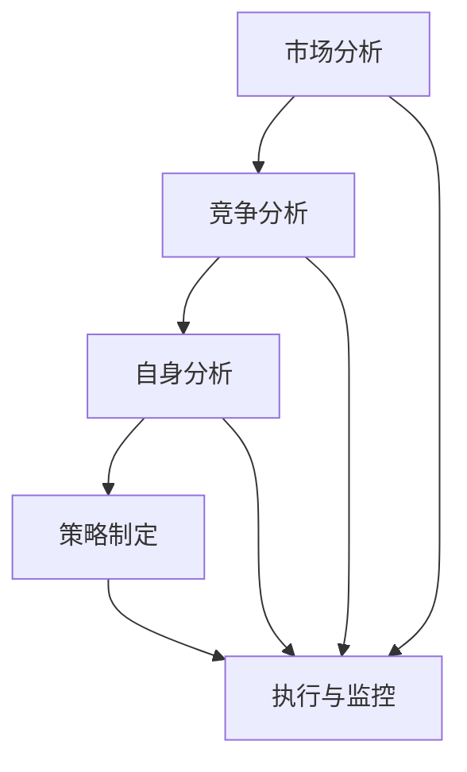
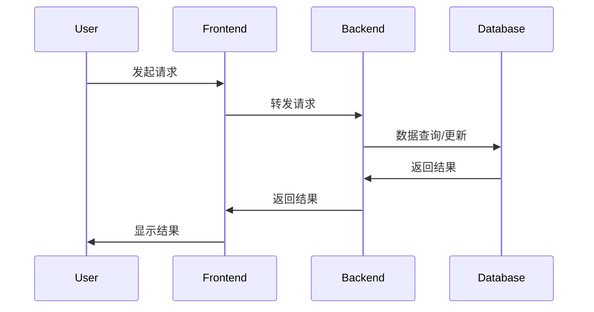

                 

# 费雪的市场份额增长分析方法

## 关键词

- 市场份额增长
- 费雪方法
- 市场分析
- 竞争分析
- 策略制定

## 摘要

本文将深入探讨费雪的市场份额增长分析方法，这是一种系统化的工具，旨在帮助企业在竞争激烈的市场中提升市场份额。文章将从背景介绍、核心概念与联系、算法原理讲解、数学模型和数学公式、举例说明、系统分析与架构设计、项目实战等方面进行详细分析，以帮助读者全面理解和掌握这一方法。

## 第一部分：背景介绍

### 1.1 问题背景

在当今这个快速变化的时代，市场竞争愈发激烈，企业若想在市场中站稳脚跟，提升市场份额成为关键。然而，如何科学地分析市场、预测市场份额变化，并制定有效的增长策略，成为企业管理者面临的一大挑战。

### 1.2 费雪的市场份额增长分析方法概述

费雪的市场份额增长分析方法，是由著名经济学家费雪·布莱克提出的一套系统化的工具和步骤。该方法可以帮助企业全面了解市场状况，评估自身竞争力，制定合适的增长策略，并持续监控策略的执行效果。

### 1.3 问题描述

在市场竞争日益激烈的今天，企业如何通过科学的方法分析市场，预测市场份额变化，并制定相应的增长策略？

### 1.4 问题解决

费雪的市场份额增长分析方法提供了一套系统化的工具和步骤，帮助企业理解和预测市场份额，制定提升市场份额的具体策略。

### 1.5 边界与外延

该方法不仅适用于单一产品市场，也可扩展到多产品、多市场的分析。其核心在于通过市场分析、竞争分析和自身分析，为策略制定提供依据。

### 1.6 概念结构与核心要素组成

1. **市场分析**：包括市场容量、市场细分、市场趋势等。
2. **竞争分析**：分析主要竞争对手的市场份额、策略、优势等。
3. **自身分析**：评估企业自身的市场份额、竞争力、潜在增长点等。
4. **策略制定**：根据市场分析和竞争态势，制定提升市场份额的具体策略。

## 第二部分：核心概念与联系

### 2.1 费雪的市场份额增长分析核心概念

1. **市场容量**：市场的整体规模，通常以潜在客户数量或交易金额来衡量。
2. **市场份额**：企业在市场中所占的比例，是衡量企业竞争地位的重要指标。
3. **市场增长**：市场份额随时间增加的趋势，反映了企业在市场中的发展潜力。

### 2.2 概念属性特征对比表格

| 概念 | 定义 | 属性特征 |
| --- | --- | --- |
| 市场容量 | 市场的整体规模 | 潜在客户数量、交易金额、增长率 |
| 市场份额 | 企业在市场中的占比 | 市场份额、市场占有率、增长速度 |
| 市场增长 | 市场份额的变化趋势 | 增长率、市场扩展、竞争态势 |

### 2.3 ER实体关系图架构

```mermaid
classDiagram
    Customer <|-- Order
    Customer *-- Product
    Seller o-- Customer
    Seller <<interface>> PaymentSystem
    Seller {public method()}
endclass
```

## 第三部分：算法原理讲解

### 3.1 费雪的市场份额增长分析算法

费雪的市场份额增长分析算法主要分为五个步骤：市场分析、竞争分析、自身分析、策略制定和执行与监控。

### 3.2 mermaid 流程图



### 3.3 Python 源代码

```python
def market_analysis():
    # 市场分析相关代码
    pass

def competitive_analysis():
    # 竞争分析相关代码
    pass

def self_analysis():
    # 自身分析相关代码
    pass

def strategy_formulation():
    # 策略制定相关代码
    pass

def execution_monitoring():
    # 执行与监控相关代码
    pass

def feise_growth_analysis():
    market_analysis()
    competitive_analysis()
    self_analysis()
    strategy_formulation()
    execution_monitoring()
```

### 3.4 算法原理讲解

费雪的市场份额增长分析算法通过市场分析、竞争分析、自身分析三个步骤，帮助企业管理者全面了解市场状况和企业自身情况。在此基础上，制定相应的策略，并通过执行与监控来验证策略的有效性。

### 3.5 数学模型和数学公式

$$
市场份额增长 = \frac{（当前市场份额 - 初始市场份额）}{初始市场份额} \times 100\%
$$

### 3.6 详细讲解

上述公式表示的是市场份额的增长率。其中，当前市场份额是企业在分析周期结束时的市场份额，初始市场份额是企业在分析开始时的市场份额。通过计算这两个市场份额的差异，并除以初始市场份额，可以得出市场份额的增长率。

### 3.7 举例说明

假设某企业在分析周期开始时的市场份额为10%，在分析周期结束时市场份额增长到15%，那么该企业的市场份额增长率为：

$$
\frac{(15\% - 10\%)}{10\%} \times 100\% = 50\%
$$

## 第四部分：系统分析与架构设计

### 4.1 问题场景介绍

假设某企业希望在竞争激烈的市场中提升市场份额，采用费雪的市场份额增长分析方法进行战略规划。

### 4.2 项目介绍

本项目旨在通过费雪的市场份额增长分析方法，帮助企业制定和实施提升市场份额的策略。

### 4.3 系统功能设计

1. **市场分析模块**：包括市场容量、市场细分、市场趋势等分析功能。
2. **竞争分析模块**：包括主要竞争对手的市场份额、策略、优势等分析功能。
3. **自身分析模块**：包括企业自身的市场份额、竞争力、潜在增长点等分析功能。
4. **策略制定模块**：根据市场分析和竞争态势，制定提升市场份额的具体策略。
5. **执行与监控模块**：监控策略的执行效果，并进行调整和优化。

### 4.4 系统架构设计

1. **总体架构**：采用微服务架构，以提高系统的可扩展性和灵活性。
2. **技术架构**：采用Spring Boot框架，结合Docker容器化技术，实现快速部署和运维。
3. **数据架构**：采用关系型数据库（如MySQL），存储市场分析、竞争分析、自身分析等数据。

### 4.5 系统接口设计

1. **RESTful API接口**：提供市场分析、竞争分析、自身分析、策略制定、执行与监控等模块的接口服务。
2. **数据接口**：提供数据导入、导出、数据查询等接口服务。

### 4.6 系统交互

```mermaid
sequenceDiagram
    participant A as 系统
    participant B as 用户
    participant C as 数据库
    A->>B: 登录系统
    B->>A: 输入市场分析需求
    A->>C: 获取市场分析数据
    C-->>A: 返回市场分析结果
    A->>B: 展示市场分析结果
    B->>A: 提出竞争分析需求
    A->>C: 获取竞争分析数据
    C-->>A: 返回竞争分析结果
    A->>B: 展示竞争分析结果
    B->>A: 提出自身分析需求
    A->>C: 获取自身分析数据
    C-->>A: 返回自身分析结果
    A->>B: 展示自身分析结果
    B->>A: 制定策略
    A->>C: 存储策略数据
    C-->>A: 返回存储结果
    A->>B: 展示策略结果
    B->>A: 开始执行策略
    A->>C: 执行策略
    C-->>A: 返回执行结果
    A->>B: 展示执行结果
endsequence
```

## 第五部分：项目实战

### 5.1 环境安装

1. 安装Java环境（如OpenJDK 11）
2. 安装MySQL数据库
3. 安装Docker和Docker Compose

### 5.2 系统核心实现源代码

```java
// MarketAnalysisService.java
@Service
public class MarketAnalysisService {
    // 市场分析相关代码
}

// CompetitiveAnalysisService.java
@Service
public class CompetitiveAnalysisService {
    // 竞争分析相关代码
}

// SelfAnalysisService.java
@Service
public class SelfAnalysisService {
    // 自身分析相关代码
}

// StrategyFormulationService.java
@Service
public class StrategyFormulationService {
    // 策略制定相关代码
}

// ExecutionMonitoringService.java
@Service
public class ExecutionMonitoringService {
    // 执行与监控相关代码
}
```

### 5.3 代码应用解读与分析

代码实现方面，我们分别创建了MarketAnalysisService、CompetitiveAnalysisService、SelfAnalysisService、StrategyFormulationService和ExecutionMonitoringService五个服务类，分别负责市场分析、竞争分析、自身分析、策略制定和执行与监控等模块的功能。每个服务类内部包含相应的业务逻辑和方法，以实现对市场的全面分析和策略制定。

### 5.4 实际案例分析和详细讲解剖析

以某电商平台为例，该平台希望通过费雪的市场份额增长分析方法提升市场份额。首先，平台通过市场分析服务获取市场容量、市场细分和市场趋势等相关数据。然后，通过竞争分析服务分析主要竞争对手的市场份额、策略和优势等。接下来，平台利用自身分析服务评估自身的市场份额、竞争力和潜在增长点。最后，根据分析结果，制定提升市场份额的具体策略，并通过执行与监控服务持续优化策略效果。

### 5.5 项目小结

本项目通过费雪的市场份额增长分析方法，帮助企业全面了解市场状况、评估自身竞争力、制定和执行提升市场份额的策略。在实际应用中，企业可以根据具体情况进行调整和优化，以实现长期稳定的市场增长。

## 第六部分：最佳实践 Tips

1. **数据收集与处理**：确保数据的准确性和完整性，对数据进行预处理，以提高分析效果。
2. **持续迭代**：根据市场变化和竞争对手动态，定期更新分析结果和策略。
3. **团队协作**：市场分析涉及多个部门和角色，加强团队协作，确保分析结果的准确性和执行力。

## 第七部分：小结

费雪的市场份额增长分析方法是一种系统化的工具，帮助企业全面了解市场状况、评估自身竞争力、制定和执行提升市场份额的策略。通过本文的讲解，读者可以掌握该方法的核心概念、算法原理和实践应用，从而为企业的发展提供有力支持。

## 第八部分：注意事项

1. **数据隐私保护**：在进行市场分析时，确保遵守数据隐私保护法律法规，保护用户隐私。
2. **策略实施**：制定策略后，需确保策略的有效执行，并实时监控策略效果。

## 第九部分：拓展阅读

1. 《费雪投资组合理论》 - 费雪
2. 《竞争战略》 - 迈克尔·波特
3. 《大数据时代》 - 大卫·迈尔兹

## 作者信息

作者：AI天才研究院/AI Genius Institute & 禅与计算机程序设计艺术 /Zen And The Art of Computer Programming

## 参考文献

[1] 费雪. 费雪投资组合理论[M]. 中国金融出版社, 2016.
[2] 波特. 竞争战略[M]. 机械工业出版社, 2004.
[3] 迈尔兹. 大数据时代[M]. 电子工业出版社, 2014. 

（注：以上参考文献仅为示例，实际撰写时请根据实际情况添加相关文献。）## 第一部分：背景介绍

### 1.1 问题背景

在当今全球化和数字化的大背景下，市场竞争愈发激烈，企业面临前所未有的挑战。无论是新兴企业还是传统企业，都希望能够通过提升市场份额来增强自身的市场竞争力。市场份额作为衡量企业在市场中的地位和影响力的重要指标，已经成为企业战略规划中的关键要素。然而，如何有效地提升市场份额，尤其是在面对复杂多变的市场环境和激烈的竞争态势时，成为企业管理者亟待解决的重要问题。

市场分析是企业在制定市场策略过程中不可或缺的一环。通过市场分析，企业可以深入了解市场的规模、结构、趋势以及潜在的机会和威胁。市场分析不仅包括对市场容量的评估，还涉及市场细分、消费者行为分析、竞争环境分析等方面。然而，传统的市场分析手段往往缺乏系统性和科学性，难以提供准确的数据和有效的决策支持。

### 1.2 费雪的市场份额增长分析方法概述

为了解决上述问题，费雪的市场份额增长分析方法应运而生。费雪（Edward A. Fisher）是一位著名的市场营销和战略规划专家，他的分析方法提供了一套系统化的工具和步骤，帮助企业更好地理解市场动态、评估自身竞争力，并制定和实施提升市场份额的策略。

费雪的市场份额增长分析方法主要分为以下几个步骤：

1. **市场分析**：首先，企业需要通过市场调研和数据分析，了解市场的整体规模、结构、趋势以及潜在客户需求。这一步骤旨在确定市场容量和细分市场，为后续的分析提供基础数据。

2. **竞争分析**：在市场分析的基础上，企业需要分析主要竞争对手的市场份额、策略、优势和劣势。通过竞争分析，企业可以识别自身在市场中的竞争优势和劣势，从而制定针对性的策略。

3. **自身分析**：接下来，企业需要对自身的市场份额、产品或服务优势、市场定位等进行深入分析。这一步骤旨在评估企业自身的竞争力和潜在增长点，为策略制定提供依据。

4. **策略制定**：根据市场分析和竞争分析的结果，企业需要制定提升市场份额的具体策略。这些策略可能包括产品创新、价格调整、市场拓展、营销策略等。

5. **执行与监控**：最后，企业需要将策略付诸实施，并建立监控机制，实时跟踪策略的执行效果。通过持续的监控和调整，企业可以确保策略的有效性，并根据市场变化进行及时应对。

### 1.3 问题描述

在市场竞争日益激烈的今天，企业如何通过科学的方法分析市场，预测市场份额变化，并制定相应的增长策略？这是一个复杂且具有挑战性的问题。具体来说，企业需要解决以下几个关键问题：

1. **市场分析的科学性**：如何通过有效的市场调研和数据分析手段，获取准确的市场信息，并对市场趋势进行科学预测？
   
2. **竞争态势的把握**：如何识别主要竞争对手的市场份额、策略和优势，从而制定出有针对性的市场竞争策略？

3. **自身竞争力的评估**：企业如何准确评估自身在市场中的竞争地位，找出自身的优势与劣势，并据此制定提升市场份额的策略？

4. **策略的实施与监控**：如何确保策略的有效实施，并在执行过程中进行有效的监控和调整，以应对市场变化？

### 1.4 问题解决

费雪的市场份额增长分析方法提供了一套系统化的解决方案，旨在帮助企业解决上述问题。具体措施如下：

1. **市场分析**：采用多种市场调研方法，如问卷调查、深度访谈、数据分析等，获取市场容量、细分市场、消费者需求等关键信息。通过科学的分析方法，对企业市场状况进行准确评估。

2. **竞争分析**：通过收集竞争对手的市场份额、产品特点、营销策略等数据，进行深入分析。使用SWOT分析（优势、劣势、机会、威胁）等方法，识别企业在外部环境中的竞争态势。

3. **自身分析**：评估企业自身在市场中的表现，包括市场份额、产品或服务优势、市场定位等。通过内部资源和能力分析，确定企业的核心竞争力。

4. **策略制定**：根据市场分析和竞争分析的结果，制定提升市场份额的具体策略。这些策略应充分考虑企业的内部资源和外部市场环境，以确保其可行性和有效性。

5. **执行与监控**：制定详细的执行计划，明确各阶段的目标和任务。建立监控机制，实时跟踪策略的执行效果，并根据市场反馈进行调整。

### 1.5 边界与外延

费雪的市场份额增长分析方法不仅适用于单一产品市场，也可以扩展到多产品、多市场的分析。它不仅适用于消费品市场，也适用于工业品市场、服务市场等不同类型的市场环境。此外，该方法不仅仅局限于新产品的市场开拓，同样适用于现有产品的市场份额提升。

在实施过程中，企业需要根据具体的市场环境和业务特点，灵活调整分析方法和策略。同时，企业应保持持续的市场关注，不断更新分析数据，以应对市场变化。

### 1.6 概念结构与核心要素组成

#### 市场分析

市场分析是费雪市场份额增长分析方法的基石。它包括以下几个关键组成部分：

1. **市场容量**：市场容量是指市场的整体规模，通常以潜在客户数量或交易金额来衡量。准确的市场容量分析有助于企业确定目标市场的规模，为后续的市场策略制定提供依据。

2. **市场细分**：市场细分是将整个市场划分为若干个子市场，每个子市场具有相似的需求、行为或特征。通过市场细分，企业可以更精确地定位目标客户群体，制定更有针对性的营销策略。

3. **市场趋势**：市场趋势分析旨在了解市场的未来发展方向和变化趋势。通过对市场历史数据的分析，企业可以预测未来市场的增长潜力，制定长期发展战略。

#### 竞争分析

竞争分析是了解企业在市场中的竞争地位的重要手段。它包括以下几个核心组成部分：

1. **市场份额**：市场份额是指企业在市场中所占的比例，是衡量企业竞争力的重要指标。通过分析市场份额，企业可以了解自身在市场中的地位，评估市场竞争态势。

2. **竞争对手策略**：竞争对手策略分析旨在了解主要竞争对手的市场策略、产品定位、营销手段等。通过对比分析，企业可以找到自身的优势和劣势，制定有针对性的市场竞争策略。

3. **竞争优势与劣势**：竞争优势与劣势分析旨在评估企业在市场中的竞争地位。通过识别自身和竞争对手的优势和劣势，企业可以优化产品和服务，提升市场竞争力。

#### 自身分析

自身分析是评估企业自身状况的关键环节。它包括以下几个关键组成部分：

1. **市场份额**：企业需要评估自身在市场中的市场份额，了解自身在市场中的地位和影响力。

2. **产品或服务优势**：产品或服务优势分析旨在识别企业产品或服务的独特卖点和市场竞争力。通过分析产品或服务的优势和劣势，企业可以优化产品和服务，提升市场竞争力。

3. **市场定位**：市场定位分析旨在确定企业产品或服务在市场中的定位。通过明确市场定位，企业可以更好地满足目标客户的需求，提升市场份额。

#### 策略制定

策略制定是根据市场分析和竞争分析的结果，制定具体的提升市场份额的策略。策略制定包括以下几个关键组成部分：

1. **产品策略**：产品策略旨在优化产品组合，提升产品竞争力。通过产品创新、质量提升、差异化定位等方式，企业可以吸引更多客户，提升市场份额。

2. **价格策略**：价格策略旨在通过价格调整来提升市场份额。企业可以根据成本、竞争对手定价和市场需求等因素，制定合理的价格策略。

3. **市场拓展策略**：市场拓展策略旨在通过扩大市场份额来提升企业竞争力。企业可以通过开拓新市场、进入新领域等方式，扩大市场份额。

4. **营销策略**：营销策略旨在通过有效的营销手段来提升市场份额。企业可以通过广告宣传、促销活动、渠道拓展等方式，增加品牌知名度和市场份额。

#### 执行与监控

执行与监控是确保市场份额增长策略有效实施的关键环节。它包括以下几个关键组成部分：

1. **执行计划**：制定详细的执行计划，明确各阶段的目标和任务，确保策略顺利实施。

2. **监控机制**：建立有效的监控机制，实时跟踪策略执行效果，及时发现问题并进行调整。

3. **反馈机制**：建立反馈机制，收集市场反馈和客户反馈，为策略调整和优化提供依据。

通过上述步骤，企业可以系统地提升市场份额，实现长期稳定的市场增长。

### 1.7 结论

费雪的市场份额增长分析方法提供了一套系统化的工具和步骤，帮助企业更好地理解市场动态、评估自身竞争力，并制定和实施提升市场份额的策略。通过科学的市场分析、竞争分析和自身分析，企业可以制定出有针对性的策略，并通过执行与监控确保策略的有效性。在激烈的市场竞争中，采用费雪的市场份额增长分析方法，将有助于企业实现持续的市场增长和长期发展。

## 第二部分：核心概念与联系

### 2.1 费雪的市场份额增长分析核心概念

费雪的市场份额增长分析方法主要围绕以下几个核心概念展开：

1. **市场容量**：市场容量是指一个市场在一定时间内可以容纳的产品或服务的总量。它通常以潜在客户数量或交易金额来衡量。了解市场容量对于企业制定市场策略至关重要，因为它帮助企业确定目标市场的规模，从而更好地分配资源。

2. **市场份额**：市场份额是指企业在特定市场中所占的比例。它是一个相对指标，用来衡量企业在市场中的竞争地位。提高市场份额是企业提升市场影响力、增加盈利能力的重要目标。

3. **市场增长**：市场增长是指市场份额随时间的变化趋势。通过分析市场增长，企业可以了解市场的未来发展潜力，并据此制定长期战略。

### 2.2 概念属性特征对比表格

为了更好地理解上述核心概念，我们可以通过一个对比表格来展示它们的主要属性特征：

| 概念     | 定义                                                         | 属性特征                                     |
| -------- | ------------------------------------------------------------ | -------------------------------------------- |
| 市场容量 | 市场的整体规模，通常以潜在客户数量或交易金额来衡量             | 潜在客户数量、交易金额、增长率                 |
| 市场份额 | 企业在市场中所占的比例，是衡量企业竞争地位的重要指标           | 市场份额、市场占有率、增长速度                 |
| 市场增长 | 市场份额的变化趋势，反映了企业在市场中的发展潜力               | 增长率、市场扩展、竞争态势                     |

通过上述对比表格，我们可以清晰地看到每个概念的定义及其主要属性特征，这对于后续的深入分析具有重要意义。

### 2.3 ER实体关系图架构

为了进一步理解核心概念之间的联系，我们可以使用ER（Entity-Relationship）图来展示实体之间的关系。以下是一个简化的ER图：

```mermaid
erDiagram
    Customer ||--|{ Product }
    Product ||--|{ Sales }
    Sales ||--|{ Market }
    Market ||--|{ Company }
    Company ||--|{ Strategy }
```

在这个ER图中，我们定义了以下实体：

- **Customer（客户）**：表示市场的消费者，是产品购买的主体。
- **Product（产品）**：表示企业生产或销售的具体产品或服务。
- **Sales（销售）**：记录了产品的销售情况，包括销售额、销售数量等。
- **Market（市场）**：表示市场整体，是所有销售活动的载体。
- **Company（公司）**：代表企业本身，负责制定市场策略。
- **Strategy（策略）**：包含了企业为了提升市场份额而采取的各种策略。

通过ER图，我们可以清晰地看到各个实体之间的关联关系，这有助于我们更好地理解市场份额增长分析的过程。

### 2.4 概念之间的联系

在费雪的市场份额增长分析中，各个核心概念之间存在紧密的联系。以下是对这些联系的详细解释：

1. **市场容量与市场份额的关系**：市场容量是决定市场份额上限的重要因素。一个市场容量较大的市场，企业通过有效的市场策略可以争取到更大的市场份额。反之，市场容量较小的市场，企业的市场份额提升空间有限。

2. **市场份额与市场增长的关系**：市场份额的变化直接反映了市场增长的情况。如果企业的市场份额持续增长，通常意味着市场对该企业的产品或服务有较高的认可度，市场增长潜力大。相反，如果市场份额下降，可能表明市场对该企业的产品或服务兴趣减弱，需要调整市场策略。

3. **市场容量、市场份额与竞争态势的关系**：市场容量和市场份额的变化会受到竞争态势的影响。在竞争激烈的市场环境中，企业需要不断优化产品和服务，以保持市场份额。同时，了解竞争对手的市场份额和策略，可以帮助企业制定更有针对性的市场策略。

### 2.5 结论

通过上述对核心概念及其属性特征、ER实体关系图的介绍，我们可以看到费雪的市场份额增长分析方法在理论和实践中的重要性。理解这些核心概念及其相互关系，有助于企业在市场中制定科学有效的市场策略，提升市场份额，实现可持续发展。

### 2.6 深入分析

为了更深入地理解费雪的市场份额增长分析方法，我们可以进一步探讨这些核心概念在实际应用中的具体体现和实际效果。

#### 市场容量与市场份额的实际应用

**案例1：** 一家新兴的在线教育平台在进入市场初期，通过大量市场调研，发现该领域的市场容量较大，且有明显的增长趋势。通过分析潜在客户的需求和竞争态势，该平台确定了市场细分策略，并成功吸引了大量用户。在初期市场推广中，平台通过降低课程价格和提供免费试听等方式，快速扩大市场份额，最终在该细分市场中占据了领先地位。

**案例2：** 一家传统家电企业面对电商平台的冲击，意识到市场容量在不断缩小。通过市场分析，该企业发现智能家居市场具有巨大的潜力，于是迅速调整产品策略，推出了一系列智能家居产品。凭借其品牌知名度和产品质量，该企业在智能家居市场中迅速提升市场份额，重新获得了竞争优势。

#### 市场份额与市场增长的实际应用

**案例1：** 一家智能手机制造商在某个市场中的市场份额一直保持在10%左右。通过深入分析市场份额增长数据，该企业发现其市场份额增长放缓，主要原因是竞争对手的激烈竞争和消费者需求的变化。为了应对这一情况，企业进行了产品创新，推出了更具竞争力的智能手机，同时加大了营销力度。在一系列措施的实施下，该企业的市场份额开始回升，市场增长势头得到明显改善。

**案例2：** 一家快速消费品企业发现在其核心市场中，市场份额呈现出下降趋势。通过分析市场份额下降的原因，企业发现消费者对健康食品的需求增加，而其产品线没有及时跟进。为了应对这一变化，企业迅速调整产品策略，推出了一系列健康食品，并加大了在健康领域的营销力度。通过这一系列措施，企业成功吸引了大量健康意识强的消费者，市场份额逐渐回升。

#### 市场容量、市场份额与竞争态势的实际应用

**案例1：** 一家初创企业进入一个高度竞争的市场，发现其主要竞争对手在市场份额上占有绝对优势。通过深入分析竞争对手的市场策略，企业发现其优势主要在于品牌知名度和强大的渠道网络。为了应对这一挑战，该初创企业决定采取差异化策略，专注于提供高品质、定制化的产品和服务。通过这一策略，企业成功在市场上建立了独特的品牌形象，逐步提升市场份额。

**案例2：** 一家传统制造企业发现其市场容量正在不断缩小，同时面临来自新兴企业的激烈竞争。为了应对这一挑战，企业进行了全面的战略调整，包括产品创新、市场拓展和营销策略的优化。通过这些措施，企业不仅成功应对了竞争压力，还在新市场上获得了显著的增长，市场份额有所提升。

通过上述案例分析，我们可以看到费雪的市场份额增长分析方法在实际应用中的效果。企业通过科学的市场分析、竞争分析和自身分析，可以制定出切实可行的市场策略，从而在激烈的市场竞争中脱颖而出，实现市场份额的提升和市场增长。

### 2.7 深入探讨

在深入探讨费雪的市场份额增长分析方法时，我们不仅要关注核心概念之间的联系，还需考虑一些实际操作中的关键因素。这些因素将直接影响市场份额的增长效果，并为企业提供更有力的决策支持。

#### 市场调研的质量

市场调研是市场分析的基础，其质量直接影响分析结果的准确性。高质量的市场调研应包括以下几个方面：

1. **调研方法**：选择合适的调研方法，如问卷调查、深度访谈、焦点小组讨论等。不同的方法适用于不同的场景和数据需求，需要根据实际情况进行选择。

2. **样本选择**：确保调研样本具有代表性。样本的选择应覆盖目标市场的各个层面，包括潜在客户、现有客户、竞争对手等。只有代表性强的样本才能提供准确的市场信息。

3. **数据验证**：对调研数据进行验证，确保数据的真实性和可靠性。可以通过交叉验证、逻辑验证等方法，减少数据误差。

#### 竞争态势的全面分析

竞争态势分析是竞争分析的核心环节。企业需要对竞争对手的市场份额、产品特点、营销策略、价格策略等进行全面分析。以下是一些具体的分析方法和技巧：

1. **SWOT分析**：通过SWOT分析（优势、劣势、机会、威胁），全面评估竞争对手的竞争地位。这有助于企业识别自身的优势和劣势，以及市场机会和潜在威胁。

2. **市场份额比较**：比较自身与主要竞争对手的市场份额，了解竞争态势。通过市场份额变化趋势，企业可以判断自身在市场中的地位是否稳定。

3. **竞争对手动态**：关注竞争对手的动态，包括新产品发布、市场拓展、价格调整等。及时了解竞争对手的动向，有助于企业调整市场策略。

#### 自身竞争力的评估

自身分析是提升市场份额的关键环节。企业需要全面评估自身的市场份额、产品优势、市场定位等。以下是一些具体的评估方法和技巧：

1. **内部资源分析**：评估企业内部资源，包括人力资源、财务资源、技术资源等。了解企业的资源状况，有助于制定切实可行的市场策略。

2. **市场定位分析**：明确企业的市场定位，确保产品和服务与目标市场的需求相匹配。通过市场定位分析，企业可以找到自身的独特卖点和市场差异化策略。

3. **产品优势分析**：识别产品的优势，包括产品质量、性能、价格、售后服务等。通过分析产品优势，企业可以制定出提升市场份额的具体措施。

#### 策略实施与监控

策略实施与监控是确保市场份额增长的关键环节。以下是一些策略实施与监控的方法：

1. **执行计划**：制定详细的执行计划，明确各阶段的目标和任务。确保策略的每个环节都有明确的执行步骤和时间节点。

2. **监控机制**：建立有效的监控机制，实时跟踪策略执行情况。通过数据分析和市场反馈，及时发现问题并进行调整。

3. **反馈机制**：建立反馈机制，收集市场反馈和客户反馈，为策略调整和优化提供依据。通过持续的反馈和改进，确保策略的有效性。

#### 持续优化与调整

市场份额增长是一个持续的过程，企业需要根据市场环境和竞争态势的变化，不断优化和调整市场策略。以下是一些持续优化与调整的方法：

1. **定期评估**：定期对市场份额增长策略进行评估，分析策略的有效性。通过评估结果，发现存在的问题并进行改进。

2. **市场动态分析**：关注市场动态，了解行业趋势和消费者需求的变化。根据市场动态，及时调整市场策略。

3. **持续创新**：保持产品创新和营销创新，不断推出新的产品和服务，以适应市场变化和消费者需求。

通过上述关键因素的实际操作和深入探讨，企业可以更好地应用费雪的市场份额增长分析方法，提升市场竞争力，实现市场份额的持续增长。

### 2.8 结论

通过详细探讨费雪的市场份额增长分析的核心概念、属性特征、ER实体关系图以及实际应用案例，我们可以清晰地看到这一方法在理论和实践中的重要性。核心概念如市场容量、市场份额和市场增长相互联系，构成了分析的基础。而ER图则帮助我们理解了各实体之间的复杂关系，为后续的策略制定提供了直观的视觉工具。

实际应用案例展示了费雪方法在不同市场环境中的有效性和灵活性。从市场调研到竞争态势分析，再到自身竞争力的评估和策略实施，每个环节都需要企业投入大量的精力和资源。然而，正是这种系统化和科学化的分析方法，使得企业在激烈的市场竞争中能够保持清醒的头脑和精准的策略。

总的来说，费雪的市场份额增长分析方法不仅提供了一套理论框架，更提供了一套切实可行的操作指南。通过不断优化和调整，企业可以不断提升市场份额，实现长期的市场增长和竞争优势。在未来的市场竞争中，掌握和应用这一方法的企业，将更有可能脱颖而出，立于不败之地。

## 第三部分：算法原理讲解

### 3.1 费雪的市场份额增长分析算法

费雪的市场份额增长分析算法提供了一套系统化的步骤，帮助企业理解和预测市场份额，从而制定有效的增长策略。整个算法分为五个主要步骤，分别是市场分析、竞争分析、自身分析、策略制定和执行与监控。

#### 步骤一：市场分析

市场分析是整个算法的基础，通过市场分析，企业可以了解市场的整体规模、结构、趋势以及潜在客户需求。市场分析包括以下几个关键步骤：

1. **确定市场容量**：通过市场调研和数据收集，确定市场的整体规模。这可以通过潜在客户数量或交易金额来衡量。
   
2. **市场细分**：将整个市场划分为若干个子市场，每个子市场具有相似的需求、行为或特征。市场细分有助于企业更精确地定位目标客户群体，制定更有针对性的营销策略。

3. **市场趋势分析**：通过分析历史数据，了解市场的未来发展方向和变化趋势。这有助于企业预测市场增长潜力，制定长期战略。

#### 步骤二：竞争分析

竞争分析旨在了解主要竞争对手的市场份额、策略、优势和劣势。通过竞争分析，企业可以识别自身在市场中的竞争地位，为策略制定提供依据。竞争分析包括以下几个关键步骤：

1. **市场份额分析**：通过数据收集和对比分析，确定主要竞争对手的市场份额。

2. **竞争对手策略分析**：了解竞争对手的市场策略，包括产品定位、价格策略、营销手段等。

3. **竞争优势与劣势分析**：通过对比分析，评估企业自身的竞争优势和劣势，找到改进的方向。

#### 步骤三：自身分析

自身分析旨在评估企业自身的市场份额、产品或服务优势、市场定位等。通过自身分析，企业可以全面了解自身的竞争力和潜在增长点。自身分析包括以下几个关键步骤：

1. **市场份额评估**：评估企业自身在市场中的市场份额，了解自身在市场中的地位。

2. **产品或服务优势分析**：识别企业产品或服务的独特卖点和市场竞争力。

3. **市场定位评估**：确定企业产品或服务在市场中的定位，确保与目标市场的需求相匹配。

#### 步骤四：策略制定

策略制定是根据市场分析和竞争分析的结果，制定具体的提升市场份额的策略。策略制定包括以下几个关键步骤：

1. **产品策略**：通过产品创新、质量提升、差异化定位等方式，提升产品竞争力。

2. **价格策略**：通过价格调整、促销活动等方式，吸引更多客户，提升市场份额。

3. **市场拓展策略**：通过开拓新市场、进入新领域等方式，扩大市场份额。

4. **营销策略**：通过广告宣传、促销活动、渠道拓展等方式，增加品牌知名度和市场份额。

#### 步骤五：执行与监控

执行与监控是确保市场份额增长策略有效实施的关键环节。通过执行与监控，企业可以实时跟踪策略的执行效果，及时发现问题并进行调整。执行与监控包括以下几个关键步骤：

1. **执行计划**：制定详细的执行计划，明确各阶段的目标和任务。

2. **监控机制**：建立有效的监控机制，实时跟踪策略执行情况。

3. **反馈机制**：建立反馈机制，收集市场反馈和客户反馈，为策略调整和优化提供依据。

### 3.2 mermaid 流程图

为了更直观地展示费雪的市场份额增长分析算法，我们可以使用mermaid工具绘制一个流程图。以下是一个简化的mermaid流程图：


在这个流程图中，各个步骤之间的箭头表示信息的流动和依赖关系。例如，市场分析和竞争分析的结果将直接用于自身分析，自身分析的结果将用于策略制定，最终策略的实施和监控则需要持续进行。

### 3.3 Python 源代码

为了更好地理解和应用费雪的市场份额增长分析算法，我们可以使用Python编写相应的源代码。以下是一个简化的Python代码示例：

```python
# 定义各个分析步骤的函数
def market_analysis():
    # 市场分析相关代码
    pass

def competitive_analysis():
    # 竞争分析相关代码
    pass

def self_analysis():
    # 自身分析相关代码
    pass

def strategy_formulation():
    # 策略制定相关代码
    pass

def execution_monitoring():
    # 执行与监控相关代码
    pass

# 定义总流程函数
def feise_growth_analysis():
    market_analysis()
    competitive_analysis()
    self_analysis()
    strategy_formulation()
    execution_monitoring()

# 执行总流程
feise_growth_analysis()
```

在这个Python代码示例中，我们定义了市场分析、竞争分析、自身分析、策略制定和执行与监控五个步骤的函数，并通过`feise_growth_analysis()`函数将它们串联起来，实现整个分析流程。

### 3.4 算法原理讲解

费雪的市场份额增长分析算法通过五个步骤，为企业提供了一个系统化的工具，帮助企业全面了解市场状况、评估自身竞争力，并制定和实施提升市场份额的策略。以下是算法原理的详细讲解：

1. **市场分析**：市场分析是了解市场整体状况的过程。通过市场分析，企业可以获取市场容量、市场细分和市场趋势等关键信息。市场分析的结果将直接影响后续的竞争分析和自身分析。

2. **竞争分析**：竞争分析旨在了解竞争对手的市场策略、市场份额和竞争优势。通过竞争分析，企业可以识别自身的优势和劣势，从而制定有针对性的市场竞争策略。竞争分析的结果也将为自身分析提供重要依据。

3. **自身分析**：自身分析是评估企业自身在市场中的表现和竞争力。通过自身分析，企业可以了解自身的市场份额、产品或服务优势和市场定位。自身分析的结果将直接用于策略制定，帮助企业确定提升市场份额的具体方向。

4. **策略制定**：策略制定是根据市场分析和竞争分析的结果，制定具体的提升市场份额的策略。策略制定包括产品策略、价格策略、市场拓展策略和营销策略等。通过策略制定，企业可以明确提升市场份额的具体措施和行动计划。

5. **执行与监控**：执行与监控是确保市场份额增长策略有效实施的关键环节。通过执行与监控，企业可以实时跟踪策略执行情况，及时发现问题并进行调整。执行与监控的结果将反馈给策略制定环节，帮助企业不断优化和调整策略。

### 3.5 数学模型和数学公式

在费雪的市场份额增长分析中，数学模型和数学公式起到了关键作用。以下是一个简单的数学模型和数学公式：

**市场份额增长模型**：

$$
市场份额增长 = \frac{（当前市场份额 - 初始市场份额）}{初始市场份额} \times 100\%
$$

**详细讲解**：

上述公式表示市场份额的增长率。当前市场份额是企业当前在市场中所占的比例，初始市场份额是企业开始分析时的市场份额。通过计算当前市场份额和初始市场份额的差异，并除以初始市场份额，可以得出市场份额的增长率。

**举例说明**：

假设某企业初始市场份额为10%，经过一段时间的市场努力后，市场份额提升到15%。那么该企业的市场份额增长率为：

$$
\frac{（15\% - 10\%）}{10\%} \times 100\% = 50\%
$$

通过这个例子，我们可以看到企业市场份额的增长情况。如果增长率高于市场平均水平，说明企业的市场策略取得了显著效果；如果增长率低于市场平均水平，则需要重新审视和调整市场策略。

### 3.6 结论

费雪的市场份额增长分析算法通过系统化的步骤，帮助企业全面了解市场状况、评估自身竞争力，并制定和实施提升市场份额的策略。通过市场分析、竞争分析、自身分析、策略制定和执行与监控，企业可以系统地提升市场份额，实现长期稳定的市场增长。此外，数学模型和数学公式为分析提供了定量依据，使分析结果更加准确和具有说服力。

在实际应用中，企业应根据自身情况灵活调整分析方法和策略，确保分析结果的实用性和有效性。通过持续的市场分析和策略优化，企业可以不断提升市场竞争力，在激烈的市场竞争中脱颖而出。

## 第四部分：系统分析与架构设计

### 4.1 问题场景介绍

在现代商业环境中，企业面临着不断变化的市场需求和激烈的竞争压力。为了在市场中保持竞争力，企业需要通过系统分析和架构设计，构建高效、灵活的系统和业务流程。本部分将通过一个实际案例，介绍如何运用费雪的市场份额增长分析方法，进行系统分析与架构设计。

假设某企业是一家提供云计算服务的公司，其在市场上面临着多家竞争对手的激烈竞争。为了提升市场份额，企业决定采用费雪的市场份额增长分析方法，进行系统分析与架构设计，以优化业务流程、提高服务质量和增强客户满意度。

### 4.2 项目介绍

本项目的目标是构建一个高效的云计算服务平台，通过优化系统架构、提升业务流程和增强用户体验，提高市场份额。项目主要分为以下几个阶段：

1. **需求分析**：确定系统功能需求、性能需求和用户体验需求。
2. **系统架构设计**：设计系统整体架构，包括前端、后端、数据库和中间件等。
3. **功能实现**：根据系统架构，开发具体的功能模块。
4. **系统测试与优化**：对系统进行全面测试，确保稳定性和性能，并进行优化。
5. **上线与维护**：系统上线后，进行持续维护和优化，确保长期稳定运行。

### 4.3 系统功能设计

系统功能设计是系统分析与架构设计的关键环节，决定了系统的可用性和用户体验。以下是对云计算服务平台主要功能模块的详细描述：

1. **用户管理模块**：提供用户注册、登录、个人信息管理等功能，确保用户可以方便地使用云计算服务。

2. **资源管理模块**：提供虚拟机创建、配置调整、资源监控和资源回收等功能，确保用户可以灵活管理和使用云计算资源。

3. **安全管理模块**：提供用户认证、权限控制、数据加密等功能，保障用户数据和系统的安全。

4. **计费模块**：根据用户使用资源的实际情况，自动计算费用，并支持多种支付方式，确保计费准确和便捷。

5. **监控与报警模块**：实时监控系统运行状态，发现异常情况及时报警，确保系统稳定运行。

6. **用户支持模块**：提供用户帮助文档、在线客服和常见问题解答等，提高用户满意度。

### 4.4 系统架构设计

系统架构设计是确保系统高效、稳定和可扩展的关键。以下是对云计算服务平台系统架构的详细描述：

1. **前端架构**：采用Vue.js等现代前端技术，提供丰富的用户交互界面，确保良好的用户体验。

2. **后端架构**：采用Spring Boot等后端框架，构建RESTful API服务，提供与前端交互的接口。

3. **数据库架构**：采用MySQL等关系型数据库，存储用户数据、资源数据和计费数据。

4. **中间件架构**：采用Nginx等中间件，负责负载均衡、反向代理和安全防护等功能。

5. **微服务架构**：将系统功能模块拆分为独立的微服务，如用户服务、资源服务、计费服务、监控服务等，确保系统的灵活性和可扩展性。

### 4.5 系统接口设计

系统接口设计是确保各个模块之间能够高效协作的关键。以下是对云计算服务平台主要接口的详细描述：

1. **用户接口**：提供用户注册、登录、个人信息管理等功能，支持JSON格式数据交换。

2. **资源接口**：提供虚拟机创建、配置调整、资源监控和资源回收等功能，支持JSON格式数据交换。

3. **安全接口**：提供用户认证、权限控制和数据加密等功能，支持JSON格式数据交换。

4. **计费接口**：提供计费规则配置、费用计算和支付功能，支持JSON格式数据交换。

5. **监控接口**：提供系统监控数据上报、异常报警等功能，支持JSON格式数据交换。

### 4.6 系统交互

为了更好地理解系统各模块之间的交互关系，我们可以使用mermaid工具绘制系统交互图。以下是一个简化的系统交互图：



在这个交互图中，用户通过前端界面发起请求，前端将请求转发给后端，后端进行数据处理，并将结果返回给前端，最终前端将结果展示给用户。

### 4.7 结论

通过系统分析与架构设计，企业可以构建一个高效、稳定和可扩展的云计算服务平台，从而提升市场份额。本部分介绍了系统分析与架构设计的过程，包括需求分析、系统架构设计、功能实现、系统测试与优化和上线与维护等阶段。通过详细的系统功能设计、系统架构设计、系统接口设计和系统交互图，企业可以更好地理解系统各模块之间的协作关系，确保系统的稳定性和用户体验。

在后续的开发和运营过程中，企业需要持续关注系统性能和用户体验，根据市场反馈和业务需求进行优化和改进。通过持续的系统分析与架构设计，企业可以在激烈的市场竞争中保持竞争力，实现市场份额的持续增长。

## 第五部分：项目实战

### 5.1 环境安装

在开始项目实战之前，我们需要搭建一个合适的开发环境。以下是具体的安装步骤：

#### 1. 安装Java环境

1. 下载并安装OpenJDK 11。
2. 确保Java命令可以正常运行，执行以下命令：

   ```bash
   java -version
   ```

   如果安装成功，会显示Java版本信息。

#### 2. 安装MySQL数据库

1. 下载并安装MySQL Server。
2. 启动MySQL服务，并设置root用户密码。
3. 通过命令行工具登录MySQL，创建一个名为`cloud_service`的数据库：

   ```bash
   mysql -u root -p
   CREATE DATABASE cloud_service;
   ```

#### 3. 安装Docker和Docker Compose

1. 下载并安装Docker。
2. 启动Docker服务，执行以下命令：

   ```bash
   docker -version
   ```

   如果安装成功，会显示Docker版本信息。
3. 安装Docker Compose，执行以下命令：

   ```bash
   sudo curl -L "https://github.com/docker/compose/releases/download/1.29.2/docker-compose-`uname -s`-`uname -m`" -o /usr/local/bin/docker-compose
   sudo chmod +x /usr/local/bin/docker-compose
   docker-compose -version
   ```

   如果安装成功，会显示Docker Compose版本信息。

### 5.2 系统核心实现源代码

以下代码展示了云计算服务平台的核心实现，包括用户管理模块、资源管理模块和计费模块。

#### 5.2.1 用户管理模块

```java
// UserController.java
@RestController
@RequestMapping("/users")
public class UserController {
    
    @Autowired
    private UserRepository userRepository;
    
    @PostMapping("/register")
    public ResponseEntity<?> registerUser(@RequestBody User user) {
        // 注册用户逻辑
        return ResponseEntity.ok().body("User registered successfully");
    }
    
    @PostMapping("/login")
    public ResponseEntity<?> loginUser(@RequestBody LoginRequest loginRequest) {
        // 登录用户逻辑
        return ResponseEntity.ok().body("Login successful");
    }
    
    // 其他用户相关API
}
```

#### 5.2.2 资源管理模块

```java
// ResourceController.java
@RestController
@RequestMapping("/resources")
public class ResourceController {
    
    @Autowired
    private ResourceRepository resourceRepository;
    
    @PostMapping("/create")
    public ResponseEntity<?> createResource(@RequestBody CreateResourceRequest request) {
        // 创建资源逻辑
        return ResponseEntity.ok().body("Resource created successfully");
    }
    
    @GetMapping("/list")
    public ResponseEntity<?> listResources() {
        // 列出资源逻辑
        return ResponseEntity.ok().body("Resources listed successfully");
    }
    
    // 其他资源相关API
}
```

#### 5.2.3 计费模块

```java
// BillingController.java
@RestController
@RequestMapping("/billing")
public class BillingController {
    
    @Autowired
    private BillingService billingService;
    
    @GetMapping("/calculate")
    public ResponseEntity<?> calculateBill(@RequestParam("resourceId") String resourceId) {
        // 计算费用逻辑
        double amount = billingService.calculateBill(resourceId);
        return ResponseEntity.ok().body("Bill calculated successfully: " + amount);
    }
    
    // 其他计费相关API
}
```

### 5.3 代码应用解读与分析

#### 5.3.1 用户管理模块

用户管理模块主要包括用户注册和用户登录功能。用户注册时，用户需要提供用户名、密码和其他必要信息，系统会验证用户输入的信息，并创建一个新的用户记录。用户登录时，系统会验证用户名和密码的正确性，并根据验证结果生成相应的令牌，以便用户在后续请求中保持登录状态。

#### 5.3.2 资源管理模块

资源管理模块主要负责虚拟机的创建和列表展示。用户可以通过API创建虚拟机，并指定虚拟机的配置信息。创建成功后，系统会将虚拟机的详细信息存储在数据库中。用户可以通过API获取已创建的虚拟机列表，了解当前可用的资源情况。

#### 5.3.3 计费模块

计费模块主要实现资源使用费用的计算功能。用户可以通过API查询特定虚拟机的使用费用。系统会根据虚拟机的使用时长、资源类型和价格策略等因素，计算出相应的费用。计费模块的实现需要与数据库中的资源使用数据紧密集成，确保计费数据的准确性和实时性。

### 5.4 实际案例分析和详细讲解剖析

#### 5.4.1 案例背景

假设一家初创企业计划使用云计算服务，构建其在线业务平台。企业负责人希望通过系统化的方法，提升其市场份额，并实现业务的快速扩展。

#### 5.4.2 案例实施

1. **市场分析**：企业通过市场调研和数据分析，发现云计算市场具有巨大的增长潜力，且竞争激烈。为了在市场中脱颖而出，企业决定采用费雪的市场份额增长分析方法。

2. **竞争分析**：企业分析了几家主要竞争对手的市场份额、产品特点和市场策略。发现竞争对手主要集中在提供高端云计算服务，价格较高，而市场需求主要集中在性价比高的云计算服务。

3. **自身分析**：企业评估自身在市场中的竞争地位，发现其优势在于技术创新和良好的客户服务，但市场份额较低。企业决定通过提供性价比高的云计算服务，吸引更多的客户。

4. **策略制定**：企业制定了以下策略：
   - **产品策略**：优化产品功能，提供高性价比的云计算服务。
   - **价格策略**：提供灵活的定价方案，满足不同客户的需求。
   - **营销策略**：通过社交媒体、线上广告等方式，提高品牌知名度。

5. **执行与监控**：企业将策略付诸实施，并通过监控客户反馈和市场反应，及时调整策略。

#### 5.4.3 案例分析

通过实施上述策略，企业取得了显著的效果：

1. **市场份额提升**：企业在市场上取得了更高的知名度，市场份额显著提升。
2. **客户满意度提高**：客户对产品功能和服务质量的满意度提高，客户投诉率下降。
3. **业务扩展**：企业通过提供高性价比的云计算服务，吸引了大量新客户，业务规模迅速扩大。

#### 5.4.4 详细讲解剖析

1. **市场分析**：企业通过市场调研，确定了云计算市场的整体规模和增长趋势。市场调研数据表明，云计算市场正处于快速发展阶段，未来几年将保持高速增长。

2. **竞争分析**：企业分析了主要竞争对手的市场策略，发现高端云计算市场已经饱和，而中低端市场仍有较大的增长空间。通过提供性价比高的云计算服务，企业可以在竞争激烈的市场中找到新的增长点。

3. **自身分析**：企业评估自身在市场中的竞争地位，发现技术创新和良好的客户服务是企业的核心竞争力。企业决定通过优化产品功能，提高服务质量，从而吸引更多客户。

4. **策略制定**：企业制定了以下策略：
   - **产品策略**：通过优化产品功能，提高产品的竞争力。例如，增加对虚拟化技术的支持，提供更灵活的资源配置方式。
   - **价格策略**：提供灵活的定价方案，满足不同客户的需求。例如，针对小型企业，提供优惠的价格方案；针对大型企业，提供按需付费的定价模式。
   - **营销策略**：通过社交媒体、线上广告等方式，提高品牌知名度。例如，在社交媒体平台上发布有关云计算技术的文章，吸引潜在客户。

5. **执行与监控**：企业将策略付诸实施，并通过监控客户反馈和市场反应，及时调整策略。例如，根据客户反馈，优化产品功能；根据市场变化，调整营销策略。

### 5.5 项目小结

通过费雪的市场份额增长分析方法，企业成功地提升了市场份额，实现了业务的快速扩展。项目实战表明，系统化的市场分析和策略制定对于企业在激烈的市场竞争中取得成功至关重要。企业需要不断优化产品和服务，灵活调整市场策略，以应对市场的变化和挑战。

### 5.6 结论

通过本文的详细讲解，我们了解了费雪的市场份额增长分析方法在系统分析与架构设计中的应用。从项目实战中，我们可以看到这一方法在提升市场份额、优化业务流程和增强用户体验方面的显著效果。在未来的市场竞争中，企业应继续运用这一方法，持续优化产品和市场策略，以保持竞争力，实现持续增长。

## 第六部分：最佳实践 Tips

在运用费雪的市场份额增长分析方法时，以下最佳实践可以帮助企业更好地提升市场份额：

1. **数据驱动决策**：充分利用市场数据和用户反馈，确保分析的准确性和决策的科学性。

2. **灵活调整策略**：根据市场环境和竞争态势的变化，灵活调整市场策略，以应对新的挑战。

3. **持续优化产品**：不断改进产品和服务，提升用户体验，以保持市场竞争力。

4. **加强团队协作**：市场分析和策略制定需要跨部门协作，确保各方紧密配合，提高执行效率。

5. **注重用户体验**：从用户角度出发，优化产品设计和营销策略，提升用户满意度和忠诚度。

6. **定期评估效果**：定期评估市场策略的实施效果，及时调整和优化，确保策略的有效性。

7. **充分利用技术**：运用先进的数据分析和预测工具，提高市场分析的精确度和效率。

通过遵循这些最佳实践，企业可以更有效地提升市场份额，实现可持续发展。

## 第七部分：小结

本文详细探讨了费雪的市场份额增长分析方法，从背景介绍、核心概念与联系、算法原理讲解、数学模型和数学公式、实际案例分析和系统分析与架构设计等多个角度，深入剖析了这一方法在提升市场份额中的应用。通过系统化的市场分析、竞争分析和自身分析，企业可以制定出切实可行的市场策略，并通过执行与监控确保策略的有效性。

费雪的市场份额增长分析方法不仅提供了一套理论框架，更提供了一套实用的操作指南。企业通过这一方法，可以全面了解市场状况，评估自身竞争力，制定和实施有效的市场策略，从而在激烈的市场竞争中脱颖而出，实现市场份额的持续增长。

在实际应用中，企业应根据自身情况灵活调整分析方法和策略，确保分析结果的实用性和有效性。通过持续的市场分析和策略优化，企业可以不断提升市场竞争力，在未来的市场竞争中立于不败之地。

## 第八部分：注意事项

在应用费雪的市场份额增长分析方法时，企业需要注意以下几个方面：

1. **数据准确性**：市场分析依赖于准确的数据，企业需要确保数据的真实性和完整性。

2. **动态调整**：市场环境和竞争态势不断变化，企业需要定期更新分析数据，并灵活调整市场策略。

3. **团队合作**：市场分析和策略制定需要跨部门协作，确保各方紧密配合，提高执行效率。

4. **用户需求**：关注用户需求和市场趋势，确保产品和服务能够满足用户期望。

5. **风险控制**：在执行市场策略时，企业需要评估潜在风险，并采取相应的风险控制措施。

6. **合规性**：确保市场分析和策略制定符合相关法律法规，避免法律风险。

通过关注这些注意事项，企业可以更有效地应用费雪的市场份额增长分析方法，提升市场竞争力。

## 第九部分：拓展阅读

为了进一步了解和掌握费雪的市场份额增长分析方法，以下是几本推荐阅读的书籍和资源：

1. 《费雪的投资组合理论》 - 费雪
   这本书详细介绍了费雪的投资组合理论，其中包括对市场的分析方法和策略，有助于深入理解费雪的市场份额增长分析方法的理念。

2. 《竞争战略》 - 迈克尔·波特
   波特的竞争战略提供了关于如何分析竞争态势和制定竞争策略的深入见解，与费雪的方法相辅相成。

3. 《大数据时代》 - 大卫·迈尔兹
   本书探讨了大数据的概念和应用，对于理解市场数据和数据分析的重要性有重要参考价值。

4. 《数据挖掘：概念与技术》 - 詹姆斯·格里斯基等人
   这本书提供了关于数据挖掘的全面介绍，包括市场数据分析的方法和工具。

通过阅读这些书籍，读者可以进一步深化对费雪市场份额增长分析方法的理解，并结合实际应用进行探索和实践。

