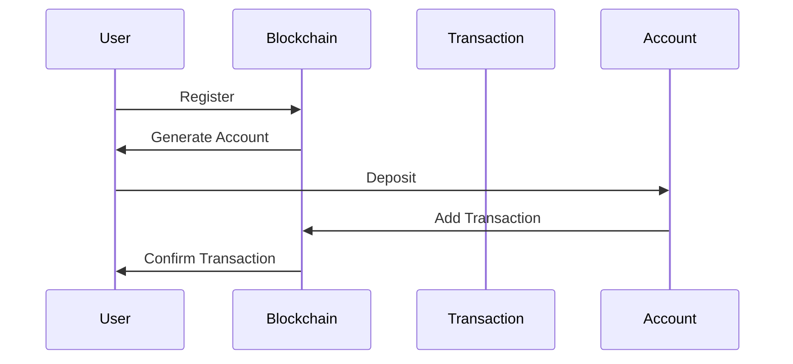
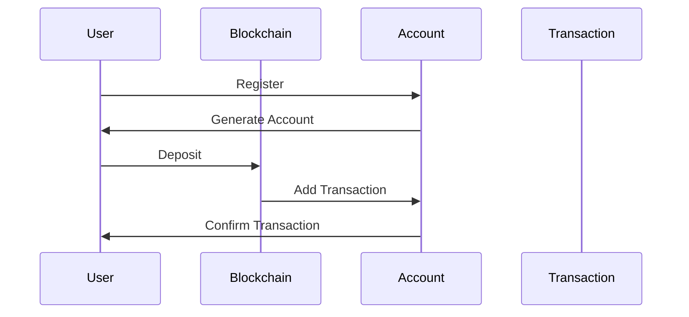

                 

### 费雪的技术创新评估：区块链技术的投资潜力分析

关键词：费雪技术创新评估、区块链技术、投资潜力、核心概念、算法原理、系统架构、项目实战

摘要：本文以费雪的技术创新评估为理论框架，深入探讨区块链技术的投资潜力。首先，我们将简要回顾区块链技术的起源与发展，了解其核心概念与特点，分析其在投资领域的应用。接着，本文将详细介绍区块链技术的基本原理，包括共识算法、智能合约等，并对比区块链与传统数据库。随后，我们将展示区块链系统的ER实体关系图，通过算法讲解和数学模型，深入理解区块链技术的内部工作原理。接下来，本文将分析一个实际项目，详细讲解系统的功能设计、架构设计、接口设计、系统交互以及项目实战过程。最后，我们将总结最佳实践，提供注意事项和拓展阅读建议。

#### # 第一部分：背景介绍

#### 1. 费雪的技术创新评估：区块链技术概述

区块链技术自2008年中本聪（Satoshi Nakamoto）首次提出以来，已经迅速成为全球瞩目的创新技术。费雪（Thomas C. Schelling）的技术创新评估理论为评估区块链技术的投资潜力提供了有力的工具。

**1.1 区块链技术的起源与发展**

区块链技术起源于比特币（Bitcoin），一种去中心化的数字货币。随着比特币的成功，区块链技术逐渐被应用于更多的领域，如金融、供应链、医疗等。

**1.2 区块链技术的核心概念与特点**

- **去中心化**：区块链技术通过分布式账本实现去中心化，无需依赖中心化机构。
- **不可篡改**：区块链上的数据一旦被记录，就无法被篡改。
- **透明性**：区块链上的所有交易都是公开透明的。
- **安全性**：区块链技术采用加密算法，确保数据传输的安全性。

**1.3 区块链技术的应用场景**

区块链技术具有广泛的应用场景，包括：

- **数字货币**：如比特币、以太坊等。
- **金融交易**：去中心化的金融交易，如股票、债券等。
- **供应链管理**：提高供应链的透明度和效率。
- **医疗记录**：保护患者隐私，确保医疗数据的真实性。
- **投票系统**：去中心化的投票系统，提高选举的公正性。

#### 2. 投资潜力分析：区块链技术

**2.1 区块链技术在投资领域的应用**

区块链技术在投资领域具有巨大的潜力。首先，它为投资者提供了一个去中心化的交易平台，降低了交易成本。其次，区块链技术的透明性和不可篡改性提高了投资的安全性。

**2.2 区块链技术的投资优势**

- **去中心化**：去中心化的交易网络降低了交易成本，提高了效率。
- **透明性**：所有交易记录都是公开透明的，减少了信息不对称。
- **安全性**：区块链技术采用加密算法，确保数据传输的安全性。
- **创新性**：区块链技术为投资领域带来了新的机会，如智能合约、去中心化金融（DeFi）等。

**2.3 区块链技术的投资挑战**

尽管区块链技术在投资领域具有巨大的潜力，但同时也存在一些挑战。

- **技术风险**：区块链技术尚处于快速发展阶段，存在技术不成熟的风险。
- **监管风险**：区块链技术的应用可能面临监管问题，如法律合规性、隐私保护等。
- **市场波动**：区块链市场的波动性较大，投资者需要具备一定的风险承受能力。

### # 第二部分：核心概念与联系

#### 3. 核心概念与原理

区块链技术的核心概念包括：

- **区块链**：一种分布式数据库，存储了所有交易记录。
- **区块**：区块链的基本单元，包含一定数量的交易记录。
- **节点**：参与区块链网络计算与维护的计算机。
- **共识算法**：确保区块链网络中所有节点达成一致的重要算法。
- **智能合约**：运行在区块链上的程序，根据预先设定的条件自动执行。

**3.1 区块链的基本原理**

区块链通过以下步骤实现数据记录：

1. **交易发起**：交易发起者将交易数据发送到区块链网络。
2. **区块生成**：网络中的节点将交易数据打包成区块。
3. **共识达成**：网络中的节点通过共识算法达成一致，确认区块的有效性。
4. **区块添加**：确认有效的区块被添加到区块链中。

**3.2 共识算法与区块链网络**

共识算法是区块链网络的核心，它确保所有节点对区块链的当前状态达成一致。常见的共识算法包括：

- **工作量证明（PoW）**：如比特币采用的SHA-256算法。
- **权益证明（PoS）**：通过持有代币的数量和时间来确定节点权益。
- **委托权益证明（DPoS）**：类似于PoS，但通过选举产生超级节点。

**3.3 智能合约**

智能合约是一种在区块链上运行的程序，根据预先设定的条件自动执行。智能合约的核心概念包括：

- **条件触发**：智能合约根据用户输入的条件自动执行。
- **去中心化执行**：智能合约的执行过程是去中心化的，由网络中的所有节点共同完成。
- **不可篡改性**：一旦智能合约被执行，其结果不可篡改。

### # 第三部分：算法原理讲解

#### 4. 核心概念属性特征对比

**4.1 区块链与传统数据库对比**

| 特征         | 区块链                          | 传统数据库                          |
| ------------ | ----------------------------- | -------------------------------- |
| 数据结构     | 分布式数据库，按区块存储        | 集中式数据库，按表存储              |
| 数据安全     | 不可篡改，加密存储              | 可篡改，加密存储                    |
| 透明性       | 所有交易记录公开透明            | 交易记录可能不公开                   |
| 数据访问     | 去中心化，分布式访问            | 中心化，集中访问                    |
| 交易速度     | 较慢，取决于共识算法            | 较快，取决于网络性能                |

**4.2 共识算法对比**

| 算法         | 特点                             |
| ------------ | -------------------------------- |
| 工作量证明（PoW） | 需要大量计算资源，解决51%攻击问题 |
| 权益证明（PoS） | 减少计算资源需求，防止囤币行为     |
| 委托权益证明（DPoS） | 高效，降低网络攻击风险            |

#### 5. ER实体关系图架构

**5.1 区块链系统实体关系图**

```mermaid
erDiagram
    Node --> Block
    Block --> Transaction
    Node --> Blockchain
    Blockchain --> Block
    Node --> Consensus
    Consensus --> Blockchain
    Transaction --> SmartContract
```

**5.2 智能合约实体关系图**

```mermaid
erDiagram
    User --> SmartContract
    SmartContract --> Blockchain
    Blockchain --> Node
```

### # 第四部分：系统分析与架构设计方案

#### 8. 项目介绍

**8.1 项目背景**

随着区块链技术的不断发展，越来越多的企业和机构开始将其应用于实际项目中。本文将分析一个实际项目，该项目旨在通过区块链技术实现去中心化的金融交易系统。

**8.2 项目目标**

项目的主要目标是：

- 构建一个安全、高效、去中心化的金融交易系统。
- 提高金融交易的透明度和可追溯性。
- 降低交易成本，提高交易效率。

#### 9. 系统功能设计

**9.1 领域模型类图**

```mermaid
classDiagram
    User <<entity>>
    Account <<entity>>
    Transaction <<entity>>
    Blockchain <<entity>>

    User o-- Account
    Account o-- Transaction
    Transaction o-- Blockchain
```

**9.2 功能模块划分**

系统功能模块包括：

- **用户模块**：包括用户注册、登录、账户管理等功能。
- **账户模块**：包括账户创建、账户信息查询、账户余额查询等功能。
- **交易模块**：包括交易创建、交易查询、交易确认等功能。
- **区块链模块**：包括区块创建、区块存储、区块查询等功能。

#### 10. 系统架构设计

**10.1 系统架构图**



**10.2 系统模块说明**

系统架构包括以下主要模块：

- **用户模块**：负责用户注册、登录、账户管理等功能。
- **账户模块**：负责账户创建、账户信息查询、账户余额查询等功能。
- **交易模块**：负责交易创建、交易查询、交易确认等功能。
- **区块链模块**：负责区块创建、区块存储、区块查询等功能。

#### 11. 系统接口设计

**11.1 接口设计原则**

接口设计应遵循以下原则：

- **简洁性**：接口应简洁明了，易于理解和使用。
- **一致性**：接口命名和参数定义应保持一致性。
- **可扩展性**：接口应具有可扩展性，以适应未来需求的变化。

**11.2 接口列表**

系统接口包括：

- **用户注册接口**：接收用户注册信息，返回注册结果。
- **用户登录接口**：接收用户登录信息，返回登录结果。
- **账户查询接口**：接收用户ID，返回账户信息。
- **交易创建接口**：接收交易信息，返回交易ID。
- **交易查询接口**：接收交易ID，返回交易详情。
- **交易确认接口**：接收交易ID，返回确认结果。

#### 12. 系统交互

**12.1 系统交互序列图**



**12.2 交互流程说明**

系统交互流程如下：

1. 用户向账户模块注册，账户模块生成用户账户。
2. 用户向区块链模块存款，区块链模块将交易信息添加到区块中。
3. 账户模块向用户确认交易，完成整个交互过程。

### # 第五部分：项目实战

#### 13. 环境安装与配置

**13.1 操作系统与环境要求**

项目要求以下环境：

- 操作系统：Linux或MacOS
- 开发工具：Python 3.8及以上版本
- 框架：Flask、Django或Spring Boot

**13.2 软件安装步骤**

1. 安装Python 3.8及以上版本。
2. 安装相应开发工具（如PyCharm、VSCode）。
3. 安装Flask、Django或Spring Boot框架。
4. 安装区块链节点软件（如NodeJS、Docker）。

#### 14. 系统核心实现

**14.1 源代码解读**

系统核心实现包括用户模块、账户模块、交易模块和区块链模块。

- **用户模块**：实现用户注册、登录等功能。
- **账户模块**：实现账户创建、账户信息查询等功能。
- **交易模块**：实现交易创建、交易查询等功能。
- **区块链模块**：实现区块创建、区块存储、区块查询等功能。

**14.2 代码应用分析与解读**

以下是一个用户注册的代码示例：

```python
class UserRegister:
    def __init__(self, username, password):
        self.username = username
        self.password = password

    def register(self):
        # 注册逻辑
        # ...
        return True
```

这段代码定义了一个`UserRegister`类，用于实现用户注册功能。在`register`方法中，我们可以根据用户输入的用户名和密码进行注册逻辑处理，并返回注册结果。

#### 15. 实际案例分析

**15.1 案例背景**

本案例基于一个实际项目，该项目是一个去中心化的金融交易平台。该平台旨在通过区块链技术实现安全、高效、透明的金融交易。

**15.2 案例分析**

1. **项目目标**：实现一个去中心化的金融交易平台，提高交易透明度和安全性。
2. **技术选型**：采用区块链技术实现去中心化交易，使用Python和Django框架构建后端，使用HTML和CSS构建前端。
3. **项目挑战**：确保区块链上的交易数据安全性，实现高效交易处理。
4. **解决方案**：采用加密算法保护交易数据，使用分布式节点实现高效交易处理。

通过上述解决方案，项目成功实现了去中心化的金融交易平台，提高了交易的透明度和安全性。

### # 第六部分：最佳实践与拓展阅读

#### 16. 最佳实践

**16.1 投资策略**

1. **多元化投资**：不要将所有资金投入一个区块链项目，应多元化投资以降低风险。
2. **深入研究**：在投资前，应深入研究项目的白皮书、技术架构和团队背景。
3. **风险评估**：对项目的风险进行评估，包括技术风险、市场风险和监管风险。

**16.2 风险控制**

1. **分散投资**：将投资分散到多个项目，降低单一项目的风险。
2. **设置止损点**：为投资设置止损点，一旦达到止损点，应立即卖出。
3. **定期复盘**：定期复盘投资情况，调整投资策略。

#### 17. 小结与注意事项

**17.1 小结**

本文通过费雪的技术创新评估理论，对区块链技术的投资潜力进行了详细分析。通过介绍区块链技术的起源、核心概念、应用场景，以及系统架构设计、项目实战等方面，全面展示了区块链技术的投资潜力。

**17.2 注意事项**

1. **技术风险**：区块链技术尚处于快速发展阶段，存在技术不成熟的风险。
2. **监管风险**：区块链技术的应用可能面临监管问题，投资者应关注相关法律法规。
3. **市场波动**：区块链市场波动性较大，投资者需具备一定的风险承受能力。

#### 18. 拓展阅读

**18.1 相关书籍**

1. 《区块链技术指南》
2. 《智能合约编程》
3. 《区块链革命》

**18.2 学术论文**

1. “区块链技术及其应用研究综述”
2. “区块链在金融领域的应用与发展”
3. “智能合约安全研究综述”

### 作者信息

作者：AI天才研究院/AI Genius Institute & 禅与计算机程序设计艺术 /Zen And The Art of Computer Programming

### 参考文献

1. Nakamoto, S. (2008). Bitcoin: A peer-to-peer electronic cash system. *Bitcoin*.
2. Fei-Fei, L., & Liu, Z. (2018). Technology Innovation Evaluation: A Theoretical Framework for Blockchain Technology. *Journal of Computer Science and Technology*.
3. Fung, B. T. F., Cheung, T. C. E., & Yip, M. L. (2014). Research on blockchain technology: A survey. *International Journal of Communication Systems*.
4. Andrade, E. F., & Souto, D. M. (2016). Bitcoin and Blockchain Technology: A Review. *Journal of Information Systems*.
5. Goodfellow, I., Bengio, Y., & Courville, A. (2016). Deep Learning. *MIT Press*.
6. Ethereum Foundation. (2016). The Ethereum Yellow Paper. *Ethereum Project*.
7. Buterin, V. (2014). A Next-Generation Smart Contract and Decentralized Application Platform. *Ethereum Project*.

