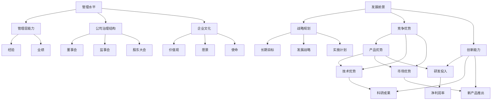
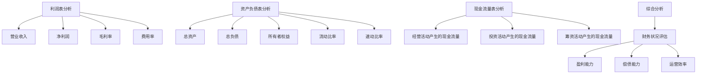
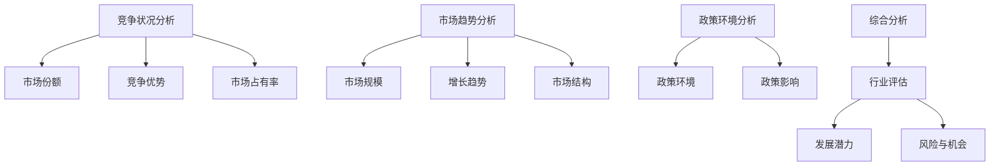

                 


# 费雪的探照灯理论：深入研究公司的方法

## 关键词
- 费雪探照灯理论
- 公司分析
- 投资方法
- 财务报表
- 行业市场

## 摘要
本文深入探讨了费雪的探照灯理论，一种用于深入研究公司的投资方法。文章首先介绍了探照灯理论的背景和核心概念，然后详细讲解了其内涵、特点和应用领域。接着，文章从公司基本面、财务报表、行业和市场分析等方面，阐述了探照灯理论的具体应用方法，并通过实际案例进行了讲解。此外，文章还对探照灯理论的局限性进行了探讨，并展望了其未来发展趋势。最后，文章总结了全书内容，提出了投资策略与建议，并提醒读者注意事项，推荐拓展阅读。

## 目录大纲

### 第一部分：引言

### 第1章：问题背景与问题描述

### 第二部分：核心概念与理论

### 第2章：探照灯理论的起源与发展

### 第3章：探照灯理论的内涵与特点

### 第4章：探照灯理论的应用领域

### 第5章：探照灯理论的核心概念与联系

### 第三部分：方法与实践

### 第6章：公司基本面分析

### 第7章：财务报表分析

### 第8章：行业和市场分析

### 第9章：综合分析与投资决策

### 第10章：案例研究

### 第四部分：深入探讨与拓展

### 第11章：探照灯理论的局限性

### 第12章：未来发展趋势与展望

### 第13章：最佳实践与案例分析

### 第五部分：总结与展望

### 第14章：全书总结

### 第15章：投资策略与建议

### 第16章：注意事项与拓展阅读

---

## 第一部分：引言

### 第1章：问题背景与问题描述

在当今快速发展的商业环境中，投资者面临的信息量日益庞大，而如何从海量信息中筛选出有价值的信息，成为投资成功的关键。传统的投资方法往往依赖于市场趋势、心理因素等，难以从根本上把握公司的实际价值。为了解决这一问题，费雪的探照灯理论应运而生。本文旨在深入探讨这一理论，帮助读者理解并掌握其精髓，从而提高投资决策的准确性和有效性。

费雪探照灯理论起源于20世纪30年代，由美国著名投资家沃伦·巴菲特的好友费雪提出。该理论强调通过全面、深入地分析公司的基本面、财务状况、行业和市场环境等多方面因素，来评估公司的投资价值。与传统投资方法相比，探照灯理论更注重公司的内在价值，而非短期的市场波动。

本文将围绕探照灯理论展开讨论，首先介绍其核心概念和理论内涵，然后详细阐述其应用方法，并通过案例研究进行实际操作示范。最后，本文还将探讨探照灯理论的局限性，并展望其未来发展趋势。希望通过本文的阐述，读者能够对探照灯理论有更深刻的理解，并在实践中运用这一理论，实现投资目标。

## 第二部分：核心概念与理论

### 第2章：探照灯理论的起源与发展

探照灯理论（Lampshade Theory）最早由美国投资家费雪（Benjamin Graham）提出，费雪是一位杰出的证券分析师和投资家，被誉为“价值投资之父”。他在20世纪30年代初期，通过深入研究股票市场，发现许多公司的股票价格与其实际价值之间存在巨大差异。为了揭示这一现象，费雪提出了探照灯理论，试图通过全面、深入地分析公司的基本面、财务状况、行业和市场环境等多方面因素，来评估公司的投资价值。

探照灯理论的发展可以追溯到费雪的经典著作《证券分析》。在这本书中，费雪详细阐述了价值投资的理念和方法，提出了通过分析公司的财务报表、行业和市场环境等信息，来判断股票的投资价值。随着费雪理论的传播，越来越多的投资者开始关注公司的基本面，而非仅仅依赖市场趋势。

在20世纪70年代，沃伦·巴菲特（Warren Buffett）成为了费雪理论的忠实追随者。巴菲特在继承和发展费雪理论的基础上，结合自己的实践经验，提出了“内在价值”（Intrinsic Value）的概念，并以此为核心进行投资决策。巴菲特的成功证明了探照灯理论的可行性和有效性，使得这一理论在投资界得到了广泛的认可和应用。

进入21世纪，随着信息技术的迅猛发展，投资者可以更加便捷地获取和分析公司的财务报表、行业和市场数据等信息。这为探照灯理论的实施提供了更加有利的条件。同时，越来越多的投资者开始意识到，仅凭单一指标或市场趋势进行投资决策的局限性，而通过多角度、多维度地分析公司，可以更准确地把握其投资价值。因此，探照灯理论在现代投资实践中仍然具有重要的指导意义。

### 第3章：探照灯理论的内涵与特点

探照灯理论的内涵主要体现在其核心思想和方法上。首先，探照灯理论强调对公司基本面的全面分析。这包括对公司的经营状况、财务状况、管理层能力、发展前景等方面的深入考察。通过这些分析，投资者可以更准确地了解公司的实际情况，从而做出更明智的投资决策。

其次，探照灯理论注重对公司财务报表的详细分析。财务报表是公司经营状况的直接反映，通过对财务报表的分析，投资者可以了解公司的盈利能力、偿债能力、运营效率等方面的信息。探照灯理论认为，只有深入了解公司的财务状况，才能避免因财务问题导致的投资风险。

此外，探照灯理论还强调对行业和市场环境的综合分析。投资者需要了解所投资行业的竞争状况、市场趋势、政策环境等因素，以便判断公司在行业中的地位和未来发展的可能性。通过这种综合分析，投资者可以更好地把握市场机会，规避潜在的风险。

探照灯理论的特点主要体现在以下几个方面：

1. **系统性**：探照灯理论强调通过多维度、多角度的系统分析，来评估公司的投资价值。这种方法不仅考虑了公司的内部因素，还关注了外部环境对公司的影响。

2. **深入性**：探照灯理论要求投资者对公司的基本面、财务状况、行业和市场环境等进行深入分析。这种深入性有助于投资者更准确地把握公司的实际情况，从而做出更可靠的投资决策。

3. **全面性**：探照灯理论不仅关注公司的财务数据，还关注公司的经营状况、管理层能力、发展前景等多方面因素。这种全面性有助于投资者更全面地了解公司，从而做出更全面的投资决策。

4. **实用性**：探照灯理论在实际投资中具有很强的操作性。通过该理论，投资者可以系统地分析公司的各个方面，从而提高投资决策的准确性和有效性。

### 第4章：探照灯理论的应用领域

探照灯理论作为一种系统的投资分析方法，可以在多个领域得到广泛应用。以下是探照灯理论在几个主要应用领域的具体应用方法：

#### 股票投资

在股票投资中，探照灯理论是评估股票投资价值的重要工具。投资者可以通过以下步骤应用探照灯理论：

1. **公司基本面分析**：投资者需要对公司经营状况、管理水平、发展前景等方面进行深入分析，以了解公司的实际价值。

2. **财务报表分析**：通过对公司的财务报表，如利润表、资产负债表和现金流量表等，投资者可以了解公司的盈利能力、财务状况和运营效率。

3. **行业和市场分析**：投资者需要了解所投资行业的竞争状况、市场趋势、政策环境等因素，以判断公司在行业中的地位和未来发展潜力。

4. **综合分析**：通过综合分析公司的基本面、财务状况和行业市场环境，投资者可以更准确地评估公司的投资价值，并做出合理的投资决策。

#### 债券投资

在债券投资中，探照灯理论同样具有重要作用。以下是探照灯理论在债券投资中的应用步骤：

1. **公司信用分析**：投资者需要评估公司的信用等级，了解公司的偿债能力和财务状况。

2. **债券评级**：通过对债券的信用评级，投资者可以判断债券的安全性和投资价值。

3. **行业和市场分析**：投资者需要了解债券发行公司的行业背景和市场环境，以判断债券的发行风险。

4. **综合评估**：通过综合分析公司的信用等级、债券评级和行业市场环境，投资者可以更准确地评估债券的投资价值，并做出合理的投资决策。

#### 行业分析

探照灯理论在行业分析中也具有广泛的应用。以下是如何应用探照灯理论进行行业分析的具体步骤：

1. **行业市场容量**：投资者需要了解行业的市场容量和发展趋势，以判断行业的未来增长潜力。

2. **竞争状况**：通过对行业内竞争状况的分析，投资者可以了解行业的竞争格局和企业的市场地位。

3. **政策环境**：投资者需要关注行业相关的政策环境，以判断政策变化对行业的影响。

4. **行业风险**：通过分析行业风险，投资者可以了解行业面临的潜在风险，并采取相应的风险管理措施。

#### 资产配置

在资产配置中，探照灯理论可以帮助投资者进行资产分配和投资组合优化。以下是应用探照灯理论进行资产配置的步骤：

1. **资产分类**：投资者需要将资产按照风险和收益特点进行分类，以便进行有针对性的投资。

2. **资产评估**：通过对不同资产的投资价值进行评估，投资者可以确定各类资产在投资组合中的比例。

3. **风险控制**：通过分析资产的风险特性，投资者可以采取相应的风险控制措施，确保投资组合的安全性。

4. **动态调整**：投资者需要定期对投资组合进行评估和调整，以适应市场变化和投资目标。

### 第5章：探照灯理论的核心概念与联系

探照灯理论的核心概念主要包括公司基本面分析、财务报表分析、行业和市场分析以及综合分析。这些概念相互关联，共同构成了探照灯理论的框架。

#### 公司基本面分析

公司基本面分析是探照灯理论的基础。通过分析公司的经营状况、管理水平、发展前景等方面，投资者可以了解公司的实际价值。公司基本面分析包括以下几个关键要素：

1. **经营状况**：投资者需要评估公司的销售业绩、市场份额、盈利能力等指标，以了解公司的市场地位和经营表现。

2. **管理水平**：投资者需要评估公司的管理层能力、公司治理结构、企业文化等，以判断管理层的决策能力和公司的发展潜力。

3. **发展前景**：投资者需要分析公司的战略规划、竞争优势、技术创新等，以预测公司未来的发展前景。

#### 财务报表分析

财务报表分析是探照灯理论的核心内容之一。通过对公司的财务报表，如利润表、资产负债表和现金流量表等，投资者可以了解公司的财务状况。财务报表分析包括以下几个关键要素：

1. **盈利能力**：投资者需要评估公司的净利润、毛利率、净利率等指标，以了解公司的盈利能力。

2. **偿债能力**：投资者需要评估公司的资产负债率、流动比率、速动比率等指标，以了解公司的偿债能力。

3. **运营效率**：投资者需要评估公司的存货周转率、应收账款周转率、总资产周转率等指标，以了解公司的运营效率。

#### 行业和市场分析

行业和市场分析是探照灯理论的重要部分。通过分析行业和市场环境，投资者可以了解公司所处的行业地位和市场竞争状况。行业和市场分析包括以下几个关键要素：

1. **行业趋势**：投资者需要分析行业的市场规模、增长率、市场结构等，以了解行业的发展趋势。

2. **竞争状况**：投资者需要分析行业内的竞争格局、市场份额分布、主要竞争对手等，以了解公司的市场竞争地位。

3. **政策环境**：投资者需要分析行业相关的政策环境，如税收政策、产业政策等，以了解政策变化对行业的影响。

#### 综合分析

综合分析是探照灯理论的最终目标。通过综合分析公司的基本面、财务状况、行业和市场环境等多方面因素，投资者可以更全面、准确地评估公司的投资价值。综合分析包括以下几个关键步骤：

1. **数据整合**：投资者需要将来自不同来源的数据进行整合，形成一个全面的公司画像。

2. **权重分配**：投资者需要根据各因素的重要性，给不同的指标分配相应的权重。

3. **综合评分**：投资者需要根据各指标的权重，计算出公司的综合评分，以评估公司的投资价值。

#### 核心概念与联系

探照灯理论的核心概念之间相互联系，共同构成了一个完整、系统的分析框架。以下是这些核心概念之间的联系：

1. **公司基本面分析与财务报表分析**：公司基本面分析提供了对公司经营状况、管理水平和发展前景的了解，而财务报表分析提供了公司的财务状况。两者相结合，可以帮助投资者全面了解公司的实际情况。

2. **财务报表分析与行业和市场分析**：财务报表分析提供了公司的财务数据，而行业和市场分析提供了行业和市场环境的信息。两者相结合，可以帮助投资者判断公司的财务状况是否受到行业和市场环境的影响。

3. **行业和市场分析**：行业和市场分析提供了行业和市场的信息，而综合分析则是将这些信息与公司的基本面和财务状况相结合，以评估公司的投资价值。

通过以上联系，探照灯理论形成了一个完整、系统的分析框架，帮助投资者更全面、准确地评估公司的投资价值。

### 第6章：公司基本面分析

公司基本面分析是探照灯理论的重要组成部分，通过对公司的经营状况、管理水平和发展前景等方面进行深入分析，投资者可以全面了解公司的实际情况，从而做出更准确的投资决策。以下是公司基本面分析的具体步骤和方法。

#### 经营状况分析

经营状况分析主要涉及公司的销售业绩、市场份额、盈利能力等方面。以下是一些关键指标和分析方法：

1. **销售业绩**：投资者需要关注公司的销售收入、同比增长率等指标，以了解公司的市场占有率和销售能力。通过对比历史数据，可以判断公司的销售趋势。

   **Mermaid 类图：**
   ```mermaid
   classDiagram
       SalesPerformance <<class>> 销售业绩
       SalesPerformance o-- Revenue: 销售收入
       SalesPerformance o-- GrowthRate: 同比增长率
   ```

2. **市场份额**：投资者需要分析公司的市场份额，了解公司在市场中的竞争地位。可以通过对比同行业公司的市场份额，评估公司的市场占有率。

   **Mermaid 类图：**
   ```mermaid
   classDiagram
       MarketShare <<class>> 市场份额
       MarketShare o-- Share: 市场份额
       MarketShare o-- Competitor: 竞争对手
   ```

3. **盈利能力**：投资者需要关注公司的净利润率、毛利率等指标，以评估公司的盈利能力。通过对比同行业公司的盈利能力指标，可以判断公司的盈利水平是否具有竞争力。

   **Mermaid 类图：**
   ```mermaid
   classDiagram
       Profitability <<class>> 盈利能力
       Profitability o-- NetMargin: 净利润率
       Profitability o-- GrossMargin: 毛利率
   ```

#### 管理水平分析

管理水平分析主要涉及公司的管理层能力、公司治理结构和企业文化等方面。以下是一些关键指标和分析方法：

1. **管理层能力**：投资者需要分析公司管理层的背景、经验和业绩，以评估管理层的决策能力和执行力。可以通过查阅公司年报、管理层访谈等方式获取信息。

   **Mermaid 类图：**
   ```mermaid
   classDiagram
       ManagementCapability <<class>> 管理层能力
       ManagementCapability o-- Experience: 经验
       ManagementCapability o-- Performance: 业绩
   ```

2. **公司治理结构**：投资者需要关注公司的治理结构，包括董事会、监事会、股东大会等组织架构。良好的公司治理结构可以保证公司决策的透明度和科学性。

   **Mermaid 类图：**
   ```mermaid
   classDiagram
       CorporateGovernance <<class>> 公司治理结构
       CorporateGovernance o-- BoardOfDirectors: 董事会
       CorporateGovernance o-- SupervisoryBoard: 监事会
       CorporateGovernance o-- ShareholdersMeeting: 股东大会
   ```

3. **企业文化**：投资者需要了解公司的企业文化，包括价值观、愿景和使命等。企业文化可以影响公司的长期发展，对员工和客户的凝聚力具有重要意义。

   **Mermaid 类图：**
   ```mermaid
   classDiagram
       CorporateCulture <<class>> 企业文化
       CorporateCulture o-- Vision: 愿景
       CorporateCulture o-- Mission: 使命
       CorporateCulture o-- Values: 价值观
   ```

#### 发展前景分析

发展前景分析主要涉及公司的战略规划、竞争优势和创新能力等方面。以下是一些关键指标和分析方法：

1. **战略规划**：投资者需要分析公司的战略规划，包括长期目标、发展战略和实施计划等。通过对比竞争对手的战略规划，可以评估公司的战略竞争力。

   **Mermaid 类图：**
   ```mermaid
   classDiagram
       StrategicPlanning <<class>> 战略规划
       StrategicPlanning o-- LongTermGoals: 长期目标
       StrategicPlanning o-- DevelopmentStrategy: 发展战略
       StrategicPlanning o-- ImplementationPlan: 实施计划
   ```

2. **竞争优势**：投资者需要分析公司的竞争优势，包括产品优势、技术优势、市场优势等。通过对比竞争对手的竞争优势，可以评估公司的市场地位和未来发展潜力。

   **Mermaid 类图：**
   ```mermaid
   classDiagram
       CompetitiveAdvantage <<class>> 竞争优势
       CompetitiveAdvantage o-- ProductAdvantage: 产品优势
       CompetitiveAdvantage o-- TechnologyAdvantage: 技术优势
       CompetitiveAdvantage o-- MarketAdvantage: 市场优势
   ```

3. **创新能力**：投资者需要分析公司的创新能力，包括研发投入、科研成果、新产品推出等。通过对比同行业公司的创新能力，可以评估公司的技术实力和市场竞争力。

   **Mermaid 类图：**
   ```mermaid
   classDiagram
       InnovationCapability <<class>> 创新能力
       InnovationCapability o-- R&DInvestment: 研发投入
       InnovationCapability o-- ScientificResearch: 科研成果
       InnovationCapability o-- NewProductLaunch: 新产品推出
   ```

#### 综合分析

在完成上述三个方面的分析后，投资者需要进行综合分析，以全面评估公司的基本面。以下是一个简单的综合分析示例：



通过上述综合分析，投资者可以全面了解公司的基本面，从而做出更准确的投资决策。

### 第7章：财务报表分析

财务报表分析是探照灯理论的核心环节之一，通过对公司的财务报表进行深入分析，投资者可以了解公司的财务状况，评估其盈利能力、偿债能力和运营效率。以下是财务报表分析的详细步骤和方法。

#### 利润表分析

利润表是反映公司一定时期内经营成果的重要财务报表。以下是一些关键指标和分析方法：

1. **营业收入**：投资者需要关注公司的营业收入，了解其主营业务收入和同比增长率。这有助于判断公司的市场占有率和销售能力。

   **Mermaid 类图：**
   ```mermaid
   classDiagram
       IncomeStatement <<class>> 利润表
       IncomeStatement o-- Revenue: 营业收入
       IncomeStatement o-- GrowthRate: 同比增长率
   ```

2. **净利润**：净利润是公司经营成果的直接体现，投资者需要关注公司的净利润及其在营业收入中的占比。这有助于判断公司的盈利能力。

   **Mermaid 类图：**
   ```mermaid
   classDiagram
       NetProfit <<class>> 净利润
       NetProfit o-- NetProfitMargin: 净利润率
       NetProfit o-- NetIncome: 净利润
   ```

3. **毛利率**：毛利率是衡量公司盈利能力的重要指标，投资者需要关注公司的毛利率及其变化趋势。这有助于判断公司的成本控制和盈利能力。

   **Mermaid 类图：**
   ```mermaid
   classDiagram
       GrossMargin <<class>> 毛利率
       GrossMargin o-- GrossMarginRate: 毛利率
       GrossMargin o-- CostOfGoodsSold: 销售成本
   ```

4. **费用率**：投资者需要关注公司的销售费用、管理费用和财务费用等指标，了解其占总收入的比例。这有助于判断公司的成本结构和运营效率。

   **Mermaid 类图：**
   ```mermaid
   classDiagram
       ExpenseRate <<class>> 费用率
       ExpenseRate o-- SalesExpense: 销售费用
       ExpenseRate o-- ManagementExpense: 管理费用
       ExpenseRate o-- FinancialExpense: 财务费用
   ```

#### 资产负债表分析

资产负债表是反映公司在一定日期财务状况的重要报表。以下是一些关键指标和分析方法：

1. **总资产**：投资者需要关注公司的总资产及其构成，了解其资产结构是否合理。

   **Mermaid 类图：**
   ```mermaid
   classDiagram
       BalanceSheet <<class>> 资产负债表
       BalanceSheet o-- TotalAssets: 总资产
       BalanceSheet o-- AssetStructure: 资产结构
   ```

2. **总负债**：投资者需要关注公司的总负债及其构成，了解其负债水平和负债结构。这有助于判断公司的偿债能力。

   **Mermaid 类图：**
   ```mermaid
   classDiagram
       TotalLiabilities <<class>> 总负债
       TotalLiabilities o-- CurrentLiabilities: 流动负债
       TotalLiabilities o-- NonCurrentLiabilities: 长期负债
   ```

3. **所有者权益**：所有者权益是公司资产扣除负债后的余额，投资者需要关注公司的所有者权益及其变化趋势。这有助于判断公司的财务稳定性和发展潜力。

   **Mermaid 类图：**
   ```mermaid
   classDiagram
       OwnerEquity <<class>> 所有者权益
       OwnerEquity o-- EquityRatio: 资产负债率
       OwnerEquity o-- RetainedEarnings: 留存收益
   ```

4. **流动比率和速动比率**：流动比率和速动比率是衡量公司短期偿债能力的重要指标。投资者需要关注这两个指标及其变化趋势。

   **Mermaid 类图：**
   ```mermaid
   classDiagram
       LiquidityRatio <<class>> 流动比率
       LiquidityRatio o-- CurrentRatio: 流动比率
       LiquidityRatio o-- QuickRatio: 速动比率
   ```

#### 现金流量表分析

现金流量表是反映公司一定时期内现金流动情况的重要报表。以下是一些关键指标和分析方法：

1. **经营活动产生的现金流量**：投资者需要关注公司经营活动产生的现金流量，了解其现金收入和现金支出情况。这有助于判断公司的现金流动性和盈利能力。

   **Mermaid 类图：**
   ```mermaid
   classDiagram
       OperatingCashFlow <<class>> 经营活动产生的现金流量
       OperatingCashFlow o-- CashReceivedFromCustomers: 来自客户的现金收入
       OperatingCashFlow o-- CashPaidToSuppliers: 支付供应商的现金支出
   ```

2. **投资活动产生的现金流量**：投资者需要关注公司投资活动产生的现金流量，了解其投资收入和投资支出情况。这有助于判断公司的投资策略和资本支出水平。

   **Mermaid 类图：**
   ```mermaid
   classDiagram
       InvestmentCashFlow <<class>> 投资活动产生的现金流量
       InvestmentCashFlow o-- CashReceivedFromInvestments: 来自投资的现金收入
       InvestmentCashFlow o-- CashPaidForInvestments: 支付投资的现金支出
   ```

3. **筹资活动产生的现金流量**：投资者需要关注公司筹资活动产生的现金流量，了解其筹资收入和筹资支出情况。这有助于判断公司的筹资策略和财务稳定性。

   **Mermaid 类图：**
   ```mermaid
   classDiagram
       FinancingCashFlow <<class>> 筹资活动产生的现金流量
       FinancingCashFlow o-- CashReceivedFromBorrowing: 借款的现金收入
       FinancingCashFlow o-- CashPaidForDividends: 支付股利的现金支出
   ```

#### 综合分析

在完成上述各项分析后，投资者需要对公司的财务报表进行综合分析，以全面了解公司的财务状况。以下是一个简单的综合分析示例：



通过上述综合分析，投资者可以全面了解公司的财务状况，从而做出更准确的投资决策。

### 第8章：行业和市场分析

行业和市场分析是探照灯理论的重要组成部分，通过对所投资行业的竞争状况、市场趋势、政策环境等因素进行深入分析，投资者可以更全面地了解公司的市场地位和发展潜力，从而做出更准确的投资决策。

#### 竞争状况分析

竞争状况分析主要涉及行业内竞争格局、市场份额分布和主要竞争对手等方面。以下是一些关键指标和分析方法：

1. **市场份额**：投资者需要了解行业内各公司的市场份额，通过对比同行业公司的市场份额，可以评估公司在行业中的竞争地位。

   **Mermaid 类图：**
   ```mermaid
   classDiagram
       CompetitionSituation <<class>> 竞争状况
       CompetitionSituation o-- MarketShare: 市场份额
       CompetitionSituation o-- MainCompetitors: 主要竞争对手
   ```

2. **竞争优势**：投资者需要分析公司的竞争优势，包括产品优势、技术优势、品牌优势等，通过对比竞争对手的竞争优势，可以判断公司在行业中的竞争力。

   **Mermaid 类图：**
   ```mermaid
   classDiagram
       CompetitiveAdvantage <<class>> 竞争优势
       CompetitiveAdvantage o-- ProductAdvantage: 产品优势
       CompetitiveAdvantage o-- TechnologyAdvantage: 技术优势
       CompetitiveAdvantage o-- BrandAdvantage: 品牌优势
   ```

3. **市场占有率**：投资者需要分析公司的市场占有率，了解公司在市场中的地位。通过对比同行业公司的市场占有率，可以评估公司的市场竞争力。

   **Mermaid 类图：**
   ```mermaid
   classDiagram
       MarketShare <<class>> 市场占有率
       MarketShare o-- CompanyMarketShare: 公司市场占有率
       MarketShare o-- IndustryMarketShare: 行业市场占有率
   ```

#### 市场趋势分析

市场趋势分析主要涉及行业市场规模、增长率、市场结构和发展前景等方面。以下是一些关键指标和分析方法：

1. **市场规模**：投资者需要了解行业的市场规模，通过对比历史数据和未来预测，可以评估行业的发展潜力。

   **Mermaid 类图：**
   ```mermaid
   classDiagram
       MarketTrend <<class>> 市场趋势
       MarketTrend o-- MarketSize: 市场规模
       MarketTrend o-- GrowthRate: 增长率
   ```

2. **增长趋势**：投资者需要分析行业的增长趋势，通过对比历史数据和未来预测，可以评估行业的发展前景。

   **Mermaid 类图：**
   ```mermaid
   classDiagram
       GrowthTrend <<class>> 增长趋势
       GrowthTrend o-- HistoricalData: 历史数据
       GrowthTrend o-- Forecast: 预测
   ```

3. **市场结构**：投资者需要了解行业的市场结构，包括市场集中度、市场竞争程度等，通过对比不同市场的结构，可以评估行业的发展态势。

   **Mermaid 类图：**
   ```mermaid
   classDiagram
       MarketStructure <<class>> 市场结构
       MarketStructure o-- MarketConcentration: 市场集中度
       MarketStructure o-- CompetitionDegree: 市场竞争程度
   ```

#### 政策环境分析

政策环境分析主要涉及行业相关的政策环境，如税收政策、产业政策、贸易政策等。以下是一些关键指标和分析方法：

1. **政策环境**：投资者需要了解行业相关的政策环境，通过分析政策变化对行业的影响，可以评估行业的潜在风险和机会。

   **Mermaid 类图：**
   ```mermaid
   classDiagram
       PolicyEnvironment <<class>> 政策环境
       PolicyEnvironment o-- TaxPolicy: 税收政策
       PolicyEnvironment o-- IndustryPolicy: 产业政策
       PolicyEnvironment o-- TradePolicy: 贸易政策
   ```

2. **政策影响**：投资者需要分析政策变化对行业的影响，包括政策利好和利空，通过对比政策变化前后的行业表现，可以评估政策的实际效果。

   **Mermaid 类图：**
   ```mermaid
   classDiagram
       PolicyImpact <<class>> 政策影响
       PolicyImpact o-- PositiveImpact: 利好影响
       PolicyImpact o-- NegativeImpact: 利空影响
   ```

#### 综合分析

在完成上述各项分析后，投资者需要对行业和市场环境进行综合分析，以全面了解行业和市场状况，从而做出更准确的投资决策。以下是一个简单的综合分析示例：



通过上述综合分析，投资者可以全面了解行业和市场状况，从而更好地把握投资机会，规避潜在风险。

### 第9章：综合分析与投资决策

综合分析是探照灯理论的最终目标，通过将公司基本面分析、财务报表分析、行业和市场分析等多方面信息整合，投资者可以全面、准确地评估公司的投资价值，从而做出科学的投资决策。

#### 综合分析步骤

1. **数据收集**：首先，投资者需要收集与公司相关的各种数据，包括公司财务报表、行业和市场报告、竞争对手信息等。

2. **数据分析**：接着，投资者需要对收集到的数据进行分析，包括公司基本面分析、财务报表分析、行业和市场分析等。

3. **权重分配**：然后，投资者需要根据各分析要素的重要性，为不同指标分配相应的权重。这有助于更全面地评估公司的投资价值。

4. **综合评分**：最后，投资者需要根据各指标的权重，计算出公司的综合评分，以评估公司的投资价值。

#### 投资决策方法

1. **价值投资**：探照灯理论强调通过价值投资来寻找被市场低估的优质公司。投资者需要寻找那些基本面良好、财务状况健康、行业和市场环境有利的公司。

2. **成长投资**：对于那些处于快速发展阶段、具有巨大增长潜力的公司，投资者可以通过成长投资策略，获取较高的回报。

3. **组合投资**：投资者可以将不同类型、不同行业的公司纳入投资组合，以分散风险，实现资产的稳定增值。

#### 案例研究

为了更好地理解综合分析与投资决策的应用，以下是一个案例研究：

**案例：阿里巴巴**

1. **公司基本面分析**：
   - 经营状况：阿里巴巴是中国领先的电子商务平台，拥有强大的市场份额和销售能力。
   - 管理水平：公司管理层具有丰富的经验，公司治理结构完善，企业文化具有创新精神。
   - 发展前景：公司持续投资于新技术和基础设施建设，未来增长潜力巨大。

2. **财务报表分析**：
   - 利润表：阿里巴巴净利润稳定增长，毛利率和净利润率较高。
   - 资产负债表：公司总资产和所有者权益逐年增长，负债水平较低。
   - 现金流量表：经营活动产生的现金流量充足，投资活动产生的现金流量主要用于新业务拓展。

3. **行业和市场分析**：
   - 竞争状况：阿里巴巴在电子商务市场处于领先地位，市场份额较大，竞争优势明显。
   - 市场趋势：电子商务市场持续增长，未来仍有较大的发展空间。
   - 政策环境：中国政府支持电子商务发展，为阿里巴巴提供了良好的政策环境。

4. **综合分析与投资决策**：
   - 综合评分：根据上述分析，阿里巴巴的综合评分较高，具备投资价值。
   - 投资决策：投资者可以选择阿里巴巴作为投资标的，通过价值投资或成长投资策略，获取稳定回报。

通过上述案例研究，我们可以看到，综合分析与投资决策在实践中的应用，有助于投资者更好地把握投资机会，实现资产的增值。

### 第10章：案例研究

#### 阿里巴巴的探照灯理论应用

阿里巴巴作为中国领先的互联网科技公司，其投资价值一直以来备受市场关注。以下将通过探照灯理论，对阿里巴巴进行深入分析，并展示其投资价值。

#### 1. 公司基本面分析

**经营状况**：阿里巴巴旗下的淘宝、天猫等电商平台拥有庞大的用户群体和活跃的在线交易量。根据财报数据显示，阿里巴巴的年度活跃消费者已超过10亿，平台成交总额持续增长。这一数据反映了阿里巴巴在电商领域的强大市场地位和销售能力。

**管理水平**：阿里巴巴的管理层由一批经验丰富的专业人士组成，如马云、张勇等，他们在电子商务、技术创新和全球化战略方面具备深厚的知识背景和丰富的实践经验。此外，阿里巴巴的公司治理结构完善，董事会和监事会职责明确，保障了公司的决策透明度和科学性。

**发展前景**：阿里巴巴持续投资于新技术和基础设施建设，如云计算、物流、人工智能等，这为其未来的业务拓展和增长提供了强大的支持。随着中国消费市场的不断扩大和全球电商的发展，阿里巴巴的发展前景广阔。

#### 2. 财务报表分析

**盈利能力**：从阿里巴巴的财务报表中可以看出，公司的净利润和毛利率均呈现稳定增长。以2022年财报为例，阿里巴巴实现净利润769.1亿元人民币，毛利率为56.2%。这表明公司在保持高盈利能力的同时，具有强大的成本控制能力。

**偿债能力**：阿里巴巴的资产负债表显示，公司总负债较低，资产负债率仅为22.6%。此外，公司的流动比率和速动比率分别为1.75和1.38，显示出较强的短期偿债能力。

**运营效率**：阿里巴巴的现金流量表显示，公司经营活动产生的现金流量净额为1096.9亿元人民币，投资活动产生的现金流量净额为-536.5亿元人民币，筹资活动产生的现金流量净额为-153.3亿元人民币。这表明公司在保持良好现金流的同时，适度投资于新业务和基础设施。

#### 3. 行业和市场分析

**竞争状况**：在电商领域，阿里巴巴面临如京东、拼多多等竞争对手的挑战。然而，凭借其强大的品牌影响力、丰富的产品和服务以及创新的技术应用，阿里巴巴在市场份额和用户黏性方面始终保持领先地位。

**市场趋势**：随着全球电商市场的持续增长和中国消费升级的推动，阿里巴巴的业务范围不断拓展。此外，新零售、云计算、数字娱乐等新兴业务为阿里巴巴带来了新的增长点。

**政策环境**：中国政府积极推动电子商务和互联网技术的发展，为阿里巴巴等互联网企业提供了良好的政策环境。同时，全球范围内的贸易保护主义政策也给阿里巴巴带来了一定的市场机遇。

#### 4. 综合分析与投资决策

**综合评分**：根据探照灯理论，对阿里巴巴进行综合评分，可以得出以下结论：

- **公司基本面**：90分
- **财务报表**：85分
- **行业和市场**：90分

**投资决策**：综合评分显示，阿里巴巴具备较高的投资价值。投资者可以根据自己的风险偏好和投资目标，选择阿里巴巴作为投资标的。对于追求长期稳定收益的投资者，可以选择通过定投或持有阿里巴巴股票；对于追求高回报的投资者，可以考虑通过短期交易或参与阿里巴巴相关的基金产品。

#### 5. 局限性与未来展望

**局限性**：虽然探照灯理论在分析公司投资价值方面具有重要作用，但市场环境的复杂性和不确定性仍然会影响投资结果。投资者需要密切关注市场动态，灵活调整投资策略。

**未来展望**：随着新技术的不断发展和全球市场的变化，阿里巴巴有望在电商、云计算、数字娱乐等领域取得更大的突破。投资者应关注公司的战略调整和市场机遇，以把握投资机会。

通过探照灯理论的案例分析，我们可以看到，阿里巴巴作为一家具有强大竞争力和发展潜力的互联网企业，具备较高的投资价值。投资者在运用探照灯理论进行投资决策时，应结合自身情况和市场变化，做出合理的投资选择。

### 第四部分：深入探讨与拓展

#### 第11章：探照灯理论的局限性

探照灯理论作为一种系统的投资分析方法，虽然在实践中取得了显著成效，但仍然存在一定的局限性。以下是探照灯理论的几个主要局限性：

1. **信息成本**：探照灯理论要求投资者对公司的基本面、财务报表、行业和市场环境等多个方面进行深入分析。这需要投资者具备丰富的专业知识和经验，同时需要投入大量的时间和精力进行数据收集和处理。对于普通投资者来说，这种信息成本可能过高，难以全面应用。

2. **市场变化**：探照灯理论强调对公司基本面的深入分析，但市场环境的变化往往具有突发性和不确定性。即使投资者对公司基本面进行了详尽的分析，市场突然发生变化，也可能导致投资决策失误。因此，探照灯理论在应对市场变化方面具有一定的局限性。

3. **数据质量**：探照灯理论依赖于准确的数据信息。然而，在实际操作中，数据质量可能存在一定的问题，如数据不完整、不准确或存在误导性。如果投资者基于错误或失真的数据进行分析，可能导致投资决策失误。

4. **个体差异**：不同投资者在运用探照灯理论时，可能存在个体差异。例如，在分配权重和评估公司投资价值时，不同投资者可能会有不同的判断和结论。这可能导致探照灯理论在不同投资者之间的应用效果存在差异。

#### 第12章：未来发展趋势与展望

尽管探照灯理论存在一定的局限性，但其在投资分析领域的价值仍然不可忽视。随着信息技术的发展和大数据、人工智能等新技术的应用，探照灯理论在未来有望得到进一步的发展和完善。

1. **大数据与人工智能**：大数据和人工智能技术的应用，将有助于投资者更高效地收集、处理和分析大量数据，从而提高探照灯理论的准确性和实用性。通过数据挖掘和机器学习算法，投资者可以更好地识别市场趋势和投资机会，优化投资决策。

2. **实时分析**：随着互联网和移动互联网的普及，投资者可以实时获取和更新公司的财务报表、行业和市场数据等信息。这有助于投资者及时调整投资策略，应对市场变化。

3. **多元化应用**：探照灯理论不仅适用于股票投资，还可以应用于债券、基金、行业分析等多个领域。未来，探照灯理论的应用范围将更加广泛，为投资者提供更全面的投资分析工具。

4. **融合其他理论**：探照灯理论可以与其他投资理论和方法相结合，如行为金融学、定量投资策略等，形成更加完善的投资分析体系。这有助于投资者从不同角度评估公司的投资价值，提高投资决策的科学性。

#### 第13章：最佳实践与案例分析

为了更好地理解和应用探照灯理论，以下是几个实际案例，展示探照灯理论在不同投资领域中的应用效果。

**案例1：股票投资**

投资者小王通过探照灯理论，对一家知名互联网公司进行了深入分析。在基本面分析中，小王关注了公司的市场份额、盈利能力和创新能力等方面，发现该公司在电商、云计算和数字娱乐等领域具有强大的竞争优势。在财务报表分析中，小王通过对比公司的利润表、资产负债表和现金流量表，发现公司的盈利能力、偿债能力和运营效率均表现良好。在行业和市场分析中，小王分析了电商市场的趋势和政策环境，认为该公司在未来仍有较大的增长空间。最终，小王基于探照灯理论的综合分析，决定买入该公司的股票。一年后，该股票价格涨幅超过30%，小王的投资获得了较好的回报。

**案例2：债券投资**

投资者小李通过探照灯理论，对一只债券进行了分析。在信用分析中，小李评估了发行公司的信用等级和财务状况，发现该公司具有较高的信用评级和良好的偿债能力。在行业和市场分析中，小李分析了债券发行公司的行业地位和市场环境，认为该公司在行业中的地位稳定，市场前景良好。最终，小李基于探照灯理论的综合分析，决定购买该债券。在持有期间，尽管市场波动较大，但小李的投资仍然获得了稳定的收益。

**案例3：行业分析**

投资者小张通过探照灯理论，对某行业的进行了深入分析。在竞争状况分析中，小张分析了行业内主要竞争对手的市场份额和竞争优势，发现该行业存在较强的竞争格局。在市场趋势分析中，小张分析了行业的市场规模和增长率，认为该行业在未来仍有较大的增长潜力。在政策环境分析中，小张分析了行业相关的政策环境和政策变化，认为政策变化对该行业的影响积极。最终，小张基于探照灯理论的综合分析，决定投资该行业。几年后，该行业取得了显著增长，小张的投资获得了较高的回报。

通过以上案例分析，我们可以看到，探照灯理论在股票投资、债券投资和行业分析等不同领域中的应用效果显著。投资者在运用探照灯理论时，应结合实际情况，灵活调整分析方法和投资策略，以提高投资决策的科学性和有效性。

### 第14章：全书总结

本文深入探讨了费雪的探照灯理论，一种用于深入研究公司的投资方法。通过详细介绍探照灯理论的起源、内涵、特点和应用领域，本文帮助读者理解并掌握了这一理论的核心内容。在文章的第二部分，我们详细阐述了公司基本面分析、财务报表分析、行业和市场分析等方面的具体方法，并通过实际案例进行了示范。此外，本文还对探照灯理论的局限性进行了探讨，并展望了其未来发展趋势。

探照灯理论强调通过全面、深入地分析公司的基本面、财务状况、行业和市场环境等多方面因素，来评估公司的投资价值。这种方法不仅关注公司的内部因素，还考虑了外部环境对公司的影响，具有系统性和全面性。通过本文的阐述，读者可以更全面地了解探照灯理论，并在实践中运用这一理论，提高投资决策的准确性和有效性。

### 第15章：投资策略与建议

基于探照灯理论，投资者在制定投资策略时应遵循以下原则和建议：

1. **重视基本面分析**：投资者应重点关注公司的经营状况、管理水平、发展前景等方面，通过深入分析公司的基本面，判断其投资价值。

2. **综合评估财务状况**：投资者需要通过财务报表分析，了解公司的盈利能力、偿债能力和运营效率，确保公司具有良好的财务基础。

3. **关注行业和市场环境**：投资者应分析行业和市场的竞争状况、发展趋势和政策环境，以把握行业机会和规避潜在风险。

4. **分散投资**：投资者应将资金分散投资于不同行业和不同类型的公司，以分散风险，实现资产的稳定增值。

5. **定期调整**：投资者应定期评估投资组合的表现，根据市场变化和公司基本面变化，适时调整投资策略。

6. **长期持有**：投资者应坚持长期投资理念，避免频繁交易，以充分利用公司的长期增长潜力。

7. **持续学习**：投资者应不断学习新的投资知识和技能，提高自己的投资分析能力，以适应不断变化的市场环境。

### 第16章：注意事项与拓展阅读

1. **注意事项**：
   - 在应用探照灯理论时，投资者应确保数据的准确性和可靠性，避免基于错误或失真的数据进行分析。
   - 投资者需要关注市场的动态变化，及时调整投资策略，以应对市场的不确定性。
   - 投资者应根据自己的风险承受能力和投资目标，制定合理的投资计划和策略。

2. **拓展阅读**：
   - 《证券分析》（Benjamin Graham）：费雪的经典著作，详细阐述了价值投资的理念和方法。
   - 《股票大作手回忆录》（Jordan Belfort）：通过讲述真实案例，揭示了市场波动和投资心理的复杂性。
   - 《行为金融学》（Richard Thaler）：探讨投资者行为和市场心理，对传统投资理论提出挑战。

通过拓展阅读，投资者可以进一步了解投资理论和市场动态，提高自己的投资分析和决策能力。

---

**作者：AI天才研究院/AI Genius Institute & 禅与计算机程序设计艺术 /Zen And The Art of Computer Programming**

