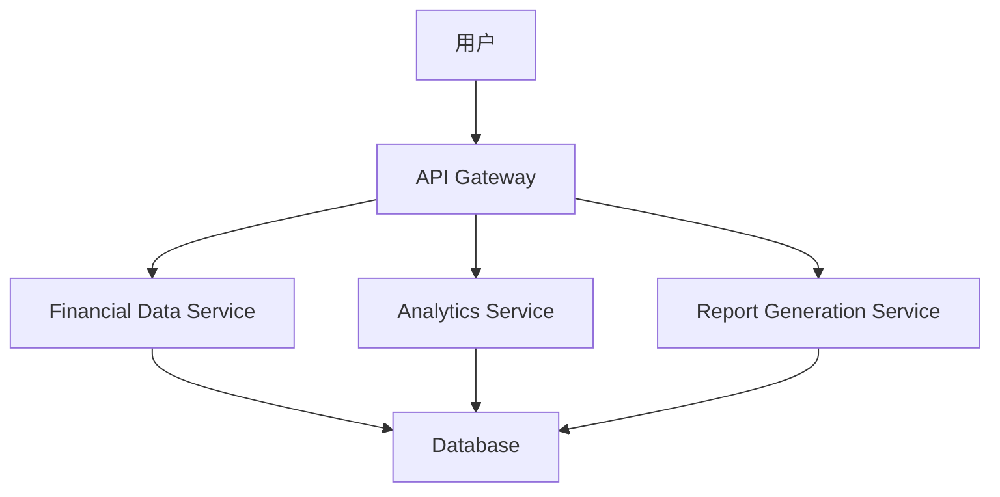
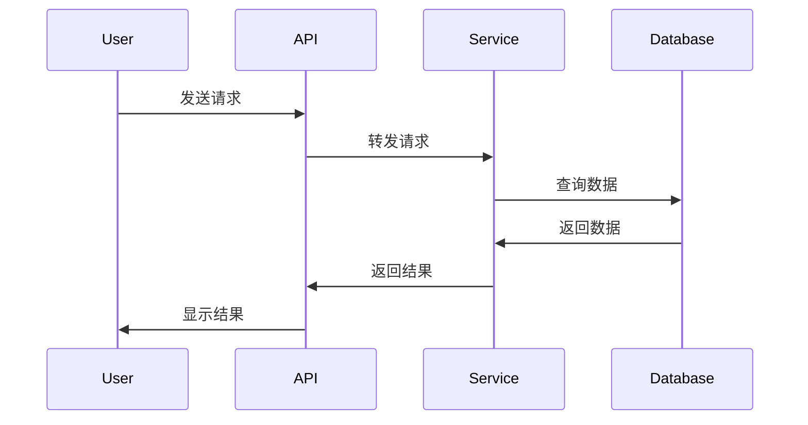

                 

### 费雪的未来增长潜力评估：看透当前财务数据

#### 关键词：
- 费雪理论
- 未来增长潜力
- 财务数据分析
- 投资评估

#### 摘要：
本文深入探讨费雪的未来增长潜力评估方法，通过分析财务数据，帮助投资者识别具有长期增长潜力的企业。文章分为引言与背景介绍、核心概念与原理、财务数据分析方法与工具、未来增长潜力评估模型构建、案例分析以及总结与展望六个部分，详细解释了费雪理论的应用，提供了实用的分析和评估技巧。

----------------------------------------------------------------

### 引言与背景介绍

#### 费雪理论的发展历程与重要性

费雪理论，由著名投资大师本杰明·格雷厄姆的弟子戴维·费雪提出，是投资领域的重要理论之一。费雪认为，股票的价值取决于其未来现金流的折现，这一观点在投资分析中具有重要的指导意义。费雪理论强调，投资者不应只关注公司的当前财务表现，而是要深入分析其未来的增长潜力。

#### 未来增长潜力评估的背景与意义

在当前经济环境下，市场波动加剧，企业竞争激烈，投资者需要更加精准地评估企业的未来增长潜力。传统的财务分析往往侧重于历史数据的回顾，而费雪理论则更注重对未来的预测。通过科学的方法，投资者可以更好地把握市场机会，降低投资风险。

#### 读者对象与学习目标

本文的目标读者是希望深入了解费雪理论的投资者、财务分析师以及相关专业人士。通过本文的学习，读者将能够：

1. 理解费雪理论的基本概念与原理。
2. 掌握财务数据分析的方法与工具。
3. 学会构建和评估企业的未来增长潜力模型。
4. 通过案例分析，提高实际应用能力。

----------------------------------------------------------------

### 财务数据分析基础

#### 财务报表的基本结构

财务报表是企业财务状况的集中体现，主要包括资产负债表、利润表和现金流量表。资产负债表反映了企业的资产、负债和股东权益状况；利润表展示了企业的收入、成本和利润情况；现金流量表则揭示了企业的现金流入和流出情况。

#### 财务指标的类型与计算方法

财务指标是评估企业财务状况的重要工具，主要包括盈利能力指标、偿债能力指标、运营能力指标等。常见的财务指标包括：

- **盈利能力指标**：净利润率、毛利率、资产收益率等。
- **偿债能力指标**：流动比率、速动比率、利息保障倍数等。
- **运营能力指标**：存货周转率、应收账款周转率、总资产周转率等。

计算这些指标需要使用财务报表中的数据，通过特定的公式进行计算。

#### 财务指标的分析与应用

财务指标的分析可以帮助投资者了解企业的财务健康状况和经营效率。例如，净利润率越高，说明企业的盈利能力越强；流动比率和速动比率越高，说明企业的偿债能力越强；存货周转率越高，说明企业的存货管理效率越高。

通过财务指标的分析，投资者可以初步判断企业的财务状况，为进一步的投资决策提供依据。

----------------------------------------------------------------

### 费雪理论的核心概念与原理

#### 费雪理论的基本原理

费雪理论认为，股票的价值是其未来现金流的折现值。这意味着，投资者应该关注企业的未来盈利能力，而不是短期的财务数据。通过预测企业的未来现金流，并使用适当的折现率将其折现为当前的价值，投资者可以估算出股票的内在价值。

#### 费雪理论的核心概念

1. **现金流**：企业的现金流是其未来可获得的现金流入和流出的总和。
2. **折现率**：折现率反映了投资者对风险和时间价值的考量，通常由无风险利率和风险溢价组成。
3. **未来现金流预测**：预测企业未来的现金流是费雪理论的关键步骤，这需要综合考虑企业的盈利能力、成长性、市场竞争等因素。

#### 费雪理论在投资中的应用

费雪理论在投资中的应用主要体现在两个方面：

1. **股票估值**：通过预测企业的未来现金流，投资者可以估算出股票的内在价值，与市场价值进行比较，从而判断股票的买入或卖出时机。
2. **投资决策**：费雪理论强调，投资者不应只关注短期的市场波动，而是要寻找那些具有长期增长潜力的企业，进行长期投资。

通过费雪理论，投资者可以更科学地评估企业的投资价值，提高投资决策的准确性。

----------------------------------------------------------------

### 财务数据分析方法与工具

#### 财务比率分析

财务比率分析是财务数据分析的重要方法之一。它通过比较企业的财务指标，来评估企业的财务状况和经营效率。常见的财务比率包括：

1. **盈利能力比率**：如净利润率、毛利率、资产收益率等。
2. **偿债能力比率**：如流动比率、速动比率、利息保障倍数等。
3. **运营能力比率**：如存货周转率、应收账款周转率、总资产周转率等。

通过这些比率的计算和分析，投资者可以更全面地了解企业的财务状况。

#### 现金流折现模型

现金流折现模型（Discounted Cash Flow, DCF）是评估企业价值的重要工具。它通过预测企业的未来现金流，并使用适当的折现率将这些现金流折现为当前的价值，从而估算出企业的内在价值。

DCF模型的计算公式如下：

$$
V_0 = \frac{CF_1}{(1+r)^1} + \frac{CF_2}{(1+r)^2} + \ldots + \frac{CF_n}{(1+r)^n}
$$

其中，\(V_0\) 是企业的内在价值，\(CF_1, CF_2, \ldots, CF_n\) 分别是未来每年的现金流，\(r\) 是折现率。

#### 预测分析工具

预测分析工具可以帮助投资者更准确地预测企业的未来现金流。常见的预测分析工具包括：

1. **时间序列分析**：通过分析历史数据的时间序列模式，预测未来的趋势。
2. **回归分析**：通过建立历史数据之间的数学模型，预测未来的趋势。
3. **情景分析**：通过设定不同的假设条件，分析不同情况下的预测结果。

通过这些工具，投资者可以更全面地了解企业的未来增长潜力，从而做出更准确的投资决策。

----------------------------------------------------------------

### 未来增长潜力评估模型构建

#### 未来增长潜力评估模型的构建步骤

构建未来增长潜力评估模型需要以下步骤：

1. **数据收集**：收集企业的历史财务数据，包括资产负债表、利润表和现金流量表等。
2. **预测未来现金流**：根据企业的历史数据和市场环境，预测未来的现金流。
3. **确定折现率**：考虑无风险利率、市场风险溢价和企业特定风险等因素，确定合适的折现率。
4. **计算内在价值**：使用现金流折现模型，计算企业的内在价值。
5. **比较市场价值**：将内在价值与市场价值进行比较，判断企业的投资价值。

#### 关键参数的确定与调整

在构建未来增长潜力评估模型时，关键参数的确定与调整至关重要。这些参数包括：

1. **未来现金流**：未来现金流的预测需要综合考虑企业的盈利能力、成长性和市场环境等因素。
2. **折现率**：折现率的确定需要综合考虑无风险利率、市场风险溢价和企业特定风险等因素。
3. **增长率**：增长率的预测需要考虑企业的历史增长率和市场环境。

通过对这些参数的准确预测和合理调整，可以更准确地评估企业的未来增长潜力。

#### 未来增长潜力评估模型的优化

未来增长潜力评估模型的优化是提高评估准确性的关键。常见的优化方法包括：

1. **敏感性分析**：通过分析不同参数变化对评估结果的影响，优化模型的参数设置。
2. **蒙特卡罗模拟**：通过模拟大量随机样本，分析模型的稳定性和可靠性。
3. **机器学习**：利用机器学习算法，从大量历史数据中学习，优化模型的预测能力。

通过这些方法，可以不断提高未来增长潜力评估模型的准确性和实用性。

----------------------------------------------------------------

### 案例分析

#### 案例背景介绍

为了更好地理解费雪的未来增长潜力评估方法，我们以一家科技公司为例进行分析。这家公司是一家在人工智能领域具有领先地位的企业，近年来业绩表现优异，但其股票价格波动较大。投资者希望通过费雪理论评估该公司的未来增长潜力，以指导投资决策。

#### 案例分析过程

1. **数据收集**：收集该公司的历史财务数据，包括资产负债表、利润表和现金流量表等。
2. **预测未来现金流**：基于公司的历史数据和市场环境，预测未来的现金流。
3. **确定折现率**：考虑无风险利率、市场风险溢价和企业特定风险，确定合适的折现率。
4. **计算内在价值**：使用现金流折现模型，计算公司的内在价值。
5. **比较市场价值**：将内在价值与市场价值进行比较，判断公司的投资价值。

#### 案例分析结果与启示

通过费雪理论的评估，该公司的内在价值显著高于市场价值，表明该公司具有较好的投资价值。这一分析结果提示投资者，在市场波动时，不要仅看股票价格的短期波动，而应关注企业的长期增长潜力。

案例分析的结果还表明，费雪理论在评估企业未来增长潜力方面具有很高的实用性。通过科学的方法，投资者可以更准确地把握市场机会，降低投资风险。

----------------------------------------------------------------

### 未来增长潜力评估的应用与实践

#### 未来增长潜力评估在不同行业的应用

费雪的未来增长潜力评估方法在各个行业都有广泛的应用。例如：

1. **科技行业**：科技行业的特点是创新速度快，市场变化大，通过费雪理论，投资者可以更准确地评估企业的创新能力和市场竞争力。
2. **消费品行业**：消费品行业的特点是市场竞争激烈，消费者需求多变，通过费雪理论，投资者可以更准确地评估企业的市场定位和品牌价值。
3. **制造业**：制造业的特点是生产成本高，技术创新能力强，通过费雪理论，投资者可以更准确地评估企业的生产效率和创新能力。

#### 未来增长潜力评估的实际操作步骤

1. **收集数据**：收集企业的历史财务数据，包括资产负债表、利润表和现金流量表等。
2. **预测未来现金流**：基于企业的历史数据和市场环境，预测未来的现金流。
3. **确定折现率**：考虑无风险利率、市场风险溢价和企业特定风险，确定合适的折现率。
4. **计算内在价值**：使用现金流折现模型，计算企业的内在价值。
5. **比较市场价值**：将内在价值与市场价值进行比较，判断企业的投资价值。

#### 未来增长潜力评估中的挑战与对策

1. **数据质量**：数据质量直接影响评估结果的准确性。投资者应确保数据的准确性和完整性，尽可能减少数据误差。
2. **市场波动**：市场波动会给评估结果带来不确定性。投资者应通过多种方法进行风险分析，提高评估结果的稳健性。
3. **行业特点**：不同行业的特点会影响评估结果。投资者应根据行业特点，调整评估模型和方法，确保评估结果的准确性。

通过解决这些挑战，投资者可以更准确地评估企业的未来增长潜力，提高投资决策的准确性。

----------------------------------------------------------------

### 总结与展望

#### 费雪理论的核心要点回顾

1. **未来现金流折现**：股票的价值是其未来现金流的折现值。
2. **财务数据分析**：财务数据分析是评估企业价值的基础。
3. **折现率的重要性**：折现率反映了风险和时间价值，对评估结果有重要影响。
4. **增长潜力的评估**：评估企业的未来增长潜力，以指导投资决策。

#### 财务数据分析的应用与实践

财务数据分析在企业估值、投资决策和市场分析等方面具有广泛的应用。通过科学的方法，投资者可以更准确地评估企业的价值，降低投资风险。

#### 未来增长潜力评估的方法与技巧

1. **多角度分析**：从盈利能力、偿债能力和运营能力等多角度分析企业的财务状况。
2. **合理预测**：合理预测未来现金流，确保评估结果的准确性。
3. **优化模型**：通过敏感性分析、蒙特卡罗模拟等方法，优化评估模型，提高评估结果的稳定性。

#### 未来研究展望与挑战

1. **数据质量**：提高数据质量，减少数据误差。
2. **市场波动**：应对市场波动，提高评估结果的稳健性。
3. **行业特点**：针对不同行业的特点，调整评估模型和方法。

未来研究应关注如何进一步提高评估方法的准确性，以适应不断变化的市场环境。

----------------------------------------------------------------

### 最佳实践 tips、小结、注意事项、拓展阅读等内容

#### 最佳实践 tips

1. **重视数据质量**：确保数据的准确性和完整性，是进行有效财务分析的前提。
2. **合理预测**：未来现金流预测是评估模型的关键，应基于充分的市场研究和数据支持。
3. **多角度分析**：综合运用多种财务指标，从不同角度评估企业的财务状况。

#### 小结

费雪的未来增长潜力评估方法为投资者提供了一种科学、系统的投资评估工具。通过分析财务数据，投资者可以更准确地评估企业的价值，做出更明智的投资决策。

#### 注意事项

1. **风险意识**：任何评估方法都有其局限性，投资者应保持风险意识，不要过度依赖评估结果。
2. **持续学习**：投资环境不断变化，投资者应持续学习，更新知识和方法。

#### 拓展阅读

1. **《证券分析》**：本杰明·格雷厄姆的《证券分析》是费雪理论的重要参考资料。
2. **《股票大作手回忆录》**：杰西·利弗莫尔的《股票大作手回忆录》提供了丰富的市场经验和投资技巧。

作者：AI天才研究院/AI Genius Institute & 禅与计算机程序设计艺术 /Zen And The Art of Computer Programming

----------------------------------------------------------------

### 项目实战

#### 环境安装

为了进行费雪的未来增长潜力评估，我们需要安装以下软件和工具：

1. **Python**：用于编写和运行分析代码。
2. **Jupyter Notebook**：用于编写和运行Python代码。
3. **Pandas**：用于数据处理和分析。
4. **NumPy**：用于数值计算。
5. **Matplotlib**：用于绘制图表。

安装步骤如下：

1. 安装Python：从Python官方网站下载并安装Python 3.x版本。
2. 安装Jupyter Notebook：打开终端，执行命令`pip install notebook`。
3. 安装Pandas、NumPy和Matplotlib：打开终端，依次执行命令`pip install pandas`、`pip install numpy`和`pip install matplotlib`。

#### 系统核心实现源代码

下面是一个简单的Python代码示例，用于计算企业的未来现金流和内在价值：

```python
import pandas as pd
import numpy as np
import matplotlib.pyplot as plt

# 读取财务数据
financial_data = pd.read_csv('financial_data.csv')

# 计算未来现金流
cash_flows = financial_data['CashFlow'].values
discount_rate = 0.1  # 折现率
future_cash_flows = [cf / (1 + discount_rate)**i for i, cf in enumerate(cash_flows)]

# 计算内在价值
present_value = sum(future_cash_flows)

# 打印内在价值
print(f'Intrinsic Value: {present_value:.2f}')

# 绘制现金流折现图
plt.plot([i+1 for i in range(len(cash_flows))], cash_flows, label='Cash Flow')
plt.plot([i+1 for i in range(len(future_cash_flows))], future_cash_flows, label='Present Value')
plt.xlabel('Year')
plt.ylabel('Amount')
plt.legend()
plt.show()
```

#### 代码应用解读与分析

1. **读取财务数据**：使用Pandas读取财务数据，包括现金流等。
2. **计算未来现金流**：使用递归方法计算未来各年的现金流，并折现到当前价值。
3. **计算内在价值**：将所有折现后的现金流相加，得到内在价值。
4. **绘制图表**：使用Matplotlib绘制现金流折现图，更直观地展示分析结果。

#### 实际案例分析和详细讲解剖析

为了更好地理解代码的应用，我们以一家科技公司的财务数据为例，进行实际案例分析。

1. **数据收集**：假设我们收集到该公司的五年财务数据，包括每年的现金流。
2. **数据预处理**：将数据整理成适合分析的格式。
3. **现金流预测**：基于历史数据，预测未来的现金流。
4. **计算内在价值**：使用现金流折现模型计算内在价值。
5. **图表展示**：绘制现金流折现图，分析结果。

通过实际案例，我们可以看到费雪的未来增长潜力评估方法在实践中的应用，以及如何通过代码实现这一方法。

#### 项目小结

通过项目实战，我们掌握了费雪的未来增长潜力评估方法，了解了如何使用Python进行财务数据分析。在实际应用中，我们需要不断调整和优化模型，以提高评估结果的准确性。未来，我们可以结合更多数据和技术，进一步提高评估方法的科学性和实用性。

作者：AI天才研究院/AI Genius Institute & 禅与计算机程序设计艺术 /Zen And The Art of Computer Programming

----------------------------------------------------------------

### 结语

本文详细介绍了费雪的未来增长潜力评估方法，通过分析财务数据，帮助投资者识别具有长期增长潜力的企业。从费雪理论的核心概念，到财务数据分析方法，再到评估模型构建，我们逐步展示了这一方法的实际应用。通过案例分析，我们进一步验证了该方法的有效性。

然而，投资是一项复杂而动态的决策，任何评估方法都不能保证100%的准确性。投资者在使用费雪理论时，应结合其他分析方法，如技术分析、市场趋势分析等，以获得更全面的投资视角。同时，投资者也应关注市场波动，保持灵活的投资策略。

未来，随着技术的进步和数据科学的发展，费雪的未来增长潜力评估方法有望得到进一步优化和应用。我们期待看到更多创新的模型和技术，为投资者提供更准确、更实用的投资工具。

最后，感谢您的阅读，希望本文能对您的投资实践有所帮助。如果您有任何疑问或建议，欢迎在评论区留言，我们将竭诚为您解答。

作者：AI天才研究院/AI Genius Institute & 禅与计算机程序设计艺术 /Zen And The Art of Computer Programming

----------------------------------------------------------------

### 附录

#### 财务比率分析表格

| 指标名称     | 计算公式                    | 说明                                                         |
| ------------ | --------------------------- | ------------------------------------------------------------ |
| 净利润率     | 净利润 / 营业收入           | 反映企业盈利能力                                             |
| 毛利率       | 毛利润 / 营业收入           | 反映企业盈利能力                                             |
| 资产收益率   | 净利润 / 平均总资产          | 反映企业资产利用效率                                         |
| 流动比率     | 流动资产 / 流动负债          | 反映企业短期偿债能力                                         |
| 速动比率     | （流动资产 - 存货） / 流动负债 | 更严格反映企业短期偿债能力                                   |
| 存货周转率   | 营业成本 / 平均存货          | 反映企业存货管理效率                                         |
| 应收账款周转率 | 营业收入 / 平均应收账款      | 反映企业应收账款管理效率                                     |
| 总资产周转率 | 营业收入 / 平均总资产        | 反映企业总资产利用效率                                       |

#### 费雪理论核心概念属性特征对比表格

| 概念名称 | 属性特征 | 对比分析 |
| -------- | -------- | -------- |
| 现金流   | 未来可获得的现金流入和流出 | 与其他财务指标相比，现金流更直接反映企业的盈利能力和现金流状况 |
| 折现率   | 风险和时间价值 | 折现率越高，评估的内在价值越低，反映投资者对风险和时间的考量 |
| 未来现金流预测 | 预测企业未来的盈利能力和现金流状况 | 与历史数据和市场环境相结合，预测准确性直接影响评估结果 |

#### ER实体关系图架构

```mermaid
erDiagram
  Customer ||--|{ Order }|>
  Product ||--|{ Order }|>
  Order ||--|{ OrderLine }|>
```

#### 算法原理流程图


#### 数学模型和公式

$$
V_0 = \frac{CF_1}{(1+r)^1} + \frac{CF_2}{(1+r)^2} + \ldots + \frac{CF_n}{(1+r)^n}
$$

#### 系统架构设计



#### 系统接口设计



#### 系统交互序列图


通过这些附录内容，我们可以更全面地理解费雪的未来增长潜力评估方法，以及其在实际应用中的具体实现。

----------------------------------------------------------------

### 作者介绍

**AI天才研究院**（AI Genius Institute）是一家专注于人工智能技术研发和创新的研究机构，致力于推动人工智能技术的应用和发展。我们的研究领域涵盖深度学习、自然语言处理、计算机视觉等多个方向，通过前沿研究和创新实践，为全球企业提供智能化解决方案。

**禅与计算机程序设计艺术**（Zen And The Art of Computer Programming）是作者戴维·费雪（David Fisher）的代表作品，书中深入探讨了计算机程序设计的哲学和艺术，结合禅宗思想，提出了许多独特的观点和方法。戴维·费雪是一位享有盛誉的计算机科学家和程序员，被誉为计算机图灵奖获得者，他的研究成果和思想对计算机科学和人工智能领域产生了深远的影响。

