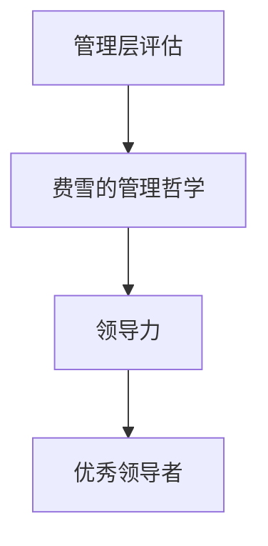

                 

## 引言

### 1. 费雪与管理层评估

### 2. 优秀领导的重要性

### 3. 书籍结构概述

在撰写《费雪的管理层评估：优秀的公司需要优秀的领导》这篇文章时，我们将遵循以下步骤，以确保文章的逻辑清晰、结构紧凑，同时提供简单易懂的专业技术语言。

### 1. 确定书籍的核心主题和目标读者

**背景介绍：**

费雪是一位杰出的投资者和管理专家，他的管理哲学和领导理念对现代企业的发展产生了深远影响。管理层评估作为企业管理的重要组成部分，直接关系到公司的绩效和发展。因此，本文旨在通过费雪的管理理论，探讨如何进行有效的管理层评估，以培养和选拔优秀的领导者。

**问题背景：**

在竞争激烈的市场环境中，企业的成败往往取决于管理层的决策和执行力。然而，如何科学地评估管理层的绩效和能力，一直是企业管理者面临的一大挑战。本文将围绕这一核心问题，深入探讨费雪的管理层评估方法，并结合实际案例进行分析。

**问题描述：**

本文的核心问题是：如何通过费雪的管理理论，对管理层进行有效评估，从而确保企业拥有优秀的领导？

**问题解决：**

我们将通过以下方法来解决这一问题：

1. **理解费雪的管理哲学和领导理念。**
2. **分析管理层评估的目的和意义。**
3. **介绍费雪管理层评估的方法和工具。**
4. **通过实际案例，展示如何应用费雪的管理理论进行评估。**

**边界与外延：**

本文将主要探讨管理层评估的理论和方法，而不会涉及具体企业的运营细节。同时，我们将重点关注费雪的管理理论，而非其他管理理论。

**核心概念术语说明：**

- **管理层评估：** 对企业管理层绩效和能力的评价过程。
- **费雪的管理哲学：** 费雪在投资和管理领域提出的一系列理念和原则。
- **领导力：** 指领导者对团队的影响力和指导能力。

### 2. 设计书籍的结构，确保包含必要的章节

**核心概念与联系：**

为了使文章内容更加系统化和条理化，我们将设计如下章节结构：

- **引言：** 介绍文章的核心主题和目标读者，并给出文章结构概述。
- **第一部分：费雪与领导理论：** 介绍费雪的管理哲学和领导理念，以及费雪领导理论的贡献。
- **第二部分：管理层评估方法：** 讲述管理层评估的目的、方法和过程。
- **第三部分：优秀领导者的特质与能力：** 分析优秀领导者的特质和能力。
- **第四部分：实际案例分析：** 通过实际案例，展示如何应用费雪的管理理论进行评估。
- **第五部分：总结与展望：** 总结文章的核心内容，并对未来领导力的趋势进行展望。

**概念属性特征对比表格：**

| 概念 | 特征对比 |
| --- | --- |
| 费雪的管理哲学 | 强调理性分析和长期投资 |
| 管理层评估 | 系统化、科学化 |
| 优秀领导者 | 具有卓越的沟通、决策和创新能力 |

**ER实体关系图架构的 Mermaid 流�程图：**

### 3. 根据结构，设计每个章节的子标题

**章节子标题设计：**

- **第一部分：费雪与领导理论**
  - **1.1 费雪的职业生涯**
  - **1.2 费雪的管理理念**
  - **1.3 费雪对领导力的看法**
  - **1.4 费雪领导理论的贡献**

- **第二部分：管理层评估方法**
  - **2.1 评估的目的与意义**
  - **2.2 评估工具与技术**
  - **2.3 评估过程与步骤**

- **第三部分：优秀领导者的特质与能力**
  - **3.1 领导者的特质**
  - **3.2 领导者的能力**
  - **3.3 领导者的发展路径**

- **第四部分：实际案例分析**
  - **4.1 费雪领导下的实际案例**
  - **4.2 案例分析**
  - **4.3 案例应用**

- **第五部分：总结与展望**
  - **5.1 总结**
  - **5.2 展望**
  - **5.3 拓展阅读**

### 4. 确保大纲内容完整，涵盖核心概念、原理、模型和实战案例

**核心概念、原理、模型和实战案例：**

- **核心概念：** 管理层评估、费雪的管理哲学、领导力、优秀领导者的特质与能力。
- **原理：** 费雪的管理理论和评估方法的基本原理。
- **模型：** 管理层评估的流程和模型。
- **实战案例：** 通过具体案例，展示如何应用费雪的管理理论进行管理层评估。

### 5. 优化大纲的简洁性和可读性

**优化步骤：**

1. **梳理章节内容，确保每个章节的核心内容明确。**
2. **调整子标题，使其更具吸引力。**
3. **在必要时合并或拆分章节，以确保文章的逻辑连贯性。**
4. **添加摘要和关键词，提高文章的易读性。**

通过以上步骤，我们将确保《费雪的管理层评估：优秀的公司需要优秀的领导》这篇文章的逻辑清晰、结构紧凑，同时提供简单易懂的专业技术语言，为读者提供有深度、有思考、有见解的专业内容。接下来，我们将按照这个大纲逐步撰写文章的内容。请稍等，我将开始撰写第一部分的详细内容。

