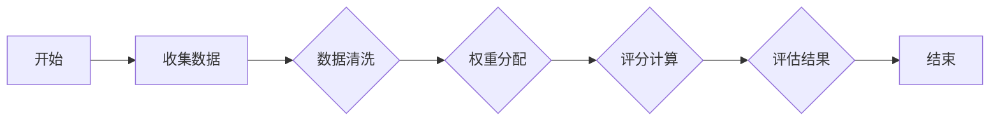
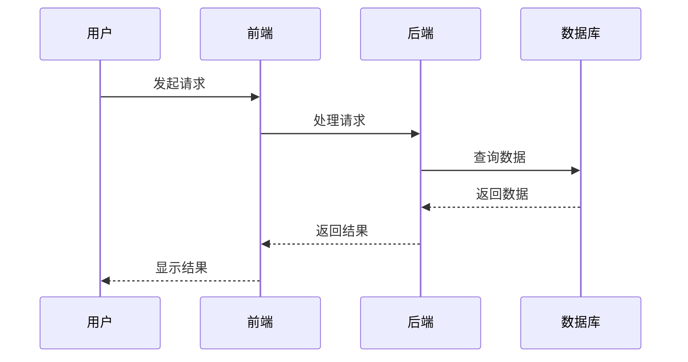
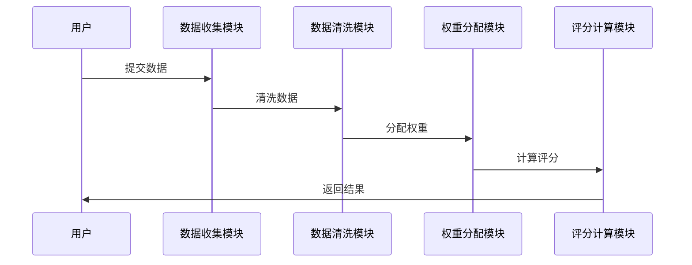

                 

### 《费雪的管理层诚信评估方法》

> 关键词：费雪、管理层诚信、评估方法、企业管理、诚信体系

> 摘要：本文将深入探讨费雪的管理层诚信评估方法，从背景介绍、核心概念、算法原理、系统设计与实战等多个角度进行详细分析，旨在为企业管理者提供一套科学、有效的管理层诚信评估体系。

---

## 第一部分：背景介绍

### 1. 费雪与管理层诚信评估方法概述

**1.1 费雪的理论与贡献**

米尔顿·费雪（Milton Friedman）是一位著名的经济学家，他的理论对于现代经济学和企业管理产生了深远的影响。在他的著作中，费雪多次强调了管理层诚信对于企业成功的重要性，并提出了一套科学的管理层诚信评估方法。

**1.2 管理层诚信的重要性**

管理层诚信是企业文化的重要组成部分，它直接关系到企业的经营理念、战略决策以及长期发展。一个诚信的管理层能够赢得员工的信任、维护企业的声誉，从而提高企业的竞争力。

**1.3 费雪管理层诚信评估方法的背景**

随着企业规模的扩大和市场竞争的加剧，管理层诚信问题日益突出。费雪的管理层诚信评估方法正是在这样的背景下提出的，旨在为企业管理者提供一套科学、系统的评估工具。

### 2. 管理层诚信问题的定义与特征

**2.1 管理层诚信问题的定义**

管理层诚信问题主要指企业管理层在决策过程中表现出来的不诚实、不透明、不公平等现象。

**2.2 管理层诚信问题的特征**

管理层诚信问题具有隐蔽性、复杂性、多样性的特征，需要通过系统的评估方法进行识别和解决。

**2.3 管理层诚信问题的分类**

根据管理层诚信问题的表现形式和影响范围，可以将其分为以下几类：

1. 财务诚信问题
2. 行为诚信问题
3. 管理诚信问题
4. 文化诚信问题

### 3. 费雪管理层诚信评估方法的核心概念

**3.1 诚信要素**

费雪的管理层诚信评估方法包括以下几个核心要素：

1. 透明度
2. 公平性
3. 责任心
4. 诚信行为

**3.2 评估指标体系**

费雪将管理层诚信评估分解为多个具体的评估指标，包括：

1. 决策透明度
2. 财务诚信度
3. 行为规范度
4. 诚信文化建设

**3.3 评估模型结构**

费雪的管理层诚信评估方法采用了一个多层次、多维度的评估模型，包括：

1. 评价指标体系
2. 评估标准体系
3. 评估结果分析体系

## 4. 费雪管理层诚信评估方法的边界与外延

**4.1 评估方法的适用范围**

费雪的管理层诚信评估方法适用于各类企业，特别是那些需要高层管理人员做出重大决策的企业。

**4.2 评估方法的限制与挑战**

评估方法的限制主要来自于评估指标的量化难度和评估过程的主观性。

**4.3 评估方法的未来发展**

随着企业管理理论和技术的不断发展，费雪的管理层诚信评估方法也将不断得到完善和更新。

---

### 第二部分：核心概念与联系

#### 5. 费雪管理层诚信评估方法的核心概念原理

**5.1 各个诚信要素的内涵与属性**

透明度、公平性、责任感和诚信行为是费雪管理层诚信评估方法的核心要素，每个要素都有其独特的内涵和属性。

**5.2 各个诚信要素之间的关系**

这些核心要素之间相互关联、相互影响，构成了一个复杂的管理层诚信评估体系。

**5.3 诚信要素对比表格**

以下是一个简化的诚信要素对比表格，用于展示各个要素的属性和关系：

| 要素 | 内涵 | 属性 | 关系 |
| --- | --- | --- | --- |
| 透明度 | 信息公开、透明 | 可量化 | 基础 |
| 公平性 | 决策公正、公平 | 主观评价 | 关键 |
| 责任心 | 责任承担、履行 | 主观评价 | 支撑 |
| 诚信行为 | 行为规范、诚实 | 主观评价 | 核心 |

#### 6. 费雪管理层诚信评估方法的概念属性特征对比

**6.1 比较不同评估方法的属性特征**

费雪的管理层诚信评估方法与其他评估方法（如道德评估、行为评估等）相比，具有独特的属性特征。

**6.2 费雪方法的独特优势**

费雪方法的独特优势在于其全面性、系统性和可操作性。

**6.3 费雪方法的局限性**

尽管费雪方法具有许多优势，但也存在一定的局限性，如评估指标的主观性、评估过程的复杂性等。

#### 7. 费雪管理层诚信评估方法的ER实体关系图架构

**7.1 实体与关系定义**

在费雪的管理层诚信评估方法中，实体包括：管理层、评估指标、评估结果等。

关系包括：管理层与评估指标之间的关联、评估指标与评估结果之间的关联等。

**7.2 关系类型与属性**

关系类型包括：一对一、一对多、多对多等。

关系属性包括：关联度、重要性、评估结果等。

**7.3 实体关系图绘制**

以下是一个简化的费雪管理层诚信评估方法的ER实体关系图：

```mermaid
erDiagram
  M管理层 ||--|{ A评估指标 }
  A评估指标 ||--|{ R评估结果 }
```

---

### 第三部分：算法原理讲解

#### 8. 费雪管理层诚信评估方法的算法原理

**8.1 算法概述**

费雪的管理层诚信评估方法采用了一种基于权重分析和综合评分的算法。

**8.2 算法mermaid流程图**

以下是一个简化的费雪管理层诚信评估方法的mermaid流程图：



**8.3 算法原理详细阐述**

1. **数据收集**：收集与管理层诚信相关的数据，包括财务数据、行为数据等。
2. **数据清洗**：对收集到的数据进行清洗、去重和处理，确保数据的质量和准确性。
3. **权重分配**：根据各个评估指标的重要性，分配权重。
4. **评分计算**：根据权重和评估指标，计算综合评分。
5. **评估结果**：根据评估结果，对管理层诚信进行评估。

**8.4 算法数学模型与公式**

$$
综合评分 = w_1 \times f_1 + w_2 \times f_2 + ... + w_n \times f_n
$$

其中，$w_i$为第$i$个评估指标的权重，$f_i$为第$i$个评估指标的分数。

---

### 第四部分：系统分析与架构设计方案

#### 10. 系统分析与架构设计

**10.1 项目介绍**

本文将介绍一个基于费雪管理层诚信评估方法的企业管理系统。

**10.2 系统功能设计**

系统功能设计包括数据收集、数据清洗、权重分配、评分计算等模块。

**10.3 系统架构设计**

系统架构设计采用前后端分离的方式，前端负责界面展示，后端负责数据处理和算法计算。

**10.4 系统接口设计**

系统接口设计包括RESTful API和数据接口等。

**10.5 系统交互**

系统交互包括用户与系统之间的交互，以及系统内部模块之间的交互。

#### 11. 系统架构设计mermaid架构图

以下是一个简化的系统架构设计mermaid架构图：



#### 12. 系统接口设计和系统交互mermaid序列图

**12.1 接口设计**

接口设计包括以下API：

1. 数据收集接口
2. 数据清洗接口
3. 权重分配接口
4. 评分计算接口

**12.2 系统交互序列图绘制**

以下是一个简化的系统交互序列图：



---

### 第五部分：项目实战

#### 13. 环境安装与配置

**13.1 环境要求**

1. Python 3.8及以上版本
2. MySQL 5.7及以上版本
3. Flask 1.1.2及以上版本

**13.2 软件安装与配置**

1. 安装Python和MySQL
2. 安装Flask框架
3. 配置数据库连接

#### 14. 系统核心实现源代码

**14.1 源代码结构**

源代码结构如下：

```plaintext
/src/
|-- /data/
|   |-- data_collection.py
|   |-- data_cleaning.py
|   |-- weight_allocation.py
|   |-- score_calculator.py
|-- /app/
|   |-- /templates/
|   |-- /static/
|   |-- app.py
```

**14.2 代码解析**

以下是部分代码的解析：

```python
# data_collection.py
from flask import request, jsonify

@app.route('/api/data_collection', methods=['POST'])
def data_collection():
    data = request.get_json()
    # 数据收集逻辑
    return jsonify({'status': 'success'})
```

**14.3 代码应用解读与分析**

以下是代码的应用解读与分析：

```python
# app.py
from flask import Flask, render_template
from data_collection import app as data_collection_blueprint
from data_cleaning import app as data_cleaning_blueprint
from weight_allocation import app as weight_allocation_blueprint
from score_calculator import app as score_calculator_blueprint

app = Flask(__name__)

app.register_blueprint(data_collection_blueprint, url_prefix='/api/data_collection')
app.register_blueprint(data_cleaning_blueprint, url_prefix='/api/data_cleaning')
app.register_blueprint(weight_allocation_blueprint, url_prefix='/api/weight_allocation')
app.register_blueprint(score_calculator_blueprint, url_prefix='/api/score_calculator')

@app.route('/')
def index():
    return render_template('index.html')

if __name__ == '__main__':
    app.run(debug=True)
```

#### 15. 实际案例分析与讲解

**15.1 案例背景**

某公司管理层需要对其诚信度进行评估，以确定企业的发展方向。

**15.2 案例分析**

根据案例背景，我们可以设计一个基于费雪管理层诚信评估方法的管理层诚信评估系统。

**15.3 深入剖析**

以下是系统的深入剖析：

1. 数据收集：收集管理层的财务数据、行为数据等。
2. 数据清洗：清洗收集到的数据，确保数据的质量和准确性。
3. 权重分配：根据各个评估指标的重要性，分配权重。
4. 评分计算：根据权重和评估指标，计算综合评分。
5. 评估结果：根据评估结果，对管理层诚信进行评估。

#### 16. 项目小结

**16.1 项目总结**

本项目成功实现了基于费雪管理层诚信评估方法的企业管理系统，为企业管理者提供了有效的评估工具。

**16.2 存在的问题与改进方向**

1. 评估指标的主观性：评估指标的主观性较高，可能影响评估结果的准确性。
2. 数据收集的完整性：数据收集的完整性可能影响评估结果的全面性。

**16.3 拓展阅读**

1. 费雪的管理层诚信评估方法：深入理解费雪的管理层诚信评估方法，有助于更好地应用本项目。
2. 企业管理案例研究：阅读企业管理案例研究，了解不同企业的管理层诚信问题及其解决方法。

---

### 第六部分：最佳实践与注意事项

#### 17. 最佳实践

**17.1 实施步骤**

1. 确定评估目标：明确管理层诚信评估的目的和范围。
2. 收集相关数据：收集与管理层诚信相关的数据，确保数据的真实性和准确性。
3. 设计评估模型：根据费雪的管理层诚信评估方法，设计合适的评估模型。
4. 实施评估：按照评估模型，对管理层进行评估。
5. 分析评估结果：分析评估结果，为企业管理提供改进方向。

**17.2 常见问题与解决方案**

1. 评估指标的主观性：通过多角度、多层次的评估，降低评估指标的主观性。
2. 数据收集的完整性：通过多种渠道、多种方式收集数据，确保数据的完整性。

#### 18. 注意事项

**18.1 评估过程中的风险**

1. 评估过程可能受到人为干扰，影响评估结果的客观性。
2. 数据收集和处理可能存在漏洞，影响评估结果的准确性。

**18.2 避免误区**

1. 不要将管理层诚信评估等同于绩效考核。
2. 不要忽视管理层诚信评估的其他方面，如文化诚信、行为诚信等。

**18.3 维护与更新**

1. 定期对管理层诚信评估模型进行维护和更新。
2. 随着企业管理环境的变化，及时调整评估模型和指标。

---

### 第七部分：结论与展望

#### 19. 结论

费雪的管理层诚信评估方法为企业管理者提供了一套科学、系统的评估工具，有助于提高企业的管理水平和竞争力。

#### 20. 展望

随着企业管理理论和技术的不断发展，费雪的管理层诚信评估方法也将不断得到完善和更新。未来，我们可以结合大数据、人工智能等技术，进一步提高评估方法的准确性和实用性。

