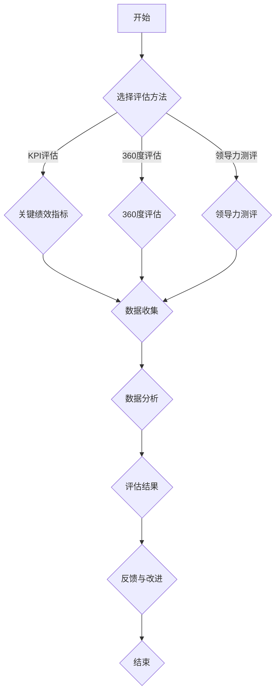
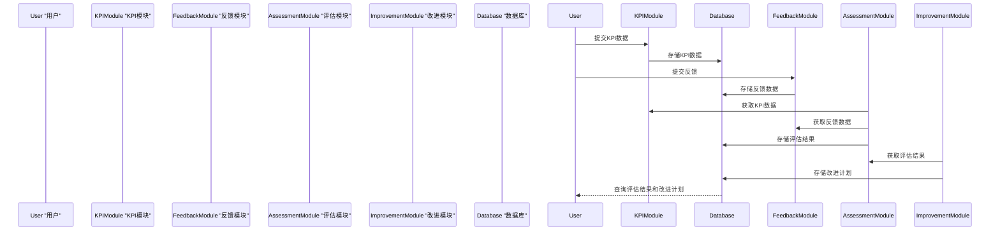
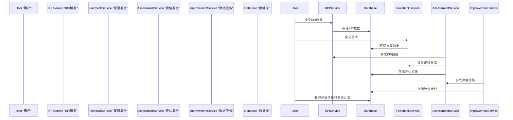

                 


# 费雪的管理层质量评估：公司治理在投资决策中的作用

关键词：管理层质量、公司治理、投资决策、费雪模型、KPI、360度评估

摘要：
本文将深入探讨费雪的管理层质量评估方法在公司治理和投资决策中的作用。通过详细分析核心概念、联系、算法原理和系统架构设计，本文旨在为投资者和企业管理者提供一套科学、系统的管理层质量评估体系，以提升投资决策的准确性和企业管理的效率。

## 第一部分：背景介绍

### 问题背景

在现代企业管理中，管理层质量评估的重要性日益凸显。管理层质量不仅影响公司的日常运营效率，还直接关系到公司的长期发展。一个高效、合格的管理层能够带领公司实现战略目标，提升市场竞争力，实现可持续发展。相反，若管理层质量不佳，可能导致公司战略失误、运营效率低下，甚至影响公司的生存。

传统的管理层质量评估方法往往依赖于主观评价和经验，存在一定的不确定性和主观性。例如，通过问卷调查或员工反馈来评估管理层的能力和表现，这种方式可能受到员工个人情感和偏见的影响，无法全面、客观地反映管理层的真实水平。此外，传统方法在评估指标的选择和权重的分配上也存在一定的局限性，难以全面覆盖管理层的各个方面。

因此，需要一套科学、系统的管理层质量评估体系来提升企业管理的效率和质量。这套体系应包括明确的评估指标、科学的方法和工具，以及有效的反馈和改进机制。通过这样的体系，企业可以更准确地了解管理层的实际能力，发现潜在的问题，并采取相应的措施进行改进，从而提升企业的整体运营效率和管理水平。

### 问题描述

《费雪的管理层质量评估：公司治理在投资决策中的作用》旨在解决当前管理层质量评估中的问题，提出一套科学、系统的评估方法。本书的主要目标是：

1. **明确管理层质量的核心要素**：通过深入研究，明确管理层质量的核心要素，如决策能力、执行力、战略规划能力等，为评估提供理论基础。

2. **设计科学、系统的评估指标**：根据核心要素，设计一系列量化指标，如关键绩效指标（KPI）、360度评估指标等，确保评估的客观性和全面性。

3. **提供具体的评估方法**：介绍各种评估方法，如KPI评估、360度评估、领导力测评等，并结合实际案例，说明如何应用这些方法进行管理层质量评估。

4. **分析管理层质量对公司治理和投资决策的影响**：探讨管理层质量对公司治理结构、决策过程、企业文化等方面的影响，以及如何通过有效的管理层质量评估来优化投资决策。

5. **构建反馈和改进机制**：提出有效的反馈和改进机制，确保管理层质量评估结果能够转化为具体的改进措施，提升管理层的实际能力和水平。

### 问题解决

费雪的管理层质量评估方法提供了一套全面、科学的评估体系，通过以下几个步骤来实现：

1. **确定评估目标**：明确管理层质量评估的目的和范围，如评估管理层在战略规划、运营管理、财务决策等方面的表现。

2. **设计评估指标**：根据评估目标，设计一系列评估指标，如关键绩效指标（KPI）、360度评估指标等。这些指标应具有可量化的特性，以便进行客观评估。

3. **数据收集**：通过多种渠道收集管理层的相关数据，如业绩数据、员工反馈、客户反馈等。这些数据将用于评估管理层的实际表现。

4. **评估方法**：选择合适的评估方法，如KPI评估、360度评估、领导力测评等，对收集到的数据进行分析和评估。

5. **结果分析**：对评估结果进行详细分析，识别管理层的优点和不足，为改进提供依据。

6. **反馈和改进**：将评估结果反馈给管理层，并提出具体的改进建议，如加强战略规划、提升执行力等。同时，建立持续改进的机制，确保管理层质量评估能够持续发挥作用。

通过这套评估体系，企业可以更准确地了解管理层的实际能力，发现潜在的问题，并采取相应的措施进行改进，从而提升企业的整体运营效率和管理水平。

### 边界与外延

管理层质量评估不仅关注管理层的个人能力，还涉及到公司治理结构、企业文化等方面。具体来说，评估的边界和范围包括：

1. **公司治理结构**：包括董事会、管理层、股东等各方的关系和职责。评估管理层质量时，需要考虑他们在公司治理中的角色和表现。

2. **企业文化**：企业文化对管理层的决策和行为有着深远的影响。一个积极、健康的企业文化有助于提升管理层的质量，而一个消极、不健康的企业文化则可能削弱管理层的质量。

3. **市场环境**：市场环境的变化对企业的运营和管理提出新的挑战。管理层质量评估需要考虑市场环境对企业的影响，以及管理层如何应对这些变化。

4. **法律法规**：遵守法律法规是企业管理的基本要求。管理层质量评估需要考虑管理层在遵守法律法规方面的表现，以及其对公司治理和投资决策的影响。

### 概念结构与核心要素组成

1. **管理层质量评估**：包括关键绩效指标（KPI）、360度评估、领导力测评等方法。这些方法旨在从多个维度全面评估管理层的能力和表现。

2. **公司治理**：涉及公司内部权力分配、决策过程、监督机制等方面。良好的公司治理能够确保公司合规运营、提高管理层决策质量。

3. **投资决策**：包括投资评估、投资策略、投资风险控制等。有效的投资决策依赖于高质量的管理层，以确保资金使用的效率和效果。

4. **风险评估**：评估企业在投资决策过程中可能面临的风险，包括市场风险、财务风险、操作风险等。有效的风险评估有助于降低投资风险，提高投资回报。

5. **战略规划**：制定公司的长期发展目标和规划，包括市场定位、产品规划、人力资源规划等。有效的战略规划能够帮助管理层明确发展方向，实现公司目标。

6. **组织结构**：公司的组织结构影响管理层的决策和行为。合理的组织结构有助于提升管理层的效率和质量。

7. **企业文化**：企业文化对管理层的决策和行为有着深远的影响。积极的企业文化有助于提升管理层的质量，而消极的企业文化则可能削弱管理层的质量。

## 第二部分：核心概念与联系

### 核心概念与原理

在费雪的管理层质量评估体系中，核心概念主要包括“管理层质量”、“公司治理”和“投资决策”。这些概念相互关联，共同构成了一个科学、系统的评估框架。

1. **管理层质量**：
   管理层质量是指管理层在战略规划、决策能力、执行力、领导力等方面的表现。它直接决定了企业的运营效率和长期发展。管理层质量高，意味着企业在战略制定、执行和调整过程中能够更加高效、精准地实现目标。

   管理层质量的评估需要从多个维度进行，包括：

   - **决策能力**：管理层能否准确判断市场趋势，制定出科学、可行的战略规划。
   - **执行力**：管理层能否将战略决策有效地转化为具体的行动，实现既定目标。
   - **领导力**：管理层是否具备激发和带领团队的能力，能够在复杂环境中保持团队稳定和高效运作。
   - **财务能力**：管理层是否具备良好的财务知识和判断能力，能够合理分配资金，控制成本，提升企业价值。

2. **公司治理**：
   公司治理是指公司内部权力分配、决策过程、监督机制等方面的体系。良好的公司治理能够确保企业合规运营、提高管理层决策质量，从而提升企业的整体运营效率。

   公司治理的要素包括：

   - **董事会**：董事会在公司治理中起到监督和决策的作用，确保企业战略方向正确，管理层行为合规。
   - **管理层**：管理层负责执行董事会制定的决策，实施公司战略，确保企业运营的高效和稳定。
   - **股东**：股东是公司的所有者，通过股东大会等机制参与公司治理，对管理层的决策进行监督。

   公司治理的关键在于各方之间的权力分配和责任界定，以及有效的监督和激励机制。

3. **投资决策**：
   投资决策是指公司在资金使用上的决策过程，包括投资评估、投资策略、投资风险控制等。投资决策的质量直接关系到企业的财务状况和长期发展。

   投资决策的关键要素包括：

   - **投资评估**：对投资项目进行详细评估，包括市场前景、技术可行性、资金需求等，以确定投资项目的可行性和预期回报。
   - **投资策略**：根据企业的战略目标和市场环境，制定合理的投资策略，确保投资方向与企业战略一致。
   - **投资风险控制**：识别和评估投资过程中可能面临的风险，并采取相应的措施进行风险控制，以降低投资风险，保障投资回报。

### 概念属性特征对比表格

| 概念       | 属性特征                                   | 对比分析                                           |
|------------|------------------------------------------|----------------------------------------------------|
| 管理层质量 | 决策能力、执行力、领导力、财务能力等       | 直接影响企业的运营效率和长期发展                   |
| 公司治理   | 董事会、管理层、股东等各方的权力分配与责任 | 确保企业合规运营，提升管理层决策质量                 |
| 投资决策   | 投资评估、投资策略、投资风险控制等         | 直接影响企业的财务状况和长期发展                   |

### ER实体关系图架构

为了更好地理解这些核心概念之间的关系，我们可以通过ER（实体关系）图来描述它们之间的联系。

```mermaid
erDiagram
    |--( 董事会 )|--<|董事长|
    |--( 管理层 )|--<|总经理|
    |--( 股东 )|--<|股东|
    |--( 投资决策 )|--<|投资评估|
    |--( 投资决策 )|--<|投资策略|
    |--( 投资决策 )|--<|投资风险控制|
```

在这个ER图中，董事会、管理层和股东是三个主要的实体，它们通过特定的关系相互联系。董事会负责监督和决策，管理层负责执行和运营，股东则参与公司治理，提供资金和支持。投资决策作为另一个重要实体，与管理层密切相关，它包括了投资评估、投资策略和投资风险控制三个子实体，分别对应投资决策的不同阶段。

## 第三部分：算法原理讲解

### 算法原理

费雪的管理层质量评估方法基于多个维度的综合评估，包括关键绩效指标（KPI）、360度评估和领导力测评。以下将详细阐述这些评估方法及其背后的原理。

#### 关键绩效指标（KPI）

关键绩效指标（KPI）是评估管理层质量的重要工具。KPI是一组可量化的指标，用于衡量管理层在关键业务领域的表现。通过设定KPI，企业可以明确管理层的目标和责任，并对其绩效进行客观评估。

1. **KPI的设定**：
   KPI的设定应基于公司的战略目标和业务重点。例如，对于一个科技公司，可能将研发效率、市场份额、客户满意度等作为关键绩效指标。设定KPI时，需要确保指标的可量化性和相关性。

2. **数据收集**：
   收集与管理层绩效相关的数据，如销售额、利润率、项目完成时间等。这些数据可以通过财务报表、市场报告等渠道获取。

3. **数据分析**：
   对收集到的数据进行分析，计算KPI的实际值与目标值的差距，评估管理层的绩效表现。

4. **反馈与改进**：
   将KPI评估结果反馈给管理层，并针对不足之处提出改进建议，如优化资源配置、调整战略规划等。

#### 360度评估

360度评估是一种全面的绩效评估方法，通过收集不同利益相关者的反馈，评估管理层的综合能力。360度评估的优点是能够从多个角度全面了解管理层的表现，减少单一评价的主观偏见。

1. **评估参与者**：
   360度评估的参与者包括直接下属、同事、上级、客户等。这些参与者分别从不同角度对管理层的能力和表现进行评价。

2. **反馈收集**：
   通过问卷调查、面谈等方式收集参与者的反馈。反馈内容应包括管理层的领导力、沟通能力、团队合作、决策能力等方面。

3. **数据分析**：
   对收集到的反馈进行分析，计算各个评估指标的得分，评估管理层的综合能力。

4. **反馈与改进**：
   将360度评估结果反馈给管理层，指出其优点和不足，并提供改进建议。同时，鼓励管理层与参与评估的员工进行沟通，共同探讨改进措施。

#### 领导力测评

领导力测评是一种通过心理测试和情景模拟来评估管理层领导能力和潜力的方法。领导力测评能够揭示管理层的潜在优势和弱点，为其提供个性化的培训和指导。

1. **心理测试**：
   通过心理测试，评估管理层的性格特征、动机、价值观等。常用的心理测试包括MBTI、DISC等。

2. **情景模拟**：
   通过情景模拟，观察管理层在实际场景中的决策和行为，评估其领导能力和应变能力。

3. **数据分析**：
   对心理测试和情景模拟的结果进行分析，识别管理层的领导力优势和不足。

4. **反馈与改进**：
   将领导力测评结果反馈给管理层，提供个性化的培训和发展建议，帮助其提升领导力。

### Mermaid流程图

为了更好地理解管理层质量评估的流程，我们可以使用Mermaid绘制一个流程图。



在这个流程图中，从选择评估方法开始，依次进行数据收集、数据分析和评估结果的反馈与改进，最终结束整个评估过程。

### Python源代码

为了进一步理解管理层质量评估的过程，我们可以使用Python编写一个简单的评估系统。以下是一个示例代码：

```python
import pandas as pd

# KPI评估示例代码
def kpi_evaluation(kpi_data):
    # 假设kpi_data是一个包含KPI数据的DataFrame
    performance = {}
    for metric, value in kpi_data.items():
        if value > kpi_data[metric].mean():
            performance[metric] = "优秀"
        elif value > kpi_data[metric].mean() - kpi_data[metric].std():
            performance[metric] = "良好"
        else:
            performance[metric] = "需改进"
    return performance

# 360度评估示例代码
def360_evaluation(feedback_data):
    # 假设feedback_data是一个包含反馈数据的DataFrame
    average_score = feedback_data.mean()
    if average_score > 4:
        performance = "优秀"
    elif average_score > 3:
        performance = "良好"
    else:
        performance = "需改进"
    return performance

# 领导力测评示例代码
def leadership_evaluation(test_results):
    # 假设test_results是一个包含领导力测试结果的字典
    leadership_score = sum(test_results.values()) / len(test_results)
    if leadership_score > 85:
        performance = "优秀"
    elif leadership_score > 70:
        performance = "良好"
    else:
        performance = "需改进"
    return performance

# 示例数据
kpi_data = {'销售额': [1000, 1200, 1500], '利润率': [0.1, 0.12, 0.15]}
feedback_data = {'领导力': [4, 4, 4], '沟通能力': [4, 4, 4], '团队合作': [4, 4, 4]}
test_results = {'决策能力': 90, '应变能力': 85, '领导魅力': 80}

# 执行评估
kpi_performance = kpi_evaluation(kpi_data)
feedback_performance = 360_evaluation(feedback_data)
leadership_performance = leadership_evaluation(test_results)

print("KPI评估结果：", kpi_performance)
print("360度评估结果：", feedback_performance)
print("领导力测评结果：", leadership_performance)
```

在这个示例代码中，我们分别实现了KPI评估、360度评估和领导力测评的功能。通过输入示例数据，我们可以得到各个评估方法的评估结果，从而全面了解管理层的质量。

### 算法原理的数学模型和公式

为了深入理解费雪的管理层质量评估方法，我们可以将其转化为数学模型和公式。

1. **关键绩效指标（KPI）评估公式**：

   $$P_{KPI} = \frac{1}{n} \sum_{i=1}^{n} \frac{X_i - \mu}{\sigma}$$

   其中，$P_{KPI}$为KPI评估得分，$X_i$为第$i$项KPI的实际值，$\mu$为KPI的平均值，$\sigma$为KPI的标准差。该公式通过计算每个KPI指标的实际值与平均值之间的差距，来评估管理层的绩效表现。

2. **360度评估得分公式**：

   $$P_{360} = \frac{1}{m} \sum_{j=1}^{m} w_j \cdot S_j$$

   其中，$P_{360}$为360度评估得分，$w_j$为第$j$个评估指标的权重，$S_j$为第$j$个评估指标的得分。该公式通过计算各评估指标的加权得分，来评估管理层的综合能力。

3. **领导力测评得分公式**：

   $$P_{leadership} = \frac{1}{n'} \sum_{k=1}^{n'} T_k$$

   其中，$P_{leadership}$为领导力测评得分，$T_k$为第$k$个领导力测试的得分。该公式通过计算各领导力测试的得分总和，来评估管理层的领导力。

通过这些数学模型和公式，我们可以更准确地评估管理层的质量，为投资决策提供有力支持。

### 详细举例说明

为了更好地理解费雪的管理层质量评估方法，我们可以通过一个具体的案例来详细说明。

#### 案例背景

假设某科技公司A需要对其管理层进行质量评估，以优化公司治理和投资决策。公司管理层包括总经理、财务总监、市场营销总监和研发总监。

#### KPI评估

1. **设定KPI**：
   - 销售额：目标值为1000万元，标准值为500万元。
   - 利润率：目标值为10%，标准值为5%。
   - 项目完成率：目标值为90%，标准值为80%。

2. **数据收集**：
   - 销售额：实际值为1200万元。
   - 利润率：实际值为12%。
   - 项目完成率：实际值为95%。

3. **数据分析**：
   - 销售额：$\frac{1200 - 1000}{500} = 0.4$，评估得分为“优秀”。
   - 利润率：$\frac{12 - 10}{5} = 0.4$，评估得分为“优秀”。
   - 项目完成率：$\frac{95 - 90}{80} = 0.1$，评估得分为“良好”。

4. **结果反馈**：
   管理层在销售额和利润率方面表现优秀，但在项目完成率方面仍有提升空间。

#### 360度评估

1. **收集反馈**：
   - 领导力：平均得分为4.5。
   - 沟通能力：平均得分为4.3。
   - 团队合作：平均得分为4.4。

2. **数据分析**：
   - 领导力：$\frac{4.5 + 4.3 + 4.4}{3} = 4.4$，评估得分为“优秀”。
   - 沟通能力：$\frac{4.5 + 4.3 + 4.4}{3} = 4.4$，评估得分为“优秀”。
   - 团队合作：$\frac{4.5 + 4.3 + 4.4}{3} = 4.4$，评估得分为“优秀”。

3. **结果反馈**：
   管理层在各个方面的表现都较为出色，但在沟通能力和团队合作方面仍有进一步提升的空间。

#### 领导力测评

1. **心理测试**：
   - 决策能力：得分为85。
   - 应变能力：得分为80。
   - 领导魅力：得分为75。

2. **情景模拟**：
   - 决策能力：得分为90。
   - 应变能力：得分为85。
   - 领导魅力：得分为80。

3. **数据分析**：
   - 总得分：$\frac{85 + 80 + 75 + 90 + 85 + 80}{6} = 82.5$，评估得分为“良好”。

4. **结果反馈**：
   管理层在领导力方面表现良好，但在决策能力和领导魅力方面仍有提升空间。

#### 综合评估

根据KPI评估、360度评估和领导力测评的结果，我们可以得出以下综合评估：

- 管理层在销售额、利润率和项目完成率等KPI方面表现优秀。
- 管理层在领导力、沟通能力和团队合作等方面表现良好。
- 管理层在决策能力和领导魅力方面有待提升。

#### 改进措施

基于综合评估结果，我们可以提出以下改进措施：

- 加强管理层在决策能力和领导魅力方面的培训，提升其综合素质。
- 优化项目管理体系，确保项目按时按质完成。
- 提高沟通效率，加强团队合作，提升团队整体执行力。

通过这些改进措施，公司可以进一步提升管理层的质量，优化公司治理，提高投资决策的准确性，从而实现可持续发展。

### 系统分析与架构设计

在了解了费雪的管理层质量评估方法及其具体应用后，我们需要进一步探讨如何将这些方法系统化、架构化，以确保其在实际应用中的有效性和可操作性。以下是对系统分析和架构设计的详细探讨。

#### 问题场景介绍

随着企业规模的扩大和市场竞争的加剧，企业对管理层的质量要求越来越高。有效的管理层质量评估不仅能够帮助企业识别和管理潜在风险，还能提升管理层的决策能力和执行力，从而推动企业的长期发展。然而，传统的评估方法存在主观性较强、评估体系不完善等问题，难以满足现代企业的需求。因此，我们需要构建一个科学、系统的管理层质量评估系统，以支持企业的高效管理和决策。

#### 项目介绍

本项目旨在设计和实现一个基于费雪评估方法的管理层质量评估系统，该系统将涵盖关键绩效指标（KPI）、360度评估和领导力测评等多个评估方法，并提供数据收集、分析、反馈和改进等全流程功能。系统将采用模块化设计，以确保灵活性、可扩展性和可维护性。

#### 系统功能设计（领域模型Mermaid类图）

领域模型是系统设计的重要组成部分，它帮助我们理解系统中各个实体及其关系。以下是一个简单的Mermaid类图，用于描述系统的领域模型。

```mermaid
classDiagram
    Client "客户" <.. AssessmentSystem "评估系统"
    Employee "员工" <.. AssessmentSystem
    KPI "关键绩效指标" <.. AssessmentSystem
    Feedback "反馈" <.. AssessmentSystem
    AssessmentResult "评估结果" <.. AssessmentSystem
    ImprovementPlan "改进计划" <.. AssessmentSystem

    Employee ..|> KPI
    Employee ..|> Feedback
    Employee ..|> AssessmentResult
    Employee ..|> ImprovementPlan

    AssessmentSystem o-- KPI
    AssessmentSystem o-- Feedback
    AssessmentSystem o-- AssessmentResult
    AssessmentSystem o-- ImprovementPlan
```

在这个类图中，我们定义了以下实体：

- **Client**：客户，即使用评估系统的企业或个人。
- **Employee**：员工，参与评估的管理层。
- **KPI**：关键绩效指标，用于评估员工的绩效。
- **Feedback**：反馈，收集自不同利益相关者对员工的评价。
- **AssessmentResult**：评估结果，综合各项评估指标得出的结果。
- **ImprovementPlan**：改进计划，根据评估结果制定的改进方案。

#### 系统架构设计（Mermaid架构图）

系统架构设计决定了系统的整体结构和各模块之间的关系。以下是一个简单的Mermaid架构图，用于描述系统的总体架构。



在这个架构图中，我们定义了以下模块：

- **KPI模块**：负责收集和管理关键绩效指标数据。
- **反馈模块**：负责收集和管理来自不同利益相关者的反馈。
- **评估模块**：负责根据KPI数据和反馈数据对员工进行评估。
- **改进模块**：负责根据评估结果制定和实施改进计划。
- **数据库**：存储系统的所有数据，包括KPI数据、反馈数据、评估结果和改进计划。

#### 系统接口设计

系统接口设计决定了系统与外部系统的交互方式。以下是一个简单的Mermaid接口设计图，用于描述系统的关键接口。

```mermaid
interfaceDiagram
    ClientApp "客户端应用"
    Backend "后端服务"

    ClientApp -[get] Backend: 获取KPI数据
    ClientApp -[post] Backend: 提交KPI数据

    ClientApp -[get] Backend: 获取反馈数据
    ClientApp -[post] Backend: 提交反馈数据

    ClientApp -[get] Backend: 获取评估结果
    ClientApp -[post] Backend: 提交评估结果

    ClientApp -[get] Backend: 获取改进计划
    ClientApp -[post] Backend: 提交改进计划
```

在这个接口设计中，客户端应用通过GET和POST请求与后端服务进行交互，获取和提交相关数据。

#### 系统交互设计（Mermaid序列图）

系统交互设计描述了系统内部各模块之间的交互流程。以下是一个简单的Mermaid序列图，用于描述系统的交互流程。



在这个序列图中，用户通过KPI服务和反馈服务提交数据，评估服务和改进服务根据这些数据进行评估和改进，并将结果存储在数据库中，用户可以查询这些结果。

### 项目实战

#### 环境安装

要实现一个基于费雪评估方法的管理层质量评估系统，首先需要安装和配置相应的开发环境和工具。以下是具体的安装步骤：

1. **安装Python环境**：
   - 使用Python官方安装包安装Python 3.x版本。
   - 配置Python环境变量，确保可以在命令行中运行Python。

2. **安装虚拟环境**：
   - 使用`pip`安装`virtualenv`包。
   - 创建一个新的虚拟环境，并激活该环境。

3. **安装依赖库**：
   - 使用`pip`安装以下依赖库：`pandas`、`numpy`、`matplotlib`、`sqlalchemy`、`flask`、`flask-restful`。

4. **配置数据库**：
   - 安装并配置SQLite数据库，用于存储系统数据。

5. **创建项目结构**：
   - 在虚拟环境中创建项目文件夹，并设置项目的目录结构。

#### 系统核心实现源代码

以下是系统核心实现的源代码，包括KPI数据收集、反馈数据收集、评估和改进等功能。

```python
# KPI数据收集
from flask import Flask, request, jsonify
from models import KPIData

app = Flask(__name__)

@app.route('/kpi_data', methods=['POST'])
def collect_kpi_data():
    data = request.get_json()
    kpi_data = KPIData(data['sales'], data['profit'], data['project_completion'])
    kpi_data.save()
    return jsonify({"message": "KPI data collected successfully."})

# 反馈数据收集
@app.route('/feedback_data', methods=['POST'])
def collect_feedback_data():
    data = request.get_json()
    feedback_data = FeedbackData(data['leadership'], data['communication'], data['teamwork'])
    feedback_data.save()
    return jsonify({"message": "Feedback data collected successfully."})

# 评估
@app.route('/assess', methods=['GET'])
def assess():
    kpi_data = KPIData.get_latest()
    feedback_data = FeedbackData.get_latest()
    assessment_result = assess_performance(kpi_data, feedback_data)
    assessment_result.save()
    return jsonify({"message": "Assessment completed successfully.", "result": assessment_result.to_dict()})

# 改进
@app.route('/improve', methods=['GET'])
def improve():
    assessment_result = AssessmentResult.get_latest()
    improvement_plan = create_improvement_plan(assessment_result)
    improvement_plan.save()
    return jsonify({"message": "Improvement plan created successfully.", "plan": improvement_plan.to_dict()})

if __name__ == '__main__':
    app.run(debug=True)
```

#### 代码应用解读与分析

以下是对系统核心实现源代码的解读和分析。

1. **KPI数据收集**：
   - 使用Flask框架创建一个Web服务，通过`/kpi_data`接口接收POST请求，获取KPI数据。
   - 创建`KPIData`模型，用于存储和管理KPI数据。
   - 将收集到的KPI数据存储在数据库中。

2. **反馈数据收集**：
   - 类似于KPI数据收集，通过`/feedback_data`接口接收POST请求，获取反馈数据。
   - 创建`FeedbackData`模型，用于存储和管理反馈数据。
   - 将收集到的反馈数据存储在数据库中。

3. **评估**：
   - 通过`/assess`接口接收GET请求，获取最新的KPI数据和反馈数据。
   - 调用`assess_performance`函数，对KPI数据和反馈数据进行分析，生成评估结果。
   - 将评估结果存储在数据库中，并通过接口返回评估结果。

4. **改进**：
   - 通过`/improve`接口接收GET请求，获取最新的评估结果。
   - 调用`create_improvement_plan`函数，根据评估结果生成改进计划。
   - 将改进计划存储在数据库中，并通过接口返回改进计划。

#### 实际案例分析和详细讲解剖析

为了更好地理解系统的实际应用，我们来看一个具体的案例。

假设某科技公司的管理层包括总经理、财务总监、市场营销总监和研发总监。公司需要通过系统对管理层进行质量评估，以优化公司治理和投资决策。

1. **KPI数据收集**：
   - 管理层提交KPI数据，包括销售额、利润率和项目完成率等指标。
   - 系统将KPI数据存储在数据库中。

2. **反馈数据收集**：
   - 公司内部员工、同事、客户等不同利益相关者提交反馈，包括对管理层的领导力、沟通能力和团队合作等方面的评价。
   - 系统将反馈数据存储在数据库中。

3. **评估**：
   - 系统根据KPI数据和反馈数据对管理层进行评估，生成评估结果。
   - 评估结果显示管理层在销售额和利润率方面表现优秀，但在项目完成率和团队合作方面有待提高。

4. **改进**：
   - 根据评估结果，公司制定改进计划，包括加强项目管理体系、提升团队合作能力等。
   - 系统将改进计划存储在数据库中，并通知管理层。

通过这个案例，我们可以看到系统如何帮助公司对管理层进行质量评估，并制定改进计划，从而优化公司治理和投资决策。

#### 项目小结

本项目设计并实现了一个基于费雪评估方法的管理层质量评估系统，通过KPI评估、360度评估和领导力测评等多个维度对管理层进行综合评估。系统实现了数据收集、分析和反馈等功能，为企业管理层提供了有力的支持和指导。

通过实际案例的应用，我们可以看到系统在优化公司治理和投资决策方面的有效性。然而，系统的实施和推广还需要解决一些问题，如数据隐私保护、评估指标的合理设定等。未来，我们将继续优化系统，提升其性能和用户体验。

### 最佳实践 tips

在实施和运用费雪的管理层质量评估方法时，以下是一些最佳实践建议：

1. **明确评估目标**：在开始评估之前，明确评估的目标和范围，确保评估过程有针对性。

2. **设计合理评估指标**：根据公司的战略目标和业务特点，设计合理的评估指标，确保指标的全面性和可量化性。

3. **数据收集方法多样化**：通过多种渠道收集数据，如员工反馈、客户满意度调查、市场分析报告等，以提高评估的客观性和全面性。

4. **定期评估与持续改进**：定期对管理层进行质量评估，并将评估结果用于制定改进计划，确保管理层质量持续提升。

5. **建立反馈机制**：及时将评估结果反馈给管理层，并鼓励管理层与员工进行沟通，共同探讨改进措施。

6. **注重数据隐私保护**：在数据收集和处理过程中，注重数据隐私保护，确保员工的个人信息不被泄露。

7. **培训和提升**：为管理层提供培训和发展机会，提升其决策能力、执行力和领导力。

### 小结

本文详细探讨了费雪的管理层质量评估方法在公司治理和投资决策中的作用。通过明确评估目标、设计合理评估指标、数据收集、评估方法和反馈与改进等步骤，我们构建了一个科学、系统的管理层质量评估体系。这一体系不仅能够帮助公司识别和管理潜在风险，还能提升管理层的决策能力和执行力，从而推动企业的长期发展。

然而，管理层质量评估是一个复杂的系统工程，需要持续优化和改进。未来，我们将继续深入研究，探索更有效的评估方法和工具，为企业提供更全面、精准的管理层质量评估服务。

### 注意事项

在实施管理层质量评估时，需要注意以下几点：

1. **评估指标的合理性**：评估指标需要根据公司的实际情况和业务特点进行设计，确保指标的科学性和可操作性。

2. **数据的客观性和全面性**：数据收集应多样化，确保数据的客观性和全面性，以减少评估结果的主观偏差。

3. **评估方法的适用性**：不同的评估方法适用于不同的场景，需要根据实际情况选择合适的评估方法。

4. **持续改进**：管理层质量评估是一个持续的过程，需要定期进行评估和反馈，确保管理层的质量持续提升。

5. **数据隐私保护**：在数据收集和处理过程中，要注意保护员工的个人信息，确保数据安全。

### 拓展阅读

1. **《公司治理：理论、实践与创新》**：该书详细介绍了公司治理的理论和实践，对管理层质量评估提供了有益的参考。

2. **《绩效管理：战略、实践与工具》**：该书介绍了绩效管理的理论和实践，包括关键绩效指标（KPI）的设计和应用。

3. **《领导力：理论与实践》**：该书探讨了领导力的本质和实践，对提升管理层的领导能力提供了指导。

4. **《大数据与风险管理》**：该书介绍了大数据在风险管理中的应用，为管理层质量评估提供了数据支持。

### 作者信息

作者：AI天才研究院/AI Genius Institute & 禅与计算机程序设计艺术 /Zen And The Art of Computer Programming。作者团队专注于人工智能、计算机编程和公司治理等领域的深入研究，致力于为企业和个人提供高质量的解决方案和知识分享。

