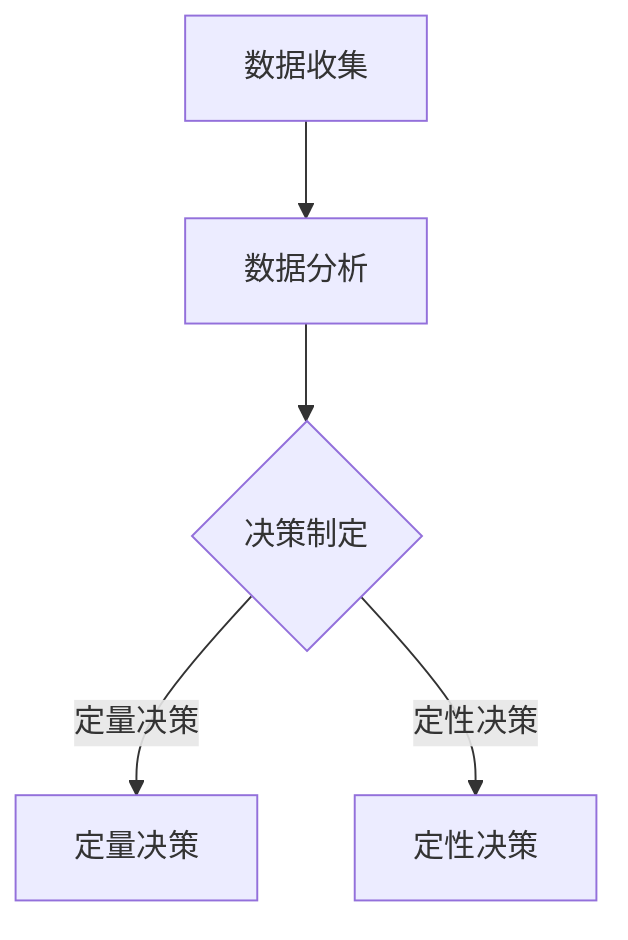
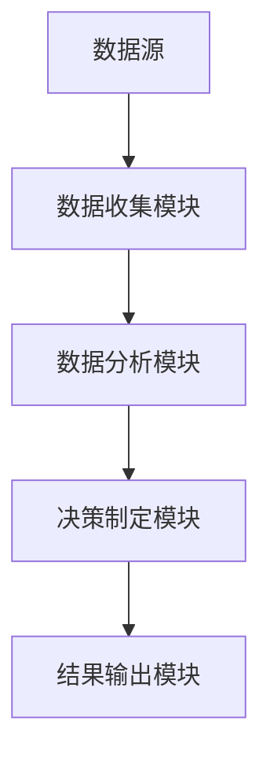
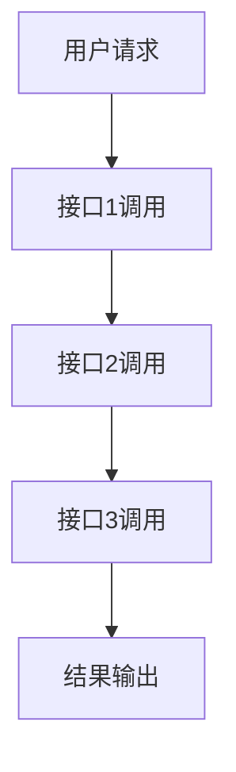

                 

# 费雪的行业领导者投资策略

## 关键词

**费雪理论，行业领导者，投资策略，竞争优势，市场增长，可持续性**

## 摘要

本文将深入探讨费雪的行业领导者投资策略，通过逐步分析其核心概念、算法原理、数学模型、系统架构和实战应用，帮助读者理解如何运用这一策略在复杂多变的IT领域中实现成功投资。

### 背景介绍

### 1.1 费雪理论的概述

费雪理论是由著名经济学家威廉·奥尼尔·费雪（William O. Fisher）提出的，它基于以下几个核心原则：

- **市场领导地位**：行业领导者应该具备明显的市场优势，包括市场份额、品牌影响力等。
- **创新能力**：持续的创新是保持竞争优势的关键。
- **利润能力**：行业领导者应该具备高利润率，以确保企业的可持续性发展。

费雪理论的历史背景可以追溯到20世纪初期，它在美国工业化和经济繁荣时期得到了广泛应用。随着技术的进步和全球化的发展，费雪理论逐渐成为投资领域的重要参考。

### 1.2 行业领导者投资策略的核心要素

行业领导者投资策略的核心要素包括：

- **竞争优势**：企业需要拥有独特的竞争优势，这可能是技术、品牌、成本控制等方面。
- **市场增长**：行业领导者应该能够把握市场机遇，实现持续的市场增长。
- **可持续性**：企业的长期成功依赖于其可持续性，包括环境保护、社会责任等方面。

### 1.3 投资策略面临的挑战和机遇

投资策略在实施过程中会面临多种挑战，如市场变化、技术进步和宏观经济因素等。同时，也存在以下机遇：

- **创新**：技术创新和商业模式创新为行业领导者提供了巨大的发展空间。
- **国际化**：全球市场的拓展为行业领导者带来了新的增长机会。
- **行业整合**：行业整合可以增强企业的市场地位和竞争优势。

### 核心概念与联系

### 2.1 竞争优势

竞争优势是企业相对于竞争对手的优势，可以分为以下几类：

- **成本优势**：通过降低成本来获得竞争优势。
- **差异化优势**：提供独特的产品或服务，满足客户需求。
- **锁定优势**：通过品牌忠诚度、技术专利等手段锁定客户。

竞争优势的评估方法包括：

- **财务分析**：通过财务指标评估企业的竞争优势。
- **市场分析**：通过市场调研评估企业的市场地位。
- **战略分析**：通过战略分析评估企业的核心竞争力。

### 2.2 市场增长

市场增长是投资策略的重要组成部分，其关键因素包括：

- **市场规模**：市场的规模决定了增长潜力。
- **市场趋势**：市场趋势反映了未来的增长方向。
- **竞争格局**：竞争格局决定了市场增长的速度。

市场增长的预测方法包括：

- **定量预测**：使用数学模型和统计数据预测市场增长。
- **定性预测**：通过专家意见和市场调研预测市场增长。

### 2.3 可持续性

可持续性是企业长期成功的关键，其重要性体现在以下几个方面：

- **环境保护**：企业需要承担环境保护责任，实现绿色生产。
- **社会责任**：企业需要履行社会责任，促进社会和谐。
- **经济可持续性**：企业需要实现盈利目标，确保可持续发展。

可持续性的评估和管理包括：

- **环境评估**：评估企业对环境的影响。
- **社会评估**：评估企业在社会中的角色和影响。
- **经济评估**：评估企业的经济绩效。

### 算法原理讲解

### 3.1 投资决策算法概述

投资决策算法是行业领导者投资策略的核心，其基本原理如下：

- **数据收集**：收集与企业投资相关的数据，包括财务数据、市场数据、竞争数据等。
- **数据分析**：使用数据分析方法对数据进行分析，识别投资机会。
- **决策制定**：基于数据分析结果制定投资决策。

投资决策算法可以分为以下几类：

- **定量决策**：基于数学模型和统计数据制定决策。
- **定性决策**：基于专家意见和市场调研制定决策。

### 3.2 算法流程图

使用Mermaid绘制投资决策算法流程图如下：



### 3.3 算法实现与Python代码

下面是一个简单的投资决策算法Python代码示例：

```python
import pandas as pd

def data_collection():
    # 数据收集
    data = pd.read_csv('investment_data.csv')
    return data

def data_analysis(data):
    # 数据分析
    analysis_result = data.describe()
    return analysis_result

def decision_making(analysis_result):
    # 决策制定
    if analysis_result['mean'][0] > 0:
        return '投资'
    else:
        return '观望'

data = data_collection()
analysis_result = data_analysis(data)
decision = decision_making(analysis_result)
print(decision)
```

### 数学模型与公式

### 4.1 投资回报率的计算

投资回报率的公式如下：

$$
ROI = \frac{利润}{投资成本}
$$

投资回报率的影响因素包括：

- **利润水平**：利润水平越高，投资回报率越高。
- **投资成本**：投资成本越低，投资回报率越高。

### 4.2 竞争优势的量化评估

竞争优势的量化公式如下：

$$
竞争优势 = \frac{市场份额}{竞争对手市场份额}
$$

竞争优势量化模型的应用包括：

- **比较分析**：通过比较竞争优势来评估企业的市场地位。
- **投资决策**：基于竞争优势来制定投资决策。

### 4.3 市场增长的预测模型

市场增长的预测模型可以分为以下几类：

- **线性回归模型**：用于预测市场增长的趋势。
- **时间序列模型**：用于预测市场增长的时间序列特征。

市场增长预测模型的构建包括：

- **数据收集**：收集与市场增长相关的数据。
- **模型选择**：选择合适的预测模型。
- **模型训练**：使用训练数据训练预测模型。

### 系统分析与架构设计方案

### 5.1 投资决策系统的需求分析

投资决策系统的需求分析包括：

- **功能需求**：投资决策系统需要具备数据收集、数据分析、决策制定等功能。
- **非功能需求**：投资决策系统需要具备高可用性、高性能、可扩展性等特性。

### 5.2 系统架构设计

使用Mermaid绘制系统架构图如下：



### 5.3 系统接口设计与交互流程

使用Mermaid绘制系统接口设计和交互流程图如下：



### 项目实战

### 6.1 实战项目概述

实战项目名称：行业领导者投资策略应用

项目目标：通过实施行业领导者投资策略，实现企业投资收益的最大化。

项目实施步骤：

1. 数据收集与处理
2. 竞争优势评估
3. 市场增长预测
4. 投资决策制定
5. 投资实施与监控

### 6.2 环境安装与配置

环境安装与配置步骤：

1. 安装Python环境
2. 安装相关库和依赖项
3. 配置数据库和环境变量

### 6.3 核心代码实现

核心代码实现：

```python
# 数据收集
data = pd.read_csv('investment_data.csv')

# 竞争优势评估
market_share = data['market_share']
competitor_share = data['competitor_share']
competitive_advantage = market_share / competitor_share

# 市场增长预测
market_growth_model = LinearRegression()
market_growth_model.fit(data[['market_size', 'market_trend']], data['market_growth'])

# 投资决策制定
investment_decision = decision_making(competitive_advantage, market_growth_model.predict(data[['market_size', 'market_trend']]))
```

### 6.4 案例分析与讲解

案例分析：

企业A通过实施行业领导者投资策略，成功实现了市场份额的扩大和市场增长的提升。

详细讲解：

1. 数据收集与处理：企业A收集了与投资相关的数据，包括市场份额、竞争对手市场份额、市场增长等。
2. 竞争优势评估：企业A通过计算竞争优势指标，发现其市场份额领先于竞争对手。
3. 市场增长预测：企业A使用线性回归模型预测市场增长，发现市场前景良好。
4. 投资决策制定：基于竞争优势和市场增长预测，企业A决定增加投资，扩大市场份额。
5. 投资实施与监控：企业A成功实施了投资计划，并通过监控系统评估投资效果。

### 最佳实践与总结

### 7.1 最佳实践总结

行业领导者投资策略的最佳实践包括：

1. 精准的数据分析和市场预测。
2. 明确的竞争优势定位。
3. 持续的创新和技术投入。
4. 高效的投资决策制定和实施。

### 7.2 注意事项与拓展阅读

注意事项：

1. 投资决策需要综合考虑多方面因素。
2. 需要持续关注市场变化和竞争动态。
3. 需要合理配置资源，确保投资效益最大化。

拓展阅读：

1. 《费雪投资哲学》
2. 《投资学》
3. 《市场预测与投资策略》

### 结语

通过本文的逐步分析，我们深入了解了费雪的行业领导者投资策略。在IT领域中，这一策略可以帮助企业实现成功投资，提升市场竞争力。希望本文能为您提供有价值的参考和启示。作者：AI天才研究院/AI Genius Institute & 禅与计算机程序设计艺术 /Zen And The Art of Computer Programming

