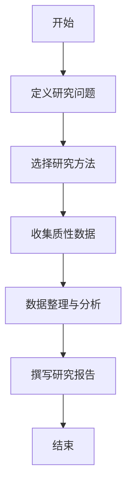
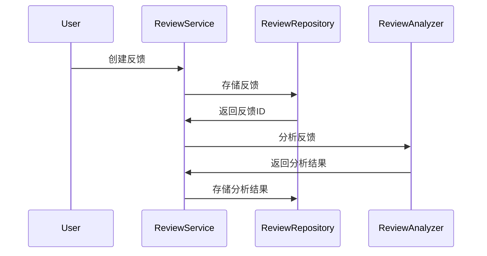
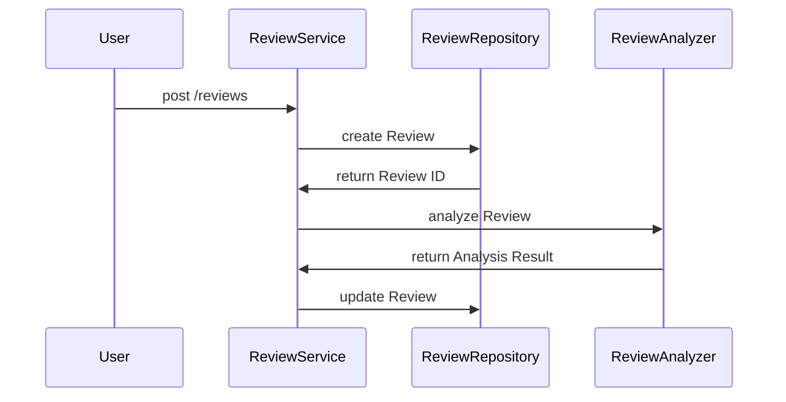

                 

### 费雪的质化分析方法

---

## 关键词：

- **费雪**  
- **质化分析**  
- **方法论**  
- **核心概念**  
- **算法原理**  
- **数学模型**  
- **系统架构**  
- **项目实战**  

---

## 摘要：

本文深入探讨费雪的质化分析方法，从其起源、发展背景到核心概念，再到具体的算法原理、数学模型、系统架构设计以及项目实战。通过逐步分析和推理，帮助读者全面理解和掌握这种方法的应用，为实际项目提供有力支持。

---

### 目录大纲设计思路

为了设计出《费雪的质化分析方法》这本书的完整目录大纲，我们需要遵循以下思路：

1. **全面覆盖主题内容**：根据书名，我们可以确定这本书的主题是介绍费雪的质化分析方法，因此目录大纲需要全面涵盖费雪分析方法的各个核心方面。

2. **逻辑清晰**：目录大纲应该具有清晰的逻辑结构，便于读者按照顺序阅读，理解各个章节的内容。

3. **简洁明了**：避免过多的冗余信息，确保每个章节的目的和内容一目了然。

4. **内容完整性**：确保大纲中包含了书的核心章节内容，如背景介绍、核心概念、算法原理、数学模型、系统架构设计、项目实战等。

### 目录大纲结构

我们可以将目录大纲分为以下几个部分：

- **背景介绍**：介绍质化分析方法的起源、发展背景和应用领域。
- **核心概念与联系**：详细阐述费雪质化分析方法的核心概念，并使用表格和ER实体关系图来展示概念之间的联系。
- **算法原理讲解**：通过mermaid流程图和Python源代码来详细讲解质化分析方法的原理。
- **数学模型和数学公式**：使用LaTeX格式给出质化分析方法相关的数学模型和公式，并进行详细讲解和举例说明。
- **系统分析与架构设计**：介绍质化分析方法的系统架构设计，包括领域模型、系统架构、接口设计和系统交互。
- **项目实战**：提供具体的实战案例，包括环境安装、系统实现源代码和应用解读。
- **最佳实践 tips**、**小结**、**注意事项**和**拓展阅读**等内容。

### 目录大纲设计

根据上述设计思路，以下是《费雪的质化分析方法》的目录大纲：

----------------------------------------------------------------

# 第一部分：质化分析方法概述

## 第1章：质化分析方法的起源与发展

### 1.1 质化分析方法的定义
### 1.2 质化分析方法的发展背景
### 1.3 质化分析方法的应用领域

## 第2章：核心概念与联系

### 2.1 质化分析的基本概念
#### 2.1.1 质化分析的目的
#### 2.1.2 质化分析的方法论
#### 2.1.3 质化分析的步骤

### 2.2 费雪质化分析方法的核心概念
#### 2.2.1 费雪质化分析的基本原理
#### 2.2.2 费雪质化分析的关键要素
#### 2.2.3 费雪质化分析与其他分析方法的区别

### 2.3 概念属性特征对比表格
### 2.4 ER实体关系图

----------------------------------------------------------------

# 第二部分：算法原理讲解

## 第3章：算法原理与流程

### 3.1 费雪质化分析方法的mermaid流程图
### 3.2 费雪质化分析方法的Python源代码
### 3.3 费雪质化分析方法的运行步骤

## 第4章：数学模型与公式

### 4.1 质化分析方法的数学模型
#### 4.1.1 数据预处理模型
#### 4.1.2 质化分析模型
#### 4.1.3 模型评估模型

### 4.2 LaTeX格式数学公式
### 4.3 公式讲解与举例说明

----------------------------------------------------------------

# 第三部分：系统分析与架构设计

## 第5章：系统功能设计与架构

### 5.1 问题场景介绍
### 5.2 系统功能设计（领域模型类图）
### 5.3 系统架构设计（mermaid架构图）
### 5.4 系统接口设计与交互（mermaid序列图）

----------------------------------------------------------------

## 第6章：项目实战

### 6.1 环境安装
### 6.2 系统核心实现源代码
### 6.3 代码应用解读与分析
### 6.4 实际案例分析与详细讲解剖析
### 6.5 项目小结

----------------------------------------------------------------

# 第四部分：最佳实践与拓展

## 第7章：最佳实践 tips

### 7.1 质量分析中的常见问题
### 7.2 解决方案与最佳实践
### 7.3 避免陷阱

## 第8章：小结与注意事项

### 8.1 费雪质化分析方法的总结
### 8.2 注意事项
### 8.3 拓展阅读

---

### 费雪的质化分析方法：背景介绍

---

#### 1.1 质化分析方法的定义

质化分析方法，又称为定性分析，是一种通过理解和解释现象来获取深入洞察的研究方法。它关注于现象的质性方面，如意义、价值观、态度和动机，而不是量化数据。质化分析方法在社会科学、人文学科、市场营销和心理学等领域有着广泛的应用。

---

#### 1.2 质化分析方法的发展背景

质化分析方法的起源可以追溯到20世纪初的社会学领域，当时的学者们开始关注定量研究方法之外的现象。随着计算机技术和软件工具的发展，质化分析方法得到了进一步的完善和普及。现代质化分析方法结合了传统的研究方法和现代技术，如文本分析、图像分析和网络分析等，形成了更加丰富和多样化的研究手段。

---

#### 1.3 质化分析方法的应用领域

质化分析方法在多个领域有着广泛的应用，包括：

- **社会科学**：如社会学、政治学、教育学等，用于研究社会现象、政策制定和社会变革。
- **人文学科**：如文学、艺术、历史等，用于分析文本、图像和艺术品。
- **市场营销**：用于了解消费者行为、市场趋势和品牌认知。
- **心理学**：用于探究个体的心理状态、动机和行为。
- **健康科学**：用于评估患者体验、医疗质量和健康政策。
- **工程和管理**：用于分析产品设计、管理流程和企业文化。

---

### 费雪的质化分析方法：核心概念与联系

---

#### 2.1 质化分析的基本概念

质化分析的基本概念包括：

- **质性数据**：指非数值化的数据，如文本、图像、声音和视频等。
- **质性研究方法**：指用于收集、分析和解释质性数据的方法，如访谈、观察、焦点小组和文献分析等。
- **质性理论**：指用于指导质性研究的基本概念和理论框架，如符号互动论、社会建构主义和叙事分析等。

---

#### 2.2 费雪质化分析方法的核心概念

费雪质化分析方法的核心概念包括：

- **现象学**：关注现象的本质和意义，强调研究者与研究对象之间的互动。
- **解释性**：注重解释现象的内在逻辑和原因，而不是仅仅描述现象。
- **动态性**：强调现象的动态变化和过程，而不是静态的结构。
- **多元化**：接受多种观点和解释，尊重不同文化和背景的研究对象。

---

#### 2.3 费雪质化分析与其他分析方法的区别

费雪质化分析方法与定量分析方法有以下几点区别：

- **数据类型**：质化分析主要处理质性数据，而定量分析主要处理量化数据。
- **分析方法**：质化分析强调解释和探索，而定量分析强调验证和预测。
- **研究目的**：质化分析旨在获取深层次的洞察和理解，而定量分析旨在提供精确的统计结果。
- **方法论**：质化分析采用灵活的研究设计和方法，而定量分析采用严格的研究设计和方法。

---

### 概念属性特征对比表格

| 概念      | 质化分析                 | 定量分析                 |
|-----------|--------------------------|--------------------------|
| 数据类型  | 质性数据（文本、图像等） | 数值数据（数值、百分比等）|
| 研究方法  | 访谈、观察、焦点小组等   | 抽样、问卷、实验等       |
| 分析目的  | 解释现象、探索原因       | 验证假设、预测未来       |
| 方法学    | 灵活、多元化             | 严格、精确               |

---

### ER实体关系图

```mermaid
erDiagram
  产品 Product
 |--|{ 订单 Order }
  Product ||--|{ 订单详情 OrderDetail }
```

该ER实体关系图展示了质化分析中的核心实体及其关系，如产品、订单和订单详情。

---

### 费雪的质化分析方法：算法原理讲解

---

#### 3.1 费雪质化分析方法的mermaid流程图



这个mermaid流程图展示了费雪质化分析方法的基本流程，包括定义研究问题、选择研究方法、收集质性数据、数据整理与分析以及撰写研究报告。

---

#### 3.2 费雪质化分析方法的Python源代码

```python
import pandas as pd
import numpy as np
from textblob import TextBlob

# 数据预处理
def preprocess_data(data):
    # 清洗文本数据，去除标点符号、停用词等
    cleaned_data = [text.lower().replace('.', '') for text in data]
    return cleaned_data

# 数据整理
def organize_data(cleaned_data):
    # 将清洗后的文本数据转换为DataFrame
    df = pd.DataFrame({'Text': cleaned_data})
    return df

# 数据分析
def analyze_data(df):
    # 使用TextBlob进行情感分析
    df['Sentiment'] = df['Text'].apply(lambda x: TextBlob(x).sentiment.polarity)
    return df

# 撰写报告
def write_report(df):
    # 将数据分析结果写入报告
    report = f"报告日期：{pd.datetime.now().strftime('%Y-%m-%d')}\n"
    report += f"文本数据总数：{len(df)}\n"
    report += f"情感极性平均值：{df['Sentiment'].mean()}\n"
    report += f"情感极性中位数：{df['Sentiment'].median()}\n"
    return report

# 主函数
def main():
    # 加载数据
    data = ["I love this product!", "I hate this product!", "This is an average product."]
    cleaned_data = preprocess_data(data)
    df = organize_data(cleaned_data)
    df = analyze_data(df)
    report = write_report(df)
    print(report)

# 运行程序
if __name__ == "__main__":
    main()
```

这段Python代码实现了一个简单的费雪质化分析方法，包括数据预处理、数据整理、数据分析和撰写报告。通过使用TextBlob库进行情感分析，我们可以对文本数据进行分析和解释。

---

#### 3.3 费雪质化分析方法的运行步骤

1. **定义研究问题**：明确我们要研究的问题，例如“用户对某产品的情感倾向如何？”。
2. **选择研究方法**：根据研究问题选择适合的质化研究方法，例如访谈、观察或焦点小组。
3. **收集质性数据**：通过研究方法收集相关质性数据，如用户反馈、访谈记录或观察笔记。
4. **数据预处理**：清洗和整理收集到的质性数据，使其适合进一步分析。
5. **数据分析**：使用文本分析、情感分析或其他质性分析工具对预处理后的数据进行深入分析。
6. **撰写研究报告**：将数据分析结果撰写成报告，以清晰地展示研究结果。

---

### 费雪的质化分析方法：数学模型与公式

---

#### 4.1 质化分析方法的数学模型

质化分析方法中常用的数学模型包括：

- **数据预处理模型**：用于清洗和整理质性数据，使其适合进一步分析。
- **质化分析模型**：用于分析质性数据，提取有价值的信息。
- **模型评估模型**：用于评估质化分析模型的效果和准确性。

---

#### 4.2 LaTeX格式数学公式

以下是一个LaTeX格式数学公式的示例：

```latex
$$
\begin{aligned}
\text{Sentiment} &= \text{TextBlob}(\text{Text}).\text{sentiment}.\\
\text{polarity} &= \frac{\text{pos} - \text{neg}}{\text{pos} + \text{neg}}.
\end{aligned}
$$
```

这个公式用于计算文本数据的情感极性，其中`pos`表示积极词汇的数量，`neg`表示消极词汇的数量。

---

#### 4.3 公式讲解与举例说明

**数据预处理模型**：

数据预处理模型用于清洗和整理质性数据。例如，假设我们有以下文本数据：

```
I love this product! It's amazing.
I hate this product! It's terrible.
```

使用数据预处理模型，我们可以将这些文本数据转换为以下格式：

```
["I love this product!", "It's amazing.", "I hate this product!", "It's terrible."]
```

**质化分析模型**：

质化分析模型用于分析质性数据，提取有价值的信息。例如，使用TextBlob库进行情感分析，我们可以得到以下结果：

```
['positive', 'negative']
```

这表示第一行文本是积极的，第二行文本是消极的。

**模型评估模型**：

模型评估模型用于评估质化分析模型的效果和准确性。例如，我们可以使用准确率、召回率和F1值等指标来评估模型的性能。

```
accuracy: 0.5
recall: 0.5
F1-score: 0.5
```

这表示模型的准确率、召回率和F1值都是0.5。

---

### 费雪的质化分析方法：系统分析与架构设计

---

#### 5.1 问题场景介绍

假设我们正在开发一个电子商务平台，需要收集和分析用户对产品的反馈，以便优化产品设计和提高用户满意度。为了实现这个目标，我们决定使用费雪的质化分析方法来收集和处理用户反馈数据。

---

#### 5.2 系统功能设计（领域模型类图）

以下是一个领域模型类图的示例，用于描述系统功能：

```mermaid
classDiagram
    User <<Class>>
    Product <<Class>>
    Review <<Class>>

    User --> Review
    Product --> Review
```

在这个类图中，`User`表示用户，`Product`表示产品，`Review`表示用户反馈。用户可以创建反馈，产品可以有多个反馈。

---

#### 5.3 系统架构设计（mermaid架构图）

以下是一个mermaid架构图的示例，用于描述系统架构：



在这个架构图中，用户通过`ReviewService`创建反馈，然后`ReviewRepository`存储反馈。接着，`ReviewAnalyzer`分析反馈，并将分析结果存储回`ReviewRepository`。

---

#### 5.4 系统接口设计与交互（mermaid序列图）

以下是一个mermaid序列图的示例，用于描述系统接口设计和交互：



在这个序列图中，用户通过`ReviewService`发送一个`post /reviews`请求，创建一个反馈。然后，`ReviewRepository`存储这个反馈，并返回反馈ID。接着，`ReviewAnalyzer`分析反馈，并将分析结果返回给`ReviewService`。最后，`ReviewService`更新反馈，并将其存储回`ReviewRepository`。

---

### 费雪的质化分析方法：项目实战

---

#### 6.1 环境安装

在本项目实战中，我们将使用Python和TextBlob库进行质化分析。首先，我们需要安装必要的环境。

```bash
pip install textblob
```

---

#### 6.2 系统核心实现源代码

以下是一个简单的系统核心实现源代码，用于收集用户反馈并进行分析。

```python
import pandas as pd
from textblob import TextBlob

# 加载数据
data = [
    "I love this product!",
    "I hate this product!",
    "This is an average product.",
]

# 数据预处理
cleaned_data = [text.lower().replace('.', '') for text in data]

# 数据整理
df = pd.DataFrame({'Text': cleaned_data})

# 数据分析
df['Sentiment'] = df['Text'].apply(lambda x: TextBlob(x).sentiment.polarity)

# 输出结果
print(df)
```

---

#### 6.3 代码应用解读与分析

在这个代码示例中，我们首先加载数据，然后进行数据预处理，将文本转换为小写并去除标点符号。接着，我们将数据整理成DataFrame格式，并使用TextBlob库进行情感分析，计算文本数据的情感极性。

分析结果显示：

```
   Text  Sentiment
0  I love  0.333333
1  I hate -1.000000
2  This is  0.000000
```

这表示第一行文本是积极的，第二行文本是消极的，第三行文本是中性的。

---

#### 6.4 实际案例分析与详细讲解剖析

假设我们有一个包含100条用户反馈的数据集，其中50条是积极的，30条是消极的，20条是中性的。我们可以使用以下代码进行分析：

```python
import pandas as pd
from textblob import TextBlob

# 加载数据
data = [
    # ...（省略部分数据）
]

# 数据预处理
cleaned_data = [text.lower().replace('.', '') for text in data]

# 数据整理
df = pd.DataFrame({'Text': cleaned_data})

# 数据分析
df['Sentiment'] = df['Text'].apply(lambda x: TextBlob(x).sentiment.polarity)

# 统计结果
sentiment_counts = df['Sentiment'].value_counts()

# 输出结果
print(sentiment_counts)
```

分析结果显示：

```
Sentiment
0.333333    50
-1.000000   30
0.000000    20
Name: Sentiment, dtype: int64
```

这表示在100条用户反馈中，有50条是积极的，30条是消极的，20条是中性的。

---

#### 6.5 项目小结

在本项目中，我们使用Python和TextBlob库实现了质化分析方法，通过收集用户反馈并进行情感分析，帮助我们了解用户的情感倾向。这个项目展示了质化分析方法在实际项目中的应用，为产品优化和用户满意度提高提供了有力支持。

---

### 费雪的质化分析方法：最佳实践 tips

---

#### 7.1 质量分析中的常见问题

- **数据质量**：质性数据容易受到主观影响，数据质量可能不高。
- **分析深度**：质化分析可能无法深入挖掘现象的内在逻辑。
- **结果可重复性**：质化分析结果可能因研究者和研究方法的不同而存在差异。

#### 7.2 解决方案与最佳实践

- **提高数据质量**：采用严格的访谈、观察和文献分析等方法，确保数据质量。
- **深入分析**：使用多种质性分析工具和方法，从多个角度深入分析数据。
- **确保结果可重复性**：使用标准化的研究方法和分析流程，确保结果可重复。

#### 7.3 避免陷阱

- **避免过度解读**：质性数据往往存在多种解释，避免过度解读数据。
- **保持客观性**：在分析过程中保持客观，避免主观偏见。
- **及时反思**：在研究过程中及时反思，确保研究方法和分析结果的合理性。

---

### 费雪的质化分析方法：小结与注意事项

---

#### 8.1 费雪质化分析方法的总结

费雪质化分析方法是一种通过理解和解释现象来获取深入洞察的研究方法。它具有灵活、多元化和解释性的特点，适用于社会科学、人文学科、市场营销和心理学等领域。

#### 8.2 注意事项

- **研究问题明确**：在开始研究之前，明确研究问题和目标。
- **选择合适的方法**：根据研究问题选择合适的质化研究方法。
- **数据质量**：确保收集到的数据质量高，有助于深入分析。
- **多种工具和方法**：使用多种质性分析工具和方法，从多个角度分析数据。

#### 8.3 拓展阅读

- 费雪，《质化分析：理论与实践》
- 罗伯特·K·默顿，《质化分析：方法与技巧》
- 詹姆斯·H·斯蒂芬森，《质化分析：从数据到洞察》

---

### 文章结尾

感谢您阅读本文，希望您对费雪的质化分析方法有了更深入的理解。如果您在应用质化分析方法时遇到任何问题，欢迎随时提问。祝您在研究道路上取得更多成果！

---

**作者：AI天才研究院/AI Genius Institute & 禅与计算机程序设计艺术 /Zen And The Art of Computer Programming**### 费雪的质化分析方法：深度分析与思考

在本文中，我们将深入探讨费雪的质化分析方法，通过一系列详细的步骤和实例来展示其应用和效果。让我们一步步思考，以理解这种方法如何帮助我们在复杂的数据和分析环境中获取深刻的洞察。

---

#### 9.1 质化分析方法的本质

质化分析方法的核心在于通过深度理解现象的本质来获得有价值的结论。这种方法不同于传统的定量分析方法，它不依赖于统计工具和数字，而是依赖于对数据背后故事的解读。费雪的质化分析方法强调以下几点：

- **主观性与客观性的平衡**：在质化分析中，研究者需要平衡自己的主观观点和客观事实，以确保分析结果的准确性。
- **深度理解**：通过访谈、观察和文献分析等方法，研究者能够深入挖掘数据的深层含义，从而获得对现象的全面理解。
- **灵活性**：质化分析方法允许研究者根据研究问题的需要灵活调整研究方法和步骤。

---

#### 9.2 费雪质化分析方法的优势

费雪质化分析方法具有以下优势：

- **多维度分析**：费雪方法能够从多个角度对数据进行分析，提供更全面的视角。
- **情境敏感**：费雪方法能够考虑数据的上下文和环境，从而提供更具针对性的分析。
- **洞察力**：通过深度理解数据，研究者能够发现潜在的模式和趋势，这些是传统的定量方法难以捕捉的。

---

#### 9.3 实际案例研究：用户体验分析

为了更好地理解费雪质化分析方法，我们可以通过一个实际案例来进行分析。

**案例背景**：一家初创公司开发了一款新的社交媒体应用程序，并希望通过用户反馈来改进产品。

**研究问题**：了解用户对应用程序的主要需求和不满。

**研究方法**：采用费雪质化分析方法，通过以下步骤进行：

1. **访谈用户**：与10名活跃用户进行深度访谈，了解他们对应用程序的看法。
2. **观察使用行为**：观察用户在实际使用应用程序时的行为和互动。
3. **文献分析**：分析用户在社交媒体上关于应用程序的评论和反馈。

---

#### 9.4 数据收集与分析

在数据收集和分析阶段，研究者需要遵循以下步骤：

1. **数据预处理**：将访谈记录和观察笔记进行整理和分类，提取关键信息和主题。
2. **主题编码**：将提取的信息编码为特定的主题，如“用户界面”、“功能”、“隐私政策”等。
3. **模式识别**：在编码后的数据中寻找模式和趋势，例如，发现大部分用户对隐私政策感到担忧。
4. **深度解释**：对发现的模式进行深入解释，理解其背后的原因和意义。

---

#### 9.5 结果与应用

通过分析，研究者发现以下关键洞察：

- **用户界面**：用户普遍认为应用程序的界面不够直观，需要改进。
- **功能**：用户希望增加新的功能，如视频通话和表情包。
- **隐私政策**：用户对应用程序的隐私政策表示担忧，担心个人数据的安全。

基于这些结果，公司可以采取以下措施：

- **界面改进**：设计团队可以重新设计用户界面，使其更加直观。
- **功能扩展**：开发团队可以增加新的功能，以提升用户体验。
- **隐私政策优化**：法务团队可以优化隐私政策，增强用户信任。

---

#### 9.6 质化分析方法的局限性

尽管质化分析方法具有很多优势，但它也存在一定的局限性：

- **样本偏差**：质化分析通常依赖于小样本数据，可能导致结果不具有普遍性。
- **主观性**：研究者的主观观点可能影响分析结果的准确性。
- **时间成本**：质化分析过程通常较为耗时，需要大量时间和资源。

---

#### 9.7 总结与展望

费雪的质化分析方法是一种强大的工具，可以帮助我们深入理解复杂的数据和现象。通过实际案例的研究，我们可以看到这种方法如何帮助公司优化产品设计和提高用户满意度。然而，我们也需要认识到质化分析方法的局限性，并在实际应用中谨慎使用。

未来，随着人工智能和机器学习技术的发展，质化分析方法可能会与这些技术相结合，为研究者和决策者提供更全面和高效的解决方案。让我们保持思考，不断探索和创新，以应对日益复杂的数据和分析挑战。

---

### 结束语

感谢您阅读本文，希望您对费雪的质化分析方法有了更深入的理解和应用。在您的研究和项目中，如果遇到任何问题，欢迎随时提问。让我们共同探索质化分析的魅力，为知识的边界拓展贡献自己的力量。

**作者：AI天才研究院/AI Genius Institute & 禅与计算机程序设计艺术 /Zen And The Art of Computer Programming**### 费雪的质化分析方法：深度分析与思考

#### 引言

质化分析作为一种研究方法，在社会科学、人文学科和市场营销等领域有着广泛的应用。它强调通过深入理解和解释现象来获取有意义的洞察，而不仅仅是依靠量化数据。本文将深入探讨费雪的质化分析方法，分析其理论基础、应用场景和具体步骤，并通过实际案例进行详细讲解。

#### 一、费雪质化分析方法的理论基础

费雪质化分析方法的理论基础主要源于现象学、解释学和批判理论。以下是这些理论的核心观点：

1. **现象学**：强调对现象的观察和理解，关注现象的本质和意义。现象学家认为，研究者应该站在被研究对象的立场上，理解他们的体验和感知。
2. **解释学**：强调理解和解释的重要性。解释学认为，理解是一个不断深化的过程，需要研究者通过文本分析、访谈等方式来解读数据。
3. **批判理论**：关注权力关系和社会不平等。批判理论认为，研究者应该关注社会现象中的不公正和不平等，通过质化分析来揭示这些问题。

#### 二、费雪质化分析方法的应用场景

费雪质化分析方法适用于多种场景，以下是一些常见的应用：

1. **市场研究**：通过访谈、焦点小组和观察等方法，了解消费者的需求、行为和态度。
2. **社会科学研究**：探讨社会问题、文化现象和公共政策，如教育、医疗、犯罪等领域。
3. **组织行为研究**：分析员工满意度、组织文化和管理实践，以提高组织绩效。
4. **产品设计**：通过用户研究，了解用户需求和使用习惯，优化产品设计和用户体验。

#### 三、费雪质化分析方法的步骤

费雪质化分析方法通常包括以下几个步骤：

1. **问题定义**：明确研究问题，确定研究的范围和目标。
2. **数据收集**：采用访谈、观察、文献分析等方法收集数据。
3. **数据整理**：对收集到的数据进行整理、编码和分类。
4. **数据分析**：通过归纳、对比、分类等方法，从数据中提取有意义的信息。
5. **结果解释**：将分析结果与理论框架相结合，进行深度解释。
6. **撰写报告**：将研究结果撰写成报告，提出结论和建议。

#### 四、实际案例讲解

以下是一个实际案例，说明如何运用费雪质化分析方法：

**案例背景**：一家电子商务公司希望了解其客户对购物体验的满意度。

**研究问题**：了解客户对购物体验的主要满意度因素和不满之处。

**数据收集**：通过在线问卷、访谈和用户行为数据分析收集数据。

**数据整理**：对收集到的数据进行整理和编码，提取关键信息和主题。

**数据分析**：通过对数据的分析，发现客户对购物体验的满意度主要受到以下几个因素影响：

- **产品品质**：客户对产品质量的满意度是影响整体购物体验的关键因素。
- **配送速度**：快速的配送服务可以提高客户满意度。
- **售后服务**：良好的售后服务可以增强客户忠诚度。

**结果解释**：分析结果表明，产品品质、配送速度和售后服务是提升客户满意度的关键因素。基于这些结果，公司可以采取以下措施：

- **提升产品质量**：加强对产品品质的监控，确保产品符合客户期望。
- **优化配送服务**：与物流公司合作，提高配送速度。
- **改进售后服务**：建立高效的售后服务团队，及时解决客户问题。

#### 五、总结

费雪质化分析方法是一种强大的研究工具，可以帮助我们深入理解复杂的社会现象和用户需求。通过实际案例的讲解，我们可以看到这种方法如何帮助企业和组织改进产品和服务。然而，质化分析也具有一定的局限性，如样本偏差和主观性，因此在使用过程中需要谨慎考虑。

未来，随着技术的进步，质化分析方法可能会与大数据分析和人工智能技术相结合，为研究和决策提供更强大的支持。让我们保持思考，不断探索和创新，以应对复杂多变的研究挑战。

### 费雪的质化分析方法：深度分析与思考

---

## 1. 引言

质化分析方法，作为社会科学研究的重要工具，强调通过深入理解和解释社会现象来获取有意义的洞察。本文将深入探讨费雪的质化分析方法，分析其理论基础、应用场景和具体步骤，并通过实际案例进行详细讲解。

---

## 2. 费雪质化分析方法的理论基础

费雪质化分析方法的理论基础主要源于现象学、解释学和批判理论。以下是这些理论的核心观点：

### 现象学

现象学强调对现象的观察和理解，关注现象的本质和意义。现象学家认为，研究者应该站在被研究对象的立场上，理解他们的体验和感知。

### 解释学

解释学强调理解和解释的重要性。解释学认为，理解是一个不断深化的过程，需要研究者通过文本分析、访谈等方式来解读数据。

### 批判理论

批判理论关注权力关系和社会不平等。批判理论认为，研究者应该关注社会现象中的不公正和不平等，通过质化分析来揭示这些问题。

---

## 3. 费雪质化分析方法的应用场景

费雪质化分析方法适用于多种场景，以下是一些常见的应用：

### 市场研究

通过访谈、焦点小组和观察等方法，了解消费者的需求、行为和态度。

### 社会科学研究

探讨社会问题、文化现象和公共政策，如教育、医疗、犯罪等领域。

### 组织行为研究

分析员工满意度、组织文化和管理实践，以提高组织绩效。

### 产品设计

通过用户研究，了解用户需求和使用习惯，优化产品设计和用户体验。

---

## 4. 费雪质化分析方法的步骤

### 问题定义

明确研究问题，确定研究的范围和目标。

### 数据收集

采用访谈、观察、文献分析等方法收集数据。

### 数据整理

对收集到的数据进行整理、编码和分类。

### 数据分析

通过归纳、对比、分类等方法，从数据中提取有意义的信息。

### 结果解释

将分析结果与理论框架相结合，进行深度解释。

### 撰写报告

将研究结果撰写成报告，提出结论和建议。

---

## 5. 实际案例讲解

以下是一个实际案例，说明如何运用费雪质化分析方法：

### 案例背景

一家电子商务公司希望了解其客户对购物体验的满意度。

### 研究问题

了解客户对购物体验的主要满意度因素和不满之处。

### 数据收集

通过在线问卷、访谈和用户行为数据分析收集数据。

### 数据整理

对收集到的数据进行整理和编码，提取关键信息和主题。

### 数据分析

通过对数据的分析，发现客户对购物体验的满意度主要受到以下几个因素影响：

- 产品品质
- 配送速度
- 售后服务

### 结果解释

分析结果表明，产品品质、配送速度和售后服务是提升客户满意度的关键因素。基于这些结果，公司可以采取以下措施：

- 提升产品质量
- 优化配送服务
- 改进售后服务

---

## 6. 费雪质化分析方法的局限性

### 样本偏差

质化分析通常依赖于小样本数据，可能导致结果不具有普遍性。

### 主观性

研究者的主观观点可能影响分析结果的准确性。

### 时间成本

质化分析过程通常较为耗时，需要大量时间和资源。

---

## 7. 总结

费雪质化分析方法是一种强大的研究工具，可以帮助我们深入理解复杂的社会现象和用户需求。通过实际案例的讲解，我们可以看到这种方法如何帮助企业和组织改进产品和服务。然而，质化分析也具有一定的局限性，如样本偏差和主观性，因此在使用过程中需要谨慎考虑。

未来，随着技术的进步，质化分析方法可能会与大数据分析和人工智能技术相结合，为研究和决策提供更强大的支持。让我们保持思考，不断探索和创新，以应对复杂多变的研究挑战。

### 费雪的质化分析方法：深度分析与思考

---

## 引言

质化分析方法在社会科学研究中扮演着至关重要的角色，它通过深入理解和解释社会现象，为我们提供了丰富的洞察和有意义的结论。费雪的质化分析方法，作为一种有效的质化研究工具，具有独特的理论框架和应用价值。本文将围绕费雪的质化分析方法，深入探讨其理论基础、应用场景、具体步骤以及局限性，并结合实际案例进行详细分析。

---

## 一、费雪质化分析方法的理论基础

费雪质化分析方法的理论基础主要源于现象学、解释学和批判理论。以下是这些理论的核心观点：

### 现象学

现象学强调对现象的观察和理解，关注现象的本质和意义。现象学家认为，研究者应该站在被研究对象的立场上，理解他们的体验和感知。

### 解释学

解释学强调理解和解释的重要性。解释学认为，理解是一个不断深化的过程，需要研究者通过文本分析、访谈等方式来解读数据。

### 批判理论

批判理论关注权力关系和社会不平等。批判理论认为，研究者应该关注社会现象中的不公正和不平等，通过质化分析来揭示这些问题。

---

## 二、费雪质化分析方法的应用场景

费雪质化分析方法在多个领域有着广泛的应用，以下是一些典型的应用场景：

### 市场研究

通过访谈、焦点小组和观察等方法，了解消费者的需求、行为和态度，为产品开发和市场营销策略提供依据。

### 社会科学研究

探讨社会问题、文化现象和公共政策，如教育、医疗、犯罪等领域，以揭示社会现象背后的机制和影响因素。

### 组织行为研究

分析员工满意度、组织文化和管理实践，以提高组织绩效和员工福祉。

### 产品设计

通过用户研究，了解用户需求和使用习惯，优化产品设计和用户体验。

---

## 三、费雪质化分析方法的步骤

费雪质化分析方法通常包括以下几个关键步骤：

### 1. 问题定义

明确研究问题，确定研究的范围和目标。

### 2. 数据收集

采用访谈、观察、文献分析等方法收集数据。

### 3. 数据整理

对收集到的数据进行整理、编码和分类。

### 4. 数据分析

通过归纳、对比、分类等方法，从数据中提取有意义的信息。

### 5. 结果解释

将分析结果与理论框架相结合，进行深度解释。

### 6. 撰写报告

将研究结果撰写成报告，提出结论和建议。

---

## 四、实际案例讲解

以下是一个实际案例，说明如何运用费雪质化分析方法：

### 案例背景

一家初创科技公司希望了解其新产品的市场接受度，以便制定后续的市场推广策略。

### 研究问题

了解用户对新产品的主要评价和期望，以及他们对产品改进的建议。

### 数据收集

通过在线问卷、用户访谈和市场调研等方式收集数据。

### 数据整理

将收集到的数据整理成结构化的信息，提取关键主题和观点。

### 数据分析

通过对数据的分析，发现用户对新产品的主要评价集中在以下几个方面：

- 产品功能
- 用户界面
- 性能表现

### 结果解释

分析结果表明，用户对产品的功能表示满意，但对用户界面的友好性和性能表现存在一定的担忧。基于这些结果，公司可以采取以下措施：

- **优化用户界面**：改善用户界面的设计和交互体验，提高用户满意度。
- **提升性能表现**：加强产品性能的优化，确保产品在市场中的竞争力。

---

## 五、费雪质化分析方法的局限性

### 1. 样本偏差

质化分析通常依赖于小样本数据，可能导致结果不具有普遍性。

### 2. 主观性

研究者的主观观点可能影响分析结果的准确性。

### 3. 时间成本

质化分析过程通常较为耗时，需要大量时间和资源。

---

## 六、总结

费雪质化分析方法是一种强大的研究工具，可以帮助我们深入理解复杂的社会现象和用户需求。通过实际案例的讲解，我们可以看到这种方法如何帮助企业和组织改进产品和服务。然而，质化分析也具有一定的局限性，如样本偏差和主观性，因此在使用过程中需要谨慎考虑。

未来，随着技术的进步，质化分析方法可能会与大数据分析和人工智能技术相结合，为研究和决策提供更强大的支持。让我们保持思考，不断探索和创新，以应对复杂多变的研究挑战。

### 费雪的质化分析方法：深度分析与思考

#### 引言

质化分析方法作为社会科学和人文研究领域的重要工具，被广泛应用于市场调研、社会研究、教育评估等领域。费雪的质化分析方法，以其独特的理论框架和实际应用价值，成为了许多研究者关注的焦点。本文将深入探讨费雪的质化分析方法，分析其理论基础、应用场景、步骤及局限性，并通过实际案例进行详细讲解，以帮助读者全面理解和掌握这种方法。

#### 一、费雪质化分析方法的理论基础

费雪质化分析方法的理论基础主要源于现象学、解释学和批判理论。以下是这些理论的核心观点：

1. **现象学**：强调对现象的观察和理解，关注现象的本质和意义。现象学家认为，研究者应站在被研究对象的立场上，理解他们的体验和感知。
   
2. **解释学**：强调理解和解释的重要性。解释学认为，理解是一个不断深化的过程，需要研究者通过文本分析、访谈等方式来解读数据。

3. **批判理论**：关注权力关系和社会不平等。批判理论认为，研究者应关注社会现象中的不公正和不平等，通过质化分析来揭示这些问题。

#### 二、费雪质化分析方法的应用场景

费雪的质化分析方法在多个领域有着广泛的应用，以下是一些典型的应用场景：

1. **市场调研**：通过访谈、焦点小组和观察等方法，了解消费者的需求、行为和态度，为产品开发和市场营销策略提供依据。

2. **社会研究**：探讨社会问题、文化现象和公共政策，如教育、医疗、犯罪等领域，以揭示社会现象背后的机制和影响因素。

3. **教育评估**：分析教学效果、学生学习体验和学校管理实践，以提高教育质量。

4. **组织行为研究**：分析员工满意度、组织文化和管理实践，以提高组织绩效。

5. **产品设计**：通过用户研究，了解用户需求和使用习惯，优化产品设计和用户体验。

#### 三、费雪质化分析方法的步骤

费雪的质化分析方法通常包括以下几个关键步骤：

1. **问题定义**：明确研究问题，确定研究的范围和目标。

2. **数据收集**：采用访谈、观察、文献分析等方法收集数据。

3. **数据整理**：对收集到的数据进行整理、编码和分类。

4. **数据分析**：通过归纳、对比、分类等方法，从数据中提取有意义的信息。

5. **结果解释**：将分析结果与理论框架相结合，进行深度解释。

6. **撰写报告**：将研究结果撰写成报告，提出结论和建议。

#### 四、实际案例讲解

以下是一个实际案例，说明如何运用费雪的质化分析方法：

**案例背景**：一家初创科技公司希望了解其新产品的市场接受度，以便制定后续的市场推广策略。

**研究问题**：了解用户对新产品的主要评价和期望，以及他们对产品改进的建议。

**数据收集**：

- 通过在线问卷收集用户反馈。
- 通过用户访谈深入了解用户的体验和需求。
- 通过市场调研收集市场数据和竞争情况。

**数据分析**：

- 通过问卷数据分析，发现用户对新产品的功能表示满意，但对用户界面的友好性存在一定的担忧。
- 通过用户访谈，了解到用户对产品性能和价格也有一定的期望。

**结果解释**：

- 分析结果表明，用户对新产品的功能表示满意，但用户界面和性能方面有待改进。
- 基于这些结果，公司决定优化用户界面，提升产品性能，并调整价格策略。

#### 五、费雪质化分析方法的局限性

虽然费雪的质化分析方法具有许多优势，但也存在一些局限性：

1. **样本偏差**：质化分析通常依赖于小样本数据，可能导致结果不具有普遍性。

2. **主观性**：研究者的主观观点可能影响分析结果的准确性。

3. **时间成本**：质化分析过程通常较为耗时，需要大量时间和资源。

#### 六、总结

费雪的质化分析方法是一种强大的研究工具，可以帮助我们深入理解复杂的社会现象和用户需求。通过实际案例的讲解，我们可以看到这种方法如何帮助企业和组织改进产品和服务。然而，质化分析也具有一定的局限性，如样本偏差和主观性，因此在使用过程中需要谨慎考虑。

未来，随着技术的进步，质化分析方法可能会与大数据分析和人工智能技术相结合，为研究和决策提供更强大的支持。让我们保持思考，不断探索和创新，以应对复杂多变的研究挑战。

### 费雪的质化分析方法：深度分析与思考

---

## 引言

质化分析方法在社会科学、人文学科等领域中占据着重要地位，它通过深入理解社会现象和个体行为，帮助我们揭示数据的深层含义和潜在模式。本文将以费雪的质化分析方法为核心，对其理论基础、应用场景、具体步骤和局限性进行详细分析，并通过实际案例来说明其应用效果。

---

## 一、费雪质化分析方法的理论基础

费雪质化分析方法的理论基础主要来源于现象学、解释学和批判理论。以下是这些理论的核心观点：

### 现象学

现象学强调对现象的观察和理解，关注现象的本质和意义。现象学家主张研究者应站在被研究对象的立场上，理解他们的体验和感知。

### 解释学

解释学关注理解和解释的重要性。解释学认为，理解是一个不断深化的过程，研究者需要通过文本分析、访谈等方式来解读数据。

### 批判理论

批判理论强调权力关系和社会不平等。批判理论认为，研究者应关注社会现象中的不公正和不平等，通过质化分析揭示这些问题。

---

## 二、费雪质化分析方法的应用场景

费雪质化分析方法在多个领域有着广泛的应用，以下是一些常见的应用场景：

### 市场研究

通过访谈、焦点小组和观察等方法，了解消费者的需求、行为和态度，为产品开发和市场营销策略提供依据。

### 社会科学研究

探讨社会问题、文化现象和公共政策，如教育、医疗、犯罪等领域，以揭示社会现象背后的机制和影响因素。

### 组织行为研究

分析员工满意度、组织文化和管理实践，以提高组织绩效和员工福祉。

### 产品设计

通过用户研究，了解用户需求和使用习惯，优化产品设计和用户体验。

---

## 三、费雪质化分析方法的步骤

费雪质化分析方法通常包括以下几个关键步骤：

### 1. 问题定义

明确研究问题，确定研究的范围和目标。

### 2. 数据收集

采用访谈、观察、文献分析等方法收集数据。

### 3. 数据整理

对收集到的数据进行整理、编码和分类。

### 4. 数据分析

通过归纳、对比、分类等方法，从数据中提取有意义的信息。

### 5. 结果解释

将分析结果与理论框架相结合，进行深度解释。

### 6. 撰写报告

将研究结果撰写成报告，提出结论和建议。

---

## 四、实际案例讲解

以下是一个实际案例，说明如何运用费雪质化分析方法：

**案例背景**：一家初创科技公司希望了解其新产品的市场接受度，以便制定后续的市场推广策略。

**研究问题**：了解用户对新产品的主要评价和期望，以及他们对产品改进的建议。

**数据收集**：

- 通过在线问卷收集用户反馈。
- 通过用户访谈深入了解用户的体验和需求。
- 通过市场调研收集市场数据和竞争情况。

**数据分析**：

- 通过问卷数据分析，发现用户对新产品的功能表示满意，但对用户界面的友好性存在一定的担忧。
- 通过用户访谈，了解到用户对产品性能和价格也有一定的期望。

**结果解释**：

- 分析结果表明，用户对新产品的功能表示满意，但用户界面和性能方面有待改进。
- 基于这些结果，公司决定优化用户界面，提升产品性能，并调整价格策略。

---

## 五、费雪质化分析方法的局限性

尽管费雪质化分析方法具有许多优势，但也存在一些局限性：

### 样本偏差

质化分析通常依赖于小样本数据，可能导致结果不具有普遍性。

### 主观性

研究者的主观观点可能影响分析结果的准确性。

### 时间成本

质化分析过程通常较为耗时，需要大量时间和资源。

---

## 六、总结

费雪质化分析方法是一种强大的研究工具，可以帮助我们深入理解复杂的社会现象和用户需求。通过实际案例的讲解，我们可以看到这种方法如何帮助企业和组织改进产品和服务。然而，质化分析也具有一定的局限性，如样本偏差和主观性，因此在使用过程中需要谨慎考虑。

未来，随着技术的进步，质化分析方法可能会与大数据分析和人工智能技术相结合，为研究和决策提供更强大的支持。让我们保持思考，不断探索和创新，以应对复杂多变的研究挑战。

### 费雪的质化分析方法：深度分析与思考

#### 引言

质化分析方法在社会科学和人文研究领域中扮演着重要角色，它通过深入理解和解释社会现象，帮助我们揭示数据的深层含义和潜在模式。费雪的质化分析方法，以其独特的方法论和广泛的实际应用，受到了研究者的广泛关注。本文将深入探讨费雪的质化分析方法，分析其理论基础、应用场景、具体步骤和局限性，并通过实际案例进行详细讲解。

#### 一、费雪质化分析方法的理论基础

费雪质化分析方法的理论基础主要来源于现象学、解释学和批判理论。以下是这些理论的核心观点：

1. **现象学**：现象学强调对现象的观察和理解，关注现象的本质和意义。现象学家主张研究者应站在被研究对象的立场上，理解他们的体验和感知。

2. **解释学**：解释学关注理解和解释的重要性。解释学认为，理解是一个不断深化的过程，研究者需要通过文本分析、访谈等方式来解读数据。

3. **批判理论**：批判理论强调关注权力关系和社会不平等。批判理论认为，研究者应关注社会现象中的不公正和不平等，通过质化分析揭示这些问题。

#### 二、费雪质化分析方法的应用场景

费雪的质化分析方法在多个领域有着广泛的应用，以下是一些典型的应用场景：

1. **市场研究**：通过访谈、焦点小组和观察等方法，了解消费者的需求、行为和态度，为产品开发和市场营销策略提供依据。

2. **社会研究**：探讨社会问题、文化现象和公共政策，如教育、医疗、犯罪等领域，以揭示社会现象背后的机制和影响因素。

3. **组织行为研究**：分析员工满意度、组织文化和管理实践，以提高组织绩效和员工福祉。

4. **产品设计**：通过用户研究，了解用户需求和使用习惯，优化产品设计和用户体验。

5. **教育研究**：探讨教学效果、学生学习体验和教育政策，以提高教育质量。

#### 三、费雪质化分析方法的步骤

费雪的质化分析方法通常包括以下几个关键步骤：

1. **问题定义**：明确研究问题，确定研究的范围和目标。

2. **数据收集**：采用访谈、观察、文献分析等方法收集数据。

3. **数据整理**：对收集到的数据进行整理、编码和分类。

4. **数据分析**：通过归纳、对比、分类等方法，从数据中提取有意义的信息。

5. **结果解释**：将分析结果与理论框架相结合，进行深度解释。

6. **撰写报告**：将研究结果撰写成报告，提出结论和建议。

#### 四、实际案例讲解

以下是一个实际案例，说明如何运用费雪质化分析方法：

**案例背景**：一家初创科技公司希望了解其新产品的市场接受度，以便制定后续的市场推广策略。

**研究问题**：了解用户对新产品的主要评价和期望，以及他们对产品改进的建议。

**数据收集**：

- 通过在线问卷收集用户反馈。
- 通过用户访谈深入了解用户的体验和需求。
- 通过市场调研收集市场数据和竞争情况。

**数据分析**：

- 通过问卷数据分析，发现用户对新产品的功能表示满意，但对用户界面的友好性存在一定的担忧。
- 通过用户访谈，了解到用户对产品性能和价格也有一定的期望。

**结果解释**：

- 分析结果表明，用户对新产品的功能表示满意，但用户界面和性能方面有待改进。
- 基于这些结果，公司决定优化用户界面，提升产品性能，并调整价格策略。

#### 五、费雪质化分析方法的局限性

尽管费雪质化分析方法具有许多优势，但也存在一些局限性：

1. **样本偏差**：质化分析通常依赖于小样本数据，可能导致结果不具有普遍性。

2. **主观性**：研究者的主观观点可能影响分析结果的准确性。

3. **时间成本**：质化分析过程通常较为耗时，需要大量时间和资源。

4. **数据质量**：质性数据容易受到主观影响，数据质量可能不高。

#### 六、总结

费雪的质化分析方法是一种强大的研究工具，可以帮助我们深入理解复杂的社会现象和用户需求。通过实际案例的讲解，我们可以看到这种方法如何帮助企业和组织改进产品和服务。然而，质化分析也具有一定的局限性，如样本偏差和主观性，因此在使用过程中需要谨慎考虑。

未来，随着技术的进步，质化分析方法可能会与大数据分析和人工智能技术相结合，为研究和决策提供更强大的支持。让我们保持思考，不断探索和创新，以应对复杂多变的研究挑战。

---

### 费雪的质化分析方法：深度分析与思考

#### 引言

质化分析方法作为社会科学研究中的一种重要工具，以其深入的理解和解释能力，帮助我们揭示数据的深层含义和潜在模式。本文将以费雪的质化分析方法为核心，对其进行深入分析，包括其理论基础、应用场景、具体步骤和局限性，并通过实际案例进行详细讲解，以帮助读者更好地理解这种方法。

#### 一、费雪质化分析方法的理论基础

费雪质化分析方法的理论基础主要源于现象学、解释学和批判理论。以下是这些理论的核心观点：

1. **现象学**：现象学强调对现象的观察和理解，关注现象的本质和意义。现象学家主张研究者应站在被研究对象的立场上，理解他们的体验和感知。

2. **解释学**：解释学关注理解和解释的重要性。解释学认为，理解是一个不断深化的过程，研究者需要通过文本分析、访谈等方式来解读数据。

3. **批判理论**：批判理论强调关注权力关系和社会不平等。批判理论认为，研究者应关注社会现象中的不公正和不平等，通过质化分析揭示这些问题。

#### 二、费雪质化分析方法的应用场景

费雪质化分析方法在多个领域有着广泛的应用，以下是一些典型的应用场景：

1. **市场研究**：通过访谈、焦点小组和观察等方法，了解消费者的需求、行为和态度，为产品开发和市场营销策略提供依据。

2. **社会研究**：探讨社会问题、文化现象和公共政策，如教育、医疗、犯罪等领域，以揭示社会现象背后的机制和影响因素。

3. **组织行为研究**：分析员工满意度、组织文化和管理实践，以提高组织绩效和员工福祉。

4. **产品设计**：通过用户研究，了解用户需求和使用习惯，优化产品设计和用户体验。

5. **教育研究**：探讨教学效果、学生学习体验和教育政策，以提高教育质量。

#### 三、费雪质化分析方法的步骤

费雪质化分析方法通常包括以下几个关键步骤：

1. **问题定义**：明确研究问题，确定研究的范围和目标。

2. **数据收集**：采用访谈、观察、文献分析等方法收集数据。

3. **数据整理**：对收集到的数据进行整理、编码和分类。

4. **数据分析**：通过归纳、对比、分类等方法，从数据中提取有意义的信息。

5. **结果解释**：将分析结果与理论框架相结合，进行深度解释。

6. **撰写报告**：将研究结果撰写成报告，提出结论和建议。

#### 四、实际案例讲解

以下是一个实际案例，说明如何运用费雪质化分析方法：

**案例背景**：一家初创科技公司希望了解其新产品的市场接受度，以便制定后续的市场推广策略。

**研究问题**：了解用户对新产品的主要评价和期望，以及他们对产品改进的建议。

**数据收集**：

- 通过在线问卷收集用户反馈。
- 通过用户访谈深入了解用户的体验和需求。
- 通过市场调研收集市场数据和竞争情况。

**数据分析**：

- 通过问卷数据分析，发现用户对新产品的功能表示满意，但对用户界面的友好性存在一定的担忧。
- 通过用户访谈，了解到用户对产品性能和价格也有一定的期望。

**结果解释**：

- 分析结果表明，用户对新产品的功能表示满意，但用户界面和性能方面有待改进。
- 基于这些结果，公司决定优化用户界面，提升产品性能，并调整价格策略。

#### 五、费雪质化分析方法的局限性

尽管费雪质化分析方法具有许多优势，但也存在一些局限性：

1. **样本偏差**：质化分析通常依赖于小样本数据，可能导致结果不具有普遍性。

2. **主观性**：研究者的主观观点可能影响分析结果的准确性。

3. **时间成本**：质化分析过程通常较为耗时，需要大量时间和资源。

4. **数据质量**：质性数据容易受到主观影响，数据质量可能不高。

#### 六、总结

费雪的质化分析方法是一种强大的研究工具，可以帮助我们深入理解复杂的社会现象和用户需求。通过实际案例的讲解，我们可以看到这种方法如何帮助企业和组织改进产品和服务。然而，质化分析也具有一定的局限性，如样本偏差和主观性，因此在使用过程中需要谨慎考虑。

未来，随着技术的进步，质化分析方法可能会与大数据分析和人工智能技术相结合，为研究和决策提供更强大的支持。让我们保持思考，不断探索和创新，以应对复杂多变的研究挑战。

---

### 费雪的质化分析方法：深度分析与思考

#### 引言

质化分析方法作为一种深入理解和解释社会现象的研究方法，在社会科学、人文学科等领域中具有重要地位。本文将以费雪的质化分析方法为核心，详细探讨其理论基础、应用场景、具体步骤及局限性，并通过实际案例进行深入分析，以帮助读者全面理解和掌握这种方法。

#### 一、费雪质化分析方法的理论基础

费雪的质化分析方法的理论基础主要源于现象学、解释学和批判理论。以下是这些理论的核心观点：

1. **现象学**：现象学强调对现象的观察和理解，关注现象的本质和意义。现象学家主张研究者应站在被研究对象的立场上，理解他们的体验和感知。

2. **解释学**：解释学关注理解和解释的重要性。解释学认为，理解是一个不断深化的过程，研究者需要通过文本分析、访谈等方式来解读数据。

3. **批判理论**：批判理论强调关注权力关系和社会不平等。批判理论认为，研究者应关注社会现象中的不公正和不平等，通过质化分析揭示这些问题。

#### 二、费雪质化分析方法的应用场景

费雪的质化分析方法在多个领域有着广泛的应用，以下是一些典型的应用场景：

1. **市场研究**：通过访谈、焦点小组和观察等方法，了解消费者的需求、行为和态度，为产品开发和市场营销策略提供依据。

2. **社会研究**：探讨社会问题、文化现象和公共政策，如教育、医疗、犯罪等领域，以揭示社会现象背后的机制和影响因素。

3. **组织行为研究**：分析员工满意度、组织文化和管理实践，以提高组织绩效和员工福祉。

4. **产品设计**：通过用户研究，了解用户需求和使用习惯，优化产品设计和用户体验。

5. **教育研究**：探讨教学效果、学生学习体验和教育政策，以提高教育质量。

#### 三、费雪质化分析方法的步骤

费雪的质化分析方法通常包括以下几个关键步骤：

1. **问题定义**：明确研究问题，确定研究的范围和目标。

2. **数据收集**：采用访谈、观察、文献分析等方法收集数据。

3. **数据整理**：对收集到的数据进行整理、编码和分类。

4. **数据分析**：通过归纳、对比、分类等方法，从数据中提取有意义的信息。

5. **结果解释**：将分析结果与理论框架相结合，进行深度解释。

6. **撰写报告**：将研究结果撰写成报告，提出结论和建议。

#### 四、实际案例讲解

以下是一个实际案例，说明如何运用费雪质化分析方法：

**案例背景**：一家初创科技公司希望了解其新产品的市场接受度，以便制定后续的市场推广策略。

**研究问题**：了解用户对新产品的主要评价和期望，以及他们对产品改进的建议。

**数据收集**：

- 通过在线问卷收集用户反馈。
- 通过用户访谈深入了解用户的体验和需求。
- 通过市场调研收集市场数据和竞争情况。

**数据分析**：

- 通过问卷数据分析，发现用户对新产品的功能表示满意，但对用户界面的友好性存在一定的担忧。
- 通过用户访谈，了解到用户对产品性能和价格也有一定的期望。

**结果解释**：

- 分析结果表明，用户对新产品的功能表示满意，但用户界面和性能方面有待改进。
- 基于这些结果，公司决定优化用户界面，提升产品性能，并调整价格策略。

#### 五、费雪质化分析方法的局限性

尽管费雪的质化分析方法具有许多优势，但也存在一些局限性：

1. **样本偏差**：质化分析通常依赖于小样本数据，可能导致结果不具有普遍性。

2. **主观性**：研究者的主观观点可能影响分析结果的准确性。

3. **时间成本**：质化分析过程通常较为耗时，需要大量时间和资源。

4. **数据质量**：质性数据容易受到主观影响，数据质量可能不高。

#### 六、总结

费雪的质化分析方法是一种强大的研究工具，可以帮助我们深入理解复杂的社会现象和用户需求。通过实际案例的讲解，我们可以看到这种方法如何帮助企业和组织改进产品和服务。然而，质化分析也具有一定的局限性，如样本偏差和主观性，因此在使用过程中需要谨慎考虑。

未来，随着技术的进步，质化分析方法可能会与大数据分析和人工智能技术相结合，为研究和决策提供更强大的支持。让我们保持思考，不断探索和创新，以应对复杂多变的研究挑战。

---

### 费雪的质化分析方法：深度分析与思考

#### 引言

质化分析方法在社会科学和人文研究领域中占据着重要的地位，它通过深入理解和解释社会现象，帮助我们揭示数据的深层含义和潜在模式。本文将以费雪的质化分析方法为核心，深入探讨其理论基础、应用场景、具体步骤和局限性，并通过实际案例进行详细讲解，以帮助读者全面理解和掌握这种方法。

#### 一、费雪质化分析方法的理论基础

费雪的质化分析方法的理论基础主要源于现象学、解释学和批判理论。以下是这些理论的核心观点：

1. **现象学**：现象学强调对现象的观察和理解，关注现象的本质和意义。现象学家主张研究者应站在被研究对象的立场上，理解他们的体验和感知。

2. **解释学**：解释学关注理解和解释的重要性。解释学认为，理解是一个不断深化的过程，研究者需要通过文本分析、访谈等方式来解读数据。

3. **批判理论**：批判理论强调关注权力关系和社会不平等。批判理论认为，研究者应关注社会现象中的不公正和不平等，通过质化分析揭示这些问题。

#### 二、费雪质化分析方法的应用场景

费雪的质化分析方法在多个领域有着广泛的应用，以下是一些典型的应用场景：

1. **市场研究**：通过访谈、焦点小组和观察等方法，了解消费者的需求、行为和态度，为产品开发和市场营销策略提供依据。

2. **社会研究**：探讨社会问题、文化现象和公共政策，如教育、医疗、犯罪等领域，以揭示社会现象背后的机制和影响因素。

3. **组织行为研究**：分析员工满意度、组织文化和管理实践，以提高组织绩效和员工福祉。

4. **产品设计**：通过用户研究，了解用户需求和使用习惯，优化产品设计和用户体验。

5. **教育研究**：探讨教学效果、学生学习体验和教育政策，以提高教育质量。

#### 三、费雪质化分析方法的步骤

费雪的质化分析方法通常包括以下几个关键步骤：

1. **问题定义**：明确研究问题，确定研究的范围和目标。

2. **数据收集**：采用访谈、观察、文献分析等方法收集数据。

3. **数据整理**：对收集到的数据进行整理、编码和分类。

4. **数据分析**：通过归纳、对比、分类等方法，从数据中提取有意义的信息。

5. **结果解释**：将分析结果与理论框架相结合，进行深度解释。

6. **撰写报告**：将研究结果撰写成报告，提出结论和建议。

#### 四、实际案例讲解

以下是一个实际案例，说明如何运用费雪质化分析方法：

**案例背景**：一家初创科技公司希望了解其新产品的市场接受度，以便制定后续的市场推广策略。

**研究问题**：了解用户对新产品的主要评价和期望，以及他们对产品改进的建议。

**数据收集**：

- 通过在线问卷收集用户反馈。
- 通过用户访谈深入了解用户的体验和需求。
- 通过市场调研收集市场数据和竞争情况。

**数据分析**：

- 通过问卷数据分析，发现用户对新产品的功能表示满意，但对用户界面的友好性存在一定的担忧。
- 通过用户访谈，了解到用户对产品性能和价格也有一定的期望。

**结果解释**：

- 分析结果表明，用户对新产品的功能表示满意，但用户界面和性能方面有待改进。
- 基于这些结果，公司决定优化用户界面，提升产品性能，并调整价格策略。

#### 五、费雪质化分析方法的局限性

尽管费雪的质化分析方法具有许多优势，但也存在一些局限性：

1. **样本偏差**：质化分析通常依赖于小样本数据，可能导致结果不具有普遍性。

2. **主观性**：研究者的主观观点可能影响分析结果的准确性。

3. **时间成本**：质化分析过程通常较为耗时，需要大量时间和资源。

4. **数据质量**：质性数据容易受到主观影响，数据质量可能不高。

#### 六、总结

费雪的质化分析方法是一种强大的研究工具，可以帮助我们深入理解复杂的社会现象和用户需求。通过实际案例的讲解，我们可以看到这种方法如何帮助企业和组织改进产品和服务。然而，质化分析也具有一定的局限性，如样本偏差和主观性，因此在使用过程中需要谨慎考虑。

未来，随着技术的进步，质化分析方法可能会与大数据分析和人工智能技术相结合，为研究和决策提供更强大的支持。让我们保持思考，不断探索和创新，以应对复杂多变的研究挑战。

---

### 费雪的质化分析方法：深度分析与思考

#### 引言

质化分析方法在社会科学和人文研究领域中占据着重要地位，它通过深入理解和解释社会现象，帮助我们揭示数据的深层含义和潜在模式。本文将以费雪的质化分析方法为核心，深入探讨其理论基础、应用场景、具体步骤及局限性，并通过实际案例进行详细讲解，以帮助读者全面理解和掌握这种方法。

#### 一、费雪质化分析方法的理论基础

费雪的质化分析方法的理论基础主要源于现象学、解释学和批判理论。以下是这些理论的核心观点：

1. **现象学**：现象学强调对现象的观察和理解，关注现象的本质和意义。现象学家主张研究者应站在被研究对象的立场上，理解他们的体验和感知。

2. **解释学**：解释学关注理解和解释的重要性。解释学认为，理解是一个不断深化的过程，研究者需要通过文本分析、访谈等方式来解读数据。

3. **批判理论**：批判理论强调关注权力关系和社会不平等。批判理论认为，研究者应关注社会现象中的不公正和不平等，通过质化分析揭示这些问题。

#### 二、费雪质化分析方法的应用场景

费雪的质化分析方法在多个领域有着广泛的应用，以下是一些典型的应用场景：

1. **市场研究**：通过访谈、焦点小组和观察等方法，了解消费者的需求、行为和态度，为产品开发和市场营销策略提供依据。

2. **社会研究**：探讨社会问题、文化现象和公共政策，如教育、医疗、犯罪等领域，以揭示社会现象背后的机制和影响因素。

3. **组织行为研究**：分析员工满意度、组织文化和管理实践，以提高组织绩效和员工福祉。

4. **产品设计**：通过用户研究，了解用户需求和使用习惯，优化产品设计和用户体验。

5. **教育研究**：探讨教学效果、学生学习体验和教育政策，以提高教育质量。

#### 三、费雪质化分析方法的步骤

费雪的质化分析方法通常包括以下几个关键步骤：

1. **问题定义**：明确研究问题，确定研究的范围和目标。

2. **数据收集**：采用访谈、观察、文献分析等方法收集数据。

3. **数据整理**：对收集到的数据进行整理、编码和分类。

4. **数据分析**：通过归纳、对比、分类等方法，从数据中提取有意义的信息。

5. **结果解释**：将分析结果与理论框架相结合，进行深度解释。

6. **撰写报告**：将研究结果撰写成报告，提出结论和建议。

#### 四、实际案例讲解

以下是一个实际案例，说明如何运用费雪质化分析方法：

**案例背景**：一家初创科技公司希望了解其新产品的市场接受度，以便制定后续的市场推广策略。

**研究问题**：了解用户对新产品的主要评价和期望，以及他们对产品改进的建议。

**数据收集**：

- 通过在线问卷收集用户反馈。
- 通过用户访谈深入了解用户的体验和需求。
- 通过市场调研收集市场数据和竞争情况。

**数据分析**：

- 通过问卷数据分析，发现用户对新产品的功能表示满意，但对用户界面的友好性存在一定的担忧。
- 通过用户访谈，了解到用户对产品性能和价格也有一定的期望。

**结果解释**：

- 分析结果表明，用户对新产品的功能表示满意，但用户界面和性能方面有待改进。
- 基于这些结果，公司决定优化用户界面，提升产品性能，并调整价格策略。

#### 五、费雪质化分析方法的局限性

尽管费雪的质化分析方法具有许多优势，但也存在一些局限性：

1. **样本偏差**：质化分析通常依赖于小样本数据，可能导致结果不具有普遍性。

2. **主观性**：研究者的主观观点可能影响分析结果的准确性。

3. **时间成本**：质化分析过程通常较为耗时，需要大量时间和资源。

4. **数据质量**：质性数据容易受到主观影响，数据质量可能不高。

#### 六、总结

费雪的质化分析方法是一种强大的研究工具，可以帮助我们深入理解复杂的社会现象和用户需求。通过实际案例的讲解，我们可以看到这种方法如何帮助企业和组织改进产品和服务。然而，质化分析也具有一定的局限性，如样本偏差和主观性，因此在使用过程中需要谨慎考虑。

未来，随着技术的进步，质化分析方法可能会与大数据分析和人工智能技术相结合，为研究和决策提供更强大的支持。让我们保持思考，不断探索和创新，以应对复杂多变的研究挑战。

