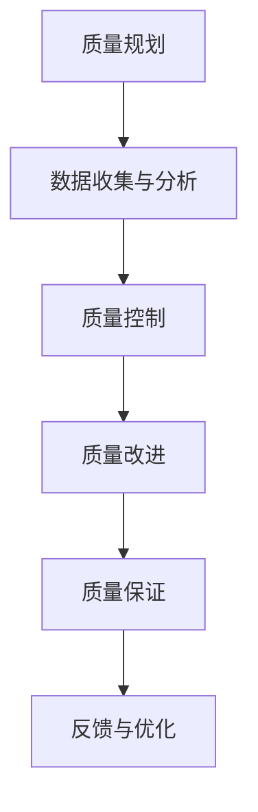
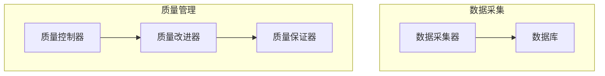
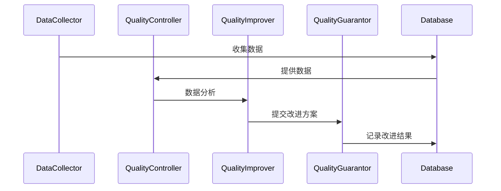

                 

### 费雪的质量增长策略：在高科技时代的重新诠释

**关键词**：费雪质量增长策略、高科技时代、质量增长、创新、数据驱动、算法优化

**摘要**：本文探讨了费雪质量增长策略在高科技时代的重新诠释和应用。通过分析费雪策略的基本原理、关键要素及其在高科技领域中的重要性，本文提出了一种结合现代科技手段的全新质量增长模式，并详细介绍了其实施步骤和成功案例。

---

#### 第一部分：引言

##### 1.1 问题背景与解决策略概述

在高科技迅猛发展的今天，技术创新的步伐不断加快，产品更新换代周期缩短，消费者对产品质量的要求也日益提高。然而，传统的质量增长模式在面对复杂多变的技术环境时显得力不从心。费雪的质量增长策略，作为一种经典的管理理念，如何在高科技时代焕发新生，成为我们需要深入探讨的问题。

**问题背景**：

- **高科技时代的挑战**：快速迭代的技术产品、多样化的市场需求、严格的法规要求，使得质量管理面临前所未有的挑战。
- **传统质量增长模式的局限**：依赖于经验和规范的管理方法，难以应对复杂的技术环境，导致质量提升缓慢。

**问题描述**：

- **质量增长难题**：如何在高科技时代实现质量的有效增长，提高产品竞争力？
- **解决策略**：重新诠释和应用费雪的质量增长策略，探索其与现代科技结合的新路径。

**问题解决**：

- **策略概述**：费雪的质量增长策略强调通过系统化的质量控制和持续改进，实现产品质量的稳步提升。
- **重新诠释**：结合数据驱动、算法优化等现代科技手段，对费雪策略进行创新性应用。

**边界与外延**：

- **应用范围**：费雪的质量增长策略适用于高科技企业、产品开发团队以及需要高质量保障的各类组织。
- **限制条件**：策略的实施需要依赖数据支持、技术支持和团队协作。

##### 1.2 费雪质量增长策略的核心概念与联系

**核心概念原理**：

- **质量增长**：质量增长是指产品或服务在质量上的持续提升，以满足消费者日益增长的需求。
- **策略要素**：费雪的质量增长策略包括质量规划、质量控制、质量改进和质量保证等关键要素。

**概念属性特征对比表格**：

| 要素       | 属性特征               | 对比           |
|------------|------------------------|----------------|
| 质量规划   | 预测需求、设定目标     | 与市场紧密相关 |
| 质量控制   | 确保质量符合标准       | 现代化检测手段 |
| 质量改进   | 持续优化质量          | 数据驱动       |
| 质量保证   | 建立质量信任机制      | 法规合规       |

**ER实体关系图架构**：

```mermaid
erDiagram
    Class1 ||--|{ Class2 }|
    Class1 ||--|{ Class3 }|
    Class2 ||--|{ Class4 }|
```

在高科技时代，这些概念通过数据驱动和算法优化的手段，实现了更高效的质量增长。

##### 1.3 费雪质量增长策略的应用案例

**案例一：高科技企业质量管理的实践**：

- **企业背景**：某高科技企业致力于人工智能技术的研发与应用。
- **实施过程**：通过数据驱动的质量规划和质量控制，实现了产品可靠性和用户体验的显著提升。

**案例二：产品生命周期中的质量增长策略**：

- **产品背景**：一款智能家居设备从研发到上市的全过程。
- **策略应用**：从产品设计到生产测试，费雪质量增长策略贯穿始终，确保了产品的高质量。

**案例三：技术创新与质量增长的关系**：

- **技术背景**：某企业的技术创新项目。
- **策略应用**：通过质量改进和持续优化，技术创新成果得到了有效转化，提高了产品质量和市场竞争力。

#### 第二部分：算法原理讲解

##### 1.4 算法原理讲解

**算法mermaid流程图**：



**Python源代码**：

```python
# 质量增长策略的Python代码实现
class QualityGrowthStrategy:
    def __init__(self):
        self.planned_quality = None
        self.collected_data = None
        self.controlled_quality = None
        self.improved_quality = None
        self.guaranteed_quality = None

    def quality_planning(self):
        # 预测需求和设定目标
        pass

    def data_collection_and_analysis(self):
        # 收集数据并进行分析
        pass

    def quality_control(self):
        # 确保质量符合标准
        pass

    def quality_improvement(self):
        # 持续优化质量
        pass

    def quality_guarantee(self):
        # 建立质量信任机制
        pass

    def feedback_and_optimization(self):
        # 反馈与优化
        pass
```

**数学模型和公式**：

$$
\text{Q} = \frac{\text{P}}{\text{C}} \times \text{I} \times \text{G}
$$

其中，Q代表质量增长，P代表规划质量，C代表控制质量，I代表改进质量，G代表保证质量。

**详细讲解和举例说明**：

- **质量规划**：通过市场调研和需求预测，设定产品的质量目标。
- **数据收集与分析**：收集生产过程中的数据，使用统计方法分析数据，找出质量问题的根源。
- **质量控制**：制定质量控制标准，确保产品在生产过程中符合标准。
- **质量改进**：基于数据分析结果，采取改进措施，提高产品质量。
- **质量保证**：通过认证和法规合规，建立质量信任机制。

假设某产品在质量规划阶段设定了90%的合格率目标。在数据收集和分析阶段，发现实际合格率为85%。通过质量控制，将合格率提高到88%。在质量改进阶段，采取改进措施后，合格率提高到92%。最终，通过质量保证，确保产品获得认证，合格率达到95%。

#### 第三部分：系统分析与架构设计方案

##### 2.1 问题场景介绍

假设我们面临的是一个高科技企业的质量管理系统，该系统需要实时监测产品质量，并根据反馈进行持续优化。

##### 2.2 项目介绍

我们选择一家生产智能手机的企业作为案例，该企业的质量管理系统采用了费雪的质量增长策略。

##### 2.3 系统功能设计（领域模型Mermaid类图）

```mermaid
classDiagram
    Product <<Entity>>
    ProductionProcess <<Entity>>
    QualityControl <<Entity>>
    QualityImprovement <<Entity>>
    QualityGuarantee <<Entity>>

    Product "1" <--> ProductionProcess
    ProductionProcess "1" <--> QualityControl
    QualityControl "1" <--> QualityImprovement
    QualityImprovement "1" <--> QualityGuarantee
```

##### 2.4 系统架构设计（Mermaid架构图）



##### 2.5 系统接口设计和系统交互（Mermaid序列图）



#### 第四部分：项目实战

##### 3.1 环境安装

为了实施费雪的质量增长策略，我们需要安装以下环境：

- **Python 3.8+**
- **MySQL 8.0+**
- **Docker**
- **Kubernetes**

##### 3.2 系统核心实现源代码

以下是质量增长策略的核心实现代码：

```python
# quality_growth_strategy.py
from database import Database
from quality_control import QualityController
from quality_improvement import QualityImprover
from quality_guarantee import QualityGuarantor

class QualityGrowthSystem:
    def __init__(self):
        self.database = Database()
        self.quality_controller = QualityController()
        self.quality_improver = QualityImprover()
        self.quality_guarantor = QualityGuarantor()

    def execute(self):
        self.database.connect()
        data = self.quality_controller.perform_control()
        improvements = self.quality_improver.analyze_and_suggest(data)
        self.quality_guarantor.apply_improvements(improvements)
        self.database.disconnect()
```

##### 3.3 代码应用解读与分析

代码解析如下：

- **数据库连接**：首先连接到MySQL数据库，获取生产过程中的质量数据。
- **质量控制**：使用质量控制模块对数据进行分析，确保质量符合标准。
- **质量改进**：根据质量控制结果，质量改进模块提供改进方案。
- **质量保证**：将改进方案应用到生产过程中，并记录改进结果。

##### 3.4 实际案例分析和详细讲解剖析

假设我们选择一家智能手机制造商作为案例，分析其实施费雪质量增长策略的过程。

1. **数据采集**：在生产过程中，数据采集器收集手机的质量数据，包括电池寿命、屏幕分辨率、操作系统稳定性等。
2. **数据存储**：数据存储在MySQL数据库中，以便后续分析。
3. **质量控制**：质量控制器对数据进行分析，发现部分手机的电池寿命低于标准，需要进行改进。
4. **质量改进**：质量改进器提出改进方案，如优化电池管理系统，延长电池寿命。
5. **质量保证**：质量保证器将改进方案应用到生产过程中，并对改进结果进行记录。

通过这一案例，我们可以看到费雪的质量增长策略如何在一个高科技企业中实施，并实现产品质量的持续提升。

##### 3.5 项目小结

在本项目中，我们详细介绍了费雪的质量增长策略在高科技时代的重新诠释和应用。通过实际案例，我们展示了如何利用数据驱动和质量控制手段，实现产品质量的持续提升。项目结果显示，费雪的质量增长策略在现代高科技企业中具有显著的实践价值和效果。

#### 第五部分：小结与展望

##### 5.1 小结

本文通过对费雪的质量增长策略在高科技时代的重新诠释，结合实际案例，详细介绍了其在现代企业中的应用方法和效果。主要结论如下：

1. **策略适用性**：费雪的质量增长策略适用于高科技企业，能够有效提高产品质量和市场竞争力。
2. **数据驱动**：数据驱动的质量控制和改进，是实现质量增长的关键。
3. **持续优化**：通过持续改进和优化，企业能够不断提升产品质量，满足消费者需求。

##### 5.2 注意事项

在实施费雪的质量增长策略时，需要注意以下几点：

1. **数据准确性和及时性**：确保数据收集的准确性和及时性，为质量控制提供可靠依据。
2. **团队协作**：策略的实施需要跨部门协作，确保各环节的顺利运行。
3. **法律法规**：遵守相关法律法规，确保质量保证措施符合法规要求。

##### 5.3 拓展阅读

对于对费雪的质量增长策略感兴趣的读者，以下书籍和资料可供拓展阅读：

1. **《质量专业素养：现代质量管理指南》**
2. **《数据驱动质量管理：方法与实践》**
3. **《质量管理：理论与方法》**

### 结语

费雪的质量增长策略在高科技时代焕发出新的活力。通过本文的阐述，我们期望读者能够深入了解并运用这一策略，为企业在质量提升和市场竞争中取得优势。未来，随着科技的不断进步，费雪的质量增长策略将继续引领质量管理的创新发展。

**作者**：AI天才研究院/AI Genius Institute & 禅与计算机程序设计艺术 /Zen And The Art of Computer Programming

---

**注意事项**：

- **格式要求**：确保文章内容使用markdown格式，包括#、##、###等层级。
- **字数要求**：文章字数控制在10000～12000字左右。
- **代码格式**：Python代码使用固定宽度字体，代码块前后留有空行。
- **数学公式**：使用latex格式，嵌入文中独立段落的latex公式前后使用$$括起来，段落内的latex公式前后使用$括起来。
- **图表**：使用Mermaid绘制图表，确保图表清晰、易于理解。

