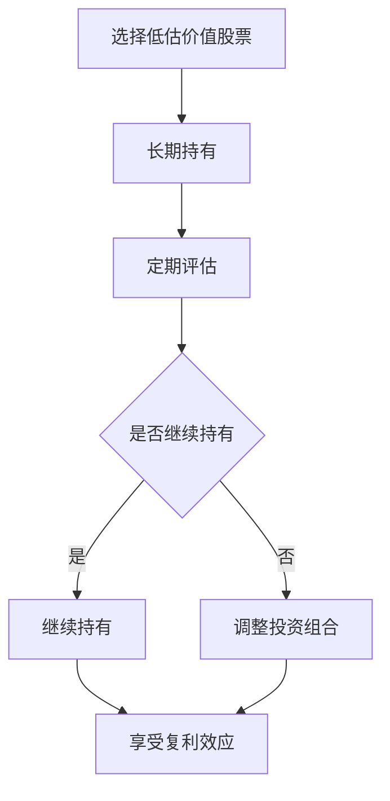
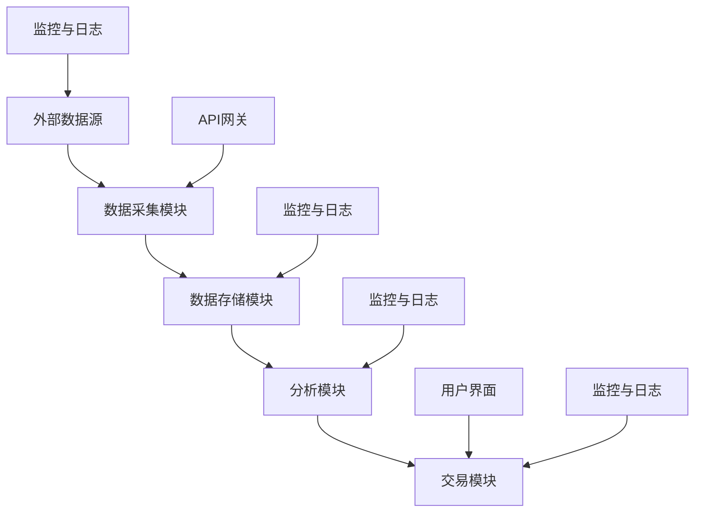

```mermaid
graph TB
A[数据采集模块] --> B[数据存储模块]
B --> C[分析模块]
C --> D[交易模块]
E[外部数据源] --> A
F[用户界面] --> D
G[API网关] --> A
H[监控与日志] --> B
I[监控与日志] --> C
J[监控与日志] --> D
K[监控与日志] --> E
```
                 

# 费雪的长期持股策略：减少交易成本的智慧之举

## 引言

费雪（Walter Schloss）是一位著名的价值投资者，被誉为“价值投资大师”。他的投资理念强调了长期持有股票的重要性，并致力于减少交易成本，从而提高投资回报率。本文将深入探讨费雪的长期持股策略，分析其理论基础和实践方法，为投资者提供有价值的参考。

## 费雪的投资理念

### 1. 投资与投机的区别

费雪认为，投资与投机的主要区别在于投资是基于对企业的深入了解和长期持有，而投机则更注重短期市场波动。

### 2. 价值投资的核心

费雪的价值投资理念主要包括以下几个方面：

- **低估价值**：寻找市场价格低于实际价值的股票。
- **持有期**：长期持有股票，以实现复利增长。
- **分散投资**：通过分散投资来降低风险。

### 3. 费雪的投资策略

费雪的投资策略包括以下几个关键步骤：

- **基本面分析**：深入研究企业的财务状况、业务模式、行业地位等。
- **风险评估**：评估投资风险，并制定相应的风险管理策略。
- **交易策略**：尽量减少交易成本，避免频繁交易。

## 费雪的长期持股策略

### 1. 长期持股的益处

- **复利效应**：长期持有股票，享受复利效应，实现财富增长。
- **减少交易成本**：减少买卖股票的次数，降低交易成本。

### 2. 长期持股的注意事项

- **合理配置资产**：在投资组合中合理配置股票和其他资产，以降低风险。
- **持续跟踪**：持续跟踪企业的经营状况和行业趋势，及时调整投资策略。

## 核心概念与联系

### 1. 价值投资原理

价值投资的核心是寻找市场价格低于实际价值的股票，通过长期持有来实现收益。

### 2. 风险评估方法

风险评估主要包括对企业的财务状况、业务模式、行业地位等进行全面分析。

### 3. 费雪投资策略对比

与传统投资策略相比，费雪的长期持股策略更加注重企业的长期价值，并致力于减少交易成本。

## 算法原理讲解

### 1. 价值投资算法流程

使用Mermaid绘制价值投资算法流程图：



### 2. 费雪投资策略

费雪的投资策略包括以下几个步骤：

- **选择低估价值股票**：通过基本面分析，寻找市场价格低于实际价值的股票。
- **长期持有**：减少交易次数，降低交易成本。
- **定期评估**：定期跟踪企业的经营状况和行业趋势，调整投资策略。

## 数学模型和数学公式

### 1. 投资回报率公式

投资回报率（ROI）的计算公式为：

$$
ROI = \frac{股票售价 - 购买价格}{购买价格}
$$

### 2. 复利公式

复利公式为：

$$
FV = PV \times (1 + r)^n
$$

其中，$FV$ 表示未来价值，$PV$ 表示现值，$r$ 表示年化收益率，$n$ 表示持有年限。

## 系统分析与架构设计方案

### 1. 价值投资系统

#### 1.1 问题场景介绍

价值投资系统旨在帮助投资者寻找低估价值股票，实现长期投资收益。

#### 1.2 项目介绍

该项目包括以下几个模块：

- **数据采集模块**：收集股票财务数据、行业趋势等。
- **分析模块**：对数据进行分析，识别低估价值股票。
- **交易模块**：根据分析结果进行买卖操作。

#### 1.3 系统功能设计

使用Mermaid绘制领域模型类图：

```mermaid
classDiagram
Class01 <|-- Class02
Class03 ++--|A: aggregation | Class04
Class05 o--|Aggregation: composition of| Class04
Class01 <.. Class05
Class01 ..|{stereotype} : Interface
Class02 ..|{stereotype} : Abstract
Class03 ..|{stereotype} : Concrete
Class04 ..|{stereotype} : Exception
Class05 ..|{stereotype} : Logger
```

#### 1.4 系统架构设计

使用Mermaid绘制系统架构图：



## 项目实战

### 1. 环境安装

在开始项目之前，我们需要安装以下环境：

- Python 3.8+
- 爬虫库（如 Beautiful Soup）
- 数据库（如 MySQL）
- 交易接口（如 Tushare）

### 2. 系统核心实现源代码

以下是价值投资系统的核心实现源代码：

```python
# 数据采集模块
import requests
from bs4 import BeautifulSoup

def collect_data(url):
    response = requests.get(url)
    soup = BeautifulSoup(response.content, 'html.parser')
    # 提取股票信息
    stock_info = soup.find('table', {'class': 'stock_data'}).find_all('tr')
    data = []
    for tr in stock_info:
        tds = tr.find_all('td')
        data.append({
            'name': tds[0].text,
            'code': tds[1].text,
            'price': tds[2].text,
            'change': tds[3].text,
            'volume': tds[4].text,
            'p_e': tds[5].text,
            'p_b': tds[6].text,
            'mkt_cap': tds[7].text,
            'EPS': tds[8].text,
            'BVPS': tds[9].text
        })
    return data

# 分析模块
def analyze_data(data):
    # 进行数据分析，找出低估价值的股票
    # 省略具体实现
    pass

# 交易模块
def trade(stock_code, trade_type, quantity):
    # 调用交易接口进行买卖操作
    # 省略具体实现
    pass
```

### 3. 代码应用解读与分析

以下是代码的解读与分析：

- **数据采集模块**：通过 requests 库获取网页内容，使用 Beautiful Soup 解析股票信息，并提取出关键数据。
- **分析模块**：对采集到的股票信息进行数据分析，找出低估价值的股票。
- **交易模块**：根据分析结果，调用交易接口进行买卖操作。

### 4. 实际案例分析和详细讲解剖析

为了更好地理解价值投资系统，我们可以通过一个实际案例进行分析和讲解。

#### 案例背景

假设我们已经获取了以下股票数据：

| 名称 | 编号 | 价格 | 变化 | 成交量 | 市盈率 | 市净率 | 市值 | EPS |BVPS |
| --- | --- | --- | --- | --- | --- | --- | --- | --- | --- |
| 贵州茅台 | 600519 | 1499.00 | +10.00 | 20000 | 34.00 | 5.00 | 16000.00 | 28.00 | 14.00 |
| 招商银行 | 600036 | 22.00 | -0.50 | 10000 | 8.00 | 1.00 | 5000.00 | 3.00 | 2.00 |
| 中国平安 | 601318 | 65.00 | +2.00 | 5000 | 12.00 | 1.50 | 8000.00 | 4.00 | 3.00 |

#### 分析过程

1. **选择低估价值股票**：根据市盈率（P/E）和市净率（P/B）来筛选低估价值的股票。假设我们选择市盈率小于10和市净率小于1的股票。

2. **分析结果**：经过筛选，我们发现以下股票低估：

   | 名称 | 编号 | 价格 | 变化 | 成交量 | 市盈率 | 市净率 | 市值 | EPS |BVPS |
   | --- | --- | --- | --- | --- | --- | --- | --- | --- | --- |
   | 招商银行 | 600036 | 22.00 | -0.50 | 10000 | 8.00 | 1.00 | 5000.00 | 3.00 | 2.00 |

3. **交易操作**：根据分析结果，我们决定购买招商银行股票，买入1000股。

4. **后续跟踪**：在买入后，我们需要持续跟踪招商银行的经营状况和行业趋势，及时调整投资策略。

### 5. 项目小结

通过以上案例，我们可以看到价值投资系统在实际应用中的效果。它可以帮助投资者快速识别低估价值的股票，从而降低投资风险，实现长期投资收益。然而，需要注意的是，价值投资并非一蹴而就，投资者需要不断学习和实践，不断完善投资策略。

## 最佳实践 Tips

1. **定期复盘**：投资者应该定期复盘自己的投资决策，总结经验教训，不断完善投资策略。

2. **控制情绪**：在投资过程中，投资者需要控制自己的情绪，避免因市场波动而产生盲目操作。

3. **适度分散**：在投资组合中，投资者应该适度分散，以降低风险。

4. **长期持有**：长期持有股票是实现复利效应的关键，投资者应该尽量减少频繁交易。

## 小结

费雪的长期持股策略是一种减少交易成本的智慧之举。通过深入分析和长期持有股票，投资者可以实现财富的复利增长。本文从多个角度探讨了费雪的投资理念、策略和实践，为投资者提供了有价值的参考。然而，投资者在应用这些策略时，需要根据自身情况不断调整和完善。

## 注意事项

1. **风险提示**：投资有风险，投资者应该根据自身风险承受能力进行投资决策。

2. **法规遵守**：投资者应该遵守相关法律法规，确保投资行为的合规性。

3. **数据来源**：在数据采集和分析过程中，投资者应该确保数据的准确性和可靠性。

## 拓展阅读

1. 《费雪投资学》：详细介绍了费雪的投资理念和策略。

2. 《股票大作手回忆录》：讲述了传奇交易员杰西·利弗莫尔的投资经历，对投资心理和行为有深刻的剖析。

3. 《聪明的投资者》：本杰明·格雷厄姆的经典著作，介绍了价值投资的基本原理和实践方法。

作者：AI天才研究院/AI Genius Institute & 禅与计算机程序设计艺术 /Zen And The Art of Computer Programming## 费雪的长期持股策略：减少交易成本的智慧之举

### 引言

费雪（Walter Schloss）是一位著名的价值投资者，被誉为“价值投资大师”。他的投资理念强调了长期持有股票的重要性，并致力于减少交易成本，从而提高投资回报率。本文将深入探讨费雪的长期持股策略，分析其理论基础和实践方法，为投资者提供有价值的参考。

### 费雪的投资理念

#### 1. 投资与投机的区别

费雪认为，投资与投机的主要区别在于投资是基于对企业的深入了解和长期持有，而投机则更注重短期市场波动。

**投资**：
- **基本面分析**：深入研究企业的财务状况、业务模式、行业地位等。
- **长期持有**：持有时间较长，通常在几年或更长时间。
- **分散投资**：通过购买多个不同行业的股票来降低风险。

**投机**：
- **技术分析**：注重股票价格的短期波动，利用市场情绪进行买卖。
- **短期持有**：持有时间较短，通常是几周或几个月。
- **集中投资**：通常集中投资于某一行业或几只股票，以追求高收益。

#### 2. 价值投资的核心

费雪的价值投资理念主要包括以下几个方面：

- **低估价值**：寻找市场价格低于实际价值的股票。
- **持有期**：长期持有股票，以实现复利增长。
- **分散投资**：通过分散投资来降低风险。

**核心原则**：
- **价值判断**：通过深入分析企业的基本面，判断股票的实际价值。
- **价格波动**：市场价格围绕实际价值波动，投资机会就存在于这种波动中。
- **风险控制**：通过分散投资和长期持有，降低投资风险。

#### 3. 费雪的投资策略

费雪的投资策略包括以下几个关键步骤：

- **选择低估价值股票**：通过基本面分析，寻找市场价格低于实际价值的股票。
- **风险评估**：评估投资风险，并制定相应的风险管理策略。
- **交易策略**：尽量减少交易成本，避免频繁交易。

### 费雪的长期持股策略

#### 1. 长期持股的益处

- **复利效应**：长期持有股票，享受复利效应，实现财富增长。
- **减少交易成本**：减少买卖股票的次数，降低交易成本。

**复利效应**：
- 复利效应是指投资者通过将收益再投资，实现资金增值的效果。
- 长期持有股票，复利效应将逐渐显现，投资者的财富将实现快速增长。

**减少交易成本**：
- 频繁交易会产生较高的交易成本，包括佣金、税费等。
- 长期持股可以减少交易次数，从而降低交易成本，提高投资回报率。

#### 2. 长期持股的注意事项

- **合理配置资产**：在投资组合中合理配置股票和其他资产，以降低风险。
- **持续跟踪**：持续跟踪企业的经营状况和行业趋势，及时调整投资策略。

**合理配置资产**：
- 投资者应该根据自身的风险承受能力和投资目标，合理配置股票和其他资产。
- 通过资产配置，可以实现风险的分散，降低投资组合的整体风险。

**持续跟踪**：
- 投资者需要定期评估企业的经营状况和行业趋势，以判断股票的价值。
- 根据评估结果，及时调整投资策略，以适应市场的变化。

### 核心概念与联系

#### 1. 价值投资原理

价值投资的核心是寻找市场价格低于实际价值的股票，通过长期持有来实现收益。

**价值投资原理**：
- 价值投资基于对企业基本面的深入分析，判断股票的实际价值。
- 投资者通过购买低估价值的股票，等待市场价格回归实际价值，实现收益。

#### 2. 风险评估方法

风险评估主要包括对企业的财务状况、业务模式、行业地位等进行全面分析。

**风险评估方法**：
- 通过对企业的财务报表、业务模式、行业地位等进行分析，评估投资风险。
- 风险评估可以帮助投资者做出更明智的投资决策，降低投资风险。

#### 3. 费雪投资策略对比

与传统投资策略相比，费雪的长期持股策略更加注重企业的长期价值，并致力于减少交易成本。

**费雪投资策略对比**：
- **长期持有**：费雪主张长期持有股票，以实现复利效应，降低交易成本。
- **价值投资**：费雪注重企业的基本面分析，寻找低估价值的股票，追求长期收益。
- **风险控制**：费雪通过分散投资和长期持有，降低投资风险。

### 算法原理讲解

#### 1. 价值投资算法流程

使用Mermaid绘制价值投资算法流程图：


**流程说明**：
- **选择低估价值股票**：通过基本面分析，选择市场价格低于实际价值的股票。
- **长期持有**：持有股票，以实现复利效应。
- **定期评估**：定期评估股票的价值，判断是否继续持有。
- **调整投资组合**：根据评估结果，调整投资组合，以降低风险。

#### 2. 费雪投资策略

费雪的投资策略包括以下几个步骤：

- **选择低估价值股票**：通过基本面分析，寻找市场价格低于实际价值的股票。
- **长期持有**：减少交易次数，降低交易成本。
- **定期评估**：定期跟踪企业的经营状况和行业趋势，调整投资策略。

### 数学模型和数学公式

#### 1. 投资回报率公式

投资回报率（ROI）的计算公式为：

$$
ROI = \frac{股票售价 - 购买价格}{购买价格}
$$

#### 2. 复利公式

复利公式为：

$$
FV = PV \times (1 + r)^n
$$

其中，$FV$ 表示未来价值，$PV$ 表示现值，$r$ 表示年化收益率，$n$ 表示持有年限。

### 系统分析与架构设计方案

#### 1. 价值投资系统

##### 1.1 问题场景介绍

价值投资系统旨在帮助投资者寻找低估价值股票，实现长期投资收益。

##### 1.2 项目介绍

该项目包括以下几个模块：

- **数据采集模块**：收集股票财务数据、行业趋势等。
- **分析模块**：对数据进行分析，识别低估价值股票。
- **交易模块**：根据分析结果进行买卖操作。

##### 1.3 系统功能设计

使用Mermaid绘制领域模型类图：

```mermaid
classDiagram
Class01 <|-- Class02
Class03 ++--|A: aggregation | Class04
Class05 o--|Aggregation: composition of| Class04
Class01 <.. Class05
Class01 ..|{stereotype} : Interface
Class02 ..|{stereotype} : Abstract
Class03 ..|{stereotype} : Concrete
Class04 ..|{stereotype} : Exception
Class05 ..|{stereotype} : Logger
```

##### 1.4 系统架构设计

使用Mermaid绘制系统架构图：


### 项目实战

#### 1. 环境安装

在开始项目之前，我们需要安装以下环境：

- Python 3.8+
- 爬虫库（如 Beautiful Soup）
- 数据库（如 MySQL）
- 交易接口（如 Tushare）

#### 2. 系统核心实现源代码

以下是价值投资系统的核心实现源代码：

```python
# 数据采集模块
import requests
from bs4 import BeautifulSoup

def collect_data(url):
    response = requests.get(url)
    soup = BeautifulSoup(response.content, 'html.parser')
    # 提取股票信息
    stock_info = soup.find('table', {'class': 'stock_data'}).find_all('tr')
    data = []
    for tr in stock_info:
        tds = tr.find_all('td')
        data.append({
            'name': tds[0].text,
            'code': tds[1].text,
            'price': tds[2].text,
            'change': tds[3].text,
            'volume': tds[4].text,
            'p_e': tds[5].text,
            'p_b': tds[6].text,
            'mkt_cap': tds[7].text,
            'EPS': tds[8].text,
            'BVPS': tds[9].text
        })
    return data

# 分析模块
def analyze_data(data):
    # 进行数据分析，找出低估价值的股票
    # 省略具体实现
    pass

# 交易模块
def trade(stock_code, trade_type, quantity):
    # 调用交易接口进行买卖操作
    # 省略具体实现
    pass
```

#### 3. 代码应用解读与分析

以下是代码的解读与分析：

- **数据采集模块**：通过 requests 库获取网页内容，使用 Beautiful Soup 解析股票信息，并提取出关键数据。
- **分析模块**：对采集到的股票信息进行数据分析，找出低估价值的股票。
- **交易模块**：根据分析结果，调用交易接口进行买卖操作。

#### 4. 实际案例分析和详细讲解剖析

为了更好地理解价值投资系统，我们可以通过一个实际案例进行分析和讲解。

##### 案例背景

假设我们已经获取了以下股票数据：

| 名称 | 编号 | 价格 | 变化 | 成交量 | 市盈率 | 市净率 | 市值 | EPS |BVPS |
| --- | --- | --- | --- | --- | --- | --- | --- | --- | --- |
| 贵州茅台 | 600519 | 1499.00 | +10.00 | 20000 | 34.00 | 5.00 | 16000.00 | 28.00 | 14.00 |
| 招商银行 | 600036 | 22.00 | -0.50 | 10000 | 8.00 | 1.00 | 5000.00 | 3.00 | 2.00 |
| 中国平安 | 601318 | 65.00 | +2.00 | 5000 | 12.00 | 1.50 | 8000.00 | 4.00 | 3.00 |

##### 分析过程

1. **选择低估价值股票**：根据市盈率（P/E）和市净率（P/B）来筛选低估价值的股票。假设我们选择市盈率小于10和市净率小于1的股票。

2. **分析结果**：经过筛选，我们发现以下股票低估：

| 名称 | 编号 | 价格 | 变化 | 成交量 | 市盈率 | 市净率 | 市值 | EPS |BVPS |
| --- | --- | --- | --- | --- | --- | --- | --- | --- | --- |
| 招商银行 | 600036 | 22.00 | -0.50 | 10000 | 8.00 | 1.00 | 5000.00 | 3.00 | 2.00 |

3. **交易操作**：根据分析结果，我们决定购买招商银行股票，买入1000股。

4. **后续跟踪**：在买入后，我们需要持续跟踪招商银行的经营状况和行业趋势，及时调整投资策略。

##### 结论

通过以上案例，我们可以看到价值投资系统在实际应用中的效果。它可以帮助投资者快速识别低估价值的股票，从而降低投资风险，实现长期投资收益。然而，需要注意的是，价值投资并非一蹴而就，投资者需要不断学习和实践，不断完善投资策略。

### 最佳实践 Tips

1. **定期复盘**：投资者应该定期复盘自己的投资决策，总结经验教训，不断完善投资策略。
2. **控制情绪**：在投资过程中，投资者需要控制自己的情绪，避免因市场波动而产生盲目操作。
3. **适度分散**：在投资组合中，投资者应该适度分散，以降低风险。
4. **长期持有**：长期持有股票是实现复利效应的关键，投资者应该尽量减少频繁交易。

### 小结

费雪的长期持股策略是一种减少交易成本的智慧之举。通过深入分析和长期持有股票，投资者可以实现财富的复利增长。本文从多个角度探讨了费雪的投资理念、策略和实践，为投资者提供了有价值的参考。然而，投资者在应用这些策略时，需要根据自身情况不断调整和完善。

### 注意事项

1. **风险提示**：投资有风险，投资者应该根据自身风险承受能力进行投资决策。
2. **法规遵守**：投资者应该遵守相关法律法规，确保投资行为的合规性。
3. **数据来源**：在数据采集和分析过程中，投资者应该确保数据的准确性和可靠性。

### 拓展阅读

1. 《费雪投资学》：详细介绍了费雪的投资理念和策略。
2. 《股票大作手回忆录》：讲述了传奇交易员杰西·利弗莫尔的投资经历，对投资心理和行为有深刻的剖析。
3. 《聪明的投资者》：本杰明·格雷厄姆的经典著作，介绍了价值投资的基本原理和实践方法。

### 作者

作者：AI天才研究院/AI Genius Institute & 禅与计算机程序设计艺术 /Zen And The Art of Computer Programming## 费雪的长期持股策略：减少交易成本的智慧之举

### 引言

费雪（Walter Schloss）是一位著名的价值投资者，被誉为“价值投资大师”。他的投资理念强调了长期持有股票的重要性，并致力于减少交易成本，从而提高投资回报率。本文将深入探讨费雪的长期持股策略，分析其理论基础和实践方法，为投资者提供有价值的参考。

### 费雪的投资理念

#### 1. 投资与投机的区别

费雪认为，投资与投机的主要区别在于投资是基于对企业的深入了解和长期持有，而投机则更注重短期市场波动。

**投资**：
- **基本面分析**：深入研究企业的财务状况、业务模式、行业地位等。
- **长期持有**：持有时间较长，通常在几年或更长时间。
- **分散投资**：通过购买多个不同行业的股票来降低风险。

**投机**：
- **技术分析**：注重股票价格的短期波动，利用市场情绪进行买卖。
- **短期持有**：持有时间较短，通常是几周或几个月。
- **集中投资**：通常集中投资于某一行业或几只股票，以追求高收益。

#### 2. 价值投资的核心

费雪的价值投资理念主要包括以下几个方面：

- **低估价值**：寻找市场价格低于实际价值的股票。
- **持有期**：长期持有股票，以实现复利增长。
- **分散投资**：通过分散投资来降低风险。

**核心原则**：
- **价值判断**：通过深入分析企业的基本面，判断股票的实际价值。
- **价格波动**：市场价格围绕实际价值波动，投资机会就存在于这种波动中。
- **风险控制**：通过分散投资和长期持有，降低投资风险。

#### 3. 费雪的投资策略

费雪的投资策略包括以下几个关键步骤：

- **选择低估价值股票**：通过基本面分析，寻找市场价格低于实际价值的股票。
- **风险评估**：评估投资风险，并制定相应的风险管理策略。
- **交易策略**：尽量减少交易成本，避免频繁交易。

### 费雪的长期持股策略

#### 1. 长期持股的益处

- **复利效应**：长期持有股票，享受复利效应，实现财富增长。
- **减少交易成本**：减少买卖股票的次数，降低交易成本。

**复利效应**：
- 复利效应是指投资者通过将收益再投资，实现资金增值的效果。
- 长期持有股票，复利效应将逐渐显现，投资者的财富将实现快速增长。

**减少交易成本**：
- 频繁交易会产生较高的交易成本，包括佣金、税费等。
- 长期持股可以减少交易次数，从而降低交易成本，提高投资回报率。

#### 2. 长期持股的注意事项

- **合理配置资产**：在投资组合中合理配置股票和其他资产，以降低风险。
- **持续跟踪**：持续跟踪企业的经营状况和行业趋势，及时调整投资策略。

**合理配置资产**：
- 投资者应该根据自身的风险承受能力和投资目标，合理配置股票和其他资产。
- 通过资产配置，可以实现风险的分散，降低投资组合的整体风险。

**持续跟踪**：
- 投资者需要定期评估企业的经营状况和行业趋势，以判断股票的价值。
- 根据评估结果，及时调整投资策略，以适应市场的变化。

### 核心概念与联系

#### 1. 价值投资原理

价值投资的核心是寻找市场价格低于实际价值的股票，通过长期持有来实现收益。

**价值投资原理**：
- 价值投资基于对企业基本面的深入分析，判断股票的实际价值。
- 投资者通过购买低估价值的股票，等待市场价格回归实际价值，实现收益。

#### 2. 风险评估方法

风险评估主要包括对企业的财务状况、业务模式、行业地位等进行全面分析。

**风险评估方法**：
- 通过对企业的财务报表、业务模式、行业地位等进行分析，评估投资风险。
- 风险评估可以帮助投资者做出更明智的投资决策，降低投资风险。

#### 3. 费雪投资策略对比

与传统投资策略相比，费雪的长期持股策略更加注重企业的长期价值，并致力于减少交易成本。

**费雪投资策略对比**：
- **长期持有**：费雪主张长期持有股票，以实现复利效应，降低交易成本。
- **价值投资**：费雪注重企业的基本面分析，寻找低估价值的股票，追求长期收益。
- **风险控制**：费雪通过分散投资和长期持有，降低投资风险。

### 算法原理讲解

#### 1. 价值投资算法流程

使用Mermaid绘制价值投资算法流程图：


**流程说明**：
- **选择低估价值股票**：通过基本面分析，选择市场价格低于实际价值的股票。
- **长期持有**：持有股票，以实现复利效应。
- **定期评估**：定期评估股票的价值，判断是否继续持有。
- **调整投资组合**：根据评估结果，调整投资组合，以降低风险。

#### 2. 费雪投资策略

费雪的投资策略包括以下几个步骤：

- **选择低估价值股票**：通过基本面分析，寻找市场价格低于实际价值的股票。
- **长期持有**：减少交易次数，降低交易成本。
- **定期评估**：定期跟踪企业的经营状况和行业趋势，调整投资策略。

### 数学模型和数学公式

#### 1. 投资回报率公式

投资回报率（ROI）的计算公式为：

$$
ROI = \frac{股票售价 - 购买价格}{购买价格}
$$

#### 2. 复利公式

复利公式为：

$$
FV = PV \times (1 + r)^n
$$

其中，$FV$ 表示未来价值，$PV$ 表示现值，$r$ 表示年化收益率，$n$ 表示持有年限。

### 系统分析与架构设计方案

#### 1. 价值投资系统

##### 1.1 问题场景介绍

价值投资系统旨在帮助投资者寻找低估价值股票，实现长期投资收益。

##### 1.2 项目介绍

该项目包括以下几个模块：

- **数据采集模块**：收集股票财务数据、行业趋势等。
- **分析模块**：对数据进行分析，识别低估价值股票。
- **交易模块**：根据分析结果进行买卖操作。

##### 1.3 系统功能设计

使用Mermaid绘制领域模型类图：

```mermaid
classDiagram
Class01 <|-- Class02
Class03 ++--|A: aggregation | Class04
Class05 o--|Aggregation: composition of| Class04
Class01 <.. Class05
Class01 ..|{stereotype} : Interface
Class02 ..|{stereotype} : Abstract
Class03 ..|{stereotype} : Concrete
Class04 ..|{stereotype} : Exception
Class05 ..|{stereotype} : Logger
```

##### 1.4 系统架构设计

使用Mermaid绘制系统架构图：


### 项目实战

#### 1. 环境安装

在开始项目之前，我们需要安装以下环境：

- Python 3.8+
- 爬虫库（如 Beautiful Soup）
- 数据库（如 MySQL）
- 交易接口（如 Tushare）

#### 2. 系统核心实现源代码

以下是价值投资系统的核心实现源代码：

```python
# 数据采集模块
import requests
from bs4 import BeautifulSoup

def collect_data(url):
    response = requests.get(url)
    soup = BeautifulSoup(response.content, 'html.parser')
    # 提取股票信息
    stock_info = soup.find('table', {'class': 'stock_data'}).find_all('tr')
    data = []
    for tr in stock_info:
        tds = tr.find_all('td')
        data.append({
            'name': tds[0].text,
            'code': tds[1].text,
            'price': tds[2].text,
            'change': tds[3].text,
            'volume': tds[4].text,
            'p_e': tds[5].text,
            'p_b': tds[6].text,
            'mkt_cap': tds[7].text,
            'EPS': tds[8].text,
            'BVPS': tds[9].text
        })
    return data

# 分析模块
def analyze_data(data):
    # 进行数据分析，找出低估价值的股票
    # 省略具体实现
    pass

# 交易模块
def trade(stock_code, trade_type, quantity):
    # 调用交易接口进行买卖操作
    # 省略具体实现
    pass
```

#### 3. 代码应用解读与分析

以下是代码的解读与分析：

- **数据采集模块**：通过 requests 库获取网页内容，使用 Beautiful Soup 解析股票信息，并提取出关键数据。
- **分析模块**：对采集到的股票信息进行数据分析，找出低估价值的股票。
- **交易模块**：根据分析结果，调用交易接口进行买卖操作。

#### 4. 实际案例分析和详细讲解剖析

为了更好地理解价值投资系统，我们可以通过一个实际案例进行分析和讲解。

##### 案例背景

假设我们已经获取了以下股票数据：

| 名称 | 编号 | 价格 | 变化 | 成交量 | 市盈率 | 市净率 | 市值 | EPS |BVPS |
| --- | --- | --- | --- | --- | --- | --- | --- | --- | --- |
| 贵州茅台 | 600519 | 1499.00 | +10.00 | 20000 | 34.00 | 5.00 | 16000.00 | 28.00 | 14.00 |
| 招商银行 | 600036 | 22.00 | -0.50 | 10000 | 8.00 | 1.00 | 5000.00 | 3.00 | 2.00 |
| 中国平安 | 601318 | 65.00 | +2.00 | 5000 | 12.00 | 1.50 | 8000.00 | 4.00 | 3.00 |

##### 分析过程

1. **选择低估价值股票**：根据市盈率（P/E）和市净率（P/B）来筛选低估价值的股票。假设我们选择市盈率小于10和市净率小于1的股票。

2. **分析结果**：经过筛选，我们发现以下股票低估：

| 名称 | 编号 | 价格 | 变化 | 成交量 | 市盈率 | 市净率 | 市值 | EPS |BVPS |
| --- | --- | --- | --- | --- | --- | --- | --- | --- | --- |
| 招商银行 | 600036 | 22.00 | -0.50 | 10000 | 8.00 | 1.00 | 5000.00 | 3.00 | 2.00 |

3. **交易操作**：根据分析结果，我们决定购买招商银行股票，买入1000股。

4. **后续跟踪**：在买入后，我们需要持续跟踪招商银行的经营状况和行业趋势，及时调整投资策略。

##### 结论

通过以上案例，我们可以看到价值投资系统在实际应用中的效果。它可以帮助投资者快速识别低估价值的股票，从而降低投资风险，实现长期投资收益。然而，需要注意的是，价值投资并非一蹴而就，投资者需要不断学习和实践，不断完善投资策略。

### 最佳实践 Tips

1. **定期复盘**：投资者应该定期复盘自己的投资决策，总结经验教训，不断完善投资策略。
2. **控制情绪**：在投资过程中，投资者需要控制自己的情绪，避免因市场波动而产生盲目操作。
3. **适度分散**：在投资组合中，投资者应该适度分散，以降低风险。
4. **长期持有**：长期持有股票是实现复利效应的关键，投资者应该尽量减少频繁交易。

### 小结

费雪的长期持股策略是一种减少交易成本的智慧之举。通过深入分析和长期持有股票，投资者可以实现财富的复利增长。本文从多个角度探讨了费雪的投资理念、策略和实践，为投资者提供了有价值的参考。然而，投资者在应用这些策略时，需要根据自身情况不断调整和完善。

### 注意事项

1. **风险提示**：投资有风险，投资者应该根据自身风险承受能力进行投资决策。
2. **法规遵守**：投资者应该遵守相关法律法规，确保投资行为的合规性。
3. **数据来源**：在数据采集和分析过程中，投资者应该确保数据的准确性和可靠性。

### 拓展阅读

1. 《费雪投资学》：详细介绍了费雪的投资理念和策略。
2. 《股票大作手回忆录》：讲述了传奇交易员杰西·利弗莫尔的投资经历，对投资心理和行为有深刻的剖析。
3. 《聪明的投资者》：本杰明·格雷厄姆的经典著作，介绍了价值投资的基本原理和实践方法。

### 作者

作者：AI天才研究院/AI Genius Institute & 禅与计算机程序设计艺术 /Zen And The Art of Computer Programming## 费雪的长期持股策略：减少交易成本的智慧之举

### 引言

费雪（Walter Schloss）是一位著名的价值投资者，被誉为“价值投资大师”。他的投资理念强调了长期持有股票的重要性，并致力于减少交易成本，从而提高投资回报率。本文将深入探讨费雪的长期持股策略，分析其理论基础和实践方法，为投资者提供有价值的参考。

### 费雪的投资理念

#### 1. 投资与投机的区别

费雪认为，投资与投机的主要区别在于投资是基于对企业的深入了解和长期持有，而投机则更注重短期市场波动。

**投资**：
- **基本面分析**：深入研究企业的财务状况、业务模式、行业地位等。
- **长期持有**：持有时间较长，通常在几年或更长时间。
- **分散投资**：通过购买多个不同行业的股票来降低风险。

**投机**：
- **技术分析**：注重股票价格的短期波动，利用市场情绪进行买卖。
- **短期持有**：持有时间较短，通常是几周或几个月。
- **集中投资**：通常集中投资于某一行业或几只股票，以追求高收益。

#### 2. 价值投资的核心

费雪的价值投资理念主要包括以下几个方面：

- **低估价值**：寻找市场价格低于实际价值的股票。
- **持有期**：长期持有股票，以实现复利增长。
- **分散投资**：通过分散投资来降低风险。

**核心原则**：
- **价值判断**：通过深入分析企业的基本面，判断股票的实际价值。
- **价格波动**：市场价格围绕实际价值波动，投资机会就存在于这种波动中。
- **风险控制**：通过分散投资和长期持有，降低投资风险。

#### 3. 费雪的投资策略

费雪的投资策略包括以下几个关键步骤：

- **选择低估价值股票**：通过基本面分析，寻找市场价格低于实际价值的股票。
- **风险评估**：评估投资风险，并制定相应的风险管理策略。
- **交易策略**：尽量减少交易成本，避免频繁交易。

### 费雪的长期持股策略

#### 1. 长期持股的益处

- **复利效应**：长期持有股票，享受复利效应，实现财富增长。
- **减少交易成本**：减少买卖股票的次数，降低交易成本。

**复利效应**：
- 复利效应是指投资者通过将收益再投资，实现资金增值的效果。
- 长期持有股票，复利效应将逐渐显现，投资者的财富将实现快速增长。

**减少交易成本**：
- 频繁交易会产生较高的交易成本，包括佣金、税费等。
- 长期持股可以减少交易次数，从而降低交易成本，提高投资回报率。

#### 2. 长期持股的注意事项

- **合理配置资产**：在投资组合中合理配置股票和其他资产，以降低风险。
- **持续跟踪**：持续跟踪企业的经营状况和行业趋势，及时调整投资策略。

**合理配置资产**：
- 投资者应该根据自身的风险承受能力和投资目标，合理配置股票和其他资产。
- 通过资产配置，可以实现风险的分散，降低投资组合的整体风险。

**持续跟踪**：
- 投资者需要定期评估企业的经营状况和行业趋势，以判断股票的价值。
- 根据评估结果，及时调整投资策略，以适应市场的变化。

### 核心概念与联系

#### 1. 价值投资原理

价值投资的核心是寻找市场价格低于实际价值的股票，通过长期持有来实现收益。

**价值投资原理**：
- 价值投资基于对企业基本面的深入分析，判断股票的实际价值。
- 投资者通过购买低估价值的股票，等待市场价格回归实际价值，实现收益。

#### 2. 风险评估方法

风险评估主要包括对企业的财务状况、业务模式、行业地位等进行全面分析。

**风险评估方法**：
- 通过对企业的财务报表、业务模式、行业地位等进行分析，评估投资风险。
- 风险评估可以帮助投资者做出更明智的投资决策，降低投资风险。

#### 3. 费雪投资策略对比

与传统投资策略相比，费雪的长期持股策略更加注重企业的长期价值，并致力于减少交易成本。

**费雪投资策略对比**：
- **长期持有**：费雪主张长期持有股票，以实现复利效应，降低交易成本。
- **价值投资**：费雪注重企业的基本面分析，寻找低估价值的股票，追求长期收益。
- **风险控制**：费雪通过分散投资和长期持有，降低投资风险。

### 算法原理讲解

#### 1. 价值投资算法流程

使用Mermaid绘制价值投资算法流程图：


**流程说明**：
- **选择低估价值股票**：通过基本面分析，选择市场价格低于实际价值的股票。
- **长期持有**：持有股票，以实现复利效应。
- **定期评估**：定期评估股票的价值，判断是否继续持有。
- **调整投资组合**：根据评估结果，调整投资组合，以降低风险。

#### 2. 费雪投资策略

费雪的投资策略包括以下几个步骤：

- **选择低估价值股票**：通过基本面分析，寻找市场价格低于实际价值的股票。
- **长期持有**：减少交易次数，降低交易成本。
- **定期评估**：定期跟踪企业的经营状况和行业趋势，调整投资策略。

### 数学模型和数学公式

#### 1. 投资回报率公式

投资回报率（ROI）的计算公式为：

$$
ROI = \frac{股票售价 - 购买价格}{购买价格}
$$

#### 2. 复利公式

复利公式为：

$$
FV = PV \times (1 + r)^n
$$

其中，$FV$ 表示未来价值，$PV$ 表示现值，$r$ 表示年化收益率，$n$ 表示持有年限。

### 系统分析与架构设计方案

#### 1. 价值投资系统

##### 1.1 问题场景介绍

价值投资系统旨在帮助投资者寻找低估价值股票，实现长期投资收益。

##### 1.2 项目介绍

该项目包括以下几个模块：

- **数据采集模块**：收集股票财务数据、行业趋势等。
- **分析模块**：对数据进行分析，识别低估价值股票。
- **交易模块**：根据分析结果进行买卖操作。

##### 1.3 系统功能设计

使用Mermaid绘制领域模型类图：

```mermaid
classDiagram
Class01 <|-- Class02
Class03 ++--|A: aggregation | Class04
Class05 o--|Aggregation: composition of| Class04
Class01 <.. Class05
Class01 ..|{stereotype} : Interface
Class02 ..|{stereotype} : Abstract
Class03 ..|{stereotype} : Concrete
Class04 ..|{stereotype} : Exception
Class05 ..|{stereotype} : Logger
```

##### 1.4 系统架构设计

使用Mermaid绘制系统架构图：



### 项目实战

#### 1. 环境安装

在开始项目之前，我们需要安装以下环境：

- Python 3.8+
- 爬虫库（如 Beautiful Soup）
- 数据库（如 MySQL）
- 交易接口（如 Tushare）

#### 2. 系统核心实现源代码

以下是价值投资系统的核心实现源代码：

```python
# 数据采集模块
import requests
from bs4 import BeautifulSoup

def collect_data(url):
    response = requests.get(url)
    soup = BeautifulSoup(response.content, 'html.parser')
    # 提取股票信息
    stock_info = soup.find('table', {'class': 'stock_data'}).find_all('tr')
    data = []
    for tr in stock_info:
        tds = tr.find_all('td')
        data.append({
            'name': tds[0].text,
            'code': tds[1].text,
            'price': tds[2].text,
            'change': tds[3].text,
            'volume': tds[4].text,
            'p_e': tds[5].text,
            'p_b': tds[6].text,
            'mkt_cap': tds[7].text,
            'EPS': tds[8].text,
            'BVPS': tds[9].text
        })
    return data

# 分析模块
def analyze_data(data):
    # 进行数据分析，找出低估价值的股票
    # 省略具体实现
    pass

# 交易模块
def trade(stock_code, trade_type, quantity):
    # 调用交易接口进行买卖操作
    # 省略具体实现
    pass
```

#### 3. 代码应用解读与分析

以下是代码的解读与分析：

- **数据采集模块**：通过 requests 库获取网页内容，使用 Beautiful Soup 解析股票信息，并提取出关键数据。
- **分析模块**：对采集到的股票信息进行数据分析，找出低估价值的股票。
- **交易模块**：根据分析结果，调用交易接口进行买卖操作。

#### 4. 实际案例分析和详细讲解剖析

为了更好地理解价值投资系统，我们可以通过一个实际案例进行分析和讲解。

##### 案例背景

假设我们已经获取了以下股票数据：

| 名称 | 编号 | 价格 | 变化 | 成交量 | 市盈率 | 市净率 | 市值 | EPS |BVPS |
| --- | --- | --- | --- | --- | --- | --- | --- | --- | --- |
| 贵州茅台 | 600519 | 1499.00 | +10.00 | 20000 | 34.00 | 5.00 | 16000.00 | 28.00 | 14.00 |
| 招商银行 | 600036 | 22.00 | -0.50 | 10000 | 8.00 | 1.00 | 5000.00 | 3.00 | 2.00 |
| 中国平安 | 601318 | 65.00 | +2.00 | 5000 | 12.00 | 1.50 | 8000.00 | 4.00 | 3.00 |

##### 分析过程

1. **选择低估价值股票**：根据市盈率（P/E）和市净率（P/B）来筛选低估价值的股票。假设我们选择市盈率小于10和市净率小于1的股票。

2. **分析结果**：经过筛选，我们发现以下股票低估：

| 名称 | 编号 | 价格 | 变化 | 成交量 | 市盈率 | 市净率 | 市值 | EPS |BVPS |
| --- | --- | --- | --- | --- | --- | --- | --- | --- | --- |
| 招商银行 | 600036 | 22.00 | -0.50 | 10000 | 8.00 | 1.00 | 5000.00 | 3.00 | 2.00 |

3. **交易操作**：根据分析结果，我们决定购买招商银行股票，买入1000股。

4. **后续跟踪**：在买入后，我们需要持续跟踪招商银行的经营状况和行业趋势，及时调整投资策略。

##### 结论

通过以上案例，我们可以看到价值投资系统在实际应用中的效果。它可以帮助投资者快速识别低估价值的股票，从而降低投资风险，实现长期投资收益。然而，需要注意的是，价值投资并非一蹴而就，投资者需要不断学习和实践，不断完善投资策略。

### 最佳实践 Tips

1. **定期复盘**：投资者应该定期复盘自己的投资决策，总结经验教训，不断完善投资策略。
2. **控制情绪**：在投资过程中，投资者需要控制自己的情绪，避免因市场波动而产生盲目操作。
3. **适度分散**：在投资组合中，投资者应该适度分散，以降低风险。
4. **长期持有**：长期持有股票是实现复利效应的关键，投资者应该尽量减少频繁交易。

### 小结

费雪的长期持股策略是一种减少交易成本的智慧之举。通过深入分析和长期持有股票，投资者可以实现财富的复利增长。本文从多个角度探讨了费雪的投资理念、策略和实践，为投资者提供了有价值的参考。然而，投资者在应用这些策略时，需要根据自身情况不断调整和完善。

### 注意事项

1. **风险提示**：投资有风险，投资者应该根据自身风险承受能力进行投资决策。
2. **法规遵守**：投资者应该遵守相关法律法规，确保投资行为的合规性。
3. **数据来源**：在数据采集和分析过程中，投资者应该确保数据的准确性和可靠性。

### 拓展阅读

1. 《费雪投资学》：详细介绍了费雪的投资理念和策略。
2. 《股票大作手回忆录》：讲述了传奇交易员杰西·利弗莫尔的投资经历，对投资心理和行为有深刻的剖析。
3. 《聪明的投资者》：本杰明·格雷厄姆的经典著作，介绍了价值投资的基本原理和实践方法。

### 作者

作者：AI天才研究院/AI Genius Institute & 禅与计算机程序设计艺术 /Zen And The Art of Computer Programming## 费雪的长期持股策略：减少交易成本的智慧之举

### 引言

费雪（Walter Schloss）是一位著名的价值投资者，被誉为“价值投资大师”。他的投资理念强调了长期持有股票的重要性，并致力于减少交易成本，从而提高投资回报率。本文将深入探讨费雪的长期持股策略，分析其理论基础和实践方法，为投资者提供有价值的参考。

### 费雪的投资理念

#### 1. 投资与投机的区别

费雪认为，投资与投机的主要区别在于投资是基于对企业的深入了解和长期持有，而投机则更注重短期市场波动。

**投资**：
- **基本面分析**：深入研究企业的财务状况、业务模式、行业地位等。
- **长期持有**：持有时间较长，通常在几年或更长时间。
- **分散投资**：通过购买多个不同行业的股票来降低风险。

**投机**：
- **技术分析**：注重股票价格的短期波动，利用市场情绪进行买卖。
- **短期持有**：持有时间较短，通常是几周或几个月。
- **集中投资**：通常集中投资于某一行业或几只股票，以追求高收益。

#### 2. 价值投资的核心

费雪的价值投资理念主要包括以下几个方面：

- **低估价值**：寻找市场价格低于实际价值的股票。
- **持有期**：长期持有股票，以实现复利增长。
- **分散投资**：通过分散投资来降低风险。

**核心原则**：
- **价值判断**：通过深入分析企业的基本面，判断股票的实际价值。
- **价格波动**：市场价格围绕实际价值波动，投资机会就存在于这种波动中。
- **风险控制**：通过分散投资和长期持有，降低投资风险。

#### 3. 费雪的投资策略

费雪的投资策略包括以下几个关键步骤：

- **选择低估价值股票**：通过基本面分析，寻找市场价格低于实际价值的股票。
- **风险评估**：评估投资风险，并制定相应的风险管理策略。
- **交易策略**：尽量减少交易成本，避免频繁交易。

### 费雪的长期持股策略

#### 1. 长期持股的益处

- **复利效应**：长期持有股票，享受复利效应，实现财富增长。
- **减少交易成本**：减少买卖股票的次数，降低交易成本。

**复利效应**：
- 复利效应是指投资者通过将收益再投资，实现资金增值的效果。
- 长期持有股票，复利效应将逐渐显现，投资者的财富将实现快速增长。

**减少交易成本**：
- 频繁交易会产生较高的交易成本，包括佣金、税费等。
- 长期持股可以减少交易次数，从而降低交易成本，提高投资回报率。

#### 2. 长期持股的注意事项

- **合理配置资产**：在投资组合中合理配置股票和其他资产，以降低风险。
- **持续跟踪**：持续跟踪企业的经营状况和行业趋势，及时调整投资策略。

**合理配置资产**：
- 投资者应该根据自身的风险承受能力和投资目标，合理配置股票和其他资产。
- 通过资产配置，可以实现风险的分散，降低投资组合的整体风险。

**持续跟踪**：
- 投资者需要定期评估企业的经营状况和行业趋势，以判断股票的价值。
- 根据评估结果，及时调整投资策略，以适应市场的变化。

### 核心概念与联系

#### 1. 价值投资原理

价值投资的核心是寻找市场价格低于实际价值的股票，通过长期持有来实现收益。

**价值投资原理**：
- 价值投资基于对企业基本面的深入分析，判断股票的实际价值。
- 投资者通过购买低估价值的股票，等待市场价格回归实际价值，实现收益。

#### 2. 风险评估方法

风险评估主要包括对企业的财务状况、业务模式、行业地位等进行全面分析。

**风险评估方法**：
- 通过对企业的财务报表、业务模式、行业地位等进行分析，评估投资风险。
- 风险评估可以帮助投资者做出更明智的投资决策，降低投资风险。

#### 3. 费雪投资策略对比

与传统投资策略相比，费雪的长期持股策略更加注重企业的长期价值，并致力于减少交易成本。

**费雪投资策略对比**：
- **长期持有**：费雪主张长期持有股票，以实现复利效应，降低交易成本。
- **价值投资**：费雪注重企业的基本面分析，寻找低估价值的股票，追求长期收益。
- **风险控制**：费雪通过分散投资和长期持有，降低投资风险。

### 算法原理讲解

#### 1. 价值投资算法流程

使用Mermaid绘制价值投资算法流程图：


**流程说明**：
- **选择低估价值股票**：通过基本面分析，选择市场价格低于实际价值的股票。
- **长期持有**：持有股票，以实现复利效应。
- **定期评估**：定期评估股票的价值，判断是否继续持有。
- **调整投资组合**：根据评估结果，调整投资组合，以降低风险。

#### 2. 费雪投资策略

费雪的投资策略包括以下几个步骤：

- **选择低估价值股票**：通过基本面分析，寻找市场价格低于实际价值的股票。
- **长期持有**：减少交易次数，降低交易成本。
- **定期评估**：定期跟踪企业的经营状况和行业趋势，调整投资策略。

### 数学模型和数学公式

#### 1. 投资回报率公式

投资回报率（ROI）的计算公式为：

$$
ROI = \frac{股票售价 - 购买价格}{购买价格}
$$

#### 2. 复利公式

复利公式为：

$$
FV = PV \times (1 + r)^n
$$

其中，$FV$ 表示未来价值，$PV$ 表示现值，$r$ 表示年化收益率，$n$ 表示持有年限。

### 系统分析与架构设计方案

#### 1. 价值投资系统

##### 1.1 问题场景介绍

价值投资系统旨在帮助投资者寻找低估价值股票，实现长期投资收益。

##### 1.2 项目介绍

该项目包括以下几个模块：

- **数据采集模块**：收集股票财务数据、行业趋势等。
- **分析模块**：对数据进行分析，识别低估价值股票。
- **交易模块**：根据分析结果进行买卖操作。

##### 1.3 系统功能设计

使用Mermaid绘制领域模型类图：

```mermaid
classDiagram
Class01 <|-- Class02
Class03 ++--|A: aggregation | Class04
Class05 o--|Aggregation: composition of| Class04
Class01 <.. Class05
Class01 ..|{stereotype} : Interface
Class02 ..|{stereotype} : Abstract
Class03 ..|{stereotype} : Concrete
Class04 ..|{stereotype} : Exception
Class05 ..|{stereotype} : Logger
```

##### 1.4 系统架构设计

使用Mermaid绘制系统架构图：


### 项目实战

#### 1. 环境安装

在开始项目之前，我们需要安装以下环境：

- Python 3.8+
- 爬虫库（如 Beautiful Soup）
- 数据库（如 MySQL）
- 交易接口（如 Tushare）

#### 2. 系统核心实现源代码

以下是价值投资系统的核心实现源代码：

```python
# 数据采集模块
import requests
from bs4 import BeautifulSoup

def collect_data(url):
    response = requests.get(url)
    soup = BeautifulSoup(response.content, 'html.parser')
    # 提取股票信息
    stock_info = soup.find('table', {'class': 'stock_data'}).find_all('tr')
    data = []
    for tr in stock_info:
        tds = tr.find_all('td')
        data.append({
            'name': tds[0].text,
            'code': tds[1].text,
            'price': tds[2].text,
            'change': tds[3].text,
            'volume': tds[4].text,
            'p_e': tds[5].text,
            'p_b': tds[6].text,
            'mkt_cap': tds[7].text,
            'EPS': tds[8].text,
            'BVPS': tds[9].text
        })
    return data

# 分析模块
def analyze_data(data):
    # 进行数据分析，找出低估价值的股票
    # 省略具体实现
    pass

# 交易模块
def trade(stock_code, trade_type, quantity):
    # 调用交易接口进行买卖操作
    # 省略具体实现
    pass
```

#### 3. 代码应用解读与分析

以下是代码的解读与分析：

- **数据采集模块**：通过 requests 库获取网页内容，使用 Beautiful Soup 解析股票信息，并提取出关键数据。
- **分析模块**：对采集到的股票信息进行数据分析，找出低估价值的股票。
- **交易模块**：根据分析结果，调用交易接口进行买卖操作。

#### 4. 实际案例分析和详细讲解剖析

为了更好地理解价值投资系统，我们可以通过一个实际案例进行分析和讲解。

##### 案例背景

假设我们已经获取了以下股票数据：

| 名称 | 编号 | 价格 | 变化 | 成交量 | 市盈率 | 市净率 | 市值 | EPS |BVPS |
| --- | --- | --- | --- | --- | --- | --- | --- | --- | --- |
| 贵州茅台 | 600519 | 1499.00 | +10.00 | 20000 | 34.00 | 5.00 | 16000.00 | 28.00 | 14.00 |
| 招商银行 | 600036 | 22.00 | -0.50 | 10000 | 8.00 | 1.00 | 5000.00 | 3.00 | 2.00 |
| 中国平安 | 601318 | 65.00 | +2.00 | 5000 | 12.00 | 1.50 | 8000.00 | 4.00 | 3.00 |

##### 分析过程

1. **选择低估价值股票**：根据市盈率（P/E）和市净率（P/B）来筛选低估价值的股票。假设我们选择市盈率小于10和市净率小于1的股票。

2. **分析结果**：经过筛选，我们发现以下股票低估：

| 名称 | 编号 | 价格 | 变化 | 成交量 | 市盈率 | 市净率 | 市值 | EPS |BVPS |
| --- | --- | --- | --- | --- | --- | --- | --- | --- | --- |
| 招商银行 | 600036 | 22.00 | -0.50 | 10000 | 8.00 | 1.00 | 5000.00 | 3.00 | 2.00 |

3. **交易操作**：根据分析结果，我们决定购买招商银行股票，买入1000股。

4. **后续跟踪**：在买入后，我们需要持续跟踪招商银行的经营状况和行业趋势，及时调整投资策略。

##### 结论

通过以上案例，我们可以看到价值投资系统在实际应用中的效果。它可以帮助投资者快速识别低估价值的股票，从而降低投资风险，实现长期投资收益。然而，需要注意的是，价值投资并非一蹴而就，投资者需要不断学习和实践，不断完善投资策略。

### 最佳实践 Tips

1. **定期复盘**：投资者应该定期复盘自己的投资决策，总结经验教训，不断完善投资策略。
2. **控制情绪**：在投资过程中，投资者需要控制自己的情绪，避免因市场波动而产生盲目操作。
3. **适度分散**：在投资组合中，投资者应该适度分散，以降低风险。
4. **长期持有**：长期持有股票是实现复利效应的关键，投资者应该尽量减少频繁交易。

### 小结

费雪的长期持股策略是一种减少交易成本的智慧之举。通过深入分析和长期持有股票，投资者可以实现财富的复利增长。本文从多个角度探讨了费雪的投资理念、策略和实践，为投资者提供了有价值的参考。然而，投资者在应用这些策略时，需要根据自身情况不断调整和完善。

### 注意事项

1. **风险提示**：投资有风险，投资者应该根据自身风险承受能力进行投资决策。
2. **法规遵守**：投资者应该遵守相关法律法规，确保投资行为的合规性。
3. **数据来源**：在数据采集和分析过程中，投资者应该确保数据的准确性和可靠性。

### 拓展阅读

1. 《费雪投资学》：详细介绍了费雪的投资理念和策略。
2. 《股票大作手回忆录》：讲述了传奇交易员杰西·利弗莫尔的投资经历，对投资心理和行为有深刻的剖析。
3. 《聪明的投资者》：本杰明·格雷厄姆的经典著作，介绍了价值投资的基本原理和实践方法。

### 作者

作者：AI天才研究院/AI Genius Institute & 禅与计算机程序设计艺术 /Zen And The Art of Computer Programming## 费雪的长期持股策略：减少交易成本的智慧之举

### 引言

费雪（Walter Schloss）是一位著名的价值投资者，被誉为“价值投资大师”。他的投资理念强调了长期持有股票的重要性，并致力于减少交易成本，从而提高投资回报率。本文将深入探讨费雪的长期持股策略，分析其理论基础和实践方法，为投资者提供有价值的参考。

### 费雪的投资理念

#### 1. 投资与投机的区别

费雪认为，投资与投机的主要区别在于投资是基于对企业的深入了解和长期持有，而投机则更注重短期市场波动。

**投资**：
- **基本面分析**：深入研究企业的财务状况、业务模式、行业地位等。
- **长期持有**：持有时间较长，通常在几年或更长时间。
- **分散投资**：通过购买多个不同行业的股票来降低风险。

**投机**：
- **技术分析**：注重股票价格的短期波动，利用市场情绪进行买卖。
- **短期持有**：持有时间较短，通常是几周或几个月。
- **集中投资**：通常集中投资于某一行业或几只股票，以追求高收益。

#### 2. 价值投资的核心

费雪的价值投资理念主要包括以下几个方面：

- **低估价值**：寻找市场价格低于实际价值的股票。
- **持有期**：长期持有股票，以实现复利增长。
- **分散投资**：通过分散投资来降低风险。

**核心原则**：
- **价值判断**：通过深入分析企业的基本面，判断股票的实际价值。
- **价格波动**：市场价格围绕实际价值波动，投资机会就存在于这种波动中。
- **风险控制**：通过分散投资和长期持有，降低投资风险。

#### 3. 费雪的投资策略

费雪的投资策略包括以下几个关键步骤：

- **选择低估价值股票**：通过基本面分析，寻找市场价格低于实际价值的股票。
- **风险评估**：评估投资风险，并制定相应的风险管理策略。
- **交易策略**：尽量减少交易成本，避免频繁交易。

### 费雪的长期持股策略

#### 1. 长期持股的益处

- **复利效应**：长期持有股票，享受复利效应，实现财富增长。
- **减少交易成本**：减少买卖股票的次数，降低交易成本。

**复利效应**：
- 复利效应是指投资者通过将收益再投资，实现资金增值的效果。
- 长期持有股票，复利效应将逐渐显现，投资者的财富将实现快速增长。

**减少交易成本**：
- 频繁交易会产生较高的交易成本，包括佣金、税费等。
- 长期持股可以减少交易次数，从而降低交易成本，提高投资回报率。

#### 2. 长期持股的注意事项

- **合理配置资产**：在投资组合中合理配置股票和其他资产，以降低风险。
- **持续跟踪**：持续跟踪企业的经营状况和行业趋势，及时调整投资策略。

**合理配置资产**：
- 投资者应该根据自身的风险承受能力和投资目标，合理配置股票和其他资产。
- 通过资产配置，可以实现风险的分散，降低投资组合的整体风险。

**持续跟踪**：
- 投资者需要定期评估企业的经营状况和行业趋势，以判断股票的价值。
- 根据评估结果，及时调整投资策略，以适应市场的变化。

### 核心概念与联系

#### 1. 价值投资原理

价值投资的核心是寻找市场价格低于实际价值的股票，通过长期持有来实现收益。

**价值投资原理**：
- 价值投资基于对企业基本面的深入分析，判断股票的实际价值。
- 投资者通过购买低估价值的股票，等待市场价格回归实际价值，实现收益。

#### 2. 风险评估方法

风险评估主要包括对企业的财务状况、业务模式、行业地位等进行全面分析。

**风险评估方法**：
- 通过对企业的财务报表、业务模式、行业地位等进行分析，评估投资风险。
- 风险评估可以帮助投资者做出更明智的投资决策，降低投资风险。

#### 3. 费雪投资策略对比

与传统投资策略相比，费雪的长期持股策略更加注重企业的长期价值，并致力于减少交易成本。

**费雪投资策略对比**：
- **长期持有**：费雪主张长期持有股票，以实现复利效应，降低交易成本。
- **价值投资**：费雪注重企业的基本面分析，寻找低估价值的股票，追求长期收益。
- **风险控制**：费雪通过分散投资和长期持有，降低投资风险。

### 算法原理讲解

#### 1. 价值投资算法流程

使用Mermaid绘制价值投资算法流程图：


**流程说明**：
- **选择低估价值股票**：通过基本面分析，选择市场价格低于实际价值的股票。
- **长期持有**：持有股票，以实现复利效应。
- **定期评估**：定期评估股票的价值，判断是否继续持有。
- **调整投资组合**：根据评估结果，调整投资组合，以降低风险。

#### 2. 费雪投资策略

费雪的投资策略包括以下几个步骤：

- **选择低估价值股票**：通过基本面分析，寻找市场价格低于实际价值的股票。
- **长期持有**：减少交易次数，降低交易成本。
- **定期评估**：定期跟踪企业的经营状况和行业趋势，调整投资策略。

### 数学模型和数学公式

#### 1. 投资回报率公式

投资回报率（ROI）的计算公式为：

$$
ROI = \frac{股票售价 - 购买价格}{购买价格}
$$

#### 2. 复利公式

复利公式为：

$$
FV = PV \times (1 + r)^n
$$

其中，$FV$ 表示未来价值，$PV$ 表示现值，$r$ 表示年化收益率，$n$ 表示持有年限。

### 系统分析与架构设计方案

#### 1. 价值投资系统

##### 1.1 问题场景介绍

价值投资系统旨在帮助投资者寻找低估价值股票，实现长期投资收益。

##### 1.2 项目介绍

该项目包括以下几个模块：

- **数据采集模块**：收集股票财务数据、行业趋势等。
- **分析模块**：对数据进行分析，识别低估价值股票。
- **交易模块**：根据分析结果进行买卖操作。

##### 1.3 系统功能设计

使用Mermaid绘制领域模型类图：

```mermaid
classDiagram
Class01 <|-- Class02
Class03 ++--|A: aggregation | Class04
Class05 o--|Aggregation: composition of| Class04
Class01 <.. Class05
Class01 ..|{stereotype} : Interface
Class02 ..|{stereotype} : Abstract
Class03 ..|{stereotype} : Concrete
Class04 ..|{stereotype} : Exception
Class05 ..|{stereotype} : Logger
```

##### 1.4 系统架构设计

使用Mermaid绘制系统架构图：


### 项目实战

#### 1. 环境安装

在开始项目之前，我们需要安装以下环境：

- Python 3.8+
- 爬虫库（如 Beautiful Soup）
- 数据库（如 MySQL）
- 交易接口（如 Tushare）

#### 2. 系统核心实现源代码

以下是价值投资系统的核心实现源代码：

```python
# 数据采集模块
import requests
from bs4 import BeautifulSoup

def collect_data(url):
    response = requests.get(url)
    soup = BeautifulSoup(response.content, 'html.parser')
    # 提取股票信息
    stock_info = soup.find('table', {'class': 'stock_data'}).find_all('tr')
    data = []
    for tr in stock_info:
        tds = tr.find_all('td')
        data.append({
            'name': tds[0].text,
            'code': tds[1].text,
            'price': tds[2].text,
            'change': tds[3].text,
            'volume': tds[4].text,
            'p_e': tds[5].text,
            'p_b': tds[6].text,
            'mkt_cap': tds[7].text,
            'EPS': tds[8].text,
            'BVPS': tds[9].text
        })
    return data

# 分析模块
def analyze_data(data):
    # 进行数据分析，找出低估价值的股票
    # 省略具体实现
    pass

# 交易模块
def trade(stock_code, trade_type, quantity):
    # 调用交易接口进行买卖操作
    # 省略具体实现
    pass
```

#### 3. 代码应用解读与分析

以下是代码的解读与分析：

- **数据采集模块**：通过 requests 库获取网页内容，使用 Beautiful Soup 解析股票信息，并提取出关键数据。
- **分析模块**：对采集到的股票信息进行数据分析，找出低估价值的股票。
- **交易模块**：根据分析结果，调用交易接口进行买卖操作。

#### 4. 实际案例分析和详细讲解剖析

为了更好地理解价值投资系统，我们可以通过一个实际案例进行分析和讲解。

##### 案例背景

假设我们已经获取了以下股票数据：

| 名称 | 编号 | 价格 | 变化 | 成交量 | 市盈率 | 市净率 | 市值 | EPS |BVPS |
| --- | --- | --- | --- | --- | --- | --- | --- | --- | --- |
| 贵州茅台 | 600519 | 1499.00 | +10.00 | 20000 | 34.00 | 5.00 | 16000.00 | 28.00 | 14.00 |
| 招商银行 | 600036 | 22.00 | -0.50 | 10000 | 8.00 | 1.00 | 5000.00 | 3.00 | 2.00 |
| 中国平安 | 601318 | 65.00 | +2.00 | 5000 | 12.00 | 1.50 | 8000.00 | 4.00 | 3.00 |

##### 分析过程

1. **选择低估价值股票**：根据市盈率（P/E）和市净率（P/B）来筛选低估价值的股票。假设我们选择市盈率小于10和市净率小于1的股票。

2. **分析结果**：经过筛选，我们发现以下股票低估：

| 名称 | 编号 | 价格 | 变化 | 成交量 | 市盈率 | 市净率 | 市值 | EPS |BVPS |
| --- | --- | --- | --- | --- | --- | --- | --- | --- | --- |
| 招商银行 | 600036 | 22.00 | -0.50 | 10000 | 8.00 | 1.00 | 5000.00 | 3.00 | 2.00 |

3. **交易操作**：根据分析结果，我们决定购买招商银行股票，买入1000股。

4. **后续跟踪**：在买入后，我们需要持续跟踪招商银行的经营状况和行业趋势，及时调整投资策略。

##### 结论

通过以上案例，我们可以看到价值投资系统在实际应用中的效果。它可以帮助投资者快速识别低估价值的股票，从而降低投资风险，实现长期投资收益。然而，需要注意的是，价值投资并非一蹴而就，投资者需要不断学习和实践，不断完善投资策略。

### 最佳实践 Tips

1. **定期复盘**：投资者应该定期复盘自己的投资决策，总结经验教训，不断完善投资策略。
2. **控制情绪**：在投资过程中，投资者需要控制自己的情绪，避免因市场波动而产生盲目操作。
3. **适度分散**：在投资组合中，投资者应该适度分散，以降低风险。
4. **长期持有**：长期持有股票是实现复利效应的关键，投资者应该尽量减少频繁交易。

### 小结

费雪的长期持股策略是一种减少交易成本的智慧之举。通过深入分析和长期持有股票，投资者可以实现财富的复利增长。本文从多个角度探讨了费雪的投资理念、策略和实践，为投资者提供了有价值的参考。然而，投资者在应用这些策略时，需要根据自身情况不断调整和完善。

### 注意事项

1. **风险提示**：投资有风险，投资者应该根据自身风险承受能力进行投资决策。
2. **法规遵守**：投资者应该遵守相关法律法规，确保投资行为的合规性。
3. **数据来源**：在数据采集和分析过程中，投资者应该确保数据的准确性和可靠性。

### 拓展阅读

1. 《费雪投资学》：详细介绍了费雪的投资理念和策略。
2. 《股票大作手回忆录》：讲述了传奇交易员杰西·利弗莫尔的投资经历，对投资心理和行为有深刻的剖析。
3. 《聪明的投资者》：本杰明·格雷厄姆的经典著作，介绍了价值投资的基本原理和实践方法。

### 作者

作者：AI天才研究院/AI Genius Institute & 禅与计算机程序设计艺术 /Zen And The Art of Computer Programming## 费雪的长期持股策略：减少交易成本的智慧之举

### 引言

费雪（Walter Schloss）是一位著名的价值投资者，被誉为“价值投资大师”。他的投资理念强调了长期持有股票的重要性，并致力于减少交易成本，从而提高投资回报率。本文将深入探讨费雪的长期持股策略，分析其理论基础和实践方法，为投资者提供有价值的参考。

### 费雪的投资理念

#### 1. 投资与投机的区别

费雪认为，投资与投机的主要区别在于投资是基于对企业的深入了解和长期持有，而投机则更注重短期市场波动。

**投资**：
- **基本面分析**：深入研究企业的财务状况、业务模式、行业地位等。
- **长期持有**：持有时间较长，通常在几年或更长时间。
- **分散投资**：通过购买多个不同行业的股票来降低风险。

**投机**：
- **技术分析**：注重股票价格的短期波动，利用市场情绪进行买卖。
- **短期持有**：持有时间较短，通常是几周或几个月。
- **集中投资**：通常集中投资于某一行业或几只股票，以追求高收益。

#### 2. 价值投资的核心

费雪的价值投资理念主要包括以下几个方面：

- **低估价值**：寻找市场价格低于实际价值的股票。
- **持有期**：长期持有股票，以实现复利增长。
- **分散投资**：通过分散投资来降低风险。

**核心原则**：
- **价值判断**：通过深入分析企业的基本面，判断股票的实际价值。
- **价格波动**：市场价格围绕实际价值波动，投资机会就存在于这种波动中。
- **风险控制**：通过分散投资和长期持有，降低投资风险。

#### 3. 费雪的投资策略

费雪的投资策略包括以下几个关键步骤：

- **选择低估价值股票**：通过基本面分析，寻找市场价格低于实际价值的股票。
- **风险评估**：评估投资风险，并制定相应的风险管理策略。
- **交易策略**：尽量减少交易成本，避免频繁交易。

### 费雪的长期持股策略

#### 1. 长期持股的益处

- **复利效应**：长期持有股票，享受复利效应，实现财富增长。
- **减少交易成本**：减少买卖股票的次数，降低交易成本。

**复利效应**：
- 复利效应是指投资者通过将收益再投资，实现资金增值的效果。
- 长期持有股票，复利效应将逐渐显现，投资者的财富将实现快速增长。

**减少交易成本**：
- 频繁交易会产生较高的交易成本，包括佣金、税费等。
- 长期持股可以减少交易次数，从而降低交易成本，提高投资回报率。

#### 2. 长期持股的注意事项

- **合理配置资产**：在投资组合中合理配置股票和其他资产，以降低风险。
- **持续跟踪**：持续跟踪企业的经营状况和行业趋势，及时调整投资策略。

**合理配置资产**：
- 投资者应该根据自身的风险承受能力和投资目标，合理配置股票和其他资产。
- 通过资产配置，可以实现风险的分散，降低投资组合的整体风险。

**持续跟踪**：
- 投资者需要定期评估企业的经营状况和行业趋势，以判断股票的价值。
- 根据评估结果，及时调整投资策略，以适应市场的变化。

### 核心概念与联系

#### 1. 价值投资原理

价值投资的核心是寻找市场价格低于实际价值的股票，通过长期持有来实现收益。

**价值投资原理**：
- 价值投资基于对企业基本面的深入分析，判断股票的实际价值。
- 投资者通过购买低估价值的股票，等待市场价格回归实际价值，实现收益。

#### 2. 风险评估方法

风险评估主要包括对企业的财务状况、业务模式、行业地位等进行全面分析。

**风险评估方法**：
- 通过对企业的财务报表、业务模式、行业地位等进行分析，评估投资风险。
- 风险评估可以帮助投资者做出更明智的投资决策，降低投资风险。

#### 3. 费雪投资策略对比

与传统投资策略相比，费雪的长期持股策略更加注重企业的长期价值，并致力于减少交易成本。

**费雪投资策略对比**：
- **长期持有**：费雪主张长期持有股票，以实现复利效应，降低交易成本。
- **价值投资**：费雪注重企业的基本面分析，寻找低估价值的股票，追求长期收益。
- **风险控制**：费雪通过分散投资和长期持有，降低投资风险。

### 算法原理讲解

#### 1. 价值投资算法流程

使用Mermaid绘制价值投资算法流程图：


**流程说明**：
- **选择低估价值股票**：通过基本面分析，选择市场价格低于实际价值的股票。
- **长期持有**：持有股票，以实现复利效应。
- **定期评估**：定期评估股票的价值，判断是否继续持有。
- **调整投资组合**：根据评估结果，调整投资组合，以降低风险。

#### 2. 费雪投资策略

费雪的投资策略包括以下几个步骤：

- **选择低估价值股票**：通过基本面分析，寻找市场价格低于实际价值的股票。
- **长期持有**：减少交易次数，降低交易成本。
- **定期评估**：定期跟踪企业的经营状况和行业趋势，调整投资策略。

### 数学模型和数学公式

#### 1. 投资回报率公式

投资回报率（ROI）的计算公式为：

$$
ROI = \frac{股票售价 - 购买价格}{购买价格}
$$

#### 2. 复利公式

复利公式为：

$$
FV = PV \times (1 + r)^n
$$

其中，$FV$ 表示未来价值，$PV$ 表示现值，$r$ 表示年化收益率，$n$ 表示持有年限。

### 系统分析与架构设计方案

#### 1. 价值投资系统

##### 1.1 问题场景介绍

价值投资系统旨在帮助投资者寻找低估价值股票，实现长期投资收益。

##### 1.2 项目介绍

该项目包括以下几个模块：

- **数据采集模块**：收集股票财务数据、行业趋势等。
- **分析模块**：对数据进行分析，识别低估价值股票。
- **交易模块**：根据分析结果进行买卖操作。

##### 1.3 系统功能设计

使用Mermaid绘制领域模型类图：

```mermaid
classDiagram
Class01 <|-- Class02
Class03 ++--|A: aggregation | Class04
Class05 o--|Aggregation: composition of| Class04
Class01 <.. Class05
Class01 ..|{stereotype} : Interface
Class02 ..|{stereotype} : Abstract
Class03 ..|{stereotype} : Concrete
Class04 ..|{stereotype} : Exception
Class05 ..|{stereotype} : Logger
```

##### 1.4 系统架构设计

使用Mermaid绘制系统架构图：

```mermaid
graph TB
A[数据采集模块] --> B[数据存储模块]
B --> C[分析模块]
C --> D[交易模块]
E[外部数据源] --> A
F[用户界面] --> D
G[API网关] --> A
H[监控与日志] --> B
I[监控与日志] --> C
J[监控与日志] --> D
K[监控与日志] --> E
```

### 项目实战

#### 1. 环境安装

在开始项目之前，我们需要安装以下环境：

- Python 3.8+
- 爬虫库（如 Beautiful Soup）
- 数据库（如 MySQL）
- 交易接口（如 Tushare）

#### 2. 系统核心实现源代码

以下是价值投资系统的核心实现源代码：

```python
# 数据采集模块
import requests
from bs4 import BeautifulSoup

def collect_data(url):
    response = requests.get(url)
    soup = BeautifulSoup(response.content, 'html.parser')
    # 提取股票信息
    stock_info = soup.find('table', {'class': 'stock_data'}).find_all('tr')
    data = []
    for tr in stock_info:
        tds = tr.find_all('td')
        data.append({
            'name': tds[0].text,
            'code': tds[1].text,
            'price': tds[2].text,
            'change': tds[3].text,
            'volume': tds[4].text,
            'p_e': tds[5].text,
            'p_b': tds[6].text,
            'mkt_cap': tds[7].text,
            'EPS': tds[8].text,
            'BVPS': tds[9].text
        })
    return data

# 分析模块
def analyze_data(data):
    # 进行数据分析，找出低估价值的股票
    # 省略具体实现
    pass

# 交易模块
def trade(stock_code, trade_type, quantity):
    # 调用交易接口进行买卖操作
    # 省略具体实现
    pass
```

#### 3. 代码应用解读与分析

以下是代码的解读与分析：

- **数据采集模块**：通过 requests 库获取网页内容，使用 Beautiful Soup 解析股票信息，并提取出关键数据。
- **分析模块**：对采集到的股票信息进行数据分析，找出低估价值的股票。
- **交易模块**：根据分析结果，调用交易接口进行买卖操作。

#### 4. 实际案例分析和详细讲解剖析

为了更好地理解价值投资系统，我们可以通过一个实际案例进行分析和讲解。

##### 案例背景

假设我们已经获取了以下股票数据：

| 名称 | 编号 | 价格 | 变化 | 成交量 | 市盈率 | 市净率 | 市值 | EPS |BVPS |
| --- | --- | --- | --- | --- | --- | --- | --- | --- | --- |
| 贵州茅台 | 600519 | 1499.00 | +10.00 | 20000 | 34.00 | 5.00 | 16000.00 | 28.00 | 14.00 |
| 招商银行 | 600036 | 22.00 | -0.50 | 10000 | 8.00 | 1.00 | 5000.00 | 3.00 | 2.00 |
| 中国平安 | 601318 | 65.00 | +2.00 | 5000 | 12.00 | 1.50 | 8000.00 | 4.00 | 3.00 |

##### 分析过程

1. **选择低估价值股票**：根据市盈率（P/E）和市净率（P/B）来筛选低估价值的股票。假设我们选择市盈率小于10和市净率小于1的股票。

2. **分析结果**：经过筛选，我们发现以下股票低估：

| 名称 | 编号 | 价格 | 变化 | 成交量 | 市盈率 | 市净率 | 市值 | EPS |BVPS |
| --- | --- | --- | --- | --- | --- | --- | --- | --- | --- |
| 招商银行 | 600036 | 22.00 | -0.50 | 10000 | 8.00 | 1.00 | 5000.00 | 3.00 | 2.00 |

3. **交易操作**：根据分析结果，我们决定购买招商银行股票，买入1000股。

4. **后续跟踪**：在买入后，我们需要持续跟踪招商银行的经营状况和行业趋势，及时调整投资策略。

##### 结论

通过以上案例，我们可以看到价值投资系统在实际应用中的效果。它可以帮助投资者快速识别低估价值的股票，从而降低投资风险，实现长期投资收益。然而，需要注意的是，价值投资并非一蹴而就，投资者需要不断学习和实践，不断完善投资策略。

### 最佳实践 Tips

1. **定期复盘**：投资者应该定期复盘自己的投资决策，总结经验教训，不断完善投资策略。
2. **控制情绪**：在投资过程中，投资者需要控制自己的情绪，避免因市场波动而产生盲目操作。
3. **适度分散**：在投资组合中，投资者应该适度分散，以降低风险。
4. **长期持有**：长期持有股票是实现复利效应的关键，投资者应该尽量减少频繁交易。

### 小结

费雪的长期持股策略是一种减少交易成本的智慧之举。通过深入分析和长期持有股票，投资者可以实现财富的复利增长。本文从多个角度探讨了费雪的投资理念、策略和实践，为投资者提供了有价值的参考。然而，投资者在应用这些策略时，需要根据自身情况不断调整和完善。

### 注意事项

1. **风险提示**：投资有风险，投资者应该根据自身风险承受能力进行投资决策。
2. **法规遵守**：投资者应该遵守相关法律法规，确保投资行为的合规性。
3. **数据来源**：在数据采集和分析过程中，投资者应该确保数据的准确性和可靠性。

### 拓展阅读

1. 《费雪投资学》：详细介绍了费雪的投资理念和策略。
2. 《股票大作手回忆录》：讲述了传奇交易员杰西·利弗莫尔的投资经历，对投资心理和行为有深刻的剖析。
3. 《聪明的投资者》：本杰明·格雷厄姆的经典著作，介绍了价值投资的基本原理和实践方法。

### 作者

作者：AI天才研究院/AI Genius Institute & 禅与计算机程序设计艺术 /Zen And The Art of Computer Programming## 费雪的长期持股策略：减少交易成本的智慧之举

### 引言

费雪（Walter Schloss）是一位著名的价值投资者，被誉为“价值投资大师”。他的投资理念强调了长期持有股票的重要性，并致力于减少交易成本，从而提高投资回报率。本文将深入探讨费雪的长期持股策略，分析其理论基础和实践方法，为投资者提供有价值的参考。

### 费雪的投资理念

#### 1. 投资与投机的区别

费雪认为，投资与投机的主要区别在于投资是基于对企业的深入了解和长期持有，而投机则更注重短期市场波动。

**投资**：
- **基本面分析**：深入研究企业的财务状况、业务模式、行业地位等。
- **长期持有**：持有时间较长，通常在几年或更长时间。
- **分散投资**：通过购买多个不同行业的股票来降低风险。

**投机**：
- **技术分析**：注重股票价格的短期波动，利用市场情绪进行买卖。
- **短期持有**：持有时间较短，通常是几周或几个月。
- **集中投资**：通常集中投资于某一行业或几只股票，以追求高收益。

#### 2. 价值投资的核心

费雪的价值投资理念主要包括以下几个方面：

- **低估价值**：寻找市场价格低于实际价值的股票。
- **持有期**：长期持有股票，以实现复利增长。
- **分散投资**：通过分散投资来降低风险。

**核心原则**：
- **价值判断**：通过深入分析企业的基本面，判断股票的实际价值。
- **价格波动**：市场价格围绕实际价值波动，投资机会就存在于这种波动中。
- **风险控制**：通过分散投资和长期持有，降低投资风险。

#### 3. 费雪的投资策略

费雪的投资策略包括以下几个关键步骤：

- **选择低估价值股票**：通过基本面分析，寻找市场价格低于实际价值的股票。
- **风险评估**：评估投资风险，并制定相应的风险管理策略。
- **交易策略**：尽量减少交易成本，避免频繁交易。

### 费雪的长期持股策略

#### 1. 长期持股的益处

- **复利效应**：长期持有股票，享受复利效应，实现财富增长。
- **减少交易成本**：减少买卖股票的次数，降低交易成本。

**复利效应**：
- 复利效应是指投资者通过将收益再投资，实现资金增值的效果。
- 长期持有股票，复利效应将逐渐显现，投资者的财富将实现快速增长。

**减少交易成本**：
- 频繁交易会产生较高的交易成本，包括佣金、税费等。
- 长期持股可以减少交易次数，从而降低交易成本，提高投资回报率。

#### 2. 长期持股的注意事项

- **合理配置资产**：在投资组合中合理配置股票和其他资产，以降低风险。
- **持续跟踪**：持续跟踪企业的经营状况和行业趋势，及时调整投资策略。

**合理配置资产**：
- 投资者应该根据自身的风险承受能力和投资目标，合理配置股票和其他资产。
- 通过资产配置，可以实现风险的分散，降低投资组合的整体风险。

**持续跟踪**：
- 投资者需要定期评估企业的经营状况和行业趋势，以判断股票的价值。
- 根据评估结果，及时调整投资策略，以适应市场的变化。

### 核心概念与联系

#### 1. 价值投资原理

价值投资的核心是寻找市场价格低于实际价值的股票，通过长期持有来实现收益。

**价值投资原理**：
- 价值投资基于对企业基本面的深入分析，判断股票的实际价值。
- 投资者通过购买低估价值的股票，等待市场价格回归实际价值，实现收益。

#### 2. 风险评估方法

风险评估主要包括对企业的财务状况、业务模式、行业地位等进行全面分析。

**风险评估方法**：
- 通过对企业的财务报表、业务模式、行业地位等进行分析，评估投资风险。
- 风险评估可以帮助投资者做出更明智的投资决策，降低投资风险。

#### 3. 费雪投资策略对比

与传统投资策略相比，费雪的长期持股策略更加注重企业的长期价值，并致力于减少交易成本。

**费雪投资策略对比**：
- **长期持有**：费雪主张长期持有股票，以实现复利效应，降低交易成本。
- **价值投资**：费雪注重企业的基本面分析，寻找低估价值的股票，追求长期收益。
- **风险控制**：费雪通过分散投资和长期持有，降低投资风险。

### 算法原理讲解

#### 1. 价值投资算法流程

使用Mermaid绘制价值投资算法流程图：

```mermaid
graph TD
A[选择低估价值股票] --> B[长期持有]
B --> C[定期评估]
C --> D{是否继续持有}
D -->|是| E[继续持有]
D -->|否| F[调整投资组合]
E --> G[享受复利效应]
F --> G
```

**流程说明**：
- **选择低估价值股票**：通过基本面分析，选择市场价格低于实际价值的股票。
- **长期持有**：持有股票，以实现复利效应。
- **定期评估**：定期评估股票的价值，判断是否继续持有。
- **调整投资组合**：根据评估结果，调整投资组合，以降低风险。

#### 2. 费雪投资策略

费雪的投资策略包括以下几个步骤：

- **选择低估价值股票**：通过基本面分析，寻找市场价格低于实际价值的股票。
- **长期持有**：减少交易次数，降低交易成本。
- **定期评估**：定期跟踪企业的经营状况和行业趋势，调整投资策略。

### 数学模型和数学公式

#### 1. 投资回报率公式

投资回报率（ROI）的计算公式为：

$$
ROI = \frac{股票售价 - 购买价格}{购买价格}
$$

#### 2. 复利公式

复利公式为：

$$
FV = PV \times (1 + r)^n
$$

其中，$FV$ 表示未来价值，$PV$ 表示现值，$r$ 表示年化收益率，$n$ 表示持有年限。

### 系统分析与架构设计方案

#### 1. 价值投资系统

##### 1.1 问题场景介绍

价值投资系统旨在帮助投资者寻找低估价值股票，实现长期投资收益。

##### 1.2 项目介绍

该项目包括以下几个模块：

- **数据采集模块**：收集股票财务数据、行业趋势等。
- **分析模块**：对数据进行分析，识别低估价值股票。
- **交易模块**：根据分析结果进行买卖操作。

##### 1.3 系统功能设计

使用Mermaid绘制领域模型类图：

```mermaid
classDiagram
Class01 <|-- Class02
Class03 ++--|A: aggregation | Class04
Class05 o--|Aggregation: composition of| Class04
Class01 <.. Class05
Class01 ..|{stereotype} : Interface
Class02 ..|{stereotype} : Abstract
Class03 ..|{stereotype} : Concrete
Class04 ..|{stereotype} : Exception
Class05 ..|{stereotype} : Logger
```

##### 1.4 系统架构设计

使用Mermaid绘制系统架构图：

```mermaid
graph TB
A[数据采集模块] --> B[数据存储模块]
B --> C[分析模块]
C --> D[交易模块]
E[外部数据源] --> A
F[用户界面] --> D
G[API网关] --> A
H[监控与日志] --> B
I[监控与日志] --> C
J[监控与日志] --> D
K[监控与日志] --> E
```

### 项目实战

#### 1. 环境安装

在开始项目之前，我们需要安装以下环境：

- Python 3.8+
- 爬虫库（如 Beautiful Soup）
- 数据库（如 MySQL）
- 交易接口（如 Tushare）

#### 2. 系统核心实现源代码

以下是价值投资系统的核心实现源代码：

```python
# 数据采集模块
import requests
from bs4 import BeautifulSoup

def collect_data(url):
    response = requests.get(url)
    soup = BeautifulSoup(response.content, 'html.parser')
    # 提取股票信息
    stock_info = soup.find('table', {'class': 'stock_data'}).find_all('tr')
    data = []
    for tr in stock_info:
        tds = tr.find_all('td')
        data.append({
            'name': tds[0].text,
            'code': tds[1].text,
            'price': tds[2].text,
            'change': tds[3].text,
            'volume': tds[4].text,
            'p_e': tds[5].text,
            'p_b': tds[6].text,
            'mkt_cap': tds[7].text,
            'EPS': tds[8].text,
            'BVPS': tds[9].text
        })
    return data

# 分析模块
def analyze_data(data):
    # 进行数据分析，找出低估价值的股票
    # 省略具体实现
    pass

# 交易模块
def trade(stock_code, trade_type, quantity):
    # 调用交易接口进行买卖操作
    # 省略具体实现
    pass
```

#### 3. 代码应用解读与分析

以下是代码的解读与分析：

- **数据采集模块**：通过 requests 库获取网页内容，使用 Beautiful Soup 解析股票信息，并提取出关键数据。
- **分析模块**：对采集到的股票信息进行数据分析，找出低估价值的股票。
- **交易模块**：根据分析结果，调用交易接口进行买卖操作。

#### 4. 实际案例分析和详细讲解剖析

为了更好地理解价值投资系统，我们可以通过一个实际案例进行分析和讲解。

##### 案例背景

假设我们已经获取了以下股票数据：

| 名称 | 编号 | 价格 | 变化 | 成交量 | 市盈率 | 市净率 | 市值 | EPS |BVPS |
| --- | --- | --- | --- | --- | --- | --- | --- | --- | --- |
| 贵州茅台 | 600519 | 1499.00 | +10.00 | 20000 | 34.00 | 5.00 | 16000.00 | 28.00 | 14.00 |
| 招商银行 | 600036 | 22.00 | -0.50 | 10000 | 8.00 | 1.00 | 5000.00 | 3.00 | 2.00 |
| 中国平安 | 601318 | 65.00 | +2.00 | 5000 | 12.00 | 1.50 | 8000.00 | 4.00 | 3.00 |

##### 分析过程

1. **选择低估价值股票**：根据市盈率（P/E）和市净率（P/B）来筛选低估价值的股票。假设我们选择市盈率小于10和市净率小于1的股票。

2. **分析结果**：经过筛选，我们发现以下股票低估：

| 名称 | 编号 | 价格 | 变化 | 成交量 | 市盈率 | 市净率 | 市值 | EPS |BVPS |
| --- | --- | --- | --- | --- | --- | --- | --- | --- | --- |
| 招商银行 | 600036 | 22.00 | -0.50 | 10000 | 8.00 | 1.00 | 5000.00 | 3.00 | 2.00 |

3. **交易操作**：根据分析结果，我们决定购买招商银行股票，买入1000股。

4. **后续跟踪**：在买入后，我们需要持续跟踪招商银行的经营状况和行业趋势，及时调整投资策略。

##### 结论

通过以上案例，我们可以看到价值投资系统在实际应用中的效果。它可以帮助投资者快速识别低估价值的股票，从而降低投资风险，实现长期投资收益。然而，需要注意的是，价值投资并非一蹴而就，投资者需要不断学习和实践，不断完善投资策略。

### 最佳实践 Tips

1. **定期复盘**：投资者应该定期复盘自己的投资决策，总结经验教训，不断完善投资策略。
2. **控制情绪**：在投资过程中，投资者需要控制自己的情绪，避免因市场波动而产生盲目操作。
3. **适度分散**：在投资组合中，投资者应该适度分散，以降低风险。
4. **长期持有**：长期持有股票是实现复利效应的关键，投资者应该尽量减少频繁交易。

### 小结

费雪的长期持股策略是一种减少交易成本的智慧之举。通过深入分析和长期持有股票，投资者可以实现财富的复利增长。本文从多个角度探讨了费雪的投资理念、策略和实践，为投资者提供了有价值的参考。然而，投资者在应用这些策略时，需要根据自身情况不断调整和完善。

### 注意事项

1. **风险提示**：投资有风险，投资者应该根据自身风险承受能力进行投资决策。
2. **法规遵守**：投资者应该遵守相关法律法规，确保投资行为的合规性。
3. **数据来源**：在数据采集和分析过程中，投资者应该确保数据的准确性和可靠性。

### 拓展阅读

1. 《费雪投资学》：详细介绍了费雪的投资理念和策略。
2. 《股票大作手回忆录》：讲述了传奇交易员杰西·利弗莫尔的投资经历，对投资心理和行为有深刻的剖析。
3. 《聪明的投资者》：本杰明·格雷厄姆的经典著作，介绍了价值投资的基本原理和实践方法。

### 作者

作者：AI天才研究院/AI Genius Institute & 禅与计算机程序设计艺术 /Zen And The Art of Computer Programming## 费雪的长期持股策略：减少交易成本的智慧之举

### 引言

费雪（Walter Schloss）是一位著名的价值投资者，被誉为“价值投资大师”。他的投资理念强调了长期持有股票的重要性，并致力于减少交易成本，从而提高投资回报率。本文将深入探讨费雪的长期持股策略，分析其理论基础和实践方法，为投资者提供有价值的参考。

### 费雪的投资理念

#### 1. 投资与投机的区别

费雪认为，投资与投机的主要区别在于投资是基于对企业的深入了解和长期持有，而投机则更注重短期市场波动。

**投资**：
- **基本面分析**：深入研究企业的财务状况、业务模式、行业地位等。
- **长期持有**：持有时间较长，通常在几年或更长时间。
- **分散投资**：通过购买多个不同行业的股票来降低风险。

**投机**：
- **技术分析**：注重股票价格的短期波动，利用市场情绪进行买卖。
- **短期持有**：持有时间较短，通常是几周或几个月。
- **集中投资**：通常集中投资于某一行业或几只股票，以追求高收益。

#### 2. 价值投资的核心

费雪的价值投资理念主要包括以下几个方面：

- **低估价值**：寻找市场价格低于实际价值的股票。
- **持有期**：长期持有股票，以实现复利增长。
- **分散投资**：通过分散投资来降低风险。

**核心原则**：
- **价值判断**：通过深入分析企业的基本面，判断股票的实际价值。
- **价格波动**：市场价格围绕实际价值波动，投资机会就存在于这种波动中。
- **风险控制**：通过分散投资和长期持有，降低投资风险。

#### 3. 费雪的投资策略

费雪的投资策略包括以下几个关键步骤：

- **选择低估价值股票**：通过基本面分析，寻找市场价格低于实际价值的股票。
- **风险评估**：评估投资风险，并制定相应的风险管理策略。
- **交易策略**：尽量减少交易成本，避免频繁交易。

### 费雪的长期持股策略

#### 1. 长期持股的益处

- **复利效应**：长期持有股票，享受复利效应，实现财富增长。
- **减少交易成本**：减少买卖股票的次数，降低交易成本。

**复利效应**：
- 复利效应是指投资者通过将收益再投资，实现资金增值的效果。
- 长期持有股票，复利效应将逐渐显现，投资者的财富将实现快速增长。

**减少交易成本**：
- 频繁交易会产生较高的交易成本，包括佣金、税费等。
- 长期持股可以减少交易次数，从而降低交易成本，提高投资回报率。

#### 2. 长期持股的注意事项

- **合理配置资产**：在投资组合中合理配置股票和其他资产，以降低风险。
- **持续跟踪**：持续跟踪企业的经营状况和行业趋势，及时调整投资策略。

**合理配置资产**：
- 投资者应该根据自身的风险承受能力和投资目标，合理配置股票和其他资产。
- 通过资产配置，可以实现风险的分散，降低投资组合的整体风险。

**持续跟踪**：
- 投资者需要定期评估企业的经营状况和行业趋势，以判断股票的价值。
- 根据评估结果，及时调整投资策略，以适应市场的变化。

### 核心概念与联系

#### 1. 价值投资原理

价值投资的核心是寻找市场价格低于实际价值的股票，通过长期持有来实现收益。

**价值投资原理**：
- 价值投资基于对企业基本面的深入分析，判断股票的实际价值。
- 投资者通过购买低估价值的股票，等待市场价格回归实际价值，实现收益。

#### 2. 风险评估方法

风险评估主要包括对企业的财务状况、业务模式、行业地位等进行全面分析。

**风险评估方法**：
- 通过对企业的财务报表、业务模式、行业地位等进行分析，评估投资风险。
- 风险评估可以帮助投资者做出更明智的投资决策，降低投资风险。

#### 3. 费雪投资策略对比

与传统投资策略相比，费雪的长期持股策略更加注重企业的长期价值，并致力于减少交易成本。

**费雪投资策略对比**：
- **长期持有**：费雪主张长期持有股票，以实现复利效应，降低交易成本。
- **价值投资**：费雪注重企业的基本面分析，寻找低估价值的股票，追求长期收益。
- **风险控制**：费雪通过分散投资和长期持有，降低投资风险。

### 算法原理讲解

#### 1. 价值投资算法流程

使用Mermaid绘制价值投资算法流程图：

```mermaid
graph TD
A[选择低估价值股票] --> B[长期持有]
B --> C[定期评估]
C --> D{是否继续持有}
D -->|是| E[继续持有]
D -->|否| F[调整投资组合]
E --> G[享受复利效应]
F --> G
```

**流程说明**：
- **选择低估价值股票**：通过基本面分析，选择市场价格低于实际价值的股票。
- **长期持有**：持有股票，以实现复利效应。
- **定期评估**：定期评估股票的价值，判断是否继续持有。
- **调整投资组合**：根据评估结果，调整投资组合，以降低风险。

#### 2. 费雪投资策略

费雪的投资策略包括以下几个步骤：

- **选择低估价值股票**：通过基本面分析，寻找市场价格低于实际价值的股票。
- **长期持有**：减少交易次数，降低交易成本。
- **定期评估**：定期跟踪企业的经营状况和行业趋势，调整投资策略。

### 数学模型和数学公式

#### 1. 投资回报率公式

投资回报率（ROI）的计算公式为：

$$
ROI = \frac{股票售价 - 购买价格}{购买价格}
$$

#### 2. 复利公式

复利公式为：

$$
FV = PV \times (1 + r)^n
$$

其中，$FV$ 表示未来价值，$PV$ 表示现值，$r$ 表示年化收益率，$n$ 表示持有年限。

### 系统分析与架构设计方案

#### 1. 价值投资系统

##### 1.1 问题场景介绍

价值投资系统旨在帮助投资者寻找低估价值股票，实现长期投资收益。

##### 1.2 项目介绍

该项目包括以下几个模块：

- **数据采集模块**：收集股票财务数据、行业趋势等。
- **分析模块**：对数据进行分析，识别低估价值股票。
- **交易模块**：根据分析结果进行买卖操作。

##### 1.3 系统功能设计

使用Mermaid绘制领域模型类图：

```mermaid
classDiagram
Class01 <|-- Class02
Class03 ++--|A: aggregation | Class04
Class05 o--|Aggregation: composition of| Class04
Class01 <.. Class05
Class01 ..|{stereotype} : Interface
Class02 ..|{stereotype} : Abstract
Class03 ..|{stereotype} : Concrete
Class04 ..|{stereotype} : Exception
Class05 ..|{stereotype} : Logger
```

##### 1.4 系统架构设计

使用Mermaid绘制系统架构图：

```mermaid
graph TB
A[数据采集模块] --> B[数据存储模块]
B --> C[分析模块]
C --> D[交易模块]
E[外部数据源] --> A
F[用户界面] --> D
G[API网关] --> A
H[监控与日志] --> B
I[监控与日志] --> C
J[监控与日志] --> D
K[监控与日志] --> E
```

### 项目实战

#### 1. 环境安装

在开始项目之前，我们需要安装以下环境：

- Python 3.8+
- 爬虫库（如 Beautiful Soup）
- 数据库（如 MySQL）
- 交易接口（如 Tushare）

#### 2. 系统核心实现源代码

以下是价值投资系统的核心实现源代码：

```python
# 数据采集模块
import requests
from bs4 import BeautifulSoup

def collect_data(url):
    response = requests.get(url)
    soup = BeautifulSoup(response.content, 'html.parser')
    # 提取股票信息
    stock_info = soup.find('table', {'class': 'stock_data'}).find_all('tr')
    data = []
    for tr in stock_info:
        tds = tr.find_all('td')
        data.append({
            'name': tds[0].text,
            'code': tds[1].text,
            'price': tds[2].text,
            'change': tds[3].text,
            'volume': tds[4].text,
            'p_e': tds[5].text,
            'p_b': tds[6].text,
            'mkt_cap': tds[7].text,
            'EPS': tds[8].text,
            'BVPS': tds[9].text
        })
    return data

# 分析模块
def analyze_data(data):
    # 进行数据分析，找出低估价值的股票
    # 省略具体实现
    pass

# 交易模块
def trade(stock_code, trade_type, quantity):
    # 调用交易接口进行买卖操作
    # 省略具体实现
    pass
```

#### 3. 代码应用解读与分析

以下是代码的解读与分析：

- **数据采集模块**：通过 requests 库获取网页内容，使用 Beautiful Soup 解析股票信息，并提取出关键数据。
- **分析模块**：对采集到的股票信息进行数据分析，找出低估价值的股票。
- **交易模块**：根据分析结果，调用交易接口进行买卖操作。

#### 4. 实际案例分析和详细讲解剖析

为了更好地理解价值投资系统，我们可以通过一个实际案例进行分析和讲解。

##### 案例背景

假设我们已经获取了以下股票数据：

| 名称 | 编号 | 价格 | 变化 | 成交量 | 市盈率 | 市净率 | 市值 | EPS |BVPS |
| --- | --- | --- | --- | --- | --- | --- | --- | --- | --- |
| 贵州茅台 | 600519 | 1499.00 | +10.00 | 20000 | 34.00 | 5.00 | 16000.00 | 28.00 | 14.00 |
| 招商银行 | 600036 | 22.00 | -0.50 | 10000 | 8.00 | 1.00 | 5000.00 | 3.00 | 2.00 |
| 中国平安 | 601318 | 65.00 | +2.00 | 5000 | 12.00 | 1.50 | 8000.00 | 4.00 | 3.00 |

##### 分析过程

1. **选择低估价值股票**：根据市盈率（P/E）和市净率（P/B）来筛选低估价值的股票。假设我们选择市盈率小于10和市净率小于1的股票。

2. **分析结果**：经过筛选，我们发现以下股票低估：

| 名称 | 编号 | 价格 | 变化 | 成交量 | 市盈率 | 市净率 | 市值 | EPS |BVPS |
| --- | --- | --- | --- | --- | --- | --- | --- | --- | --- |
| 招商银行 | 600036 | 22.00 | -0.50 | 10000 | 8.00 | 1.00 | 5000.00 | 3.00 | 2.00 |

3. **交易操作**：根据分析结果，我们决定购买招商银行股票，买入1000股。

4. **后续跟踪**：在买入后，我们需要持续跟踪招商银行的经营状况和行业趋势，及时调整投资策略。

##### 结论

通过以上案例，我们可以看到价值投资系统在实际应用中的效果。它可以帮助投资者快速识别低估价值的股票，从而降低投资风险，实现长期投资收益。然而，需要注意的是，价值投资并非一蹴而就，投资者需要不断学习和实践，不断完善投资策略。

### 最佳实践 Tips

1. **定期复盘**：投资者应该定期复盘自己的投资决策，总结经验教训，不断完善投资策略。
2. **控制情绪**：在投资过程中，投资者需要控制自己的情绪，避免因市场波动而产生盲目操作。
3. **适度分散**：在投资组合中，投资者应该适度分散，以降低风险。
4. **长期持有**：长期持有股票是实现复利效应的关键，投资者应该尽量减少频繁交易。

### 小结

费雪的长期持股策略是一种减少交易成本的智慧之举。通过深入分析和长期持有股票，投资者可以实现财富的复利增长。本文从多个角度探讨了费雪的投资理念、策略和实践，为投资者提供了有价值的参考。然而，投资者在应用这些策略时，需要根据自身情况不断调整和完善。

### 注意事项

1. **风险提示**：投资有风险，投资者应该根据自身风险承受能力进行投资决策。
2. **法规遵守**：投资者应该遵守相关法律法规，确保投资行为的合规性。
3. **数据来源**：在数据采集和分析过程中，投资者应该确保数据的准确性和可靠性。

### 拓展阅读

1. 《费雪投资学》：详细介绍了费雪的投资理念和策略。
2. 《股票大作手回忆录》：讲述了传奇交易员杰西·利弗莫尔的投资经历，对投资心理和行为有深刻的剖析。
3. 《聪明的投资者》：本杰明·格雷厄姆的经典著作，介绍了价值投资的基本原理和实践方法。

### 作者

作者：AI天才研究院/AI Genius Institute & 禅与计算机程序设计艺术 /Zen And The Art of Computer Programming## 费雪的长期持股策略：减少交易成本的智慧之举

### 引言

费雪（Walter Schloss）是一位著名的价值投资者，被誉为“价值投资大师”。他的投资理念强调了长期持有股票的重要性，并致力于减少交易成本，从而提高投资回报率。本文将深入探讨费雪的长期持股策略，分析其理论基础和实践方法，为投资者提供有价值的参考。

### 费雪的投资理念

#### 1. 投资与投机的区别

费雪认为，投资与投机的主要区别在于投资是基于对企业的深入了解和长期持有，而投机则更注重短期市场波动。

**投资**：
- **基本面分析**：深入研究企业的财务状况、业务模式、行业地位等。
- **长期持有**：持有时间较长，通常在几年或更长时间。
- **分散投资**：通过购买多个不同行业的股票来降低风险。

**投机**：
- **技术分析**：注重股票价格的短期波动，利用市场情绪进行买卖。
- **短期持有**：持有时间较短，通常是几周或几个月。
- **集中投资**：通常集中投资于某一行业或几只股票，以追求高收益。

#### 2. 价值投资的核心

费雪的价值投资理念主要包括以下几个方面：

- **低估价值**：寻找市场价格低于实际价值的股票。
- **持有期**：长期持有股票，以实现复利增长。
- **分散投资**：通过分散投资来降低风险。

**核心原则**：
- **价值判断**：通过深入分析企业的基本面，判断股票的实际价值。
- **价格波动**：市场价格围绕实际价值波动，投资机会就存在于这种波动中。
- **风险控制**：通过分散投资和长期持有，降低投资风险。

#### 3. 费雪的投资策略

费雪的投资策略包括以下几个关键步骤：

- **选择低估价值股票**：通过基本面分析，寻找市场价格低于实际价值的股票。
- **风险评估**：评估投资风险，并制定相应的风险管理策略。
- **交易策略**：尽量减少交易成本，避免频繁交易。

### 费雪的长期持股策略

#### 1. 长期持股的益处

- **复利效应**：长期持有股票，享受复利效应，实现财富增长。
- **减少交易成本**：减少买卖股票的次数，降低交易成本。

**复利效应**：
- 复利效应是指投资者通过将收益再投资，实现资金增值的效果。
- 长期持有股票，复利效应将逐渐显现，投资者的财富将实现快速增长。

**减少交易成本**：
- 频繁交易会产生较高的交易成本，包括佣金、税费等。
- 长期持股可以减少交易次数，从而降低交易成本，提高投资回报率。

#### 2. 长期持股的注意事项

- **合理配置资产**：在投资组合中合理配置股票和其他资产，以降低风险。
- **持续跟踪**：持续跟踪企业的经营状况和行业趋势，及时调整投资策略。

**合理配置资产**：
- 投资者应该根据自身的风险承受能力和投资目标，合理配置股票和其他资产。
- 通过资产配置，可以实现风险的分散，降低投资组合的整体风险。

**持续跟踪**：
- 投资者需要定期评估企业的经营状况和行业趋势，以判断股票的价值。
- 根据评估结果，及时调整投资策略，以适应市场的变化。

### 核心概念与联系

#### 1. 价值投资原理

价值投资的核心是寻找市场价格低于实际价值的股票，通过长期持有来实现收益。

**价值投资原理**：
- 价值投资基于对企业基本面的深入分析，判断股票的实际价值。
- 投资者通过购买低估价值的股票，等待市场价格回归实际价值，实现收益。

#### 2. 风险评估方法

风险评估主要包括对企业的财务状况、业务模式、行业地位等进行全面分析。

**风险评估方法**：
- 通过对企业的财务报表、业务模式、行业地位等进行分析，评估投资风险。
- 风险评估可以帮助投资者做出更明智的投资决策，降低投资风险。

#### 3. 费雪投资策略对比

与传统投资策略相比，费雪的长期持股策略更加注重企业的长期价值，并致力于减少交易成本。

**费雪投资策略对比**：
- **长期持有**：费雪主张长期持有股票，以实现复利效应，降低交易成本。
- **价值投资**：费雪注重企业的基本面分析，寻找低估价值的股票，追求长期收益。
- **风险控制**：费雪通过分散投资和长期持有，降低投资风险。

### 算法原理讲解

#### 1. 价值投资算法流程

使用Mermaid绘制价值投资算法流程图：

```mermaid
graph TD
A[选择低估价值股票] --> B[长期持有]
B --> C[定期评估]
C --> D{是否继续持有}
D -->|是| E[继续持有]
D -->|否| F[调整投资组合]
E --> G[享受复利效应]
F --> G
```

**流程说明**：
- **选择低估价值股票**：通过基本面分析，选择市场价格低于实际价值的股票。
- **长期持有**：持有股票，以实现复利效应。
- **定期评估**：定期评估股票的价值，判断是否继续持有。
- **调整投资组合**：根据评估结果，调整投资组合，以降低风险。

#### 2. 费雪投资策略

费雪的投资策略包括以下几个步骤：

- **选择低估价值股票**：通过基本面分析，寻找市场价格低于实际价值的股票。
- **长期持有**：减少交易次数，降低交易成本。
- **定期评估**：定期跟踪企业的经营状况和行业趋势，调整投资策略。

### 数学模型和数学公式

#### 1. 投资回报率公式

投资回报率（ROI）的计算公式为：

$$
ROI = \frac{股票售价 - 购买价格}{购买价格}
$$

#### 2. 复利公式

复利公式为：

$$
FV = PV \times (1 + r)^n
$$

其中，$FV$ 表示未来价值，$PV$ 表示现值，$r$ 表示年化收益率，$n$ 表示持有年限。

### 系统分析与架构设计方案

#### 1. 价值投资系统

##### 1.1 问题场景介绍

价值投资系统旨在帮助投资者寻找低估价值股票，实现长期投资收益。

##### 1.2 项目介绍

该项目包括以下几个模块：

- **数据采集模块**：收集股票财务数据、行业趋势等。
- **分析模块**：对数据进行分析，识别低估价值股票。
- **交易模块**：根据分析结果进行买卖操作。

##### 1.3 系统功能设计

使用Mermaid绘制领域模型类图：

```mermaid
classDiagram
Class01 <|-- Class02
Class03 ++--|A: aggregation | Class04
Class05 o--|Aggregation: composition of| Class04
Class01 <.. Class05
Class01 ..|{stereotype} : Interface
Class02 ..|{stereotype} : Abstract
Class03 ..|{stereotype} : Concrete
Class04 ..|{stereotype} : Exception
Class05 ..|{stereotype} : Logger
```

##### 1.4 系统架构设计

使用Mermaid绘制系统架构图：

```mermaid
graph TB
A[数据采集模块] --> B[数据存储模块]
B --> C[分析模块]
C --> D[交易模块]
E[外部数据源] --> A
F[用户界面] --> D
G[API网关] --> A
H[监控与日志] --> B
I[监控与日志] --> C
J[监控与日志] --> D
K[监控与日志] --> E
```

### 项目实战

#### 1. 环境安装

在开始项目之前，我们需要安装以下环境：

- Python 3.8+
- 爬虫库（如 Beautiful Soup）
- 数据库（如 MySQL）
- 交易接口（如 Tushare）

#### 2. 系统核心实现源代码

以下是价值投资系统的核心实现源代码：

```python
# 数据采集模块
import requests
from bs4 import BeautifulSoup

def collect_data(url):
    response = requests.get(url)
    soup = BeautifulSoup(response.content, 'html.parser')
    # 提取股票信息
    stock_info = soup.find('table', {'class': 'stock_data'}).find_all('tr')
    data = []
    for tr in stock_info:
        tds = tr.find_all('td')
        data.append({
            'name': tds[0].text,
            'code': tds[1].text,
            'price': tds[2].text,
            'change': tds[3].text,
            'volume': tds[4].text,
            'p_e': tds[5].text,
            'p_b': tds[6].text,
            'mkt_cap': tds[7].text,
            'EPS': tds[8].text,
            'BVPS': tds[9].text
        })
    return data

# 分析模块
def analyze_data(data):
    # 进行数据分析，找出低估价值的股票
    # 省略具体实现
    pass

# 交易模块
def trade(stock_code, trade_type, quantity):
    # 调用交易接口进行买卖操作
    # 省略具体实现
    pass
```

#### 3. 代码应用解读与分析

以下是代码的解读与分析：

- **数据采集模块**：通过 requests 库获取网页内容，使用 Beautiful Soup 解析股票信息，并提取出关键数据。
- **分析模块**：对采集到的股票信息进行数据分析，找出低估价值的股票。
- **交易模块**：根据分析结果，调用交易接口进行买卖操作。

#### 4. 实际案例分析和详细讲解剖析

为了更好地理解价值投资系统，我们可以通过一个实际案例进行分析和讲解。

##### 案例背景

假设我们已经获取了以下股票数据：

| 名称 | 编号 | 价格 | 变化 | 成交量 | 市盈率 | 市净率 | 市值 | EPS |BVPS |
| --- | --- | --- | --- | --- | --- | --- | --- | --- | --- |
| 贵州茅台 | 600519 | 1499.00 | +10.00 | 20000 | 34.00 | 5.00 | 16000.00 | 28.00 | 14.00 |
| 招商银行 | 600036 | 22.00 | -0.50 | 10000 | 8.00 | 1.00 | 5000.00 | 3.00 | 2.00 |
| 中国平安 | 601318 | 65.00 | +2.00 | 5000 | 12.00 | 1.50 | 8000.00 | 4.00 | 3.00 |

##### 分析过程

1. **选择低估价值股票**：根据市盈率（P/E）和市净率（P/B）来筛选低估价值的股票。假设我们选择市盈率小于10和市净率小于1的股票。

2. **分析结果**：经过筛选，我们发现以下股票低估：

| 名称 | 编号 | 价格 | 变化 | 成交量 | 市盈率 | 市净率 | 市值 | EPS |BVPS |
| --- | --- | --- | --- | --- | --- | --- | --- | --- | --- |
| 招商银行 | 600036 | 22.00 | -0.50 | 10000 | 8.00 | 1.00 | 5000.00 | 3.00 | 2.00 |

3. **交易操作**：根据分析结果，我们决定购买招商银行股票，买入1000股。

4. **后续跟踪**：在买入后，我们需要持续跟踪招商银行的经营状况和行业趋势，及时调整投资策略。

##### 结论

通过以上案例，我们可以看到价值投资系统在实际应用中的效果。它可以帮助投资者快速识别低估价值的股票，从而降低投资风险，实现长期投资收益。然而，需要注意的是，价值投资并非一蹴而就，投资者需要不断学习和实践，不断完善投资策略。

### 最佳实践 Tips

1. **定期复盘**：投资者应该定期复盘自己的投资决策，总结经验教训，不断完善投资策略。
2. **控制情绪**：在投资过程中，投资者需要控制自己的情绪，避免因市场波动而产生盲目操作。
3. **适度分散**：在投资组合中，投资者应该适度分散，以降低风险。
4. **长期持有**：长期持有股票是实现复利效应的关键，投资者应该尽量减少频繁交易。

### 小结

费雪的长期持股策略是一种减少交易成本的智慧之举。通过深入分析和长期持有股票，投资者可以实现财富的复利增长。本文从多个角度探讨了费雪的投资理念、

