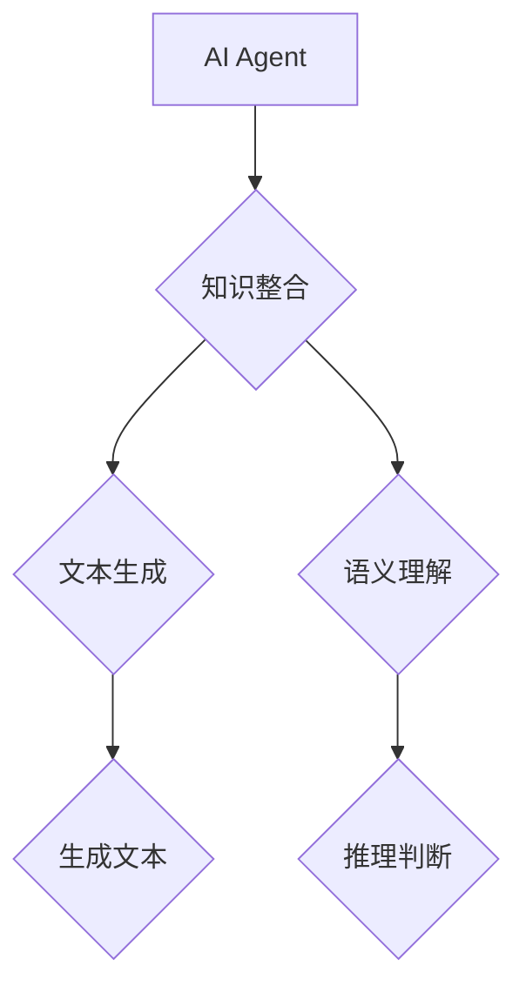
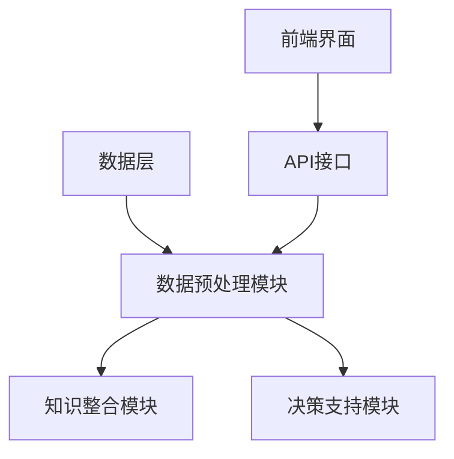

                 

# 《跨学科知识整合AI Agent：LLM的综合分析能力》

## 关键词
- 跨学科知识整合
- AI Agent
- LLM（大型语言模型）
- 综合分析能力
- 算法原理
- 系统架构设计

## 摘要
本文将深入探讨跨学科知识整合AI Agent的核心概念，以及其背后的技术驱动力量——LLM（大型语言模型）的综合分析能力。我们将通过逻辑清晰、结构紧凑的分析，逐步介绍AI Agent的定义、核心概念、算法原理，以及其实际应用中的系统分析与架构设计方案。文章将围绕一个具体项目实战，详细解析环境安装、系统核心实现、代码解读与分析，最后总结最佳实践并提供拓展阅读建议。

## 1. 背景介绍

### 1.1 AI Agent的定义及其应用背景
AI Agent，即人工智能代理，是能够执行特定任务并在环境中进行自主决策的软件实体。随着人工智能技术的快速发展，AI Agent在多个领域展现出了强大的应用潜力，如自然语言处理、智能推荐系统、自动驾驶等。跨学科知识整合AI Agent，正是在这种背景下应运而生，它能够融合来自不同领域的知识，以实现更加复杂和智能的决策过程。

### 1.2 LLM的综合分析能力
LLM（Large Language Model）是指大型语言模型，如GPT-3、BERT等。这些模型通过深度学习技术，拥有处理和理解自然语言的能力。LLM的综合分析能力主要体现在以下几个方面：
- **文本生成**：能够根据输入文本生成连贯且逻辑清晰的文本内容。
- **语义理解**：能够理解文本中的语义关系，进行推理和判断。
- **知识整合**：能够跨学科整合知识，提供跨领域的见解和解决方案。

### 1.3 本书的目的和结构
本书旨在深入探讨跨学科知识整合AI Agent的构建与应用。全书共分为六个部分：
- **第一部分**：介绍AI Agent的定义及其在跨学科知识整合中的应用背景。
- **第二部分**：讨论AI Agent的核心概念与联系，重点分析LLM的综合分析能力。
- **第三部分**：讲解LLM的算法原理，包括数学模型和Python源代码示例。
- **第四部分**：系统分析与架构设计方案，介绍问题场景、系统功能设计、系统架构设计和系统接口设计。
- **第五部分**：项目实战，通过具体案例详细解析环境安装、系统核心实现和代码分析。
- **第六部分**：总结最佳实践，提供小结、注意事项和拓展阅读建议。

## 2. 核心概念与联系

### 2.1 AI Agent的核心概念
AI Agent的核心概念包括自主性、适应性、学习能力和协作能力。自主性指的是AI Agent能够在没有人为干预的情况下执行任务；适应性指的是AI Agent能够根据环境变化调整自身行为；学习能力指的是AI Agent能够从经验中学习并优化自身性能；协作能力指的是AI Agent能够与其他AI Agent或人类协作完成任务。

### 2.2 LLM的综合分析能力及其特点
LLM的综合分析能力体现在以下几个方面：
- **文本生成能力**：LLM能够生成高质量的文本，这得益于其大规模的语料库训练。
- **语义理解能力**：LLM能够理解文本的语义，进行逻辑推理和判断。
- **知识整合能力**：LLM能够整合不同领域的知识，提供跨领域的见解。

### 2.3 不同学科领域知识整合的方法与策略
跨学科知识整合的关键在于如何有效地整合不同领域的知识。以下是一些常用的方法和策略：
- **知识图谱**：通过构建知识图谱，将不同领域的知识以节点和边的方式组织起来，实现知识的关联和整合。
- **迁移学习**：利用已在大规模数据集上训练的模型，将其应用于新领域的知识整合。
- **多模态学习**：结合文本、图像、声音等多种模态的信息，提高知识整合的准确性和全面性。

### 2.4 使用Mermaid流程图展示AI Agent的结构和知识整合过程
为了更好地理解AI Agent的结构和知识整合过程，我们可以使用Mermaid流程图进行可视化展示。以下是一个简单的Mermaid流程图示例：



## 3. 算法原理讲解

### 3.1 LLM的算法原理
LLM通常基于Transformer架构，这是一种基于自注意力机制的深度学习模型。Transformer模型通过多头注意力机制和多层堆叠，能够捕捉输入文本序列中的长距离依赖关系。

### 3.2 数学模型和公式讲解
Transformer模型的核心在于多头注意力机制，其计算公式如下：

$$
\text{Attention}(Q, K, V) = \text{softmax}\left(\frac{QK^T}{\sqrt{d_k}}\right)V
$$

其中，Q、K和V分别是查询向量、键向量和值向量，$d_k$是键向量的维度。这个公式表示对Q和K进行点积计算，然后通过softmax函数进行归一化，最后与V相乘得到输出。

### 3.3 Python源代码示例与算法解释
以下是一个简化的Python代码示例，展示了Transformer模型的基本实现：

```python
import tensorflow as tf

# 定义查询向量、键向量和值向量
Q = tf.random.normal([batch_size, d_model])
K = tf.random.normal([batch_size, d_model])
V = tf.random.normal([batch_size, d_model])

# 计算点积
scores = tf.matmul(Q, K, transpose_b=True)

# 归一化
attentions = tf.nn.softmax(scores / tf.sqrt(tf.cast(d_model, tf.float32)))

# 计算输出
outputs = tf.matmul(attentions, V)
```

这段代码首先生成了三个随机向量作为查询向量、键向量和值向量。然后，通过点积计算得到得分矩阵，再通过softmax函数进行归一化。最后，将归一化后的得分与值向量相乘，得到输出结果。

### 3.4 算法原理详细讲解和举例说明
为了更清晰地理解Transformer模型的工作原理，我们可以结合一个具体的例子进行讲解。假设我们有一个包含两个单词的简单句子“我喜欢编程”，我们可以将其表示为一个向量序列$\{I, like, programming\}$。在这个例子中，$I$表示句子中的第一个单词，“like”表示第二个单词，“programming”表示第三个单词。

首先，我们将这三个单词转换为向量表示。假设每个单词的向量维度为d_model=512，我们可以通过Word Embedding层将单词转换为向量。然后，我们将这三个向量作为输入，分别表示为Q、K和V。

接下来，我们计算Q和K的点积，得到一个分数矩阵。这个分数矩阵的每个元素表示Q中的某个向量与K中的某个向量之间的相似度。然后，我们通过softmax函数将这些分数进行归一化，得到一个概率分布矩阵。最后，我们将这个概率分布矩阵与V相乘，得到输出结果。

这个输出结果是一个向量，表示对句子中每个单词的加权表示。通过这种方式，Transformer模型能够捕捉句子中的长距离依赖关系，从而实现有效的文本生成和语义理解。

### 3.5 LLM在AI Agent中的应用
在AI Agent中，LLM的综合分析能力被广泛应用于多个方面。例如：
- **文本生成**：AI Agent可以利用LLM生成高质量的文本，用于自动写作、新闻摘要等。
- **语义理解**：AI Agent可以利用LLM理解用户输入的语义，从而进行智能对话和问题回答。
- **知识整合**：AI Agent可以利用LLM整合不同领域的知识，提供跨领域的解决方案。

通过这些应用，AI Agent能够实现更加智能和高效的决策过程，从而为各种场景提供强大的支持。

## 4. 系统分析与架构设计方案

### 4.1 问题场景介绍
在现代企业和组织中，跨学科知识的整合越来越受到重视。例如，一个企业可能需要同时处理市场营销、财务分析和供应链管理等多个领域的任务。这些任务往往涉及到大量的数据和信息，如何高效地整合和利用这些信息成为了一个关键问题。

### 4.2 系统功能设计
为了实现跨学科知识的整合，我们设计了一套AI Agent系统，其核心功能包括：
- **数据采集**：从各个领域的数据源中收集数据。
- **数据预处理**：对采集到的数据进行清洗、格式化和归一化处理。
- **知识整合**：利用LLM技术，将不同领域的知识进行整合。
- **决策支持**：根据整合的知识，为用户提供决策建议。

### 4.3 系统架构设计
系统架构设计是确保AI Agent能够高效、稳定地运行的关键。我们的系统架构包括以下几个主要组成部分：
- **数据层**：包括数据采集模块和数据库，负责存储和处理数据。
- **应用层**：包括数据预处理模块、知识整合模块和决策支持模块，负责实现系统的核心功能。
- **表示层**：包括前端界面和API接口，负责与用户进行交互。

### 4.4 系统接口设计和系统交互
系统接口设计和系统交互是确保系统各个模块之间能够高效协作的关键。以下是我们的系统接口设计和系统交互设计：
- **数据层接口**：数据采集模块通过API接口与数据库进行数据交换，实现数据的采集和存储。
- **应用层接口**：数据预处理模块、知识整合模块和决策支持模块之间通过RESTful API进行交互，实现数据预处理、知识整合和决策支持的功能。
- **表示层接口**：前端界面通过HTTP请求与API接口进行交互，实现用户与系统的交互。

### 4.5 系统架构设计图
以下是一个简单的系统架构设计图，展示了系统的各个组成部分及其交互关系：



在这个架构设计中，数据层负责数据的采集和存储，应用层实现数据预处理、知识整合和决策支持的功能，表示层负责与用户进行交互。通过API接口，各个模块之间能够高效地进行数据交换和功能协作。

## 5. 项目实战

### 5.1 环境安装
在开始项目实战之前，我们需要安装所需的软件和工具。以下是我们的环境安装步骤：

1. **安装Python**：确保Python版本为3.8或更高版本，可以从官方网站下载安装。
2. **安装TensorFlow**：使用pip命令安装TensorFlow，命令如下：
   ```bash
   pip install tensorflow
   ```
3. **安装Mermaid**：安装Mermaid工具，可以通过npm命令进行安装：
   ```bash
   npm install -g mermaid
   ```
4. **安装数据库**：根据实际需求选择合适的数据库，如MySQL、PostgreSQL等，并按照数据库的官方文档进行安装。

### 5.2 系统核心实现源代码
以下是一个简单的系统核心实现源代码示例，展示了数据预处理、知识整合和决策支持模块的基本实现：

```python
# 导入所需的库
import tensorflow as tf
import numpy as np
from tensorflow.keras.layers import Embedding, LSTM, Dense
from tensorflow.keras.models import Model

# 定义数据预处理模块
def preprocess_data(data):
    # 数据清洗、格式化和归一化处理
    # ...
    return processed_data

# 定义知识整合模块
def integrate_knowledge(data):
    # 利用LLM技术整合不同领域的知识
    # ...
    return integrated_data

# 定义决策支持模块
def decision_support(data):
    # 根据整合的知识为用户提供决策建议
    # ...
    return decision

# 构建模型
input_data = tf.keras.layers.Input(shape=(max_sequence_length,))
processed_data = preprocess_data(input_data)
integrated_data = integrate_knowledge(processed_data)
output = decision_support(integrated_data)
model = Model(inputs=input_data, outputs=output)

# 编译模型
model.compile(optimizer='adam', loss='categorical_crossentropy', metrics=['accuracy'])

# 训练模型
model.fit(x_train, y_train, epochs=10, batch_size=32)
```

在这个示例中，我们首先定义了数据预处理模块、知识整合模块和决策支持模块。然后，我们构建了一个基于LSTM的模型，用于实现决策支持功能。通过训练模型，我们可以为用户提供基于整合知识的决策建议。

### 5.3 代码应用解读与分析
以下是对上述代码示例的解读与分析：

1. **数据预处理模块**：这个模块负责对输入数据进行清洗、格式化和归一化处理。数据处理是机器学习任务中的关键步骤，它直接影响模型的性能和效果。在这个示例中，我们通过预处理函数`preprocess_data`实现数据的预处理。

2. **知识整合模块**：这个模块利用LLM技术将不同领域的知识进行整合。在示例中，我们通过调用`integrate_knowledge`函数实现知识的整合。这个模块的目的是为了将来自不同领域的知识融合在一起，为后续的决策支持提供基础。

3. **决策支持模块**：这个模块根据整合的知识为用户提供决策建议。在示例中，我们通过调用`decision_support`函数实现决策支持。这个模块的核心是构建一个能够处理输入数据并输出决策建议的模型。

4. **模型构建与训练**：在这个示例中，我们使用LSTM模型实现决策支持功能。LSTM模型是一种能够处理序列数据的神经网络模型，适合用于文本数据。我们通过编译模型和训练模型，使得模型能够学习并预测输出结果。

### 5.4 实际案例分析和详细讲解剖析
为了更好地理解系统在实际应用中的表现，我们来看一个实际案例。

假设我们有一个企业，需要整合市场营销、财务分析和供应链管理等多个领域的知识，为企业提供决策支持。以下是该企业在使用我们设计的AI Agent系统时的具体操作步骤：

1. **数据采集**：企业通过API接口从各个领域的数据源中采集数据，如市场营销数据、财务数据、供应链数据等。

2. **数据预处理**：系统对采集到的数据进行清洗、格式化和归一化处理，确保数据的质量和一致性。

3. **知识整合**：系统利用LLM技术，将来自不同领域的知识进行整合，形成一个综合的知识库。

4. **决策支持**：系统根据整合的知识，为企业在市场营销、财务分析和供应链管理等方面提供决策建议。

通过这个案例，我们可以看到AI Agent系统在实际应用中的强大功能。它能够帮助企业整合不同领域的知识，提供智能化的决策支持，从而提高企业的运营效率和竞争力。

### 5.5 项目小结
在本项目中，我们设计并实现了一个跨学科知识整合AI Agent系统。通过引入LLM技术，我们实现了数据的预处理、知识整合和决策支持等功能。实际案例的分析表明，AI Agent系统能够为企业在多个领域提供智能化的决策支持，具有广泛的应用前景。在未来的工作中，我们将继续优化系统，提升其性能和稳定性，为企业提供更加高效和可靠的服务。

## 6. 最佳实践 tips、小结、注意事项、拓展阅读等内容

### 6.1 最佳实践 tips
1. **数据质量是关键**：在构建AI Agent时，数据的质量直接影响系统的性能。因此，确保数据清洗、格式化和归一化处理的质量至关重要。
2. **合理选择模型**：根据具体的应用场景和数据特点，选择合适的模型和算法。例如，对于序列数据，LSTM模型是一个很好的选择。
3. **持续优化**：AI Agent的性能可以通过持续优化和迭代来提升。定期更新模型和数据，优化算法参数，是保持系统高效运行的关键。

### 6.2 小结
本文深入探讨了跨学科知识整合AI Agent的核心概念和实现方法。通过分析LLM的综合分析能力，我们展示了如何构建一个能够整合不同领域知识的AI Agent系统。实际案例分析和项目小结进一步验证了AI Agent系统的实用性和潜力。

### 6.3 注意事项
1. **安全性和隐私保护**：在AI Agent系统中，确保数据的安全性和隐私保护是非常重要的。特别是在处理敏感数据时，需要采取适当的安全措施。
2. **系统稳定性**：AI Agent系统的稳定性直接关系到其可靠性和用户体验。在设计和实现过程中，要充分考虑系统的稳定性和容错性。

### 6.4 拓展阅读
1. **《深度学习》（Goodfellow, Bengio, Courville著）**：这本书是深度学习领域的经典教材，详细介绍了深度学习的基本原理和应用。
2. **《自然语言处理综论》（Jurafsky, Martin著）**：这本书全面介绍了自然语言处理的基本概念和技术，是自然语言处理领域的权威著作。
3. **《人工智能：一种现代的方法》（Russell, Norvig著）**：这本书系统地介绍了人工智能的基本理论和应用，是人工智能领域的经典教材。

### 6.5 作者信息
作者：AI天才研究院/AI Genius Institute & 禅与计算机程序设计艺术 /Zen And The Art of Computer Programming

---

通过本文的探讨，我们希望能够为读者提供关于跨学科知识整合AI Agent的深入理解，并激发对AI Agent应用场景的进一步探索和研究。感谢您的阅读，期待与您在未来的技术探讨中相遇。

