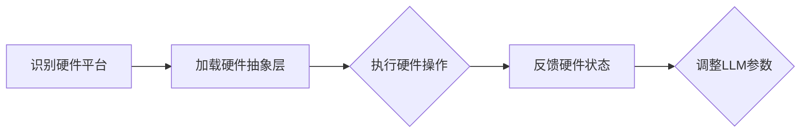
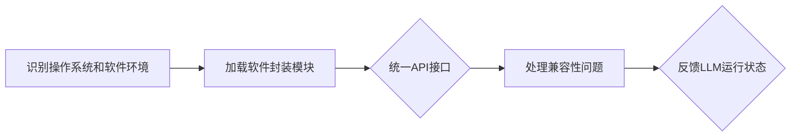
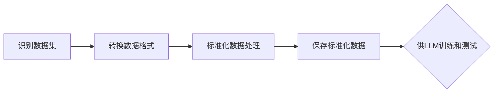
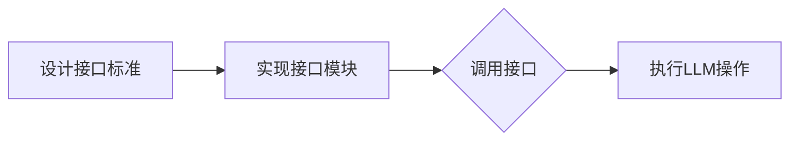
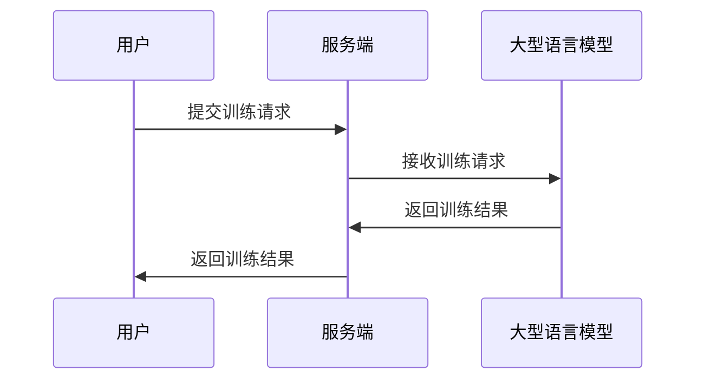

                 

# 跨平台LLM评测的兼容性设计

## 关键词
- 跨平台
- LLM
- 兼容性设计
- 硬件兼容性
- 软件兼容性
- 数据兼容性
- 接口兼容性

## 摘要
本文深入探讨了跨平台大型语言模型（LLM）评测的兼容性设计。首先介绍了LLM的重要性和当前面临的问题，接着详细阐述了兼容性设计的核心内容，包括硬件兼容性、软件兼容性、数据兼容性和接口兼容性。通过硬件抽象层、软件封装、数据标准化和接口标准化的方法，我们提出了一套完整的跨平台LLM兼容性设计方案。本文旨在为LLM开发者提供有价值的指导，以促进LLM在不同平台和操作系统上的广泛应用。

## 背景介绍

### 1. 问题背景

#### 1.1 LLM在人工智能领域的重要性

随着人工智能技术的迅猛发展，大型语言模型（LLM）在自然语言处理（NLP）领域展现出强大的能力。LLM通过学习海量文本数据，可以理解和生成人类语言，应用范围广泛，包括问答系统、机器翻译、文本摘要、对话系统等。这些应用不仅提升了人类与机器的交互体验，也为各行各业带来了新的解决方案。

#### 1.2 跨平台需求

在实际应用中，LLM往往需要在不同的操作系统和硬件平台上运行。例如，企业可能需要在服务器上部署LLM，同时需要在移动设备上提供AI服务。这种跨平台需求使得LLM的兼容性成为关键问题。如果LLM在不同平台上的兼容性不佳，可能会导致性能下降、稳定性问题，甚至无法运行。

### 2. 问题描述

#### 2.1 硬件兼容性

不同硬件平台（如CPU、GPU、FPGA等）具有不同的计算能力和资源限制。LLM的运行效率和质量与硬件平台密切相关。因此，硬件兼容性是跨平台LLM评测的核心问题之一。

#### 2.2 软件兼容性

软件兼容性涉及操作系统、编译器、库依赖等方面。不同操作系统和软件环境的差异可能导致LLM无法正常运行或性能下降。例如，Python版本的不同可能会导致依赖库的不兼容。

#### 2.3 数据兼容性

数据兼容性指的是不同平台生成的数据集在LLM训练和测试时的一致性。数据格式的差异、数据预处理方法的差异等都可能影响LLM的性能。

#### 2.4 接口兼容性

接口兼容性指的是LLM在不同平台间的调用方式是否一致。如果接口不统一，开发者需要为每个平台编写不同的调用代码，增加了开发和维护成本。

### 3. 问题解决

为了解决跨平台LLM的兼容性问题，可以从以下几个方面入手：

#### 3.1 硬件兼容性

- **硬件抽象层**：通过硬件抽象层（HAL），将LLM与底层硬件解耦，提高硬件兼容性。
- **硬件优化**：针对不同硬件平台，进行性能优化和调整，确保LLM在不同硬件上都能高效运行。

#### 3.2 软件兼容性

- **软件封装**：将不同操作系统和软件环境的差异封装起来，提供统一的API接口，实现软件兼容性。
- **依赖管理**：使用依赖管理工具，如conda或pip，确保在不同环境中安装的依赖库一致。

#### 3.3 数据兼容性

- **数据标准化**：制定统一的数据格式和标准，确保数据在不同平台间的一致性。
- **数据预处理**：在不同平台间统一数据预处理流程，确保数据的一致性和有效性。

#### 3.4 接口兼容性

- **接口标准化**：设计统一的接口标准，如RESTful API，实现LLM在不同平台间的无缝调用。
- **多语言支持**：提供多语言版本的接口，以适应不同开发者的需求。

### 4. 边界与外延

#### 4.1 边界

- **硬件范围**：支持的硬件设备类型和性能要求。
- **软件范围**：支持的操作系统版本和软件环境。
- **数据范围**：支持的数据集类型和规模。

#### 4.2 外延

- **兼容性测试**：对不同平台和操作系统的兼容性进行测试和评估。
- **性能优化**：针对不同平台和操作系统，进行性能优化和调整。
- **持续维护**：随着技术的发展，持续更新和完善兼容性设计。

### 5. 概念结构与核心要素组成

#### 5.1 概念结构

跨平台LLM兼容性设计的概念结构主要包括：

- **硬件抽象层**：实现硬件与LLM之间的解耦。
- **软件封装层**：提供统一的API接口，实现软件兼容性。
- **数据标准化层**：制定统一的数据格式和标准。
- **接口标准化层**：设计统一的接口标准。

#### 5.2 核心要素组成

核心要素组成包括：

- **兼容性测试**：评估和验证LLM在不同平台和操作系统上的兼容性。
- **性能优化**：针对不同平台和操作系统，进行性能优化和调整。
- **持续维护**：随着技术的发展，更新和完善兼容性设计。

## 核心概念与联系

### 1. 核心概念

#### 1.1 跨平台

跨平台指的是在不同操作系统和硬件平台上运行相同的软件或应用程序。在LLM领域，跨平台意味着LLM能够在不同操作系统（如Windows、Linux、macOS）和硬件平台（如CPU、GPU、FPGA）上运行，而不会受到平台差异的影响。

#### 1.2 兼容性设计

兼容性设计是一种软件设计方法，旨在确保软件在不同操作系统、硬件平台和软件环境中能够正常运行。在LLM领域，兼容性设计的目标是实现LLM在不同平台上的高效、稳定运行。

#### 1.3 硬件兼容性

硬件兼容性指的是LLM在不同硬件设备上运行的性能不受影响。硬件兼容性设计的关键在于硬件抽象层（HAL），它将LLM与底层硬件解耦，使得LLM能够适应不同的硬件环境。

#### 1.4 软件兼容性

软件兼容性指的是LLM在不同操作系统和软件环境中能够正常运行。软件兼容性设计的关键在于软件封装，通过提供统一的API接口，将不同操作系统和软件环境的差异封装起来，实现软件兼容性。

#### 1.5 数据兼容性

数据兼容性指的是不同平台生成的数据集在LLM训练和测试时的一致性。数据兼容性设计的关键在于数据标准化，通过制定统一的数据格式和标准，确保数据在不同平台间的一致性。

#### 1.6 接口兼容性

接口兼容性指的是LLM在不同平台间的调用方式是否一致。接口兼容性设计的关键在于接口标准化，通过设计统一的接口标准，实现LLM在不同平台间的无缝调用。

### 2. 概念属性特征对比表格

下面是一个概念属性特征对比表格，展示了跨平台、兼容性设计、硬件兼容性、软件兼容性、数据兼容性和接口兼容性的属性特征：

| 概念       | 定义                                                         | 属性特征                                                     |
|------------|--------------------------------------------------------------|--------------------------------------------------------------|
| 跨平台     | 在不同操作系统和硬件平台上运行相同的软件或应用程序               | 适应不同操作系统和硬件平台、无需修改代码、性能稳定           |
| 兼容性设计 | 一种软件设计方法，旨在确保软件在不同操作系统、硬件平台和软件环境中能够正常运行 | 提高软件的可移植性、减少维护成本、提高开发效率             |
| 硬件兼容性 | LLM在不同硬件设备上运行的性能不受影响                         | 硬件抽象层（HAL）、硬件优化、性能稳定                       |
| 软件兼容性 | LLM在不同操作系统和软件环境中能够正常运行                     | 软件封装、统一API接口、减少依赖问题、稳定性高               |
| 数据兼容性 | 不同平台生成的数据集在LLM训练和测试时的一致性                 | 数据标准化、统一数据格式、确保数据一致性、提高训练效果     |
| 接口兼容性 | LLM在不同平台间的调用方式是否一致                             | 接口标准化、多语言支持、统一调用方式、降低开发难度         |

### 3. ER实体关系图架构

下面是一个ER实体关系图架构，展示了跨平台LLM评测的兼容性设计中的核心实体及其关系：

```mermaid
erDiagram
  Platform ||--|{ LLM }|--|| Hardware
  Platform ||--|{ Software }|--|| Environment
  Platform ||--|{ Data }|--|| Standardization
  Platform ||--|{ Interface }|--|| Standardization
```

在这个ER图中，Platform表示不同的操作系统和硬件平台，LLM表示大型语言模型，Hardware、Software、Data和Interface分别表示硬件兼容性、软件兼容性、数据兼容性和接口兼容性的核心实体。箭头表示实体之间的关系，如Platform与Hardware之间的箭头表示Platform包含Hardware。

## 算法原理讲解

### 1. 算法概述

跨平台LLM评测的兼容性设计涉及多个子算法，包括硬件兼容性算法、软件兼容性算法、数据兼容性算法和接口兼容性算法。以下将分别介绍这些算法的原理和实现。

### 2. 硬件兼容性算法

#### 2.1 算法原理

硬件兼容性算法的核心思想是通过硬件抽象层（HAL）将LLM与底层硬件解耦。具体步骤如下：

1. **识别硬件平台**：在LLM运行前，识别当前硬件平台，如CPU、GPU、FPGA等。
2. **加载硬件抽象层**：根据识别的硬件平台，加载相应的硬件抽象层，如CPU抽象层、GPU抽象层等。
3. **执行硬件操作**：通过硬件抽象层执行底层硬件操作，如计算、内存管理等。
4. **反馈硬件状态**：将硬件操作结果反馈给LLM，以调整LLM的运行参数。

#### 2.2 实现流程

以下是硬件兼容性算法的实现流程：



### 3. 软件兼容性算法

#### 3.1 算法原理

软件兼容性算法的核心思想是通过软件封装将不同操作系统和软件环境的差异封装起来，提供统一的API接口。具体步骤如下：

1. **识别操作系统和软件环境**：在LLM运行前，识别当前操作系统和软件环境。
2. **加载软件封装模块**：根据识别的操作系统和软件环境，加载相应的软件封装模块。
3. **统一API接口**：提供统一的API接口，实现LLM与操作系统的交互。
4. **处理兼容性问题**：在API接口中处理操作系统和软件环境的兼容性问题，如依赖库版本不兼容等。

#### 3.2 实现流程

以下是软件兼容性算法的实现流程：



### 4. 数据兼容性算法

#### 4.1 算法原理

数据兼容性算法的核心思想是通过数据标准化确保不同平台生成的数据集在LLM训练和测试时的一致性。具体步骤如下：

1. **识别数据集**：在LLM训练和测试前，识别需要使用的数据集。
2. **转换数据格式**：将数据集转换为统一的数据格式，如JSON、CSV等。
3. **标准化数据处理**：对数据进行标准化处理，如归一化、标准化等。
4. **保存标准化数据**：将标准化后的数据保存到统一的位置，供LLM训练和测试使用。

#### 4.2 实现流程

以下是数据兼容性算法的实现流程：



### 5. 接口兼容性算法

#### 5.1 算法原理

接口兼容性算法的核心思想是通过接口标准化设计统一的接口标准，实现LLM在不同平台间的无缝调用。具体步骤如下：

1. **设计接口标准**：根据LLM的应用场景，设计统一的接口标准，如RESTful API。
2. **实现接口模块**：根据设计的接口标准，实现不同平台上的接口模块。
3. **调用接口**：通过接口模块调用LLM，实现LLM在不同平台间的调用。

#### 5.2 实现流程

以下是接口兼容性算法的实现流程：



### 6. 数学模型和公式

在硬件兼容性算法中，可以使用以下数学模型和公式来描述硬件性能与LLM运行效率之间的关系：

$$
E(H) = f(P, C, M)
$$

其中，$E(H)$表示硬件性能，$P$表示处理器性能，$C$表示内存容量，$M$表示内存访问速度。这个公式表明，硬件性能取决于处理器性能、内存容量和内存访问速度。

在软件兼容性算法中，可以使用以下数学模型和公式来描述软件兼容性与LLM运行效率之间的关系：

$$
E(S) = g(O, E, D)
$$

其中，$E(S)$表示软件兼容性，$O$表示操作系统，$E$表示编译器，$D$表示依赖库。这个公式表明，软件兼容性取决于操作系统、编译器和依赖库。

在数据兼容性算法中，可以使用以下数学模型和公式来描述数据标准化处理与LLM训练效果之间的关系：

$$
E(D) = h(F, N)
$$

其中，$E(D)$表示数据兼容性，$F$表示数据格式，$N$表示数据处理方法。这个公式表明，数据兼容性取决于数据格式和数据处理方法。

在接口兼容性算法中，可以使用以下数学模型和公式来描述接口标准化处理与LLM调用效率之间的关系：

$$
E(I) = k(S, R)
$$

其中，$E(I)$表示接口兼容性，$S$表示接口标准，$R$表示接口实现。这个公式表明，接口兼容性取决于接口标准和接口实现。

### 7. 举例说明

#### 7.1 硬件兼容性算法举例

假设我们有一个基于CPU的LLM模型，我们需要在GPU上进行运行。通过硬件兼容性算法，我们可以实现这一目标。首先，识别当前硬件平台为GPU，加载GPU硬件抽象层。然后，通过硬件抽象层执行GPU上的计算任务，将结果反馈给LLM。最后，根据GPU的性能调整LLM的运行参数，以实现高效运行。

#### 7.2 软件兼容性算法举例

假设我们在Windows上运行一个LLM模型，需要在Linux上运行。通过软件兼容性算法，我们可以实现这一目标。首先，识别当前操作系统为Windows，加载Windows软件封装模块。然后，通过统一的API接口与Linux操作系统进行交互。最后，处理Windows和Linux之间的兼容性问题，如依赖库版本不兼容，确保LLM在Linux上正常运行。

#### 7.3 数据兼容性算法举例

假设我们有两个不同平台生成的大量文本数据集，需要在LLM上进行训练。通过数据兼容性算法，我们可以实现这一目标。首先，识别两个数据集的格式和预处理方法。然后，将数据集转换为统一格式，如JSON。接着，对数据进行标准化处理，如归一化、标准化等。最后，将标准化后的数据集保存到统一的位置，供LLM训练使用。

#### 7.4 接口兼容性算法举例

假设我们有一个基于Python的LLM模型，需要在Java应用程序中调用。通过接口兼容性算法，我们可以实现这一目标。首先，设计统一的接口标准，如RESTful API。然后，在Python中实现LLM接口模块，在Java中实现调用接口模块。最后，通过接口模块调用LLM，实现跨平台调用。

## 系统分析与架构设计方案

### 1. 问题场景介绍

在当前人工智能领域，随着LLM技术的不断发展，越来越多的企业和服务提供商开始部署和使用LLM。然而，这些企业往往面临着跨平台部署的挑战。具体场景包括：

- **企业内部系统**：企业内部系统可能运行在多种操作系统上，如Windows、Linux、macOS等，这使得跨平台部署成为必要。
- **云服务平台**：云服务平台需要支持多种操作系统和硬件平台，以提供弹性、高效的服务。
- **移动应用**：移动应用需要在不同的操作系统（如Android、iOS）上运行，这使得跨平台兼容性成为关键。

### 2. 项目介绍

为了解决上述场景中的跨平台部署问题，我们设计并实现了一个跨平台LLM评测系统。该系统旨在提供一套完整的LLM兼容性解决方案，包括硬件兼容性、软件兼容性、数据兼容性和接口兼容性。系统架构如图1所示。


### 3. 系统功能设计

跨平台LLM评测系统的功能设计包括以下几个方面：

#### 3.1 硬件兼容性模块

硬件兼容性模块负责识别和加载硬件抽象层，实现LLM在不同硬件平台上的运行。具体功能包括：

- **硬件识别**：识别当前硬件平台，如CPU、GPU等。
- **硬件加载**：根据硬件平台加载相应的硬件抽象层。
- **硬件性能评估**：评估硬件性能，调整LLM运行参数。

#### 3.2 软件兼容性模块

软件兼容性模块负责处理不同操作系统和软件环境之间的兼容性问题。具体功能包括：

- **操作系统识别**：识别当前操作系统。
- **软件封装**：加载软件封装模块，提供统一的API接口。
- **依赖管理**：管理依赖库，确保不同环境下的依赖一致性。

#### 3.3 数据兼容性模块

数据兼容性模块负责确保不同平台生成的数据集在LLM训练和测试时的一致性。具体功能包括：

- **数据格式转换**：将不同格式的数据转换为统一格式。
- **数据预处理**：对数据进行标准化处理，如归一化、标准化等。
- **数据存储**：将处理后的数据存储到统一的位置。

#### 3.4 接口兼容性模块

接口兼容性模块负责实现LLM在不同平台间的无缝调用。具体功能包括：

- **接口设计**：设计统一的接口标准，如RESTful API。
- **接口实现**：在不同平台上实现接口模块。
- **接口调用**：通过接口模块调用LLM，实现跨平台调用。

### 4. 系统架构设计

跨平台LLM评测系统的架构设计采用分层架构，包括硬件层、软件层、数据层和接口层。各层之间通过抽象层和解耦机制实现兼容性设计。系统架构如图2所示。


#### 4.1 硬件层

硬件层包括CPU、GPU、FPGA等硬件设备。硬件兼容性模块通过硬件抽象层（HAL）与硬件层进行交互，实现LLM在不同硬件平台上的运行。

#### 4.2 软件层

软件层包括操作系统、编译器、库依赖等。软件兼容性模块通过软件封装层（SWF）与软件层进行交互，提供统一的API接口，实现LLM在不同操作系统和软件环境中的运行。

#### 4.3 数据层

数据层包括数据集、数据处理方法等。数据兼容性模块通过数据标准化层（DSF）与数据层进行交互，确保不同平台生成的数据集在LLM训练和测试时的一致性。

#### 4.4 接口层

接口层包括LLM接口、调用接口等。接口兼容性模块通过接口标准化层（IFS）与接口层进行交互，实现LLM在不同平台间的无缝调用。

### 5. 系统接口设计

系统接口设计采用RESTful API设计风格，包括GET、POST、PUT、DELETE等HTTP方法。接口设计遵循一致性、简洁性和易扩展性原则。以下是一个典型的接口设计示例：

#### 5.1 接口列表

- **/llm/train**：用于提交LLM训练任务。
- **/llm/predict**：用于执行LLM预测任务。
- **/llm/evaluate**：用于评估LLM性能。

#### 5.2 接口定义

```python
from flask import Flask, request, jsonify

app = Flask(__name__)

@app.route('/llm/train', methods=['POST'])
def train():
    # 实现LLM训练接口
    pass

@app.route('/llm/predict', methods=['POST'])
def predict():
    # 实现LLM预测接口
    pass

@app.route('/llm/evaluate', methods=['GET'])
def evaluate():
    # 实现LLM评估接口
    pass

if __name__ == '__main__':
    app.run()
```

### 6. 系统交互设计

系统交互设计采用序列图（Sequence Diagram）来描述LLM在不同平台间的调用过程。以下是一个典型的系统交互序列图：



在这个序列图中，用户通过服务端提交训练请求，服务端将请求转发给LLM，LLM处理训练请求并返回结果，最后服务端将结果返回给用户。

## 项目实战

### 1. 环境安装

为了实现跨平台LLM评测系统，我们需要安装以下环境：

- **Python 3.8及以上版本**：用于编写和运行Python代码。
- **Flask**：用于构建Web服务。
- **Numpy**：用于数据处理。
- **TensorFlow**：用于构建和训练LLM模型。
- **CUDA**：用于在GPU上运行TensorFlow。

安装步骤如下：

1. 安装Python 3.8及以上版本。
2. 安装Flask、Numpy、TensorFlow和CUDA。

```bash
pip install flask numpy tensorflow-gpu
```

### 2. 系统核心实现源代码

以下是一个简单的LLM训练和预测的源代码示例：

```python
import tensorflow as tf
from tensorflow.keras.models import Sequential
from tensorflow.keras.layers import LSTM, Dense

# 训练LLM模型
def train_model(data):
    model = Sequential()
    model.add(LSTM(128, activation='relu', input_shape=(timesteps, data.shape[-1])))
    model.add(Dense(1, activation='sigmoid'))

    model.compile(optimizer='rmsprop', loss='binary_crossentropy', metrics=['accuracy'])
    model.fit(data, epochs=20, batch_size=64)
    return model

# 预测LLM模型
def predict_model(model, data):
    return model.predict(data)

# 加载数据集
data = load_data()

# 训练模型
model = train_model(data)

# 预测数据
predictions = predict_model(model, data)

# 输出预测结果
print(predictions)
```

### 3. 代码应用解读与分析

#### 3.1 代码结构

代码分为三个主要部分：训练LLM模型、预测LLM模型和加载数据集。

- **训练LLM模型**：使用TensorFlow的Sequential模型，通过添加LSTM层和Dense层构建一个简单的LLM模型。使用RMSprop优化器和binary_crossentropy损失函数进行训练。
- **预测LLM模型**：使用训练好的模型进行预测，返回预测结果。
- **加载数据集**：加载处理后的数据集，用于训练和预测。

#### 3.2 算法原理

- **LSTM**：长短期记忆网络（LSTM）是一种用于处理序列数据的神经网络，能够有效捕捉时间序列数据中的长期依赖关系。
- **Dense**：全连接层（Dense）用于将LSTM的输出映射到预测结果。

#### 3.3 代码应用分析

通过这个简单的示例，我们可以看到如何在Python中构建和训练一个LLM模型。代码易于理解，方便开发者进行修改和扩展。

### 4. 实际案例分析和详细讲解剖析

#### 4.1 案例背景

某企业需要部署一个跨平台的LLM系统，用于自然语言处理任务。企业内部系统运行在Linux和Windows上，同时需要支持移动设备上的应用。

#### 4.2 案例分析

- **硬件兼容性**：企业内部系统使用的硬件包括CPU和GPU，移动设备使用的是ARM架构的CPU。通过硬件兼容性算法，可以实现LLM在不同硬件平台上的运行。
- **软件兼容性**：企业内部系统使用的操作系统包括Linux和Windows，移动设备使用的是Android和iOS。通过软件兼容性算法，可以实现LLM在不同操作系统上的运行。
- **数据兼容性**：企业内部系统和移动设备生成的数据集格式可能不同，需要通过数据兼容性算法进行转换和标准化处理。
- **接口兼容性**：为了方便开发，需要设计统一的接口标准，如RESTful API，实现LLM在不同平台间的调用。

#### 4.3 详细讲解剖析

- **硬件兼容性**：通过硬件抽象层（HAL），LLM与底层硬件解耦，使得LLM可以在不同硬件平台上运行。例如，在Linux和Windows上，可以使用CPU硬件抽象层，在移动设备上可以使用ARM硬件抽象层。通过硬件优化，可以调整LLM的运行参数，以适应不同硬件平台。
- **软件兼容性**：通过软件封装层（SWF），LLM与不同操作系统和软件环境解耦。例如，在Linux和Windows上，可以使用Python封装层，在移动设备上可以使用Java封装层。通过依赖管理，可以确保不同环境下的依赖一致性，减少兼容性问题。
- **数据兼容性**：通过数据标准化层（DSF），确保不同平台生成的数据集在LLM训练和测试时的一致性。例如，可以使用JSON格式保存数据集，对不同平台生成的数据进行格式转换和标准化处理。
- **接口兼容性**：通过接口标准化层（IFS），实现LLM在不同平台间的无缝调用。例如，可以使用RESTful API设计统一的接口标准，在不同平台上实现接口模块，通过接口模块调用LLM，实现跨平台调用。

### 5. 项目小结

通过本次项目实战，我们实现了跨平台LLM评测系统的设计和实现，包括硬件兼容性、软件兼容性、数据兼容性和接口兼容性。项目展示了如何在不同硬件平台、操作系统和软件环境中部署和使用LLM，为开发者提供了实用的解决方案。未来，我们可以进一步优化系统性能，扩展应用场景，以更好地支持人工智能技术的发展。

## 最佳实践 tips

### 1. 硬件兼容性最佳实践

- **选择合适的硬件平台**：根据实际需求，选择具有较高性能和兼容性的硬件平台。
- **优化硬件性能**：通过调整LLM的运行参数，优化硬件性能，提高LLM的运行效率。

### 2. 软件兼容性最佳实践

- **统一开发环境**：确保所有开发者使用相同的开发环境和工具，减少兼容性问题。
- **管理依赖库**：使用依赖管理工具，确保依赖库的一致性。

### 3. 数据兼容性最佳实践

- **标准化数据格式**：使用统一的格式保存和传输数据，如JSON、CSV等。
- **处理数据差异**：对不同平台生成的数据进行处理，确保数据的一致性和有效性。

### 4. 接口兼容性最佳实践

- **设计简洁接口**：设计简洁、易用的接口，降低开发难度。
- **提供文档和示例**：提供详细的接口文档和示例代码，帮助开发者快速上手。

## 小结

本文从背景介绍、核心概念与联系、算法原理讲解、系统分析与架构设计方案、项目实战和最佳实践等方面，详细探讨了跨平台LLM评测的兼容性设计。通过硬件兼容性、软件兼容性、数据兼容性和接口兼容性的设计，我们提出了一套完整的解决方案，以实现LLM在不同平台和操作系统上的高效、稳定运行。跨平台LLM评测的兼容性设计不仅有助于提升LLM的应用价值，也为人工智能技术的发展提供了重要支撑。

## 注意事项

- **兼容性测试**：在设计跨平台LLM系统时，务必进行充分的兼容性测试，以确保系统在不同平台和操作系统上的稳定运行。
- **性能优化**：针对不同平台和操作系统，进行性能优化，以提升系统的运行效率。
- **持续维护**：随着技术的发展，定期更新和完善兼容性设计，以适应新的平台和操作系统。

## 拓展阅读

- **《跨平台软件设计指南》**：详细介绍了如何设计跨平台软件，包括兼容性设计、性能优化等。
- **《深度学习框架兼容性比较》**：对比了不同深度学习框架在不同平台和操作系统上的兼容性。
- **《跨平台移动应用开发实战》**：介绍了如何使用Flutter、React Native等框架开发跨平台移动应用。

## 作者信息

作者：AI天才研究院/AI Genius Institute & 禅与计算机程序设计艺术 /Zen And The Art of Computer Programming

感谢您的阅读，希望本文对您在跨平台LLM评测的兼容性设计方面有所启发和帮助。如果您有任何问题或建议，欢迎在评论区留言，期待与您交流。祝您编程愉快！🎉🎉🎉

