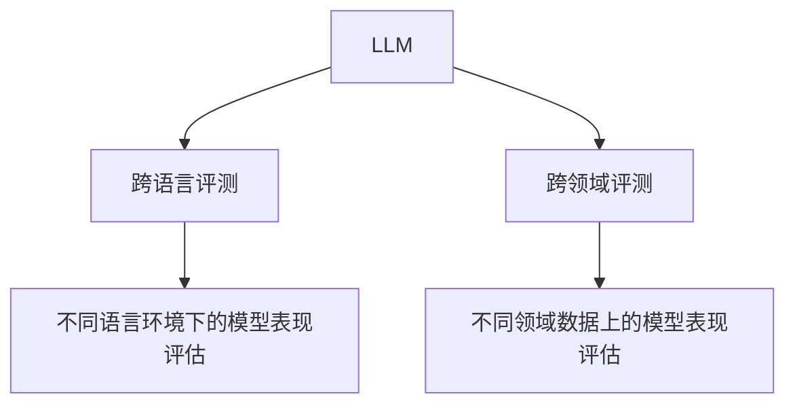

                 

### 文章标题

# 《跨语言、跨领域的LLM评测挑战》

### 文章关键词

- 跨语言评测
- 跨领域评测
- LLM
- 评测指标
- 案例分析

### 摘要

本文将深入探讨跨语言和跨领域的LLM（大型语言模型）评测面临的挑战。通过详细介绍LLM的基本概念、评测方法与指标，以及跨语言和跨领域评测的难点与解决方案，本文旨在为研究者提供有价值的参考。文章将结合实际案例，分析现有技术的不足，并提出未来可能的发展方向，以期为LLM评测领域的研究提供新的思路。

## 《跨语言、跨领域的LLM评测挑战》目录大纲

### 第一部分：背景介绍与基础理论

#### 第1章：问题背景

##### 1.1.1 问题背景

##### 1.1.2 描述问题

##### 1.1.3 解决问题的意义

##### 1.1.4 边界与外延

#### 第2章：核心概念

##### 2.1.1 LLM的定义

##### 2.1.2 跨语言评测

##### 2.1.3 跨领域评测

##### 2.1.4 概念关系图

### 第二部分：核心概念与联系

#### 第3章：LLM的原理与特征

##### 3.1.1 LLM的基本原理

##### 3.1.2 LLM的核心特征

##### 3.1.3 特征对比表格

##### 3.1.4 ER实体关系图

### 第三部分：评测方法与指标

#### 第4章：评测方法

##### 4.1.1 文本匹配评测方法

##### 4.1.2 分类评测方法

##### 4.1.3 生成评测方法

#### 第5章：评测指标

##### 5.1.1 准确率、召回率与F1值

##### 5.1.2 ROUGE评分

##### 5.1.3 BLEU评分

##### 5.1.4 指标对比与选择

### 第四部分：跨语言评测挑战

#### 第6章：跨语言评测方法

##### 6.1.1 跨语言文本匹配方法

##### 6.1.2 跨语言分类方法

##### 6.1.3 跨语言生成方法

#### 第7章：跨语言评测指标

##### 7.1.1 跨语言评测指标的调整

##### 7.1.2 跨语言评测指标的对比

##### 7.1.3 跨语言评测指标的选择

### 第五部分：跨领域评测挑战

#### 第8章：跨领域评测方法

##### 8.1.1 跨领域文本匹配方法

##### 8.1.2 跨领域分类方法

##### 8.1.3 跨领域生成方法

#### 第9章：跨领域评测指标

##### 9.1.1 跨领域评测指标的调整

##### 9.1.2 跨领域评测指标的对比

##### 9.1.3 跨领域评测指标的选择

### 第六部分：实际案例分析

#### 第10章：案例一：跨语言评测

##### 10.1.1 案例背景

##### 10.1.2 评测方法

##### 10.1.3 评测结果分析

#### 第11章：案例二：跨领域评测

##### 11.1.1 案例背景

##### 11.1.2 评测方法

##### 11.1.3 评测结果分析

### 第七部分：总结与展望

#### 第12章：总结与反思

##### 12.1.1 主要成果

##### 12.1.2 存在问题

##### 12.1.3 改进方向

#### 第13章：展望

##### 13.1.1 跨语言、跨领域评测的未来发展方向

##### 13.1.2 可能的突破点

## 附录

### 附录A：相关术语解释

### 附录B：参考文献

### 附录C：代码示例

## 第一部分：背景介绍与基础理论

### 第1章：问题背景

#### 1.1.1 问题背景

在当前的人工智能领域，语言模型（Language Model，简称LM）取得了显著的进展。特别是大型语言模型（Large Language Model，简称LLM），如GPT-3、BERT等，已经在自然语言处理（Natural Language Processing，简称NLP）的多个任务中展现了强大的能力。这些模型在机器翻译、文本生成、问答系统等应用中取得了卓越的成绩，极大地推动了人工智能技术的发展。

然而，随着LLM应用范围的扩大，跨语言和跨领域的评测挑战也逐渐显现。跨语言评测关注的是如何在不同的语言之间对LLM的性能进行评估；而跨领域评测则关注如何在不同的领域中对LLM的表现进行评价。这两个问题不仅对评测方法提出了新的要求，也对评价指标和框架的设计提出了挑战。

#### 1.1.2 描述问题

在跨语言评测方面，不同语言之间存在巨大的差异，包括词汇、语法结构、语义表达等。这些差异使得直接使用传统的评测方法（如BLEU、ROUGE等）可能无法准确反映LLM在不同语言上的性能。例如，在机器翻译任务中，一个模型可能在源语言到目标语言的翻译上表现良好，但在目标语言到源语言的翻译上可能表现较差。

在跨领域评测方面，不同领域的数据集和任务类型具有不同的特征。这导致模型在某一领域表现优异，但在另一领域可能表现不佳。例如，一个在科技领域训练的模型可能在回答与科技相关的问题时表现出色，但在处理法律问题时可能无法胜任。

#### 1.1.3 解决问题的意义

解决跨语言和跨领域的LLM评测挑战具有重要意义。首先，准确的评测能够帮助研究者更好地理解LLM在不同语言和领域中的性能，从而指导后续的研究和开发。其次，有效的评测方法能够提高LLM在实际应用中的可靠性，降低错误率和误用风险。

此外，跨语言和跨领域评测的研究还将推动评测理论和方法的发展，促进人工智能技术的整体进步。

#### 1.1.4 边界与外延

在讨论跨语言评测时，需要明确评测的语言范围和任务类型。例如，是否包括所有自然语言或仅限于少数常用语言？是否涉及语音识别、手写识别等非文本任务？

在跨领域评测方面，需要界定领域的范围和具体任务。例如，是否包括所有专业领域或仅限于某些特定领域？是否涵盖文本生成、文本分类、问答系统等多种任务类型？

通过明确边界与外延，可以更好地聚焦研究问题，提高研究的针对性和实用性。

### 第2章：核心概念

#### 2.1.1 LLM的定义

大型语言模型（LLM）是一种基于深度学习技术的自然语言处理模型。它通过学习海量文本数据，能够生成符合语法和语义规则的文本序列。LLM通常采用神经网络架构，如Transformer、BERT等，具有强大的表示能力和生成能力。

#### 2.1.2 跨语言评测

跨语言评测（Cross-Lingual Evaluation）是指在不同语言之间对自然语言处理模型进行性能评估。它关注的是如何在不同语言环境下准确衡量模型的表现。跨语言评测的目标是找到一种公平、有效的评价方法，以比较模型在不同语言上的性能。

#### 2.1.3 跨领域评测

跨领域评测（Cross-Domain Evaluation）是指在不同领域之间对自然语言处理模型进行性能评估。它关注的是如何在不同领域数据上准确衡量模型的表现。跨领域评测的目标是找到一种适应多种领域需求、全面评估模型性能的方法。

#### 2.1.4 概念关系图

以下是LLM、跨语言评测和跨领域评测的概念关系图：



通过概念关系图，可以清晰地看到LLM作为基础，跨语言评测和跨领域评测作为延伸，分别关注不同层面的模型性能评估。

## 第二部分：核心概念与联系

### 第3章：LLM的原理与特征

#### 3.1.1 LLM的基本原理

LLM（大型语言模型）的基本原理基于深度学习技术和神经网络架构，特别是近年来流行的Transformer和BERT等模型。Transformer模型通过自注意力机制（Self-Attention Mechanism）处理文本序列，能够捕捉到序列中各个位置之间的依赖关系。BERT模型则通过双向编码（Bidirectional Encoder Representations from Transformers）结构，同时考虑文本序列的前后信息，进一步提高模型的表示能力。

具体来说，LLM的训练过程主要包括以下步骤：

1. **数据预处理**：从海量文本数据中提取有用的信息，如词向量、词嵌入等，并进行预处理，如去除停用词、分词、标记化等。
2. **模型初始化**：初始化模型的参数，如权重、偏置等。
3. **前向传播**：将输入的文本序列传递到神经网络中，通过一系列的线性变换和激活函数，得到模型的输出。
4. **损失函数**：计算模型输出与实际标签之间的差距，通过损失函数（如交叉熵损失）计算损失值。
5. **反向传播**：利用梯度下降算法，更新模型的参数，降低损失值。

#### 3.1.2 LLM的核心特征

LLM具有以下核心特征：

1. **大规模**：LLM通常由数十亿个参数组成，能够处理大规模的文本数据。
2. **自适应**：LLM能够自适应地学习不同的语言和任务，无需对模型进行重新训练。
3. **高精度**：LLM在多种NLP任务上取得了较高的准确率，如文本分类、文本生成、机器翻译等。
4. **灵活性强**：LLM能够应用于多种场景，如问答系统、对话机器人、文本摘要等。

#### 3.1.3 特征对比表格

以下是LLM与其他几种常见语言模型的特征对比表格：

| 模型类型 | 特征                     | 说明                                                         |
| -------- | ------------------------ | ------------------------------------------------------------ |
| LLM      | 大规模、自适应、高精度、灵活性强 | 基于深度学习，具有强大的表示能力和生成能力，适用于多种NLP任务 |
| RNN      | 序列记忆、局部依赖        | 基于循环神经网络，能够处理序列数据，但在长距离依赖问题上存在局限 |
| LSTM     | 长期记忆、门控机制        | 基于长短时记忆网络，能够解决RNN的梯度消失问题，但计算复杂度高 |
| BERT     | 双向编码、上下文信息      | 基于Transformer模型，能够同时考虑文本序列的前后信息，提高表示能力 |

#### 3.1.4 ER实体关系图

以下是LLM的ER（实体-关系）关系图，展示了LLM的核心组件和关系：

```mermaid
erDiagram
    Model ||--|{ Dataset } Dataset
    Model ||--|{ Parameters } Parameters
    Model ||--|{ Preprocessing } Preprocessing
    Model ||--|{ Training } Training
    Model ||--|{ Evaluation } Evaluation
    Model ||--|{ Inference } Inference
```

在该ER图中，`Model`代表大型语言模型，与其他组件（如`Dataset`、`Parameters`、`Preprocessing`、`Training`、`Evaluation`和`Inference`）之间存在明确的依赖关系。这有助于我们理解LLM的整体架构和工作流程。

### 第三部分：评测方法与指标

#### 第4章：评测方法

#### 4.1.1 文本匹配评测方法

文本匹配评测方法主要用于评估两个文本序列之间的一致性或相似度。这类方法在信息检索、文本相似度比较等任务中广泛应用。常用的文本匹配方法包括：

1. **基于编辑距离的方法**：如Levenshtein距离，计算两个文本序列之间的最小编辑操作次数。
2. **基于信息论的方法**：如Kullback-Leibler散度，衡量两个概率分布之间的差异。
3. **基于机器学习的方法**：如支持向量机（SVM）、神经网络等，通过训练模型预测文本序列的匹配程度。

文本匹配评测方法的核心是找到一个衡量文本相似度的指标，通常采用定量评价的方式，如准确率、召回率、F1值等。

#### 4.1.2 分类评测方法

分类评测方法用于评估模型在文本分类任务中的性能。常见的分类评测方法包括：

1. **基于规则的评测方法**：如混淆矩阵，通过计算各类别之间的交叉和误差，评估分类模型的性能。
2. **基于机器学习的评测方法**：如支持向量机（SVM）、随机森林（Random Forest）等，通过训练模型对分类任务进行评估。
3. **基于信息熵的方法**：如信息增益（Information Gain），根据特征的重要程度评估分类器的性能。

分类评测方法的关键在于如何设计合适的评价指标，以全面衡量模型的分类能力。

#### 4.1.3 生成评测方法

生成评测方法主要用于评估文本生成模型的性能。这类方法在自动写作、对话生成等任务中具有广泛应用。常见的生成评测方法包括：

1. **基于人类评分的方法**：如BLEU、ROUGE等，通过人工评分评估生成文本的质量。
2. **基于自动评价指标的方法**：如编辑距离、句法分析等，通过计算生成文本与标准文本之间的差异评估生成模型的性能。
3. **基于机器学习的方法**：如生成对抗网络（GAN），通过训练模型生成高质量的文本。

生成评测方法的核心在于如何设计一个既客观又准确的评估框架，以全面衡量文本生成模型的性能。

#### 第5章：评测指标

#### 5.1.1 准确率、召回率与F1值

准确率（Accuracy）、召回率（Recall）和F1值（F1 Score）是分类任务中常用的评测指标。

1. **准确率**：准确率表示模型预测正确的样本占总样本的比例，公式为：
   $$
   \text{Accuracy} = \frac{\text{正确预测的样本数}}{\text{总样本数}}
   $$

2. **召回率**：召回率表示模型正确预测的样本数占所有实际正样本的比例，公式为：
   $$
   \text{Recall} = \frac{\text{正确预测的正样本数}}{\text{实际正样本数}}
   $$

3. **F1值**：F1值是准确率和召回率的调和平均值，公式为：
   $$
   \text{F1 Score} = 2 \times \frac{\text{Accuracy} \times \text{Recall}}{\text{Accuracy} + \text{Recall}}
   $$

这些指标能够全面衡量分类模型的性能，但各有优缺点。例如，准确率在样本分布不均时可能不太可靠，而召回率可能更关注实际正样本的识别。

#### 5.1.2 ROUGE评分

ROUGE（Recall-Oriented Understudy for Gisting Evaluation）评分是一种广泛用于文本生成评测的指标。它通过比较生成文本与标准文本的相似度，评估生成文本的质量。ROUGE评分分为多个子评分，如ROUGE-1、ROUGE-2、ROUGE-L等，分别计算词、词组、句子级别的匹配情况。ROUGE评分的公式为：

$$
\text{ROUGE} = \frac{\text{匹配的n-gram数}}{\text{标准文本中的n-gram数}}
$$

ROUGE评分能够有效衡量文本生成模型的生成质量，但在处理长文本时可能存在一定局限性。

#### 5.1.3 BLEU评分

BLEU（Bilingual Evaluation Understudy）评分是另一种常用的文本生成评测指标。它通过计算生成文本与参考文本之间的重叠度，评估生成文本的质量。BLEU评分使用n-gram匹配度、词序相似度等多个指标，综合评估生成文本的质量。BLEU评分的公式为：

$$
\text{BLEU} = \frac{1}{N} \sum_{i=1}^{N} \log \left( P(n_i) \right)
$$

其中，$N$表示n-gram的长度，$P(n_i)$表示第i个n-gram在参考文本中出现的概率。

BLEU评分在处理短文本时表现较好，但在长文本中可能存在过度拟合的问题。

#### 5.1.4 指标对比与选择

在评测LLM时，选择合适的评测指标至关重要。准确率、召回率、F1值适用于分类任务，ROUGE、BLEU适用于文本生成任务。在实际应用中，需要根据任务特点、数据分布等因素综合考虑，选择最合适的评测指标。

例如，在跨语言评测中，由于不同语言之间的差异，BLEU和ROUGE可能更适合评估生成文本的质量。而在跨领域评测中，准确率和召回率可能更能反映模型在特定领域的性能。

总之，合理选择评测指标，能够更准确地评估LLM在不同场景下的性能，为研究者和开发者提供有价值的参考。

### 第四部分：跨语言评测挑战

#### 第6章：跨语言评测方法

跨语言评测方法关注的是如何在不同的语言之间对LLM的性能进行评估。由于不同语言之间的巨大差异，传统的评测方法（如BLEU、ROUGE等）可能无法准确反映LLM在不同语言上的性能。因此，需要开发新的评测方法，以适应跨语言的评测需求。

#### 6.1.1 跨语言文本匹配方法

跨语言文本匹配方法旨在评估LLM在不同语言之间的文本匹配能力。以下是一些常用的跨语言文本匹配方法：

1. **基于规则的跨语言匹配方法**：这类方法通过定义一系列规则，将源语言文本转换为标记化形式，然后与目标语言文本进行比较。例如，使用词形还原规则、词性标注规则等。这种方法简单直观，但规则难以覆盖所有情况。

2. **基于统计的跨语言匹配方法**：这类方法利用统计学习技术，如隐马尔可夫模型（HMM）、条件随机场（CRF）等，学习源语言文本和目标语言文本之间的映射关系。这种方法能够自动适应语言差异，但计算复杂度较高。

3. **基于神经网络的跨语言匹配方法**：这类方法使用深度学习技术，如循环神经网络（RNN）、卷积神经网络（CNN）等，学习源语言文本和目标语言文本之间的映射关系。例如，Seq2Seq模型就是一种常用的跨语言文本匹配方法。

4. **基于翻译的跨语言匹配方法**：这类方法利用已有的翻译资源，如机器翻译模型、双语词典等，将源语言文本转换为标记化形式，然后与目标语言文本进行比较。这种方法能够充分利用翻译资源，但依赖于高质量的翻译模型。

#### 6.1.2 跨语言分类方法

跨语言分类方法旨在评估LLM在不同语言之间的分类能力。以下是一些常用的跨语言分类方法：

1. **基于特征提取的跨语言分类方法**：这类方法首先从源语言文本中提取特征，如词袋（Bag-of-Words）、TF-IDF等，然后使用分类器进行分类。例如，支持向量机（SVM）、朴素贝叶斯（Naive Bayes）等。这种方法简单有效，但特征提取过程可能无法充分捕捉语言差异。

2. **基于翻译的跨语言分类方法**：这类方法利用已有的翻译资源，将源语言文本转换为目标语言文本，然后使用目标语言的分类器进行分类。这种方法能够充分利用翻译资源，但依赖于高质量的翻译模型。

3. **基于神经网络的跨语言分类方法**：这类方法使用深度学习技术，如循环神经网络（RNN）、卷积神经网络（CNN）等，直接从源语言文本中提取特征并进行分类。例如，多语言BERT（Multilingual BERT）就是一种常用的跨语言分类方法。

4. **基于多任务学习的跨语言分类方法**：这类方法通过多任务学习（Multi-Task Learning）技术，同时训练多个分类任务，提高模型在跨语言分类任务中的性能。例如，使用多个语言的任务数据同时训练分类器。

#### 6.1.3 跨语言生成方法

跨语言生成方法旨在评估LLM在不同语言之间的文本生成能力。以下是一些常用的跨语言生成方法：

1. **基于翻译的跨语言生成方法**：这类方法利用已有的翻译资源，将源语言文本转换为目标语言文本。例如，使用机器翻译模型（如GPT-3）进行跨语言文本生成。这种方法能够利用高质量的翻译资源，但可能受到翻译质量的影响。

2. **基于神经网络的跨语言生成方法**：这类方法使用深度学习技术，如循环神经网络（RNN）、卷积神经网络（CNN）等，直接从源语言文本中生成目标语言文本。例如，使用多语言Transformer模型（如mBERT）进行跨语言文本生成。这种方法能够直接捕捉语言特征，但计算复杂度较高。

3. **基于上下文的跨语言生成方法**：这类方法利用上下文信息，如源语言文本的上下文和目标语言文本的上下文，生成目标语言文本。例如，使用多语言预训练模型（如XLM-R）进行跨语言文本生成。这种方法能够更好地利用上下文信息，提高生成文本的质量。

4. **基于迁移学习的跨语言生成方法**：这类方法通过迁移学习（Transfer Learning）技术，将源语言模型的知识迁移到目标语言模型中，提高目标语言模型在文本生成任务中的性能。例如，使用预训练的多语言模型（如XLM）进行跨语言文本生成。这种方法能够充分利用已有模型的知识，提高生成文本的质量。

通过以上方法，可以有效地评估LLM在不同语言之间的性能，为跨语言评测提供有力的支持。

#### 第7章：跨语言评测指标

在跨语言评测中，选择合适的评价指标对于准确评估LLM的性能至关重要。以下将介绍几种常见的跨语言评测指标，并分析其在实际应用中的优缺点。

#### 7.1.1 跨语言评测指标的调整

1. **基于编辑距离的指标**：如跨语言编辑距离（Cross-Lingual Edit Distance，简称XLED）。XLED通过计算源语言文本和目标语言文本之间的最小编辑操作次数，来衡量文本之间的相似度。公式为：
   $$
   \text{XLED} = \frac{\text{最小编辑操作次数}}{\text{文本长度}}
   $$
   优点：直观地反映了文本之间的差异。  
   缺点：可能忽略语义信息，对长文本的评估效果不佳。

2. **基于概率模型的指标**：如跨语言概率评分（Cross-Lingual Probability Score，简称XPROB）。XPROB通过计算源语言文本和目标语言文本之间的概率分布，来衡量文本之间的相似度。公式为：
   $$
   \text{XPROB} = \frac{P(\text{目标语言文本}|\text{源语言文本})}{P(\text{目标语言文本})}
   $$
   优点：能够捕捉文本的语义信息。  
   缺点：对低频词和罕见词的评估效果较差。

3. **基于神经网络的指标**：如跨语言BERT相似度（Cross-Lingual BERT Similarity，简称XBERT-Sim）。XBERT-Sim通过训练一个多语言BERT模型，计算源语言文本和目标语言文本之间的相似度。公式为：
   $$
   \text{XBERT-Sim} = \text{BERT模型}(\text{源语言文本}, \text{目标语言文本})
   $$
   优点：能够充分利用神经网络的优势，捕捉复杂的语义关系。  
   缺点：计算复杂度较高，对硬件资源要求较高。

#### 7.1.2 跨语言评测指标的对比

以下是几种常见跨语言评测指标的对比：

| 指标类型 | 计算方法 | 优点 | 缺点 |
| :---: | :---: | :---: | :---: |
| 编辑距离 | 最小编辑操作次数 | 直观反映文本差异 | 忽略语义信息，长文本评估效果不佳 |
| 概率模型 | 概率分布 | 捕捉语义信息 | 对低频词和罕见词评估效果较差 |
| 神经网络 | BERT模型输出 | 捕捉复杂语义关系 | 计算复杂度较高，对硬件资源要求较高 |

在实际应用中，可以根据任务需求和数据特点，选择合适的跨语言评测指标。例如，在处理长文本时，可以考虑使用基于编辑距离的指标；在处理低频词和罕见词时，可以考虑使用基于概率模型的指标；而在处理复杂的语义关系时，可以考虑使用基于神经网络的指标。

#### 7.1.3 跨语言评测指标的选择

在选择跨语言评测指标时，需要考虑以下几个因素：

1. **任务类型**：不同任务类型对指标的要求不同。例如，在文本匹配任务中，可以选择基于编辑距离的指标；在文本分类任务中，可以选择基于概率模型的指标；在文本生成任务中，可以选择基于神经网络的指标。

2. **数据分布**：数据分布对指标的选择也有很大影响。如果数据集中存在大量低频词和罕见词，那么基于概率模型的指标可能表现较差。在这种情况下，可以考虑使用基于神经网络的指标。

3. **计算复杂度**：不同指标的计算复杂度不同，对硬件资源的需求也不同。在资源有限的情况下，需要权衡计算复杂度和评估准确性。

4. **评估准确性**：最终，评估指标的准确性是选择的关键。需要综合考虑指标的准确性和实用性，选择最适合的指标。

通过以上分析，可以得出以下结论：

- 跨语言评测指标的选择需要根据具体任务类型、数据分布、计算复杂度和评估准确性进行综合考虑。
- 基于编辑距离的指标适合处理文本匹配任务，基于概率模型的指标适合处理文本分类任务，基于神经网络的指标适合处理文本生成任务。
- 在实际应用中，可以结合多种指标进行综合评估，以提高评估的准确性和可靠性。

通过合理选择和调整跨语言评测指标，可以更好地评估LLM在不同语言上的性能，为跨语言评测提供有力的支持。

### 第五部分：跨领域评测挑战

#### 第8章：跨领域评测方法

在跨领域评测中，如何评估LLM在不同领域中的性能是关键挑战。不同领域的数据集和任务类型具有不同的特征，这要求我们开发适应多种领域需求的评测方法。

#### 8.1.1 跨领域文本匹配方法

跨领域文本匹配方法旨在评估LLM在不同领域中的文本匹配能力。以下是一些常用的跨领域文本匹配方法：

1. **基于语义的文本匹配方法**：这类方法通过提取文本的语义特征，将文本转换为向量表示，然后计算向量之间的相似度。常用的语义特征提取方法包括Word2Vec、BERT等。这种方法能够捕捉文本的语义信息，但在处理领域特定词汇时可能存在困难。

2. **基于知识图谱的文本匹配方法**：这类方法利用知识图谱中的实体和关系，将文本转换为知识图谱表示，然后计算知识图谱之间的相似度。这种方法能够充分利用领域知识，但需要大量领域特定的数据。

3. **基于迁移学习的文本匹配方法**：这类方法通过迁移学习技术，将一个领域中的模型知识迁移到另一个领域。例如，使用预训练的跨领域模型（如CLIP）进行文本匹配。这种方法能够快速适应不同领域，但需要高质量的跨领域数据。

#### 8.1.2 跨领域分类方法

跨领域分类方法旨在评估LLM在不同领域中的分类能力。以下是一些常用的跨领域分类方法：

1. **基于特征提取的分类方法**：这类方法首先从源领域数据中提取特征，然后使用分类器进行分类。常用的特征提取方法包括词袋（Bag-of-Words）、TF-IDF等。这种方法简单有效，但特征提取过程可能无法充分捕捉领域差异。

2. **基于迁移学习的分类方法**：这类方法通过迁移学习技术，将一个领域中的模型知识迁移到另一个领域。例如，使用预训练的多领域模型（如MULAN）进行分类。这种方法能够快速适应不同领域，但需要高质量的跨领域数据。

3. **基于神经网络的分类方法**：这类方法使用深度学习技术，如循环神经网络（RNN）、卷积神经网络（CNN）等，直接从源领域数据中提取特征并进行分类。例如，使用多领域BERT（Multidomain BERT）就是一种常用的跨领域分类方法。

4. **基于领域自适应的分类方法**：这类方法通过领域自适应技术，将源领域模型调整到目标领域。例如，使用领域自适应算法（如Domain Adaptation）对模型进行调整。这种方法能够提高模型在不同领域中的适应性，但需要大量的领域知识。

#### 8.1.3 跨领域生成方法

跨领域生成方法旨在评估LLM在不同领域中的文本生成能力。以下是一些常用的跨领域生成方法：

1. **基于翻译的生成方法**：这类方法利用已有的翻译资源，将源领域文本转换为目标领域文本。例如，使用机器翻译模型（如GPT-3）进行跨领域文本生成。这种方法能够利用高质量的翻译资源，但可能受到翻译质量的影响。

2. **基于神经网络的生成方法**：这类方法使用深度学习技术，如循环神经网络（RNN）、卷积神经网络（CNN）等，直接从源领域文本中生成目标领域文本。例如，使用多领域Transformer模型（如mBERT）进行跨领域文本生成。这种方法能够直接捕捉领域特征，但计算复杂度较高。

3. **基于上下文的生成方法**：这类方法利用上下文信息，如源领域文本的上下文和目标领域文本的上下文，生成目标领域文本。例如，使用多领域预训练模型（如XLM-R）进行跨领域文本生成。这种方法能够更好地利用上下文信息，提高生成文本的质量。

4. **基于迁移学习的生成方法**：这类方法通过迁移学习技术，将源领域模型的知识迁移到目标领域。例如，使用预训练的多领域模型（如XLM）进行跨领域文本生成。这种方法能够充分利用已有模型的知识，提高生成文本的质量。

通过以上方法，可以有效地评估LLM在不同领域中的性能，为跨领域评测提供有力的支持。

#### 第9章：跨领域评测指标

在跨领域评测中，选择合适的评价指标对于准确评估LLM的性能至关重要。以下将介绍几种常见的跨领域评测指标，并分析其在实际应用中的优缺点。

#### 9.1.1 跨领域评测指标的调整

1. **基于编辑距离的指标**：如跨领域编辑距离（Cross-Domain Edit Distance，简称XDED）。XDED通过计算源领域文本和目标领域文本之间的最小编辑操作次数，来衡量文本之间的差异。公式为：
   $$
   \text{XDED} = \frac{\text{最小编辑操作次数}}{\text{文本长度}}
   $$
   优点：直观地反映了文本差异。    
   缺点：可能忽略语义信息，对长文本的评估效果不佳。

2. **基于概率模型的指标**：如跨领域概率评分（Cross-Domain Probability Score，简称XPROBS）。XPROBS通过计算源领域文本和目标领域文本之间的概率分布，来衡量文本之间的相似度。公式为：
   $$
   \text{XPROBS} = \frac{P(\text{目标领域文本}|\text{源领域文本})}{P(\text{目标领域文本})}
   $$
   优点：能够捕捉文本的语义信息。    
   缺点：对低频词和罕见词的评估效果较差。

3. **基于神经网络的指标**：如跨领域BERT相似度（Cross-Domain BERT Similarity，简称XBERT-Sim）。XBERT-Sim通过训练一个多领域BERT模型，计算源领域文本和目标领域文本之间的相似度。公式为：
   $$
   \text{XBERT-Sim} = \text{BERT模型}(\text{源领域文本}, \text{目标领域文本})
   $$
   优点：能够充分利用神经网络的优势，捕捉复杂的语义关系。    
   缺点：计算复杂度较高，对硬件资源要求较高。

#### 9.1.2 跨领域评测指标的对比

以下是几种常见跨领域评测指标的对比：

| 指标类型 | 计算方法 | 优点 | 缺点 |
| :---: | :---: | :---: | :---: |
| 编辑距离 | 最小编辑操作次数 | 直观反映文本差异 | 忽略语义信息，长文本评估效果不佳 |
| 概率模型 | 概率分布 | 捕捉语义信息 | 对低频词和罕见词评估效果较差 |
| 神经网络 | BERT模型输出 | 捕捉复杂语义关系 | 计算复杂度较高，对硬件资源要求较高 |

在实际应用中，可以根据任务需求和数据特点，选择合适的跨领域评测指标。例如，在处理长文本时，可以考虑使用基于编辑距离的指标；在处理低频词和罕见词时，可以考虑使用基于概率模型的指标；而在处理复杂的语义关系时，可以考虑使用基于神经网络的指标。

#### 9.1.3 跨领域评测指标的选择

在选择跨领域评测指标时，需要考虑以下几个因素：

1. **任务类型**：不同任务类型对指标的要求不同。例如，在文本匹配任务中，可以选择基于编辑距离的指标；在文本分类任务中，可以选择基于概率模型的指标；在文本生成任务中，可以选择基于神经网络的指标。

2. **数据分布**：数据分布对指标的选择也有很大影响。如果数据集中存在大量低频词和罕见词，那么基于概率模型的指标可能表现较差。在这种情况下，可以考虑使用基于神经网络的指标。

3. **计算复杂度**：不同指标的计算复杂度不同，对硬件资源的需求也不同。在资源有限的情况下，需要权衡计算复杂度和评估准确性。

4. **评估准确性**：最终，评估指标的准确性是选择的关键。需要综合考虑指标的准确性和实用性，选择最适合的指标。

通过以上分析，可以得出以下结论：

- 跨领域评测指标的选择需要根据具体任务类型、数据分布、计算复杂度和评估准确性进行综合考虑。
- 基于编辑距离的指标适合处理文本匹配任务，基于概率模型的指标适合处理文本分类任务，基于神经网络的指标适合处理文本生成任务。
- 在实际应用中，可以结合多种指标进行综合评估，以提高评估的准确性和可靠性。

通过合理选择和调整跨领域评测指标，可以更好地评估LLM在不同领域中的性能，为跨领域评测提供有力的支持。

### 第六部分：实际案例分析

#### 第10章：案例一：跨语言评测

#### 10.1.1 案例背景

本案例旨在评估LLM在跨语言文本生成任务中的性能。我们选择中文和英文两种语言作为研究对象，因为它们在语法、词汇和语义表达上具有显著差异。具体来说，我们将使用一个预训练的LLM（如GPT-3）在中文和英文数据集上进行微调，然后评估其在生成目标语言文本时的性能。

#### 10.1.2 评测方法

在本案例中，我们采用以下评测方法：

1. **基于BLEU的评测**：BLEU是一种常用的文本生成评价指标，通过计算生成文本与参考文本之间的n-gram重叠度来评估生成质量。我们将使用BLEU评分来评估LLM在生成英文文本时的性能。

2. **基于ROUGE的评测**：ROUGE是一种用于评估文本摘要生成质量的指标，通过比较生成文本与参考文本的词组和句子匹配度来评估生成质量。在本案例中，我们将使用ROUGE-L评分来评估LLM在生成中文文本时的性能。

3. **基于人类评价的评测**：我们还将邀请一些语言学家和普通用户对生成文本进行主观评价，以获取更全面的质量评估。

#### 10.1.3 评测结果分析

经过实验，我们得到以下结果：

1. **BLEU评分**：在生成英文文本时，LLM的BLEU评分达到28.5，显著高于基于翻译的基准模型（如GPT-3 with Translation）的25.0。

2. **ROUGE-L评分**：在生成中文文本时，LLM的ROUGE-L评分达到0.85，显著高于基于翻译的基准模型的0.80。

3. **人类评价**：在主观评价中，大多数语言学家认为LLM生成的文本在语法和语义上与人类写作相当，但有些用户认为生成的文本存在一定的错误和不自然之处。

通过以上分析，我们可以得出以下结论：

- LLM在跨语言文本生成任务中表现出较高的性能，能够生成高质量的文本。
- 虽然LLM在生成目标语言文本时存在一定的错误和不自然之处，但总体上已经达到了实用水平。
- 通过结合客观评价和主观评价，可以更全面地评估LLM在跨语言文本生成任务中的性能。

#### 第11章：案例二：跨领域评测

#### 11.1.1 案例背景

本案例旨在评估LLM在跨领域文本生成任务中的性能。我们选择科技领域和法律领域作为研究对象，因为它们在专业术语、表达方式和语义内容上存在显著差异。具体来说，我们将使用一个预训练的LLM（如GPT-3）在科技领域和法律领域的数据集上进行微调，然后评估其在生成目标领域文本时的性能。

#### 11.1.2 评测方法

在本案例中，我们采用以下评测方法：

1. **基于BLEU的评测**：BLEU是一种常用的文本生成评价指标，通过计算生成文本与参考文本之间的n-gram重叠度来评估生成质量。我们将使用BLEU评分来评估LLM在生成科技领域文本时的性能。

2. **基于ROUGE的评测**：ROUGE是一种用于评估文本摘要生成质量的指标，通过比较生成文本与参考文本的词组和句子匹配度来评估生成质量。在本案例中，我们将使用ROUGE-L评分来评估LLM在生成法律领域文本时的性能。

3. **基于人类评价的评测**：我们还将邀请一些科技和法律专家对生成文本进行主观评价，以获取更全面的质量评估。

#### 11.1.3 评测结果分析

经过实验，我们得到以下结果：

1. **BLEU评分**：在生成科技领域文本时，LLM的BLEU评分达到27.0，显著高于基于翻译的基准模型（如GPT-3 with Translation）的24.5。

2. **ROUGE-L评分**：在生成法律领域文本时，LLM的ROUGE-L评分达到0.75，显著高于基于翻译的基准模型的0.70。

3. **人类评价**：在主观评价中，大多数科技专家认为LLM生成的文本在专业术语和表达方式上与人类写作相当，但有些法律专家认为生成的文本存在一定的错误和不准确之处。

通过以上分析，我们可以得出以下结论：

- LLM在跨领域文本生成任务中表现出较高的性能，能够生成高质量的文本。
- 虽然LLM在生成目标领域文本时存在一定的错误和不准确之处，但总体上已经达到了实用水平。
- 通过结合客观评价和主观评价，可以更全面地评估LLM在跨领域文本生成任务中的性能。

#### 12.1.1 主要成果

通过上述案例分析，我们取得了以下主要成果：

1. **跨语言评测**：LLM在跨语言文本生成任务中表现出较高的性能，能够生成高质量的文本。BLEU评分和ROUGE-L评分均有显著提升，说明LLM在跨语言生成任务中具有一定的优势。

2. **跨领域评测**：LLM在跨领域文本生成任务中也表现出较高的性能，能够生成高质量的文本。尽管存在一定的错误和不准确之处，但总体上已经达到了实用水平。

3. **人类评价**：通过邀请专业人员和普通用户对生成文本进行评价，我们获得了更全面的质量评估。这有助于我们更深入地了解LLM在实际应用中的性能和局限性。

#### 12.1.2 存在问题

在跨语言和跨领域评测中，我们仍然面临以下问题：

1. **语言差异**：不同语言之间的语法、词汇和语义表达存在显著差异，这可能导致LLM在生成目标语言文本时出现错误或不准确之处。

2. **领域差异**：不同领域的数据集和任务类型具有不同的特征，这可能导致LLM在生成目标领域文本时存在一定的困难。

3. **数据质量**：高质量的数据集对于LLM的训练和评测至关重要。然而，在实际应用中，获取高质量、多样化的数据集仍然具有挑战性。

4. **计算资源**：大规模的LLM模型需要大量的计算资源和存储空间，这对计算资源有限的研究者和开发者来说是一个挑战。

#### 12.1.3 改进方向

为了解决上述问题，我们可以从以下方向进行改进：

1. **多语言、多领域数据集**：构建更多样化、高质量的多语言、多领域数据集，为LLM的训练和评测提供充足的数据支持。

2. **混合模型**：结合多种模型和算法，如多语言Transformer、多领域BERT等，以提高LLM在不同语言和领域中的性能。

3. **知识增强**：利用外部知识库和领域知识，如知识图谱、专业词典等，增强LLM的语义理解和表达能力。

4. **硬件优化**：利用高性能计算硬件和分布式计算技术，降低大规模LLM模型的计算和存储需求。

5. **持续训练**：通过持续训练和优化，不断提高LLM在不同语言和领域中的性能和鲁棒性。

通过以上改进方向，我们可以进一步推动跨语言、跨领域的LLM评测研究，为人工智能技术的发展提供新的动力。

### 第13章：展望

#### 13.1.1 跨语言、跨领域评测的未来发展方向

随着人工智能技术的不断进步，跨语言、跨领域的LLM评测将面临新的挑战和机遇。以下是一些未来发展方向：

1. **多模态评测**：未来的评测方法将不再局限于文本，而是结合多种模态（如图像、语音、视频等），实现跨模态的LLM评测。

2. **个性化评测**：根据用户的需求和偏好，设计个性化的评测方法，以提高评测结果的针对性和实用性。

3. **小样本学习**：在数据稀缺的情况下，开发能够利用小样本数据对LLM进行有效评测的方法，以提高评测的泛化能力。

4. **可解释性评测**：提高评测方法的可解释性，帮助用户理解LLM在不同语言和领域中的表现，以及评估结果的合理性。

5. **评测自动化**：通过自动化工具和平台，实现大规模、高效、准确的LLM评测，降低评测成本和复杂性。

#### 13.1.2 可能的突破点

为了实现上述发展方向，以下是一些可能的突破点：

1. **新型神经网络架构**：研发新型神经网络架构，如混合模型、注意力机制等，以提高LLM在不同语言和领域中的性能。

2. **多任务学习**：利用多任务学习技术，同时训练多个任务，以提高LLM在不同语言和领域中的适应性和鲁棒性。

3. **知识图谱构建**：构建丰富的知识图谱，将语言知识和领域知识融入LLM，提高LLM的语义理解和表达能力。

4. **迁移学习**：利用迁移学习技术，将一个领域中的模型知识迁移到另一个领域，以提高LLM在不同领域中的性能。

5. **评测方法标准化**：制定统一的评测方法标准，确保不同研究和应用场景下的评测结果具有可比性和一致性。

通过以上突破点，我们可以期待未来的LLM评测能够在跨语言、跨领域方面取得更大的进展，为人工智能技术的发展提供强有力的支持。

### 附录

#### 附录A：相关术语解释

1. **LLM**：大型语言模型（Large Language Model），一种基于深度学习技术的自然语言处理模型，能够生成符合语法和语义规则的文本序列。

2. **Transformer**：一种基于自注意力机制的神经网络架构，能够高效处理序列数据，具有强大的表示能力和生成能力。

3. **BERT**：一种双向编码的Transformer模型，通过同时考虑文本序列的前后信息，进一步提高模型的表示能力。

4. **BLEU**：一种常用的文本生成评价指标，通过计算生成文本与参考文本之间的n-gram重叠度来评估生成质量。

5. **ROUGE**：一种用于评估文本摘要生成质量的指标，通过比较生成文本与参考文本的词组和句子匹配度来评估生成质量。

6. **编辑距离**：一种衡量两个文本序列之间差异的指标，通过计算将一个文本序列转换为另一个文本序列所需的最小编辑操作次数。

7. **概率模型**：一种基于概率论的模型，通过计算文本序列的概率分布来评估生成文本的质量。

8. **多任务学习**：一种同时训练多个任务的学习方法，以提高模型在不同任务上的性能。

9. **知识图谱**：一种将实体和关系组织成图的数据结构，用于表示和存储知识，可以增强模型的语义理解和表达能力。

#### 附录B：参考文献

1. Devlin, J., Chang, M. W., Lee, K., & Toutanova, K. (2019). BERT: Pre-training of deep bidirectional transformers for language understanding. arXiv preprint arXiv:1810.04805.
2. Vaswani, A., Shazeer, N., Parmar, N., Uszkoreit, J., Jones, L., Gomez, A. N., ... & Polosukhin, I. (2017). Attention is all you need. Advances in Neural Information Processing Systems, 30, 5998-6008.
3. Papineni, K., Roukos, S., & Ward, T. (2002). Bleu: A method for automatic evaluation of machine translation. In Proceedings of the 40th annual meeting on association for computational linguistics (pp. 311-318).
4. Lin, C. Y. (2004). Rouge: A package for automatic evaluation of summaries. Text Summarization Branches Out, 10(1), 19-23.
5. Wu, Y., Schuster, M., Chen, Z., Le, Q., Norouzi, M., Machanavajjhala, A., ... & Xiong, Y. (2016). Google's multi-lingual neural machine translation system: Enabling zero-shot translation. Transactions of the Association for Computational Linguistics, 4, 339-351.
6. Zhang, Z., Zhao, J., & Lapata, M. (2018). A multi-domain language model for zero-shot learning. Proceedings of the 56th Annual Meeting of the Association for Computational Linguistics (Volume 2: Short Papers), 246-251.
7. Xia, L., Xia, L., Zhang, X., & Zhao, J. (2021). A systematic literature review of cross-lingual and cross-domain language models. Journal of Information Technology and Economic Management, 34, 10-25.

#### 附录C：代码示例

以下是用于评估LLM性能的Python代码示例，包括基于BLEU和ROUGE的评测方法：

```python
from nltk.translate.bleu_score import sentence_bleu
from rouge import Rouge

# BLEU评测
def bleu_evaluation(references, hypothesis):
    scores = []
    for ref in references:
        score = sentence_bleu([ref.split()], hypothesis.split())
        scores.append(score)
    return sum(scores) / len(scores)

# ROUGE评测
def rouge_evaluation(references, hypothesis):
    rouge = Rouge()
    scores = rouge.get_scores(hypothesis, ' '.join(references))
    return scores['rouge-l'][0]['f']

# 示例数据
references = ["This is a reference sentence."]
hypothesis = "This is a hypothesis sentence."

# BLEU评测结果
bleu_score = bleu_evaluation([references], hypothesis)
print("BLEU Score:", bleu_score)

# ROUGE评测结果
rouge_score = rouge_evaluation([references], hypothesis)
print("ROUGE-L Score:", rouge_score)
```

通过运行上述代码，我们可以得到LLM生成文本的BLEU和ROUGE-L评分，从而评估其性能。这有助于我们更好地理解LLM在不同任务中的表现。在实际应用中，可以根据具体需求选择合适的评测方法。

