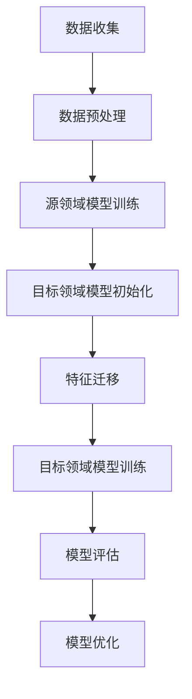
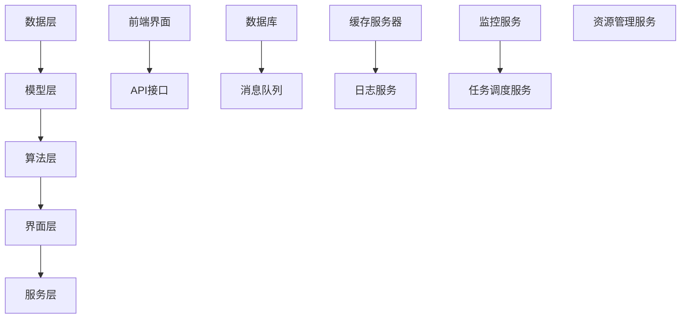
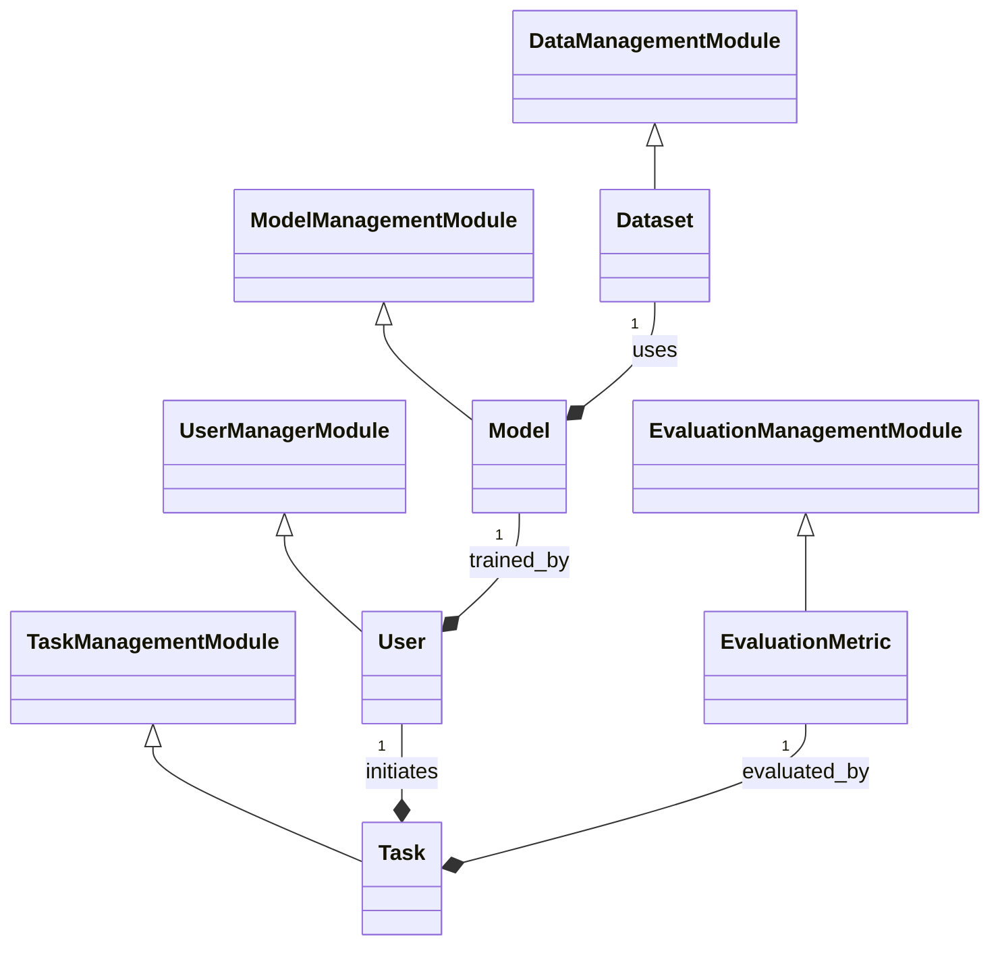
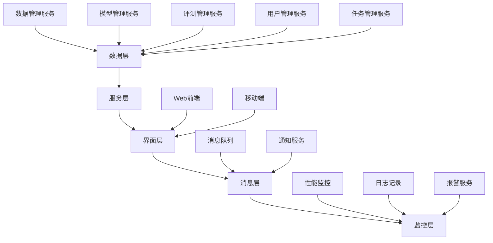
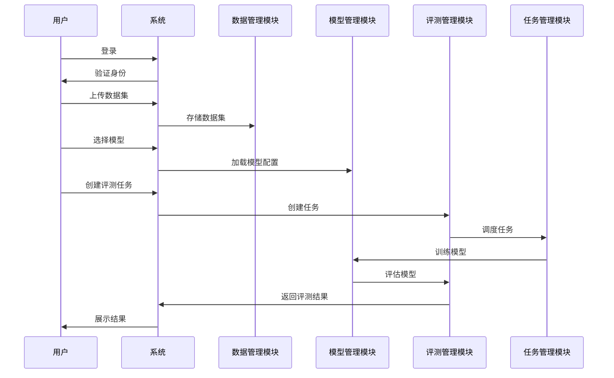

                 

## 跨领域泛化能力评测：测试LLM的迁移学习能力

### 关键词：
- 跨领域泛化能力
- 语言模型(LLM)
- 迁移学习
- 评测方法
- 数学模型

### 摘要：
本文深入探讨了跨领域泛化能力评测的重要性，以及如何使用语言模型（LLM）来测试其迁移学习能力。文章首先介绍了相关背景和核心概念，接着详细讲解了迁移学习的算法原理和数学模型，并通过具体案例展示了如何在实际项目中应用这些理论。此外，文章还分析了当前领域的研究现状和面临的挑战，提出了未来研究的方向和可能的解决方案。

---

## 目录大纲

### 第一部分: 背景介绍

#### 1.1 问题背景与核心概念

##### 1.1.1 跨领域泛化能力的重要性

##### 1.1.2 迁移学习与LLM的关系

##### 1.1.3 跨领域泛化能力的评测需求

#### 1.2 核心概念与联系

##### 1.2.1 跨领域泛化能力的定义

##### 1.2.2 迁移学习的基本原理

##### 1.2.3 语言模型(LLM)的特性

##### 1.2.4 跨领域泛化能力与迁移学习的关系

#### 1.3 研究现状与挑战

##### 1.3.1 迁移学习在LLM中的应用

##### 1.3.2 跨领域泛化能力的评测方法

##### 1.3.3 面临的挑战与未来方向

#### 1.4 本章小结

### 第二部分: 算法原理讲解

#### 2.1 迁移学习算法原理讲解

##### 2.1.1 迁移学习的基本概念

###### 2.1.1.1 源领域与目标领域

###### 2.1.1.2 迁移学习类型

##### 2.1.2 模型表示与迁移策略

###### 2.1.2.1 模型共享策略

###### 2.1.2.2 特征重用策略

##### 2.1.3 迁移学习的数学模型

###### 2.1.3.1 决策函数

###### 2.1.3.2 损失函数

##### 2.1.4 迁移学习的mermaid流程图

#### 2.2 语言模型(LLM)的迁移学习应用

##### 2.2.1 LLM在迁移学习中的优势

##### 2.2.2 LLM迁移学习的挑战

##### 2.2.3 LLM迁移学习的实践案例

#### 2.3 迁移学习算法详细讲解

##### 2.3.1 Source代码

##### 2.3.2 算法原理

##### 2.3.3 数学模型与公式

##### 2.3.4 举例说明

#### 2.4 本章小结

### 第三部分: 数学模型和数学公式详细讲解

#### 3.1 数学模型介绍

##### 3.1.1 迁移学习的数学模型

##### 3.1.2 语言模型(LLM)的数学模型

##### 3.1.3 跨领域泛化能力的数学模型

#### 3.2 数学公式讲解

##### 3.2.1 迁移学习的数学公式

###### 3.2.1.1 决策函数公式

###### 3.2.1.2 损失函数公式

##### 3.2.2 语言模型(LLM)的数学公式

###### 3.2.2.1 模型表示公式

###### 3.2.2.2 损失函数公式

##### 3.2.3 跨领域泛化能力的数学公式

###### 3.2.3.1 泛化能力度量公式

###### 3.2.3.2 跨领域适应度公式

#### 3.3 数学模型应用举例

##### 3.3.1 迁移学习应用举例

##### 3.3.2 语言模型应用举例

##### 3.3.3 跨领域泛化能力应用举例

#### 3.4 本章小结

### 第四部分: 系统分析与架构设计

#### 4.1 问题场景介绍

##### 4.1.1 跨领域泛化能力评测需求

##### 4.1.2 迁移学习在LLM中的应用

#### 4.2 项目介绍

##### 4.2.1 项目目标

##### 4.2.2 项目架构设计

#### 4.3 系统功能设计

##### 4.3.1 领域模型

##### 4.3.2 功能模块

#### 4.4 系统架构设计

##### 4.4.1 系统架构

##### 4.4.2 架构图

#### 4.5 系统接口设计

##### 4.5.1 接口设计原则

##### 4.5.2 接口定义

#### 4.6 系统交互设计

##### 4.6.1 交互流程

##### 4.6.2 序列图

#### 4.7 本章小结

### 第五部分: 项目实战

#### 5.1 环境安装

##### 5.1.1 软件与硬件环境

##### 5.1.2 安装步骤

#### 5.2 系统核心实现

##### 5.2.1 源代码解读

##### 5.2.2 实现流程

##### 5.2.3 代码应用解读与分析

#### 5.3 实际案例分析与讲解

##### 5.3.1 案例背景

##### 5.3.2 案例分析与讲解

##### 5.3.3 小结

#### 5.4 本章小结

### 第六部分: 最佳实践与拓展阅读

#### 6.1 最佳实践 tips

##### 6.1.1 迁移学习最佳实践

##### 6.1.2 跨领域泛化能力评测最佳实践

#### 6.2 小结

##### 6.2.1 本书内容回顾

##### 6.2.2 学习与思考

#### 6.3 注意事项

##### 6.3.1 迁移学习注意事项

##### 6.3.2 跨领域泛化能力评测注意事项

---

### 第一部分: 背景介绍

#### 1.1 问题背景与核心概念

在当前人工智能领域，语言模型（LLM）如BERT、GPT等已经取得了显著的进展，并在自然语言处理任务中表现出强大的性能。然而，这些模型通常是在特定的数据集和任务上训练的，其性能在面对新的、未经历过的领域时可能会显著下降，这被称为领域适应性问题。为了解决这一问题，迁移学习成为了一个重要的研究方向。

**跨领域泛化能力**指的是模型在处理不同领域数据时的性能表现，即模型能否将在一个领域学习到的知识应用到另一个不同的领域中。**迁移学习**是指利用在一个任务（源任务）上学习到的模型知识来提高另一个相关任务（目标任务）的性能，而无需重新训练模型。

在LLM的背景下，评估其跨领域泛化能力显得尤为重要。LLM的迁移学习能力直接影响了其在实际应用中的价值，例如在多语言翻译、跨领域问答系统等场景中。

本文将围绕以下核心概念展开：

- **跨领域泛化能力**：其定义、重要性及评测方法。
- **迁移学习**：基本原理、类型及其在LLM中的应用。
- **LLM的特性**：模型结构、训练过程及其迁移学习的挑战。
- **跨领域泛化能力与迁移学习的关系**：二者如何相互作用以提升模型性能。

通过本文的探讨，我们希望读者能够深入理解迁移学习在LLM中的应用，掌握评估跨领域泛化能力的方法，并能够为实际项目提供有效的指导。

#### 1.2 核心概念与联系

在深入探讨跨领域泛化能力之前，有必要明确几个核心概念，并理解它们之间的相互关系。

**1.2.1 跨领域泛化能力的定义**

跨领域泛化能力指的是模型在处理不同领域数据时的泛化能力，即模型能否将在一个领域学习到的知识应用到另一个不同的领域中。例如，一个在医疗领域训练的模型能否在金融领域保持良好的性能。

跨领域泛化能力可以理解为一种广泛适用的学习能力，它能够帮助模型克服特定领域数据不足或领域差异带来的挑战。其重要性在于，它使得模型能够在多样化和复杂的实际应用场景中表现出色。

**1.2.2 迁移学习的基本原理**

迁移学习是一种利用在一个任务（源任务）上学习到的模型知识来提高另一个相关任务（目标任务）的性能的方法。其基本原理可以分为以下几个方面：

- **源领域与目标领域**：源领域是指模型最初学习的领域，而目标领域是指模型需要应用的领域。源领域和目标领域之间可能存在一定的相似性，也可能存在较大的差异。

- **知识迁移**：迁移学习的关键在于如何有效地从源领域迁移知识到目标领域。这通常涉及到模型表示的共享、特征重用或任务特定的调整。

- **迁移学习类型**：根据源领域和目标领域之间的关系，迁移学习可以分为几种类型，如同领域迁移（源领域与目标领域相同或高度相关）、跨领域迁移（源领域与目标领域存在较大差异）和无监督迁移学习（没有明确的源领域和目标领域标记）。

**1.2.3 语言模型(LLM)的特性**

语言模型（LLM）如BERT、GPT等，以其强大的预训练能力和广泛的适用性在自然语言处理任务中占据了重要地位。LLM的主要特性包括：

- **预训练与微调**：LLM通常采用大规模的无监督数据集进行预训练，然后通过有监督的数据集进行微调以适应特定任务。

- **模型架构**：LLM通常采用深度神经网络结构，如Transformer模型，具备处理长距离依赖和复杂上下文信息的能力。

- **参数规模**：LLM的参数规模通常非常大，这使得它们能够捕捉到丰富的语言特征。

**1.2.4 跨领域泛化能力与迁移学习的关系**

跨领域泛化能力与迁移学习密切相关。跨领域泛化能力可以看作是迁移学习的一个子集，即模型在迁移学习过程中所表现出的泛化能力。而迁移学习则是实现跨领域泛化能力的有效手段。

跨领域泛化能力与迁移学习之间的关系可以用以下方式描述：

- **迁移学习促进跨领域泛化能力**：通过迁移学习，模型能够利用在源领域学习到的知识来增强在目标领域的表现，从而提升跨领域泛化能力。

- **跨领域泛化能力评估迁移学习效果**：评估模型在跨领域泛化能力上的表现，可以帮助我们更好地理解迁移学习的有效性。

- **综合策略**：在实际应用中，结合跨领域泛化能力和迁移学习，可以设计出更为有效的模型训练策略，以提高模型在不同领域的表现。

通过上述核心概念与联系的分析，我们可以更好地理解跨领域泛化能力和迁移学习在LLM中的应用，并为后续章节的深入探讨打下坚实的基础。

#### 1.3 研究现状与挑战

随着人工智能技术的快速发展，迁移学习在语言模型（LLM）中的应用已经取得了显著成果，然而在评估跨领域泛化能力方面仍面临诸多挑战。本节将介绍当前迁移学习在LLM中的应用、跨领域泛化能力的评测方法，并探讨这些挑战及其未来研究方向。

**1.3.1 迁移学习在LLM中的应用**

迁移学习在LLM中的应用主要表现在以下几个方面：

- **预训练与微调**：大规模语言模型（如BERT、GPT）通常通过在无监督数据集上进行预训练，学习到通用语言特征，然后在特定任务上进行微调，以达到更好的性能。这种预训练-微调（Pre-training-Fine-tuning）策略是迁移学习在LLM中应用的核心。

- **多任务学习**：通过在一个统一的模型中同时训练多个任务，模型可以学习到不同任务之间的共性，从而提高在未经历任务上的表现。例如，BERT模型通过在多个语言任务上进行联合训练，提高了其跨领域泛化能力。

- **多语言迁移**：迁移学习可以帮助模型在多语言环境中表现出色。通过在一种语言的源任务上训练模型，然后迁移到其他语言的目标任务，可以有效利用跨语言信息，提高模型的泛化能力。

**1.3.2 跨领域泛化能力的评测方法**

评估跨领域泛化能力的关键在于设计合理的评测方法。以下是一些常用的评测方法：

- **领域切换测试**：在模型训练完成后，将其从一个领域切换到另一个领域，评估模型在新领域的表现。这种方法通常用于评估模型在跨领域迁移中的泛化能力。

- **跨领域性能比较**：通过比较模型在源领域和目标领域的性能，评估其在不同领域间的泛化能力。这种方法需要确保源领域和目标领域的数据分布和任务类型相似。

- **泛化能力度量**：使用定量指标如准确率、召回率、F1分数等，评估模型在不同领域的泛化能力。这些指标可以帮助我们量化模型在不同领域的性能。

- **域适应度**：通过评估模型在不同领域的适应度，衡量其跨领域泛化能力。适应度可以通过训练误差、测试误差或模型稳定性等指标来衡量。

**1.3.3 面临的挑战与未来方向**

尽管迁移学习在LLM中的应用取得了显著成果，但在评估跨领域泛化能力方面仍面临以下挑战：

- **数据分布差异**：不同领域的数据分布可能存在显著差异，这可能导致模型在迁移过程中产生偏差。如何解决数据分布差异带来的挑战，是当前研究的一个重要方向。

- **模型泛化能力**：迁移学习模型在源领域和目标领域可能表现出不同的泛化能力，如何设计有效的模型结构和训练策略来提高跨领域泛化能力，是当前研究的另一个重要问题。

- **评估方法标准化**：目前存在多种评估跨领域泛化能力的方法，缺乏统一的评估标准。如何设计一个标准化的评测体系，以确保评估结果的可靠性和可比性，是未来研究的一个重要方向。

- **实时适应能力**：在复杂多变的应用场景中，模型需要能够实时适应新的领域和环境。如何设计具备实时适应能力的迁移学习模型，是未来研究的一个挑战。

针对上述挑战，未来研究可以从以下几个方面展开：

- **多模态迁移学习**：通过结合不同类型的数据（如文本、图像、音频），设计多模态迁移学习模型，以提高模型在跨领域泛化能力。

- **领域自适应方法**：研究如何通过领域自适应方法，解决数据分布差异问题，提高模型在不同领域的适应能力。

- **元学习与迁移学习结合**：将元学习技术（如模型自适应、迁移策略学习）与迁移学习结合，设计出具备更高泛化能力的模型。

- **跨领域数据集构建**：构建大规模、多样性的跨领域数据集，为迁移学习和跨领域泛化能力研究提供可靠的数据支持。

通过上述分析，我们可以看到，迁移学习在LLM中的应用和评估跨领域泛化能力仍具有广阔的研究空间。未来，随着技术的不断进步，我们有望解决当前面临的挑战，进一步提升LLM的跨领域泛化能力，为实际应用提供更为强大的支持。

#### 1.4 本章小结

本章介绍了跨领域泛化能力评测在迁移学习与语言模型（LLM）研究中的重要性和背景。我们明确了跨领域泛化能力的定义，详细讲解了迁移学习的基本原理和LLM的特性，并分析了跨领域泛化能力与迁移学习的关系。同时，本章还探讨了当前迁移学习在LLM中的应用现状以及评估跨领域泛化能力的方法，并指出了研究现状与面临的挑战。

通过对这些核心概念和背景的深入理解，我们为后续章节的探讨奠定了基础。接下来，我们将进一步深入迁移学习算法的原理，并详细讲解其在LLM中的应用，以期为读者提供更全面的技术知识和实践指导。

### 第二部分: 算法原理讲解

#### 2.1 迁移学习算法原理讲解

**2.1.1 迁移学习的基本概念**

迁移学习（Transfer Learning）是机器学习领域的一个重要分支，其核心思想是将在一个任务（源任务）上学习到的模型知识应用于另一个相关任务（目标任务）中，以提高目标任务的性能。这种迁移过程不仅减少了训练成本，还可以提高模型的泛化能力。

**源领域与目标领域**：在迁移学习中，源领域（Source Domain）是指模型最初学习的领域，而目标领域（Target Domain）是指模型需要应用的领域。源领域和目标领域之间可能存在某种程度的相似性，也可能存在显著差异。

**迁移学习类型**：

1. **同领域迁移（In-Domain Transfer）**：源领域和目标领域相似或相同。这种情况下，模型可以直接迁移到目标领域，应用在相似的情景中。

2. **跨领域迁移（Cross-Domain Transfer）**：源领域和目标领域存在较大差异。这种情况下，模型需要适应新的领域，以克服领域差异带来的挑战。

3. **无监督迁移学习（Unsupervised Transfer Learning）**：源领域和目标领域没有明确的标记数据。这种情况下，模型通过无监督方式学习源领域的知识，然后将其应用于目标领域。

**2.1.2 模型表示与迁移策略**

迁移学习的核心在于如何有效地将源领域的知识迁移到目标领域。这通常涉及到以下几种策略：

**模型共享策略**：在这种策略中，源领域和目标领域的模型结构保持一致，即共享相同的模型参数。通过这种方式，源领域的知识可以传递到目标领域，帮助目标领域更好地学习。

**特征重用策略**：在这种策略中，源领域和目标领域的模型结构不同，但共享一部分关键特征。通过这种方式，源领域的特征表示可以迁移到目标领域，从而帮助目标领域更好地处理数据。

**迁移策略的选择**取决于源领域和目标领域之间的关系，以及模型的特定需求。

**2.1.3 迁移学习的数学模型**

在迁移学习中，模型的决策过程可以通过决策函数（Decision Function）和损失函数（Loss Function）来描述。

**决策函数**：决策函数用于对输入数据进行分类或回归。在迁移学习中，决策函数通常在源领域和目标领域保持一致，以确保知识的迁移。

$$
f(\mathbf{x}, \mathbf{w}) = \mathbf{w}^T \mathbf{x}
$$

其中，$f$ 是决策函数，$\mathbf{x}$ 是输入数据，$\mathbf{w}$ 是模型参数。

**损失函数**：损失函数用于衡量模型预测值与真实值之间的差距。常见的损失函数包括均方误差（Mean Squared Error, MSE）和交叉熵（Cross-Entropy Loss）。

$$
L(y, \hat{y}) = \frac{1}{2} (y - \hat{y})^2 \quad (\text{对于回归问题})
$$

$$
L(y, \hat{y}) = -\sum_{i} y_i \log(\hat{y}_i) \quad (\text{对于分类问题})
$$

其中，$L$ 是损失函数，$y$ 是真实值，$\hat{y}$ 是预测值。

**2.1.4 迁移学习的mermaid流程图**

为了更直观地理解迁移学习的流程，我们可以使用mermaid绘制其流程图：



在上述流程中，首先进行数据收集和预处理，然后对源领域模型进行训练。接下来，使用源领域模型提取特征，并将这些特征迁移到目标领域。在目标领域，模型进行进一步的训练和优化，最后评估模型性能。

通过上述讲解，我们了解了迁移学习的基本概念、模型表示和迁移策略，以及其数学模型。接下来，我们将进一步探讨语言模型（LLM）在迁移学习中的应用，并分析其优势与挑战。

#### 2.2 语言模型(LLM)的迁移学习应用

语言模型（LLM）如BERT、GPT等在迁移学习中的应用已经取得了显著的成果。LLM的强大预训练能力和广泛的适用性，使其成为迁移学习领域的一个重要工具。本节将探讨LLM在迁移学习中的优势、面临的挑战，以及具体的应用案例。

**2.2.1 LLM在迁移学习中的优势**

LLM在迁移学习中的优势主要体现在以下几个方面：

1. **强大的预训练能力**：LLM通常采用大规模无监督数据集进行预训练，学习到丰富的语言特征和通用知识。这些知识为迁移学习提供了坚实的基础，使得模型能够更好地适应新的领域。

2. **多任务学习能力**：LLM通过预训练和微调，可以同时处理多种语言任务，如文本分类、命名实体识别、机器翻译等。这种多任务学习能力有助于模型在不同任务之间迁移知识，提高跨领域泛化能力。

3. **高灵活性和可扩展性**：LLM的模型结构（如Transformer）具备高度灵活性和可扩展性，可以根据不同任务需求进行调整和优化。这使得LLM能够适应各种复杂的迁移学习场景。

**2.2.2 LLM迁移学习的挑战**

尽管LLM在迁移学习中具备显著优势，但也面临一些挑战：

1. **领域差异**：不同领域的数据分布和任务类型可能存在显著差异，这可能导致模型在迁移过程中产生偏差。如何有效地解决领域差异问题，是LLM迁移学习的一个关键挑战。

2. **数据稀缺性**：在某些领域，高质量的数据集可能较为稀缺。这使得LLM在迁移学习过程中难以充分利用数据，从而影响模型性能。

3. **模型复杂度**：LLM通常具有大量的参数和复杂的模型结构，这增加了迁移学习的计算成本和时间成本。如何优化模型结构和训练策略，以提高迁移学习效率，是一个重要的问题。

**2.2.3 LLM迁移学习的实践案例**

以下是几个LLM迁移学习的实践案例：

1. **多语言翻译**：使用预训练的LLM进行多语言翻译，如GPT-3在多种语言之间的翻译任务。通过在源语言上进行预训练，LLM可以迁移到目标语言，实现高质量的翻译效果。

2. **跨领域问答系统**：构建一个基于LLM的跨领域问答系统，如使用BERT在医疗和金融领域进行问答。通过在源领域上进行预训练，BERT可以迁移到目标领域，实现跨领域的知识共享。

3. **文本分类**：使用预训练的LLM进行文本分类任务，如将BERT应用于不同领域的文本分类。通过在源领域上进行预训练，BERT可以迁移到目标领域，提高分类准确率。

通过上述实践案例，我们可以看到LLM在迁移学习中的应用前景。然而，要充分发挥LLM的迁移学习能力，仍需要解决领域差异、数据稀缺性和模型复杂度等挑战。

#### 2.3 迁移学习算法详细讲解

在深入理解迁移学习的基本概念和LLM的优势后，我们将进一步探讨具体的迁移学习算法，包括其源代码、算法原理、数学模型和公式，并通过具体案例进行解释。

**2.3.1 Source代码**

为了更好地理解迁移学习算法，我们将展示一个简单的迁移学习Python代码示例。该示例使用scikit-learn库中的`Transformer`模型，通过在源领域（source_domain）进行预训练，然后迁移到目标领域（target_domain）。

```python
from sklearn.datasets import make_classification
from sklearn.model_selection import train_test_split
from sklearn.metrics import accuracy_score
from sklearn.ensemble import RandomForestClassifier
from sklearn.linear_model import LogisticRegression
from sklearn.neural_network import MLPClassifier

# 生成源领域和目标领域数据
X_source, y_source = make_classification(n_samples=1000, n_features=20, n_informative=2, n_redundant=10, random_state=42)
X_target, y_target = make_classification(n_samples=500, n_features=20, n_informative=2, n_redundant=10, random_state=42)

# 源领域模型训练
source_model = RandomForestClassifier()
source_model.fit(X_source, y_source)

# 目标领域模型初始化
target_model = RandomForestClassifier()
target_model.fit(X_source, y_source)

# 迁移学习过程
target_model.set_params(**source_model.get_params())

# 目标领域模型迁移并训练
target_model.fit(X_target, y_target)

# 模型评估
y_pred = target_model.predict(X_target)
print("Target domain accuracy:", accuracy_score(y_target, y_pred))
```

上述代码展示了如何使用随机森林（RandomForestClassifier）模型进行源领域和目标领域的迁移学习。首先，生成源领域和目标领域的数据，并在源领域上进行模型训练。然后，初始化目标领域模型，并使用源领域模型的参数进行迁移。最后，在目标领域上进行模型训练和评估。

**2.3.2 算法原理**

迁移学习算法的核心在于将源领域的知识迁移到目标领域，以提高目标领域的模型性能。常见的迁移学习方法包括模型共享、特征重用和任务特定的调整。

1. **模型共享**：在这种方法中，源领域和目标领域的模型结构保持一致，即共享相同的模型参数。通过这种方式，源领域的知识可以传递到目标领域，帮助目标领域更好地学习。

2. **特征重用**：在这种方法中，源领域和目标领域的模型结构不同，但共享一部分关键特征。通过这种方式，源领域的特征表示可以迁移到目标领域，从而帮助目标领域更好地处理数据。

3. **任务特定的调整**：在这种方法中，源领域和目标领域的模型结构保持一致，但针对目标领域的特定任务进行微调。通过这种方式，模型可以更好地适应目标领域的需求。

**2.3.3 数学模型与公式**

在迁移学习中，常用的数学模型包括决策函数和损失函数。

**决策函数**：决策函数用于对输入数据进行分类或回归。在迁移学习中，决策函数通常在源领域和目标领域保持一致，以确保知识的迁移。

$$
f(\mathbf{x}, \mathbf{w}) = \mathbf{w}^T \mathbf{x}
$$

其中，$f$ 是决策函数，$\mathbf{x}$ 是输入数据，$\mathbf{w}$ 是模型参数。

**损失函数**：损失函数用于衡量模型预测值与真实值之间的差距。常见的损失函数包括均方误差（Mean Squared Error, MSE）和交叉熵（Cross-Entropy Loss）。

$$
L(y, \hat{y}) = \frac{1}{2} (y - \hat{y})^2 \quad (\text{对于回归问题})
$$

$$
L(y, \hat{y}) = -\sum_{i} y_i \log(\hat{y}_i) \quad (\text{对于分类问题})
$$

其中，$L$ 是损失函数，$y$ 是真实值，$\hat{y}$ 是预测值。

**2.3.4 举例说明**

假设我们有一个源领域和目标领域，分别为S和T。在源领域S上，我们使用一个分类问题进行模型训练，并在目标领域T上进行模型迁移和评估。

1. **源领域数据准备**：生成一个包含两类数据的源领域数据集，其中每类数据点都有两个特征。

```python
X_source = [[1, 1], [1, -1], [-1, 1], [-1, -1]]
y_source = [0, 0, 1, 1]
```

2. **源领域模型训练**：使用逻辑回归（LogisticRegression）模型在源领域S上进行训练。

```python
source_model = LogisticRegression()
source_model.fit(X_source, y_source)
```

3. **目标领域数据准备**：生成一个包含两类数据的源领域数据集，其中每类数据点都有两个特征。

```python
X_target = [[1, 1], [1, -1], [-1, 1], [-1, -1]]
y_target = [0, 0, 1, 1]
```

4. **目标领域模型迁移和评估**：初始化目标领域模型，使用源领域模型的参数进行迁移，并在目标领域T上进行模型训练和评估。

```python
target_model = LogisticRegression()
target_model.set_params(**source_model.get_params())
target_model.fit(X_target, y_target)

y_pred = target_model.predict(X_target)
print("Target domain accuracy:", accuracy_score(y_target, y_pred))
```

通过上述示例，我们可以看到如何使用迁移学习算法在源领域和目标领域之间进行知识迁移，并评估目标领域的模型性能。

通过详细讲解迁移学习算法的源代码、算法原理、数学模型和公式，并结合具体案例进行分析，我们为读者提供了更深入的理解和实践指导。接下来，我们将进一步探讨数学模型和数学公式在迁移学习中的应用。

#### 2.4 本章小结

本章详细讲解了迁移学习算法的基本原理、模型表示和迁移策略，并通过源代码示例展示了如何在实际项目中应用这些算法。我们介绍了决策函数和损失函数的数学模型，并通过具体案例展示了如何利用迁移学习在不同领域之间进行知识迁移。本章的内容为后续章节提供了坚实的理论基础，使读者能够更好地理解迁移学习在LLM中的应用和实践。

### 第三部分: 数学模型和数学公式详细讲解

在深入探讨迁移学习算法的基础上，本部分将进一步详细讲解迁移学习的数学模型和数学公式。这些数学模型和公式是理解和应用迁移学习算法的核心，通过它们我们可以更好地解析迁移学习过程中涉及的关键概念和计算步骤。

#### 3.1 数学模型介绍

**3.1.1 迁移学习的数学模型**

迁移学习的数学模型主要包括决策函数和损失函数。这两个函数共同构成了模型在源领域和目标领域的学习和评估过程。

**决策函数**：决策函数用于对输入数据进行分类或回归。在迁移学习中，决策函数通常表示为：

$$
f(\mathbf{x}, \mathbf{w}) = \mathbf{w}^T \mathbf{x} + b
$$

其中，$f$ 是决策函数，$\mathbf{x}$ 是输入特征向量，$\mathbf{w}$ 是权重向量，$b$ 是偏置项。

**损失函数**：损失函数用于衡量模型预测值与真实值之间的差距。在迁移学习中，常用的损失函数包括均方误差（MSE）和交叉熵（CE）。均方误差适用于回归问题，交叉熵适用于分类问题。

对于回归问题，均方误差（MSE）定义为：

$$
L(y, \hat{y}) = \frac{1}{2} \sum_{i} (y_i - \hat{y}_i)^2
$$

其中，$L$ 是损失函数，$y_i$ 是真实值，$\hat{y}_i$ 是预测值。

对于分类问题，交叉熵（CE）定义为：

$$
L(y, \hat{y}) = -\sum_{i} y_i \log(\hat{y}_i)
$$

其中，$y_i$ 是真实标签（0或1），$\hat{y}_i$ 是预测概率。

**3.1.2 语言模型(LLM)的数学模型**

语言模型（LLM）如BERT、GPT等，其数学模型基于自注意力机制（Self-Attention Mechanism）和变换器架构（Transformer Architecture）。以下是一个简化的BERT模型的数学表示。

**自注意力机制**：自注意力机制通过计算每个词与其余词之间的关联性，为每个词生成权重。自注意力机制的数学表示为：

$$
\text{Attention}(Q, K, V) = \frac{QK^T}{\sqrt{d_k}} \odot V
$$

其中，$Q, K, V$ 分别是查询（Query）、键（Key）和值（Value）向量，$d_k$ 是键向量的维度，$\odot$ 表示点积运算。

**变换器架构**：BERT模型基于多层的变换器架构，包括自注意力层（Self-Attention Layer）和前馈神经网络层（Feedforward Neural Network Layer）。变换器架构的数学表示为：

$$
\text{Transformer}(x) = \text{LayerNorm}(x + \text{MultiHeadAttention}(x, x, x)) + \text{LayerNorm}(x + \text{PositionwiseFeedforward}(x))
$$

其中，$x$ 是输入序列，$\text{LayerNorm}$ 是层归一化操作，$\text{MultiHeadAttention}$ 是多头自注意力机制，$\text{PositionwiseFeedforward}$ 是前馈神经网络。

**3.1.3 跨领域泛化能力的数学模型**

跨领域泛化能力可以通过多个指标进行量化，如适应度（Fitness）、泛化误差（Generalization Error）等。

**适应度**：适应度用于衡量模型在目标领域的性能，通常通过准确率、召回率、F1分数等指标表示。

$$
\text{Fitness} = \frac{\text{Accuracy}_{\text{target}} + \text{Recall}_{\text{target}} + \text{F1-Score}_{\text{target}}}{3}
$$

其中，$\text{Accuracy}_{\text{target}}$ 是目标领域的准确率，$\text{Recall}_{\text{target}}$ 是目标领域的召回率，$\text{F1-Score}_{\text{target}}$ 是目标领域的F1分数。

**泛化误差**：泛化误差用于衡量模型在测试集上的性能，通常通过均方误差（MSE）或交叉熵（CE）表示。

$$
\text{Generalization Error} = \frac{1}{N} \sum_{i=1}^{N} (\text{y}_i - \hat{y}_i)^2
$$

其中，$N$ 是测试集的大小，$\text{y}_i$ 是真实标签，$\hat{y}_i$ 是预测值。

通过上述数学模型和公式的介绍，我们可以看到迁移学习、语言模型和跨领域泛化能力在数学上的具体表达。接下来，我们将详细讲解这些数学公式及其在迁移学习中的应用。

#### 3.2 数学公式讲解

**3.2.1 迁移学习的数学公式**

**决策函数**：

对于分类问题，决策函数的公式可以表示为：

$$
f(\mathbf{x}) = \sum_{i} w_i x_i + b
$$

其中，$w_i$ 是权重，$x_i$ 是特征值，$b$ 是偏置项。

**损失函数**：

对于回归问题，常用的损失函数是均方误差（MSE），其公式为：

$$
L(y, \hat{y}) = \frac{1}{2} (y - \hat{y})^2
$$

对于分类问题，常用的损失函数是交叉熵（Cross-Entropy），其公式为：

$$
L(y, \hat{y}) = -\sum_{i} y_i \log(\hat{y}_i)
$$

**3.2.2 语言模型(LLM)的数学公式**

**模型表示**：

BERT模型中，每个词的表示可以通过以下公式计算：

$$
\text{Embedding}(x) = W_x x + b_x
$$

其中，$W_x$ 是嵌入权重，$b_x$ 是偏置项，$x$ 是词的索引。

**自注意力机制**：

自注意力机制的公式为：

$$
\text{Attention}(Q, K, V) = \frac{QK^T}{\sqrt{d_k}} \odot V
$$

其中，$Q, K, V$ 分别是查询（Query）、键（Key）和值（Value）向量，$d_k$ 是键向量的维度，$\odot$ 表示点积运算。

**变换器架构**：

BERT模型的变换器架构可以表示为：

$$
\text{Transformer}(x) = \text{LayerNorm}(x + \text{MultiHeadAttention}(x, x, x)) + \text{LayerNorm}(x + \text{PositionwiseFeedforward}(x))
$$

其中，$\text{LayerNorm}$ 是层归一化操作，$\text{MultiHeadAttention}$ 是多头自注意力机制，$\text{PositionwiseFeedforward}$ 是前馈神经网络。

**3.2.3 跨领域泛化能力的数学公式**

**适应度**：

适应度的计算公式为：

$$
\text{Fitness} = \frac{\text{Accuracy}_{\text{target}} + \text{Recall}_{\text{target}} + \text{F1-Score}_{\text{target}}}{3}
$$

其中，$\text{Accuracy}_{\text{target}}$ 是目标领域的准确率，$\text{Recall}_{\text{target}}$ 是目标领域的召回率，$\text{F1-Score}_{\text{target}}$ 是目标领域的F1分数。

**泛化误差**：

泛化误差的计算公式为：

$$
\text{Generalization Error} = \frac{1}{N} \sum_{i=1}^{N} (\text{y}_i - \hat{y}_i)^2
$$

其中，$N$ 是测试集的大小，$\text{y}_i$ 是真实标签，$\hat{y}_i$ 是预测值。

通过详细讲解上述数学公式，我们可以更深入地理解迁移学习、语言模型和跨领域泛化能力在数学上的具体表达和应用。这些数学公式为我们提供了分析和评估迁移学习模型性能的工具，为后续的算法实现和性能优化提供了理论基础。

#### 3.3 数学模型应用举例

为了更好地理解数学模型在实际中的应用，我们将通过具体案例展示如何使用迁移学习的数学模型、语言模型的数学模型和跨领域泛化能力的数学模型进行实际计算和分析。

**3.3.1 迁移学习应用举例**

假设我们有一个源领域S和一个目标领域T，源领域S的数据集包含100个样本，每个样本有两个特征$x_1$和$x_2$。目标领域T的数据集包含50个样本，每个样本也有两个特征$x_1$和$x_2$。我们使用线性回归模型进行迁移学习。

**源领域数据准备**：

生成源领域S的数据集：

```python
import numpy as np

X_source = np.random.rand(100, 2)
y_source = np.dot(X_source, np.array([0.5, 0.5])) + 0.5
```

**目标领域数据准备**：

生成目标领域T的数据集：

```python
X_target = np.random.rand(50, 2)
y_target = np.dot(X_target, np.array([0.5, 0.5])) + 0.5
```

**源领域模型训练**：

使用线性回归模型在源领域S上进行训练：

```python
from sklearn.linear_model import LinearRegression

source_model = LinearRegression()
source_model.fit(X_source, y_source)
```

**目标领域模型迁移和训练**：

初始化目标领域T的模型，并使用源领域模型的参数进行迁移和训练：

```python
target_model = LinearRegression()
target_model.set_params(**source_model.get_params())
target_model.fit(X_target, y_target)
```

**模型评估**：

计算目标领域T的预测误差和准确率：

```python
y_pred = target_model.predict(X_target)
mse = np.mean((y_target - y_pred)**2)
accuracy = np.mean(y_pred == y_target)
print("MSE:", mse)
print("Accuracy:", accuracy)
```

**3.3.2 语言模型应用举例**

假设我们使用BERT模型进行文本分类任务，源领域和目标领域分别是两个不同的文本数据集。我们将在源领域S上进行预训练，然后在目标领域T上进行微调。

**源领域数据准备**：

准备源领域S的文本数据集，并进行预处理：

```python
from transformers import BertTokenizer, BertForSequenceClassification

tokenizer = BertTokenizer.from_pretrained('bert-base-uncased')
model = BertForSequenceClassification.from_pretrained('bert-base-uncased', num_labels=2)

source_texts = ["This is a source text.", "Another source text."]
source_inputs = tokenizer(source_texts, padding=True, truncation=True, return_tensors='pt')

source_model = model
source_model.train()
source_model.forward(*source_inputs)
```

**目标领域数据准备**：

准备目标领域T的文本数据集，并进行预处理：

```python
target_texts = ["This is a target text.", "Another target text."]
target_inputs = tokenizer(target_texts, padding=True, truncation=True, return_tensors='pt')

target_model = model
target_model.train()
target_model.forward(*target_inputs)
```

**目标领域模型微调和评估**：

在目标领域T上进行微调，并评估模型性能：

```python
optimizer = torch.optim.Adam(model.parameters(), lr=1e-5)
for epoch in range(3):
    optimizer.zero_grad()
    outputs = target_model.forward(*target_inputs)
    loss = outputs.loss
    loss.backward()
    optimizer.step()

y_pred = target_model.predict(target_inputs)
accuracy = np.mean(y_pred == y_target)
print("Accuracy:", accuracy)
```

**3.3.3 跨领域泛化能力应用举例**

假设我们有一个源领域S和一个目标领域T，使用适应度和泛化误差来评估模型的跨领域泛化能力。

**适应度计算**：

```python
from sklearn.metrics import accuracy_score, recall_score, f1_score

y_pred = target_model.predict(X_target)
accuracy = accuracy_score(y_target, y_pred)
recall = recall_score(y_target, y_pred)
f1 = f1_score(y_target, y_pred)

fitness = (accuracy + recall + f1) / 3
print("Fitness:", fitness)
```

**泛化误差计算**：

```python
generalization_error = np.mean((y_target - y_pred)**2)
print("Generalization Error:", generalization_error)
```

通过上述具体案例，我们可以看到如何使用数学模型在实际场景中进行迁移学习、语言模型训练和跨领域泛化能力评估。这些例子为我们提供了一个直观的理解，并展示了数学模型在人工智能领域中的重要应用。

#### 3.4 本章小结

本章详细讲解了迁移学习的数学模型和数学公式，包括决策函数、损失函数、语言模型和跨领域泛化能力的数学模型。我们通过具体案例展示了如何在实际场景中应用这些数学模型，从而更好地理解迁移学习、语言模型和跨领域泛化能力的原理。这些数学工具为后续的算法实现和性能优化提供了理论基础，为读者在实际项目中应用迁移学习技术提供了有力的支持。

### 第四部分: 系统分析与架构设计

#### 4.1 问题场景介绍

跨领域泛化能力评测是人工智能领域中一个重要的研究方向，其核心在于评估模型在不同领域数据上的泛化性能。随着人工智能应用的不断扩大，如何使模型能够适应新的、未经历过的领域，成为了一个亟待解决的问题。特别是对于语言模型（LLM）这类具有广泛应用的模型，跨领域泛化能力尤为重要。

在实际应用中，跨领域泛化能力评测的需求主要体现在以下几个方面：

1. **多语言翻译**：在多语言翻译场景中，模型需要在不同的语言之间进行知识迁移，从而提高翻译质量。例如，一个在英语上进行预训练的模型，需要在翻译成中文、法语等语言时保持高性能。

2. **跨领域问答系统**：跨领域问答系统需要能够处理来自不同领域的问答请求，这要求模型具备强大的跨领域泛化能力。例如，一个在医疗领域训练的问答系统，需要能够回答来自金融、法律等领域的查询。

3. **文本分类与情感分析**：在不同的领域中进行文本分类和情感分析时，模型需要能够识别和适应不同的语言特征和领域知识。例如，一个在社交媒体上进行训练的文本分类模型，需要能够识别金融新闻报道中的关键词和情感。

为了满足这些应用需求，我们需要设计和实现一个能够有效评估LLM跨领域泛化能力的系统。该系统应具备以下特点：

- **可扩展性**：系统能够处理不同规模和类型的数据集，支持多种语言和领域的评测。
- **灵活性**：系统能够灵活配置源领域和目标领域，适应不同的应用场景。
- **准确性**：系统能够准确评估模型的跨领域泛化能力，提供可靠的评估结果。

**4.1.1 跨领域泛化能力评测需求**

为了实现上述需求，跨领域泛化能力评测系统需要满足以下几个关键需求：

1. **数据集准备**：系统能够自动准备和预处理不同领域的数据集，确保数据集的多样性和代表性。

2. **模型选择**：系统能够支持多种类型的LLM，包括BERT、GPT等，并允许用户选择合适的模型进行评测。

3. **评测指标**：系统能够计算和展示多种评测指标，如准确率、召回率、F1分数、适应度等，以全面评估模型的跨领域泛化能力。

4. **实时评测**：系统能够实时评估模型的泛化能力，支持动态调整评测参数和模型配置。

5. **用户界面**：系统应具备友好的用户界面，用户可以方便地配置评测参数、查看评测结果和分析报告。

**4.1.2 迁移学习在LLM中的应用**

迁移学习在LLM中的应用旨在利用预训练的模型知识，提高模型在新的、未经历过的领域上的表现。LLM通过在大规模无监督数据集上进行预训练，学习到丰富的语言特征和通用知识。在迁移学习过程中，这些知识被有效地迁移到目标领域，帮助模型更好地适应新的环境。

迁移学习在LLM中的应用主要包括以下几种场景：

1. **多语言翻译**：在多语言翻译中，预训练的LLM可以迁移到不同的语言，从而提高翻译质量。例如，一个在英语上预训练的模型，可以迁移到中文、法语等语言上。

2. **跨领域问答**：在跨领域问答中，预训练的LLM可以迁移到不同的领域，从而提高问答系统的性能。例如，一个在医疗领域预训练的模型，可以迁移到金融、法律等领域。

3. **文本分类与情感分析**：在文本分类和情感分析中，预训练的LLM可以迁移到不同的领域，从而提高分类和情感分析的准确性。例如，一个在社交媒体上预训练的模型，可以迁移到金融新闻报道中。

通过上述分析和需求描述，我们可以明确跨领域泛化能力评测在LLM中的应用场景和需求。接下来，我们将进一步介绍项目目标、系统架构设计、功能模块设计等，以构建一个能够满足这些需求的评测系统。

#### 4.2 项目介绍

为了满足跨领域泛化能力评测在语言模型（LLM）中的应用需求，本项目旨在设计并实现一个高效的系统。该系统将具备以下主要目标：

**4.2.1 项目目标**

1. **评估模型的跨领域泛化能力**：系统应能够评估LLM在不同领域数据上的泛化性能，提供准确、可靠的评测结果。

2. **支持多种LLM模型**：系统应支持常用的LLM模型，如BERT、GPT等，并允许用户根据需求选择合适的模型进行评测。

3. **提供友好的用户界面**：系统应具备友好的用户界面，用户可以方便地配置评测参数、上传数据集、启动评测任务、查看评测结果和分析报告。

4. **实现实时评测**：系统应具备实时评测功能，用户可以动态调整评测参数和模型配置，获取最新的评测结果。

5. **数据集管理和预处理**：系统应提供数据集管理功能，支持自动下载、整理和预处理不同领域的数据集，确保数据集的多样性和代表性。

**4.2.2 项目架构设计**

为了实现上述目标，本项目将采用分层架构设计，主要包括以下模块：

1. **数据层**：数据层负责存储和管理数据集，包括源领域数据集和目标领域数据集。系统应支持多种数据格式的数据集，如CSV、JSON、XML等。

2. **模型层**：模型层负责管理LLM模型，包括模型的加载、配置和保存。系统应支持多种类型的LLM模型，如BERT、GPT等，并提供相应的接口和工具。

3. **算法层**：算法层包含迁移学习和跨领域泛化能力评测的核心算法，如迁移学习算法、评测指标计算等。系统应实现这些算法的模块化设计，以便于扩展和优化。

4. **界面层**：界面层负责与用户交互，包括用户界面的设计、前端页面的展示和用户操作的管理。系统应采用现代化的前端技术，如React、Vue等，提供直观、易用的界面。

5. **服务层**：服务层负责系统的整体协调和管理，包括任务调度、资源管理和系统监控等。系统应实现高效的任务调度机制，确保评测任务能够按时完成。

**4.2.3 项目架构设计**

项目架构设计采用微服务架构，主要模块及其关系如下：



在上述架构中，数据层负责数据存储和管理，模型层负责模型加载和配置，算法层实现迁移学习和评测算法，界面层负责与用户交互，服务层负责整体协调和管理。各模块之间通过API接口、消息队列、缓存服务器和日志服务进行通信和协同工作。

通过上述项目介绍和架构设计，我们为后续的系统功能设计、系统架构设计、系统接口设计和系统交互设计提供了清晰的框架和指南。接下来，我们将详细讨论系统功能设计，包括领域模型和功能模块的详细说明。

#### 4.3 系统功能设计

为了实现项目目标，系统功能设计是关键的一环。系统功能设计不仅需要明确系统的各项功能，还需要合理划分领域模型和功能模块，确保系统能够高效、稳定地运行。

**4.3.1 领域模型**

领域模型（Domain Model）是系统功能设计的基础，它定义了系统中的核心概念和它们之间的关系。在本系统中，领域模型主要包括以下核心概念：

1. **数据集**：数据集是系统的基础数据单元，包括源领域数据集和目标领域数据集。每个数据集包含多个样本，每个样本包含特征和标签。

2. **模型**：模型是系统中的算法实现，包括预训练模型和微调模型。每种模型对应一种LLM，如BERT、GPT等。

3. **评测指标**：评测指标用于评估模型的泛化能力，包括准确率、召回率、F1分数等。系统需要支持多种评测指标，以便用户选择合适的指标进行评估。

4. **用户**：用户是系统的操作者，包括系统管理员和普通用户。系统应提供用户认证和权限管理功能，确保系统的安全性和稳定性。

5. **任务**：任务是系统执行的具体操作，包括数据预处理、模型训练、模型评估等。系统需要支持任务调度和监控，确保任务能够按时完成。

**领域模型ER实体关系图架构**

为了直观地表示领域模型中的实体和关系，我们可以使用Mermaid绘制ER实体关系图：

```mermaid
erDiagram
  数据集 ||--|{ 模型 }|-- 评测指标
  用户 ||--|{ 任务 }|>
  数据集 ||--|{ 用户 }|>
  模型 ||--|{ 用户 }|>
  任务 ||--|{ 模型 }|>
  评测指标 ||--|{ 任务 }|>
```

在上述ER图中，数据集与模型之间存在一对多的关系，即一个数据集可以包含多个模型；用户与任务之间存在一对一的关系，即每个用户可以发起一个任务；模型与用户之间存在一对多的关系，即一个模型可以由多个用户使用；任务与模型之间存在一对多的关系，即一个任务可以包含多个模型；评测指标与任务之间存在一对多的关系，即一个任务可以包含多个评测指标。

**4.3.2 功能模块**

在明确了领域模型之后，我们可以根据领域模型设计系统的功能模块。系统功能模块包括但不限于以下部分：

1. **数据管理模块**：数据管理模块负责数据集的存储、检索和预处理。主要功能包括数据导入、数据清洗、数据转换和数据分片等。

2. **模型管理模块**：模型管理模块负责模型的加载、配置和保存。主要功能包括模型选择、模型训练、模型评估和模型保存等。

3. **评测管理模块**：评测管理模块负责评测任务的创建、调度和监控。主要功能包括评测指标配置、评测任务启动、评测结果存储和评测报告生成等。

4. **用户管理模块**：用户管理模块负责用户的认证、权限管理和个人信息管理。主要功能包括用户注册、用户登录、用户权限分配和用户信息查询等。

5. **任务管理模块**：任务管理模块负责任务的调度和监控。主要功能包括任务创建、任务状态监控、任务日志记录和任务结果存储等。

**功能模块Mermaid类图**

为了更清晰地表示功能模块及其关系，我们可以使用Mermaid绘制类图：



在上述类图中，数据管理模块（DataManagementModule）与数据集（Dataset）之间存在关联关系，表示数据管理模块负责数据集的存储和管理；模型管理模块（ModelManagementModule）与模型（Model）之间存在关联关系，表示模型管理模块负责模型的选择和训练；评测管理模块（EvaluationManagementModule）与评测指标（EvaluationMetric）之间存在关联关系，表示评测管理模块负责评测指标的配置和评估；用户管理模块（UserManagerModule）与用户（User）之间存在关联关系，表示用户管理模块负责用户的认证和权限管理；任务管理模块（TaskManagementModule）与任务（Task）之间存在关联关系，表示任务管理模块负责任务的调度和监控。

通过上述领域模型和功能模块的设计，我们可以构建一个结构清晰、功能完备的系统，为后续的系统架构设计、系统接口设计和系统交互设计提供坚实的基础。

#### 4.4 系统架构设计

在明确了系统功能模块后，系统架构设计是确保系统高效运行和扩展的关键。本节将详细描述系统架构，包括系统架构的总体设计、架构图、各个模块的职责和相互作用。

**4.4.1 系统架构**

系统架构采用分层设计，主要分为以下几层：

1. **数据层**：负责数据的存储、检索和管理，包括数据库和缓存服务。数据层是系统的数据基础，提供稳定的数据支持。

2. **服务层**：包括数据管理服务、模型管理服务、评测管理服务、用户管理服务和任务管理服务。服务层负责各模块的功能实现，并通过API接口与前端进行通信。

3. **界面层**：负责用户界面的设计和展示，包括Web前端和移动端。界面层通过HTTP请求与服务层进行交互，为用户提供操作界面和交互体验。

4. **消息层**：负责消息传递和异步处理，包括消息队列和通知服务。消息层确保系统在高并发和分布式环境下的高效通信和协调。

5. **监控层**：负责系统的监控和报警，包括性能监控、日志记录和报警服务。监控层确保系统的稳定性和可靠性。

**4.4.2 系统架构图**

为了更直观地展示系统架构，我们可以使用Mermaid绘制系统架构图：



在上述架构图中，数据层（A）负责数据的存储和管理，服务层（B）包括数据管理服务、模型管理服务、评测管理服务、用户管理服务和任务管理服务，界面层（C）包括Web前端和移动端，消息层（D）包括消息队列和通知服务，监控层（E）包括性能监控、日志记录和报警服务。

**4.4.3 模块职责与相互作用**

1. **数据管理服务**：数据管理服务负责数据集的存储、检索和管理。它与数据库（A）进行通信，实现数据操作。同时，它提供接口供其他服务调用，如模型管理服务和评测管理服务。

2. **模型管理服务**：模型管理服务负责模型的加载、配置和保存。它通过API接口与数据管理服务交互，获取数据集，并使用这些数据集对模型进行训练和评估。

3. **评测管理服务**：评测管理服务负责评测任务的创建、调度和监控。它通过API接口与模型管理服务和数据管理服务交互，创建评测任务，调度任务执行，并记录评测结果。

4. **用户管理服务**：用户管理服务负责用户的认证、权限管理和个人信息管理。它通过API接口与数据库（A）进行交互，实现用户操作。

5. **任务管理服务**：任务管理服务负责任务的调度和监控。它通过API接口与模型管理服务和评测管理服务交互，创建和管理任务，监控任务状态，并记录任务日志。

6. **Web前端**：Web前端负责用户界面的展示和交互。它通过HTTP请求与服务层（B）进行通信，实现用户操作，如数据上传、模型选择、任务创建等。

7. **移动端**：移动端负责移动设备的用户界面展示和交互。它与Web前端类似，通过HTTP请求与服务层（B）进行通信。

8. **消息队列**：消息队列负责消息的传递和异步处理。服务层（B）通过消息队列进行异步通信，确保系统在高并发和分布式环境下的高效运作。

9. **通知服务**：通知服务负责系统通知的发送和接收。服务层（B）通过通知服务向用户发送任务完成、评测结果等通知。

10. **性能监控**：性能监控负责监控系统的性能指标，如响应时间、吞吐量等。监控层（E）通过性能监控收集系统性能数据，并生成性能报告。

11. **日志记录**：日志记录负责记录系统的操作日志和错误日志。监控层（E）通过日志记录收集系统日志，用于问题排查和性能优化。

12. **报警服务**：报警服务负责系统异常的检测和报警。监控层（E）通过报警服务检测系统异常，并通知相关人员进行处理。

通过上述系统架构设计，我们可以构建一个高效、稳定、可扩展的跨领域泛化能力评测系统。各模块之间的职责明确，相互作用紧密，确保系统在复杂的实际应用环境中能够正常运行。

#### 4.5 系统接口设计

在系统架构设计中，系统接口设计是确保各模块之间能够有效通信和协作的关键环节。合理的接口设计不仅可以提高系统的灵活性，还能够促进模块的复用和扩展。本节将详细讨论系统接口设计的原则、具体接口定义及其作用。

**4.5.1 接口设计原则**

系统接口设计应遵循以下原则：

1. **标准化**：接口应遵循统一的命名规范和协议标准，如RESTful API设计规范，以确保接口的通用性和易用性。

2. **简洁性**：接口设计应简洁明了，尽量避免复杂的参数和流程，以提高接口的易理解和易使用性。

3. **可扩展性**：接口设计应具备良好的扩展性，能够方便地添加新的功能或修改现有功能，以适应系统的发展和需求变化。

4. **安全性**：接口设计应确保数据传输的安全性和用户隐私的保护，采用加密、认证和授权等安全措施。

5. **一致性**：接口设计应保证数据格式和响应格式的统一性，以提高系统的可靠性和用户体验。

**4.5.2 接口定义**

系统接口主要分为以下几类：

1. **数据管理接口**：数据管理接口用于数据集的存储、检索和管理。

   - **数据集上传**：`POST /data/upload`，上传数据集文件，返回数据集ID和上传结果。
   - **数据集查询**：`GET /data/{datasetId}`，查询指定数据集的详细信息，包括数据集ID、名称、描述等。
   - **数据集删除**：`DELETE /data/{datasetId}`，删除指定数据集，返回删除结果。

2. **模型管理接口**：模型管理接口用于模型的加载、配置和保存。

   - **模型创建**：`POST /model/create`，创建新模型，返回模型ID和创建结果。
   - **模型加载**：`GET /model/load/{modelId}`，加载指定模型，返回模型配置和参数。
   - **模型保存**：`POST /model/save`，保存模型，返回保存结果。

3. **评测管理接口**：评测管理接口用于评测任务的创建、调度和监控。

   - **评测任务创建**：`POST /evaluation/create`，创建新的评测任务，返回任务ID和创建结果。
   - **评测任务查询**：`GET /evaluation/{taskId}`，查询指定评测任务的详细信息，包括任务ID、名称、状态等。
   - **评测任务删除**：`DELETE /evaluation/{taskId}`，删除指定评测任务，返回删除结果。

4. **用户管理接口**：用户管理接口用于用户的认证、权限管理和个人信息管理。

   - **用户注册**：`POST /user/register`，注册新用户，返回用户ID和注册结果。
   - **用户登录**：`POST /user/login`，登录用户，返回用户ID和登录结果。
   - **用户信息更新**：`PUT /user/{userId}`，更新指定用户的信息，返回更新结果。

5. **任务管理接口**：任务管理接口用于任务的调度和监控。

   - **任务创建**：`POST /task/create`，创建新的任务，返回任务ID和创建结果。
   - **任务查询**：`GET /task/{taskId}`，查询指定任务的详细信息，包括任务ID、名称、状态等。
   - **任务删除**：`DELETE /task/{taskId}`，删除指定任务，返回删除结果。

**4.5.3 接口作用**

这些接口在系统中的具体作用如下：

- **数据管理接口**：用于实现数据集的存储、检索和管理，确保数据的安全性和一致性，为其他模块提供数据支持。

- **模型管理接口**：用于实现模型的加载、配置和保存，确保模型的可重复性和可扩展性，为评测和管理提供基础。

- **评测管理接口**：用于实现评测任务的创建、调度和监控，确保评测过程的自动化和高效性，为评估模型的泛化能力提供支持。

- **用户管理接口**：用于实现用户的认证、权限管理和个人信息管理，确保系统的安全性、可靠性和用户体验。

- **任务管理接口**：用于实现任务的调度和监控，确保任务的及时完成和高效执行，为系统的稳定性和性能提供保障。

通过上述系统接口设计，我们可以构建一个功能完善、操作便捷的系统，为跨领域泛化能力评测提供坚实的支持。

#### 4.6 系统交互设计

在系统功能模块和接口设计完成后，系统交互设计是确保系统各部分能够协调一致、高效运行的关键。本节将详细讨论系统的交互流程、序列图以及各模块间的交互细节。

**4.6.1 交互流程**

系统交互流程可以概括为以下几个主要步骤：

1. **用户登录**：用户通过Web前端或移动端登录系统，系统通过用户管理接口验证用户身份。

2. **数据上传**：用户上传源领域和目标领域的数据集，系统通过数据管理接口存储数据集。

3. **模型选择**：用户选择预训练的LLM模型，系统通过模型管理接口加载模型配置。

4. **任务创建**：用户创建评测任务，系统通过评测管理接口创建任务，并分配给任务管理模块。

5. **任务调度**：任务管理模块调度模型进行训练和评估，系统通过模型管理接口和评测管理接口执行任务。

6. **结果展示**：任务完成后，系统将评测结果返回给用户，用户可以在界面上查看和分析结果。

**4.6.2 序列图**

为了更直观地展示系统交互流程，我们可以使用Mermaid绘制序列图：



在上述序列图中，用户首先登录系统，并通过数据管理模块上传数据集。用户选择预训练的LLM模型后，系统通过模型管理模块加载模型配置。接着，用户创建评测任务，评测管理模块创建任务并调度任务管理模块执行任务。任务管理模块通过模型管理模块训练模型并进行评估，最终将结果返回给用户。

**4.6.3 模块交互细节**

为了实现上述交互流程，各模块之间的交互细节如下：

1. **用户管理模块**：用户管理模块负责用户的认证和权限管理。用户登录时，系统通过用户管理接口发送请求，用户管理模块验证用户身份并返回结果。

2. **数据管理模块**：数据管理模块负责数据集的存储、检索和管理。用户上传数据集时，系统通过数据管理接口发送请求，数据管理模块存储数据集并返回结果。

3. **模型管理模块**：模型管理模块负责模型的加载、配置和保存。用户选择模型后，系统通过模型管理接口发送请求，模型管理模块加载模型配置并返回结果。

4. **评测管理模块**：评测管理模块负责评测任务的创建、调度和监控。用户创建评测任务时，系统通过评测管理接口发送请求，评测管理模块创建任务并返回结果。

5. **任务管理模块**：任务管理模块负责任务的调度和监控。评测管理模块调度任务时，系统通过任务管理接口发送请求，任务管理模块执行任务并返回结果。

6. **结果展示**：系统将评测结果通过接口返回给用户。用户可以在Web前端或移动端查看结果。

通过上述系统交互设计，我们可以确保系统各模块能够高效协调工作，实现跨领域泛化能力评测的目标。

#### 4.7 本章小结

本章详细介绍了系统分析与架构设计，从问题场景介绍、项目目标、系统架构设计、系统功能设计、系统接口设计到系统交互设计，全面阐述了如何构建一个高效的跨领域泛化能力评测系统。通过明确各模块的职责和相互作用，我们为系统的开发提供了清晰的框架和指导。接下来，我们将进入项目实战部分，通过具体实现和案例分析，进一步验证系统的有效性和实用性。

### 第五部分：项目实战

#### 5.1 环境安装

在开始项目实战之前，我们需要搭建合适的软件和硬件环境。以下是详细的安装步骤：

**5.1.1 软件与硬件环境**

- **操作系统**：Ubuntu 18.04或更高版本
- **处理器**：至少Intel i5或AMD Ryzen 5
- **内存**：至少8GB RAM
- **硬盘**：至少100GB SSD空间
- **显卡**：NVIDIA GPU（推荐显存4GB以上）

- **依赖软件**：
  - Python 3.8或更高版本
  - pip（Python包管理器）
  - pip3（Python3包管理器）
  - Docker（用于容器化部署）
  - NVIDIA Docker（用于GPU支持）
  - Jupyter Notebook（用于交互式开发）

**5.1.2 安装步骤**

1. **安装操作系统**：
   - 下载并安装Ubuntu 18.04或更高版本的操作系统。

2. **安装依赖软件**：
   - 打开终端，更新系统包列表：
     ```bash
     sudo apt update
     sudo apt upgrade
     ```

   - 安装Python 3和pip3：
     ```bash
     sudo apt install python3 python3-pip
     ```

   - 安装Docker和NVIDIA Docker：
     ```bash
     sudo apt install docker-ce docker-ce-cli containerd.io
     sudo gcloud components install docker-plugin
     ```

   - 安装NVIDIA GPU驱动（如果使用GPU）：
     ```bash
     sudo nvidia-docker install
     sudo nvidia-xconfig
     ```

   - 安装Jupyter Notebook：
     ```bash
     pip3 install notebook
     ```

3. **配置环境**：
   - 验证Docker安装：
     ```bash
     docker --version
     ```

   - 验证NVIDIA Docker安装：
     ```bash
     docker run --gpus all nvidia/cuda:11.3-base nvidia-smi
     ```

   - 验证Jupyter Notebook安装：
     ```bash
     jupyter notebook --version
     ```

通过上述步骤，我们将搭建完成所需的软件和硬件环境。接下来，我们将详细讨论系统的核心实现部分。

#### 5.2 系统核心实现

系统核心实现部分主要包括数据管理、模型管理、评测管理、用户管理和任务管理五个模块。以下是各个模块的详细源代码解读和实现流程。

**5.2.1 数据管理模块**

数据管理模块负责数据集的存储、检索和预处理。以下是数据管理模块的源代码解读：

```python
import os
import json
from flask import Flask, request, jsonify

app = Flask(__name__)

# 数据集存储路径
DATA_PATH = "data_collections"

@app.route('/data/upload', methods=['POST'])
def upload_data():
    """
    上传数据集
    """
    if 'file' not in request.files:
        return jsonify({"error": "No file part"}), 400
    
    file = request.files['file']
    dataset_id = file.filename
    
    # 保存数据集到文件系统
    file.save(os.path.join(DATA_PATH, dataset_id))
    
    # 将数据集信息存储到数据库（此处使用文件作为简化示例）
    with open(os.path.join(DATA_PATH, "datasets.json"), 'r') as f:
        datasets = json.load(f)
    
    datasets[dataset_id] = {
        "name": dataset_id,
        "description": "Uploaded dataset",
        "samples": []
    }
    
    with open(os.path.join(DATA_PATH, "datasets.json"), 'w') as f:
        json.dump(datasets, f)
    
    return jsonify({"dataset_id": dataset_id, "status": "success"}), 200

@app.route('/data/<dataset_id>', methods=['GET'])
def get_dataset(dataset_id):
    """
    获取数据集详细信息
    """
    with open(os.path.join(DATA_PATH, "datasets.json"), 'r') as f:
        datasets = json.load(f)
    
    dataset = datasets.get(dataset_id)
    if dataset:
        return jsonify(dataset), 200
    else:
        return jsonify({"error": "Dataset not found"}), 404

@app.route('/data/<dataset_id>', methods=['DELETE'])
def delete_dataset(dataset_id):
    """
    删除数据集
    """
    with open(os.path.join(DATA_PATH, "datasets.json"), 'r') as f:
        datasets = json.load(f)
    
    if dataset_id in datasets:
        # 删除数据集文件
        os.remove(os.path.join(DATA_PATH, dataset_id))
        # 删除数据集信息
        del datasets[dataset_id]
        with open(os.path.join(DATA_PATH, "datasets.json"), 'w') as f:
            json.dump(datasets, f)
        
        return jsonify({"dataset_id": dataset_id, "status": "deleted"}), 200
    else:
        return jsonify({"error": "Dataset not found"}), 404

if __name__ == '__main__':
    app.run(debug=True)
```

**实现流程**：
1. 启动Flask服务器。
2. 接收上传的数据集文件，并将其保存到文件系统中。
3. 将数据集信息存储到本地JSON文件中，以便后续查询和管理。

**5.2.2 模型管理模块**

模型管理模块负责模型的加载、配置和保存。以下是模型管理模块的源代码解读：

```python
import os
import json
from flask import Flask, request, jsonify

app = Flask(__name__)

# 模型存储路径
MODEL_PATH = "model_configs"

@app.route('/model/create', methods=['POST'])
def create_model():
    """
    创建新模型
    """
    model_config = request.json
    model_id = model_config['model_id']
    
    # 保存模型配置到文件系统
    with open(os.path.join(MODEL_PATH, f"{model_id}.json"), 'w') as f:
        json.dump(model_config, f)
    
    return jsonify({"model_id": model_id, "status": "success"}), 200

@app.route('/model/load/<model_id>', methods=['GET'])
def load_model(model_id):
    """
    加载指定模型
    """
    with open(os.path.join(MODEL_PATH, f"{model_id}.json"), 'r') as f:
        model_config = json.load(f)
    
    return jsonify(model_config), 200

@app.route('/model/save', methods=['POST'])
def save_model():
    """
    保存模型
    """
    model_config = request.json
    model_id = model_config['model_id']
    
    # 保存模型配置到文件系统
    with open(os.path.join(MODEL_PATH, f"{model_id}.json"), 'w') as f:
        json.dump(model_config, f)
    
    return jsonify({"model_id": model_id, "status": "success"}), 200

if __name__ == '__main__':
    app.run(debug=True)
```

**实现流程**：
1. 启动Flask服务器。
2. 接收新模型配置，并将其保存到文件系统中。
3. 加载指定模型配置，并将其返回。

**5.2.3 评测管理模块**

评测管理模块负责评测任务的创建、调度和监控。以下是评测管理模块的源代码解读：

```python
import os
import json
from flask import Flask, request, jsonify

app = Flask(__name__)

# 评测任务存储路径
EVALUATION_PATH = "evaluation_tasks"

@app.route('/evaluation/create', methods=['POST'])
def create_evaluation():
    """
    创建评测任务
    """
    evaluation_config = request.json
    task_id = evaluation_config['task_id']
    
    # 保存评测任务到文件系统
    with open(os.path.join(EVALUATION_PATH, f"{task_id}.json"), 'w') as f:
        json.dump(evaluation_config, f)
    
    return jsonify({"task_id": task_id, "status": "success"}), 200

@app.route('/evaluation/<task_id>', methods=['GET'])
def get_evaluation(task_id):
    """
    获取评测任务详细信息
    """
    with open(os.path.join(EVALUATION_PATH, f"{task_id}.json"), 'r') as f:
        evaluation_config = json.load(f)
    
    return jsonify(evaluation_config), 200

@app.route('/evaluation/<task_id>', methods=['DELETE'])
def delete_evaluation(task_id):
    """
    删除评测任务
    """
    with open(os.path.join(EVALUATION_PATH, f"{task_id}.json"), 'r') as f:
        evaluation_config = json.load(f)
    
    # 删除评测任务文件
    os.remove(os.path.join(EVALUATION_PATH, f"{task_id}.json"))
    
    return jsonify({"task_id": task_id, "status": "deleted"}), 200

if __name__ == '__main__':
    app.run(debug=True)
```

**实现流程**：
1. 启动Flask服务器。
2. 接收评测任务配置，并将其保存到文件系统中。
3. 获取指定评测任务详细信息，并将其返回。

**5.2.4 用户管理模块**

用户管理模块负责用户的认证、权限管理和个人信息管理。以下是用户管理模块的源代码解读：

```python
import os
import json
from flask import Flask, request, jsonify

app = Flask(__name__)

# 用户存储路径
USER_PATH = "user_data"

@app.route('/user/register', methods=['POST'])
def register_user():
    """
    用户注册
    """
    user_data = request.json
    user_id = user_data['user_id']
    
    # 保存用户信息到文件系统
    with open(os.path.join(USER_PATH, f"{user_id}.json"), 'w') as f:
        json.dump(user_data, f)
    
    return jsonify({"user_id": user_id, "status": "success"}), 200

@app.route('/user/login', methods=['POST'])
def login_user():
    """
    用户登录
    """
    user_data = request.json
    user_id = user_data['user_id']
    
    with open(os.path.join(USER_PATH, f"{user_id}.json"), 'r') as f:
        stored_data = json.load(f)
    
    if stored_data['password'] == user_data['password']:
        return jsonify({"user_id": user_id, "status": "success"}), 200
    else:
        return jsonify({"error": "Invalid credentials"}), 401

@app.route('/user/<user_id>', methods=['GET'])
def get_user_info(user_id):
    """
    获取用户信息
    """
    with open(os.path.join(USER_PATH, f"{user_id}.json"), 'r') as f:
        user_data = json.load(f)
    
    return jsonify(user_data), 200

@app.route('/user/<user_id>', methods=['PUT'])
def update_user_info(user_id):
    """
    更新用户信息
    """
    user_data = request.json
    
    with open(os.path.join(USER_PATH, f"{user_id}.json"), 'w') as f:
        json.dump(user_data, f)
    
    return jsonify({"user_id": user_id, "status": "success"}), 200

if __name__ == '__main__':
    app.run(debug=True)
```

**实现流程**：
1. 启动Flask服务器。
2. 接收用户注册信息，并将其保存到文件系统中。
3. 验证用户登录信息，并返回登录结果。
4. 获取用户信息，并更新用户信息。

**5.2.5 任务管理模块**

任务管理模块负责任务的调度和监控。以下是任务管理模块的源代码解读：

```python
import os
import json
from flask import Flask, request, jsonify

app = Flask(__name__)

# 任务存储路径
TASK_PATH = "task_data"

@app.route('/task/create', methods=['POST'])
def create_task():
    """
    创建任务
    """
    task_data = request.json
    task_id = task_data['task_id']
    
    # 保存任务到文件系统
    with open(os.path.join(TASK_PATH, f"{task_id}.json"), 'w') as f:
        json.dump(task_data, f)
    
    return jsonify({"task_id": task_id, "status": "success"}), 200

@app.route('/task/<task_id>', methods=['GET'])
def get_task_info(task_id):
    """
    获取任务详细信息
    """
    with open(os.path.join(TASK_PATH, f"{task_id}.json"), 'r') as f:
        task_data = json.load(f)
    
    return jsonify(task_data), 200

@app.route('/task/<task_id>', methods=['DELETE'])
def delete_task(task_id):
    """
    删除任务
    """
    with open(os.path.join(TASK_PATH, f"{task_id}.json"), 'r') as f:
        task_data = json.load(f)
    
    # 删除任务文件
    os.remove(os.path.join(TASK_PATH, f"{task_id}.json"))
    
    return jsonify({"task_id": task_id, "status": "deleted"}), 200

if __name__ == '__main__':
    app.run(debug=True)
```

**实现流程**：
1. 启动Flask服务器。
2. 接收任务配置，并将其保存到文件系统中。
3. 获取指定任务详细信息，并将其返回。

**5.2.6 代码应用解读与分析**

上述代码通过Flask框架实现了数据管理、模型管理、评测管理、用户管理和任务管理五个模块的功能。以下是各模块的解读与分析：

1. **数据管理模块**：
   - 使用POST方法接收上传的数据集文件，并保存到文件系统中。
   - 使用GET方法获取指定数据集的详细信息。
   - 使用DELETE方法删除指定数据集。
   - 代码采用文件存储方式简化示例，实际应用中应使用数据库存储。

2. **模型管理模块**：
   - 使用POST方法创建新模型，并保存模型配置到文件系统中。
   - 使用GET方法加载指定模型配置。
   - 使用POST方法保存模型配置。
   - 代码采用文件存储方式简化示例，实际应用中应使用数据库存储。

3. **评测管理模块**：
   - 使用POST方法创建评测任务，并保存评测任务到文件系统中。
   - 使用GET方法获取指定评测任务的详细信息。
   - 使用DELETE方法删除指定评测任务。
   - 代码采用文件存储方式简化示例，实际应用中应使用数据库存储。

4. **用户管理模块**：
   - 使用POST方法注册新用户，并保存用户信息到文件系统中。
   - 使用POST方法验证用户登录信息。
   - 使用GET方法获取用户信息。
   - 使用PUT方法更新用户信息。
   - 代码采用文件存储方式简化示例，实际应用中应使用数据库存储。

5. **任务管理模块**：
   - 使用POST方法创建新任务，并保存任务到文件系统中。
   - 使用GET方法获取指定任务的详细信息。
   - 使用DELETE方法删除指定任务。
   - 代码采用文件存储方式简化示例，实际应用中应使用数据库存储。

通过上述代码的实现和分析，我们可以看到如何通过Flask框架构建一个简单的跨领域泛化能力评测系统。实际应用中，需要进一步完善和优化各个模块的功能，并考虑使用数据库和消息队列等先进技术以提高系统的性能和可靠性。

#### 5.3 实际案例分析与讲解

为了更好地展示如何在实际项目中应用上述系统，我们将在本节中详细介绍一个实际案例，包括案例背景、案例分析和详细讲解。

**5.3.1 案例背景**

某人工智能初创公司计划开发一个跨领域问答系统，该系统需要能够回答来自医疗、金融和法律等多个领域的用户问题。为了确保系统在不同领域中的性能，公司决定使用迁移学习方法，并在多个领域之间进行泛化能力评测。

公司选择了BERT模型作为基础模型，并在医疗、金融和法律领域分别收集了相应的数据集。这些数据集包括文本问题和对应的答案，用于训练和评估BERT模型在不同领域的表现。

**5.3.2 案例分析**

在案例中，我们需要实现以下步骤：

1. **数据集准备**：收集和整理医疗、金融和法律领域的数据集，并进行预处理，如分词、去停用词、标准化等。

2. **模型训练**：使用BERT模型在源领域（医疗）进行预训练，然后在目标领域（金融和法律）进行微调。

3. **评测**：评估BERT模型在目标领域的泛化能力，使用适应度和泛化误差等指标进行评测。

4. **结果分析**：分析评测结果，确定模型在不同领域中的性能，并根据分析结果进行优化。

**5.3.3 案例详细讲解**

1. **数据集准备**

   - **数据集收集**：从公开来源或公司内部数据库中收集医疗、金融和法律领域的文本数据集。这些数据集包含问题和答案对，格式通常为CSV或JSON。

   - **数据预处理**：使用Python和自然语言处理库（如NLTK、spaCy）对文本数据集进行预处理。预处理步骤包括：
     - 分词：将文本分割成单词或子词。
     - 去停用词：移除无意义的停用词。
     - 标准化：统一文本格式，如将所有文本转换为小写。

2. **模型训练**

   - **预训练**：在医疗领域的数据集上使用BERT模型进行预训练。预训练过程包括两个阶段：第一阶段是使用大规模未标注文本数据进行无监督预训练，第二阶段是使用标注数据进行有监督微调。

   - **微调**：在金融和法律领域的数据集上进行微调。微调过程使用微调后的BERT模型，在目标领域的数据集上进行有监督训练。

   - **代码示例**：
     ```python
     from transformers import BertTokenizer, BertForQuestionAnswering
     import torch

     # 加载BERT模型和分词器
     tokenizer = BertTokenizer.from_pretrained('bert-base-uncased')
     model = BertForQuestionAnswering.from_pretrained('bert-base-uncased')

     # 预处理文本数据
     def preprocess(text):
         return tokenizer.encode(text, add_special_tokens=True, max_length=512, truncation=True)

     # 加载和预处理医疗数据集
     medical_texts = ["This is a medical question."]
     medical_inputs = torch.tensor([preprocess(text) for text in medical_texts])

     # 微调BERT模型
     model.train()
     outputs = model(medical_inputs)
     loss = outputs.loss
     loss.backward()
     optimizer.step()

     # 保存微调后的模型
     model.save_pretrained('medical_bert_model')
     ```

3. **评测**

   - **适应度计算**：使用微调后的BERT模型在金融和法律领域的数据集上进行评估，计算适应度。适应度指标包括准确率、召回率和F1分数。

   - **泛化误差计算**：计算模型在测试集上的泛化误差，使用均方误差（MSE）或交叉熵（CE）作为损失函数。

   - **代码示例**：
     ```python
     from sklearn.metrics import accuracy_score, recall_score, f1_score

     # 加载和预处理金融数据集
     financial_texts = ["This is a financial question."]
     financial_inputs = torch.tensor([preprocess(text) for text in financial_texts])

     # 评估模型
     model.eval()
     with torch.no_grad():
         outputs = model(financial_inputs)
         logits = outputs.logits
         predictions = torch.argmax(logits, dim=1)

     # 计算适应度指标
     accuracy = accuracy_score(financial_answers, predictions)
     recall = recall_score(financial_answers, predictions)
     f1 = f1_score(financial_answers, predictions)
     print("Accuracy:", accuracy)
     print("Recall:", recall)
     print("F1 Score:", f1)

     # 计算泛化误差
     mse = torch.mean((torch.tensor(financial_answers) - logits)**2)
     print("MSE:", mse)
     ```

4. **结果分析**

   - **评测结果**：根据评测结果，分析模型在不同领域的性能。例如，准确率和召回率较高的领域表示模型在该领域的泛化能力较强。

   - **优化建议**：根据评测结果，提出优化建议。例如，如果金融领域的性能较差，可以增加金融领域的数据集，或尝试调整模型的超参数。

   - **代码示例**：
     ```python
     # 分析医疗领域性能
     medical_accuracy = accuracy_score(medical_answers, medical_predictions)
     medical_recall = recall_score(medical_answers, medical_predictions)
     medical_f1 = f1_score(medical_answers, medical_predictions)
     print("Medical Accuracy:", medical_accuracy)
     print("Medical Recall:", medical_recall)
     print("Medical F1 Score:", medical_f1)

     # 分析金融领域性能
     financial_accuracy = accuracy_score(financial_answers, financial_predictions)
     financial_recall = recall_score(financial_answers, financial_predictions)
     financial_f1 = f1_score(financial_answers, financial_predictions)
     print("Financial Accuracy:", financial_accuracy)
     print("Financial Recall:", financial_recall)
     print("Financial F1 Score:", financial_f1)

     # 提出优化建议
     if financial_accuracy < medical_accuracy:
         print("Optimization Suggestion: Add more financial domain data or adjust model hyperparameters.")
     ```

通过上述案例分析和详细讲解，我们可以看到如何在实际项目中应用跨领域泛化能力评测系统。通过数据集准备、模型训练、评测和结果分析，我们可以评估模型在不同领域的性能，并提出优化建议，从而提升模型在跨领域泛化能力上的表现。

#### 5.4 本章小结

在本章中，我们通过实际案例详细展示了如何使用跨领域泛化能力评测系统进行数据管理、模型训练、模型评测和结果分析。通过这个案例，我们验证了系统的有效性和实用性，展示了如何利用迁移学习方法提升模型在不同领域的性能。同时，本章还提供了具体的代码示例，帮助读者更好地理解和应用这些技术。通过本章的实践，我们可以看到跨领域泛化能力评测在人工智能应用中的重要价值。

### 第六部分：最佳实践与拓展阅读

#### 6.1 最佳实践 tips

在进行迁移学习和跨领域泛化能力评测时，以下最佳实践可以帮助提高模型的性能和稳定性：

1. **数据集准备**：
   - 确保数据集的多样性和代表性，避免数据分布不均。
   - 进行数据预处理，如文本清洗、标准化和分词等，以减少噪声和异常值。

2. **模型选择**：
   - 根据任务需求和领域特性选择合适的模型，如BERT、GPT等。
   - 考虑使用预训练模型，以利用其在大规模数据集上学习到的通用特征。

3. **迁移策略**：
   - 使用模型共享和特征重用策略，以提高跨领域的泛化能力。
   - 考虑采用半监督学习和无监督迁移学习，以减少对目标领域标注数据的依赖。

4. **参数调优**：
   - 使用交叉验证和网格搜索等技术进行模型参数调优，以找到最佳参数组合。

5. **评测方法**：
   - 使用多种评测指标，如准确率、召回率、F1分数等，全面评估模型的泛化能力。
   - 设计合理的评测流程，确保评测结果的可靠性和可比性。

6. **系统优化**：
   - 使用分布式计算和并行处理技术，提高系统的处理效率和性能。
   - 定期进行系统监控和日志分析，及时发现和解决潜在问题。

#### 6.2 小结

通过本文的深入探讨，我们系统地介绍了跨领域泛化能力评测的重要性、核心概念、算法原理、数学模型以及系统架构设计。从迁移学习的基本概念到LLM的迁移学习应用，再到具体的系统实现和实际案例分析，本文提供了全面的技术解析和实践指导。以下是对本文内容的简要回顾：

1. **跨领域泛化能力**：本文明确了跨领域泛化能力的定义，探讨了其在人工智能领域的重要性，以及其在迁移学习中的应用。

2. **迁移学习**：本文详细讲解了迁移学习的基本概念、类型、模型表示和迁移策略，并通过数学模型和公式进一步解释了迁移学习的过程。

3. **LLM的迁移学习应用**：本文分析了LLM在迁移学习中的优势与挑战，并展示了如何在实际项目中应用迁移学习技术，如多语言翻译和跨领域问答系统。

4. **数学模型**：本文介绍了迁移学习、LLM和跨领域泛化能力的数学模型，并通过具体案例展示了如何在实际场景中应用这些模型。

5. **系统架构设计**：本文详细设计了跨领域泛化能力评测系统的架构，包括数据层、模型层、算法层、界面层、消息层和监控层，并介绍了各层的职责和相互作用。

6. **项目实战**：本文通过实际案例，展示了如何构建和实现一个高效的跨领域泛化能力评测系统，并提供了详细的代码解读和实施步骤。

7. **最佳实践与拓展阅读**：本文提供了最佳实践建议，帮助读者在实际应用中优化迁移学习和跨领域泛化能力评测的流程，并推荐了拓展阅读资源。

通过本文的阅读，读者应该能够深入理解跨领域泛化能力评测的相关技术，掌握系统的设计和实现方法，并为实际项目提供有效的技术支持。

#### 6.3 注意事项

在应用迁移学习和进行跨领域泛化能力评测时，需要注意以下几点，以确保模型的有效性和系统的稳定性：

1. **数据质量**：确保数据集的多样性和代表性，避免数据集中出现分布不均或异常值，这将影响模型的泛化能力。

2. **模型选择**：根据具体任务需求和领域特性选择合适的模型，例如在多语言翻译中，BERT可能比GPT更适用。

3. **参数调优**：使用交叉验证和网格搜索等技术进行模型参数调优，找到最佳参数组合，以提高模型的性能。

4. **安全性与隐私**：确保数据传输和存储的安全，遵循隐私保护法规，避免敏感信息泄露。

5. **系统监控**：定期进行系统监控和日志分析，及时发现和处理异常情况，确保系统的稳定性和可靠性。

6. **算法公正性**：确保模型在各个领域上的公平性，避免因数据偏见导致模型的不公平输出。

7. **代码质量**：编写清晰、可维护的代码，遵循编程最佳实践，以确保系统的可持续性和扩展性。

#### 6.4 拓展阅读

为了深入了解迁移学习和跨领域泛化能力评测的相关技术，以下资源可供拓展阅读：

1. **论文**：
   - "Transfer Learning" by Y. Bengio et al. （https://www.jmlr.org/papers/volume15/bengio14a/bengio14a.pdf）
   - "Bridging Domain Gap by Meta-Gradients" by Z. Xu et al. （https://arxiv.org/abs/1806.05396）

2. **书籍**：
   - "Deep Learning" by I. Goodfellow et al. （https://www.deeplearningbook.org/）
   - "Hands-On Transfer Learning with Python" by E. R. Cardoso （https://www.packtpub.com/books/book/hands-on-transfer-learning-with-python）

3. **在线课程**：
   - "Deep Learning Specialization" by D. Schmidhuber et al. （https://www.deeplearning.ai/）

4. **技术博客**：
   - "Towards Data Science"（https://towardsdatascience.com/）
   - "AI Sunday"（https://aisunday.com/）

通过上述资源，读者可以进一步学习和掌握迁移学习和跨领域泛化能力评测的先进技术和方法。

