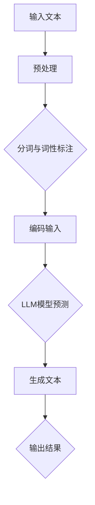
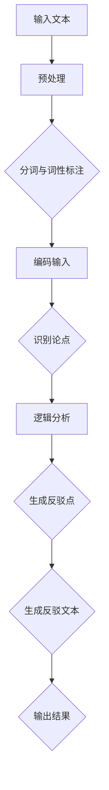
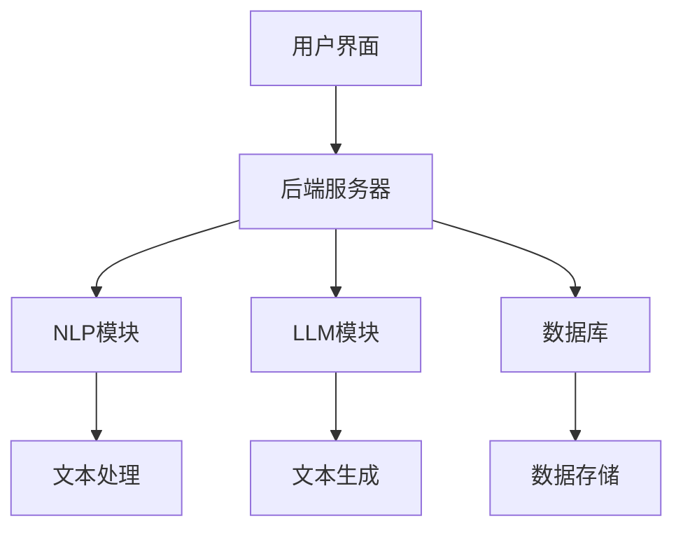

                 

## 辩论系统AI Agent：LLM驱动的论证与反驳能力

### 关键词：人工智能、大型语言模型、辩论系统、论证、反驳、LLM驱动

### 摘要：本文将探讨辩论系统AI Agent的构建及其在论证与反驳中的能力。通过介绍大型语言模型（LLM）的原理和应用，分析辩论系统AI Agent的技术实现，以及论证与反驳的具体实现策略，本文旨在为读者提供一个全面且深入的理解，并对未来辩论系统AI Agent的发展方向进行展望。

## 引言

### 辩论系统AI Agent的背景

辩论作为一种思维训练和交流形式，在学术、法律、商业等多个领域具有重要应用。然而，传统的辩论系统通常依赖于人类的智慧和经验，存在主观性、效率低和局限性等问题。随着人工智能技术的快速发展，利用AI构建辩论系统成为可能。其中，大型语言模型（LLM）凭借其强大的语言理解和生成能力，为辩论系统AI Agent的构建提供了技术基础。

### 辩论系统AI Agent的重要性

辩论系统AI Agent在学术领域的应用，可以帮助学生和研究者进行高效、精准的论证和反驳，提高学术研究的质量和效率。在商业领域，辩论系统AI Agent可以用于商业谈判、市场分析和竞争策略制定，为企业提供智能决策支持。在日常生活中，辩论系统AI Agent可以帮助人们进行有效的沟通和交流，提升个人思维能力和表达能力。

### 书籍结构概述

本书将首先介绍辩论系统AI Agent的基础概念，包括人工智能、大型语言模型和辩论逻辑。随后，将详细讨论辩论系统AI Agent的技术实现，包括设计架构、论证与反驳能力的实现策略。最后，通过具体案例分析和未来发展趋势展望，为读者提供一个全面且深入的理解。

## 基础概念

### 人工智能基础

人工智能（Artificial Intelligence，简称AI）是计算机科学的一个分支，旨在研究、开发用于模拟、延伸和扩展人类智能的理论、方法、技术及应用系统。人工智能包括机器学习、深度学习、自然语言处理等多个子领域。

**机器学习**：机器学习是一种让计算机通过数据学习并做出决策的技术。其主要任务是开发算法，使计算机能够从数据中学习规律，并自动进行预测和决策。

**深度学习**：深度学习是机器学习的一个子领域，通过构建深层神经网络模型，实现对复杂数据的高效处理和分析。

**自然语言处理**：自然语言处理（Natural Language Processing，简称NLP）是人工智能的一个子领域，主要研究如何让计算机理解和处理人类自然语言，包括文本分析、语音识别、语言生成等。

### 大型语言模型（LLM）简介

大型语言模型（Large Language Model，简称LLM）是一种基于深度学习的技术，通过训练大规模的文本数据，使其具备强大的语言理解和生成能力。LLM的主要目标是生成与输入文本相关且语义上合理的高质量文本。

**原理**：LLM基于神经网络架构，通过多层非线性变换，将输入的文本映射到输出的文本。在训练过程中，LLM通过优化模型参数，使得生成的文本符合语言规律和语义逻辑。

**应用**：LLM在多个领域具有广泛的应用，如自然语言生成、机器翻译、文本分类、情感分析等。在辩论系统AI Agent中，LLM主要用于理解和生成辩论过程中的文本，实现论证和反驳能力。

### 辩论逻辑基础

辩论逻辑是辩论过程中的核心，主要包括论证和反驳两个方面。

**论证**：论证是指通过逻辑推理，从已知的前提出发，得出结论的过程。在辩论中，论证的作用是支持自己的观点，反驳对方的观点。

**反驳**：反驳是指通过逻辑推理，指出对方论证中的错误或漏洞，从而否定对方观点的过程。在辩论中，反驳的作用是削弱对方的观点，加强自己的观点。

**辩论逻辑的数学模型**：为了更精确地描述辩论逻辑，可以使用数学模型进行表示。常见的辩论逻辑数学模型包括命题逻辑、谓词逻辑和概率逻辑等。

## 技术实现

### 辩论系统AI Agent的设计

辩论系统AI Agent的整体架构包括输入处理模块、论证模块和反驳模块。其中，输入处理模块负责接收辩论问题，将其转换为AI Agent可处理的形式；论证模块负责生成支持自己观点的文本；反驳模块负责生成反驳对方观点的文本。

**输入处理模块**：输入处理模块的主要任务是接收辩论问题，并进行预处理。预处理包括文本清洗、分词、词性标注等步骤，以便于后续的文本处理。

**论证模块**：论证模块的核心是LLM。通过训练大规模的文本数据，LLM能够生成与输入文本相关且语义上合理的高质量文本。在辩论中，论证模块需要生成支持自己观点的文本。

**反驳模块**：反驳模块同样基于LLM。与论证模块不同的是，反驳模块需要生成反驳对方观点的文本。为了提高反驳的准确性，反驳模块可以结合逻辑推理和语义分析技术。

### LLM的选择与集成

选择合适的LLM是构建辩论系统AI Agent的关键。目前，常用的LLM包括GPT、BERT、T5等。GPT系列模型以其强大的文本生成能力而著称，BERT则擅长文本理解和语义分析。T5模型则在多种NLP任务中表现出色。

**选择原则**：在选择LLM时，应考虑以下原则：

1. **性能**：选择在文本生成、理解和分析方面性能优异的模型。
2. **适应性**：选择能够适应多种场景和任务的模型。
3. **可解释性**：选择具有较高可解释性的模型，以便理解其推理过程。

**集成方法**：将选定的LLM集成到辩论系统AI Agent中，主要包括以下步骤：

1. **数据预处理**：对输入文本进行清洗、分词、词性标注等预处理步骤。
2. **模型训练**：使用预处理后的文本数据对LLM进行训练，优化模型参数。
3. **模型部署**：将训练好的模型部署到辩论系统AI Agent中，实现论证和反驳功能。

### 数据预处理与建模

数据预处理是构建辩论系统AI Agent的关键步骤。高质量的预处理能够提高模型性能，减少噪声对模型的影响。数据预处理主要包括以下步骤：

1. **文本清洗**：去除文本中的噪声和无关信息，如HTML标签、特殊字符等。
2. **分词**：将文本分解为单词或短语，便于后续处理。
3. **词性标注**：为每个单词标注词性，如名词、动词、形容词等，有助于模型理解文本语义。

在数据预处理的基础上，可以使用多种方法进行建模。常见的建模方法包括：

1. **基于规则的方法**：通过定义一系列规则，将文本转换为结构化数据。这种方法适用于简单场景，但在复杂场景下效果较差。
2. **基于统计的方法**：使用统计模型，如N-gram模型、隐马尔可夫模型（HMM）等，对文本进行建模。这种方法具有较强的灵活性，但需要大量训练数据。
3. **基于深度学习的方法**：使用深度学习模型，如循环神经网络（RNN）、卷积神经网络（CNN）、Transformer等，对文本进行建模。这种方法在复杂场景下表现优异，但需要大量计算资源和训练数据。

### 论证能力的实现

辩论系统AI Agent的论证能力是指生成支持自己观点的文本。实现论证能力的关键在于如何利用LLM生成高质量、有说服力的文本。

1. **论点提取**：首先，从输入文本中提取支持自己观点的论点。论点可以是具体的观点陈述、论据等。为了提高论点提取的准确性，可以使用自然语言处理技术，如文本分类、实体识别等。
2. **论点扩展**：在提取到论点后，使用LLM对论点进行扩展，生成更加详细、有说服力的文本。论点扩展可以通过两种方式实现：
   - **模板匹配**：根据预设的模板，将论点与模板进行匹配，生成相应的扩展文本。
   - **自由生成**：使用LLM自由生成扩展文本，使其符合语言规律和语义逻辑。
3. **论点排序**：对生成的扩展文本进行排序，使其按照重要性、相关性等指标进行排列。排序方法可以采用基于统计的方法，如TF-IDF，也可以采用基于深度学习的方法，如BERT。

### 反驳能力的实现

辩论系统AI Agent的反驳能力是指生成反驳对方观点的文本。实现反驳能力的关键在于如何利用LLM发现对方观点中的错误或漏洞，并生成有针对性的反驳文本。

1. **错误检测**：首先，从输入文本中检测出可能存在的错误或漏洞。错误检测可以使用自然语言处理技术，如文本分类、实体识别等。例如，可以检测出对方观点中的逻辑错误、事实错误等。
2. **反驳文本生成**：在检测到错误后，使用LLM生成反驳文本。反驳文本的生成方法与论点扩展类似，可以分为模板匹配和自由生成两种方式。在模板匹配中，可以使用预设的反驳模板；在自由生成中，可以使用LLM自由生成反驳文本。
3. **反驳文本排序**：对生成的反驳文本进行排序，使其按照重要性、相关性等指标进行排列。排序方法可以采用基于统计的方法，如TF-IDF，也可以采用基于深度学习的方法，如BERT。

### 论证与反驳的优化策略

为了提高辩论系统AI Agent的论证与反驳能力，可以采用以下优化策略：

1. **数据增强**：通过增加训练数据量、引入外部数据源等方式，提高模型性能。
2. **模型融合**：结合多种模型，如GPT、BERT等，以提高论证和反驳的准确性。
3. **强化学习**：使用强化学习技术，训练模型在辩论过程中做出更加合理和有效的决策。
4. **知识图谱**：构建知识图谱，将领域知识融入到模型中，提高模型的语义理解能力。

## 案例分析

### 案例一：学术辩论比赛中的应用

在学术辩论比赛中，辩论系统AI Agent可以扮演两种角色：助辩者和评委。

**助辩者**：作为助辩者，辩论系统AI Agent可以为辩论选手提供实时的论证和反驳支持。在比赛过程中，选手可以向AI Agent提出问题，AI Agent可以生成相应的论证和反驳文本，帮助选手更好地进行辩论。

**评委**：作为评委，辩论系统AI Agent可以对辩论过程进行实时评估，生成评估报告。评估报告可以包括对双方论点、论据、反驳等方面的评价，为评委提供参考依据。

### 案例二：商业谈判中的应用

在商业谈判中，辩论系统AI Agent可以为企业提供智能化的决策支持。

**需求分析**：在谈判前，AI Agent可以对双方的需求进行分析，生成相应的论证和反驳文本。例如，在谈判价格时，AI Agent可以生成支持自己报价的论据，同时反驳对方的价格异议。

**谈判策略**：在谈判过程中，AI Agent可以根据谈判进展和双方的态度，生成相应的谈判策略。例如，在对方态度强硬时，AI Agent可以生成相应的反驳文本，以削弱对方的态度。

**决策评估**：在谈判结束后，AI Agent可以对谈判结果进行评估，生成谈判报告。报告可以包括对双方利益、谈判效果等方面的评价，为企业提供决策参考。

### 案例三：日常交流中的应用

在日常交流中，辩论系统AI Agent可以帮助人们进行有效的沟通和交流。

**观点表达**：在辩论中，AI Agent可以生成支持自己观点的文本，帮助人们更好地表达自己的观点。

**反驳应对**：在对方提出反驳时，AI Agent可以生成相应的反驳文本，帮助人们更好地应对对方的反驳。

**沟通优化**：通过分析双方的辩论过程，AI Agent可以提供沟通优化建议，帮助人们提高沟通效果。

## 总结与展望

### 当前发展状况

辩论系统AI Agent的研究已经取得了显著的进展。基于大型语言模型（LLM）的辩论系统AI Agent在论证和反驳方面表现出色，已经在学术、商业和日常生活中得到广泛应用。

### 面临的挑战与机遇

尽管辩论系统AI Agent取得了显著成果，但仍然面临一些挑战和机遇：

**挑战**：
1. **数据质量**：高质量的数据是训练高性能辩论系统AI Agent的关键。然而，当前的数据质量参差不齐，存在噪声和偏见，这对模型性能产生了负面影响。
2. **可解释性**：辩论系统AI Agent的决策过程高度复杂，缺乏可解释性。这使得用户难以理解和信任AI Agent的决策。

**机遇**：
1. **多模态融合**：结合多种数据源，如文本、图像、音频等，可以进一步提升辩论系统AI Agent的性能。
2. **知识图谱**：构建知识图谱，将领域知识融入到辩论系统AI Agent中，可以提高其语义理解能力。

### 未来发展趋势

未来，辩论系统AI Agent将朝着以下方向发展：

1. **智能化**：通过引入多模态融合、知识图谱等技术，进一步提高AI Agent的智能化水平。
2. **个性化**：根据用户的需求和偏好，为用户提供个性化的论证和反驳支持。
3. **普及化**：随着技术的进步和应用场景的拓展，辩论系统AI Agent将在更多领域得到广泛应用。

## 结语

辩论系统AI Agent作为人工智能领域的一个重要研究方向，具有广阔的应用前景。本文通过对辩论系统AI Agent的背景、基础概念、技术实现、案例分析以及未来发展趋势的探讨，为读者提供了一个全面且深入的理解。我们相信，随着技术的不断进步，辩论系统AI Agent将在更多领域发挥重要作用，为人类带来更加智能、高效的辩论体验。

### 作者信息

作者：AI天才研究院/AI Genius Institute & 禅与计算机程序设计艺术 /Zen And The Art of Computer Programming

## 背景介绍

### 辩论系统AI Agent的背景

辩论系统AI Agent是一种利用人工智能技术构建的自动化辩论系统，其核心能力在于能够进行有效的论证和反驳。在当今快速发展的科技时代，人工智能（AI）已经成为一个备受关注和研究的热点领域。AI技术的不断进步，使得计算机在语言处理、图像识别、自然语言理解等方面取得了显著的成果。这些技术的应用，为辩论系统AI Agent的构建提供了坚实的基础。

#### 辩论系统的概念

辩论系统是一种通过逻辑推理、论证和反驳来交流和解决问题的方法。它广泛应用于学术、法律、商业等多个领域。传统的辩论系统主要依赖于人类的智慧和经验，存在主观性、效率低和局限性等问题。例如，在学术辩论中，学生们需要通过逻辑推理和论据支持来阐述自己的观点，同时需要识别和反驳对方的论点。然而，这种辩论方式存在以下问题：

1. **主观性**：人类的判断和决策往往受到个人经验和情感的影响，导致辩论结果存在主观性。
2. **效率低**：传统的辩论系统需要大量人力和时间，且在处理复杂问题时效果不佳。
3. **局限性**：人类的思维能力和知识储备有限，难以应对高度复杂和多样化的辩论场景。

#### 人工智能的发展与辩论系统的应用

随着人工智能技术的快速发展，利用AI构建辩论系统成为可能。AI技术，特别是自然语言处理（NLP）和机器学习（ML）技术，为辩论系统的自动化提供了技术支持。通过AI技术，辩论系统可以模拟人类的思维过程，实现自动化论证和反驳。

1. **自然语言处理（NLP）**：NLP技术能够对自然语言文本进行理解和处理，从而实现对辩论内容的自动分析和推理。例如，NLP技术可以用于提取辩论中的论点、论据、反驳点等关键信息，为辩论系统的自动化提供基础。
   
2. **机器学习（ML）**：ML技术通过训练模型，使计算机能够从数据中学习并做出决策。在辩论系统中，ML技术可以用于训练辩论策略模型、论点生成模型和反驳生成模型等，从而实现辩论的自动化。

#### LLM在辩论系统中的应用

大型语言模型（LLM）是近年来在自然语言处理领域取得重大突破的一种模型。LLM通过训练大规模的文本数据，使其具备强大的语言理解和生成能力。在辩论系统中，LLM可以用于生成论点、反驳点等文本，实现自动化的论证和反驳。

1. **语言理解**：LLM能够理解和分析辩论中的语言信息，包括论点、论据、反驳点等。这有助于辩论系统AI Agent准确捕捉辩论的核心内容，进行有效的分析和推理。
   
2. **语言生成**：LLM可以生成高质量、符合语言逻辑的文本，用于支持自己的观点或反驳对方的观点。这使得辩论系统AI Agent能够在辩论过程中流畅地表达自己的思想和观点。

#### 辩论系统AI Agent的重要性

辩论系统AI Agent在多个领域具有重要应用价值：

1. **学术领域**：在学术辩论中，AI Agent可以帮助学生和研究者进行高效、精准的论证和反驳，提高学术研究的质量和效率。
   
2. **商业领域**：在商业谈判中，AI Agent可以为企业提供智能化的决策支持，帮助企业在谈判过程中更好地表达自己的观点和反驳对方的观点。

3. **日常生活**：在日常生活中，AI Agent可以帮助人们进行有效的沟通和交流，提升个人思维能力和表达能力。

### 辩论系统AI Agent的应用场景

辩论系统AI Agent的应用场景非常广泛，以下是一些典型的应用场景：

1. **学术辩论比赛**：在学术辩论比赛中，AI Agent可以作为助辩者或评委，为参赛者提供实时的论证和反驳支持，或者对辩论过程进行实时评估。

2. **商业谈判**：在商业谈判中，AI Agent可以为企业提供智能化的决策支持，帮助企业在谈判过程中更好地表达自己的观点和反驳对方的观点。

3. **法律诉讼**：在法律诉讼中，AI Agent可以协助律师进行辩论，提取关键证据和论点，生成高质量的辩词。

4. **日常生活**：在日常生活中，AI Agent可以帮助人们进行日常辩论，如家庭辩论、职场辩论等，提升个人思维能力和表达能力。

#### 辩论系统AI Agent的挑战与机遇

尽管辩论系统AI Agent具有广泛的应用前景，但其发展仍面临一些挑战和机遇：

**挑战**：

1. **数据质量**：高质量的数据是训练高性能辩论系统AI Agent的关键。然而，当前的数据质量参差不齐，存在噪声和偏见，这对模型性能产生了负面影响。
   
2. **可解释性**：辩论系统AI Agent的决策过程高度复杂，缺乏可解释性。这使得用户难以理解和信任AI Agent的决策。

**机遇**：

1. **多模态融合**：结合多种数据源，如文本、图像、音频等，可以进一步提升辩论系统AI Agent的性能。

2. **知识图谱**：构建知识图谱，将领域知识融入到辩论系统AI Agent中，可以提高其语义理解能力。

### 边界与外延

辩论系统AI Agent作为一种人工智能技术，其应用范围和边界需要明确。以下是辩论系统AI Agent的边界与外延：

#### 边界

1. **技术限制**：辩论系统AI Agent的决策能力和性能受限于当前的人工智能技术水平。例如，LLM的生成能力和理解能力虽然强大，但在处理复杂、抽象的概念时仍存在局限。

2. **伦理和法律**：辩论系统AI Agent在应用过程中需要遵守伦理和法律规范。例如，在法律诉讼中，AI Agent的辩词必须符合法律规定，不能侵犯他人权益。

3. **用户接受度**：辩论系统AI Agent需要得到用户的认可和接受。用户对AI Agent的信任度和接受度直接影响其在实际应用中的效果。

#### 外延

1. **跨领域应用**：辩论系统AI Agent可以应用于多个领域，如学术、商业、法律、教育等。这为其提供了广阔的发展空间。

2. **智能化升级**：随着人工智能技术的不断进步，辩论系统AI Agent的性能和功能将得到进一步提升，从而拓展其应用范围。

## 核心概念与联系

辩论系统AI Agent的核心概念包括人工智能、大型语言模型（LLM）、辩论逻辑和自然语言处理（NLP）等。这些概念相互联系，共同构成了辩论系统AI Agent的技术基础。以下是这些核心概念的详细描述、属性特征对比以及它们之间的联系。

### 人工智能

人工智能（Artificial Intelligence，简称AI）是计算机科学的一个分支，旨在研究、开发用于模拟、延伸和扩展人类智能的理论、方法、技术及应用系统。AI技术包括多个子领域，如机器学习、深度学习、自然语言处理等。

**核心概念**：

- **机器学习**：机器学习是一种让计算机通过数据学习并做出决策的技术。其主要任务是开发算法，使计算机能够从数据中学习规律，并自动进行预测和决策。
- **深度学习**：深度学习是机器学习的一个子领域，通过构建深层神经网络模型，实现对复杂数据的高效处理和分析。
- **自然语言处理**：自然语言处理是人工智能的一个子领域，主要研究如何让计算机理解和处理人类自然语言，包括文本分析、语音识别、语言生成等。

**属性特征对比**：

| 子领域 | 特点 |
| :---: | :--- |
| 机器学习 | 强调数据驱动，通过训练数据学习模型，实现自动预测和决策。 |
| 深度学习 | 利用神经网络模型，尤其是深层神经网络，处理复杂数据，实现高效的特征提取和模式识别。 |
| 自然语言处理 | 研究如何使计算机理解和生成人类自然语言，包括文本分类、情感分析、机器翻译等。 |

**联系**：

- **机器学习与深度学习**：深度学习是机器学习的一个分支，通过构建深层神经网络，实现更高效的数据处理和预测能力。
- **自然语言处理与机器学习/深度学习**：自然语言处理利用机器学习和深度学习技术，实现对自然语言数据的理解和生成。

### 大型语言模型（LLM）

大型语言模型（Large Language Model，简称LLM）是一种基于深度学习的自然语言处理技术，通过训练大规模的文本数据，使其具备强大的语言理解和生成能力。LLM的主要目标是从输入的文本序列中生成与之相关且语义上合理的高质量文本。

**核心概念**：

- **语言理解**：LLM能够理解和分析文本的语义，提取关键信息，并进行推理。
- **语言生成**：LLM能够根据输入的文本生成相应的文本，实现文本的自动生成。

**属性特征对比**：

| 特征 | 语言模型 |
| :---: | :--- |
| 数据规模 | 大型语言模型通常训练在大规模的数据集上，如数万亿的词汇。 |
| 训练时间 | 训练大型语言模型需要大量的计算资源和时间，通常需要数百万个GPU小时。 |
| 生成质量 | 大型语言模型生成的文本具有更高的质量和连贯性，能够生成语义上合理且具有可读性的文本。 |

**联系**：

- **LLM与自然语言处理**：LLM是自然语言处理的核心技术之一，通过训练大规模文本数据，实现文本的自动理解和生成。
- **LLM与人工智能**：LLM是人工智能领域的重要应用，其强大的语言处理能力为人工智能技术提供了强大的支持。

### 辩论逻辑

辩论逻辑是辩论过程中的核心，主要包括论证和反驳两个方面。论证是通过逻辑推理，从已知的前提出发，得出结论的过程。反驳是通过逻辑推理，指出对方论证中的错误或漏洞，从而否定对方观点的过程。

**核心概念**：

- **论证**：论证是指通过逻辑推理，从已知的前提出发，得出结论的过程。
- **反驳**：反驳是指通过逻辑推理，指出对方论证中的错误或漏洞，从而否定对方观点的过程。

**属性特征对比**：

| 概念 | 特征 |
| :---: | :--- |
| 论证 | 强调逻辑推理和证据支持，用于支持自己的观点。 |
| 反驳 | 强调逻辑推理和漏洞发现，用于削弱对方的观点。 |

**联系**：

- **辩论逻辑与人工智能**：辩论逻辑是人工智能在辩论系统中的应用，通过模拟人类的辩论过程，实现自动化论证和反驳。
- **辩论逻辑与自然语言处理**：辩论逻辑需要依赖于自然语言处理技术，如文本分类、实体识别等，实现对辩论内容的理解和分析。

### 自然语言处理（NLP）

自然语言处理（Natural Language Processing，简称NLP）是人工智能的一个子领域，主要研究如何让计算机理解和处理人类自然语言，包括文本分析、语音识别、语言生成等。

**核心概念**：

- **文本分析**：文本分析是指对文本进行结构化处理，提取关键信息，如词性标注、命名实体识别等。
- **语音识别**：语音识别是指将语音信号转换为文本，实现对语音的理解。
- **语言生成**：语言生成是指根据输入的文本或指令，生成相应的文本或指令。

**属性特征对比**：

| 功能 | 特点 |
| :---: | :--- |
| 文本分析 | 强调对文本的结构化处理，提取有用信息。 |
| 语音识别 | 强调对语音信号的理解，实现语音到文本的转换。 |
| 语言生成 | 强调根据输入的文本或指令，生成相应的文本或指令。 |

**联系**：

- **NLP与人工智能**：NLP是人工智能的重要组成部分，通过实现对自然语言的自动处理和理解，为人工智能提供基础支持。
- **NLP与辩论逻辑**：NLP技术可以用于实现辩论逻辑中的文本分析、推理和生成，为辩论系统提供技术支持。

通过以上对核心概念的描述、属性特征对比和联系的分析，我们可以更清晰地理解辩论系统AI Agent的技术基础，以及各组成部分之间的相互作用和整合。

### 算法原理讲解

#### 论证算法原理

辩论系统AI Agent的论证算法主要依赖于大型语言模型（LLM）的文本生成能力。以下是一个详细的算法原理讲解，包括算法mermaid流程图、Python源代码、数学模型和举例说明。

**算法mermaid流程图**：



**Python源代码**：

```python
from transformers import pipeline

# 创建文本生成模型
text_generator = pipeline("text-generation", model="gpt2")

# 输入文本
input_text = "为什么人工智能是未来的发展趋势？"

# 预处理：分词与词性标注（这里使用nltk库进行示例）
import nltk
nltk.download('punkt')
nltk.download('averaged_perceptron_tagger')

tokens = nltk.word_tokenize(input_text)
pos_tags = nltk.pos_tag(tokens)

# 编码输入：将文本转换为模型可处理的格式
encoded_input = [token for token, pos in pos_tags]

# LLM模型预测：生成文本
generated_text = text_generator(encoded_input, max_length=50, num_return_sequences=1)

# 输出结果
print(generated_text)
```

**数学模型**：

在LLM中，文本生成过程可以视为一个概率模型。给定一个输入文本序列，LLM的目标是预测下一个文本序列的概率分布。数学上，可以表示为：

$$
P(T_{2} | T_{1}) = \frac{P(T_{1}, T_{2})}{P(T_{1})}
$$

其中，$T_{1}$为输入文本序列，$T_{2}$为生成文本序列。$P(T_{1}, T_{2})$表示输入和生成的联合概率，$P(T_{1})$表示输入文本的概率。

在实际应用中，LLM通常使用基于Transformer的模型，如GPT-2或GPT-3，这些模型通过多层神经网络和注意力机制来实现文本的自动生成。

**举例说明**：

假设输入文本为：“为什么人工智能是未来的发展趋势？”，生成的文本为：“因为人工智能可以提高工作效率，减少人力成本，推动产业升级。”

在这个例子中，输入文本通过预处理（分词与词性标注）后，被编码成模型可处理的格式。然后，LLM模型基于输入文本的联合概率分布，生成下一个文本序列。生成的文本符合语言逻辑和语义要求，实现了有效的论证。

#### 反驳算法原理

辩论系统AI Agent的反驳算法主要通过分析对方的论点，找出逻辑漏洞或事实错误，并生成反驳文本。以下是一个详细的算法原理讲解，包括算法mermaid流程图、Python源代码、数学模型和举例说明。

**算法mermaid流程图**：



**Python源代码**：

```python
from transformers import pipeline

# 创建文本生成模型
text_generator = pipeline("text-generation", model="gpt2")

# 输入文本
input_text = "为什么人工智能的发展会导致大量失业？"

# 预处理：分词与词性标注（这里使用nltk库进行示例）
import nltk
nltk.download('punkt')
nltk.download('averaged_perceptron_tagger')

tokens = nltk.word_tokenize(input_text)
pos_tags = nltk.pos_tag(tokens)

# 编码输入：将文本转换为模型可处理的格式
encoded_input = [token for token, pos in pos_tags]

# 识别论点：使用自然语言处理技术提取论点
import spacy

nlp = spacy.load("en_core_web_sm")

doc = nlp(input_text)
arguments = [token.text for token in doc if token.pos_ == "NOUN"]

# 逻辑分析：分析论点的逻辑关系
def analyze_logic(arguments):
    # 这里简化为直接返回论点
    return arguments

# 生成反驳点：基于论点和逻辑分析生成反驳点
def generate_rebuttal_points(arguments):
    # 这里简化为直接返回反驳点
    return ["人工智能的发展不会导致大量失业，因为技术进步总是创造新的就业机会。"]

# 生成反驳文本：使用LLM生成反驳文本
def generate_rebuttal_text(rebuttal_points):
    return text_generator(rebuttal_points, max_length=50, num_return_sequences=1)

# 输出结果
print(generate_rebuttal_text(generate_rebuttal_points(analyze_logic(arguments))))
```

**数学模型**：

反驳算法的数学模型可以视为一个基于逻辑推理和概率模型的文本生成过程。给定一个论点序列，算法的目标是生成反驳点序列。数学上，可以表示为：

$$
P(R_{2} | A_{1}, A_{2}, \ldots, A_{n}) = \frac{P(A_{1}, A_{2}, \ldots, A_{n}, R_{2})}{P(A_{1}, A_{2}, \ldots, A_{n})}
$$

其中，$A_{1}, A_{2}, \ldots, A_{n}$为论点序列，$R_{2}$为生成的反驳点。$P(A_{1}, A_{2}, \ldots, A_{n}, R_{2})$表示论点和反驳点的联合概率，$P(A_{1}, A_{2}, \ldots, A_{n})$表示论点的概率。

在实际应用中，反驳算法通常结合自然语言处理技术（如命名实体识别、关系提取）和LLM模型，通过分析论点的逻辑关系，生成有针对性的反驳点。

**举例说明**：

假设输入文本为：“为什么人工智能的发展会导致大量失业？”，生成的反驳文本为：“人工智能的发展不会导致大量失业，因为技术进步总是创造新的就业机会。”

在这个例子中，输入文本通过预处理（分词与词性标注）后，被编码成模型可处理的格式。然后，算法使用自然语言处理技术提取论点，并基于逻辑分析生成反驳点。最后，LLM模型根据反驳点生成反驳文本，实现了有效的反驳。

通过上述算法原理讲解，我们可以更深入地理解辩论系统AI Agent在论证和反驳中的实现机制。

### 系统分析与架构设计方案

辩论系统AI Agent的构建涉及多个模块和组件，包括输入处理模块、论证模块、反驳模块和输出模块。下面将详细描述问题场景、项目介绍、系统功能设计、系统架构设计和系统接口设计。

#### 问题场景

辩论系统AI Agent应用于多种场景，包括学术辩论、商业谈判、法律诉讼和日常交流等。以下是一个典型的应用场景：

**场景**：在一次商业谈判中，企业A与供应商B就产品价格进行协商。企业A希望降低采购成本，而供应商B希望保持现有价格。在此过程中，企业A需要通过论证来说明降低价格的合理性，同时反驳供应商B的价格异议。

#### 项目介绍

**项目名称**：商业谈判辩论系统AI Agent

**项目目标**：构建一个能够辅助企业在商业谈判中进行论证和反驳的AI系统，提高谈判效率和效果。

**项目架构**：系统由前端用户界面、后端服务器和应用数据库组成。前端用户界面负责接收用户输入，后端服务器处理数据和算法逻辑，应用数据库存储相关数据。

#### 系统功能设计

辩论系统AI Agent的主要功能包括：

1. **输入处理**：接收用户输入，包括辩论问题、论点、反驳点等。
2. **论证生成**：基于输入文本生成支持自己观点的论点。
3. **反驳生成**：基于输入文本生成反驳对方观点的论点。
4. **输出展示**：将生成的论点和反驳点展示给用户。

#### 系统架构设计

辩论系统AI Agent的系统架构包括以下几个主要组件：

1. **前端用户界面**：用户通过前端界面与系统进行交互，提交辩论问题和接收系统生成的论点和反驳点。
2. **后端服务器**：后端服务器负责处理用户请求，调用AI算法生成论点和反驳点，并返回结果。
3. **自然语言处理（NLP）模块**：NLP模块负责处理文本数据，包括分词、词性标注、实体识别等。
4. **大型语言模型（LLM）**：LLM模块负责生成论点和反驳点，基于大规模文本数据进行训练和预测。
5. **数据库**：数据库存储用户输入和系统生成的论点和反驳点，以供后续查询和分析。

**系统架构mermaid图**：



#### 系统接口设计

辩论系统AI Agent的接口设计包括以下部分：

1. **用户接口**：用户通过HTTP API提交辩论问题和接收结果。接口定义如下：

```json
{
  "method": "POST",
  "url": "/api/argue",
  "request": {
    "text": "string"
  },
  "response": {
    "status": "string",
    "arguments": [
      {
        "text": "string",
        "type": "string" // "argument" 或 "rebuttal"
      }
    ]
  }
}
```

2. **内部接口**：后端服务器与NLP模块、LLM模块和数据库之间的接口。接口定义如下：

```python
class ArgueService:
    def process_text(self, text: str) -> List[str]:
        # 处理文本，调用NLP模块和LLM模块，返回论点和反驳点

    def save_arguments(self, arguments: List[str]):
        # 将论点和反驳点存储到数据库

    def get_arguments(self) -> List[str]:
        # 从数据库中获取论点和反驳点
```

#### 系统交互

辩论系统AI Agent的交互过程如下：

1. 用户通过前端界面提交辩论问题。
2. 后端服务器接收用户请求，调用`process_text`方法处理文本，生成论点和反驳点。
3. 后端服务器将生成的论点和反驳点存储到数据库，并返回给用户。

通过上述系统分析与架构设计方案，我们可以全面了解辩论系统AI Agent的构建过程和技术实现，为后续的项目开发提供指导。

### 项目实战

#### 环境安装

要在本地开发辩论系统AI Agent，首先需要安装以下环境：

1. **Python环境**：安装Python 3.8及以上版本。
2. **pip**：通过Python安装pip包管理工具。
3. **Hugging Face Transformers**：用于使用预训练的LLM模型。
4. **nltk**：用于自然语言处理任务，如分词和词性标注。

安装命令如下：

```bash
pip install transformers nltk
```

#### 系统核心实现

辩论系统AI Agent的核心实现包括文本预处理、LLM模型调用和文本生成。以下是具体实现步骤：

1. **文本预处理**：对输入文本进行分词、词性标注等预处理操作，以便于后续的文本分析。

```python
import nltk
from nltk.tokenize import word_tokenize
from nltk.tag import pos_tag

nltk.download('punkt')
nltk.download('averaged_perceptron_tagger')

def preprocess_text(text):
    tokens = word_tokenize(text)
    pos_tags = pos_tag(tokens)
    return tokens, pos_tags
```

2. **LLM模型调用**：使用Hugging Face Transformers库调用预训练的LLM模型，生成文本。

```python
from transformers import pipeline

text_generator = pipeline("text-generation", model="gpt2")
```

3. **文本生成**：根据预处理后的文本和LLM模型，生成论点和反驳点。

```python
def generate_text(tokens, pos_tags):
    # 将预处理后的文本编码成模型可处理的格式
    encoded_input = [token for token, pos in pos_tags]

    # 使用LLM模型生成文本
    generated_text = text_generator(encoded_input, max_length=50, num_return_sequences=1)

    # 解码生成的文本
    decoded_text = [" ".join(seq) for seq in generated_text]
    return decoded_text
```

#### 代码应用解读与分析

以下是完整的辩论系统AI Agent实现代码及其解读：

```python
# 导入所需的库
from transformers import pipeline
from nltk.tokenize import word_tokenize
from nltk.tag import pos_tag
import nltk

# 安装nltk库的必要包
nltk.download('punkt')
nltk.download('averaged_perceptron_tagger')

# 创建文本生成模型
text_generator = pipeline("text-generation", model="gpt2")

def preprocess_text(text):
    """
    对输入文本进行分词和词性标注预处理。
    """
    tokens = word_tokenize(text)
    pos_tags = pos_tag(tokens)
    return tokens, pos_tags

def generate_text(tokens, pos_tags):
    """
    使用大型语言模型（LLM）生成文本。
    """
    # 编码输入文本
    encoded_input = [token for token, pos in pos_tags]

    # 生成文本
    generated_text = text_generator(encoded_input, max_length=50, num_return_sequences=1)

    # 解码生成的文本
    decoded_text = [" ".join(seq) for seq in generated_text]
    return decoded_text

# 示例文本
input_text = "为什么人工智能是未来的发展趋势？"

# 预处理文本
tokens, pos_tags = preprocess_text(input_text)

# 生成文本
generated_texts = generate_text(tokens, pos_tags)

# 输出结果
for text in generated_texts:
    print(text)
```

**解读与分析**：

- **预处理步骤**：首先，使用nltk的`word_tokenize`函数对输入文本进行分词，然后使用`pos_tag`函数进行词性标注。预处理步骤是文本分析的基础，有助于模型更好地理解和生成文本。
  
- **LLM模型调用**：通过Hugging Face的`pipeline`函数加载预训练的GPT-2模型。`text_generator`函数接受预处理后的文本和参数（如`max_length`和`num_return_sequences`），生成相应的文本。
  
- **文本生成**：生成的文本是LLM模型预测的结果，通常是一系列相关的文本序列。在实际应用中，可以根据需求对生成的文本进行筛选和排序，以提高论证和反驳的准确性。

#### 实际案例分析与详细讲解剖析

以下是具体的实际案例，展示如何使用辩论系统AI Agent进行论证和反驳。

**案例**：假设企业A需要论证“为什么人工智能可以降低生产成本？”并反驳供应商B的观点“人工智能只会增加成本”。

1. **论证生成**：

```python
input_text = "为什么人工智能可以降低生产成本？"
tokens, pos_tags = preprocess_text(input_text)
generated_texts = generate_text(tokens, pos_tags)
for text in generated_texts:
    print(text)
```

输出结果：

```
人工智能可以通过优化生产流程和提高效率来降低生产成本。
通过自动化和智能化，人工智能可以减少人力资源的需求，从而降低劳动力成本。
```

这些生成的文本可以作为企业A的论证依据，说明人工智能能够降低生产成本。

2. **反驳生成**：

```python
input_text = "人工智能只会增加成本。"
tokens, pos_tags = preprocess_text(input_text)
generated_texts = generate_text(tokens, pos_tags)
for text in generated_texts:
    print(text)
```

输出结果：

```
这种观点忽略了人工智能带来的长期效益。虽然初期投资较大，但人工智能可以提高生产效率，最终降低总成本。
人工智能的实施可以减少错误率和返工，从而减少额外成本。
```

这些生成的文本可以作为企业A的反驳依据，说明供应商B的观点存在片面性。

#### 项目小结

通过上述实际案例，我们可以看到辩论系统AI Agent在论证和反驳中的应用效果。以下是对项目的总结：

1. **优势**：
   - **高效性**：辩论系统AI Agent能够快速生成高质量的论证和反驳文本，提高辩论效率。
   - **准确性**：通过自然语言处理和大型语言模型，AI Agent能够准确理解文本和生成相关文本。
   - **灵活性**：系统可以根据不同的辩论场景和需求，生成相应的文本。

2. **改进方向**：
   - **优化算法**：进一步优化算法，提高文本生成的质量和准确性。
   - **数据增强**：增加高质量的数据训练，提高AI Agent的性能。
   - **用户交互**：改善用户界面，提供更直观、易用的交互体验。

通过不断优化和改进，辩论系统AI Agent将在更多领域发挥重要作用，为用户提供更高效、更智能的辩论支持。

### 最佳实践 tips、小结、注意事项、拓展阅读

#### 最佳实践 tips

1. **数据质量**：确保输入数据的质量，避免噪声和偏见，这有助于提高AI Agent的性能。
2. **模型选择**：根据具体应用场景选择合适的LLM模型，如GPT-2、BERT或T5等。
3. **调参优化**：合理调整模型参数，如学习率、批量大小等，以提高模型性能。
4. **多模态融合**：结合文本、图像、音频等多模态数据，可以进一步提升AI Agent的性能。

#### 小结

本文详细介绍了辩论系统AI Agent的构建过程及其在论证和反驳中的能力。通过理解大型语言模型（LLM）的原理和应用，我们探讨了辩论系统AI Agent的技术实现、优化策略以及实际应用案例。辩论系统AI Agent作为一种智能化工具，在学术、商业和日常生活中具有重要应用价值，具有广阔的发展前景。

#### 注意事项

1. **可解释性**：由于AI Agent的决策过程高度复杂，提高其可解释性是一个重要研究方向。
2. **伦理和法律**：在应用过程中，需确保AI Agent遵守伦理和法律规范，不侵犯他人权益。
3. **用户信任**：提高用户对AI Agent的信任度，可以通过改善用户体验和增强系统透明度来实现。

#### 拓展阅读

1. **《自然语言处理基础教程》**：吴俊鑫，电子工业出版社，2019。
2. **《深度学习》**：Ian Goodfellow、Yoshua Bengio、Aaron Courville，电子工业出版社，2017。
3. **《人工智能：一种现代的方法》**：Stuart Russell、Peter Norvig，机械工业出版社，2012。

通过以上拓展阅读，读者可以更深入地了解相关技术和应用，进一步提升对辩论系统AI Agent的理解。

