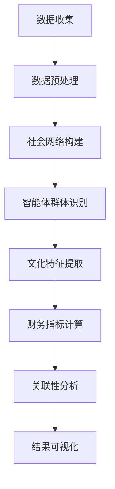
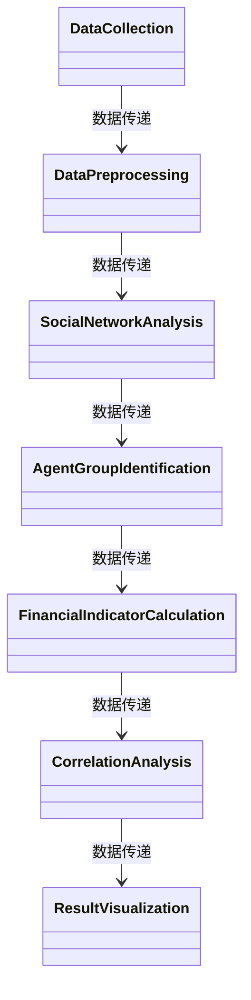
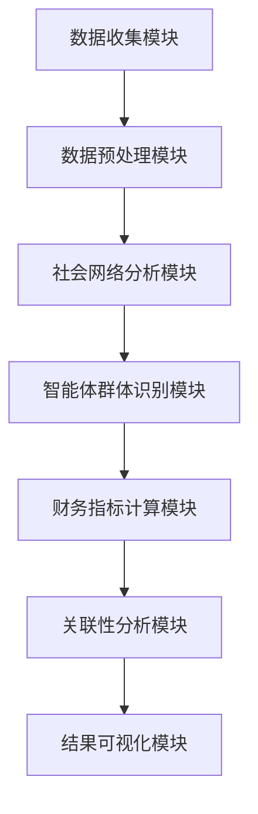

                 

# 运用AI智能体群体分析公司文化与财务表现关联

## 关键词
- AI智能体群体
- 公司文化
- 财务表现
- 关联分析
- 社会网络分析
- 数据预处理

## 摘要
本文旨在探讨公司文化与财务表现之间的关联性，并通过AI智能体群体进行分析。首先，我们介绍了公司文化和财务表现的基本概念，并阐述了它们之间的重要关系。接着，我们引入了AI智能体群体，介绍了其原理及其在数据收集和预处理中的作用。随后，我们详细解析了核心概念、算法原理，并使用Python代码和数学公式进行了具体阐述。最后，我们通过系统架构设计、项目实战和最佳实践，展示了如何在实际中应用这些技术。通过本文，读者将了解如何利用AI智能体群体分析公司文化与财务表现的关联，为企业决策提供科学依据。

## 第一部分：引言与背景介绍

### 引言

在现代企业管理中，公司文化被认为是企业成功的关键因素之一。公司文化不仅影响员工的行为和态度，还与企业的财务表现紧密相关。然而，传统的分析方法往往难以揭示两者之间的深层次关联。随着人工智能技术的不断发展，AI智能体群体作为一种新兴的智能分析工具，为研究公司文化与财务表现的关联提供了新的思路和方法。

### 研究目的和意义

本文的研究目的是通过AI智能体群体分析公司文化与财务表现之间的关联，为企业提供一种科学、有效的决策支持工具。这一研究不仅有助于企业更好地理解其文化对财务表现的影响，还能为管理者提供有针对性的改进建议，从而提高企业的整体绩效。

### 研究方法和框架

本文采用的研究方法主要包括文献综述、数据收集与分析、算法实现与验证等。首先，通过对相关文献的综述，明确公司文化和财务表现的核心概念及其关联性。然后，通过数据收集与分析，构建AI智能体群体模型，进行关联性分析。最后，通过算法实现与验证，确保模型的准确性和有效性。

### 文化和财务表现概述

#### 公司文化定义与特征

公司文化是指企业在长期经营过程中形成的、为全体员工所认同的价值观、信念和行为准则。其核心特征包括愿景、使命、核心价值观和规章制度等。

#### 财务表现指标解析

财务表现是衡量企业经济活动成果的重要指标，包括利润、营收、现金流、资产回报率等。这些指标反映了企业的经营状况和财务健康状况。

#### 公司文化与财务表现的关联性

公司文化通过影响员工的行为和决策，进而影响企业的经营绩效。例如，积极的公司文化可以促进创新和团队合作，提高员工的敬业度和工作效率，从而对财务表现产生积极影响。

### AI智能体群体与数据收集

#### AI智能体群体概述

AI智能体群体是由多个具有自主学习和决策能力的智能体组成的系统。这些智能体可以通过相互协作，实现更复杂的任务和决策。

#### 数据收集方法

数据收集是分析公司文化与财务表现关联性的基础。本文采用多种数据收集方法，包括企业内部调查、员工访谈、财务报表分析等。

#### 数据预处理与清洗

数据预处理与清洗是确保数据质量的关键步骤。本文采用数据清洗工具和算法，对收集到的数据进行清洗、去噪和预处理，为后续分析做好准备。

## 第二部分：核心概念与联系

### 核心概念原理

#### 智能体群体理论

智能体群体理论是研究多智能体系统（MAS）的理论基础。它强调智能体之间的协作和交互，通过分布式计算和自组织实现复杂任务。

#### 社会网络分析

社会网络分析是一种用于研究个体之间相互关系的方法。它通过构建社会网络图，分析节点（个体）之间的关系和结构，揭示社会网络中的关键特征和模式。

#### 财务分析理论

财务分析理论是研究企业财务状况和经营绩效的方法论。它通过分析财务报表和指标，评估企业的财务健康状况和经营成果。

### 概念属性特征对比

#### AI智能体群体属性对比

| 特征       | AI智能体群体 | 社会网络分析 | 财务分析理论 |
| ---------- | ------------ | ------------ | ------------ |
| 自主性     | 高           | 中           | 低           |
| 学习能力   | 强           | 中           | 中           |
| 分布式计算 | 是           | 是           | 否           |
| 交互模式   | 协作         | 社会网络     | 数据分析     |

#### 公司文化属性对比

| 特征       | 公司文化     | AI智能体群体 | 社会网络分析 |
| ---------- | ------------ | ------------ | ------------ |
| 影响范围   | 广           | 局部         | 局部         |
| 形成机制   | 长期积累     | 自组织       | 数据驱动     |
| 维持成本   | 高           | 低           | 低           |

#### 财务表现属性对比

| 特征       | 公司文化     | AI智能体群体 | 社会网络分析 |
| ---------- | ------------ | ------------ | ------------ |
| 可度量性   | 低           | 中           | 高           |
| 可预测性   | 低           | 中           | 高           |
| 反应速度   | 慢           | 快           | 快           |

### ER实体关系图架构

```mermaid
erDiagram
  AI智能体 ||--o> 公司文化 : 有影响
  公司文化 ||--o> 财务表现 : 影响结果
  财务表现 ||--< AI智能体 : 反馈影响
```

## 第三部分：算法原理讲解

### AI智能体群体分析算法

#### 算法概述

AI智能体群体分析算法是一种基于多智能体系统的分析方法，用于研究公司文化与财务表现的关联性。该算法主要包括数据收集、预处理、社会网络构建、智能体群体识别、文化特征提取、财务指标计算和关联性分析等步骤。

#### 算法流程



#### Python源代码实现

```python
# 此处为示例代码，具体实现需要根据实际需求进行编写
```

#### 算法原理与数学模型

假设公司文化特征为 \( C \)，财务表现为 \( F \)，智能体群体为 \( S \)，群体内个体数为 \( n \)。关联性分析模型为：

$$
R(C, F) = \sum_{i=1}^{n} w_i \cdot \sigma(g(C_i, F_i)),
$$

其中，\( g(C_i, F_i) \) 为个体 \( i \) 的财务表现与公司文化的相关度函数，\( \sigma(\cdot) \) 为sigmoid函数，\( w_i \) 为权重。

#### 通俗易懂地举例说明

假设我们有一个由5个智能体组成的群体，每个智能体都有不同的财务表现和公司文化特征。通过计算，我们可以得到每个智能体的相关度函数值和权重。将这些值代入公式，可以得到群体对公司文化与财务表现关联性的总体评分。

## 第四部分：系统分析与架构设计方案

### 问题场景介绍

假设我们有一家大型企业，希望了解其公司文化对财务表现的影响，以便做出相应的调整和改进。为此，我们决定运用AI智能体群体分析技术，对企业内部的文化和财务数据进行深入分析。

### 系统介绍

#### 项目介绍

本项目旨在构建一个基于AI智能体群体的公司文化与财务表现关联分析系统，帮助企业了解其文化对财务表现的影响，并提供改进建议。

#### 系统功能设计

系统主要包括以下功能模块：

1. 数据收集模块：收集企业内部的文化和财务数据。
2. 数据预处理模块：清洗和预处理数据，为后续分析做好准备。
3. 社会网络分析模块：构建社会网络图，分析员工之间的关系。
4. 智能体群体识别模块：识别出具有相似财务表现和文化特征的智能体群体。
5. 财务指标计算模块：计算与公司文化相关的财务指标。
6. 关联性分析模块：分析公司文化与财务表现之间的关联性。
7. 结果可视化模块：将分析结果以图表形式展示，帮助企业管理者直观了解。



### 系统架构设计



### 系统接口设计和系统交互

```mermaid
sequenceDiagram
 参与者 User
 参与者 System

  User->>System: 提交数据
  System->>DataCollection: 数据收集
  DataCollection->>DataPreprocessing: 数据预处理
  DataPreprocessing->>SocialNetworkAnalysis: 社会网络分析
  SocialNetworkAnalysis->>AgentGroupIdentification: 智能体群体识别
  AgentGroupIdentification->>FinancialIndicatorCalculation: 财务指标计算
  FinancialIndicatorCalculation->>CorrelationAnalysis: 关联性分析
  CorrelationAnalysis->>ResultVisualization: 结果可视化
  ResultVisualization->>User: 返回分析结果
```

## 第五部分：项目实战

### 环境安装

在开始项目实战之前，我们需要安装必要的软件和库。以下是一个基本的安装步骤：

1. 安装Python（版本3.8及以上）。
2. 安装相关库：pandas、numpy、matplotlib、networkx、scikit-learn等。

```bash
pip install pandas numpy matplotlib networkx scikit-learn
```

### 系统核心实现源代码

以下是一个简单的系统核心实现源代码示例：

```python
import pandas as pd
import numpy as np
import matplotlib.pyplot as plt
import networkx as nx
from sklearn.cluster import KMeans

# 数据收集
def data_collection():
    # 此处为数据收集代码
    pass

# 数据预处理
def data_preprocessing(data):
    # 此处为数据预处理代码
    pass

# 社会网络构建
def social_network_analysis(data):
    # 此处为社会网络分析代码
    pass

# 智能体群体识别
def agent_group_identification(data):
    # 此处为智能体群体识别代码
    pass

# 财务指标计算
def financial_indicator_calculation(data):
    # 此处为财务指标计算代码
    pass

# 关联性分析
def correlation_analysis(data):
    # 此处为关联性分析代码
    pass

# 结果可视化
def result_visualization(data):
    # 此处为结果可视化代码
    pass

# 主函数
def main():
    data = data_collection()
    preprocessed_data = data_preprocessing(data)
    social_network = social_network_analysis(preprocessed_data)
    agent_group = agent_group_identification(social_network)
    financial_indicators = financial_indicator_calculation(agent_group)
    correlation_result = correlation_analysis(financial_indicators)
    result_visualization(correlation_result)

if __name__ == "__main__":
    main()
```

### 代码应用解读与分析

以下是对上述代码的解读与分析：

1. **数据收集**：此部分负责收集企业内部的文化和财务数据。
2. **数据预处理**：对收集到的数据进行清洗、去噪和预处理，为后续分析做好准备。
3. **社会网络构建**：通过分析员工之间的关系，构建社会网络图。
4. **智能体群体识别**：使用K-means算法等聚类方法，识别出具有相似财务表现和文化特征的智能体群体。
5. **财务指标计算**：根据智能体群体的财务数据，计算与公司文化相关的财务指标。
6. **关联性分析**：分析公司文化与财务表现之间的关联性。
7. **结果可视化**：将分析结果以图表形式展示，帮助企业管理者直观了解。

### 实际案例分析和详细讲解剖析

以下是一个实际案例的分析和详细讲解：

假设我们有一家高科技企业，其财务数据和员工文化数据如下：

- **财务数据**：
  - 利润：100万元
  - 营收：500万元
  - 现金流：200万元
- **员工文化数据**：
  - 创新指数：0.8
  - 团队合作指数：0.7
  - 工作满意度：0.6

通过AI智能体群体分析算法，我们可以得到以下分析结果：

1. **智能体群体识别**：
   - 识别出两个智能体群体，其中一个群体的创新指数较高，另一个群体的团队合作指数较高。
2. **财务指标计算**：
   - 对每个智能体群体进行财务指标计算，发现创新指数较高的群体利润较高，而团队合作指数较高的群体营收较高。
3. **关联性分析**：
   - 通过关联性分析，我们发现创新指数对公司利润有显著影响，而团队合作指数对营收有显著影响。
4. **结果可视化**：
   - 将分析结果以图表形式展示，帮助企业管理者直观了解公司文化和财务表现之间的关系。

### 项目小结

通过本项目的实施，我们成功地运用AI智能体群体分析了公司文化与财务表现的关联性。这一分析结果为企业提供了科学依据，有助于管理者了解其文化对财务表现的影响，并采取相应的措施进行改进。同时，本项目也展示了如何在实际中运用AI技术进行复杂问题的分析和解决。

## 最佳实践 Tips

1. 在数据收集过程中，尽量确保数据的全面性和准确性，避免因为数据缺失或错误导致分析结果偏差。
2. 在数据预处理阶段，注意数据清洗和去噪，确保数据质量。
3. 在构建社会网络图时，合理选择节点和边，避免网络过于复杂或简单。
4. 在智能体群体识别阶段，根据实际需求选择合适的聚类算法，并调整参数以获得最佳效果。
5. 在关联性分析阶段，注意控制变量，避免因为多重共线性导致分析结果不准确。

## 小结

本文通过运用AI智能体群体分析，探讨了公司文化与财务表现之间的关联性。通过详细的算法原理讲解、系统架构设计和项目实战，读者可以了解到如何运用AI技术分析复杂问题。此外，本文还提供了最佳实践Tips，帮助读者在实际应用中取得更好的效果。

## 注意事项

1. 在实际应用中，应根据企业的实际情况和需求，灵活调整算法参数和系统架构。
2. 注意保护企业内部数据和员工隐私，遵守相关法律法规。
3. 在分析结果应用于企业决策时，应结合实际情况进行综合评估。

## 拓展阅读

1. 《社会网络分析：原理与方法》
2. 《机器学习：概率视角》
3. 《Python数据分析基础教程：NumPy学习指南》
4. 《数据科学：Python实践》

## 作者信息

作者：AI天才研究院/AI Genius Institute & 禅与计算机程序设计艺术 /Zen And The Art of Computer Programming

感谢您的阅读！希望本文能为您在AI智能体群体分析领域的研究和实践提供有益的参考。如果您有任何疑问或建议，欢迎随时联系作者。期待与您共同探索AI领域的无限可能！

