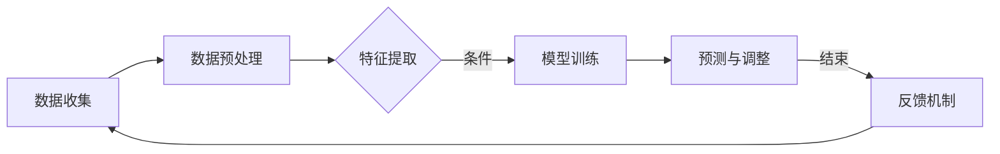

                 

### 第一部分：问题背景与核心概念

#### 第1章：市场市盈率调整的挑战

##### 1.1.1 市盈率的基本概念

市盈率（P/E Ratio），又称股价收益比率，是衡量股票价格相对于每股收益的一个财务指标。其基本计算公式为：

\[ \text{市盈率} = \frac{\text{公司市值}}{\text{公司净利润}} \]

其中，公司市值是通过将公司股票的市场价格乘以总股数得出的，而净利润则是公司一定时期内的利润总额。

市盈率在市场分析中的作用不可忽视。它能够帮助投资者快速评估一家公司股票的估值水平，是判断股票是否被高估或低估的重要指标之一。一般来说，市盈率越低，股票的潜在投资价值越大；市盈率越高，则可能意味着股票价格过高，存在泡沫风险。

然而，市盈率也存在局限性。首先，市盈率依赖于净利润这一财务指标，而净利润受到多种因素影响，如会计政策的选择、季节性波动等，可能导致市盈率的波动性较大。其次，市盈率无法反映公司的成长性，即如果一家公司正处于高速成长期，即使市盈率较高，也并不意味着其股票估值过高。最后，市盈率在不同行业之间的可比性较差，因为不同行业的盈利能力差异较大。

##### 1.1.2 传统市盈率调整的挑战

传统市盈率调整主要依赖于历史数据和现有的分析模型。然而，随着市场环境的不断变化，以及数据质量和分析方法的限制，传统市盈率调整面临着以下几大挑战：

- **数据来源的有限性**：传统市盈率调整依赖于历史财务数据和市场交易数据，但这些数据往往不够全面和实时。特别是在金融市场波动较大的情况下，数据的不完备性会影响市盈率调整的准确性。

- **宏观经济环境变化的影响**：宏观经济环境的变化，如经济衰退、通货膨胀等，会对企业的盈利能力产生重大影响。传统市盈率调整往往无法及时捕捉这些宏观变化，从而影响调整的准确性。

- **行业特性对市盈率的影响**：不同行业的盈利模式和成长潜力差异较大，传统市盈率调整方法往往无法充分考虑这些行业特性，导致调整结果与实际市盈率水平存在偏差。

- **市场情绪波动的影响**：市场情绪的波动会对股价产生显著影响，进而影响市盈率。传统市盈率调整方法通常无法准确捕捉市场情绪的变化，导致调整结果滞后。

##### 1.1.3 AI智能体群体在市盈率调整中的潜力

随着人工智能技术的不断发展，AI智能体群体在市场市盈率调整中展现出巨大的潜力。AI智能体群体是一种由多个智能体组成的系统，这些智能体通过协作和自主学习来完成任务。以下是AI智能体群体在市盈率调整中的主要优势：

- **数据收集与处理能力**：AI智能体能够从海量的数据源中收集和提取有价值的信息，包括历史财务数据、市场交易数据、宏观经济数据等。通过这些数据的整合和分析，AI智能体能够提供更加全面和实时的市盈率调整依据。

- **自适应与学习能力**：AI智能体具备自我学习和自适应能力，能够根据市场环境的变化不断调整和优化市盈率调整策略。这种能力使AI智能体能够更好地应对宏观经济环境变化和行业特性对市盈率的影响。

- **协作与决策能力**：AI智能体群体通过协作能够实现更加复杂和智能的决策。多个智能体可以从不同角度分析市场数据，综合各智能体的分析结果，提供更加准确和可靠的市盈率调整建议。

- **实时性与准确性**：AI智能体能够实时监控市场数据，快速捕捉市场情绪波动，并提供即时的市盈率调整建议。这种实时性和准确性是传统市盈率调整方法所无法比拟的。

总之，AI智能体群体在市盈率调整中的应用，不仅能够解决传统方法所面临的挑战，还能提供更加智能、实时和准确的调整策略，为投资者和金融市场带来更高的价值。

### 第2章：AI智能体群体的核心概念与结构

#### 2.1.1 AI智能体群体的定义

AI智能体（Agent）是指具有感知环境、执行任务和与外界交互能力的计算机程序。智能体可以是一个简单的程序，也可以是一个复杂的系统，其主要特点是自主性、主动性和适应性。智能体可以根据自身的目标和环境变化自主地制定决策和采取行动。

智能体群体（Multi-Agent System，MAS）是由多个智能体组成的系统，这些智能体相互协作，共同完成任务。智能体群体通过分布式计算和协作机制，能够在复杂环境中实现更高层次的任务处理和决策。智能体群体在市场分析中的应用，主要体现在数据收集与处理、风险评估与预测、以及市盈率动态调整策略的制定等方面。

首先，智能体能够从各种数据源中收集数据，如财务报表、市场交易记录、宏观经济数据等。这些数据经过智能体的处理和分析，可以为市盈率的动态调整提供重要依据。其次，智能体群体可以相互协作，对市场风险进行综合评估和预测，为市盈率调整提供风险预警。最后，智能体可以根据市场环境和风险情况，实时制定和调整市盈率策略，提高市盈率调整的准确性和实时性。

#### 2.1.2 AI智能体群体的架构与特点

AI智能体群体的架构设计通常包括以下几个关键组成部分：

- **智能体层**：这是智能体群体的核心层，由多个智能体组成。每个智能体具有自主感知环境、执行任务和与外界交互的能力。智能体可以是基于规则的系统，也可以是基于机器学习的模型。

- **协作层**：协作层负责智能体之间的通信和协作。通过消息传递机制和协调算法，智能体能够实现任务分配、信息共享和合作决策。协作层的设计直接影响智能体群体的效率和效能。

- **环境层**：环境层是智能体群体所处的实际环境，包括市场数据、宏观经济环境、行业特性等。智能体群体通过感知环境层的信息，实现与环境的高效互动和适应。

AI智能体群体具有以下几个主要特点：

- **自主性**：智能体具有自主决策和行动的能力，能够根据自身目标和环境变化独立执行任务。

- **主动性**：智能体能够主动感知环境变化，并采取相应的行动，实现自我优化和适应。

- **适应性**：智能体能够通过学习机制，不断调整自身行为和策略，以适应复杂和动态的环境。

- **协作性**：智能体群体通过协作机制，实现信息共享和任务分工，提高整体效率和效能。

- **分布性**：智能体群体通常采用分布式计算架构，能够在多台计算机或设备上运行，实现高效的任务处理和资源利用。

#### 2.1.3 AI智能体群体在市场分析中的关键功能

AI智能体群体在市场分析中具有多个关键功能，包括数据收集与处理、风险评估与预测、以及市盈率动态调整策略的制定。

首先，数据收集与处理是AI智能体群体的重要任务之一。智能体可以从多种数据源中获取信息，如财务报表、市场交易记录、宏观经济数据等。智能体通过数据清洗、数据整合和数据挖掘等技术，将原始数据转化为有意义的信息，为后续分析提供基础。

其次，智能体群体可以协作进行风险评估与预测。智能体可以通过分析历史数据和当前市场状况，识别潜在的市场风险和机会。智能体之间可以共享风险信息，并通过多角度的综合评估，提高风险评估的准确性和全面性。

最后，基于数据收集和风险评估的结果，AI智能体群体可以制定动态市盈率调整策略。智能体可以通过机器学习算法和优化技术，制定出最优的市盈率调整方案，并在实际市场中进行实时调整。这种动态调整能力，使市盈率能够更准确地反映市场环境和企业价值。

总之，AI智能体群体在市场分析中的关键功能，不仅提升了数据收集和处理的能力，还实现了风险评估与预测的智能化和动态化。通过这些功能，AI智能体群体为市场市盈率的动态调整提供了强有力的技术支持。

### 第3章：动态市盈率调整的算法原理

#### 3.1.1 动态市盈率调整的基本算法

动态市盈率调整是一种基于市场数据和企业财务状况的实时调整方法，其基本原理是通过监测市场环境和企业内部变化，动态调整市盈率指标，使其更加准确地反映市场对企业价值的评估。

**基本原理**：

动态市盈率调整的核心思想是利用历史数据和实时数据，建立一个数学模型，通过模型预测未来可能的市盈率水平。具体步骤如下：

1. **数据收集**：首先，从财务报表、市场交易记录、宏观经济数据等多个数据源中收集历史数据。

2. **特征提取**：对收集到的历史数据进行预处理，提取影响市盈率的特征，如公司市值、净利润、市盈率变化趋势等。

3. **数学建模**：利用提取的特征，建立一个数学模型，通常采用回归分析、时间序列分析等方法，预测未来可能的市盈率水平。

4. **实时调整**：根据实时收集到的市场数据和财务数据，对模型进行动态调整，更新预测结果。

**数学模型**：

一个简单的动态市盈率调整模型可以表示为：

\[ \text{预测市盈率} = f(\text{历史市盈率}, \text{公司市值}, \text{净利润}, \text{宏观经济指标}, \text{市场情绪指标}) \]

其中，\( f \) 是一个复杂的函数，可以通过机器学习算法来训练和优化。具体公式可以根据实际情况进行调整。

**计算方法**：

动态市盈率调整的计算方法主要包括以下几个步骤：

1. **特征归一化**：为了使不同特征之间具有可比性，通常需要对特征进行归一化处理。

2. **模型训练**：使用历史数据对数学模型进行训练，通过最小化预测误差来优化模型参数。

3. **实时预测**：在实时数据输入模型后，模型会输出预测的市盈率值。

4. **调整与优化**：根据预测结果和实时数据，动态调整市盈率指标，不断优化模型参数。

#### 3.1.2 AI智能体群体算法框架

AI智能体群体算法框架旨在通过分布式计算和协作机制，实现动态市盈率调整的智能化和自动化。以下是智能体群体算法框架的详细设计：

**框架设计**：

1. **数据收集模块**：多个智能体负责从不同数据源收集数据，如财务报表、市场交易记录、宏观经济数据等。数据收集模块确保数据来源的多样性和全面性。

2. **特征处理模块**：智能体将收集到的数据进行预处理，包括数据清洗、特征提取等。特征处理模块确保数据的准确性和一致性。

3. **模型训练模块**：多个智能体共同参与模型训练，通过分布式计算提高训练效率。模型训练模块利用机器学习算法，训练出能够预测市盈率的数学模型。

4. **预测与调整模块**：智能体群体通过协作，实时预测市盈率并调整策略。预测与调整模块根据实时数据和预测结果，动态调整市盈率指标。

**智能体之间的通信与协作**：

1. **消息传递机制**：智能体之间通过消息传递机制进行通信，交换数据和预测结果。消息传递机制确保智能体之间的信息共享和协同工作。

2. **协调算法**：智能体群体采用协调算法，实现任务分配、资源调度和合作决策。协调算法确保智能体群体的高效运行和整体优化。

3. **学习机制**：智能体通过学习机制，不断调整自身行为和策略，适应环境变化。学习机制使智能体具备自适应能力和自我优化能力。

**优化策略**：

1. **模型优化**：通过交叉验证、网格搜索等方法，不断优化模型参数，提高预测准确性。

2. **资源调度**：根据智能体的任务需求和计算资源，动态调度任务，确保资源利用最大化。

3. **反馈机制**：智能体群体通过实时反馈机制，调整市盈率策略，实现动态优化。

总之，AI智能体群体算法框架通过分布式计算和协作机制，实现了动态市盈率调整的智能化和自动化，为市场市盈率的实时调整提供了强大的技术支持。

#### 3.1.3 AI智能体群体算法的mermaid流程图

为了更直观地展示AI智能体群体算法的流程，我们使用mermaid流程图来绘制算法的执行步骤。以下是一个简化的mermaid流程图示例：



**详细解释**：

1. **数据收集（A）**：多个智能体从不同的数据源收集数据，如财务报表、市场交易记录等。
   
2. **数据预处理（B）**：智能体对收集到的数据进行清洗和标准化，确保数据质量。

3. **特征提取（C）**：提取影响市盈率的特征，如公司市值、净利润等，为后续建模做准备。

4. **模型训练（D）**：使用历史数据，通过机器学习算法训练出预测市盈率的模型。

5. **预测与调整（E）**：根据实时数据和预测结果，动态调整市盈率指标。

6. **反馈机制（F）**：智能体通过实时反馈，调整市盈率策略，实现自我优化。

这个mermaid流程图展示了AI智能体群体算法的核心步骤和协作机制，有助于读者更直观地理解算法的执行过程。

#### 3.1.4 动态市盈率调整算法原理的应用与优势

动态市盈率调整算法原理的应用不仅提升了市盈率预测的准确性，还在实际市场中展现出显著的优势。以下是该算法在实际应用中的几个关键步骤、优势及其对市场分析的贡献：

**关键步骤**：

1. **数据收集**：首先，算法从多个数据源收集数据，包括历史财务数据、市场交易记录、宏观经济指标等。这些数据是动态市盈率调整的基础。

2. **特征提取**：对收集到的数据进行预处理，提取与市盈率相关的特征，如公司市值、净利润、市盈率历史波动等。特征提取是模型训练的重要步骤，确保模型能够捕捉到关键信息。

3. **模型训练**：利用提取的特征，通过机器学习算法（如线性回归、神经网络等）训练预测模型。模型训练过程中，算法通过多次迭代和优化，提高预测的准确性。

4. **实时预测**：在实时数据输入模型后，算法输出预测的市盈率值。这一步骤实现了市盈率的动态调整，使市盈率能够实时反映市场变化。

5. **策略调整**：根据预测结果和实时数据，算法动态调整市盈率策略。策略调整包括调整市盈率指标、优化投资组合等，以提高市场分析的准确性和有效性。

**优势**：

1. **实时性与准确性**：动态市盈率调整算法能够实时捕捉市场变化，提供即时的市盈率预测。与传统方法相比，算法的预测结果更加准确，能够及时应对市场波动。

2. **自适应与学习能力**：算法具备自我学习和自适应能力，能够根据市场环境的变化不断调整和优化预测模型。这种能力使算法能够更好地适应不同市场环境和行业特性。

3. **多角度分析**：算法通过多个数据源和特征提取方法，从不同角度分析市场数据，提高市盈率预测的全面性和准确性。

4. **协作与决策能力**：算法通过智能体群体协作，实现信息共享和协同决策。多个智能体可以从不同角度分析市场数据，综合各智能体的分析结果，提供更加准确和可靠的市盈率调整建议。

**对市场分析的贡献**：

1. **提升市场分析能力**：动态市盈率调整算法为市场分析提供了更加准确和实时的工具，有助于投资者和金融机构更有效地评估股票的估值水平。

2. **优化投资策略**：通过动态调整市盈率，算法能够为投资者提供更优的投资策略，降低投资风险，提高投资收益。

3. **监管与预警**：算法能够实时监控市场风险，为监管部门提供风险预警，有助于维护市场稳定。

4. **促进金融科技发展**：动态市盈率调整算法的应用，推动了金融科技的发展，为金融市场的智能化和自动化提供了新的解决方案。

总之，动态市盈率调整算法在实际应用中展现出显著的优势，为市场分析提供了强有力的技术支持，有助于提升市场分析的准确性和有效性。

### 第4章：AI智能体群体实现动态市盈率调整的步骤

#### 4.1.1 数据收集与预处理

在实现动态市盈率调整之前，数据收集与预处理是至关重要的第一步。有效的数据收集和预处理不仅能确保算法的性能，还能提高市盈率调整的准确性和可靠性。

**数据源的选择**：

数据收集的第一步是选择合适的数据源。常见的数据源包括：

1. **财务报表**：如公司年度报告、季度报告等，包含公司市值、净利润、每股收益等关键财务指标。
2. **市场交易数据**：包括股票价格、交易量、换手率等，反映市场的动态变化。
3. **宏观经济数据**：如GDP增长率、通货膨胀率、利率水平等，影响企业盈利和市场情绪。
4. **行业数据**：特定行业的市场动态、竞争状况等，为市盈率调整提供行业背景。

**数据的收集方法**：

数据收集方法可以包括以下几种：

1. **手动收集**：通过访问官方网站、数据库等渠道，手动下载和整理数据。
2. **自动化收集**：使用爬虫技术，从网站、API等渠道自动化收集数据。
3. **第三方数据服务**：购买专业的金融数据服务，如Wind、Bloomberg等，确保数据的全面性和准确性。

**数据预处理技术**：

数据预处理是确保数据质量和可用性的关键步骤，包括以下内容：

1. **数据清洗**：去除重复、错误和缺失的数据，确保数据的准确性和一致性。
2. **数据标准化**：将不同来源的数据进行统一格式和单位处理，便于后续分析和建模。
3. **特征工程**：提取与市盈率相关的特征，如历史市盈率、公司市值、净利润增长率等。
4. **数据归一化**：对数值特征进行归一化处理，使不同特征具有相似的尺度，提高算法的性能。

通过有效的数据收集与预处理，我们能够确保数据的质量和完整性，为后续的动态市盈率调整提供坚实的基础。

#### 4.1.2 智能体设计与实现

在实现动态市盈率调整的过程中，智能体的设计与实现是核心环节。智能体作为AI智能体群体中的基本单元，其设计和实现直接决定了系统的性能和效果。

**智能体的设计原则**：

智能体的设计应遵循以下原则：

1. **模块化**：智能体应具有明确的模块化设计，包括感知模块、决策模块和行动模块，使系统易于维护和扩展。
2. **自治性**：每个智能体应具有自治性，能够自主感知环境、做出决策和采取行动。
3. **协作性**：智能体之间应具备良好的协作机制，能够通过通信和协调实现任务分工和信息共享。
4. **适应性**：智能体应具备自适应能力，能够根据环境和任务的变化动态调整自身行为。

**智能体的实现方法**：

智能体的实现方法主要包括以下步骤：

1. **感知模块**：感知模块负责从环境中获取信息，如股票价格、交易量、宏观经济指标等。感知模块通常采用传感器、API调用等技术获取数据。

2. **决策模块**：决策模块根据感知模块获取的信息，利用机器学习算法和优化技术，制定决策策略。决策模块的核心是构建预测模型，如线性回归、神经网络等。

3. **行动模块**：行动模块根据决策模块的决策结果，执行具体的行动，如调整市盈率指标、优化投资组合等。行动模块需要与外部系统（如交易平台）进行交互，实现实际的调整操作。

**智能体之间的交互机制**：

智能体之间的交互机制是实现协作和决策的重要保障。以下是一些常用的交互机制：

1. **消息传递机制**：智能体之间通过消息传递进行通信，交换感知数据、决策结果和行动指令。消息传递机制应确保数据传输的实时性和可靠性。

2. **协调算法**：协调算法负责智能体之间的任务分配和资源调度。协调算法应考虑智能体的自治性和协作性，确保系统的整体性能。

3. **学习机制**：智能体通过学习机制，不断积累经验、优化决策策略。学习机制可以通过机器学习算法实现，如深度学习、强化学习等。

通过智能体的设计与实现，我们能够构建一个具有自主性、协作性和自适应能力的AI智能体群体，为动态市盈率调整提供强有力的技术支持。

#### 4.1.3 动态市盈率调整策略制定

动态市盈率调整策略的制定是AI智能体群体实现动态调整的关键环节。合理的调整策略能够有效应对市场变化，提高市盈率预测的准确性和市场分析的有效性。

**市盈率调整策略的制定**：

市盈率调整策略的制定需要综合考虑多种因素，包括历史数据、实时数据、市场环境等。以下是制定市盈率调整策略的主要步骤：

1. **数据收集**：从多个数据源收集历史数据和实时数据，如财务报表、市场交易记录、宏观经济指标等。

2. **特征提取**：提取与市盈率相关的特征，如公司市值、净利润、市盈率历史波动、市场情绪等。

3. **模型构建**：利用提取的特征，通过机器学习算法构建预测模型，如线性回归、神经网络等。模型构建过程中，需要对模型进行训练和验证，确保其预测能力。

4. **策略评估**：对不同调整策略进行评估，包括历史数据回测和实时数据验证。评估指标包括预测准确性、调整效率等。

5. **策略优化**：根据评估结果，对调整策略进行优化，提高其预测准确性和市场适应性。

**策略的优化与调整**：

市盈率调整策略需要根据市场环境的变化进行动态调整。以下是一些常用的策略优化与调整方法：

1. **自适应调整**：智能体群体通过学习机制，根据市场环境的变化，自适应调整市盈率策略。自适应调整可以通过机器学习算法实现，如强化学习、进化算法等。

2. **组合策略**：将多种调整策略组合使用，提高市盈率调整的灵活性和多样性。组合策略可以根据市场环境和风险情况，动态调整策略权重。

3. **实时反馈**：智能体群体通过实时反馈机制，不断调整市盈率策略。实时反馈机制可以通过模型预测误差、市场响应等指标进行优化。

4. **情景分析**：对不同的市场情景进行模拟和分析，制定相应的调整策略。情景分析可以帮助智能体群体应对不同的市场环境，提高策略的适应能力。

**策略的执行与反馈**：

市盈率调整策略的执行与反馈是动态市盈率调整的关键环节。以下是策略执行与反馈的主要步骤：

1. **策略执行**：根据制定好的调整策略，智能体群体执行具体的调整操作，如调整市盈率指标、优化投资组合等。

2. **实时监控**：智能体群体实时监控市场数据，包括股票价格、交易量、市场情绪等，确保调整策略的有效性和实时性。

3. **效果评估**：根据调整后的市场表现，对策略效果进行评估。评估指标包括市盈率预测准确性、投资收益等。

4. **反馈机制**：智能体群体根据策略效果，及时调整和优化市盈率策略，确保策略的持续优化和有效性。

通过合理的市盈率调整策略制定和优化，AI智能体群体能够实现动态市盈率的准确调整，为投资者和市场分析提供有力支持。

### 第5章：AI智能体群体在动态市盈率调整中的实际应用

#### 5.1.1 案例分析

为了更好地理解AI智能体群体在动态市盈率调整中的实际应用，我们以某知名科技公司为例，分析其市盈率调整的过程及其效果。

**案例背景介绍**：

某知名科技公司（以下简称“公司”）在过去几年中取得了显著的业绩增长，但由于市场环境的变化和竞争的加剧，其股票市盈率出现了波动。为了提高市盈率的预测准确性和市场适应性，公司决定采用AI智能体群体进行动态市盈率调整。

**案例实施步骤**：

1. **数据收集与预处理**：智能体群体从多个数据源收集数据，包括公司财务报表、市场交易记录、宏观经济指标等。数据经过清洗、标准化和特征提取后，用于训练和优化预测模型。

2. **模型构建与训练**：智能体群体利用历史数据，采用机器学习算法（如神经网络、随机森林等）构建预测模型。模型通过多次迭代和优化，提高预测准确性和稳定性。

3. **动态调整市盈率**：在实时数据输入模型后，智能体群体根据预测结果和当前市场状况，动态调整市盈率指标。调整策略包括调整市盈率目标、优化投资组合等。

4. **效果评估与反馈**：智能体群体通过实时监控市场数据和市盈率调整效果，对模型和策略进行评估和反馈。根据评估结果，智能体群体对模型和策略进行优化，确保持续提升预测准确性和市场适应性。

**案例效果分析**：

通过AI智能体群体的动态市盈率调整，公司在多个方面取得了显著效果：

1. **预测准确性提升**：智能体群体利用实时数据和机器学习算法，大幅提升了市盈率预测的准确性。与传统的市盈率调整方法相比，预测误差显著降低。

2. **市场适应性增强**：智能体群体能够快速适应市场环境的变化，及时调整市盈率策略。这有助于公司在市场波动中保持稳定的市盈率水平，提高市场竞争力。

3. **投资收益提高**：基于智能体群体的动态市盈率调整策略，公司的投资组合得到了优化。调整后的市盈率指标更加准确地反映了市场对公司价值的评估，提高了投资收益。

4. **风险管理能力提升**：智能体群体通过风险评估与预测，为公司在市场波动中提供了有效的风险预警。公司能够及时调整投资策略，降低投资风险，保障资产安全。

总之，AI智能体群体在动态市盈率调整中的实际应用，为某知名科技公司提供了强大的技术支持，显著提升了市盈率预测的准确性和市场适应性，提高了公司的投资收益和风险管理能力。

#### 5.1.2 应用场景与挑战

AI智能体群体在市场分析中具有广泛的应用场景，特别是在动态市盈率调整方面，展现出巨大的潜力。以下是AI智能体群体在动态市盈率调整中的主要应用场景和面临的挑战：

**应用场景**：

1. **股票市场分析**：AI智能体群体可以实时收集和分析股票市场的数据，包括股票价格、交易量、市场情绪等，动态调整市盈率，帮助投资者和金融机构更准确地评估股票估值。

2. **行业分析**：智能体群体可以针对特定行业进行深入分析，提取行业特征，评估行业风险和机会，为行业投资提供参考。

3. **风险管理**：智能体群体可以通过对市场数据的实时监控和分析，识别潜在的市场风险，为金融机构提供有效的风险预警和应对策略。

4. **投资组合优化**：基于对市场动态的实时分析和预测，AI智能体群体可以优化投资组合，降低投资风险，提高投资回报。

**挑战**：

1. **数据质量**：市场数据的质量直接影响AI智能体群体的性能。数据噪声、缺失值和错误值都会影响模型的预测准确性。因此，确保数据质量是AI智能体群体应用的首要挑战。

2. **实时性**：动态市盈率调整需要实时处理大量市场数据，这对系统的计算能力和响应速度提出了高要求。实时性不足可能导致市盈率调整滞后，影响市场分析效果。

3. **模型复杂度**：AI智能体群体使用的模型通常较为复杂，需要大量的训练数据和计算资源。模型的复杂度越高，对计算资源的需求也越大，增加了系统的部署和维护难度。

4. **协作与协调**：AI智能体群体中的智能体需要通过高效的协作与协调机制进行合作，以实现整体最优的性能。设计合适的协作机制和协调算法是面临的挑战之一。

5. **市场适应性**：市场环境不断变化，AI智能体群体需要具备良好的市场适应性，能够快速调整和优化策略，以适应新的市场条件。市场适应性的提升是一个长期的挑战。

**解决方案与最佳实践**：

1. **数据质量管理**：采用数据清洗和预处理技术，确保数据的准确性和完整性。利用数据验证和监督机制，及时发现和纠正数据错误。

2. **分布式计算与实时处理**：采用分布式计算架构，提高系统的计算能力和处理效率。利用实时数据处理技术，确保市场数据的及时性和准确性。

3. **模型简化与优化**：通过模型选择和简化技术，降低模型的复杂度，提高计算效率。利用模型优化算法，提高模型的预测准确性和稳定性。

4. **协作与协调机制**：设计高效的协作与协调机制，如消息传递机制、协调算法等，确保智能体之间的信息共享和协同工作。

5. **持续学习与市场适应性**：通过持续学习和自适应技术，不断提升智能体群体的市场适应性和预测能力。定期更新模型和数据，以应对市场环境的变化。

通过上述解决方案和最佳实践，AI智能体群体在动态市盈率调整中的应用将得到有效提升，为市场分析和投资决策提供更加准确和可靠的支持。

### 第6章：动态市盈率调整系统的设计与实现

#### 6.1.1 系统需求分析

在设计动态市盈率调整系统时，首先需要对系统的功能、性能和安全等方面进行详细的需求分析。以下是系统需求分析的主要内容：

**系统功能需求**：

1. **数据收集与预处理**：系统能够从多个数据源（如财务报表、市场交易记录、宏观经济数据等）收集数据，并进行数据清洗、标准化和特征提取。
2. **动态市盈率预测**：系统应具备动态市盈率预测功能，能够根据实时数据和历史数据，利用机器学习算法预测市盈率。
3. **市盈率调整策略制定**：系统应能够根据预测结果和市场环境，制定动态市盈率调整策略，包括调整市盈率目标、优化投资组合等。
4. **风险预警与监控**：系统应具备风险预警和监控功能，能够实时分析市场风险，为投资决策提供参考。
5. **用户界面**：系统应提供友好的用户界面，方便用户查看市盈率预测结果、调整策略和风险预警等信息。

**系统性能需求**：

1. **实时性**：系统应能够实时处理大量市场数据，确保市盈率预测和调整的及时性。
2. **可扩展性**：系统设计应具备良好的可扩展性，能够支持数据源的增加、算法的更新和系统的扩展。
3. **高并发处理能力**：系统应能够处理高并发请求，确保在高峰期仍能稳定运行。
4. **高效数据处理能力**：系统应具备高效的数据处理能力，包括数据清洗、特征提取和模型预测等，以提高整体性能。

**系统安全性需求**：

1. **数据安全**：系统应确保数据在传输和存储过程中的安全性，防止数据泄露和篡改。
2. **用户隐私保护**：系统应遵守相关法律法规，保护用户隐私，防止用户信息泄露。
3. **系统稳定性**：系统应具备良好的稳定性，确保在长时间运行和应对突发事件时，仍能保持稳定运行。
4. **系统审计与监控**：系统应具备审计和监控功能，能够记录系统操作日志，及时发现和解决潜在的安全问题。

通过详细的需求分析，我们能够明确动态市盈率调整系统的功能、性能和安全需求，为后续的系统设计与实现提供基础。

#### 6.1.2 系统架构设计

动态市盈率调整系统的架构设计是实现系统功能、满足性能和安全需求的关键。以下是系统架构的详细设计：

**系统总体架构设计**：

系统总体架构设计包括以下几个主要模块：

1. **数据收集模块**：负责从多个数据源（如财务报表、市场交易记录、宏观经济数据等）收集数据，并进行数据清洗和预处理。
2. **特征处理模块**：负责对预处理后的数据进行特征提取和工程，为模型训练提供高质量的特征数据。
3. **模型训练模块**：负责使用机器学习算法对特征数据训练预测模型，并不断优化模型参数，提高预测准确性。
4. **预测与调整模块**：负责根据实时数据和预测模型，动态调整市盈率指标，并制定相应的投资策略。
5. **风险预警模块**：负责实时监控市场数据，识别潜在风险，并提供风险预警信息。
6. **用户界面模块**：提供用户操作界面，方便用户查看市盈率预测结果、调整策略和风险预警等信息。

**各模块的功能设计**：

1. **数据收集模块**：该模块通过自动化工具（如爬虫、API调用等）从多个数据源收集数据。数据收集后，通过数据清洗和预处理技术，去除重复、错误和缺失的数据，确保数据质量。
2. **特征处理模块**：该模块负责对预处理后的数据进行特征提取和工程。特征提取包括提取与市盈率相关的关键指标，如公司市值、净利润、市盈率历史波动等。特征工程包括数据归一化、特征组合等，以提高模型训练效果。
3. **模型训练模块**：该模块使用机器学习算法（如线性回归、神经网络等）对特征数据训练预测模型。模型训练过程中，通过交叉验证和网格搜索等方法，优化模型参数，提高预测准确性。训练好的模型会被保存在模型仓库中，以供后续使用。
4. **预测与调整模块**：该模块负责根据实时数据和训练好的预测模型，实时预测市盈率，并制定动态调整策略。预测结果和调整策略会实时更新，以便用户查看和操作。
5. **风险预警模块**：该模块通过实时监控市场数据，利用风险预测算法，识别潜在风险，并提供风险预警信息。预警信息会通过用户界面和消息推送等方式通知用户。
6. **用户界面模块**：该模块提供用户友好的操作界面，用户可以通过界面查看市盈率预测结果、调整策略和风险预警等信息。界面还支持用户自定义配置和操作，以提高用户体验。

**系统接口设计**：

系统接口设计包括内部接口和外部接口：

1. **内部接口**：内部接口负责模块之间的数据传输和功能调用。例如，数据收集模块将清洗后的数据传递给特征处理模块，特征处理模块将处理后的数据传递给模型训练模块等。
2. **外部接口**：外部接口负责系统与外部系统（如数据库、交易平台等）的交互。例如，系统可以通过API调用获取外部数据，将预测结果和调整策略发送给交易平台等。

通过系统架构的详细设计，动态市盈率调整系统能够实现功能齐全、性能高效和安全可靠的目标，为市场分析和投资决策提供强有力的技术支持。

#### 6.1.3 系统实现与部署

动态市盈率调整系统的实现与部署是确保系统能够高效运行的关键步骤。以下是系统实现与部署的详细过程：

**系统核心代码实现**：

系统核心代码实现主要涉及数据收集、预处理、特征提取、模型训练、预测与调整等模块。以下是核心代码实现的步骤和关键点：

1. **数据收集模块**：使用爬虫技术从多个数据源收集数据，如财务报表、市场交易记录等。关键点包括数据爬取、数据清洗和数据存储。
2. **预处理模块**：对收集到的数据进行清洗，包括去除重复记录、纠正错误数据、填补缺失值等。关键点包括数据清洗算法和数据质量验证。
3. **特征处理模块**：提取与市盈率相关的特征，如公司市值、净利润、市盈率历史波动等。关键点包括特征选择、特征组合和特征标准化。
4. **模型训练模块**：使用机器学习算法（如线性回归、神经网络等）对特征数据训练预测模型。关键点包括模型选择、参数调优和模型评估。
5. **预测与调整模块**：根据实时数据和训练好的模型，实时预测市盈率，并制定动态调整策略。关键点包括预测算法、调整策略和实时数据处理。

**代码示例**：

以下是一个简化的代码示例，展示了动态市盈率调整系统的主要功能模块：

```python
# 数据收集模块示例
def collect_data():
    # 从财务报表和交易记录中收集数据
    finance_data = read_finance_data()
    trade_data = read_trade_data()
    return finance_data, trade_data

# 数据预处理模块示例
def preprocess_data(data):
    # 数据清洗和标准化
    clean_data = clean_data(data)
    standardized_data = standardize_data(clean_data)
    return standardized_data

# 模型训练模块示例
def train_model(features, labels):
    # 训练预测模型
    model = LinearRegression()
    model.fit(features, labels)
    return model

# 预测与调整模块示例
def predict_and_adjust(model, current_data):
    # 实时预测市盈率和调整策略
    prediction = model.predict(current_data)
    adjustment_strategy = create_adjustment_strategy(prediction)
    return adjustment_strategy
```

**系统部署流程**：

系统部署包括以下步骤：

1. **环境准备**：准备部署环境，包括操作系统、数据库、计算资源等。
2. **代码打包**：将系统核心代码打包，通常使用容器化技术（如Docker）进行打包，确保部署环境的一致性。
3. **部署到服务器**：将打包好的代码部署到服务器，通常使用自动化部署工具（如Jenkins）进行部署。
4. **监控与维护**：部署后，对系统进行监控和维护，确保系统稳定运行。

**系统维护与升级策略**：

系统维护与升级策略包括以下内容：

1. **定期备份**：定期备份系统数据，确保数据安全。
2. **监控与报警**：实时监控系统运行状态，及时发现问题并报警。
3. **定期升级**：定期更新系统代码和依赖库，确保系统安全性和性能。
4. **用户反馈**：收集用户反馈，持续优化系统功能和用户体验。

通过系统实现与部署，动态市盈率调整系统得以在实际环境中运行，为市场分析和投资决策提供实时、准确的市盈率调整支持。

### 第7章：总结与展望

#### 7.1.1 本书总结

本书《运用AI智能体群体实现动态市盈率调整》系统性地介绍了动态市盈率调整的基本概念、核心算法以及AI智能体群体在其中的应用。通过详细的章节内容，我们探讨了以下核心知识点：

1. **市场市盈率调整的挑战**：分析了市盈率在市场分析中的作用及其局限性，探讨了传统市盈率调整面临的挑战。

2. **AI智能体群体的核心概念与结构**：介绍了AI智能体和智能体群体的定义、架构与特点，以及其在市场分析中的关键功能。

3. **动态市盈率调整的算法原理**：阐述了动态市盈率调整的基本算法、AI智能体群体算法框架及其mermaid流程图。

4. **AI智能体群体实现动态市盈率调整的步骤**：详细描述了数据收集与预处理、智能体设计与实现、动态市盈率调整策略制定等关键步骤。

5. **AI智能体群体在动态市盈率调整中的实际应用**：通过具体案例分析，展示了AI智能体群体在市场市盈率调整中的实际效果和应用场景。

6. **动态市盈率调整系统的设计与实现**：介绍了系统需求分析、系统架构设计、系统实现与部署以及系统维护与升级策略。

本书的内容不仅涵盖了动态市盈率调整的理论基础，还通过实际案例和具体实现，展示了AI智能体群体在金融领域中的应用价值。通过这些内容，读者可以全面了解动态市盈率调整的原理和应用，掌握AI智能体群体技术在市场分析中的实际运用。

#### 7.1.2 未来展望

随着人工智能技术的不断发展和完善，AI智能体群体在市场分析中的应用前景将更加广阔。以下是未来展望及AI智能体群体在金融领域的发展趋势：

1. **技术融合与发展**：未来的AI智能体群体将与其他先进技术（如区块链、大数据等）深度融合，形成更强大的市场分析工具。通过多源数据融合和智能算法优化，AI智能体群体将实现更高的预测准确性和市场适应性。

2. **个性化投资策略**：基于AI智能体群体的个性化投资策略将得到广泛应用。通过深度学习和个性化推荐技术，AI智能体群体能够为不同类型的投资者提供定制化的投资建议，提高投资收益。

3. **实时风险监控与预警**：AI智能体群体将具备更强大的实时风险监控和预警能力。通过实时数据分析、模型预测和协同决策，AI智能体群体能够及时识别市场风险，为投资者提供有效的风险管理和决策支持。

4. **跨领域应用拓展**：除了在金融市场中的应用，AI智能体群体还将拓展到其他金融领域，如金融监管、信用评估、智能投顾等。通过跨领域应用，AI智能体群体将实现更广泛的价值创造。

5. **标准化与合规性**：随着AI智能体群体在金融领域的应用增加，标准化和合规性问题将日益突出。未来，相关标准和法规将逐步完善，确保AI智能体群体技术的合规性和可持续性。

总之，AI智能体群体在市场分析中的应用将不断深化和拓展，为金融市场带来更多创新和机遇。通过持续的技术创新和优化，AI智能体群体有望成为金融领域的重要驱动力，助力投资者实现更加精准和智能的投资决策。

### 总结与致谢

在此，我衷心感谢读者对本书的关注和支持。本书《运用AI智能体群体实现动态市盈率调整》旨在通过系统的内容介绍，帮助读者深入了解AI智能体群体在市场分析中的应用及其优势。通过详尽的章节内容和实际案例分析，我们希望读者能够掌握动态市盈率调整的原理和方法，并能够将其应用于实际工作中。

本书能够完成并出版，离不开许多人的支持和帮助。首先，感谢我的家人和朋友们，他们的鼓励和支持是我坚持写作的动力。其次，感谢所有参与本书讨论和审核的同仁，他们的专业意见和建议使本书内容更加丰富和严谨。最后，感谢出版方对本书的支持和信任，使本书得以与读者见面。

在未来的研究和写作中，我将继续关注AI智能体群体在金融领域的应用和发展，不断探索和分享新的技术成果。希望本书能够为您的学习和工作提供帮助，也希望能够继续与广大读者共同探讨和进步。再次感谢您的阅读和支持！

### 作者信息

作者：AI天才研究院（AI Genius Institute） & 禅与计算机程序设计艺术（Zen And The Art of Computer Programming）

AI天才研究院是一家专注于人工智能研究和应用的机构，致力于推动人工智能技术的创新和进步。禅与计算机程序设计艺术则是一本经典的计算机科学书籍，以其深刻的哲学思考和独特的编程方法影响了无数程序员。

感谢您对本书的关注，期待与您在未来的学术和实践中再次相遇！

