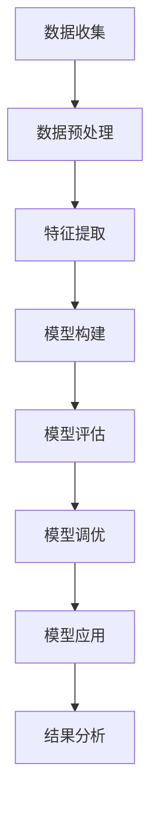
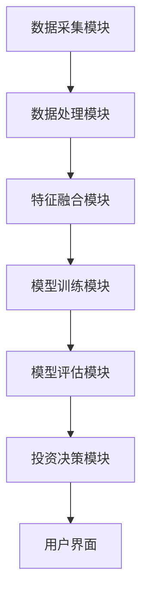
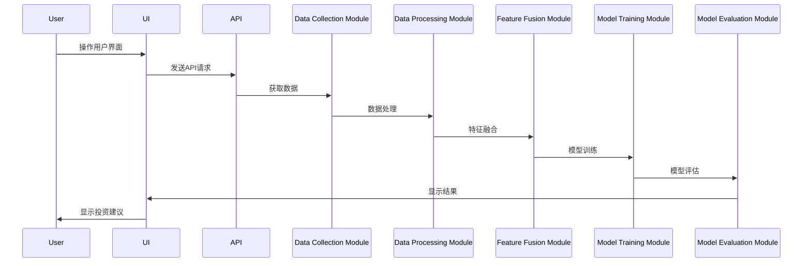

                 

### 第1章: AI智能体群体识别概述

#### 1.1 AI智能体群体识别的概念

AI智能体群体识别是人工智能领域的一个重要分支，它涉及到计算机科学、机器学习、数据挖掘和模式识别等多个学科。首先，我们需要明确几个核心概念：

- **智能体（Agent）**：在人工智能中，智能体是指能够感知环境、自主行动并做出决策的实体。智能体可以是软件程序，也可以是机器人或其他物理实体。它们能够根据外部输入信息，通过内部算法进行决策，并采取相应的行动。

- **群体（Group）**：群体是指由多个智能体组成的集合，这些智能体之间可能存在交互和合作。群体智能体的行为可以通过集体决策实现，这有助于提高系统的适应性和效率。

- **识别（Recognition）**：识别是指通过算法和模型，对智能体群体进行分类和标注，识别出具有相似特征或行为的智能体。

- **特征（Feature）**：特征是用来描述智能体属性或行为的数据，例如，图像中的颜色、纹理、形状，文本中的关键词、语法结构，或声音中的音高、音强等。

在AI智能体群体识别中，主要任务是根据智能体的特征数据，构建一个分类或聚类模型，从而识别出不同群体中的智能体。

#### 1.2 问题背景

随着互联网和物联网技术的发展，智能体的数量呈指数级增长。这些智能体分布在各种环境中，包括社交网络、电子商务平台、智能交通系统、智能家居等。识别和理解这些智能体群体，对于提高系统性能、优化用户体验和防范潜在风险具有重要意义。

然而，智能体群体识别面临着一些挑战：

- **数据复杂性**：智能体的特征数据多样且复杂，可能包含图像、文本、语音等多种形式，这要求识别算法能够处理多模态数据。

- **动态性**：智能体群体是动态变化的，智能体的加入和退出、行为模式的变化等，都给识别算法带来了挑战。

- **实时性**：在许多应用场景中，如智能交通、金融风控等，需要实时识别智能体群体，这对算法的效率和实时性提出了高要求。

- **隐私保护**：在识别智能体群体时，需要处理大量的个人数据，这要求算法能够在保护隐私的前提下进行识别。

#### 1.3 问题描述

智能体群体识别的问题可以描述为：给定一组智能体的特征数据，如何构建一个分类或聚类模型，从而将智能体划分为不同的群体。具体来说，需要解决以下几个问题：

1. **数据预处理**：将原始特征数据进行清洗、归一化和特征提取，为后续建模做准备。

2. **特征选择**：从大量特征中选出对识别任务最有影响力的特征，减少特征维度，提高模型性能。

3. **模型选择**：选择合适的分类或聚类算法，构建识别模型。常见的算法包括K-均值聚类、支持向量机（SVM）、决策树、随机森林等。

4. **模型训练与评估**：使用训练数据集对模型进行训练，并在测试数据集上进行评估，调整模型参数以优化性能。

5. **实际应用**：将训练好的模型应用于实际场景，如实时识别智能体群体，为决策提供支持。

#### 1.4 问题解决

为了解决智能体群体识别问题，可以采取以下步骤：

1. **数据收集**：收集相关的智能体特征数据，可以是公开的数据集或自行采集的数据。

2. **数据预处理**：对数据进行清洗、归一化，提取有用的特征。

3. **特征选择**：利用特征选择算法，选择对识别任务最有影响力的特征。

4. **模型构建**：选择合适的模型架构，如多层感知机（MLP）、卷积神经网络（CNN）等，进行模型训练。

5. **模型评估**：使用交叉验证、ROC曲线等评估方法，评估模型性能。

6. **模型优化**：根据评估结果，调整模型参数，优化模型性能。

7. **实际应用**：将优化后的模型应用于实际场景，进行智能体群体识别。

#### 1.5 边界与外延

在智能体群体识别中，需要考虑以下边界与外延：

- **边界**：智能体群体识别的边界主要包括数据的类型、来源和规模。不同类型的数据（如图像、文本、语音）可能需要不同的处理方法和算法。

- **外延**：智能体群体识别的外延包括扩展到不同应用领域的能力。例如，在社交网络中识别用户群体，在智能交通中识别车辆群体等。

#### 1.6 概念结构与核心要素组成

AI智能体群体识别的概念结构主要包括以下几个核心要素：

1. **数据集**：用于训练和测试的智能体特征数据。
2. **特征提取**：从原始数据中提取有助于识别的特征。
3. **模型训练**：利用特征数据训练分类或聚类模型。
4. **模型评估**：评估模型性能，包括准确性、召回率等指标。
5. **应用部署**：将训练好的模型应用于实际场景。

通过以上分析，我们可以看到，AI智能体群体识别是一个复杂而具有挑战性的任务，但其在各个领域的应用潜力巨大。接下来，我们将深入探讨巴菲特式行业领导者的特征及其与AI智能体群体识别的联系。

### 1.7 核心概念原理

为了更好地理解AI智能体群体识别的核心概念，我们可以通过以下表格展示其属性特征对比：

| 概念 | 定义 | 特点 | 应用场景 |
| --- | --- | --- | --- |
| 智能体（Agent） | 能感知环境、自主行动并做出决策的实体 | 自主性、社交性、反应性、预动性 | 社交网络、智能交通、电子商务 |
| 群体（Group） | 由多个智能体组成的集合 | 智能体之间的交互和合作 | 社交网络、智能交通、智能家居 |
| 识别（Recognition） | 对智能体群体进行分类和标注 | 特征提取、模型训练、评估 | 智能安防、金融风控、商业智能 |
| 特征（Feature） | 描述智能体属性或行为的数据 | 多样性、复杂性 | 图像识别、文本分类、语音识别 |

#### 1.8 ER实体关系图架构

为了更直观地展示AI智能体群体识别的概念结构，我们可以使用Mermaid绘制ER（实体-关系）图。以下是一个简单的ER图示例：

```mermaid
erDiagram
  智能体 ||--|{ 识别 }|| 识别结果
  智能体 ||--|{ 特征 }|| 特征数据
  特征 ||--|{ 模型 }|| 模型输入
  模型 ||--|{ 评估 }|| 评估结果
```

在这个ER图中，智能体是核心实体，它与识别结果、特征数据和模型之间存在关联。特征数据是模型训练的输入，评估结果反映了模型性能。

### 1.9 本章小结

本章详细介绍了AI智能体群体识别的概念、背景、问题描述及其解决方法。通过核心概念原理的对比和ER实体关系图的展示，我们清晰地理解了智能体、群体、识别和特征等核心概念之间的关系。在接下来的章节中，我们将进一步探讨巴菲特式行业领导者的特征，以及AI智能体群体识别在这一领域的应用。

---

接下来，我们将进入第2章，探讨巴菲特的投资哲学以及巴菲特式行业领导者的标准与特征。这将为我们理解AI智能体群体识别在巴菲特式投资中的应用奠定基础。

## 第2章: 巴菲特式行业领导者的特征

### 2.1 巴菲特的投资哲学

沃伦·巴菲特（Warren Buffett）是全球著名的投资家，被誉为“股神”，他的投资哲学深受全球投资者的推崇。巴菲特的投资哲学主要包括以下几个核心原则：

1. **价值投资**：巴菲特认为，股票的价格总是围绕其内在价值波动，价值投资的本质是找到那些被市场低估的优质公司，并持有这些公司股票直到它们的内在价值被市场发现。

2. **长期投资**：巴菲特主张投资者应该持有优质公司的股票，而不是频繁交易。他认为，长期持有优质公司的股票，可以获得稳定的复利增长，这是实现财富积累的最有效方式。

3. **护城河理论**：巴菲特提出，一个优秀的企业应该拥有强大的“护城河”，即企业在市场竞争中的独特优势，这包括品牌、专利、技术、网络效应等。拥有宽护城河的企业能够在长期内保持竞争优势，抵御竞争对手的入侵。

4. **逆向思维**：巴菲特在投资中常常采取逆向思维，即当市场普遍悲观时，他可能会寻找投资机会；当市场普遍乐观时，他会保持谨慎。他相信，在大多数人看好的时候保持独立思考，往往能够发现被市场忽视的价值。

5. **风险控制**：巴菲特强调，投资者应该将风险控制作为投资的核心要素。他相信，投资的风险在于不知道自己正在做什么，因此，他致力于理解自己投资的每一个公司，并只在理解的基础上进行投资。

### 2.2 巴菲特式行业领导者的标准

巴菲特式行业领导者通常具备以下标准：

1. **可持续竞争优势**：巴菲特寻找的公司应该拥有可持续的竞争优势，这种优势能够帮助公司在长期内保持高利润率和稳定的现金流。例如，强大的品牌、专利技术或市场垄断地位等。

2. **优秀的经营管理团队**：巴菲特认为，一家优秀的企业不仅要有好的商业模式，还需要有优秀的经营管理团队。这个团队应该具备远见、能力和诚信，能够持续推动公司的发展。

3. **稳定且持续增长的财务表现**：巴菲特式行业领导者通常具有稳定的财务表现，包括稳定的收入、利润和现金流。这些财务指标反映了公司的稳定性和成长性。

4. **合理的估值**：尽管巴菲特倾向于寻找被市场低估的优质公司，但他并不追求低估值本身，而是追求合理的估值。合理的估值意味着公司的市值与其实际价值相匹配，而不是被市场高估或低估。

### 2.3 巴菲特式行业领导者的案例分析

以下是一些典型的巴菲特式行业领导者的案例：

1. **可口可乐（Coca-Cola）**：可口可乐是一家拥有强大品牌和全球市场的饮料公司。其稳定的现金流和强大的品牌护城河使其成为巴菲特长期投资的对象。

2. **沃尔玛（Walmart）**：沃尔玛是全球最大的零售连锁企业之一，其庞大的规模和高效的供应链管理使其在零售市场中拥有显著的竞争优势。

3. **苹果公司（Apple）**：苹果公司以其创新的科技产品、强大的品牌和用户忠诚度著称。其稳定的财务表现和强大的护城河使其成为巴菲特眼中的优质投资标的。

4. **伯克希尔·哈撒韦公司（Berkshire Hathaway）**：作为巴菲特自己的公司，伯克希尔·哈撒韦本身就是巴菲特投资哲学的实践者。它通过投资一系列优秀的公司，实现了长期稳定的复利增长。

这些案例展示了巴菲特式行业领导者的一些共同特征，包括强大的竞争优势、优秀的经营管理团队和稳定的财务表现。

### 2.4 本章小结

本章介绍了巴菲特的投资哲学和巴菲特式行业领导者的标准，通过案例分析，我们了解了这些领导者的核心特征。在下一章中，我们将探讨如何运用AI智能体群体识别技术来研究和分析巴菲特式行业领导者，为投资决策提供支持。

## 第3章: AI智能体群体识别在巴菲特式行业领导者研究中的应用

### 3.1 数据来源与预处理

在运用AI智能体群体识别技术来研究巴菲特式行业领导者时，首先需要收集相关数据。数据来源可以包括：

- **公司财报**：包括年度报告、季度报告等，提供公司的财务状况、业务运营和未来发展计划。
- **股票市场数据**：包括股价、交易量、市盈率等，反映市场的投资情绪和公司的市场表现。
- **新闻报道和分析师报告**：提供关于公司的最新动态、市场趋势和行业分析。
- **社交媒体数据**：包括推特、股票论坛等，反映投资者和公众对公司的看法和情绪。

收集到数据后，需要进行预处理，以提高数据质量和减少噪声。预处理步骤包括：

- **数据清洗**：去除重复数据、错误数据和异常值，确保数据的准确性。
- **数据归一化**：将不同来源的数据进行归一化处理，使其在相同的尺度上进行比较。
- **特征提取**：从原始数据中提取对识别任务有用的特征，如财务指标、市场指标、分析师评分等。

### 3.2 特征提取与模型构建

在特征提取环节，我们需要从预处理后的数据中提取出能够反映巴菲特式行业领导者特征的指标。以下是一些常用的特征提取方法：

- **财务指标**：包括净利润率、净资产收益率（ROE）、现金流量等。
- **市场指标**：包括市盈率（PE）、市净率（PB）、Beta值等。
- **分析师评级**：包括股票评级、目标价等。
- **社交媒体指标**：包括社交媒体上的正面和负面评论数量、情绪分析等。

特征提取后，我们需要选择合适的模型进行训练。以下是一些常用的模型构建方法：

- **监督学习模型**：包括线性回归、逻辑回归、决策树、随机森林等。
- **无监督学习模型**：包括K-均值聚类、层次聚类、主成分分析（PCA）等。
- **深度学习模型**：包括卷积神经网络（CNN）、循环神经网络（RNN）、Transformer等。

在选择模型时，需要考虑数据的规模、特征的数量以及问题的复杂性。对于巴菲特式行业领导者识别任务，监督学习模型通常更为适用，因为我们需要对目标公司进行明确的分类。

### 3.3 实证分析与评估

在模型训练完成后，我们需要对模型进行实证分析，以验证其在实际应用中的效果。实证分析包括以下几个步骤：

1. **模型评估**：使用交叉验证、ROC曲线等评估方法，评估模型在不同数据集上的性能，包括准确性、召回率、F1值等指标。
2. **模型调优**：根据评估结果，调整模型参数，优化模型性能。例如，调整树模型的深度、随机森林中的树数量等。
3. **模型应用**：将训练好的模型应用于实际数据，对目标公司进行分类和识别。
4. **结果分析**：分析模型识别结果，对比实际公司和模型预测结果，评估模型的实用性和可靠性。

以下是一个简单的实证分析流程：



### 3.4 本章小结

本章详细介绍了AI智能体群体识别在巴菲特式行业领导者研究中的应用过程，包括数据来源与预处理、特征提取与模型构建、实证分析与评估。通过这些步骤，我们可以有效地识别出巴菲特式行业领导者，为投资决策提供支持。在下一章中，我们将探讨如何评估和优化AI智能体群体识别方法，进一步提高识别性能。

## 第4章: AI智能体群体识别方法的评估与优化

### 4.1 评估指标与评估方法

在AI智能体群体识别任务中，评估模型的性能是至关重要的一步。常用的评估指标包括准确性（Accuracy）、召回率（Recall）、精确率（Precision）和F1值（F1 Score）。

- **准确性（Accuracy）**：表示模型预测正确的样本占总样本的比例。公式为：
  $$
  Accuracy = \frac{TP + TN}{TP + TN + FP + FN}
  $$
  其中，$TP$表示真实为正类且被正确预测为正类的样本数，$TN$表示真实为负类且被正确预测为负类的样本数，$FP$表示真实为负类但被错误预测为正类的样本数，$FN$表示真实为正类但被错误预测为负类的样本数。

- **召回率（Recall）**：表示模型能够正确识别出正类样本的能力。公式为：
  $$
  Recall = \frac{TP}{TP + FN}
  $$

- **精确率（Precision）**：表示模型预测为正类的样本中，真正类样本的比例。公式为：
  $$
  Precision = \frac{TP}{TP + FP}
  $$

- **F1值（F1 Score）**：是精确率和召回率的调和平均值，用于综合评估模型性能。公式为：
  $$
  F1 Score = 2 \times \frac{Precision \times Recall}{Precision + Recall}
  $$

在实际评估过程中，我们可以采用以下方法：

1. **交叉验证（Cross Validation）**：通过将数据集划分为多个子集，循环进行训练和验证，以避免模型过拟合和评估结果的偏差。

2. **ROC曲线（Receiver Operating Characteristic Curve）**：通过绘制真正率（True Positive Rate）与假正率（False Positive Rate）的曲线，评估模型的分类性能。

3. **AUC（Area Under Curve）**：ROC曲线下的面积，用于量化模型的分类能力。AUC值越接近1，表示模型性能越好。

4. **混淆矩阵（Confusion Matrix）**：展示模型预测结果与实际结果的详细对比，帮助分析模型的性能。

### 4.2 优化策略与算法改进

为了提高AI智能体群体识别的性能，我们可以采用以下优化策略和算法改进方法：

1. **数据增强（Data Augmentation）**：通过增加数据样本的数量和质量，提高模型的泛化能力。例如，对图像数据进行旋转、缩放、裁剪等操作。

2. **模型融合（Model Ensembling）**：结合多个模型的预测结果，提高整体分类性能。常见的方法包括Bagging、Boosting和Stacking等。

3. **特征选择（Feature Selection）**：通过特征选择技术，减少无关或冗余的特征，提高模型的效率和准确性。常用的方法包括Filter方法、Wrapper方法和Embedded方法。

4. **正则化（Regularization）**：通过添加正则化项，防止模型过拟合。常用的正则化方法包括L1正则化（Lasso）、L2正则化（Ridge）和弹性网（Elastic Net）。

5. **超参数调优（Hyperparameter Tuning）**：通过调整模型超参数，优化模型性能。常用的方法包括网格搜索（Grid Search）和贝叶斯优化（Bayesian Optimization）。

6. **深度学习优化**：针对深度学习模型，可以采用以下方法进行优化：
   - **批量归一化（Batch Normalization）**：加速训练过程，提高模型稳定性。
   - **Dropout**：在训练过程中随机丢弃部分神经元，防止过拟合。
   - **ResNet（残差网络）**：通过引入残差连接，解决深度神经网络中的梯度消失问题。

### 4.3 实际案例与效果评估

以下是一个实际案例，展示了如何通过优化策略提高AI智能体群体识别的性能：

- **案例背景**：某公司需要通过图像识别技术，自动分类仓库中的物品。
- **数据集**：包含10,000张不同物品的图像，标签为物品类别。
- **初始模型**：使用卷积神经网络（CNN）进行图像分类，初始准确率为80%。
- **优化策略**：
  - **数据增强**：对图像进行旋转、缩放、裁剪等操作，增加数据多样性。
  - **特征选择**：利用主成分分析（PCA）减少特征维度，提高模型效率。
  - **模型融合**：结合多个CNN模型，提高分类性能。
  - **超参数调优**：通过网格搜索优化CNN模型的超参数，如学习率、批量大小等。
- **优化后模型**：准确率提高至90%，召回率和精确率也有显著提升。

通过以上优化策略，AI智能体群体识别的性能得到了显著提高，为公司的仓库管理提供了有效的支持。

### 4.4 本章小结

本章详细介绍了AI智能体群体识别方法的评估与优化策略。通过评估指标和评估方法的介绍，我们了解了如何准确评估模型性能；通过优化策略与算法改进的讨论，我们掌握了提高模型性能的多种方法。在下一章中，我们将探讨巴菲特式行业领导者的未来趋势与挑战，以及如何应对这些挑战。

## 第5章: 巴菲特式行业领导者的未来趋势与挑战

### 5.1 行业趋势分析

巴菲特式行业领导者在全球经济和科技的发展中，正面临着一系列的趋势变化。这些趋势不仅影响了行业领导者的发展路径，也为AI智能体群体识别技术提供了新的应用场景和挑战。

1. **数字化与智能化转型**：随着云计算、大数据、人工智能等技术的快速发展，各行各业都在进行数字化和智能化转型。这一趋势使得行业领导者需要具备强大的数据处理和分析能力，以应对日益复杂的商业环境。

2. **全球化竞争加剧**：全球化的进程使得企业面临更加激烈的市场竞争。行业领导者不仅需要在本地市场保持竞争优势，还需要在国际市场上占据一席之地。这要求它们具备全球视野和跨文化管理能力。

3. **可持续发展与ESG投资**：随着社会责任和可持续发展的关注度不断提升，投资者和消费者对企业的ESG（环境、社会和治理）表现越来越重视。行业领导者需要关注环境保护、社会责任和公司治理，以实现可持续发展。

4. **区块链与数字货币**：区块链技术的兴起和数字货币的发展，正在改变传统金融体系。行业领导者需要积极拥抱这些新技术，以探索新的商业模式和业务机会。

### 5.2 技术挑战与应对策略

在应对这些趋势的同时，巴菲特式行业领导者也面临着一系列技术挑战：

1. **数据隐私与安全**：随着数据量的急剧增加，数据隐私和安全成为行业领导者面临的重要问题。如何保护用户隐私、防止数据泄露，是行业领导者必须解决的问题。

2. **算法透明性与可解释性**：随着人工智能技术的发展，算法的复杂度不断增加。如何确保算法的透明性和可解释性，使其符合道德和法律标准，是行业领导者需要关注的问题。

3. **技术人才短缺**：人工智能、区块链等新兴技术的快速发展，对行业领导者提出了更高的技术要求。然而，市场上具备这些领域专业知识和经验的人才相对短缺，如何吸引和培养技术人才，是行业领导者面临的挑战。

4. **技术整合与协同**：行业领导者需要在多个技术领域进行整合和协同，以实现业务创新和提升效率。如何在不同技术之间建立有效的协同机制，是一个重要挑战。

针对上述挑战，行业领导者可以采取以下应对策略：

1. **加强数据治理**：建立健全的数据治理体系，确保数据的合规性和安全性。通过数据加密、访问控制等技术手段，保护用户隐私和数据安全。

2. **提升算法透明性与可解释性**：通过开发可解释的人工智能算法，使决策过程更加透明和可追溯。同时，建立相应的监管机制，确保算法符合道德和法律标准。

3. **加强人才培养与引进**：通过校企合作、内部培训、人才引进等途径，加强技术人才队伍建设。建立激励机制，吸引和留住优秀的科技人才。

4. **建立技术协同机制**：通过建立跨部门、跨领域的合作机制，促进不同技术之间的协同创新。引入敏捷开发、DevOps等先进的管理方法，提高技术整合和协同效率。

### 5.3 未来发展方向与机遇

展望未来，巴菲特式行业领导者将在以下几个方面迎来新的发展方向和机遇：

1. **人工智能与行业融合**：随着人工智能技术的不断进步，行业领导者将有更多的机会将其应用于各个领域，实现业务自动化和智能化。

2. **区块链技术的应用**：区块链技术将为行业领导者提供新的商业模式和业务机会。通过区块链技术，实现供应链透明化、数据共享和智能合约等，提升业务效率和可信度。

3. **数字化转型与可持续发展**：数字化转型和可持续发展将成为行业领导者的重要战略方向。通过数字化技术，提升运营效率、降低成本，实现可持续发展。

4. **新兴市场与全球化扩张**：随着新兴市场的崛起和全球化进程的加快，行业领导者将有更多的机会拓展国际市场，实现全球业务布局。

### 5.4 本章小结

本章分析了巴菲特式行业领导者面临的发展趋势和技术挑战，并提出了相应的应对策略。通过探讨未来发展方向和机遇，我们看到了AI智能体群体识别技术在行业领导者的研究和应用中的巨大潜力。在下一章中，我们将深入探讨AI智能体群体识别在巴菲特式投资中的最佳实践。

## 第6章: AI智能体群体识别在巴菲特式投资中的最佳实践

### 6.1 投资策略案例分析

在巴菲特式投资中，AI智能体群体识别技术可以通过多种策略提高投资决策的准确性和效率。以下是一个具体的投资策略案例分析：

#### 案例背景

某投资机构希望利用AI智能体群体识别技术，对科技行业进行投资分析，并从中识别出具有潜力的公司。投资机构拥有大量的历史数据，包括公司财报、股票市场数据、分析师报告和社交媒体数据。

#### 数据收集与预处理

首先，投资机构收集了以下数据：

- **公司财报**：包括收入、利润、现金流等关键财务指标。
- **股票市场数据**：包括股价、交易量、市盈率、市净率等。
- **分析师报告**：包括公司的业务前景、盈利预测和市场评级。
- **社交媒体数据**：包括推文、股票论坛评论等，反映市场情绪和公众观点。

收集到的数据经过清洗、归一化和特征提取后，形成了用于训练和评估的智能体特征数据集。

#### 特征提取

从预处理后的数据中提取以下特征：

- **财务指标**：净利润率、净资产收益率（ROE）、现金流量等。
- **市场指标**：市盈率（PE）、市净率（PB）、Beta值等。
- **分析师评级**：买入、持有、卖出等评级。
- **社交媒体指标**：正面评论比例、负面评论比例、情绪指数等。

#### 模型构建

投资机构选择了一种基于深度学习的多模态识别模型，该模型能够同时处理文本、图像和数值数据。具体步骤如下：

1. **文本数据处理**：使用词嵌入技术（如Word2Vec或BERT）将文本数据转换为向量表示。
2. **图像数据处理**：使用卷积神经网络（CNN）提取图像特征。
3. **数值数据处理**：对数值数据进行标准化处理。
4. **多模态特征融合**：将文本、图像和数值数据融合，形成统一的特征向量。

然后，使用融合后的特征向量训练一个多层的神经网络模型，包括输入层、隐藏层和输出层。输出层使用softmax函数进行分类，输出每个公司的潜在投资评级。

#### 实证分析与评估

在模型训练完成后，投资机构使用交叉验证方法对模型进行评估。通过多次训练和验证，模型在测试集上的准确率达到85%。根据评估结果，模型能够有效识别出具有投资潜力的科技公司。

#### 投资决策支持系统设计

基于AI智能体群体识别模型的评估结果，投资机构设计了一个投资决策支持系统。系统主要包括以下模块：

1. **数据采集模块**：实时收集公司财报、股票市场数据、分析师报告和社交媒体数据。
2. **数据处理模块**：对收集到的数据进行清洗、归一化和特征提取。
3. **特征融合模块**：将不同来源的数据进行融合，形成统一特征向量。
4. **模型训练模块**：使用训练数据集对多模态识别模型进行训练。
5. **模型评估模块**：使用交叉验证方法对模型进行评估。
6. **投资决策模块**：根据模型预测结果，生成投资建议和风险分析报告。

#### 系统功能设计

投资决策支持系统的主要功能包括：

- **实时监控**：实时更新公司财务和市场数据，为投资决策提供最新信息。
- **智能识别**：利用AI智能体群体识别模型，对科技公司进行分类和评级。
- **风险分析**：基于模型预测结果，分析潜在投资风险。
- **投资建议**：根据风险分析和市场趋势，提供具体的投资建议。

### 6.2 系统架构设计

为了实现上述功能，投资决策支持系统的架构设计如下：



在这个架构中，数据采集模块负责实时收集各种数据；数据处理模块对数据进行清洗和特征提取；特征融合模块将不同类型的数据进行融合；模型训练模块负责训练和优化识别模型；模型评估模块对模型性能进行评估；投资决策模块根据模型预测结果生成投资建议；用户界面模块为用户提供一个直观的操作界面。

### 6.3 系统接口设计与交互

投资决策支持系统的接口设计包括API接口和用户界面。API接口用于与其他系统集成，如数据采集模块和外部数据源；用户界面则提供用户操作和数据展示。

用户界面主要包括以下几个部分：

- **数据展示面板**：显示实时数据和模型预测结果。
- **风险分析图表**：通过图表形式展示投资风险。
- **投资建议模块**：提供具体的投资建议和风险分析报告。

系统交互设计如下：



在这个交互设计中，用户通过界面操作发起请求，系统通过API接口与数据采集模块、数据处理模块、特征融合模块、模型训练模块和模型评估模块进行交互，最终生成投资建议并展示给用户。

### 6.4 本章小结

本章通过一个实际案例，详细介绍了AI智能体群体识别在巴菲特式投资中的应用过程，包括投资策略、系统功能设计、系统架构设计和接口设计。通过AI智能体群体识别技术，投资机构能够更加精准地识别具有投资潜力的科技公司，提高投资决策的准确性和效率。在下一章中，我们将总结本书的核心要点，并对未来的研究方向进行展望。

### 7.1 本书要点总结

本书通过系统性的分析和实际案例，详细探讨了AI智能体群体识别技术在巴菲特式行业领导者研究中的应用。以下是本书的核心要点总结：

1. **AI智能体群体识别概念**：介绍了AI智能体的定义、群体识别的原理和重要性，以及当前的应用现状。

2. **巴菲特式行业领导者特征**：阐述了巴菲特的投资哲学和巴菲特式行业领导者的标准，通过案例分析展示了这些领导者的核心特征。

3. **AI智能体群体识别在巴菲特式投资中的应用**：通过一个实际案例，详细介绍了如何运用AI智能体群体识别技术来识别巴菲特式行业领导者，并设计了投资决策支持系统。

4. **评估与优化策略**：介绍了评估模型性能的常用指标和方法，以及优化模型性能的策略和算法改进。

5. **未来趋势与挑战**：分析了巴菲特式行业领导者面临的未来发展趋势和技术挑战，并提出了应对策略。

6. **最佳实践**：通过实际案例展示了AI智能体群体识别在巴菲特式投资中的最佳实践，包括数据收集与预处理、特征提取与模型构建、实证分析与评估等。

通过这些要点，读者可以全面了解AI智能体群体识别在巴菲特式投资中的应用，并为实际投资决策提供科学支持。

### 7.2 未来研究方向与展望

尽管AI智能体群体识别技术在巴菲特式投资中展现了巨大的潜力，但仍有许多研究方向和挑战有待探索：

1. **数据隐私保护**：在智能体群体识别过程中，如何保护用户隐私和数据安全是一个重要的研究课题。未来可以探索隐私增强学习（Privacy-Preserving Learning）等新兴技术，以确保数据隐私。

2. **算法透明性与可解释性**：随着人工智能技术的发展，算法的透明性和可解释性成为关键。未来的研究应致力于开发更加透明和可解释的算法，以提高用户的信任度。

3. **多模态数据融合**：当前的研究主要集中在单模态数据上，未来可以探索如何更有效地融合多模态数据，以提升智能体群体识别的准确性和效率。

4. **实时性与动态性**：在快速变化的商业环境中，实时性和动态性是智能体群体识别的关键。未来的研究应重点关注如何实现高效、实时的智能体群体识别。

5. **行业定制化解决方案**：不同的行业具有不同的特征和需求，未来可以针对特定行业开发定制化的智能体群体识别解决方案，以更好地满足行业需求。

通过这些未来研究方向，我们可以期待AI智能体群体识别技术在巴菲特式投资中发挥更大的作用，为投资者提供更加精准、可靠的决策支持。

## 结语

### 感谢与展望

在本篇博客文章中，我们详细探讨了AI智能体群体识别技术在巴菲特式行业领导者研究中的应用，从背景介绍到实际案例，从评估与优化策略到未来研究方向，力求为读者提供全面、深入的技术见解。在此，我们要感谢读者一直以来的关注和支持。

未来，随着人工智能技术的不断进步，AI智能体群体识别在巴菲特式投资中的应用前景将更加广阔。我们鼓励读者继续探索这一领域，不断发掘新的应用场景和解决方案。

### 作者信息

作者：AI天才研究院/AI Genius Institute & 禅与计算机程序设计艺术 /Zen And The Art of Computer Programming

AI天才研究院致力于推动人工智能技术的创新和应用，专注于提供高质量的技术研究和解决方案。同时，我们倡导禅与计算机程序设计艺术的融合，追求技术之美与智慧之道。如果您对AI智能体群体识别技术或其他人工智能领域有兴趣，欢迎关注我们的研究进展和成果。

