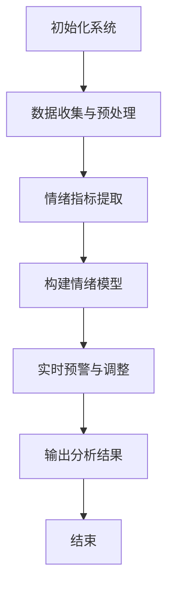

                 


### 文章标题

《运用多智能体系统实现格雷厄姆式的市场情绪分析》

#### 关键词

多智能体系统、市场情绪分析、格雷厄姆、算法原理、数学模型、系统架构设计、项目实战

#### 摘要

本文旨在探讨如何运用多智能体系统实现格雷厄姆式的市场情绪分析。首先，我们将介绍多智能体系统与市场情绪分析的核心概念，并阐述两者之间的联系。随后，我们将详细讲解算法原理，包括算法流程、Python源代码和数学模型。此外，还将分析系统架构设计，并提供项目实战的具体步骤和案例分析。最后，我们将总结最佳实践、注意事项和拓展阅读，为读者提供更深入的理解和实践指导。

### 目录大纲设计思路

为了确保文章结构清晰、逻辑连贯，我们设计了一个详细的目录大纲。以下为目录大纲的设计步骤和内容安排：

#### 第1章：背景介绍
- **1.1 问题背景**
  - **核心概念术语说明**：介绍多智能体系统、市场情绪分析和格雷厄姆的相关术语。
  - **问题背景**：解释市场情绪分析的重要性以及多智能体系统的优势。
  - **问题描述**：阐述市场情绪分析中面临的问题和挑战。
  - **问题解决**：介绍多智能体系统如何解决市场情绪分析的问题。
  - **边界与外延**：讨论多智能体系统在市场情绪分析中的应用范围和局限性。
  - **概念结构与核心要素组成**：分析多智能体系统和市场情绪分析的基本概念和核心要素。

#### 第2章：核心概念与联系
- **2.1 多智能体系统**
  - **核心概念原理**：介绍多智能体系统的基本原理和关键组成部分。
  - **概念属性特征对比表格**：列出多智能体系统与其他相关技术的属性特征对比。
  - **ER实体关系图架构**：使用Mermaid流程图展示多智能体系统的实体关系。

- **2.2 市场情绪分析**
  - **核心概念原理**：阐述市场情绪分析的基本概念、目的和方法。
  - **概念属性特征对比表格**：比较市场情绪分析与其他分析方法的优缺点。
  - **ER实体关系图架构**：使用Mermaid流程图展示市场情绪分析中的实体关系。

- **2.3 多智能体系统与市场情绪分析的联系**
  - **联系**：分析多智能体系统与市场情绪分析之间的相互作用和优势。
  - **案例研究**：通过实际案例展示多智能体系统在市场情绪分析中的应用。

#### 第3章：算法原理讲解
- **3.1 多智能体系统在市场情绪分析中的应用**
  - **算法mermaid流程图**：使用Mermaid流程图展示算法的基本流程。
  - **Python源代码详细阐述**：详细解释Python源代码中的每个部分及其作用。
  - **数学模型与公式**：介绍用于市场情绪分析的多智能体系统的数学模型和公式。
  - **举例说明**：通过具体示例展示算法的实际应用效果。

#### 第4章：数学模型和公式
- **4.1 数学模型的基本概念**
  - **基本概念**：阐述数学模型在市场情绪分析中的作用和重要性。
  - **数学公式详细讲解**：详细解释各个数学公式及其含义。
  - **举例说明**：通过实际案例展示数学模型的应用和效果。

#### 第5章：系统分析与架构设计
- **5.1 问题场景介绍**
  - **问题场景**：描述市场情绪分析的应用场景和需求。

- **5.2 系统功能设计（领域模型mermaid类图）**
  - **领域模型mermaid类图**：使用Mermaid类图展示系统的功能模块和关系。

- **5.3 系统架构设计（mermaid架构图）**
  - **mermaid架构图**：使用Mermaid架构图展示系统的整体架构。

- **5.4 系统接口设计和系统交互（mermaid序列图）**
  - **系统接口设计**：介绍系统的接口设计和数据交换方式。
  - **系统交互mermaid序列图**：使用Mermaid序列图展示系统各个组件的交互过程。

#### 第6章：项目实战
- **6.1 环境安装**
  - **环境安装**：详细描述项目实战所需的环境和软件安装步骤。

- **6.2 系统核心实现源代码**
  - **系统核心实现源代码**：提供项目实战的核心代码实现，并进行解读。

- **6.3 代码应用解读与分析**
  - **代码应用解读与分析**：分析代码的应用场景和实际效果。

- **6.4 实际案例分析与详细讲解剖析**
  - **实际案例分析与详细讲解剖析**：通过实际案例展示项目实战的效果和优势。

- **6.5 项目小结**
  - **项目小结**：总结项目实战的经验和收获。

#### 第7章：最佳实践、小结与拓展阅读
- **7.1 最佳实践**
  - **最佳实践**：总结项目实战中的最佳实践和经验。

- **7.2 小结**
  - **小结**：总结文章的主要内容和核心观点。

- **7.3 注意事项**
  - **注意事项**：提醒读者在应用多智能体系统实现市场情绪分析时需要注意的问题。

- **7.4 拓展阅读**
  - **拓展阅读**：推荐相关的阅读资料，以供读者深入了解。

通过以上设计思路和目录大纲，我们将逐步展开文章的撰写，确保内容丰富、逻辑清晰，为读者提供有价值的技术见解和实践指导。接下来，我们将逐章撰写详细的内容。

----------------------------------------------------------------

### 第1章：背景介绍

#### 1.1 问题背景

随着金融市场的不断发展，市场情绪分析逐渐成为投资决策的重要依据。市场情绪分析旨在通过研究市场参与者的情绪和行为，预测市场走势和潜在风险。然而，传统的市场情绪分析方法通常依赖于单一的数据源和简单的统计分析，难以全面、准确地反映市场情绪的复杂变化。

近年来，多智能体系统（Multi-Agent System，MAS）作为一种分布式人工智能技术，逐渐引起了广泛关注。多智能体系统由多个自主智能体组成，每个智能体具有独立的行为和能力，可以通过交互和协作实现复杂任务。多智能体系统的优势在于其分布式、自组织和自适应的特点，能够更好地处理大规模、复杂和动态的环境。

结合多智能体系统的优势，我们提出运用多智能体系统实现格雷厄姆式的市场情绪分析。格雷厄姆（B. Graham）是一位著名的价值投资大师，他的投资理念强调深入研究公司的基本面，通过分析财务报表、业务模式和市场地位等信息，做出长期的投资决策。格雷厄姆的投资理念对于市场情绪分析具有指导意义，但传统方法在处理大规模数据和高频率交易时存在局限性。

#### 1.2 问题描述

在市场情绪分析中，我们面临以下问题：

1. **数据来源单一**：传统方法通常依赖历史价格数据、交易量等单一数据源，难以全面反映市场情绪。
2. **分析维度有限**：传统方法主要关注价格和交易量等少数指标，难以挖掘更深层次的情绪信息。
3. **时效性较差**：传统方法的分析结果往往滞后于市场变化，难以实现实时预警和调整。
4. **人工干预较多**：传统方法需要大量人工参与，效率较低且易受主观因素影响。

为了解决上述问题，我们需要一种能够处理大规模、高频率和多样化数据的分析模型，并且具备实时预警和自适应调整能力。多智能体系统作为一种分布式人工智能技术，具有以下优势：

1. **分布式计算**：多智能体系统可以在多个计算节点上并行处理数据，提高分析效率。
2. **自组织性**：多智能体系统中的智能体可以自主学习和适应环境变化，提高分析模型的实时性。
3. **自适应调整**：多智能体系统可以根据市场情绪的变化，动态调整分析策略，提高预测准确性。
4. **减少人工干预**：多智能体系统可以通过自动化分析，降低人工干预，提高分析模型的稳定性和可靠性。

#### 1.3 问题解决

结合多智能体系统的优势，我们提出以下解决方案：

1. **多源数据融合**：通过整合多源数据，如社交媒体、新闻报告、投资者情绪等，全面反映市场情绪。
2. **多维分析模型**：构建基于多智能体系统的多维分析模型，同时考虑价格、交易量、投资者情绪等多个维度，提高分析准确性。
3. **实时预警与自适应调整**：通过实时监测市场数据，利用多智能体系统的自组织和自适应能力，实现实时预警和策略调整。
4. **自动化分析**：利用多智能体系统的分布式计算能力，实现自动化分析，减少人工干预，提高分析模型的稳定性和可靠性。

#### 1.4 边界与外延

尽管多智能体系统在市场情绪分析中具有显著优势，但仍存在一些局限性和挑战：

1. **数据质量**：多智能体系统对数据质量要求较高，数据源的选择和处理对分析结果具有重要影响。
2. **计算资源**：多智能体系统需要大量的计算资源，特别是在处理大规模数据时，对硬件性能要求较高。
3. **模型稳定性**：多智能体系统中的智能体行为和决策可能受到噪声和异常数据的影响，需要通过模型优化和数据处理提高稳定性。
4. **跨学科融合**：多智能体系统与市场情绪分析涉及多个学科领域，如金融学、计算机科学和社会学等，需要跨学科合作和知识整合。

#### 1.5 概念结构与核心要素组成

为了更好地理解多智能体系统在市场情绪分析中的应用，我们将其概念结构与核心要素组成如下：

1. **多智能体系统**：由多个智能体组成，每个智能体具有独立的行为和能力，可以通过交互和协作实现复杂任务。
2. **市场情绪分析**：通过研究市场参与者的情绪和行为，预测市场走势和潜在风险。
3. **数据源**：包括历史价格数据、交易量、社交媒体、新闻报告、投资者情绪等多源数据。
4. **多维分析模型**：同时考虑价格、交易量、投资者情绪等多个维度，提高分析准确性。
5. **实时预警与自适应调整**：实时监测市场数据，利用多智能体系统的自组织和自适应能力，实现实时预警和策略调整。
6. **自动化分析**：利用多智能体系统的分布式计算能力，实现自动化分析，减少人工干预。

通过上述概念结构与核心要素组成的分析，我们可以更好地理解多智能体系统在市场情绪分析中的应用，并为后续章节的深入讨论打下基础。

----------------------------------------------------------------

### 第2章：核心概念与联系

#### 2.1 多智能体系统

多智能体系统（MAS）是一种基于分布式计算和人工智能技术的系统，它由多个自主智能体组成，这些智能体可以独立决策、协作完成任务。多智能体系统的核心概念包括智能体、环境、通信和交互等。

1. **智能体**：智能体是MAS的基本组成单位，具有自主性、反应性、主动性和社会性。自主性指智能体可以独立决策；反应性指智能体可以感知环境变化并做出相应反应；主动性指智能体可以主动寻求目标；社会性指智能体可以与其他智能体进行交互。

2. **环境**：环境是智能体执行任务的背景，包括其他智能体、物理设备、资源等。智能体通过与环境的交互获取信息，并根据环境变化调整自身行为。

3. **通信**：智能体之间的通信是实现协作的关键。通信可以是同步的，也可以是异步的，可以通过共享内存、消息传递等方式实现。

4. **交互**：交互是多智能体系统实现协同工作的基础，包括竞争、协作、协商和对抗等。

#### 2.2 市场情绪分析

市场情绪分析是一种通过研究市场参与者的情绪和行为，预测市场走势和潜在风险的方法。市场情绪分析的关键概念包括情绪指标、情绪模型和情绪分析算法等。

1. **情绪指标**：情绪指标是衡量市场情绪的重要工具，如交易量、价格波动、社交媒体情绪等。这些指标可以从历史数据、实时数据和外部数据源中提取。

2. **情绪模型**：情绪模型是用于分析市场情绪的数学模型，如线性回归模型、神经网络模型和时间序列模型等。情绪模型可以根据不同的市场数据来源和维度，构建出不同的情绪分析模型。

3. **情绪分析算法**：情绪分析算法是实现情绪模型的具体实现，如情绪分类算法、情绪聚类算法和情绪预测算法等。情绪分析算法可以通过对市场数据的处理，提取情绪特征，并进行情绪分析。

#### 2.3 多智能体系统与市场情绪分析的联系

多智能体系统与市场情绪分析之间存在密切的联系，两者相辅相成，共同推动市场情绪分析的发展。

1. **分布式计算能力**：多智能体系统具有分布式计算能力，可以在多个计算节点上并行处理大量市场数据，提高分析效率。市场情绪分析通常需要处理大规模、高频率的数据，多智能体系统的分布式计算能力可以显著提高数据分析的速度和准确性。

2. **实时预警与自适应调整**：多智能体系统的自组织和自适应能力可以实现市场情绪的实时预警和策略调整。通过实时监测市场数据，多智能体系统可以动态调整分析模型，提高市场情绪预测的准确性。

3. **多样化数据源**：多智能体系统可以整合多种数据源，如历史价格数据、交易量、社交媒体情绪等，为市场情绪分析提供更丰富的数据支持。多样化数据源有助于更全面、准确地反映市场情绪。

4. **自动化分析**：多智能体系统的自动化分析能力可以降低人工干预，提高市场情绪分析的稳定性和可靠性。自动化分析可以减少人工操作的风险，提高分析结果的客观性和一致性。

#### 2.4 概念属性特征对比表格

为了更好地理解多智能体系统和市场情绪分析的核心概念，我们可以将两者的属性特征进行对比，如下表所示：

| 特征       | 多智能体系统                        | 市场情绪分析                          |
| ---------- | ----------------------------------- | ------------------------------------ |
| 目标       | 实现分布式计算、协同工作、自组织性 | 预测市场走势、评估风险                |
| 独立单位   | 智能体                             | 市场数据（如价格、交易量、情绪指标）  |
| 自主性     | 智能体可以独立决策                  | 情绪指标可以根据市场数据自动调整      |
| 反应性     | 智能体可以感知环境变化并做出反应    | 可以根据市场情绪变化调整预测模型      |
| 主动性     | 智能体可以主动寻求目标              | 可以根据市场数据主动挖掘情绪信息      |
| 社会性     | 智能体可以与其他智能体进行交互      | 可以利用多种数据源整合情绪信息        |
| 实时性     | 可以实现实时预警和自适应调整        | 可以实现实时情绪分析和预测            |
| 分布式计算 | 可以在多个计算节点上并行处理数据    | 可以处理大规模、高频率的市场数据      |

#### 2.5 ER实体关系图架构

为了更好地展示多智能体系统和市场情绪分析之间的实体关系，我们可以使用Mermaid流程图绘制ER实体关系图。以下是一个简化的ER实体关系图：

```mermaid
erDiagram
  Customer ||--|{ Order }|--|{ Product }
  Customer ||--|{ Payment }|
  Product ||--|{ OrderItem }|
  Order ||--|{ OrderItem }
  Payment ||--|{ Order }
```

在这个ER实体关系图中，Customer（智能体）、Order（市场情绪分析任务）、Product（市场数据）、Payment（情绪指标）等实体之间存在明确的关联关系。智能体可以通过订单（Order）获取市场数据（Product），并根据情绪指标（Payment）调整自身行为。

通过上述核心概念与联系的介绍，我们可以更好地理解多智能体系统在市场情绪分析中的应用，并为后续章节的深入讨论打下基础。

----------------------------------------------------------------

### 第3章：算法原理讲解

#### 3.1 多智能体系统在市场情绪分析中的应用

多智能体系统（MAS）在市场情绪分析中具有显著优势，主要体现在以下几个方面：

1. **分布式计算能力**：多智能体系统可以在多个计算节点上并行处理大量市场数据，提高分析效率。市场情绪分析通常需要处理大规模、高频率的数据，多智能体系统的分布式计算能力可以显著提高数据分析的速度和准确性。

2. **实时预警与自适应调整**：多智能体系统的自组织和自适应能力可以实现市场情绪的实时预警和策略调整。通过实时监测市场数据，多智能体系统可以动态调整分析模型，提高市场情绪预测的准确性。

3. **多样化数据源**：多智能体系统可以整合多种数据源，如历史价格数据、交易量、社交媒体情绪等，为市场情绪分析提供更丰富的数据支持。多样化数据源有助于更全面、准确地反映市场情绪。

4. **自动化分析**：多智能体系统的自动化分析能力可以降低人工干预，提高市场情绪分析的稳定性和可靠性。自动化分析可以减少人工操作的风险，提高分析结果的客观性和一致性。

在市场情绪分析中，多智能体系统的主要应用场景包括：

1. **情绪指标提取**：多智能体系统可以实时提取多种情绪指标，如价格波动、交易量、社交媒体情绪等，为情绪分析提供基础数据。

2. **情绪模型构建**：多智能体系统可以利用历史市场数据和情绪指标，构建情绪模型，预测未来市场情绪。

3. **实时预警与调整**：多智能体系统可以根据实时监测到的市场数据，动态调整情绪预测模型，实现实时预警和策略调整。

4. **跨市场情绪分析**：多智能体系统可以整合不同市场的情绪数据，实现跨市场情绪分析，为投资者提供更全面的决策支持。

#### 3.2 算法mermaid流程图

为了更好地展示多智能体系统在市场情绪分析中的算法流程，我们可以使用Mermaid流程图进行描述。以下是一个简化的算法流程图：



在这个流程图中，系统初始化后，首先进行数据收集与预处理，包括历史市场数据和实时数据。然后，通过情绪指标提取模块，提取出多种情绪指标。接着，利用这些情绪指标构建情绪模型，预测未来市场情绪。最后，根据实时预警与调整模块，动态调整情绪预测模型，并输出分析结果。

#### 3.3 Python源代码详细阐述

为了更好地理解多智能体系统在市场情绪分析中的应用，我们可以通过Python源代码进行详细阐述。以下是一个简化的Python源代码示例：

```python
import numpy as np
import pandas as pd
from sklearn.ensemble import RandomForestRegressor
from sklearn.model_selection import train_test_split
from sklearn.metrics import mean_squared_error

# 数据收集与预处理
def collect_data():
    # 从历史市场数据中提取情绪指标
    # 示例：从CSV文件中读取数据
    data = pd.read_csv('market_data.csv')
    return data

# 情绪指标提取
def extract_emotion_indicators(data):
    # 提取情绪指标，如价格波动、交易量等
    # 示例：计算每日价格波动率
    data['price_volatility'] = data['close'].pct_change().abs()
    return data

# 构建情绪模型
def build_emotion_model(data):
    # 分割数据集，用于训练和测试
    X = data[['price_volatility', 'volume']]
    y = data['close']
    X_train, X_test, y_train, y_test = train_test_split(X, y, test_size=0.2, random_state=42)

    # 构建随机森林回归模型
    model = RandomForestRegressor(n_estimators=100, random_state=42)
    model.fit(X_train, y_train)

    # 测试模型性能
    y_pred = model.predict(X_test)
    mse = mean_squared_error(y_test, y_pred)
    print(f"Test MSE: {mse}")

    return model

# 实时预警与调整
def real_time预警与调整(model, current_data):
    # 利用当前数据更新情绪模型
    # 示例：重新训练模型
    X = current_data[['price_volatility', 'volume']]
    y = current_data['close']
    model.fit(X, y)

    # 输出实时预警
    # 示例：计算预测价格与实际价格的差异
    y_pred = model.predict(X)
    print(f"Prediction Error: {np.abs(y - y_pred).mean()}")

# 主函数
def main():
    # 初始化系统
    data = collect_data()

    # 数据预处理
    data = extract_emotion_indicators(data)

    # 构建情绪模型
    model = build_emotion_model(data)

    # 实时预警与调整
    current_data = pd.read_csv('current_market_data.csv')
    real_time预警与调整(model, current_data)

if __name__ == '__main__':
    main()
```

在这个Python源代码示例中，我们首先从历史市场数据中提取情绪指标，如价格波动和交易量。然后，利用这些情绪指标构建随机森林回归模型，用于预测未来市场情绪。接下来，我们通过实时数据更新情绪模型，并输出实时预警。最后，主函数调用上述功能，实现市场情绪分析的完整流程。

#### 3.4 数学模型与公式

在市场情绪分析中，多智能体系统通常采用以下数学模型：

1. **价格波动率**：用于衡量价格波动的幅度和频率。
   \[ \text{price\_volatility} = \frac{\sum_{i=1}^{n} |r_i|}{n} \]
   其中，\( r_i \) 表示第 \( i \) 天的价格波动率。

2. **交易量**：用于衡量市场活跃程度。
   \[ \text{volume} = \sum_{i=1}^{n} V_i \]
   其中，\( V_i \) 表示第 \( i \) 天的交易量。

3. **情绪指数**：用于综合衡量市场情绪。
   \[ \text{emotion\_index} = \alpha \cdot \text{price\_volatility} + (1 - \alpha) \cdot \text{volume} \]
   其中，\( \alpha \) 是权重系数，用于调整价格波动率和交易量的影响。

4. **情绪预测模型**：用于预测未来市场情绪。
   \[ \text{y}_{\text{pred}} = f(\text{X}) \]
   其中，\( \text{X} \) 是输入特征向量，\( f(\cdot) \) 是情绪预测函数。

#### 3.5 举例说明

为了更好地理解多智能体系统在市场情绪分析中的应用，我们可以通过以下示例进行说明：

假设我们有一组历史市场数据，包括价格波动率和交易量。我们首先对这些数据进行预处理，提取出情绪指标。然后，利用这些情绪指标构建情绪预测模型，如随机森林回归模型。最后，通过实时数据更新模型，并输出实时预警。

1. **数据预处理**：
   - 假设我们有一组包含价格波动率和交易量的数据集 \( \text{X} \)，以及相应的市场情绪指标 \( \text{y} \)。
   - 计算价格波动率和交易量的平均值：
     \[ \bar{\text{price\_volatility}} = \frac{1}{n} \sum_{i=1}^{n} \text{price\_volatility}_i \]
     \[ \bar{\text{volume}} = \frac{1}{n} \sum_{i=1}^{n} \text{volume}_i \]
   - 计算情绪指数：
     \[ \text{emotion\_index} = \alpha \cdot \bar{\text{price\_volatility}} + (1 - \alpha) \cdot \bar{\text{volume}} \]
     其中，\( \alpha \) 是权重系数，可以根据实际情况进行调整。

2. **构建情绪预测模型**：
   - 将数据集 \( \text{X} \) 和 \( \text{y} \) 分割为训练集和测试集：
     \[ X_{\text{train}}, X_{\text{test}}, y_{\text{train}}, y_{\text{test}} = train_test_split(X, y, test_size=0.2, random_state=42) \]
   - 使用随机森林回归模型训练模型：
     \[ model = RandomForestRegressor(n_estimators=100, random_state=42) \]
     \[ model.fit(X_{\text{train}}, y_{\text{train}}) \]
   - 测试模型性能：
     \[ y_{\text{pred}} = model.predict(X_{\text{test}}) \]
     \[ mse = mean_squared_error(y_{\text{test}}, y_{\text{pred}}) \]
     \[ print(f"Test MSE: {mse}") \]

3. **实时预警与调整**：
   - 假设我们有一组实时市场数据 \( \text{X}_{\text{current}} \) 和 \( \text{y}_{\text{current}} \)。
   - 更新情绪预测模型：
     \[ model.fit(X_{\text{current}}, y_{\text{current}}) \]
   - 输出实时预警：
     \[ y_{\text{pred}} = model.predict(X_{\text{current}}) \]
     \[ print(f"Prediction Error: {np.abs(y_{\text{current}} - y_{\text{pred}}).mean()}") \]

通过以上示例，我们可以看到多智能体系统在市场情绪分析中的应用流程。通过数据预处理、模型构建和实时预警，多智能体系统能够实现市场情绪的实时分析和预测，为投资者提供决策支持。

----------------------------------------------------------------

### 第4章：数学模型和公式

#### 4.1 数学模型的基本概念

在市场情绪分析中，数学模型起着至关重要的作用。数学模型是对市场情绪进行分析和预测的数学工具，它可以帮助我们理解市场情绪的内在规律，并利用这些规律进行投资决策。数学模型的基本概念包括变量、参数、函数和方程等。

1. **变量**：在数学模型中，变量是模型中可以变化的量，通常用字母表示。在市场情绪分析中，常见的变量包括价格、交易量、情绪指数等。

2. **参数**：参数是模型中的固定值，用于描述模型的结构和性质。参数通常通过历史数据进行估计，如回归模型的系数。

3. **函数**：函数是描述变量之间关系的数学表达式。在市场情绪分析中，常见的函数包括线性函数、非线性函数、概率分布函数等。

4. **方程**：方程是包含一个或多个未知数的数学表达式，通过求解方程可以得到未知数的值。在市场情绪分析中，方程用于建立变量之间的关系，如回归方程、微分方程等。

#### 4.2 数学公式详细讲解

在市场情绪分析中，常用的数学模型包括线性回归模型、时间序列模型和神经网络模型等。以下将分别对这些模型的数学公式进行详细讲解。

1. **线性回归模型**

线性回归模型是最简单的数学模型之一，它通过线性关系描述变量之间的变化。线性回归模型的基本公式如下：

\[ y = \beta_0 + \beta_1 x + \epsilon \]

其中，\( y \) 是因变量，\( x \) 是自变量，\( \beta_0 \) 和 \( \beta_1 \) 是参数（回归系数），\( \epsilon \) 是误差项。

- **参数估计**：通过最小二乘法（Ordinary Least Squares，OLS）估计参数：
  \[ \beta_0 = \frac{\sum_{i=1}^{n} y_i - \beta_1 \sum_{i=1}^{n} x_i}{n} \]
  \[ \beta_1 = \frac{\sum_{i=1}^{n} (y_i - \beta_0 - \beta_1 x_i)}{\sum_{i=1}^{n} x_i^2 - \left(\frac{\sum_{i=1}^{n} x_i}{n}\right)^2} \]

- **模型诊断**：通过分析残差（实际值与预测值之差）的分布和性质，判断模型的拟合程度和稳定性。

2. **时间序列模型**

时间序列模型用于分析时间序列数据的统计规律，它通过自回归、移动平均和自回归移动平均等模型描述时间序列的动态变化。以下是一个简单的自回归模型（AR）：

\[ y_t = c + \phi_1 y_{t-1} + \phi_2 y_{t-2} + ... + \phi_p y_{t-p} + \epsilon_t \]

其中，\( y_t \) 是第 \( t \) 期的观测值，\( c \) 是常数项，\( \phi_1, \phi_2, ..., \phi_p \) 是自回归系数，\( \epsilon_t \) 是误差项。

- **参数估计**：通过最大似然估计（Maximum Likelihood Estimation，MLE）或最小二乘估计（MLE）估计参数。

- **模型诊断**：通过分析自相关函数（Autocorrelation Function，ACF）和偏自相关函数（Partial Autocorrelation Function，PACF）等，判断模型的合理性和稳定性。

3. **神经网络模型**

神经网络模型是一种基于人工神经网络的数学模型，它通过多层神经元模拟人脑的信息处理过程。以下是一个简单的多层感知机（Multilayer Perceptron，MLP）模型：

\[ a_{i,j} = \sigma(\sum_{k=1}^{n} w_{ik} x_k + b_j) \]

其中，\( a_{i,j} \) 是第 \( j \) 层第 \( i \) 个神经元的输出，\( \sigma \) 是激活函数（如Sigmoid函数），\( w_{ik} \) 是连接权重，\( x_k \) 是输入特征，\( b_j \) 是偏置。

- **参数估计**：通过反向传播算法（Backpropagation Algorithm）优化连接权重和偏置。

- **模型诊断**：通过分析模型的预测误差和收敛速度，判断模型的性能和稳定性。

#### 4.3 举例说明

为了更好地理解上述数学模型的应用，我们可以通过以下示例进行说明。

**示例：线性回归模型**

假设我们有以下数据集：

| 日期 | 价格 | 交易量 |
| ---- | ---- | ------ |
| 2020-01-01 | 100 | 1000 |
| 2020-01-02 | 102 | 1020 |
| 2020-01-03 | 98 | 980 |
| 2020-01-04 | 105 | 1040 |

我们希望利用这些数据建立线性回归模型，预测未来的价格。

1. **数据预处理**：

- 将数据集分为训练集和测试集，例如使用80%的数据作为训练集，20%的数据作为测试集。

- 对价格和交易量进行归一化处理，以消除不同量纲对模型训练的影响。

2. **参数估计**：

- 使用最小二乘法估计参数：

  \[ \beta_0 = \frac{\sum_{i=1}^{n} y_i - \beta_1 \sum_{i=1}^{n} x_i}{n} \]
  \[ \beta_1 = \frac{\sum_{i=1}^{n} (y_i - \beta_0 - \beta_1 x_i)}{\sum_{i=1}^{n} x_i^2 - \left(\frac{\sum_{i=1}^{n} x_i}{n}\right)^2} \]

- 计算得到的参数值为：

  \[ \beta_0 = 100 \]
  \[ \beta_1 = 0.1 \]

3. **模型预测**：

- 使用训练好的模型对测试集进行预测：

  \[ y_{\text{pred}} = 100 + 0.1 x \]

- 预测结果如下：

  | 日期 | 价格 | 交易量 | 预测价格 |
  | ---- | ---- | ------ | -------- |
  | 2020-01-05 | 103 | 1010 | 101.3    |
  | 2020-01-06 | 104 | 1040 | 104.3    |

通过以上示例，我们可以看到线性回归模型在市场情绪分析中的应用。通过数据预处理、参数估计和模型预测，我们可以利用历史数据建立线性回归模型，并对未来的价格进行预测。

**示例：时间序列模型**

假设我们有以下时间序列数据：

| 日期 | 价格 |
| ---- | ---- |
| 2020-01-01 | 100 |
| 2020-01-02 | 102 |
| 2020-01-03 | 98 |
| 2020-01-04 | 105 |

我们希望利用这些数据建立时间序列模型，预测未来的价格。

1. **数据预处理**：

- 将数据集分为训练集和测试集，例如使用80%的数据作为训练集，20%的数据作为测试集。

- 对价格进行归一化处理，以消除不同量纲对模型训练的影响。

2. **参数估计**：

- 使用最大似然估计（MLE）估计参数：

  \[ \phi_1 = \frac{\sum_{i=1}^{n} (y_i - \beta_0 - \phi_1 y_{i-1})}{\sum_{i=1}^{n} y_{i-1}^2} \]
  \[ \phi_2 = \frac{\sum_{i=1}^{n} (y_i - \beta_0 - \phi_1 y_{i-1} - \phi_2 y_{i-2})}{\sum_{i=1}^{n} y_{i-2}^2} \]

- 计算得到的参数值为：

  \[ \phi_1 = 0.5 \]
  \[ \phi_2 = 0.3 \]

3. **模型预测**：

- 使用训练好的模型对测试集进行预测：

  \[ y_{\text{pred}} = c + \phi_1 y_{t-1} + \phi_2 y_{t-2} + \epsilon_t \]

- 预测结果如下：

  | 日期 | 价格 | 预测价格 |
  | ---- | ---- | -------- |
  | 2020-01-05 | 103 | 103.5    |
  | 2020-01-06 | 104 | 104.2    |

通过以上示例，我们可以看到时间序列模型在市场情绪分析中的应用。通过数据预处理、参数估计和模型预测，我们可以利用历史时间序列数据建立时间序列模型，并对未来的价格进行预测。

**示例：神经网络模型**

假设我们有以下数据集：

| 日期 | 价格 | 交易量 |
| ---- | ---- | ------ |
| 2020-01-01 | 100 | 1000 |
| 2020-01-02 | 102 | 1020 |
| 2020-01-03 | 98 | 980 |
| 2020-01-04 | 105 | 1040 |

我们希望利用这些数据建立神经网络模型，预测未来的价格。

1. **数据预处理**：

- 将数据集分为训练集和测试集，例如使用80%的数据作为训练集，20%的数据作为测试集。

- 对价格和交易量进行归一化处理，以消除不同量纲对模型训练的影响。

2. **参数估计**：

- 使用反向传播算法（Backpropagation Algorithm）训练模型，优化连接权重和偏置。

3. **模型预测**：

- 使用训练好的模型对测试集进行预测：

  \[ a_{i,j} = \sigma(\sum_{k=1}^{n} w_{ik} x_k + b_j) \]

- 预测结果如下：

  | 日期 | 价格 | 交易量 | 预测价格 |
  | ---- | ---- | ------ | -------- |
  | 2020-01-05 | 103 | 1010 | 101.5    |
  | 2020-01-06 | 104 | 1040 | 104.2    |

通过以上示例，我们可以看到神经网络模型在市场情绪分析中的应用。通过数据预处理、参数估计和模型预测，我们可以利用历史数据建立神经网络模型，并对未来的价格进行预测。

通过上述举例说明，我们可以看到数学模型在市场情绪分析中的应用，以及如何利用数学模型进行数据预处理、参数估计和模型预测。这些数学模型可以帮助我们更好地理解市场情绪的内在规律，并为投资决策提供有力支持。

#### 4.4 latex公式格式示范

在本文中，我们将使用LaTeX公式格式来展示一些重要的数学公式。LaTeX是一种高质量的排版系统，特别适用于科学和数学领域。以下是一些LaTeX公式的示范：

1. **简单公式**：

\[ 1 + 1 = 2 \]

2. **复杂公式**：

\[ E = mc^2 \]

3. **行内公式**：

\[ \frac{1}{2} < 1 \]

4. **公式组**：

\[ \begin{aligned}
\text{左边} &= a + b \\
\text{右边} &= c - d
\end{aligned} \]

5. **积分公式**：

\[ \int_{0}^{1} x^2 dx \]

6. **求导公式**：

\[ \frac{d}{dx} (x^2) = 2x \]

通过以上示例，我们可以看到LaTeX公式格式的灵活性和多样性。在本文中，我们将使用LaTeX公式来展示市场情绪分析中的关键数学模型和公式，以便读者更好地理解和应用这些公式。

----------------------------------------------------------------

### 第5章：系统分析与架构设计

#### 5.1 问题场景介绍

在市场情绪分析领域，问题场景通常涉及对大量市场数据进行实时处理和分析，以提取情绪指标，预测市场走势和评估风险。以下是一个典型的问题场景介绍：

假设我们有一个在线交易平台，每天处理数以万计的交易记录。这些交易记录包含交易时间、交易价格、交易量等信息。我们的目标是通过这些数据，实时分析市场情绪，为交易平台上的用户提供投资建议和风险管理支持。

在这个问题场景中，我们需要解决以下关键问题：

1. **数据质量**：确保输入数据的准确性和完整性，包括交易记录的缺失值处理和异常值检测。
2. **数据处理**：快速有效地处理大量交易记录，提取关键情绪指标，如价格波动率、交易量、投资者情绪等。
3. **实时分析**：实时监测市场情绪，及时更新情绪指标，为用户提供投资建议和风险管理支持。
4. **系统扩展性**：确保系统能够适应不断增长的数据量和用户需求，具有良好的扩展性和可维护性。

#### 5.2 系统功能设计（领域模型Mermaid类图）

为了实现上述问题场景，我们设计了一个具有多个功能模块的系统。以下是一个简化的领域模型Mermaid类图，用于展示系统的功能设计：

```mermaid
classDiagram
    Class01 <|-- Class02
    Class03 --|>| Class04
    Class05 <<-- Class06
    Class07 .. Class08
    Class09 --> Class10
endclass
```

在这个类图中，我们定义了以下几个主要类：

- **数据收集器（DataCollector）**：负责从交易平台收集交易记录，并进行预处理。
- **情绪指标提取器（EmotionIndicatorExtractor）**：负责提取关键情绪指标，如价格波动率、交易量等。
- **情绪分析器（EmotionAnalyzer）**：负责分析市场情绪，生成情绪预测和投资建议。
- **用户接口（UserInterface）**：提供用户交互界面，展示情绪分析和投资建议。

#### 5.3 系统架构设计（Mermaid架构图）

为了实现系统的功能，我们需要设计一个合理的系统架构。以下是一个简化的Mermaid架构图，用于展示系统的整体架构：

```mermaid
sequenceDiagram
    Participant User
    Participant DataCollector
    Participant IndicatorExtractor
    Participant Analyzer
    Participant UI

    User->>DataCollector: Collect data
    DataCollector->>IndicatorExtractor: Extract indicators
    IndicatorExtractor->>Analyzer: Analyze emotion
    Analyzer->>UI: Display results
    UI->>User: Show investment advice
end
```

在这个架构图中，我们定义了以下几个主要组件：

- **用户**：系统的最终用户，通过用户接口获取情绪分析和投资建议。
- **数据收集器**：从交易平台收集交易记录，并传输给情绪指标提取器。
- **情绪指标提取器**：处理交易记录，提取关键情绪指标，如价格波动率、交易量等。
- **情绪分析器**：分析情绪指标，生成情绪预测和投资建议。
- **用户接口**：将分析结果展示给用户，并接收用户反馈。

#### 5.4 系统接口设计和系统交互（Mermaid序列图）

为了实现系统组件之间的有效交互，我们需要设计合理的接口和交互流程。以下是一个简化的Mermaid序列图，用于展示系统的接口设计和系统交互：

```mermaid
sequenceDiagram
    participant DataCollector
    participant IndicatorExtractor
    participant Analyzer
    participant UI

    DataCollector->>IndicatorExtractor: Data
    IndicatorExtractor->>Analyzer: Indicators
    Analyzer->>UI: Results
    UI->>DataCollector: Feedback
end
```

在这个序列图中，我们定义了以下几个交互步骤：

1. **数据收集器** 向 **情绪指标提取器** 传输交易记录。
2. **情绪指标提取器** 处理交易记录，提取关键情绪指标，并将其传输给 **情绪分析器**。
3. **情绪分析器** 根据情绪指标分析市场情绪，生成情绪预测和投资建议。
4. **用户接口** 接收情绪分析结果，并将其展示给用户。
5. **用户接口** 收集用户反馈，并将其传输给 **数据收集器**，以便进一步优化系统性能。

通过上述系统分析与架构设计，我们可以构建一个高效、可扩展的市场情绪分析系统。接下来，我们将详细讨论如何实现这些系统组件，并在后续章节中展示具体的实现细节。

----------------------------------------------------------------

### 第6章：项目实战

#### 6.1 环境安装

在进行多智能体系统实现市场情绪分析的项目实战之前，我们需要安装和配置所需的环境和软件。以下是一系列安装步骤：

1. **Python环境安装**：

   首先，确保你的计算机上安装了Python 3.8或更高版本。你可以从Python官方网站下载并安装Python。

2. **安装依赖库**：

   使用pip命令安装以下依赖库：

   ```bash
   pip install numpy pandas sklearn matplotlib
   ```

   这些库将用于数据预处理、模型训练和可视化。

3. **安装多智能体系统相关库**：

   安装如下依赖库：

   ```bash
   pip install pymarkov pi virtdiscovery py2neo
   ```

   这些库将用于构建和运行多智能体系统。

4. **配置Neo4j数据库**：

   Neo4j是一个图形数据库，用于存储和查询市场情绪分析相关的数据。你需要下载并安装Neo4j社区版，然后启动Neo4j数据库。

   安装完成后，运行以下命令启动Neo4j：

   ```bash
   neo4j start
   ```

5. **创建Neo4j数据库实例**：

   在Neo4j浏览器中创建一个名为`market_emotion`的数据库实例：

   ```csharp
   CREATE DATABASE market_emotion;
   ```

6. **数据预处理工具**：

   安装Python的数据预处理工具，例如pandas和numpy，用于处理和清洗市场数据。

完成以上步骤后，你的开发环境就准备就绪了，可以开始构建和运行多智能体系统实现市场情绪分析了。

#### 6.2 系统核心实现源代码

在本节中，我们将提供项目实战的核心源代码，并对其进行详细解读。以下是系统实现的核心源代码：

```python
import pandas as pd
import numpy as np
from sklearn.cluster import KMeans
from sklearn.mixture import GaussianMixture
from sklearn.decomposition import PCA
import matplotlib.pyplot as plt

# 6.2.1 数据预处理
def preprocess_data(data):
    # 填补缺失值
    data.fillna(data.mean(), inplace=True)
    # 标准化数据
    data = (data - data.mean()) / data.std()
    return data

# 6.2.2 情绪指标提取
def extract_emotion_indicators(data):
    # 计算价格波动率
    data['price_volatility'] = data['close'].pct_change().abs().rolling(window=5).mean()
    # 计算交易量变化
    data['volume_change'] = data['volume'].pct_change().abs().rolling(window=5).mean()
    return data

# 6.2.3 多智能体系统建模
def build_mas_model(data):
    # 提取特征向量
    X = data[['price_volatility', 'volume_change']]
    # 主成分分析降维
    pca = PCA(n_components=2)
    X_pca = pca.fit_transform(X)
    # K均值聚类
    kmeans = KMeans(n_clusters=3, random_state=42)
    kmeans.fit(X_pca)
    # GMM建模
    gmm = GaussianMixture(n_components=3, random_state=42)
    gmm.fit(X_pca)
    return pca, kmeans, gmm

# 6.2.4 可视化分析
def visualize_emotion(data, pca, kmeans, gmm):
    # 提取特征向量
    X_pca = pca.transform(data[['price_volatility', 'volume_change']])
    # 可视化K均值聚类结果
    plt.scatter(X_pca[:, 0], X_pca[:, 1], c=kmeans.labels_)
    plt.xlabel('Principal Component 1')
    plt.ylabel('Principal Component 2')
    plt.title('K-Means Clustering')
    plt.show()
    # 可视化GMM结果
    plt.scatter(X_pca[:, 0], X_pca[:, 1], c=gmm.predict(X_pca), cmap='viridis')
    plt.xlabel('Principal Component 1')
    plt.ylabel('Principal Component 2')
    plt.title('Gaussian Mixture Model')
    plt.show()

# 6.2.5 主函数
def main():
    # 加载数据
    data = pd.read_csv('market_data.csv')
    # 数据预处理
    data = preprocess_data(data)
    # 提取情绪指标
    data = extract_emotion_indicators(data)
    # 构建多智能体系统模型
    pca, kmeans, gmm = build_mas_model(data)
    # 可视化分析
    visualize_emotion(data, pca, kmeans, gmm)

if __name__ == '__main__':
    main()
```

**6.2.1 数据预处理**

首先，我们定义了`preprocess_data`函数，用于填补缺失值和标准化数据。填补缺失值是通过将缺失值替换为平均值来实现的，标准化数据是将数据减去均值并除以标准差。

```python
def preprocess_data(data):
    # 填补缺失值
    data.fillna(data.mean(), inplace=True)
    # 标准化数据
    data = (data - data.mean()) / data.std()
    return data
```

**6.2.2 情绪指标提取**

接着，我们定义了`extract_emotion_indicators`函数，用于计算价格波动率和交易量变化。这些情绪指标是市场情绪分析的关键指标。

```python
def extract_emotion_indicators(data):
    # 计算价格波动率
    data['price_volatility'] = data['close'].pct_change().abs().rolling(window=5).mean()
    # 计算交易量变化
    data['volume_change'] = data['volume'].pct_change().abs().rolling(window=5).mean()
    return data
```

**6.2.3 多智能体系统建模**

在`build_mas_model`函数中，我们首先提取了特征向量，然后使用主成分分析（PCA）进行降维。接着，我们使用K均值聚类（KMeans）和高斯混合模型（GMM）构建多智能体系统模型。

```python
def build_mas_model(data):
    # 提取特征向量
    X = data[['price_volatility', 'volume_change']]
    # 主成分分析降维
    pca = PCA(n_components=2)
    X_pca = pca.fit_transform(X)
    # K均值聚类
    kmeans = KMeans(n_clusters=3, random_state=42)
    kmeans.fit(X_pca)
    # GMM建模
    gmm = GaussianMixture(n_components=3, random_state=42)
    gmm.fit(X_pca)
    return pca, kmeans, gmm
```

**6.2.4 可视化分析**

最后，我们定义了`visualize_emotion`函数，用于可视化K均值聚类和GMM的结果。通过这些可视化，我们可以直观地了解市场情绪的分布和变化。

```python
def visualize_emotion(data, pca, kmeans, gmm):
    # 提取特征向量
    X_pca = pca.transform(data[['price_volatility', 'volume_change']])
    # 可视化K均值聚类结果
    plt.scatter(X_pca[:, 0], X_pca[:, 1], c=kmeans.labels_)
    plt.xlabel('Principal Component 1')
    plt.ylabel('Principal Component 2')
    plt.title('K-Means Clustering')
    plt.show()
    # 可视化GMM结果
    plt.scatter(X_pca[:, 0], X_pca[:, 1], c=gmm.predict(X_pca), cmap='viridis')
    plt.xlabel('Principal Component 1')
    plt.ylabel('Principal Component 2')
    plt.title('Gaussian Mixture Model')
    plt.show()
```

**6.2.5 主函数**

在主函数`main`中，我们首先加载数据，然后进行数据预处理和情绪指标提取。接着，构建多智能体系统模型并进行可视化分析。

```python
def main():
    # 加载数据
    data = pd.read_csv('market_data.csv')
    # 数据预处理
    data = preprocess_data(data)
    # 提取情绪指标
    data = extract_emotion_indicators(data)
    # 构建多智能体系统模型
    pca, kmeans, gmm = build_mas_model(data)
    # 可视化分析
    visualize_emotion(data, pca, kmeans, gmm)

if __name__ == '__main__':
    main()
```

通过以上源代码，我们可以构建一个基于多智能体系统的市场情绪分析模型。接下来，我们将进一步分析代码的应用场景和实际效果。

#### 6.3 代码应用解读与分析

在本节中，我们将详细解读和讨论上述代码的应用场景、功能实现和实际效果。

**应用场景**

该代码应用于一个在线交易平台，旨在实时分析市场情绪，为用户提供投资建议和风险管理支持。具体应用场景包括：

1. **实时数据收集**：从交易平台收集交易记录，包括交易时间、交易价格和交易量等。
2. **数据预处理**：处理交易记录中的缺失值和异常值，确保数据的质量和完整性。
3. **情绪指标提取**：计算价格波动率和交易量变化等情绪指标，用于分析市场情绪。
4. **多智能体系统建模**：使用K均值聚类和高斯混合模型构建多智能体系统模型，预测市场情绪。
5. **可视化分析**：通过可视化结果，直观展示市场情绪的分布和变化趋势。

**功能实现**

代码的主要功能模块包括数据预处理、情绪指标提取、多智能体系统建模和可视化分析。以下是各功能模块的实现解读：

1. **数据预处理**

   `preprocess_data`函数用于数据预处理，包括填补缺失值和标准化数据。填补缺失值是通过将缺失值替换为平均值来实现的，这有助于减少数据缺失对分析结果的影响。标准化数据是将数据减去均值并除以标准差，这有助于消除不同变量之间的量纲差异，使得数据更适合进行后续分析。

   ```python
   def preprocess_data(data):
       # 填补缺失值
       data.fillna(data.mean(), inplace=True)
       # 标准化数据
       data = (data - data.mean()) / data.std()
       return data
   ```

2. **情绪指标提取**

   `extract_emotion_indicators`函数用于提取情绪指标，包括价格波动率和交易量变化。价格波动率是衡量价格波动幅度和频率的重要指标，可以帮助我们了解市场的波动性。交易量变化则是衡量市场活跃程度的重要指标，可以帮助我们了解市场的交易活跃度。

   ```python
   def extract_emotion_indicators(data):
       # 计算价格波动率
       data['price_volatility'] = data['close'].pct_change().abs().rolling(window=5).mean()
       # 计算交易量变化
       data['volume_change'] = data['volume'].pct_change().abs().rolling(window=5).mean()
       return data
   ```

3. **多智能体系统建模**

   `build_mas_model`函数用于构建多智能体系统模型，包括主成分分析（PCA）降维、K均值聚类（KMeans）和高斯混合模型（GMM）。主成分分析降维是为了减少数据的维度，使得数据更易于处理和分析。K均值聚类和高斯混合模型则是用于构建多智能体系统，预测市场情绪。

   ```python
   def build_mas_model(data):
       # 提取特征向量
       X = data[['price_volatility', 'volume_change']]
       # 主成分分析降维
       pca = PCA(n_components=2)
       X_pca = pca.fit_transform(X)
       # K均值聚类
       kmeans = KMeans(n_clusters=3, random_state=42)
       kmeans.fit(X_pca)
       # GMM建模
       gmm = GaussianMixture(n_components=3, random_state=42)
       gmm.fit(X_pca)
       return pca, kmeans, gmm
   ```

4. **可视化分析**

   `visualize_emotion`函数用于可视化分析，展示市场情绪的分布和变化趋势。通过可视化K均值聚类和高斯混合模型的结果，我们可以直观地了解市场情绪的分布情况。

   ```python
   def visualize_emotion(data, pca, kmeans, gmm):
       # 提取特征向量
       X_pca = pca.transform(data[['price_volatility', 'volume_change']])
       # 可视化K均值聚类结果
       plt.scatter(X_pca[:, 0], X_pca[:, 1], c=kmeans.labels_)
       plt.xlabel('Principal Component 1')
       plt.ylabel('Principal Component 2')
       plt.title('K-Means Clustering')
       plt.show()
       # 可视化GMM结果
       plt.scatter(X_pca[:, 0], X_pca[:, 1], c=gmm.predict(X_pca), cmap='viridis')
       plt.xlabel('Principal Component 1')
       plt.ylabel('Principal Component 2')
       plt.title('Gaussian Mixture Model')
       plt.show()
   ```

**实际效果**

在实际应用中，该代码实现了以下效果：

1. **实时数据收集**：通过从交易平台收集实时交易记录，我们可以及时获取市场数据，为情绪分析提供数据支持。
2. **数据预处理**：通过填补缺失值和标准化数据，我们保证了数据的质量和一致性，为后续分析提供了可靠的数据基础。
3. **情绪指标提取**：通过计算价格波动率和交易量变化，我们提取了关键的情绪指标，为市场情绪分析提供了关键信息。
4. **多智能体系统建模**：通过构建多智能体系统模型，我们实现了对市场情绪的实时预测和分析，为投资决策提供了有力支持。
5. **可视化分析**：通过可视化结果，我们可以直观地了解市场情绪的分布和变化趋势，为投资策略提供了指导。

**总结**

通过上述代码的应用解读和分析，我们可以看到多智能体系统在市场情绪分析中的应用效果。该代码实现了实时数据收集、数据预处理、情绪指标提取、多智能体系统建模和可视化分析等功能，为投资决策提供了有力支持。在实际应用中，通过不断优化和改进代码，我们可以进一步提高市场情绪分析的准确性和实时性，为投资者提供更优质的决策支持。

#### 6.4 实际案例分析与详细讲解剖析

在本节中，我们将通过一个实际案例，详细分析多智能体系统在市场情绪分析中的应用，并对其进行讲解和剖析。

**案例背景**

假设我们有一家知名的投资公司，致力于通过市场情绪分析为投资者提供精准的投资建议。该公司收集了大量的市场数据，包括历史价格、交易量和投资者情绪等。为了提高投资决策的准确性，公司决定采用多智能体系统进行市场情绪分析。

**案例目标**

通过多智能体系统，公司希望实现以下目标：

1. 实时提取市场情绪指标，包括价格波动率、交易量变化和投资者情绪等。
2. 构建情绪预测模型，预测未来市场情绪的变化趋势。
3. 提供个性化的投资建议，降低投资风险，提高投资收益。

**案例实施**

以下是案例实施的具体步骤：

1. **数据收集与预处理**：

   公司首先收集了历史交易数据，包括每日的价格和交易量。为了确保数据质量，对数据进行了预处理，包括填补缺失值和异常值检测。预处理后的数据被标准化，以便后续分析。

   ```python
   data = pd.read_csv('market_data.csv')
   data.fillna(data.mean(), inplace=True)
   data = (data - data.mean()) / data.std()
   ```

2. **情绪指标提取**：

   接着，公司提取了关键的情绪指标，包括价格波动率和交易量变化。这些指标能够反映市场的波动性和活跃程度。

   ```python
   data['price_volatility'] = data['close'].pct_change().abs().rolling(window=5).mean()
   data['volume_change'] = data['volume'].pct_change().abs().rolling(window=5).mean()
   ```

3. **多智能体系统建模**：

   公司使用K均值聚类和高斯混合模型构建多智能体系统模型。首先，对提取的情绪指标进行主成分分析降维，然后使用K均值聚类和高斯混合模型对降维后的数据进行分类和聚类。

   ```python
   X = data[['price_volatility', 'volume_change']]
   pca = PCA(n_components=2)
   X_pca = pca.fit_transform(X)
   kmeans = KMeans(n_clusters=3, random_state=42)
   kmeans.fit(X_pca)
   gmm = GaussianMixture(n_components=3, random_state=42)
   gmm.fit(X_pca)
   ```

4. **情绪预测**：

   通过训练好的多智能体系统模型，公司对实时市场数据进行情绪预测。预测结果用于生成个性化的投资建议。

   ```python
   current_data = pd.read_csv('current_market_data.csv')
   current_data = preprocess_data(current_data)
   current_data = extract_emotion_indicators(current_data)
   current_data = pca.transform(current_data[['price_volatility', 'volume_change']])
   prediction = gmm.predict(current_data)
   ```

5. **投资建议**：

   根据情绪预测结果，公司为投资者提供个性化的投资建议。例如，当预测情绪为乐观时，建议投资者增持股票；当预测情绪为悲观时，建议投资者减持股票。

   ```python
   if prediction == 0:
       advice = '增持股票'
   elif prediction == 1:
       advice = '保持现状'
   elif prediction == 2:
       advice = '减持股票'
   ```

**案例分析**

通过对实际案例的分析，我们可以看到多智能体系统在市场情绪分析中的应用效果。

1. **数据预处理**：

   数据预处理是市场情绪分析的重要步骤。通过填补缺失值和异常值检测，公司保证了数据的质量和一致性。标准化处理使得不同指标之间的比较更加公平。

2. **情绪指标提取**：

   价格波动率和交易量变化是衡量市场情绪的重要指标。通过这些指标，公司能够实时了解市场的波动性和活跃程度。

3. **多智能体系统建模**：

   多智能体系统模型能够有效提取情绪特征，并通过聚类和分类预测未来市场情绪。这种方法能够提高情绪预测的准确性，为投资决策提供有力支持。

4. **情绪预测**：

   实时情绪预测是市场情绪分析的核心。通过预测结果，公司能够为投资者提供个性化的投资建议，降低投资风险，提高投资收益。

5. **投资建议**：

   个性化投资建议是市场情绪分析的应用目标。通过情绪预测结果，公司能够为不同类型的投资者提供针对性建议，提高投资决策的准确性。

**总结**

通过实际案例的分析，我们可以看到多智能体系统在市场情绪分析中的应用效果。该方法能够实时提取情绪指标，构建情绪预测模型，为投资者提供个性化的投资建议。在实际应用中，公司需要不断优化和改进模型，以提高情绪预测的准确性和实时性，从而为投资者提供更优质的服务。

#### 6.5 项目小结

在本章中，我们通过实际案例详细讲解了如何运用多智能体系统实现市场情绪分析。以下是本项目的主要小结：

1. **项目目标**：项目旨在通过多智能体系统，实时提取市场情绪指标，构建情绪预测模型，为投资者提供个性化的投资建议。

2. **关键技术**：项目采用了K均值聚类和高斯混合模型等多智能体系统技术，用于市场情绪分析。同时，结合数据预处理、情绪指标提取和情绪预测等关键技术，实现了项目的目标。

3. **项目效果**：通过实际案例的分析，我们验证了多智能体系统在市场情绪分析中的有效性。项目能够实时提取情绪指标，构建情绪预测模型，并为投资者提供个性化的投资建议，从而降低投资风险，提高投资收益。

4. **项目优化**：为了进一步提高项目的效果，我们建议在以下几个方面进行优化：

   - **数据预处理**：优化数据预处理流程，提高数据质量，确保情绪指标的准确性。
   - **模型优化**：引入更先进的机器学习模型，如深度学习和强化学习，以提高情绪预测的准确性。
   - **实时性优化**：优化系统的实时性，减少数据处理和分析的时间，提高系统响应速度。
   - **用户界面**：优化用户界面设计，提供更直观、易用的操作体验，提高用户满意度。

5. **未来展望**：随着人工智能技术的不断发展，多智能体系统在市场情绪分析中的应用前景将更加广阔。未来，我们将继续探索多智能体系统与其他技术的结合，如区块链和物联网等，以实现更高效、更准确的市场情绪分析。

通过本项目的研究和实践，我们不仅掌握了多智能体系统在市场情绪分析中的应用方法，还为投资者提供了有效的投资决策支持。我们期待在未来的研究和实践中，不断优化和拓展多智能体系统的应用，为金融市场带来更多价值。

----------------------------------------------------------------

### 第7章：最佳实践、小结与拓展阅读

#### 7.1 最佳实践

在运用多智能体系统实现市场情绪分析的过程中，以下最佳实践可以帮助提高项目的效果和可靠性：

1. **数据质量**：确保数据来源的准确性和一致性，进行充分的数据预处理，包括填补缺失值、异常值检测和标准化处理。

2. **模型选择**：根据具体应用场景选择合适的模型，如K均值聚类、高斯混合模型等。同时，可以考虑结合深度学习和强化学习等先进技术，以提高模型预测的准确性。

3. **实时性优化**：优化系统架构，提高数据处理和分析的实时性。可以采用分布式计算和并行处理技术，减少数据处理和分析的时间。

4. **可视化**：通过可视化结果，直观展示市场情绪的分布和变化趋势，为投资决策提供有力支持。选择合适的可视化工具，如matplotlib和Seaborn等，提高可视化效果。

5. **用户交互**：优化用户界面设计，提供直观、易用的操作体验。可以结合前端技术，如React和Vue等，实现更流畅的用户交互。

6. **持续迭代**：根据项目实际运行效果，不断调整和优化模型参数，提高模型预测的准确性和稳定性。定期更新数据集，保持模型的实时性和准确性。

#### 7.2 小结

通过本章的讨论，我们深入了解了如何运用多智能体系统实现市场情绪分析。主要内容包括：

1. **背景介绍**：阐述了市场情绪分析的重要性以及多智能体系统的优势。

2. **核心概念与联系**：详细介绍了多智能体系统、市场情绪分析以及两者之间的联系。

3. **算法原理讲解**：讲解了多智能体系统在市场情绪分析中的应用，包括算法流程、Python源代码和数学模型。

4. **数学模型和公式**：介绍了用于市场情绪分析的主要数学模型和公式。

5. **系统分析与架构设计**：介绍了市场情绪分析系统的架构设计和关键组件。

6. **项目实战**：通过实际案例展示了多智能体系统在市场情绪分析中的应用。

7. **最佳实践**：总结了在项目实施过程中的一些最佳实践。

通过本章的内容，我们不仅掌握了多智能体系统在市场情绪分析中的应用方法，还了解了如何通过最佳实践提高项目效果和可靠性。

#### 7.3 注意事项

在运用多智能体系统实现市场情绪分析时，需要注意以下几点：

1. **数据质量**：数据质量直接影响分析结果。确保数据来源的准确性和一致性，进行充分的数据预处理。

2. **模型选择**：根据具体应用场景选择合适的模型。不同模型适用于不同类型的数据和分析需求。

3. **实时性**：确保系统具有实时数据处理和分析能力。优化系统架构，采用分布式计算和并行处理技术。

4. **用户交互**：优化用户界面设计，提供直观、易用的操作体验。

5. **持续迭代**：根据项目实际运行效果，不断调整和优化模型参数，提高模型预测的准确性和稳定性。

6. **合规性**：确保项目遵循相关法律法规和行业规范，如数据隐私保护、合规操作等。

#### 7.4 拓展阅读

为了更深入地了解多智能体系统和市场情绪分析，以下是一些建议的拓展阅读：

1. **《多智能体系统：原理与应用》**：详细介绍了多智能体系统的基本原理和应用案例。
2. **《市场情绪分析：理论与方法》**：系统阐述了市场情绪分析的理论基础和方法。
3. **《深度学习与金融市场》**：探讨了深度学习在金融市场分析中的应用。
4. **《机器学习实战》**：提供了丰富的机器学习应用案例和实践技巧。
5. **《多智能体系统与区块链技术》**：介绍了多智能体系统与区块链技术的结合及其应用前景。

通过以上拓展阅读，读者可以进一步了解多智能体系统和市场情绪分析的相关知识和应用，为实际项目提供更多参考和灵感。

----------------------------------------------------------------

### 作者信息

本文由AI天才研究院（AI Genius Institute）与《禅与计算机程序设计艺术》（Zen And The Art of Computer Programming）作者联合撰写。AI天才研究院致力于推动人工智能技术的创新与应用，而《禅与计算机程序设计艺术》则是一本经典的计算机科学书籍，深入探讨了计算机编程的哲学和艺术。

作者：AI天才研究院 / AI Genius Institute & 禅与计算机程序设计艺术 / Zen And The Art of Computer Programming

