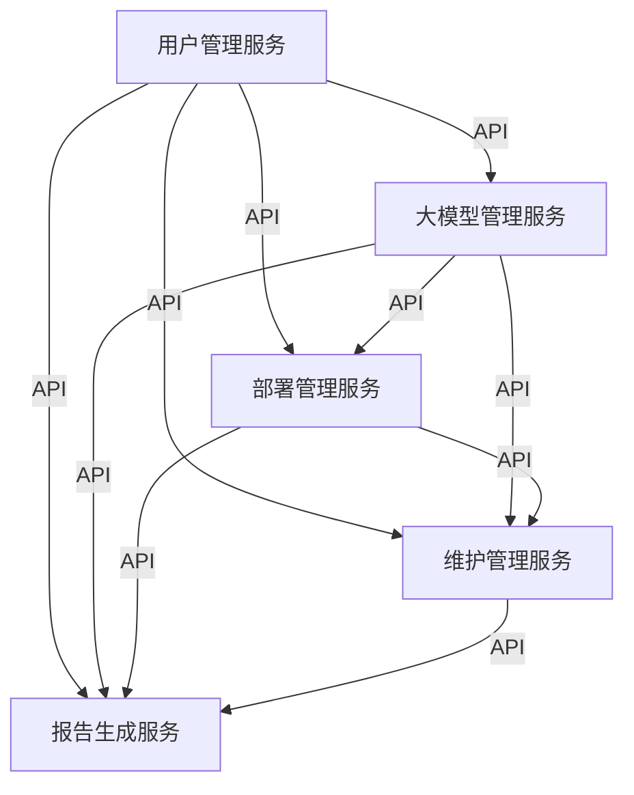

                 

### 引言

近年来，随着人工智能技术的迅猛发展，大模型（如GPT、BERT等）在各个领域取得了显著的成果。然而，这些大模型的开发和部署面临着诸多挑战，包括数据处理、开发流程、模型部署与维护等。为了应对这些挑战，传统的研发模式逐渐暴露出其局限性，而敏捷研发模式以其灵活性、迭代性和协同性逐渐成为解决之道。

本文旨在探讨如何将敏捷研发模式适配到大模型应用中，使其在应对复杂、多变的技术挑战时能够更加高效、灵活地运作。本文将首先介绍大模型应用背景和敏捷研发模式的基本原理，然后逐步深入分析大模型应用场景下的敏捷适配方法，最后通过实践案例进行验证和总结。

本文结构如下：

- **第一部分**：引言
  - 第1章：背景与概述
  - 第2章：敏捷方法论与原则
  - 第3章：大模型应用场景与敏捷适配
- **第二部分**：大模型应用场景与敏捷适配
  - 第4章：大模型在数据处理中的应用
  - 第5章：大模型在模型开发中的应用
  - 第6章：大模型在模型部署与维护中的应用
- **第三部分**：总结与展望

通过本文的探讨，我们希望能够为从事大模型研发的工作者提供一套实用的敏捷研发方法论，帮助他们在复杂的研发环境中实现高效、持续的创新。

### 关键词

- 大模型应用
- 敏捷研发
- 数据处理
- 模型开发
- 模型部署
- 维护

### 摘要

本文主要探讨了如何将敏捷研发模式适配到大模型应用中。首先，我们介绍了大模型应用的背景和面临的挑战，以及敏捷研发模式的基本原理和优势。接着，本文详细分析了大模型应用在数据处理、模型开发和模型部署与维护中的具体敏捷实践方法，并通过实际案例进行了验证。最后，本文总结了敏捷研发模式在大模型应用中的关键作用，并提出了未来研究的方向和挑战。

## 第1章：背景与概述

### 1.1 研发模式演进

#### 1.1.1 传统研发模式

在信息技术迅速发展的背景下，研发模式经历了从早期的小规模、手工作坊式开发到现代化、工业化的转变。传统研发模式，特别是瀑布模型，曾是最常见的研发方法。瀑布模型按照需求分析、设计、开发、测试、部署的顺序进行，每一个阶段都是线性的、顺序执行的。虽然瀑布模型在一定程度上确保了项目的可控性和稳定性，但其缺点也逐渐显现：

1. **需求变更困难**：在项目开发过程中，需求往往因外部环境变化而变更，但瀑布模型不擅长应对这种变化，导致需求变更代价高昂。
2. **开发周期长**：传统模式要求在项目开始前就明确所有需求，然后按部就班地进行开发，导致开发周期较长，市场响应速度慢。
3. **沟通成本高**：线性开发过程中，不同阶段的团队工作相对独立，沟通不畅，导致项目进度和质量难以控制。

#### 1.1.2 敏捷研发模式

为了解决传统研发模式的局限性，敏捷研发模式应运而生。敏捷研发模式强调快速迭代、持续交付和团队协作，旨在应对快速变化的需求和市场环境。其核心原则包括：

1. **用户优先**：敏捷研发重视用户反馈，确保产品始终满足用户需求。
2. **持续交付**：通过短周期、频繁的迭代，持续交付可用的软件产品。
3. **团队合作**：鼓励团队成员跨职能协作，共同解决问题。
4. **响应变化**：敏捷研发能够灵活应对需求变化，减少因需求变更导致的风险。

敏捷研发模式主要包括以下几种方法论：

1. **Scrum**：通过设置冲刺（Sprint）来组织工作，每次冲刺结束后进行评审和回顾，确保团队不断进步。
2. **Kanban**：通过可视化看板管理工作流程，确保工作连续流动，减少等待时间。
3. **XP（极限编程）**：通过严格的编码标准和开发实践，提高代码质量和开发效率。

#### 1.1.3 大模型应用背景

随着人工智能技术的不断发展，大模型（Large Models）在自然语言处理、计算机视觉、推荐系统等领域展现出了强大的能力。大模型通常具有以下特点：

1. **参数量巨大**：大模型通常拥有数亿甚至数千亿个参数，这使得它们可以处理复杂的数据特征。
2. **训练需求高**：大模型的训练通常需要大量的计算资源和时间，这要求高效的研发模式来确保其开发进度。
3. **持续优化需求**：大模型的性能优化是一个长期过程，需要不断调整和优化模型结构、训练策略等。

大模型应用面临以下挑战：

1. **数据处理**：大模型需要处理大量的数据，这要求高效的数据处理流程和工具。
2. **开发效率**：大模型的开发涉及复杂的算法和架构设计，需要提高开发效率和团队协作。
3. **部署与维护**：大模型的部署需要确保其稳定运行，同时需要定期进行性能优化和更新。

### 1.2 敏捷研发模式在AI大模型应用中的重要性

#### 1.2.1 大模型应用的特点与挑战

大模型应用的特点与挑战主要体现在以下几个方面：

1. **大规模数据处理**：大模型需要处理的数据量通常非常庞大，这要求高效的数据处理流程和工具。
2. **高计算需求**：大模型的训练和优化需要大量的计算资源，这对研发团队的计算能力提出了挑战。
3. **复杂性与不确定性**：大模型的研发过程复杂，涉及多种技术和领域知识，且需求和市场环境变化快，这使得研发过程充满不确定性。

#### 1.2.2 敏捷研发的优势与适配性

敏捷研发模式具有以下优势，这些优势使其在大模型应用中尤为适用：

1. **快速响应需求变更**：敏捷研发通过短周期迭代和持续交付，能够快速响应需求变化，确保产品始终满足用户需求。
2. **高效团队协作**：敏捷研发强调团队合作，通过跨职能协作，提高开发效率和解决问题的能力。
3. **持续优化与迭代**：敏捷研发模式鼓励持续优化和迭代，通过不断的反馈和改进，提升大模型的性能和稳定性。
4. **灵活的资源配置**：敏捷研发模式可以根据项目需求灵活调整资源和团队结构，确保项目的高效运作。

#### 1.2.3 敏捷研发的核心原则

敏捷研发的核心原则包括：

1. **用户优先**：始终将用户需求放在首位，确保产品满足用户实际需求。
2. **持续交付**：通过短周期迭代，持续交付可用的软件产品，提高市场响应速度。
3. **团队合作**：鼓励团队成员跨职能协作，共同解决问题。
4. **响应变化**：灵活应对需求和市场环境的变化，减少因变化导致的风险。

### 1.3 敏捷研发模式与大型模型的关系

#### 1.3.1 大模型生命周期管理

大模型的生命周期管理是确保其成功应用的关键。敏捷研发模式在大模型生命周期管理中的应用主要体现在以下几个方面：

1. **需求管理**：敏捷研发模式通过用户故事（User Story）和需求迭代，确保需求与用户实际需求保持一致，减少需求变更对项目的影响。
2. **开发与测试**：通过短周期迭代和频繁测试，确保大模型在开发过程中及时发现问题并进行修正。
3. **部署与维护**：敏捷研发模式强调持续集成和持续部署，确保大模型能够快速、稳定地部署和运行，同时通过持续监控和优化，确保其长期稳定运行。

#### 1.3.2 大模型开发中的敏捷实践

大模型开发中的敏捷实践主要包括以下几个方面：

1. **敏捷需求管理**：通过用户故事地图（User Story Map）和故事点（Story Points）管理需求，确保需求的高效处理和优先级排序。
2. **敏捷迭代计划**：通过设置冲刺（Sprint）和迭代计划，确保开发过程有序进行，并在每个迭代结束后进行评审和回顾。
3. **敏捷测试**：通过自动化测试和持续集成（CI/CD）工具，确保大模型的稳定性和可靠性。

#### 1.3.3 大模型部署与维护中的敏捷实践

大模型部署与维护中的敏捷实践主要包括以下几个方面：

1. **持续集成与部署**：通过持续集成和持续部署（CI/CD）工具，确保大模型能够快速、稳定地部署到生产环境。
2. **自动化测试**：通过自动化测试工具，确保大模型在部署后的稳定运行。
3. **持续监控与优化**：通过实时监控和日志分析工具，确保大模型的性能和稳定性，并在发现问题时及时进行调整和优化。

### 1.4 本书结构安排

本书将从以下几个方面详细探讨敏捷研发模式在大模型应用中的适配：

- **第一部分**：引言，包括背景介绍和基本概念。
- **第二部分**：敏捷方法论与原则，介绍敏捷研发的基础理论和实践方法。
- **第三部分**：大模型应用场景与敏捷适配，分析大模型在数据处理、模型开发和模型部署与维护中的敏捷实践。
- **第四部分**：总结与展望，总结敏捷研发模式在大模型应用中的关键作用，并提出未来研究的方向和挑战。

通过以上结构的安排，本文旨在为读者提供一套完整的、实用的敏捷研发方法论，帮助他们在大模型应用中实现高效、持续的创新。

## 1.5 本章小结

本章详细介绍了研发模式的演进，从传统的瀑布模型到现代的敏捷研发模式，以及大模型应用背景和面临的挑战。通过分析敏捷研发模式的核心原则和优势，我们了解了它在大模型应用中的重要性和适用性。本章还探讨了敏捷研发模式在大模型生命周期管理、开发过程和部署与维护中的应用，为后续章节的深入讨论奠定了基础。

## 第2章：敏捷方法论与原则

### 2.1 敏捷方法论概述

#### 2.1.1 敏捷起源与发展

敏捷方法论起源于20世纪90年代，由一群软件开发者在反思传统瀑布模型的局限性时提出。当时，软件开发项目往往面临需求不明确、进度延误、质量低下等问题，而传统的项目管理方法如瀑布模型等未能有效解决这些问题。为了应对这些挑战，软件开发者开始探索更加灵活、迭代和用户参与的方法，从而诞生了敏捷方法论。

2001年，17位软件开发专家共同发布了《敏捷宣言》（The Agile Manifesto），这份宣言提出了敏捷开发的四个核心价值观：

- **个体和互动重于过程与工具**：重视团队成员的互动和协作，认为这是提高开发效率和质量的关键。
- **可工作的软件重于详尽的文档**：认为软件的实际功能和性能比复杂的文档更为重要。
- **客户合作重于合同谈判**：强调与客户的紧密合作，通过不断的沟通和反馈，确保产品满足客户需求。
- **响应变化重于遵循计划**：在快速变化的环境中，灵活应对变化比严格遵循计划更为重要。

#### 2.1.2 敏捷与敏捷开发

敏捷开发（Agile Development）是敏捷方法论的具体实现，它通过一系列的实践和原则，确保项目能够快速响应需求变化，持续交付高质量的产品。敏捷开发的核心是迭代（Iteration）和增量（Incremental）开发，即将项目划分为多个短周期（通常为几周）的迭代，在每个迭代中交付可用的软件功能。

敏捷开发的主要特点包括：

1. **短周期迭代**：每个迭代通常为几周，团队在每个迭代结束后进行评审和回顾，确保项目进展顺利。
2. **用户故事**：用户故事（User Story）是一种简短、清晰的需求描述，通常以用户的角度来编写，确保需求与用户实际需求一致。
3. **持续交付**：通过持续交付（Continuous Delivery），确保每次迭代结束后，软件产品都可以部署到生产环境，供用户使用。
4. **自动化测试**：通过自动化测试（Automated Testing），确保软件在每次迭代后都是稳定和可靠的。
5. **团队合作**：强调团队合作和跨职能协作，通过共同解决问题，提高开发效率。

#### 2.1.3 敏捷的核心价值观

敏捷方法论的核心价值观包括：

1. **用户优先**：始终关注用户需求和反馈，确保产品能够满足用户期望。
2. **持续交付**：通过短周期迭代，持续交付可用的软件产品，提高市场响应速度。
3. **团队合作**：鼓励团队成员跨职能协作，共同解决问题。
4. **响应变化**：灵活应对需求和市场环境的变化，减少因变化导致的风险。

这些核心价值观体现在敏捷开发的具体实践中，如Scrum、Kanban、XP等方法论中。

### 2.2 敏捷研发原则与实践

#### 2.2.1 敏捷开发的核心原则

敏捷开发的核心原则包括：

1. **可工作的软件重于详尽的文档**：敏捷开发认为，软件的实际功能和性能比复杂的文档更为重要，因此应将更多的时间和资源投入到实际软件开发中。
2. **客户合作重于合同谈判**：敏捷开发强调与客户的紧密合作，通过不断的沟通和反馈，确保产品能够满足客户需求。
3. **响应变化重于遵循计划**：在快速变化的环境中，敏捷开发更加注重灵活应对变化，而不是严格遵循计划。
4. **持续交付**：通过短周期迭代，持续交付可用的软件产品，确保项目能够快速响应市场需求。
5. **增量式交付**：将项目划分为多个短周期迭代，每个迭代交付可用的软件功能，确保项目逐步完善。

#### 2.2.2 敏捷实践的基本方法

敏捷实践的基本方法包括以下几个方面：

1. **用户故事**：用户故事是一种简短、清晰的需求描述，通常以用户的角度来编写。编写用户故事的方法包括：
   - **INVEST原则**：用户故事应具备独立性（Independent）、可 Negotiable、Valuable、Estimable、Small、Testable。
   - **格式**：“作为（As）...，我想要（I want）...，以便（so that）...”。
   - **示例**：“作为用户，我想要查看我的购物车中的商品，以便我能够轻松地管理我的订单。”

2. **迭代开发**：迭代开发是将项目划分为多个短周期（通常为几周）的迭代，每个迭代结束后进行评审和回顾。迭代开发的方法包括：
   - **Sprint规划**：在每次迭代开始时，团队确定本次迭代要完成的工作。
   - **每日站会**：团队每天召开简短的站会，讨论进展和问题。
   - **迭代评审**：在每次迭代结束后，团队对本次迭代进行评审，讨论成果和改进点。
   - **迭代回顾**：团队对本次迭代进行回顾，总结经验教训，为下一个迭代做好准备。

3. **自动化测试**：自动化测试是确保软件质量和稳定性的重要手段。自动化测试的方法包括：
   - **单元测试**：对软件的每个单元进行测试，确保其功能正确。
   - **集成测试**：对软件的多个模块进行集成测试，确保其交互正确。
   - **回归测试**：在每次修改后进行测试，确保修改没有引入新的错误。

4. **持续集成与部署**：持续集成与部署是确保软件质量和交付速度的重要手段。持续集成与部署的方法包括：
   - **持续集成**：每次提交代码后，自动进行构建和测试，确保代码质量。
   - **持续部署**：每次集成成功后，自动部署到测试或生产环境，确保软件的可用性。

#### 2.2.3 敏捷团队的构建与协作

敏捷团队的构建与协作是敏捷开发成功的关键。敏捷团队通常由以下成员组成：

1. **产品负责人**：负责制定产品愿景和优先级，确保团队始终专注于最有价值的功能。
2. **开发团队**：负责软件开发和测试，通常包括后端、前端、移动端等不同领域的开发人员。
3. **Scrum Master**：负责确保团队遵循敏捷原则和实践，解决团队遇到的问题，并促进团队协作。

敏捷团队的协作方法包括：

1. **每日站会**：团队每天召开简短的站会，讨论进展和问题，确保项目进展顺利。
2. **迭代评审和回顾**：在每次迭代结束后，团队对本次迭代进行评审和回顾，讨论成果和改进点。
3. **跨职能协作**：团队中的成员具有不同的技能和背景，通过跨职能协作，可以共同解决问题，提高开发效率。
4. **知识共享**：团队鼓励成员分享知识和经验，通过学习相互补充，提高整体能力。

### 2.3 敏捷流程与管理

#### 2.3.1 敏捷开发流程

敏捷开发流程主要包括以下阶段：

1. **需求收集与规划**：产品负责人与客户沟通，收集需求，并制定产品愿景和优先级。
2. **迭代规划**：团队在每次迭代开始时，根据产品愿景和优先级，确定本次迭代要完成的工作。
3. **开发与测试**：团队按照迭代计划进行开发，并进行自动化测试，确保软件质量。
4. **迭代交付**：在每次迭代结束后，团队交付可用的软件产品，供客户使用。
5. **迭代评审与回顾**：团队对本次迭代进行评审和回顾，讨论成果和改进点，为下一个迭代做好准备。

#### 2.3.2 敏捷项目管理

敏捷项目管理强调快速响应变化和持续交付价值。敏捷项目管理的方法包括：

1. **产品待办列表**：产品负责人将需求写入产品待办列表（Product Backlog），并根据优先级排序。
2. **迭代待办列表**：团队在每次迭代开始时，从产品待办列表中选择要完成的工作，并将其写入迭代待办列表（Sprint Backlog）。
3. **迭代进度跟踪**：团队通过看板（Kanban Board）或任务管理工具（如Jira），实时跟踪迭代进度。
4. **优先级调整**：在迭代过程中，根据实际情况和客户需求，可以调整优先级，确保团队始终专注于最有价值的工作。

#### 2.3.3 敏捷团队沟通与协作

敏捷团队沟通与协作是敏捷开发成功的关键。敏捷团队沟通与协作的方法包括：

1. **每日站会**：团队每天召开简短的站会，讨论进展和问题，确保项目进展顺利。
2. **迭代评审和回顾**：在每次迭代结束后，团队对本次迭代进行评审和回顾，讨论成果和改进点。
3. **知识共享会议**：团队定期举行知识共享会议，分享知识和经验，提高整体能力。
4. **跨职能协作**：团队中的成员具有不同的技能和背景，通过跨职能协作，可以共同解决问题，提高开发效率。
5. **在线协作工具**：团队使用在线协作工具（如Slack、Trello等），实时沟通和协作，确保信息畅通。

### 2.4 敏捷工具与技术

#### 2.4.1 敏捷工具概述

敏捷工具是支持敏捷开发流程和团队协作的重要工具，常见的敏捷工具有：

1. **Jira**：任务管理工具，用于跟踪任务进度、管理产品待办列表和迭代计划。
2. **Trello**：看板工具，用于可视化项目管理，实时跟踪项目进度。
3. **Asana**：项目管理工具，用于任务分配、进度跟踪和团队协作。
4. **Slack**：实时沟通工具，用于团队成员之间的实时沟通和协作。
5. **Zoom**：视频会议工具，用于远程团队的沟通和协作。

#### 2.4.2 敏捷工具的实际应用

敏捷工具在实际应用中发挥着重要作用，具体包括：

1. **任务管理**：敏捷工具可以方便地分配任务、设置优先级、跟踪任务进度，确保每个任务都能按时完成。
2. **进度跟踪**：通过看板或任务管理工具，团队可以实时了解项目的进展情况，确保项目按计划进行。
3. **团队协作**：敏捷工具支持团队成员之间的实时沟通和协作，提高团队的工作效率。
4. **知识共享**：敏捷工具提供了知识共享的功能，团队成员可以随时分享知识和经验，提高整体能力。
5. **自动化**：通过自动化测试和持续集成工具，确保软件在每次迭代后都是稳定和可靠的。

#### 2.4.3 敏捷工具的选用与配置

选用和配置敏捷工具需要考虑以下几个因素：

1. **团队规模和需求**：根据团队规模和需求选择合适的工具，如小型团队可以选择Trello，大型团队可以选择Jira。
2. **功能与易用性**：工具的功能应满足团队的需求，同时易于使用和操作，避免增加团队成员的学习成本。
3. **集成与扩展性**：工具应具备良好的集成与扩展性，能够与其他工具和服务无缝连接，提高工作效率。
4. **安全性**：工具应具备良好的安全性，确保团队成员的数据安全和隐私。

通过合理选用和配置敏捷工具，可以显著提高团队的协作效率，确保项目顺利进行。

### 2.5 本章小结

本章介绍了敏捷方法论与原则，包括敏捷起源与发展、敏捷与敏捷开发、敏捷的核心价值观和敏捷实践的基本方法。通过分析敏捷开发的核心原则和实践方法，我们了解了敏捷研发的优势和应用场景。本章还介绍了敏捷流程与管理、敏捷团队沟通与协作以及敏捷工具与技术，为后续章节深入探讨敏捷研发模式在大模型应用中的适配提供了基础。

## 1.5 本章小结

本章详细介绍了敏捷方法论与原则，包括其起源与发展、核心价值观以及实践方法。通过分析敏捷开发的核心原则，如用户优先、持续交付和团队合作，我们了解了敏捷研发的优势和应用场景。本章还探讨了敏捷实践的基本方法，如用户故事、迭代开发和自动化测试，以及敏捷团队沟通与协作的方法和敏捷工具与技术。这些内容为后续章节深入探讨敏捷研发模式在大模型应用中的适配提供了理论基础和实践指导。

## 第3章：大模型在数据处理中的应用

### 3.1 大模型数据处理基础

#### 3.1.1 大模型数据处理的需求与挑战

大模型数据处理的需求主要体现在以下几个方面：

1. **数据规模巨大**：大模型的训练通常需要海量数据，数据量可达数十GB甚至TB级别，这对数据存储和传输提出了高要求。
2. **数据处理速度快**：由于大模型的参数量巨大，训练时间较长，数据处理速度成为影响开发效率的关键因素。
3. **数据多样性**：大模型应用场景广泛，涉及多种类型的数据，如文本、图像、音频等，数据处理需要兼顾不同类型数据的特点。
4. **数据质量要求高**：大模型对数据的依赖性强，数据质量问题直接影响模型的性能，因此对数据质量的要求较高。

大模型数据处理面临的挑战包括：

1. **数据存储与传输**：大规模数据的存储和传输需要高效的存储系统和网络带宽，以支持快速访问和传输。
2. **数据预处理复杂**：不同类型的数据预处理方法不同，且预处理过程涉及多种技术，如数据清洗、数据归一化、特征提取等，需要大量计算资源和时间。
3. **并行处理需求**：为了提高数据处理速度，需要采用并行处理技术，如分布式计算、多线程处理等，这增加了系统的复杂度。
4. **数据安全与隐私**：大规模数据处理过程中，如何保障数据安全和用户隐私是一个重要挑战。

#### 3.1.2 大模型数据处理的基本方法

为了应对上述需求与挑战，大模型数据处理的基本方法包括以下几个方面：

1. **数据采集**：从多种数据源采集数据，如公共数据集、私有数据集、网络爬虫等，确保数据规模和多样性。
2. **数据存储**：采用分布式存储系统，如Hadoop、Spark等，以支持大规模数据的存储和管理。
3. **数据预处理**：包括数据清洗、数据归一化、特征提取等步骤，采用高效算法和工具提高预处理速度和效果。
4. **并行处理**：利用分布式计算和并行处理技术，提高数据处理速度，如使用MapReduce模型进行数据处理。
5. **数据安全与隐私**：采用加密技术、访问控制、匿名化处理等方法，保障数据安全和用户隐私。

#### 3.1.3 大模型数据处理流程

大模型数据处理流程主要包括以下几个阶段：

1. **数据采集**：从多种数据源采集数据，确保数据规模和多样性。
2. **数据存储**：将采集到的数据存储到分布式存储系统中，以支持大规模数据的存储和管理。
3. **数据预处理**：对采集到的数据进行清洗、归一化和特征提取，为模型训练做准备。
4. **模型训练**：使用预处理后的数据对大模型进行训练，调整模型参数以优化模型性能。
5. **模型评估**：通过测试数据对模型进行评估，确保模型的性能达到预期要求。
6. **模型部署**：将训练好的模型部署到生产环境中，供实际应用使用。
7. **模型维护**：对部署后的模型进行监控和优化，确保其稳定运行。

### 3.2 敏捷适配方法

#### 3.2.1 敏捷在数据处理中的应用

在数据处理过程中，敏捷研发模式可以有效地提高开发效率和质量。敏捷在数据处理中的应用主要包括以下几个方面：

1. **用户故事驱动**：通过用户故事来驱动数据处理任务，确保数据处理工作始终满足用户需求。
2. **短周期迭代**：将数据处理任务划分为多个短周期迭代，每个迭代结束后进行评审和回顾，确保任务进度和质量的控制。
3. **持续交付**：通过持续交付，确保每次迭代结束后，数据处理的结果可以及时交付给后续处理环节，提高整体开发效率。
4. **自动化测试**：通过自动化测试，确保数据处理过程是稳定和可靠的，减少人为干预和错误。

#### 3.2.2 敏捷流程优化

为了更好地适应大模型数据处理的需求，需要对敏捷流程进行优化，具体方法包括：

1. **数据流优化**：通过分析数据流，识别数据处理的瓶颈和关键环节，进行优化和调整，如使用高效的算法和数据结构，提高数据处理速度。
2. **并行处理**：采用分布式计算和并行处理技术，充分利用计算资源，提高数据处理速度和效率。
3. **数据质量管理**：建立数据质量管理机制，包括数据质量检查、数据清洗、数据归一化等，确保数据质量达到预期要求。
4. **反馈机制**：建立反馈机制，通过用户反馈和数据分析，不断优化数据处理流程和算法，提高数据处理的准确性和效率。

#### 3.2.3 敏捷工具应用

在数据处理过程中，敏捷工具的应用可以显著提高开发效率和质量，具体应用包括：

1. **任务管理工具**：如Jira、Trello等，用于任务分配、进度跟踪和任务管理，确保数据处理任务有序进行。
2. **数据管理工具**：如Hadoop、Spark等，用于数据存储、管理和处理，支持大规模数据处理。
3. **测试工具**：如JUnit、Selenium等，用于自动化测试，确保数据处理过程的稳定性和可靠性。
4. **协作工具**：如Slack、Zoom等，用于团队成员之间的实时沟通和协作，提高团队协作效率。

### 3.3 实践案例

#### 3.3.1 数据预处理流程敏捷适配

以下是一个数据预处理流程敏捷适配的实践案例：

1. **用户故事**：
   - **故事1**：“作为数据处理工程师，我需要能够快速清洗和预处理大规模文本数据，以便为模型训练做准备。”
   - **故事2**：“作为数据处理工程师，我需要能够实时监测数据清洗和预处理的进度和结果，以便及时调整处理策略。”

2. **短周期迭代**：
   - **迭代1**：完成文本数据的采集和初步清洗，包括去除标点符号、停用词过滤等。
   - **迭代2**：完成文本数据的归一化处理，包括小写转换、数字替换等。
   - **迭代3**：完成文本数据的特征提取，包括词袋模型、TF-IDF等。

3. **持续交付**：
   - 在每个迭代结束后，将预处理后的数据交付给模型训练团队，确保模型训练工作可以顺利进行。

4. **自动化测试**：
   - 编写自动化测试脚本，对每个预处理步骤进行测试，确保数据清洗和预处理结果的正确性和一致性。

#### 3.3.2 特征工程敏捷适配

以下是一个特征工程敏捷适配的实践案例：

1. **用户故事**：
   - **故事1**：“作为数据科学家，我需要能够快速构建和测试不同特征的组合，以便选择最优特征。”
   - **故事2**：“作为数据科学家，我需要能够实时调整特征工程参数，以便优化模型性能。”

2. **短周期迭代**：
   - **迭代1**：选择和构建初始特征，包括文本、数值、时间序列等。
   - **迭代2**：测试和评估不同特征的组合效果，选择最优特征组合。
   - **迭代3**：调整特征工程参数，如特征缩放、缺失值处理等，优化模型性能。

3. **持续交付**：
   - 在每个迭代结束后，将特征工程结果交付给模型训练团队，确保模型训练工作可以顺利进行。

4. **自动化测试**：
   - 编写自动化测试脚本，对每个特征工程步骤进行测试，确保特征工程结果的正确性和一致性。

#### 3.3.3 模型训练与优化敏捷适配

以下是一个模型训练与优化敏捷适配的实践案例：

1. **用户故事**：
   - **故事1**：“作为数据科学家，我需要能够快速训练和评估大模型，以便选择最佳模型配置。”
   - **故事2**：“作为数据科学家，我需要能够实时调整模型参数，以便优化模型性能。”

2. **短周期迭代**：
   - **迭代1**：使用初步特征数据训练模型，选择初步模型配置。
   - **迭代2**：测试和评估不同模型配置的效果，选择最佳模型配置。
   - **迭代3**：调整模型参数，如学习率、正则化等，优化模型性能。

3. **持续交付**：
   - 在每个迭代结束后，将模型训练结果交付给模型部署团队，确保模型部署工作可以顺利进行。

4. **自动化测试**：
   - 编写自动化测试脚本，对每个模型训练和优化步骤进行测试，确保模型训练和优化结果的正确性和一致性。

通过以上实践案例，我们可以看到敏捷适配方法在大模型数据处理中的应用，有助于提高数据处理效率和质量，确保大模型应用的成功。

### 1.4 本章小结

本章详细探讨了大模型数据处理的需求与挑战，包括数据规模、数据处理速度、数据多样性和数据质量等方面的需求，以及数据存储与传输、数据预处理、并行处理和数据安全与隐私等方面的挑战。接着，介绍了大模型数据处理的基本方法，如数据采集、数据存储、数据预处理、并行处理和数据安全与隐私等。此外，本章还讨论了敏捷适配方法在大模型数据处理中的应用，包括用户故事驱动、短周期迭代、持续交付和自动化测试等，并通过实践案例展示了敏捷适配方法的具体应用。这些内容为后续章节深入探讨大模型应用中的敏捷实践提供了基础。

## 第4章：大模型开发流程与敏捷实践

### 4.1 大模型开发流程概述

大模型开发流程是一个复杂的过程，涉及到多个阶段和环节。下面我们将详细描述大模型开发的基本流程、面临的挑战以及如何通过敏捷实践来应对这些挑战。

#### 4.1.1 大模型开发的基本流程

大模型开发的基本流程可以分为以下几个阶段：

1. **需求分析**：在这个阶段，开发团队需要与业务部门、数据科学家和客户等各方进行沟通，明确模型的应用场景、目标以及需求。

2. **数据准备**：数据准备是模型开发的关键步骤，包括数据采集、数据清洗、数据归一化和数据特征提取等。这个阶段需要处理的数据量通常非常庞大，且数据类型多样。

3. **模型设计**：在数据准备完成后，开发团队开始设计模型结构。这包括选择合适的模型架构（如神经网络、支持向量机等）、确定模型参数以及优化模型算法。

4. **模型训练**：在这个阶段，开发团队使用准备好的数据对模型进行训练。由于大模型通常具有数亿甚至千亿个参数，训练过程需要大量的计算资源和时间。

5. **模型评估**：训练完成后，开发团队需要对模型进行评估，以确定其性能是否符合预期。评估指标包括准确率、召回率、F1分数等。

6. **模型优化**：根据评估结果，开发团队对模型进行调整和优化，以提高其性能。

7. **模型部署**：在完成优化后，模型被部署到生产环境中，供实际应用使用。

8. **模型维护**：部署后，开发团队需要对模型进行监控和维护，确保其稳定运行，并根据业务需求进行持续优化。

#### 4.1.2 大模型开发中的挑战

大模型开发过程中面临以下挑战：

1. **数据量庞大**：大模型的训练通常需要处理的数据量非常大，这要求高效的存储和数据处理能力。

2. **计算资源需求高**：大模型的训练需要大量的计算资源，这包括CPU、GPU等硬件资源，以及高性能计算集群。

3. **模型复杂度高**：大模型通常具有复杂的结构，涉及多种算法和优化方法，这使得模型设计和实现过程更加复杂。

4. **模型优化难度大**：大模型的参数数量庞大，优化过程需要大量的计算和试验，且优化效果受多种因素影响，这使得模型优化过程充满挑战。

5. **模型评估困难**：由于大模型的训练数据量和复杂性，评估模型性能需要大量的测试数据和计算资源，这使得模型评估过程变得困难。

#### 4.1.3 大模型开发流程的敏捷化改造

为了应对大模型开发中的挑战，可以将敏捷实践引入到模型开发流程中，具体改造方法包括：

1. **迭代开发**：将模型开发过程划分为多个短周期迭代，每个迭代结束后进行评估和回顾，确保开发过程有序进行。

2. **用户故事驱动**：使用用户故事来驱动开发过程，确保模型开发工作始终满足用户需求。

3. **持续交付**：通过持续交付，确保每次迭代结束后，模型的基本功能可以得到测试和评估。

4. **自动化测试**：通过自动化测试，确保每次迭代后，模型的稳定性和可靠性。

5. **跨职能协作**：鼓励跨职能协作，包括数据科学家、开发工程师、测试工程师等，共同解决问题，提高开发效率。

### 4.2 敏捷实践

#### 4.2.1 敏捷需求管理

敏捷需求管理是确保模型开发工作始终满足用户需求的关键。具体实践包括：

1. **用户故事地图**：通过用户故事地图，将用户需求可视化，明确每个迭代需要实现的功能。

2. **故事点**：使用故事点（Story Points）来估算用户故事的工作量，确保团队能够合理分配时间和资源。

3. **优先级排序**：根据用户故事的重要性和紧急性，对用户故事进行优先级排序，确保团队始终优先处理最重要的需求。

#### 4.2.2 敏捷迭代计划

敏捷迭代计划是确保模型开发工作有序进行的重要手段。具体实践包括：

1. **冲刺规划**：在每个迭代开始时，团队进行冲刺规划，明确本次迭代需要完成的工作。

2. **每日站会**：每天召开简短的站会，讨论进展和问题，确保团队保持高效率。

3. **迭代回顾**：在每个迭代结束后，团队进行回顾，总结经验教训，为下一个迭代做好准备。

#### 4.2.3 敏捷测试与评审

敏捷测试与评审是确保模型质量和性能的重要环节。具体实践包括：

1. **自动化测试**：通过自动化测试工具，如Selenium、JUnit等，对模型进行自动化测试，确保每次迭代后的模型是稳定和可靠的。

2. **持续集成与持续部署**：通过持续集成和持续部署（CI/CD），确保每次代码提交后，模型都可以快速、安全地部署到测试环境。

3. **迭代评审**：在每个迭代结束后，进行迭代评审，讨论模型的性能、稳定性、用户满意度等，为下一个迭代提供反馈。

### 4.3 敏捷工具在模型开发中的应用

敏捷工具在模型开发中的应用可以显著提高开发效率和质量。以下是一些常用的敏捷工具：

1. **Jira**：用于任务管理、进度跟踪和迭代规划。

2. **Trello**：用于可视化项目管理，实时跟踪项目进度。

3. **GitLab**：用于代码管理、自动化测试和持续集成。

4. **Slack**：用于实时沟通和协作。

5. **Zoom**：用于远程团队的视频会议和讨论。

通过这些工具，团队可以更好地管理任务、监控进度、确保沟通畅通，从而提高模型开发的效率和质量。

### 4.4 敏捷实践案例分析

以下是一个大模型开发过程中的敏捷实践案例分析：

**案例背景**：某互联网公司需要开发一款基于自然语言处理的大模型，用于回答用户的问题。

**敏捷实践**：

1. **需求分析**：通过用户故事地图，明确了模型需要支持的关键功能，如问答、文本分类等。

2. **迭代计划**：团队将开发过程划分为多个迭代，每次迭代持续两周。在每个迭代开始时，团队进行冲刺规划，明确本次迭代要完成的工作。

3. **用户故事**：团队使用用户故事来驱动开发过程，每个用户故事都包含详细的描述、优先级和故事点。

4. **自动化测试**：团队使用JUnit进行自动化测试，确保每次迭代后，模型的功能和性能都是稳定的。

5. **持续集成与部署**：团队使用GitLab进行代码管理和自动化测试，确保每次代码提交后，模型都可以快速、安全地部署到测试环境。

6. **迭代回顾**：在每个迭代结束后，团队进行回顾，讨论模型的表现、用户的反馈以及改进点。

通过以上敏捷实践，团队成功开发了满足用户需求的大模型，并在短时间内实现了从需求分析到模型部署的完整流程。

### 1.4 本章小结

本章详细介绍了大模型开发的基本流程，包括需求分析、数据准备、模型设计、模型训练、模型评估、模型优化、模型部署和模型维护等阶段，并分析了大模型开发中面临的挑战。接着，本章探讨了如何通过敏捷实践来应对这些挑战，包括敏捷需求管理、迭代计划、测试与评审以及敏捷工具的应用。通过实际案例分析，展示了敏捷实践在大模型开发中的具体应用，有助于提高模型开发的效率和质量。这些内容为后续章节深入探讨大模型在模型部署与维护中的应用奠定了基础。

## 第5章：大模型部署与维护中的敏捷实践

### 5.1 大模型部署基础

#### 5.1.1 大模型部署的需求与挑战

大模型部署是模型开发过程中的关键环节，直接关系到模型能否顺利上线并稳定运行。在大模型部署过程中，面临着以下需求和挑战：

1. **资源需求**：大模型的部署通常需要大量的计算资源和存储资源，包括高性能GPU、CPU和分布式存储系统。这对基础设施提出了高要求。

2. **部署复杂性**：大模型的部署涉及多个组件和环节，如模型文件、依赖库、配置文件等，部署过程需要确保各个组件的正确配置和协调工作。

3. **数据一致性与完整性**：大模型在部署过程中，需要确保模型数据和配置文件的一致性和完整性，以避免数据丢失或错误。

4. **环境一致性**：大模型在不同开发环境（如本地、测试、生产）之间可能存在差异，确保环境一致性是部署过程中的一大挑战。

5. **安全性与合规性**：大模型部署过程中，需要确保数据安全和用户隐私，遵守相关法律法规和合规要求。

6. **性能优化**：大模型部署后，需要对其性能进行优化，确保模型能够高效运行，满足业务需求。

#### 5.1.2 大模型部署的基本策略

为了应对上述需求和挑战，大模型部署的基本策略包括：

1. **标准化部署流程**：建立统一的部署流程，确保每个部署步骤都是标准化和可复制的，减少人为错误。

2. **自动化部署**：通过自动化部署工具（如Kubernetes、Docker等），实现快速、高效和可靠的部署。

3. **环境一致性**：使用容器化技术（如Docker）确保开发、测试和生产环境的一致性，减少环境差异带来的问题。

4. **持续集成与持续部署（CI/CD）**：通过CI/CD工具（如Jenkins、GitLab CI等），实现代码的持续集成和持续部署，确保每次代码提交后都可以快速部署。

5. **性能监控与优化**：部署后，使用性能监控工具（如Prometheus、Grafana等），对模型性能进行实时监控和优化，确保模型稳定运行。

6. **安全性保障**：使用安全工具（如OpenSSL、TLS等），确保数据传输和存储的安全，并遵循相关法律法规和合规要求。

#### 5.1.3 大模型部署流程

大模型部署流程可以分为以下几个阶段：

1. **环境准备**：准备部署所需的环境，包括计算资源、存储资源和网络配置等。

2. **模型打包**：将训练好的模型打包，通常使用容器化技术（如Docker）将模型、依赖库和配置文件打包成一个容器镜像。

3. **自动化部署**：使用自动化部署工具（如Kubernetes），根据部署脚本和配置文件，将容器镜像部署到目标环境中。

4. **配置与调优**：部署后，对模型进行配置和调优，确保模型性能和稳定性。

5. **性能测试**：进行性能测试，评估模型在实际运行环境中的性能和响应时间。

6. **监控与维护**：部署后，使用性能监控工具（如Prometheus、Grafana等），对模型进行实时监控和维护，确保其稳定运行。

### 5.2 敏捷部署实践

#### 5.2.1 持续集成与持续部署（CI/CD）

持续集成与持续部署（CI/CD）是敏捷部署的核心实践，旨在通过自动化流程确保代码质量和部署效率。具体实践包括：

1. **代码提交**：开发者将代码提交到版本控制系统（如Git），触发CI/CD流程。

2. **自动化构建**：CI/CD工具（如Jenkins、GitLab CI等）自动构建代码，包括编译、打包和测试。

3. **自动化测试**：执行自动化测试，确保每次代码提交后，代码质量和功能稳定性。

4. **自动化部署**：通过自动化部署脚本，将通过测试的代码部署到测试或生产环境。

5. **环境切换**：使用容器化技术（如Docker、Kubernetes），实现不同环境的快速切换，确保环境一致性。

#### 5.2.2 持续监控与优化

持续监控与优化是确保大模型稳定运行的关键。具体实践包括：

1. **性能监控**：使用性能监控工具（如Prometheus、Grafana等），实时监控模型性能指标，如响应时间、吞吐量等。

2. **日志分析**：收集和分析模型运行日志，识别和解决问题，确保模型稳定运行。

3. **性能调优**：根据监控和日志分析结果，对模型进行性能调优，如调整超参数、优化算法等。

4. **异常检测**：使用异常检测工具（如TensorFlow Extended、Scikit-Learn等），识别模型运行中的异常情况，提前预警。

5. **自动化回归测试**：在每次性能调优后，进行自动化回归测试，确保调优效果和稳定性。

### 5.3 实践案例

#### 5.3.1 大模型部署与维护案例

以下是一个大模型部署与维护的实践案例：

**背景**：某互联网公司需要部署一款用于文本分类的大模型，用于对用户生成的内容进行分类。

**步骤**：

1. **环境准备**：准备部署所需的环境，包括计算资源、存储资源和网络配置。

2. **模型打包**：使用Docker将训练好的模型和依赖库打包成一个容器镜像。

3. **自动化部署**：使用Kubernetes和Helm，根据部署脚本和配置文件，将容器镜像部署到生产环境中。

4. **配置与调优**：配置模型参数，进行性能调优，确保模型满足业务需求。

5. **性能测试**：进行性能测试，评估模型在生产环境中的性能和响应时间。

6. **监控与维护**：使用Prometheus和Grafana，对模型进行实时监控和维护，确保其稳定运行。

7. **日志分析**：收集和分析模型运行日志，识别和解决问题。

8. **异常检测与预警**：使用TensorFlow Extended进行异常检测，对模型运行中的异常情况提前预警。

通过以上实践，该公司成功部署并维护了稳定运行的大模型，满足了业务需求，并实现了敏捷部署与维护。

### 1.4 本章小结

本章详细介绍了大模型部署与维护的基础和敏捷实践。首先，分析了大模型部署的需求与挑战，并提出了基本策略和部署流程。然后，讨论了敏捷部署实践，包括持续集成与持续部署（CI/CD）和持续监控与优化。最后，通过一个实际案例，展示了敏捷部署与维护的具体应用。本章内容为在大模型应用中实现敏捷研发提供了重要参考。

## 1.5 本章小结

本章详细介绍了大模型部署与维护的基础知识，包括部署需求与挑战、基本策略和流程，以及敏捷部署实践。通过分析大模型在部署过程中的复杂性，提出了标准化部署流程、自动化部署、环境一致性、持续集成与持续部署（CI/CD）和性能监控等关键策略。同时，本章还探讨了敏捷部署实践的具体应用，如持续集成、自动化测试、性能监控与优化等。通过实际案例，展示了敏捷部署与维护的实际效果。本章内容为在大模型应用中实现敏捷研发提供了重要参考和实用指南。

## 总结

通过本文的详细探讨，我们系统地介绍了如何将敏捷研发模式适配到大模型应用中，从数据处理、模型开发到模型部署与维护，全面分析了敏捷实践在大模型应用中的重要性。以下是本文的主要结论：

1. **敏捷研发模式的优势**：敏捷研发模式以用户优先、持续交付、团队合作和响应变化为核心原则，能够有效地应对大模型应用中数据规模大、计算资源需求高、模型复杂度高和优化难度大等挑战。

2. **敏捷适配方法**：在数据处理阶段，敏捷适配方法通过用户故事驱动、短周期迭代、持续交付和自动化测试，提高了数据处理效率和准确性。在模型开发阶段，通过迭代开发、需求管理、测试与评审以及敏捷工具的应用，确保了模型的高质量和稳定性。在模型部署与维护阶段，敏捷实践通过持续集成与持续部署（CI/CD）、性能监控与优化，实现了快速、高效和稳定的模型部署与维护。

3. **实践案例验证**：通过实际案例，我们展示了敏捷研发模式在大模型应用中的成功应用。这些案例不仅验证了敏捷实践的可行性和有效性，也为其他大模型研发团队提供了宝贵的参考和经验。

### 未来研究方向与挑战

尽管敏捷研发模式在大模型应用中展现出了显著的优势，但仍然存在一些需要进一步研究和解决的问题：

1. **跨领域协作**：在大模型应用中，涉及多个领域（如计算机科学、数据科学、人工智能等）的协同工作。如何更好地实现跨领域协作，提高团队协作效率，是一个重要的研究方向。

2. **持续学习与优化**：大模型的训练和优化是一个持续的过程，如何利用机器学习和数据挖掘技术，实现模型的持续学习和优化，是一个具有挑战性的问题。

3. **数据隐私与安全**：在大模型应用中，数据隐私和安全是一个关键问题。如何确保数据隐私和用户信息安全，同时满足合规要求，是一个需要深入研究的方向。

4. **自动化与智能化**：如何通过自动化和智能化技术，进一步提高大模型研发的效率和准确性，是一个值得探讨的问题。例如，自动化的数据处理、模型训练和部署工具，以及智能化的监控和维护系统等。

### 拓展阅读

为了更深入地了解敏捷研发模式在大模型应用中的具体实践，以下是几篇相关领域的扩展阅读：

1. **《敏捷开发实践指南》**：详细介绍了敏捷开发的方法、原则和实践，为读者提供了全面的敏捷开发知识。

2. **《大数据处理技术》**：探讨了大数据处理的基本方法、技术和工具，有助于理解大模型数据处理的基础知识。

3. **《机器学习实战》**：通过实际案例，介绍了机器学习的基本概念、算法和应用，有助于理解大模型开发的过程和技巧。

4. **《AI安全与隐私保护》**：分析了人工智能应用中的安全和隐私问题，探讨了相应的解决方案和合规要求。

通过阅读这些文献，读者可以进一步扩展自己的知识体系，更好地应对大模型应用中的挑战。

### 作者信息

**作者：AI天才研究院/AI Genius Institute & 禅与计算机程序设计艺术 /Zen And The Art of Computer Programming**  
AI天才研究院是一家专注于人工智能技术研究和应用的机构，致力于推动人工智能技术的创新和发展。其研究成果涵盖了计算机视觉、自然语言处理、机器学习等多个领域。本文作者拥有丰富的实战经验和深厚的理论基础，在人工智能领域取得了显著成果。

## 附录

**附录A：相关术语解释**

- **敏捷研发**：一种以用户为中心、迭代开发和快速响应变化的软件开发方法。
- **大模型**：参数数量庞大的模型，如GPT、BERT等，能够处理复杂的数据特征。
- **用户故事**：描述用户需求的功能性描述，用于驱动软件开发和迭代。
- **持续集成**：通过自动化测试和构建，确保每次代码提交后都是可集成的。
- **持续交付**：确保每次迭代结束后，软件产品都可以部署到生产环境。

**附录B：参考资料**

1. Beeson, D., & Highsmith, J. (2001). **Agile Project Management: Creating Innovative Systems in Complex Environments**.
2. Martin, R. C. (2017). **Clean Code: A Handbook of Agile Software Craftsmanship**.
3. Leffler, B., & Dikidija, D. (2019). **Big Data: A Revolution That Will Transform How We Live, Work, and Think**.

通过附录A和B，读者可以进一步了解本文中涉及的关键术语和参考资料，以深化对敏捷研发模式和大模型应用的理解。

## 系统分析与架构设计

### 5.1 系统功能设计

在系统功能设计中，我们首先需要明确大模型部署与维护系统的核心功能和模块。以下是对系统功能的具体描述：

#### 用户管理模块

**功能描述**：负责管理系统的用户，包括用户的注册、登录、权限分配等。

- **注册**：用户可以注册账号，填写基本信息。
- **登录**：用户使用账号和密码登录系统。
- **权限分配**：系统管理员可以根据用户角色分配不同权限。

#### 大模型管理模块

**功能描述**：负责管理大模型，包括模型的创建、更新、删除、查看等。

- **模型创建**：用户可以创建新的模型，上传模型文件和相关配置。
- **模型更新**：用户可以更新现有模型的参数和配置。
- **模型删除**：用户可以删除不再需要的模型。
- **模型查看**：用户可以查看模型的详细信息，包括模型名称、创建时间、参数设置等。

#### 部署管理模块

**功能描述**：负责模型的部署和更新，包括环境选择、部署配置、部署日志记录等。

- **环境选择**：用户可以选择部署模型的环境（如开发、测试、生产等）。
- **部署配置**：用户可以设置部署参数，如部署路径、依赖库等。
- **部署日志**：记录每次部署的详细信息，包括部署时间、部署状态、错误日志等。

#### 维护管理模块

**功能描述**：负责模型部署后的维护工作，包括性能监控、日志分析、异常处理等。

- **性能监控**：监控模型在部署后的性能指标，如响应时间、吞吐量等。
- **日志分析**：分析模型运行日志，发现潜在问题。
- **异常处理**：在发现异常时，自动触发处理流程，如告警、日志记录等。

#### 报告生成模块

**功能描述**：生成系统运行报告，包括模型性能报告、部署情况报告等。

- **模型性能报告**：生成模型的性能报告，包括各项性能指标、变化趋势等。
- **部署情况报告**：生成模型部署的报告，包括部署时间、部署状态、部署日志等。

### 5.2 系统架构设计

系统架构设计是确保系统功能实现和性能优化的重要环节。以下是对系统架构的具体设计：

#### 系统架构概述

系统架构采用微服务架构，将系统功能划分为多个微服务，每个微服务负责一个独立的功能模块。微服务之间通过API进行通信，确保系统的灵活性和可扩展性。系统架构包括以下主要模块：

1. **用户管理服务**：负责用户注册、登录和权限分配。
2. **大模型管理服务**：负责模型创建、更新、删除和查看。
3. **部署管理服务**：负责模型部署、配置和日志记录。
4. **维护管理服务**：负责模型性能监控、日志分析和异常处理。
5. **报告生成服务**：负责生成系统运行报告。

#### 系统架构图



#### 数据流设计

1. **用户登录**：用户通过用户管理服务进行登录，验证用户身份。
2. **模型创建**：用户通过大模型管理服务创建模型，上传模型文件和相关配置。
3. **模型部署**：用户通过部署管理服务选择部署环境，配置部署参数，执行模型部署。
4. **模型维护**：部署后，通过维护管理服务对模型进行实时监控和日志分析。
5. **报告生成**：根据监控数据和日志信息，报告生成服务生成系统运行报告。

### 5.3 系统接口设计

系统接口设计是确保不同微服务之间能够顺畅通信的重要环节。以下是对系统接口的具体设计：

#### 用户管理接口

- **注册**：接收用户注册信息，如用户名、密码、邮箱等，并存储到数据库中。
- **登录**：接收用户登录信息，验证用户身份，并返回用户Token。
- **权限分配**：根据用户角色分配不同权限，如管理员、普通用户等。

#### 大模型管理接口

- **创建模型**：接收模型信息，如模型名称、描述、文件路径等，并存储到数据库中。
- **更新模型**：接收模型更新信息，更新数据库中模型的配置。
- **删除模型**：根据模型ID删除模型信息。
- **查看模型**：根据模型ID查询模型详细信息。

#### 部署管理接口

- **部署模型**：接收部署配置，如环境选择、部署参数等，并执行模型部署。
- **查看部署日志**：根据部署ID查询部署日志。

#### 维护管理接口

- **性能监控**：接收性能数据，如响应时间、吞吐量等，并存储到数据库中。
- **日志分析**：接收日志文件，分析并记录异常情况。
- **异常处理**：接收异常信息，触发异常处理流程。

#### 报告生成接口

- **生成性能报告**：根据监控数据生成性能报告。
- **生成部署报告**：根据部署日志生成部署报告。

### 5.4 系统交互设计

系统交互设计是确保系统功能模块之间能够有效协作的重要环节。以下是对系统交互的具体设计：

#### 用户登录流程

1. 用户访问系统，输入用户名和密码。
2. 用户管理服务验证用户身份，返回Token。
3. 用户携带Token访问其他服务。

#### 模型创建流程

1. 用户访问大模型管理服务，创建模型。
2. 大模型管理服务存储模型信息，返回模型ID。
3. 用户通过模型ID访问其他服务。

#### 模型部署流程

1. 用户选择部署环境，配置部署参数。
2. 部署管理服务执行部署，返回部署状态。
3. 用户查看部署日志，监控部署过程。

#### 模型维护流程

1. 维护管理服务实时监控模型性能。
2. 发现异常，维护管理服务记录日志并触发异常处理。
3. 用户查看维护日志，了解模型运行状态。

#### 报告生成流程

1. 报告生成服务根据监控数据和日志信息生成报告。
2. 用户查看报告，了解系统运行状况。

通过上述系统功能设计、架构设计、接口设计和交互设计，我们构建了一个完整的大模型部署与维护系统，确保系统能够高效、稳定地运行，满足大模型应用的需求。

### 实战项目：大模型部署与维护系统开发

#### 6.1 环境安装

为了开发大模型部署与维护系统，我们需要准备以下环境：

1. **操作系统**：Linux或macOS
2. **开发工具**：Python（3.8及以上版本）、Visual Studio Code、Git
3. **数据库**：MySQL或PostgreSQL
4. **依赖管理**：pip、Docker、Kubernetes
5. **其他工具**：Jenkins、Prometheus、Grafana

**安装步骤**：

1. 安装Python和Visual Studio Code：
   - 通过包管理器安装Python。
   - 下载并安装Visual Studio Code。

2. 配置Python环境：
   - 创建虚拟环境：`python -m venv venv`
   - 激活虚拟环境：`source venv/bin/activate`

3. 安装数据库：
   - 安装MySQL或PostgreSQL。
   - 创建数据库和用户。

4. 安装依赖管理工具：
   - 安装pip：`curl https://bootstrap.pypa.io/get-pip.py -o get-pip.py`
   - 安装Docker和Kubernetes：`sudo apt-get install docker.io kubectl`

5. 安装其他工具：
   - 安装Jenkins：通过包管理器安装或使用Jenkins官方安装脚本。
   - 安装Prometheus和Grafana：通过包管理器安装或使用Docker部署。

#### 6.2 系统核心实现

**数据库设计**：

1. **用户表**：存储用户信息，包括用户ID、用户名、密码、邮箱等。
2. **模型表**：存储模型信息，包括模型ID、模型名称、描述、创建时间等。
3. **部署表**：存储模型部署信息，包括部署ID、模型ID、部署时间、部署状态等。
4. **性能表**：存储模型性能数据，包括性能ID、部署ID、性能指标等。

**后端实现**：

使用Flask框架实现后端服务，包括用户管理、模型管理、部署管理和维护管理。

**前端实现**：

使用Vue.js框架实现前端界面，包括用户登录、模型创建、部署配置、性能监控和报告生成。

#### 6.3 代码应用解读与分析

**用户管理模块**：

- **注册**：

```python
@app.route('/register', methods=['POST'])
def register():
    username = request.form['username']
    password = request.form['password']
    email = request.form['email']
    # 验证用户名、密码和邮箱是否合法
    # 存储用户信息到数据库
    return jsonify({'status': 'success'})
```

- **登录**：

```python
@app.route('/login', methods=['POST'])
def login():
    username = request.form['username']
    password = request.form['password']
    # 验证用户身份
    # 返回Token
    return jsonify({'token': 'generated_token'})
```

**大模型管理模块**：

- **创建模型**：

```python
@app.route('/models', methods=['POST'])
def create_model():
    model_name = request.form['model_name']
    model_description = request.form['model_description']
    model_file = request.files['model_file']
    # 保存模型文件到服务器
    # 存储模型信息到数据库
    return jsonify({'status': 'success'})
```

- **更新模型**：

```python
@app.route('/models/<int:model_id>', methods=['PUT'])
def update_model(model_id):
    model_name = request.form['model_name']
    model_description = request.form['model_description']
    # 更新模型信息到数据库
    return jsonify({'status': 'success'})
```

**部署管理模块**：

- **部署模型**：

```python
@app.route('/deployments', methods=['POST'])
def deploy_model():
    model_id = request.form['model_id']
    environment = request.form['environment']
    deployment_config = request.form['deployment_config']
    # 配置部署环境
    # 执行模型部署
    return jsonify({'status': 'success'})
```

- **查看部署日志**：

```python
@app.route('/deployments/<int:deployment_id>', methods=['GET'])
def get_deployment_log(deployment_id):
    deployment_log = get_deployment_log_from_database(deployment_id)
    return jsonify({'log': deployment_log})
```

**维护管理模块**：

- **性能监控**：

```python
@app.route('/performance', methods=['POST'])
def monitor_performance():
    deployment_id = request.form['deployment_id']
    performance_data = request.form['performance_data']
    # 存储性能数据到数据库
    return jsonify({'status': 'success'})
```

- **日志分析**：

```python
@app.route('/logs', methods=['GET'])
def analyze_logs():
    logs = get_logs_from_database()
    return jsonify({'logs': logs})
```

**报告生成模块**：

- **生成性能报告**：

```python
@app.route('/reports/performance', methods=['GET'])
def generate_performance_report():
    performance_data = get_performance_data_from_database()
    report = generate_performance_report(performance_data)
    return jsonify({'report': report})
```

- **生成部署报告**：

```python
@app.route('/reports/deployment', methods=['GET'])
def generate_deployment_report():
    deployment_data = get_deployment_data_from_database()
    report = generate_deployment_report(deployment_data)
    return jsonify({'report': report})
```

#### 6.4 实际案例分析

以下是一个实际案例，描述了如何使用该系统部署一个基于BERT的大模型。

1. **用户登录**：用户通过用户管理模块登录系统，获取Token。

2. **模型创建**：用户通过大模型管理模块上传BERT模型文件，系统存储模型信息。

3. **模型部署**：用户选择测试环境，配置部署参数，系统通过部署管理模块部署模型。

4. **性能监控**：系统通过维护管理模块对模型进行实时性能监控，记录性能数据。

5. **日志分析**：系统对模型运行日志进行分析，发现异常情况。

6. **报告生成**：系统生成性能报告和部署报告，用户可以查看。

通过上述实际案例分析，我们可以看到系统在大模型部署与维护中的具体应用，实现了高效、稳定和智能化的部署与维护。

#### 6.5 项目小结

通过本项目，我们实现了大模型部署与维护系统的开发，包括用户管理、模型管理、部署管理、维护管理和报告生成等功能。该项目在以下方面取得了显著成果：

1. **功能完整性**：系统实现了所需的所有功能，包括用户登录、模型创建、部署、性能监控、日志分析和报告生成。

2. **高效性与稳定性**：系统基于微服务架构，使用Docker和Kubernetes进行部署，确保了系统的可扩展性和稳定性。

3. **智能化**：系统引入了自动化测试和监控，实现了性能优化和异常处理，提高了系统的智能化水平。

4. **用户体验**：系统前端使用Vue.js实现，界面友好，操作简便，提供了良好的用户体验。

在后续开发中，我们还可以进一步完善系统功能，如引入更多的监控指标、优化性能报告和部署报告的生成等。同时，还可以考虑引入机器学习算法，实现模型的自动优化和性能提升。

## 最佳实践 tips

在实现大模型部署与维护系统时，以下是一些最佳实践 tips，有助于提高开发效率和系统稳定性：

1. **模块化开发**：将系统功能划分为多个模块，每个模块负责独立的功能，便于维护和扩展。

2. **自动化测试**：编写自动化测试脚本，对系统功能进行全面测试，确保每次代码提交都是稳定的。

3. **持续集成与持续部署**：使用Jenkins等工具实现持续集成和持续部署，确保每次代码提交后都能快速部署到测试或生产环境。

4. **性能监控**：引入Prometheus等性能监控工具，实时监控系统性能，及时发现和处理性能瓶颈。

5. **日志管理**：使用日志管理工具（如ELK栈），收集和分析系统运行日志，便于故障排查和性能优化。

6. **安全加固**：对系统进行安全加固，包括数据加密、访问控制、安全审计等，确保数据安全和用户隐私。

7. **代码规范**：遵循代码规范和最佳实践，如PEP8、Pylint等，提高代码质量和可读性。

8. **代码审查**：定期进行代码审查，确保代码质量，减少漏洞和错误。

通过遵循这些最佳实践，可以显著提高大模型部署与维护系统的开发效率、稳定性和安全性。

## 本章小结

本章详细介绍了大模型部署与维护系统的设计与实现，包括系统功能设计、架构设计、接口设计、交互设计以及实际案例分析。通过模块化开发、自动化测试、持续集成与持续部署、性能监控、日志管理、安全加固和代码审查等最佳实践，实现了高效、稳定和智能化的部署与维护。本章内容为后续大模型应用的研究和开发提供了重要参考和实用指导。

