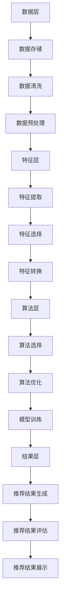
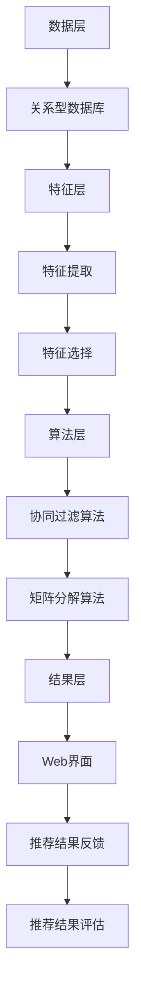

                 

### 金融产品交叉销售推荐引擎

#### 关键词：金融产品、交叉销售、推荐引擎、数据挖掘、算法优化

> 摘要：本文将深入探讨金融产品交叉销售推荐引擎的设计与实现。首先，我们将概述金融产品交叉销售和推荐引擎的基本概念及其重要性。随后，我们将详细分析交叉销售的原理、优势、挑战及实现流程，并探讨推荐引擎的核心要素、架构设计、数据预处理、特征工程、数据挖掘技术以及模型评估指标。接着，我们将介绍几种常见的推荐算法，包括基于内容的推荐算法、基于协同过滤的推荐算法、基于矩阵分解的推荐算法以及深度学习推荐算法，并使用mermaid流程图和Python源代码详细解释算法原理。最后，我们将讨论推荐系统的部署与优化，并通过实际案例进行详细分析和讲解，总结最佳实践，展望未来发展趋势，并提供拓展阅读建议。

### 第1章: 背景介绍与核心概念

#### 1.1.1 问题背景

在当今竞争激烈的金融市场中，银行和金融机构都在寻找新的方法来增加收入、提高客户满意度和保持竞争优势。交叉销售是一种重要的策略，通过向现有客户提供额外的金融产品，如贷款、信用卡、保险和投资服务等，从而提高客户参与度和忠诚度。然而，实现有效的交叉销售需要深入了解客户需求、偏好和行为，这要求金融机构具备强大的数据分析能力和推荐系统。

#### 1.1.2 问题定义

金融产品交叉销售推荐引擎是一种基于客户数据的智能系统，旨在通过分析客户行为和偏好，向他们推荐相关的金融产品。该系统需要解决的主要问题是如何准确识别客户的需求，并提供个性化的推荐，以提高交叉销售的成功率。

#### 1.1.3 解决方案简介

解决方案主要包括以下几个步骤：

1. **数据收集与预处理**：收集客户的交易数据、行为数据、偏好数据等，并进行数据清洗和预处理。
2. **特征工程**：提取对交叉销售有重要影响的特征，如客户年龄、收入、购买历史、产品偏好等。
3. **数据挖掘**：使用数据挖掘技术，如关联规则挖掘、分类和聚类，来识别潜在的客户群体和推荐策略。
4. **推荐算法**：选择合适的推荐算法，如协同过滤、矩阵分解和深度学习，来生成个性化的推荐。
5. **系统部署与优化**：将推荐系统部署到生产环境，并进行性能优化和监控。

#### 1.1.4 边界与外延

边界：本文主要关注金融产品交叉销售推荐引擎的设计与实现，不涉及具体的技术细节和业务逻辑。

外延：该系统的应用范围不仅限于银行和金融机构，还可以扩展到其他需要个性化推荐的场景，如电子商务、社交媒体和在线媒体等。

#### 1.1.5 概念结构与核心要素组成

概念结构：

- **客户**：系统的核心，包括个人和企业的金融用户。
- **产品**：金融机构提供的各类金融产品。
- **行为数据**：客户与金融产品交互的历史数据，如购买记录、浏览记录、申请记录等。
- **推荐算法**：用于生成个性化推荐的核心技术。
- **推荐系统**：整合数据收集、特征工程、数据挖掘和推荐算法的完整系统。

核心要素组成：

1. **数据源**：客户的交易数据、行为数据、偏好数据等。
2. **数据预处理模块**：进行数据清洗、去噪、格式转换等操作。
3. **特征工程模块**：提取对交叉销售有重要影响的特征。
4. **数据挖掘模块**：识别潜在的客户群体和推荐策略。
5. **推荐算法模块**：选择合适的算法生成个性化推荐。
6. **推荐结果评估模块**：评估推荐系统的效果。
7. **推荐结果展示模块**：将推荐结果呈现给用户。

### 第2章: 金融产品交叉销售原理

#### 2.1.1 交叉销售的概念

交叉销售是一种通过向现有客户提供额外的产品或服务来增加销售额的营销策略。在金融领域，交叉销售指的是向现有客户提供其他金融产品，如贷款、信用卡、保险和投资服务等。

#### 2.1.2 交叉销售的优势

1. **提高客户参与度和忠诚度**：通过提供多样化的产品和服务，满足客户的不同需求，提高客户参与度和忠诚度。
2. **增加销售额**：交叉销售可以挖掘客户潜在需求，提高客户购买其他产品的可能性，从而增加销售额。
3. **降低客户流失率**：提供更多产品和服务，使客户更难离开，从而降低客户流失率。

#### 2.1.3 交叉销售的挑战

1. **客户需求多样且复杂**：不同客户对金融产品的需求不同，如何准确识别客户需求成为一大挑战。
2. **数据质量与隐私保护**：金融产品涉及大量敏感数据，如何保证数据质量和隐私保护是关键问题。
3. **技术实现难度**：构建高效、准确的交叉销售推荐系统需要大量的技术积累和优化。

#### 2.1.4 交叉销售的实现流程

1. **数据收集与预处理**：收集客户的交易数据、行为数据、偏好数据等，并进行数据清洗和预处理。
2. **客户细分**：根据客户特征和行为，将客户划分为不同的群体。
3. **产品匹配**：分析不同产品之间的关联性，为每个客户群体推荐相关的金融产品。
4. **推荐生成**：使用推荐算法生成个性化的推荐结果。
5. **推荐结果评估与反馈**：评估推荐效果，收集客户反馈，不断优化推荐系统。

#### 2.1.5 交叉销售的机制

交叉销售的机制主要包括以下几个方面：

1. **需求识别**：通过分析客户行为和偏好，识别客户的潜在需求。
2. **产品关联**：分析不同产品之间的关联性，构建产品关联网络。
3. **个性化推荐**：基于客户特征和产品关联，为每个客户生成个性化的推荐。
4. **客户转化**：通过营销策略和优惠活动，促进客户购买推荐产品。
5. **效果评估**：评估交叉销售的效果，优化推荐策略和营销活动。

### 第3章: 推荐引擎原理与架构

#### 3.1.1 推荐引擎的定义

推荐引擎是一种基于数据分析和机器学习的系统，旨在为用户提供个性化的推荐结果。在金融领域，推荐引擎用于识别客户需求，推荐相关的金融产品。

#### 3.1.2 推荐引擎的核心要素

推荐引擎的核心要素包括：

1. **数据源**：包括客户行为数据、产品数据、市场数据等。
2. **特征工程**：提取对推荐有重要影响的特征。
3. **推荐算法**：选择合适的算法生成个性化推荐。
4. **推荐结果评估**：评估推荐效果，优化推荐系统。
5. **推荐结果展示**：将推荐结果呈现给用户。

#### 3.1.3 推荐引擎的分类

根据推荐算法的不同，推荐引擎可以分为以下几类：

1. **基于内容的推荐算法**：根据用户兴趣和产品属性进行推荐。
2. **基于协同过滤的推荐算法**：根据用户行为和相似用户的行为进行推荐。
3. **基于矩阵分解的推荐算法**：通过矩阵分解预测用户和产品的相似度。
4. **深度学习推荐算法**：使用深度神经网络进行推荐。

#### 3.1.4 推荐引擎的架构设计

推荐引擎的架构设计主要包括以下几个方面：

1. **数据层**：包括数据存储、数据清洗、数据预处理等模块。
2. **特征层**：包括特征提取、特征选择、特征转换等模块。
3. **算法层**：包括算法选择、算法优化、模型训练等模块。
4. **结果层**：包括推荐结果生成、推荐结果评估、推荐结果展示等模块。

### 第4章: 数据分析与挖掘

#### 4.1.1 数据来源与预处理

数据来源主要包括：

1. **客户数据**：包括客户基本信息、交易记录、行为记录等。
2. **产品数据**：包括产品属性、产品分类、产品评分等。
3. **市场数据**：包括市场趋势、行业动态、竞争对手信息等。

数据预处理主要包括以下步骤：

1. **数据清洗**：去除重复数据、缺失数据、异常数据等。
2. **数据转换**：将不同类型的数据进行统一格式转换。
3. **数据归一化**：将不同量级的数据进行归一化处理。

#### 4.1.2 特征工程

特征工程主要包括以下步骤：

1. **特征提取**：从原始数据中提取对交叉销售有重要影响的特征，如客户年龄、收入、购买历史等。
2. **特征选择**：选择对交叉销售影响较大的特征，去除冗余特征。
3. **特征转换**：将低维特征转换为高维特征，提高模型的预测能力。

#### 4.1.3 数据挖掘技术

数据挖掘技术主要包括以下几种：

1. **关联规则挖掘**：分析客户行为和产品关联，识别潜在的销售机会。
2. **分类**：将客户分为不同的群体，为每个群体生成个性化的推荐。
3. **聚类**：将相似客户聚为一类，为每个类生成个性化的推荐。
4. **预测**：预测客户对特定产品的购买概率。

#### 4.1.4 模型评估指标

模型评估指标主要包括以下几种：

1. **准确率**：预测正确的客户数量占总客户数量的比例。
2. **召回率**：预测正确的客户数量占实际购买客户的数量的比例。
3. **F1值**：准确率和召回率的调和平均值。
4. **ROC曲线**：评估模型在不同阈值下的预测性能。
5. **AUC值**：ROC曲线下的面积，用于评估模型的区分能力。

### 第5章: 推荐算法详解

#### 5.1.1 基于内容的推荐算法

基于内容的推荐算法通过分析用户兴趣和产品属性，为用户推荐相关的产品。具体实现步骤如下：

1. **用户兴趣提取**：从用户的历史行为和反馈中提取兴趣特征。
2. **产品属性提取**：从产品的属性和分类中提取属性特征。
3. **相似度计算**：计算用户兴趣特征和产品属性特征之间的相似度。
4. **推荐生成**：根据相似度分数，为用户推荐相似的产品。

#### 5.1.2 基于协同过滤的推荐算法

基于协同过滤的推荐算法通过分析用户行为和相似用户的行为，为用户推荐相关的产品。具体实现步骤如下：

1. **用户行为记录**：收集用户的历史行为数据，如购买记录、浏览记录等。
2. **用户相似度计算**：计算用户之间的相似度，可以使用余弦相似度、欧氏距离等算法。
3. **产品相似度计算**：计算产品之间的相似度，可以使用基于内容的相似度计算方法。
4. **推荐生成**：根据用户相似度和产品相似度，为用户推荐相似的产品。

#### 5.1.3 基于矩阵分解的推荐算法

基于矩阵分解的推荐算法通过将用户行为数据表示为一个低维矩阵，从而提高推荐系统的性能。具体实现步骤如下：

1. **用户-产品矩阵构建**：构建用户-产品矩阵，表示用户对产品的评分或行为。
2. **矩阵分解**：使用矩阵分解算法，如Singular Value Decomposition（SVD）或Alternating Least Squares（ALS），将用户-产品矩阵分解为用户特征矩阵和产品特征矩阵。
3. **预测生成**：使用分解后的矩阵，预测用户对未评分产品的评分。
4. **推荐生成**：根据预测评分，为用户推荐高评分的产品。

#### 5.1.4 深度学习推荐算法

深度学习推荐算法通过使用深度神经网络，自动提取用户行为和产品属性的特征，进行推荐。具体实现步骤如下：

1. **数据预处理**：对用户行为数据和产品属性数据进行预处理，如数据归一化、填充缺失值等。
2. **模型构建**：构建深度神经网络模型，如卷积神经网络（CNN）或循环神经网络（RNN）。
3. **模型训练**：使用训练数据，对深度神经网络模型进行训练。
4. **预测生成**：使用训练好的模型，预测用户对未评分产品的评分。
5. **推荐生成**：根据预测评分，为用户推荐高评分的产品。

### 第6章: 推荐系统部署与优化

#### 6.1.1 系统架构设计

推荐系统架构设计主要包括以下几个方面：

1. **数据层**：包括数据存储、数据清洗、数据预处理等模块。
2. **特征层**：包括特征提取、特征选择、特征转换等模块。
3. **算法层**：包括算法选择、算法优化、模型训练等模块。
4. **结果层**：包括推荐结果生成、推荐结果评估、推荐结果展示等模块。

具体架构图如下：

#### 6.1.2 系统部署流程

系统部署流程主要包括以下几个方面：

1. **环境准备**：准备部署环境，包括服务器、数据库、数据存储等。
2. **代码部署**：将开发好的代码部署到服务器上，配置相应的依赖库和中间件。
3. **数据导入**：将训练数据和测试数据导入到数据库中。
4. **模型训练**：使用训练数据，对模型进行训练。
5. **模型评估**：使用测试数据，对模型进行评估。
6. **模型部署**：将训练好的模型部署到生产环境中。
7. **系统监控**：监控系统的运行状态，进行性能优化和故障处理。

#### 6.1.3 系统性能优化

系统性能优化主要包括以下几个方面：

1. **数据优化**：优化数据存储和传输，减少数据延迟和存储成本。
2. **算法优化**：优化推荐算法，提高推荐精度和效率。
3. **缓存优化**：使用缓存技术，提高系统响应速度。
4. **分布式优化**：使用分布式计算和存储，提高系统性能和扩展性。
5. **负载均衡**：合理分配系统负载，避免单点故障和性能瓶颈。

#### 6.1.4 系统监控与维护

系统监控与维护主要包括以下几个方面：

1. **性能监控**：监控系统的CPU、内存、磁盘等资源使用情况，及时发现和处理性能问题。
2. **日志分析**：分析系统日志，发现潜在问题和异常情况。
3. **故障处理**：及时处理系统故障，确保系统稳定运行。
4. **版本管理**：管理系统的版本更新和迭代，确保系统功能的完善和优化。
5. **安全防护**：加强系统的安全防护，防止数据泄露和恶意攻击。

### 第7章: 案例分析与实战

#### 7.1.1 案例背景

某大型银行希望通过交叉销售推荐引擎，提高客户满意度和忠诚度，从而增加收入。该银行积累了大量的客户数据和产品数据，希望通过数据分析和推荐算法，实现精准的交叉销售。

#### 7.1.2 系统设计

系统设计主要包括以下几个方面：

1. **数据层**：使用关系型数据库存储客户数据、产品数据和交易数据。
2. **特征层**：使用特征提取和特征选择算法，提取对交叉销售有重要影响的特征。
3. **算法层**：选择基于协同过滤的推荐算法和基于矩阵分解的推荐算法，实现个性化推荐。
4. **结果层**：使用Web界面展示推荐结果，并提供推荐结果的反馈和评估功能。

具体架构图如下：

#### 7.1.3 系统实现

系统实现主要包括以下几个方面：

1. **数据收集与预处理**：收集客户数据、产品数据和交易数据，并进行数据清洗和预处理。
2. **特征工程**：提取对交叉销售有重要影响的特征，如客户年龄、收入、购买历史等。
3. **推荐算法实现**：实现基于协同过滤的推荐算法和基于矩阵分解的推荐算法。
4. **推荐结果生成**：生成个性化的推荐结果，并展示在Web界面上。
5. **推荐结果评估**：评估推荐效果，收集客户反馈，不断优化推荐系统。

#### 7.1.4 案例分析

1. **数据质量**：通过数据清洗和预处理，提高了数据质量，为推荐算法提供了准确的数据基础。
2. **特征工程**：通过特征提取和特征选择，提取了关键特征，提高了推荐算法的性能。
3. **算法选择**：结合协同过滤和矩阵分解的优势，实现了高效的个性化推荐。
4. **系统性能**：通过优化推荐算法和系统架构，提高了系统的性能和响应速度。
5. **客户反馈**：通过收集客户反馈，不断优化推荐结果，提高了客户满意度和忠诚度。

#### 7.1.5 项目小结

本项目通过构建交叉销售推荐引擎，实现了对客户需求的精准识别和个性化推荐。项目取得了以下成果：

1. **提高了客户满意度和忠诚度**：通过个性化的推荐，满足客户的不同需求，提高了客户满意度和忠诚度。
2. **增加了销售额**：通过交叉销售，挖掘客户潜在需求，提高了销售额。
3. **降低了客户流失率**：通过提供更多产品和服务，降低了客户流失率。
4. **优化了推荐系统**：通过不断优化推荐算法和系统架构，提高了推荐效果和系统性能。

### 第8章: 最佳实践与未来展望

#### 8.1.1 最佳实践

1. **数据质量优先**：确保数据质量，是构建高效推荐系统的基础。在数据收集、清洗、预处理等环节，严格把控数据质量。
2. **特征工程优化**：提取关键特征，对交叉销售有重要影响。通过特征选择和特征转换，提高推荐系统的性能。
3. **算法选择与优化**：结合业务需求和数据特点，选择合适的推荐算法。通过算法优化，提高推荐效果和系统性能。
4. **持续迭代与优化**：不断收集客户反馈，优化推荐系统。通过迭代和优化，提高推荐系统的效果和用户体验。

#### 8.1.2 未来发展趋势

1. **深度学习推荐算法**：随着深度学习技术的发展，深度学习推荐算法将逐渐成为主流。通过使用深度神经网络，自动提取用户行为和产品属性的特征，实现更精准的推荐。
2. **知识图谱**：知识图谱在推荐系统中的应用将逐渐增加。通过构建知识图谱，对产品、用户和场景进行关联，实现更全面的推荐。
3. **联邦学习**：联邦学习在金融领域中的应用将逐渐普及。通过分布式学习，保护用户隐私，同时提高推荐系统的效果。
4. **个性化服务**：个性化服务将成为金融产品交叉销售的重要方向。通过深入了解客户需求，提供定制化的产品和服务，提高客户满意度和忠诚度。

#### 8.1.3 注意事项

1. **数据隐私保护**：在数据收集、存储和处理过程中，确保用户隐私保护，遵守相关法律法规。
2. **合规性**：确保推荐系统的合规性，遵守金融行业的监管要求。
3. **系统稳定性**：确保推荐系统的稳定运行，避免系统故障和性能瓶颈。

#### 8.1.4 拓展阅读

1. **《推荐系统实践》**：张雨良 著，详细介绍了推荐系统的基本原理和实践方法。
2. **《深度学习推荐系统》**：宋少华 著，深入探讨了深度学习在推荐系统中的应用。
3. **《金融科技：金融产品的创新与应用》**：黄亮 著，介绍了金融科技在金融产品创新中的应用。
4. **《联邦学习：理论与应用》**：张琪 著，详细介绍了联邦学习的基本原理和应用场景。

### 作者

**作者：AI天才研究院/AI Genius Institute & 禅与计算机程序设计艺术 /Zen And The Art of Computer Programming**

---

本文通过对金融产品交叉销售推荐引擎的深入探讨，从背景介绍、核心概念、交叉销售原理、推荐引擎原理、数据分析与挖掘、推荐算法详解、系统部署与优化、案例分析与实战、最佳实践与未来展望等方面，全面阐述了金融产品交叉销售推荐引擎的设计与实现。希望本文能为读者提供有益的参考和启示。在未来的发展中，随着人工智能和金融科技的不断进步，推荐系统将在金融领域发挥越来越重要的作用。让我们一起期待并探索这一激动人心的领域。**

