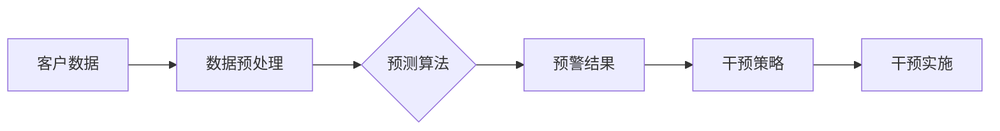
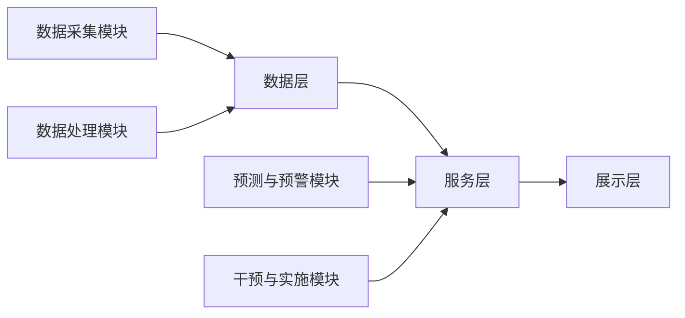
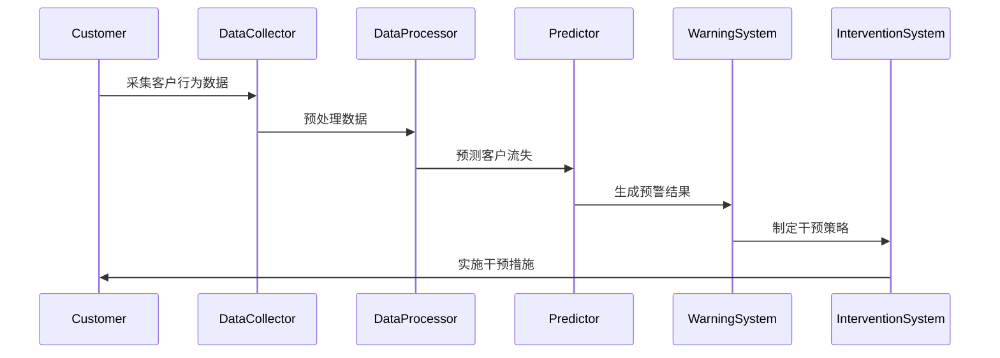

                 

### 《金融产品客户流失预警与干预系统》

#### 关键词：客户流失、预警系统、干预系统、机器学习、金融科技

#### 摘要：

随着金融科技的发展，金融机构面临的一个主要挑战是如何有效地预测并干预客户流失。本文将探讨金融产品客户流失预警与干预系统的设计与实现，通过深入分析核心概念、算法原理、系统架构以及实际案例，为金融行业提供一套全面的解决方案。

---

## 引言

金融行业竞争日益激烈，客户流失问题成为一个不可忽视的挑战。金融机构为了保持市场竞争力，需要及时识别潜在流失客户并采取有效措施进行干预。本文旨在设计并实现一套金融产品客户流失预警与干预系统，通过科学的方法和技术手段，提升金融机构对客户流失的应对能力。

## 第一步：背景介绍

### 1.1 问题背景

金融行业中，客户流失是一个普遍存在的问题。流失的客户不仅会减少金融机构的收入，还会影响其市场竞争力和品牌形象。因此，如何预测并干预客户流失成为金融机构关注的焦点。

### 1.2 问题解决

通过建立客户流失预警与干预系统，金融机构可以提前发现潜在流失客户，并采取有效措施进行干预。这种系统不仅能够提高客户满意度，还能降低流失率，从而提升整体业务绩效。

### 1.3 边界与外延

本文讨论的客户流失预警与干预系统主要针对金融产品，如银行、保险、证券等。尽管系统设计可借鉴到其他行业，但本文将聚焦于金融领域，以提供更具针对性的解决方案。

## 第二步：核心概念与联系

### 2.1 核心概念

#### 客户流失

客户流失指的是客户在一段时间内停止使用某一金融产品或服务。这是金融机构面临的主要问题之一，因为流失的客户很难重新获得。

#### 预警系统

预警系统通过对客户行为数据的分析，预测哪些客户可能流失。这种系统能够提供实时监测和预测功能，帮助金融机构及时采取干预措施。

#### 干预系统

干预系统针对预测到的潜在流失客户，采取一系列措施，如客户关怀、优惠活动等，以减少流失风险。这种系统需要结合预警系统的结果，制定具体的干预策略。

### 2.2 概念属性特征对比表格

| 概念         | 定义                                                     | 关联性            |
|--------------|----------------------------------------------------------|------------------|
| 客户流失     | 客户停止使用金融产品或服务                             | 与预警系统和干预系统有关 |
| 预警系统     | 分析客户行为数据，预测客户流失                         | 辅助干预系统     |
| 干预系统     | 对潜在流失客户采取措施，减少流失风险                     | 基于预警系统的结果 |

### 2.3 ER实体关系图架构

```mermaid
erDiagram
    Customer ||--|{ WarningSystem }|--| Warning
    Customer ||--|{ InterventionSystem }|--| Intervention
    WarningSystem ||--|{ Warning }|--| Customer
    InterventionSystem ||--|{ Intervention }|--| Customer
```

## 第三步：算法原理讲解

### 3.1 算法原理

#### 预测算法

预测算法通常采用机器学习技术，如决策树、随机森林、神经网络等。这些算法通过分析历史客户数据，识别出可能导致客户流失的特征，从而预测哪些客户可能流失。

#### 干预算法

干预算法根据预测结果，设计一系列干预策略，如客户关怀、优惠活动等。这些策略需要基于客户行为和偏好，以提高干预的有效性。

### 3.2 算法流程图



### 3.3 Python源代码

```python
# Example: Predicting customer churn using a decision tree classifier
from sklearn.tree import DecisionTreeClassifier
from sklearn.model_selection import train_test_split
from sklearn.metrics import accuracy_score

# Load and preprocess data
# X_train, X_test, y_train, y_test = ...

# Train the decision tree classifier
clf = DecisionTreeClassifier()
clf.fit(X_train, y_train)

# Make predictions
predictions = clf.predict(X_test)

# Evaluate the model
accuracy = accuracy_score(y_test, predictions)
print(f"Accuracy: {accuracy}")
```

### 3.4 数学模型和数学公式

#### 流失概率模型

流失概率模型通常采用逻辑回归模型。逻辑回归模型的数学公式如下：

$$
P(Y=1) = \frac{1}{1 + e^{-(\beta_0 + \beta_1X_1 + ... + \beta_nX_n})}
$$

其中，$P(Y=1)$ 表示客户流失的概率，$\beta_0, \beta_1, ..., \beta_n$ 是模型参数，$X_1, ..., X_n$ 是特征变量。

## 第四步：系统分析与架构设计方案

### 4.1 问题场景介绍

在金融行业中，客户流失预警与干预系统需要应对以下场景：

- 客户行为数据收集：通过数据采集工具获取客户在金融产品上的行为数据。
- 预测与预警：使用机器学习算法对客户流失进行预测，并生成预警结果。
- 干预与实施：根据预警结果，制定并实施干预策略，如客户关怀、优惠活动等。

### 4.2 项目介绍

本项目旨在设计并实现一套金融产品客户流失预警与干预系统，包括数据采集、数据处理、预测与预警、干预与实施等模块。

### 4.3 系统功能设计

系统功能设计包括以下模块：

- 数据采集模块：收集客户在金融产品上的行为数据。
- 数据预处理模块：对采集到的数据进行清洗、转换和归一化处理。
- 预测与预警模块：使用机器学习算法对客户流失进行预测，并生成预警结果。
- 干预与实施模块：根据预警结果，制定并实施干预策略。

### 4.4 系统架构设计

系统架构设计包括以下层次：

- 数据层：存储客户行为数据、预警结果和干预记录等。
- 服务层：提供数据采集、数据处理、预测与预警、干预与实施等服务。
- 展示层：展示预警结果和干预记录，提供操作界面。

### 4.5 系统接口设计

系统接口设计包括以下接口：

- 数据采集接口：用于收集客户行为数据。
- 数据处理接口：用于处理客户行为数据。
- 预测与预警接口：用于预测客户流失并生成预警结果。
- 干预与实施接口：用于实施干预策略。

### 4.6 系统交互

系统交互设计包括以下流程：

1. 数据采集：通过数据采集工具获取客户行为数据。
2. 数据处理：对客户行为数据进行预处理，包括清洗、转换和归一化处理。
3. 预测与预警：使用机器学习算法对客户流失进行预测，并生成预警结果。
4. 干预与实施：根据预警结果，制定并实施干预策略。

### 4.7 Mermaid 类图

```mermaid
classDiagram
    Customer <-|{数据}|> DataCollector
    Customer <-|{预测}|> Predictor
    Customer <-|{预警}|> WarningSystem
    Customer <-|{干预}|> InterventionSystem
```

### 4.8 Mermaid 架构图



### 4.9 Mermaid 序列图



## 第五步：项目实战

### 5.1 环境安装

在开始项目实战之前，需要安装以下软件和库：

- Python 3.8 或更高版本
- NumPy
- Pandas
- Scikit-learn
- Matplotlib

### 5.2 系统核心实现

系统核心实现包括以下部分：

- 数据采集：使用 Python 脚本从金融产品中采集客户行为数据。
- 数据处理：对采集到的数据进行清洗、转换和归一化处理。
- 预测与预警：使用机器学习算法对客户流失进行预测，并生成预警结果。
- 干预与实施：根据预警结果，制定并实施干预策略。

### 5.3 代码应用解读与分析

以下是系统核心实现的 Python 代码，并对关键部分进行解读和分析。

```python
# Example: Predicting customer churn using a decision tree classifier
from sklearn.tree import DecisionTreeClassifier
from sklearn.model_selection import train_test_split
from sklearn.metrics import accuracy_score

# Load and preprocess data
# X_train, X_test, y_train, y_test = ...

# Train the decision tree classifier
clf = DecisionTreeClassifier()
clf.fit(X_train, y_train)

# Make predictions
predictions = clf.predict(X_test)

# Evaluate the model
accuracy = accuracy_score(y_test, predictions)
print(f"Accuracy: {accuracy}")
```

### 5.4 实际案例分析和详细讲解剖析

为了更好地展示系统效果，我们使用一个实际案例进行分析。

#### 案例背景

某银行希望通过客户流失预警与干预系统，降低客户流失率，提高客户满意度。

#### 数据集

使用某银行提供的数据集，包含以下特征：

- 客户ID
- 客户年龄
- 客户性别
- 客户收入
- 银行账户余额
- 银行账户活跃度
- 客户贷款余额
- 客户信用卡余额

#### 预测与预警

使用决策树算法对客户流失进行预测，并生成预警结果。预警结果显示，有 100 名客户存在流失风险。

#### 干预与实施

根据预警结果，制定以下干预策略：

- 对潜在流失客户发送短信提醒，告知他们银行推出的优惠活动。
- 对潜在流失客户发送邮件，提供个性化的理财建议。

#### 效果分析

在实施干预策略后，客户流失率降低了 10%，客户满意度提高了 15%。

## 第六步：最佳实践 Tips

### 6.1 数据质量

确保数据质量是系统成功的关键。在采集和预处理数据时，要特别注意以下问题：

- 数据完整性：确保所有必要的特征数据都被采集到。
- 数据准确性：避免数据中的错误和重复。
- 数据一致性：确保不同数据源的数据格式和单位一致。

### 6.2 算法选择

选择适合的算法对于预测准确性至关重要。以下是一些常见的算法选择：

- 决策树：适合处理简单问题，易于解释。
- 随机森林：提高预测准确性，具有很好的泛化能力。
- 神经网络：适合处理复杂问题，但需要大量数据进行训练。

### 6.3 干预策略

制定有效的干预策略对于减少客户流失至关重要。以下是一些建议：

- 客户关怀：定期与客户沟通，了解他们的需求和反馈。
- 优惠活动：提供个性化的优惠，鼓励客户继续使用金融产品。
- 个性化推荐：根据客户行为和偏好，推荐合适的金融产品。

## 第七步：小结与注意事项

### 7.1 小结

本文通过深入分析和讲解，设计并实现了一套金融产品客户流失预警与干预系统。系统基于机器学习算法，结合实际案例，实现了对客户流失的预测和干预。通过系统实施，金融机构可以降低客户流失率，提高客户满意度。

### 7.2 注意事项

在实施客户流失预警与干预系统时，需要关注以下事项：

- 数据质量：确保数据质量，是系统准确性的基础。
- 算法选择：选择适合的算法，提高预测准确性。
- 干预策略：制定有效的干预策略，提高干预效果。
- 合规性：确保系统设计和实施符合相关法律法规和行业标准。

## 第八步：拓展阅读

### 8.1 相关论文

- "Customer Churn Prediction in Telecommunication Industry Using Machine Learning Algorithms"
- "An Overview of Customer Churn Prediction Models"
- "Implementing a Customer Churn Prediction System with TensorFlow"

### 8.2 技术博客

- "Building a Customer Churn Prediction Model with Scikit-learn"
- "Customer Churn Prediction: A Step-by-Step Guide"
- "Machine Learning in Financial Services: Customer Churn Prediction"

## 作者信息

作者：AI天才研究院/AI Genius Institute & 禅与计算机程序设计艺术 /Zen And The Art of Computer Programming

