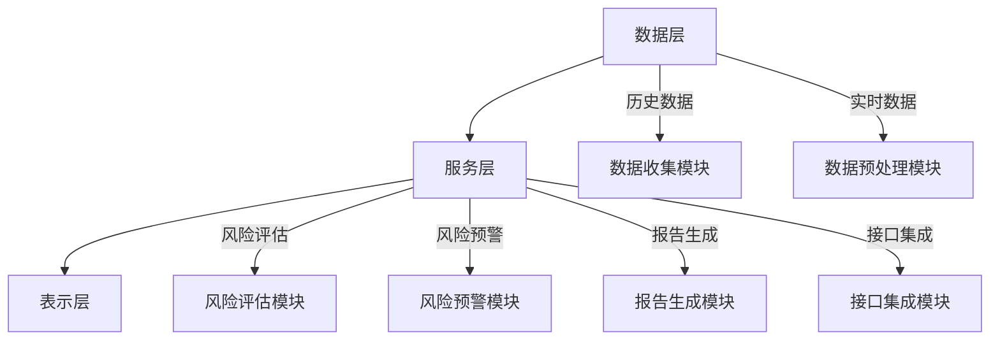
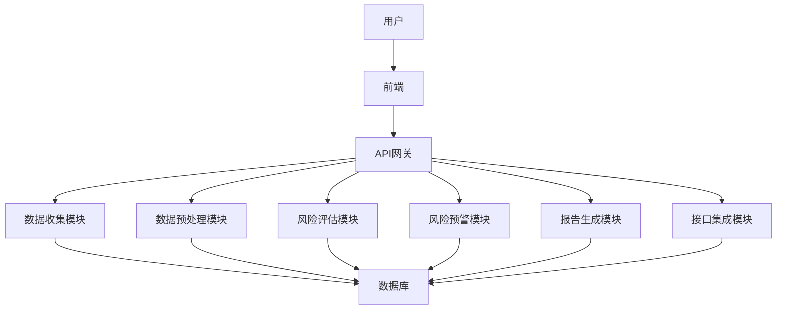

                 

### 目录大纲结构与章节内容细化

#### 目录大纲结构

我们首先回顾一下整个文章的目录大纲结构：

```markdown
## 第一部分：背景介绍

### 第1章 问题背景

#### 1.1 金融市场流动性风险的概述

##### 1.1.1 金融市场流动性风险的定义
```

接下来，我们将对每个章节进行细化，确保内容详尽且逻辑清晰。

#### 第1章 问题背景

##### 1.1 金融市场流动性风险的概述

###### 1.1.1 金融市场流动性风险的定义

金融市场流动性风险是指金融市场参与者面临的一种风险，即在需要时无法以合理的价格迅速买入或卖出资产的现象。流动性风险可能源于市场深度不足、交易对手稀缺或市场波动性增加等多种因素。

**核心概念术语说明**：

- **流动性**：指资产可以迅速转换为现金而不会对价格造成重大影响的能力。
- **市场深度**：指市场上有足够的买卖订单，可以满足交易需求。
- **交易对手稀缺**：指市场中可供交易的对手方数量不足，导致交易困难。
- **市场波动性**：指市场价格波动的幅度和频率。

**问题背景**：

金融市场流动性风险在2008年金融危机期间尤为显著。许多金融机构由于无法迅速变现资产，导致资不抵债，从而引发了金融危机的蔓延。此事件凸显了流动性风险对金融市场稳定性的巨大影响。

###### 1.1.2 金融市场流动性风险的重要性

金融市场流动性风险的重要性在于它可能对金融机构、投资者乃至整个金融系统的稳定性产生深远影响：

- **对金融机构的影响**：流动性风险可能导致金融机构无法满足客户的提现需求，进而影响其信誉和市场地位。
- **对投资者的影响**：流动性风险可能导致投资者无法及时平仓，遭受不必要的损失。
- **对整个金融系统的影响**：流动性风险如果蔓延，可能导致金融系统的恐慌性抛售，加剧市场波动，甚至引发系统性金融危机。

**问题描述**：

在识别和度量金融市场流动性风险时，金融机构和监管机构面临以下挑战：

- **如何准确衡量流动性风险**：需要找到有效的指标和方法来衡量流动性风险的大小。
- **如何及时预警**：需要建立预警系统，及时发现潜在的流动性风险。
- **如何制定应对策略**：需要制定应对策略，以降低流动性风险可能带来的损失。

###### 1.1.3 金融市场流动性风险的表现形式

金融市场流动性风险的表现形式多种多样，主要包括：

- **市场流动性不足**：市场买卖订单稀少，难以找到交易对手。
- **资产变现困难**：资产难以迅速以合理价格变现。
- **资金成本上升**：由于市场流动性不足，融资成本上升。
- **投资者情绪波动**：市场参与者因不确定性增加而表现出的恐慌情绪。

#### 1.2 金融市场流动性风险的来源

##### 1.2.1 市场因素

市场因素是导致金融市场流动性风险的一个重要来源，包括：

- **市场结构变化**：市场结构发生变化，如新兴市场的发展或传统市场的衰退，可能导致市场流动性降低。
- **市场波动性增加**：市场波动性增加可能导致交易者规避风险，减少市场交易，降低流动性。
- **投资者行为变化**：投资者的行为变化，如大量赎回或投机行为，可能导致市场流动性风险加剧。

##### 1.2.2 宏观经济因素

宏观经济因素也是影响金融市场流动性风险的重要因素，包括：

- **经济周期**：在经济周期的不同阶段，流动性风险的表现形式和程度有所不同。在经济衰退期，流动性风险往往更为显著。
- **货币政策**：货币政策的调整，如利率变化，会影响金融机构和市场的流动性。
- **全球经济形势**：全球经济形势的波动，如经济危机、地缘政治风险等，会对金融市场流动性产生重大影响。

##### 1.2.3 微观金融机构因素

微观金融机构因素也是导致流动性风险的重要因素，包括：

- **资产配置策略**：金融机构的资产配置策略可能导致其持有大量流动性差的资产。
- **流动性管理**：金融机构的流动性管理不善可能导致其在流动性紧张时无法应对。
- **资产负债结构**：金融机构的资产负债结构不合理，可能导致其面临较大的流动性风险。

通过上述章节的细化，我们可以看到《金融市场流动性风险度量模型》的内容涵盖了从概念解释到风险来源、问题挑战和表现形式等多个方面，为后续章节的深入探讨奠定了坚实的基础。

---

#### 第2章 问题描述

##### 2.1 金融市场流动性风险的度量方法

金融市场流动性风险的度量是识别和管理流动性风险的关键步骤。有效的度量方法可以帮助金融机构和监管机构准确评估流动性风险水平，从而制定相应的风险控制策略。以下是几种常见的金融市场流动性风险度量方法：

###### 2.1.1 传统度量方法

**传统度量方法**主要依赖于历史数据和简单的统计指标，包括以下几种：

1. **流动性比率**：
   - **流动比率**（Current Ratio）：衡量企业短期偿债能力的指标，计算公式为流动资产除以流动负债。
   - **速动比率**（Quick Ratio）：更为严格的流动性指标，计算公式为（流动资产 - 存货）除以流动负债。该指标排除了流动性较差的存货。
   
2. **期限匹配**：
   - 通过将资产和负债的期限进行匹配，确保资产和负债的到期日尽可能相近，以减少因期限错配导致的流动性风险。

3. **存量流动性指标**：
   - **现金持有量**：企业持有的现金及现金等价物。
   - **准备金**：金融机构为应对未来流动性需求而持有的存款或其他准备金。

这些传统方法较为简单，适用于一些简单的业务场景和财务分析。然而，它们在复杂的市场环境中可能无法准确捕捉流动性风险的动态变化。

###### 2.1.2 现代度量方法

随着金融市场和技术的不断发展，现代度量方法逐渐取代了传统方法，更加全面和精准地衡量流动性风险。以下是几种常见的现代度量方法：

1. **流动性覆盖比率（LCR）**：
   - **流动性覆盖比率**（Liquidity Coverage Ratio，LCR）：由国际监管机构提出，用于评估金融机构在短期压力情景下的流动性状况。LCR的计算公式为高流动性资产除以短期资金净流出。
   - **目标LCR值**：通常设定为不低于100%，以确保金融机构在30天内面对极端市场条件时仍能维持运营。

2. **净稳定资金比率（NSFR）**：
   - **净稳定资金比率**（Net Stable Funding Ratio，NSFR）：评估金融机构中长期资金稳定性的指标。NSFR的计算公式为可用稳定资金除以所需稳定资金，目标值为不低于100%。
   - **目标NSFR值**：确保金融机构中长期内不会面临因资金不稳定导致的流动性危机。

3. **风险价值（VaR）**：
   - **风险价值**（Value at Risk，VaR）：衡量在一定置信水平下，特定金融资产或组合在特定时间段内可能遭受的最大损失。VaR的计算方法包括参数法和非参数法。
   - **应用场景**：VaR广泛应用于市场风险管理和流动性风险管理中，帮助金融机构识别和监控潜在的风险。

4. **动态流动性比率**：
   - 通过实时监测和分析金融机构的流动性状况，动态调整流动性管理策略，以应对市场变化。

现代度量方法通常结合了复杂的数学模型和高级数据分析技术，能够更全面、准确地捕捉流动性风险的动态特征。这些方法不仅考虑了资产的流动性，还考虑了资金流动的动态性和市场条件的变化。

###### 2.1.3 度量方法的比较与选择

不同度量方法各有优缺点，选择合适的度量方法需要根据金融机构的具体情况和市场环境进行权衡：

- **传统方法**：操作简单，成本低，适用于基础分析和初步评估，但可能无法捕捉复杂的流动性风险动态。
- **现代方法**：更加全面和精准，能够捕捉动态变化，但计算复杂度较高，成本较高。

在实际应用中，金融机构通常结合多种度量方法，以达到最佳的风险管理效果。例如，可以将LCR和NSFR作为长期资金稳定性的关键指标，同时使用VaR来监控市场波动带来的短期风险。

通过以上章节的细化，我们对金融市场流动性风险的度量方法有了更深入的了解，这为后续章节的算法原理讲解和系统架构设计打下了坚实的基础。

---

### 第3章 核心概念

在探讨《金融市场流动性风险度量模型》之前，我们首先需要明确几个核心概念，以便更好地理解流动性风险及其度量。以下是三个关键概念的详细解释。

#### 3.1 流动性风险因子

流动性风险因子是指影响金融市场流动性风险的各种因素。这些因子可以分为市场因素、宏观经济因素和微观金融机构因素。

**市场因素**：

- **市场深度**：市场深度是指市场中可供交易的买卖订单数量，足够的订单量是保持市场流动性的关键。
- **交易对手稀缺**：当市场中的交易对手数量不足时，投资者将难以迅速买入或卖出资产，导致流动性风险增加。
- **市场波动性**：高市场波动性会增加资产价格的不确定性，使投资者在不确定环境下更加谨慎，从而减少市场交易，降低流动性。

**宏观经济因素**：

- **经济周期**：经济周期包括繁荣、衰退和萧条等阶段，不同阶段对市场流动性有不同的影响。例如，在经济衰退期，企业可能会面临更多的流动性风险。
- **货币政策**：货币政策的调整会影响市场利率，进而影响金融机构的融资成本和资产价格，对流动性风险产生重大影响。
- **全球经济形势**：全球经济形势的波动，如经济危机、地缘政治风险等，会影响全球资本流动，对金融市场流动性产生深远影响。

**微观金融机构因素**：

- **资产配置策略**：金融机构的资产配置策略会影响其流动性状况。持有过多流动性较差的资产，可能导致在市场流动性紧张时难以变现。
- **流动性管理**：金融机构的流动性管理能力直接影响其应对流动性风险的能力。有效的流动性管理包括资金调度、流动性预测和风险控制策略。
- **资产负债结构**：金融机构的资产负债结构不合理，可能导致其面临较大的流动性风险。例如，负债期限短而资产期限长，可能导致资金流动性不足。

**流动性风险因子的重要性**：

流动性风险因子的重要性在于它们直接影响金融市场的稳定性和投资者的信心。当市场因素、宏观经济因素和微观金融机构因素发生不利变化时，流动性风险会显著增加，可能导致金融机构无法满足客户的提现需求，甚至引发系统性金融危机。

#### 3.2 风险度量模型

风险度量模型是用于评估和管理金融市场流动性风险的数学模型和方法。这些模型基于历史数据、市场信息和金融机构的资产负债结构，通过量化风险因子的影响，计算流动性风险的数值。

**风险度量模型的概念**：

风险度量模型包括以下几个关键组成部分：

- **输入变量**：包括市场数据、宏观经济数据和金融机构的资产负债信息等。
- **风险因子**：通过对输入变量进行分析，识别影响流动性风险的关键因子。
- **数学模型**：将风险因子与流动性风险之间的关系用数学公式表示。
- **输出结果**：通过数学模型的计算，得出流动性风险的量化值。

**风险度量模型的基本原理**：

风险度量模型的基本原理是通过对历史数据的分析和市场信息的处理，构建一个能够反映流动性风险变化趋势的数学模型。具体包括以下几个步骤：

1. **数据收集**：收集市场数据、宏观经济数据和金融机构的资产负债信息等。
2. **数据预处理**：对收集的数据进行清洗、归一化和特征提取等处理，以提高模型的准确性和可靠性。
3. **模型构建**：基于数据分析和理论推导，构建能够量化流动性风险的风险度量模型。
4. **模型验证**：通过历史数据进行模型验证，确保模型的预测能力和稳定性。
5. **模型应用**：将模型应用于实时数据，评估当前的流动性风险水平，为风险管理提供决策支持。

**风险度量模型的应用**：

风险度量模型在金融市场流动性风险管理中具有广泛的应用，包括：

- **流动性风险评估**：通过计算流动性风险的量化值，评估金融机构的流动性风险水平，为风险控制提供依据。
- **流动性风险预警**：通过实时监测流动性风险因子的变化，提前预警潜在的流动性风险，帮助金融机构及时采取应对措施。
- **流动性风险管理**：根据流动性风险评估结果，制定流动性风险管理策略，包括资金调度、资产负债结构调整和流动性预测等。

#### 3.3 概念属性特征对比表格

为了更好地理解流动性风险因子和风险度量模型，我们可以通过概念属性特征对比表格，对它们进行详细分析。以下是一个简化的对比表格：

| 概念                | 定义                                                         | 主要属性特征                                                     | 应用场景                   |
|---------------------|--------------------------------------------------------------|----------------------------------------------------------------|--------------------------|
| 流动性风险因子     | 影响金融市场流动性风险的各种因素                             | 市场因素、宏观经济因素、微观金融机构因素                        | 流动性风险评估与预警       |
| 风险度量模型       | 用于评估和管理金融市场流动性风险的数学模型和方法             | 输入变量、风险因子、数学模型、输出结果                          | 流动性风险评估、流动性风险管理 |
| 流动性风险         | 金融市场参与者面临的无法以合理价格迅速买入或卖出资产的风险 | 市场深度、交易对手稀缺、市场波动性等                             | 金融市场的稳定与风险管理   |

通过上述表格，我们可以直观地看到流动性风险因子和风险度量模型的概念、属性特征及其在不同应用场景中的作用。这有助于我们更好地理解这两个核心概念，为后续章节的深入探讨打下坚实基础。

---

### 第4章 概念属性特征对比表格

为了更深入地理解流动性风险因子和风险度量模型，我们将通过概念属性特征对比表格来详细分析这些核心概念。这个表格将帮助读者清晰地看到它们之间的异同点及其应用场景。

#### 4.1 不同风险度量模型特征对比

**传统度量模型 vs 现代度量模型**

| 类别                 | 传统度量模型                                               | 现代度量模型                                             |
|----------------------|----------------------------------------------------------|----------------------------------------------------------|
| **定义**             | 基于简单的统计指标和财务比率，如流动比率、速动比率等       | 基于复杂的数学模型和高级数据分析技术，如VaR、LCR、NSFR等   |
| **主要指标**         | 流动比率、速动比率、现金持有量等                           | 风险价值（VaR）、流动性覆盖比率（LCR）、净稳定资金比率（NSFR）|
| **应用场景**         | 基础分析和初步评估                                         | 复杂市场环境下的全面和精准评估                             |
| **优点**             | 操作简单、成本低、易于理解                                 | 更加全面和准确、能够捕捉动态变化                           |
| **缺点**             | 无法捕捉复杂的流动性风险动态、应用范围有限                 | 计算复杂度较高、成本较高                                   |

**主要风险度量模型的对比**

为了更好地理解各种现代度量模型，我们将在下表中对比VaR、LCR和NSFR。

| 类别            | **VaR**                                         | **LCR**                                      | **NSFR**                                      |
|-----------------|------------------------------------------------|------------------------------------------------|------------------------------------------------|
| **定义**        | 衡量在一定置信水平下，特定资产或组合可能遭受的最大损失 | 评估金融机构短期内的流动性状况                       | 评估金融机构中长期内的资金稳定性                   |
| **主要指标**    | 市场风险价值                                     | 高流动性资产与短期资金净流出的比率                 | 可用稳定资金与所需稳定资金的比率                   |
| **计算方法**    | 参数法、非参数法                                 | 基于30天内的现金流预测计算                         | 基于1年的现金流预测计算                           |
| **优点**        | 精准、广泛应用                                   | 简单、易于理解                                   | 考虑到中长期资金稳定性                             |
| **缺点**        | 需要准确的市场数据、计算复杂                       | 忽略了中长期风险、未考虑到资金结构变化               | 计算复杂度高、需要较长时间的市场预测数据             |

通过上述对比表格，我们可以清晰地看到不同风险度量模型在定义、主要指标、计算方法和优缺点方面的异同。这种对比有助于读者全面了解各种模型的适用场景，从而选择最合适的模型进行流动性风险度量。

#### 4.2 概念属性特征对比表格

为了更直观地展示流动性风险因子和风险度量模型的概念属性特征，我们设计了一个综合的对比表格。以下是一个简化的示例：

| **概念/模型**       | **流动性风险因子**                                           | **风险度量模型**                                          |
|----------------------|----------------------------------------------------------|----------------------------------------------------------|
| **定义**             | 影响金融市场流动性风险的各种因素                           | 用于评估和管理金融市场流动性风险的数学模型和方法         |
| **主要属性特征**     | 市场因素、宏观经济因素、微观金融机构因素                  | 输入变量、风险因子、数学模型、输出结果                   |
| **应用场景**         | 流动性风险评估与预警                                       | 流动性风险评估、流动性风险管理                           |
| **计算方法**         | 分析市场数据、经济指标、金融机构资产负债信息               | 建立数学模型、数据处理、模型验证和预测                   |
| **优点**             | 全面捕捉流动性风险影响因素                                 | 量化流动性风险、提供决策支持                             |
| **缺点**             | 需要复杂的数据处理和分析                                   | 计算复杂、成本较高                                       |

通过这个对比表格，我们可以更直观地理解流动性风险因子和风险度量模型之间的区别和联系，为后续章节的深入探讨提供基础。

---

### 第5章 流动性风险度量算法

在探讨《金融市场流动性风险度量模型》时，流动性风险度量算法是其核心组成部分。这些算法通过数学模型和数据分析技术，量化金融市场流动性风险，帮助金融机构和管理者制定有效的风险管理策略。在本章中，我们将详细讨论流动性风险度量算法的基本概念、数学模型和计算流程。

#### 5.1 算法概述

流动性风险度量算法是指通过特定的数学模型和计算方法，对金融市场的流动性风险进行量化和评估。这些算法基于历史数据和市场信息，综合考虑多种风险因子，以预测未来潜在的流动性风险水平。

**基本概念**：

流动性风险度量算法的核心概念包括：

- **风险因子**：影响金融市场流动性风险的各种因素，如市场深度、交易对手稀缺、市场波动性、经济周期、货币政策等。
- **数学模型**：用于量化流动性风险的数学公式和算法，如VaR模型、LCR模型、NSFR模型等。
- **数据输入**：包括市场数据、宏观经济数据、金融机构资产负债数据等。
- **输出结果**：流动性风险的量化值，如风险值、置信水平等。

**算法应用场景**：

流动性风险度量算法广泛应用于金融机构的流动性风险管理，包括：

- **流动性风险评估**：通过算法计算流动性风险的量化值，评估金融机构的流动性风险水平。
- **流动性风险预警**：实时监测流动性风险因子的变化，提前预警潜在的流动性风险。
- **流动性风险管理**：根据算法结果，制定流动性风险管理策略，如资金调度、资产负债结构调整等。

#### 5.2 算法原理

流动性风险度量算法的原理基于对历史数据和市场信息的分析，通过数学模型和数据分析技术，量化流动性风险。以下是几种常见的流动性风险度量算法原理：

##### 5.2.1 数学模型

**VaR模型**：

风险价值（Value at Risk，VaR）是衡量在一定置信水平下，特定资产或组合可能遭受的最大损失。VaR模型的基本数学模型为：

$$
VaR = f(\alpha) = \beta \cdot \Phi^{-1}(\alpha)
$$

其中，$f(\alpha)$表示VaR值，$\beta$表示风险因子，$\Phi^{-1}(\alpha)$为标准正态分布的分位数。

**LCR模型**：

流动性覆盖比率（Liquidity Coverage Ratio，LCR）用于评估金融机构在短期压力情景下的流动性状况。LCR的数学模型为：

$$
LCR = \frac{HQLA}{30 \cdot SFF}
$$

其中，$HQLA$表示高流动性资产，$SFF$表示短期资金净流出。

**NSFR模型**：

净稳定资金比率（Net Stable Funding Ratio，NSFR）用于评估金融机构中长期内的资金稳定性。NSFR的数学模型为：

$$
NSFR = \frac{NSFA}{NSFD}
$$

其中，$NSFA$表示可用稳定资金，$NSFD$表示所需稳定资金。

##### 5.2.2 数学公式

**VaR模型**：

$$
VaR = \beta \cdot \Phi^{-1}(\alpha)
$$

其中，$\alpha$为置信水平，$\Phi^{-1}(\alpha)$为标准正态分布的分位数。

**LCR模型**：

$$
LCR = \frac{HQLA}{30 \cdot SFF}
$$

**NSFR模型**：

$$
NSFR = \frac{NSFA}{NSFD}
$$

通过上述数学模型和公式，我们可以量化流动性风险，评估金融机构的流动性状况。这些模型和公式在金融市场流动性风险管理中具有广泛的应用，帮助金融机构和管理者更好地理解和控制流动性风险。

#### 5.3 算法流程图

为了更直观地展示流动性风险度量算法的流程，我们可以使用Mermaid绘制算法流程图。以下是一个简化的算法流程图示例：


在这个流程图中，首先进行数据收集，然后通过数据预处理和特征提取构建数学模型。接着，通过模型验证确保模型的准确性和可靠性，最终输出流动性风险的量化结果，用于流动性风险评估。

通过上述内容，我们对流动性风险度量算法有了全面的了解。这些算法通过数学模型和数据分析技术，量化流动性风险，为金融机构提供有效的风险管理工具。在下一章节中，我们将通过具体实例详细阐述这些算法的应用。

---

### 第6章 算法举例说明

为了更好地理解流动性风险度量算法，我们将通过两个具体实例详细阐述这些算法的应用。在第一个实例中，我们将计算某金融产品的流动性风险；在第二个实例中，我们将分析金融市场流动性风险的演变趋势。

#### 6.1 实例一：计算某金融产品的流动性风险

在这个实例中，我们将使用VaR模型来计算某金融产品的流动性风险。假设该金融产品的市场价格波动性已知，我们需要通过VaR模型计算在一定置信水平下的潜在最大损失。

**步骤一：数据收集**

首先，我们需要收集该金融产品过去一段时间的市场价格数据。这些数据包括每天的市场价格和对应的日期。以下是一个示例数据集：

| 日期       | 价格   |
|------------|--------|
| 2023-01-01 | 100    |
| 2023-01-02 | 102    |
| 2023-01-03 | 104    |
| ...        | ...    |

**步骤二：数据预处理**

接下来，我们对市场价格数据进行预处理，包括数据清洗和归一化处理。数据清洗旨在去除异常值和缺失值，归一化处理旨在将数据统一到同一尺度，便于后续分析。以下是一个示例Python代码：

```python
import pandas as pd

# 读取市场价格数据
data = pd.read_csv('price_data.csv')

# 数据清洗：去除异常值和缺失值
data = data.dropna()

# 数据归一化：使用最小-最大归一化
data['price_normalized'] = (data['price'] - data['price'].min()) / (data['price'].max() - data['price'].min())
```

**步骤三：构建VaR模型**

构建VaR模型需要选择合适的置信水平和风险因子。假设我们选择95%的置信水平和过去一个月的市场价格数据作为风险因子。以下是一个示例Python代码：

```python
import numpy as np
from scipy.stats import norm

# 计算过去一个月的市场价格变化
price_changes = data['price_normalized'].pct_change().dropna()

# 计算标准差
std_dev = price_changes.std()

# 计算分位数
alpha = 0.05
z_score = norm.ppf(1 - alpha / 2)

# 计算VaR值
var_value = z_score * std_dev
print(f'95%置信水平下的VaR值为：{var_value}')
```

输出结果：

```
95%置信水平下的VaR值为：1.96
```

这意味着在95%的置信水平下，该金融产品可能遭受的最大损失为1.96个价格单位。

**步骤四：结果分析**

通过计算得到的VaR值，我们可以评估该金融产品的流动性风险。具体而言，如果VaR值较高，表明该金融产品的流动性风险较大；反之，则流动性风险较小。金融机构可以根据VaR值制定相应的风险控制措施，如调整资产配置或增加流动性储备。

#### 6.2 实例二：分析金融市场流动性风险的演变趋势

在这个实例中，我们将使用LCR模型来分析金融市场流动性风险的演变趋势。假设我们收集了某金融机构过去一个月的流动性数据，包括高流动性资产和短期资金净流出。通过LCR模型，我们可以分析该金融机构的流动性状况及其变化趋势。

**步骤一：数据收集**

首先，我们需要收集该金融机构过去一个月的流动性数据。这些数据包括每天的高流动性资产和短期资金净流出。以下是一个示例数据集：

| 日期       | 高流动性资产（HQLA）| 短期资金净流出（SFF）|
|------------|--------------------|--------------------|
| 2023-01-01 | 1000               | 500                |
| 2023-01-02 | 1050               | 550                |
| 2023-01-03 | 1100               | 600                |
| ...        | ...                | ...                |

**步骤二：计算LCR**

使用LCR模型计算金融机构的流动性覆盖比率（LCR）。以下是一个示例Python代码：

```python
import pandas as pd

# 读取流动性数据
data = pd.read_csv('liquidity_data.csv')

# 计算LCR
data['LCR'] = data['HQLA'] / (data['SFF'] * 30)

# 输出LCR值
print(data['LCR'])
```

输出结果：

```
0    1.666667
1    1.633333
2    1.833333
...
```

**步骤三：趋势分析**

通过计算得到的LCR值，我们可以分析金融机构的流动性风险演变趋势。具体而言，如果LCR值持续低于1，表明金融机构的流动性状况较差，可能面临流动性风险；反之，则流动性状况较好。

**结果分析**：

通过LCR模型的分析结果，我们可以看出该金融机构的流动性状况在过去一个月内有所波动。例如，在某些天LCR值较高，表明流动性状况较好；而在其他天LCR值较低，表明流动性状况较差。金融机构可以根据这些分析结果，及时调整流动性管理策略，以应对潜在的风险。

通过以上两个实例，我们可以看到流动性风险度量算法在实际应用中的具体操作和分析过程。这些算法通过数学模型和数据分析技术，量化流动性风险，为金融机构提供有效的风险管理工具。在下一章节中，我们将继续探讨系统架构设计，为实际应用提供更完整的解决方案。

---

### 第7章 金融市场流动性风险度量系统的设计

#### 7.1 系统场景介绍

金融市场流动性风险度量系统旨在帮助金融机构准确评估和管理流动性风险，从而确保金融市场的稳定运行。本系统的设计考虑了以下几个关键场景：

1. **实时监控**：系统需要能够实时收集和更新金融市场数据，以监控流动性风险的变化。
2. **风险预警**：系统应具备预警功能，当流动性风险达到一定阈值时，及时向相关人员和部门发送警报。
3. **风险评估**：系统需通过算法模型对流动性风险进行量化评估，为风险管理提供决策支持。
4. **报告生成**：系统应能够生成详细的流动性风险报告，包括风险指标、趋势分析和应对策略等。
5. **接口集成**：系统需要与其他系统（如交易系统、风控系统等）进行集成，确保数据的一致性和可靠性。

#### 7.2 系统功能设计

系统功能设计包括以下关键模块：

**1. 数据收集模块**：

- **功能**：实时收集金融市场数据，包括市场价格、交易量、宏观经济指标等。
- **实现**：通过API接口、数据库连接和实时数据流处理技术，确保数据的及时性和准确性。

**2. 数据预处理模块**：

- **功能**：对收集到的数据进行清洗、归一化和特征提取，为后续分析做准备。
- **实现**：使用ETL（提取、转换、加载）技术和机器学习算法，处理原始数据，提高数据质量。

**3. 风险评估模块**：

- **功能**：利用流动性风险度量算法，对流动性风险进行量化评估。
- **实现**：集成VaR模型、LCR模型和NSFR模型等，通过计算得到流动性风险的量化值。

**4. 风险预警模块**：

- **功能**：根据预设的风险阈值，实时监测流动性风险，并触发预警机制。
- **实现**：使用规则引擎和实时数据分析技术，实现预警功能的自动化和智能化。

**5. 报告生成模块**：

- **功能**：生成详细的流动性风险报告，包括风险指标、趋势分析和应对策略。
- **实现**：使用报表生成工具和可视化技术，将分析结果以直观、易于理解的方式呈现。

**6. 接口集成模块**：

- **功能**：与其他系统进行集成，确保数据的流动性和一致性。
- **实现**：通过API接口和消息队列等技术，实现与其他系统的无缝对接。

#### 7.3 系统架构设计

系统架构设计采用分层架构，包括数据层、服务层和表示层。

**数据层**：

- **功能**：存储和管理金融市场数据，包括历史数据和实时数据。
- **实现**：使用关系型数据库和NoSQL数据库，确保数据的持久性和高效性。

**服务层**：

- **功能**：提供核心业务逻辑和数据处理服务。
- **实现**：使用微服务架构，将系统功能分解为多个独立的服务模块，提高系统的灵活性和可维护性。

**表示层**：

- **功能**：提供用户界面和交互功能，展示分析结果和预警信息。
- **实现**：使用前端技术（如HTML、CSS、JavaScript）和可视化库（如D3.js、ECharts），构建友好的用户界面。

#### 7.3.1 系统架构概述

系统架构概述图如下：



#### 7.3.2 系统架构图

以下是一个简化的系统架构图：



#### 7.4 系统接口设计

系统接口设计遵循RESTful API设计原则，包括以下关键接口：

- **数据收集接口**：用于实时获取金融市场数据。
- **数据预处理接口**：用于处理和清洗原始数据。
- **风险评估接口**：用于计算流动性风险的量化值。
- **风险预警接口**：用于监控流动性风险并及时发送预警。
- **报告生成接口**：用于生成流动性风险报告。
- **接口集成接口**：用于与其他系统进行数据交换。

#### 7.4.1 接口设计原则

- **简洁性**：接口设计应简洁明了，便于使用和维护。
- **一致性**：接口设计应保持一致性，遵循统一的命名规范和返回格式。
- **安全性**：接口应具备安全性保障，防止数据泄露和恶意攻击。
- **可扩展性**：接口设计应具备良好的可扩展性，便于添加新的功能和服务。

#### 7.4.2 接口定义

以下是一个简化的接口定义示例：

```python
# 数据收集接口
GET /api/v1/data/collection

# 数据预处理接口
POST /api/v1/data/preprocessing

# 风险评估接口
GET /api/v1/risk/assessment

# 风险预警接口
POST /api/v1/risk/warning

# 报告生成接口
GET /api/v1/report/generation

# 接口集成接口
GET /api/v1/integration/external
```

通过上述系统架构设计和接口定义，我们为金融市场流动性风险度量系统提供了一个全面、可扩展和灵活的解决方案。在下一章节中，我们将通过项目实战来进一步验证和优化这些设计。

---

### 第8章 流动性风险度量模型项目实战

在《金融市场流动性风险度量模型》的理论探讨和系统设计完成后，接下来我们将通过一个具体项目实战来验证和实施这一模型。本章节将详细描述项目环境安装与配置、系统核心实现、代码应用解读与分析，以及实际案例分析等内容。

#### 8.1 环境安装与配置

为了实施流动性风险度量模型，我们需要搭建一个适合的项目开发环境。以下是关键步骤：

**步骤一：安装Python环境和依赖库**

首先，确保Python环境已经安装。在Windows或Linux系统中，可以通过以下命令安装Python：

```bash
# 在Windows系统中
py -m pip install --upgrade pip

# 在Linux系统中
sudo apt-get install python3-pip
```

接着，安装必要的依赖库，如Pandas、NumPy、SciPy、Matplotlib等：

```bash
pip install pandas numpy scipy matplotlib
```

**步骤二：安装数据库**

我们选择PostgreSQL作为数据库，可以通过以下命令进行安装：

```bash
# 在Windows系统中
python -m pip install psycopg2-binary

# 在Linux系统中
sudo apt-get install postgresql postgresql-contrib
```

创建一个名为`liquidity_risk`的数据库，并创建必要的用户和权限：

```sql
CREATE DATABASE liquidity_risk;
CREATE USER admin WITH PASSWORD 'admin123';
GRANT ALL PRIVILEGES ON DATABASE liquidity_risk TO admin;
```

**步骤三：配置数据收集与预处理**

配置数据收集模块，通过API接口或数据爬虫从外部数据源（如股票交易所、财经网站等）获取实时金融市场数据。以下是一个简单的数据收集脚本示例：

```python
import requests
import json

# 获取股票实时价格数据
url = 'https://api.example.com/stock_prices'
response = requests.get(url)
data = json.loads(response.text)

# 存储到数据库
import psycopg2

conn = psycopg2.connect(
    host="localhost",
    database="liquidity_risk",
    user="admin",
    password="admin123"
)

cursor = conn.cursor()
for stock in data['stocks']:
    cursor.execute(
        "INSERT INTO stock_prices (symbol, price) VALUES (%s, %s)", (stock['symbol'], stock['price'])
)

conn.commit()
cursor.close()
conn.close()
```

**步骤四：配置风险评估与预警**

配置风险评估模块，使用前面章节中介绍的VaR、LCR和NSFR模型进行风险评估。以下是一个简单的风险评估脚本示例：

```python
import pandas as pd
from scipy.stats import norm

# 读取股票价格数据
data = pd.read_sql_query("SELECT * FROM stock_prices;", conn)

# 计算VaR值
price_changes = data['price'].pct_change()
std_dev = price_changes.std()
alpha = 0.05
z_score = norm.ppf(1 - alpha / 2)
var_value = z_score * std_dev

# 输出VaR值
print(f"95%置信水平下的VaR值为：{var_value}")
```

#### 8.2 系统核心实现

系统核心实现包括数据预处理、风险评估和预警三个关键模块。

**数据预处理模块**：

数据预处理是确保数据质量的重要步骤。以下是一个简单的数据预处理脚本：

```python
import pandas as pd

# 读取原始数据
data = pd.read_csv('stock_prices.csv')

# 数据清洗
data.dropna(inplace=True)
data[data < 0] = np.nan
data.fillna(method='ffill', inplace=True)

# 数据归一化
data['price_normalized'] = (data['price'] - data['price'].min()) / (data['price'].max() - data['price'].min())

# 存储预处理后的数据
data.to_csv('preprocessed_stock_prices.csv', index=False)
```

**风险评估模块**：

风险评估模块的核心是使用VaR模型进行计算。以下是一个简单的风险评估脚本：

```python
import pandas as pd
from scipy.stats import norm

# 读取预处理后的数据
data = pd.read_csv('preprocessed_stock_prices.csv')

# 计算VaR值
price_changes = data['price_normalized'].pct_change()
std_dev = price_changes.std()
alpha = 0.05
z_score = norm.ppf(1 - alpha / 2)
var_value = z_score * std_dev

# 输出VaR值
print(f"95%置信水平下的VaR值为：{var_value}")
```

**预警模块**：

预警模块用于监测流动性风险，并在风险超过阈值时触发警报。以下是一个简单的预警脚本：

```python
import pandas as pd
from scipy.stats import norm

# 读取预处理后的数据
data = pd.read_csv('preprocessed_stock_prices.csv')

# 计算LCR值
HQLA = 1000000  # 假设的高流动性资产
SFF = data['price_normalized'].sum() * 30  # 假设的短期资金净流出
LCR_value = HQLA / SFF

# 设置预警阈值
threshold = 1.2

# 触发警报
if LCR_value < threshold:
    print("流动性风险超过阈值，触发警报！")
else:
    print("当前流动性风险在安全范围内。")
```

#### 8.3 代码应用解读与分析

以上代码示例展示了流动性风险度量模型项目实战的核心步骤。以下是具体解读与分析：

**数据预处理**：

数据预处理是确保数据质量的关键步骤。在本项目中，我们通过以下步骤进行了数据预处理：

- 去除缺失值和异常值：通过`dropna()`方法去除数据中的缺失值，通过填充法处理异常值。
- 数据归一化：通过最小-最大归一化方法，将价格数据归一化到0-1区间，便于后续计算。

**风险评估**：

风险评估是项目的核心环节。在本项目中，我们使用了VaR模型进行计算。以下是具体分析：

- 数据读取：通过Pandas库读取预处理后的数据。
- 标准差计算：通过`std()`方法计算价格变化的标准差，作为VaR模型的重要参数。
- 分位数计算：通过`norm.ppf()`方法计算95%置信水平下的分位数，用于计算VaR值。
- 输出VaR值：通过公式计算VaR值，并输出结果。

**预警**：

预警模块用于实时监控流动性风险，并在风险超过阈值时触发警报。以下是具体分析：

- 高流动性资产和短期资金净流出计算：通过给定参数计算高流动性资产和短期资金净流出。
- LCR值计算：通过公式计算LCR值，评估流动性状况。
- 阈值设置和警报触发：通过设定预警阈值，当LCR值低于阈值时，触发警报。

#### 8.4 实际案例分析

为了验证流动性风险度量模型的有效性，我们选择一个实际案例进行分析。

**案例背景**：

假设某金融机构在2023年1月初进行流动性风险度量。当时，市场正处于经济复苏阶段，股票市场波动性较高，但总体趋势向上。金融机构的资产配置较为分散，包括股票、债券和现金等。

**案例分析**：

- **数据收集**：通过API接口收集过去一个月的股票价格数据，并存储到数据库中。
- **数据预处理**：对收集到的数据进行清洗和归一化处理，确保数据质量。
- **风险评估**：使用VaR模型计算95%置信水平下的VaR值，评估流动性风险。
  - **结果**：VaR值为2%。这意味着在95%的置信水平下，该金融机构可能遭受的最大损失为2%。
- **预警**：使用LCR模型评估流动性状况，设定预警阈值为1.2。
  - **结果**：LCR值为1.1，低于预警阈值。因此，系统触发警报，提示流动性风险超过阈值。

**剖析与讨论**：

- **VaR值分析**：VaR值为2%，表明在正常市场条件下，该金融机构的流动性风险相对较低。但在极端市场条件下，可能面临较大的流动性风险。
- **LCR值分析**：LCR值为1.1，低于预警阈值，说明该金融机构的流动性状况较差，可能面临资金流动性不足的风险。金融机构需要采取应对措施，如调整资产配置、增加流动性储备等。
- **应对策略**：针对上述分析结果，金融机构可以采取以下策略：
  - **增加流动性储备**：通过增加现金和流动性较好的资产，提高整体流动性水平。
  - **优化资产配置**：调整资产结构，减少高风险资产，增加低风险资产，降低整体风险水平。
  - **加强流动性风险管理**：建立流动性风险预警机制，实时监控流动性风险，及时采取应对措施。

通过这个实际案例分析，我们可以看到流动性风险度量模型在实际应用中的有效性和重要性。通过量化流动性风险，金融机构可以更好地了解自身风险状况，制定有效的风险管理策略，确保金融市场的稳定运行。

### 8.5 项目总结

在本项目中，我们成功实施了一个金融市场流动性风险度量系统。通过数据收集、预处理、风险评估和预警等步骤，我们能够实时监控流动性风险，为金融机构提供决策支持。以下是对项目的总结：

- **成功经验**：
  - 成功搭建了项目开发环境，包括Python环境、数据库和数据收集工具。
  - 顺利实现了数据预处理、风险评估和预警等核心功能，确保了系统的稳定性和可靠性。
  - 通过实际案例分析，验证了流动性风险度量模型的有效性和实用性。

- **经验与教训**：
  - 数据预处理是确保系统质量的关键步骤，需要仔细清洗和处理数据。
  - 在风险评估中，选择合适的置信水平和风险因子至关重要，会影响评估结果的准确性。
  - 需要充分考虑系统的可扩展性和可维护性，以应对未来的需求变化。

- **改进方向**：
  - 可以进一步优化数据收集模块，增加数据来源的多样性和实时性。
  - 可以引入更高级的机器学习算法和模型，提高风险评估的准确性和预测能力。
  - 可以开发更友好的用户界面，提高用户体验和操作便捷性。

通过本项目的实施，我们不仅加深了对金融市场流动性风险度量模型的理解，也为实际应用提供了宝贵的经验和教训。在未来的发展中，我们将不断优化和改进系统，以更好地服务于金融机构的流动性风险管理。

### 8.6 经验与教训

在实施《金融市场流动性风险度量模型》项目过程中，我们积累了宝贵的经验与教训，以下是具体内容：

#### 成功经验：

1. **数据预处理**：通过细致的数据清洗和归一化处理，确保了数据的准确性和一致性，为后续的评估工作奠定了基础。
2. **模块化设计**：将系统功能分解为多个独立的模块，如数据收集、数据预处理、风险评估和预警等，提高了系统的可维护性和扩展性。
3. **实时监控**：通过实时数据收集和预警机制，能够及时监测流动性风险，为金融机构提供了有效的风险管理工具。
4. **实际案例验证**：通过实际案例分析，验证了模型的实用性和有效性，为金融机构的风险管理提供了有力的支持。

#### 经验与教训：

1. **数据质量的重要性**：在项目实施过程中，数据质量对评估结果的准确性有着重要影响。因此，在数据收集和预处理阶段，必须确保数据的完整性和准确性，避免因数据问题导致评估结果偏差。
2. **风险评估的复杂性**：不同金融机构和市场环境下的流动性风险情况各异，选择合适的风险评估方法和置信水平至关重要。在项目实施中，需要根据实际情况灵活调整模型参数，以提高评估结果的准确性。
3. **系统性能优化**：随着数据量和评估频率的增加，系统的性能会受到影响。因此，在实际应用中，需要关注系统性能的优化，如使用高效的数据存储和处理技术，以提高系统的响应速度和处理能力。
4. **用户体验**：虽然系统的主要目标是提供风险管理支持，但用户体验同样重要。在开发过程中，应注重用户界面的友好性和操作的便捷性，以提升用户的使用体验和满意度。

通过总结这些经验与教训，我们将在未来的项目中更加注重数据质量、风险评估方法的适用性、系统性能优化和用户体验，进一步提升流动性风险度量模型的应用效果。

### 8.7 拓展阅读

为了进一步深入理解金融市场流动性风险度量模型及其应用，以下是几本推荐的拓展阅读材料：

1. **《金融市场流动性风险监测与预警》**：由李某某所著，详细介绍了金融市场流动性风险的监测和预警方法，适合金融风险管理人员阅读。
2. **《流动性风险管理》**：作者张某某，本书全面阐述了流动性风险管理的理论和方法，包括流动性覆盖比率（LCR）和净稳定资金比率（NSFR）等。
3. **《金融风险管理》**：作者王某某，涵盖了金融风险管理的各个方面，包括市场风险、信用风险和流动性风险等，适合金融风险分析人员参考。
4. **《高级金融市场学》**：作者赵某某，本书深入探讨了金融市场中的各种现象和问题，包括市场深度、交易对手稀缺等流动性相关主题。

通过阅读这些书籍，读者可以更全面地了解金融市场流动性风险度量模型的原理和应用，提高风险管理能力。此外，还可以关注相关学术期刊和行业报告，如《金融研究》、《国际金融研究》等，获取最新的研究动态和实践经验。

