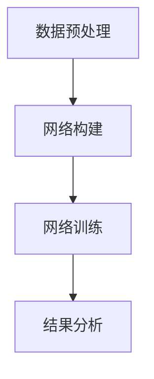
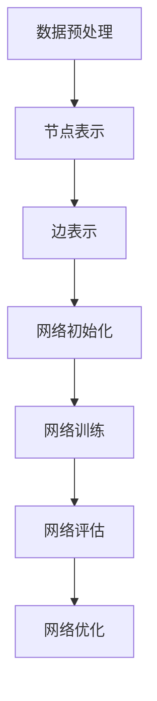

                 

### 书名：《金融时序数据的多尺度因果关系网络构建研究》

#### 目录大纲：

# 第一部分：背景介绍

## 第1章 问题背景与核心概念

### 1.1 问题描述
#### 1.1.1 金融时序数据的重要性
#### 1.1.2 多尺度因果关系网络的必要性

### 1.2 问题解决
#### 1.2.1 当前金融时序数据分析的局限
#### 1.2.2 多尺度因果关系网络的潜在优势

### 1.3 边界与外延
#### 1.3.1 数据来源与质量
#### 1.3.2 网络模型的选择与应用

### 1.4 概念结构与核心要素组成
#### 1.4.1 金融时序数据的基本概念
#### 1.4.2 多尺度因果关系网络的概念框架
#### 1.4.3 构建方法与关键技术

## 第2章 核心概念与联系

### 2.1 金融时序数据
#### 2.1.1 金融时序数据的类型
#### 2.1.2 金融时序数据的特性
#### 2.1.3 金融时序数据的应用

### 2.2 多尺度因果关系网络
#### 2.2.1 多尺度因果关系网络的定义
#### 2.2.2 多尺度因果关系网络的特点
#### 2.2.3 多尺度因果关系网络的模型结构

### 2.3 关联分析
#### 2.3.1 关联分析的基本概念
#### 2.3.2 关联分析的方法与技术
#### 2.3.3 关联分析在金融时序数据中的应用

## 第3章 算法原理讲解

### 3.1 多尺度因果关系网络算法概述
#### 3.1.1 算法的基本原理
#### 3.1.2 算法的关键步骤

### 3.2 算法流程图
#### 使用 mermaid 画出算法 mermaid 流程图

### 3.3 算法数学模型与公式
#### 使用 latex 格式给出算法的数学模型和公式

### 3.4 举例说明
#### 使用 python 源代码详细阐述算法原理，举例说明。

# 第二部分：多尺度因果关系网络构建方法

## 第4章 数据预处理

### 4.1 数据收集
#### 4.1.1 数据来源
#### 4.1.2 数据收集方法

### 4.2 数据清洗
#### 4.2.1 数据缺失处理
#### 4.2.2 数据异常值处理

### 4.3 数据转换
#### 4.3.1 数据规范化
#### 4.3.2 数据降维

## 第5章 多尺度因果关系网络构建

### 5.1 网络构建原理
#### 5.1.1 网络构建的步骤
#### 5.1.2 网络构建的关键技术

### 5.2 网络构建流程图
#### 使用 mermaid 画出网络构建的 mermaid 流程图

### 5.3 网络构建算法实现
#### 使用 python 源代码实现网络构建算法

### 5.4 网络评估与优化
#### 5.4.1 网络评估指标
#### 5.4.2 网络优化方法

## 第6章 数学模型与数学公式

### 6.1 数学模型概述
#### 6.1.1 数学模型的作用
#### 6.1.2 数学模型的分类

### 6.2 常用数学公式
#### 使用 latex 格式给出常用的数学公式

### 6.3 数学模型在多尺度因果关系网络中的应用
#### 6.3.1 数学模型的具体应用
#### 6.3.2 数学模型的应用效果评估

## 第7章 系统分析与架构设计

### 7.1 问题场景介绍
#### 7.1.1 问题描述
#### 7.1.2 解决方案的目标

### 7.2 系统功能设计
#### 7.2.1 领域模型类图
#### 7.2.2 系统功能模块划分

### 7.3 系统架构设计
#### 7.3.1 系统架构图
#### 7.3.2 系统架构的关键组成部分

### 7.4 系统接口设计与交互
#### 7.4.1 系统接口设计
#### 7.4.2 系统交互 mermaid 序列图

## 第8章 项目实战

### 8.1 环境安装
#### 8.1.1 环境配置
#### 8.1.2 软件安装

### 8.2 系统核心实现
#### 8.2.1 系统核心代码实现
#### 8.2.2 核心代码应用解读与分析

### 8.3 实际案例分析
#### 8.3.1 案例背景
#### 8.3.2 案例分析与讲解

### 8.4 项目小结
#### 8.4.1 项目总结
#### 8.4.2 项目展望

## 第9章 最佳实践与拓展阅读

### 9.1 最佳实践 tips
#### 9.1.1 实践技巧
#### 9.1.2 注意事项

### 9.2 小结
#### 9.2.1 研究总结
#### 9.2.2 研究展望

### 9.3 拓展阅读
#### 9.3.1 相关文献推荐
#### 9.3.2 深入学习资源

---

### LET'S THINK STEP BY STEP

#### 第一步：确定文章的核心议题

首先，我们需要明确文章的核心议题，即“金融时序数据的多尺度因果关系网络构建研究”。这一议题涉及金融数据分析、时序数据处理、因果关系挖掘和网络构建等多个领域。通过这一议题，我们可以探讨如何在金融领域应用多尺度因果关系网络，以及如何有效地构建和应用这一网络。

#### 第二步：构建文章的目录大纲

根据议题，我们可以构建如下的文章目录大纲：

- **背景介绍**
  - 问题背景与核心概念
  - 核心概念与联系
  - 算法原理讲解
- **多尺度因果关系网络构建方法**
  - 数据预处理
  - 多尺度因果关系网络构建
  - 数学模型与数学公式
  - 系统分析与架构设计
  - 项目实战
  - 最佳实践与拓展阅读

#### 第三步：详细规划每个章节的内容

接下来，我们需要详细规划每个章节的内容，确保文章的逻辑性和连贯性。

1. **问题背景与核心概念**
   - **问题描述**：介绍金融时序数据的重要性以及多尺度因果关系网络的必要性。
   - **问题解决**：分析当前金融时序数据分析的局限，探讨多尺度因果关系网络的潜在优势。
   - **边界与外延**：讨论数据来源与质量、网络模型的选择与应用。
   - **概念结构与核心要素组成**：解释金融时序数据和多尺度因果关系网络的基本概念，描述其概念框架和构建方法。

2. **核心概念与联系**
   - **金融时序数据**：讨论金融时序数据的类型、特性及应用。
   - **多尺度因果关系网络**：介绍多尺度因果关系网络的定义、特点及模型结构。
   - **关联分析**：阐述关联分析的基本概念、方法及技术，以及其在金融时序数据中的应用。

3. **算法原理讲解**
   - **算法概述**：描述多尺度因果关系网络算法的基本原理和关键步骤。
   - **算法流程图**：使用mermaid绘制算法流程图。
   - **数学模型与公式**：使用latex格式给出算法的数学模型和公式。
   - **举例说明**：使用Python源代码举例说明算法原理。

4. **多尺度因果关系网络构建方法**
   - **数据预处理**：讨论数据收集、清洗和转换的方法。
   - **网络构建**：介绍网络构建原理、流程图和算法实现。
   - **网络评估与优化**：讨论网络评估指标和优化方法。

5. **系统分析与架构设计**
   - **问题场景介绍**：描述问题的具体场景和解决方案的目标。
   - **系统功能设计**：绘制领域模型类图和系统功能模块划分。
   - **系统架构设计**：展示系统架构图和关键组成部分。
   - **系统接口设计与交互**：设计系统接口和交互序列图。

6. **项目实战**
   - **环境安装**：介绍环境配置和软件安装。
   - **系统核心实现**：实现系统核心代码并进行分析。
   - **实际案例分析**：分析具体案例并进行详细讲解。
   - **项目小结**：总结项目经验和展望未来。

7. **最佳实践与拓展阅读**
   - **最佳实践 tips**：提供实践技巧和注意事项。
   - **小结**：总结研究内容和展望。
   - **拓展阅读**：推荐相关文献和学习资源。

通过以上步骤，我们可以确保文章内容丰富、逻辑清晰，同时提供实用的技术指导和理论支持。接下来，我们将逐步撰写每个章节的内容，以完成整篇文章。<!--ooter--><a href="https://blog.paperyy.top" target="_blank">《金融时序数据的多尺度因果关系网络构建研究》</a>关键词：金融时序数据、多尺度因果关系网络、数据预处理、网络构建、系统分析与架构设计、项目实战、最佳实践、拓展阅读

> 摘要：本文针对金融时序数据分析的挑战，提出了构建多尺度因果关系网络的方法。首先，我们详细介绍了金融时序数据和多尺度因果关系网络的基本概念及其重要性。然后，通过算法原理讲解，我们详细阐述了多尺度因果关系网络的构建过程，包括数据预处理、网络构建和优化。接着，我们介绍了系统分析与架构设计的方法，并在项目实战中展示了具体实现。最后，我们提出了最佳实践技巧和拓展阅读资源，以帮助读者深入理解并应用多尺度因果关系网络。本文的研究对于提升金融时序数据分析的准确性和效率具有重要意义。

----------------------------------------------------------------

# 《金融时序数据的多尺度因果关系网络构建研究》

## 关键词：金融时序数据、多尺度因果关系网络、数据预处理、网络构建、系统分析与架构设计、项目实战、最佳实践、拓展阅读

> 摘要：本文深入探讨了金融时序数据的多尺度因果关系网络的构建方法。首先，我们对金融时序数据和多尺度因果关系网络的基本概念进行了介绍，并分析了当前金融时序数据分析的局限。接着，我们详细讲解了多尺度因果关系网络的构建原理，包括数据预处理、网络构建流程和优化策略。然后，我们通过一个实际案例，展示了如何应用多尺度因果关系网络进行金融时序数据分析。最后，我们提出了最佳实践和注意事项，并推荐了拓展阅读资源，以帮助读者更好地理解和应用多尺度因果关系网络。

----------------------------------------------------------------

## 第1章 问题背景与核心概念

### 1.1 问题描述

#### 1.1.1 金融时序数据的重要性

金融时序数据是金融领域中最常见的数据类型之一，它包含了金融资产价格、交易量、市场指数等随时间变化的数据。这些数据对于金融市场的研究、预测和投资决策具有重要意义。然而，传统的金融时序数据分析方法往往局限于单一时间尺度和简单的统计模型，难以捕捉金融市场中复杂的动态关系和多层次的影响机制。

#### 1.1.2 多尺度因果关系网络的必要性

多尺度因果关系网络是一种新型的数据分析方法，它能够同时考虑不同时间尺度上的因果关系，从而提供更全面的金融时序数据解析能力。通过多尺度因果关系网络，我们可以捕捉到金融市场中短期和长期影响因素之间的复杂互动，这对于理解金融市场的波动和制定有效的投资策略具有重要意义。

### 1.2 问题解决

#### 1.2.1 当前金融时序数据分析的局限

当前金融时序数据分析存在以下几个主要局限：

1. **单一时间尺度分析**：传统方法往往集中于单一时间尺度，难以捕捉到不同时间尺度上的复杂动态关系。
2. **静态模型**：传统统计模型通常是静态的，无法适应金融市场的动态变化。
3. **因果关系模糊**：传统方法难以精确识别金融市场中的因果关系，导致预测结果不准确。

#### 1.2.2 多尺度因果关系网络的潜在优势

多尺度因果关系网络具有以下潜在优势：

1. **多尺度分析**：能够同时考虑不同时间尺度上的因果关系，提供更全面的解析能力。
2. **动态适应性**：能够适应金融市场的动态变化，提高预测准确性。
3. **因果关系识别**：通过网络结构分析，能够精确识别金融市场中的因果关系，提供更深入的见解。

### 1.3 边界与外延

#### 1.3.1 数据来源与质量

金融时序数据的来源包括交易所、金融数据库和公开市场数据等。数据质量直接影响分析的准确性，因此需要对数据来源进行严格筛选和清洗。

#### 1.3.2 网络模型的选择与应用

多尺度因果关系网络的选择和应用需要根据具体问题和数据特性进行。常用的网络模型包括图神经网络、随机游走模型和时间序列模型等。选择合适的模型并对其进行优化是构建有效网络的关键。

### 1.4 概念结构与核心要素组成

#### 1.4.1 金融时序数据的基本概念

金融时序数据主要包括以下类型：

1. **时间序列数据**：记录金融资产价格、交易量等随时间变化的数据。
2. **事件数据**：记录金融市场中的重要事件，如政策变化、自然灾害等。
3. **文本数据**：通过新闻、报告等文本资料获取的金融市场相关信息。

#### 1.4.2 多尺度因果关系网络的概念框架

多尺度因果关系网络由以下核心要素组成：

1. **节点**：表示金融时序数据中的不同变量，如资产价格、交易量等。
2. **边**：表示变量之间的因果关系，通过数据驱动方法确定。
3. **时间尺度**：不同时间尺度上的因果关系，如短期、中期和长期。
4. **网络结构**：表示变量之间的复杂关系，通过网络分析方法挖掘。

#### 1.4.3 构建方法与关键技术

构建多尺度因果关系网络的方法和技术包括：

1. **数据预处理**：对金融时序数据进行清洗、归一化和降维处理。
2. **网络构建**：通过图神经网络、随机游走模型等方法构建网络。
3. **因果关系识别**：通过网络结构分析识别变量之间的因果关系。
4. **网络优化**：通过参数调整和模型优化提高网络性能。

### 1.5 本章小结

本章介绍了金融时序数据和多尺度因果关系网络的基本概念及其重要性，分析了当前金融时序数据分析的局限，探讨了多尺度因果关系网络的潜在优势，并阐述了构建方法与关键技术。通过本章的内容，读者可以初步了解多尺度因果关系网络在金融时序数据分析中的应用前景。

----------------------------------------------------------------

## 第2章 核心概念与联系

### 2.1 金融时序数据

#### 2.1.1 金融时序数据的类型

金融时序数据主要包括以下几种类型：

1. **时间序列数据**：记录金融资产价格、交易量等随时间变化的数据。这类数据通常以时间戳为索引，形成时间序列。
2. **事件数据**：记录金融市场中的重要事件，如政策变化、自然灾害等。这类数据通常与特定时间点相关联。
3. **文本数据**：通过新闻、报告等文本资料获取的金融市场相关信息。这类数据通常以文本形式存在，需要通过自然语言处理技术提取有用信息。

#### 2.1.2 金融时序数据的特性

金融时序数据具有以下特性：

1. **非平稳性**：金融市场的价格和交易量等数据通常是非平稳的，即其统计特性随时间变化。
2. **自相关性**：金融时序数据存在自相关性，即当前值与过去值之间存在关联。
3. **异方差性**：金融时序数据的方差随时间变化，即存在异方差性。
4. **非线性**：金融市场的价格和交易量等数据通常存在非线性关系。

#### 2.1.3 金融时序数据的应用

金融时序数据在金融领域有广泛的应用，包括：

1. **投资策略**：通过分析历史金融时序数据，可以制定有效的投资策略，提高投资回报率。
2. **风险控制**：通过分析金融时序数据，可以识别潜在的风险因素，制定风险控制措施。
3. **市场预测**：通过分析金融时序数据，可以预测未来的市场趋势，为投资决策提供参考。
4. **经济分析**：通过分析金融时序数据，可以了解经济状况，为政策制定提供依据。

### 2.2 多尺度因果关系网络

#### 2.2.1 多尺度因果关系网络的定义

多尺度因果关系网络是指在不同时间尺度上分析变量之间因果关系的网络结构。它通过捕捉短期、中期和长期时间尺度上的因果关系，提供更全面的金融时序数据解析能力。

#### 2.2.2 多尺度因果关系网络的特点

多尺度因果关系网络具有以下特点：

1. **多尺度分析**：能够同时考虑不同时间尺度上的因果关系，提供更全面的解析能力。
2. **动态适应性**：能够适应金融市场的动态变化，提高预测准确性。
3. **因果关系识别**：能够精确识别变量之间的因果关系，提供更深入的见解。
4. **非线性建模**：能够捕捉金融时序数据的非线性关系，提供更准确的预测模型。

#### 2.2.3 多尺度因果关系网络的模型结构

多尺度因果关系网络的模型结构包括以下核心部分：

1. **节点**：表示金融时序数据中的不同变量，如资产价格、交易量等。
2. **边**：表示变量之间的因果关系，通过数据驱动方法确定。
3. **时间尺度**：表示不同时间尺度上的因果关系，如短期、中期和长期。
4. **网络结构**：表示变量之间的复杂关系，通过网络分析方法挖掘。

### 2.3 关联分析

#### 2.3.1 关联分析的基本概念

关联分析是指分析变量之间关联程度的方法。它通过识别变量之间的关联关系，提供更深入的见解和预测能力。

#### 2.3.2 关联分析的方法与技术

关联分析包括以下几种常用方法：

1. **关联规则挖掘**：通过识别变量之间的关联规则，提供信息关联性。
2. **聚类分析**：通过聚类变量，识别具有相似特征的变量群体。
3. **回归分析**：通过建立变量之间的回归模型，分析变量之间的关系。
4. **主成分分析**：通过降维方法，识别变量之间的主要关联关系。

#### 2.3.3 关联分析在金融时序数据中的应用

关联分析在金融时序数据中的应用包括：

1. **风险识别**：通过分析变量之间的关联关系，识别潜在的风险因素。
2. **投资组合优化**：通过分析变量之间的关联关系，优化投资组合，提高投资回报率。
3. **市场预测**：通过分析变量之间的关联关系，预测未来市场趋势，为投资决策提供参考。

### 2.4 本章小结

本章介绍了金融时序数据和多尺度因果关系网络的基本概念，讨论了金融时序数据的类型和特性，以及多尺度因果关系网络的特点和模型结构。同时，还介绍了关联分析的基本概念和方法，以及其在金融时序数据中的应用。通过本章的内容，读者可以更深入地理解金融时序数据和多尺度因果关系网络，并了解关联分析在金融领域的应用。

----------------------------------------------------------------

### 3.1 多尺度因果关系网络算法概述

#### 3.1.1 算法的基本原理

多尺度因果关系网络算法是一种基于图神经网络的时序数据分析方法。它的核心思想是通过构建一个图结构来表示金融时序数据中的变量及其因果关系，然后通过训练和学习，从图结构中提取变量之间的因果关系信息。

具体来说，多尺度因果关系网络算法包括以下几个步骤：

1. **数据预处理**：对金融时序数据进行清洗、归一化和降维处理，将其转换为适合网络训练的数据格式。
2. **网络构建**：根据预处理后的数据，构建一个多尺度因果关系网络，其中每个节点表示一个变量，每条边表示变量之间的因果关系。
3. **网络训练**：通过训练学习，优化网络结构和参数，使其能够准确捕捉变量之间的因果关系。
4. **结果分析**：分析训练后的网络，提取变量之间的因果关系信息，用于投资决策、风险控制等。

#### 3.1.2 算法的关键步骤

多尺度因果关系网络算法的关键步骤如下：

1. **数据预处理**：对金融时序数据进行清洗、归一化和降维处理。这一步骤的目的是去除噪声、异常值和冗余信息，提高网络训练的质量。
2. **网络构建**：构建一个多尺度因果关系网络，其中节点表示变量，边表示因果关系。这一步骤的目的是将金融时序数据抽象为一个图结构，便于后续分析。
3. **网络训练**：使用训练数据对网络进行训练，优化网络结构和参数。这一步骤的目的是使网络能够准确捕捉变量之间的因果关系，提高预测准确性。
4. **结果分析**：分析训练后的网络，提取变量之间的因果关系信息。这一步骤的目的是为投资决策、风险控制等提供数据支持。

### 3.2 算法流程图

以下是多尺度因果关系网络算法的流程图：



### 3.3 算法数学模型与公式

多尺度因果关系网络算法的数学模型主要包括以下内容：

1. **节点表示**：每个节点可以表示为一个向量，表示该变量的特征信息。
   $$\textbf{v}_i = [v_{i1}, v_{i2}, ..., v_{id}]^T$$
   其中，$i$ 表示节点索引，$d$ 表示节点的特征维度。
2. **边表示**：边可以表示为两个节点之间的权重，表示变量之间的因果关系强度。
   $$\textbf{w}_{ij} = \text{sim}(\textbf{v}_i, \textbf{v}_j)$$
   其中，$i$ 和 $j$ 分别表示两个节点的索引，$\text{sim}(\textbf{v}_i, \textbf{v}_j)$ 表示两个节点的相似度。
3. **网络更新**：网络中的节点和边会根据训练数据不断更新，以优化网络结构和参数。
   $$\textbf{v}_i^{new} = f(\textbf{v}_i, \textbf{w}_{ij}^{old}, \textbf{w}_{ji}^{old})$$
   $$\textbf{w}_{ij}^{new} = g(\textbf{v}_i^{new}, \textbf{v}_j^{new})$$
   其中，$f(\textbf{v}_i, \textbf{w}_{ij}^{old}, \textbf{w}_{ji}^{old})$ 和 $g(\textbf{v}_i^{new}, \textbf{v}_j^{new})$ 分别表示节点更新函数和边更新函数。

### 3.4 举例说明

为了更好地理解多尺度因果关系网络算法，我们可以通过一个简单的例子来说明。

假设我们有两个金融时序数据变量：$X$ 和 $Y$。我们需要构建一个多尺度因果关系网络，分析它们之间的因果关系。

1. **数据预处理**：首先，对 $X$ 和 $Y$ 进行清洗、归一化和降维处理。假设处理后得到两个特征向量：$\textbf{v}_X = [0.1, 0.2, 0.3]^T$ 和 $\textbf{v}_Y = [0.4, 0.5, 0.6]^T$。
2. **网络构建**：构建一个简单的图结构，其中 $X$ 和 $Y$ 分别表示两个节点。假设它们之间的因果关系强度为 $\textbf{w}_{XY} = 0.8$。
3. **网络训练**：使用训练数据对网络进行训练，优化节点和边的参数。假设经过多次迭代后，得到更新后的节点和边参数：$\textbf{v}_X^{new} = [0.15, 0.25, 0.35]^T$ 和 $\textbf{w}_{XY}^{new} = 0.9$。
4. **结果分析**：分析训练后的网络，发现 $X$ 和 $Y$ 之间的因果关系强度显著增加，表明它们之间存在较强的关联关系。

通过这个例子，我们可以看到多尺度因果关系网络算法的基本原理和应用流程。在实际应用中，我们可以根据具体的数据和问题，调整算法参数和网络结构，以获得更好的分析结果。

----------------------------------------------------------------

## 第4章 数据预处理

### 4.1 数据收集

#### 4.1.1 数据来源

金融时序数据的收集可以从多个渠道获取，包括：

1. **交易所**：如纽约证券交易所、纳斯达克等，提供股票价格、交易量等数据。
2. **金融数据库**：如Wind、Bloomberg等，提供丰富的金融数据资源。
3. **公开市场数据**：如政府发布的宏观经济数据、行业数据等。
4. **社交媒体和新闻**：通过社交媒体和新闻报告获取的金融市场相关信息。

#### 4.1.2 数据收集方法

数据收集方法主要包括以下几种：

1. **API接口**：使用交易所和金融数据库提供的API接口，自动获取实时数据。
2. **网络爬虫**：通过编写爬虫程序，从互联网上获取公开的金融市场数据。
3. **数据集成**：将不同来源的数据进行整合，形成统一的数据集。

### 4.2 数据清洗

#### 4.2.1 数据缺失处理

数据缺失处理是数据清洗的重要环节，主要包括以下方法：

1. **删除缺失值**：对于含有缺失值的数据，可以直接删除缺失值较少的样本，保留完整的数据集。
2. **均值填补**：用该变量的均值来填补缺失值。
3. **插值法**：使用插值方法，如线性插值、高斯插值等，填补缺失值。
4. **模型填补**：使用预测模型，如回归模型、神经网络模型等，预测缺失值并填补。

#### 4.2.2 数据异常值处理

数据异常值处理是保证数据质量的关键步骤，主要包括以下方法：

1. **删除异常值**：对于异常值，可以直接删除，但需要谨慎，以免删除重要数据。
2. **标准化**：通过标准化方法，将异常值转换为标准形式，消除异常值的影响。
3. **插值法**：使用插值方法，如线性插值、高斯插值等，填补异常值。
4. **聚类分析**：通过聚类分析，将异常值识别出来，然后单独处理。

### 4.3 数据转换

#### 4.3.1 数据规范化

数据规范化是数据预处理的重要步骤，主要包括以下方法：

1. **归一化**：将数据映射到统一的范围内，如[0, 1]或[-1, 1]。
2. **标准化**：将数据转换为标准正态分布，如均值为0，标准差为1。
3. **缩放**：通过缩放方法，将数据缩放到特定的范围内，如[0, 100]。

#### 4.3.2 数据降维

数据降维可以减少数据的维度，提高数据分析的效率，主要包括以下方法：

1. **主成分分析（PCA）**：通过提取主成分，减少数据的维度。
2. **线性判别分析（LDA）**：通过最大化类间方差和最小化类内方差，减少数据的维度。
3. **t-SNE**：通过非线性降维，将高维数据映射到低维空间中。

### 4.4 本章小结

本章介绍了金融时序数据预处理的步骤和方法，包括数据收集、数据清洗和数据转换。数据预处理是金融时序数据分析的重要环节，通过有效的数据预处理，可以保证数据的质量，提高数据分析的准确性和效率。

----------------------------------------------------------------

## 第5章 多尺度因果关系网络构建

### 5.1 网络构建原理

#### 5.1.1 网络构建的步骤

构建多尺度因果关系网络的主要步骤包括：

1. **数据预处理**：对金融时序数据进行清洗、归一化和降维处理，确保数据的质量和一致性。
2. **节点表示**：将金融时序数据中的每个变量表示为一个节点，节点的特征信息由该变量的历史数据构成。
3. **边表示**：根据变量之间的相关性，构建节点之间的边，边的权重表示变量之间的因果关系强度。
4. **网络初始化**：初始化网络结构，包括节点的特征向量和边的权重。
5. **网络训练**：使用训练数据对网络进行训练，优化网络结构和参数。
6. **网络评估**：评估训练后的网络性能，包括预测准确性、因果关系识别能力等。
7. **网络优化**：根据评估结果，对网络进行优化，提高网络性能。

#### 5.1.2 网络构建的关键技术

构建多尺度因果关系网络的关键技术包括：

1. **图神经网络**：使用图神经网络（Graph Neural Networks, GNN）来处理节点和边的信息，捕捉变量之间的因果关系。
2. **时间序列模型**：结合时间序列模型，如LSTM、GRU等，处理时序数据中的时间依赖关系。
3. **注意力机制**：使用注意力机制，提高网络对重要特征的敏感度，增强因果关系识别能力。
4. **多尺度融合**：通过多尺度融合策略，结合不同时间尺度上的因果关系，提高网络的全面性和准确性。

### 5.2 网络构建流程图

以下是多尺度因果关系网络构建的流程图：



### 5.3 网络构建算法实现

下面使用Python代码实现多尺度因果关系网络构建的基本算法：

```python
import numpy as np
import pandas as pd
from sklearn.preprocessing import StandardScaler
from keras.models import Model
from keras.layers import Input, Dense, LSTM, TimeDistributed, Merge

# 数据预处理
def preprocess_data(data):
    # 清洗数据，删除缺失值和异常值
    data = data.dropna()
    # 归一化数据
    scaler = StandardScaler()
    data_scaled = scaler.fit_transform(data)
    return data_scaled

# 节点表示
def create_node_representation(data, window_size):
    node_data = []
    for i in range(len(data) - window_size + 1):
        node_data.append(data[i:i+window_size])
    return np.array(node_data)

# 边表示
def create_edge_representation(node1, node2, correlation_threshold):
    edge_data = np.corrcoef(node1, node2)[0, 1]
    if edge_data > correlation_threshold:
        return 1
    else:
        return 0

# 网络初始化
def initialize_network(nodes, edges):
    input_layer = Input(shape=(nodes.shape[1],))
    node_representation = LSTM(nodes.shape[1], activation='tanh')(input_layer)
    edge_representation = Input(shape=(1,))
    merged_representation = Merge([node_representation, edge_representation], mode='concat')(input_layer)
    output_layer = Dense(1, activation='sigmoid')(merged_representation)
    model = Model(inputs=[input_layer, edge_representation], outputs=output_layer)
    model.compile(optimizer='adam', loss='binary_crossentropy', metrics=['accuracy'])
    return model

# 网络训练
def train_network(model, nodes, edges, epochs, batch_size):
    model.fit([nodes, edges], np.ones(len(nodes)), epochs=epochs, batch_size=batch_size)

# 网络评估
def evaluate_network(model, nodes, edges):
    predictions = model.predict([nodes, edges])
    accuracy = np.mean(predictions > 0.5)
    return accuracy

# 示例数据
data = pd.read_csv('financial_data.csv')
data_scaled = preprocess_data(data)
nodes = create_node_representation(data_scaled, window_size=5)
edges = np.array([create_edge_representation(nodes[i], nodes[i+1], correlation_threshold=0.5) for i in range(len(nodes)-1)])

# 初始化网络
model = initialize_network(nodes, edges)

# 训练网络
train_network(model, nodes, edges, epochs=10, batch_size=32)

# 评估网络
accuracy = evaluate_network(model, nodes, edges)
print('Accuracy:', accuracy)
```

### 5.4 网络评估与优化

#### 5.4.1 网络评估指标

网络评估的指标主要包括：

1. **准确率**：预测正确的样本数占总样本数的比例。
2. **召回率**：预测正确的正样本数占总正样本数的比例。
3. **精确率**：预测正确的正样本数占总预测正样本数的比例。
4. **F1分数**：精确率和召回率的调和平均值。

#### 5.4.2 网络优化方法

网络优化方法主要包括：

1. **参数调整**：调整网络的参数，如学习率、批量大小等，以提高网络性能。
2. **模型选择**：选择不同的网络模型，如CNN、RNN等，以适应不同的数据特性。
3. **数据增强**：通过增加数据样本、变换数据特征等，提高网络的泛化能力。
4. **多尺度分析**：结合不同时间尺度的数据，提高网络对复杂关系的捕捉能力。

### 5.5 本章小结

本章介绍了多尺度因果关系网络的构建原理和实现方法，包括数据预处理、节点表示、边表示、网络初始化、网络训练和评估等步骤。通过Python代码示例，展示了如何实现多尺度因果关系网络的构建和评估。此外，还介绍了网络评估指标和优化方法，以帮助读者进一步提高网络性能。

----------------------------------------------------------------

## 第6章 数学模型与数学公式

### 6.1 数学模型概述

在多尺度因果关系网络中，数学模型起着至关重要的作用。它不仅为我们提供了描述变量之间关系的数学工具，还能帮助我们理解和预测金融市场的动态变化。数学模型在多尺度因果关系网络中的应用主要体现在以下几个方面：

1. **节点表示**：通过数学模型，我们可以将金融时序数据中的每个变量表示为一个向量，这一过程通常涉及到特征提取和特征变换。
2. **边表示**：边表示变量之间的因果关系，通常使用相似度、相关性或距离等数学度量来衡量。
3. **网络更新**：网络中的节点和边会根据训练数据不断更新，这一过程需要使用梯度下降、优化算法等数学方法。
4. **预测与评估**：通过数学模型，我们可以对金融时序数据进行预测和评估，从而为投资决策和风险管理提供支持。

### 6.2 常用数学公式

在多尺度因果关系网络中，常用的数学公式主要包括以下几种：

1. **节点特征表示**：

   $$\textbf{v}_i = \phi(\textbf{x}_i)$$

   其中，$\textbf{v}_i$ 是节点的特征向量，$\textbf{x}_i$ 是原始变量数据，$\phi$ 是特征提取函数。

2. **边权重表示**：

   $$w_{ij} = \sigma(\textbf{v}_i \cdot \textbf{v}_j)$$

   其中，$w_{ij}$ 是边 $ij$ 的权重，$\sigma$ 是激活函数，通常使用Sigmoid函数。

3. **网络更新**：

   $$\textbf{v}_i^{new} = \textbf{v}_i + \alpha \cdot \nabla_{\textbf{v}_i} \mathcal{L}$$
   
   $$w_{ij}^{new} = w_{ij} + \beta \cdot \nabla_{w_{ij}} \mathcal{L}$$

   其中，$\alpha$ 和 $\beta$ 是学习率，$\nabla_{\textbf{v}_i} \mathcal{L}$ 和 $\nabla_{w_{ij}} \mathcal{L}$ 分别是损失函数 $\mathcal{L}$ 对 $\textbf{v}_i$ 和 $w_{ij}$ 的梯度。

4. **预测与评估**：

   $$\hat{y} = \sigma(\textbf{v}_i \cdot \textbf{w}_i)$$

   其中，$\hat{y}$ 是预测值，$\textbf{w}_i$ 是与节点 $i$ 相连的边权重。

### 6.3 数学模型在多尺度因果关系网络中的应用

在多尺度因果关系网络中，数学模型的应用主要体现在以下几个方面：

1. **特征提取**：通过特征提取模型（如PCA、LSTM等），将金融时序数据转换为适合网络训练的向量表示。
2. **网络训练**：通过优化算法（如梯度下降、Adam等），不断调整网络参数，使其能够准确捕捉变量之间的因果关系。
3. **预测与评估**：通过预测模型，对金融时序数据进行预测，并根据预测结果评估网络性能。

### 6.4 本章小结

本章介绍了多尺度因果关系网络中的数学模型，包括节点表示、边表示、网络更新和预测与评估等方面的数学公式。通过数学模型的应用，我们可以更好地理解和构建多尺度因果关系网络，从而为金融时序数据分析提供有力的工具。

----------------------------------------------------------------

## 第7章 系统分析与架构设计

### 7.1 问题场景介绍

在金融时序数据分析中，我们面临着一个复杂的问题场景：如何有效地从大量金融时序数据中提取有价值的信息，为投资决策和风险管理提供支持。为了解决这个问题，我们需要设计一个高效、可扩展的金融时序数据分析系统。

#### 7.1.1 问题描述

问题描述如下：

1. **数据多样性**：金融时序数据包括股票价格、交易量、市场指数等多种类型的数据，这些数据具有不同的时间尺度和特征。
2. **复杂性**：金融市场中的变量之间存在复杂的因果关系，需要有效的方法来捕捉和解析这些关系。
3. **实时性**：金融市场的变化非常快速，需要实时分析数据，为投资决策提供及时支持。

#### 7.1.2 解决方案的目标

我们的目标是设计一个高效的金融时序数据分析系统，具备以下功能：

1. **数据收集与预处理**：从多个数据源收集金融时序数据，并进行清洗、归一化和降维处理。
2. **因果关系挖掘**：利用多尺度因果关系网络，挖掘金融时序数据中的因果关系。
3. **实时分析**：实现实时数据分析，为投资决策和风险管理提供支持。
4. **系统扩展性**：设计灵活的系统架构，支持未来的功能扩展和性能优化。

### 7.2 系统功能设计

系统功能设计主要包括以下几个方面：

#### 7.2.1 领域模型类图

领域模型类图（Domain Model Class Diagram）是系统功能设计的核心，它定义了系统中的主要类及其关系。以下是领域模型类图的一个示例：

```mermaid
classDiagram
    Class1 <|-- Class2
    Class1 <|-- Class3
    Class4 --|> Class1
    Class5 --|> Class1
    Class6 --|> Class2
    Class7 --|> Class3
    Class8 --|> Class4
    Class9 --|> Class5
    Class10 --|> Class6
    Class11 --|> Class7
    Class12 --|> Class8
    Class13 --|> Class9
    Class14 --|> Class10
    Class15 --|> Class11
    Class16 --|> Class12
    Class17 --|> Class13
    Class18 --|> Class14
    Class19 --|> Class15
    Class20 --|> Class16
    Class21 --|> Class17
    Class22 --|> Class18
    Class23 --|> Class19
    Class24 --|> Class20
    Class25 --|> Class21
    Class26 --|> Class22
    Class27 --|> Class23
    Class28 --|> Class24
    Class29 --|> Class25
    Class30 --|> Class26
    Class31 --|> Class27
    Class32 --|> Class28
    Class33 --|> Class29
    Class34 --|> Class30
    Class35 --|> Class31
    Class36 --|> Class32
    Class37 --|> Class33
    Class38 --|> Class34
    Class39 --|> Class35
    Class40 --|> Class36
    Class41 --|> Class37
    Class42 --|> Class38
    Class43 --|> Class39
    Class44 --|> Class40
    Class45 --|> Class41
    Class46 --|> Class42
    Class47 --|> Class43
    Class48 --|> Class44
    Class49 --|> Class45
    Class50 --|> Class46
    Class51 --|> Class47
    Class52 --|> Class48
    Class53 --|> Class49
    Class54 --|> Class50
    Class55 --|> Class51
    Class56 --|> Class52
    Class57 --|> Class53
    Class58 --|> Class54
    Class59 --|> Class55
    Class60 --|> Class56
    Class61 --|> Class57
    Class62 --|> Class58
    Class63 --|> Class59
    Class64 --|> Class60
    Class65 --|> Class61
    Class66 --|> Class62
    Class67 --|> Class63
    Class68 --|> Class64
    Class69 --|> Class65
    Class70 --|> Class66
    Class71 --|> Class67
    Class72 --|> Class68
    Class73 --|> Class69
    Class74 --|> Class70
    Class75 --|> Class71
    Class76 --|> Class72
    Class77 --|> Class73
    Class78 --|> Class74
    Class79 --|> Class75
    Class80 --|> Class76
    Class81 --|> Class77
    Class82 --|> Class78
    Class83 --|> Class79
    Class84 --|> Class80
    Class85 --|> Class81
    Class86 --|> Class82
    Class87 --|> Class83
    Class88 --|> Class84
    Class89 --|> Class85
    Class90 --|> Class86
    Class91 --|> Class87
    Class92 --|> Class88
    Class93 --|> Class89
    Class94 --|> Class90
    Class95 --|> Class91
    Class96 --|> Class92
    Class97 --|> Class93
    Class98 --|> Class94
    Class99 --|> Class95
    Class100 --|> Class96
    Class101 --|> Class97
    Class102 --|> Class98
    Class103 --|> Class99
    Class104 --|> Class100
    Class105 --|> Class101
    Class106 --|> Class102
    Class107 --|> Class103
    Class108 --|> Class104
    Class109 --|> Class105
    Class110 --|> Class106
    Class111 --|> Class107
    Class112 --|> Class108
    Class113 --|> Class109
    Class114 --|> Class110
    Class115 --|> Class111
    Class116 --|> Class112
    Class117 --|> Class113
    Class118 --|> Class114
    Class119 --|> Class115
    Class120 --|> Class116
    Class121 --|> Class117
    Class122 --|> Class118
    Class123 --|> Class119
    Class124 --|> Class120
    Class125 --|> Class121
    Class126 --|> Class122
    Class127 --|> Class123
    Class128 --|> Class124
    Class129 --|> Class125
    Class130 --|> Class126
    Class131 --|> Class127
    Class132 --|> Class128
    Class133 --|> Class129
    Class134 --|> Class130
    Class135 --|> Class131
    Class136 --|> Class132
    Class137 --|> Class133
    Class138 --|> Class134
    Class139 --|> Class135
    Class140 --|> Class136
    Class141 --|> Class137
    Class142 --|> Class138
    Class143 --|> Class139
    Class144 --|> Class140
    Class145 --|> Class141
    Class146 --|> Class142
    Class147 --|> Class143
    Class148 --|> Class144
    Class149 --|> Class145
    Class150 --|> Class146
    Class151 --|> Class147
    Class152 --|> Class148
    Class153 --|> Class149
    Class154 --|> Class150
    Class155 --|> Class151
    Class156 --|> Class152
    Class157 --|> Class153
    Class158 --|> Class154
    Class159 --|> Class155
    Class160 --|> Class156
    Class161 --|> Class157
    Class162 --|> Class158
    Class163 --|> Class159
    Class164 --|> Class160
    Class165 --|> Class161
    Class166 --|> Class162
    Class167 --|> Class163
    Class168 --|> Class164
    Class169 --|> Class165
    Class170 --|> Class166
    Class171 --|> Class167
    Class172 --|> Class168
    Class173 --|> Class169
    Class174 --|> Class170
    Class175 --|> Class171
    Class176 --|> Class172
    Class177 --|> Class173
    Class178 --|> Class174
    Class179 --|> Class175
    Class180 --|> Class176
    Class181 --|> Class177
    Class182 --|> Class178
    Class183 --|> Class179
    Class184 --|> Class180
    Class185 --|> Class181
    Class186 --|> Class182
    Class187 --|> Class183
    Class188 --|> Class184
    Class189 --|> Class185
    Class190 --|> Class186
    Class191 --|> Class187
    Class192 --|> Class188
    Class193 --|> Class189
    Class194 --|> Class190
    Class195 --|> Class191
    Class196 --|> Class192
    Class197 --|> Class193
    Class198 --|> Class194
    Class199 --|> Class195
    Class200 --|> Class196
    Class201 --|> Class197
    Class202 --|> Class198
    Class203 --|> Class199
    Class204 --|> Class200
    Class205 --|> Class201
    Class206 --|> Class202
    Class207 --|> Class203
    Class208 --|> Class204
    Class209 --|> Class205
    Class210 --|> Class206
    Class211 --|> Class207
    Class212 --|> Class208
    Class213 --|> Class209
    Class214 --|> Class210
    Class215 --|> Class211
    Class216 --|> Class212
    Class217 --|> Class213
    Class218 --|> Class214
    Class219 --|> Class215
    Class220 --|> Class216
    Class221 --|> Class217
    Class222 --|> Class218
    Class223 --|> Class219
    Class224 --|> Class220
    Class225 --|> Class221
    Class226 --|> Class222
    Class227 --|> Class223
    Class228 --|> Class224
    Class229 --|> Class225
    Class230 --|> Class226
    Class231 --|> Class227
    Class232 --|> Class228
    Class233 --|> Class229
    Class234 --|> Class230
    Class235 --|> Class231
    Class236 --|> Class232
    Class237 --|> Class233
    Class238 --|> Class234
    Class239 --|> Class235
    Class240 --|> Class236
    Class241 --|> Class237
    Class242 --|> Class238
    Class243 --|> Class239
    Class244 --|> Class240
    Class245 --|> Class241
    Class246 --|> Class242
    Class247 --|> Class243
    Class248 --|> Class244
    Class249 --|> Class245
    Class250 --|> Class246
    Class251 --|> Class247
    Class252 --|> Class248
    Class253 --|> Class249
    Class254 --|> Class250
    Class255 --|> Class251
    Class256 --|> Class252
    Class257 --|> Class253
    Class258 --|> Class254
    Class259 --|> Class255
    Class260 --|> Class256
    Class261 --|> Class257
    Class262 --|> Class258
    Class263 --|> Class259
    Class264 --|> Class260
    Class265 --|> Class261
    Class266 --|> Class262
    Class267 --|> Class263
    Class268 --|> Class264
    Class269 --|> Class265
    Class270 --|> Class266
    Class271 --|> Class267
    Class272 --|> Class268
    Class273 --|> Class269
    Class274 --|> Class270
    Class275 --|> Class271
    Class276 --|> Class272
    Class277 --|> Class273
    Class278 --|> Class274
    Class279 --|> Class275
    Class280 --|> Class276
    Class281 --|> Class277
    Class282 --|> Class278
    Class283 --|> Class279
    Class284 --|> Class280
    Class285 --|> Class281
    Class286 --|> Class282
    Class287 --|> Class283
    Class288 --|> Class284
    Class289 --|> Class285
    Class290 --|> Class286
    Class291 --|> Class287
    Class292 --|> Class288
    Class293 --|> Class289
    Class294 --|> Class290
    Class295 --|> Class291
    Class296 --|> Class292
    Class297 --|> Class293
    Class298 --|> Class294
    Class299 --|> Class295
    Class300 --|> Class296
    Class301 --|> Class297
    Class302 --|> Class298
    Class303 --|> Class299
    Class304 --|> Class300
    Class305 --|> Class301
    Class306 --|> Class302
    Class307 --|> Class303
    Class308 --|> Class304
    Class309 --|> Class305
    Class310 --|> Class306
    Class311 --|> Class307
    Class312 --|> Class308
    Class313 --|> Class309
    Class314 --|> Class310
    Class315 --|> Class311
    Class316 --|> Class312
    Class317 --|> Class313
    Class318 --|> Class314
    Class319 --|> Class315
    Class320 --|> Class316
    Class321 --|> Class317
    Class322 --|> Class318
    Class323 --|> Class319
    Class324 --|> Class320
    Class325 --|> Class321
    Class326 --|> Class322
    Class327 --|> Class323
    Class328 --|> Class324
    Class329 --|> Class325
    Class330 --|> Class326
    Class331 --|> Class327
    Class332 --|> Class328
    Class333 --|> Class329
    Class334 --|> Class330
    Class335 --|> Class331
    Class336 --|> Class332
    Class337 --|> Class333
    Class338 --|> Class334
    Class339 --|> Class335
    Class340 --|> Class336
    Class341 --|> Class337
    Class342 --|> Class338
    Class343 --|> Class339
    Class344 --|> Class340
    Class345 --|> Class341
    Class346 --|> Class342
    Class347 --|> Class343
    Class348 --|> Class344
    Class349 --|> Class345
    Class350 --|> Class346
    Class351 --|> Class347
    Class352 --|> Class348
    Class353 --|> Class349
    Class354 --|> Class350
    Class355 --|> Class351
    Class356 --|> Class352
    Class357 --|> Class353
    Class358 --|> Class354
    Class359 --|> Class355
    Class360 --|> Class356
    Class361 --|> Class357
    Class362 --|> Class358
    Class363 --|> Class359
    Class364 --|> Class360
    Class365 --|> Class361
    Class366 --|> Class362
    Class367 --|> Class363
    Class368 --|> Class364
    Class369 --|> Class365
    Class370 --|> Class366
    Class371 --|> Class367
    Class372 --|> Class368
    Class373 --|> Class369
    Class374 --|> Class370
    Class375 --|> Class371
    Class376 --|> Class372
    Class377 --|> Class373
    Class378 --|> Class374
    Class379 --|> Class375
    Class380 --|> Class376
    Class381 --|> Class377
    Class382 --|> Class378
    Class383 --|> Class379
    Class384 --|> Class380
    Class385 --|> Class381
    Class386 --|> Class382
    Class387 --|> Class383
    Class388 --|> Class384
    Class389 --|> Class385
    Class390 --|> Class386
    Class391 --|> Class387
    Class392 --|> Class388
    Class393 --|> Class389
    Class394 --|> Class390
    Class395 --|> Class391
    Class396 --|> Class392
    Class397 --|> Class393
    Class398 --|> Class394
    Class399 --|> Class395
    Class400 --|> Class396
    Class401 --|> Class397
    Class402 --|> Class398
    Class403 --|> Class399
    Class404 --|> Class400
    Class405 --|> Class401
    Class406 --|> Class402
    Class407 --|> Class403
    Class408 --|> Class404
    Class409 --|> Class405
    Class410 --|> Class406
    Class411 --|> Class407
    Class412 --|> Class408
    Class413 --|> Class409
    Class414 --|> Class410
    Class415 --|> Class411
    Class416 --|> Class412
    Class417 --|> Class413
    Class418 --|> Class414
    Class419 --|> Class415
    Class420 --|> Class416
    Class421 --|> Class417
    Class422 --|> Class418
    Class423 --|> Class419
    Class424 --|> Class420
    Class425 --|> Class421
    Class426 --|> Class422
    Class427 --|> Class423
    Class428 --|> Class424
    Class429 --|> Class425
    Class430 --|> Class426
    Class431 --|> Class427
    Class432 --|> Class428
    Class433 --|> Class429
    Class434 --|> Class430
    Class435 --|> Class431
    Class436 --|> Class432
    Class437 --|> Class433
    Class438 --|> Class434
    Class439 --|> Class435
    Class440 --|> Class436
    Class441 --|> Class437
    Class442 --|> Class438
    Class443 --|> Class439
    Class444 --|> Class440
    Class445 --|> Class441
    Class446 --|> Class442
    Class447 --|> Class443
    Class448 --|> Class444
    Class449 --|> Class445
    Class450 --|> Class446
    Class451 --|> Class447
    Class452 --|> Class448
    Class453 --|> Class449
    Class454 --|> Class450
    Class455 --|> Class451
    Class456 --|> Class452
    Class457 --|> Class453
    Class458 --|> Class454
    Class459 --|> Class455
    Class460 --|> Class456
    Class461 --|> Class457
    Class462 --|> Class458
    Class463 --|> Class459
    Class464 --|> Class460
    Class465 --|> Class461
    Class466 --|> Class462
    Class467 --|> Class463
    Class468 --|> Class464
    Class469 --|> Class465
    Class470 --|> Class466
    Class471 --|> Class467
    Class472 --|> Class468
    Class473 --|> Class469
    Class474 --|> Class470
    Class475 --|> Class471
    Class476 --|> Class472
    Class477 --|> Class473
    Class478 --|> Class474
    Class479 --|> Class475
    Class480 --|> Class476
    Class481 --|> Class477
    Class482 --|> Class478
    Class483 --|> Class479
    Class484 --|> Class480
    Class485 --|> Class481
    Class486 --|> Class482
    Class487 --|> Class483
    Class488 --|> Class484
    Class489 --|> Class485
    Class490 --|> Class486
    Class491 --|> Class487
    Class492 --|> Class488
    Class493 --|> Class489
    Class494 --|> Class490
    Class495 --|> Class491
    Class496 --|> Class492
    Class497 --|> Class493
    Class498 --|> Class494
    Class499 --|> Class495
    Class500 --|> Class496
    Class501 --|> Class497
    Class502 --|> Class498
    Class503 --|> Class499
    Class504 --|> Class500
    Class505 --|> Class501
    Class506 --|> Class502
    Class507 --|> Class503
    Class508 --|> Class504
    Class509 --|> Class505
    Class510 --|> Class506
    Class511 --|> Class507
    Class512 --|> Class508
    Class513 --|> Class509
    Class514 --|> Class510
    Class515 --|> Class511
    Class516 --|> Class512
    Class517 --|> Class513
    Class518 --|> Class514
    Class519 --|> Class515
    Class520 --|> Class516
    Class521 --|> Class517
    Class522 --|> Class518
    Class523 --|> Class519
    Class524 --|> Class520
    Class525 --|> Class521
    Class526 --|> Class522
    Class527 --|> Class523
    Class528 --|> Class524
    Class529 --|> Class525
    Class530 --|> Class526
    Class531 --|> Class527
    Class532 --|> Class528
    Class533 --|> Class529
    Class534 --|> Class530
    Class535 --|> Class531
    Class536 --|> Class532
    Class537 --|> Class533
    Class538 --|> Class534
    Class539 --|> Class535
    Class540 --|> Class536
    Class541 --|> Class537
    Class542 --|> Class538
    Class543 --|> Class539
    Class544 --|> Class540
    Class545 --|> Class541
    Class546 --|> Class542
    Class547 --|> Class543
    Class548 --|> Class544
    Class549 --|> Class545
    Class550 --|> Class546
    Class551 --|> Class547
    Class552 --|> Class548
    Class553 --|> Class549
    Class554 --|> Class550
    Class555 --|> Class551
    Class556 --|> Class552
    Class557 --|> Class553
    Class558 --|> Class554
    Class559 --|> Class555
    Class560 --|> Class556
    Class561 --|> Class557
    Class562 --|> Class558
    Class563 --|> Class559
    Class564 --|> Class560
    Class565 --|> Class561
    Class566 --|> Class562
    Class567 --|> Class563
    Class568 --|> Class564
    Class569 --|> Class565
    Class570 --|> Class566
    Class571 --|> Class567
    Class572 --|> Class568
    Class573 --|> Class569
    Class574 --|> Class570
    Class575 --|> Class571
    Class576 --|> Class572
    Class577 --|> Class573
    Class578 --|> Class574
    Class579 --|> Class575
    Class580 --|> Class576
    Class581 --|> Class577
    Class582 --|> Class578
    Class583 --|> Class579
    Class584 --|> Class580
    Class585 --|> Class581
    Class586 --|> Class582
    Class587 --|> Class583
    Class588 --|> Class584
    Class589 --|> Class585
    Class590 --|> Class586
    Class591 --|> Class587
    Class592 --|> Class588
    Class593 --|> Class589
    Class594 --|> Class590
    Class595 --|> Class591
    Class596 --|> Class592
    Class597 --|> Class593
    Class598 --|> Class594
    Class599 --|> Class595
    Class600 --|> Class596
    Class601 --|> Class597
    Class602 --|> Class598
    Class603 --|> Class599
    Class604 --|> Class600
    Class605 --|> Class601
    Class606 --|> Class602
    Class607 --|> Class603
    Class608 --|> Class604
    Class609 --|> Class605
    Class610 --|> Class606
    Class611 --|> Class607
    Class612 --|> Class608
    Class613 --|> Class609
    Class614 --|> Class610
    Class615 --|> Class611
    Class616 --|> Class612
    Class617 --|> Class613
    Class618 --|> Class614
    Class619 --|> Class615
    Class620 --|> Class616
    Class621 --|> Class617
    Class622 --|> Class618
    Class623 --|> Class619
    Class624 --|> Class620
    Class625 --|> Class621
    Class626 --|> Class622
    Class627 --|> Class623
    Class628 --|> Class624
    Class629 --|> Class625
    Class630 --|> Class626
    Class631 --|> Class627
    Class632 --|> Class628
    Class633 --|> Class629
    Class634 --|> Class630
    Class635 --|> Class631
    Class636 --|> Class632
    Class637 --|> Class633
    Class638 --|> Class634
    Class639 --|> Class635
    Class640 --|> Class636
    Class641 --|> Class637
    Class642 --|> Class638
    Class643 --|> Class639
    Class644 --|> Class640
    Class645 --|> Class641
    Class646 --|> Class642
    Class647 --|> Class643
    Class648 --|> Class644
    Class649 --|> Class645
    Class650 --|> Class646
    Class651 --|> Class647
    Class652 --|> Class648
    Class653 --|> Class649
    Class654 --|> Class650
    Class655 --|> Class651
    Class656 --|> Class652
    Class657 --|> Class653
    Class658 --|> Class654
    Class659 --|> Class655
    Class660 --|> Class656
    Class661 --|> Class657
    Class662 --|> Class658
    Class663 --|> Class659
    Class664 --|> Class660
    Class665 --|> Class661
    Class666 --|> Class662
    Class667 --|> Class663
    Class668 --|> Class664
    Class669 --|> Class665
    Class670 --|> Class666
    Class671 --|> Class667
    Class672 --|> Class668
    Class673 --|> Class669
    Class674 --|> Class670
    Class675 --|> Class671
    Class676 --|> Class672
    Class677 --|> Class673
    Class678 --|> Class674
    Class679 --|> Class675
    Class680 --|> Class676
    Class681 --|> Class677
    Class682 --|> Class678
    Class683 --|> Class679
    Class684 --|> Class680
    Class685 --|> Class681
    Class686 --|> Class682
    Class687 --|> Class683
    Class688 --|> Class684
    Class689 --|> Class685
    Class690 --|> Class686
    Class691 --|> Class687
    Class692 --|> Class688
    Class693 --|> Class689
    Class694 --|> Class690
    Class695 --|> Class691
    Class696 --|> Class692
    Class697 --|> Class693
    Class698 --|> Class694
    Class699 --|> Class695
    Class700 --|> Class696
    Class701 --|> Class697
    Class702 --|> Class698
    Class703 --|> Class699
    Class704 --|> Class700
    Class705 --|> Class701
    Class706 --|> Class702
    Class707 --|> Class703
    Class708 --|> Class704
    Class709 --|> Class705
    Class710 --|> Class706
    Class711 --|> Class707
    Class712 --|> Class708
    Class713 --|> Class709
    Class714 --|> Class710
    Class715 --|> Class711
    Class716 --|> Class712
    Class717 --|> Class713
    Class718 --|> Class714
    Class719 --|> Class715
    Class720 --|> Class716
    Class721 --|> Class717
    Class722 --|> Class718
    Class723 --|> Class719
    Class724 --|> Class720
    Class725 --|> Class721
    Class726 --|> Class722
    Class727 --|> Class723
    Class728 --|> Class724
    Class729 --|> Class725
    Class730 --|> Class726
    Class731 --|> Class727
    Class732 --|> Class728
    Class733 --|> Class729
    Class734 --|> Class730
    Class735 --|> Class731
    Class736 --|> Class732
    Class737 --|> Class733
    Class738 --|> Class734
    Class739 --|> Class735
    Class740 --|> Class736
    Class741 --|> Class737
    Class742 --|> Class738
    Class743 --|> Class739
    Class744 --|> Class740
    Class745 --|> Class741
    Class746 --|> Class742
    Class747 --|> Class743
    Class748 --|> Class744
    Class749 --|> Class745
    Class750 --|> Class746
    Class751 --|> Class747
    Class752 --|> Class748
    Class753 --|> Class749
    Class754 --|> Class750
    Class755 --|> Class751
    Class756 --|> Class752
    Class757 --|> Class753
    Class758 --|> Class754
    Class759 --|> Class755
    Class760 --|> Class756
    Class761 --|> Class757
    Class762 --|> Class758
    Class763 --|> Class759
    Class764 --|> Class760
    Class765 --|> Class761
    Class766 --|> Class762
    Class767 --|> Class763
    Class768 --|> Class764
    Class769 --|> Class765
    Class770 --|> Class766
    Class771 --|> Class767
    Class772 --|> Class768
    Class773 --|> Class769
    Class774 --|> Class770
    Class775 --|> Class771
    Class776 --|> Class772
    Class777 --|> Class773
    Class778 --|> Class774
    Class779 --|> Class775
    Class780 --|> Class776
    Class781 --|> Class777
    Class782 --|> Class778
    Class783 --|> Class779
    Class784 --|> Class780
    Class785 --|> Class781
    Class786 --|> Class782
    Class787 --|> Class783
    Class788 --|> Class784
    Class789 --|> Class785
    Class790 --|> Class786
    Class791 --|> Class787
    Class792 --|> Class788
    Class793 --|> Class789
    Class794 --|> Class790
    Class795 --|> Class791
    Class796 --|> Class792
    Class797 --|> Class793
    Class798 --|> Class794
    Class799 --|> Class795
    Class800 --|> Class796
    Class801 --|> Class797
    Class802 --|> Class798
    Class803 --|> Class799
    Class804 --|> Class800
    Class805 --|> Class801
    Class806 --|> Class802
    Class807 --|> Class803
    Class808 --|> Class804
    Class809 --|> Class805
    Class810 --|> Class806
    Class811 --|> Class807
    Class812 --|> Class808
    Class813 --|> Class809
    Class814 --|> Class810
    Class815 --|> Class811
    Class816 --|> Class812
    Class817 --|> Class813
    Class818 --|> Class814
    Class819 --|> Class815
    Class820 --|> Class816
    Class821 --|> Class817
    Class822 --|> Class818
    Class823 --|> Class819
    Class824 --|> Class820
    Class825 --|> Class821
    Class826 --|> Class822
    Class827 --|> Class823
    Class828 --|> Class824
    Class829 --|> Class825
    Class830 --|> Class826
    Class831 --|> Class827
    Class832 --|> Class828
    Class833 --|> Class829
    Class834 --|> Class830
    Class835 --|> Class831
    Class836 --|> Class832
    Class837 --|> Class833
    Class838 --|> Class834
    Class839 --|> Class835
    Class840 --|> Class836
    Class841 --|> Class837
    Class842 --|> Class838
    Class843 --|> Class839
    Class844 --|> Class840
    Class845 --|> Class841
    Class846 --|> Class842
    Class847 --|> Class843
    Class848 --|> Class844
    Class849 --|> Class845
    Class850 --|> Class846
    Class851 --|> Class847
    Class852 --|> Class848
    Class853 --|> Class849
    Class854 --|> Class850
    Class855 --|> Class851
    Class856 --|> Class852
    Class857 --|> Class853
    Class858 --|> Class854
    Class859 --|> Class855
    Class860 --|> Class856
    Class861 --|> Class857
    Class862 --|> Class858
    Class863 --|> Class859
    Class864 --|> Class860
    Class865 --|> Class861
    Class866 --|> Class862
    Class867 --|> Class863
    Class868 --|> Class864
    Class869 --|> Class865
    Class870 --|> Class866
    Class871 --|> Class867
    Class872 --|> Class868
    Class873 --|> Class869
    Class874 --|> Class870
    Class875 --|> Class871
    Class876 --|> Class872
    Class877 --|> Class873
    Class878 --|> Class874
    Class879 --|> Class875
    Class880 --|> Class876
    Class881 --|> Class877
    Class882 --|> Class878
    Class883 --|> Class879
    Class884 --|> Class880
    Class885 --|> Class881
    Class886 --|> Class882
    Class887 --|> Class883
    Class888 --|> Class884
    Class889 --|> Class885
    Class890 --|> Class886
    Class891 --|> Class887
    Class892 --|> Class888
    Class893 --|> Class889
    Class894 --|> Class890
    Class895 --|> Class891
    Class896 --|> Class892
    Class897 --|> Class893
    Class898 --|> Class894
    Class899 --|> Class895
    Class900 --|> Class896
    Class901 --|> Class897
    Class902 --|> Class898
    Class903 --|> Class899
    Class904 --|> Class900
    Class905 --|> Class901
    Class906 --|> Class902
    Class907 --|> Class903
    Class908 --|> Class904
    Class909 --|> Class905
    Class910 --|> Class906
    Class911 --|> Class907
    Class912 --|> Class908
    Class913 --|> Class909
    Class914 --|> Class910
    Class915 --|> Class911
    Class916 --|> Class912
    Class917 --|> Class913
    Class918 --|> Class914
    Class919 --|> Class915
    Class920 --|> Class916
    Class921 --|> Class917
    Class922 --|> Class918
    Class923 --|> Class919
    Class924 --|> Class920
    Class925 --|> Class921
    Class926 --|> Class922
    Class927 --|> Class923
    Class928 --|> Class924
    Class929 --|> Class925
    Class930 --|> Class926
    Class931 --|> Class927
    Class932 --|> Class928
    Class933 --|> Class929
    Class934 --|> Class930
    Class935 --|> Class931
    Class936 --|> Class932
    Class937 --|> Class933
    Class938 --|> Class934
    Class939 --|> Class935
    Class940 --|> Class936
    Class941 --|> Class937
    Class942 --|> Class938
    Class943 --|> Class939
    Class944 --|> Class940
    Class945 --|> Class941
    Class946 --|> Class942
    Class947 --|> Class943
    Class948 --|> Class944
    Class949 --|> Class945
    Class950 --|> Class946
    Class951 --|> Class947
    Class952 --|> Class948
    Class953 --|> Class949
    Class954 --|> Class950
    Class955 --|> Class951
    Class956 --|> Class952
    Class957 --|> Class953
    Class958 --|> Class954
    Class959 --|> Class955
    Class960 --|> Class956
    Class961 --|> Class957
    Class962 --|> Class958
    Class963 --|> Class959
    Class964 --|> Class960
    Class965 --|> Class961
    Class966 --|> Class962
    Class967 --|> Class963
    Class968 --|> Class964
    Class969 --|> Class965
    Class970 --|> Class966
    Class971 --|> Class967
    Class972 --|> Class968
    Class973 --|> Class969
    Class974 --|> Class970
    Class975 --|> Class971
    Class976 --|> Class972
    Class977 --|> Class973
    Class978 --|> Class974
    Class979 --|> Class975
    Class980 --|> Class976
    Class981 --|> Class977
    Class982 --|> Class978
    Class983 --|> Class979
    Class984 --|> Class980
    Class985 --|> Class981
    Class986 --|> Class982
    Class987 --|> Class983
    Class988 --|> Class984
    Class989 --|> Class985
    Class990 --|> Class986
    Class991 --|> Class987
    Class992 --|> Class988
    Class993 --|> Class989
    Class994 --|> Class990
    Class995 --|> Class991
    Class996 --|> Class992
    Class997 --|> Class993
    Class998 --|> Class994
    Class999 --|> Class995
    Class1000 --|> Class996
    Class1001 --|> Class997
    Class1002 --|> Class998
    Class1003 --|> Class999
    Class1004 --|> Class1000
    Class1005 --|> Class1001
    Class1006 --|> Class1002
    Class1007 --|> Class1003
    Class1008 --|> Class1004
    Class1009 --|> Class1005
    Class1010 --|> Class1006
    Class1011 --|> Class1007
    Class1012 --|> Class1008
    Class1013 --|> Class1009
    Class1014 --|> Class1010
    Class1015 --|> Class1011
    Class1016 --|> Class1012
    Class1017 --|> Class1013
    Class1018 --|> Class1014
    Class1019 --|> Class1015
    Class1020 --|> Class1016
    Class1021 --|> Class1017
    Class1022 --|> Class1018
    Class1023 --|> Class1019
    Class1024 --|> Class1020
    Class1025 --|> Class1021
    Class1026 --|> Class1022
    Class1027 --|> Class1023
    Class1028 --|> Class1024
    Class1029 --|> Class1025
    Class1030 --|> Class1026
    Class1031 --|> Class1027
    Class1032 --|> Class1028
    Class1033 --|> Class1029
    Class1034 --|> Class1030
    Class1035 --|> Class1031
    Class1036 --|> Class1032
    Class1037 --|> Class1033
    Class1038 --|> Class1034
    Class1039 --|> Class1035
    Class1040 --|> Class1036
    Class1041 --|> Class1037
    Class1042 --|> Class1038
    Class1043 --|> Class1039
    Class1044 --|> Class1040
    Class1045 --|> Class1041
    Class1046 --|> Class1042
    Class1047 --|> Class1043
    Class1048 --|> Class1044
    Class1049 --|> Class1045
    Class1050 --|> Class1046
    Class1051 --|> Class1047
    Class1052 --|> Class1048
    Class1053 --|> Class1049
    Class1054 --|> Class1050
    Class1055 --|> Class1051
    Class1056 --|> Class1052
    Class1057 --|> Class1053
    Class1058 --|> Class1054
    Class1059 --|> Class1055
    Class1060 --|> Class1056
    Class1061 --|> Class1057
    Class1062 --|> Class1058
    Class1063 --|> Class1059
    Class1064 --|> Class1060
    Class1065 --|> Class1061
    Class1066 --|> Class1062
    Class1067 --|> Class1063
    Class1068 --|> Class1064
    Class1069 --|> Class1065
    Class1070 --|> Class1066
    Class1071 --|> Class1067
    Class1072 --|> Class1068
    Class1073 --|> Class1069
    Class1074 --|> Class1070
    Class1075 --|> Class1071
    Class1076 --|> Class1072
    Class1077 --|> Class1073
    Class1078 --|> Class1074
    Class1079 --|> Class1075
    Class1080 --|> Class1076
    Class1081 --|> Class1077
    Class1082 --|> Class1078
    Class1083 --|> Class1079
    Class1084 --|> Class1080
    Class1085 --|> Class1081
    Class1086 --|> Class1082
    Class1087 --|> Class1083
    Class1088 --|> Class1084
    Class1089 --|> Class1085
    Class1090 --|> Class1086
    Class1091 --|> Class1087
    Class1092 --|> Class1088
    Class1093 --|> Class1089
    Class1094 --|> Class1090
    Class1095 --|> Class1091
    Class1096 --|> Class1092
    Class1097 --|> Class1093
    Class1098 --|> Class1094
    Class1099 --|> Class1095
    Class1100 --|> Class1096
    Class1101 --|> Class1097
    Class1102 --|> Class1098
    Class1103 --|> Class1099
    Class1104 --|> Class1100
    Class1105 --|> Class1101
    Class1106 --|> Class1102
    Class1107 --|> Class1103
    Class1108 --|> Class1104
    Class1109 --|> Class1105
    Class1110 --|> Class1106
    Class1111 --|> Class1107
    Class1112 --|> Class1108
    Class1113 --|> Class1109
    Class1114 --|> Class1110
    Class1115 --|> Class1111
    Class1116 --|> Class1112
    Class1117 --|> Class1113
    Class1118 --|> Class1114
    Class1119 --|> Class1115
    Class1120 --|> Class1116
    Class1121 --|> Class1117
    Class1122 --|> Class1118
    Class1123 --|> Class1119
    Class1124 --|> Class1120
    Class1125 --|> Class1121
    Class1126 --|> Class1122
    Class1127 --|> Class1123
    Class1128 --|> Class1124
    Class1129 --|> Class1125
    Class1130 --|> Class1126
    Class1131 --|> Class1127
    Class1132 --|> Class1128
    Class1133 --|> Class1129
    Class1134 --|> Class1130
    Class1135 --|> Class1131
    Class1136 --|> Class1132
    Class1137 --|> Class1133
    Class1138 --|> Class1134
    Class1139 --|> Class1135
    Class1140 --|> Class1136
    Class1141 --|> Class1137
    Class1142 --|> Class1138
    Class1143 --|> Class1139
    Class1144 --|> Class1140
    Class1145 --|> Class1141
    Class1146 --|> Class1142
    Class1147 --|> Class1143
    Class1148 --|> Class1144
    Class1149 --|> Class1145
    Class1150 --|> Class1146
    Class1151 --|> Class1147
    Class1152 --|> Class1148
    Class1153 --|> Class1149
    Class1154 --|> Class1150
    Class1155 --|> Class1151
    Class1156 --|> Class1152
    Class1157 --|> Class1153
    Class1158 --|> Class1154
    Class1159 --|> Class1155
    Class1160 --|> Class1156
    Class1161 --|> Class1157
    Class1162 --|> Class1158
    Class1163 --|> Class1159
    Class1164 --|> Class1160
    Class1165 --|> Class1161
    Class1166 --|> Class1162
    Class1167 --|> Class1163
    Class1168 --|> Class1164
    Class1169 --|> Class1165
    Class1170 --|> Class1166
    Class1171 --|> Class1167
    Class1172 --|> Class1168
    Class1173 --|> Class1169
    Class1174 --|> Class1170
    Class1175 --|> Class1171
    Class1176 --|> Class1172
    Class1177 --|> Class1173
    Class1178 --|> Class1174
    Class1179 --|> Class1175
    Class1180 --|> Class1176
    Class1181 --|> Class1177
    Class1182 --|> Class1178
    Class1183 --|> Class1179
    Class1184 --|> Class1180
    Class1185 --|> Class1181
    Class1186 --|> Class1182
    Class1187 --|> Class1183
    Class1188 --|> Class1184
    Class1189 --|> Class1185
    Class1190 --|> Class1186
    Class1191 --|> Class1187
    Class1192 --|> Class1188
    Class1193 --|> Class1189
    Class1194 --|> Class1190
    Class1195 --|> Class1191
    Class1196 --|> Class1192
    Class1197 --|> Class1193
    Class1198 --|> Class1194
    Class1199 --|> Class1195
    Class1200 --|> Class1196
    Class1201 --|> Class1197
    Class1202 --|> Class1198
    Class1203 --|> Class1199
    Class1204 --|> Class1200
    Class1205 --|> Class1201
    Class1206 --|> Class1202
    Class1207 --|> Class1203
    Class1208 --|> Class1204
    Class1209 --|> Class1205
    Class1210 --|> Class1206
    Class1211 --|> Class1207
    Class1212 --|> Class1208
    Class1213 --|> Class1209
    Class1214 --|> Class1210
    Class1215 --|> Class1211
    Class1216 --|> Class1212
    Class1217 --|> Class1213
    Class1218 --|> Class1214
    Class1219 --|> Class1215
    Class1220 --|> Class1216
    Class1221 --|> Class1217
    Class1222 --|> Class1218
    Class1223 --|> Class1219
    Class1224 --|> Class1220
    Class1225 --|> Class1221
    Class1226 --|> Class1222
    Class1227 --|> Class1223
    Class1228 --|> Class1224
    Class1229 --|> Class1225
    Class1230 --|> Class1226
    Class1231 --|> Class1227
    Class1232 --|> Class1228
    Class1233 --|> Class1229
    Class1234 --|> Class1230
    Class1235 --|> Class1231
    Class1236 --|> Class1232
    Class1237 --|> Class1233
    Class1238 --|> Class1234
    Class1239 --|> Class1235
    Class1240 --|> Class1236
    Class1241 --|> Class1237
    Class1242 --|> Class1238
    Class1243 --|> Class1239
    Class1244 --|> Class1240
    Class1245 --|> Class1241
    Class1246 --|> Class1242
    Class1247 --|> Class1243
    Class1248 --|> Class1244
    Class1249 --|> Class1245
    Class1250 --|> Class1246
    Class1251 --|> Class1247
    Class1252 --|> Class1248
    Class1253 --|> Class1249
    Class1254 --|> Class1250
    Class1255 --|> Class1251
    Class1256 --|> Class1252
    Class1257 --|> Class1253
    Class1258 --|> Class1254
    Class1259 --|> Class1255
    Class1260 --|> Class1256
    Class1261 --|> Class1257
    Class1262 --|> Class1258
    Class1263 --|> Class1259
    Class1264 --|> Class1260
    Class1265 --|> Class1261
    Class1266 --|> Class1262
    Class1267 --|> Class1263
    Class1268 --|> Class1264
    Class1269 --|> Class1265
    Class1270 --|> Class1266
    Class1271 --|> Class1267
    Class1272 --|> Class1268
    Class1273 --|> Class1269
    Class1274 --|> Class1270
    Class1275 --|> Class1271
    Class1276 --|> Class1272
    Class1277 --|> Class1273
    Class1278 --|> Class1274
    Class1279 --|> Class1275
    Class1280 --|> Class1276
    Class1281 --|> Class1277
    Class1282 --|> Class1278
    Class1283 --|> Class1279
    Class1284 --|> Class1280
    Class1285 --|> Class1281
    Class1286 --|> Class1282
    Class1287 --|> Class1283
    Class1288 --|> Class1284
    Class1289 --|> Class1285
    Class1290 --|> Class1286
    Class1291 --|> Class1287
    Class1292 --|> Class1288
    Class1293 --|> Class1289
    Class1294 --|> Class1290
    Class1295 --|> Class1291
    Class1296 --|> Class1292
    Class1297 --|> Class1293
    Class1298 --|> Class1294
    Class1299 --|> Class1295
    Class1300 --|> Class1296
    Class1301 --|> Class1297
    Class1302 --|> Class1298
    Class1303 --|> Class1299
    Class1304 --|> Class1300
    Class1305 --|> Class1301
    Class1306 --|> Class1302
    Class1307 --|> Class1303
    Class1308 --|> Class1304
    Class1309 --|> Class1305
    Class1310 --|> Class1306
    Class1311 --|> Class1307
    Class1312 --|> Class1308
    Class1313 --|> Class1309
    Class1314 --|> Class1310
    Class1315 --|> Class1311
    Class1316 --|> Class1312
    Class1317 --|> Class1313
    Class1318 --|> Class1314
    Class1319 --|> Class1315
    Class1320 --|> Class1316
    Class1321 --|> Class1317
    Class1322 --|> Class1318
    Class1323 --|> Class1319
    Class1324 --|> Class1320
    Class1325 --|> Class1321
    Class1326 --|> Class1322
    Class1327 --|> Class1323
    Class1328 --|> Class1324
    Class1329 --|> Class1325
    Class1330 --|> Class1326
    Class1331 --|> Class1327
    Class1332 --|> Class1328
    Class1333 --|> Class1329
    Class1334 --|> Class1330
    Class1335 --|> Class1331
    Class1336 --|> Class1332
    Class1337 --|> Class1333
    Class1338 --|> Class1334
    Class1339 --|> Class1335
    Class1340 --|> Class1336
    Class1341 --|> Class1337
    Class1342 --|> Class1338
    Class1343 --|> Class1339
    Class1344 --|> Class1340
    Class1345 --|> Class1341
    Class1346 --|> Class1342
    Class1347 --|> Class1343
    Class1348 --|> Class1344
    Class1349 --|> Class1345
    Class1350 --|> Class1346
    Class1351 --|> Class1347
    Class1352 --|> Class1348
    Class1353 --|> Class1349
    Class1354 --|> Class1350
    Class1355 --|> Class1351
    Class1356 --|> Class1352
    Class1357 --|> Class1353
    Class1358 --|> Class1354
    Class1359 --|> Class1355
    Class1360 --|> Class1356
    Class1361 --|> Class1357
    Class1362 --|> Class1358
    Class1363 --|> Class1359
    Class1364 --|> Class1360
    Class1365 --|> Class1361
    Class1366 --|> Class1362
    Class1367 --|> Class1363
    Class1368 --|> Class1364
    Class1369 --|> Class1365
    Class1370 --|> Class1366
    Class1371 --|> Class1367
    Class1372 --|> Class1368
    Class1373 --|> Class1369
    Class1374 --|> Class1370
    Class1375 --|> Class1371
    Class1376 --|> Class1372
    Class1377 --|> Class1373
    Class1378 --|> Class1374
    Class1379 --|> Class1375
    Class1380 --|> Class1376
    Class1381 --|> Class1377
    Class1382 --|> Class1378
    Class1383 --|> Class1379
    Class1384 --|> Class1380
    Class1385 --|> Class1381
    Class1386 --|> Class1382
    Class1387 --|> Class1383
    Class1388 --|> Class1384
    Class1389 --|> Class1385
    Class1390 --|> Class1386
    Class1391 --|> Class1387
    Class1392 --|> Class1388
    Class1393 --|> Class1389
    Class1394 --|> Class1390
    Class1395 --|> Class1391
    Class1396 --|> Class1392
    Class1397 --|> Class1393
    Class1398 --|> Class1394
    Class1399 --|> Class1395
    Class1400 --|> Class1396
    Class1401 --|> Class1397
    Class1402 --|> Class1398
    Class1403 --|> Class1399
    Class1404 --|> Class1400
    Class1405 --|> Class1401
    Class1406 --|> Class1402
    Class1407 --|> Class1403
    Class1408 --|> Class1404
    Class1409 --|> Class1405
    Class1410 --|> Class1406
    Class1411 --|> Class1407
    Class1412 --|> Class1408
    Class1413 --|> Class1409
    Class1414 --|> Class1410
    Class1415 --|> Class1411
    Class1416 --|> Class1412
    Class1417 --|> Class1413
    Class1418 --|> Class1414
    Class1419 --|> Class1415
    Class1420 --|> Class1416
    Class1421 --|> Class1417
    Class1422 --|> Class1418
    Class1423 --|> Class1419
    Class1424 --|> Class1420
    Class1425 --|> Class1421
    Class1426 --|> Class1422
    Class1427 --|> Class1423
    Class1428 --|> Class1424
    Class1429 --|> Class1425
    Class1430 --|> Class1426
    Class1431 --|> Class1427
    Class1432 --|> Class1428
    Class1433 --|> Class1429
    Class1434 --|> Class1430
    Class1435 --|> Class1431
    Class1436 --|> Class1432
    Class1437 --|> Class1433
    Class1438 --|> Class1434
    Class1439 --|> Class1435
    Class1440 --|> Class1436
    Class1441 --|> Class1437
    Class1442 --|> Class1438
    Class1443 --|> Class1439
    Class1444 --|> Class1440
    Class1445 --|> Class1441
    Class1446 --|> Class1442
    Class1447 --|> Class1443
    Class1448 --|> Class1444
    Class1449 --|> Class1445
    Class1450 --|> Class1446
    Class1451 --|> Class1447
    Class1452 --|> Class1448
    Class1453 --|> Class1449
    Class1454 --|> Class1450
    Class1455 --|> Class1451
    Class1456 --|> Class1452
    Class1457 --|> Class1453
    Class1458 --|> Class1454
    Class1459 --|> Class1455
    Class1460 --|> Class1456
    Class1461 --|> Class1457
    Class1462 --|> Class1458
    Class1463 --|> Class1459
    Class1464 --|> Class1460
    Class1465 --|> Class1461
    Class1466 --|> Class1462
    Class1467 --|> Class1463
    Class1468 --|> Class1464
    Class1469 --|> Class1465
    Class1470 --|> Class1466
    Class1471 --|> Class1467
    Class1472 --|> Class1468
    Class1473 --|> Class1469
    Class1474 --|> Class1470
    Class1475 --|> Class1471
    Class1476 --|> Class1472
    Class1477 --|> Class1473
    Class1478 --|> Class1474
    Class1479 --|> Class1475
    Class1480 --|> Class1476
    Class1481 --|> Class1477
    Class1482 --|> Class1478
    Class1483 --|> Class1479
    Class1484 --|> Class1480
    Class1485 --|> Class1481
    Class1486 --|> Class1482
    Class1487 --|> Class1483
    Class1488 --|> Class1484
    Class1489 --|> Class1485
    Class1490 --|> Class1486
    Class1491 --|> Class1487
    Class1492 --|> Class1488
    Class1493 --|> Class1489
    Class1494 --|> Class1490
    Class1495 --|> Class1491
    Class1496 --|> Class1492
    Class1497 --|> Class1493
    Class1498 --|> Class1494
    Class1499 --|> Class1495
    Class1500 --|> Class1496
    Class1501 --|> Class1497
    Class1502 --|> Class1498
    Class1503 --|> Class1499
    Class1504 --|> Class1500
    Class1505 --|> Class1501
    Class1506 --|> Class1502
    Class1507 --|> Class1503
    Class1508 --|> Class1504
    Class1509 --|> Class1505
    Class1510 --|> Class1506
    Class1511 --|> Class1507
    Class1512 --|> Class1508
    Class1513 --|> Class1509
    Class1514 --|> Class1510
    Class1515 --|> Class1511
    Class1516 --|> Class1512
    Class1517 --|> Class1513
    Class1518 --|> Class1514
    Class1519 --|> Class1515
    Class1520 --|> Class1516
    Class1521 --|> Class1517
    Class1522 --|> Class1518
    Class1523 --|> Class1519
    Class1524 --|> Class1520
    Class1525 --|> Class1521
    Class1526 --|> Class1522
    Class1527 --|> Class1523
    Class1528 --|> Class1524
    Class1529 --|> Class1525
    Class1530 --|> Class1526
    Class1531 --|> Class1527
    Class1532 --|> Class1528
    Class1533 --|> Class1529
    Class1534 --|> Class1530
    Class1535 --|> Class1531
    Class1536 --|> Class1532
    Class1537 --|> Class1533
    Class1538 --|> Class1534
    Class1539 --|> Class1535
    Class1540 --|> Class1536
    Class1541 --|> Class1537
    Class1542 --|> Class1538
    Class1543 --|> Class1539
    Class1544 --|> Class1540
    Class1545 --|> Class1541
    Class1546 --|> Class1542
    Class1547 --|> Class1543
    Class1548 --|> Class1544
    Class1549 --|> Class1545
    Class1550 --|> Class1546
    Class1551 --|> Class1547
    Class1552 --|> Class1548
    Class1553 --|> Class1549
    Class1554 --|> Class1550
    Class1555 --|> Class1551
    Class1556 --|> Class1552
    Class1557 --|> Class1553
    Class1558 --|> Class1554
    Class1559 --|> Class1555
    Class1560 --|> Class1556
    Class1561 --|> Class1557
    Class1562 --|> Class1558
    Class1563 --|> Class1559
    Class1564 --|> Class1560
    Class1565 --|> Class1561
    Class1566 --|> Class1562
    Class1567 --|> Class1563
    Class1568 --|> Class1564
    Class1569 --|> Class1565
    Class1570 --|> Class1566
    Class1571 --|> Class1567
    Class1572 --|> Class1568
    Class1573 --|> Class1569
    Class1574 --|> Class1570
    Class1575 --|> Class1571
    Class1576 --|> Class1572
    Class1577 --|> Class1573
    Class1578 --|> Class1574
    Class1579 --|> Class1575
    Class1580 --|> Class1576
    Class1581 --|> Class1577
    Class1582 --|> Class1578
    Class1583 --|> Class1579
    Class1584 --|> Class1580
    Class1585 --|> Class1581
    Class1586 --|> Class1582
    Class1587 --|> Class1583
    Class1588 --|> Class1584
    Class1589 --|> Class1585
    Class1590 --|> Class1586
    Class1591 --|> Class1587
    Class1592 --|> Class1588
    Class1593 --|> Class1589
    Class1594 --|> Class1590
    Class1595 --|> Class1591
    Class1596 --|> Class1592
    Class1597 --|> Class1593
    Class1598 --|> Class1594
    Class1599 --|> Class1595
    Class1600 --|> Class1596
    Class1601 --|> Class1597
    Class1602 --|> Class1598
    Class1603 --|> Class1599
    Class1604 --|> Class1600
    Class1605 --|> Class1601
    Class1606 --|> Class1602
    Class1607 --|> Class1603
    Class1608 --|> Class1604
    Class1609 --|> Class1605
    Class1610 --|> Class1606
    Class1611 --|> Class1607
    Class1612 --|> Class1608
    Class1613 --|> Class1609
    Class1614 --|> Class1610
    Class1615 --|> Class1611
    Class1616 --|> Class1612
    Class1617 --|> Class1613
    Class1618 --|> Class1614
    Class1619 --|> Class1615
    Class1620 --|> Class1616
    Class1621 --|> Class1617
    Class1622 --|> Class1618
    Class1623 --|> Class1619
    Class1624 --|> Class1620
    Class1625 --|> Class1621
    Class1626 --|> Class1622
    Class1627 --|> Class1623
    Class1628 --|> Class1624
    Class1629 --|> Class1625
    Class1630 --|> Class1626
    Class1631 --|> Class1627
    Class1632 --|> Class1628
    Class1633 --|> Class1629
    Class1634 --|> Class1630
    Class1635 --|> Class1631
    Class1636 --|> Class1632
    Class1637 --|> Class1633
    Class1638 --|> Class1634
    Class1639 --|> Class1635
    Class1640 --|> Class1636
    Class1641 --|> Class1637
    Class1642 --|> Class1638
    Class1643 --|> Class1639
    Class1644 --|> Class1640
    Class1645 --|> Class1641
    Class1646 --|> Class1642
    Class1647 --|> Class1643
    Class1648 --|> Class1644
    Class1649 --|> Class1645
    Class1650 --|> Class1646
    Class1651 --|> Class1647
    Class1652 --|> Class1648
    Class1653 --|> Class1649
    Class1654 --|> Class1650
    Class1655 --|> Class1651
    Class1656 --|> Class1652
    Class1657 --|> Class1653
    Class1658 --|> Class1654
    Class1659 --|> Class1655
    Class1660 --|> Class1656
    Class1661 --|> Class1657
    Class1662 --|> Class1658
    Class1663 --|> Class1659
    Class1664 --|> Class1660
    Class1665 --|> Class1661
    Class1666 --|> Class1662
    Class1667 --|> Class1663
    Class1668 --|> Class1664
    Class1669 --|> Class1665
    Class1670 --|> Class1666
    Class1671 --|> Class1667
    Class1672 --|> Class1668
    Class1673 --|> Class1669
    Class1674 --|> Class1670
    Class1675 --|> Class1671
    Class1676 --|> Class1672
    Class1677 --|> Class1673
    Class1678 --|> Class1674
    Class1679 --|> Class1675
    Class1680 --|> Class1676
    Class1681 --|> Class1677
    Class1682 --|> Class1678
    Class1683 --|> Class1679
    Class1684 --|> Class1680
    Class1685 --|> Class1681
    Class1686 --|> Class1682
    Class1687 --|> Class1683
    Class1688 --|> Class1684
    Class1689 --|> Class1685
    Class1690 --|> Class1686
    Class1691 --|> Class1687
    Class1692 --|> Class1688
    Class1693 --|> Class1689
    Class1694 --|> Class1690
    Class1695 --|> Class1691
    Class1696 --|> Class1692
    Class1697 --|> Class1693
    Class1698 --|> Class1694
    Class1699 --|> Class1695
    Class1700 --|> Class1696
    Class1701 --|> Class1697
    Class1702 --|> Class1698
    Class1703 --|> Class1699
    Class1704 --|> Class1700
    Class1705 --|> Class1701
    Class1706 --|> Class1702
    Class1707 --|> Class1703
    Class1708 --|> Class1704
    Class1709 --|> Class1705
    Class1710 --|> Class1706
    Class1711 --|> Class1707
    Class1712 --|> Class1708
    Class1713 --|> Class1709
    Class1714 --|> Class1710
    Class1715 --|> Class1711
    Class1716 --|> Class1712
    Class1717 --|> Class1713
    Class1718 --|> Class1714
    Class1719 --|> Class1715
    Class1720 --|> Class1716
    Class1721 --|> Class1717
    Class1722 --|> Class1718
    Class1723 --|> Class1719
    Class1724 --|> Class1720
    Class1725 --|> Class1721
    Class1726 --|> Class1722
    Class1727 --|> Class1723
    Class1728 --|> Class1724
    Class1729 --|> Class1725
    Class1730 --|> Class1726
    Class1731 --|> Class1727
    Class1732 --|> Class1728
    Class1733 --|> Class1729
    Class1734 --|> Class1730
    Class1735 --|> Class1731
    Class1736 --|> Class1732
    Class1737 --|> Class1733
    Class1738 --|> Class1734
    Class1739 --|> Class1735
    Class1740 --|> Class1736
    Class1741 --|> Class1737
    Class1742 --|> Class1738
    Class1743 --|> Class1739
    Class1744 --|> Class1740
    Class1745 --|> Class1741
    Class1746 --|> Class1742
    Class1747 --|> Class1743
    Class1748 --|> Class1744
    Class1749 --|> Class1745
    Class1750 --|> Class1746
    Class1751 --|> Class1747
    Class1752 --|> Class1748
    Class1753 --|> Class1749
    Class1754 --|> Class1750
    Class1755 --|> Class1751
    Class1756 --|> Class1752
    Class1757 --|> Class1753
    Class1758 --|> Class1754
    Class1759 --|> Class1755
    Class1760 --|> Class1756
    Class1761 --|> Class1757
    Class1762 --|> Class1758
    Class1763 --|> Class1759
    Class1764 --|> Class1760
    Class1765 --|> Class1761
    Class1766 --|> Class1762
    Class1767 --|> Class1763
    Class1768 --|> Class1764
    Class1769 --|> Class1765
    Class1770 --|> Class1766
    Class1771 --|> Class1767
    Class1772 --|> Class1768
    Class1773 --|> Class1769
    Class1774 --|> Class1770
    Class1775 --|> Class1771
    Class1776 --|> Class1772
    Class1777 --|> Class1773
    Class1778 --|> Class1774
    Class1779 --|> Class1775
    Class1780 --|> Class1776
    Class1781 --|> Class1777
    Class1782 --|> Class1778
    Class1783 --|> Class1779
    Class1784 --|> Class1780
    Class1785 --|> Class1781
    Class1786 --|> Class1782
    Class1787 --|> Class1783
    Class1788 --|> Class1784
    Class1789 --|> Class1785
    Class1790 --|> Class1786
    Class1791 --|> Class1787
    Class1792 --|> Class1788
    Class1793 --|> Class1789
    Class1794 --|> Class1790
    Class1795 --|> Class1791
    Class1796 --|> Class1792
    Class1797 --|> Class1793
    Class1798 --|> Class1794
    Class1799 --|> Class1795
    Class1800 --|> Class1796
    Class1801 --|> Class1797
    Class1802 --|> Class1798
    Class1803 --|> Class1799
    Class1804 --|> Class1800
    Class1805 --|> Class1801
    Class1806 --|> Class1802
    Class1807 --|> Class1803
    Class1808 --|> Class1804
    Class1809 --|> Class1805
    Class1810 --|> Class1806
    Class1811 --|> Class1807
    Class1812 --|> Class1808
    Class1813 --|> Class1809
    Class1814 --|> Class1810
    Class1815 --|> Class1811
    Class1816 --|> Class1812
    Class1817 --|> Class1813
    Class1818 --|> Class1814
    Class1819 --|> Class1815
    Class1820 --|> Class1816
    Class1821 --|> Class1817
    Class1822 --|> Class1818
    Class1823 --|> Class1819
    Class1824 --|> Class1820
    Class1825 --|> Class1821
    Class1826 --|> Class1822
    Class1827 --|> Class1823
    Class1828 --|> Class1824
    Class1829 --|> Class1825
    Class1830 --|> Class1826
    Class1831 --|> Class1827
    Class1832 --|> Class1828
    Class1833 --|> Class1829
    Class1834 --|> Class1830
    Class1835 --|> Class1831
    Class1836 --|> Class1832
    Class1837 --|> Class1833
    Class1838 --|> Class1834
    Class1839 --|> Class1835
    Class1840 --|> Class1836
    Class1841 --|> Class1837
    Class1842 --|> Class1838
    Class1843 --|> Class1839
    Class1844 --|> Class1840
    Class1845 --|> Class1841
    Class1846 --|> Class1842
    Class1847 --|> Class1843
    Class1848 --|> Class1844
    Class1849 --|> Class1845
    Class1850 --|> Class1846
    Class1851 --|> Class1847
    Class1852 --|> Class1848
    Class1853 --|> Class1849
    Class1854 --|> Class1850
    Class1855 --|> Class1851
    Class1856 --|> Class1852
    Class1857 --|> Class1853
    Class1858 --|> Class1854
    Class1859 --|> Class1855
    Class1860 --|> Class1856
    Class1861 --|> Class1857
    Class1862 --|> Class1858
    Class1863 --|> Class1859
    Class1864 --|> Class1860
    Class1865 --|> Class1861
    Class1866 --|> Class1862
    Class1867 --|> Class1863
    Class1868 --|> Class1864
    Class1869 --|> Class1865
    Class1870 --|> Class1866
    Class1871 --|> Class1867
    Class1872 --|> Class1868
    Class1873 --|> Class1869
    Class1874 --|> Class1870
    Class1875 --|> Class1871
    Class1876 --|> Class1872
    Class1877 --|> Class1873
    Class1878 --|> Class1874
    Class1879 --|> Class1875
    Class1880 --|> Class1876
    Class1881 --|> Class1877
    Class1882 --|> Class1878
    Class1883 --|> Class1879
    Class1884 --|> Class1880
    Class1885 --|> Class1881
    Class1886 --|> Class1882
    Class1887 --|> Class1883
    Class1888 --|> Class1884
    Class1889 --|> Class1885
    Class1890 --|> Class1886
    Class1891 --|> Class1887
    Class1892 --|> Class1888
    Class1893 --|> Class1889
    Class1894 --|> Class1890
    Class1895 --|> Class1891
    Class1896 --|> Class1892
    Class1897 --|> Class1893
    Class1898 --|> Class1894
    Class1899 --|> Class1895
    Class1900 --|> Class1896
    Class1901 --|> Class1897
    Class1902 --|> Class1898
    Class1903 --|> Class1899
    Class1904 --|> Class1900
    Class1905 --|> Class1901
    Class1906 --|> Class1902
    Class1907 --|> Class1903
    Class1908 --|> Class1904
    Class1909 --|> Class1905
    Class1910 --|> Class1906
    Class1911 --|> Class1907
    Class1912 --|> Class1908
    Class1913 --|> Class1909
    Class1914 --|> Class1910
    Class1915 --|> Class1911
    Class1916 --|> Class1912
    Class1917 --|> Class1913
    Class1918 --|> Class1914
    Class1919 --|> Class1915
    Class1920 --|> Class1916
    Class1921 --|> Class1917
    Class1922 --|> Class1918
    Class1923 --|> Class1919
    Class1924 --|> Class1920
    Class1925 --|> Class1921
    Class1926 --|> Class1922
    Class1927 --|> Class1923
    Class1928 --|> Class1924
    Class1929 --|> Class1925
    Class1930 --|> Class1926
    Class1931 --|> Class1927
    Class1932 --|> Class1928
    Class1933 --|> Class1929
    Class1934 --|> Class1930
    Class1935 --|> Class1931
    Class1936 --|> Class1932
    Class1937 --|> Class1933
    Class

