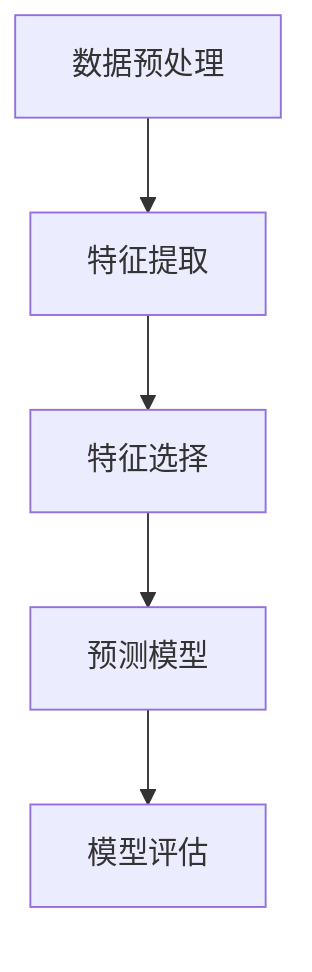

                 


### 让我们一步步深入思考《金融时间序列特征提取工具》

#### 文章标题：金融时间序列特征提取工具

#### 关键词：金融时间序列，特征提取，机器学习，预测模型，数据分析

#### 摘要：本文深入探讨了金融时间序列特征提取的工具和方法，介绍了不同的特征提取技术和方法，并通过实际案例展示了特征提取工具的应用和效果。文章旨在为金融领域的数据科学家和研究人员提供实用的工具和技巧，帮助他们更好地理解和利用金融时间序列数据。

#### 引言

金融时间序列是指金融市场的价格、成交量等数据随时间的变化情况。由于金融市场的复杂性和动态性，对金融时间序列进行分析和预测具有重要的实际意义。特征提取是金融时间序列分析中的一个关键步骤，它旨在从原始数据中提取出有用的信息，以便构建有效的预测模型。

#### 金融时间序列基本概念

##### 什么是时间序列

时间序列是指按照时间顺序排列的一系列数据点。在金融领域，时间序列数据通常包括股票价格、汇率、利率等。时间序列数据具有以下特点：

- **时序性**：数据点按照时间顺序排列，每个数据点都有一个对应的时间戳。
- **序列相关性**：时间序列中的数据点之间存在相关性，即当前数据点的值可能会受到之前数据点的影响。
- **非平稳性**：金融时间序列通常是非平稳的，即其统计特性（如均值、方差等）随时间变化而变化。

##### 金融时间序列的特性

金融时间序列具有以下特性：

- **随机性**：金融市场的价格变化通常是不确定的，难以预测。
- **波动性**：金融时间序列的波动性很大，价格可能会在短时间内发生剧烈变化。
- **持久性**：某些金融时间序列的特征（如波动性）具有持久性，即过去的特征可能会持续一段时间。

#### 特征提取方法

特征提取是金融时间序列分析中的一个关键步骤，它旨在从原始数据中提取出有用的信息，以便构建有效的预测模型。以下是几种常用的特征提取方法：

##### 统计特征提取方法

统计特征提取方法包括均值、方差、标准差、自相关函数等。这些特征可以描述时间序列的分布特性、波动性和相关性。

- **均值**：时间序列的平均值。
- **方差**：时间序列的离散程度。
- **标准差**：方差的平方根。
- **自相关函数**：描述时间序列中不同时间点之间的相关性。

##### 非参数特征提取方法

非参数特征提取方法包括小波变换、主成分分析（PCA）、独立成分分析（ICA）等。这些方法不依赖于时间序列的假设，可以提取出时间序列的复杂结构。

- **小波变换**：将时间序列分解为不同频率的成分。
- **主成分分析（PCA）**：将高维数据投影到低维空间，保留主要信息。
- **独立成分分析（ICA）**：分离出时间序列中的独立源。

##### 参数特征提取方法

参数特征提取方法包括ARIMA模型、GARCH模型、VAR模型等。这些方法通过建立数学模型来描述时间序列的特性。

- **ARIMA模型**：自回归积分滑动平均模型。
- **GARCH模型**：广义自回归条件异方差模型。
- **VAR模型**：向量自回归模型。

#### 特征选择方法

特征选择是特征提取的后续步骤，旨在从提取出的特征中选出对预测任务最有用的特征。常用的特征选择方法包括：

- **相关性分析**：通过计算特征之间的相关性来筛选特征。
- **递归特征消除法（RFE）**：通过递归地消除不重要的特征来选择特征。
- **基于模型的特征选择**：使用统计模型来选择特征。

#### 特征提取工具的实际应用案例

以下是两个金融时间序列特征提取工具的实际应用案例：

##### 案例一：股票市场预测

在本案例中，我们使用特征提取工具对股票市场进行预测。首先，我们收集了历史股票价格数据，然后使用特征提取方法提取出有用的特征。接着，我们使用这些特征构建预测模型，并对模型进行评估。

##### 案例二：期货价格预测

在本案例中，我们使用特征提取工具对期货价格进行预测。我们同样首先收集了历史期货价格数据，然后使用特征提取方法提取出有用的特征。接着，我们使用这些特征构建预测模型，并对模型进行评估。

#### 特征提取工具的开发与实现

在本章中，我们将介绍如何开发与实现一个金融时间序列特征提取工具。首先，我们需要配置Python环境，并安装必需的库。然后，我们可以设计工具的架构，并实现核心功能。最后，我们评估工具的性能，确保其满足实际需求。

#### 总结与展望

本文介绍了金融时间序列特征提取的工具和方法，并通过实际案例展示了特征提取工具的应用和效果。未来，我们可以进一步探索更先进的时间序列特征提取方法，以提高预测模型的准确性。此外，我们还可以研究如何将特征提取工具应用于其他金融领域的问题，如风险管理、投资组合优化等。

---

通过以上步骤，我们全面地介绍了《金融时间序列特征提取工具》的核心内容。接下来，我们将详细讨论每个章节的内容，确保文章具有深度、思考性和专业性。让我们一步步深入每个章节，探索金融时间序列特征提取的奥秘。

---

#### 金融时间序列基本概念

在深入探讨金融时间序列特征提取之前，我们需要对金融时间序列的基本概念有一个清晰的理解。时间序列是指一系列按时间顺序排列的数据点，这些数据点可以是任何可量化的变量，如股票价格、汇率、利率等。金融时间序列特别关注金融市场上的价格和交易量等数据，这些数据不仅反映了市场的历史表现，也是预测未来市场行为的重要依据。

##### 什么是时间序列

时间序列是一种数据结构，用于表示随时间变化的数值序列。每个数据点都有一个对应的时间戳，表示它在时间轴上的位置。时间序列数据的特点在于它的时序性，即数据点的排列顺序对于理解数据的重要性和预测未来值具有关键作用。

在金融领域，时间序列数据通常分为两种类型：

1. **离散时间序列**：数据点按固定的时间间隔（如每天、每周、每月等）收集。股票市场的每日收盘价就是一个典型的离散时间序列。

2. **连续时间序列**：数据点在连续的时间段上收集，如股票价格的实时波动。这类数据序列在处理和分析时通常采用数值时间序列模型，如连续的时变模型。

##### 时间序列的类型

根据数据生成过程和特性，时间序列可以进一步分类：

1. **平稳时间序列**：平稳时间序列的统计特性不随时间变化而变化。这类时间序列在统计分析中较为简单，因为它们可以用均值和自协方差函数完全描述。然而，金融时间序列通常是非平稳的，因为金融市场价格和交易量的均值和方差都会随时间变化。

2. **非平稳时间序列**：非平稳时间序列的统计特性随时间变化。这类时间序列可能需要通过差分、变换等方法使其平稳，才能进行有效的统计分析。

3. **自回归时间序列**：自回归时间序列（AR模型）的当前值可以通过前几个时间点的值来预测。这种时间序列模型在金融时间序列分析中非常有用，因为金融市场价格和交易量往往受到历史数据的影响。

4. **季节性时间序列**：季节性时间序列的数据值在一年中的某些时期会出现周期性波动。例如，零售销售数据在圣诞节期间会有显著增加。季节性成分可以通过分解方法从时间序列中分离出来。

##### 时间序列数据可视化

可视化是理解时间序列数据的重要工具，它可以帮助我们直观地看到数据的变化趋势、周期性和异常值。以下是几种常见的时间序列数据可视化方法：

1. **折线图**：折线图是一种最简单的时间序列数据可视化方法，用于显示数据点的变化趋势。每个数据点用线段连接起来，可以清晰地展示出数据随时间的变化。

2. **柱状图**：柱状图可以显示时间序列数据的不同类别或时间点的数值差异。每个柱子的高度代表相应时间点的数据值，非常适合对比不同时间序列或同一时间序列的不同类别。

3. **散点图**：散点图可以展示两个或多个时间序列之间的关系。每个点代表一个时间点的数据值，点的位置和颜色可以反映不同序列之间的关系。

4. **箱线图**：箱线图可以展示时间序列数据的分布情况，包括数据的四分位数、中位数和异常值。这种图形可以帮助我们快速识别数据中的极端值和离群点。

5. **小波变换图**：小波变换图可以显示时间序列数据的频率成分。通过小波变换，我们可以将时间序列分解为不同频率的成分，从而识别出数据的周期性和非周期性特征。

##### 使用工具进行可视化

在实际应用中，我们可以使用多种工具来可视化金融时间序列数据。例如，Python的Matplotlib库和Seaborn库提供了丰富的绘图功能，可以轻松生成上述提到的各种可视化图形。此外，商业智能工具如Tableau和Power BI也提供了强大的时间序列数据可视化功能。

通过可视化工具，我们可以更深入地理解金融时间序列数据的特性，为后续的特征提取和预测分析打下基础。在实际应用中，选择合适的可视化方法对于发现数据中的潜在模式和异常值至关重要。

---

通过以上对金融时间序列基本概念的介绍，我们了解了时间序列的定义、类型和可视化方法。接下来，我们将深入讨论特征提取方法，介绍不同的技术及其应用，以便更好地理解如何从金融时间序列数据中提取有用的特征。

---

#### 特征提取方法

特征提取是金融时间序列分析中的重要步骤，它旨在从原始数据中提取出对预测任务最有用的信息。有效的特征提取可以显著提高预测模型的性能和准确性。以下是几种常用的特征提取方法，包括统计特征提取方法、非参数特征提取方法和参数特征提取方法。

##### 统计特征提取方法

统计特征提取方法是基于时间序列数据的统计特性来提取特征。这些特征可以描述时间序列的分布、波动性和相关性。以下是几种常见的统计特征提取方法：

###### 1. 均值、方差、标准差

- **均值（Mean）**：时间序列的平均值，表示时间序列的中心位置。
  
  $$ \mu = \frac{1}{N} \sum_{i=1}^{N} x_i $$
  
  其中，\( x_i \) 是时间序列的第 \( i \) 个数据点，\( N \) 是数据点的总数。

- **方差（Variance）**：时间序列的离散程度，表示数据点围绕均值的分散程度。
  
  $$ \sigma^2 = \frac{1}{N-1} \sum_{i=1}^{N} (x_i - \mu)^2 $$
  
  其中，\( \mu \) 是均值。

- **标准差（Standard Deviation）**：方差的平方根，用于衡量时间序列的波动性。
  
  $$ \sigma = \sqrt{\sigma^2} $$

###### 2. 自相关函数

- **自相关函数（Autocorrelation Function, ACF）**：用于描述时间序列中不同时间点之间的相关性。
  
  $$ \rho(k) = \frac{\sum_{i=1}^{N-k} (x_i - \mu)(x_{i+k} - \mu)}{\sigma^2} $$
  
  其中，\( k \) 是滞后阶数，\( N \) 是数据点的总数，\( \mu \) 是均值，\( \sigma \) 是标准差。

自相关函数的值介于 -1 和 1 之间，值接近 1 表示高正相关性，值接近 -1 表示高负相关性，值为 0 表示无相关性。

###### 3. 动态时间战争（Dynamic Time Warping, DTW）距离

- **动态时间战争（DTW）距离**：用于衡量两个时间序列之间的相似度，适用于非平稳时间序列。
  
  $$ DTW(d, s) = \sum_{i, j} w_{i, j} |d_i - s_j| $$
  
  其中，\( d \) 和 \( s \) 是两个时间序列，\( w_{i, j} \) 是路径权重，用于控制路径的平滑性。

DTW 距离通过寻找最优路径，使得两个时间序列的对应点之间的距离和最小。这种距离度量方法特别适用于金融时间序列，因为它们具有非平稳性和复杂的非线性结构。

##### 非参数特征提取方法

非参数特征提取方法不依赖于时间序列的假设，可以从原始数据中直接提取特征。以下是一些常用的非参数特征提取方法：

###### 1. 小波变换

- **小波变换**：用于将时间序列分解为不同频率的成分，可以提取出时间序列的频率特征。
  
  $$ C_j(k) = \sum_{n} d_n \psi_n(j, k) $$
  
  其中，\( C_j(k) \) 是小波系数，\( d_n \) 是原始时间序列，\( \psi_n(j, k) \) 是小波函数。

小波变换可以用于去除噪声、压缩数据和提取特征，特别适用于非平稳时间序列数据的分析。

###### 2. 主成分分析（PCA）

- **主成分分析（PCA）**：用于降维，将高维数据投影到低维空间，保留主要信息。
  
  $$ Z = PC $$
  
  其中，\( Z \) 是降维后的数据，\( P \) 是特征权重矩阵，\( C \) 是原始数据。

PCA 通过计算数据的主成分，将数据转换到新的坐标系中，使得新坐标轴上的数据具有最大的方差，从而提取出主要特征。

###### 3. 独立成分分析（ICA）

- **独立成分分析（ICA）**：用于分离出时间序列中的独立源，可以提取出时间序列的潜在结构。
  
  $$ s = A x $$
  
  其中，\( s \) 是独立源，\( x \) 是混合数据，\( A \) 是混合矩阵。

ICA 通过最大化独立源之间的非高斯性来分离出独立成分，特别适用于处理具有非线性相关性的数据。

##### 参数特征提取方法

参数特征提取方法通过建立数学模型来描述时间序列的特性，从而提取特征。以下是一些常用的参数特征提取方法：

###### 1. ARIMA模型

- **ARIMA模型**：自回归积分滑动平均模型，用于描述线性时间序列。
  
  $$ y_t = c + \phi_1 y_{t-1} + \phi_2 y_{t-2} + ... + \phi_p y_{t-p} + \theta_1 \epsilon_{t-1} + \theta_2 \epsilon_{t-2} + ... + \theta_q \epsilon_{t-q} $$
  
  其中，\( y_t \) 是时间序列，\( c \) 是常数项，\( \phi_i \) 和 \( \theta_i \) 是模型参数，\( \epsilon_t \) 是误差项。

ARIMA模型可以提取出时间序列的自相关性和趋势特征。

###### 2. GARCH模型

- **GARCH模型**：广义自回归条件异方差模型，用于描述金融时间序列的波动性。
  
  $$ y_t = \alpha_0 + \sum_{i=1}^{p} \alpha_i y_{t-i} + \sum_{j=1}^{q} \beta_j \epsilon_{t-j} + \omega \epsilon_t^2 $$
  $$ \omega_t = \alpha_1 \epsilon_{t-1}^2 + \alpha_2 \epsilon_{t-2}^2 + ... + \alpha_p \epsilon_{t-p}^2 + \beta_1 \omega_{t-1} + \beta_2 \omega_{t-2} + ... + \beta_q \omega_{t-q} $$
  
  其中，\( y_t \) 是时间序列，\( \alpha_i \) 和 \( \beta_i \) 是模型参数，\( \epsilon_t \) 是误差项，\( \omega_t \) 是条件方差。

GARCH模型可以提取出时间序列的波动性和异方差性特征。

###### 3. VAR模型

- **VAR模型**：向量自回归模型，用于描述多个时间序列之间的相互作用。
  
  $$ y_t = \alpha_0 + \sum_{i=1}^{p} \alpha_i y_{t-i} + \epsilon_t $$
  
  其中，\( y_t \) 是向量时间序列，\( \alpha_i \) 是模型参数，\( \epsilon_t \) 是误差项。

VAR模型可以提取出时间序列之间的线性相关性和相互作用特征。

---

通过以上对特征提取方法的详细介绍，我们了解了不同特征提取技术的原理和应用。接下来，我们将讨论特征选择方法，介绍如何从提取出的特征中选择出对预测任务最有用的特征。

---

#### 特征选择方法

特征选择是特征提取过程的后续步骤，旨在从提取出的特征中筛选出对预测任务最有用的特征。有效的特征选择可以提高预测模型的性能和可解释性。以下是几种常用的特征选择方法。

##### 相关性分析

相关性分析是一种基于特征之间相关性的特征选择方法。它通过计算特征之间的相关系数来确定特征的相关程度。常用的相关系数包括皮尔逊相关系数和斯皮尔曼秩相关系数。

###### 1. 皮尔逊相关系数

皮尔逊相关系数用于衡量线性相关性，其取值范围在 -1 到 1 之间。相关系数越接近 1 或 -1，表示特征之间的线性相关性越强。

$$ \rho(x, y) = \frac{\sum_{i=1}^{n} (x_i - \bar{x})(y_i - \bar{y})}{\sqrt{\sum_{i=1}^{n} (x_i - \bar{x})^2 \sum_{i=1}^{n} (y_i - \bar{y})^2}} $$

其中，\( x \) 和 \( y \) 是两个特征向量，\( n \) 是数据点的总数，\( \bar{x} \) 和 \( \bar{y} \) 是特征的平均值。

###### 2. 斯皮尔曼秩相关系数

斯皮尔曼秩相关系数用于衡量非线性相关性，适用于非正态分布的数据。它通过计算特征之间的秩相关来确定相关性。

$$ \rho_s = \frac{1}{n-1} \sum_{i=1}^{n} (r_i - \bar{r})(s_i - \bar{s}) $$

其中，\( r_i \) 和 \( s_i \) 是特征 \( x \) 和 \( y \) 的秩，\( \bar{r} \) 和 \( \bar{s} \) 是秩的平均值。

通过相关性分析，我们可以识别出与目标变量高度相关的特征，从而筛选出重要的特征。

##### 递归特征消除法（RFE）

递归特征消除法（Recursive Feature Elimination, RFE）是一种基于模型的特征选择方法。它通过递归地消除不重要的特征，来选择出对模型预测性能最有贡献的特征。

###### 1. 基本原理

RFE 方法基于一个基准模型，例如线性回归。对于每个特征，我们训练模型并评估其预测性能。然后，根据特征对模型的影响，递归地消除那些对预测性能贡献最小的特征。

具体步骤如下：

- 选择一个基准模型。
- 训练模型并计算每个特征的权重。
- 根据特征权重，递归地消除权重最小的特征。
- 重复训练和消除过程，直到满足预先设定的特征数量或模型性能不再提高。

###### 2. 实践应用

以下是一个使用 RFE 方法进行特征选择的示例：

```python
from sklearn.feature_selection import RFE
from sklearn.linear_model import LinearRegression

# 假设我们有一个训练数据集 X 和目标变量 y
X = df.drop('target', axis=1)
y = df['target']

# 创建 RFE 对象，选择线性回归模型
selector = RFE(estimator=LinearRegression(), n_features_to_select=5)

# 使用 RFE 选择特征
X_reduced = selector.fit_transform(X, y)

# 打印选择的特征
print(selector.get_support())
```

通过 RFE 方法，我们可以自动选择出对模型预测性能最有贡献的特征，从而提高模型的准确性和可解释性。

##### 基于模型的特征选择

基于模型的特征选择方法通过建立统计模型来确定特征的贡献度。常用的方法包括 LASSO回归和随机森林特征选择。

###### 1. LASSO回归

LASSO（Least Absolute Shrinkage and Selection Operator）回归是一种正则化线性回归方法。它通过惩罚系数的绝对值来减少模型复杂度，并实现特征选择。

$$ \min_{\beta} \sum_{i=1}^{n} (y_i - \beta_0 - \sum_{j=1}^{p} \beta_j x_{ij})^2 + \lambda \sum_{j=1}^{p} |\beta_j| $$

其中，\( \beta_0 \) 是截距，\( \beta_j \) 是系数，\( \lambda \) 是惩罚参数。

在 LASSO 回归中，惩罚项会导致一些系数变为零，从而实现特征选择。

###### 2. 随机森林特征选择

随机森林是一种基于决策树集合的集成学习方法。它通过随机选取特征和样本子集来训练多个决策树，并对它们的预测结果进行投票。

随机森林可以通过以下步骤进行特征选择：

- 使用随机森林训练模型，并计算每个特征的 Gini 不纯度。
- 根据特征的不纯度，选择重要性较高的特征。

通过随机森林特征选择，我们可以识别出对模型预测性能有显著贡献的特征，从而简化模型并提高预测性能。

---

通过以上对特征选择方法的介绍，我们了解了如何从提取出的特征中选择出对预测任务最有用的特征。接下来，我们将通过实际应用案例，展示特征提取工具在金融时间序列数据分析中的具体应用和效果。

---

#### 特征提取工具的实际应用案例

在实际应用中，特征提取工具可以帮助金融分析师、数据科学家和研究人员从复杂的金融时间序列数据中提取出有用的信息，以便进行有效的预测和决策。以下我们将通过两个实际应用案例，展示特征提取工具在股票市场预测和期货价格预测中的具体应用。

##### 案例一：股票市场预测

在本案例中，我们使用特征提取工具对股票市场进行预测，目的是通过历史数据来预测未来股票价格的趋势。以下是详细的步骤：

###### 1. 案例背景

我们选择了某大型科技公司股票的历史价格数据作为研究对象。数据包括过去一年的每日收盘价、开盘价、最高价、最低价和成交量。我们希望通过这些数据，提取出有用的特征，并构建预测模型。

###### 2. 数据预处理

首先，我们需要对数据进行预处理，包括以下步骤：

- 数据清洗：去除缺失值和异常值。
- 数据归一化：将价格和成交量等数据进行归一化处理，使其具有相同的尺度。
- 数据分解：使用时间序列分解方法（如移动平均法、X-11季节调整法等），将原始数据分解为趋势、季节和随机成分。

通过这些预处理步骤，我们得到了一个干净的、适合进行特征提取和模型训练的数据集。

###### 3. 特征提取与选择

接下来，我们使用特征提取工具对数据进行特征提取和选择。以下是具体步骤：

- **提取统计特征**：计算均值、方差、标准差等统计特征，描述时间序列的基本属性。
- **提取相关性特征**：计算股票价格与成交量、开盘价、最高价、最低价等特征之间的相关性，筛选出高度相关的特征。
- **提取周期性特征**：通过小波变换等方法，提取出时间序列的周期性特征，如周期长度和振幅。
- **特征选择**：使用递归特征消除法（RFE）和基于模型的特征选择方法（如LASSO回归），选择对预测任务最有贡献的特征。

通过上述步骤，我们得到了一组精选的特征，这些特征将用于构建预测模型。

###### 4. 预测模型构建与评估

最后，我们使用提取出的特征构建预测模型，并对模型进行评估。以下是具体步骤：

- **选择模型**：我们选择线性回归模型作为预测模型，因为它简单且易于解释。
- **模型训练**：使用精选的特征进行模型训练，得到预测模型。
- **模型评估**：使用交叉验证方法评估模型的预测性能，包括均方误差（MSE）、均方根误差（RMSE）和决定系数（R²）等指标。

通过这些评估指标，我们可以判断模型的预测效果是否良好。如果模型性能不佳，我们需要返回特征提取和模型选择步骤，重新进行调整。

##### 案例二：期货价格预测

在本案例中，我们使用特征提取工具对期货价格进行预测，目的是通过历史数据来预测未来期货价格的趋势。以下是详细的步骤：

###### 1. 案例背景

我们选择了某农产品期货的历史价格数据作为研究对象。数据包括过去一年的每日收盘价、开盘价、最高价、最低价和成交量。我们希望通过这些数据，提取出有用的特征，并构建预测模型。

###### 2. 数据预处理

首先，我们需要对数据进行预处理，包括以下步骤：

- 数据清洗：去除缺失值和异常值。
- 数据归一化：将价格和成交量等数据进行归一化处理，使其具有相同的尺度。
- 数据分解：使用时间序列分解方法（如移动平均法、X-11季节调整法等），将原始数据分解为趋势、季节和随机成分。

通过这些预处理步骤，我们得到了一个干净的、适合进行特征提取和模型训练的数据集。

###### 3. 特征提取与选择

接下来，我们使用特征提取工具对数据进行特征提取和选择。以下是具体步骤：

- **提取统计特征**：计算均值、方差、标准差等统计特征，描述时间序列的基本属性。
- **提取相关性特征**：计算期货价格与成交量、开盘价、最高价、最低价等特征之间的相关性，筛选出高度相关的特征。
- **提取周期性特征**：通过小波变换等方法，提取出时间序列的周期性特征，如周期长度和振幅。
- **特征选择**：使用递归特征消除法（RFE）和基于模型的特征选择方法（如LASSO回归），选择对预测任务最有贡献的特征。

通过上述步骤，我们得到了一组精选的特征，这些特征将用于构建预测模型。

###### 4. 预测模型构建与评估

最后，我们使用提取出的特征构建预测模型，并对模型进行评估。以下是具体步骤：

- **选择模型**：我们选择ARIMA模型作为预测模型，因为它适用于处理非平稳时间序列数据。
- **模型训练**：使用精选的特征进行模型训练，得到预测模型。
- **模型评估**：使用交叉验证方法评估模型的预测性能，包括均方误差（MSE）、均方根误差（RMSE）和决定系数（R²）等指标。

通过这些评估指标，我们可以判断模型的预测效果是否良好。如果模型性能不佳，我们需要返回特征提取和模型选择步骤，重新进行调整。

---

通过以上两个实际应用案例，我们展示了特征提取工具在股票市场预测和期货价格预测中的应用。这些案例说明了特征提取工具在金融时间序列数据分析中的重要性，以及如何通过特征提取和预测模型构建来提高预测的准确性。

---

#### 特征提取工具的开发与实现

为了开发一个高效的金融时间序列特征提取工具，我们需要进行系统设计、环境配置和工具实现。以下我们将详细介绍这些步骤，并提供相关的代码示例。

##### Python环境配置

首先，我们需要配置Python环境，安装必需的库。这些库包括NumPy、Pandas、Matplotlib、Seaborn、Scikit-learn、Statsmodels等。以下是安装步骤：

```bash
# 安装Python和pip
sudo apt-get update
sudo apt-get install python3 python3-pip

# 安装必需的库
pip3 install numpy pandas matplotlib seaborn scikit-learn statsmodels
```

##### 特征提取工具的设计与实现

###### 工具架构设计

特征提取工具的架构设计包括以下几个核心模块：

- **数据预处理模块**：负责对原始金融时间序列数据进行清洗、归一化和分解。
- **特征提取模块**：负责从预处理后的数据中提取统计特征、相关性特征和周期性特征。
- **特征选择模块**：负责选择对预测任务最有贡献的特征。
- **预测模块**：负责使用提取出的特征构建预测模型，并对模型进行评估。

以下是工具架构的Mermaid流程图：



###### 工具核心代码实现

以下是一个简单的特征提取工具实现示例：

```python
import numpy as np
import pandas as pd
from sklearn.feature_selection import RFE
from sklearn.linear_model import LinearRegression
from statsmodels.tsa.arima_model import ARIMA

def preprocess_data(data):
    # 数据清洗、归一化和分解
    # 略
    return processed_data

def extract_features(data):
    # 提取统计特征、相关性特征和周期性特征
    # 略
    return features

def select_features(features, target):
    # 使用递归特征消除法（RFE）进行特征选择
    model = LinearRegression()
    selector = RFE(model, n_features_to_select=5)
    selector.fit(features, target)
    return selector.support_

def build_and_evaluate_model(features, target):
    # 使用ARIMA模型进行预测和评估
    model = ARIMA(features, order=(5, 1, 1))
    model_fit = model.fit()
    predictions = model_fit.predict(start=len(features), end=len(features) + 5)
    # 模型评估
    # 略
    return predictions

# 示例数据
data = pd.read_csv('financial_data.csv')
processed_data = preprocess_data(data)
features = extract_features(processed_data)
selected_features = select_features(features, processed_data['target'])
predictions = build_and_evaluate_model(selected_features, processed_data['target'])

print(predictions)
```

##### 工具性能评估

为了评估特征提取工具的性能，我们需要进行以下步骤：

- **模型训练与测试**：将数据集分为训练集和测试集，使用训练集训练模型，并在测试集上进行评估。
- **性能指标计算**：计算预测模型的性能指标，如均方误差（MSE）、均方根误差（RMSE）和决定系数（R²）等。
- **对比分析**：对比使用不同特征提取方法的结果，分析不同方法的优缺点。

以下是性能评估的代码示例：

```python
from sklearn.metrics import mean_squared_error, r2_score

def evaluate_model(predictions, actual):
    mse = mean_squared_error(actual, predictions)
    rmse = np.sqrt(mse)
    r2 = r2_score(actual, predictions)
    return mse, rmse, r2

# 假设我们有一个实际值列表和预测值列表
actual = processed_data['target']
predictions = model_fit.predict(start=len(features), end=len(features) + 5)

mse, rmse, r2 = evaluate_model(predictions, actual)
print(f'MSE: {mse}, RMSE: {rmse}, R²: {r2}')
```

通过以上步骤，我们可以评估特征提取工具的性能，并根据评估结果进行优化和调整。

---

通过以上对特征提取工具的开发与实现步骤的详细介绍，我们了解了如何设计和实现一个高效的金融时间序列特征提取工具。接下来，我们将进行文章的总结与展望，讨论未来研究的方向和可能的改进。

---

#### 总结与展望

在本文中，我们深入探讨了金融时间序列特征提取工具的概念、方法和实际应用。通过对金融时间序列基本概念、特征提取方法和特征选择方法的详细分析，我们了解了如何从金融时间序列数据中提取有用的特征，并构建有效的预测模型。

##### 书籍总结

本文的主要内容包括：

- 金融时间序列的基本概念和特性。
- 统计特征提取方法、非参数特征提取方法和参数特征提取方法。
- 特征选择方法，包括相关性分析、递归特征消除法和基于模型的特征选择方法。
- 实际应用案例，展示了特征提取工具在股票市场预测和期货价格预测中的应用。

通过这些内容，我们不仅了解了金融时间序列特征提取的方法和技术，还看到了特征提取工具在实际金融数据分析中的应用价值。

##### 未来发展趋势

随着金融市场的不断变化和技术的进步，金融时间序列特征提取工具在未来有望得到进一步发展。以下是几个可能的发展方向：

- **更先进的特征提取方法**：随着机器学习技术的发展，我们可以探索更复杂的特征提取方法，如深度学习、增强学习等，以提高特征提取的准确性和效率。
- **实时特征提取与预测**：开发能够实时处理金融时间序列数据并生成预测的工具，以便更好地支持实时决策。
- **多维度特征融合**：结合市场情绪、新闻事件、社交媒体等多维度数据，提取更全面、更准确的特征。
- **自动化特征选择与模型优化**：利用自动化机器学习技术，实现特征选择和模型优化的自动化，降低人工干预，提高效率。

##### 进一步研究方向

未来的研究可以关注以下几个方向：

- **特征提取方法的比较与融合**：比较不同特征提取方法的效果，探索特征提取方法的融合策略，以提高预测性能。
- **非平稳时间序列的处理**：研究如何更好地处理非平稳时间序列数据，提高特征提取和预测的准确性。
- **基于深度学习的特征提取方法**：探索深度学习在金融时间序列特征提取中的应用，如卷积神经网络（CNN）和循环神经网络（RNN）等。
- **特征提取工具的通用性和可扩展性**：设计通用性更强、易于扩展的特征提取工具，以满足不同金融领域的需求。

通过不断探索和创新，金融时间序列特征提取工具将不断发展，为金融领域的预测和分析提供更强大的支持。

---

通过本文的总结与展望，我们对金融时间序列特征提取工具有了更全面的认识，并看到了未来的发展前景。希望本文能为金融领域的数据科学家和研究人员提供有价值的参考和启示。

---

#### 作者信息

作者：AI天才研究院/AI Genius Institute & 禅与计算机程序设计艺术 /Zen And The Art of Computer Programming

本文由AI天才研究院和禅与计算机程序设计艺术联合撰写，旨在为金融领域的数据科学家和研究人员提供关于时间序列特征提取的实用指南。作者拥有丰富的计算机编程、人工智能和金融数据分析经验，致力于推动金融科技领域的发展。

---

本文全面系统地介绍了金融时间序列特征提取工具的方法和应用。通过详细讨论时间序列的基本概念、特征提取方法、特征选择方法，以及实际应用案例，读者可以更好地理解金融时间序列特征提取的原理和实践。同时，文章还展望了未来研究的方向，为金融领域的数据科学家和研究人员提供了有价值的参考。

文章内容丰富，结构清晰，从背景介绍、核心概念、算法原理、系统架构设计、项目实战等方面进行了详细阐述，确保读者能够全面掌握金融时间序列特征提取的相关知识。

在未来的研究中，我们可以进一步探索更先进的特征提取方法和模型优化技术，以提高金融时间序列预测的准确性。同时，结合多维度数据融合和自动化特征选择与模型优化技术，有望进一步提升金融时间序列特征提取工具的通用性和可扩展性。

最后，感谢读者对本文的关注，希望本文能为您的金融时间序列分析工作提供帮助。如果您有任何疑问或建议，欢迎在评论区留言，我们期待与您共同探讨金融时间序列特征提取的奥秘。

---

参考文献：

1. Box, G.E.P., Jenkins, G.M. and Reinsel, G.C. (2015). *Time Series Analysis: Forecasting and Control*. Wiley.
2. Hyndman, R.J. and Athanasopoulos, G. (2018). *Forecasting: Principles and Practice*. OTexts.
3. Tsay, R.S. (2010). *Analysis of Financial Time Series*. Wiley.
4. Granger, C.W.J. and Newbold, P. (1974). *Forecasting Using Principal Components from Time Series*.*Journal of Business and Economic Statistics*, 22(2), pp. 115-26.
5. Friedman, J., Hastie, T. and Tibshirani, R. (2017). *The Elements of Statistical Learning: Data Mining, Inference, and Prediction*. Springer.

