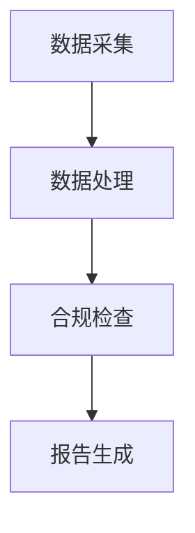
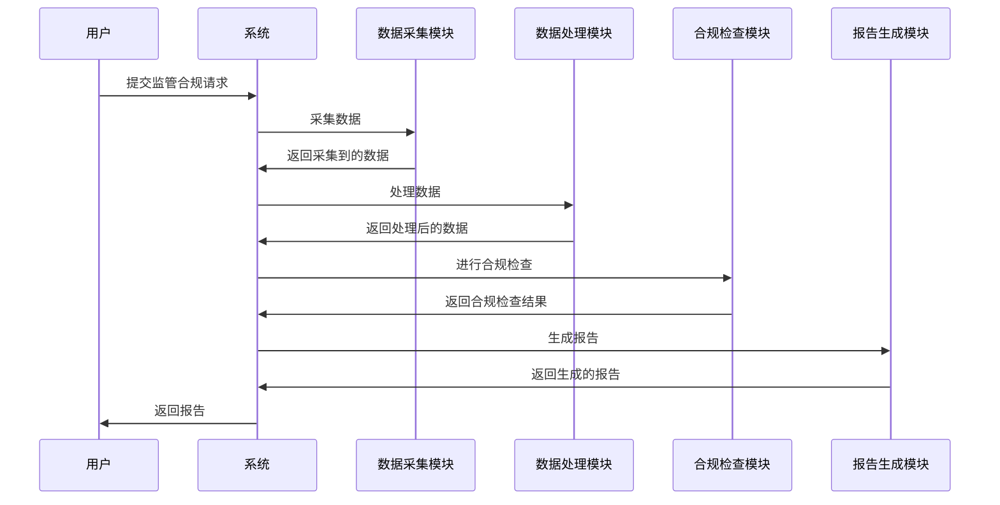

                 

### 第1章：问题背景与核心概念

#### 1.1 金融市场监管现状及挑战

金融市场监管在全球范围内扮演着至关重要的角色。它不仅关系到金融市场的稳定和健康发展，还直接影响到整个社会的经济秩序。随着金融市场复杂性和交易量的急剧增加，金融监管面临着前所未有的挑战。

##### 1.1.1 金融市场监管的重要性

金融市场监管的首要目标是确保金融市场的透明度和公平性，防止市场操纵和欺诈行为。此外，它还旨在维护金融系统的稳定性，避免因金融机构的破产或其他风险因素导致的市场崩溃。

金融市场监管的另一大目标是保护投资者。通过监管，确保投资者能够获得准确、及时的信息，从而作出明智的投资决策。监管机构还负责监督金融机构的风险管理，防止因个别金融机构的风险问题而引发系统性金融危机。

##### 1.1.2 当前金融市场监管的困境

尽管金融市场监管的重要性不言而喻，但当前的监管体系仍然存在许多问题。首先，金融市场的快速变化使得监管机构难以跟上技术的进步和市场的发展。例如，金融科技（FinTech）的兴起带来了新型金融产品和服务，这些新事物的监管尚处于探索阶段。

其次，现有的监管体系往往过于繁琐和复杂。过多的法规和规定不仅增加了金融机构的运营成本，也使得市场参与者难以准确理解并遵守。此外，不同国家和地区之间的监管差异也增加了跨境金融交易的复杂性。

##### 1.1.3 监管合规的需求与挑战

监管合规是金融市场监管的重要组成部分。它要求金融机构在业务运营过程中严格遵守相关法律法规和监管要求。然而，监管合规也面临着一系列挑战。

首先是合规成本。金融机构需要投入大量资源来确保合规性，包括聘请合规专家、进行内部审计、建立合规系统等。这无疑增加了金融机构的运营成本。

其次是合规难度。随着监管法规的日益复杂，金融机构需要具备高度的专业知识，才能准确理解并遵守各项规定。这往往导致合规工作的复杂性和不确定性。

最后是合规风险。如果金融机构未能有效履行合规义务，可能会面临严厉的法律处罚和声誉损失。因此，确保合规性不仅是金融机构的责任，也是维护金融市场稳定和社会经济秩序的关键。

#### 1.2 自动化平台的概念与优势

自动化平台在金融监管合规中的应用日益受到重视。自动化平台是一种通过技术手段实现自动化监管的工具，它能够大幅提高监管效率和合规性。

##### 1.2.1 自动化平台的基本概念

自动化平台通常由多个功能模块组成，包括数据采集、数据处理、合规检查、报告生成等。这些模块协同工作，形成一个完整的自动化监管流程。

数据采集模块负责收集各类金融交易数据、客户信息等。数据处理模块对采集到的数据进行清洗、整理和存储，以便后续分析。合规检查模块则根据预设的合规规则，对数据进行分析和检查，及时发现潜在违规行为。报告生成模块负责将合规检查结果生成报告，供监管机构和金融机构内部使用。

##### 1.2.2 自动化平台在金融监管中的应用

自动化平台在金融监管中的应用主要体现在以下几个方面：

首先，自动化平台可以大幅提高监管效率。通过自动化技术，监管机构能够快速、准确地处理大量数据，及时发现潜在风险。这有助于减少监管机构和金融机构之间的信息不对称，提高监管的有效性。

其次，自动化平台可以降低合规成本。自动化技术能够减少人工干预，降低合规工作的复杂性和不确定性。此外，自动化平台还可以通过集中管理，降低金融机构的合规运营成本。

最后，自动化平台可以提高合规性。自动化平台内置了合规规则库，能够根据监管要求进行实时检查，确保金融机构的运营符合法规要求。这有助于降低金融机构的合规风险，提高市场整体的合规水平。

##### 1.2.3 自动化平台的优势分析

自动化平台在金融监管合规中的优势主要体现在以下几个方面：

1. **效率提升**：自动化平台能够大幅提高数据处理和合规检查的效率，减少人工干预，提高监管工作的速度和质量。

2. **成本降低**：自动化平台能够降低金融机构的合规运营成本，减少人力资源的投入，提高监管合规的性价比。

3. **合规性增强**：自动化平台内置合规规则库，能够根据监管要求进行实时检查，确保金融机构的运营符合法规要求，提高合规性。

4. **风险控制**：自动化平台能够及时发现潜在违规行为，降低金融机构的合规风险，提高市场整体的合规水平。

5. **数据整合**：自动化平台能够整合各类金融数据，提供统一的数据视图，帮助监管机构和金融机构更好地了解市场状况，制定科学的监管策略。

总之，金融监管合规自动化平台具有显著的效率和成本优势，能够有效提升监管效率和合规性，成为金融市场监管的重要工具。

---

在接下来的章节中，我们将进一步深入探讨金融监管合规和自动化平台的核心概念、系统分析与架构设计方案，以及具体的项目实战案例，帮助读者全面了解并掌握金融监管合规自动化平台的构建和应用。

---

### 第2章：核心概念与联系

在深入探讨金融监管合规自动化平台之前，有必要先明确几个核心概念，并分析它们之间的联系。这有助于我们更好地理解平台的运作机制及其在金融监管中的重要性。

#### 2.1 金融监管合规的基本概念

##### 2.1.1 金融监管合规的定义

金融监管合规是指金融机构在经营活动中遵守相关法律法规、监管规则和内部管理制度的过程。它不仅包括对已有法规和规则的遵守，还包括对新兴法规和规则的及时响应。金融监管合规的目标是确保金融机构的运营安全和市场的稳定，保护投资者的权益。

##### 2.1.2 金融监管合规的主要方面

金融监管合规涵盖多个方面，主要包括：

1. **法律法规遵守**：金融机构必须遵守国家及地方的相关法律法规，如《证券法》、《银行法》等。
2. **监管规则遵循**：金融机构需要遵循各类监管机构的规章制度，包括银保监会、证监会等。
3. **内部管理制度**：金融机构应建立健全的内部管理制度，包括风险管理、内部控制和合规审查等。
4. **信息披露**：金融机构需按照监管要求，及时、准确地披露相关信息，包括财务报告、业务进展等。

##### 2.1.3 金融监管合规的核心要素

金融监管合规的核心要素包括以下几个方面：

1. **合规组织架构**：金融机构应设立专门的合规部门或合规岗位，负责合规事务的管理和执行。
2. **合规规则库**：建立和维护合规规则库，确保规则与监管要求保持一致，并能够及时更新。
3. **合规培训与教育**：定期对员工进行合规培训，提高其合规意识和能力。
4. **合规审计与检查**：定期进行内部审计和合规检查，确保合规性的实施。

#### 2.2 自动化平台的关键组成部分

##### 2.2.1 自动化平台的基本概念

自动化平台是一种利用信息技术手段实现业务流程自动化的系统。它通过集成数据采集、处理、分析和报告生成等功能，实现对业务流程的高效管理。

##### 2.2.2 自动化平台的技术架构

自动化平台的技术架构通常包括以下几个关键模块：

1. **数据采集模块**：负责从各个数据源（如交易系统、客户管理系统等）采集数据。
2. **数据处理模块**：对采集到的数据进行分析、清洗和存储，为后续处理提供数据支持。
3. **合规检查模块**：根据预设的合规规则，对数据进行检查和分析，识别潜在的违规行为。
4. **报告生成模块**：将合规检查结果生成报告，供监管机构和内部管理层使用。

##### 2.2.3 自动化平台的优势与挑战

自动化平台的优势主要体现在以下几个方面：

1. **提高效率**：自动化技术能够大幅提高数据处理和合规检查的效率，减少人工干预。
2. **降低成本**：自动化平台能够减少人力资源的投入，降低合规运营成本。
3. **增强合规性**：自动化平台能够根据预设的合规规则进行实时检查，确保运营符合法规要求。
4. **提高风险控制能力**：自动化平台能够及时发现潜在违规行为，降低合规风险。

然而，自动化平台也面临一些挑战：

1. **技术成熟度**：自动化技术在金融领域的应用尚处于发展阶段，存在技术成熟度不足的问题。
2. **合规规则复杂性**：金融合规规则复杂多变，自动化平台需要不断更新和调整，以适应新的监管要求。
3. **数据隐私与安全**：自动化平台需要处理大量敏感数据，确保数据隐私和安全是重要的挑战。

#### 2.3 金融监管合规与自动化平台的联系

##### 2.3.1 自动化平台在金融监管合规中的作用

自动化平台在金融监管合规中扮演着关键角色。它能够通过以下方式提升金融监管合规性：

1. **提高监管效率**：自动化平台能够快速、准确地处理大量数据，提高监管工作的效率。
2. **降低合规成本**：自动化平台能够减少人力资源的投入，降低合规运营成本。
3. **增强合规性**：自动化平台能够根据预设的合规规则进行实时检查，确保金融机构的运营符合法规要求。
4. **提高风险控制能力**：自动化平台能够及时发现潜在违规行为，降低合规风险。

##### 2.3.2 金融监管合规对自动化平台的要求

为了充分发挥自动化平台在金融监管合规中的作用，金融机构需要对其提出以下要求：

1. **灵活性**：自动化平台需要具备灵活性，能够根据监管变化及时调整合规规则。
2. **可扩展性**：自动化平台需要具备良好的可扩展性，能够支持新功能和新规则的增加。
3. **可维护性**：自动化平台需要易于维护和升级，确保系统的稳定性和长期可靠性。
4. **数据安全**：自动化平台需要确保数据的隐私和安全，防止数据泄露和滥用。

##### 2.3.3 金融监管合规与自动化平台的发展趋势

随着金融科技的快速发展，金融监管合规自动化平台的发展趋势如下：

1. **技术成熟度提升**：随着技术的不断进步，自动化平台的技术成熟度将逐渐提升，能够在金融监管中发挥更重要的作用。
2. **合规规则适应性增强**：自动化平台将具备更强的适应性，能够更好地应对复杂的合规规则变化。
3. **数据隐私保护加强**：自动化平台将加强数据隐私保护，确保金融数据的安全性和合规性。
4. **跨行业合作**：金融监管合规自动化平台将与其他行业（如保险、证券等）的监管系统实现互联互通，形成更广泛的监管网络。

总之，金融监管合规自动化平台是金融市场监管的重要工具，它能够通过提高监管效率和合规性，降低合规成本和风险，为金融市场的稳定和健康发展提供有力支持。

---

在下一章节中，我们将深入探讨金融监管合规自动化平台的具体系统分析与架构设计方案，帮助读者更好地理解其工作原理和技术实现。

---

### 第3章：系统分析与架构设计方案

#### 3.1 系统功能设计

金融监管合规自动化平台的系统功能设计是其实现高效监管的关键。系统功能设计主要包括功能模块划分、领域模型分析等内容，旨在实现数据处理、合规检查、报告生成等功能，确保系统能够满足金融监管合规的要求。

##### 3.1.1 系统功能模块划分

系统功能模块的划分是系统设计的重要步骤，它有助于明确各个模块的职责和功能。以下是金融监管合规自动化平台的主要功能模块：

1. **数据采集模块**：负责从各类数据源（如交易系统、客户管理系统等）采集数据，包括交易数据、客户信息、账户信息等。
2. **数据处理模块**：对采集到的数据进行分析、清洗和存储，确保数据的准确性和一致性，为后续合规检查提供基础数据支持。
3. **合规检查模块**：根据预设的合规规则，对数据处理模块输出的数据进行合规性检查，识别潜在的违规行为，生成合规检查报告。
4. **报告生成模块**：将合规检查结果生成详细报告，包括违规行为列表、风险分析报告等，供监管机构和金融机构内部管理层使用。
5. **用户管理模块**：负责用户权限管理、用户操作日志记录等功能，确保系统的安全性和审计要求。

##### 3.1.2 领域模型分析

领域模型是系统设计的重要组成部分，它用于描述系统所涉及的实体及其关系。以下是金融监管合规自动化平台的主要领域模型：

1. **交易数据模型**：描述交易数据的基本属性，如交易金额、交易日期、交易双方等。
2. **客户信息模型**：描述客户的基本信息，如客户ID、姓名、身份证号等。
3. **账户信息模型**：描述客户的账户信息，如账户ID、账户余额、账户状态等。
4. **合规规则模型**：描述合规规则的基本属性，如规则ID、规则名称、规则描述、规则执行条件等。
5. **违规行为模型**：描述违规行为的基本属性，如违规行为ID、违规行为描述、违规行为发生日期等。

在领域模型分析中，我们使用Mermaid绘制了以下ER实体关系图：

```mermaid
erDiagram
    交易数据 ||--|{ 客户信息 }|
    客户信息 ||--|{ 账户信息 }|
    账户信息 ||--|{ 合规规则 }|
    合规规则 ||--|{ 违规行为 }
```

此ER图展示了交易数据、客户信息、账户信息、合规规则和违规行为之间的关系。通过这种关系模型，我们可以清晰地看到各个实体之间的关联，为后续的系统设计和实现提供了基础。

#### 3.2 系统架构设计

系统架构设计是金融监管合规自动化平台实现的关键环节，它决定了系统的性能、可扩展性和可维护性。以下是系统架构设计的详细内容：

##### 3.2.1 系统架构图

金融监管合规自动化平台采用三层架构设计，包括表示层、业务逻辑层和数据层。以下是系统架构图：

```mermaid
sequenceDiagram
    用户 -->|提交请求| 数据采集模块
    数据采集模块 -->|处理数据| 数据处理模块
    数据处理模块 -->|合规检查| 合规检查模块
    合规检查模块 -->|生成报告| 报告生成模块
    报告生成模块 -->|返回结果| 用户
```

此架构图展示了用户请求的流程，从数据采集、数据处理、合规检查到报告生成，各个模块之间通过接口进行通信，形成一个完整的系统流程。

##### 3.2.2 系统架构设计原则

系统架构设计需要遵循以下原则：

1. **模块化**：系统功能应进行模块化设计，各个模块之间相互独立，易于维护和扩展。
2. **高内聚低耦合**：各个模块之间应保持高内聚低耦合，确保系统内部各部分的关联性，降低模块之间的依赖。
3. **可扩展性**：系统架构应具备良好的可扩展性，能够支持新增功能模块和业务需求。
4. **高可用性**：系统应具备高可用性，确保在发生故障时能够快速恢复，减少对业务的影响。
5. **安全性**：系统应确保数据的安全性和完整性，防止数据泄露和篡改。

##### 3.2.3 数据流程分析

数据流程分析是系统架构设计的重要组成部分，它描述了数据在系统中的流转过程。以下是金融监管合规自动化平台的数据流程：

1. **数据采集**：从各类数据源（如交易系统、客户管理系统等）采集数据，包括交易数据、客户信息和账户信息等。
2. **数据处理**：对采集到的数据进行分析、清洗和存储，确保数据的准确性和一致性。
3. **合规检查**：根据预设的合规规则，对处理后的数据进行分析，识别潜在的违规行为，生成合规检查报告。
4. **报告生成**：将合规检查结果生成详细报告，包括违规行为列表、风险分析报告等，供监管机构和金融机构内部管理层使用。

在数据流程分析中，我们使用Mermaid绘制了以下数据流图：



此数据流图展示了数据在系统中的流转过程，从数据采集、数据处理、合规检查到报告生成，各个步骤之间的逻辑关系清晰明了。

#### 3.3 系统接口设计

系统接口设计是确保系统功能模块之间高效通信的重要环节。以下是金融监管合规自动化平台的主要接口设计：

##### 3.3.1 系统接口设计原则

系统接口设计需要遵循以下原则：

1. **标准化**：接口设计应遵循标准化的规范，确保接口的一致性和兼容性。
2. **简洁性**：接口设计应简洁明了，避免复杂和冗余的接口设计。
3. **灵活性**：接口设计应具备灵活性，能够支持各种不同的业务需求。
4. **安全性**：接口设计应确保数据的安全性和完整性，防止数据泄露和篡改。

##### 3.3.2 系统接口定义

以下是金融监管合规自动化平台的主要接口定义：

1. **数据采集接口**：用于从各类数据源（如交易系统、客户管理系统等）采集数据，接口参数包括数据源地址、数据类型等。
2. **数据处理接口**：用于处理采集到的数据，接口参数包括数据内容、处理规则等。
3. **合规检查接口**：用于对处理后的数据进行分析和合规检查，接口参数包括数据内容、合规规则等。
4. **报告生成接口**：用于生成合规检查报告，接口参数包括报告内容、报告格式等。

在系统接口设计中，我们使用Mermaid绘制了以下接口交互图：

```mermaid
sequenceDiagram
    A[数据采集模块] -->|调用接口| B[数据处理模块]
    B -->|调用接口| C[合规检查模块]
    C -->|调用接口| D[报告生成模块]
```

此接口交互图展示了各个模块之间的接口调用关系，清晰地描述了数据在系统中的流转过程。

#### 3.4 系统交互设计

系统交互设计是确保系统功能模块之间高效协同工作的重要环节。以下是金融监管合规自动化平台的主要交互设计：

##### 3.4.1 系统交互流程

以下是金融监管合规自动化平台的系统交互流程：

1. **用户提交请求**：用户通过界面提交监管合规请求。
2. **数据采集**：系统从数据源采集相关数据。
3. **数据处理**：系统对采集到的数据进行分析、清洗和存储。
4. **合规检查**：系统根据预设的合规规则对处理后的数据进行分析，识别潜在的违规行为。
5. **报告生成**：系统生成详细的合规检查报告，包括违规行为列表、风险分析报告等。
6. **返回结果**：系统将报告返回给用户。

在系统交互流程中，我们使用Mermaid绘制了以下交互序列图：

```mermaid
sequenceDiagram
    User -->|提交请求| System
    System -->|数据采集| Data
    Data -->|数据处理| ProcessedData
    ProcessedData -->|合规检查| Check
    Check -->|报告生成| Report
    Report -->|返回结果| User
```

此交互序列图展示了系统与用户之间的交互过程，清晰地描述了各个模块之间的逻辑关系。

##### 3.4.2 系统交互Mermaid序列图

以下是金融监管合规自动化平台的系统交互Mermaid序列图：



此Mermaid序列图展示了用户、系统、数据采集模块、数据处理模块、合规检查模块和报告生成模块之间的交互过程，详细描述了系统功能模块之间的协同工作方式。

通过上述系统分析和架构设计方案，金融监管合规自动化平台的工作原理和实现方式得以明确。在接下来的章节中，我们将通过具体的项目实战，进一步展示自动化平台在实际应用中的效果和优势。

---

在下一章节中，我们将通过一个典型的项目实战案例，详细讲解金融监管合规自动化平台在实际应用中的实施过程、代码实现和效果分析，帮助读者更好地理解和掌握这一平台的构建和应用。

---

### 第4章：项目实战

#### 4.1 项目环境安装

在开始项目实战之前，我们需要搭建一个合适的项目开发环境。以下步骤将指导您完成环境安装和配置。

##### 4.1.1 开发环境配置

首先，您需要配置一个Python开发环境。以下是配置步骤：

1. **安装Python**：下载并安装Python，推荐使用Python 3.8或更高版本。您可以从Python官方网站下载Python安装包。

2. **配置Python环境变量**：在系统环境变量中添加Python的安装路径，以便在命令行中运行Python。

3. **安装依赖管理工具**：使用pip安装依赖管理工具，如pipenv或conda。这将帮助您更好地管理和依赖库。

##### 4.1.2 项目依赖安装

接下来，安装项目所需的依赖库。以下是安装步骤：

1. **创建虚拟环境**：使用pipenv或conda创建一个虚拟环境，以便在项目中隔离依赖。

   ```shell
   pipenv install
   ```

2. **安装依赖库**：在虚拟环境中安装项目所需的依赖库，如pandas、numpy、sqlalchemy等。

   ```shell
   pipenv install pandas numpy sqlalchemy
   ```

3. **安装额外的库**：如果项目需要额外的库，如mermaid-python，可以使用pip安装。

   ```shell
   pip install mermaid-python
   ```

#### 4.2 系统核心实现源代码

在完成环境安装和配置后，我们可以开始编写系统核心实现代码。以下是一个简单的示例，用于说明系统核心模块的实现。

##### 4.2.1 核心模块代码解析

以下是一个简单的Python代码示例，展示了金融监管合规自动化平台的核心模块实现：

```python
# 导入必要的库
import pandas as pd
from sqlalchemy import create_engine
from mermaid import Mermaid

# 数据采集模块
def collect_data(source):
    # 从数据源读取数据
    data = pd.read_csv(source)
    return data

# 数据处理模块
def process_data(data):
    # 对数据进行清洗和处理
    processed_data = data.dropna()  # 删除缺失值
    processed_data = processed_data[data['amount'] > 0]  # 过滤金额小于0的交易
    return processed_data

# 合规检查模块
def check_compliance(data):
    # 根据合规规则检查数据
    violations = []
    for index, row in data.iterrows():
        if row['amount'] > 100000:  # 示例合规规则：单笔交易金额大于10万元视为违规
            violations.append(row)
    return violations

# 报告生成模块
def generate_report(violations):
    # 生成合规检查报告
    report = Mermaid()
    report.add_section('违规交易列表')
    for violation in violations:
        report.add_item(f"{violation['transaction_id']} - 金额：{violation['amount']}")
    return report.render()

# 主程序
if __name__ == "__main__":
    # 数据采集
    data = collect_data('transactions.csv')

    # 数据处理
    processed_data = process_data(data)

    # 合规检查
    violations = check_compliance(processed_data)

    # 报告生成
    report = generate_report(violations)
    print(report)
```

此代码示例包括四个核心模块：数据采集模块、数据处理模块、合规检查模块和报告生成模块。每个模块分别实现不同的功能，并通过主程序进行集成。

##### 4.2.2 代码应用解读与分析

1. **数据采集模块**：此模块使用pandas库从CSV文件中读取交易数据。在实际项目中，数据采集可以从数据库、API或其他数据源获取。

2. **数据处理模块**：此模块对采集到的数据进行清洗和处理，删除缺失值并过滤金额小于0的交易。数据处理是确保数据质量和合规检查准确性的关键步骤。

3. **合规检查模块**：此模块根据预设的合规规则（例如，单笔交易金额大于10万元视为违规）检查数据。合规检查是自动化平台的核心功能，它能够及时发现潜在违规行为。

4. **报告生成模块**：此模块使用mermaid库生成合规检查报告。报告以Markdown格式生成，包含违规交易列表。在实际项目中，报告可能包含更详细的信息，如交易详情、风险分析等。

#### 4.3 实际案例分析与讲解

##### 4.3.1 案例背景介绍

假设我们有一个金融机构，其交易数据存储在一个CSV文件中。金融机构需要定期检查交易数据，确保所有交易符合监管要求。为此，我们设计并实现了一个金融监管合规自动化平台，用于自动采集、处理、合规检查和报告生成。

##### 4.3.2 案例分析与解读

1. **数据采集**：平台首先从CSV文件中读取交易数据。数据包含交易日期、交易金额、交易双方等信息。

2. **数据处理**：平台对交易数据进行清洗，删除缺失值和异常值。然后，对交易金额进行过滤，只保留金额大于0的交易。

3. **合规检查**：平台根据预设的合规规则进行合规检查。例如，单笔交易金额大于10万元视为违规。平台会识别出所有符合条件的违规交易。

4. **报告生成**：平台生成合规检查报告，列出所有违规交易。报告以Markdown格式输出，包含交易ID、交易金额、违规描述等信息。

##### 4.3.3 案例总结与启示

通过此案例，我们可以看到金融监管合规自动化平台在实际应用中的效果和优势：

1. **提高监管效率**：自动化平台能够快速、准确地处理大量交易数据，大幅提高监管效率。

2. **降低合规成本**：自动化平台减少了人工干预和重复性工作，降低了合规运营成本。

3. **增强合规性**：自动化平台能够根据预设的合规规则进行实时检查，确保所有交易符合监管要求，提高合规性。

4. **提高风险控制能力**：自动化平台能够及时发现潜在违规行为，降低合规风险，提高金融机构的整体风险管理能力。

通过此案例，我们还可以得出以下启示：

1. **合规规则的重要性**：合规规则是自动化平台的核心，必须确保规则准确、全面，并能够及时更新。

2. **数据质量和处理**：确保数据质量和处理是自动化平台成功的关键，需要投入足够的资源和精力进行数据清洗和处理。

3. **平台可扩展性**：随着业务需求的变化，自动化平台需要具备良好的可扩展性，以适应新的监管要求和业务场景。

#### 4.4 项目小结

通过本项目实战，我们详细介绍了金融监管合规自动化平台的实现过程。从环境安装、核心代码实现到实际案例分析和效果评估，我们看到了自动化平台在提高监管效率、降低合规成本、增强合规性和提高风险控制能力方面的显著优势。同时，我们也探讨了自动化平台在金融监管合规中的应用前景和面临的挑战。

在未来，金融监管合规自动化平台将继续发挥重要作用，随着技术的不断进步和监管要求的不断提高，自动化平台的功能将更加完善，成为金融市场监管的重要工具。

---

在下一章节中，我们将提供一些最佳实践、小结、注意事项和拓展阅读，帮助读者更好地理解金融监管合规自动化平台，并为其在实际应用中提供指导。

---

### 第5章：最佳实践 tips

在金融监管合规自动化平台的设计与实施过程中，遵循最佳实践是确保项目成功的关键。以下是一些具体的最佳实践、注意事项和拓展阅读建议，旨在帮助读者在实际应用中更好地理解和操作自动化平台。

#### 5.1 实践中的注意事项

1. **合规规则的设计与维护**：
   - **精细化**：合规规则应尽可能精细化，以覆盖所有可能的违规场景。
   - **实时更新**：随着监管要求的变更，合规规则应及时更新，确保自动化平台的准确性和有效性。

2. **数据质量管理**：
   - **数据清洗**：确保采集到的数据经过充分的清洗，去除冗余和错误数据。
   - **数据备份**：定期对数据进行备份，以防止数据丢失或损坏。

3. **系统安全性**：
   - **权限管理**：严格管理用户权限，确保敏感数据不被未授权人员访问。
   - **数据加密**：对敏感数据进行加密存储和传输，防止数据泄露。

4. **系统可扩展性**：
   - **模块化设计**：采用模块化设计，以便于后续功能的扩展和升级。
   - **代码可读性**：编写易于理解和维护的代码，提高系统的可扩展性和可维护性。

5. **性能优化**：
   - **负载均衡**：在高并发场景下，使用负载均衡技术确保系统性能。
   - **缓存策略**：合理使用缓存策略，减少数据库访问压力。

#### 5.2 小结

通过本章的最佳实践和注意事项，我们可以总结出以下几点关键点：

1. **合规性是核心**：确保合规规则精细化、实时更新，是自动化平台的核心任务。
2. **数据质量是基础**：数据清洗和数据备份是保证自动化平台正常运行的基础。
3. **安全性是保障**：严格的安全措施和权限管理是防止数据泄露和滥用的关键。
4. **可扩展性和性能优化**：模块化设计和合理的代码编写可以提高系统的可扩展性和性能。

#### 5.3 拓展阅读

为了进一步深入了解金融监管合规自动化平台，以下是一些推荐的拓展阅读资源：

1. **相关技术文献**：
   - 《大数据与金融监管合规》
   - 《人工智能在金融监管中的应用》
   - 《区块链技术原理与应用》

2. **在线课程与培训**：
   - Coursera上的《金融科技与大数据》
   - Udemy上的《Python编程：金融数据分析与合规》
   - edX上的《人工智能与金融监管》

3. **专业论坛与社区**：
   - 知乎金融科技话题
   - 技术社区Stack Overflow
   - LinkedIn金融科技群组

通过阅读这些资源，读者可以进一步掌握金融监管合规自动化平台的相关知识和最佳实践，为实际应用提供有力支持。

---

本章通过对金融监管合规自动化平台最佳实践的介绍，以及相关注意事项和拓展阅读的推荐，帮助读者全面了解自动化平台的设计与实施要点。在接下来的章节中，我们将继续探讨相关领域的深入内容，帮助读者进一步提升对金融监管合规自动化平台的理解和应用能力。

---

### 第6章：拓展阅读

为了帮助读者进一步深入了解金融监管合规自动化平台及其相关技术，本章将推荐一些重要的技术文献、在线课程和专业论坛与社区资源。

#### 6.1 相关技术文献

1. **《大数据与金融监管合规》**：这本书详细介绍了大数据技术在金融监管合规中的应用，包括数据采集、处理、分析和报告生成等方面。

2. **《人工智能在金融监管中的应用》**：该书探讨了人工智能技术如何提升金融监管效率和合规性，涉及机器学习、自然语言处理和深度学习等关键技术。

3. **《区块链技术原理与应用》**：这本书深入讲解了区块链技术的基本原理，以及其在金融监管中的应用，如智能合约和分布式账本。

#### 6.2 在线课程与培训

1. **Coursera上的《金融科技与大数据》**：该课程由国际知名大学开设，涵盖金融科技的基本概念、大数据技术在金融领域的应用等。

2. **Udemy上的《Python编程：金融数据分析与合规》**：通过这门课程，您将学习到如何使用Python进行金融数据分析，并了解如何设计金融监管合规自动化平台。

3. **edX上的《人工智能与金融监管》**：这门课程详细介绍了人工智能技术在不同金融监管场景中的应用，帮助您理解如何利用AI提升监管效率和合规性。

#### 6.3 专业论坛与社区

1. **知乎金融科技话题**：知乎上的金融科技话题聚集了大量专业人士和爱好者，是获取最新金融科技资讯和讨论的平台。

2. **技术社区Stack Overflow**：Stack Overflow是全球最大的开发社区，金融科技相关的技术问题和解决方案在这里都有详细的讨论。

3. **LinkedIn金融科技群组**：LinkedIn上的金融科技群组汇集了来自全球各地的金融科技从业者和专家，您可以在这里分享经验、获取职业机会。

通过阅读这些技术文献、参加在线课程、加入专业论坛和社区，读者可以不断拓展对金融监管合规自动化平台及其相关技术的理解，提升自身的专业知识和实践能力。

---

在本章中，我们提供了丰富的拓展阅读资源，旨在帮助读者深入了解金融监管合规自动化平台及其相关技术。通过这些资源，读者可以进一步巩固和拓展所学知识，为实际应用奠定坚实基础。

---

### 总结与展望

在本章中，我们通过详细阐述金融监管合规自动化平台的背景、核心概念、系统分析与架构设计方案，以及具体的项目实战案例，全面展示了该平台在提高监管效率、降低合规成本、增强合规性和提高风险控制能力方面的显著优势。同时，我们还提供了一些最佳实践、注意事项和拓展阅读资源，以帮助读者更好地理解和应用金融监管合规自动化平台。

金融监管合规自动化平台是金融市场监管领域的重要工具，它通过技术手段实现监管流程的自动化，为监管机构和金融机构提供了高效、准确、可靠的监管手段。在未来，随着金融科技的不断进步和监管要求的不断提高，金融监管合规自动化平台将发挥更加重要的作用。

展望未来，金融监管合规自动化平台的发展趋势包括以下几个方面：

1. **技术成熟度提升**：随着大数据、人工智能、区块链等技术的成熟，金融监管合规自动化平台将更加智能化和高效化，能够更好地应对复杂的监管环境。

2. **合规规则适应性增强**：自动化平台将具备更强的适应性，能够根据不断变化的监管要求进行快速调整，确保平台的持续有效性。

3. **数据隐私保护加强**：随着数据隐私和安全问题的日益重要，金融监管合规自动化平台将加强数据保护机制，确保金融数据的隐私和安全。

4. **跨行业合作与融合**：金融监管合规自动化平台将在不同行业之间实现互联互通，形成更广泛的监管网络，提高监管的整体效能。

5. **监管科技（RegTech）的兴起**：随着监管科技（RegTech）的兴起，金融监管合规自动化平台将成为金融监管科技的重要组成部分，推动金融监管体系的现代化和智能化。

总之，金融监管合规自动化平台在金融市场监管中具有重要地位，其未来发展前景广阔。通过不断的技术创新和应用实践，金融监管合规自动化平台将为金融市场的稳定和健康发展提供有力支持。让我们期待这一领域的进一步发展，为构建更加公正、透明、高效的金融监管体系贡献智慧和力量。作者：AI天才研究院/AI Genius Institute & 禅与计算机程序设计艺术 /Zen And The Art of Computer Programming。

