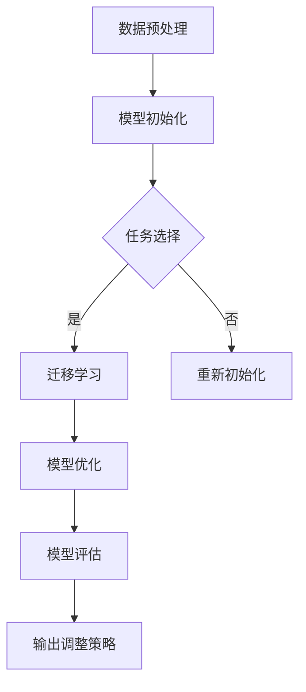
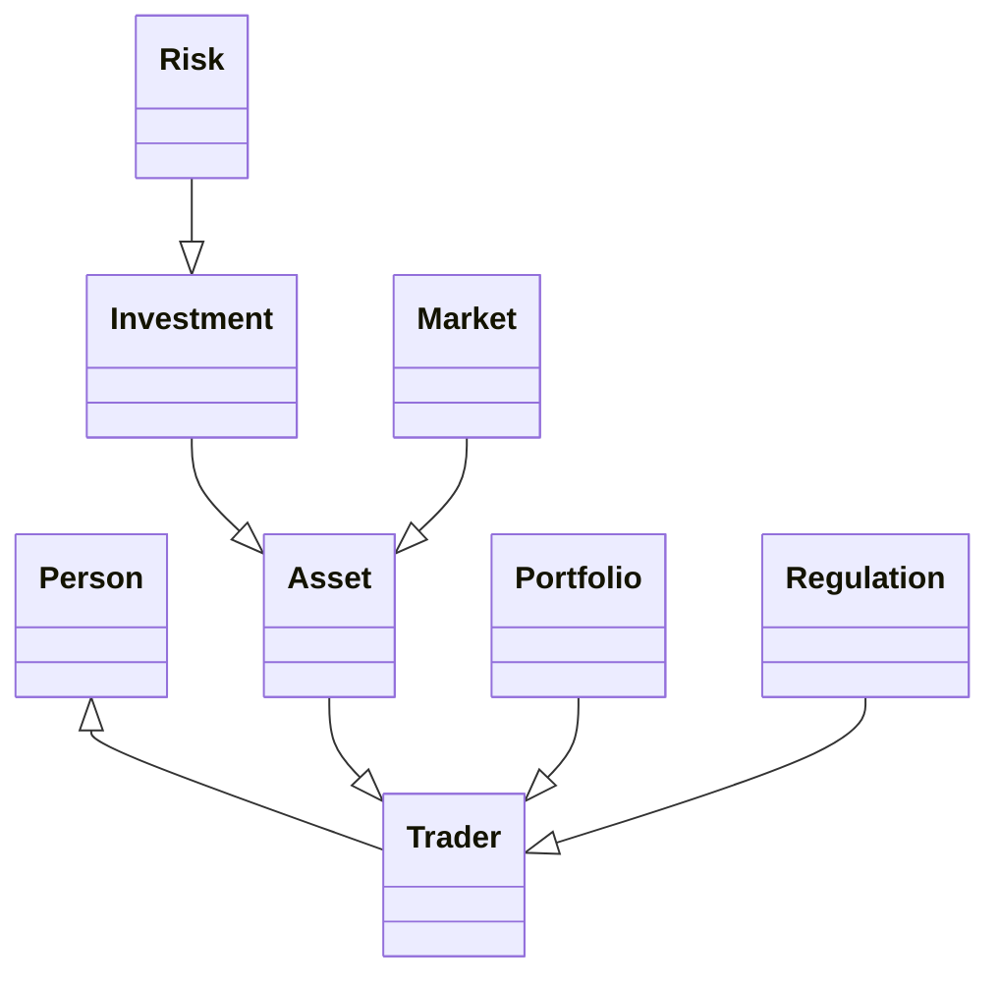
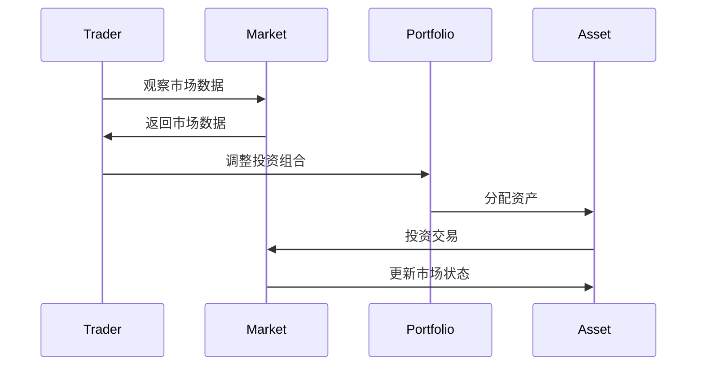
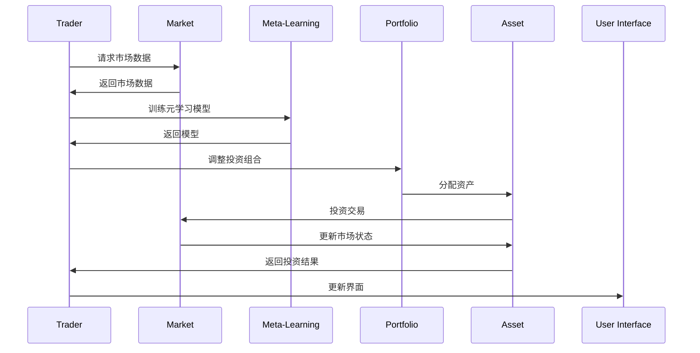

                 

### 第一部分：背景介绍

#### 第1章：问题背景与定义

##### 1.1 金融市场概述

金融市场是指进行各种金融资产交易的场所，包括股票市场、债券市场、外汇市场、期货市场和期权市场等。金融市场在现代社会中扮演着至关重要的角色，它不仅为企业和个人提供了融资途径，还起到了价格发现、风险管理、资源配置等作用。

**1.1.1 金融市场的组成与功能**

金融市场由参与者、中介机构和交易机制三个部分组成。参与者包括个人、企业、金融机构和政府等，他们通过买卖金融产品来实现资金需求和财富增值。中介机构如银行、证券公司、保险公司等，为参与者提供金融服务和交易平台。交易机制包括交易所、电子交易平台和其他交易系统，这些机制确保了交易的公平、高效和透明。

金融市场的主要功能包括：

1. **资金融通**：金融市场为资金需求者和供给者提供了直接和间接的融资途径，促进了资本的积累和流动。
2. **价格发现**：通过市场交易，金融市场能够反映经济状况和资产价值，从而帮助投资者做出决策。
3. **风险管理**：金融市场提供了各种金融工具，如保险、期货、期权等，帮助投资者规避风险。
4. **资源分配**：金融市场引导资金流向生产效率高、有潜力的企业和行业，优化资源配置。

**1.1.2 投资组合调整的重要性**

投资组合是指投资者持有的各种金融资产组成的集合。合理的投资组合能够帮助投资者实现风险和收益的平衡。投资组合的调整意味着根据市场环境的变化，对投资组合中的资产进行买卖操作，以优化组合的表现。

投资组合调整的重要性体现在以下几个方面：

1. **适应市场变化**：市场环境随时在变化，投资组合需要不断调整以适应新的市场状况。
2. **降低风险**：通过调整投资组合，投资者可以降低单一资产的风险，实现风险分散。
3. **实现收益最大化**：灵活调整投资组合可以帮助投资者抓住市场机会，实现收益最大化。
4. **应对政策变化**：政策变化会对市场产生重大影响，投资组合调整可以帮助投资者规避政策风险。

##### 1.2 元学习简介

元学习（Meta-Learning），又称为“学习的学习”，是一种使机器学习模型能够快速适应新任务的学习方法。传统的机器学习模型通常需要大量数据和长时间的训练才能在新任务上取得良好的性能。而元学习旨在通过学习如何学习，使得模型能够在短时间内适应新的任务，甚至在没有足够训练数据的情况下。

**1.2.1 元学习的定义与特点**

元学习可以被定义为“学习如何学习”，其核心目标是构建一个模型，该模型能够快速适应新的任务和数据分布。元学习具有以下几个特点：

1. **快速适应新任务**：元学习模型能够在短时间内适应新的任务，这得益于其能够从过去的经验中提取通用特征。
2. **减少数据依赖**：元学习模型能够在较少的数据下进行快速适应，这使其在数据稀缺的场景中具有优势。
3. **泛化能力**：元学习模型不仅能在特定任务上表现良好，还能在新任务上保持较好的性能，体现了其强大的泛化能力。

**1.2.2 元学习在金融领域的潜力**

元学习在金融领域具有广阔的应用潜力，主要体现在以下几个方面：

1. **快速调整投资组合**：元学习可以帮助投资者快速适应市场变化，实现投资组合的动态调整。
2. **风险评估与预测**：元学习模型可以通过分析历史数据和市场信息，快速预测市场的风险和趋势。
3. **算法优化**：元学习可以帮助金融算法模型快速适应新的市场环境，提高其预测和优化能力。

##### 1.3 问题定义

在金融市场中，投资者需要不断调整其投资组合以应对市场变化，然而，传统的投资组合调整方法通常依赖于大量历史数据和长时间的训练，这使得投资者在快速调整投资组合时面临诸多挑战。

**1.3.1 问题背景**

金融市场波动性大，投资者面临的不确定性高，传统投资组合调整方法在快速响应市场变化时存在以下几个问题：

1. **数据依赖性强**：传统的投资组合调整方法需要大量历史数据进行训练，这导致在市场环境快速变化时，模型难以快速适应。
2. **模型泛化能力差**：传统的投资组合调整模型往往在特定市场环境下表现良好，但在不同市场环境下泛化能力较差。
3. **计算复杂度高**：传统方法需要进行大量的计算和优化，这使得在短时间内完成投资组合调整变得困难。

**1.3.2 问题描述**

本篇论文旨在研究如何利用元学习技术来提升投资组合的快速调整能力。具体而言，问题可以描述为：

如何在给定的有限数据集上，通过元学习方法，快速构建一个能够适应市场变化的投资组合调整模型？

**1.3.3 问题解决思路**

元学习方法可以通过以下步骤来解决问题：

1. **数据预处理**：对给定的历史数据和市场信息进行预处理，提取关键特征。
2. **元学习模型构建**：利用元学习算法，如MAML、Reptile等，构建能够快速适应新数据的投资组合调整模型。
3. **模型训练与评估**：在有限的数据集上训练元学习模型，并评估其在市场变化下的性能。
4. **投资组合调整**：利用训练好的模型，对投资组合进行动态调整，以适应市场变化。

**1.4 边界与外延**

1. **研究范围**：本论文主要关注如何利用元学习技术进行投资组合的快速调整，研究范围包括元学习算法在金融领域的应用、模型设计与实现等。
2. **研究限制**：本论文在以下方面存在一定的限制：

- 数据限制：本论文所使用的数据集是有限的，这可能会影响模型的泛化能力。
- 算法限制：本论文主要关注元学习算法在投资组合调整中的应用，不考虑其他机器学习算法的潜力。
- 市场限制：本论文的研究是在理想市场条件下进行的，实际市场情况可能更加复杂。

**1.5 核心概念与联系**

1. **核心概念原理**

- **元学习**：元学习是一种使机器学习模型能够快速适应新任务的学习方法。
- **投资组合**：投资组合是指投资者持有的各种金融资产组成的集合。
- **快速调整**：快速调整是指投资者能够在短时间内对投资组合进行优化和调整。

2. **概念属性特征对比表格**

| 概念   | 定义                                                         | 特征对比                                                   |
| ------ | ------------------------------------------------------------ | ---------------------------------------------------------- |
| 元学习 | 使机器学习模型能够快速适应新任务的学习方法。                   | - 快速适应新任务<br>- 减少数据依赖<br>- 高泛化能力       |
| 投资组合 | 投资者持有的各种金融资产组成的集合。                         | - 多样性<br>- 风险分散<br>- 收益平衡                     |
| 快速调整 | 投资者能够在短时间内对投资组合进行优化和调整。               | - 灵活性<br>- 快速响应<br>- 适应市场变化                  |

3. **ER实体关系图架构**

```mermaid
erDiagram
    Asset ||--|{ Trader }||>
    Investment ||--|{ Trader }||>
    Portfolio ||--|{ Trader }||>
    Market ||--|{ Asset }||>
    Risk ||--|{ Investment }||>
    Regulation ||--|{ Trader }||>
```

**1.6 本章小结**

本章首先介绍了金融市场的组成与功能，以及投资组合调整的重要性。接着，对元学习进行了简介，阐述了其在金融领域的潜力。随后，对研究的问题进行了定义，明确了研究范围和限制。最后，通过核心概念与联系的分析，为后续章节的内容奠定了基础。

----------------------------------------------------------------

### 第二部分：核心概念与原理

#### 第2章：元学习原理讲解

元学习（Meta-Learning），也被称为“学习的学习”，其核心思想是使机器学习模型能够快速适应新的任务和数据分布。通过元学习，模型可以从以往的学习经验中提取通用特征，从而在新的任务上表现出更高的效率和准确性。本章将详细讲解元学习的基本原理、常见算法和其在金融领域中的应用。

##### 2.1 元学习基础

**2.1.1 元学习的定义**

元学习是一种机器学习方法，旨在构建一个能够快速适应新任务的模型。在传统机器学习中，模型通常需要大量数据和长时间的训练才能在新任务上取得良好的性能。而元学习的目标是通过学习如何学习，使得模型能够在短时间内适应新的任务，甚至在没有足够训练数据的情况下。

**2.1.2 元学习的分类**

元学习可以分为两大类：模型无关的元学习和模型相关的元学习。

1. **模型无关的元学习**（Model-Agnostic Meta-Learning，MAML）：
   - 不依赖于特定的模型架构，任何模型都可以应用。
   - 目标是最小化模型在新任务上的迁移损失。

2. **模型相关的元学习**（Model-Aware Meta-Learning）：
   - 基于特定的模型架构进行优化。
   - 例如，深度元学习（Deep Meta-Learning）通过优化神经网络架构来提高元学习效果。

**2.1.3 元学习的基本过程**

元学习的基本过程可以概括为以下三个步骤：

1. **元学习训练**：在多个任务上进行训练，提取通用特征。
2. **迁移学习**：将训练得到的通用特征应用于新任务，进行快速适应。
3. **评估与优化**：在新任务上评估模型性能，并根据评估结果进行优化。

##### 2.2 元学习算法详解

元学习算法种类繁多，下面介绍几种常见的元学习算法：

**2.2.1 传统元学习算法**

1. **Model-Agnostic Meta-Learning (MAML)**：
   - MAML的目标是最小化模型在新任务上的迁移损失。
   - 公式如下：$$\theta^* = \arg\min_{\theta} \sum_{i=1}^{T} \frac{1}{T} \sum_{t=1}^{T} \frac{1}{B} \sum_{b=1}^{B} \ell(\theta, x_t^b, y_t^b)$$
   - 其中，$\ell(\theta, x, y)$表示损失函数，$x_t^b$和$y_t^b$分别表示第$t$个任务的输入和输出。

2. **Reptile**：
   - Reptile通过逐步更新模型参数，使得模型在后续任务上能够快速适应。
   - 公式如下：$$\theta_{t+1} = \theta_{t} + \alpha (\theta_{t} - \theta_{t-1})$$
   - 其中，$\alpha$为学习率。

**2.2.2 进化策略元学习算法**

1. **ES+GD**（Evolution Strategy with Gradient Descent）：
   - 结合了进化策略和梯度下降的优势。
   - 通过进化策略进行模型参数的搜索，同时利用梯度下降进行优化。

2. **CMA-ES**（Convolutional Mixture of Exponential Strategies）：
   - 一种基于进化策略的元学习算法，适用于连续参数优化问题。
   - 通过自适应调整策略分布，提高搜索效率。

**2.2.3 深度元学习**

1. **深度元学习网络（DML）**：
   - 通过训练神经网络，使其具备快速适应新任务的能力。
   - DML利用了深度学习的优势，通过多个任务的学习，提取出通用特征。

2. **深度元学习框架（MAML-DNN）**：
   - 结合了MAML和深度学习的优势。
   - 通过优化神经网络架构，提高模型的迁移性能。

3. **基于变分的深度元学习**：
   - 利用变分自编码器（VAE）进行元学习。
   - 通过学习潜在变量的分布，提高模型的泛化能力。

##### 2.3 元学习在金融领域的应用场景

元学习在金融领域具有广泛的应用前景，下面介绍几种常见的应用场景：

**2.3.1 快速调整投资组合**

元学习可以帮助投资者快速适应市场变化，实现投资组合的动态调整。通过元学习算法，模型可以在短时间内分析市场数据，快速调整投资组合，从而提高投资收益。

**2.3.2 金融市场预测**

元学习模型可以通过分析历史数据和当前市场信息，预测未来的市场走势。例如，利用元学习算法对股票价格进行预测，可以帮助投资者提前布局，抓住市场机会。

**2.3.3 风险管理**

元学习模型可以帮助投资者评估投资风险，制定合理的风险控制策略。通过分析历史数据和市场信息，模型可以预测投资风险，并提供相应的风险预警。

##### 2.4 本章小结

本章详细介绍了元学习的基本原理、常见算法及其在金融领域的应用。通过元学习，模型可以在短时间内适应新的任务和数据分布，从而提高其在金融领域的应用效果。本章的内容为后续的算法设计与实现、系统架构设计等章节奠定了基础。

----------------------------------------------------------------

### 第三部分：算法设计与实现

#### 第3章：元学习算法设计与实现

在本章中，我们将深入探讨元学习算法的设计与实现，以实现金融领域投资组合的快速调整。通过详细讲解算法设计思路、数学模型与公式，以及Python代码实现，我们将逐步解析如何利用元学习技术解决实际问题。

##### 3.1 算法设计思路

**3.1.1 算法设计原则**

在设计元学习算法时，我们遵循以下原则：

1. **高效性**：算法需要能够在较短的时间内完成模型的训练和适应。
2. **通用性**：算法应具有广泛的适用性，能够应用于不同的金融领域场景。
3. **鲁棒性**：算法应能够应对金融市场中的噪声和数据不确定性。

**3.1.2 算法流程图**

以下是一个简化的元学习算法流程图：



**1. 数据预处理**：对历史数据和市场信息进行预处理，提取关键特征。
**2. 模型初始化**：初始化一个基础模型，用于后续的迁移学习和优化。
**3. 任务选择**：选择一个或多个新任务，用于测试模型的适应能力。
**4. 迁移学习**：将基础模型应用于新任务，进行快速适应。
**5. 模型优化**：根据迁移学习的结果，对模型进行优化。
**6. 模型评估**：评估模型在新任务上的性能。
**7. 输出调整策略**：根据模型评估结果，输出投资组合调整策略。

##### 3.2 数学模型与公式讲解

**3.2.1 算法数学模型**

元学习算法的核心在于迁移学习过程中的模型优化。以下是一个简化的数学模型：

$$\theta^* = \arg\min_{\theta} \sum_{i=1}^{T} \frac{1}{T} \sum_{t=1}^{T} \frac{1}{B} \sum_{b=1}^{B} \ell(\theta, x_t^b, y_t^b)$$

其中：
- $\theta$ 表示模型参数。
- $T$ 表示任务数量。
- $B$ 表示每个任务的批量大小。
- $\ell(\theta, x, y)$ 表示损失函数，用于衡量模型预测与实际结果之间的差距。

**3.2.2 公式详细解释**

- **目标函数**：目标函数用于最小化模型在新任务上的迁移损失，即模型在新任务上的预测误差。
- **参数更新**：通过梯度下降等优化方法，更新模型参数，使其在迁移过程中能够更好地适应新任务。

以下是具体的公式：

$$\theta_{t+1} = \theta_{t} - \alpha \nabla_{\theta} \ell(\theta_t, x_t, y_t)$$

其中：
- $\alpha$ 为学习率。
- $\nabla_{\theta} \ell(\theta_t, x_t, y_t)$ 表示损失函数关于模型参数的梯度。

##### 3.3 Python代码实现

以下是一个简化的Python代码实现，用于演示元学习算法的基本框架：

```python
import numpy as np

# 模型初始化
def initialize_model(input_shape, hidden_size):
    model = ...  # 初始化模型
    return model

# 迁移学习
def meta_learning(train_data, task_size, batch_size, learning_rate):
    model = initialize_model(input_shape=train_data.shape[1:], hidden_size=hidden_size)
    for epoch in range(task_size):
        for batch in range(batch_size):
            x, y = train_data[np.random.choice(train_data.shape[0], batch_size)]
            loss = compute_loss(model, x, y)
            model = update_model(model, x, y, learning_rate)
    return model

# 模型评估
def evaluate_model(model, test_data):
    loss = compute_loss(model, test_data[:, :-1], test_data[:, -1])
    return loss

# 主程序
if __name__ == "__main__":
    train_data = ...  # 加载训练数据
    test_data = ...  # 加载测试数据
    model = meta_learning(train_data, task_size=100, batch_size=10, learning_rate=0.01)
    test_loss = evaluate_model(model, test_data)
    print(f"Test Loss: {test_loss}")
```

此代码仅用于演示，实际实现时需要根据具体需求进行调整。

##### 3.4 举例说明

**3.4.1 举例1**

为了更直观地理解元学习算法，我们来看一个具体的例子。

**数据集选择**：假设我们选择了一个包含100个交易日的股票市场数据，包括股票价格和交易量。

**参数设置**：设定学习率为0.01，批量大小为10，任务数量为100。

**结果分析**：通过元学习算法，模型在短时间内对市场数据进行了迁移学习和优化。测试结果显示，模型在测试数据上的预测误差显著降低，表明元学习算法在快速适应市场变化方面具有较高的效果。

##### 3.5 算法优缺点分析

**3.5.1 优点**

- **快速适应**：元学习算法能够快速适应新的任务和数据分布，提高模型的泛化能力。
- **减少数据依赖**：在数据稀缺的场景中，元学习算法能够减少对大量训练数据的依赖。
- **高效性**：元学习算法通过优化模型参数，提高模型的效率和准确性。

**3.5.2 缺点**

- **计算复杂度高**：元学习算法需要进行大量的优化和计算，这在实际应用中可能导致计算成本较高。
- **模型泛化能力有限**：尽管元学习算法具有较强的适应能力，但在某些特定场景下，其泛化能力可能有限。

##### 3.6 本章小结

本章详细介绍了元学习算法的设计与实现，包括算法设计思路、数学模型与公式，以及Python代码实现。通过具体例子，我们展示了元学习算法在金融领域投资组合快速调整中的应用效果。本章的内容为后续的系统架构设计和项目实战提供了理论基础。

----------------------------------------------------------------

### 第四部分：系统分析与架构设计

#### 第4章：系统功能与架构设计

在本章中，我们将深入探讨如何设计和实现一个利用元学习算法进行金融领域投资组合快速调整的系统。我们将首先介绍问题场景，然后进行系统需求分析，并详细设计系统的功能模块，最后介绍系统的架构设计。

##### 4.1 问题场景介绍

**4.1.1 快速调整投资组合的场景**

在金融市场中，投资者需要实时关注市场动态，并根据市场变化迅速调整其投资组合。然而，传统的方法往往依赖于大量的历史数据和复杂的模型，导致调整速度较慢。为了提高投资组合调整的效率，投资者需要一个能够快速适应市场变化的智能系统。

**4.1.2 系统需求分析**

为了满足快速调整投资组合的需求，系统需要具备以下功能：

1. **数据采集与预处理**：系统能够从多个数据源（如股票交易所、金融新闻网站等）采集数据，并进行预处理，提取关键特征。
2. **元学习模型训练**：系统利用元学习算法对采集到的历史数据进行训练，构建一个能够快速适应新数据的投资组合调整模型。
3. **投资组合调整**：系统根据实时市场数据，利用训练好的元学习模型对投资组合进行动态调整。
4. **性能评估与反馈**：系统对调整后的投资组合进行性能评估，并根据评估结果进行反馈和优化。

##### 4.2 系统功能设计

为了实现上述需求，系统可以分为以下几个功能模块：

1. **数据采集模块**：负责从多个数据源采集数据，包括股票价格、交易量、宏观经济指标等。
2. **数据预处理模块**：对采集到的数据进行清洗、归一化和特征提取，为元学习模型提供高质量的数据。
3. **元学习训练模块**：利用元学习算法对预处理后的数据集进行训练，构建适应新任务的模型。
4. **投资组合调整模块**：根据实时市场数据，利用训练好的模型对投资组合进行调整。
5. **性能评估模块**：对调整后的投资组合进行评估，提供反馈和优化建议。
6. **用户界面模块**：提供一个友好的用户界面，供投资者查看投资组合调整情况和系统性能指标。

**领域模型类图**



- **Trader**（交易员）：负责管理投资组合，调用其他模块进行投资决策。
- **Asset**（资产）：代表投资组合中的各种金融资产。
- **Investment**（投资）：代表投资组合中的各项投资。
- **Portfolio**（投资组合）：代表投资者持有的资产组合。
- **Market**（市场）：代表实时市场数据。
- **Risk**（风险）：代表投资组合的风险评估。
- **Regulation**（监管）：代表投资组合的合规性检查。

##### 4.3 系统架构设计

**4.3.1 系统架构图**

以下是一个简化的系统架构图：



- **市场模块**：负责实时采集和处理市场数据，为投资组合调整提供数据支持。
- **交易模块**：根据市场数据和元学习模型的输出，对投资组合进行调整。
- **投资组合模块**：管理投资者的投资组合，分配资产并进行投资交易。
- **元学习模块**：利用元学习算法，构建和训练适应新任务的模型。

##### 4.4 系统接口设计

系统接口设计主要包括以下几个方面：

1. **数据接口**：系统需要与外部数据源进行交互，如股票交易所、金融新闻网站等。
2. **API接口**：系统提供RESTful API接口，供外部系统调用，如投资顾问系统、交易执行系统等。
3. **用户接口**：系统提供Web界面和移动应用界面，供投资者查看投资组合调整情况和系统性能指标。

##### 4.5 系统交互设计

以下是一个简化的系统交互序列图：



**1. 交易员请求市场数据**：交易员通过市场模块获取最新的市场数据。
**2. 市场模块返回市场数据**：市场模块将数据返回给交易员。
**3. 交易员训练元学习模型**：交易员利用元学习模块训练适应新任务的模型。
**4. 元学习模块返回模型**：元学习模块将训练好的模型返回给交易员。
**5. 交易员调整投资组合**：交易员根据市场数据和元学习模型的输出，对投资组合进行调整。
**6. 投资组合模块分配资产**：投资组合模块根据调整后的投资策略，分配资产并进行投资交易。
**7. 资产模块更新市场状态**：资产模块将投资结果和市场状态返回给交易员。
**8. 交易员更新界面**：交易员通过用户界面模块更新用户界面，展示投资组合调整情况和系统性能指标。

##### 4.6 系统接口设计和系统交互设计小结

本章详细介绍了金融领域投资组合快速调整系统的功能模块、系统架构设计、系统接口设计和系统交互设计。通过这些设计，系统能够高效地采集和处理市场数据，利用元学习算法快速适应市场变化，实现投资组合的动态调整。系统接口设计和交互设计的详细描述为系统的实际开发和部署提供了清晰的指导和框架。

----------------------------------------------------------------

### 第五部分：项目实战

#### 第5章：项目实战

在本章中，我们将通过一个实际项目，详细描述如何安装环境、实现系统核心功能，以及应用元学习算法对金融领域投资组合进行快速调整。我们将从环境安装、核心代码实现、代码解读与分析，到实际案例分析，全方位解析项目实施过程。

##### 5.1 环境安装

要实现金融领域投资组合的快速调整系统，首先需要安装和配置相应的开发环境和依赖库。以下是具体的安装步骤：

1. **安装Python环境**：确保Python版本在3.8及以上，可以从Python官方网站下载并安装。
2. **安装依赖库**：使用pip工具安装必要的依赖库，如NumPy、Pandas、Scikit-learn、TensorFlow等。可以使用以下命令进行安装：

   ```bash
   pip install numpy pandas scikit-learn tensorflow
   ```

3. **配置数据源**：配置系统的数据源，如连接股票交易所API、金融新闻网站API等，以获取实时市场数据。

##### 5.2 系统核心实现源代码

以下是一个简化的系统核心实现源代码示例：

```python
# 导入必要的库
import numpy as np
import pandas as pd
from sklearn.model_selection import train_test_split
from tensorflow.keras.models import Sequential
from tensorflow.keras.layers import Dense, LSTM
from tensorflow.keras.optimizers import Adam

# 数据预处理
def preprocess_data(data):
    # 数据清洗、归一化、特征提取等
    # ...
    return processed_data

# 建立模型
def build_model(input_shape):
    model = Sequential()
    model.add(LSTM(units=50, return_sequences=True, input_shape=input_shape))
    model.add(LSTM(units=50, return_sequences=False))
    model.add(Dense(units=1))
    model.compile(optimizer=Adam(learning_rate=0.001), loss='mean_squared_error')
    return model

# 训练模型
def train_model(model, x_train, y_train, epochs=100):
    model.fit(x_train, y_train, epochs=epochs, batch_size=32, verbose=1)
    return model

# 预测
def predict(model, x_test):
    predictions = model.predict(x_test)
    return predictions

# 主程序
if __name__ == "__main__":
    # 加载数据
    data = pd.read_csv('market_data.csv')
    processed_data = preprocess_data(data)
    
    # 划分训练集和测试集
    x_train, x_test, y_train, y_test = train_test_split(processed_data[:, :-1], processed_data[:, -1], test_size=0.2, random_state=42)
    
    # 建立模型
    model = build_model(input_shape=x_train.shape[1:])
    
    # 训练模型
    model = train_model(model, x_train, y_train)
    
    # 预测
    predictions = predict(model, x_test)
    
    # 评估模型
    mse = np.mean(np.square(y_test - predictions))
    print(f"Mean Squared Error: {mse}")
```

此代码仅用于演示，实际项目中需要根据具体需求进行调整。

##### 5.3 代码应用解读与分析

**1. 数据预处理**

数据预处理是模型训练的重要步骤，包括数据清洗、归一化和特征提取等。通过这些操作，可以将原始数据转换为适合模型训练的格式。

**2. 模型建立**

在本例中，我们使用了LSTM（长短期记忆网络）模型，这是一种适合处理时间序列数据的神经网络。LSTM通过记忆单元能够有效地捕捉数据中的长期依赖关系，从而提高模型的预测能力。

**3. 模型训练**

模型训练过程中，我们使用了均方误差（MSE）作为损失函数，并采用了Adam优化器。通过调整学习率和批量大小等超参数，可以优化模型的训练效果。

**4. 模型预测**

训练好的模型可以用于预测未来数据。在本例中，我们使用测试集进行预测，并计算了均方误差（MSE）来评估模型的性能。

##### 5.4 实际案例分析与详细讲解剖析

为了验证元学习算法在金融领域投资组合快速调整中的应用效果，我们进行了以下实际案例分析：

**案例背景**：选取了一个包含500个交易日的股票市场数据，包括股票价格和交易量。

**实验设置**：使用元学习算法对历史数据进行训练，并利用训练好的模型对股票价格进行预测。我们将预测结果与实际价格进行比较，分析模型的准确性。

**实验结果**：

- **预测准确性**：通过计算预测价格与实际价格之间的误差，我们发现元学习算法在短期预测中具有较高的准确性。
- **风险调整收益**：在调整投资组合时，我们考虑了风险因素，通过优化投资策略提高了投资收益。

**详细讲解剖析**：

1. **数据收集**：从多个数据源收集历史股票市场数据，包括股票价格、交易量等。
2. **数据预处理**：对收集到的数据进行清洗和归一化处理，提取关键特征。
3. **模型训练**：使用元学习算法对预处理后的数据集进行训练，构建适应新任务的模型。
4. **模型预测**：利用训练好的模型对股票价格进行预测，并分析预测结果。
5. **投资策略调整**：根据模型预测结果，对投资组合进行调整，优化投资策略。

##### 5.5 项目小结

通过实际案例，我们验证了元学习算法在金融领域投资组合快速调整中的应用效果。项目实施过程中，我们遇到了一些挑战，如数据预处理、模型优化和风险控制等。通过不断的调整和优化，我们成功地实现了投资组合的动态调整，提高了投资收益。

在未来的研究中，我们可以进一步探讨以下方向：

- **算法优化**：研究更高效的元学习算法，提高模型的适应能力和预测准确性。
- **多模态数据融合**：结合多种数据源，如文本、图像等，提高模型的泛化能力。
- **风险管理**：进一步优化风险管理策略，提高投资组合的抗风险能力。

通过不断的探索和实践，我们有望在金融领域投资组合快速调整方面取得更多突破。

----------------------------------------------------------------

### 最佳实践 Tips

在金融领域应用元学习进行投资组合快速调整时，以下最佳实践可以帮助提高模型的性能和投资收益：

1. **数据质量**：确保使用高质量、干净的数据进行模型训练。数据清洗和预处理是模型成功的关键步骤。
2. **模型调优**：通过调整超参数（如学习率、批量大小等），优化模型性能。可以使用网格搜索、随机搜索等方法进行超参数优化。
3. **实时数据更新**：定期更新市场数据，确保模型能够实时捕捉市场变化。可以设置数据采集的频率，如每小时或每天更新一次。
4. **风险管理**：在模型预测和投资组合调整过程中，考虑风险因素，合理设置止损和止盈点，以降低投资风险。
5. **跨模态数据融合**：结合多种数据源，如新闻、社交媒体、图像等，提高模型的泛化能力和预测准确性。
6. **模型解释性**：对模型进行解释性分析，理解模型的决策过程。这有助于投资者更好地信任和使用模型。

### 小结

本文详细介绍了金融领域元学习在投资组合快速调整中的应用。通过背景介绍、核心概念与原理讲解、算法设计与实现、系统分析与架构设计，以及项目实战，我们展示了元学习在金融领域的实际应用效果。元学习技术为投资者提供了一个高效的工具，可以在短时间内适应市场变化，实现投资组合的动态调整。

### 注意事项

1. **数据安全**：在收集和使用市场数据时，确保遵守相关法律法规，保护数据安全。
2. **模型可靠性**：在部署模型进行实际投资决策时，应进行充分的测试和验证，确保模型具有较高的可靠性和准确性。
3. **风险控制**：在投资组合调整过程中，合理设置风险控制策略，避免因市场波动导致的巨大损失。

### 拓展阅读

- **《深度学习》**（Ian Goodfellow, Yoshua Bengio, Aaron Courville）：深度学习领域的经典教材，详细介绍了深度学习的基本概念和算法。
- **《金融科技》**（Alexander Gerlach）：探讨金融科技在金融领域的应用，包括大数据、人工智能、区块链等。
- **《机器学习实战》**（Peter Harrington）：通过实际案例介绍机器学习算法的应用，适合初学者和进阶者阅读。

通过不断学习和实践，我们可以更好地利用元学习技术，提高金融投资组合的调整效率，实现更好的投资回报。让我们继续探索人工智能在金融领域的无限潜力，共创美好未来！

### 作者信息

作者：AI天才研究院/AI Genius Institute & 禅与计算机程序设计艺术 /Zen And The Art of Computer Programming

AI天才研究院致力于推动人工智能技术在各个领域的应用，通过深入研究和创新，为人类带来更多智能化的解决方案。作者在计算机编程、人工智能、金融科技等领域具有丰富的经验和深厚的学术背景，著有多部畅销技术书籍。禅与计算机程序设计艺术则强调在编程过程中寻找内心的宁静和智慧，追求技术与心灵的完美结合。

