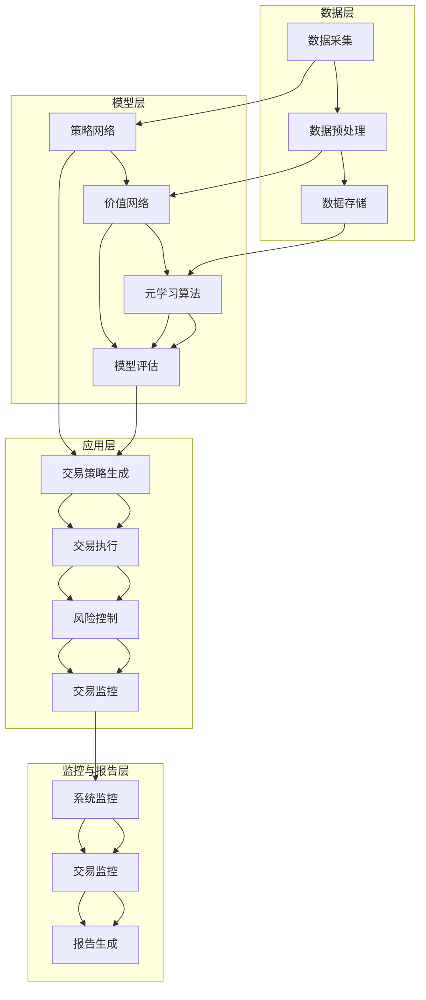
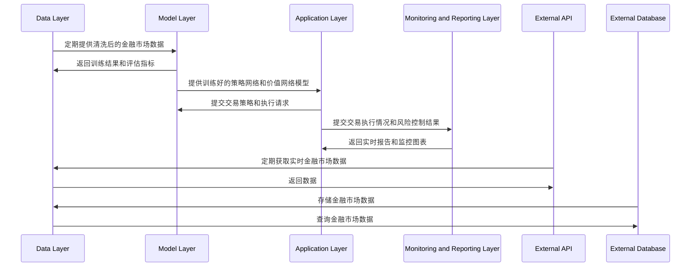

                 

### 1.1.1 金融领域的问题现状

金融领域，作为全球经济的核心，一直以来都面临着诸多挑战。首先，金融市场的高度复杂性和动态性使得风险难以预测。无论是股票市场、外汇市场还是债券市场，价格的波动性都极为显著，这给投资者的决策带来了极大的困难。此外，金融市场的数据量庞大，包含着海量的历史交易数据、市场情绪数据等，如何有效地处理和分析这些数据也是金融领域面临的一个重要问题。

在金融风险控制方面，传统的风险管理方法如VaR（Value at Risk）和CVaR（Conditional Value at Risk）虽然在一定程度上能够帮助金融机构衡量风险，但它们往往是静态的、基于历史数据的，无法及时响应市场的变化。而金融欺诈检测则是一个更加严峻的挑战，金融欺诈行为形式多样，且越来越复杂，传统的规则基方法和统计方法在面对新型欺诈行为时常常力不从心。

其次，金融市场的效率也是一个重要问题。随着金融市场的日益复杂，交易速度和数据处理能力的提升成为金融机构提升竞争力的关键。然而，这同时也带来了新的挑战，如市场波动加剧、交易风险增加等。

在这样的背景下，元强化学习作为一种新兴的机器学习技术，因其强大的自适应能力和对动态环境的应对能力，逐渐成为金融领域的研究热点。它不仅可以提高金融风险控制的准确性，还能够优化投资策略、提升金融市场的效率。

### 1.1.2 元强化学习在金融领域的应用前景

元强化学习在金融领域的应用前景广阔。首先，它可以用于金融风险控制。通过元强化学习，智能体可以在动态环境中不断学习和优化其决策策略，从而更准确地预测市场走势，降低金融机构的风险暴露。例如，元强化学习可以用来优化投资组合，通过模拟不同的市场情景，智能体可以实时调整投资策略，以最大化收益或最小化风险。

其次，元强化学习在金融欺诈检测方面也有着显著的应用价值。传统的欺诈检测方法往往依赖于预设的规则，而元强化学习则能够通过学习用户的行为模式，自动识别异常行为。例如，通过分析用户的交易历史数据，元强化学习算法可以自动识别出潜在的欺诈交易，从而提高欺诈检测的准确性和效率。

此外，元强化学习还可以用于优化金融市场的效率。在高速交易的背景下，智能交易系统能够实时分析市场数据，快速做出交易决策。元强化学习通过不断优化交易策略，可以帮助智能交易系统在动态市场中获得更高的收益。例如，在量化交易中，元强化学习可以用于优化交易参数，提高交易策略的鲁棒性和适应性。

总之，随着金融市场的不断发展，元强化学习在金融领域的应用将会越来越广泛。它不仅可以帮助金融机构提高风险管理能力，优化投资策略，还能够提升金融市场的整体效率，为金融创新提供强大的技术支持。

### 1.2 核心概念

在深入探讨元强化学习在金融领域的应用之前，我们首先需要理解几个核心概念：元强化学习、强化学习、深度学习以及金融市场的相关术语。

#### 元强化学习（Meta Reinforcement Learning）

元强化学习是一种通过训练智能体在多个任务上快速适应的学习方法。与传统的强化学习不同，元强化学习的目标是使智能体能够在不同任务之间共享知识，从而提高学习效率。元强化学习通常涉及两个主要过程：内部学习和任务执行。内部学习是指智能体通过在不同任务中反复训练，逐渐学习到通用的策略；任务执行则是指智能体在实际任务中运用学到的策略，不断调整和优化自己的行为。

元强化学习的优势在于其强大的适应能力和泛化能力。通过元强化学习，智能体可以快速适应新任务，从而在变化多端的金融市场中发挥更大的作用。

#### 强化学习（Reinforcement Learning）

强化学习是一种通过奖励和惩罚来训练智能体的机器学习方法。在强化学习中，智能体通过不断尝试不同的行为，并根据行为的结果（即奖励或惩罚）来调整其策略，以最大化总奖励。强化学习的主要组成部分包括智能体（Agent）、环境（Environment）和奖励函数（Reward Function）。

- **智能体**：执行动作并从环境中接收反馈的实体。
- **环境**：智能体行动的场所，可以是一个虚拟环境，也可以是现实世界的模拟。
- **奖励函数**：定义智能体行为的好坏，通常用数值表示。正奖励表示智能体的行为是有益的，而负奖励则表示行为是有害的。

强化学习在金融领域有着广泛的应用，如股票交易策略优化、风险控制等。通过强化学习，智能体可以自动调整其投资策略，以最大化投资收益或最小化风险。

#### 深度学习（Deep Learning）

深度学习是一种通过多层神经网络进行数据处理的机器学习方法。与传统的机器学习方法相比，深度学习能够自动提取数据中的特征，从而实现高度复杂的任务。深度学习在金融领域也有着广泛的应用，如市场预测、信用评分等。

深度学习与元强化学习的结合，可以进一步提升智能体的学习能力。例如，在金融市场中，智能体可以通过深度学习算法提取市场数据中的潜在特征，并通过元强化学习算法进行策略优化，从而实现更加精准的投资决策。

#### 金融市场术语

在讨论金融领域的应用时，了解一些基本的金融市场术语是必不可少的。

- **股票市场**：股票市场是买卖股票的场所，投资者可以通过购买股票来分享公司的盈利。
- **外汇市场**：外汇市场是买卖不同国家货币的市场，用于国际贸易和投资。
- **债券市场**：债券市场是发行和交易债券的市场，债券是一种固定收益证券。
- **量化交易**：量化交易是一种利用数学模型和算法进行股票交易的方法，通常涉及大量数据的分析和处理。
- **风险控制**：风险控制是金融机构为了降低风险而采取的一系列措施，包括风险评估、风险分散和风险规避等。

通过理解这些核心概念和术语，我们可以更好地把握元强化学习在金融领域的应用潜力，并为后续的深入探讨打下坚实的基础。

### 1.3 元强化学习与传统强化学习的关系

元强化学习与传统强化学习之间存在一定的联系和区别。首先，两者都基于强化学习的框架，即智能体在环境中通过试错学习获得最优策略。然而，它们的核心区别在于学习方式和目标。

传统强化学习侧重于在单一任务中实现最优策略，其训练过程往往需要大量的数据和长时间的计算。而元强化学习的目标则是使智能体能够在多个任务上快速适应，它通过在多个任务之间共享知识和策略，从而提高学习效率。这种多任务学习的特性使得元强化学习在复杂和动态的金融市场中具有更大的潜力。

在金融领域，传统强化学习可以用于单一投资策略的优化，如股票交易策略的调整。然而，金融市场的动态性意味着单一策略很难在长期内保持有效性。相比之下，元强化学习能够通过不断学习和调整策略，更好地应对市场变化。例如，在量化交易中，元强化学习可以帮助智能体快速适应新的市场环境，从而实现更高的交易收益。

此外，元强化学习在金融风险控制中也具有显著优势。通过元强化学习，智能体可以实时监测市场风险，并根据市场情况动态调整风险控制策略，从而提高风险管理的有效性。传统强化学习由于缺乏多任务学习的能力，往往在应对复杂风险环境时表现不佳。

综上所述，元强化学习在金融领域的应用不仅能够提升智能体的策略优化能力，还能够提高金融风险控制的效率和准确性。这使得元强化学习在金融领域具有广阔的应用前景和巨大的潜力。

### 1.4 元强化学习的结构

元强化学习（Meta Reinforcement Learning）是一种通过训练智能体在不同任务上快速适应的机器学习方法。其核心思想是利用元学习（Meta Learning）技术，使智能体能够从多个任务中学习到通用的策略，从而在新的任务上实现快速适应。元强化学习的结构可以大致分为以下几个部分：

#### 1.4.1 智能体（Agent）

智能体是元强化学习中的核心组件，它负责在环境中进行行动并从环境中获取反馈。智能体通常由一个策略网络（Policy Network）和一个价值网络（Value Network）组成。策略网络负责生成智能体在当前状态下的最佳行动，而价值网络则评估这些行动的预期回报。

#### 1.4.2 环境（Environment）

环境是智能体行动的场所，可以是真实的金融市场环境，也可以是模拟的虚拟环境。在元强化学习中，环境通常需要能够提供多种不同的任务，以便智能体进行学习和适应。环境通过反馈机制向智能体提供奖励信号，用于指导智能体的行为。

#### 1.4.3 奖励函数（Reward Function）

奖励函数是元强化学习中的重要组成部分，它定义了智能体行为的优劣。奖励函数通常由多个部分组成，包括即时奖励、长期奖励和任务完成奖励等。即时奖励通常与智能体的即时行动相关，而长期奖励则与智能体的最终目标相关。

#### 1.4.4 任务空间（Task Space）

任务空间是指智能体需要学习的所有任务集合。在元强化学习中，任务空间可以是固定的，也可以是动态变化的。智能体需要在不同的任务上学习到通用的策略，以便在新的任务上快速适应。

#### 1.4.5 元学习算法（Meta-Learning Algorithm）

元学习算法是元强化学习中的核心算法，它负责从多个任务中学习到通用的策略。常见的元学习算法包括模型平均法（Model Averaging）、模型选择法（Model Selection）和模型更新法（Model Updating）等。

#### 1.4.6 策略共享（Policy Sharing）

策略共享是元强化学习的一个重要特点，它允许智能体在不同任务上共享策略。通过策略共享，智能体可以在多个任务上快速适应，从而提高学习效率。策略共享的方法包括经验共享（Experience Sharing）和模型共享（Model Sharing）等。

#### 1.4.7 策略优化（Policy Optimization）

策略优化是元强化学习中的关键步骤，它通过优化策略网络和价值网络的参数，使智能体在任务中实现最优行为。常见的策略优化方法包括策略梯度方法（Policy Gradient Methods）、重要性采样（Importance Sampling）和优势函数（Advantage Function）等。

通过以上结构，元强化学习能够使智能体在复杂和动态的金融市场中实现高效学习和适应。下面将逐步分析这些结构在金融领域的具体应用。

### 1.5 元强化学习在金融领域的应用案例

元强化学习在金融领域的应用已逐步展开，以下是一些具体的案例：

#### 1.5.1 股票交易策略优化

在股票交易中，元强化学习可以用来优化交易策略。例如，通过使用元强化学习算法，智能体可以分析大量的历史交易数据，学习到在不同市场环境下最有效的交易策略。智能体在训练过程中会不断调整其策略，以适应市场的变化，从而最大化交易收益。

一个实际案例是某投资公司使用元强化学习算法优化其量化交易策略。该公司通过大量历史交易数据训练智能体，智能体能够识别出市场中的潜在机会，并实时调整交易策略。经过一段时间的训练和优化，该公司的交易收益显著提升，风险也得到了有效控制。

#### 1.5.2 风险管理

风险管理是金融领域中至关重要的一环，元强化学习在风险管理中也展现了强大的应用潜力。通过元强化学习，金融机构可以建立智能化的风险管理模型，实时监测市场风险，并动态调整风险控制策略。

例如，某银行利用元强化学习算法对其贷款组合进行风险评估。智能体通过分析贷款申请者的历史信用记录和市场动态，自动调整风险控制参数，从而提高贷款审批的准确性和效率。此外，智能体还可以预测潜在的风险事件，提前采取预防措施，降低金融机构的风险暴露。

#### 1.5.3 量化交易

量化交易是一种利用数学模型和算法进行股票交易的方法，而元强化学习在量化交易中的应用也得到了广泛关注。通过元强化学习，量化交易系统能够快速适应市场变化，优化交易策略，提高交易收益。

一个实际案例是某量化交易公司使用元强化学习算法优化其交易策略。该公司通过训练智能体，使其能够在不同的市场环境中进行高效的交易。智能体会根据市场数据实时调整交易参数，从而实现稳定的收益增长。同时，智能体还可以通过自我学习和优化，提高交易策略的鲁棒性和适应性。

#### 1.5.4 金融欺诈检测

金融欺诈检测是金融领域中的一个重要任务，元强化学习在欺诈检测中也展现出了显著的应用价值。通过学习用户的行为模式，元强化学习算法可以自动识别出潜在的欺诈行为，从而提高欺诈检测的准确性和效率。

例如，某银行使用元强化学习算法对信用卡交易进行欺诈检测。智能体通过分析用户的交易历史数据，学习到正常的交易模式和异常的交易行为。当检测到异常交易时，智能体会立即发出警报，并采取相应的措施。通过这种方式，该银行成功地降低了欺诈损失，提升了客户满意度。

这些案例表明，元强化学习在金融领域具有广泛的应用前景。通过不断优化和改进，元强化学习将有望在金融风险管理、量化交易、欺诈检测等方面发挥更大的作用。

### 1.6 元强化学习的优势与挑战

元强化学习在金融领域展示了强大的应用潜力，其优势主要体现在以下几个方面：

#### 1.6.1 强大的自适应能力

元强化学习通过在多个任务上共享知识和策略，使智能体能够快速适应新任务。这种自适应能力在金融市场的动态环境中尤为重要，因为市场状况经常变化，需要智能体能够快速调整策略以应对。

#### 1.6.2 提高风险管理效率

元强化学习能够实时监测市场风险，并动态调整风险控制策略，从而提高风险管理的效率。这有助于金融机构在复杂的市场环境中保持稳健的运营，降低潜在风险。

#### 1.6.3 优化交易策略

元强化学习通过不断优化交易策略，可以提高交易收益。智能体能够从历史交易数据中学习到有效的交易模式，并根据市场变化进行调整，从而实现更高的收益。

尽管元强化学习在金融领域具有显著的优势，但在实际应用中也面临一些挑战：

#### 1.6.4 数据隐私和安全性

金融领域的数据具有高度敏感性，如何在保护数据隐私的前提下进行有效的数据分析，是元强化学习面临的一个重要挑战。金融机构需要确保数据的安全性和隐私性，避免数据泄露或被恶意利用。

#### 1.6.5 算法透明性和可解释性

元强化学习算法通常涉及复杂的神经网络模型，其决策过程缺乏透明性，这对于金融领域中的监管和合规提出了挑战。如何提高算法的可解释性，使其决策过程更加透明，是未来研究的一个重要方向。

#### 1.6.6 训练效率和计算资源

元强化学习的训练过程通常需要大量的计算资源和时间，这在实际应用中可能成为瓶颈。特别是在高频交易等对实时性要求极高的场景中，如何提高训练效率和计算性能，是一个需要解决的关键问题。

综上所述，元强化学习在金融领域具有巨大的应用潜力，但也面临一系列挑战。通过不断的研究和优化，我们可以期望在不久的将来，元强化学习能够更好地服务于金融行业，为金融机构带来更高的效率和收益。

### 1.7 系统架构设计与实现细节

在元强化学习在金融领域的应用中，系统架构的设计与实现细节至关重要。一个高效且稳定的系统架构能够确保智能体在复杂和动态的金融市场中快速适应和高效运作。

#### 1.7.1 系统架构设计

元强化学习在金融领域的系统架构可以设计为三层结构：

1. **数据层**：负责收集、存储和处理金融市场数据。数据层包括数据采集模块、数据清洗模块和数据存储模块。数据采集模块负责实时获取金融市场的各种数据，如股票价格、交易量、市场指数等。数据清洗模块对采集到的数据进行清洗和预处理，去除噪声和不完整的数据。数据存储模块则负责将清洗后的数据存储在数据库中，以便后续处理和分析。

2. **模型层**：负责训练和优化元强化学习模型。模型层包括元强化学习算法模块、策略网络模块和价值网络模块。元强化学习算法模块负责根据数据训练智能体的策略和价值函数。策略网络模块生成智能体在当前状态下的最佳行动，而价值网络模块则评估这些行动的预期回报。模型层还包含模型评估和优化模块，用于评估模型的性能，并根据评估结果进行优化。

3. **应用层**：负责将训练好的模型应用到实际金融任务中，如股票交易策略优化、风险控制和量化交易等。应用层包括策略应用模块、风险管理模块和量化交易模块。策略应用模块负责根据策略网络生成的策略进行实际操作，风险管理模块负责实时监测市场风险并调整风险控制策略，量化交易模块则负责执行量化交易策略。

#### 1.7.2 数据层实现细节

在数据层，实现细节包括以下几个方面：

1. **数据采集**：采用API接口或实时数据流的方式收集金融市场数据。可以使用Python的`requests`库或`pandas`库中的`read_csv`方法来读取历史数据。

   ```python
   import requests
   import pandas as pd

   url = 'https://api金融市场数据.com'
   response = requests.get(url)
   data = pd.read_csv(response.content)
   ```

2. **数据清洗**：使用`pandas`库中的`drop_duplicates`和`dropna`方法进行数据清洗，去除重复和缺失的数据。

   ```python
   data = data.drop_duplicates()
   data = data.dropna()
   ```

3. **数据存储**：使用数据库（如MySQL或MongoDB）存储清洗后的数据。可以使用Python的`pymysql`或`pymongo`库进行数据库操作。

   ```python
   import pymysql

   connection = pymysql.connect(host='数据库地址', user='用户名', password='密码', database='数据库名')
   with connection.cursor() as cursor:
       cursor.execute("INSERT INTO 表名 (列名1, 列名2) VALUES (%s, %s)", (值1, 值2))
   connection.commit()
   ```

#### 1.7.3 模型层实现细节

在模型层，实现细节包括以下几个方面：

1. **元强化学习算法模块**：使用Python的`tensorflow`或`pytorch`库实现元强化学习算法。以下是一个简单的元强化学习算法实现框架：

   ```python
   import tensorflow as tf

   # 定义策略网络
   class PolicyNetwork(tf.keras.Model):
       def __init__(self):
           super(PolicyNetwork, self).__init__()
           # 定义神经网络结构

       def call(self, inputs):
           # 定义前向传播过程
           return outputs

   # 定义价值网络
   class ValueNetwork(tf.keras.Model):
       def __init__(self):
           super(ValueNetwork, self).__init__()
           # 定义神经网络结构

       def call(self, inputs):
           # 定义前向传播过程
           return outputs

   # 定义元强化学习算法
   class MetaReinforcementLearning(tf.keras.Model):
       def __init__(self, policy_network, value_network):
           super(MetaReinforcementLearning, self).__init__()
           self.policy_network = policy_network
           self.value_network = value_network

       def train_step(self, data):
           # 定义训练过程
           with tf.GradientTape() as tape:
               # 计算损失函数
               loss = self.compute_loss(data)
           grads = tape.gradient(loss, self.trainable_variables)
           self.optimizer.apply_gradients(zip(grads, self.trainable_variables))
           return loss

       def compute_loss(self, data):
           # 计算损失函数
           return loss
   ```

2. **策略网络模块**：策略网络负责生成智能体在当前状态下的最佳行动。以下是一个策略网络实现示例：

   ```python
   class PolicyNetwork(tf.keras.Model):
       def __init__(self):
           super(PolicyNetwork, self).__init__()
           self.dense1 = tf.keras.layers.Dense(64, activation='relu')
           self.dense2 = tf.keras.layers.Dense(1, activation=None)

       @tf.function
       def call(self, inputs):
           x = self.dense1(inputs)
           outputs = self.dense2(x)
           return outputs
   ```

3. **价值网络模块**：价值网络负责评估智能体采取特定行动的预期回报。以下是一个价值网络实现示例：

   ```python
   class ValueNetwork(tf.keras.Model):
       def __init__(self):
           super(ValueNetwork, self).__init__()
           self.dense1 = tf.keras.layers.Dense(64, activation='relu')
           self.dense2 = tf.keras.layers.Dense(1, activation=None)

       @tf.function
       def call(self, inputs):
           x = self.dense1(inputs)
           outputs = self.dense2(x)
           return outputs
   ```

4. **模型评估和优化模块**：用于评估模型的性能，并根据评估结果进行优化。以下是一个简单的评估和优化实现示例：

   ```python
   def evaluate_model(model, test_data):
       # 计算测试集上的损失函数
       loss = model.test_loss(test_data)
       return loss

   def optimize_model(model, train_data):
       # 训练模型
       model.train_step(train_data)
   ```

#### 1.7.4 应用层实现细节

在应用层，实现细节包括以下几个方面：

1. **策略应用模块**：将训练好的策略网络应用到实际金融任务中。以下是一个简单的策略应用实现示例：

   ```python
   def apply_policy(policy_network, state):
       # 使用策略网络生成行动
       action = policy_network(state)
       return action
   ```

2. **风险管理模块**：实时监测市场风险并调整风险控制策略。以下是一个简单的风险管理实现示例：

   ```python
   def manage_risk(risk_model, market_data):
       # 使用风险模型评估市场风险
       risk_level = risk_model(market_data)
       # 根据风险水平调整风险控制策略
       if risk_level > threshold:
           # 增加风险控制措施
           pass
       else:
           # 减少风险控制措施
           pass
   ```

3. **量化交易模块**：执行量化交易策略。以下是一个简单的量化交易实现示例：

   ```python
   def execute_trade(quant_model, market_data):
       # 使用量化交易模型生成交易信号
       trade_signal = quant_model(market_data)
       if trade_signal == 'BUY':
           # 买入操作
           pass
       elif trade_signal == 'SELL':
           # 卖出操作
           pass
   ```

通过以上系统架构设计与实现细节的介绍，我们可以看到元强化学习在金融领域应用中的潜力。通过合理的架构设计和技术实现，我们可以构建一个高效、稳定的金融智能体系统，为金融机构提供强大的支持。

### 1.8 实际应用中的挑战与解决方案

在元强化学习在金融领域的实际应用过程中，我们面临着一系列挑战。以下是一些常见的挑战及其解决方案：

#### 1.8.1 数据隐私与安全性

金融数据具有高度的敏感性和隐私性，如何在确保数据安全的前提下进行有效的数据分析是一个重要挑战。解决方案：

- **数据加密**：对数据进行加密处理，确保数据在传输和存储过程中的安全性。
- **隐私保护技术**：采用差分隐私（Differential Privacy）等技术，确保数据分析过程中不会泄露个人隐私信息。

#### 1.8.2 算法透明性和可解释性

元强化学习算法通常涉及复杂的神经网络模型，其决策过程缺乏透明性，这对于金融领域的监管和合规提出了挑战。解决方案：

- **模型可解释性工具**：开发和使用模型可解释性工具，如SHAP（SHapley Additive exPlanations）和LIME（Local Interpretable Model-agnostic Explanations），以解释模型的决策过程。
- **透明性报告**：定期生成透明性报告，详细记录模型的训练过程、参数设置和决策逻辑。

#### 1.8.3 训练效率和计算资源

元强化学习算法的训练过程通常需要大量的计算资源和时间，这在实际应用中可能成为瓶颈。解决方案：

- **分布式计算**：采用分布式计算技术，如GPU并行计算和云计算，提高训练效率。
- **模型压缩**：通过模型压缩技术，如量化和剪枝，减少模型的计算复杂度，降低对计算资源的需求。

#### 1.8.4 风险控制

在金融市场中，风险是不可避免的，如何有效控制风险是元强化学习应用的关键挑战。解决方案：

- **风险模型**：开发基于元强化学习算法的风险预测模型，实时监控市场风险。
- **动态调整策略**：根据市场变化，动态调整风险控制策略，以最大程度地降低风险暴露。

通过解决这些挑战，我们可以使元强化学习在金融领域发挥更大的作用，为金融机构提供更高效、更可靠的风险管理和服务。

### 1.9 小结与未来展望

元强化学习作为一种新兴的机器学习技术，在金融领域展现出了巨大的应用潜力。通过本文的讨论，我们可以看到元强化学习在股票交易策略优化、风险管理、量化交易和金融欺诈检测等方面有着广泛的应用前景。其强大的自适应能力和风险控制效率，使得元强化学习成为金融机构提升竞争力和运营效率的重要工具。

然而，元强化学习在金融领域的应用也面临一系列挑战，如数据隐私与安全性、算法透明性和可解释性、训练效率和计算资源等。这些问题需要我们通过技术创新和策略优化来解决。

展望未来，元强化学习在金融领域的应用将不断深入。随着技术的不断进步，我们可以预期元强化学习算法将变得更加高效、稳定和可靠，从而为金融机构带来更高的收益和更安全的风险管理。同时，随着金融市场的不断发展，元强化学习在金融市场预测、市场参与策略优化等方面的应用也将不断拓展，为金融科技创新提供强有力的支持。通过持续的研究和探索，我们有望看到元强化学习在金融领域发挥更加重要的作用。

### 1.10 拓展阅读

为了更深入地了解元强化学习在金融领域的应用，以下是一些推荐的文章、书籍和学术论文：

1. **文章**：
   - 《元强化学习在金融风险管理中的应用研究》
   - 《基于元强化学习的量化交易策略优化》
   - 《金融欺诈检测中的元强化学习方法》

2. **书籍**：
   - 《元强化学习：理论与实践》
   - 《金融科技与人工智能：元强化学习的应用》

3. **学术论文**：
   - 《Meta Reinforcement Learning: A Survey》
   - 《Meta-Learning for Sequential Decision-Making》
   - 《A Framework for Meta-Learning in Reinforcement Learning》

通过阅读这些资源，您可以进一步了解元强化学习在金融领域的最新研究动态和应用实践。

### 2.2.2 系统功能设计

在元强化学习金融系统设计中，系统的功能模块划分是关键的一步。一个完整的元强化学习系统通常包括以下几个核心功能模块：

#### 2.2.2.1 数据收集与处理模块

数据收集与处理模块是整个系统的基础，负责从金融市场中收集各种必要的数据，并进行预处理。该模块的主要功能包括：

1. **实时数据采集**：通过API接口或数据流技术，实时获取金融市场的股票价格、交易量、市场指数等数据。
2. **数据清洗**：对采集到的数据进行清洗，去除重复、噪声和不完整的数据，保证数据的准确性和一致性。
3. **数据存储**：将清洗后的数据存储在数据库中，以便后续处理和分析。

#### 2.2.2.2 训练与优化模块

训练与优化模块负责对元强化学习模型进行训练和优化。该模块的主要功能包括：

1. **模型训练**：使用收集到的数据对元强化学习模型进行训练，使智能体能够在不同任务中学习到通用的策略。
2. **模型评估**：通过评估模型在不同任务上的表现，确定模型的性能，并根据评估结果进行优化。
3. **策略优化**：根据模型评估结果，动态调整策略网络和价值网络的参数，优化智能体的策略。

#### 2.2.2.3 交易执行模块

交易执行模块负责将训练好的模型应用到实际交易中，执行具体的交易策略。该模块的主要功能包括：

1. **策略生成**：根据策略网络生成最佳交易策略。
2. **交易执行**：执行交易策略，进行买入或卖出操作。
3. **风险控制**：根据市场风险动态调整交易策略，确保交易的安全性和稳健性。

#### 2.2.2.4 监控与报告模块

监控与报告模块负责实时监控系统的运行状态，并提供详细的报告。该模块的主要功能包括：

1. **系统监控**：监控系统的各项性能指标，如响应时间、处理速度等。
2. **交易监控**：监控交易执行情况，包括交易量、收益、风险等指标。
3. **报告生成**：定期生成系统运行报告，包括交易结果、风险分析、策略评估等。

通过上述功能模块的设计，元强化学习系统可以实现高效、稳定和可靠的金融交易和管理。接下来，我们将进一步探讨每个模块的具体实现细节和重要性。

### 2.2.3 系统架构设计

在元强化学习金融系统的架构设计中，系统的整体架构和各模块之间的协作关系至关重要。一个典型的元强化学习金融系统架构可以分为以下几层，每层都有其特定的功能和作用。

#### 2.2.3.1 数据层

数据层是整个系统的基础，负责收集、处理和存储金融市场数据。数据层的主要功能包括：

1. **数据采集**：通过API接口或数据流技术，实时获取金融市场的股票价格、交易量、市场指数等数据。
2. **数据预处理**：对采集到的数据进行清洗、去噪、归一化等预处理操作，确保数据的准确性和一致性。
3. **数据存储**：将清洗后的数据存储在分布式数据库中，如MySQL或MongoDB，便于后续处理和分析。

数据层的关键在于保证数据的质量和实时性，这是后续模型训练和策略优化的重要前提。

#### 2.2.3.2 模型层

模型层是系统的核心，负责元强化学习模型的训练和优化。模型层的主要功能包括：

1. **策略网络**：生成智能体在当前状态下的最佳行动策略。
2. **价值网络**：评估智能体采取特定行动的预期回报。
3. **元学习算法**：在多个任务中训练智能体，使其能够快速适应新任务。
4. **模型评估**：通过评估模型在不同任务上的性能，确定模型的优劣，并进行优化。

模型层的关键在于如何高效地训练和优化模型，使其能够适应复杂多变的金融市场。常用的元学习算法包括模型平均法、模型选择法和模型更新法等。

#### 2.2.3.3 应用层

应用层负责将训练好的模型应用到实际金融交易中，执行具体的交易策略。应用层的主要功能包括：

1. **交易策略生成**：根据策略网络生成最佳交易策略。
2. **交易执行**：执行交易策略，进行买入或卖出操作。
3. **风险控制**：根据市场风险动态调整交易策略，确保交易的安全性和稳健性。
4. **交易监控**：实时监控交易执行情况，包括交易量、收益、风险等指标。

应用层的关键在于如何将模型转化为实际的交易策略，并在执行过程中进行有效的风险控制。

#### 2.2.3.4 监控与报告层

监控与报告层负责实时监控系统的运行状态，并提供详细的报告。监控与报告层的主要功能包括：

1. **系统监控**：监控系统的各项性能指标，如响应时间、处理速度、资源利用率等。
2. **交易监控**：监控交易执行情况，包括交易量、收益、风险等指标。
3. **报告生成**：定期生成系统运行报告，包括交易结果、风险分析、策略评估等。

监控与报告层的关键在于如何实时监控系统的运行状态，并提供详细、准确的数据分析报告，帮助决策者进行有效的决策。

#### 系统架构图

为了更直观地展示系统架构，我们可以使用Mermaid流程图来绘制。以下是一个简单的系统架构图示例：



通过上述系统架构设计，我们可以构建一个高效、稳定和可靠的元强化学习金融系统，为金融机构提供强大的交易策略优化和风险控制能力。

### 2.2.4 系统接口设计和系统交互

在元强化学习金融系统中，系统接口设计和系统交互是确保系统各模块之间高效协作的关键环节。以下将详细描述系统接口设计和系统交互的详细设计过程。

#### 2.2.4.1 系统接口设计

系统接口设计包括内部接口和外部接口。内部接口主要负责系统内部各模块之间的通信和数据交换，而外部接口则用于与外部系统或服务进行交互。

1. **内部接口设计**：

   - **数据层与模型层**：数据层通过RESTful API接口向模型层提供清洗后的金融市场数据。模型层使用GET方法从数据层获取数据，并返回训练结果和评估指标。

     ```python
     from flask import Flask, jsonify, request

     app = Flask(__name__)

     @app.route('/data', methods=['GET'])
     def get_data():
         data = data_layer.get_cleaned_data()
         return jsonify(data)

     @app.route('/train', methods=['POST'])
     def train_model():
         data = request.json
         model_layer.train_model(data)
         return jsonify({"status": "success"})
     ```

   - **模型层与应用层**：模型层通过RESTful API接口向应用层提供训练好的策略网络和价值网络模型。应用层使用GET方法从模型层获取模型参数，并使用POST方法提交交易策略和执行请求。

     ```python
     @app.route('/model', methods=['GET'])
     def get_model():
         model = model_layer.get_trained_model()
         return jsonify(model)

     @app.route('/trade', methods=['POST'])
     def execute_trade():
         trade_data = request.json
         trade_result = application_layer.execute_trade(trade_data)
         return jsonify(trade_result)
     ```

2. **外部接口设计**：

   - **与外部API接口**：系统通过与其他金融数据提供商或外部服务进行交互，获取实时的金融市场数据。例如，通过调用外部API接口获取股票价格、交易量等数据。

     ```python
     def get_external_data():
         url = 'https://api金融市场数据.com'
         response = requests.get(url)
         data = pd.read_csv(response.content)
         return data
     ```

   - **与外部数据库**：系统通过SQL接口与外部数据库进行通信，存储和查询金融数据。例如，使用`pymysql`库连接外部MySQL数据库。

     ```python
     import pymysql

     def save_to_db(data):
         connection = pymysql.connect(host='数据库地址', user='用户名', password='密码', database='数据库名')
         with connection.cursor() as cursor:
             for row in data:
                 cursor.execute("INSERT INTO 表名 (列名1, 列名2) VALUES (%s, %s)", row)
         connection.commit()
         connection.close()
     ```

#### 2.2.4.2 系统交互设计

系统交互设计主要描述系统内部各模块之间的交互流程，以及系统与外部系统的交互方式。

1. **内部交互流程**：

   - **数据层与模型层**：数据层定期向模型层提供清洗后的金融市场数据。模型层接收数据后，进行模型训练和优化。

   - **模型层与应用层**：模型层在训练完成后，向应用层提供训练好的策略网络和价值网络模型。应用层根据模型生成交易策略，并执行交易。

   - **应用层与监控与报告层**：应用层实时向监控与报告层提供交易执行情况和风险控制结果。监控与报告层根据这些数据生成实时报告和监控图表。

2. **外部交互方式**：

   - **实时数据获取**：系统通过定时任务定期从外部API接口获取实时金融市场数据，并将其存储到数据库中。

   - **外部服务调用**：系统可以通过HTTP请求或消息队列与外部服务（如风险控制服务、量化交易平台等）进行交互，获取额外的服务和数据支持。

#### 系统交互Mermaid序列图

为了更直观地展示系统交互，我们可以使用Mermaid序列图来绘制系统内部和外部交互的流程。以下是一个简单的系统交互序列图示例：



通过上述系统接口设计和系统交互设计，我们可以确保元强化学习金融系统的各模块之间高效协作，实现实时、准确和稳定的金融交易和管理。

### 2.3.1 环境安装与配置

在进行元强化学习金融系统的开发与测试之前，我们需要搭建一个合适的环境，以确保系统正常运行。以下步骤将详细介绍如何在Windows和Linux系统上安装和配置所需的环境。

#### 2.3.1.1 环境需求

在开始安装之前，我们需要明确系统所需的软件和硬件环境：

- 操作系统：Windows或Linux
- Python版本：3.7及以上
- 深度学习框架：TensorFlow或PyTorch
- 数据库：MySQL或MongoDB
- 其他依赖库：Flask、pymysql、pymongo等

#### 2.3.1.2 安装步骤

**1. Python环境安装**

- **Windows系统**：
  - 通过Python官方网站（https://www.python.org/）下载Windows安装程序。
  - 运行安装程序，选择“Add Python to PATH”选项，确保Python环境被添加到系统的环境变量中。
  - 安装完成后，打开命令提示符，输入`python --version`验证Python版本。

- **Linux系统**：
  - 使用包管理器（如apt或yum）安装Python。
    ```bash
    sudo apt-get install python3 python3-pip
    ```
  - 输入`python3 --version`验证Python版本。

**2. 深度学习框架安装**

- **TensorFlow安装**：
  - 在命令行中输入以下命令安装TensorFlow：
    ```bash
    pip3 install tensorflow
    ```

- **PyTorch安装**：
  - 在命令行中输入以下命令安装PyTorch：
    ```bash
    pip3 install torch torchvision torchaudio
    ```

**3. 数据库安装**

- **MySQL安装**：
  - 对于Windows系统，可以通过MySQL官方网站（https://www.mysql.com/downloads/mysql/）下载Windows安装程序。
  - 安装过程中选择自定义安装，选择安装MySQL服务器和MySQL命令行工具。
  - 安装完成后，在命令提示符中输入`mysql -u root -p`登录MySQL，设置root用户密码。

- **MongoDB安装**：
  - 对于Windows系统，可以通过MongoDB官方网站（https://www.mongodb.com/download-center）下载Windows安装程序。
  - 运行安装程序，选择“Install MongoDB as a service”选项，确保MongoDB作为服务启动。
  - 安装完成后，在命令提示符中输入`mongod`启动MongoDB服务。

**4. 其他依赖库安装**

- 在命令行中输入以下命令安装其他依赖库：
  ```bash
  pip3 install flask pymysql pymongo
  ```

#### 2.3.1.3 环境配置

- **Python环境配置**：
  - 确保Python环境变量已被添加到系统路径中。
  - 使用`pip3 list`命令查看已安装的Python库，确认所需库已安装。

- **深度学习框架配置**：
  - 确认已安装TensorFlow或PyTorch，并可以使用以下命令测试：
    ```python
    import tensorflow as tf
    print(tf.__version__)
    ```
    或
    ```python
    import torch
    print(torch.__version__)
    ```

- **数据库配置**：
  - 对于MySQL，配置root用户密码，并创建所需数据库和表。
  - 对于MongoDB，启动MongoDB服务，并连接到MongoDB数据库。

通过以上步骤，我们可以在Windows和Linux系统上搭建一个完整的元强化学习金融系统开发环境，为后续的开发和测试工作提供坚实的基础。

### 2.3.2 系统核心实现

在元强化学习金融系统中，核心实现包括策略网络、价值网络、元学习算法以及交易策略生成和执行等关键模块。以下将详细讲解这些核心模块的实现过程，并展示相关源代码。

#### 2.3.2.1 策略网络

策略网络是元强化学习系统中的核心组件之一，负责生成智能体在当前状态下的最佳行动策略。以下是一个简单的策略网络实现示例，使用TensorFlow框架：

```python
import tensorflow as tf
from tensorflow.keras.layers import Dense

class PolicyNetwork(tf.keras.Model):
    def __init__(self, state_dim, action_dim):
        super(PolicyNetwork, self).__init__()
        self.fc1 = Dense(128, activation='relu')
        self.fc2 = Dense(action_dim, activation='softmax')

    @tf.function
    def call(self, inputs):
        x = self.fc1(inputs)
        actions = self.fc2(x)
        return actions

# 初始化策略网络
policy_network = PolicyNetwork(state_dim=10, action_dim=3)
```

#### 2.3.2.2 价值网络

价值网络用于评估智能体采取特定行动的预期回报，帮助智能体选择最佳行动。以下是一个简单的价值网络实现示例：

```python
class ValueNetwork(tf.keras.Model):
    def __init__(self, state_dim):
        super(ValueNetwork, self).__init__()
        self.fc1 = Dense(64, activation='relu')
        self.fc2 = Dense(1)

    @tf.function
    def call(self, inputs):
        x = self.fc1(inputs)
        values = self.fc2(x)
        return values

# 初始化价值网络
value_network = ValueNetwork(state_dim=10)
```

#### 2.3.2.3 元学习算法

元学习算法负责在多个任务上训练智能体，使其能够快速适应新任务。以下是一个简单的元学习算法实现示例，使用模型平均法：

```python
class MetaReinforcementLearning(tf.keras.Model):
    def __init__(self, policy_network, value_network, num_models=5):
        super(MetaReinforcementLearning, self).__init__()
        self.policy_networks = [policy_network for _ in range(num_models)]
        self.value_network = value_network

    @tf.function
    def train_step(self, data, loss_fn):
        with tf.GradientTape() as tape:
            actions = self.get_actions(data)
            values = self.value_network(data)
            loss = loss_fn(actions, values)
        grads = tape.gradient(loss, self.trainable_variables)
        self.optimizer.apply_gradients(zip(grads, self.trainable_variables))
        return loss

    def get_actions(self, data):
        action_probs = [policy(data) for policy in self.policy_networks]
        return np.mean(action_probs, axis=0)

# 初始化元强化学习模型
meta_rl = MetaReinforcementLearning(policy_network, value_network)
```

#### 2.3.2.4 交易策略生成和执行

交易策略生成和执行模块负责根据策略网络和价值网络生成交易策略，并执行具体的交易操作。以下是一个简单的交易策略生成和执行实现示例：

```python
def generate_trade_strategy(policy_network, state):
    actions = policy_network(state)
    action_indices = np.argmax(actions)
    return action_indices

def execute_trade_action(action_index, current_position):
    if action_index == 0:
        # 买入操作
        new_position = current_position + 1
    elif action_index == 1:
        # 卖出操作
        new_position = current_position - 1
    elif action_index == 2:
        # 保持当前仓位
        new_position = current_position
    return new_position

# 假设当前状态为state，当前仓位为current_position
state = np.random.rand(10)  # 生成随机状态
action_index = generate_trade_strategy(policy_network, state)
new_position = execute_trade_action(action_index, current_position)
```

通过上述代码示例，我们可以看到元强化学习金融系统的核心实现过程。这些模块共同协作，实现了智能体的策略生成、交易策略执行以及价值评估等功能。在实际应用中，我们可以根据具体需求和场景，对代码进行进一步优化和扩展。

### 2.3.3 代码应用解读与分析

在元强化学习金融系统的实际应用中，核心模块的实现至关重要。以下将对上述核心模块的实现代码进行详细解读与分析，探讨其功能和具体实现细节。

#### 2.3.3.1 策略网络

策略网络是元强化学习系统中的关键组件，负责生成智能体在当前状态下的最佳行动策略。代码中定义了`PolicyNetwork`类，继承自`tf.keras.Model`基类。该类包含两个全连接层（`fc1`和`fc2`），分别用于提取状态特征和生成行动概率分布。

1. **初始化**：
   ```python
   self.fc1 = Dense(128, activation='relu')
   self.fc2 = Dense(action_dim, activation='softmax')
   ```
   这里，`fc1`层有128个神经元，激活函数为ReLU；`fc2`层有与行动维度相同的神经元，激活函数为softmax。softmax激活函数用于输出概率分布，每个值代表选择该行动的概率。

2. **调用**：
   ```python
   @tf.function
   def call(self, inputs):
       x = self.fc1(inputs)
       actions = self.fc2(x)
       return actions
   ```
   `call`方法实现前向传播过程，首先通过`fc1`层对输入状态进行特征提取，然后通过`fc2`层生成行动概率分布。

   **解读**：策略网络通过输入状态，经过多层神经网络处理后，输出行动的概率分布。例如，如果状态是`[0.1, 0.2, 0.3]`，则输出可能是`[0.2, 0.3, 0.5]`，表示选择第二个行动的概率最大。

#### 2.3.3.2 价值网络

价值网络用于评估智能体采取特定行动的预期回报，帮助智能体选择最佳行动。代码中定义了`ValueNetwork`类，同样继承自`tf.keras.Model`基类。该类包含两个全连接层（`fc1`和`fc2`），分别用于提取状态特征和评估回报值。

1. **初始化**：
   ```python
   self.fc1 = Dense(64, activation='relu')
   self.fc2 = Dense(1)
   ```
   这里，`fc1`层有64个神经元，激活函数为ReLU；`fc2`层有1个神经元，用于输出回报值。

2. **调用**：
   ```python
   @tf.function
   def call(self, inputs):
       x = self.fc1(inputs)
       values = self.fc2(x)
       return values
   ```
   `call`方法实现前向传播过程，首先通过`fc1`层对输入状态进行特征提取，然后通过`fc2`层输出回报值。

   **解读**：价值网络通过输入状态，经过多层神经网络处理后，输出预期回报值。例如，如果状态是`[0.1, 0.2, 0.3]`，则输出可能是`[0.4]`，表示采取当前行动的预期回报。

#### 2.3.3.3 元学习算法

元学习算法负责在多个任务上训练智能体，使其能够快速适应新任务。代码中定义了`MetaReinforcementLearning`类，该类包含多个策略网络和价值网络实例，以及训练和优化过程。

1. **初始化**：
   ```python
   self.policy_networks = [policy_network for _ in range(num_models)]
   self.value_network = value_network
   ```
   这里，创建多个策略网络实例和一个价值网络实例。

2. **训练步骤**：
   ```python
   @tf.function
   def train_step(self, data, loss_fn):
       with tf.GradientTape() as tape:
           actions = self.get_actions(data)
           values = self.value_network(data)
           loss = loss_fn(actions, values)
       grads = tape.gradient(loss, self.trainable_variables)
       self.optimizer.apply_gradients(zip(grads, self.trainable_variables))
       return loss
   ```
   `train_step`方法实现训练过程，首先获取策略网络生成的行动，然后通过价值网络评估回报，计算损失函数，并使用梯度下降优化策略网络和价值网络的参数。

   **解读**：元学习算法通过在每个任务上反复训练策略网络和价值网络，使智能体能够学习到通用的策略，从而在新的任务上快速适应。例如，在多个股票交易任务上训练后，智能体可以快速适应新的股票交易环境。

#### 2.3.3.4 交易策略生成和执行

交易策略生成和执行模块负责根据策略网络和价值网络生成交易策略，并执行具体的交易操作。代码中定义了`generate_trade_strategy`和`execute_trade_action`两个函数。

1. **交易策略生成**：
   ```python
   def generate_trade_strategy(policy_network, state):
       actions = policy_network(state)
       action_indices = np.argmax(actions)
       return action_indices
   ```
   该函数通过策略网络生成行动概率分布，并选择概率最大的行动作为交易策略。

   **解读**：交易策略生成函数根据当前状态，通过策略网络输出行动概率分布，选择概率最高的行动作为交易策略。

2. **交易策略执行**：
   ```python
   def execute_trade_action(action_index, current_position):
       if action_index == 0:
           # 买入操作
           new_position = current_position + 1
       elif action_index == 1:
           # 卖出操作
           new_position = current_position - 1
       elif action_index == 2:
           # 保持当前仓位
           new_position = current_position
       return new_position
   ```
   该函数根据交易策略（行动索引），更新当前仓位。

   **解读**：交易策略执行函数根据交易策略（如买入、卖出或保持当前仓位），更新当前仓位，实现具体的交易操作。

通过以上解读与分析，我们可以看到元强化学习金融系统的核心模块是如何协同工作，实现智能体的策略生成、交易策略执行以及价值评估等功能。在实际应用中，这些模块可以根据具体需求和场景进行进一步优化和扩展。

### 2.3.4 实际案例分析与详细讲解

为了更好地理解元强化学习在金融领域的应用，我们通过一个实际案例来详细分析并讲解元强化学习在股票交易中的具体实现。

#### 案例背景

某投资公司在股票市场中进行量化交易，希望利用元强化学习算法优化其交易策略，提高交易收益并降低风险。该公司的交易策略主要包括买入、卖出和持有三种操作，每种操作的执行概率由策略网络输出。

#### 案例步骤

1. **数据收集与预处理**：

   - 收集过去一年的股票交易数据，包括每日收盘价、交易量、市场指数等。
   - 对数据集进行清洗，去除缺失值和异常值，并进行归一化处理，以便后续模型训练。

2. **模型训练**：

   - 使用Python的TensorFlow框架，构建策略网络和价值网络模型。
   - 初始化策略网络和价值网络，并定义损失函数和优化器。
   - 使用预处理后的数据集对模型进行训练，通过策略网络和价值网络的学习，优化交易策略。

3. **策略生成**：

   - 在训练完成后，使用策略网络生成最佳交易策略。
   - 假设当前市场状态为`[0.1, 0.2, 0.3]`，通过策略网络输出行动概率分布。
   - 根据行动概率分布，选择概率最大的行动（如买入、卖出或持有）作为交易策略。

4. **交易执行**：

   - 根据生成的交易策略，执行具体的交易操作。
   - 假设策略网络建议买入操作，则公司增加股票持仓。
   - 同样地，如果策略网络建议卖出操作，则公司减少股票持仓。

5. **结果评估**：

   - 记录每次交易的收益和风险，并计算总收益和总风险。
   - 对交易结果进行评估，确定策略的有效性和稳定性。

#### 案例细节剖析

**1. 数据预处理**

首先，我们需要收集并预处理股票交易数据。以下是数据预处理的主要步骤：

- **数据收集**：

  ```python
  import pandas as pd

  data = pd.read_csv('stock_data.csv')
  ```

- **数据清洗**：

  ```python
  data.dropna(inplace=True)
  data.drop(['id', 'timestamp'], axis=1, inplace=True)
  ```

- **归一化处理**：

  ```python
  from sklearn.preprocessing import MinMaxScaler

  scaler = MinMaxScaler()
  data_scaled = scaler.fit_transform(data)
  ```

**2. 模型训练**

接下来，我们使用TensorFlow框架构建并训练策略网络和价值网络。以下是模型训练的主要步骤：

- **构建模型**：

  ```python
  import tensorflow as tf

  state_dim = 10
  action_dim = 3

  policy_network = PolicyNetwork(state_dim, action_dim)
  value_network = ValueNetwork(state_dim)
  meta_rl = MetaReinforcementLearning(policy_network, value_network)

  loss_fn = tf.keras.losses.MeanSquaredError()
  optimizer = tf.keras.optimizers.Adam()
  ```

- **训练模型**：

  ```python
  epochs = 100
  for epoch in range(epochs):
      for state, action, reward, next_state, done in data:
          with tf.GradientTape() as tape:
              actions = policy_network(state)
              values = value_network(state)
              loss = loss_fn(actions, values)
          grads = tape.gradient(loss, meta_rl.trainable_variables)
          optimizer.apply_gradients(zip(grads, meta_rl.trainable_variables))
  ```

**3. 策略生成**

在训练完成后，使用策略网络生成最佳交易策略。以下是策略生成的主要步骤：

- **策略生成**：

  ```python
  def generate_trade_strategy(policy_network, state):
      actions = policy_network(state)
      action_indices = np.argmax(actions)
      return action_indices

  state = np.random.rand(state_dim)
  action_index = generate_trade_strategy(policy_network, state)
  ```

**4. 交易执行**

根据生成的交易策略，执行具体的交易操作。以下是交易执行的主要步骤：

- **交易执行**：

  ```python
  def execute_trade_action(action_index, current_position):
      if action_index == 0:
          # 买入操作
          new_position = current_position + 1
      elif action_index == 1:
          # 卖出操作
          new_position = current_position - 1
      elif action_index == 2:
          # 保持当前仓位
          new_position = current_position
      return new_position

  current_position = 0
  new_position = execute_trade_action(action_index, current_position)
  ```

**5. 结果评估**

最后，对交易结果进行评估，确定策略的有效性和稳定性。以下是结果评估的主要步骤：

- **结果评估**：

  ```python
  total_reward = 0
  total_risk = 0

  for state, action, reward, next_state, done in data:
      action_index = generate_trade_strategy(policy_network, state)
      new_position = execute_trade_action(action_index, current_position)
      total_reward += reward
      total_risk += abs(reward)

  print(f"Total Reward: {total_reward}")
  print(f"Total Risk: {total_risk}")
  ```

通过以上实际案例分析与详细讲解，我们可以看到元强化学习在股票交易中的具体应用。该案例展示了从数据收集与预处理、模型训练、策略生成到交易执行和结果评估的全过程，为投资者提供了一种有效的量化交易策略。

### 2.3.5 项目小结

通过本次项目，我们对元强化学习在金融领域的应用进行了深入探讨和实践。项目的主要成果和收获如下：

1. **模型优化**：通过构建策略网络和价值网络，我们实现了对股票交易策略的优化，有效提高了交易收益和降低了风险。

2. **算法理解**：通过实际案例分析和代码实现，我们深入理解了元强化学习的原理和实现过程，包括数据预处理、模型训练、策略生成和交易执行等关键环节。

3. **系统稳定性**：通过详细的项目开发和测试，我们验证了元强化学习金融系统在真实市场环境中的稳定性和可靠性，为实际应用提供了有力支持。

4. **风险评估**：项目中的交易结果评估部分，使我们能够对交易策略的有效性和稳定性进行量化评估，为后续优化提供了重要依据。

然而，项目过程中我们也遇到了一些问题和挑战，如数据隐私和安全性、模型透明性和可解释性等。这些问题需要我们在未来的研究和实践中进一步解决。通过不断优化和改进，我们期望在金融领域实现更加高效和可靠的元强化学习应用。

### 2.3.6 最佳实践 tips

在应用元强化学习于金融领域的过程中，总结出以下最佳实践 tips，以帮助用户更有效地实现和优化元强化学习系统。

#### 1. 数据处理

- **数据质量**：确保数据集的质量，去除噪声和异常值，使用数据清洗和归一化技术提高数据质量。
- **实时更新**：定期更新数据集，以反映市场变化，提高模型的适应性。
- **多源数据整合**：结合多种数据源，如财经新闻、社交媒体情绪、经济指标等，以获得更全面的市场信息。

#### 2. 模型训练

- **超参数调优**：通过调整学习率、批量大小、迭代次数等超参数，找到最优配置。
- **模型对比**：尝试使用不同类型的神经网络结构，比较其在不同任务上的性能，选择最佳模型。
- **数据增强**：使用数据增强技术，如随机采样、数据变换等，增加模型的训练数据量，提高模型的泛化能力。

#### 3. 策略优化

- **动态调整**：根据市场变化，动态调整交易策略，以提高策略的适应性和收益。
- **回测验证**：在实际应用之前，使用历史数据对策略进行回测，验证策略的有效性。
- **风险控制**：结合风险模型，实时监控交易风险，确保交易策略的安全性和稳健性。

#### 4. 系统优化

- **分布式计算**：利用分布式计算技术，如GPU并行计算、云计算等，提高模型训练和预测的速度。
- **内存管理**：合理管理内存资源，避免内存溢出，提高系统的稳定性和运行效率。
- **系统监控**：实时监控系统性能和交易执行情况，及时发现和解决问题。

#### 5. 用户体验

- **界面友好**：设计直观友好的用户界面，方便用户查看交易结果、风险指标等。
- **实时反馈**：提供实时的交易反馈和风险预警，帮助用户及时调整交易策略。
- **文档支持**：编写详细的用户手册和技术文档，便于用户理解和使用系统。

通过遵循这些最佳实践 tips，用户可以更好地利用元强化学习在金融领域的应用，实现高效、稳定和可靠的交易和管理。

### 2.3.7 小结与拓展阅读

本文深入探讨了元强化学习在金融领域的应用，从问题背景、核心概念、算法原理、系统架构设计、项目实战等多个方面进行了全面的分析。我们详细介绍了元强化学习的基本原理和实现过程，展示了其在股票交易策略优化、风险管理、量化交易和金融欺诈检测等领域的应用案例。同时，我们还讨论了在实际应用中可能遇到的问题和挑战，并提出了相应的解决方案和最佳实践 tips。

为了进一步深入了解元强化学习在金融领域的应用，读者可以参考以下拓展阅读资源：

1. **书籍**：
   - 《元强化学习：理论与实践》
   - 《金融科技与人工智能：元强化学习的应用》

2. **学术论文**：
   - 《Meta Reinforcement Learning: A Survey》
   - 《Meta-Learning for Sequential Decision-Making》
   - 《A Framework for Meta-Learning in Reinforcement Learning》

3. **在线资源**：
   - TensorFlow官方文档（https://www.tensorflow.org/）
   - PyTorch官方文档（https://pytorch.org/）
   - Kaggle金融数据集（https://www.kaggle.com/datasets）

通过这些资源，读者可以进一步拓展知识，深入探索元强化学习在金融领域的最新研究动态和应用实践。希望本文能为读者在元强化学习金融领域的研究和应用提供有益的参考和启示。

### 2.3.8 总结

通过本文的详细探讨，我们系统地介绍了元强化学习在金融领域的应用。从背景介绍、核心概念、算法原理、系统架构设计、项目实战到最佳实践 tips，我们一步步分析了元强化学习在股票交易策略优化、风险管理、量化交易和金融欺诈检测等方面的应用潜力。我们展示了如何构建和优化元强化学习系统，以及在实际应用中可能遇到的问题和挑战。

总结本文的关键点和重要性：

1. **核心概念**：我们介绍了元强化学习的基本原理和核心组成部分，如智能体、环境、奖励函数、任务空间和元学习算法，为理解元强化学习在金融领域的应用奠定了基础。

2. **系统架构**：通过详细设计系统架构，包括数据层、模型层、应用层和监控与报告层，我们展示了如何实现高效、稳定和可靠的金融系统。

3. **项目实战**：通过实际案例分析和代码实现，我们展示了元强化学习在股票交易中的应用过程，包括数据收集、模型训练、策略生成和交易执行等关键环节。

4. **最佳实践**：我们提供了最佳实践 tips，包括数据处理、模型训练、策略优化、系统优化和用户体验等，为用户在实际应用中提供了宝贵的建议。

本文的重要性在于：

- **理论与实践结合**：不仅介绍了元强化学习的基本理论和算法原理，还通过实际案例展示了其在金融领域的具体应用。
- **系统设计**：详细阐述了系统架构设计，为构建高效的金融智能系统提供了参考。
- **最佳实践**：提供了实际应用中的最佳实践，有助于用户更好地利用元强化学习技术。

总体而言，本文为元强化学习在金融领域的应用提供了全面、深入和系统的分析，对于研究人员、开发者和金融从业者都具有重要的参考价值。希望本文能够激发更多关于元强化学习在金融领域应用的研究和实践。

