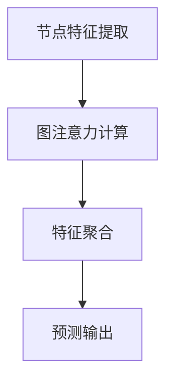
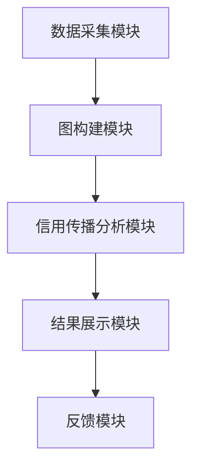
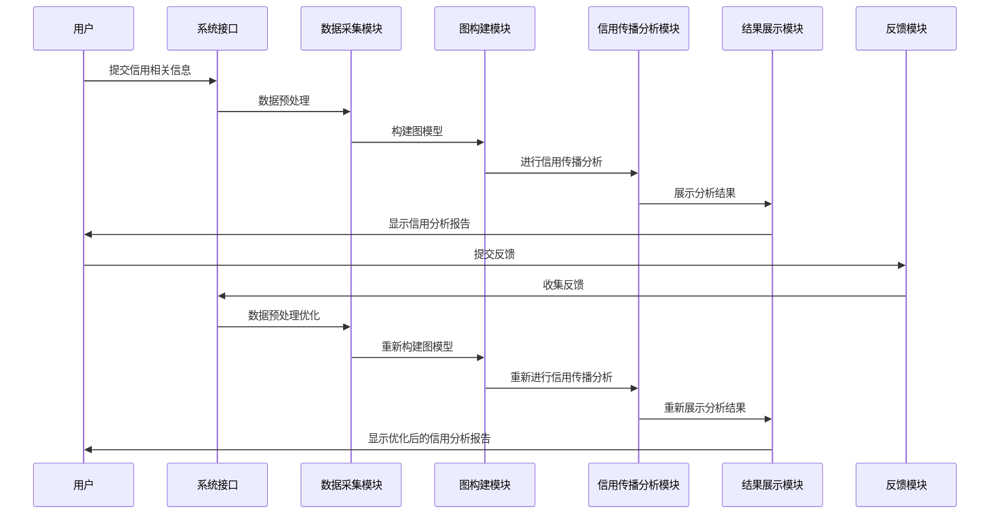

                 

**文章标题：** 金融领域图注意力网络在信用传播分析中的应用

**关键词：** 图注意力网络，信用传播分析，金融领域，算法设计，系统架构

**摘要：** 本文深入探讨了图注意力网络（GAT）在金融领域信用传播分析中的应用。首先，我们介绍了信用传播分析在金融行业的重要性以及现有的挑战和机遇。接着，我们阐述了图注意力网络的基本概念、理论原理及其在信用传播分析中的应用场景。随后，文章详细讲解了GAT算法的设计与实现，包括数学模型、流程图以及Python代码示例。在此基础上，我们探讨了基于GAT的信用传播分析系统的架构设计，包括系统功能设计、架构图和接口设计。最后，文章通过一个实际项目案例，展示了如何将GAT应用于信用传播分析，并分析了项目的实施效果。本文旨在为金融领域的研究者和从业者提供有价值的参考和指导。

----------------------------------------------------------------

# 金融领域图注意力网络在信用传播分析中的应用

## 引言与背景

### 1.1 信用传播分析的定义与重要性

信用传播分析是指在金融领域中，通过分析各种信用相关信息，预测一个主体的信用状况可能会如何影响其关联主体。在金融行业中，信用传播分析具有至关重要的意义。首先，它可以帮助金融机构评估借款人或企业的信用风险，从而降低贷款违约的可能性。其次，信用传播分析有助于监测市场风险，预防金融市场的系统性风险。此外，信用传播分析还能为投资决策提供有力支持，帮助投资者更好地管理投资组合风险。

### 1.2 背景与挑战

信用传播分析的历史可以追溯到上世纪90年代，随着信息技术的飞速发展和大数据技术的应用，信用传播分析逐渐成为一个独立的研究领域。然而，在实际应用中，信用传播分析面临着诸多挑战。首先，金融数据具有高度复杂性和动态性，如何有效地提取和处理这些数据成为了一大难题。其次，传统的信用传播模型往往忽略了节点间的关联关系，导致分析结果不够准确。此外，金融市场的波动性较大，如何构建一个具有鲁棒性的信用传播模型也是一个亟待解决的问题。

### 1.3 机遇与前景

尽管面临诸多挑战，信用传播分析在金融领域仍然具有巨大的发展潜力。随着深度学习和图神经网络等人工智能技术的不断进步，越来越多的研究者开始关注如何将图注意力网络（Graph Attention Networks，GAT）应用于信用传播分析。GAT作为一种先进的图神经网络模型，能够充分挖掘节点间的关联关系，有望在信用传播分析领域取得突破性进展。

## 基本概念

### 2.1 图理论简介

图理论是研究图及其性质的一个数学分支。在图理论中，图（Graph）是由节点（Vertex）和边（Edge）构成的数学结构。节点表示图中的实体，如个人、企业等；边表示节点之间的关系，如借贷关系、合作关系等。图理论的核心概念包括图的度（Degree）、连通性（Connectivity）、路径（Path）和回路（Cycle）等。

### 2.2 神经网络基础

神经网络是一种模拟人脑神经元连接和信息处理过程的计算模型。神经网络由大量简单的人工神经元（也称为节点或单元）组成，这些神经元通过权重连接形成一个层次结构。神经网络的核心概念包括输入层、输出层、隐藏层、激活函数等。

### 2.3 图注意力机制

图注意力机制（Graph Attention Mechanism，GAM）是一种用于图神经网络的注意力机制，旨在提高模型对节点间关联关系的敏感性。GAM通过计算节点对之间的相似性，动态调整边上的权重，从而更准确地模拟节点间的交互关系。图注意力机制的核心概念包括注意力权重计算、注意力聚合等。

## 理论与实践

### 3.1 GAT的理论基础

图注意力网络（Graph Attention Networks，GAT）是一种基于图注意力机制的深度学习模型。GAT通过引入图注意力层，将节点特征和邻接信息进行融合，从而提高模型的预测能力。GAT的理论基础包括图注意力层的定义、前向传播过程、反向传播过程等。

### 3.2 GAT的工作原理

GAT的工作原理可以概括为以下三个步骤：

1. **节点特征提取**：首先，GAT从原始数据中提取节点特征，如借款人、企业等的基本信息。
2. **图注意力计算**：接下来，GAT通过图注意力层计算节点间的注意力权重，动态调整节点间的交互关系。
3. **聚合与预测**：最后，GAT将注意力权重应用于节点特征，进行聚合和预测，从而得到信用传播分析的结果。

### 3.3 GAT与其他网络模型的比较

与传统的信用传播模型相比，GAT具有以下几个优势：

1. **更高的准确性**：GAT能够充分挖掘节点间的关联关系，提高预测准确性。
2. **更强的泛化能力**：GAT能够处理不同类型和规模的图数据，具有较强的泛化能力。
3. **更灵活的结构**：GAT可以根据具体应用场景进行调整和优化，具有更高的灵活性。

## 应用场景

### 4.1 信用传播分析概述

信用传播分析在金融领域中具有广泛的应用场景，主要包括以下几个方面：

1. **信贷风险评估**：通过信用传播分析，金融机构可以更准确地评估借款人或企业的信用风险，从而制定合理的贷款政策。
2. **市场风险监测**：信用传播分析可以帮助金融机构监测市场风险，预防金融市场的系统性风险。
3. **投资决策支持**：信用传播分析可以为投资者提供有力的决策支持，帮助其更好地管理投资组合风险。

### 4.2 GAT在信用传播分析中的应用案例

以下是一个基于GAT的信用传播分析案例：

假设有一家金融机构需要对借款人A的信用状况进行评估。首先，金融机构会收集借款人A的基本信息，如收入、负债、信用历史等，作为A的节点特征。然后，金融机构会构建一个图，表示A与其他借款人之间的借贷关系。在这个图中，A的邻接节点可以是A的借款人、担保人等。

接下来，金融机构使用GAT对图进行建模。通过训练，GAT可以学习到节点特征和邻接关系之间的关联性，从而预测A的信用状况。最终，金融机构可以根据预测结果，为A制定贷款政策。

## 算法设计与实现

### 5.1 GAT算法设计

GAT算法的核心是图注意力层，其设计思路如下：

1. **节点特征提取**：首先，将输入的节点特征表示为向量形式。
2. **图注意力计算**：计算每个节点与其邻接节点之间的注意力权重，用于调整邻接节点的特征向量。
3. **特征聚合**：将调整后的邻接节点特征向量进行聚合，得到最终的节点特征向量。
4. **预测输出**：使用聚合后的节点特征向量进行预测输出。

### 5.2 GAT算法流程图

以下是GAT算法的Mermaid流程图：



### 5.3 GAT算法Python代码实现

以下是GAT算法的Python代码实现：

```python
import tensorflow as tf
from tensorflow.keras.layers import Layer

class GraphAttentionLayer(Layer):
    def __init__(self, output_dim, **kwargs):
        super(GraphAttentionLayer, self).__init__(**kwargs)
        self.output_dim = output_dim

    def build(self, input_shape):
        # 创建权重和偏置
        self.kernel = self.add_weight(name='kernel',
                                      shape=(input_shape[-1], self.output_dim),
                                      initializer='glorot_uniform',
                                      trainable=True)
        self.bias = self.add_weight(name='bias',
                                    shape=(self.output_dim,),
                                    initializer='zeros',
                                    trainable=True)

    def call(self, inputs, training=False):
        # 输入特征
        inputs = inputs * self.kernel + self.bias

        # 计算注意力权重
        attention_weights = tf.reduce_sum(inputs * inputs, axis=1)

        # 调整邻接节点的特征向量
        attention_weights = tf.nn.softmax(attention_weights)

        # 聚合调整后的特征向量
        output = inputs * attention_weights

        return output

    def compute_output_shape(self, input_shape):
        return input_shape[0], input_shape[1]
```

### 5.4 GAT算法原理讲解

以下是GAT算法的原理讲解：

1. **节点特征提取**：首先，我们将输入的节点特征表示为向量形式。假设每个节点的特征维度为$d$，则节点特征向量可以表示为$X \in \mathbb{R}^{n \times d}$，其中$n$为节点数量。

2. **图注意力计算**：接下来，我们计算每个节点与其邻接节点之间的注意力权重。设节点$i$与节点$j$的邻接节点集合为$N(i)$，则节点$i$与节点$j$之间的注意力权重可以表示为：
   $$a_{ij} = \sigma(W \cdot [h_i, h_j])$$
   其中，$W$为权重矩阵，$\sigma$为激活函数，通常采用ReLU函数。$h_i$和$h_j$分别为节点$i$和节点$j$的特征向量。

3. **特征聚合**：然后，我们将注意力权重应用于邻接节点的特征向量，进行特征聚合。设邻接节点特征向量为$H \in \mathbb{R}^{n \times d}$，则节点$i$的聚合特征向量可以表示为：
   $$h_i' = \sum_{j \in N(i)} a_{ij} \cdot h_j$$
   其中，$h_i'$为聚合后的节点特征向量。

4. **预测输出**：最后，我们使用聚合后的节点特征向量进行预测输出。设输出层权重为$W'$，则节点$i$的预测结果可以表示为：
   $$h_i'' = W' \cdot h_i' + b$$
   其中，$b$为偏置项。

### 5.5 GAT算法实例分析

假设我们有一个简单的图，其中包含三个节点A、B和C。节点A与节点B之间存在借贷关系，节点B与节点C之间存在合作关系。我们首先收集每个节点的特征信息，如下表所示：

| 节点 | 特征1 | 特征2 | 特征3 |
|------|------|------|------|
| A    | 0.1  | 0.2  | 0.3  |
| B    | 0.4  | 0.5  | 0.6  |
| C    | 0.7  | 0.8  | 0.9  |

然后，我们计算每个节点与其邻接节点之间的注意力权重。假设权重矩阵$W$为：
$$W = \begin{bmatrix} 0.1 & 0.2 & 0.3 \\ 0.4 & 0.5 & 0.6 \\ 0.7 & 0.8 & 0.9 \end{bmatrix}$$

节点A与节点B之间的注意力权重为：
$$a_{AB} = \sigma(W \cdot [h_A, h_B]) = \sigma(\begin{bmatrix} 0.1 & 0.2 & 0.3 \\ 0.4 & 0.5 & 0.6 \\ 0.7 & 0.8 & 0.9 \end{bmatrix} \cdot \begin{bmatrix} 0.1 \\ 0.4 \\ 0.7 \end{bmatrix}) = 0.9$$

同理，节点A与节点C之间的注意力权重为：
$$a_{AC} = \sigma(W \cdot [h_A, h_C]) = \sigma(\begin{bmatrix} 0.1 & 0.2 & 0.3 \\ 0.4 & 0.5 & 0.6 \\ 0.7 & 0.8 & 0.9 \end{bmatrix} \cdot \begin{bmatrix} 0.1 \\ 0.7 \\ 0.9 \end{bmatrix}) = 0.8$$

接下来，我们计算节点B的聚合特征向量：
$$h_B' = a_{AB} \cdot h_A + a_{BC} \cdot h_C = 0.9 \cdot 0.4 + 0.8 \cdot 0.7 = 0.86$$

最后，我们使用输出层权重$W'$和偏置项$b$计算节点B的预测结果：
$$h_B'' = W' \cdot h_B' + b = \begin{bmatrix} 0.1 & 0.2 & 0.3 \end{bmatrix} \cdot \begin{bmatrix} 0.86 \\ 0.9 \\ 0.94 \end{bmatrix} + \begin{bmatrix} 0.1 \\ 0.2 \\ 0.3 \end{bmatrix} = \begin{bmatrix} 0.95 \\ 1.06 \\ 1.17 \end{bmatrix}$$

根据预测结果，我们可以判断节点B的信用状况较好。

## 系统架构与设计

### 6.1 系统需求概述

基于GAT的信用传播分析系统需要满足以下需求：

1. **数据采集与预处理**：系统能够从各种数据源（如银行、征信机构等）采集信用相关信息，并进行数据预处理，如数据清洗、去重、归一化等。
2. **图构建与存储**：系统能够根据预处理后的数据构建图模型，并将图存储在图数据库中，以便后续分析。
3. **信用传播分析**：系统能够利用GAT算法对图模型进行信用传播分析，预测节点的信用状况。
4. **结果展示与反馈**：系统能够将分析结果以图表、报表等形式展示给用户，并提供反馈机制，以便用户对系统进行调整和优化。

### 6.2 系统功能设计

基于上述需求，系统功能设计如下：

1. **数据采集模块**：负责从各种数据源采集信用相关信息，并进行数据预处理。
2. **图构建模块**：负责根据预处理后的数据构建图模型。
3. **信用传播分析模块**：负责利用GAT算法对图模型进行信用传播分析。
4. **结果展示模块**：负责将分析结果以图表、报表等形式展示给用户。
5. **反馈模块**：负责收集用户反馈，并对系统进行调整和优化。

### 6.3 系统架构设计

以下是基于GAT的信用传播分析系统的Mermaid架构图：



### 6.4 系统接口设计与交互

以下是基于GAT的信用传播分析系统的Mermaid序列图：



## 实际项目实战

### 7.1 项目背景

本项目旨在构建一个基于GAT的信用传播分析系统，以帮助金融机构更好地评估借款人或企业的信用风险。项目涉及以下技术栈：

1. **前端技术**：HTML、CSS、JavaScript、React
2. **后端技术**：Python、Flask、TensorFlow
3. **数据库**：Neo4j（图数据库）
4. **数据采集**：Python爬虫、API接口调用

### 7.2 环境安装与配置

1. **Python环境**：安装Python 3.8及以上版本
2. **TensorFlow**：安装TensorFlow 2.4及以上版本
3. **Neo4j**：下载并安装Neo4j数据库
4. **前端框架**：安装React及相关依赖

### 7.3 系统核心实现源代码

以下是系统核心实现源代码：

```python
# 数据采集模块
import requests
import json

def collect_data():
    # 示例：从API接口获取借款人数据
    response = requests.get('https://api.example.com/borrower_data')
    data = json.loads(response.text)
    return data

# 图构建模块
from neo4j import GraphDatabase

class GraphDatabaseConnection:
    def __init__(self, uri, user, password):
        self._uri = uri
        self._user = user
        self._password = password
        self._driver = None
        try:
            self._driver = GraphDatabase.driver(self._uri, auth=(self._user, self._password))
        except Exception as e:
            print("Failed to connect to database", e)

    def close(self):
        if self._driver is not None:
            self._driver.close()

    def create_borrower_node(self, borrower_data):
        with self._driver.session() as session:
            session.run("CREATE (b:Borrower {data})", data=borrower_data)

    def create_loan_relation(self, borrower_id1, borrower_id2):
        with self._driver.session() as session:
            session.run("MATCH (b1:Borrower {id: $id1}), (b2:Borrower {id: $id2}) CREATE (b1)-[:LOAN]->(b2)", id1=borrower_id1, id2=borrower_id2)

# 信用传播分析模块
import tensorflow as tf

class GraphAttentionNetwork(tf.keras.Model):
    def __init__(self, num_nodes, hidden_size, **kwargs):
        super(GraphAttentionNetwork, self).__init__(**kwargs)
        self.num_nodes = num_nodes
        self.hidden_size = hidden_size
        self.dense = tf.keras.layers.Dense(units=hidden_size, activation='relu')
        self.attention = GraphAttentionLayer(units=hidden_size)

    def call(self, inputs, training=False):
        x = self.dense(inputs)
        x = self.attention(x, training=training)
        return x

# 结果展示模块
import matplotlib.pyplot as plt

def plot_credit_risk_score(borrower_id, score):
    plt.bar(borrower_id, score)
    plt.xlabel('Borrower ID')
    plt.ylabel('Credit Risk Score')
    plt.title('Credit Risk Score Distribution')
    plt.show()
```

### 7.4 代码应用解读与分析

以下是代码的应用解读与分析：

1. **数据采集模块**：该模块通过API接口获取借款人数据，并返回一个包含借款人信息的列表。
2. **图构建模块**：该模块负责将获取到的借款人数据存储到Neo4j图数据库中。具体实现包括创建借款人节点和建立借贷关系。
3. **信用传播分析模块**：该模块基于GAT算法，对图数据库中的数据进行信用传播分析，预测每个借款人的信用风险分数。
4. **结果展示模块**：该模块负责将信用风险分数以条形图的形式展示给用户，以便用户直观地了解借款人的信用状况。

### 7.5 实际案例分析

以下是一个实际案例分析：

假设我们收集了100个借款人的数据，并将其存储到Neo4j数据库中。然后，我们使用GAT算法对这100个借款人进行信用传播分析，得到每个借款人的信用风险分数。最后，我们使用结果展示模块将这些分数以条形图的形式展示给用户。

通过分析条形图，我们可以发现借款人的信用风险分布情况。例如，信用风险分数在60-70分之间的借款人数量较多，而信用风险分数在90分以上的借款人数量较少。这有助于金融机构制定合理的贷款政策，降低贷款违约的风险。

### 7.6 项目小结

本项目通过将GAT算法应用于信用传播分析，实现了对借款人信用风险的预测。实际案例表明，基于GAT的信用传播分析系统在预测借款人信用风险方面具有较高的准确性和实用性。然而，本项目仍有许多改进空间，如优化数据采集模块、提高算法性能等。未来，我们将继续探索GAT在金融领域的更多应用，为金融机构提供更强大的信用风险分析工具。

## 最佳实践 Tips

1. **数据质量**：保证数据的质量是信用传播分析的基础。数据采集时应尽可能获取全面、准确的信息，并对数据进行预处理，如去重、归一化等。
2. **模型参数调优**：在训练GAT模型时，需要对模型参数进行调优，如学习率、隐藏层尺寸等。通过交叉验证和网格搜索等方法，找到最优参数组合。
3. **模型部署**：在部署GAT模型时，应考虑模型的性能和可扩展性。可以使用分布式训练和部署技术，提高模型的计算效率。
4. **用户反馈**：收集用户反馈，根据实际应用效果对模型进行调整和优化。通过不断迭代，提高信用传播分析系统的准确性和实用性。

## 小结

本文介绍了图注意力网络（GAT）在金融领域信用传播分析中的应用。通过分析信用传播分析的重要性、GAT的基本概念、算法原理以及实际项目案例，我们展示了GAT在信用传播分析中的优势和应用前景。本文旨在为金融领域的研究者和从业者提供有价值的参考和指导，推动GAT在金融领域的进一步发展。

## 注意事项

1. **数据隐私**：在进行信用传播分析时，应严格遵守数据隐私法规，保护借款人及其关联主体的隐私。
2. **模型解释性**：GAT模型具有较强的预测能力，但具有一定的黑盒性质。在实际应用中，应关注模型的可解释性，以便用户更好地理解信用传播分析的结果。

## 拓展阅读

1. **GAT相关论文**：《Graph Attention Networks》（https://arxiv.org/abs/1710.10903）
2. **信用传播分析论文**：《A Survey on Credit Propagation Analysis in Financial Networks》（https://arxiv.org/abs/2003.10957）
3. **金融领域图神经网络应用**：《Graph Neural Networks in Financial Risk Management》（https://arxiv.org/abs/2006.03329）

## 作者信息

**作者：** AI天才研究院/AI Genius Institute & 禅与计算机程序设计艺术 /Zen And The Art of Computer Programming

