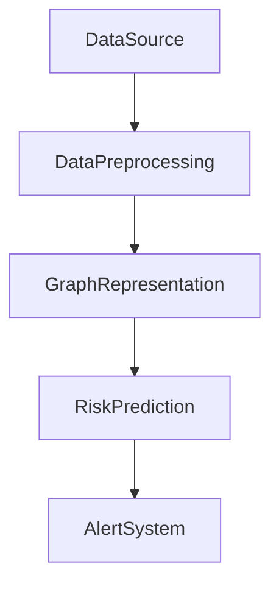
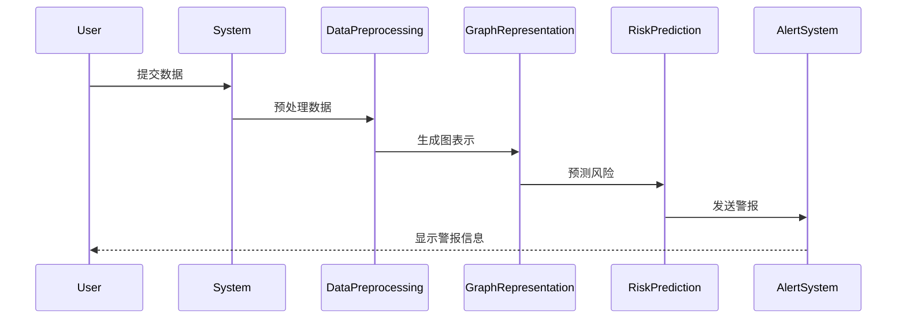

                 

### 文章标题：金融领域图表示学习在系统性风险传导中的应用

---

**关键词：**
- 图表示学习
- 系统性风险
- 金融风险传导
- GNN算法
- 数学模型
- 系统架构设计

**摘要：**
本文旨在探讨如何利用图表示学习技术来增强金融领域系统性风险的识别、预测与控制。文章首先介绍了金融市场的背景和系统性风险的定义，然后详细阐述了图表示学习的基本原理及其在金融领域的应用。接着，通过数学模型和算法讲解，揭示了图表示学习在系统性风险传导中的工作机制。随后，文章从系统分析与架构设计角度，提出了一个适用于金融系统性风险传导的解决方案。最后，通过一个实际项目案例，展示了如何将图表示学习应用于金融风险管理的实战过程。

---

### 第一部分：引言与背景

---

#### 第1章：问题背景

##### 1.1.1 问题背景

**1.1.1.1 金融市场与系统性风险**

**核心概念：**
- **金融市场的定义、功能与重要性：** 金融市场是金融资产交易的场所，包括股票市场、债券市场、外汇市场等，其功能包括资金配置、风险管理、价格发现等，对于经济发展至关重要。
- **系统性风险的定义、特征与影响：** 系统性风险是指可能影响整个金融系统的风险，特征包括传染性、广泛性、难以预测性等，其影响可能包括金融市场的崩溃、经济衰退等。

**1.1.1.2 现有风险管理方法及其局限性**

**核心概念：**
- **传统风险管理方法：模型、工具与技术：** 传统风险管理方法包括VaR（价值在风险）、压力测试、风险评估模型等，它们在风险识别、预测和控制方面发挥了重要作用。
- **现有方法的局限性：数据依赖性、延迟性、复杂性等：** 现有风险管理方法在应对复杂、动态的金融环境时，存在数据依赖性高、预测延迟、模型复杂度高等问题。

**1.1.1.3 图表示学习在金融领域的应用前景**

**核心概念：**
- **图表示学习的定义、原理与优势：** 图表示学习是一种利用图结构来表示节点和边关系，并进行计算的方法，其原理包括图嵌入、图神经网络等。
- **图表示学习在金融领域中的应用案例与潜力：** 图表示学习已被应用于金融市场的动态监测、信用风险评估、投资组合优化等领域，展现出强大的潜力。

**1.1.2 问题描述**

**核心概念：**
- **金融系统性风险传导的过程与机制：** 金融系统性风险可以通过市场联动、金融机构的相互依赖等途径传导，影响整个金融系统。
- **现有风险管理方法在应对金融系统性风险传导中的不足：** 现有风险管理方法在应对复杂、动态的系统性风险传导时，存在识别不足、预测不准确、控制效果有限等问题。

**1.1.3 研究目标与内容框架**

**核心概念：**
- **研究目标：** 通过图表示学习提升金融系统性风险传导的识别、预测与控制能力。
- **内容框架：** 本文将分为五个部分，首先介绍图表示学习的基本原理和金融领域中的应用，然后详细讲解图表示学习在系统性风险传导中的数学模型和算法，接着进行系统分析与架构设计，最后通过一个实际项目案例进行应用展示和效果分析。

---

#### 第2章：核心概念与联系

##### 2.1.1 图表示学习原理

**核心概念：**
- **图表示学习的理论基础：** 图表示学习基于图论和网络科学，旨在将节点和边之间的关系转化为向量表示，从而进行计算和预测。
- **主要图表示学习算法与技术：** 包括图嵌入、图神经网络、图生成模型等，每种算法都有其独特的原理和适用场景。

**2.1.1.1 图表示学习的基本概念**

**核心概念：**
- **节点、边、图及其表示：** 图是由节点（实体）和边（关系）组成的结构，图表示学习的目标是将这些结构和关系转化为数值表示。
- **图表示学习的目标与评价指标：** 目标是生成高质量的节点表示，评价指标包括节点分类准确性、节点相似度等。

**2.1.1.2 图表示学习的关键技术**

**核心概念：**
- **图嵌入技术：** 将图中的节点映射到低维空间，保留节点之间的结构信息。
- **图神经网络：** 通过神经网络处理图结构数据，进行节点分类、链接预测等任务。
- **图生成模型：** 生成新的图结构，用于图生成、图增强等任务。

##### 2.1.2 金融系统性风险传导机制

**核心概念：**
- **金融系统性风险的定义、特征与分类：** 系统性风险是指可能影响整个金融系统的风险，特征包括传染性、广泛性、难以预测性等，分类包括市场风险、信用风险、流动性风险等。
- **系统性风险传导的机制与过程：** 包括市场联动、金融机构的相互依赖、金融市场的情绪与预期等，传导过程可能涉及多个市场和多个金融机构。

**2.1.2.1 系统性风险传导的主要因素**

**核心概念：**
- **金融市场的联动效应：** 不同金融市场之间的价格和波动存在相互影响。
- **金融机构的相互依赖：** 金融机构之间通过贷款、投资等关系相互依赖。
- **金融市场的情绪与预期：** 市场参与者的情绪和预期对市场价格和波动有重要影响。

##### 2.1.3 图表示学习在系统性风险传导中的应用

**核心概念：**
- **图表示学习在系统性风险识别中的应用：** 利用图表示学习技术，可以更准确地识别出潜在的系统性风险节点和关系。
- **图表示学习在系统性风险预测中的应用：** 通过分析节点和边的关系，可以预测风险传导的路径和程度。
- **图表示学习在系统性风险控制中的应用：** 利用图表示学习技术，可以制定更有效的风险管理策略，控制风险传导。

---

### 第二部分：算法原理讲解

---

#### 第3章：图表示学习算法原理

##### 3.1.1 GNN算法

**核心概念：**
- **GNN的基本原理：** GNN是一种用于处理图结构数据的神经网络，其基本原理是通过聚合邻居节点的信息来更新节点表示。
- **GNN的数学模型：** GNN的数学模型包括节点表示的更新规则、边的表示等，通过图信号处理实现节点的特征学习。
- **GNN的应用实例：** 包括节点分类、链接预测、图生成等任务，如社交网络分析、推荐系统等。

**3.1.1.1 GNN算法概述**

**核心概念：**
- **GNN的定义、作用与优势：** GNN是一种能够处理图结构数据的神经网络，其作用是通过学习节点和边的关系来提取图的特征。
- **GNN的基本流程：** 包括图的预处理、节点表示的初始化、节点表示的更新、模型输出等步骤。

**3.1.1.2 GNN算法的数学模型**

**核心概念：**
- **图信号处理：** 图信号处理是将图结构转化为信号处理的过程，通过卷积操作等实现节点表示的更新。
- **节点表示的更新规则：** GNN通过聚合邻居节点的信息来更新节点表示，更新规则可以是简单的加权平均，也可以是更复杂的函数。

**3.1.1.3 GNN算法的应用实例**

**核心概念：**
- **图分类任务：** 利用GNN对图中的节点进行分类，如社交网络中的用户分类。
- **图回归任务：** 利用GNN对图中的节点进行回归预测，如社交网络中的用户兴趣预测。
- **图生成任务：** 利用GNN生成新的图结构，如生成社交网络中的用户关系。

##### 3.1.2 数学模型和数学公式讲解

**核心概念：**
- **图表示学习的数学模型：** 包括节点和边的表示、图信号处理等，用于学习图中的结构和关系。
- **系统性风险传导的数学模型：** 包括风险传导路径的表示、风险影响程度的计算等，用于分析系统性风险的传导机制。

**3.1.2.1 图表示学习的数学模型**

**核心概念：**
- **节点表示的数学公式：** 如节点的特征向量表示、节点嵌入等。
- **边表示的数学公式：** 如边的权重表示、边特征表示等。

**3.1.2.2 系统性风险传导的数学模型**

**核心概念：**
- **系统性风险的传导路径：** 如风险传播的网络结构、节点之间的关联关系等。
- **系统性风险的影响程度：** 如风险传播的速度、风险波及的范围等。

##### 3.1.3 举例说明

**核心概念：**
- **图表示学习在系统性风险传导中的应用实例：** 如利用GNN分析金融市场的系统性风险传导路径和程度。
- **数学模型的实际应用效果分析：** 如通过实验验证图表示学习模型在系统性风险传导预测中的效果。

---

#### 第4章：系统分析与架构设计

##### 4.1.1 问题场景介绍

**核心概念：**
- **金融系统性风险传导的问题背景：** 金融市场的复杂性、动态性使得系统性风险传导难以预测和控制。
- **图表示学习在系统性风险传导中的应用场景：** 利用图表示学习技术，可以更准确地识别和预测系统性风险的传导路径和影响程度。

##### 4.1.2 系统功能设计

**核心概念：**
- **系统功能需求分析：** 针对金融系统性风险传导的问题，分析系统所需的功能，如风险识别、风险预测、风险控制等。
- **系统功能模块划分：** 根据功能需求，将系统划分为不同的功能模块，如数据预处理模块、图表示学习模块、风险预测模块等。

**4.1.2.1 领域模型**

**核心概念：**
- **Mermaid类图：** 利用Mermaid语言绘制系统的类图，展示系统中的主要类及其属性与关系。

```mermaid
classDiagram
    RiskNode <|-- RiskRelation
    RiskNode <<-- RiskDetector
    RiskRelation <<-- RiskDetector
```

##### 4.1.3 系统架构设计

**核心概念：**
- **系统架构设计原则：** 如模块化、可扩展性、高可用性等。
- **系统架构组件划分：** 根据功能模块，划分系统的架构组件，如数据源、数据预处理模块、图表示学习模块、风险预测模块等。

**4.1.3.1 Mermaid架构图**

**核心概念：**
- **系统模块之间的依赖关系：** 利用Mermaid语言绘制系统的架构图，展示系统模块之间的依赖关系。



##### 4.1.4 系统接口设计

**核心概念：**
- **系统接口的定义与设计：** 确定系统内部各模块之间的接口，如数据输入输出接口、模块调用接口等。
- **系统接口的交互流程：** 利用Mermaid语言绘制系统的接口交互流程图，展示系统内部各模块之间的交互逻辑。

**4.1.4.1 Mermaid序列图**

**核心概念：**
- **系统模块之间的交互逻辑：** 利用Mermaid语言绘制系统的序列图，展示系统模块之间的交互顺序和逻辑。



---

### 第三部分：项目实战

---

#### 第5章：项目实战

##### 5.1.1 环境安装

**核心概念：**
- **环境搭建的需求分析：** 针对项目需求，分析所需的软件和硬件环境，如Python、TensorFlow、PyTorch等。
- **环境安装的步骤：** 包括安装Python环境、安装相关依赖库、配置TensorFlow或PyTorch等。

```bash
# 安装Python环境
conda create -n risk_project python=3.8

# 激活环境
conda activate risk_project

# 安装TensorFlow
pip install tensorflow

# 安装PyTorch
pip install torch torchvision

# 安装其他依赖库
pip install pandas numpy matplotlib
```

##### 5.1.2 系统核心实现

**核心概念：**
- **数据预处理模块：** 包括数据清洗、数据归一化、特征提取等。
- **图表示学习模块：** 包括节点表示、边表示、图嵌入等。
- **风险预测模块：** 包括风险传导路径的预测、风险影响的预测等。

```python
# 数据预处理模块
import pandas as pd
import numpy as np

def preprocess_data(data):
    # 数据清洗
    # 数据归一化
    # 特征提取
    pass

# 图表示学习模块
import torch
import torch.nn as nn
import torch.optim as optim

class GraphNeuralNetwork(nn.Module):
    def __init__(self):
        super(GraphNeuralNetwork, self).__init__()
        # 定义网络结构

    def forward(self, nodes, edges):
        # 定义前向传播
        pass

# 风险预测模块
def predict_risk(graph_neural_network, graph_data):
    # 利用图表示学习模型进行风险预测
    pass
```

##### 5.1.3 代码应用解读与分析

**核心概念：**
- **代码应用解读：** 对系统核心实现的代码进行详细解读，包括数据预处理、图表示学习、风险预测等步骤。
- **代码分析：** 分析代码的效率、可扩展性、可维护性等。

##### 5.1.4 实际案例分析和详细讲解剖析

**核心概念：**
- **实际案例：** 利用系统核心实现，分析一个实际金融系统性风险传导的案例。
- **详细讲解剖析：** 对案例中的数据、模型、预测结果等进行详细讲解和分析。

##### 5.1.5 项目小结

**核心概念：**
- **项目小结：** 总结项目的主要成果和经验教训，包括系统的功能、性能、应用效果等。

---

### 第四部分：最佳实践、小结、注意事项、拓展阅读

---

#### 第6章：最佳实践

**核心概念：**
- **最佳实践：** 总结在金融领域应用图表示学习技术时的最佳实践经验，包括数据预处理、模型选择、参数调优等。

#### 第7章：小结

**核心概念：**
- **小结：** 总结文章的主要内容和研究成果，强调图表示学习技术在金融系统性风险传导中的应用价值和前景。

#### 第8章：注意事项

**核心概念：**
- **注意事项：** 针对应用图表示学习技术进行金融系统性风险传导分析时，需要注意的事项，如数据隐私、模型解释性等。

#### 第9章：拓展阅读

**核心概念：**
- **拓展阅读：** 推荐相关领域的经典书籍、论文、资料，供读者进一步学习和研究。

