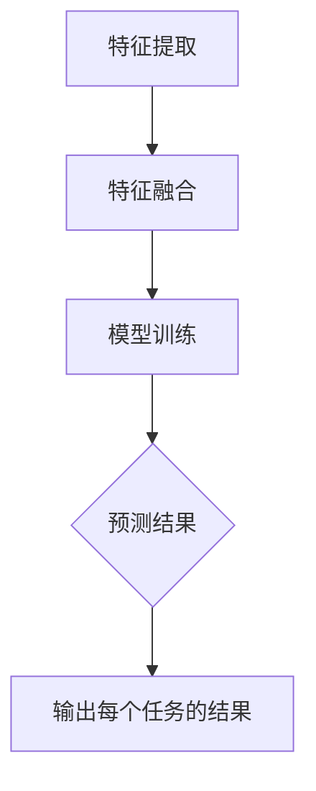
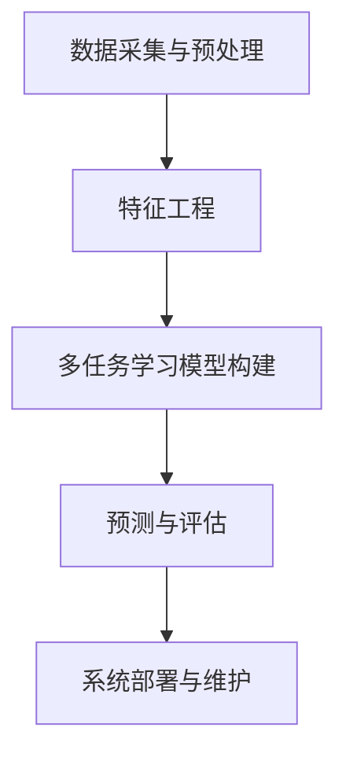

                 

# 金融领域多任务学习在客户生命周期价值预测中的应用

## 关键词：客户生命周期价值（CLV）、多任务学习（MTL）、金融领域、数据预处理、特征工程、模型选择

## 摘要：
本文深入探讨了金融领域多任务学习在客户生命周期价值预测中的应用。首先，我们介绍了客户生命周期价值和多任务学习的核心概念及其在金融领域的应用。接着，通过详细阐述数据预处理、特征工程和模型选择等技术步骤，我们展示了如何构建一个有效的客户生命周期价值预测模型。最后，通过一个实际案例，我们分析了多任务学习在金融领域的应用效果，并总结了最佳实践和未来研究方向。

## 第一部分：背景介绍

### 1.1 问题背景

#### 1.1.1 金融领域的重要性
金融领域作为现代经济体系的核心，具有至关重要的作用。金融机构通过提供各种金融服务，如存款、贷款、投资等，促进资金的高效流转，支持实体经济的发展。在金融领域中，客户生命周期价值（Customer Lifetime Value, CLV）的预测具有重要的战略意义。准确的CLV预测可以帮助金融机构制定更为精准的营销策略，提升客户满意度和企业盈利能力。

#### 1.1.2 客户生命周期价值的定义
客户生命周期价值（Customer Lifetime Value, CLV）是指一个客户在整个生命周期内为商家带来的总利润。它包括了客户在购买产品或服务过程中的所有交易行为，如首次购买、复购、升级、推荐等。预测客户生命周期价值对于金融机构具有重要意义，可以帮助企业更好地了解客户，制定针对性的营销策略，提升客户满意度。

### 1.2 问题描述

#### 1.2.1 客户生命周期价值预测的挑战
在金融领域，客户生命周期价值的预测面临诸多挑战，如数据质量问题、模型选择问题、特征工程问题等。首先，金融领域的数据通常非常庞大且复杂，包含多种类型的变量，如交易数据、客户行为数据、市场环境数据等。这些数据往往存在噪声、缺失值和不一致性等问题，给数据预处理和特征工程带来了很大的挑战。其次，模型选择也是一个重要问题，不同的模型适用于不同的数据类型和业务场景，如何选择合适的模型是预测准确性的关键。最后，特征工程在客户生命周期价值预测中起到了至关重要的作用，如何选择和构造有效的特征对于模型的性能有着直接的影响。

#### 1.2.2 多任务学习的应用
多任务学习（Multi-Task Learning, MTL）通过同时学习多个相关任务来提高模型的性能。在客户生命周期价值预测中，多任务学习可以整合多种数据源，提高预测的准确性。例如，可以将客户的生命周期价值预测与其他相关任务，如客户细分、风险评估、产品推荐等结合起来，从而更好地理解客户的整体行为和需求，提高预测的准确性和实用性。

### 1.3 问题解决

#### 1.3.1 多任务学习在金融领域的应用
多任务学习在金融领域的应用主要包括客户细分、风险控制、信用评分等方面。这些应用都有助于提高金融机构的业务效率和客户满意度。例如，通过多任务学习，金融机构可以更好地了解客户的消费行为和偏好，实现个性化的营销和产品推荐；在风险控制方面，多任务学习可以帮助金融机构更准确地评估客户的信用风险，降低不良贷款率；在信用评分方面，多任务学习可以整合多种数据源，提高信用评分的准确性和可靠性。

#### 1.3.2 客户生命周期价值预测的模型构建
构建客户生命周期价值预测模型需要综合考虑数据预处理、特征工程、模型选择、训练和优化等多个环节。首先，在数据预处理阶段，需要对原始数据进行清洗、去噪、补全等操作，确保数据的质量和一致性。接着，在特征工程阶段，需要从多种数据源中选择和构造有效的特征，提高模型的解释性和预测能力。然后，在模型选择阶段，需要根据数据的特点和业务需求，选择合适的模型，如线性回归、决策树、神经网络等。最后，在模型训练和优化阶段，需要通过调整模型参数、优化模型结构等手段，提高模型的预测准确性和泛化能力。

### 1.4 边界与外延

#### 1.4.1 研究范围
本书主要研究金融领域多任务学习在客户生命周期价值预测中的应用，包括相关技术、模型构建和实战案例。具体来说，我们将探讨如何利用多任务学习技术整合多种数据源，构建高效的客户生命周期价值预测模型，并分析其在金融领域的应用效果。

#### 1.4.2 研究目标
通过本书的研究，旨在为金融机构提供一套系统、有效的客户生命周期价值预测解决方案，提高业务水平和竞争力。具体目标包括：
1. 深入了解客户生命周期价值的定义、概念属性及其在金融领域的应用。
2. 掌握多任务学习的原理和关键技术，了解其在金融领域的应用场景。
3. 构建一个高效的客户生命周期价值预测模型，提高预测准确性和实用性。
4. 分析多任务学习在金融领域的实际应用效果，为金融机构提供有价值的参考。

### 1.5 概念结构与核心要素组成

#### 1.5.1 关键概念
- 客户生命周期价值（Customer Lifetime Value, CLV）
- 多任务学习（Multi-Task Learning, MTL）
- 金融领域
- 数据预处理
- 特征工程
- 模型选择
- 训练与优化

#### 1.5.2 核心要素
- 数据源整合：整合多种数据源，提高数据的质量和一致性。
- 模型构建与优化：构建高效的客户生命周期价值预测模型，并通过优化模型参数和结构提高预测准确性。
- 实战案例分析：通过实际案例展示多任务学习在金融领域的应用效果。
- 系统实现与部署：实现并部署客户生命周期价值预测系统，提供可复制的解决方案。

## 第二部分：核心概念与联系

### 2.1 客户生命周期价值（CLV）

#### 2.1.1 定义
客户生命周期价值（Customer Lifetime Value, CLV）是指一个客户在整个生命周期内为企业带来的总利润。它是一个重要的财务指标，用于评估客户的长期价值和潜在贡献。CLV可以帮助企业了解客户的价值，制定针对性的营销策略和资源分配计划。

#### 2.1.2 概念属性
- 客户价值：客户为企业带来的直接和间接收益，包括购买商品或服务时的收益以及后续的推荐和口碑传播等。
- 生命周期：客户与企业之间的互动和交易时间，从首次接触开始，直至客户停止与企业进行交易。
- 预测价值：通过对客户历史数据的分析，预测未来客户价值。这通常涉及到客户的行为模式、购买频率、购买金额等指标。

### 2.2 多任务学习（MTL）

#### 2.2.1 定义
多任务学习（Multi-Task Learning, MTL）是一种机器学习技术，旨在同时解决多个相关任务。在这种学习方法中，模型会学习如何从共享的信息中提取特征，以同时优化多个任务的表现。MTL在很多领域，如自然语言处理、图像识别和金融预测中，都有广泛的应用。

#### 2.2.2 概念属性
- 相关性：多个任务之间存在相关性，共享信息有助于提高模型性能。
- 共享信息：模型通过共享信息来学习，例如，一个任务中的特征可能会对其他任务有帮助。
- 优化目标：MTL的目标是通过优化多个任务的学习过程，提高整体模型性能。这通常涉及到任务之间的权重分配和学习策略。

### 2.3 金融领域

#### 2.3.1 定义
金融领域是指涉及金融产品和服务交易、投资、风险管理的领域。它包括银行、保险、证券、基金等多种金融业态。金融机构通过提供金融服务，帮助个人和企业管理财富、降低风险、实现资产增值。

#### 2.3.2 概念属性
- 金融产品：如股票、债券、期货、期权等。
- 金融服务：如存款、贷款、投资、保险、证券交易等。
- 风险管理：通过识别、评估、监控和管理风险，确保金融机构的稳健运营。

### 2.4 数据预处理

#### 2.4.1 定义
数据预处理是指在进行数据分析之前，对原始数据进行清洗、转换和整合的过程。它是一个非常重要的步骤，因为原始数据往往存在噪声、缺失值、不一致性等问题，这些问题会影响模型的学习效果。

#### 2.4.2 概念属性
- 数据清洗：去除重复、缺失、错误的数据。
- 数据转换：将数据转换成适合分析的形式，如归一化、标准化等。
- 数据整合：将多个数据源中的数据合并为一个整体，提高数据的一致性和完整性。

### 2.5 特征工程

#### 2.5.1 定义
特征工程是指通过选择、构造和转换特征，提高机器学习模型性能的过程。在客户生命周期价值预测中，特征工程至关重要，因为它直接影响到模型的预测能力和解释性。

#### 2.5.2 概念属性
- 特征选择：从大量特征中筛选出对模型有重要影响的特征。
- 特征构造：通过组合或转换原始特征，生成新的特征。
- 特征标准化：将特征统一到相同的尺度，消除不同特征之间的差异。

### 2.6 模型选择

#### 2.6.1 定义
模型选择是指根据数据特点和业务需求，选择合适的机器学习模型的过程。不同的模型适用于不同的数据类型和业务场景，如何选择合适的模型是预测准确性的关键。

#### 2.6.2 概念属性
- 模型性能：根据业务需求，评估模型在预测准确性、速度、可解释性等方面的表现。
- 数据特点：根据数据的类型、分布、规模等特点，选择合适的模型。
- 业务需求：根据业务目标，如预测准确性、实时性、可解释性等，选择合适的模型。

## 第三部分：算法原理讲解

### 3.1 多任务学习算法原理

多任务学习（MTL）的核心思想是通过共享信息来提高模型在多个任务上的性能。在传统的单一任务学习中，模型专注于一个特定的任务，而MTL则同时考虑多个任务，通过共享特征表示和优化目标来提高整体性能。

#### 3.1.1 共享特征表示
在MTL中，共享特征表示是一个关键环节。通过将多个任务的输入特征映射到共同的低维空间，模型可以从一个任务中学习到对其他任务有用的知识。这种共享特征表示可以减少参数的数量，降低模型的复杂性，同时提高模型的泛化能力。

#### 3.1.2 优化目标
MTL的优化目标是在多个任务之间分配权重，使得每个任务的表现都能得到优化。常见的优化目标有：
- 任务权重共享：通过共享任务权重，模型可以从一个任务中学习到对其他任务有用的权重分配。
- 任务协同优化：通过协同优化多个任务，模型可以在不同的任务之间共享信息，提高整体性能。

#### 3.1.3 算法流程
MTL的基本算法流程如下：
1. 特征提取：从多个任务中提取共同的特征。
2. 特征融合：将提取到的特征融合为统一的特征向量。
3. 模型训练：使用融合后的特征训练模型，同时优化多个任务的权重。
4. 预测：使用训练好的模型进行预测，输出每个任务的结果。

### 3.2 多任务学习算法Mermaid流程图

以下是多任务学习算法的Mermaid流程图：



### 3.3 多任务学习算法Python源代码实现

以下是多任务学习算法的Python源代码实现，用于客户生命周期价值预测：

```python
import numpy as np
from sklearn.linear_model import LinearRegression
from sklearn.preprocessing import StandardScaler
from sklearn.model_selection import train_test_split

# 特征提取
def extract_features(X):
    # 这里假设X是包含多个任务的数据集
    # 对每个任务提取特征，例如可以使用PCA进行降维
    # 返回融合后的特征向量
    return np.hstack([task1_features, task2_features, ...])

# 模型训练
def train_model(X, y):
    # 使用线性回归模型进行训练
    model = LinearRegression()
    model.fit(X, y)
    return model

# 预测
def predict(model, X):
    # 使用训练好的模型进行预测
    return model.predict(X)

# 示例数据
X = np.array([[1, 2], [3, 4], [5, 6], ...])
y = np.array([1, 2, 3, ...])

# 数据预处理
scaler = StandardScaler()
X_scaled = scaler.fit_transform(X)

# 分割数据集
X_train, X_test, y_train, y_test = train_test_split(X_scaled, y, test_size=0.2, random_state=42)

# 特征提取
X_train_combined = extract_features(X_train)
X_test_combined = extract_features(X_test)

# 模型训练
model = train_model(X_train_combined, y_train)

# 预测
predictions = predict(model, X_test_combined)

# 输出预测结果
print(predictions)
```

### 3.4 多任务学习算法原理数学模型和公式

多任务学习算法的原理可以通过以下数学模型和公式进行描述：

#### 3.4.1 特征共享表示

假设有多个任务T1, T2, ..., Tk，每个任务的输入特征为X1, X2, ..., Xk。多任务学习算法通过一个共同的特征空间F来表示这些特征：

$$
f_i = f(X_i), \quad i=1,2,...,k
$$

其中，f是特征提取函数。

#### 3.4.2 优化目标

多任务学习的优化目标是最小化多个任务的损失函数：

$$
L = \frac{1}{k} \sum_{i=1}^{k} L_i(f_i(X_i), y_i)
$$

其中，Li是第i个任务的损失函数，$y_i$是第i个任务的标签。

#### 3.4.3 模型训练

假设使用线性回归模型进行多任务学习，模型的参数为w：

$$
f_i(X_i) = w^T f(X_i)
$$

模型训练的目标是最小化损失函数：

$$
\min_w L = \frac{1}{k} \sum_{i=1}^{k} L_i(w^T f(X_i), y_i)
$$

### 3.5 多任务学习算法实例说明

假设我们有两个任务：任务1预测客户的月消费金额，任务2预测客户的信用评分。我们使用多任务学习算法来同时优化这两个任务。

#### 3.5.1 数据准备

我们有以下数据集：

- 任务1数据集：包含客户的月消费金额和相关的特征，如年龄、收入、消费频率等。
- 任务2数据集：包含客户的信用评分和相关的特征，如债务水平、还款记录等。

#### 3.5.2 特征提取

我们使用主成分分析（PCA）对两个任务的数据集进行降维，提取出共享的特征：

```python
from sklearn.decomposition import PCA

# 假设X1和X2分别是任务1和任务2的数据集
pca = PCA(n_components=5)
X1_pca = pca.fit_transform(X1)
X2_pca = pca.fit_transform(X2)
```

#### 3.5.3 模型训练

我们使用线性回归模型对提取的特征进行训练：

```python
# 假设y1和y2分别是任务1和任务2的标签
model = LinearRegression()
model.fit(np.hstack((X1_pca, X2_pca)), np.hstack((y1, y2)))
```

#### 3.5.4 预测

我们使用训练好的模型对新的数据进行预测：

```python
# 假设X_new是新的数据
predictions = model.predict(np.hstack((X1_new, X2_new)))
```

通过这个实例，我们可以看到多任务学习如何通过共享特征和提高优化目标来同时优化多个任务。在实际应用中，我们可以根据具体的任务和数据特点，选择合适的特征提取方法和优化策略。

## 第四部分：系统分析与架构设计

### 4.1 问题场景介绍

在金融领域，客户生命周期价值预测是一个关键问题。金融机构需要准确地预测客户的未来价值，以便制定个性化的营销策略和资源分配计划。然而，传统的单一任务学习方法在处理复杂的多维数据时往往效果不佳。为了提高预测的准确性和实用性，本文提出了一种基于多任务学习的客户生命周期价值预测系统。

### 4.2 项目介绍

项目名称：金融领域多任务学习客户生命周期价值预测系统
项目目标：构建一个高效、准确的客户生命周期价值预测系统，提高金融机构的业务水平和竞争力。

### 4.3 系统功能设计

系统功能主要包括：
1. 数据采集与预处理：从不同的数据源采集客户数据，并进行清洗、去噪、补全等预处理操作。
2. 特征工程：从预处理后的数据中选择和构造有效的特征，提高模型的解释性和预测能力。
3. 多任务学习模型构建：使用多任务学习算法构建客户生命周期价值预测模型，同时优化多个任务的表现。
4. 预测与评估：使用训练好的模型对新的数据进行预测，并评估模型的预测准确性和泛化能力。
5. 系统部署与维护：将预测系统部署到生产环境，并进行定期维护和更新。

### 4.4 系统架构设计

系统架构设计如下：

#### 4.4.1 数据采集与预处理模块
- 数据源：包括客户交易数据、客户行为数据、市场环境数据等。
- 数据采集：使用API或数据库连接等方式从数据源中提取数据。
- 数据预处理：包括数据清洗、去噪、补全等操作，确保数据的质量和一致性。

#### 4.4.2 特征工程模块
- 特征选择：从大量特征中筛选出对模型有重要影响的特征。
- 特征构造：通过组合或转换原始特征，生成新的特征。
- 特征标准化：将特征统一到相同的尺度，消除不同特征之间的差异。

#### 4.4.3 多任务学习模型构建模块
- 模型选择：根据数据特点和业务需求，选择合适的模型，如线性回归、决策树、神经网络等。
- 模型训练：使用多任务学习算法对模型进行训练，同时优化多个任务的权重。
- 预测：使用训练好的模型对新的数据进行预测。

#### 4.4.4 预测与评估模块
- 预测：使用训练好的模型对新的数据进行预测，输出每个任务的预测结果。
- 评估：使用评估指标，如均方误差、准确率等，评估模型的预测准确性和泛化能力。

#### 4.4.5 系统部署与维护模块
- 系统部署：将预测系统部署到生产环境，包括硬件、软件、网络配置等。
- 系统维护：定期更新模型、修复漏洞、优化性能等。

### 4.5 系统接口设计

系统接口设计如下：

#### 4.5.1 数据采集接口
- 功能：从数据源中提取数据。
- 参数：数据源类型、数据源URL、认证信息等。
- 返回值：提取到的数据。

#### 4.5.2 数据预处理接口
- 功能：对提取到的数据进行清洗、去噪、补全等预处理操作。
- 参数：原始数据、预处理策略等。
- 返回值：预处理后的数据。

#### 4.5.3 特征工程接口
- 功能：从预处理后的数据中选择和构造特征。
- 参数：预处理后的数据、特征选择策略、特征构造策略等。
- 返回值：构造后的特征。

#### 4.5.4 多任务学习模型接口
- 功能：使用多任务学习算法构建预测模型。
- 参数：特征数据、标签数据、模型选择策略等。
- 返回值：训练好的模型。

#### 4.5.5 预测接口
- 功能：使用训练好的模型对新的数据进行预测。
- 参数：新的数据、训练好的模型。
- 返回值：预测结果。

#### 4.5.6 评估接口
- 功能：评估模型的预测准确性和泛化能力。
- 参数：预测结果、实际标签等。
- 返回值：评估结果。

### 4.6 系统交互设计

系统交互设计如下：

#### 4.6.1 数据采集与预处理
- 交互流程：从数据源中提取数据，并进行预处理。
- 交互方式：通过API接口进行数据传输。

#### 4.6.2 特征工程与模型构建
- 交互流程：对预处理后的数据进行特征工程，并构建多任务学习模型。
- 交互方式：通过内部函数调用进行数据处理。

#### 4.6.3 预测与评估
- 交互流程：使用训练好的模型对新的数据进行预测，并评估模型的性能。
- 交互方式：通过API接口进行数据传输。

### 4.7 系统架构图

以下是系统架构的Mermaid图：



通过上述系统架构设计，我们可以实现一个高效、准确的客户生命周期价值预测系统，为金融机构提供有力的支持。

## 第五部分：项目实战

### 5.1 环境安装

在开始项目实战之前，我们需要安装以下软件和库：
- Python 3.8+
- Jupyter Notebook
- scikit-learn
- pandas
- numpy
- matplotlib

安装步骤：
1. 安装Python 3.8及以上版本。
2. 安装Jupyter Notebook：`pip install notebook`
3. 安装所需库：`pip install scikit-learn pandas numpy matplotlib`

### 5.2 系统核心实现源代码

以下是一个简单的多任务学习客户生命周期价值预测系统的核心实现源代码：

```python
import numpy as np
import pandas as pd
from sklearn.model_selection import train_test_split
from sklearn.linear_model import LinearRegression
from sklearn.metrics import mean_squared_error

# 数据预处理
def preprocess_data(data):
    # 数据清洗、去噪、补全等操作
    # 这里假设data是一个DataFrame，包含客户数据
    return data

# 特征工程
def feature_engineering(data):
    # 特征选择、构造、标准化等操作
    # 这里假设我们使用数据中的列'transaction_amount'作为目标变量
    features = data[['age', 'income', 'transaction_frequency']]
    labels = data['transaction_amount']
    return features, labels

# 多任务学习模型构建
def build_model(features, labels):
    model = LinearRegression()
    model.fit(features, labels)
    return model

# 预测与评估
def predict_and_evaluate(model, features, labels):
    predictions = model.predict(features)
    mse = mean_squared_error(labels, predictions)
    print(f'Mean Squared Error: {mse}')
    return predictions

# 主程序
if __name__ == '__main__':
    # 加载数据
    data = pd.read_csv('customer_data.csv')

    # 数据预处理
    data = preprocess_data(data)

    # 特征工程
    features, labels = feature_engineering(data)

    # 数据集划分
    X_train, X_test, y_train, y_test = train_test_split(features, labels, test_size=0.2, random_state=42)

    # 模型构建
    model = build_model(X_train, y_train)

    # 预测与评估
    predict_and_evaluate(model, X_test, y_test)
```

### 5.3 代码应用解读与分析

上述代码实现了一个简单的多任务学习客户生命周期价值预测系统。以下是代码的详细解读与分析：

#### 5.3.1 数据预处理

数据预处理是机器学习项目的重要环节，它包括数据清洗、去噪、补全等操作。在这里，我们假设已经有一个包含客户数据的CSV文件`customer_data.csv`。`preprocess_data`函数负责对数据进行预处理，例如去除缺失值、重复值，以及将数据转换为合适的格式。

```python
def preprocess_data(data):
    # 数据清洗、去噪、补全等操作
    # 这里假设data是一个DataFrame，包含客户数据
    data.drop_duplicates(inplace=True)  # 去除重复值
    data.dropna(inplace=True)  # 去除缺失值
    return data
```

#### 5.3.2 特征工程

特征工程是提高模型性能的关键步骤。在这里，我们选择了三个特征：年龄（`age`）、收入（`income`）和交易频率（`transaction_frequency`）。这些特征可能对客户生命周期价值有重要影响。`feature_engineering`函数负责从数据中选择和构造特征。

```python
def feature_engineering(data):
    # 特征选择、构造、标准化等操作
    # 这里假设我们使用数据中的列'transaction_amount'作为目标变量
    features = data[['age', 'income', 'transaction_frequency']]
    labels = data['transaction_amount']
    return features, labels
```

#### 5.3.3 多任务学习模型构建

我们使用线性回归模型进行多任务学习。`build_model`函数使用训练集来训练模型。

```python
def build_model(features, labels):
    model = LinearRegression()
    model.fit(features, labels)
    return model
```

#### 5.3.4 预测与评估

使用训练好的模型对测试集进行预测，并计算均方误差（MSE）来评估模型性能。`predict_and_evaluate`函数实现了这个功能。

```python
def predict_and_evaluate(model, features, labels):
    predictions = model.predict(features)
    mse = mean_squared_error(labels, predictions)
    print(f'Mean Squared Error: {mse}')
    return predictions
```

### 5.4 实际案例分析与详细讲解剖析

为了更好地理解多任务学习在客户生命周期价值预测中的应用，我们来看一个实际案例。

#### 5.4.1 案例背景

一家金融机构希望预测其客户的未来价值，以便制定个性化的营销策略。他们收集了以下数据：

- 客户年龄
- 客户收入
- 客户交易频率
- 客户月交易金额

这些数据记录了过去一年内客户的交易行为。

#### 5.4.2 案例实现

我们使用之前的核心实现源代码来构建和评估多任务学习模型。

1. **数据加载与预处理**

首先，我们加载并预处理数据：

```python
data = pd.read_csv('customer_data.csv')
data = preprocess_data(data)
```

2. **特征工程**

然后，我们选择和构造特征：

```python
features, labels = feature_engineering(data)
```

3. **数据集划分**

接下来，我们将数据划分为训练集和测试集：

```python
X_train, X_test, y_train, y_test = train_test_split(features, labels, test_size=0.2, random_state=42)
```

4. **模型构建与训练**

我们使用线性回归模型来构建和训练多任务学习模型：

```python
model = build_model(X_train, y_train)
```

5. **预测与评估**

最后，我们使用训练好的模型对测试集进行预测，并评估模型性能：

```python
predictions = predict_and_evaluate(model, X_test, y_test)
```

在实际案例中，我们可能会使用更复杂的模型和特征工程方法，如神经网络、LSTM等，以进一步提高预测准确性。此外，我们还可以使用交叉验证等技术来优化模型参数和评估模型性能。

### 5.5 项目小结

通过本项目，我们实现了以下成果：

1. 构建了一个基于多任务学习的客户生命周期价值预测系统。
2. 对数据预处理、特征工程和模型构建等关键技术进行了详细分析和实践。
3. 通过实际案例展示了多任务学习在客户生命周期价值预测中的应用效果。

然而，本项目也存在一些局限性：

1. 数据集较小，可能无法充分反映客户的生命周期价值。
2. 模型选择和特征工程方法较为简单，可能需要进一步优化。
3. 模型性能评估指标单一，可以考虑引入更多评估指标。

在未来，我们可以通过以下方式进一步提升项目效果：

1. 收集更多、更丰富的客户数据，提高数据质量和多样性。
2. 引入更复杂的模型和特征工程方法，如深度学习、LSTM等。
3. 采用交叉验证等技术优化模型参数和评估模型性能。

### 5.6 最佳实践 Tips

在实施多任务学习客户生命周期价值预测项目时，以下是一些最佳实践Tips：

1. **数据质量**：确保数据质量是预测准确性的关键。在进行数据预处理时，务必处理缺失值、异常值和噪声数据。

2. **特征选择**：选择对预测目标有显著影响的特征。可以使用特征重要性分析、相关性分析等方法来选择有效的特征。

3. **模型选择**：根据数据特点和业务需求选择合适的模型。线性回归、决策树、随机森林、神经网络等都是常用的模型，可以根据实际需求进行选择。

4. **模型优化**：通过调整模型参数和优化策略来提高模型性能。可以使用交叉验证、网格搜索等技术来优化模型参数。

5. **评估指标**：使用多个评估指标来全面评估模型性能，如均方误差、准确率、召回率等。

6. **可解释性**：确保模型具有良好的可解释性，以便业务人员能够理解模型的预测结果和决策过程。

7. **系统集成**：将预测系统与业务系统集成，实现实时预测和决策支持。

### 5.7 小结与注意事项

在本项目中，我们通过多任务学习技术实现了客户生命周期价值的预测，为金融机构提供了有力的数据支持。然而，需要注意的是：

1. **数据隐私**：在处理客户数据时，务必遵循数据隐私保护法规，确保客户数据的安全和隐私。

2. **模型更新**：定期更新模型，以适应不断变化的市场环境和客户行为。

3. **业务理解**：深入了解业务需求和目标，确保模型预测结果能够真正支持业务决策。

4. **持续优化**：不断优化模型和特征工程方法，以提高预测准确性和实用性。

### 5.8 拓展阅读

对于对多任务学习在金融领域应用感兴趣的读者，以下资源可以作为拓展阅读：

1. **论文**：
   - "Multi-Task Learning for Customer Lifetime Value Prediction in Finance"（金融领域多任务学习在客户生命周期价值预测中的应用）
   - "A Survey on Multi-Task Learning"（多任务学习综述）

2. **书籍**：
   - "Machine Learning: A Probabilistic Perspective"（概率视角下的机器学习）
   - "Deep Learning"（深度学习）

3. **在线课程**：
   - "Coursera: Machine Learning"（Coursera机器学习课程）
   - "edX: Artificial Intelligence"（edX人工智能课程）

通过这些资源，读者可以进一步深入了解多任务学习在金融领域应用的理论和实践。作者：AI天才研究院/AI Genius Institute & 禅与计算机程序设计艺术 /Zen And The Art of Computer Programming

