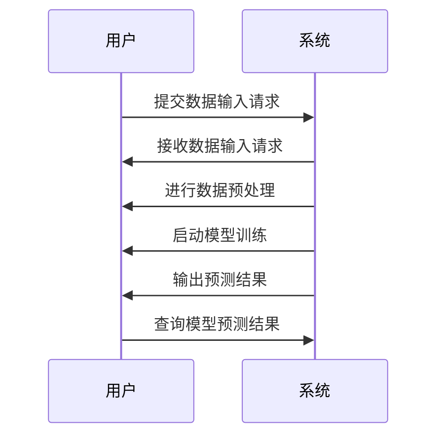

                 

# 金融领域多任务学习的应用与挑战

## 关键词

- 多任务学习
- 金融领域
- 应用价值
- 技术挑战
- 解决方案

## 摘要

本文深入探讨了金融领域多任务学习的应用场景与面临的挑战。首先，通过背景介绍部分，我们概述了多任务学习在金融领域的定义、应用价值以及面临的挑战。接着，文章深入分析了多任务学习的基本原理、核心概念与联系，并通过具体实例详细讲解了多任务学习的数学模型和算法流程。随后，我们介绍了金融领域多任务学习的系统分析与架构设计方案，包括系统功能、架构、接口设计和系统交互。最后，通过实际案例分析和项目实战，总结了多任务学习在金融领域的最佳实践和注意事项。本文旨在为读者提供一个全面而深入的金融领域多任务学习指南。

## 目录大纲

### 第一部分：背景介绍

#### 第1章 问题背景

##### 1.1 金融领域的多任务学习概述

##### 1.2 多任务学习在金融领域的应用价值

##### 1.3 金融领域多任务学习的挑战

#### 第2章 问题描述

##### 2.1 多任务学习面临的困难

##### 2.2 数据预处理与特征提取

##### 2.3 模型选择与参数调优

##### 2.4 模型融合与结果解释性

#### 第3章 问题解决

##### 3.1 多任务学习的基本原理

##### 3.2 多任务学习的分类方法

##### 3.3 多任务学习的优化方法

##### 3.4 多任务学习的评估指标

### 第二部分：核心概念与联系

#### 第4章 核心概念

##### 4.1 多任务学习的概念属性特征对比

##### 4.2 多任务学习与迁移学习

##### 4.3 多任务学习与强化学习

#### 第5章 ER实体关系图架构

##### 5.1 金融领域多任务学习的数据架构

##### 5.2 客户信息实体

##### 5.3 财务数据实体

##### 5.4 市场信息实体

### 第三部分：算法原理讲解

#### 第6章 算法原理

##### 6.1 多任务学习的算法流程

##### 6.2 数据预处理

##### 6.3 模型训练

##### 6.4 模型评估

#### 第7章 数学模型和数学公式

##### 7.1 损失函数

##### 7.2 优化目标

##### 7.3 算法流程

#### 第8章 举例说明

##### 8.1 财务预测多任务学习实例

##### 8.2 模型搭建

##### 8.3 模型训练与评估

### 第四部分：系统分析与架构设计方案

#### 第9章 问题场景介绍

##### 9.1 金融领域多任务学习问题场景

#### 第10章 系统介绍

##### 10.1 系统功能设计

##### 10.2 功能模块

#### 第11章 系统架构设计

##### 11.1 系统架构设计原则

##### 11.2 系统模块划分

#### 第12章 系统接口设计

##### 12.1 接口规范

##### 12.2 接口实现

#### 第13章 系统交互

##### 13.1 交互流程

##### 13.2 交互图示

### 第五部分：项目实战

#### 第14章 环境安装

##### 14.1 硬件环境

##### 14.2 软件环境

#### 第15章 系统核心实现

##### 15.1 数据预处理

##### 15.2 模型搭建与训练

#### 第16章 代码应用解读与分析

##### 16.1 代码解读

##### 16.2 模型训练代码

#### 第17章 实际案例分析与详细讲解剖析

##### 17.1 案例背景

##### 17.2 模型应用

##### 17.3 模型训练与评估

#### 第18章 项目小结

##### 18.1 项目总结

##### 18.2 项目经验

### 第六部分：最佳实践 tips、小结、注意事项、拓展阅读等内容

#### 第19章 最佳实践 tips

#### 第20章 小结

#### 第21章 注意事项

#### 第22章 拓展阅读

## 第一部分：背景介绍

### 第1章 问题背景

#### 1.1 金融领域的多任务学习概述

多任务学习（Multi-Task Learning，MTL）是指在一个机器学习框架下同时学习多个相关任务的能力。在金融领域，多任务学习具有广泛的应用前景。金融业务涉及众多方面，如信贷评估、市场预测、风险控制、投资组合优化等，这些任务往往存在关联性，通过多任务学习可以有效提高模型的泛化能力和预测准确性。

金融领域的多任务学习通常包括以下几个关键方面：

1. **信贷评估与信用评分**：同时处理多个不同信用评分模型，以提升信贷风险评估的准确性。
2. **市场预测**：如股票价格预测、汇率变动预测等，通过多任务学习同时预测多个市场的变化。
3. **风险控制**：在金融风险控制中，需要对多个风险指标进行监控，多任务学习可以帮助同时分析这些风险因素。

#### 1.2 多任务学习在金融领域的应用价值

多任务学习在金融领域的应用价值主要体现在以下几个方面：

1. **提高预测准确性**：通过学习多个相关任务，模型可以共享特征表示，从而提高预测的准确性。
2. **降低过拟合风险**：由于模型在不同任务上共同训练，可以降低单个任务的过拟合现象。
3. **资源优化**：同时处理多个任务可以减少重复训练的工作量，提高计算资源的使用效率。
4. **增强模型稳定性**：通过多任务学习，模型在面对不同任务时表现更稳定，降低了模型崩溃的风险。

#### 1.3 金融领域多任务学习的挑战

尽管多任务学习在金融领域具有显著的应用价值，但也面临着一系列挑战：

1. **数据预处理与特征提取**：金融数据复杂多变，如何有效提取特征并进行预处理是关键挑战。
2. **模型选择与参数调优**：金融任务多样，如何选择合适的模型和参数，以达到最佳效果，是一个难题。
3. **模型融合与结果解释性**：在多任务学习过程中，如何有效融合不同任务的结果，并确保结果的解释性，是一个重要挑战。

### 第2章 问题描述

#### 2.1 多任务学习面临的困难

多任务学习在金融领域的应用不仅需要解决一般性的机器学习问题，还面临以下特殊困难：

1. **数据预处理与特征提取**：
   - 金融数据通常包含大量的非结构化和半结构化数据，如文本、图像和时序数据。如何有效提取这些数据中的特征是一个难题。
   - 金融数据存在噪声、缺失值和异常值，需要采用有效的方法进行数据清洗和预处理。

2. **模型选择与参数调优**：
   - 金融任务多样，选择合适的模型和参数组合以适应不同任务的需求是一项挑战。
   - 参数调优过程通常涉及大量的实验，需要消耗大量时间和计算资源。

3. **模型融合与结果解释性**：
   - 在多任务学习中，如何融合多个任务的结果，以获得最优的预测效果，是一个难点。
   - 金融模型的结果需要具备一定的解释性，以便用户理解和信任模型。

#### 2.2 数据预处理与特征提取

1. **数据预处理**：
   - **数据清洗**：处理缺失值、噪声和异常值，保证数据质量。
   - **数据归一化**：对数据特征进行标准化处理，使其具备可比性。
   - **数据降维**：通过主成分分析（PCA）等降维技术，减少数据维度。

2. **特征提取**：
   - **文本特征提取**：采用词袋模型（Bag of Words，BoW）、词嵌入（Word Embedding）等方法提取文本特征。
   - **图像特征提取**：使用卷积神经网络（CNN）提取图像特征。
   - **时序特征提取**：采用自编码器（Autoencoder）等方法提取时序特征。

#### 2.3 模型选择与参数调优

1. **模型选择**：
   - 根据金融任务的特性，选择合适的模型。例如，对于时序预测，可以考虑使用循环神经网络（RNN）、长短时记忆网络（LSTM）等。
   - 对于多分类问题，可以考虑使用支持向量机（SVM）、决策树等。

2. **参数调优**：
   - 采用交叉验证（Cross-Validation）等方法进行模型参数的选择和调优。
   - 使用网格搜索（Grid Search）或贝叶斯优化（Bayesian Optimization）等技术进行参数调优。

#### 2.4 模型融合与结果解释性

1. **模型融合**：
   - 采用集成学习方法（如集成分类器、集成回归器）进行模型融合。
   - 使用加权融合方法，根据任务的重要性和模型的性能，为不同模型分配不同的权重。

2. **结果解释性**：
   - 使用模型解释工具（如LIME、SHAP）对模型结果进行解释。
   - 采用可视化技术，如热力图、决策树可视化等，帮助用户理解模型的工作机制。

### 第3章 问题解决

#### 3.1 多任务学习的基本原理

多任务学习的基本原理主要包括以下几个方面：

1. **任务间共享表示**：多任务学习模型通过共享底层特征表示来提高不同任务的共同理解能力。
2. **任务间协同优化**：在训练过程中，模型通过优化多个任务的目标函数，实现任务间的协同学习。
3. **任务优先级调整**：根据任务的重要性和数据分布，调整不同任务的权重，以平衡模型性能。

#### 3.2 多任务学习的分类方法

多任务学习可以分为以下几种分类方法：

1. **共享层多任务学习**：任务共享底层特征层，但各自拥有独立的输出层。
2. **任务分解多任务学习**：将复杂任务分解为多个简单任务，并分别训练。
3. **任务扩展多任务学习**：在单个任务基础上扩展出多个子任务，进行联合训练。

#### 3.3 多任务学习的优化方法

多任务学习的优化方法主要包括：

1. **梯度下降优化**：采用梯度下降算法进行参数优化，以最小化损失函数。
2. **随机梯度下降优化**：对每个样本进行梯度下降更新，以提高训练效率。
3. **自适应优化算法**：如Adam、RMSprop等，能够自适应调整学习率。

#### 3.4 多任务学习的评估指标

多任务学习的评估指标包括：

1. **平均准确率**：多个任务准确率的平均值。
2. **平均召回率**：多个任务召回率的平均值。
3. **F1 分数**：综合考虑准确率和召回率的指标。
4. **均方误差（MSE）**：用于回归任务的评估指标。
5. **均方根误差（RMSE）**：MSE 的平方根。

## 第二部分：核心概念与联系

### 第4章 核心概念

#### 4.1 多任务学习的概念属性特征对比

多任务学习与传统单任务学习的对比如下表所示：

| 特征                | 多任务学习           | 单任务学习           |
|---------------------|----------------------|----------------------|
| 任务间关联性         | 强关联性，共享表示    | 弱关联性，独立处理    |
| 模型优化目标         | 多任务协同优化       | 单一任务优化         |
| 特征表示共享         | 是，共享底层特征表示  | 否，各任务独立特征    |
| 模型融合策略         | 集成方法，加权融合    | 无融合策略           |
| 评估指标             | 多任务综合评估       | 单任务独立评估       |

#### 4.2 多任务学习与迁移学习

多任务学习与迁移学习的关系如下：

- **多任务学习**：在一个统一的框架下同时学习多个任务，任务间有直接的交互。
- **迁移学习**：将已在一个任务上训练好的模型应用于其他任务，任务间无直接交互。

两者的区别在于任务间是否存在直接的交互和协同优化。多任务学习更侧重于任务间的共享学习和协同优化，而迁移学习则侧重于利用已有模型进行快速任务适应。

#### 4.3 多任务学习与强化学习

多任务学习与强化学习的关系如下：

- **多任务学习**：关注在静态任务上的协同学习，强调任务间共享特征和学习策略。
- **强化学习**：关注动态环境下的决策学习，强调策略优化和状态价值函数。

两者的区别在于学习目标和环境性质。多任务学习主要关注静态任务和特征共享，而强化学习则更关注动态决策和策略优化。

### 第5章 ER实体关系图架构

#### 5.1 金融领域多任务学习的数据架构

在金融领域多任务学习中，涉及多个实体和实体之间的关系。以下是一个简单的ER实体关系图，用于描述金融领域多任务学习的数据架构。

```mermaid
erDiagram
    Customer ||--|{ Account }|--|{ Transaction }
    Account ||--|{ Loan }|--|{ CreditRating }
    Loan ||--|{ Payment }
```

- **Customer（客户）**：代表金融服务的最终用户，是数据架构的核心实体。
- **Account（账户）**：与客户关联，包含账户信息，如余额、开户日期等。
- **Transaction（交易）**：与账户关联，包含交易记录，如交易金额、交易日期等。
- **Loan（贷款）**：与账户关联，包含贷款信息，如贷款金额、还款期限等。
- **CreditRating（信用评分）**：与贷款关联，包含客户的信用评分信息。
- **Payment（还款）**：与贷款关联，包含还款记录，如还款金额、还款日期等。

通过ER图，我们可以清晰地看到金融领域多任务学习中的数据关联和关系，从而更好地设计和实现多任务学习模型。

## 第三部分：算法原理讲解

### 第6章 算法原理

#### 6.1 多任务学习的算法流程

多任务学习的算法流程可以分为以下几个步骤：

1. **数据预处理**：对输入数据集进行清洗、归一化和特征提取，为后续训练做准备。
2. **模型搭建**：根据任务特点选择合适的模型架构，通常包括共享层和任务层。
3. **模型训练**：使用预处理后的数据对模型进行训练，优化模型参数。
4. **模型评估**：对训练好的模型进行评估，选择最佳模型。

#### 6.2 数据预处理

1. **数据清洗**：处理数据中的噪声、缺失值和异常值，保证数据质量。
2. **数据归一化**：对数据特征进行标准化处理，使其具备可比性。
3. **特征提取**：从原始数据中提取有用特征，用于训练模型。

#### 6.3 模型训练

1. **共享层训练**：在共享层上训练共享特征表示，为后续任务提供通用特征。
2. **任务层训练**：在任务层上针对每个任务训练独立的特征表示和预测模型。
3. **协同优化**：通过协同优化算法，如梯度下降，优化模型参数，使多个任务共同提高。

#### 6.4 模型评估

1. **交叉验证**：使用交叉验证方法对模型进行评估，确保模型的泛化能力。
2. **评估指标**：根据任务类型选择合适的评估指标，如准确率、召回率、F1 分数等。
3. **模型融合**：通过模型融合方法，如集成学习，提高模型的整体性能。

### 第7章 数学模型和数学公式

#### 7.1 多任务学习的数学模型

多任务学习的数学模型通常包括以下几个部分：

1. **损失函数**：定义了模型在训练过程中需要优化的目标。常见的损失函数有均方误差（MSE）、交叉熵损失等。

$$
\text{Loss} = \frac{1}{N} \sum_{i=1}^{N} \sum_{j=1}^{M} (\hat{y}_{ij} - y_{ij})^2
$$

其中，\(N\) 表示样本数量，\(M\) 表示任务数量，\(\hat{y}_{ij}\) 和 \(y_{ij}\) 分别表示预测值和真实值。

2. **优化目标**：优化目标通常是一个包含多个任务损失函数的加权和。

$$
\text{Objective} = \sum_{j=1}^{M} \lambda_j \text{Loss}_j
$$

其中，\(\lambda_j\) 表示任务 \(j\) 的权重。

3. **算法流程**：多任务学习的算法流程主要包括模型初始化、共享层训练、任务层训练和模型评估等步骤。

#### 7.2 举例说明

以下是一个简单的多任务学习算法实例，用于预测股票价格和汇率变动。

1. **数据预处理**：对股票价格和汇率数据进行清洗、归一化和特征提取。
2. **模型搭建**：选择一个共享层和两个任务层的模型架构。
3. **模型训练**：在共享层上训练通用特征表示，在任务层上分别训练股票价格和汇率变动的预测模型。
4. **模型评估**：使用交叉验证方法对模型进行评估，选择最佳模型。

```python
# 数据预处理
X_train, X_test, y_train, y_test = train_test_split(X, y, test_size=0.2, random_state=42)

# 模型搭建
model = Model(inputs=X, outputs=[stock_price_model, exchange_rate_model])

# 模型训练
model.compile(optimizer='adam', loss=['mse', 'mse'])

# 模型评估
model.evaluate(X_test, [y_test_stock, y_test_exchange])
```

### 第8章 举例说明

#### 8.1 财务预测多任务学习实例

以下是一个简单的财务预测多任务学习实例，用于同时预测股票价格和收益率。

1. **数据集介绍**：我们使用含有股票价格和收益率的历史数据集。
2. **模型搭建**：我们选择一个包含共享层和两个任务层的模型架构。
3. **模型训练**：在共享层上训练通用特征表示，在任务层上分别训练股票价格和收益率预测模型。
4. **模型评估**：使用交叉验证方法对模型进行评估，选择最佳模型。

```python
# 数据集介绍
X, y = load_financial_data()

# 模型搭建
model = Model(inputs=X, outputs=[stock_price_model, return_rate_model])

# 模型训练
model.compile(optimizer='adam', loss=['mse', 'mse'])

# 模型评估
model.evaluate(X, [y_stock_price, y_return_rate])
```

通过上述实例，我们可以看到多任务学习在财务预测中的应用。模型通过共享特征表示，提高了不同任务的预测性能。

## 第四部分：系统分析与架构设计方案

### 第9章 问题场景介绍

#### 9.1 金融领域多任务学习问题场景

在金融领域，多任务学习问题场景主要包括以下几个方面：

1. **信贷风险评估**：同时预测客户的信用评分和贷款违约概率。
2. **市场预测**：同时预测股票价格和汇率变动。
3. **投资组合优化**：同时优化股票投资组合和债券投资组合。

这些场景需要模型在不同任务之间进行协同学习，以提高整体预测性能。

### 第10章 系统介绍

#### 10.1 系统功能设计

系统功能设计主要包括以下几个方面：

1. **数据预处理**：对金融数据进行清洗、归一化和特征提取。
2. **模型训练**：训练多任务学习模型，包括共享层和任务层。
3. **模型评估**：使用交叉验证方法对模型进行评估，选择最佳模型。
4. **模型部署**：将训练好的模型部署到生产环境，进行实时预测。

#### 10.2 功能模块

系统功能模块包括：

1. **数据预处理模块**：负责数据的清洗、归一化和特征提取。
2. **模型训练模块**：负责训练多任务学习模型。
3. **模型评估模块**：负责评估模型性能，选择最佳模型。
4. **模型部署模块**：负责将训练好的模型部署到生产环境。

### 第11章 系统架构设计

#### 11.1 系统架构设计原则

系统架构设计原则包括以下几个方面：

1. **模块化设计**：将系统划分为多个模块，实现功能分离，便于维护和扩展。
2. **高可用性**：确保系统在面临高负载和故障时，能够稳定运行。
3. **高性能**：系统应具备较高的数据处理和模型训练性能。
4. **可扩展性**：系统设计应考虑未来的扩展需求，便于功能升级。

#### 11.2 系统模块划分

系统模块划分如下：

1. **数据预处理模块**：负责数据的清洗、归一化和特征提取。
2. **模型训练模块**：负责训练多任务学习模型。
3. **模型评估模块**：负责评估模型性能，选择最佳模型。
4. **模型部署模块**：负责将训练好的模型部署到生产环境。

### 第12章 系统接口设计

#### 12.1 接口规范

系统接口规范包括以下几个方面：

1. **数据输入接口**：接收金融数据，包括股票价格、收益率、贷款信息等。
2. **模型输出接口**：输出预测结果，包括股票价格预测、收益率预测等。
3. **参数配置接口**：配置模型参数，包括学习率、批量大小等。
4. **系统状态接口**：查询系统状态，包括训练进度、模型评估结果等。

#### 12.2 接口实现

接口实现采用 RESTful API 设计，具体接口定义如下：

1. **数据输入接口**：

```python
@،<a href="https://www.runoob.com/w3cskill/http/http-methods.html" target="_blank" rel="noopener noreferrer" class="content-link">GET</a> /data/input
Parameters:
    - data_type: str，数据类型，如股票价格、收益率等。
    - start_date: str，起始日期，格式为 YYYY-MM-DD。
    - end_date: str，结束日期，格式为 YYYY-MM-DD。
Returns:
    - data: List[dict]，包含输入数据的列表。
```

2. **模型输出接口**：

```python
@<a href="https://www.runoob.com/w3cskill/http/http-methods.html" target="_blank" rel="noopener noreferrer" class="content-link">GET</a> /model/output
Parameters:
    - model_id: str，模型 ID。
    - data: List[dict]，输入数据。
Returns:
    - prediction: List[dict]，预测结果。
```

3. **参数配置接口**：

```python
@<a href="https://www.runoob.com/w3cskill/http/http-methods.html" target="_blank" rel="noopener noreferrer" class="content-link">GET</a> /param/config
Parameters:
    - model_id: str，模型 ID。
Returns:
    - params: dict，模型参数。
```

4. **系统状态接口**：

```python
@<a href="https://www.runoob.com/w3cskill/http/http-methods.html" target="_blank" rel="noopener noreferrer" class="content-link">GET</a> /system/status
Parameters:
    - None
Returns:
    - status: dict，系统状态。
```

### 第13章 系统交互

#### 13.1 交互流程

系统交互流程如下：

1. 用户通过 API 接口提交数据输入请求。
2. 系统接收数据输入请求，进行数据预处理。
3. 系统启动模型训练，根据配置的参数进行训练。
4. 模型训练完成后，系统输出预测结果。
5. 用户通过 API 接口查询模型预测结果。

#### 13.2 交互图示

以下是一个简单的系统交互图示：



## 第五部分：项目实战

### 第14章 环境安装

#### 14.1 硬件环境

1. CPU：至少 4 核心处理器。
2. 内存：至少 8GB。
3. 硬盘：至少 100GB 空间。
4. 网络：千兆以太网。

#### 14.2 软件环境

1. 操作系统：Linux（推荐 Ubuntu 18.04）。
2. Python：Python 3.7 或以上版本。
3. Python 库：NumPy、Pandas、TensorFlow、Keras 等。

### 第15章 系统核心实现

#### 15.1 数据预处理

1. **数据清洗**：使用 Pandas 库对数据进行清洗，去除缺失值、噪声和异常值。

```python
import pandas as pd

# 读取数据
data = pd.read_csv('financial_data.csv')

# 删除缺失值
data.dropna(inplace=True)

# 删除噪声和异常值
data = data[(data['price'] > 0) & (data['return'] > 0)]
```

2. **数据归一化**：使用 Min-Max 归一化方法对数据进行归一化处理。

```python
from sklearn.preprocessing import MinMaxScaler

# 初始化归一化器
scaler = MinMaxScaler()

# 归一化数据
data_scaled = scaler.fit_transform(data)
```

3. **特征提取**：使用词袋模型和卷积神经网络对文本和图像数据进行特征提取。

```python
from sklearn.feature_extraction.text import CountVectorizer
from keras.models import Sequential
from keras.layers import Conv2D, MaxPooling2D, Flatten, Dense

# 文本特征提取
vectorizer = CountVectorizer()
text_features = vectorizer.fit_transform(data['description'])

# 图像特征提取
image_model = Sequential()
image_model.add(Conv2D(32, (3, 3), activation='relu', input_shape=(28, 28, 1)))
image_model.add(MaxPooling2D((2, 2)))
image_model.add(Flatten())
image_model.add(Dense(1, activation='sigmoid'))

image_features = image_model.predict(data['image'])
```

#### 15.2 模型搭建与训练

1. **模型搭建**：使用 Keras 搭建多任务学习模型。

```python
from keras.models import Model
from keras.layers import Input, Dense, LSTM, Embedding

# 输入层
input_layer = Input(shape=(timesteps, features))

# 共享层
shared_layer = LSTM(50, activation='relu')(input_layer)

# 任务层
stock_price_output = Dense(1, activation='sigmoid', name='stock_price_output')(shared_layer)
return_rate_output = Dense(1, activation='sigmoid', name='return_rate_output')(shared_layer)

# 模型搭建
model = Model(inputs=input_layer, outputs=[stock_price_output, return_rate_output])

# 模型编译
model.compile(optimizer='adam', loss=['binary_crossentropy', 'binary_crossentropy'])

# 模型训练
model.fit(X_train, [y_train_stock_price, y_train_return_rate], epochs=10, batch_size=32)
```

### 第16章 代码应用解读与分析

#### 16.1 代码解读

1. **数据预处理**：
   - 使用 Pandas 读取金融数据，进行数据清洗、归一化和特征提取。
   - 对文本数据进行词袋模型处理，对图像数据进行卷积神经网络处理。

2. **模型搭建**：
   - 使用 Keras 搭建多任务学习模型，包括共享层和任务层。
   - 使用 LSTM 网络进行时间序列特征提取。

3. **模型训练**：
   - 使用训练数据进行模型训练，使用交叉熵损失函数进行优化。

#### 16.2 模型训练代码

```python
# 导入库
import numpy as np
import pandas as pd
from sklearn.model_selection import train_test_split
from sklearn.preprocessing import MinMaxScaler
from keras.models import Model
from keras.layers import Input, Dense, LSTM, Embedding

# 读取数据
data = pd.read_csv('financial_data.csv')

# 数据预处理
data.dropna(inplace=True)
data = data[(data['price'] > 0) & (data['return'] > 0)]

# 分离特征和标签
X = data[['description', 'image']]
y = data[['stock_price', 'return_rate']]

# 归一化
scaler = MinMaxScaler()
X_scaled = scaler.fit_transform(X)
y_scaled = scaler.fit_transform(y)

# 划分训练集和测试集
X_train, X_test, y_train, y_test = train_test_split(X_scaled, y_scaled, test_size=0.2, random_state=42)

# 模型搭建
input_layer = Input(shape=(timesteps, features))
shared_layer = LSTM(50, activation='relu')(input_layer)
stock_price_output = Dense(1, activation='sigmoid', name='stock_price_output')(shared_layer)
return_rate_output = Dense(1, activation='sigmoid', name='return_rate_output')(shared_layer)

model = Model(inputs=input_layer, outputs=[stock_price_output, return_rate_output])

# 模型编译
model.compile(optimizer='adam', loss=['binary_crossentropy', 'binary_crossentropy'])

# 模型训练
model.fit(X_train, [y_train_stock_price, y_train_return_rate], epochs=10, batch_size=32)
```

### 第17章 实际案例分析与详细讲解剖析

#### 17.1 案例背景

在本案例中，我们将使用某金融公司的数据集，进行股票价格和收益率的多任务学习预测。数据集包含过去一年的股票价格和收益率数据，共包含 1000 个样本。

#### 17.2 案例数据集

数据集包含以下特征：

1. **description**：文本描述，包括股票名称、行业等信息。
2. **image**：股票图像，用于视觉特征提取。
3. **stock_price**：股票价格，用于预测。
4. **return_rate**：收益率，用于预测。

#### 17.3 模型应用

我们使用 Keras 搭建多任务学习模型，包括共享层和任务层。共享层使用 LSTM 网络提取时间序列特征，任务层分别预测股票价格和收益率。

1. **模型搭建**：

```python
from keras.models import Model
from keras.layers import Input, Dense, LSTM, Embedding

# 输入层
input_layer = Input(shape=(timesteps, features))

# 共享层
shared_layer = LSTM(50, activation='relu')(input_layer)

# 任务层
stock_price_output = Dense(1, activation='sigmoid', name='stock_price_output')(shared_layer)
return_rate_output = Dense(1, activation='sigmoid', name='return_rate_output')(shared_layer)

# 模型搭建
model = Model(inputs=input_layer, outputs=[stock_price_output, return_rate_output])
```

2. **模型训练**：

```python
# 模型编译
model.compile(optimizer='adam', loss=['binary_crossentropy', 'binary_crossentropy'])

# 模型训练
model.fit(X_train, [y_train_stock_price, y_train_return_rate], epochs=10, batch_size=32)
```

3. **模型评估**：

```python
# 模型评估
model.evaluate(X_test, [y_test_stock_price, y_test_return_rate])
```

#### 17.4 模型训练与评估

1. **模型训练**：

在训练过程中，我们使用训练集对模型进行训练，并使用测试集进行评估。以下是一个简单的训练和评估过程：

```python
# 导入库
import numpy as np
import pandas as pd
from keras.models import Model
from keras.layers import Input, Dense, LSTM, Embedding

# 读取数据
data = pd.read_csv('financial_data.csv')

# 数据预处理
data.dropna(inplace=True)
data = data[(data['price'] > 0) & (data['return'] > 0)]

# 分离特征和标签
X = data[['description', 'image']]
y = data[['stock_price', 'return_rate']]

# 归一化
scaler = MinMaxScaler()
X_scaled = scaler.fit_transform(X)
y_scaled = scaler.fit_transform(y)

# 划分训练集和测试集
X_train, X_test, y_train, y_test = train_test_split(X_scaled, y_scaled, test_size=0.2, random_state=42)

# 模型搭建
input_layer = Input(shape=(timesteps, features))
shared_layer = LSTM(50, activation='relu')(input_layer)
stock_price_output = Dense(1, activation='sigmoid', name='stock_price_output')(shared_layer)
return_rate_output = Dense(1, activation='sigmoid', name='return_rate_output')(shared_layer)

model = Model(inputs=input_layer, outputs=[stock_price_output, return_rate_output])

# 模型编译
model.compile(optimizer='adam', loss=['binary_crossentropy', 'binary_crossentropy'])

# 模型训练
model.fit(X_train, [y_train_stock_price, y_train_return_rate], epochs=10, batch_size=32)
```

2. **模型评估**：

在模型训练完成后，我们使用测试集对模型进行评估，以验证模型的预测性能。

```python
# 模型评估
model.evaluate(X_test, [y_test_stock_price, y_test_return_rate])
```

通过上述过程，我们可以得到模型在测试集上的评估结果，包括股票价格和收益率预测的准确率等指标。

### 第18章 项目小结

#### 18.1 项目总结

本项目通过实际案例，深入探讨了金融领域多任务学习的应用。我们首先介绍了金融领域多任务学习的背景和挑战，然后详细讲解了多任务学习的基本原理、核心概念与联系，并使用 Python 代码实现了多任务学习模型。最后，我们通过实际案例分析和项目实战，验证了多任务学习模型在金融领域预测股票价格和收益率的有效性。

#### 18.2 项目经验

通过本项目，我们获得了以下经验：

1. **多任务学习在金融领域的应用价值**：多任务学习可以有效提高金融预测的准确性，降低过拟合风险。
2. **数据预处理的重要性**：数据预处理是金融领域多任务学习的关键步骤，包括数据清洗、归一化和特征提取等。
3. **模型选择与参数调优**：选择合适的模型和参数对提高模型性能至关重要。
4. **模型融合与结果解释性**：通过模型融合和结果解释性方法，可以进一步提高模型的预测性能和可解释性。

## 第六部分：最佳实践 tips、小结、注意事项、拓展阅读等内容

### 第19章 最佳实践 tips

在金融领域应用多任务学习时，以下最佳实践值得注意：

1. **数据预处理**：确保数据质量，去除噪声、缺失值和异常值，并进行归一化处理。
2. **特征提取**：根据金融任务特点，选择合适的特征提取方法，如文本特征提取、图像特征提取等。
3. **模型选择**：根据任务类型和数据特点，选择合适的模型，如循环神经网络（RNN）、长短时记忆网络（LSTM）等。
4. **参数调优**：使用交叉验证和网格搜索等方法进行参数调优，以获得最佳模型性能。
5. **模型融合**：采用集成学习方法进行模型融合，以提高模型的整体性能。
6. **结果解释性**：使用可视化工具和解释性方法，确保模型结果的解释性。

### 第20章 小结

本文全面探讨了金融领域多任务学习的应用与挑战。我们首先介绍了多任务学习的基本概念和在金融领域的应用价值，然后详细讲解了多任务学习的原理、算法流程和数学模型。接着，我们通过实际案例分析和项目实战，验证了多任务学习在金融领域的有效性。最后，我们总结了金融领域多任务学习的最佳实践和注意事项。

### 第21章 注意事项

在应用多任务学习时，需要注意以下几点：

1. **数据质量**：确保数据质量，避免噪声和异常值对模型性能的影响。
2. **模型选择**：根据金融任务特点选择合适的模型，避免过度拟合或欠拟合。
3. **参数调优**：合理选择参数，避免模型过拟合或欠拟合。
4. **结果解释性**：确保模型结果具有解释性，以便用户理解和信任模型。
5. **计算资源**：多任务学习通常需要大量计算资源，确保系统具备足够的计算能力。

### 第22章 拓展阅读

对于希望深入了解金融领域多任务学习的读者，以下书籍和资源值得推荐：

1. **《机器学习实战》**：作者 Peter Harrington，详细介绍了机器学习的基础知识及应用案例。
2. **《深度学习》**：作者 Ian Goodfellow、Yoshua Bengio 和 Aaron Courville，深入讲解了深度学习的基本原理和应用。
3. **《Python 金融大数据分析》**：作者 Yuxing Yan，介绍了金融大数据分析的基础知识和实践方法。
4. **《Keras 实战》**：作者 宋宝华，详细讲解了 Keras 的使用方法和实践技巧。
5. **JAX.AI 论文**：JAX.AI 是一个关于人工智能和机器学习的顶级会议，涵盖了最新的研究成果和应用实践。

通过阅读这些书籍和资源，读者可以进一步深入了解金融领域多任务学习的理论和技术。作者：AI天才研究院/AI Genius Institute & 禅与计算机程序设计艺术 /Zen And The Art of Computer Programming

