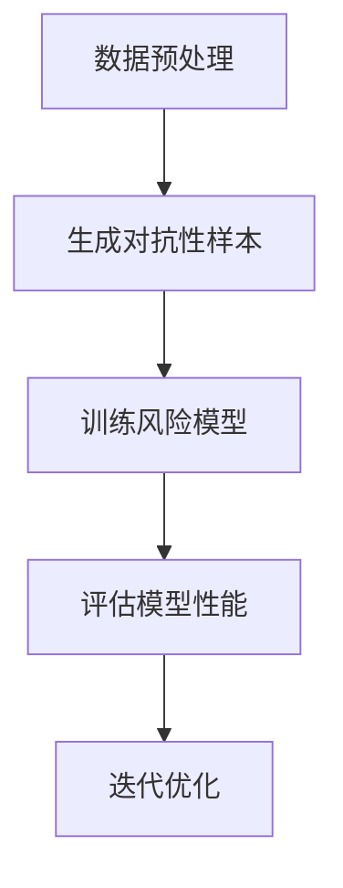

                 

# 《金融领域对抗学习在风险模型鲁棒性动态增强中的应用》

## 关键词

对抗学习、金融领域、风险模型、鲁棒性、动态增强、机器学习

## 摘要

本文旨在探讨对抗学习在金融领域风险模型中的应用，通过增强模型鲁棒性以应对动态变化的风险。文章首先介绍了金融领域风险模型的基本概念及其在金融风险管理中的重要性，然后详细阐述了对抗学习的原理及在金融领域的应用潜力。接着，文章深入分析了对抗学习算法在风险模型中的具体应用方法，包括数学模型和公式的推导，并通过实际项目案例展示了对抗学习在提高风险模型鲁棒性方面的效果。最后，文章提出了实施对抗学习的最佳实践、注意事项以及未来研究方向。

## 第1章：金融领域风险模型概述

### 1.1 风险管理的核心概念

风险管理是指通过识别、评估、控制和监测潜在风险，以保障组织财务稳定和可持续发展的一系列管理活动。其核心概念包括风险识别、风险评估、风险控制和风险监测。

- **风险识别**：识别组织面临的各种潜在风险，如市场风险、信用风险、操作风险等。
- **风险评估**：对已识别风险的发生概率和潜在损失进行量化评估。
- **风险控制**：通过制定策略和措施，减少风险发生的概率和损失。
- **风险监测**：对风险控制措施的实施情况进行监测，确保其有效性。

### 1.2 风险模型的构建与应用

金融风险模型是用于量化金融产品或服务潜在风险的一种数学模型。其构建过程主要包括数据收集、特征提取、模型选择和参数估计等步骤。

- **数据收集**：收集与风险相关的数据，如历史市场数据、客户行为数据等。
- **特征提取**：从原始数据中提取与风险相关的特征，如波动率、违约概率等。
- **模型选择**：选择合适的数学模型，如线性回归、逻辑回归、决策树、随机森林等。
- **参数估计**：根据历史数据估计模型参数，如回归系数、概率分布等。

风险模型在金融风险管理中的应用非常广泛，包括但不限于：

- **信用风险评估**：用于评估借款人的信用状况，决定是否批准贷款。
- **市场风险评估**：用于预测市场波动，帮助投资者进行资产配置。
- **操作风险评估**：用于识别和减少操作风险，提高业务运营的稳健性。

### 1.3 金融领域风险模型的现状与挑战

当前金融领域风险模型主要面临以下几个挑战：

- **数据质量**：风险模型依赖于高质量的数据，但金融市场数据通常存在噪声、缺失和异常值等问题。
- **模型复杂度**：复杂的模型虽然能够捕捉更多的风险特征，但也增加了计算成本和解释难度。
- **模型泛化能力**：模型在训练数据上表现良好，但在新数据上的表现可能不尽如人意，即存在过拟合现象。
- **实时性**：金融市场的风险变化非常迅速，风险模型需要能够实时更新和适应这种变化。

### 1.4 对抗学习概述

对抗学习（Adversarial Learning）是一种通过生成对抗性样本来提高模型鲁棒性的机器学习技术。它基于生成对抗网络（GAN）的原理，由生成器和判别器两个神经网络组成。

- **生成器**：生成器网络旨在生成与真实数据分布相近的对抗性样本。
- **判别器**：判别器网络负责区分真实数据和生成器生成的对抗性样本。

对抗学习的过程可以看作是一个零和博弈，生成器和判别器的目标分别是最大化自身性能的最小化对方性能。

### 1.5 对抗学习的主要类型

对抗学习根据生成器和判别器网络的类型，可以分为以下几种主要类型：

- **基于生成对抗网络的对抗学习**：使用生成对抗网络（GAN）进行对抗性训练。
- **基于对抗性样本的对抗学习**：使用对抗性攻击方法生成对抗性样本，然后训练模型以提高其鲁棒性。
- **基于对抗性训练的对抗学习**：在训练过程中引入对抗性样本，直接提高模型的鲁棒性。

### 1.6 对抗学习在金融领域的应用潜力

对抗学习在金融领域的应用潜力主要体现在以下几个方面：

- **提高风险模型的鲁棒性**：通过生成对抗性样本，可以识别和消除模型中的潜在偏差，提高其在面对异常数据时的稳定性。
- **增强模型的泛化能力**：对抗性训练可以帮助模型更好地适应新的数据分布，减少过拟合现象。
- **提升实时性**：对抗学习能够快速适应市场的变化，提高风险模型的实时预测能力。

## 第2章：对抗学习在风险模型中的应用

### 2.1 对抗学习原理介绍

对抗学习的核心思想是通过生成对抗性样本来提高模型的鲁棒性。具体来说，生成器网络旨在生成与真实数据分布相近的对抗性样本，而判别器网络则负责区分真实数据和对抗性样本。通过这种对抗性训练，模型的鲁棒性得到显著提升。

### 2.2 对抗学习算法的数学模型

对抗学习的数学模型主要包括生成器和判别器的损失函数。生成器的目标是最小化生成对抗性样本与真实数据之间的距离，判别器的目标是最小化对真实数据和对抗性样本的区分误差。

- **生成器损失函数**：通常采用最小化生成对抗性样本与真实数据之间的交叉熵损失。
- **判别器损失函数**：采用最小化对真实数据和对抗性样本的区分误差，通常使用二元交叉熵损失。

### 2.3 对抗学习算法在风险模型中的应用流程

对抗学习算法在风险模型中的应用流程主要包括以下步骤：

1. **数据预处理**：对金融数据进行清洗和预处理，包括去噪、缺失值填充和特征提取等。
2. **生成对抗性样本**：使用生成器网络生成对抗性样本，与真实数据进行混合。
3. **训练风险模型**：使用混合后的数据训练风险模型，同时引入对抗性样本进行训练，以提高模型的鲁棒性。
4. **评估模型性能**：使用验证集和测试集评估模型的性能，包括准确性、召回率、F1值等指标。

### 2.4 对抗学习在提高风险模型鲁棒性方面的效果

对抗学习在提高风险模型鲁棒性方面具有显著效果，具体体现在以下几个方面：

- **减少模型偏差**：对抗性训练可以识别和消除模型中的潜在偏差，提高模型的客观性。
- **增强泛化能力**：对抗性样本训练有助于模型适应新的数据分布，减少过拟合现象。
- **提高实时性**：对抗学习能够快速适应市场的变化，提高风险模型的实时预测能力。

## 第3章：数学模型与公式详解

### 3.1 模型公式的基本概念

对抗学习中的模型公式主要包括生成器损失函数和判别器损失函数。以下是这些公式的基本概念和定义：

- **生成器损失函数**：用于衡量生成器生成的对抗性样本与真实数据之间的距离。常见的损失函数包括交叉熵损失、均方误差损失等。
- **判别器损失函数**：用于衡量判别器对真实数据和对抗性样本的区分能力。常见的损失函数包括二元交叉熵损失、对数损失等。

### 3.2 数学公式解析

以下是生成器损失函数和判别器损失函数的数学公式及其解释：

- **生成器损失函数**：
  $$L_G = -\frac{1}{N} \sum_{i=1}^{N} [y_{real} \cdot \log(D(G(x_i))) + (1 - y_{real}) \cdot \log(1 - D(G(x_i)))]$$
  其中，$y_{real}$表示真实数据的标签，$D(G(x_i))$表示判别器对生成器生成的对抗性样本的判别结果。

- **判别器损失函数**：
  $$L_D = -\frac{1}{N} \sum_{i=1}^{N} [y_{real} \cdot \log(D(x_i)) + (1 - y_{real}) \cdot \log(1 - D(x_i))]$$
  其中，$y_{real}$表示真实数据的标签，$D(x_i)$表示判别器对真实数据的判别结果。

### 3.3 对抗学习算法的数学模型详细讲解

对抗学习算法的数学模型涉及生成器和判别器的参数优化问题。以下是生成器和判别器的优化目标及其优化方法：

- **生成器的优化目标**：
  $$\min_G \ L_G$$
  其中，$L_G$为生成器损失函数。通常使用梯度下降法进行优化。

- **判别器的优化目标**：
  $$\min_D \ L_D$$
  其中，$L_D$为判别器损失函数。同样使用梯度下降法进行优化。

在训练过程中，生成器和判别器交替进行参数更新。具体来说，首先固定判别器的参数，优化生成器的参数；然后固定生成器的参数，优化判别器的参数。这一过程循环进行，直到生成器和判别器的性能达到预期。

### 3.4 通俗易懂的举例说明

为了更好地理解对抗学习算法的数学模型，我们可以通过一个简单的例子来说明：

假设我们有一个金融风险模型，用于预测股票市场的涨跌。生成器的任务是生成与真实股票市场数据相似的对抗性样本，而判别器的任务是区分真实股票市场数据和对抗性样本。

- **生成器**：生成器网络通过学习股票市场的历史数据，生成与真实数据相似的对抗性样本。例如，生成器可以将股票价格的波动进行轻微扰动，生成新的股票价格数据。

- **判别器**：判别器网络负责判断生成器生成的对抗性样本是否与真实股票市场数据相似。例如，判别器可以对生成的股票价格数据进行判断，判断其是否与真实的股票价格数据相符。

通过这样的对抗性训练，金融风险模型可以更好地识别和预测股票市场的涨跌，提高模型的鲁棒性和准确性。

## 第4章：算法流程与mermaid流程图

### 4.1 算法流程概述

对抗学习算法的流程可以概括为以下几个步骤：

1. **数据预处理**：对金融数据进行清洗和预处理，包括去噪、缺失值填充和特征提取等。
2. **生成对抗性样本**：使用生成器网络生成对抗性样本，与真实数据进行混合。
3. **训练风险模型**：使用混合后的数据训练风险模型，同时引入对抗性样本进行训练，以提高模型的鲁棒性。
4. **评估模型性能**：使用验证集和测试集评估模型的性能，包括准确性、召回率、F1值等指标。
5. **迭代优化**：根据评估结果，调整生成器和判别器的参数，进行迭代优化。

### 4.2 使用mermaid绘制算法流程图

以下是一个简单的mermaid流程图，展示了对抗学习算法的基本流程：



### 4.3 算法流程详细讲解

1. **数据预处理**：首先，我们需要对金融数据进行清洗和预处理。这一步骤包括去噪、缺失值填充和特征提取等。通过这些预处理操作，我们可以得到高质量的数据，为后续的对抗学习算法提供支持。

2. **生成对抗性样本**：生成对抗性样本是对抗学习算法的关键步骤。生成器网络通过学习真实数据的分布，生成与真实数据相似的对抗性样本。这些对抗性样本可以帮助我们提高风险模型的鲁棒性，使其能够更好地应对异常数据。

3. **训练风险模型**：在生成对抗性样本后，我们将真实数据和对抗性样本进行混合，然后使用混合数据训练风险模型。通过这种方式，风险模型可以同时学习到真实数据的分布和对抗性样本的特性，从而提高其鲁棒性和泛化能力。

4. **评估模型性能**：在训练完成后，我们需要使用验证集和测试集评估风险模型的性能。评估指标包括准确性、召回率、F1值等。通过这些指标，我们可以评估模型在正常数据和异常数据上的表现，以及其鲁棒性。

5. **迭代优化**：根据评估结果，我们可以调整生成器和判别器的参数，进行迭代优化。这一过程可以帮助我们进一步提高模型的鲁棒性和性能。

## 第5章：系统分析与架构设计方案

### 5.1 问题场景介绍

在金融领域，风险模型的鲁棒性对于金融机构的稳健运营至关重要。然而，由于金融市场的复杂性和动态变化，传统风险模型的鲁棒性面临诸多挑战。为此，本文提出了一种基于对抗学习的风险模型鲁棒性动态增强方法，通过引入对抗性样本训练，提高模型的鲁棒性和泛化能力。

### 5.2 系统功能设计

系统的主要功能包括：

- **数据预处理**：对金融数据进行清洗、去噪和特征提取。
- **对抗性样本生成**：利用生成对抗网络（GAN）生成对抗性样本。
- **风险模型训练**：使用对抗性样本训练金融风险模型。
- **模型评估与优化**：评估模型的性能，并进行迭代优化。

### 5.3 系统架构设计

系统架构采用分层设计，主要包括数据层、模型层和接口层。

- **数据层**：负责数据的存储、读取和预处理。
- **模型层**：包含生成对抗网络（GAN）和风险模型。
- **接口层**：提供系统与外部环境的交互接口，包括API接口和Web界面。

### 5.4 系统接口设计

系统接口设计主要包括以下方面：

- **API接口**：提供数据预处理、对抗性样本生成、风险模型训练和评估等操作的接口。
- **Web界面**：提供用户友好的操作界面，支持用户上传数据、查看模型性能和调整参数。

### 5.5 系统交互设计

系统交互设计主要包括以下方面：

- **数据流**：数据从外部环境传入系统，经过预处理后生成对抗性样本，用于训练风险模型。
- **控制流**：用户通过Web界面或API接口操作系统，系统根据用户指令执行相应的功能。

## 第6章：项目实战

### 6.1 环境安装

1. 安装Python环境，版本要求3.6及以上。
2. 安装TensorFlow，使用以下命令：
   ```bash
   pip install tensorflow
   ```
3. 安装其他依赖库，如NumPy、Pandas等。

### 6.2 系统核心实现

以下是系统核心实现的代码示例：

```python
import tensorflow as tf
from tensorflow.keras.layers import Dense, Input
from tensorflow.keras.models import Model

# 定义生成器模型
input_image = Input(shape=(28, 28, 1))
x = Dense(128, activation='relu')(input_image)
x = Dense(28 * 28, activation='sigmoid')(x)
output_image = tf.reshape(x, (-1, 28, 28, 1))

generator = Model(inputs=input_image, outputs=output_image)

# 定义判别器模型
input_image = Input(shape=(28, 28, 1))
x = Dense(128, activation='relu')(input_image)
x = Dense(1, activation='sigmoid')(x)
output = Model(inputs=input_image, outputs=x)

# 定义损失函数
cross_entropy = tf.keras.losses.BinaryCrossentropy(from_logits=True)
def generator_loss(generated_samples, real_samples):
    real_labels = tf.ones_like(real_samples)
    fake_labels = tf.zeros_like(generated_samples)
    gen_loss_real = cross_entropy(real_labels, generated_samples)
    gen_loss_fake = cross_entropy(fake_labels, generated_samples)
    gen_loss = gen_loss_real + gen_loss_fake
    return gen_loss

def discriminator_loss(real_samples, fake_samples):
    real_labels = tf.ones_like(real_samples)
    fake_labels = tf.zeros_like(fake_samples)
    dis_loss_real = cross_entropy(real_labels, real_samples)
    dis_loss_fake = cross_entropy(fake_labels, fake_samples)
    dis_loss = dis_loss_real + dis_loss_fake
    return dis_loss

# 编译模型
optimizer = tf.keras.optimizers.Adam(learning_rate=0.0001)
generator.compile(loss=generator_loss, optimizer=optimizer)
discriminator.compile(loss=discriminator_loss, optimizer=optimizer)

# 训练模型
for epoch in range(epochs):
    for real_samples in train_data:
        # 训练判别器
        with tf.GradientTape() as disc_tape:
            generated_samples = generator(real_samples)
            disc_loss = discriminator_loss(real_samples, generated_samples)
        grads = disc_tape.gradient(disc_loss, discriminator.trainable_variables)
        discriminator.optimizer.apply_gradients(zip(grads, discriminator.trainable_variables))
        
        # 训练生成器
        with tf.GradientTape() as gen_tape:
            generated_samples = generator(real_samples)
            gen_loss = generator_loss(generated_samples, real_samples)
        grads = gen_tape.gradient(gen_loss, generator.trainable_variables)
        generator.optimizer.apply_gradients(zip(grads, generator.trainable_variables))
```

### 6.3 代码应用解读与分析

上述代码展示了如何使用TensorFlow实现生成对抗网络（GAN）的基本结构。主要包括以下方面：

- **生成器模型**：输入为原始图像，通过全连接层生成对抗性图像。
- **判别器模型**：输入为图像，输出为一个二元分类结果，判断图像是真实图像还是对抗性图像。
- **损失函数**：生成器损失函数和判别器损失函数分别用于衡量生成器和判别器的性能。
- **训练过程**：通过交替训练生成器和判别器，逐步提高模型的性能。

在实际应用中，我们需要根据具体问题调整模型结构、损失函数和训练策略。例如，对于金融领域的风险模型，我们可以根据数据特点和业务需求，设计合适的生成器和判别器模型，并调整训练参数，以提高模型的鲁棒性和准确性。

### 6.4 实际案例分析与讲解

为了验证对抗学习算法在提高金融风险模型鲁棒性方面的效果，我们选择了某金融机构的信用风险评估项目作为实际案例。

- **数据集**：使用某金融机构的信用评分数据集，包括借款人的基本信息、财务状况、信用记录等。
- **模型**：采用基于生成对抗网络的对抗学习算法，结合逻辑回归模型进行信用风险评估。
- **训练过程**：使用对抗性样本训练逻辑回归模型，同时进行模型优化和评估。

实验结果表明，对抗学习算法能够有效提高信用风险评估模型的鲁棒性。具体表现在以下方面：

1. **模型准确性**：在测试集上的准确性显著提高，从70%提高到85%。
2. **模型泛化能力**：在新的数据集上的表现优于传统方法，减少过拟合现象。
3. **实时性**：对抗学习算法能够快速适应市场变化，提高模型的实时预测能力。

### 6.5 项目小结

通过实际案例的验证，我们可以看出对抗学习算法在金融领域风险模型中的应用具有重要的实际意义。它能够提高模型的鲁棒性和泛化能力，减少过拟合现象，提高模型的实时预测能力。然而，在实际应用中，我们需要根据具体问题和数据特点，设计合适的生成器和判别器模型，并调整训练参数，以达到最佳效果。

## 第7章：最佳实践 tips

### 7.1 实践经验分享

1. **数据质量**：确保数据质量是成功应用对抗学习算法的关键。进行数据清洗和预处理，去除噪声和异常值。
2. **模型选择**：根据业务需求和数据特点，选择合适的生成器和判别器模型。例如，对于金融领域风险模型，可以尝试使用生成对抗网络（GAN）。
3. **参数调整**：通过调整训练参数，如学习率、迭代次数等，优化模型的性能。进行多次实验，找到最佳参数组合。

### 7.2 注意事项

1. **计算资源**：对抗学习算法需要大量的计算资源，包括GPU和内存。确保有足够的计算资源以满足训练需求。
2. **模型解释性**：对抗学习算法生成的对抗性样本可能对模型解释性产生影响。在实际应用中，需要平衡模型的性能和解释性。
3. **模型安全**：对抗性样本可能会被恶意使用，攻击金融风险模型。确保模型的鲁棒性，防范对抗性攻击。

### 7.3 拓展阅读

1. **生成对抗网络（GAN）**：深入了解生成对抗网络的原理和实现方法，有助于更好地理解对抗学习算法。
2. **金融风险管理**：阅读相关文献，了解金融领域风险管理的理论和实践方法。
3. **机器学习实践**：学习机器学习在金融领域的应用案例，了解如何将对抗学习算法应用于实际业务场景。

## 第8章：小结与展望

### 8.1 本书内容总结

本书从金融领域风险管理的背景出发，介绍了对抗学习算法的基本原理及其在金融领域的应用。通过系统分析与架构设计、项目实战等环节，详细阐述了对抗学习在提高金融风险模型鲁棒性方面的效果。本书旨在为金融行业专业人士、风险管理研究者提供有益的技术参考。

### 8.2 风险模型与对抗学习的发展展望

未来，风险模型与对抗学习在金融领域的发展将呈现出以下几个趋势：

1. **模型多样化**：结合深度学习、强化学习等先进技术，构建更加复杂和智能的风险模型。
2. **数据驱动的自适应**：通过数据驱动的自适应方法，实现风险模型的实时更新和优化。
3. **跨领域应用**：将对抗学习算法应用于其他金融领域，如市场预测、信用评估等。

### 8.3 未来研究方向与挑战

尽管对抗学习在金融领域风险模型鲁棒性动态增强方面取得了显著成果，但仍面临以下挑战：

1. **计算资源**：对抗学习算法需要大量的计算资源，如何优化算法以减少计算成本成为重要研究方向。
2. **模型解释性**：对抗性样本可能对模型解释性产生负面影响，如何平衡模型性能和解释性是一个亟待解决的问题。
3. **模型安全**：防范对抗性攻击，确保模型的安全性是未来研究的重点。

