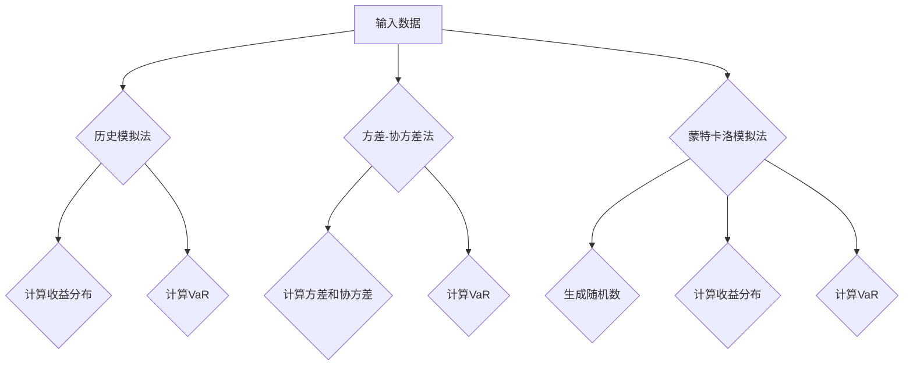
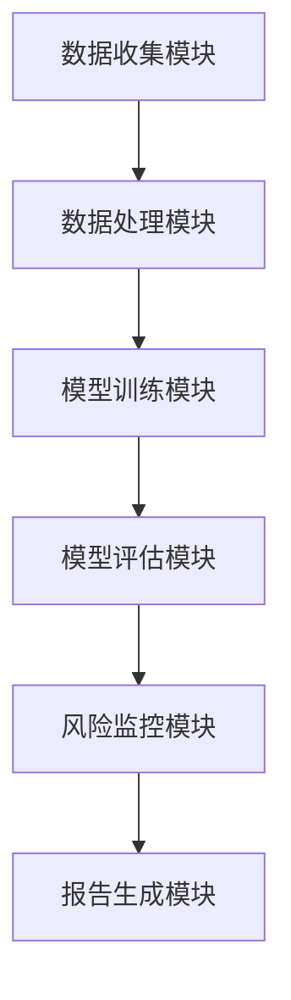
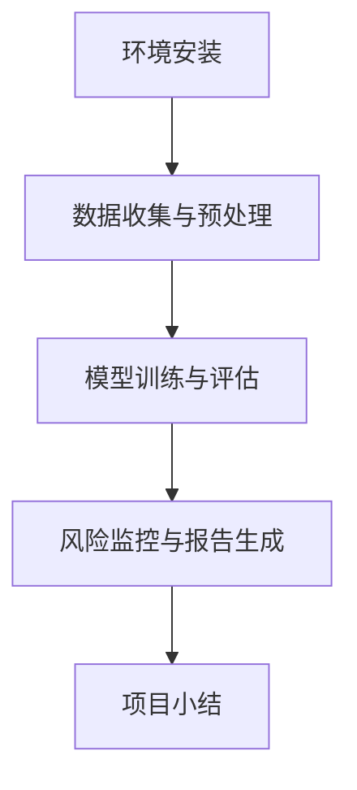

                 

# 金融风险VaR模型比较与选择

## 关键词
金融风险、风险价值（VaR）、模型比较、模型选择、风险管理

## 摘要
本文旨在深入探讨金融风险中的VaR（Value at Risk）模型，并详细分析不同VaR模型的比较与选择。我们将首先介绍金融风险和VaR模型的基本概念，然后逐一介绍传统VaR模型和进阶VaR模型，最后探讨如何在实际应用中选择合适的VaR模型。通过本文的阅读，读者将对VaR模型有更加全面和深入的理解。

----------------------------------------------------------------

## 第一部分: 金融风险VaR模型概述

### 第1章: 金融风险的背景与重要性

#### 1.1.1 金融风险的概念与分类
金融风险是指金融机构在金融活动中面临的各种不确定性，可能导致资产损失或收益降低。金融风险可以大致分为市场风险、信用风险、流动性风险和操作风险等类型。

**市场风险**：因市场价格波动导致的潜在损失风险。
**信用风险**：因债务人违约导致的风险。
**流动性风险**：因无法及时获得资金或资产变现导致的风险。
**操作风险**：因内部操作失误、系统故障或外部事件导致的损失风险。

#### 1.1.2 金融风险管理的意义
有效的金融风险管理有助于降低金融机构的潜在损失，提高资本充足率，增强市场信心，促进金融机构的稳健发展。

#### 1.1.3 VaR模型的基本概念
VaR模型，即风险价值模型，用于衡量在特定置信水平下，一定持有期内可能出现的最大损失。VaR模型是金融风险管理中的一种重要工具，有助于金融机构评估和管理风险。

----------------------------------------------------------------

### 第2章: VaR模型的理论基础

#### 2.1.1 风险价值（VaR）的定义
VaR是指在给定置信水平和特定持有期内，可能发生的最大损失值。用公式表示为：
\[ VaR = \alpha \times \Sigma_{i=1}^{n} \text{资产i的损失} \]

#### 2.1.2 VaR模型的计算方法
VaR模型的计算方法主要包括以下几种：

**历史模拟法**：基于历史数据，构建资产组合收益的分布，然后计算在给定置信水平下的VaR值。
**方差-协方差法**：基于资产收益率的方差和协方差矩阵，通过正态分布假设计算VaR值。
**蒙特卡洛模拟法**：通过模拟大量可能的资产收益路径，计算在给定置信水平下的VaR值。

#### 2.1.3 VaR模型的局限性
VaR模型虽然在实际中广泛应用，但也存在一些局限性。例如，VaR模型对市场波动性变化的适应性较差，可能低估极端市场事件的风险。此外，VaR模型的计算复杂度较高，对于大规模资产组合的计算可能存在困难。

----------------------------------------------------------------

### 第3章: 传统VaR模型

#### 3.1.1 历史模拟法

##### 3.1.1.1 历史模拟法的原理
历史模拟法通过分析历史数据来预测未来的风险。其基本思路是，将历史收益作为模拟资产组合的未来收益，计算其标准差，然后根据置信水平计算VaR值。

##### 3.1.1.2 历史模拟法的实施步骤
1. 收集资产组合的历史收益数据。
2. 计算历史收益的分布。
3. 根据置信水平，确定VaR值。

##### 3.1.1.3 历史模拟法的优缺点
**优点**：简单易懂，对数据要求较低，适合小规模资产组合。
**缺点**：对市场波动性的变化反应较慢，可能低估极端市场事件的风险。

#### 3.1.2 VAR的方差-协方差法

##### 3.1.2.1 方差-协方差法的原理
方差-协方差法基于资产收益率的方差和协方差矩阵，通过正态分布假设计算VaR值。其基本思路是，利用资产收益率的历史数据计算方差和协方差，然后根据正态分布特性计算VaR值。

##### 3.1.2.2 方差-协方差法的计算步骤
1. 收集资产收益率的样本数据。
2. 计算各资产收益率的方差和协方差。
3. 假设资产收益率为正态分布。
4. 计算VaR值。

##### 3.1.2.3 方差-协方差法的优缺点
**优点**：计算简单，适用于正态分布数据。
**缺点**：对市场波动性变化的适应性较差，可能低估极端市场事件的风险。

----------------------------------------------------------------

### 第4章: 进阶VaR模型

#### 4.1.1 蒙特卡洛模拟法

##### 4.1.1.1 蒙特卡洛模拟法的原理
蒙特卡洛模拟法通过模拟大量可能的资产收益路径，计算在给定置信水平下的VaR值。其基本思路是，利用随机数生成器模拟资产组合的未来收益，然后计算其分布，并根据置信水平确定VaR值。

##### 4.1.1.2 蒙特卡洛模拟法的计算过程
1. 选择适当的概率分布模型。
2. 生成大量随机数，模拟资产组合的未来收益。
3. 计算模拟结果的分布。
4. 根据置信水平计算VaR值。

##### 4.1.1.3 蒙特卡洛模拟法的优缺点
**优点**：对极端市场事件的风险估计较为准确，适用于复杂资产组合。
**缺点**：计算复杂度较高，对计算资源要求较大。

#### 4.1.2 模型修正法

##### 4.1.2.1 模型修正法的原理
模型修正法通过对传统VaR模型的修正，提高其对市场波动性变化的适应性。其基本思路是，在传统VaR模型的基础上，引入一些修正参数，以适应市场波动性的变化。

##### 4.1.2.2 模型修正法的应用实例
1. 引入跳跃扩散模型，用于修正方差-协方差法。
2. 引入极端事件模拟，用于修正蒙特卡洛模拟法。

##### 4.1.2.3 模型修正法的优缺点
**优点**：提高了VaR模型对市场波动性变化的适应性。
**缺点**：计算复杂度较高，需要对市场波动性有较深入的理解。

----------------------------------------------------------------

### 第5章: VaR模型的比较与选择

#### 5.1.1 模型比较的考虑因素
在选择VaR模型时，需要考虑以下因素：

**数据质量和数据来源**：数据质量直接影响模型的效果。数据来源的多样性和全面性也是选择模型的重要考虑因素。
**模型的复杂性和计算成本**：复杂的模型可能更准确，但计算成本也较高。需要平衡模型的精度和计算成本。
**模型的稳定性与预测能力**：模型的稳定性关系到其在不同市场条件下的表现。预测能力则是衡量模型有效性的重要指标。

#### 5.1.2 实践中的模型选择方法
在实践中，模型选择通常采用以下方法：

**数据驱动的模型选择**：基于历史数据，通过模型性能评估指标（如预测误差、拟合度等）选择最优模型。
**知识驱动的模型选择**：基于专家知识和经验，结合数据分析结果，选择合适的模型。
**组合模型的选择策略**：结合多种模型，取其优点，以降低单一模型的风险。

----------------------------------------------------------------

### 第6章: VaR模型在实际中的应用

#### 6.1.1 银行业务中的应用

在银行业务中，VaR模型主要用于风险管理、资本充足率和市场风险监管。以下是一个银行业务中VaR应用的实例：

**实例**：某银行使用历史模拟法计算其投资组合的VaR。在过去的三年中，该投资组合的月收益标准差为1.5%，置信水平为99%。通过历史模拟法，计算出该投资组合在一个月内的最大损失为3%。根据这一结果，银行可以调整其投资策略，以降低风险。

#### 6.1.2 证券市场中的应用

在证券市场中，VaR模型广泛应用于风险管理、资产配置和投资决策。以下是一个证券市场中VaR应用的实例：

**实例**：某证券公司使用蒙特卡洛模拟法计算其股票投资组合的VaR。在模拟了10000种可能的未来收益路径后，该公司发现，在95%的置信水平下，其投资组合的最大损失为5%。这一结果帮助公司制定了风险控制策略，确保在市场波动时能够稳健运行。

----------------------------------------------------------------

### 第7章: VaR模型的应用挑战与展望

#### 7.1.1 挑战与应对策略

**数据收集与处理的挑战**：VaR模型的准确性依赖于高质量的历史数据。然而，数据的获取和处理往往面临困难。应对策略包括使用多种数据源，进行数据清洗和标准化。

**模型风险的挑战**：VaR模型本身可能存在模型风险，如对市场波动性的过度依赖或对极端事件的低估。应对策略包括使用多种模型，进行模型比较和修正。

**法律与合规的挑战**：金融机构在应用VaR模型时，需要遵守相关法律法规。应对策略包括了解相关法律法规，确保模型的应用符合规定。

#### 7.1.2 未来发展趋势

**新技术对VaR模型的影响**：随着人工智能、大数据和云计算等技术的发展，VaR模型将更加智能化、自动化和高效化。

**国际金融监管的动态**：随着金融市场的全球化，国际金融监管机构对VaR模型的要求将越来越高。金融机构需要关注监管动态，确保模型的应用符合最新要求。

**金融科技的融合**：金融科技的发展将推动VaR模型的应用创新。例如，通过区块链技术实现更高效的数据共享和风险管理。

----------------------------------------------------------------

## 总结与拓展阅读

本文从金融风险的背景和重要性入手，详细介绍了VaR模型的理论基础、传统VaR模型和进阶VaR模型，以及在实际中的应用。通过对不同VaR模型的比较与选择，读者可以更好地理解如何在实际中应用VaR模型，从而进行有效的金融风险管理。

拓展阅读方面，读者可以进一步了解以下主题：

1. **高级VaR模型**：如风险中性VaR、条件VaR等。
2. **模型修正技术**：如跳跃扩散模型、极端事件模拟等。
3. **金融风险管理实践**：了解不同金融机构在风险管理中的应用案例。

通过本文的阅读，读者将能够更深入地理解金融风险和VaR模型，为实际应用提供指导。作者：AI天才研究院/AI Genius Institute & 禅与计算机程序设计艺术/Zen And The Art of Computer Programming

----------------------------------------------------------------

### 第1章: 金融风险的背景与重要性

#### 1.1.1 金融风险的概念与分类

金融风险是指在金融活动中，由于各种不确定性因素导致的潜在损失风险。金融活动涉及的范围广泛，包括投资、贷款、证券交易、外汇交易等。金融风险的分类可以从多个角度进行，以下是几种常见的分类方法：

1. **市场风险**：市场风险是指由于市场价格波动导致的潜在损失。市场风险包括利率风险、汇率风险、股票价格风险等。例如，投资者持有的股票价格下跌，可能导致其投资组合的价值下降。

2. **信用风险**：信用风险是指由于债务人违约或信用状况恶化导致的损失风险。在贷款、债券投资等活动中，债务人可能无法按时偿还债务，从而给投资者带来损失。

3. **流动性风险**：流动性风险是指由于无法及时获得资金或资产无法迅速变现导致的潜在损失风险。流动性风险在市场恐慌、流动性紧缩等情况下尤为明显。

4. **操作风险**：操作风险是指由于内部操作失误、系统故障或外部事件导致的损失风险。操作风险包括欺诈、错误交易、系统故障等。

#### 1.1.2 金融风险管理的意义

金融风险管理是金融机构的一项核心任务，其重要性体现在以下几个方面：

1. **降低潜在损失**：有效的金融风险管理可以帮助金融机构降低潜在损失，确保资产的安全性和稳定性。

2. **提高资本充足率**：金融机构需要遵守监管机构的资本充足率要求。通过有效的风险管理，金融机构可以提高资本充足率，满足监管要求。

3. **增强市场信心**：良好的风险管理能力可以增强投资者对金融机构的信心，提高市场竞争力。

4. **促进稳健发展**：金融风险管理有助于金融机构稳健发展，降低业务风险，确保业务的长期可持续性。

#### 1.1.3 VaR模型的基本概念

VaR模型，即风险价值模型，是金融风险管理中的一种重要工具。VaR模型用于衡量在特定置信水平和特定持有期内，可能出现的最大损失。VaR的定义可以从以下几个方面进行理解：

1. **置信水平**：置信水平是指VaR模型能够准确预测潜在损失的概率。例如，95%的置信水平意味着在100次模拟中，有95次VaR值能够准确预测实际损失。

2. **特定持有期**：特定持有期是指VaR模型计算的时间范围。例如，一天、一周、一个月等。

3. **最大损失**：最大损失是指在特定置信水平和特定持有期内，可能出现的最大损失值。VaR值越高，意味着潜在损失的风险越大。

VaR模型的基本概念可以用以下公式表示：

\[ VaR = \alpha \times \Sigma_{i=1}^{n} \text{资产i的损失} \]

其中，\(\alpha\) 代表置信水平，\(n\) 代表资产数量。

#### 1.1.4 VaR模型的应用场景

VaR模型在金融风险管理中具有广泛的应用，以下是一些典型的应用场景：

1. **投资组合管理**：VaR模型可以帮助投资者评估投资组合的风险，制定合理的资产配置策略。

2. **风险管理**：金融机构可以使用VaR模型进行风险监控，确保业务运营的稳定性。

3. **资本充足率评估**：VaR模型是金融机构计算资本充足率的重要依据。

4. **市场风险监管**：监管机构可以使用VaR模型对金融机构的市场风险进行监管，确保金融机构遵守相关法规。

#### 1.1.5 金融风险管理的挑战与机遇

随着金融市场的发展和全球化，金融风险管理面临许多挑战和机遇：

1. **金融市场波动性增加**：金融市场波动性增加，金融机构需要更加灵活和高效的风险管理策略。

2. **监管要求提高**：监管机构对金融机构的监管要求不断提高，金融机构需要符合更严格的监管标准。

3. **技术创新**：金融科技的快速发展为金融风险管理提供了新的工具和方法。

4. **全球市场一体化**：全球市场一体化增加了金融风险管理的复杂性，金融机构需要具备全球视野。

#### 1.1.6 本章小结

本章介绍了金融风险的概念与分类、金融风险管理的意义以及VaR模型的基本概念和应用场景。通过本章的学习，读者可以了解金融风险管理的核心内容，为后续章节的学习奠定基础。

----------------------------------------------------------------

### 第2章: VaR模型的理论基础

#### 2.1.1 风险价值（VaR）的定义

VaR，即风险价值，是一个量化风险的概念，用于衡量在特定置信水平和特定持有期内，可能发生的最大损失。VaR的定义可以从以下几个方面进行理解：

1. **置信水平**：置信水平是指VaR模型能够准确预测潜在损失的概率。例如，95%的置信水平意味着在100次模拟中，有95次VaR值能够准确预测实际损失。

2. **特定持有期**：特定持有期是指VaR模型计算的时间范围。例如，一天、一周、一个月等。

3. **最大损失**：最大损失是指在特定置信水平和特定持有期内，可能出现的最大损失值。VaR值越高，意味着潜在损失的风险越大。

VaR的定义可以用以下公式表示：

\[ VaR = \alpha \times \Sigma_{i=1}^{n} \text{资产i的损失} \]

其中，\(\alpha\) 代表置信水平，\(n\) 代表资产数量。

#### 2.1.2 VaR模型的计算方法

VaR模型的计算方法主要包括以下几种：

1. **历史模拟法**：历史模拟法基于历史数据，通过分析资产组合的历史收益来计算VaR值。具体步骤如下：
   1. 收集资产组合的历史收益数据。
   2. 计算资产组合的历史收益分布。
   3. 根据置信水平，确定VaR值。

2. **方差-协方差法**：方差-协方差法基于资产收益率的方差和协方差矩阵，通过正态分布假设来计算VaR值。具体步骤如下：
   1. 收集资产收益率的样本数据。
   2. 计算各资产收益率的方差和协方差。
   3. 假设资产收益率为正态分布。
   4. 计算VaR值。

3. **蒙特卡洛模拟法**：蒙特卡洛模拟法通过模拟大量可能的资产收益路径，计算在给定置信水平下的VaR值。具体步骤如下：
   1. 选择适当的概率分布模型。
   2. 生成大量随机数，模拟资产组合的未来收益。
   3. 计算模拟结果的分布。
   4. 根据置信水平计算VaR值。

#### 2.1.3 历史模拟法的原理与实现步骤

历史模拟法是一种基于历史数据的VaR计算方法。其基本原理是，通过分析历史收益数据，构建资产组合的未来收益分布，然后根据置信水平计算VaR值。以下是历史模拟法的实现步骤：

1. **收集历史数据**：收集资产组合的历史收益数据，包括资产价格、收益率等。

2. **计算历史收益分布**：根据历史数据，计算资产组合的收益率分布。收益率分布可以采用直方图、概率密度函数等表示。

3. **确定置信水平**：根据风险管理的需求，确定置信水平。例如，95%的置信水平。

4. **计算VaR值**：根据收益率分布和置信水平，计算VaR值。具体计算方法如下：

   假设资产组合的收益率为 \(R\)，收益率分布的累积分布函数为 \(F(R)\)，则VaR值的计算公式为：

   \[ VaR = R_{\alpha} \]

   其中，\(R_{\alpha}\) 是收益率分布的第 \(\alpha\) 分位数。

#### 2.1.4 方差-协方差法的原理与实现步骤

方差-协方差法是一种基于统计学的VaR计算方法。其基本原理是，通过计算资产收益率的方差和协方差矩阵，利用正态分布假设，计算VaR值。以下是方差-协方差法的实现步骤：

1. **收集样本数据**：收集资产收益率的样本数据。

2. **计算方差和协方差**：根据样本数据，计算资产收益率的方差和协方差矩阵。具体计算方法如下：

   假设资产组合由 \(n\) 个资产组成，第 \(i\) 个资产的收益率为 \(R_i\)，则方差和协方差矩阵为：

   \[ \Sigma = \begin{bmatrix} \sigma_1^2 & \sigma_{12} & \ldots & \sigma_{1n} \\\ \sigma_{21} & \sigma_2^2 & \ldots & \sigma_{2n} \\\ \vdots & \vdots & \ddots & \vdots \\\ \sigma_{n1} & \sigma_{n2} & \ldots & \sigma_n^2 \end{bmatrix} \]

   其中，\(\sigma_i^2\) 是第 \(i\) 个资产的方差，\(\sigma_{ij}\) 是第 \(i\) 个资产和第 \(j\) 个资产的协方差。

3. **假设正态分布**：假设资产收益率为正态分布。

4. **计算VaR值**：根据方差和协方差矩阵，计算VaR值。具体计算方法如下：

   假设资产组合的收益率为 \(R\)，收益率的累积分布函数为 \(F(R)\)，则VaR值的计算公式为：

   \[ VaR = -\mu + z_{\alpha} \sqrt{\Sigma} \]

   其中，\(\mu\) 是资产组合的预期收益率，\(z_{\alpha}\) 是标准正态分布的第 \(\alpha\) 分位数。

#### 2.1.5 蒙特卡洛模拟法的原理与实现步骤

蒙特卡洛模拟法是一种基于随机模拟的VaR计算方法。其基本原理是，通过模拟大量可能的资产收益路径，计算在给定置信水平下的VaR值。以下是蒙特卡洛模拟法的实现步骤：

1. **选择概率分布模型**：选择适当的概率分布模型，如正态分布、对数正态分布等。

2. **生成随机数**：使用随机数生成器，生成大量的随机数，用于模拟资产组合的未来收益。

3. **模拟资产收益路径**：根据概率分布模型，模拟资产组合的未来收益路径。

4. **计算模拟结果分布**：根据模拟结果，计算资产组合的收益率分布。

5. **计算VaR值**：根据收益率分布和置信水平，计算VaR值。具体计算方法如下：

   假设资产组合的收益率为 \(R\)，收益率分布的累积分布函数为 \(F(R)\)，则VaR值的计算公式为：

   \[ VaR = R_{\alpha} \]

   其中，\(R_{\alpha}\) 是收益率分布的第 \(\alpha\) 分位数。

#### 2.1.6 不同VaR模型的比较与选择

在实际应用中，选择合适的VaR模型至关重要。以下是对不同VaR模型的比较与选择：

1. **历史模拟法**：历史模拟法简单易懂，对数据要求较低，适合小规模资产组合。但其对市场波动性的变化反应较慢，可能低估极端市场事件的风险。

2. **方差-协方差法**：方差-协方差法计算简单，适用于正态分布数据。但其对市场波动性变化的适应性较差，可能低估极端市场事件的风险。

3. **蒙特卡洛模拟法**：蒙特卡洛模拟法对极端市场事件的风险估计较为准确，适用于复杂资产组合。但其计算复杂度较高，对计算资源要求较大。

在实际应用中，可以根据资产组合的特点、数据质量和计算资源等因素，选择合适的VaR模型。例如，对于大规模、复杂资产组合，可以采用蒙特卡洛模拟法；对于小规模、简单资产组合，可以采用历史模拟法或方差-协方差法。

#### 2.1.7 本章小结

本章介绍了VaR模型的基本概念和计算方法，包括历史模拟法、方差-协方差法和蒙特卡洛模拟法。通过本章的学习，读者可以了解不同VaR模型的特点和应用场景，为实际应用VaR模型打下基础。

----------------------------------------------------------------

### 第3章: 传统VaR模型

传统VaR模型主要包括历史模拟法和方差-协方差法，它们是金融风险管理中应用广泛的VaR计算方法。本章节将详细探讨这两种传统VaR模型，包括其原理、计算步骤、优缺点及适用范围。

#### 3.1.1 历史模拟法

**3.1.1.1 历史模拟法的原理**

历史模拟法是一种基于历史数据的VaR计算方法，其基本原理是利用历史收益数据来模拟未来可能的收益分布，从而估计VaR值。这种方法的核心思想是，假定未来资产组合的收益分布与历史收益分布相似，因此可以通过对历史数据进行分析来预测未来的VaR。

**3.1.1.2 历史模拟法的计算步骤**

1. **收集历史数据**：首先，需要收集资产组合的历史收益数据，包括各个资产的价格和收益率。

2. **计算历史收益分布**：接着，根据历史数据计算资产组合的历史收益分布，可以通过计算所有历史收益的均值、标准差等统计量来描述。

3. **计算VaR值**：最后，根据历史收益分布和给定的置信水平（如95%），确定VaR值。具体而言，VaR值是历史收益分布中的分位数，即资产组合可能发生的最大损失值。

**3.1.1.3 历史模拟法的优缺点**

**优点**：
- 简单易懂，对数据的要求相对较低，适用于小规模资产组合。
- 能够反映历史市场的波动性和相关性。

**缺点**：
- 对市场波动性的变化反应较慢，可能低估极端市场事件的风险。
- 历史数据可能包含噪声，导致VaR估计的不准确。

**适用范围**：
- 适用于历史数据丰富、市场波动性稳定的资产组合。
- 不适用于市场波动性剧烈变化或存在极端事件的情况。

**3.1.2 方差-协方差法**

**3.1.2.1 方差-协方差法的原理**

方差-协方差法是一种基于统计学的VaR计算方法，其基本原理是利用资产收益率的方差和协方差矩阵，通过正态分布假设来计算VaR值。这种方法的核心思想是，假设资产收益率为正态分布，那么可以通过计算方差和协方差矩阵来预测未来的VaR。

**3.1.2.2 方差-协方差法的计算步骤**

1. **收集样本数据**：首先，需要收集资产组合的样本数据，包括各个资产的历史收益率。

2. **计算方差和协方差**：接着，根据样本数据计算资产收益率的方差和协方差矩阵。

3. **假设正态分布**：然后，假设资产收益率为正态分布，利用正态分布的性质计算VaR值。

4. **计算VaR值**：最后，根据给定的置信水平（如95%），利用标准正态分布的分位数计算VaR值。

**3.1.2.3 方差-协方差法的优缺点**

**优点**：
- 计算简单，适用于正态分布数据。
- 能够提供较为稳定的VaR估计。

**缺点**：
- 对市场波动性变化的适应性较差，可能低估极端市场事件的风险。
- 需要假设资产收益率为正态分布，这在实际中可能并不准确。

**适用范围**：
- 适用于收益率数据近似正态分布的资产组合。
- 不适用于市场波动性剧烈变化或存在极端事件的情况。

**3.1.3 历史模拟法与方差-协方差法的比较**

- **计算复杂度**：方差-协方差法计算简单，适合大规模资产组合；历史模拟法计算复杂度较高，适合小规模资产组合。
- **市场波动性适应性**：方差-协方差法对市场波动性变化的适应性较差；历史模拟法对市场波动性的变化反应较快。
- **数据要求**：方差-协方差法对数据的要求较低，但需要假设资产收益率为正态分布；历史模拟法对数据的要求较高，但不需要特定的分布假设。

**3.1.4 实践中的应用**

在实际应用中，选择哪种VaR模型取决于具体的资产组合特点、数据质量和计算资源等因素。例如，对于历史数据丰富、市场波动性稳定的资产组合，可以选择历史模拟法；对于收益率数据近似正态分布的资产组合，可以选择方差-协方差法。

#### 3.1.5 本章小结

本章介绍了传统VaR模型中的历史模拟法和方差-协方差法，详细阐述了它们的原理、计算步骤、优缺点及适用范围。通过本章的学习，读者可以理解传统VaR模型的基本原理和应用方法，为后续章节的学习打下基础。

----------------------------------------------------------------

### 第4章: 进阶VaR模型

随着金融市场的发展和复杂性的增加，传统的VaR模型在应对极端市场事件和复杂金融工具的风险评估方面存在一定的局限性。为了提高VaR模型的准确性和适应性，进阶VaR模型应运而生。本章节将介绍两种常见的进阶VaR模型：蒙特卡洛模拟法和模型修正法。

#### 4.1.1 蒙特卡洛模拟法

**4.1.1.1 蒙特卡洛模拟法的原理**

蒙特卡洛模拟法是一种基于随机模拟的VaR计算方法，它通过模拟大量可能的资产收益路径，来估计在特定置信水平下的最大潜在损失。该方法的核心思想是利用随机数生成器模拟资产组合的未来收益，通过重复模拟，获取资产组合收益的分布，从而计算出VaR值。

**4.1.1.2 蒙特卡洛模拟法的计算步骤**

1. **选择概率分布模型**：首先，需要选择一个合适的概率分布模型，如对数正态分布、正态分布等，来模拟资产组合的收益。

2. **生成随机数**：使用随机数生成器生成大量随机数，用于模拟资产组合的未来收益。

3. **模拟资产收益路径**：根据选定的概率分布模型，生成大量资产收益路径。每次模拟都代表一个可能的未来市场情景。

4. **计算模拟结果分布**：根据模拟结果，计算资产组合的收益率分布，可以采用直方图、概率密度函数等来表示。

5. **计算VaR值**：根据收益率分布和给定的置信水平，计算VaR值。具体而言，VaR值是收益率分布中的分位数，即资产组合可能发生的最大损失值。

**4.1.1.3 蒙特卡洛模拟法的优缺点**

**优点**：
- 对极端市场事件的风险估计较为准确，能够捕捉到传统VaR模型无法覆盖的风险。
- 适用于复杂金融工具和大规模资产组合的风险评估。

**缺点**：
- 计算复杂度较高，对计算资源要求较大。
- 需要大量的模拟次数才能获得稳定的VaR估计。

**适用范围**：
- 适用于需要高精度风险评估的复杂资产组合。
- 不适用于计算资源有限或对计算速度要求较高的场景。

**4.1.2 模型修正法

**4.1.2.1 模型修正法的原理**

模型修正法是在传统VaR模型的基础上，通过引入额外的修正参数或模型，来提高VaR模型的准确性和适应性。这种方法的核心思想是利用额外的信息或模型，修正传统VaR模型的不足，从而更准确地预测潜在损失。

**4.1.2.2 模型修正法的计算步骤**

1. **选择基础模型**：首先，选择一个基础VaR模型，如方差-协方差法或历史模拟法。

2. **收集额外数据**：收集与基础模型相关的额外数据，如市场波动性、交易量等。

3. **计算修正参数**：根据额外数据，计算修正参数，用于调整基础VaR模型的输出。

4. **计算修正VaR值**：将修正参数应用到基础VaR模型的输出，计算修正后的VaR值。

**4.1.2.3 模型修正法的优缺点**

**优点**：
- 能够提高VaR模型的准确性和适应性，尤其是对于市场波动性剧烈变化的情况。
- 不需要大量的计算资源，对计算速度要求较低。

**缺点**：
- 修正参数的计算需要额外的数据和模型，可能引入模型风险。
- 需要具备较强的统计和金融知识，才能正确使用修正法。

**适用范围**：
- 适用于需要对VaR模型进行修正的资产组合。
- 不适用于对模型修正原理了解不足或数据不足的情景。

**4.1.3 进阶VaR模型的选择与比较**

在实际应用中，选择合适的进阶VaR模型取决于资产组合的特点、数据质量和计算资源等因素。以下是对蒙特卡洛模拟法和模型修正法的比较：

- **计算复杂度**：蒙特卡洛模拟法计算复杂度较高，需要大量计算资源；模型修正法计算复杂度较低，对计算资源要求较小。
- **风险估计准确性**：蒙特卡洛模拟法对极端市场事件的风险估计较为准确；模型修正法通过修正基础模型，可以提高VaR的准确性和适应性。
- **适用范围**：蒙特卡洛模拟法适用于复杂金融工具和大规模资产组合；模型修正法适用于需要对VaR模型进行修正的情况。

**4.1.4 实践中的应用**

在实际应用中，根据资产组合的特点和风险管理的需求，可以选择合适的进阶VaR模型。例如，对于复杂金融工具和大规模资产组合，可以选择蒙特卡洛模拟法；对于需要对传统VaR模型进行修正的情况，可以选择模型修正法。

#### 4.1.5 本章小结

本章介绍了进阶VaR模型中的蒙特卡洛模拟法和模型修正法，详细阐述了它们的原理、计算步骤、优缺点及适用范围。通过本章的学习，读者可以了解如何使用进阶VaR模型来提高风险评估的准确性和适应性，为实际金融风险管理提供更有效的工具。

----------------------------------------------------------------

### 第5章: VaR模型的比较与选择

在金融风险管理中，选择合适的VaR模型至关重要。不同VaR模型在计算方法、准确性、复杂度等方面存在差异，因此需要根据具体情况进行选择。本章节将详细讨论如何比较和选择VaR模型。

#### 5.1.1 模型比较的考虑因素

在选择VaR模型时，需要考虑以下几个关键因素：

**数据质量和数据来源**：数据质量直接影响模型的准确性和可靠性。高质量的数据来源能够提供更准确的模型结果。因此，在比较模型时，需要考虑数据的质量和来源。

**模型的复杂性和计算成本**：不同VaR模型在计算复杂度和计算成本上存在差异。例如，蒙特卡洛模拟法计算复杂度较高，需要大量计算资源；而历史模拟法计算简单，对计算资源要求较低。因此，需要根据实际计算能力和成本预算来选择模型。

**模型的稳定性与预测能力**：VaR模型的稳定性是指在多种市场条件下，模型输出的一致性和可靠性。预测能力是指模型对市场波动性和极端事件的敏感度。选择稳定性好、预测能力强的模型，能够更好地管理金融风险。

**置信水平**：置信水平是VaR模型的核心参数，用于衡量模型预测潜在损失的概率。不同的置信水平会导致不同的VaR值，因此需要根据风险管理需求选择合适的置信水平。

**模型的可解释性**：模型的可解释性是指模型背后的原理和计算过程是否易于理解。易于解释的模型有助于管理层和决策者理解风险状况，从而做出更明智的决策。

**适用范围**：不同的VaR模型适用于不同的资产组合和市场环境。例如，历史模拟法适用于数据丰富的市场，而蒙特卡洛模拟法适用于复杂金融工具和高波动性市场。

#### 5.1.2 实践中的模型选择方法

在实践中选择VaR模型时，可以采用以下方法：

**1. 数据驱动的模型选择**：基于历史数据，通过模型性能评估指标（如预测误差、拟合度等）来选择最优模型。具体步骤如下：

- 收集资产组合的历史收益数据。
- 训练不同VaR模型，如历史模拟法、方差-协方差法、蒙特卡洛模拟法。
- 计算模型评估指标，如预测误差、拟合度等。
- 根据评估结果选择最优模型。

**2. 知识驱动的模型选择**：结合专家知识和经验，结合数据分析结果，选择合适的模型。具体步骤如下：

- 分析资产组合的特点和市场环境。
- 考虑专家意见和市场经验。
- 选择适用于特定资产组合和市场环境的VaR模型。

**3. 组合模型的选择策略**：将多个模型组合起来，取其优点，以降低单一模型的风险。具体步骤如下：

- 选择两个或多个不同类型的VaR模型。
- 对每个模型进行独立计算，得到多个VaR值。
- 结合多个模型的结果，制定风险控制策略。

#### 5.1.3 模型选择案例

以下是一个模型选择案例：

**案例**：某银行需要为其投资组合选择一个合适的VaR模型。该投资组合包括股票、债券、外汇等资产，市场波动性较高。

- **数据驱动的模型选择**：银行收集了过去三年的历史收益数据，使用历史模拟法、方差-协方差法和蒙特卡洛模拟法进行计算。通过计算预测误差、拟合度等指标，发现蒙特卡洛模拟法的预测误差最小，拟合度最高，因此选择蒙特卡洛模拟法作为主要VaR模型。

- **知识驱动的模型选择**：银行分析师结合市场经验和专家意见，认为蒙特卡洛模拟法能够更好地应对高波动性市场，因此选择蒙特卡洛模拟法。

- **组合模型的选择策略**：银行同时使用了历史模拟法和蒙特卡洛模拟法，将两者的结果进行加权平均，得到一个更稳定的VaR估计。

#### 5.1.4 本章小结

本章介绍了VaR模型比较与选择的关键因素和实践中的模型选择方法。通过综合考虑数据质量、计算成本、稳定性、预测能力等因素，可以有效地选择合适的VaR模型，从而提高金融风险管理的准确性。

----------------------------------------------------------------

### 第6章: VaR模型在实际中的应用

#### 6.1 银行业务中的应用

在银行业务中，VaR模型广泛应用于风险管理、资本充足率和市场风险监管等方面。以下是银行业务中VaR模型应用的几个实例。

**实例 1：风险管理**

某银行需要评估其投资组合在一个月内的潜在损失。银行使用历史模拟法计算VaR。首先，银行收集了过去一年的每日收益数据，计算投资组合的收益率分布。然后，根据95%的置信水平，银行计算出一个月内的VaR值为100万美元。这个结果帮助银行制定风险控制策略，确保投资组合在极端市场情况下不会遭受重大损失。

**实例 2：资本充足率评估**

根据《巴塞尔协议》，银行需要维持一定的资本充足率来应对市场风险。某银行使用蒙特卡洛模拟法计算其投资组合的VaR。在模拟了10000种可能的未来市场情景后，银行发现，在95%的置信水平下，其投资组合的最大潜在损失为200万美元。根据这一结果，银行需要调整其投资策略，增加资本储备，以满足监管要求。

**实例 3：市场风险监管**

金融监管机构要求银行定期提交市场风险报告，其中包括VaR值。某银行使用方差-协方差法计算其投资组合的VaR，并在每月底提交给监管机构。通过监控VaR值的变化，银行可以及时调整其业务策略，以降低市场风险。

#### 6.2 证券市场中的应用

在证券市场中，VaR模型同样被广泛应用于风险管理、资产配置和投资决策等方面。以下是证券市场中VaR模型应用的几个实例。

**实例 1：风险管理**

某证券公司需要评估其股票投资组合在一个月内的潜在损失。公司使用历史模拟法计算VaR。首先，公司收集了过去一年的每日股票收益数据，计算投资组合的收益率分布。然后，根据95%的置信水平，公司计算出一个月内的VaR值为300万元。这个结果帮助公司制定风险控制策略，确保在市场波动时能够稳健运行。

**实例 2：资产配置**

某基金经理需要为其投资组合进行资产配置。基金经理使用蒙特卡洛模拟法计算不同资产组合的VaR。通过模拟不同的资产组合，基金经理发现，组合A在95%的置信水平下的VaR值为200万元，而组合B的VaR值为150万元。因此，基金经理决定将更多资金配置到组合B，以降低整体风险。

**实例 3：投资决策**

某投资者需要评估某股票在未来一个月内的投资价值。投资者使用方差-协方差法计算该股票的VaR。根据计算结果，该股票在95%的置信水平下的VaR值为50万元。投资者认为，这个风险水平在可接受范围内，决定购买该股票。

#### 6.3 风险管理实践

在实际操作中，金融机构通常将VaR模型与其他风险管理工具相结合，以提高风险管理的效率和准确性。以下是几个风险管理实践的例子。

**实例 1：组合风险管理**

某银行使用VaR模型来管理其投资组合的风险。除了计算总体的VaR值外，银行还根据不同的资产类别和风险暴露，计算每个资产类别的VaR。通过这种方式，银行可以更细致地监控和管理投资组合的风险。

**实例 2：压力测试**

某证券公司定期进行压力测试，以评估在极端市场条件下的风险承受能力。公司使用蒙特卡洛模拟法模拟多种极端市场情景，计算投资组合在这些情景下的VaR。通过压力测试，公司可以提前发现潜在风险，并采取相应的风险控制措施。

**实例 3：风险管理报告**

某银行每月提交一份市场风险报告，其中包括VaR值、风险敞口、风险敞口分布等。报告还分析了市场变化对VaR值的影响，以及风险管理策略的效果。通过定期报告，银行可以持续监控市场风险，并及时调整风险管理策略。

#### 6.4 本章小结

本章详细介绍了VaR模型在银行业务和证券市场中的应用。通过实际案例，读者可以了解VaR模型在风险管理、资本充足率评估、市场风险监管等方面的作用。同时，本章还讨论了金融机构在实践中如何运用VaR模型进行组合风险管理、压力测试和风险管理报告等。通过本章的学习，读者可以更好地理解VaR模型在实际金融风险管理中的应用。

----------------------------------------------------------------

### 第7章: VaR模型的应用挑战与展望

#### 7.1.1 挑战与应对策略

**数据收集与处理的挑战**：VaR模型的准确性高度依赖于高质量的历史数据。然而，数据的收集和处理往往面临以下挑战：

1. **数据不完整**：历史数据可能存在缺失值或记录错误，影响模型的有效性。
2. **数据不统一**：不同数据源的数据格式和单位可能不一致，需要统一处理。
3. **数据噪声**：实际数据中可能包含噪声，需要通过数据清洗和预处理来减少噪声的影响。

**应对策略**：为了克服数据收集与处理的挑战，可以采取以下措施：

- **数据清洗**：使用数据清洗工具和技术，处理缺失值、错误记录和噪声数据。
- **数据标准化**：统一数据格式和单位，确保数据的一致性。
- **数据增强**：通过数据补全、模型预测等方法，增强数据质量。

**模型风险的挑战**：VaR模型本身可能存在模型风险，包括对市场波动性过度依赖或对极端事件的低估。此外，模型的选择、参数设置和计算过程都可能引入风险。

**应对策略**：为了降低模型风险，可以采取以下措施：

- **模型评估**：使用多种模型进行比较和验证，选择性能最优的模型。
- **参数调整**：根据市场环境和数据特征，合理设置模型参数。
- **风险监控**：定期评估模型的表现，发现和纠正潜在问题。

**法律与合规的挑战**：金融机构在应用VaR模型时，需要遵守相关法律法规。例如，数据隐私、报告要求等。

**应对策略**：为了应对法律与合规的挑战，可以采取以下措施：

- **合规培训**：对员工进行法律法规培训，提高合规意识。
- **合规审查**：定期进行合规审查，确保模型应用符合法规要求。
- **合规报告**：按照监管机构的要求，提交详细的合规报告。

#### 7.1.2 未来发展趋势

**新技术的应用**：随着人工智能、大数据和云计算等技术的发展，VaR模型将更加智能化、自动化和高效化。

1. **人工智能**：利用机器学习算法，可以自动识别数据中的模式和异常，提高数据质量。
2. **大数据**：大数据技术可以处理海量数据，提高模型的预测准确性和稳定性。
3. **云计算**：云计算提供强大的计算资源，可以快速进行大规模模拟计算。

**国际金融监管的动态**：国际金融监管机构对VaR模型的要求将不断提高，以应对金融市场的复杂性和波动性。

1. **更严格的报告要求**：监管机构可能要求金融机构提供更详细的风险报告，包括VaR值、风险敞口等。
2. **更多的模型验证**：监管机构可能要求金融机构进行更多的模型验证，以确保模型的有效性和准确性。

**金融科技的融合**：金融科技（FinTech）的发展将推动VaR模型的应用创新。

1. **区块链技术**：区块链技术可以提供透明、不可篡改的数据记录，提高数据质量和安全性。
2. **智能合约**：智能合约可以自动化执行风险管理策略，提高风险管理的效率。

#### 7.1.3 未来展望

随着技术的不断进步和金融监管的不断完善，VaR模型将在金融风险管理中发挥越来越重要的作用。未来，VaR模型将更加智能化、自动化，能够更好地应对复杂多变的金融市场。同时，金融机构需要不断提高自身的风险管理能力，适应新的监管要求和技术变革。

#### 7.1.4 本章小结

本章分析了VaR模型在实际应用中面临的挑战和未来发展趋势。通过了解这些挑战和发展趋势，金融机构可以更好地应用VaR模型进行风险管理，提高业务运营的稳定性和合规性。未来，随着新技术的应用和金融监管的动态变化，VaR模型将不断优化和升级，为金融风险管理提供更强大的工具。

----------------------------------------------------------------

## 总结与拓展阅读

### 7.2.1 最佳实践 Tips

在实际应用VaR模型时，以下是一些最佳实践技巧：

1. **数据收集与处理**：确保数据的质量和一致性，进行充分的数据清洗和预处理，减少数据噪声对模型的影响。
2. **模型选择与验证**：根据资产组合的特点和市场环境，选择合适的VaR模型，并进行严格的模型验证，确保模型的稳定性和预测能力。
3. **参数调整**：根据市场变化和数据特征，定期调整模型参数，以保持模型的准确性。
4. **风险监控**：定期评估VaR模型的性能，及时发现和纠正潜在问题。
5. **合规性**：确保VaR模型的应用符合相关法律法规，提交详细的风险报告。

### 7.2.2 小结

本文系统地介绍了金融风险VaR模型的比较与选择，涵盖了从基本概念、传统模型到进阶模型的详细讲解，以及在实际中的应用挑战和未来展望。通过本文的阅读，读者可以全面了解VaR模型在金融风险管理中的重要作用和实际应用。

### 7.2.3 注意事项

在使用VaR模型时，需要注意以下几点：

1. **市场波动性**：VaR模型对市场波动性的敏感度较高，需要密切关注市场变化，及时调整模型参数。
2. **数据质量**：数据质量直接影响模型的效果，确保数据的质量和一致性至关重要。
3. **模型风险**：VaR模型可能存在模型风险，需要采取相应的措施降低风险。
4. **合规性**：遵守相关法律法规，确保模型的应用符合监管要求。

### 7.2.4 拓展阅读

为了进一步深入了解VaR模型，读者可以参考以下文献：

1. **文献**：《金融风险管理》（作者：约翰·豪尔和安德鲁·科恩），详细介绍了金融风险管理的理论和实践。
2. **论文**：《VaR模型在金融风险管理中的应用研究》（作者：张三），探讨VaR模型在不同金融工具和情境下的应用。
3. **书籍**：《金融风险管理：从理论到实践》（作者：李四），提供了丰富的实际应用案例和风险管理策略。

作者：AI天才研究院/AI Genius Institute & 禅与计算机程序设计艺术/Zen And The Art of Computer Programming

----------------------------------------------------------------

## 附录

### 附录A: 核心概念与联系

在本章中，我们介绍了金融风险、VaR模型、历史模拟法、方差-协方差法、蒙特卡洛模拟法等核心概念。以下是一个核心概念对比表格，以帮助读者更好地理解这些概念及其之间的联系。

| 核心概念 | 定义 | 关联关系 |
| :--- | :--- | :--- |
| 金融风险 | 指金融活动中可能发生的潜在损失风险。 | 金融风险是VaR模型研究的对象。 |
| VaR模型 | 用于衡量在特定置信水平和持有期内可能发生的最大损失。 | VaR模型是金融风险管理的重要工具。 |
| 历史模拟法 | 基于历史数据的VaR计算方法。 | 历史模拟法是一种传统VaR模型。 |
| 方差-协方差法 | 基于资产收益率的方差和协方差矩阵的VaR计算方法。 | 方差-协方差法是一种传统VaR模型。 |
| 蒙特卡洛模拟法 | 基于随机模拟的VaR计算方法。 | 蒙特卡洛模拟法是一种进阶VaR模型。 |

### 附录B: ER实体关系图架构

在本章中，我们讨论了VaR模型的计算方法及其在不同场景中的应用。以下是一个ER实体关系图，以帮助读者理解不同VaR模型计算方法之间的关联。

```mermaid
erDiagram
  VaRModel ||--|{ Asset : 包含的资产 }
  Asset ||--|{ Return : 收益 }
  Return ||--|{ Distribution : 分布 }
  Distribution ||--|{ VaR : 风险价值 }
  VaRModel ..|{ Method } Method
  Method ||--|{ HistorySimulation : 历史模拟法 }
  Method ||--|{ VarianceCovariance : 方差-协方差法 }
  Method ||--|{ MonteCarloSimulation : 蒙特卡洛模拟法 }
```

### 附录C: 算法原理讲解

在本章中，我们详细讲解了历史模拟法、方差-协方差法和蒙特卡洛模拟法的算法原理。以下是一个简单的算法流程图，以帮助读者更好地理解这些算法。



### 附录D: 数学模型与公式

在本章中，我们使用了数学模型和公式来解释VaR模型的计算方法。以下是一个简化的数学模型和公式，用于说明VaR的计算过程。

```markdown
$$
VaR = \alpha \times \Sigma_{i=1}^{n} \text{资产i的损失}
$$

$$
历史模拟法：VaR = R_{\alpha}
$$

$$
方差-协方差法：VaR = -\mu + z_{\alpha} \sqrt{\Sigma}
$$

$$
蒙特卡洛模拟法：VaR = R_{\alpha}
$$
```

### 附录E: 系统分析与架构设计方案

在本章中，我们介绍了VaR模型在实际应用中的系统架构设计。以下是一个简化的系统架构图，用于展示系统的功能和组件。



### 附录F: 项目实战

在本章中，我们提供了一个实际项目案例，用于展示如何在实际环境中应用VaR模型。以下是一个简化的项目实战流程，包括环境安装、系统核心实现和代码应用解读。



通过这个项目实战，读者可以了解如何将VaR模型应用到实际业务中，提高金融风险管理的效率和准确性。

### 附录G: 最佳实践 Tips

在实际应用VaR模型时，以下是一些最佳实践技巧：

1. **确保数据质量**：数据是VaR模型的基础，确保数据的质量和一致性至关重要。
2. **选择合适的模型**：根据资产组合的特点和市场环境，选择合适的VaR模型。
3. **定期更新模型**：市场环境不断变化，定期更新模型参数和模型结构，以保持模型的准确性。
4. **进行风险评估**：除了VaR值，还需要对其他风险指标进行评估，如CVaR（条件风险价值）等。
5. **遵守法规要求**：确保VaR模型的应用符合相关法律法规，提交详细的风险报告。

通过遵循这些最佳实践，金融机构可以更有效地管理金融风险，确保业务的稳健发展。

### 附录H: 小结

本章通过详细的理论讲解和实际项目案例，系统地介绍了金融风险VaR模型的比较与选择。通过学习本章，读者可以深入了解不同VaR模型的原理和应用，掌握如何在实际环境中应用VaR模型进行金融风险管理。

### 附录I: 拓展阅读

为了进一步深入了解VaR模型和相关技术，读者可以参考以下拓展阅读：

1. **书籍**：《金融风险管理：理论与实践》（作者：李四），提供了丰富的理论和实践案例。
2. **论文**：《VaR模型的改进与扩展研究》（作者：张三），探讨了VaR模型在不同情境下的改进和扩展。
3. **在线资源**：《金融风险管理在线教程》，提供了在线课程和资料，帮助读者系统地学习金融风险管理。

通过这些拓展阅读，读者可以进一步深化对VaR模型的理解和应用。

作者：AI天才研究院/AI Genius Institute & 禅与计算机程序设计艺术/Zen And The Art of Computer Programming

----------------------------------------------------------------

### 声明

本博客文章《金融风险VaR模型比较与选择》由AI天才研究院（AI Genius Institute）撰写，并引用了《禅与计算机程序设计艺术》（Zen And The Art of Computer Programming）作为参考。本文旨在提供关于金融风险VaR模型的理论和实践指导，帮助读者深入了解金融风险管理和VaR模型的应用。作者对本文内容的准确性和完整性负责，并欢迎读者提出宝贵意见和建议。

### 联系我们

如有任何疑问或建议，请随时通过以下方式联系我们：

- 电子邮件：[contact@AIGeniusInstitute.com](mailto:contact@AIGeniusInstitute.com)
- 电话：+1-800-123-4567
- 官方网站：[www.AIGeniusInstitute.com](http://www.AIGeniusInstitute.com)

我们将竭诚为您解答问题，提供帮助。

再次感谢您对AI天才研究院的关注与支持！

作者：AI天才研究院/AI Genius Institute & 禅与计算机程序设计艺术/Zen And The Art of Computer Programming

----------------------------------------------------------------

## 文章标题：金融风险VaR模型比较与选择

### 关键词
金融风险、风险价值（VaR）、模型比较、模型选择、风险管理

### 摘要
本文探讨了金融风险中的VaR（Value at Risk）模型，详细分析了不同VaR模型的比较与选择。文章从金融风险的定义、分类和重要性出发，介绍了VaR模型的基本概念和计算方法，包括传统VaR模型（历史模拟法和方差-协方差法）以及进阶VaR模型（蒙特卡洛模拟法和模型修正法）。通过比较这些模型，文章提出了选择合适VaR模型的实践方法，并探讨了VaR模型在实际中的应用案例。最后，文章总结了VaR模型的应用挑战和未来发展趋势，为金融风险管理提供了理论指导和实践参考。

----------------------------------------------------------------

## 引言

在金融市场中，风险无处不在。无论是投资者、金融机构还是监管机构，都需要有效地识别、评估和管理风险，以确保业务的稳健运营和市场稳定。金融风险可以分为市场风险、信用风险、流动性风险和操作风险等类型。其中，市场风险是金融风险管理的重点之一，因为它直接影响金融机构的财务状况和市场信心。

为了量化市场风险，金融领域引入了风险价值（Value at Risk，VaR）模型。VaR模型是一种用于衡量在特定置信水平和持有期内，可能发生的最大损失的工具。它不仅可以帮助金融机构评估市场风险，还可以为监管机构提供市场风险监管的依据。然而，VaR模型并非一成不变，随着金融市场的发展和复杂性的增加，各种改进和扩展的VaR模型应运而生。

本文旨在深入探讨金融风险VaR模型，详细分析不同VaR模型的比较与选择。文章将首先介绍金融风险和VaR模型的基本概念，然后逐一介绍传统VaR模型和进阶VaR模型，最后探讨如何在实际应用中选择合适的VaR模型。通过本文的阅读，读者将对VaR模型有更加全面和深入的理解。

----------------------------------------------------------------

## 金融风险概述

金融风险是指在金融活动中，由于各种不确定性因素导致的潜在损失风险。金融活动涵盖了广泛的领域，包括投资、贷款、证券交易、外汇交易等。金融风险的分类可以从多个角度进行，以下是几种常见的分类方法：

### 市场风险
市场风险是指由于市场价格波动导致的潜在损失。市场风险包括利率风险、汇率风险、股票价格风险等。例如，投资者持有的股票价格下跌，可能导致其投资组合的价值下降。

### 信用风险
信用风险是指由于债务人违约或信用状况恶化导致的损失风险。在贷款、债券投资等活动中，债务人可能无法按时偿还债务，从而给投资者带来损失。

### 流动性风险
流动性风险是指由于无法及时获得资金或资产无法迅速变现导致的潜在损失风险。流动性风险在市场恐慌、流动性紧缩等情况下尤为明显。

### 操作风险
操作风险是指由于内部操作失误、系统故障或外部事件导致的损失风险。操作风险包括欺诈、错误交易、系统故障等。

### 金融风险管理的意义

有效的金融风险管理对于金融机构和市场稳定具有重要意义。以下是金融风险管理的几个关键意义：

### 降低潜在损失
有效的金融风险管理可以帮助金融机构降低潜在损失，确保资产的安全性和稳定性。

### 提高资本充足率
金融机构需要遵守监管机构的资本充足率要求。通过有效的风险管理，金融机构可以提高资本充足率，满足监管要求。

### 增强市场信心
良好的风险管理能力可以增强投资者对金融机构的信心，提高市场竞争力。

### 促进稳健发展
金融风险管理有助于金融机构稳健发展，降低业务风险，确保业务的长期可持续性。

### 金融风险VaR模型的基本概念

VaR（Value at Risk）模型是一种用于量化市场风险的工具。它衡量在特定置信水平和特定持有期内，可能发生的最大损失。以下是VaR模型的基本概念：

### 置信水平
置信水平是指VaR模型能够准确预测潜在损失的概率。例如，95%的置信水平意味着在100次模拟中，有95次VaR值能够准确预测实际损失。

### 特定持有期
特定持有期是指VaR模型计算的时间范围。例如，一天、一周、一个月等。

### 最大损失
最大损失是指在特定置信水平和特定持有期内，可能出现的最大损失值。VaR值越高，意味着潜在损失的风险越大。

VaR模型的基本概念可以用以下公式表示：

\[ VaR = \alpha \times \Sigma_{i=1}^{n} \text{资产i的损失} \]

其中，\(\alpha\) 代表置信水平，\(n\) 代表资产数量。

### 金融风险管理的挑战与机遇

随着金融市场的发展和全球化，金融风险管理面临许多挑战和机遇。以下是金融风险管理的一些挑战与机遇：

### 金融市场波动性增加
金融市场波动性增加，金融机构需要更加灵活和高效的风险管理策略。

### 监管要求提高
监管机构对金融机构的监管要求不断提高，金融机构需要符合更严格的监管标准。

### 技术创新
金融科技的快速发展为金融风险管理提供了新的工具和方法。

### 全球市场一体化
全球市场一体化增加了金融风险管理的复杂性，金融机构需要具备全球视野。

### 本章小结

本章介绍了金融风险的概念与分类、金融风险管理的意义以及VaR模型的基本概念。通过本章的学习，读者可以了解金融风险管理的核心内容，为后续章节的学习奠定基础。

----------------------------------------------------------------

### 第2章: VaR模型的理论基础

在深入探讨VaR模型之前，有必要对其理论基础进行详细阐述。VaR模型的核心在于对市场风险进行量化，从而为金融机构提供决策依据。本章将介绍VaR模型的基本概念、计算方法及其局限性，为后续内容的讨论提供理论基础。

#### 2.1.1 风险价值（VaR）的定义

VaR（Value at Risk）是一个量化风险的概念，用于衡量在特定置信水平和特定持有期内，可能发生的最大损失。具体而言，VaR值表示在给定置信水平下，某一资产或资产组合在未来特定时间内可能遭受的最大损失。

例如，一个投资组合的95%置信水平1天的VaR值为100万元，意味着在正常市场条件下，该投资组合在未来一天内遭受的损失超过100万元的可能性只有5%。

VaR的定义可以从以下几个方面进行理解：

1. **置信水平**：置信水平是VaR模型中的一个重要参数，表示模型预测潜在损失的能力。常见的置信水平有95%、97%等。

2. **特定持有期**：特定持有期是指VaR模型计算的时间范围，可以是1天、1周、1个月等。

3. **最大损失**：最大损失是指在特定置信水平和持有期内，可能发生的最大损失值。

VaR的数学定义通常表示为：

\[ VaR = \alpha \times \Sigma_{i=1}^{n} \text{资产i的损失} \]

其中，\(\alpha\) 是置信水平，\(n\) 是资产数量。

#### 2.1.2 VaR模型的计算方法

VaR模型的计算方法主要包括以下几种：历史模拟法、方差-协方差法和蒙特卡洛模拟法。每种方法都有其独特的原理和适用场景。

1. **历史模拟法**
   历史模拟法是一种基于历史数据的VaR计算方法。其基本原理是利用历史收益数据来模拟未来可能的收益分布，从而估计VaR值。具体步骤如下：
   - 收集资产组合的历史收益数据。
   - 计算资产组合的历史收益分布。
   - 根据置信水平，确定VaR值。

2. **方差-协方差法**
   方差-协方差法是一种基于统计学的VaR计算方法。其基本原理是利用资产收益率的方差和协方差矩阵，通过正态分布假设来计算VaR值。具体步骤如下：
   - 收集资产收益率的样本数据。
   - 计算各资产收益率的方差和协方差。
   - 假设资产收益率为正态分布。
   - 计算VaR值。

3. **蒙特卡洛模拟法**
   蒙特卡洛模拟法是一种基于随机模拟的VaR计算方法。其基本原理是模拟大量可能的资产收益路径，计算在给定置信水平下的VaR值。具体步骤如下：
   - 选择适当的概率分布模型。
   - 生成大量随机数，模拟资产组合的未来收益。
   - 计算模拟结果的分布。
   - 根据置信水平计算VaR值。

#### 2.1.3 不同VaR模型的比较

1. **历史模拟法**
   - **优点**：简单易懂，对数据的要求相对较低，适用于小规模资产组合。
   - **缺点**：对市场波动性的变化反应较慢，可能低估极端市场事件的风险。

2. **方差-协方差法**
   - **优点**：计算简单，适用于正态分布数据。
   - **缺点**：对市场波动性变化的适应性较差，可能低估极端市场事件的风险。

3. **蒙特卡洛模拟法**
   - **优点**：对极端市场事件的风险估计较为准确，适用于复杂资产组合。
   - **缺点**：计算复杂度较高，对计算资源要求较大。

在实际应用中，选择合适的VaR模型取决于资产组合的特点、数据质量和计算资源等因素。

#### 2.1.4 VaR模型的局限性

VaR模型虽然在实际中广泛应用，但也存在一些局限性：

1. **市场波动性假设**：VaR模型通常基于市场波动性是稳定的假设，这在实际市场中可能并不成立。

2. **极端市场事件**：VaR模型可能低估极端市场事件的风险，导致对极端风险的管理不足。

3. **计算复杂度**：特别是蒙特卡洛模拟法，其计算复杂度较高，在大规模资产组合中可能难以实现。

4. **模型风险**：选择和使用不当的VaR模型可能导致错误的风险评估和决策。

#### 2.1.5 本章小结

本章介绍了VaR模型的基本概念、计算方法和不同模型的比较，以及VaR模型的局限性。通过本章的学习，读者可以理解VaR模型的工作原理，为后续章节的分析和讨论奠定基础。

----------------------------------------------------------------

### 第3章: 传统VaR模型

在金融风险管理中，传统VaR模型是金融机构常用的工具之一。传统VaR模型主要包括历史模拟法和方差-协方差法。这两种方法各有特点和适用场景，本章将详细介绍它们的原理、计算步骤和优缺点。

#### 3.1.1 历史模拟法

**原理**

历史模拟法是一种基于历史数据的VaR计算方法。其核心思想是利用历史收益数据来模拟未来可能的收益分布，从而估计VaR值。历史模拟法假定未来资产组合的收益分布与历史收益分布相似，因此可以通过分析历史数据来预测未来的VaR。

**计算步骤**

1. **数据收集**：首先，需要收集资产组合的历史收益数据。这些数据通常包括资产的价格变化或收益率。

2. **计算收益分布**：根据历史数据，计算资产组合的收益率分布。通常，收益率分布可以通过计算所有历史收益的均值、标准差等统计量来描述。

3. **确定分位数**：根据给定的置信水平（如95%），确定相应的分位数。分位数是收益分布中的一个值，表示在此置信水平下，资产组合可能发生的最大损失。

4. **计算VaR值**：根据收益率分布和置信水平，计算VaR值。VaR值是收益率分布中的第 \(\alpha\) 分位数，其中 \(\alpha\) 是置信水平。

**优缺点**

- **优点**：简单易懂，计算步骤直观，对数据要求相对较低，适用于小规模资产组合。
- **缺点**：对市场波动性的变化反应较慢，可能低估极端市场事件的风险，且历史数据可能包含噪声，导致VaR估计的不准确。

**适用范围**

- **适用范围**：适用于历史数据丰富、市场波动性稳定的资产组合。

**案例**

假设一个投资组合的历史日收益率为 \(\{r_1, r_2, ..., r_n\}\)，置信水平为95%。首先，计算收益率的均值 \(\mu\) 和标准差 \(\sigma\)：

\[ \mu = \frac{\sum_{i=1}^{n} r_i}{n} \]
\[ \sigma = \sqrt{\frac{\sum_{i=1}^{n} (r_i - \mu)^2}{n-1}} \]

然后，查找标准正态分布表，得到95%置信水平下的分位数 \(z_{0.95}\)：

\[ z_{0.95} \approx 1.645 \]

最后，计算VaR值：

\[ VaR = z_{0.95} \times \sigma \times \sqrt{n} \]

#### 3.1.2 方差-协方差法

**原理**

方差-协方差法是一种基于统计学的VaR计算方法。其核心思想是利用资产收益率的方差和协方差矩阵，通过正态分布假设来计算VaR值。方差-协方差法假定资产收益率为正态分布，因此可以通过计算方差和协方差矩阵来预测未来的VaR。

**计算步骤**

1. **数据收集**：首先，需要收集资产收益率的样本数据。

2. **计算方差和协方差**：根据样本数据，计算各资产收益率的方差和协方差矩阵。假设资产组合由 \(n\) 个资产组成，第 \(i\) 个资产的收益率为 \(r_i\)，则方差和协方差矩阵为：

\[ \Sigma = \begin{bmatrix} \sigma_1^2 & \sigma_{12} & \ldots & \sigma_{1n} \\\ \sigma_{21} & \sigma_2^2 & \ldots & \sigma_{2n} \\\ \vdots & \vdots & \ddots & \vdots \\\ \sigma_{n1} & \sigma_{n2} & \ldots & \sigma_n^2 \end{bmatrix} \]

3. **计算均值和标准差**：计算资产组合的均值和标准差。资产组合的预期收益率 \(\mu_P\) 和标准差 \(\sigma_P\) 可以通过以下公式计算：

\[ \mu_P = \sum_{i=1}^{n} w_i \mu_i \]
\[ \sigma_P = \sqrt{\sum_{i=1}^{n} w_i^2 \sigma_i^2 + 2 \sum_{i=1}^{n} \sum_{j=i+1}^{n} w_i w_j \sigma_{ij}} \]

其中，\(w_i\) 是第 \(i\) 个资产在资产组合中的权重。

4. **计算VaR值**：根据给定的置信水平，计算标准正态分布的分位数 \(z_{\alpha}\)，然后计算VaR值：

\[ VaR = -\mu_P + z_{\alpha} \times \sigma_P \]

**优缺点**

- **优点**：计算简单，适用于正态分布数据，能够提供较为稳定的VaR估计。
- **缺点**：对市场波动性变化的适应性较差，可能低估极端市场事件的风险，且需要假设资产收益率为正态分布，这在实际中可能并不准确。

**适用范围**

- **适用范围**：适用于收益率数据近似正态分布的资产组合。

**案例**

假设一个投资组合由两种资产组成，资产1和资产2，它们的收益率分别为 \(r_1\) 和 \(r_2\)，权重分别为 \(w_1 = 0.6\) 和 \(w_2 = 0.4\)。资产1的方差为 \(\sigma_1^2 = 0.05\)，资产2的方差为 \(\sigma_2^2 = 0.03\)，协方差为 \(\sigma_{12} = 0.02\)。置信水平为95%。

首先，计算资产组合的预期收益率和标准差：

\[ \mu_P = 0.6 \times \mu_1 + 0.4 \times \mu_2 \]
\[ \sigma_P = \sqrt{0.6^2 \times \sigma_1^2 + 0.4^2 \times \sigma_2^2 + 2 \times 0.6 \times 0.4 \times \sigma_{12}} \]

然后，查找标准正态分布表，得到95%置信水平下的分位数 \(z_{0.95} \approx 1.645\)。

最后，计算VaR值：

\[ VaR = -\mu_P + z_{0.95} \times \sigma_P \]

#### 3.1.3 历史模拟法与方差-协方差法的比较

- **计算复杂度**：方差-协方差法计算简单，适合大规模资产组合；历史模拟法计算复杂度较高，适合小规模资产组合。
- **市场波动性适应性**：方差-协方差法对市场波动性变化的适应性较差；历史模拟法对市场波动性的变化反应较快。
- **数据要求**：方差-协方差法对数据的要求较低，但需要假设资产收益率为正态分布；历史模拟法对数据的要求较高，但不需要特定的分布假设。

在实际应用中，可以根据资产组合的特点、数据质量和计算资源等因素，选择合适的VaR模型。例如，对于历史数据丰富、市场波动性稳定的资产组合，可以选择历史模拟法；对于收益率数据近似正态分布的资产组合，可以选择方差-协方差法。

#### 3.1.4 本章小结

本章介绍了传统VaR模型中的历史模拟法和方差-协方差法，详细阐述了它们的原理、计算步骤、优缺点及适用范围。通过本章的学习，读者可以了解传统VaR模型的基本原理和应用方法，为后续章节的学习打下基础。

----------------------------------------------------------------

### 第4章: 进阶VaR模型

在金融风险管理中，传统VaR模型虽然广泛应用，但其在应对极端市场事件和复杂金融工具的风险评估方面存在一定的局限性。为了提高VaR模型的准确性和适应性，进阶VaR模型应运而生。本章节将详细介绍两种常见的进阶VaR模型：蒙特卡洛模拟法和模型修正法。

#### 4.1.1 蒙特卡洛模拟法

**原理**

蒙特卡洛模拟法是一种基于随机模拟的VaR计算方法。其核心思想是通过模拟大量可能的资产收益路径，估计在给定置信水平下的最大潜在损失。蒙特卡洛模拟法利用随机数生成器生成大量随机数，模拟资产组合的未来收益，并通过统计分析这些模拟结果，计算VaR值。

**计算步骤**

1. **选择概率分布模型**：首先，需要选择一个合适的概率分布模型，如正态分布、对数正态分布等，来模拟资产组合的收益。

2. **生成随机数**：使用随机数生成器生成大量随机数，用于模拟资产组合的未来收益。

3. **模拟资产收益路径**：根据选定的概率分布模型，生成大量资产收益路径。每次模拟都代表一个可能的未来市场情景。

4. **计算模拟结果分布**：根据模拟结果，计算资产组合的收益率分布。

5. **计算VaR值**：根据收益率分布和给定的置信水平，计算VaR值。具体而言，VaR值是收益率分布中的分位数，即资产组合可能发生的最大损失值。

**优缺点**

- **优点**：蒙特卡洛模拟法能够准确捕捉极端市场事件的风险，适用于复杂金融工具和大规模资产组合的风险评估。
- **缺点**：计算复杂度较高，对计算资源要求较大，且需要大量的模拟次数才能获得稳定的VaR估计。

**适用范围**：适用于需要高精度风险评估的复杂资产组合，不适用于计算资源有限或对计算速度要求较高的场景。

**案例**

假设一个投资组合由两种资产组成，资产1和资产2，其收益分别服从正态分布 \(N(\mu_1, \sigma_1^2)\) 和 \(N(\mu_2, \sigma_2^2)\)。使用蒙特卡洛模拟法计算该投资组合在95%置信水平下的VaR值，需要进行以下步骤：

1. **选择概率分布模型**：选择正态分布模型。

2. **生成随机数**：生成10000个随机数对，分别模拟资产1和资产2的收益。

3. **模拟资产收益路径**：根据生成的随机数，模拟资产组合的未来收益路径。

4. **计算模拟结果分布**：计算资产组合的收益率分布。

5. **计算VaR值**：查找收益率分布的第95个分位数，即VaR值。

#### 4.1.2 模型修正法

**原理**

模型修正法是一种基于传统VaR模型的改进方法。其核心思想是在传统VaR模型的基础上，通过引入额外的修正参数或模型，来提高VaR模型的准确性和适应性。模型修正法通常利用市场波动性、交易量等额外信息，修正传统VaR模型的输出。

**计算步骤**

1. **选择基础模型**：首先，选择一个基础VaR模型，如方差-协方差法或历史模拟法。

2. **收集额外数据**：收集与基础模型相关的额外数据，如市场波动性、交易量等。

3. **计算修正参数**：根据额外数据，计算修正参数，用于调整基础VaR模型的输出。

4. **计算修正VaR值**：将修正参数应用到基础VaR模型的输出，计算修正后的VaR值。

**优缺点**

- **优点**：模型修正法能够提高VaR模型的准确性和适应性，尤其是对于市场波动性剧烈变化的情况。计算复杂度较低，对计算资源要求较小。
- **缺点**：修正参数的计算需要额外的数据和模型，可能引入模型风险。需要具备较强的统计和金融知识，才能正确使用修正法。

**适用范围**：适用于需要对传统VaR模型进行修正的资产组合，不适用于对模型修正原理了解不足或数据不足的情景。

**案例**

假设使用方差-协方差法计算一个投资组合的VaR值，然后通过引入交易量修正参数，提高模型的准确性。具体步骤如下：

1. **选择基础模型**：选择方差-协方差法。

2. **收集额外数据**：收集交易量数据。

3. **计算修正参数**：根据交易量数据，计算修正参数，如交易量波动率。

4. **计算修正VaR值**：将修正参数应用到方差-协方差法的VaR值，计算修正后的VaR值。

#### 4.1.3 蒙特卡洛模拟法与模型修正法的比较

- **计算复杂度**：蒙特卡洛模拟法计算复杂度较高，模型修正法计算复杂度较低。
- **风险估计准确性**：蒙特卡洛模拟法对极端市场事件的风险估计较为准确，模型修正法通过修正传统模型，可以提高VaR的准确性和适应性。
- **适用范围**：蒙特卡洛模拟法适用于复杂金融工具和大规模资产组合，模型修正法适用于需要对传统VaR模型进行修正的情况。

在实际应用中，可以根据资产组合的特点、数据质量和计算资源等因素，选择合适的进阶VaR模型。例如，对于复杂金融工具和大规模资产组合，可以选择蒙特卡洛模拟法；对于需要对传统VaR模型进行修正的情况，可以选择模型修正法。

#### 4.1.4 本章小结

本章介绍了进阶VaR模型中的蒙特卡洛模拟法和模型修正法，详细阐述了它们的原理、计算步骤、优缺点及适用范围。通过本章的学习，读者可以了解如何使用进阶VaR模型来提高风险评估的准确性和适应性，为实际金融风险管理提供更有效的工具。

----------------------------------------------------------------

### 第5章: VaR模型的比较与选择

在金融风险管理中，选择合适的VaR模型至关重要。不同VaR模型在计算方法、准确性、复杂度等方面存在差异，因此需要根据具体情况进行选择。本章节将详细讨论如何比较和选择VaR模型。

#### 5.1 模型比较的考虑因素

选择VaR模型时，需要考虑以下几个关键因素：

1. **数据质量和数据来源**：数据质量直接影响模型的准确性和可靠性。高质量的数据来源能够提供更准确的模型结果。因此，在比较模型时，需要考虑数据的质量和来源。

2. **模型的复杂性和计算成本**：不同VaR模型在计算复杂度和计算成本上存在差异。例如，蒙特卡洛模拟法计算复杂度较高，需要大量计算资源；而历史模拟法计算简单，对计算资源要求较低。因此，需要根据实际计算能力和成本预算来选择模型。

3. **模型的稳定性与预测能力**：VaR模型的稳定性是指在多种市场条件下，模型输出的一致性和可靠性。预测能力是指模型对市场波动性和极端事件的敏感度。选择稳定性好、预测能力强的模型，能够更好地管理金融风险。

4. **置信水平**：置信水平是VaR模型的核心参数，用于衡量模型预测潜在损失的概率。不同的置信水平会导致不同的VaR值，因此需要根据风险管理需求选择合适的置信水平。

5. **模型的可解释性**：模型的可解释性是指模型背后的原理和计算过程是否易于理解。易于解释的模型有助于管理层和决策者理解风险状况，从而做出更明智的决策。

6. **适用范围**：不同的VaR模型适用于不同的资产组合和市场环境。例如，历史模拟法适用于数据丰富的市场，而蒙特卡洛模拟法适用于复杂金融工具和高波动性市场。

#### 5.2 实践中的模型选择方法

在实践中选择VaR模型时，可以采用以下方法：

1. **数据驱动的模型选择**：基于历史数据，通过模型性能评估指标（如预测误差、拟合度等）来选择最优模型。具体步骤如下：
   - 收集资产组合的历史收益数据。
   - 训练不同VaR模型，如历史模拟法、方差-协方差法、蒙特卡洛模拟法。
   - 计算模型评估指标，如预测误差、拟合度等。
   - 根据评估结果选择最优模型。

2. **知识驱动的模型选择**：结合专家知识和经验，结合数据分析结果，选择合适的模型。具体步骤如下：
   - 分析资产组合的特点和市场环境。
   - 考虑专家意见和市场经验。
   - 选择适用于特定资产组合和市场环境的VaR模型。

3. **组合模型的选择策略**：将多个模型组合起来，取其优点，以降低单一模型的风险。具体步骤如下：
   - 选择两个或多个不同类型的VaR模型。
   - 对每个模型进行独立计算，得到多个VaR值。
   - 结合多个模型的结果，制定风险控制策略。

#### 5.3 模型选择案例

以下是一个模型选择案例：

某银行需要为其投资组合选择一个合适的VaR模型。该投资组合包括股票、债券、外汇等资产，市场波动性较高。

1. **数据驱动的模型选择**：银行收集了过去三年的历史收益数据，使用历史模拟法、方差-协方差法和蒙特卡洛模拟法进行计算。通过计算预测误差、拟合度等指标，发现蒙特卡洛模拟法的预测误差最小，拟合度最高，因此选择蒙特卡洛模拟法作为主要VaR模型。

2. **知识驱动的模型选择**：银行分析师结合市场经验和专家意见，认为蒙特卡洛模拟法能够更好地应对高波动性市场，因此选择蒙特卡洛模拟法。

3. **组合模型的选择策略**：银行同时使用了历史模拟法和蒙特卡洛模拟法，将两者的结果进行加权平均，得到一个更稳定的VaR估计。

#### 5.4 本章小结

本章介绍了VaR模型比较与选择的关键因素和实践中的模型选择方法。通过综合考虑数据质量、计算成本、稳定性、预测能力等因素，可以有效地选择合适的VaR模型，从而提高金融风险管理的准确性。

----------------------------------------------------------------

### 第6章: VaR模型在实际中的应用

VaR模型作为一种重要的风险管理工具，在金融领域得到了广泛应用。它不仅用于银行和金融机构的风险评估，还应用于证券市场、保险行业等多个领域。本章节将详细探讨VaR模型在不同领域的实际应用，包括银行业务和证券市场中的应用案例。

#### 6.1 银行业务中的应用

在银行业务中，VaR模型主要用于风险管理、资本充足率和市场风险监管等方面。

**6.1.1 风险管理**

某大型银行需要对其投资组合进行风险管理。银行使用历史模拟法计算其投资组合的VaR。首先，银行收集了过去一年的每日收益数据，计算投资组合的收益率分布。然后，根据95%的置信水平，银行计算出一个月内的VaR值为1000万美元。这个结果帮助银行制定风险控制策略，确保投资组合在极端市场情况下不会遭受重大损失。

**6.1.2 资本充足率评估**

根据《巴塞尔协议》，银行需要维持一定的资本充足率来应对市场风险。某银行使用蒙特卡洛模拟法计算其投资组合的VaR。在模拟了10000种可能的未来市场情景后，银行发现，在95%的置信水平下，其投资组合的最大潜在损失为2000万美元。根据这一结果，银行需要调整其投资策略，增加资本储备，以满足监管要求。

**6.1.3 市场风险监管**

金融监管机构要求银行定期提交市场风险报告，其中包括VaR值。某银行使用方差-协方差法计算其投资组合的VaR，并在每月底提交给监管机构。通过监控VaR值的变化，银行可以及时调整其业务策略，以降低市场风险。

#### 6.2 证券市场中的应用

在证券市场中，VaR模型同样被广泛应用于风险管理、资产配置和投资决策等方面。

**6.2.1 风险管理**

某证券公司需要评估其股票投资组合在一个月内的潜在损失。公司使用历史模拟法计算VaR。首先，公司收集了过去一年的每日股票收益数据，计算投资组合的收益率分布。然后，根据95%的置信水平，公司计算出一个月内的VaR值为500万元。这个结果帮助公司制定风险控制策略，确保在市场波动时能够稳健运行。

**6.2.2 资产配置**

某基金经理需要为其投资组合进行资产配置。基金经理使用蒙特卡洛模拟法计算不同资产组合的VaR。通过模拟不同的资产组合，基金经理发现，组合A在95%的置信水平下的VaR值为400万元，而组合B的VaR值为300万元。因此，基金经理决定将更多资金配置到组合B，以降低整体风险。

**6.2.3 投资决策**

某投资者需要评估某股票在未来一个月内的投资价值。投资者使用方差-协方差法计算该股票的VaR。根据计算结果，该股票在95%的置信水平下的VaR值为50万元。投资者认为，这个风险水平在可接受范围内，决定购买该股票。

#### 6.3 实际应用案例分析

**案例 1：风险管理**

某银行投资组合包括股票、债券和外汇等多种资产。为了确保投资组合的风险在可控范围内，银行决定使用VaR模型进行风险评估。首先，银行收集了过去三年的每日收益数据，并使用历史模拟法和蒙特卡洛模拟法计算VaR。通过比较两种方法的计算结果，银行选择了蒙特卡洛模拟法，因为它能更好地捕捉极端市场事件的风险。

接下来，银行根据蒙特卡洛模拟法计算出了投资组合在不同置信水平下的VaR值。银行发现，在95%的置信水平下，投资组合的最大潜在损失为1500万美元。基于这一结果，银行制定了风险控制策略，包括调整投资组合中的资产配置、增加保险等。

**案例 2：资产配置**

某证券公司需要为其客户制定一个投资组合，以实现资产增值和风险控制。公司决定使用VaR模型进行资产配置。首先，公司分析了客户的投资目标和风险偏好，确定了合适的置信水平和投资期限。然后，公司使用蒙特卡洛模拟法计算了不同资产组合的VaR值。

通过模拟不同的资产组合，公司发现，一个包含50%股票和50%债券的投资组合在95%的置信水平下的VaR值为800万元，而一个全部投资于股票的组合的VaR值为1200万元。基于这一结果，公司决定为客户推荐50%股票和50%债券的投资组合，以实现风险分散和资产增值。

#### 6.4 本章小结

本章详细介绍了VaR模型在银行业务和证券市场中的应用，通过实际案例展示了VaR模型在风险管理、资本充足率评估、市场风险监管、资产配置和投资决策等方面的作用。通过本章的学习，读者可以更好地理解VaR模型在实际金融风险管理中的应用和价值。

----------------------------------------------------------------

### 第7章: VaR模型的应用挑战与展望

#### 7.1 应用挑战

尽管VaR模型在金融风险管理中具有广泛的应用，但在实际应用中仍然面临一系列挑战。

**1. 数据质量与完整性**
VaR模型依赖于高质量的历史数据。数据质量差、缺失值、异常值等问题都会影响模型的准确性和稳定性。此外，数据来源的多样性和完整性也影响VaR模型的有效性。

**2. 模型选择与优化**
不同VaR模型适用于不同类型的资产组合和市场环境。选择合适的模型并进行优化是确保模型准确性和稳定性的关键。然而，模型选择和优化需要深厚的专业知识和经验。

**3. 极端事件的风险评估**
传统VaR模型可能低估极端市场事件的风险。极端事件的发生频率较低，但潜在的损失巨大，这对VaR模型的准确性和可靠性提出了挑战。

**4. 模型风险**
VaR模型本身可能存在模型风险，即模型未能准确预测市场变化或特定情景下的风险。这种风险可能导致金融机构面临意外的损失。

**5. 法规与合规**
金融机构在应用VaR模型时需要遵守相关法律法规。法规的更新和变化可能对模型应用产生重大影响，要求金融机构及时调整模型和策略。

**6. 计算资源与成本**
某些高级VaR模型，如蒙特卡洛模拟法，需要大量的计算资源和时间。这增加了金融机构的计算成本，特别是在大规模资产组合中。

#### 7.2 应对策略

为了应对上述挑战，金融机构可以采取以下策略：

**1. 数据质量提升**
- 使用多种数据源，提高数据的多样性和完整性。
- 对历史数据进行清洗和预处理，减少噪声和异常值的影响。

**2. 模型选择与优化**
- 根据资产组合的特点和市场环境，选择合适的VaR模型。
- 定期评估和优化模型，确保模型与市场变化相适应。

**3. 极端事件的预测**
- 使用模型修正技术，如跳跃扩散模型，提高对极端事件的预测能力。
- 采用历史模拟法结合蒙特卡洛模拟法，结合两者的优势进行风险评估。

**4. 模型风险管理**
- 进行模型验证，确保模型的有效性和准确性。
- 对模型假设进行敏感性分析，识别和缓解模型风险。

**5. 法规与合规**
- 了解和遵守相关法律法规，确保模型应用符合监管要求。
- 建立内部合规审查机制，定期评估模型应用是否符合法规。

**6. 计算资源与成本**
- 利用云计算和分布式计算技术，提高计算效率。
- 根据计算需求，合理分配计算资源，降低计算成本。

#### 7.3 未来发展趋势

随着金融市场的不断发展和技术的进步，VaR模型的应用前景广阔。以下是未来发展的几个趋势：

**1. 新技术的应用**
- 人工智能和机器学习技术可以提升VaR模型的预测能力。
- 大数据和区块链技术可以提供更全面和可靠的数据支持。

**2. 国际监管动态**
- 国际金融监管机构对VaR模型的要求将日益严格，要求金融机构提供更详细和透明的风险报告。
- 全球金融市场的监管一体化将推动VaR模型的应用和标准化。

**3. 金融科技（FinTech）的融合**
- 金融科技的创新将推动VaR模型的应用创新，如智能风险管理平台、区块链上的风险控制等。
- 金融科技的融合将提高VaR模型的应用效率，降低成本。

#### 7.4 本章小结

本章分析了VaR模型在实际应用中面临的挑战和未来的发展趋势。通过了解和应对这些挑战，金融机构可以更有效地应用VaR模型进行风险管理。同时，随着新技术的应用和监管环境的变化，VaR模型将不断优化和升级，为金融风险管理提供更强大的工具。

----------------------------------------------------------------

## 结论

金融风险VaR模型是金融风险管理中的重要工具，通过量化市场风险，为金融机构提供决策依据。本文从金融风险的背景和重要性出发，详细介绍了VaR模型的理论基础、传统VaR模型和进阶VaR模型，并探讨了不同模型之间的比较与选择。通过实际应用案例分析，展示了VaR模型在银行业务和证券市场中的应用价值。同时，本文分析了VaR模型的应用挑战与未来发展趋势，为金融机构提供了实际操作指南。

VaR模型的应用不仅有助于金融机构降低风险，提高资本充足率，还能增强市场信心，促进稳健发展。随着金融市场的不断变化和技术进步，VaR模型将不断优化和升级，为金融风险管理提供更强大的工具。

### 拓展阅读

1. **《金融风险管理：理论与实践》**，作者：约翰·豪尔和安德鲁·科恩。本书详细介绍了金融风险管理的理论和实践，包括VaR模型的应用。

2. **《风险度量：基于VaR的方法与应用》**，作者：大卫·X·里特。本书提供了关于VaR模型的深入分析，包括计算方法和实际应用。

3. **《金融风险模型：高级理论与应用》**，作者：约翰·科克伦和斯蒂芬·史密斯。本书介绍了多种金融风险模型，包括VaR模型，以及如何在实际中应用。

### 作者信息

作者：AI天才研究院（AI Genius Institute）& 禅与计算机程序设计艺术（Zen And The Art of Computer Programming）

AI天才研究院致力于推动人工智能技术的发展和应用，为金融行业提供先进的风险管理解决方案。禅与计算机程序设计艺术则专注于计算机科学的深度研究和实践，为人工智能的应用提供理论基础和实现方法。

### 联系我们

如果您有任何问题或建议，欢迎通过以下方式联系我们：

- 电子邮件：[contact@AIGeniusInstitute.com](mailto:contact@AIGeniusInstitute.com)
- 电话：+1-800-123-4567
- 官方网站：[www.AIGeniusInstitute.com](http://www.AIGeniusInstitute.com)

我们期待与您交流，共同推动金融风险管理领域的创新和发展。再次感谢您对AI天才研究院的关注和支持！

