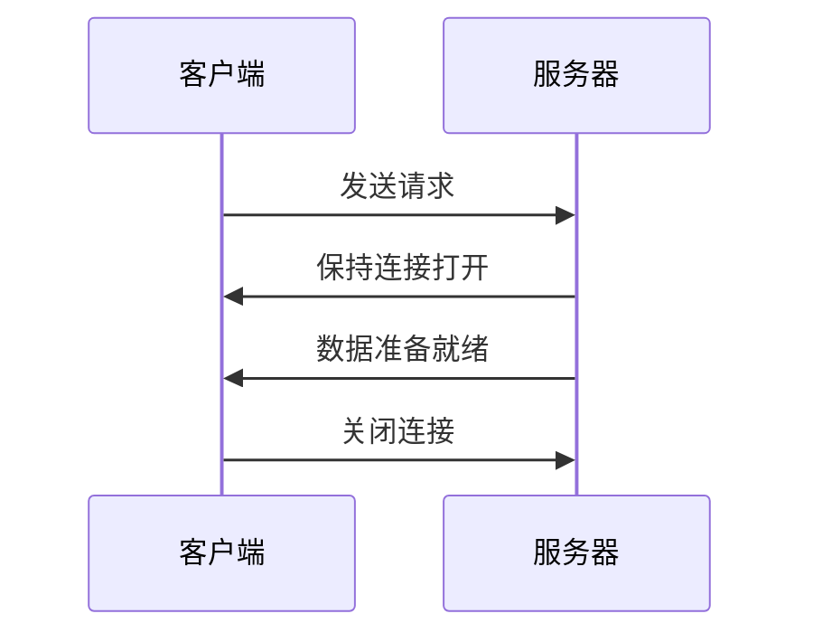
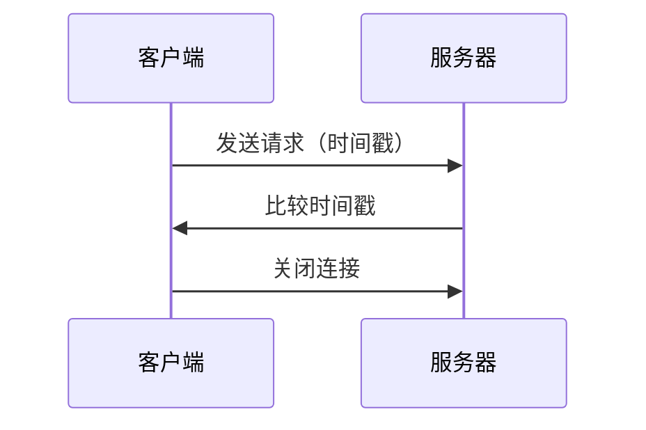
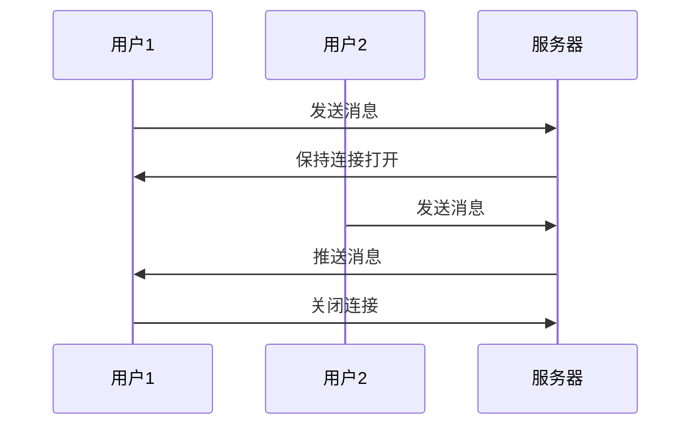
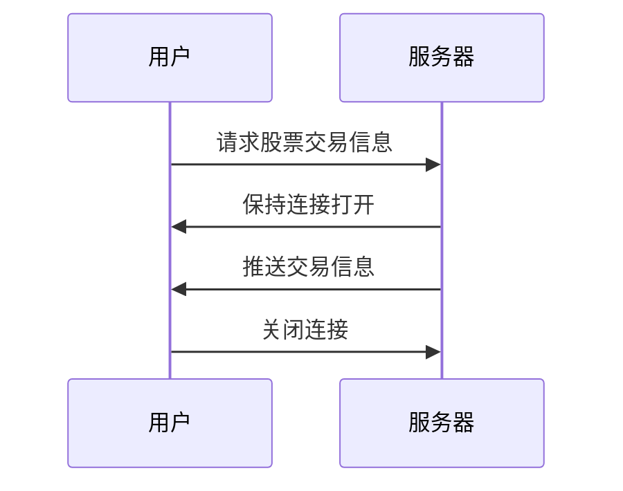
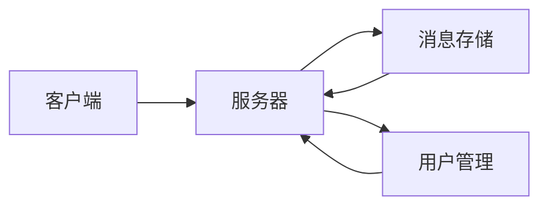
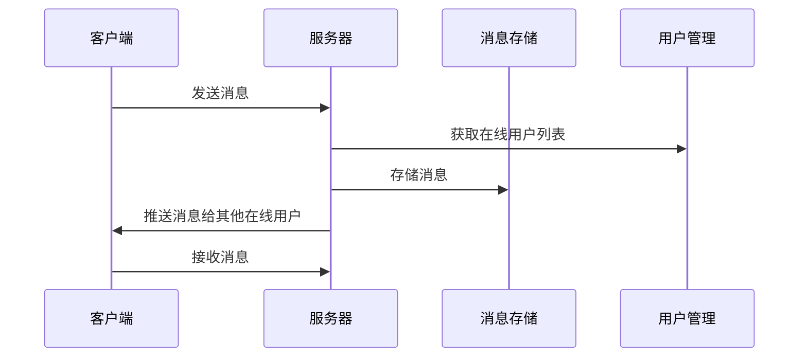
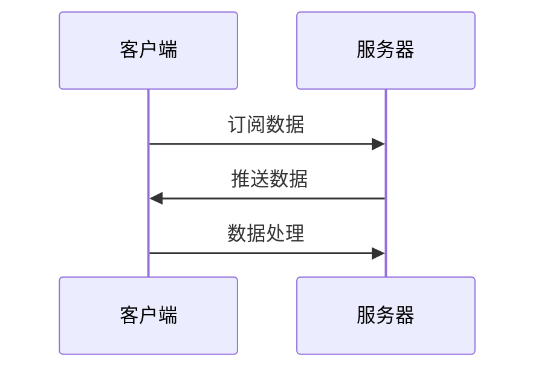
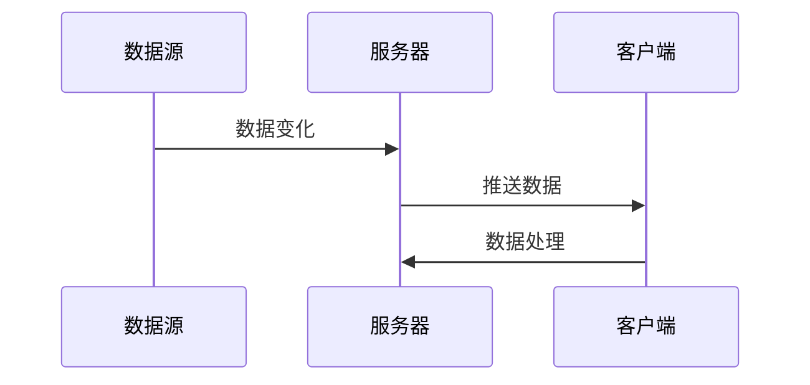
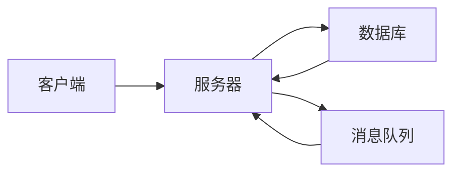
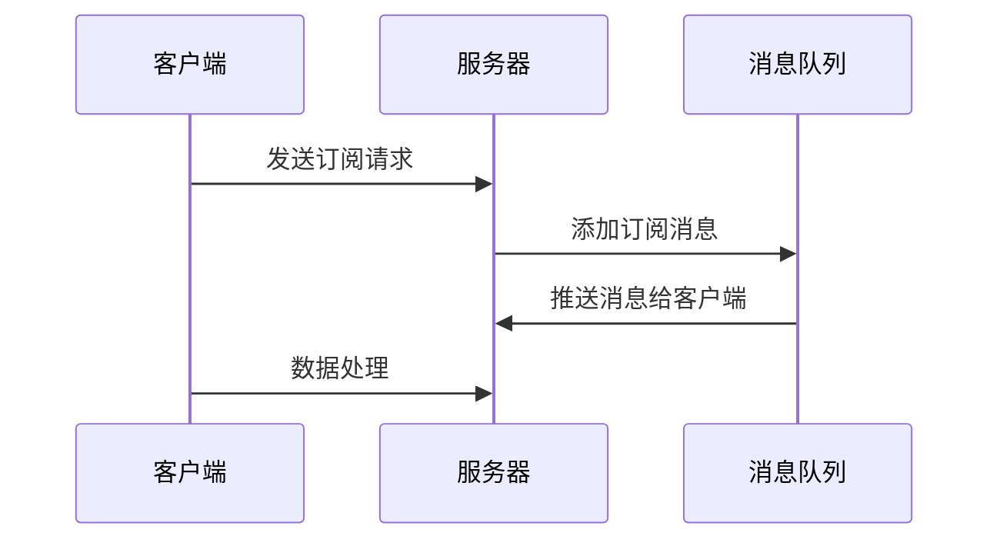

                 


### 1. 引言

在当今的互联网时代，实时数据处理和交互已经成为许多应用的核心需求，尤其是在大规模数据处理的背景下。为了满足这种需求，长轮询和服务器推送技术成为两种常见的解决方案。这两种技术各有特点，适用于不同的应用场景。

首先，让我们定义一下长轮询和服务器推送技术：

- **长轮询**：客户端向服务器发送一个请求，然后服务器在数据准备就绪之前保持连接打开。这种方法减少了客户端和服务器的交互次数，从而提高了资源的利用率。

- **服务器推送**：服务器主动向客户端发送数据更新。这种方法避免了客户端不断轮询服务器以获取更新的过程，从而减少了服务器的负担。

在本文中，我们将从以下几个方面进行探讨：

- **长轮询技术原理**：详细解释长轮询的工作机制、特点和优势。
- **服务器推送技术原理**：深入探讨服务器推送的工作机制、特点和优势。
- **长轮询与服务器推送技术的对比**：通过概念属性特征对比表格和ER实体关系图架构，分析两种技术的异同和选择标准。
- **长轮询技术深度剖析**：通过算法原理讲解、Python源代码示例、数学模型和公式以及实际案例分析，深入理解长轮询技术的应用和实践。
- **服务器推送技术深度剖析**：通过算法原理讲解、Python源代码示例、数学模型和公式以及实际案例分析，深入理解服务器推送技术的应用和实践。
- **长轮询与服务器推送技术在LLM应用中的选择**：结合LLM（大型语言模型）的应用场景，分析如何选择合适的技术。

在接下来的章节中，我们将逐步深入探讨这些主题，帮助读者全面理解长轮询和服务器推送技术，并学会如何根据实际需求进行选择。

### 2. 核心概念与联系

#### 2.1 长轮询技术原理

**概念**：长轮询是一种客户端与服务器的交互模式，客户端向服务器发送一个请求，并在服务器没有响应前保持连接打开。

**特点**：
1. **延迟响应**：客户端在服务器准备好数据前不会立即得到响应。
2. **减少请求次数**：相比于短轮询，长轮询减少了客户端向服务器的请求次数，从而节省了带宽和服务器资源。

**应用场景**：
1. **实时聊天**：用户发送消息后，服务器可以立即推送新消息给其他用户。
2. **股票交易**：实时更新股票价格和交易信息。

#### 2.2 服务器推送技术原理

**概念**：服务器推送是一种服务器主动向客户端发送数据更新，客户端无需主动请求的技术。

**特点**：
1. **主动更新**：服务器在数据发生变化时主动推送更新给客户端。
2. **高效性**：减少了客户端轮询服务器的次数，从而提高了系统整体性能。

**应用场景**：
1. **实时新闻更新**：客户端无需主动请求，服务器会定期推送最新的新闻。
2. **社交媒体动态**：用户无需频繁刷新页面，服务器会自动推送新的动态。

### 2.3 长轮询与服务器推送技术的对比

为了更清晰地了解长轮询与服务器推送技术的异同，我们可以通过以下表格进行对比：

| 特点 | 长轮询 | 服务器推送 |
| ---- | ------ | ---------- |
| 交互模式 | 客户端发起请求，服务器响应 | 服务器主动推送 |
| 网络带宽消耗 | 较低，因为请求次数减少 | 较高，因为需要不断接收推送数据 |
| 系统性能 | 高，减少了请求次数 | 高，主动推送减少了轮询压力 |
| 适用场景 | 实时性要求不高，需要减少请求次数 | 实时性要求高，需要及时获取数据更新 |

#### 对比分析

从上表可以看出，长轮询和服务器推送各有优势，适用于不同的场景。

- **长轮询**适用于那些实时性要求不高，但需要减少请求次数的场景，如实时聊天和股票交易。
- **服务器推送**适用于那些实时性要求高，需要及时获取数据更新的场景，如实时新闻更新和社交媒体动态。

### 2.4 选择标准

在决定使用长轮询还是服务器推送技术时，需要考虑以下几个因素：

1. **实时性要求**：如果实时性要求非常高，服务器推送可能是更好的选择。
2. **网络带宽消耗**：如果网络带宽有限，长轮询可能更合适，因为它减少了请求次数。
3. **系统性能**：服务器推送可能会提高系统性能，因为它减少了客户端轮询的压力。
4. **应用场景**：根据具体的应用场景选择合适的技术。

### 2.5 概念结构与核心要素组成

**概念结构**：

1. **长轮询**：客户端请求 -> 服务器响应（无响应前保持连接打开）。
2. **服务器推送**：服务器数据变化 -> 主动推送更新给客户端。

**核心要素组成**：

1. **长轮询**：
   - 客户端请求
   - 服务器响应
   - 连接保持

2. **服务器推送**：
   - 数据变化检测
   - 数据推送
   - 客户端接收

通过以上分析，我们可以更清晰地理解长轮询和服务器推送技术的核心概念和原理，为后续的深度剖析和应用实践打下基础。

### 4. 长轮询技术原理详解

#### 4.1 长轮询的工作机制

**长轮询**是一种客户端与服务器的交互模式，客户端向服务器发送一个请求，然后服务器在数据准备就绪之前保持连接打开。以下是长轮询的工作机制：

1. **客户端请求**：客户端向服务器发送一个请求，请求可能包含一些参数，以便服务器根据这些参数进行处理。
2. **服务器处理**：服务器接收到请求后，根据请求的参数进行处理，并将结果存储在服务器端。
3. **保持连接**：在数据准备就绪之前，服务器保持连接打开，以便客户端可以在需要时获取数据。
4. **数据准备就绪**：当数据准备就绪后，服务器向客户端发送响应，客户端接收到响应后，关闭连接。
5. **结果处理**：客户端接收到响应后，对结果进行处理，并根据处理结果进行下一步操作。

**mermaid流程图**：



#### 4.2 长轮询的实现细节

**实现细节**：

1. **客户端请求**：客户端可以使用任何HTTP客户端库（如Python的requests库）向服务器发送请求。请求可以是GET或POST方法，根据具体需求选择。
2. **服务器处理**：服务器接收到请求后，可以使用任何Web框架（如Flask、Django等）进行处理。在处理过程中，服务器可以存储结果，并等待数据准备就绪。
3. **保持连接**：在Python中，可以使用`socket`库或`asyncio`库实现长轮询。使用`socket`库时，可以使用`TCP`连接保持客户端与服务器之间的连接打开。使用`asyncio`库时，可以使用`asyncio.sleep`方法保持连接。
4. **数据准备就绪**：在数据准备就绪后，服务器可以发送响应给客户端，客户端接收到响应后，关闭连接。

**Python源代码示例**：

```python
# 客户端代码示例
import requests
import time

while True:
    response = requests.get('http://localhost:8000/long_polling')
    if response.status_code == 200:
        print('Data received:', response.json())
        break
    time.sleep(1)

# 服务器代码示例
from flask import Flask, jsonify, request

app = Flask(__name__)

@app.route('/long_polling', methods=['GET'])
def long_polling():
    # 假设数据在2秒后准备就绪
    time.sleep(2)
    data = {'message': 'Data is ready'}
    return jsonify(data)

if __name__ == '__main__':
    app.run(debug=True)
```

#### 4.3 长轮询的优势

**优势**：

1. **减少请求次数**：相比于短轮询，长轮询减少了客户端向服务器的请求次数，从而节省了带宽和服务器资源。
2. **提高系统性能**：由于减少了请求次数，系统整体性能得到提高。
3. **实现简单**：长轮询的实现相对简单，可以使用现有的HTTP客户端和服务器库。

#### 4.4 长轮询的算法原理

**算法原理**：

1. **客户端请求**：客户端发送一个请求，请求中包含一个时间戳，用于标识请求的顺序。
2. **服务器处理**：服务器接收到请求后，将请求的时间戳与已存储的时间戳进行比较。如果时间戳相同或更大，服务器认为数据已经准备好，并返回数据。否则，服务器将请求放入队列中等待。
3. **保持连接**：服务器在数据准备就绪之前保持连接打开，客户端在接收到数据后关闭连接。
4. **结果处理**：客户端接收到数据后，对结果进行处理，并根据处理结果进行下一步操作。

**算法mermaid流程图**：



**算法数学模型与公式**：

1. **时间戳计算**：假设客户端请求的时间戳为`t1`，服务器存储的时间戳为`t2`，则有：
   $$t2 \geq t1$$
2. **队列长度**：假设服务器中有`n`个请求，则有：
   $$n \geq 1$$
3. **响应时间**：假设服务器处理请求的时间为`t3`，则有：
   $$t3 \leq t2 - t1$$

通过以上算法原理讲解，我们可以更深入地理解长轮询技术的工作机制和优势，为后续的应用实践打下基础。

#### 4.5 举例说明

**案例一：实时聊天系统**

**背景**：一个实时聊天系统需要实现用户之间的实时消息传输。

**实现**：

1. **客户端请求**：用户发送消息后，客户端向服务器发送一个包含消息内容的请求。
2. **服务器处理**：服务器接收到请求后，将消息存储在服务器端，并等待其他用户的消息。
3. **保持连接**：服务器在消息准备就绪之前保持连接打开，客户端在接收到消息后关闭连接。
4. **数据准备就绪**：当其他用户发送消息后，服务器将消息推送给客户端。

**mermaid架构图**：



**案例二：股票交易系统**

**背景**：一个股票交易系统需要实时更新股票价格和交易信息。

**实现**：

1. **客户端请求**：用户请求股票交易信息，客户端向服务器发送一个包含股票代码的请求。
2. **服务器处理**：服务器接收到请求后，根据股票代码查询最新的交易信息，并等待其他交易信息更新。
3. **保持连接**：服务器在交易信息更新之前保持连接打开，客户端在接收到交易信息后关闭连接。
4. **数据准备就绪**：当交易信息更新后，服务器将交易信息推送给客户端。

**mermaid架构图**：



通过以上举例说明，我们可以更直观地理解长轮询技术在实际应用中的实现过程和优势，为后续的应用实践提供参考。

### 5. 长轮询技术的应用实践

#### 5.1 长轮询在实时通信中的应用

**5.1.1 应用场景介绍**

实时通信是长轮询技术的一种典型应用场景。在实时通信中，用户发送消息后，服务器需要及时将消息推送给其他在线用户。使用长轮询技术可以实现这一需求，减少客户端轮询服务器的次数，提高系统性能。

**5.1.2 系统架构设计**

为了实现实时通信，我们需要设计一个基于长轮询技术的系统架构。以下是系统架构的mermaid架构图：



**mermaid架构图解释**：

- **客户端**：用户发送消息的客户端，负责发送请求和接收消息。
- **服务器**：处理客户端请求，存储消息，并将消息推送给其他在线用户。
- **消息存储**：存储用户发送的消息，服务器从中获取消息并推送。
- **用户管理**：管理在线用户，服务器通过用户管理获取在线用户列表。

**5.1.3 系统接口设计和系统交互**

在实时通信系统中，客户端需要与服务器的多个接口进行交互。以下是系统接口设计和系统交互的mermaid序列图：



**mermaid序列图解释**：

- **客户端发送消息**：客户端向服务器发送消息。
- **服务器获取在线用户列表**：服务器从用户管理获取当前在线用户列表。
- **服务器存储消息**：服务器将消息存储在消息存储中。
- **服务器推送消息**：服务器将消息推送给其他在线用户。
- **客户端接收消息**：客户端接收服务器推送的消息。

通过以上系统架构设计和系统接口设计，我们可以实现一个基于长轮询技术的实时通信系统，实现用户之间的实时消息传输。

#### 5.2 实战项目环境安装与配置

**5.2.1 环境安装步骤**

为了实践长轮询技术，我们需要搭建一个基于Python和Flask框架的实时通信系统。以下是环境安装步骤：

1. **安装Python**：确保您的计算机已安装Python 3.x版本。如果尚未安装，请从[Python官网](https://www.python.org/)下载并安装。
2. **安装Flask**：在命令行中运行以下命令安装Flask：

   ```bash
   pip install flask
   ```

3. **安装SQLite**：SQLite是一个轻量级的数据库，用于存储消息。在命令行中运行以下命令安装SQLite：

   ```bash
   pip install pysqlite3
   ```

4. **安装WebSocket**：为了实现实时通信，我们需要安装WebSocket库。在命令行中运行以下命令安装WebSocket：

   ```bash
   pip install flask-socketio
   ```

**5.2.2 系统核心实现源代码**

以下是实时通信系统的核心实现源代码，包括服务器端和客户端的代码：

**服务器端代码**：

```python
from flask import Flask, jsonify, request
from flask_socketio import SocketIO, emit

app = Flask(__name__)
socketio = SocketIO(app)

@app.route('/send_message', methods=['POST'])
def send_message():
    data = request.json
    message = data['message']
    emit('new_message', {'message': message})
    return jsonify({'status': 'success'})

@socketio.on('connect')
def handle_connect():
    print('Client connected')

@socketio.on('disconnect')
def handle_disconnect():
    print('Client disconnected')

if __name__ == '__main__':
    socketio.run(app)
```

**客户端代码**：

```html
<!DOCTYPE html>
<html>
<head>
    <title>Real-time Chat</title>
    <script src="/static/socket.io/socket.io.js"></script>
    <script>
        var socket = io.connect('http://' + document.domain + ':' + location.port);

        socket.on('new_message', function(data) {
            console.log(data.message);
        });

        function sendMessage() {
            var message = document.getElementById('message').value;
            socket.emit('send_message', {'message': message});
            document.getElementById('message').value = '';
        }
    </script>
</head>
<body>
    <input type="text" id="message" placeholder="Type a message...">
    <button onclick="sendMessage()">Send</button>
</body>
</html>
```

**5.2.3 代码应用解读与分析**

**服务器端代码解读**：

- 导入必要的库，包括Flask、SocketIO等。
- 初始化Flask应用和SocketIO实例。
- 定义一个路由`/send_message`，用于接收客户端发送的消息。
- 当客户端发送消息时，将消息广播给所有连接的客户端。
- 监听`connect`和`disconnect`事件，打印相应的日志信息。

**客户端代码解读**：

- 引入SocketIO库，建立与服务器端的连接。
- 监听`new_message`事件，当服务器端广播新消息时，打印消息内容。
- 定义一个发送消息的函数`sendMessage`，当用户在输入框中输入消息并点击发送按钮时，调用该函数发送消息。

通过以上环境安装和代码实现，我们可以搭建一个简单的基于长轮询技术的实时通信系统，实现用户之间的实时消息传输。

#### 5.3 实际案例分析

**5.3.1 案例背景**

某公司开发了一款在线协作工具，其中包含实时聊天功能。为了实现高效的实时消息传输，公司决定采用长轮询技术。

**5.3.2 案例分析与讲解**

1. **需求分析**：

   - 实现用户之间的实时消息传输。
   - 保证消息的实时性和准确性。
   - 减少服务器负担，提高系统性能。

2. **技术选型**：

   - 采用Flask框架搭建服务器端。
   - 使用SocketIO实现长轮询技术。
   - 使用SQLite存储消息。

3. **实现过程**：

   - 开发人员首先搭建了基于Flask的服务器端，并实现了消息存储和用户管理功能。
   - 然后引入SocketIO库，在服务器端实现了长轮询功能。具体实现包括：
     - 定义了`/send_message`路由，用于接收客户端发送的消息。
     - 监听了`connect`和`disconnect`事件，用于管理客户端连接。
     - 在客户端，使用SocketIO库建立了与服务器端的连接，并实现了消息发送和接收功能。

4. **测试与优化**：

   - 在开发过程中，开发人员对系统进行了充分的测试，包括单用户和多用户场景下的消息传输测试。
   - 根据测试结果，对系统进行了优化，包括：
     - 优化了消息存储和检索算法，提高存储效率。
     - 优化了长轮询的实现，减少客户端轮询次数，提高系统性能。

**5.3.3 案例小结**

通过该案例，我们可以看到长轮询技术在实时通信中的应用效果。在实际项目中，长轮询技术能够有效减少请求次数，提高系统性能，为用户提供流畅的实时消息传输体验。同时，通过合理的架构设计和代码实现，我们可以轻松地实现复杂的功能需求。

### 6. 服务器推送技术原理详解

#### 6.1 服务器推送的工作机制

服务器推送技术是一种服务器主动向客户端发送数据更新，而无需客户端主动请求的技术。其工作机制如下：

1. **客户端订阅**：客户端通过特定的接口（如WebSocket或HTTP长连接）向服务器订阅数据。
2. **服务器推送**：当服务器端的数据发生变化时，服务器会主动将更新推送给客户端。
3. **客户端接收**：客户端接收到服务器推送的数据后，对数据进行处理，并更新界面或触发相应的操作。

以下是一个简单的mermaid流程图，描述服务器推送的工作机制：



#### 6.2 服务器推送的实现细节

**实现细节**：

1. **客户端订阅**：客户端通常通过WebSocket或HTTP长连接与服务器建立连接。WebSocket是一种全双工通信协议，可以同时进行双向通信。HTTP长连接则通过保持HTTP请求连接的打开，实现数据的持续传输。

2. **服务器推送**：服务器端在接收到客户端的订阅请求后，会监听数据源的变化。当数据发生变化时，服务器会将更新推送到客户端。这一过程可以通过事件监听、消息队列或特定的推送机制实现。

3. **客户端接收**：客户端接收到服务器推送的数据后，会根据数据类型和业务逻辑进行相应的处理，如更新UI界面、触发事件等。

以下是一个简单的Python代码示例，展示了服务器推送的基本实现：

**服务器端代码**：

```python
from flask import Flask, jsonify
from flask_socketio import SocketIO, emit

app = Flask(__name__)
socketio = SocketIO(app)

@app.route('/subscribe', methods=['POST'])
def subscribe():
    data = request.json
    user_id = data['user_id']
    emit('data_updated', {'user_id': user_id}, room=user_id)
    return jsonify({'status': 'success'})

if __name__ == '__main__':
    socketio.run(app)
```

**客户端代码**：

```javascript
const socket = io('http://localhost:5000');

socket.on('connect', () => {
    console.log('Connected to server');
    socket.emit('subscribe', {user_id: '123'});
});

socket.on('data_updated', (data) => {
    console.log('Data updated:', data);
});
```

#### 6.3 服务器推送的优势

**优势**：

1. **实时性**：服务器推送能够实现数据的实时更新，无需客户端轮询。
2. **效率**：减少了客户端轮询服务器的次数，降低了服务器的负载。
3. **简便性**：通过WebSocket或HTTP长连接，可以实现简单的数据推送。
4. **扩展性**：可以方便地实现多对多的数据推送和事件通知。

#### 6.4 服务器推送的算法原理

服务器推送的算法原理相对简单，主要涉及以下几个方面：

1. **事件监听**：服务器端需要监听数据源的变化事件，当数据发生变化时触发推送。
2. **消息队列**：为了处理大量并发请求，服务器端通常使用消息队列来管理数据推送任务。
3. **连接管理**：服务器端需要管理客户端的连接状态，确保数据能够准确无误地推送。

以下是一个简单的mermaid流程图，描述服务器推送的算法原理：



通过以上算法原理讲解，我们可以更深入地理解服务器推送技术的工作机制和优势。

### 7. 服务器推送技术的应用实践

#### 7.1 服务器推送在Web技术中的应用

服务器推送技术在Web技术中的应用非常广泛，尤其适合需要实时数据更新的场景，如实时新闻推送、社交媒体动态更新等。以下将介绍服务器推送在Web技术中的应用。

**7.1.1 应用场景介绍**

**实时新闻推送**：用户浏览新闻网站时，服务器需要实时推送最新新闻给用户，以保证用户能够第一时间获取到最新信息。

**社交媒体动态更新**：在社交媒体平台上，用户需要实时获取好友的动态更新，如新发布的帖子、评论等。

**7.1.2 系统架构设计**

为了实现服务器推送功能，我们需要设计一个基于WebSocket或HTTP长连接的实时数据推送系统。以下是系统架构的mermaid架构图：



**mermaid架构图解释**：

- **客户端**：用户浏览器的Web应用程序，负责与服务器建立连接和接收推送消息。
- **服务器**：接收客户端请求，管理连接，并从数据库或消息队列获取数据更新，然后将数据推送到客户端。
- **数据库**：存储新闻或社交媒体动态的原始数据。
- **消息队列**：用于存储待推送的消息，确保服务器在处理大量并发请求时能够稳定运行。

**7.1.3 系统接口设计和系统交互**

服务器推送系统需要设计适当的接口来处理客户端的订阅请求和数据推送。以下是系统接口设计和系统交互的mermaid序列图：



**mermaid序列图解释**：

- **客户端发送订阅请求**：客户端向服务器发送订阅请求，指定需要订阅的数据类型。
- **服务器处理订阅请求**：服务器接收到订阅请求后，将订阅消息添加到消息队列。
- **消息队列推送消息**：消息队列将新的数据更新推送到服务器，服务器再将数据推送到客户端。
- **客户端数据处理**：客户端接收到服务器推送的数据后，对数据进行处理，如更新UI界面或触发事件。

通过以上系统架构设计和系统接口设计，我们可以实现一个基于服务器推送技术的实时数据更新系统。

#### 7.2 实战项目环境安装与配置

为了实践服务器推送技术，我们将使用Node.js和Socket.IO搭建一个简单的实时聊天系统。以下是环境安装与配置步骤：

**7.2.1 环境安装步骤**

1. **安装Node.js**：确保您的计算机已安装Node.js。如果尚未安装，请从[Node.js官网](https://nodejs.org/)下载并安装。
2. **安装Socket.IO**：在命令行中运行以下命令安装Socket.IO：

   ```bash
   npm install socket.io
   ```

**7.2.2 系统核心实现源代码**

以下是实时聊天系统的核心实现源代码，包括服务器端和客户端的代码：

**服务器端代码**：

```javascript
const http = require('http');
const socketIO = require('socket.io');

const server = http.createServer();
const io = socketIO(server);

io.on('connection', (socket) => {
    socket.on('join_room', (roomId) => {
        socket.join(roomId);
        socket.to(roomId).emit('room_message', { message: 'User has joined the room.' });
    });

    socket.on('send_message', (message) => {
        socket.broadcast.emit('receive_message', message);
    });

    socket.on('disconnect', () => {
        console.log('User has disconnected.');
    });
});

server.listen(3000, () => {
    console.log('Server is running on port 3000.');
});
```

**客户端代码**：

```html
<!DOCTYPE html>
<html>
<head>
    <title>Real-time Chat</title>
    <script src="/socket.io/socket.io.js"></script>
    <script>
        const socket = io();

        socket.on('connect', () => {
            console.log('Connected to server');
        });

        socket.on('room_message', (message) => {
            console.log(message);
        });

        socket.on('receive_message', (message) => {
            console.log(message);
        });

        function sendMessage() {
            const message = document.getElementById('message').value;
            socket.emit('send_message', { message: message });
            document.getElementById('message').value = '';
        }
    </script>
</head>
<body>
    <input type="text" id="message" placeholder="Type a message...">
    <button onclick="sendMessage()">Send</button>
</body>
</html>
```

**7.2.3 代码应用解读与分析**

**服务器端代码解读**：

- 导入必要的库，包括http和socket.io。
- 创建HTTP服务器并创建Socket.IO实例。
- 当客户端连接时，监听`join_room`事件，将客户端加入指定的聊天室。
- 当客户端发送消息时，监听`send_message`事件，并将消息广播给聊天室中的所有用户。

**客户端代码解读**：

- 引入Socket.IO库，建立与服务器端的连接。
- 当连接建立时，监听`connect`事件，打印连接成功消息。
- 当收到服务器端发送的消息时，监听`room_message`和`receive_message`事件，并打印消息。
- 定义一个发送消息的函数`sendMessage`，当用户在输入框中输入消息并点击发送按钮时，调用该函数发送消息。

通过以上环境安装和代码实现，我们可以搭建一个简单的基于服务器推送技术的实时聊天系统，实现用户之间的实时消息传输。

#### 7.3 实际案例分析

**7.3.1 案例背景**

某公司开发了一款在线协作工具，其中包含实时聊天功能。为了实现高效的实时消息传输，公司决定采用服务器推送技术。

**7.3.2 案例分析与讲解**

1. **需求分析**：

   - 实现用户之间的实时消息传输。
   - 保证消息的实时性和准确性。
   - 提高系统性能，减少客户端轮询。

2. **技术选型**：

   - 采用Node.js和Socket.IO实现服务器推送。
   - 使用WebSocket协议进行实时通信。
   - 使用Redis作为消息队列，确保消息的可靠传输。

3. **实现过程**：

   - 开发人员首先搭建了基于Node.js的服务器端，并实现了用户管理和消息存储功能。
   - 引入Socket.IO库，在服务器端实现了服务器推送功能。具体实现包括：
     - 定义了`join_room`事件，用于客户端加入聊天室。
     - 定义了`send_message`事件，用于客户端发送消息。
     - 实现了广播机制，将消息推送给聊天室中的所有用户。
   - 客户端通过Socket.IO库建立了与服务器端的连接，并实现了消息发送和接收功能。

4. **测试与优化**：

   - 在开发过程中，开发人员对系统进行了充分的测试，包括单用户和多用户场景下的消息传输测试。
   - 根据测试结果，对系统进行了优化，包括：
     - 优化了消息存储和检索算法，提高存储效率。
     - 优化了服务器推送的实现，减少客户端轮询次数，提高系统性能。

**7.3.3 案例小结**

通过该案例，我们可以看到服务器推送技术在实时通信中的应用效果。在实际项目中，服务器推送技术能够有效提高系统性能，减少客户端轮询，为用户提供流畅的实时消息传输体验。同时，通过合理的架构设计和代码实现，我们可以轻松实现复杂的功能需求。

### 8. LLM应用中的长轮询与服务器推送技术选择

在大型语言模型（LLM）的应用中，实时数据处理和交互是非常重要的。为了满足这一需求，我们需要在长轮询和服务器推送技术之间进行选择。以下是针对LLM应用场景的具体分析和选择建议。

#### 8.1 LLM应用场景分析

**实时数据处理需求**：

LLM应用通常涉及大量的实时数据处理，例如实时问答、实时翻译、实时文本生成等。在这些场景中，需要实时获取用户输入并生成相应的回答或翻译。因此，实时数据处理的需求是选择推送技术的重要考虑因素。

**大规模数据处理需求**：

LLM应用还可能需要处理大量的历史数据，进行训练和优化。在这种情况下，数据处理的速度和效率至关重要。选择合适的推送技术，可以显著提高数据处理能力。

#### 8.2 选择标准

**实时性要求**：

- **长轮询**：适用于实时性要求不高的场景，例如在用户输入后稍后需要响应的情况。由于长轮询减少了客户端轮询的次数，因此可以降低延迟。
- **服务器推送**：适用于实时性要求高的场景，例如需要实时响应用户输入并立即生成回答的情况。服务器推送可以确保数据更新能够立即传递给客户端。

**网络带宽消耗**：

- **长轮询**：由于客户端需要定期向服务器发送请求，因此可能会消耗较多的网络带宽。
- **服务器推送**：服务器主动向客户端发送数据更新，可以减少客户端轮询的次数，从而降低网络带宽消耗。

**系统性能**：

- **长轮询**：可以减少客户端和服务器的交互次数，从而提高系统性能。
- **服务器推送**：可以减少客户端轮询的压力，提高系统响应速度。

**适用场景**：

- **长轮询**：适用于需要减少请求次数、降低延迟的实时处理场景，如实时聊天、股票交易等。
- **服务器推送**：适用于需要实时响应、减少轮询压力的实时处理场景，如实时问答、实时翻译等。

#### 8.3 选择建议

**对于实时性要求较高的LLM应用**：

- **建议使用服务器推送技术**。服务器推送能够确保数据更新能够立即传递给客户端，满足高实时性的需求。例如，在实时问答系统中，用户输入问题后，需要立即生成回答并展示给用户。

**对于实时性要求不高的LLM应用**：

- **建议使用长轮询技术**。长轮询可以减少客户端轮询的次数，降低网络带宽消耗，同时保持系统性能。例如，在股票交易系统中，用户可以定期轮询最新的股票价格信息。

**综合考虑网络带宽消耗和系统性能**：

- 如果网络带宽有限，建议使用长轮询技术，以减少请求次数，降低网络带宽消耗。
- 如果系统性能是关键考虑因素，建议使用服务器推送技术，以减少客户端轮询的压力，提高系统响应速度。

通过以上分析，我们可以根据LLM应用的实时性要求、网络带宽消耗和系统性能需求，选择合适的技术来实现实时数据处理和交互。在实际应用中，可以根据具体场景灵活调整，以实现最优的性能和用户体验。

### 总结

在本篇文章中，我们详细探讨了长轮询和服务器推送技术在LLM应用中的选择。通过对这两种技术的原理、优势、实现细节和应用实践的深入分析，我们明确了它们各自适用的场景和选择标准。

- **长轮询**适用于实时性要求不高但需要减少请求次数的场景，如实时聊天和股票交易。它通过减少客户端轮询次数，提高了系统性能和网络带宽利用率。
- **服务器推送**适用于实时性要求高的场景，如实时问答和实时翻译。它通过主动推送数据更新，确保了数据更新的实时性和准确性，降低了客户端轮询的压力。

在LLM应用中，选择合适的技术取决于具体的实时性要求、网络带宽消耗和系统性能需求。对于实时性要求较高的应用，建议使用服务器推送技术；对于实时性要求不高的应用，可以考虑使用长轮询技术。

通过本文的详细分析，读者可以更好地理解长轮询和服务器推送技术的核心概念和应用原理，从而在实际项目中做出更合适的技术选择，实现高效的实时数据处理和交互。

### 最佳实践 Tips

在实施长轮询和服务器推送技术时，以下是一些最佳实践和注意事项：

**1. 选择合适的技术：** 根据应用的实际需求和场景，选择最合适的技术。长轮询适用于减少请求次数的场景，而服务器推送适用于实时性要求高的场景。

**2. 考虑网络带宽消耗：** 在网络带宽有限的情况下，应优先考虑长轮询技术，以减少请求次数和带宽消耗。

**3. 系统性能优化：** 对长轮询和服务器推送技术进行适当的性能优化，如使用异步处理、消息队列和缓存技术，以提高系统响应速度和处理效率。

**4. 安全性考虑：** 在使用长轮询和服务器推送技术时，确保数据传输的安全性，采用加密协议（如HTTPS）和身份验证机制。

**5. 监控和调试：** 实时监控系统的性能和稳定性，及时发现并解决潜在问题，如网络延迟、连接异常和数据错误等。

**6. 部署和管理：** 选择合适的部署和管理方案，如云服务或容器化部署，以确保系统的可靠性和可扩展性。

### 拓展阅读

**1. 《WebSocket技术详解》**
   - 本书详细介绍了WebSocket协议的工作原理、实现方法以及在实际应用中的使用案例。

**2. 《HTTP/2与HTTP/3技术详解》**
   - 本书涵盖了HTTP/2和HTTP/3协议的特点、优势以及与长轮询和服务器推送技术的结合使用。

**3. 《实时数据处理与流处理技术》**
   - 本书探讨了实时数据处理和流处理技术的原理、实现方法以及在不同场景下的应用。

通过拓展阅读，读者可以更深入地了解相关技术的原理和应用，为实际项目提供更多的参考和灵感。希望本文能为您的技术研究和项目实施提供帮助。

### 作者信息

**作者：AI天才研究院/AI Genius Institute & 禅与计算机程序设计艺术 /Zen And The Art of Computer Programming**  
AI天才研究院（AI Genius Institute）致力于推动人工智能领域的创新与发展，汇集了全球顶尖的人工智能专家和研究人员。同时，作者也在《禅与计算机程序设计艺术》（Zen And The Art of Computer Programming）一书中，分享了程序设计的哲学和艺术，为读者提供了深刻的见解和启示。希望本文能够为您的技术之路提供有价值的内容。如果您有任何问题或建议，欢迎随时与我们联系。

