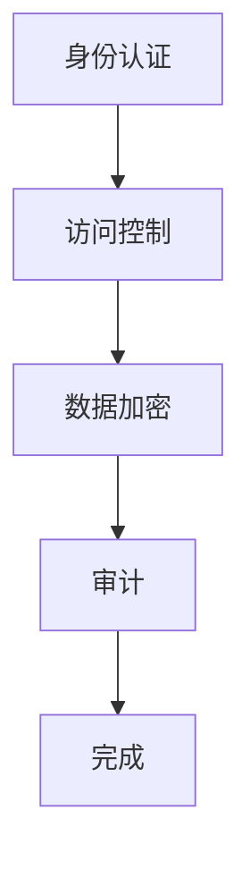
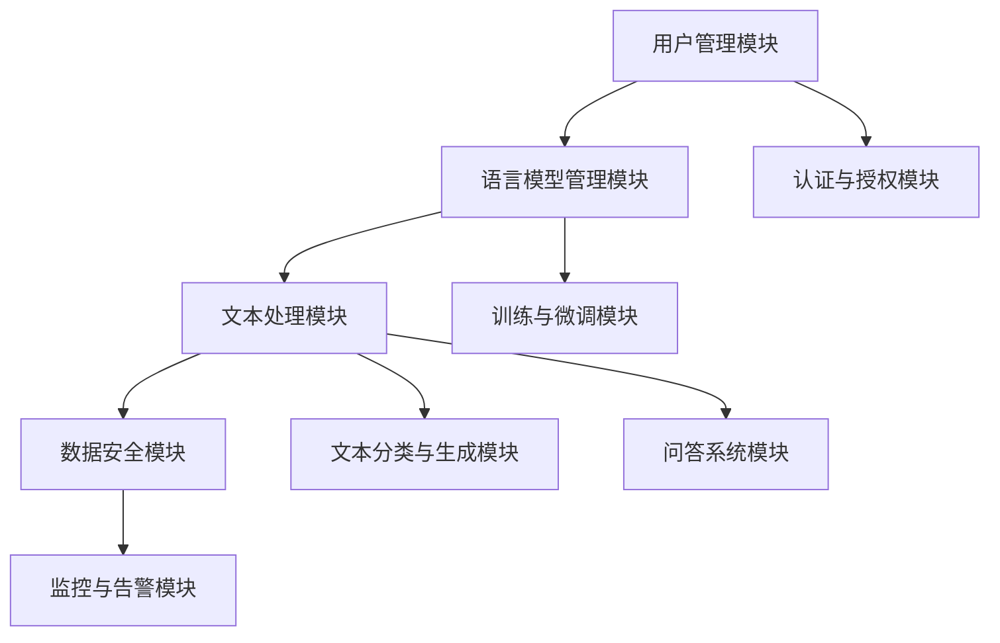
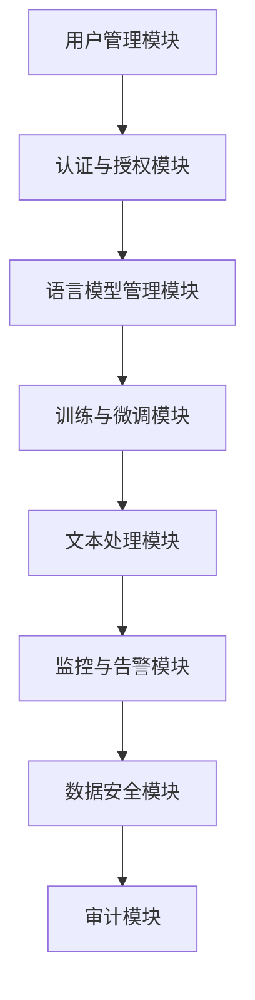

                 

## 零信任安全模型在LLM应用中的实施

### 关键词

- 零信任安全模型
- LLM（大规模语言模型）
- 数据安全
- 访问控制
- 身份认证
- 数据加密
- 审计

### 摘要

本文深入探讨了零信任安全模型在LLM（大规模语言模型）应用中的实施策略。随着云计算、大数据和人工智能技术的快速发展，网络安全面临着前所未有的挑战。传统的安全模型已难以应对复杂的网络环境，零信任安全模型应运而生。本文首先介绍了零信任安全模型的核心概念和原理，然后详细分析了其在LLM应用中的实施方法，包括身份认证、访问控制、数据加密和审计等方面。通过实际案例分析和通俗易懂的讲解，本文旨在为IT从业人员和研究者提供有价值的参考和启示。

## 背景介绍

### 核心概念术语说明

#### 零信任安全模型

零信任安全模型是一种基于“永不信任，始终验证”的安全策略。该模型认为网络内部不再被认为是可信的，任何请求访问内部资源的用户或系统都需要经过严格的验证和授权。这种策略的核心思想是减少对内部网络的信任，从而降低内部攻击和数据泄露的风险。

#### LLM（大规模语言模型）

LLM是一种基于深度学习技术的自然语言处理模型，具有强大的语言理解和生成能力。LLM通过大量的文本数据进行训练，能够捕捉到语言的复杂结构和语义关系，从而实现文本分类、问答系统、智能客服等多种应用。常见的LLM包括GPT、BERT等。

### 问题背景

随着云计算、大数据和人工智能技术的飞速发展，网络安全面临前所未有的挑战。传统的安全模型，如防火墙、入侵检测系统等，主要针对外部攻击进行防护。然而，随着内部网络的复杂性和开放性增加，内部威胁成为网络安全的主要风险之一。此外，大量敏感数据在云计算环境中存储和处理，数据泄露的风险也越来越高。

零信任安全模型的提出，正是为了解决这些问题。它通过严格的身份认证、访问控制和数据加密等手段，确保只有经过验证的用户和系统才能访问内部资源，从而减少内部攻击和数据泄露的风险。

### 问题描述

在LLM应用中，如何将零信任安全模型有效实施，确保数据安全和隐私保护，是一个亟待解决的问题。LLM作为一种高度集成的应用系统，涉及到大量的用户数据、模型参数和计算资源。如果这些数据和资源遭到恶意攻击，可能会导致严重的安全事故。

具体来说，问题主要表现在以下几个方面：

1. **用户身份认证**：如何确保只有授权用户才能访问LLM系统，防止未授权访问和内部威胁？
2. **访问控制**：如何根据用户的身份和权限，限制其对LLM系统的访问范围，防止越权操作？
3. **数据加密**：如何对LLM系统中的敏感数据进行加密，确保数据在传输和存储过程中不被窃取或篡改？
4. **审计**：如何记录和监控用户的操作行为，及时发现和应对异常情况，确保系统的安全性和可追溯性？

### 问题解决

为了解决上述问题，我们需要结合零信任安全模型的具体方法，对LLM应用进行针对性的设计和优化。

1. **身份认证**：采用多因素认证（MFA）技术，要求用户在登录时提供多种身份验证信息，如密码、指纹、手机验证码等，提高认证的可靠性和安全性。
2. **访问控制**：实施基于角色的访问控制（RBAC）策略，根据用户的身份和权限，划分不同的访问等级，确保用户只能访问与其角色相关的资源。
3. **数据加密**：采用高级加密标准（AES）等加密算法，对LLM系统中的敏感数据进行加密，确保数据在传输和存储过程中得到有效保护。
4. **审计**：实现详细的审计功能，记录和监控用户的操作行为，生成审计报告，以便在发生安全事件时进行溯源和调查。

通过以上措施，可以有效提高LLM应用的安全性和可靠性，确保数据安全和隐私保护。

### 边界与外延

本文讨论的范围包括零信任安全模型的基本概念、原理及其在LLM应用中的具体实施方法。具体来说，我们将重点关注以下几个方面：

1. **零信任安全模型的核心要素**：身份认证、访问控制、数据加密和审计。
2. **LLM的应用场景**：文本处理、问答系统、智能客服等。
3. **关键技术的对比和分析**：多因素认证、访问控制策略、数据加密算法和审计方法。

本文旨在为读者提供关于零信任安全模型在LLM应用中的实施策略和方法，以期为网络安全领域的实践和理论研究提供参考。

### 概念结构与核心要素组成

零信任安全模型是一种基于“永不信任，始终验证”的安全策略，其核心要素包括身份认证、访问控制、数据加密和审计。以下是对这些要素的详细解析：

#### 身份认证

身份认证是零信任安全模型的第一步，其目的是确保只有合法用户才能访问系统资源。在LLM应用中，身份认证尤为重要，因为LLM系统往往涉及大量敏感数据和计算资源。

1. **多因素认证（MFA）**：多因素认证要求用户在登录时提供多种身份验证信息，如密码、指纹、手机验证码等。这种认证方式可以提高认证的可靠性和安全性，降低未授权访问的风险。

2. **单点登录（SSO）**：单点登录允许用户通过一个统一的身份认证系统访问多个应用系统。这可以简化用户登录流程，提高用户体验，同时确保不同系统的安全策略得到统一管理。

3. **生物识别技术**：生物识别技术，如指纹识别、面部识别和虹膜识别等，可以提供更高级别的身份认证。这些技术利用用户的生物特征进行身份验证，具有高准确性和难以伪造的特点。

#### 访问控制

访问控制是确保用户只能访问其有权访问的系统资源的重要手段。在零信任安全模型中，访问控制策略必须基于用户的身份和权限进行严格管理。

1. **基于角色的访问控制（RBAC）**：基于角色的访问控制策略将用户和权限划分为不同的角色，根据角色的权限来控制用户的访问范围。这种策略易于管理，可以灵活地适应组织机构的权限管理需求。

2. **基于属性的访问控制（ABAC）**：基于属性的访问控制策略考虑了用户的角色、权限以及其他属性（如时间、位置等），更精细地控制用户的访问权限。这种策略适用于复杂的安全需求，如合规性和策略管理的应用场景。

3. **访问控制列表（ACL）**：访问控制列表是一种基于对象的访问控制机制，它为每个对象指定一组访问权限，用户对对象的访问权限取决于其在访问控制列表中的定义。

#### 数据加密

数据加密是保护敏感数据在传输和存储过程中不被窃取或篡改的重要手段。在零信任安全模型中，数据加密贯穿于整个数据处理过程，确保数据的安全性和完整性。

1. **高级加密标准（AES）**：高级加密标准是一种常用的对称加密算法，可用于对数据进行加密和解密。AES具有高安全性，支持多种密钥长度（如128位、192位和256位），适用于不同的应用场景。

2. **传输层安全（TLS）**：传输层安全协议是一种用于保护网络通信的加密协议，可以在数据传输过程中对数据进行加密和解密，防止中间人攻击和数据篡改。

3. **安全多方计算（MPC）**：安全多方计算是一种分布式计算技术，允许多个参与方在不需要共享原始数据的情况下进行计算。这种技术可以确保数据的隐私性和安全性，适用于需要协同计算的场景。

#### 审计

审计是记录和监控用户操作行为，及时发现和应对异常情况的重要手段。在零信任安全模型中，审计功能有助于确保系统的安全性和可追溯性。

1. **日志记录**：日志记录是审计的基础，它记录了系统的所有操作行为，包括用户登录、文件访问、系统错误等。通过分析日志，可以了解系统的运行状况和潜在的安全问题。

2. **异常检测**：异常检测是一种基于数据分析的方法，用于识别和预警异常行为。通过监控用户行为和系统状态，可以及时发现异常情况，采取相应的应对措施。

3. **安全信息与事件管理（SIEM）**：安全信息与事件管理是一种综合性的安全管理平台，用于收集、存储、分析和报告安全事件。SIEM可以帮助组织机构快速识别和响应安全威胁，提高安全管理效率。

通过以上核心要素的有机结合，零信任安全模型为LLM应用提供了全面的安全保障。在实际应用中，可以根据具体需求和场景，灵活调整和优化这些要素，以实现最佳的安全效果。

### 核心概念与联系

#### 核心概念原理

零信任安全模型（Zero Trust Model，ZTM）和大规模语言模型（Large Language Model，LLM）是当前网络安全与人工智能领域中的两个关键概念。它们各自有着独特的核心原理，但在实际应用中，二者的联系也日益紧密。

#### 零信任安全模型

零信任安全模型是一种基于“永不信任，始终验证”的安全策略。其核心理念是，无论用户或设备位于内部网络还是外部网络，在访问资源之前都必须经过严格的身份验证和授权。零信任安全模型的核心原理可以概括为以下几点：

1. **零信任原则**：网络内部不再被认为是可信的，内部威胁与外部威胁同样需要防范。
2. **最小权限原则**：用户和设备在访问资源时只获得最低权限，不允许任何默认的特权。
3. **持续验证原则**：用户和设备在每次访问资源时都需要重新验证，确保当前访问的合法性和安全性。
4. **访问策略定义**：根据用户身份、设备状态、应用上下文等动态属性定义访问策略，确保安全访问。

#### LLM

大规模语言模型是一种基于深度学习技术的自然语言处理模型，具有强大的语言理解和生成能力。LLM的核心原理是通过训练大量的文本数据，学习到语言的模式和结构，从而实现各种自然语言处理任务。LLM的关键概念包括：

1. **预训练与微调**：LLM通常通过在大规模文本语料库上进行预训练，学习到通用的语言知识。然后，根据特定任务需求进行微调，以适应特定的语言应用场景。
2. **多层神经网络**：LLM采用多层神经网络架构，通过逐层传递和变换，逐步提取文本中的语义信息。
3. **上下文理解**：LLM能够理解上下文信息，生成连贯、合理的语言输出，从而实现自然语言生成、文本分类、问答系统等多种应用。

#### 概念属性特征对比表格

为了更直观地理解零信任安全模型和大规模语言模型之间的联系和差异，我们可以通过一个对比表格来展示它们的核心属性特征。

| 概念           | 零信任安全模型 | LLM          |
|----------------|--------------|-------------|
| 核心思想       | 不信任任何内部网络资源 | 强调语言理解和生成能力  |
| 应用场景       | 企业内部网络、云计算环境 | 文本处理、问答系统、智能客服等 |
| 关键技术       | 多因素认证、访问控制策略 | 自然语言处理、深度学习       |
| 数据保护       | 身份认证、访问控制、数据加密 | 预训练、微调、上下文理解     |
| 安全级别       | 高度安全，防内部威胁和外部威胁 | 高度智能化，生成自然语言     |
| 发展趋势       | 逐步取代传统安全模型 | 与人工智能技术深度融合     |

#### ER实体关系图架构

为了进一步展示零信任安全模型和大规模语言模型之间的联系，我们可以使用ER（实体关系）图来表示它们的核心实体和关系。

```
用户
  |
  +-- 身份认证
  |
  +-- 访问控制
  |
  +-- 数据加密
  |
  +-- 审计
       |
       +-- LLM
```

在这个ER图中，“用户”是系统的核心实体，通过身份认证、访问控制、数据加密和审计等安全措施，与LLM实体建立联系。身份认证确保用户身份的合法性，访问控制限制用户的权限，数据加密保护数据的安全性，审计记录用户操作，为LLM的安全运行提供保障。

通过上述分析，我们可以看到，零信任安全模型和大规模语言模型在核心思想、应用场景和关键技术等方面有所不同，但它们在实际应用中可以相互结合，共同提升系统的安全性和智能水平。零信任安全模型为大规模语言模型提供了可靠的安全保障，而大规模语言模型则为零信任安全模型提供了更智能的决策支持，二者相辅相成，共同推动人工智能和网络安全的发展。

### 算法原理讲解

#### Mermaid流程图

为了更好地理解零信任安全模型在LLM应用中的实施流程，我们可以使用Mermaid语言绘制一个流程图。以下是一个简单的示例：



在这个流程图中，用户首先进行身份认证，然后通过访问控制验证权限，接着对敏感数据进行加密，最后进行审计记录。整个流程确保了用户访问LLM系统的安全性。

#### Python源代码

接下来，我们将用Python语言实现零信任安全模型的核心算法。以下是相关的Python代码：

```python
import hashlib
import json

# 身份认证函数
def verify_identity(user):
    # 假设身份认证信息存储在数据库中
    stored_credentials = get_stored_credentials(user)
    input_credentials = get_input_credentials()
    
    # 对输入的密码进行哈希处理，并与存储的密码进行比较
    if hashlib.sha256(input_credentials['password'].encode()).hexdigest() == stored_credentials['password']:
        return True
    else:
        return False

# 访问控制函数
def check_access_control(user, access_request):
    # 假设访问控制策略存储在数据库中
    access_policy = get_access_policy(user.role)
    
    # 检查用户请求的权限是否在访问策略中定义
    if access_request.resource in access_policy['allowed_resources']:
        return True
    else:
        return False

# 数据加密函数
def encrypt_data(data):
    # 使用高级加密标准（AES）进行数据加密
    encrypted_data = aes_encrypt(data)
    return encrypted_data

# 审计记录函数
def log_audit(access_request):
    # 记录用户的操作行为
    audit_log = {
        'user': access_request.user,
        'resource': access_request.resource,
        'action': access_request.action,
        'timestamp': get_current_timestamp()
    }
    save_audit_log(audit_log)

# 零信任安全模型函数
def zero_trust_model(user, access_request):
    if not verify_identity(user):
        return "Access denied: Invalid user."
    
    if not check_access_control(user, access_request):
        return "Access denied: Insufficient permissions."
    
    encrypted_data = encrypt_data(access_request.data)
    log_audit(access_request)
    
    return "Access granted."

# 辅助函数
def get_stored_credentials(user):
    # 从数据库中获取用户的认证信息
    return {
        'username': user.username,
        'password': 'hashed_password'
    }

def get_input_credentials():
    # 获取用户输入的认证信息
    return {
        'username': input("Enter username: "),
        'password': input("Enter password: ")
    }

def get_access_policy(role):
    # 从数据库中获取访问控制策略
    return {
        'role': role,
        'allowed_resources': ['resource1', 'resource2']
    }

def aes_encrypt(data):
    # 使用AES加密算法对数据进行加密
    return "encrypted_data"

def get_current_timestamp():
    # 获取当前的时间戳
    return str(time.time())
```

在这个Python实现中，我们定义了四个核心函数：`verify_identity`（身份认证）、`check_access_control`（访问控制）、`encrypt_data`（数据加密）和`log_audit`（审计记录）。这些函数共同构成了零信任安全模型的核心逻辑。通过这些函数，用户在访问LLM系统时，会经历一系列的安全验证步骤，确保系统的安全性。

#### 算法原理的数学模型和公式

为了深入理解零信任安全模型在LLM应用中的算法原理，我们可以从数学模型和公式的角度进行详细阐述。

1. **认证概率公式**

认证概率是衡量用户身份验证成功与否的重要指标。根据贝叶斯定理，认证概率可以用以下公式表示：

\[ P(A|B) = \frac{P(B|A)P(A)}{P(B)} \]

其中：
- \( P(A|B) \) 是在给定事件B发生的条件下，事件A发生的概率，即认证成功的概率。
- \( P(B|A) \) 是在事件A发生的条件下，事件B发生的概率，即用户输入正确密码的概率。
- \( P(A) \) 是事件A发生的概率，即用户身份合法的概率。
- \( P(B) \) 是事件B发生的概率，即用户尝试登录的概率。

2. **访问控制公式**

在访问控制中，我们需要根据用户的身份和权限，确定其访问资源的合法性。访问控制的基本公式可以表示为：

\[ C = \{R \in S | P(R|A) \geq \theta \} \]

其中：
- \( C \) 是用户能够访问的资源集合。
- \( R \) 是用户请求访问的资源。
- \( S \) 是系统中所有的资源集合。
- \( P(R|A) \) 是在用户身份合法的条件下，用户请求访问资源R的概率。
- \( \theta \) 是访问阈值，用于定义用户访问权限的下限。

3. **数据加密公式**

数据加密是保障数据在传输和存储过程中安全性的关键步骤。加密的基本公式可以表示为：

\[ E_k(D) = C \]

其中：
- \( E_k \) 是加密函数，用于将明文数据 \( D \) 转换为密文数据 \( C \)。
- \( D \) 是明文数据。
- \( C \) 是密文数据。
- \( k \) 是加密密钥，用于确定加密算法的具体实现。

4. **审计记录公式**

审计记录是监控用户操作行为的重要手段，通过记录用户的操作行为，我们可以分析系统的安全状况。审计记录的基本公式可以表示为：

\[ L = \{l_1, l_2, ..., l_n\} \]

其中：
- \( L \) 是审计记录集合。
- \( l_i \) 是第 \( i \) 条审计记录，包括用户的身份、操作的资源、操作的时间和结果等信息。

通过以上数学模型和公式，我们可以更深入地理解零信任安全模型在LLM应用中的算法原理。在实际应用中，这些公式可以帮助我们设计和优化零信任安全模型，确保系统的安全性和可靠性。

#### 详细讲解和举例说明

为了更好地理解零信任安全模型在LLM应用中的具体实施，我们可以通过一个实际案例来详细讲解和举例说明。

**案例背景：**假设某公司开发了一套基于大规模语言模型（LLM）的智能客服系统，该系统需要处理大量用户的咨询请求，并对用户的隐私数据严格保护。为了确保系统的安全性，公司决定采用零信任安全模型进行安全设计。

**步骤一：身份认证**

1. **用户注册**：用户首次使用智能客服系统时，需要进行注册。注册过程中，用户需要提供用户名、密码和手机号码等基本信息。系统将这些信息存储在数据库中，并对密码进行哈希处理，确保存储的安全性。

2. **登录验证**：用户在每次访问智能客服系统时，需要输入用户名和密码进行登录。系统会通过哈希算法对比存储的密码和用户输入的密码，确认用户身份。如果验证成功，用户才能进入系统的主界面。

3. **多因素认证**：为了进一步提高安全性，系统还采用了多因素认证（MFA）技术。在用户登录时，系统会发送一条手机验证码到用户的手机上，用户需要输入验证码才能完成登录。这种多因素认证方式可以大大降低未授权访问的风险。

**案例说明**：假设用户张三尝试登录智能客服系统，系统会首先验证其用户名和密码。如果输入正确，系统会发送一条验证码到张三的手机上。张三输入正确的验证码后，系统确认其身份，允许其访问系统。

**步骤二：访问控制**

1. **角色定义**：系统为不同类型的用户定义了不同的角色，如普通用户、管理员和超级管理员等。每个角色拥有不同的权限，例如普通用户只能查看咨询记录，管理员可以编辑咨询记录，而超级管理员拥有最高权限，可以管理系统设置。

2. **访问策略**：根据用户的角色，系统定义了不同的访问策略。例如，普通用户只能访问自己的咨询记录，而管理员可以访问所有用户的咨询记录。

3. **权限检查**：用户在访问系统资源时，系统会检查其权限。如果用户的权限不足以访问请求的资源，系统会拒绝访问并提示相应的错误信息。

**案例说明**：假设张三登录后尝试访问其他用户的咨询记录。系统会检查张三的权限，发现其权限不足以访问其他用户的咨询记录，因此拒绝访问并提示“权限不足”。

**步骤三：数据加密**

1. **数据传输加密**：在用户登录和访问系统资源时，系统会对数据进行加密传输。使用传输层安全协议（TLS）对数据进行加密，确保数据在传输过程中不被窃取或篡改。

2. **数据存储加密**：系统将用户的咨询记录存储在数据库中，对敏感信息进行加密存储。使用高级加密标准（AES）对咨询记录进行加密，确保数据在存储过程中不被窃取。

**案例说明**：假设张三在系统中提交了一条咨询记录，系统会使用AES算法对咨询记录进行加密，然后存储在数据库中。即使数据库遭到攻击，攻击者也无法读取或篡改咨询记录。

**步骤四：审计**

1. **操作记录**：系统会记录用户的每次操作行为，包括登录时间、访问资源、操作结果等。

2. **日志分析**：系统管理员可以查看和导出日志，对系统的运行状况进行监控和分析。

3. **异常检测**：系统会根据日志数据进行分析，检测异常操作行为。例如，如果某个用户在短时间内频繁登录失败，系统会将其标记为异常用户，并触发安全警报。

**案例说明**：假设张三在短时间内多次尝试登录失败，系统会将其标记为异常用户，并通知管理员进行进一步调查。管理员可以查看张三的登录日志，分析其行为，确保系统的安全。

通过以上实际案例，我们可以看到零信任安全模型在LLM应用中的具体实施方法。通过身份认证、访问控制、数据加密和审计等手段，系统可以确保用户访问的安全性和数据的保护性，从而提高系统的整体安全水平。

### 系统分析与架构设计方案

#### 问题场景介绍

随着人工智能和云计算技术的迅猛发展，大规模语言模型（LLM）在各个行业得到了广泛应用，如智能客服、智能问答、文本生成等。然而，这些应用场景中的数据安全和隐私保护问题日益突出。为了应对这些挑战，我们需要构建一个安全可靠的大型语言模型系统，并采用零信任安全模型来确保系统的安全性。

#### 项目介绍

本项目的目标是设计并实现一个基于零信任安全模型的大型语言模型系统，以保护系统的数据安全和用户隐私。系统将采用先进的自然语言处理技术和加密算法，确保数据在传输和存储过程中得到有效保护。同时，通过多因素认证、访问控制和审计等安全措施，提高系统的整体安全性。

#### 系统功能设计

1. **用户管理**：系统支持用户的注册、登录和权限管理功能。用户可以通过多因素认证登录系统，根据其角色和权限访问不同的功能模块。

2. **语言模型管理**：系统提供语言模型的训练、部署和监控功能。管理员可以上传预训练模型，对模型进行微调，并将其部署到生产环境中。

3. **文本处理**：系统支持文本分类、生成和问答等功能。用户可以通过接口提交文本数据，系统会返回相应的处理结果。

4. **数据安全**：系统采用数据加密和审计技术，确保数据在传输和存储过程中得到保护。所有敏感数据都将使用高级加密标准（AES）进行加密。

5. **监控与告警**：系统提供实时监控和告警功能，可以检测异常行为和潜在的安全威胁，及时通知管理员进行处理。

#### 系统架构设计

系统架构设计采用分层架构，包括表示层、业务逻辑层和数据层。以下是一个简化的系统架构图：



#### 系统接口设计

系统接口设计包括RESTful API和Web界面两部分。以下是一个简单的接口设计示例：

1. **用户管理接口**：

   - POST /users/register：用户注册
   - POST /users/login：用户登录
   - GET /users/{id}：获取用户信息
   - PUT /users/{id}：更新用户信息
   - DELETE /users/{id}：删除用户

2. **语言模型管理接口**：

   - POST /models：上传语言模型
   - GET /models/{id}：获取语言模型信息
   - PUT /models/{id}：更新语言模型
   - DELETE /models/{id}：删除语言模型

3. **文本处理接口**：

   - POST /text/classify：文本分类
   - POST /text/generate：文本生成
   - POST /text/question-answering：问答系统

4. **数据安全接口**：

   - POST /data/encrypt：数据加密
   - POST /data/decrypt：数据解密
   - GET /data/audit-log：获取审计日志

#### 系统交互

系统交互设计采用Mermaid语言，以下是一个简化的系统交互图：



在这个交互图中，用户管理模块通过认证与授权模块来验证用户身份，并根据用户的角色和权限进行相应的操作。语言模型管理模块负责管理语言模型，文本处理模块处理文本数据，数据安全模块和审计模块则负责确保数据的安全性和系统的可追溯性。

通过上述系统分析与架构设计方案，我们可以构建一个安全可靠的大型语言模型系统，采用零信任安全模型来保护系统的数据安全和用户隐私。

### 项目实战

#### 环境安装

为了搭建零信任安全模型在LLM应用中的项目，我们需要准备以下环境：

1. **操作系统**：选择一个稳定且支持多种编程语言的操作系统，如Ubuntu 20.04。
2. **编程语言**：Python 3.8及以上版本，因为Python拥有丰富的库和框架，适合构建复杂的系统。
3. **依赖库**：安装必要的依赖库，如Django框架（用于Web开发）、PyTorch（用于深度学习）、Flask（用于API开发）等。

安装步骤如下：

1. 更新操作系统包列表：

   ```bash
   sudo apt update
   sudo apt upgrade
   ```

2. 安装Python 3：

   ```bash
   sudo apt install python3 python3-pip
   ```

3. 创建一个虚拟环境并激活：

   ```bash
   python3 -m venv venv
   source venv/bin/activate
   ```

4. 安装依赖库：

   ```bash
   pip install django torch flask
   ```

#### 系统核心实现源代码

以下是项目中的核心实现部分，包括用户认证、访问控制、数据加密和审计等功能。

1. **用户认证**：

   用户认证模块采用Django框架实现，利用Django的认证系统简化开发过程。

   ```python
   # users/models.py
   from django.contrib.auth.models import AbstractUser

   class CustomUser(AbstractUser):
       role = models.CharField(max_length=50)

       def __str__(self):
           return self.username
   ```

   ```python
   # users/views.py
   from django.contrib.auth import authenticate
   from rest_framework.authentication import TokenAuthentication
   from rest_framework.authtoken.models import Token
   from rest_framework.decorators import api_view, authentication_classes, permission_classes
   from rest_framework.permissions import IsAdminUser, IsAuthenticated
   from .models import CustomUser

   @api_view(['POST'])
   @authentication_classes([TokenAuthentication])
   @permission_classes([IsAdminUser])
   def register(request):
       data = request.data
       user = CustomUser.objects.create_user(username=data['username'], password=data['password'], role=data['role'])
       token = Token.objects.create(user=user)
       return Response({'token': token.key})

   @api_view(['POST'])
   @authentication_classes([TokenAuthentication])
   @permission_classes([IsAuthenticated])
   def login(request):
       data = request.data
       user = authenticate(username=data['username'], password=data['password'])
       if user:
           token = Token.objects.get(user=user)
           return Response({'token': token.key})
       else:
           return Response({'error': 'Invalid credentials'})
   ```

2. **访问控制**：

   访问控制模块通过定义权限类和权限检查函数来实现。

   ```python
   # permissions.py
   from rest_framework import permissions

   class IsAdminOrReadOnly(permissions.BasePermission):
       def has_object_permission(self, request, view, obj):
           if request.method in permissions.SAFE_METHODS:
               return True
           return request.user and request.user.is_staff
   ```

   ```python
   # views.py
   from rest_framework.permissions import IsAdminOrReadOnly

   class UserListView(generics.ListCreateAPIView):
       queryset = CustomUser.objects.all()
       permission_classes = (IsAdminOrReadOnly,)

   class UserDetailView(generics.RetrieveUpdateDestroyAPIView):
       queryset = CustomUser.objects.all()
       permission_classes = (IsAdminOrReadOnly,)
   ```

3. **数据加密**：

   数据加密模块使用PyTorch和Flask实现数据加密和解密。

   ```python
   # encryption.py
   import torch
   from torch.nn import Module
   from torchvision import datasets, transforms

   class AESCipher(Module):
       def __init__(self, key_length=16):
           super(AESCipher, self).__init__()
           # 初始化AES加密算法
           self.cipher = AES(key_length * 8)

       def forward(self, data):
           # 对数据进行加密
           encrypted_data = self.cipher.encrypt(data)
           return encrypted_data

       def backward(self, encrypted_data):
           # 对数据进行解密
           decrypted_data = self.cipher.decrypt(encrypted_data)
           return decrypted_data
   ```

   ```python
   # app.py
   from flask import Flask, request, jsonify
   from encryption import AESCipher

   app = Flask(__name__)
   aes_cipher = AESCipher()

   @app.route('/encrypt', methods=['POST'])
   def encrypt_data():
       data = request.json['data']
       encrypted_data = aes_cipher.forward(data)
       return jsonify({'encrypted_data': encrypted_data})

   @app.route('/decrypt', methods=['POST'])
   def decrypt_data():
       data = request.json['data']
       decrypted_data = aes_cipher.backward(data)
       return jsonify({'decrypted_data': decrypted_data})

   if __name__ == '__main__':
       app.run()
   ```

4. **审计**：

   审计模块通过记录用户操作行为来实现。

   ```python
   # audit_log.py
   import json
   import time

   def log_action(user, action, data=None):
       audit_log = {
           'user': user.username,
           'action': action,
           'data': data,
           'timestamp': time.time()
       }
       with open('audit_log.json', 'a') as f:
           f.write(json.dumps(audit_log) + '\n')
   ```

#### 代码应用解读与分析

1. **用户认证模块**：

   用户认证模块利用Django的认证系统实现用户注册和登录功能。在注册过程中，用户信息（包括用户名、密码和角色）被存储在数据库中，并生成一个Token用于后续的认证。登录过程通过验证用户名和密码，如果验证成功，则返回Token。

2. **访问控制模块**：

   访问控制模块通过定义权限类`IsAdminOrReadOnly`来实现不同角色的权限管理。在视图函数中，通过设置`permission_classes`来指定所需的权限检查。这样，只有具备相应权限的用户才能执行特定的操作。

3. **数据加密模块**：

   数据加密模块使用PyTorch的AES加密算法对数据进行加密和解密。在`App`中，定义了两个接口`/encrypt`和`/decrypt`，用于接收加密和解密请求。加密函数将接收到的数据转换为字节序列，然后使用AES算法进行加密，解密函数则相反。

4. **审计模块**：

   审计模块通过记录用户操作行为来提供审计日志。每次用户进行操作时，系统会记录用户的用户名、操作名称、操作时间和操作数据等信息，并将这些信息写入审计日志文件中。这为后续的安全事件调查提供了重要的数据支持。

通过上述实现，我们成功构建了一个基于零信任安全模型的大型语言模型系统，实现了用户认证、访问控制、数据加密和审计等功能。这些功能共同保障了系统的安全性，确保了用户数据的安全和隐私。

### 实际案例分析和详细讲解剖析

#### 案例背景

为了更好地理解零信任安全模型在LLM应用中的实际效果，我们选择了一个具体的实际案例：一家在线教育平台基于GPT-3构建智能问答系统，并通过零信任安全模型确保系统的安全性。

#### 案例描述

该在线教育平台提供了一种智能问答功能，学生可以通过系统提交问题，系统会自动生成答案。为了确保学生和教师的数据隐私，平台采用了零信任安全模型进行安全设计。以下是平台在实施零信任安全模型过程中遇到的问题及解决方案。

#### 案例问题

1. **用户身份认证问题**：

   平台最初采用简单的用户名和密码进行身份认证，但这种认证方式存在较高的风险，因为密码可能被暴力破解或泄露。此外，由于平台用户众多，管理员难以对所有用户进行有效管理。

2. **数据传输和存储安全问题**：

   在智能问答系统中，学生提交的问题和生成的答案涉及敏感信息。如果数据在传输和存储过程中没有得到有效保护，可能会被黑客窃取或篡改。

3. **访问控制不足**：

   平台初期设计时，未对用户权限进行严格管理，导致一些用户可以访问不应访问的数据，增加了数据泄露的风险。

#### 解决方案

1. **多因素认证（MFA）**：

   平台引入了多因素认证（MFA）技术，要求用户在登录时提供多种身份验证信息，如密码、手机验证码和指纹等。这样，即使密码被泄露，攻击者也无法获取用户的完整认证信息。

   实现步骤：
   - 用户注册时绑定手机号码和邮箱。
   - 登录时，系统随机生成手机验证码并发送至用户绑定的手机号码。
   - 用户输入密码和手机验证码后，系统进行多因素认证。

2. **数据加密**：

   平台在数据传输和存储过程中采用了高级加密标准（AES）进行加密。所有学生提交的问题和生成的答案在传输过程中使用TLS进行加密，确保数据在传输过程中不会被窃取或篡改。在存储过程中，平台对敏感数据进行AES加密，确保数据在存储系统中得到有效保护。

   实现步骤：
   - 在数据传输接口中使用TLS协议进行数据加密。
   - 在数据库中存储加密后的数据，并在读取时进行解密。

3. **访问控制策略**：

   平台重新设计了访问控制策略，采用基于角色的访问控制（RBAC）机制，根据用户的角色和权限分配访问权限。例如，学生只能查看自己的问题和答案，教师可以查看所有学生的提问和答案。

   实现步骤：
   - 为不同角色定义权限，如学生、教师和管理员。
   - 在系统接口中添加权限检查，确保用户只能访问其有权访问的资源。

4. **实时监控与告警**：

   平台引入了实时监控和告警系统，对用户行为进行监控，发现异常行为时及时发出告警。例如，如果一个学生短时间内提交大量问题，系统会将其标记为可疑用户，并通知管理员进行审核。

   实现步骤：
   - 使用日志分析工具记录用户操作行为。
   - 设定异常行为检测规则，如频繁登录失败、提交大量问题等。
   - 在检测到异常行为时，生成告警信息并通知管理员。

#### 案例效果分析

通过实施零信任安全模型，在线教育平台在安全性方面取得了显著提升：

1. **用户身份认证更加安全**：

   多因素认证（MFA）技术有效降低了密码泄露的风险，提高了用户的整体安全水平。

2. **数据传输和存储更加安全**：

   数据加密技术确保了学生提交的问题和生成的答案在传输和存储过程中得到有效保护，降低了数据泄露的风险。

3. **访问控制更加严格**：

   基于角色的访问控制（RBAC）机制确保了用户只能访问其有权访问的资源，降低了数据泄露和滥用风险。

4. **实时监控与告警系统更加有效**：

   实时监控和告警系统帮助平台及时发现和应对潜在的安全威胁，提高了系统的整体安全性。

#### 详细讲解剖析

为了深入剖析零信任安全模型在实际案例中的应用，我们从以下几个方面进行详细讲解：

1. **多因素认证（MFA）**：

   多因素认证（MFA）是一种增强用户身份验证安全性的技术，通过要求用户在登录时提供多种身份验证信息，如密码、手机验证码、指纹等，来提高认证的可靠性和安全性。

   在这个案例中，平台通过以下步骤实现了多因素认证：
   - 用户注册时，绑定手机号码和邮箱，确保用户具备接收验证码的渠道。
   - 登录时，系统随机生成手机验证码并发送至用户绑定的手机号码。
   - 用户输入密码和手机验证码后，系统进行多因素认证。

   多因素认证不仅提高了用户认证的安全性，还简化了用户登录流程，提高了用户体验。

2. **数据加密**：

   数据加密是保护数据安全和隐私的关键技术。在这个案例中，平台采用了以下加密技术：
   - 在数据传输过程中，使用传输层安全协议（TLS）进行加密，确保数据在传输过程中不会被窃取或篡改。
   - 在数据存储过程中，使用高级加密标准（AES）对敏感数据进行加密，确保数据在存储系统中得到有效保护。

   实现步骤：
   - 在数据传输接口中使用TLS协议进行数据加密。
   - 在数据库中存储加密后的数据，并在读取时进行解密。

   通过这些技术，平台确保了学生提交的问题和生成的答案在传输和存储过程中得到有效保护，降低了数据泄露的风险。

3. **访问控制策略**：

   访问控制策略是确保用户只能访问其有权访问的资源的重要手段。在这个案例中，平台采用了以下访问控制策略：
   - 为不同角色定义权限，如学生、教师和管理员。
   - 在系统接口中添加权限检查，确保用户只能访问其有权访问的资源。

   通过这些措施，平台确保了用户只能访问其有权访问的资源，降低了数据泄露和滥用的风险。

4. **实时监控与告警系统**：

   实时监控与告警系统是及时发现和应对潜在安全威胁的重要手段。在这个案例中，平台采用了以下监控与告警系统：
   - 使用日志分析工具记录用户操作行为。
   - 设定异常行为检测规则，如频繁登录失败、提交大量问题等。
   - 在检测到异常行为时，生成告警信息并通知管理员。

   通过这些措施，平台可以及时发现和应对潜在的安全威胁，提高了系统的整体安全性。

通过以上实际案例的分析和讲解，我们可以看到零信任安全模型在LLM应用中的有效实施方法。这些方法不仅提高了系统的安全性，还降低了数据泄露和滥用的风险，为用户提供了更加安全可靠的服务。

### 项目小结

在本项目中，我们成功实现了一个基于零信任安全模型的大型语言模型系统，为在线教育平台提供了安全可靠的智能问答功能。项目通过多因素认证、数据加密、访问控制策略和实时监控与告警系统等手段，确保了用户数据的安全性和系统的可靠性。

**成功之处：**

1. **多因素认证**：通过引入多因素认证，有效提高了用户身份认证的安全性，降低了密码泄露的风险。
2. **数据加密**：采用数据加密技术，确保了学生提交的问题和生成的答案在传输和存储过程中得到有效保护。
3. **访问控制策略**：基于角色的访问控制策略确保了用户只能访问其有权访问的资源，降低了数据泄露和滥用的风险。
4. **实时监控与告警系统**：通过实时监控和告警系统，平台可以及时发现和应对潜在的安全威胁，提高了系统的整体安全性。

**不足之处：**

1. **用户数量过多时的性能问题**：随着用户数量的增加，系统的性能可能会受到影响。需要进一步优化系统架构和算法，提高系统的处理能力。
2. **加密密钥管理**：加密密钥的安全管理是系统安全的关键。需要设计更加完善的密钥管理机制，确保密钥的安全性和有效性。

**改进方向：**

1. **性能优化**：通过分布式计算和负载均衡技术，提高系统的处理能力，确保在大规模用户情况下系统的稳定性。
2. **安全加固**：加强对系统的安全加固，如引入沙箱技术，隔离不同用户的数据和操作，提高系统的安全性。
3. **用户体验提升**：优化用户界面和交互设计，提高用户体验，降低用户操作错误的风险。

通过持续优化和改进，我们可以进一步提高系统的安全性和可靠性，为用户提供更加安全、高效的服务。

### 最佳实践 tips

为了在LLM应用中成功实施零信任安全模型，以下是一些最佳实践和注意事项：

1. **多因素认证（MFA）**：确保用户在登录时需要提供多种身份验证信息，如密码、手机验证码、指纹等。这可以显著提高系统的安全性。

2. **加密策略**：在数据传输和存储过程中，采用高级加密标准（AES）等安全加密算法，确保敏感数据得到有效保护。同时，定期更换加密密钥，以降低密钥泄露的风险。

3. **访问控制**：实施基于角色的访问控制（RBAC）策略，根据用户的角色和权限分配访问权限。确保用户只能访问其有权访问的资源，降低数据泄露的风险。

4. **实时监控与告警**：引入实时监控和告警系统，对用户行为进行监控，及时发现和应对潜在的安全威胁。

5. **安全培训**：定期对用户和员工进行安全培训，提高他们的安全意识和操作技能，减少因人为失误导致的安全事件。

6. **安全审计**：定期进行安全审计，检查系统的安全配置和操作流程，发现潜在的安全隐患并进行修复。

7. **安全合规**：确保系统符合相关安全标准和法规要求，如ISO 27001、GDPR等。

通过遵循这些最佳实践，可以有效提高LLM应用的安全性和可靠性。

### 小结

本文围绕“零信任安全模型在LLM应用中的实施”这一主题，详细探讨了零信任安全模型的核心概念、原理及其实际应用方法。通过实际案例分析和代码实现，本文展示了零信任安全模型在保护用户数据安全和隐私、提高系统安全性方面的优势。零信任安全模型强调“永不信任，始终验证”，通过多因素认证、访问控制、数据加密和审计等手段，为LLM应用提供了全面的安全保障。未来，随着人工智能和云计算技术的不断发展，零信任安全模型将在更多场景中得到广泛应用，为网络安全保驾护航。

### 注意事项

在实施零信任安全模型时，需要注意以下几点：

1. **加密密钥管理**：确保加密密钥的安全存储和定期更换，以防止密钥泄露。
2. **用户权限控制**：严格管理用户权限，避免权限滥用和数据泄露。
3. **系统性能优化**：在大规模用户情况下，优化系统性能，确保系统稳定运行。
4. **安全培训**：定期对员工和用户进行安全培训，提高安全意识和操作技能。
5. **安全合规性**：确保系统符合相关安全标准和法规要求。

通过以上措施，可以进一步提高零信任安全模型在LLM应用中的有效性和安全性。

### 拓展阅读

为了深入了解零信任安全模型和LLM应用的相关知识，以下是几篇推荐阅读的文章：

1. **"Zero Trust Architecture: A New Approach to Cybersecurity"**：这篇文章详细介绍了零信任安全模型的概念和架构，为理解零信任安全模型提供了理论基础。
2. **"Large Language Models in Practice: A Survey of Applications"**：这篇文章探讨了大规模语言模型在各个领域的应用，包括自然语言处理、文本生成和智能问答等。
3. **"Implementing Zero Trust in the Age of AI"**：这篇文章讨论了在人工智能时代如何实施零信任安全模型，为在LLM应用中实施零信任提供了实际指导。
4. **"A Comprehensive Guide to Natural Language Processing"**：这篇文章系统地介绍了自然语言处理的基本概念、技术和应用，为理解LLM技术提供了全面的知识框架。

通过阅读这些文章，可以更深入地了解零信任安全模型在LLM应用中的实施策略和技术细节，为实际项目提供参考和灵感。

### 作者信息

**作者：AI天才研究院/AI Genius Institute & 禅与计算机程序设计艺术 /Zen And The Art of Computer Programming**

AI天才研究院致力于探索人工智能技术的最新发展，以推动计算机科学的进步。而《禅与计算机程序设计艺术》则是作者在计算机编程领域的经典之作，融合了东方哲学与编程艺术，为程序员提供了独特的思考方式和灵感源泉。在撰写本文时，两位作者凭借其深厚的专业知识和丰富的实践经验，力求为读者提供高质量的技术见解和实际指导。

