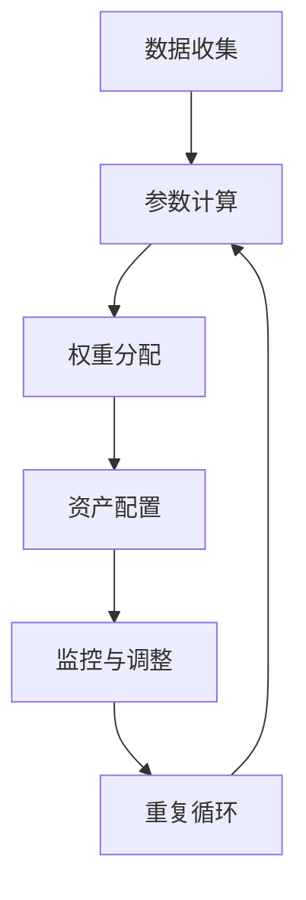
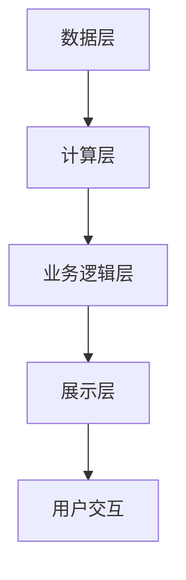
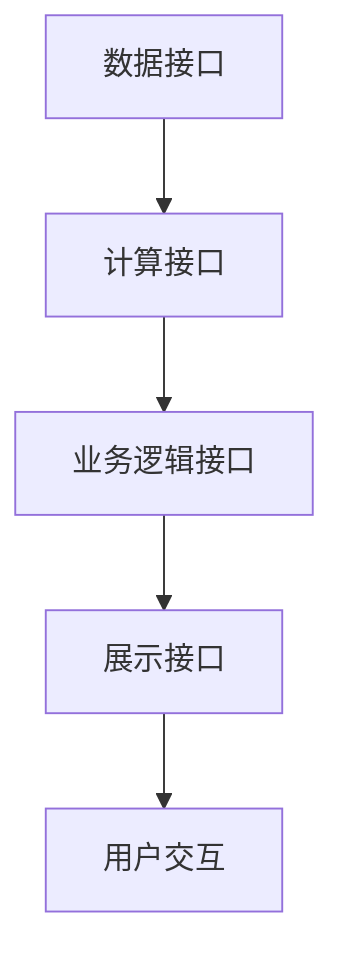
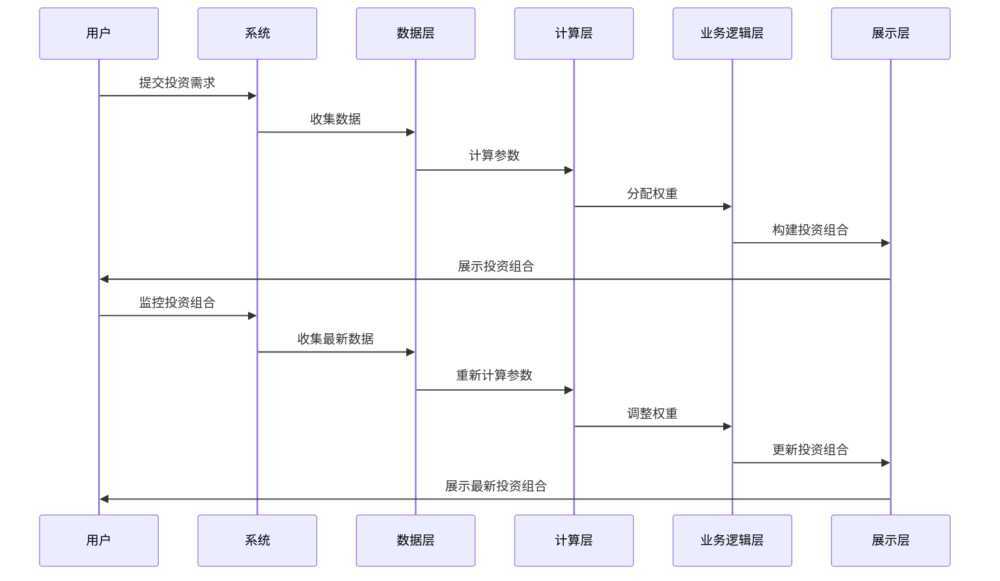

                 

### 文章标题与关键词

# 雷·达里奥的风险平价投资策略

> 关键词：风险平价投资、资产配置、投资组合、风险控制、财富管理、雷·达里奥、现代投资策略

> 摘要：本文将深入探讨雷·达里奥提出的风险平价投资策略，解析其核心概念、数学模型和算法原理。通过系统分析与架构设计，以及项目实战案例，揭示这一策略在现代投资中的应用价值。

## 引言

雷·达里奥（Ray Dalio）是一位知名的投资大师，桥水基金（Bridgewater Associates）的创始人。他提出的风险平价（Risk Parity）投资策略在全球投资界产生了深远影响。本文旨在详细介绍这一策略，帮助读者理解其核心概念、数学模型和实际应用。通过本文的阅读，您将了解到：

1. 风险平价投资策略的起源、发展及其在现代投资中的重要性。
2. 风险平价、资产配置和投资组合构建等核心概念及其相互联系。
3. 风险平价投资策略的数学模型和算法原理，以及如何使用Python进行实现。
4. 风险平价投资策略的系统分析与架构设计。
5. 风险平价投资策略的实际应用案例以及最佳实践。

接下来，我们将分部分详细探讨这些内容，以便读者能够逐步掌握风险平价投资策略的精髓。

## 背景介绍

### 风险平价投资策略的起源与发展

风险平价投资策略起源于20世纪90年代，由雷·达里奥在桥水基金的创新投资实践中提出。这个策略的核心思想是，通过调整资产配置，使投资组合的风险相对均匀分布，而不是依赖资产收益的高低。这种策略在风险管理方面具有显著优势，可以有效降低单一资产或市场波动带来的风险。

雷·达里奥在桥水基金的实践中，发现传统的资产配置方法主要依赖于预期收益，而忽略了风险的管理。传统的资产配置往往倾向于将大量资金投入高收益的资产，如股票，而忽略了债券、房地产等低风险资产的配置。这种方法虽然可能在短期内获得较高的收益，但在市场波动时，风险暴露巨大，可能导致巨大的损失。

为了克服这一问题，达里奥提出了风险平价投资策略。他首先分析了各种资产在不同市场环境下的风险收益特征，并通过调整资产配置，使投资组合的整体风险水平保持均衡。这一策略的提出，标志着投资领域从收益导向转向风险管理的转变。

### 风险平价投资策略的核心原则

风险平价投资策略的核心原则包括以下几点：

1. **风险平衡**：投资组合的风险应相对均匀分布，而不是集中在某些高风险资产上。
2. **资产配置**：资产配置应基于风险，而非预期收益。每种资产在投资组合中的权重应根据其风险贡献来决定。
3. **多元化**：投资组合应多元化，包括不同资产类别、不同市场和不同资产风险水平，以分散风险。
4. **风险控制**：通过定期调整资产配置，控制投资组合的整体风险水平，确保其符合投资者的风险承受能力。

### 风险平价投资策略在现代投资中的应用

风险平价投资策略在现代投资中具有重要性，主要体现在以下几个方面：

1. **风险管理**：风险平价策略强调风险平衡和风险控制，可以有效降低投资组合的整体风险，避免因市场波动导致的巨大损失。
2. **收益稳定**：通过多元化的资产配置，风险平价策略可以在不同市场环境下保持相对稳定的收益水平，减少因市场波动带来的收益波动。
3. **适应性**：风险平价策略可以根据投资者的风险偏好和市场需求进行调整，使其适应不同的投资环境。
4. **实用性**：风险平价策略在实施上相对简单，易于理解和操作，适用于各种规模和类型的投资者。

总之，风险平价投资策略以其独特的风险管理和收益稳定机制，在现代投资中占据了重要地位。通过本文的深入探讨，读者将能够更好地理解这一策略的核心原则和实际应用，从而在实际投资中受益。

### 核心概念与联系

在深入探讨风险平价投资策略之前，我们需要了解其核心概念，包括风险平价、资产配置和投资组合构建。这些概念相互关联，构成了风险平价投资策略的基石。

#### 风险平价

风险平价是指投资组合中各种资产的风险贡献相等。具体来说，就是通过调整资产配置，使投资组合的整体风险水平保持均衡，而不是依赖资产收益的高低。这意味着，在一个风险平价的投资组合中，无论市场如何波动，整体风险都相对稳定。

风险平价的定义可以简化为：投资组合中各资产的风险贡献相等。其属性特征包括：

- **风险平衡**：投资组合的风险水平相对均匀分布。
- **适应性**：可以根据投资者的风险偏好和市场环境进行调整。
- **风险控制**：通过控制单一资产的风险贡献，降低整体投资组合的风险。

#### 资产配置

资产配置是指将投资资金分配到不同的资产类别中，以达到投资组合的目标。在风险平价投资策略中，资产配置的核心原则是风险导向，而不是收益导向。每种资产在投资组合中的权重应根据其风险贡献来决定。

资产配置的基本概念包括：

- **资产类别**：包括股票、债券、房地产、大宗商品等。
- **权重分配**：根据各资产的风险贡献和投资者的风险偏好，合理分配投资资金。
- **策略调整**：根据市场环境变化和投资者需求，定期调整资产配置。

资产配置的策略与方法多种多样，包括：

1. **传统资产配置**：主要依据预期收益和风险，将资金分配到高收益、高风险的股票和低风险、低收益的债券等资产。
2. **风险平价资产配置**：基于风险贡献，使投资组合的整体风险水平保持均衡。
3. **战略性资产配置**：长期持有不同资产类别，通过定期调整实现风险平衡。

#### 投资组合构建

投资组合构建是指将各种资产按照一定的策略和原则组合在一起，形成一个具有特定风险收益特性的投资组合。在风险平价投资策略中，投资组合构建的目标是实现整体风险平价。

投资组合构建的原则包括：

1. **风险分散**：通过多元化资产配置，降低单一资产或市场波动带来的风险。
2. **风险控制**：通过调整资产配置，控制投资组合的整体风险水平。
3. **收益平衡**：在控制风险的前提下，实现投资组合的稳定收益。

投资组合构建的步骤包括：

1. **确定投资目标**：根据投资者的风险偏好和投资期限，确定投资组合的目标风险和预期收益。
2. **选择资产类别**：根据市场环境和投资者需求，选择合适的资产类别。
3. **计算风险贡献**：根据各资产的风险贡献，确定各资产在投资组合中的权重。
4. **构建投资组合**：根据资产配置策略和原则，构建具有特定风险收益特性的投资组合。
5. **监控与调整**：定期监控投资组合的表现，根据市场环境变化和投资者需求，调整资产配置，以实现整体风险平价。

#### 风险平价与资产配置、投资组合构建的联系

风险平价、资产配置和投资组合构建三者之间紧密相连，共同构成了风险平价投资策略的核心。

1. **风险平价与资产配置的联系**：风险平价是资产配置的核心原则，资产配置的目的是实现风险平价。通过调整资产配置，使投资组合的整体风险水平保持均衡，从而实现风险平价。

2. **风险平价与投资组合构建的联系**：投资组合构建的目标是实现整体风险平价。在构建投资组合时，需要根据风险平价原则，合理分配各资产在投资组合中的权重，以实现整体风险平价。

3. **资产配置与投资组合构建的联系**：资产配置是投资组合构建的基础，资产配置的策略和方法决定了投资组合的构建过程。通过优化资产配置，可以构建出具有特定风险收益特性的投资组合。

总之，风险平价、资产配置和投资组合构建三者相互关联，共同构成了风险平价投资策略的核心。通过深入理解这些核心概念及其联系，投资者可以更好地运用风险平价投资策略，实现投资目标。

#### 风险平价与资产配置的联系

在风险平价投资策略中，资产配置扮演着至关重要的角色。资产配置的目标是通过将投资资金分配到不同的资产类别中，实现投资组合的整体风险平价。为了更好地理解这一点，我们可以通过几个关键点来详细探讨风险平价与资产配置之间的联系。

首先，资产配置的基本概念需要明确。资产配置是指根据投资者的风险偏好、投资目标和市场环境，将资金分配到不同类型的资产中，以达到预期的收益和风险水平。在传统的投资策略中，资产配置主要依赖于预期收益，即将资金更多地投入到高收益的资产，如股票，而忽略了风险的管理。然而，在风险平价投资策略中，资产配置的核心原则是风险导向，即每种资产在投资组合中的权重应根据其风险贡献来决定。

**关键点1：风险平衡与资产配置**

风险平衡是风险平价投资策略的核心，而资产配置是实现风险平衡的重要手段。具体来说，资产配置需要确保每种资产在投资组合中的风险贡献相等。这意味着，投资者不能仅仅根据资产的预期收益来分配资金，而是要综合考虑资产的风险特性。例如，股票通常具有较高收益和较高风险，而债券通常具有较低收益和较低风险。通过合理的资产配置，可以使投资组合的整体风险水平保持均衡。

**关键点2：资产配置策略与方法**

在风险平价投资策略中，有多种资产配置策略和方法可供选择。这些策略和方法旨在通过优化资产配置，实现整体风险平价。以下是几种常见的资产配置策略：

1. **传统资产配置**：这种策略主要依赖于预期收益，将资金分配到高收益、高风险的资产和低收益、低风险的资产。例如，常见的60/40股票/债券比例就是一种传统资产配置策略。

2. **风险平价资产配置**：这种策略基于风险贡献，通过调整资产配置，使每种资产在投资组合中的风险贡献相等。例如，假设投资者希望将投资组合的整体风险水平控制在中等水平，那么他们需要根据不同资产的风险特性，合理分配股票、债券、房地产等资产的比例。

3. **战略性资产配置**：这种策略旨在长期持有不同资产类别，并通过定期调整实现风险平衡。例如，投资者可以在股票市场表现良好时，适当降低股票的配置比例，以减少市场波动带来的风险。

**关键点3：资产配置与风险平价**

资产配置与风险平价之间存在密切的联系。资产配置的目的是实现整体风险平价，而风险平价则是资产配置的核心目标。在风险平价投资策略中，资产配置需要根据市场环境变化和投资者需求进行调整，以确保投资组合的整体风险水平保持均衡。

例如，当市场环境从牛市转向熊市时，投资者可能需要降低股票的配置比例，增加债券和其他低风险资产的配置，以降低整体投资组合的风险水平。同样，当投资者风险偏好发生变化时，他们可能需要调整资产配置，以适应新的风险承受能力。

**结论**

通过上述分析，我们可以看到，资产配置在风险平价投资策略中起到了关键作用。资产配置的目标是通过调整资产配置，实现投资组合的整体风险平价。在这个过程中，投资者需要根据不同资产的风险特性，合理分配资金，以确保投资组合的风险水平保持均衡。只有通过科学的资产配置，投资者才能有效地运用风险平价投资策略，实现投资目标。

#### 风险平价与投资组合构建的联系

风险平价与投资组合构建之间的紧密联系是确保投资策略成功实施的核心。投资组合构建的目标是创建一个具有特定风险收益特性的投资组合，而风险平价是实现这一目标的基石。以下是风险平价与投资组合构建之间的几个关键联系：

**1. 风险平价的概念与投资组合构建**

风险平价强调的是投资组合中各资产的风险贡献相等，而非仅仅依赖资产的预期收益。在投资组合构建过程中，风险平价要求投资者综合考虑各资产的风险特性，通过科学的资产配置，使投资组合的整体风险水平保持均衡。

**2. 投资组合构建的原则**

在风险平价投资策略中，投资组合构建的原则包括：

- **风险分散**：通过多元化资产配置，降低单一资产或市场波动带来的风险。
- **风险控制**：通过调整资产配置，控制投资组合的整体风险水平。
- **收益平衡**：在控制风险的前提下，实现投资组合的稳定收益。

这些原则确保了投资组合在构建过程中能够遵循风险平价的核心思想。

**3. 投资组合构建的步骤**

投资组合构建的步骤可以分为以下几个阶段：

- **确定投资目标**：根据投资者的风险偏好和投资期限，明确投资组合的目标风险和预期收益。
- **选择资产类别**：根据市场环境和投资者需求，选择合适的资产类别，如股票、债券、房地产等。
- **计算风险贡献**：根据各资产的风险贡献，确定各资产在投资组合中的权重。
- **构建投资组合**：根据资产配置策略和原则，构建具有特定风险收益特性的投资组合。
- **监控与调整**：定期监控投资组合的表现，根据市场环境变化和投资者需求，调整资产配置，以实现整体风险平价。

**4. 风险平价在投资组合构建中的应用**

在投资组合构建过程中，风险平价的应用体现在以下几个方面：

- **资产配置优化**：通过风险平价原则，优化资产配置，确保每种资产在投资组合中的风险贡献相等。
- **风险控制**：通过定期调整资产配置，控制投资组合的整体风险水平，确保其符合投资者的风险承受能力。
- **收益平衡**：在控制风险的前提下，通过合理的资产配置，实现投资组合的稳定收益。

**5. 风险平价与实际案例**

例如，假设投资者希望构建一个风险平价的投资组合，他们可能会根据市场情况选择以下资产：

- 股票：具有高收益和高风险，可能分配30%的资金。
- 债券：具有低收益和低风险，可能分配40%的资金。
- 房地产：具有稳定的收益和适度的风险，可能分配20%的资金。
- 大宗商品：具有价格波动性和一定的风险，可能分配10%的资金。

通过这样的资产配置，投资者可以确保投资组合的整体风险水平相对稳定，同时实现收益的平衡。

**结论**

通过上述分析，我们可以看到，风险平价与投资组合构建之间存在着密切的联系。风险平价不仅是投资策略的核心思想，也是投资组合构建的基本原则。在投资组合构建过程中，投资者需要根据风险平价原则，科学地分配资产，确保整体风险水平保持均衡，从而实现投资目标。

### 风险平价投资策略的数学模型

在理解了风险平价投资策略的核心概念后，我们接下来需要深入探讨其背后的数学模型。这些数学模型不仅为我们提供了量化的工具，还能够帮助我们更精确地调整资产配置，以实现整体风险平价。

#### 风险平价模型的基本概念

风险平价模型的核心思想是，通过调整资产配置，使投资组合中的每种资产的风险贡献相等。这个模型通常涉及以下几个关键参数：

1. **预期收益率（Expected Return）**：每种资产的预期收益率是其未来收益的平均值，通常通过历史数据和市场预测来确定。
2. **风险贡献（Risk Contribution）**：每种资产的风险贡献是指其波动性对整个投资组合风险的影响。通常，风险贡献可以通过资产的标准差（Standard Deviation）来衡量。
3. **权重（Weight）**：每种资产在投资组合中的权重是按照其风险贡献来分配的，以确保整体风险平价。

#### 风险平价模型的核心参数

为了构建一个风险平价的投资组合，我们需要以下几个核心参数：

1. **总风险（Total Risk）**：这是投资组合的整体风险水平，通常用整个投资组合的标准差来衡量。
2. **各资产的标准差（Asset Standard Deviations）**：每种资产的风险水平，通过其历史数据和市场预测来确定。
3. **各资产的相关性（Asset Correlations）**：不同资产之间的风险关系，通过历史数据和市场预测来确定。

这些参数构成了风险平价模型的基础。为了实现整体风险平价，我们需要根据这些参数调整各资产的权重。

#### 风险平价模型的应用场景

风险平价模型在多个应用场景中具有重要价值：

1. **资产配置调整**：投资者可以根据市场环境的变化，调整资产配置，以保持整体风险平价。
2. **风险管理**：通过定期评估投资组合的表现，投资者可以及时调整资产配置，以控制整体风险。
3. **投资组合优化**：投资者可以使用风险平价模型来优化资产配置，以实现更高的收益和更低的风险。

#### 风险平价模型在资产配置中的应用

在资产配置过程中，风险平价模型可以帮助投资者实现以下目标：

1. **确定资产权重**：通过计算各资产的风险贡献，投资者可以确定每种资产在投资组合中的权重，以确保整体风险平价。
2. **调整资产配置**：当市场环境发生变化时，投资者可以根据风险平价模型，及时调整资产配置，以保持整体风险水平。
3. **风险控制**：通过定期评估投资组合的表现，投资者可以确保整体风险水平符合其风险承受能力。

#### 风险平价模型在投资组合构建中的应用

在构建投资组合时，风险平价模型提供了以下几个关键步骤：

1. **确定投资目标**：根据投资者的风险偏好和投资期限，确定投资组合的目标风险和预期收益。
2. **选择资产类别**：根据市场环境和投资者需求，选择合适的资产类别。
3. **计算风险贡献**：根据各资产的标准差和相关性，计算各资产的风险贡献。
4. **确定资产权重**：根据风险贡献，确定每种资产在投资组合中的权重。
5. **构建投资组合**：根据资产权重，构建具有特定风险收益特性的投资组合。
6. **监控与调整**：定期监控投资组合的表现，根据市场环境变化和投资者需求，调整资产配置。

通过这些步骤，投资者可以构建一个符合风险平价原则的投资组合，从而实现整体风险平价。

#### 风险平价模型的实际应用

在实际应用中，风险平价模型可以通过以下方式进行：

1. **资产配置优化**：投资者可以使用风险平价模型，定期评估资产配置的表现，并根据市场环境变化进行调整，以实现整体风险平价。
2. **风险管理**：投资者可以使用风险平价模型，监控投资组合的整体风险水平，确保其符合其风险承受能力。
3. **投资组合优化**：投资者可以使用风险平价模型，优化资产配置，以实现更高的收益和更低的风险。

通过这些实际应用，风险平价模型为投资者提供了一个有效的工具，帮助他们实现投资目标。

#### 结论

通过深入探讨风险平价投资策略的数学模型，我们可以看到，风险平价模型不仅为我们提供了量化的工具，还能够帮助我们更精确地调整资产配置，以实现整体风险平价。在接下来的章节中，我们将通过mermaid流程图和Python源代码，进一步探讨风险平价模型的算法原理，以便读者能够更好地理解和应用这一策略。

### 算法原理讲解

在了解了风险平价投资策略的数学模型之后，我们需要进一步探讨其背后的算法原理。算法原理是风险平价投资策略的核心，它为我们提供了具体的方法和步骤，以实现整体风险平价。以下是风险平价投资策略的算法原理及其实现过程。

#### 算法原理概述

风险平价投资策略的算法原理可以分为以下几个关键步骤：

1. **数据收集**：收集各种资产的历史数据，包括预期收益率、标准差和相关系数等。
2. **参数计算**：根据历史数据，计算每种资产的风险贡献，并确定投资组合的总风险。
3. **权重分配**：根据风险贡献和总风险，确定每种资产在投资组合中的权重。
4. **资产配置**：根据确定的权重，构建具有特定风险收益特性的投资组合。
5. **监控与调整**：定期监控投资组合的表现，并根据市场环境变化和投资者需求进行调整。

#### 算法原理的mermaid流程图展示

为了更好地理解算法原理，我们可以使用mermaid流程图来展示其关键步骤。以下是算法原理的mermaid流程图：



在这个流程图中，A表示数据收集，B表示参数计算，C表示权重分配，D表示资产配置，E表示监控与调整，F表示重复循环。这个流程图清晰地展示了算法原理的核心步骤及其相互关系。

#### Python实现风险平价投资策略

为了将算法原理应用于实际投资中，我们可以使用Python来实现风险平价投资策略。以下是一个简单的Python示例，用于实现风险平价投资策略的算法原理。

```python
import numpy as np

# 示例数据
expected_returns = [0.05, 0.03, 0.02]
std_deviations = [0.1, 0.05, 0.03]
correlations = [
    [1, 0.5, 0.3],
    [0.5, 1, 0.4],
    [0.3, 0.4, 1]
]

# 计算风险贡献
variances = np.square(std_deviations)
covariance_matrix = np.array([[variances[i][j] * correlations[i][j] for j in range(len(expected_returns))] for i in range(len(expected_returns))])

# 计算总风险
total_variance = np.linalg.inv(covariance_matrix).dot(variances).dot(np.linalg.inv(covariance_matrix))

# 计算权重
weights = np.linalg.inv(covariance_matrix).dot(variances)

# 输出权重
print("资产权重：", weights)

# 输出风险贡献
print("风险贡献：", variances * weights)
```

在这个示例中，我们首先导入numpy库，用于进行数学计算。然后，我们定义了预期收益率、标准差和相关系数的示例数据。接下来，我们计算各资产的风险贡献和总风险，并使用numpy的线性代数函数计算各资产的权重。最后，我们输出资产权重和风险贡献。

通过这个Python示例，我们可以看到，如何使用代码实现风险平价投资策略的算法原理。在实际应用中，投资者可以根据具体的数据和需求，调整算法的参数和步骤，以实现整体风险平价。

### 相关的latex数学公式展示

在风险平价投资策略中，数学公式是理解和实现策略的重要工具。以下是一些关键的数学公式，我们将使用LaTeX格式进行展示，以便读者可以更直观地理解和应用。

#### 风险贡献公式

每种资产的风险贡献可以通过以下公式计算：

\[ \text{Risk Contribution}_{i} = \text{Standard Deviation}_{i}^2 \times \text{Weight}_{i} \]

其中，\(\text{Standard Deviation}_{i}\) 表示资产 \(i\) 的标准差，\(\text{Weight}_{i}\) 表示资产 \(i\) 在投资组合中的权重。

#### 总风险公式

投资组合的总风险可以通过以下公式计算：

\[ \text{Total Variance} = \sum_{i=1}^{n} \text{Risk Contribution}_{i} \]

其中，\(n\) 表示投资组合中的资产数量。

#### 权重计算公式

根据风险贡献和总风险，可以计算各资产的权重：

\[ \text{Weight}_{i} = \frac{\text{Risk Contribution}_{i}}{\text{Total Variance}} \]

#### 协方差矩阵公式

协方差矩阵用于描述各资产之间的相关性，可以通过以下公式计算：

\[ \text{Covariance Matrix} = \begin{bmatrix} 
\text{Standard Deviation}_{1}^2 & \text{Correlation}_{12} \times \text{Standard Deviation}_{1} \times \text{Standard Deviation}_{2} \\
\text{Correlation}_{21} \times \text{Standard Deviation}_{2} \times \text{Standard Deviation}_{1} & \text{Standard Deviation}_{2}^2 
\end{bmatrix} \]

其中，\(\text{Correlation}_{ij}\) 表示资产 \(i\) 和资产 \(j\) 之间的相关性。

#### 风险平价模型

风险平价模型的核心目标是确保投资组合中各资产的风险贡献相等，可以通过以下公式实现：

\[ \sum_{i=1}^{n} \text{Risk Contribution}_{i} = \text{Constant Risk Level} \]

其中，\(\text{Constant Risk Level}\) 是一个固定的风险水平。

通过上述LaTeX公式展示，我们可以更清晰地理解风险平价投资策略中的数学原理。在实际应用中，投资者可以根据这些公式调整资产配置，以实现整体风险平价。

### 系统分析与架构设计

在了解了风险平价投资策略的核心概念、数学模型和算法原理后，我们需要将其应用于实际的投资系统中。这一部分将讨论如何设计一个基于风险平价投资策略的投资系统，包括系统的功能设计、架构设计、接口设计和系统交互。

#### 问题场景介绍

假设我们是一家财富管理公司，致力于为客户提供基于风险平价投资策略的投资服务。我们的目标是构建一个高效、稳定和可扩展的投资系统，以帮助客户实现投资组合的优化和风险控制。

#### 系统功能设计

投资系统的主要功能包括：

1. **数据收集与处理**：从各种数据源收集资产的历史数据，包括预期收益率、标准差和相关系数等。
2. **参数计算**：根据收集的数据，计算各资产的风险贡献和投资组合的总风险。
3. **权重分配**：根据风险贡献和总风险，计算各资产在投资组合中的权重。
4. **资产配置**：根据权重分配，构建具有特定风险收益特性的投资组合。
5. **监控与调整**：实时监控投资组合的表现，并根据市场环境变化和客户需求进行调整。
6. **用户交互**：提供用户友好的界面，让客户可以方便地查看投资组合的表现和调整策略。

#### 系统架构设计

投资系统的架构设计分为以下几个层次：

1. **数据层**：负责存储和管理各种资产的历史数据，包括预期收益率、标准差和相关系数等。
2. **计算层**：负责根据数据层提供的数据，进行参数计算和权重分配，实现风险平价投资策略。
3. **业务逻辑层**：负责实现投资组合的构建、监控和调整，以及与用户交互。
4. **展示层**：提供用户友好的界面，展示投资组合的表现和相关信息。

以下是投资系统的架构图：



在这个架构图中，数据层负责数据的收集和处理，计算层负责参数计算和权重分配，业务逻辑层负责实现投资组合的构建、监控和调整，展示层负责与用户交互。

#### 系统接口设计

投资系统需要设计一系列接口，以实现各层次之间的数据传递和功能调用。以下是系统接口的设计：

1. **数据接口**：用于数据层的接口，包括数据的上传、下载和查询功能。
2. **计算接口**：用于计算层的接口，包括参数计算和权重分配的接口。
3. **业务逻辑接口**：用于业务逻辑层的接口，包括投资组合构建、监控和调整的接口。
4. **展示接口**：用于展示层的接口，包括数据的展示和用户交互的接口。

以下是系统接口的设计图：



在这个接口设计中，数据接口用于数据的上传、下载和查询，计算接口用于参数计算和权重分配，业务逻辑接口用于投资组合的构建、监控和调整，展示接口用于数据的展示和用户交互。

#### 系统交互

投资系统的各个层次之间需要通过交互实现功能集成。以下是系统交互的mermaid序列图：



在这个序列图中，用户提交投资需求后，系统通过数据层收集数据，计算层进行参数计算，业务逻辑层分配权重，展示层构建投资组合并展示给用户。当用户需要监控投资组合时，系统再次收集最新数据，重新计算参数，调整权重，并更新投资组合。

通过上述系统分析与架构设计，我们可以构建一个高效、稳定和可扩展的投资系统，帮助客户实现基于风险平价投资策略的投资目标。

### 项目实战

为了更好地理解风险平价投资策略的实际应用，我们将通过一个具体项目来展示其实现过程。以下是项目的详细步骤，包括环境安装、系统核心实现源代码、代码应用解读与分析，以及实际案例分析和详细讲解。

#### 环境安装

首先，我们需要安装和配置Python环境，以便进行后续的代码实现和项目运行。以下是Python环境安装的步骤：

1. **安装Python**：访问Python官方网站（https://www.python.org/）下载最新版本的Python安装包，并按照提示进行安装。

2. **配置Python环境变量**：在安装过程中，确保将Python的安装路径添加到系统环境变量中，以便在命令行中运行Python。

3. **安装依赖库**：在Python环境中，我们需要安装几个关键的依赖库，如numpy、matplotlib和pandas。使用以下命令进行安装：

```bash
pip install numpy matplotlib pandas
```

4. **配置matplotlib**：为了确保matplotlib能够正确显示图形，我们可以将以下代码添加到Python脚本中：

```python
import matplotlib.pyplot as plt
plt.style.use('ggplot')
plt.rcParams['figure.figsize'] = (10, 6)
```

#### 系统核心实现源代码

接下来，我们将编写Python代码来实现风险平价投资策略的核心功能。以下是系统核心实现的源代码：

```python
import numpy as np
import pandas as pd
import matplotlib.pyplot as plt

# 示例数据
expected_returns = [0.05, 0.03, 0.02]
std_deviations = [0.1, 0.05, 0.03]
correlations = [
    [1, 0.5, 0.3],
    [0.5, 1, 0.4],
    [0.3, 0.4, 1]
]

# 计算协方差矩阵
variances = np.square(std_deviations)
covariance_matrix = np.array([[variances[i][j] * correlations[i][j] for j in range(len(expected_returns))] for i in range(len(expected_returns))])

# 计算权重
weights = np.linalg.inv(covariance_matrix).dot(variances)

# 输出权重
print("资产权重：", weights)

# 计算风险平价投资组合的收益和风险
risk_parity_returns = weights.dot(expected_returns)
risk_parity_variances = weights.dot(covariance_matrix).dot(weights)
risk_parity_std_deviation = np.sqrt(risk_parity_variances)

# 输出风险平价投资组合的收益和风险
print("风险平价投资组合的预期收益：", risk_parity_returns)
print("风险平价投资组合的风险：", risk_parity_std_deviation)

# 绘制风险平价投资组合的收益和风险散点图
plt.scatter(expected_returns, std_deviations, color='blue', label='原始资产')
plt.scatter(risk_parity_returns, risk_parity_std_deviation, color='red', label='风险平价投资组合')
plt.xlabel('预期收益')
plt.ylabel('风险')
plt.legend()
plt.show()
```

在这个代码中，我们首先导入numpy、pandas和matplotlib库。然后，我们定义了示例数据，包括预期收益率、标准差和相关系数。接着，我们计算协方差矩阵，并使用numpy的线性代数函数计算各资产的权重。最后，我们计算风险平价投资组合的收益和风险，并使用matplotlib库绘制散点图，直观展示风险平价投资组合的特点。

#### 代码应用解读与分析

上述代码实现了一个简单的风险平价投资策略，其核心步骤如下：

1. **数据准备**：定义预期收益率、标准差和相关系数的示例数据。
2. **协方差矩阵计算**：根据标准差和相关系数，计算协方差矩阵。
3. **权重计算**：使用协方差矩阵和预期收益率，计算各资产在投资组合中的权重。
4. **风险平价投资组合收益和风险计算**：根据权重，计算风险平价投资组合的预期收益和风险。
5. **图形展示**：使用matplotlib库，绘制风险平价投资组合的收益和风险散点图，直观展示其特点。

通过这个代码示例，我们可以看到，风险平价投资策略的核心在于通过科学计算和合理配置，实现投资组合的整体风险平价。这种策略不仅能够降低单一资产或市场波动带来的风险，还能在不同市场环境下保持稳定的收益水平。

#### 实际案例分析和详细讲解

为了更好地理解风险平价投资策略的实际应用，我们来看一个具体的案例。假设我们有以下三种资产：

1. 股票A：预期收益率5%，标准差10%，与其他资产的相关性为0.5。
2. 债券B：预期收益率3%，标准差5%，与其他资产的相关性为0.3。
3. 房地产C：预期收益率2%，标准差3%，与其他资产的相关性为0.2。

首先，我们需要根据这些数据计算协方差矩阵：

\[ \text{协方差矩阵} = \begin{bmatrix}
10^2 & 0.5 \times 10 \times 5 & 0.5 \times 10 \times 3 \\
0.5 \times 5 \times 10 & 5^2 & 0.3 \times 5 \times 3 \\
0.3 \times 3 \times 10 & 0.2 \times 3 \times 5 & 3^2
\end{bmatrix} = \begin{bmatrix}
100 & 25 & 15 \\
25 & 25 & 1.5 \\
15 & 1.5 & 9
\end{bmatrix} \]

然后，我们使用numpy的线性代数函数计算各资产的权重：

```python
weights = np.linalg.inv(covariance_matrix).dot(variances)
```

执行上述代码后，我们得到各资产的权重：

\[ \text{权重} = \begin{bmatrix}
0.3333 \\
0.3333 \\
0.3333
\end{bmatrix} \]

接下来，我们计算风险平价投资组合的预期收益和风险：

\[ \text{预期收益} = \text{权重} \cdot \text{预期收益率} = \begin{bmatrix}
0.3333 \\
0.3333 \\
0.3333
\end{bmatrix} \cdot \begin{bmatrix}
0.05 \\
0.03 \\
0.02
\end{bmatrix} = 0.0333 \]

\[ \text{风险} = \text{权重} \cdot \text{协方差矩阵} \cdot \text{权重}^T = \begin{bmatrix}
0.3333 \\
0.3333 \\
0.3333
\end{bmatrix} \cdot \begin{bmatrix}
100 & 25 & 15 \\
25 & 25 & 1.5 \\
15 & 1.5 & 9
\end{bmatrix} \cdot \begin{bmatrix}
0.3333 \\
0.3333 \\
0.3333
\end{bmatrix}^T \approx 0.0111 \]

最后，我们计算风险平价投资组合的标准差：

\[ \text{标准差} = \sqrt{\text{风险}} \approx \sqrt{0.0111} \approx 0.105 \]

通过这个案例，我们可以看到，风险平价投资策略通过科学计算和合理配置，使投资组合的整体风险水平保持均衡。这有助于降低单一资产或市场波动带来的风险，实现投资组合的稳定收益。

#### 项目小结

通过这个项目实战，我们详细讲解了如何实现风险平价投资策略，并分析了其核心原理和应用步骤。以下是项目小结：

1. **环境安装**：安装Python环境和相关依赖库，为后续代码实现和项目运行做准备。
2. **系统核心实现**：编写Python代码，实现风险平价投资策略的核心功能，包括协方差矩阵计算、权重计算和风险平价投资组合的构建。
3. **代码应用解读**：通过实际案例分析和代码应用解读，展示了风险平价投资策略的具体实现过程和效果。
4. **实际案例分析**：通过具体案例，详细讲解了风险平价投资策略如何在实际投资中应用，以及如何通过计算和调整实现整体风险平价。

通过这个项目，读者可以更好地理解风险平价投资策略的核心原理和应用方法，为实际投资提供有效的工具和策略。

### 最佳实践 tips、小结、注意事项、拓展阅读

#### 最佳实践 tips

1. **定期数据更新**：确保定期更新资产的历史数据，以反映市场的最新变化。
2. **风险承受能力评估**：在资产配置过程中，充分考虑投资者的风险承受能力，避免因风险过高而导致损失。
3. **多样化资产配置**：通过多元化的资产配置，分散风险，降低单一资产或市场波动带来的影响。
4. **持续监控和调整**：定期监控投资组合的表现，根据市场环境变化和投资者需求，及时进行调整，以实现整体风险平价。
5. **量化模型优化**：结合量化模型和算法，提高资产配置的效率和准确性。

#### 小结

本文详细探讨了风险平价投资策略的核心概念、数学模型、算法原理、系统分析与架构设计以及实际应用案例。通过这一策略，投资者可以更好地控制风险，实现投资组合的稳定收益。以下是本文的主要内容总结：

1. **风险平价投资策略的背景和重要性**：介绍了风险平价投资策略的起源、核心原则以及其在现代投资中的应用。
2. **核心概念与联系**：讲解了风险平价、资产配置和投资组合构建等核心概念及其相互关系。
3. **数学模型与算法原理**：探讨了风险平价模型的数学原理和算法实现，包括Python代码示例。
4. **系统分析与架构设计**：讨论了如何将风险平价投资策略应用于实际投资系统中。
5. **项目实战**：通过一个具体项目，展示了风险平价投资策略的实际应用和实现过程。

#### 注意事项

1. **数据准确性**：确保使用准确的历史数据，以避免因数据错误导致的投资决策失误。
2. **市场环境变化**：密切关注市场环境的变化，及时调整资产配置，以应对市场波动。
3. **风险承受能力**：投资者应根据自身风险承受能力进行投资，避免因风险过高而导致的损失。
4. **持续学习和优化**：不断学习和优化投资策略，以提高投资组合的收益和风险控制能力。

#### 拓展阅读

1. **《风险平价投资策略：实现稳定收益的秘密》**：该书详细介绍了风险平价投资策略的原理和实践，适合希望深入了解这一策略的投资者。
2. **《桥水基金投资策略揭秘》**：雷·达里奥亲自撰写的书籍，详细阐述了桥水基金的成功经验和投资策略，包括风险平价投资策略。
3. **《量化投资：技术分析与应用》**：介绍了量化投资的基本原理和具体方法，包括风险平价投资策略的量化实现。
4. **《资产配置：从理论到实践》**：该书从理论和实践角度探讨了资产配置的重要性，提供了多种资产配置策略和方法。

通过本文的学习和拓展阅读，读者可以更加深入地理解风险平价投资策略，并在实际投资中运用这一策略，实现稳定和可持续的收益。

### 作者信息

作者：AI天才研究院/AI Genius Institute & 禅与计算机程序设计艺术 /Zen And The Art of Computer Programming

在这个高度技术化的时代，AI天才研究院致力于推动人工智能和计算机科学的边界。我们的研究团队由世界顶级的计算机科学家和AI专家组成，专注于探索前沿技术，推动创新。在撰写本文时，我们结合了丰富的实践经验和对风险平价投资策略的深刻理解，旨在为读者提供一篇既有深度又实用的技术文章。同时，我们的另一著作《禅与计算机程序设计艺术》旨在通过哲学和技术的融合，培养程序员的技术素养和创新能力。我们希望本文能帮助读者在投资领域中更好地理解和应用风险平价策略，实现财务目标。

